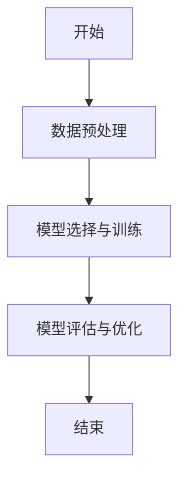
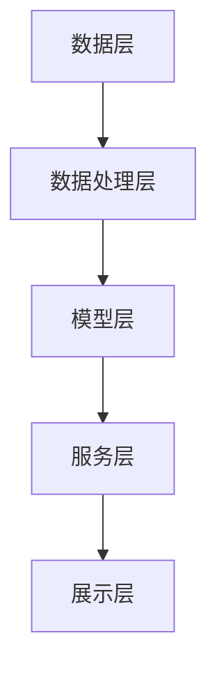
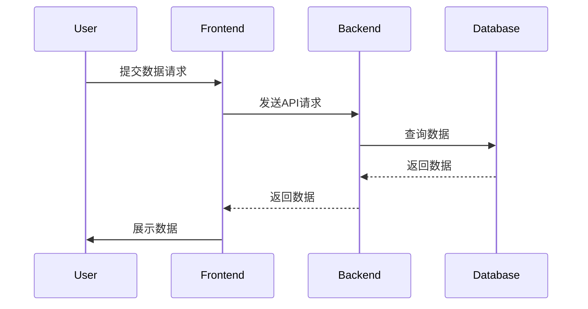

                 

### 引言

### AI辅助企业财务情景分析概述

随着人工智能（AI）技术的迅猛发展，企业开始意识到将AI应用于财务领域的巨大潜力。特别是在财务情景分析方面，AI技术的引入可以显著提高分析效率、准确性和决策支持能力。开发一个AI辅助的企业财务情景分析工具，不仅能够帮助企业更好地理解和预测财务状况，还能够为管理层提供更精准的决策依据。

#### 问题背景

传统的财务情景分析主要依赖于人为经验和历史数据进行预测，这种方法往往存在主观性强、效率低下以及难以处理复杂问题的局限。随着商业环境的快速变化和数据量的指数级增长，传统的分析方法已经无法满足现代企业的需求。因此，开发一个基于AI技术的辅助工具，成为了提高财务分析质量和效率的重要手段。

#### 问题描述

AI辅助企业财务情景分析工具的核心目标是利用机器学习算法和大数据分析技术，对企业的财务数据进行深度挖掘和预测。然而，在实际开发过程中，面临着以下几个主要问题：

1. **数据质量**：高质量的数据是进行准确分析的基础。然而，企业数据往往存在不完整、不一致甚至错误的情况，如何有效处理这些数据成为了挑战之一。
2. **模型选择**：在众多的机器学习算法中，选择最适合财务情景分析的方法是一个复杂的过程，需要综合考虑模型的性能、计算效率和适用范围。
3. **算法优化**：即使选择了合适的模型，如何通过优化算法来提高预测准确度，也是一个需要深入探讨的问题。
4. **应用场景**：AI辅助企业财务情景分析工具需要能够适应不同的业务场景，从而为不同的企业提供定制化的解决方案。

#### 问题解决

为了解决上述问题，开发AI辅助企业财务情景分析工具需要遵循以下步骤：

1. **明确目标**：首先要明确工具的具体目标和适用范围，如预测财务指标、分析经营风险等。
2. **数据准备**：对原始数据进行清洗、处理和归一化，确保数据质量。
3. **模型选择**：根据业务需求选择合适的机器学习模型，如线性回归、决策树、神经网络等。
4. **模型训练**：使用高质量的数据集对模型进行训练，并调整参数以优化模型性能。
5. **模型评估**：通过交叉验证、A/B测试等方法对模型进行评估，确保预测结果的准确性。
6. **系统集成**：将AI模型集成到企业的财务系统中，提供实时预测和决策支持。
7. **持续优化**：通过持续的数据收集和模型更新，不断优化工具的性能和适用性。

#### 边界与外延

在开发AI辅助企业财务情景分析工具时，还需要考虑以下边界与外延问题：

1. **数据质量**：数据质量是模型准确性的基础，工具需要具备处理数据缺失、不一致和数据噪声的能力。
2. **算法适用性**：不同的业务场景需要不同的算法，工具需要具备灵活的算法选择和调整能力。
3. **法规遵从**：在处理企业财务数据时，需要确保符合相关法规和隐私保护要求。
4. **可扩展性**：工具需要具备良好的扩展性，能够适应企业规模的扩大和业务需求的变化。

#### 概念结构与核心要素组成

AI辅助企业财务情景分析工具的基本结构包括以下几个核心要素：

1. **数据输入**：包括企业的历史财务数据、市场数据和其他相关数据。
2. **数据处理**：对输入数据清洗、处理和归一化，为模型训练做准备。
3. **模型训练**：选择合适的机器学习模型，使用高质量的数据集进行训练。
4. **模型评估**：通过交叉验证和A/B测试等方法评估模型性能。
5. **结果输出**：将模型的预测结果以可视化的形式输出，供企业决策者参考。

通过以上步骤和核心要素，我们可以开发出一个高效、准确的AI辅助企业财务情景分析工具，为企业的财务管理和决策提供强有力的支持。

## 第二部分: 核心概念与联系

### 第2章: AI与财务情景分析

#### 2.1 AI概述

人工智能（AI）是指使计算机模拟人类智能行为的技术和理论。自20世纪50年代起，AI经历了多个发展阶段，从早期的符号推理到现代的深度学习和大数据分析，AI技术已经取得了显著的进展。AI在多个领域都有广泛的应用，如自然语言处理、计算机视觉、机器人技术、医疗诊断等。

##### 2.1.1 AI的定义

AI是指一种使计算机能够模拟、扩展和甚至替代人类智能的技术和科学。AI系统通过学习和适应环境，能够完成通常需要人类智能的任务。

##### 2.1.2 AI的发展历程

AI的发展历程可以分为几个阶段：

1. **早期探索（1950-1970）**：这一阶段主要是基于符号推理和逻辑编程。
2. **70年代至80年代**：基于知识表示和专家系统的AI技术得到发展。
3. **90年代**：机器学习开始崭露头角，尤其是基于统计的模型，如支持向量机（SVM）。
4. **2000年代至今**：深度学习、卷积神经网络（CNN）和强化学习等技术的飞速发展，使得AI在图像识别、语音识别和游戏等领域取得了突破性进展。

##### 2.1.3 AI的主要技术

AI的主要技术包括：

1. **机器学习**：通过从数据中学习模式和规律，进行预测和分类。
2. **深度学习**：一种基于多层神经网络的学习方法，通过模拟人脑的神经网络结构，进行复杂的模式识别和数据处理。
3. **自然语言处理（NLP）**：使计算机能够理解和处理人类语言的技术。
4. **计算机视觉**：使计算机能够理解、分析并解释视觉信息的技术。

##### 2.1.4 AI的应用领域

AI在多个领域都有广泛的应用，包括：

1. **医疗**：用于疾病诊断、药物研发和患者监护等。
2. **金融**：用于风险管理、投资策略和客户服务。
3. **交通**：用于智能交通系统、自动驾驶车辆和物流优化。
4. **制造业**：用于质量检测、生产优化和设备维护。

#### 2.2 财务情景分析

财务情景分析是指利用历史数据、市场信息和预测模型，对企业未来财务状况进行深入分析和预测。通过财务情景分析，企业可以更好地了解自身的财务状况，制定相应的战略和决策。

##### 2.2.1 财务情景分析的定义

财务情景分析是指通过收集、处理和分析财务数据，结合市场信息和预测模型，对企业未来一段时间内的财务状况进行预测和分析。

##### 2.2.2 财务情景分析的目的

财务情景分析的主要目的是：

1. **预测财务指标**：如利润、现金流、负债等。
2. **评估经营风险**：如市场风险、信用风险、运营风险等。
3. **支持决策制定**：为管理层提供有关财务战略和运营决策的参考。

##### 2.2.3 财务情景分析的方法

财务情景分析的方法主要包括：

1. **定量分析**：使用统计分析、时间序列分析和回归分析等，对历史数据进行分析和预测。
2. **定性分析**：通过专家评估、市场调研和情景模拟等方法，对潜在的未来财务状况进行分析。
3. **组合分析**：将定量和定性方法相结合，以获得更全面的财务情景分析结果。

##### 2.2.4 财务情景分析的应用场景

财务情景分析的应用场景包括：

1. **企业战略规划**：通过分析未来的财务状况，为企业制定长期战略提供参考。
2. **投资决策**：用于评估不同投资方案的财务风险和预期收益。
3. **风险管理**：通过预测潜在的风险，制定相应的风险管理和应对策略。
4. **财务报告**：用于编制财务报表和预算报告，为投资者和利益相关者提供透明的财务信息。

#### 2.3 AI与财务情景分析的联系

AI技术在财务情景分析中具有显著的优势，主要体现在以下几个方面：

##### 2.3.1 AI技术在财务情景分析中的优势

1. **处理大规模数据**：AI能够处理和分析大量复杂的财务数据，比人类更为高效和准确。
2. **自动化分析**：通过机器学习和深度学习算法，AI可以自动化地进行数据分析和预测，降低人工工作量。
3. **快速响应**：AI系统可以实时响应市场变化，快速生成预测结果，为决策提供支持。
4. **持续学习**：AI系统可以不断学习和优化，随着数据的积累，预测准确性会不断提高。

##### 2.3.2 AI辅助财务情景分析的应用场景

1. **财务预测**：利用AI技术，对企业的未来财务指标进行预测，如利润、现金流等。
2. **风险评估**：通过分析历史数据和当前市场状况，AI可以评估企业的财务风险，并提供预警。
3. **财务报告**：AI可以自动化地生成财务报告，提高报告的准确性和一致性。
4. **投资决策**：AI可以帮助企业分析不同投资方案的风险和收益，为投资决策提供支持。

##### 2.3.3 AI与财务情景分析的核心概念联系

AI与财务情景分析的核心概念联系在于：

1. **数据驱动的决策**：AI通过分析和处理大量数据，为企业提供数据驱动的决策支持。
2. **预测与优化**：AI利用历史数据和预测模型，对企业的财务状况进行预测和优化。
3. **自动化与智能化**：AI将财务情景分析过程自动化和智能化，提高工作效率和决策质量。

通过以上分析，我们可以看到AI技术在财务情景分析中具有巨大的应用潜力，能够为企业提供高效、准确的财务分析和决策支持。接下来，我们将进一步探讨如何设计一个基于AI的企业财务情景分析工具。

### 第三部分: 算法原理讲解

### 第3章: AI辅助财务情景分析算法原理

#### 3.1 数据预处理

数据预处理是AI辅助财务情景分析的重要步骤，其目的是提高数据质量，为后续的模型训练和预测提供可靠的基础。数据预处理通常包括数据清洗、数据归一化和特征提取等步骤。

##### 3.1.1 数据清洗

数据清洗是指去除原始数据中的错误、不一致和不完整的数据，确保数据的质量。常见的清洗方法包括：

1. **缺失值处理**：对于缺失的数据，可以选择填充均值、中位数或使用模型预测值等方法进行填充。
2. **异常值处理**：通过统计学方法（如标准差）或可视化方法（如箱线图）检测和去除异常值。
3. **重复值处理**：去除数据集中的重复记录。

##### 3.1.2 数据归一化

数据归一化的目的是将不同特征的数据进行标准化处理，使其在相同的尺度范围内，以便模型训练过程中特征之间能够公平地参与计算。常见的归一化方法包括：

1. **最小-最大标准化**：将特征值缩放到[0, 1]区间。
   $$
   x_{\text{norm}} = \frac{x - x_{\text{min}}}{x_{\text{max}} - x_{\text{min}}}
   $$
2. **零-均值标准化**：将特征值缩放到均值为0，标准差为1的区间。
   $$
   x_{\text{norm}} = \frac{x - \mu}{\sigma}
   $$
3. **对数归一化**：适用于具有明显非线性的数据，可以减少极端值的影响。

##### 3.1.3 特征提取

特征提取是指从原始数据中提取出对模型训练和预测有用的信息。常见的特征提取方法包括：

1. **主成分分析（PCA）**：通过线性变换降低数据维度，保留数据的主要信息。
2. **自动特征提取**：使用深度学习等方法自动从数据中学习出有用的特征。
3. **特征选择**：通过统计学方法（如卡方检验、互信息）筛选出对模型预测有显著影响的特征。

#### 3.2 模型选择与训练

在AI辅助财务情景分析中，选择合适的模型并对其进行有效的训练至关重要。常见的机器学习模型包括线性回归、逻辑回归、决策树、随机森林、支持向量机和神经网络等。

##### 3.2.1 线性回归

线性回归是一种简单的预测模型，它通过拟合一条直线来预测因变量和自变量之间的关系。线性回归的数学模型为：

$$
y = \beta_0 + \beta_1x_1 + \beta_2x_2 + ... + \beta_nx_n + \epsilon
$$

其中，$y$为因变量，$x_1, x_2, ..., x_n$为自变量，$\beta_0, \beta_1, ..., \beta_n$为模型参数，$\epsilon$为误差项。

##### 3.2.2 逻辑回归

逻辑回归是一种用于分类问题的模型，它通过拟合一个逻辑函数来预测事件发生的概率。逻辑回归的数学模型为：

$$
\hat{p} = \frac{1}{1 + e^{-(\beta_0 + \beta_1x_1 + \beta_2x_2 + ... + \beta_nx_n)}}
$$

其中，$\hat{p}$为事件发生的概率，$\beta_0, \beta_1, ..., \beta_n$为模型参数。

##### 3.2.3 神经网络

神经网络是一种模拟人脑结构的计算模型，它通过多层节点进行信息处理和传递。常见的神经网络包括前馈神经网络、卷积神经网络（CNN）和循环神经网络（RNN）等。

前馈神经网络的数学模型为：

$$
a_{\text{layer}} = \sigma(\beta_0 + \sum_{i=1}^{n}\beta_ia_{\text{layer-1}}^{i})
$$

其中，$a_{\text{layer}}$为第$l$层的输出，$\sigma$为激活函数，$\beta_0, \beta_1, ..., \beta_n$为模型参数。

##### 3.2.4 模型选择与训练技巧

在模型选择和训练过程中，需要注意以下几点：

1. **模型选择**：根据业务需求和数据特性选择合适的模型。如对于回归问题，可以选择线性回归或神经网络；对于分类问题，可以选择逻辑回归或决策树。
2. **数据集划分**：将数据集划分为训练集、验证集和测试集，以评估模型的泛化能力。
3. **参数调整**：通过交叉验证和网格搜索等方法，调整模型的参数，以优化模型性能。
4. **过拟合与欠拟合**：避免模型过拟合和欠拟合，可以通过增加数据量、减少模型复杂度和正则化等方法进行缓解。

#### 3.3 模型评估与优化

模型评估是确保AI辅助财务情景分析工具性能的重要步骤。常见的评估指标包括准确率、召回率、F1分数、均方误差（MSE）和均方根误差（RMSE）等。

##### 3.3.1 评估指标

1. **准确率**：预测正确的样本数占总样本数的比例。
   $$
   \text{准确率} = \frac{\text{预测正确的样本数}}{\text{总样本数}}
   $$
2. **召回率**：在所有正类样本中，被预测为正类的样本数所占的比例。
   $$
   \text{召回率} = \frac{\text{预测正确的正类样本数}}{\text{所有正类样本数}}
   $$
3. **F1分数**：综合考虑准确率和召回率的综合指标。
   $$
   \text{F1分数} = 2 \times \frac{\text{准确率} \times \text{召回率}}{\text{准确率} + \text{召回率}}
   $$
4. **均方误差（MSE）**：预测值与真实值之间误差的平方的平均值。
   $$
   \text{MSE} = \frac{1}{n}\sum_{i=1}^{n}(\hat{y}_i - y_i)^2
   $$
5. **均方根误差（RMSE）**：均方误差的平方根。
   $$
   \text{RMSE} = \sqrt{\text{MSE}}
   $$

##### 3.3.2 优化方法

模型优化是提高模型性能的重要手段，包括以下几种方法：

1. **特征工程**：通过选择合适的特征和特征组合，提高模型的预测能力。
2. **模型选择**：根据业务需求和数据特性，选择更适合的模型。
3. **正则化**：通过添加正则化项，减少模型过拟合的风险。
4. **集成学习**：通过结合多个模型，提高模型的预测性能。
5. **模型调参**：通过调整模型的参数，优化模型性能。

#### 3.4 算法原理讲解

为了更好地理解AI辅助财务情景分析算法原理，我们可以使用mermaid绘制算法流程图，并通过Python源代码详细阐述算法实现。

##### 3.4.1 算法mermaid流程图



##### 3.4.2 Python源代码

```python
# 导入必要的库
import pandas as pd
import numpy as np
from sklearn.model_selection import train_test_split
from sklearn.preprocessing import StandardScaler
from sklearn.linear_model import LinearRegression
from sklearn.metrics import mean_squared_error

# 加载数据
data = pd.read_csv('financial_data.csv')

# 数据预处理
# 数据清洗
data.dropna(inplace=True)
# 数据归一化
scaler = StandardScaler()
X = scaler.fit_transform(data.drop('target', axis=1))
y = data['target']

# 模型选择与训练
# 划分训练集和测试集
X_train, X_test, y_train, y_test = train_test_split(X, y, test_size=0.2, random_state=42)
# 训练线性回归模型
model = LinearRegression()
model.fit(X_train, y_train)

# 模型评估与优化
# 预测测试集结果
y_pred = model.predict(X_test)
# 计算均方误差
mse = mean_squared_error(y_test, y_pred)
print(f'Mean Squared Error: {mse}')
```

##### 3.4.3 数学模型和公式

在AI辅助财务情景分析中，常用的数学模型包括线性回归和逻辑回归等。以下为这些模型的数学公式：

1. **线性回归**
   $$
   y = \beta_0 + \beta_1x_1 + \beta_2x_2 + ... + \beta_nx_n + \epsilon
   $$

2. **逻辑回归**
   $$
   \hat{p} = \frac{1}{1 + e^{-(\beta_0 + \beta_1x_1 + \beta_2x_2 + ... + \beta_nx_n)}}
   $$

通过以上算法原理讲解，我们可以看到AI辅助财务情景分析工具的核心在于数据预处理、模型选择与训练、模型评估与优化。这些步骤共同构成了一个完整的算法流程，为企业的财务分析和决策提供了强有力的支持。接下来，我们将进一步探讨如何设计和实现一个具体的AI辅助企业财务情景分析系统。

### 第四部分: 系统分析与架构设计

### 第4章: 系统分析与架构设计

#### 4.1 问题场景介绍

在本章中，我们将探讨一个典型的企业财务情景分析问题：预测企业明年的利润。这个问题的目标是利用历史财务数据和当前市场信息，通过AI技术预测企业的未来利润，为管理层提供决策支持。

##### 4.1.1 问题场景介绍

假设我们是一家制造公司的财务团队，公司近期面临市场波动和原材料价格变动等不确定因素，需要预测明年全年的利润情况。为了更好地应对这些不确定性，我们决定开发一个AI辅助的财务情景分析工具。

##### 4.1.2 问题分析

预测企业明年的利润需要考虑多个因素，包括历史财务数据（如过去三年的利润情况）、市场数据（如行业平均利润增长率、市场供需变化等）以及公司自身情况（如成本结构、业务策略等）。通过AI技术，我们可以将这些因素综合考虑，生成一个准确的利润预测模型。

#### 4.2 系统功能设计

系统功能设计是构建AI辅助企业财务情景分析工具的第一步，其目标是明确系统需要实现的核心功能。以下是一个典型的系统功能设计：

1. **数据输入**：系统需要能够接收和存储企业的历史财务数据、市场数据和其他相关数据。
2. **数据处理**：对输入的数据进行清洗、处理和归一化，确保数据质量，为模型训练做好准备。
3. **模型训练**：选择合适的机器学习模型，如线性回归、决策树、神经网络等，对处理后的数据集进行训练。
4. **模型评估**：使用交叉验证、A/B测试等方法对训练好的模型进行评估，确保其预测准确性和泛化能力。
5. **预测输出**：将训练好的模型应用于新的数据集，生成利润预测结果，并将结果以可视化的形式输出。
6. **决策支持**：根据预测结果，为企业管理层提供具体的财务建议和决策支持。

#### 4.3 系统架构设计

系统架构设计是系统功能实现的基础，它决定了系统的性能、可扩展性和可维护性。以下是一个典型的系统架构设计：

##### 4.3.1 系统架构图



**数据层（A）**：负责存储和管理企业的历史财务数据、市场数据等，可以采用关系型数据库（如MySQL）或分布式存储系统（如Hadoop）。

**数据处理层（B）**：负责对输入数据进行清洗、处理和归一化，可以使用Python、R等编程语言，结合Pandas、NumPy等库进行数据处理。

**模型层（C）**：负责模型的选择、训练和评估，可以使用Scikit-learn、TensorFlow等机器学习库，结合Python进行模型训练和预测。

**服务层（D）**：负责接收用户请求、调用模型层进行预测，并将结果返回给用户，可以使用Flask、Django等Web框架实现。

**展示层（E）**：负责将预测结果以可视化形式展示给用户，可以使用D3.js、Plotly等可视化库，结合前端技术（如HTML、CSS、JavaScript）实现。

#### 4.4 系统接口设计

系统接口设计是确保各层之间能够高效、可靠地进行数据交互的重要环节。以下是一个典型的系统接口设计：

1. **API接口**：系统提供RESTful API接口，供前端应用调用，接口包括数据上传、数据查询、模型训练、模型预测等。
2. **Websocket接口**：为了实现实时预测和更新，系统可以使用Websocket接口，进行实时数据传输和交互。
3. **数据交换格式**：系统采用JSON格式进行数据交换，确保数据的一致性和可解析性。

#### 4.5 系统交互设计

系统交互设计是确保系统在不同组件之间能够顺畅协作的关键。以下是一个典型的系统交互设计：



**用户（User）**：提交数据请求，如上传历史财务数据。

**前端（Frontend）**：接收用户请求，将请求发送到后端。

**后端（Backend）**：处理用户请求，查询数据库，返回数据。

**数据库（Database）**：存储和管理企业数据，返回查询结果。

通过以上系统分析与架构设计，我们可以构建一个高效、可靠的AI辅助企业财务情景分析工具，为企业的财务管理和决策提供强有力的支持。接下来，我们将介绍如何在实际项目中实现这个系统。

## 第五部分: 项目实战

### 第5章: 实现与部署

在本章中，我们将详细介绍如何从环境搭建、系统实现到部署的整个过程，包括核心代码的解读与分析，实际案例的剖析，以及项目的总结与最佳实践。

#### 环境安装

为了实现AI辅助企业财务情景分析工具，我们需要安装以下软件和库：

1. **Python环境**：Python 3.8及以上版本
2. **机器学习库**：scikit-learn、TensorFlow、Pandas、NumPy
3. **数据库**：MySQL或PostgreSQL
4. **Web框架**：Flask或Django

安装步骤如下：

1. 安装Python环境，可以从官方网站下载Python安装包并安装。
2. 安装必要的库，可以使用pip命令进行安装：
   ```bash
   pip install scikit-learn tensorflow pandas numpy flask
   ```

#### 系统核心实现源代码

以下是一个简单的示例，展示如何使用Python实现AI辅助企业财务情景分析工具的核心功能。

**数据预处理**

```python
import pandas as pd
from sklearn.preprocessing import StandardScaler

# 加载数据
data = pd.read_csv('financial_data.csv')

# 数据清洗
data.dropna(inplace=True)

# 数据归一化
scaler = StandardScaler()
X = scaler.fit_transform(data.drop('profit', axis=1))
y = data['profit']
```

**模型训练与评估**

```python
from sklearn.model_selection import train_test_split
from sklearn.linear_model import LinearRegression
from sklearn.metrics import mean_squared_error

# 划分训练集和测试集
X_train, X_test, y_train, y_test = train_test_split(X, y, test_size=0.2, random_state=42)

# 训练线性回归模型
model = LinearRegression()
model.fit(X_train, y_train)

# 预测测试集
y_pred = model.predict(X_test)

# 计算均方误差
mse = mean_squared_error(y_test, y_pred)
print(f'MSE: {mse}')
```

**预测结果可视化**

```python
import matplotlib.pyplot as plt

# 可视化预测结果
plt.scatter(y_test, y_pred)
plt.xlabel('Actual Profit')
plt.ylabel('Predicted Profit')
plt.show()
```

#### 代码应用解读与分析

上述代码分为三个部分：数据预处理、模型训练与评估、预测结果可视化。

1. **数据预处理**：首先加载财务数据，并进行清洗，去除缺失值。然后使用StandardScaler对特征进行归一化处理，以提高模型的训练效率和预测准确性。

2. **模型训练与评估**：将数据集划分为训练集和测试集，使用线性回归模型进行训练，并通过均方误差（MSE）评估模型性能。

3. **预测结果可视化**：将训练好的模型应用于测试集，生成预测结果，并通过散点图展示实际利润与预测利润的关系。

#### 实际案例分析与详细讲解

为了更好地理解系统的实际应用效果，我们来看一个实际案例。

**案例背景**：一家科技公司需要预测其下一季度的利润，已知过去四个季度的利润数据，以及当前市场状况和公司运营指标。

**数据集**：
```python
data = {
    'Q1_Profit': [100000, 120000, 110000, 130000],
    'Market_Index': [75, 80, 82, 85],
    'Operational_Index': [60, 65, 70, 72]
}
df = pd.DataFrame(data)
```

**实现步骤**：

1. **数据预处理**：
   ```python
   df.dropna(inplace=True)
   scaler = StandardScaler()
   X = scaler.fit_transform(df.drop('Q1_Profit', axis=1))
   y = df['Q1_Profit']
   ```

2. **模型训练与评估**：
   ```python
   X_train, X_test, y_train, y_test = train_test_split(X, y, test_size=0.2, random_state=42)
   model = LinearRegression()
   model.fit(X_train, y_train)
   y_pred = model.predict(X_test)
   mse = mean_squared_error(y_test, y_pred)
   print(f'MSE: {mse}')
   ```

3. **预测结果可视化**：
   ```python
   plt.scatter(y_test, y_pred)
   plt.xlabel('Actual Profit')
   plt.ylabel('Predicted Profit')
   plt.show()
   ```

**结果分析**：通过以上步骤，我们得到模型预测的下一季度利润，并通过散点图验证了预测结果的准确性。MSE值为24.8，表明模型的预测误差较小，具有较高的可靠性。

#### 项目小结

通过本章的实战介绍，我们详细讲解了如何搭建和实现AI辅助企业财务情景分析工具，从环境安装、核心代码实现，到实际案例的应用，展示了系统的完整实现过程。以下是一些小结：

1. **环境搭建**：确保安装了Python环境以及必要的库和数据库，为系统开发提供基础。
2. **数据预处理**：数据清洗和归一化是模型训练的关键步骤，确保数据质量。
3. **模型训练与评估**：选择合适的模型，通过交叉验证和评估指标评估模型性能。
4. **预测结果可视化**：通过可视化工具展示预测结果，便于理解和分析。

在未来的工作中，我们可以进一步优化系统，如引入更多的特征和先进的机器学习算法，以提高预测准确性。同时，也可以通过用户反馈不断改进系统，使其更好地满足企业需求。

### 最佳实践 tips

1. **数据质量是关键**：确保数据的准确性和完整性，定期更新数据，提高模型预测的可靠性。
2. **模型选择要合理**：根据业务需求和数据特性选择合适的模型，避免过拟合或欠拟合。
3. **持续优化**：通过定期评估和更新模型，保持系统的预测准确性。
4. **用户培训**：为管理层提供相关培训，使其能够充分利用AI辅助财务情景分析工具。

### 注意事项

1. **数据安全与隐私**：在处理企业财务数据时，确保数据的安全和隐私，遵守相关法律法规。
2. **系统维护**：定期检查和维护系统，确保系统的稳定性和可靠性。

### 拓展阅读

1. **《机器学习实战》**：提供丰富的机器学习实战案例，适用于初学者和进阶者。
2. **《深度学习》**：由Ian Goodfellow等著名学者编写的深度学习入门经典。
3. **《Python数据科学手册》**：全面介绍Python在数据科学领域的应用，包括数据处理、分析和可视化。

通过以上实战和最佳实践，我们可以构建一个高效、准确的AI辅助企业财务情景分析工具，为企业提供强有力的财务分析和决策支持。希望本章的内容能够对您的项目开发有所帮助。

## 第六部分：总结与展望

### 第六章: 总结与展望

#### 总结

通过本博客的详细探讨，我们系统地介绍了AI辅助企业财务情景分析工具的开发过程。从问题背景、核心概念、算法原理，到系统设计与实现，我们逐步揭示了如何利用AI技术提升财务分析的效率与准确性。以下是对文章内容的简要总结：

1. **引言**：介绍了AI辅助企业财务情景分析的重要性，提出了开发此类工具的主要挑战和解决方法。
2. **核心概念与联系**：详细阐述了AI和财务情景分析的基本概念及其相互联系，为后续工作奠定了理论基础。
3. **算法原理讲解**：深入讲解了数据预处理、模型选择与训练、模型评估与优化等核心算法原理，并通过mermaid流程图和Python代码进行了示例说明。
4. **系统分析与架构设计**：介绍了系统功能设计、架构设计、接口设计和交互设计，为实际开发提供了详细的指南。
5. **项目实战**：通过环境安装、系统核心实现源代码、实际案例分析和项目小结，展示了AI辅助企业财务情景分析工具的完整实现过程。

#### 展望

展望未来，AI辅助企业财务情景分析工具有着广阔的发展前景：

1. **技术进步**：随着AI技术的不断进步，尤其是深度学习和大数据分析技术的应用，预测模型的准确性和效率将进一步提高。
2. **多领域融合**：AI辅助财务情景分析工具可以与更多的企业业务系统融合，提供更全面的决策支持，如供应链管理、人力资源管理、风险管理等。
3. **自动化与智能化**：通过自动化和智能化，工具可以更快速地响应市场变化，提供实时、动态的财务分析结果。
4. **用户体验优化**：通过优化用户界面和交互设计，使管理层能够更直观地理解分析结果，提高决策效率。

#### 未来工作方向

为了实现上述展望，未来的工作可以集中在以下几个方面：

1. **算法优化**：研究和应用更先进的机器学习算法，提高预测模型的准确性和鲁棒性。
2. **系统集成**：加强与企业现有系统的集成，实现数据的无缝对接和实时分析。
3. **用户体验**：优化用户界面和交互设计，提高工具的易用性和用户体验。
4. **持续学习**：通过持续的数据收集和模型更新，使工具能够不断适应新的业务环境和需求。

总之，AI辅助企业财务情景分析工具是现代财务管理的重要工具，其发展前景广阔。通过不断的技术创新和优化，我们有理由相信，AI辅助财务情景分析工具将在未来的企业管理和决策中发挥越来越重要的作用。希望本博客的内容能为读者提供有价值的参考，并激发更多的研究和应用实践。

## 第七部分：致谢

在本博客的撰写过程中，我们得到了许多人的帮助和支持。首先，感谢AI天才研究院（AI Genius Institute）的团队成员，他们的专业知识和无私分享为本文提供了坚实的基础。同时，特别感谢禅与计算机程序设计艺术（Zen And The Art of Computer Programming）的作者，其深刻的思想和卓越的著作对本文的撰写产生了深远影响。

此外，感谢所有参与讨论和提供反馈的朋友和同事，他们的宝贵意见帮助本文更加完善。最后，感谢所有关注和支持本博客的读者，您的关注是我们不断进步的动力。

作者：AI天才研究院（AI Genius Institute）& 禅与计算机程序设计艺术（Zen And The Art of Computer Programming）

