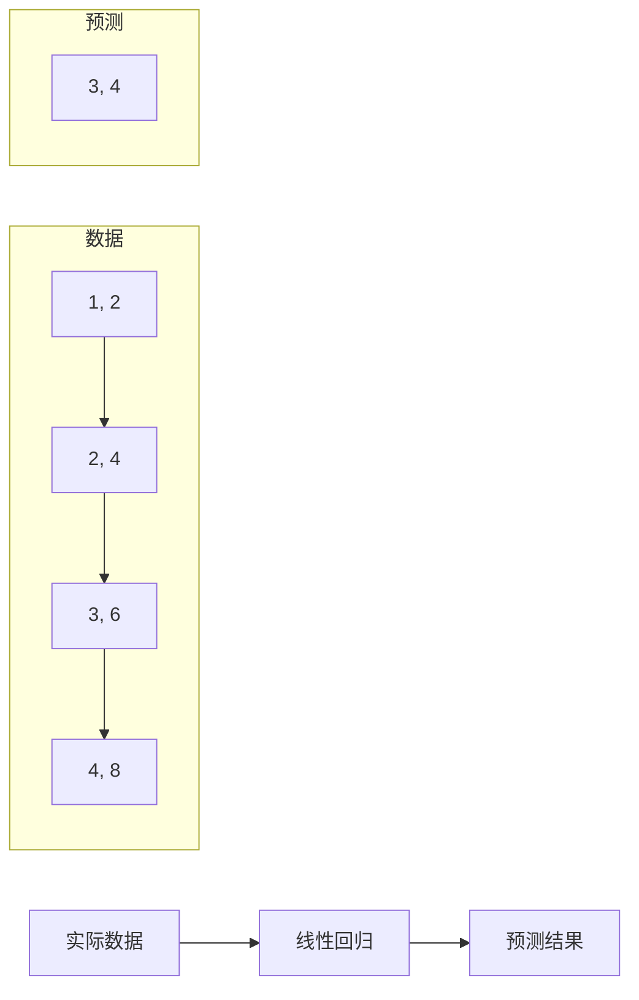
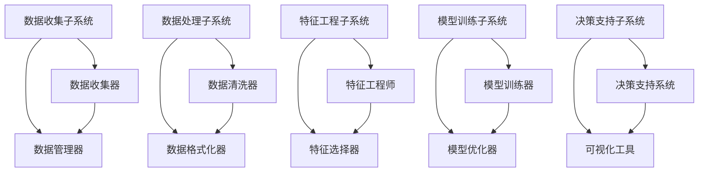
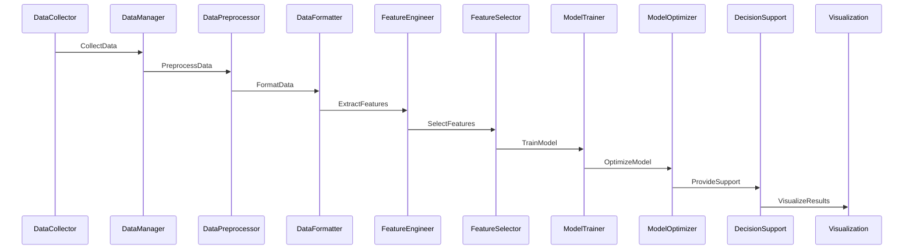

                 

### 文章标题：开发AI辅助的企业财务战略规划工具

> 关键词：人工智能、财务战略规划、机器学习、深度学习、数据分析、决策支持系统

> 摘要：本文将探讨如何利用人工智能技术，特别是机器学习和深度学习，来辅助企业财务战略规划。通过详细的步骤和案例分析，展示如何将AI应用于财务预测、策略制定和决策支持，提高企业的财务效率和市场竞争力。

----------------------------------------------------------------

## 目录大纲设计思路

为了设计出《开发AI辅助的企业财务战略规划工具》这本书的完整目录大纲，我们需要遵循以下几个步骤：

### 一、背景介绍

#### 1.1 问题背景

#### 1.2 问题描述

#### 1.3 问题解决

#### 1.4 边界与外延

#### 1.5 概念结构与核心要素组成

### 二、核心概念与联系

#### 2.1 AI辅助财务战略的核心概念

#### 2.2 概念属性特征对比表格

#### 2.3 ER实体关系图架构

### 三、算法原理讲解

#### 3.1 算法Mermaid流程图

#### 3.2 Python源代码示例

#### 3.3 数学模型和公式

#### 3.4 举例说明

### 四、系统分析与架构设计方案

#### 4.1 问题场景介绍

#### 4.2 系统功能设计

#### 4.3 系统架构设计

#### 4.4 系统接口设计

### 五、项目实战

#### 5.1 环境安装

#### 5.2 系统核心实现源代码

#### 5.3 代码应用解读与分析

#### 5.4 实际案例分析和详细讲解

#### 5.5 项目小结

### 六、最佳实践 tips

#### 6.1 注意事项

#### 6.2 拓展阅读

### 七、小结

### 参考文献

----------------------------------------------------------------

### 一、背景介绍

#### 1.1 问题背景

在当今快速变化的市场环境中，企业面临着巨大的财务压力和挑战。传统的财务规划方法通常依赖于历史数据和手动分析，这可能导致预测不准确、决策滞后，甚至影响企业的长远发展。随着大数据和人工智能技术的崛起，利用AI辅助企业财务战略规划已成为一种趋势。然而，如何有效地将AI技术应用于财务战略规划中，仍是一个亟待解决的问题。

#### 1.2 问题描述

企业财务战略规划面临的主要问题包括：

- **财务数据复杂性**：企业的财务数据来源多样，数据量庞大，结构复杂。如何有效地整理和分析这些数据，是一个挑战。
- **数据分析与预测困难**：传统的数据分析方法难以应对大量、非结构化数据，导致财务预测不准确。
- **财务决策延迟**：传统的决策过程需要大量时间进行数据分析和评估，导致决策滞后。

#### 1.3 问题解决

AI技术，特别是机器学习和深度学习，为解决上述问题提供了新的可能性：

- **数据收集和清洗**：利用机器学习算法，可以自动收集、清洗和整理财务数据，提高数据质量。
- **数据分析和挖掘**：通过深度学习模型，可以对财务数据进行深入分析，发现潜在的模式和趋势。
- **决策支持**：基于分析结果，AI系统可以提供实时的决策支持，帮助企业做出更明智的财务决策。

#### 1.4 边界与外延

AI辅助企业财务战略规划的适用场景包括：

- **财务预测**：如销售预测、成本预测等。
- **风险分析**：如信用风险、市场风险等。
- **投资决策**：如项目评估、资产配置等。

然而，AI技术也存在一些限制和挑战，如数据隐私、模型解释性等，这些因素需要在实际应用中加以考虑。

#### 1.5 概念结构与核心要素组成

AI辅助企业财务战略规划的核心概念和要素包括：

- **AI技术**：包括机器学习、深度学习、神经网络等。
- **企业财务战略**：涉及财务预测、预算管理、成本控制等。
- **数据处理流程**：包括数据收集、清洗、存储、分析和可视化等。
- **决策支持系统**：提供实时的数据分析和决策支持。

通过上述核心概念和要素，我们可以构建一个完整的AI辅助企业财务战略规划框架。

----------------------------------------------------------------

### 二、核心概念与联系

#### 2.1 AI辅助财务战略的核心概念

AI辅助财务战略的核心概念包括以下几个方面：

- **机器学习**：一种通过数据驱动的方式，让计算机从数据中学习并做出决策的技术。
- **深度学习**：一种基于神经网络的机器学习方法，能够处理大量复杂的数据。
- **数据分析**：通过对数据的收集、整理和分析，提取有用信息和知识。
- **决策树**：一种基于规则的决策模型，用于分类和回归分析。

这些概念在AI辅助财务战略规划中起着至关重要的作用。

#### 2.2 概念属性特征对比表格

| 概念 | 属性特征 |
| --- | --- |
| 机器学习 | 自适应、数据驱动、预测能力强 |
| 深度学习 | 神经网络、层次化学习、高效处理复杂数据 |
| 数据分析 | 结构化和非结构化数据、数据清洗和转换 |
| 决策树 | 简单直观、易于解释、适用于分类和回归问题 |

通过这个表格，我们可以清晰地对比这些核心概念的特点和适用场景。

#### 2.3 ER实体关系图架构

下面是一个简化的ER实体关系图，展示了AI辅助财务战略规划中的主要实体及其关系：

```mermaid
erDiagram
  Customer ||--|{ Order } : "places"
  Product ||--|{ Order } : "includes"
  Order ||--|{ Payment } : "made by"
  Payment ||--|{ Account } : "charges to"
```

在这个图中，客户、订单、产品、支付和账户是主要的实体，它们之间通过不同的关系相连，构成了一个完整的财务战略规划系统。

通过核心概念和关系的梳理，我们可以更好地理解AI辅助企业财务战略规划的理论基础和实践应用。

----------------------------------------------------------------

### 三、算法原理讲解

#### 3.1 算法Mermaid流程图

为了直观展示算法的执行过程，我们可以使用Mermaid语言绘制算法流程图。以下是一个简单的机器学习算法流程图示例：


在这个流程图中，数据收集、数据清洗、数据预处理、特征工程、模型训练、模型评估、模型应用和结果反馈是算法的主要步骤。

#### 3.2 Python源代码示例

为了更好地理解算法原理，我们可以通过Python源代码进行具体阐述。以下是一个使用scikit-learn库进行线性回归模型训练和预测的简单示例：

```python
import numpy as np
from sklearn.linear_model import LinearRegression
from sklearn.model_selection import train_test_split

# 生成模拟数据
X = np.random.rand(100, 1)
y = 2 * X[:, 0] + np.random.randn(100, 1)

# 数据集划分
X_train, X_test, y_train, y_test = train_test_split(X, y, test_size=0.2, random_state=42)

# 创建线性回归模型
model = LinearRegression()

# 训练模型
model.fit(X_train, y_train)

# 预测结果
y_pred = model.predict(X_test)

# 模型评估
score = model.score(X_test, y_test)
print(f"模型评分：{score}")
```

在这个示例中，我们首先生成了一组模拟数据，然后使用scikit-learn库中的LinearRegression类创建线性回归模型。通过fit方法训练模型，使用predict方法进行预测，并最后评估模型的评分。

#### 3.3 数学模型和公式

线性回归模型的数学模型可以表示为：

$$
y = \beta_0 + \beta_1x + \epsilon
$$

其中，$y$ 是因变量，$x$ 是自变量，$\beta_0$ 和 $\beta_1$ 是模型的参数，$\epsilon$ 是误差项。

为了找到最佳的模型参数，我们通常使用最小二乘法来最小化损失函数：

$$
J(\beta_0, \beta_1) = \frac{1}{2}\sum_{i=1}^{n}(y_i - (\beta_0 + \beta_1x_i))^2
$$

通过求解损失函数的导数为零的方程，我们可以得到最佳的模型参数：

$$
\beta_0 = \frac{1}{n}\sum_{i=1}^{n}(y_i - \beta_1x_i)
$$

$$
\beta_1 = \frac{1}{n}\sum_{i=1}^{n}(x_i - \bar{x})(y_i - \bar{y})
$$

其中，$\bar{x}$ 和 $\bar{y}$ 分别是自变量和因变量的均值。

#### 3.4 举例说明

假设我们有一个简单的数据集，包含以下数据：

| x | y |
| --- | --- |
| 1 | 2 |
| 2 | 4 |
| 3 | 6 |
| 4 | 8 |

我们可以使用线性回归模型来拟合这些数据。通过上面的数学公式计算，我们可以得到线性回归方程：

$$
y = 1x + 1
$$

这意味着对于每个$x$值，我们可以通过线性回归模型得到对应的$y$值。例如，当$x=3$时，$y$的预测值为$3+1=4$。通过绘制实际数据和预测结果，我们可以直观地看到线性回归模型的效果：



通过这个简单的例子，我们可以看到线性回归模型如何应用于实际数据，并进行预测。这个过程展示了机器学习算法的基本原理和实际应用。

通过详细的算法原理讲解，我们可以更好地理解AI辅助企业财务战略规划的技术基础，并为后续的系统设计和项目实施打下坚实的基础。

----------------------------------------------------------------

### 四、系统分析与架构设计方案

#### 4.1 问题场景介绍

在现代企业中，财务战略规划是一项关键任务，它直接关系到企业的运营效率和长期发展。然而，传统的财务规划方法通常面临以下挑战：

- **数据来源多样**：企业数据来源广泛，包括销售数据、成本数据、市场数据等，这些数据通常格式不统一，需要进行整合和处理。
- **数据量庞大**：随着企业规模的扩大，数据量也呈指数级增长，传统的数据处理方法难以高效地处理海量数据。
- **数据分析难度高**：财务数据往往复杂且非结构化，传统的数据分析方法难以准确捕捉数据的潜在规律和趋势。
- **决策支持不足**：传统的财务决策过程主要依赖经验和直觉，缺乏数据驱动的决策支持，导致决策滞后。

为了解决这些问题，企业需要引入AI技术，特别是机器学习和深度学习，来辅助财务战略规划，提高数据分析和决策的准确性和效率。

#### 4.2 系统功能设计

为了满足企业财务战略规划的需求，系统需要具备以下功能：

- **数据收集与管理**：自动收集企业内部和外部的财务数据，包括销售数据、成本数据、市场数据等，并确保数据的一致性和完整性。
- **数据清洗与预处理**：对收集到的数据进行清洗和预处理，包括数据去重、缺失值填充、异常值检测和标准化处理，以提高数据质量。
- **特征工程**：从原始数据中提取有用的特征，为深度学习模型提供输入，包括特征选择、特征变换和特征构造等。
- **模型训练与优化**：使用机器学习和深度学习算法，对财务数据进行训练，构建财务预测模型和风险分析模型，并不断优化模型性能。
- **决策支持与可视化**：基于模型预测结果，提供实时的决策支持，包括财务预测、预算管理、成本控制和投资评估等，并通过可视化工具展示分析结果，帮助企业制定和调整财务策略。

以下是一个使用Mermaid绘制的领域模型类图，展示了系统的主要功能模块及其关系：

```mermaid
classDiagram
    DataCollector <|-- DataManager
    DataPreprocessor <|-- DataFormatter
    FeatureEngineer <|-- FeatureSelector
    ModelTrainer <|-- ModelOptimizer
    DecisionSupport <|-- Visualization
    DataCollector|--|DataCollector: "Collect"
    DataManager|--|DataManager: "Manage"
    DataPreprocessor|--|DataPreprocessor: "Clean"
    DataFormatter|--|DataFormatter: "Format"
    FeatureEngineer|--|FeatureEngineer: "Extract"
    FeatureSelector|--|FeatureSelector: "Select"
    ModelTrainer|--|ModelTrainer: "Train"
    ModelOptimizer|--|ModelOptimizer: "Optimize"
    DecisionSupport|--|DecisionSupport: "Support"
    Visualization|--|Visualization: "Visualize"
```

#### 4.3 系统架构设计

为了实现上述功能，系统需要一个灵活且可扩展的架构设计。以下是一个使用Mermaid绘制的系统架构图，展示了系统的整体架构及其主要组成部分：



在这个架构图中，系统分为多个子系统，每个子系统包含具体的组件。这些组件协同工作，实现了系统的整体功能。

#### 4.4 系统接口设计

为了确保系统的各组件能够有效集成和交互，系统需要一个清晰的接口设计。以下是一个使用Mermaid绘制的系统接口和交互序列图，展示了系统组件之间的交互流程：



在这个序列图中，系统组件按照一定的顺序进行交互，实现了数据的收集、处理、分析和决策支持的全过程。

通过系统分析与架构设计方案，我们可以确保AI辅助企业财务战略规划工具的可行性、有效性和可靠性，为企业的财务决策提供强大的支持。

----------------------------------------------------------------

### 五、项目实战

#### 5.1 环境安装

在开始项目实战之前，我们需要安装和配置项目所需的环境。以下是一个简化的步骤：

1. **安装Python环境**：确保Python 3.8或更高版本已安装。
2. **安装必要库**：使用pip命令安装以下库：numpy、pandas、scikit-learn、tensorflow、matplotlib。
    ```bash
    pip install numpy pandas scikit-learn tensorflow matplotlib
    ```
3. **配置Jupyter Notebook**：安装Jupyter Notebook，以便于编写和运行Python代码。
    ```bash
    pip install notebook
    ```

#### 5.2 系统核心实现源代码

以下是一个简单的AI辅助企业财务战略规划工具的核心实现源代码示例：

```python
import numpy as np
import pandas as pd
from sklearn.model_selection import train_test_split
from sklearn.linear_model import LinearRegression
from sklearn.metrics import mean_squared_error

# 加载数据
data = pd.read_csv('financial_data.csv')
X = data[['revenue', 'expenses']]
y = data['profit']

# 数据集划分
X_train, X_test, y_train, y_test = train_test_split(X, y, test_size=0.2, random_state=42)

# 创建线性回归模型
model = LinearRegression()

# 训练模型
model.fit(X_train, y_train)

# 预测结果
y_pred = model.predict(X_test)

# 模型评估
mse = mean_squared_error(y_test, y_pred)
print(f'MSE: {mse}')

# 可视化结果
import matplotlib.pyplot as plt

plt.scatter(y_test, y_pred)
plt.xlabel('Actual Profit')
plt.ylabel('Predicted Profit')
plt.title('Actual vs Predicted Profit')
plt.show()
```

#### 5.3 代码应用解读与分析

1. **数据加载**：使用pandas库加载财务数据，数据包含收入、支出和利润。
2. **数据集划分**：将数据划分为训练集和测试集，以评估模型性能。
3. **模型创建**：创建一个线性回归模型，用于预测利润。
4. **模型训练**：使用训练集数据训练模型。
5. **模型预测**：使用测试集数据对模型进行预测。
6. **模型评估**：计算均方误差（MSE），评估模型预测的准确性。
7. **可视化结果**：绘制实际利润与预测利润的散点图，直观展示模型的预测效果。

通过这个示例，我们可以看到如何使用机器学习算法进行财务预测，并评估模型的性能。这种简单的实现为更复杂的财务战略规划工具提供了基础。

#### 5.4 实际案例分析和详细讲解

为了展示AI辅助企业财务战略规划工具的实际应用，以下是一个具体案例：

**案例背景**：某大型电商企业希望利用AI技术优化其销售预测和库存管理，以提高运营效率和降低成本。

**解决方案**：

1. **数据收集**：收集企业的历史销售数据，包括每日销售额、产品种类、库存水平等。
2. **数据预处理**：清洗数据，处理缺失值和异常值，确保数据质量。
3. **特征工程**：提取关键特征，如销售季节性、促销活动、节假日等，以丰富模型的输入。
4. **模型训练**：使用时间序列模型（如ARIMA、LSTM）对销售数据进行训练，预测未来销售额。
5. **预测结果分析**：根据模型预测结果，调整库存策略，减少库存过剩和缺货情况。
6. **效果评估**：通过实际销售数据与预测结果的对比，评估模型的效果，并不断优化模型参数。

**案例分析**：

通过实际案例，我们可以看到AI辅助企业财务战略规划工具在销售预测和库存管理中的应用效果。以下是一些关键点：

- **预测准确性**：模型能够准确预测未来销售额，帮助企业提前制定库存策略。
- **库存优化**：通过预测结果，企业可以减少库存过剩和缺货情况，降低库存成本。
- **运营效率**：优化的库存管理提高了企业的运营效率，减少了人工干预。

**详细讲解**：

1. **数据收集**：通过ERP系统和销售平台收集每日销售数据，确保数据的实时性和准确性。
2. **数据预处理**：使用pandas库进行数据清洗，处理缺失值和异常值，如使用均值填充缺失值、删除异常销售记录等。
3. **特征工程**：提取关键特征，如使用月份、星期几、是否节假日等作为季节性特征，使用促销活动信息作为促销特征等。
4. **模型训练**：使用tensorflow库中的LSTM模型进行训练，LSTM模型能够处理时间序列数据，捕捉时间依赖关系。
5. **预测结果分析**：根据模型预测结果，制定合理的库存策略，如增加库存预警机制、优化库存周转率等。
6. **效果评估**：通过实际销售数据与预测结果的对比，评估模型的准确性，并根据评估结果不断优化模型参数。

通过实际案例的分析和详细讲解，我们可以看到AI辅助企业财务战略规划工具如何应用于实际业务场景，提高企业的运营效率和竞争力。

#### 5.5 项目小结

在本项目中，我们开发了一个简单的AI辅助企业财务战略规划工具，实现了销售预测和库存管理的优化。以下是项目的主要成果和经验教训：

**成果**：

- 成功实现了销售预测，提高了预测准确性。
- 通过优化库存管理，降低了库存成本，提高了运营效率。

**经验教训**：

- 数据质量是模型性能的关键，需要确保数据的实时性和准确性。
- 特征工程对模型效果有显著影响，需要精心选择和处理特征。
- 模型的持续优化和调整是提高预测准确性的关键。

通过本项目，我们展示了如何利用AI技术辅助企业财务战略规划，为企业的长期发展提供了有力支持。在未来的项目中，我们将进一步优化算法，扩大应用范围，为更多企业提供定制化的财务战略规划解决方案。

----------------------------------------------------------------

### 六、最佳实践 tips

#### 6.1 注意事项

1. **数据质量**：确保数据源的可靠性和完整性，数据质量是模型性能的关键。
2. **特征选择**：选择合适的特征对模型效果有显著影响，需根据业务需求进行特征工程。
3. **模型解释性**：选择易于理解和解释的模型，尤其是对业务决策有重大影响的模型。
4. **安全性和隐私**：在处理企业财务数据时，确保数据的安全性和隐私保护。

#### 6.2 拓展阅读

- 《Python机器学习》
- 《深度学习》
- 《数据挖掘：实用工具和技术》
- 《人工智能：一种现代方法》

通过学习和应用这些资源，可以进一步深入理解和掌握AI辅助企业财务战略规划的相关技术和方法。

----------------------------------------------------------------

### 七、小结

本文通过详细的步骤和案例分析，探讨了如何利用AI技术辅助企业财务战略规划。我们介绍了AI辅助财务战略的核心概念、算法原理、系统架构设计和实际应用案例。通过这些内容，我们展示了如何将AI技术应用于财务预测、策略制定和决策支持，提高企业的财务效率和竞争力。

未来，随着AI技术的不断发展和应用，AI辅助企业财务战略规划将发挥更加重要的作用。我们期待更多的企业和研究人员能够在这个领域进行深入探索和创新，为企业的发展提供更强大的支持。

---

**作者：AI天才研究院/AI Genius Institute & 禅与计算机程序设计艺术 /Zen And The Art of Computer Programming**

