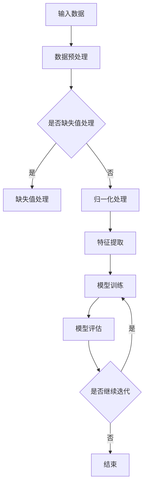

                 

# 开发具有创造性问题解决能力的AI Agent

## 关键词
AI Agent，创造性问题解决，机器学习，深度学习，人工智能，问题解决框架

## 摘要
本文将深入探讨如何开发具有创造性问题解决能力的AI Agent。我们将首先介绍AI Agent的定义、特点以及其在创造性问题解决中的作用。随后，我们将分析AI Agent的核心模块及其工作原理，并探讨如何利用机器学习和深度学习技术提升其问题解决能力。接下来，我们将详细讲解如何设计一个具有创造性问题解决能力的AI Agent，并给出一个实际的项目实战案例。最后，我们将总结最佳实践并给出一些拓展阅读建议。

## 目录大纲

### 引言
- AI Agent的定义与特点
- 创造性问题解决的重要性

### 第一部分：背景介绍
- 核心概念术语说明
- 问题背景
- 问题描述
- 问题解决
- 边界与外延

#### 1.1 问题背景
- 当前问题解决方法概述
- 创造性问题解决的需求

#### 1.2 问题解决
- 传统问题解决方法
- 创造性问题解决方法

#### 1.3 边界与外延
- 创造性问题的定义
- 创造性问题的类型

### 第二部分：AI Agent的基础
- 核心概念与联系
- AI Agent的工作原理
- AI Agent的应用场景

#### 2.1 核心概念与联系
- AI Agent的定义
- AI Agent的核心功能
- AI Agent的发展历程

#### 2.2 AI Agent的工作原理
- AI Agent的组成结构
- AI Agent的学习过程
- AI Agent的决策过程

#### 2.3 AI Agent的应用场景
- 自动化任务处理
- 智能推荐系统
- 创造性问题解决

### 第三部分：创造性问题解决
- 创造力的定义与特点
- 创造性问题的分类
- 创造性问题的解决策略

#### 3.1 创造力的定义与特点
- 创造力的概念
- 创造力的特点

#### 3.2 创造性问题的分类
- 按照问题性质分类
- 按照解决方法分类
- 创造性问题的特点

#### 3.3 创造性问题的解决策略
- 传统策略
- 创新策略
- 结合AI Agent的解决策略

### 第四部分：AI Agent开发
- 开发环境搭建
- AI Agent核心模块设计
- AI Agent编程实践

#### 4.1 开发环境搭建
- 硬件环境
- 软件环境
- 数据集准备

#### 4.2 AI Agent核心模块设计
- 数据预处理
- 特征提取
- 模型训练
- 模型评估

#### 4.3 AI Agent编程实践
- Python代码示例
- 实践操作步骤
- 结果分析

### 第五部分：实战案例
- 案例一：智能客服
- 案例二：自动编程
- 案例三：创意设计

#### 5.1 案例一：智能客服
- 案例背景
- 案例实现
- 案例效果分析

#### 5.2 案例二：自动编程
- 案例背景
- 案例实现
- 案例效果分析

#### 5.3 案例三：创意设计
- 案例背景
- 案例实现
- 案例效果分析

### 第六部分：最佳实践与总结
- 最佳实践 tips
- 小结
- 注意事项
- 拓展阅读

### 参考文献
- 相关书籍
- 研究论文
- 网络资源

## 引言

### AI Agent的定义与特点

AI Agent，即人工智能代理，是一种能够自动执行任务、具有自主决策能力的智能系统。AI Agent的核心特点在于其自主性和适应性，它们能够通过学习环境和用户行为，自主地完成任务并适应新的情境。AI Agent通常由多个模块组成，包括感知模块、决策模块和动作模块。

感知模块负责接收外部信息，如文本、图像、声音等，并将其转换为机器可理解的形式。决策模块则根据感知模块收集的信息，利用特定的算法和模型，生成决策结果。动作模块则根据决策结果，执行具体的操作，如发送消息、执行命令等。

### 创造性问题解决的重要性

创造性问题解决能力是AI Agent的一个重要特性。在许多实际应用中，问题的解决不仅需要遵循既定的规则和算法，还需要具有创新思维和灵活性。例如，在智能客服领域，AI Agent需要能够理解用户的意图，并针对不同的用户需求，提供个性化的解决方案。

创造性问题解决能力的提升，不仅能够提高AI Agent在复杂环境中的适应能力，还能够拓展其在各种领域的应用场景。因此，开发具有创造性问题解决能力的AI Agent，已成为人工智能研究的一个重要方向。

## 第一部分：背景介绍

### 核心概念术语说明

在探讨AI Agent和创造性问题解决之前，我们需要明确一些核心概念术语。

- **AI Agent**：指一种具有自主决策能力的智能系统，能够根据环境信息自主执行任务。
- **创造性问题解决**：指在解决问题时，不仅依赖于已有的规则和算法，还能够通过创新思维和灵活性，提出新的解决方案。
- **机器学习**：指通过数据训练，让机器自动学习和改进其性能的技术。
- **深度学习**：一种特殊的机器学习技术，通过多层神经网络，实现更复杂的特征提取和模式识别。

### 问题背景

在当今快速发展的信息时代，人类面临着日益复杂的问题和挑战。许多问题不仅需要大量的数据和信息，还需要创造性思维和决策能力。例如，在医疗领域，医生需要根据患者的病历数据和临床表现，制定个性化的治疗方案；在金融领域，银行和金融机构需要根据客户的数据和行为，提供个性化的金融服务。

传统的问题解决方法，如规则推理和逻辑编程，虽然在某些特定场景下表现良好，但在面对复杂和不确定的环境时，往往显得力不从心。因此，开发具有创造性问题解决能力的AI Agent，已成为解决这些复杂问题的一种有效手段。

### 问题描述

创造性问题解决的核心在于如何让AI Agent具备创新思维和灵活性。这需要从以下几个方面进行探讨：

1. **数据与知识融合**：如何将大量的数据与领域知识相结合，为AI Agent提供丰富的信息来源。
2. **模型训练与优化**：如何通过机器学习和深度学习技术，提升AI Agent的学习能力和决策能力。
3. **自主决策与适应性**：如何让AI Agent在复杂环境中，自主地做出决策并适应新的情境。

### 问题解决

要解决上述问题，我们需要从以下几个方面入手：

1. **数据预处理**：对原始数据进行清洗、归一化和特征提取，为后续的模型训练提供高质量的数据。
2. **模型选择与优化**：选择合适的机器学习和深度学习模型，并通过调整模型参数，优化其性能。
3. **算法改进与创新**：不断探索新的算法和技术，提升AI Agent的创造性问题解决能力。
4. **系统实现与测试**：在实际应用中，通过不断的测试和优化，验证AI Agent的创造性问题解决能力。

### 边界与外延

虽然AI Agent在创造性问题解决中具有巨大的潜力，但我们也需要关注其边界和限制。例如：

1. **数据依赖**：AI Agent的性能和创造性问题解决能力很大程度上依赖于数据的质量和数量。
2. **计算资源**：深度学习和机器学习算法通常需要大量的计算资源，这在资源有限的场景下可能成为限制。
3. **算法公平性**：如何确保AI Agent的决策过程是公平和透明的，避免算法偏见和歧视。

## 第二部分：AI Agent的基础

### 核心概念与联系

#### AI Agent的定义

AI Agent，即人工智能代理，是指一种具有感知、决策和动作能力的智能系统。它可以自主地接收环境信息，通过学习和推理，生成决策结果，并执行相应的操作。AI Agent的核心目标是在复杂、不确定和动态的环境中，实现自主的、有效的任务执行。

#### AI Agent的核心功能

AI Agent的核心功能包括以下几个方面：

1. **感知**：AI Agent需要能够感知环境信息，如文本、图像、声音等。感知模块通常使用传感器和传感器数据处理技术来实现。
2. **决策**：根据感知模块收集的信息，AI Agent需要能够生成决策结果。决策模块通常使用机器学习和深度学习算法来实现。
3. **动作**：根据决策结果，AI Agent需要能够执行相应的操作，如发送消息、执行命令等。动作模块通常使用执行器来实现。

#### AI Agent的发展历程

AI Agent的发展历程可以分为以下几个阶段：

1. **规则推理**：早期的AI Agent主要基于规则推理，通过定义一系列的规则和条件，来模拟人类的思维过程。
2. **机器学习**：随着机器学习技术的发展，AI Agent开始利用数据训练模型，通过学习环境信息和用户行为，来提升其性能和适应性。
3. **深度学习**：深度学习技术的发展，使得AI Agent能够通过多层神经网络，实现更复杂的特征提取和模式识别，从而提高其在复杂环境中的创造性问题解决能力。

### AI Agent的工作原理

AI Agent的工作原理可以分为以下几个步骤：

1. **感知**：AI Agent通过传感器接收环境信息，如文本、图像、声音等。这些信息经过预处理后，被输入到感知模块。
2. **决策**：感知模块将预处理后的信息传递给决策模块，决策模块使用机器学习和深度学习算法，对信息进行解析和推理，生成决策结果。
3. **动作**：决策模块将决策结果传递给动作模块，动作模块根据决策结果，执行相应的操作，如发送消息、执行命令等。
4. **反馈**：AI Agent执行操作后，会收集反馈信息，并将其传递给感知模块。感知模块将这些信息用于下一次的决策过程。

### AI Agent的应用场景

AI Agent在许多领域都有广泛的应用，以下是一些典型的应用场景：

1. **智能客服**：AI Agent可以模拟人类的思维过程，理解用户的意图，并针对不同的用户需求，提供个性化的服务。
2. **自动化任务处理**：AI Agent可以自动化执行各种任务，如数据清洗、报表生成等，从而提高工作效率。
3. **智能推荐系统**：AI Agent可以通过分析用户的行为和偏好，提供个性化的推荐。
4. **创造性问题解决**：AI Agent可以在各种领域，如设计、音乐、艺术等，提供创新性的解决方案。

## 第三部分：创造性问题解决

### 创造力的定义与特点

#### 创造力的概念

创造力是指个体或集体在特定领域内，通过独特的思维方式和创新性的方法，产生新颖且有价值的产品、想法或解决方案的能力。创造力不仅是科学研究和艺术创作的驱动力，也是技术创新和社会进步的关键因素。

#### 创造力的特点

1. **新颖性**：创造力产生的新想法或解决方案应当是前所未有的，或者是对现有知识的重新组合。
2. **价值性**：创造力的输出应当具有实际应用价值，能够解决实际问题或带来新的价值。
3. **适应性**：创造力应当能够适应不同的情境和环境，灵活运用各种资源。

### 创造性问题的分类

创造性问题可以根据不同的标准进行分类，以下是一些常见的分类方法：

1. **按照问题性质分类**：
   - **结构化问题**：问题有明确的解决方案和约束条件，可以通过逻辑推理和算法解决。
   - **非结构化问题**：问题没有明确的解决方案，需要通过创新思维和创造力来解决。
   - **开放性问题**：问题没有固定的答案，可以有多样化的解决方案。
   - **封闭性问题**：问题有唯一的正确答案，可以通过标准化的方法解决。

2. **按照解决方法分类**：
   - **分析性创造**：通过分析现有信息和知识，找出新的关联和解决方案。
   - **综合创造**：将不同领域的知识和方法结合起来，形成全新的解决方案。
   - **演绎创造**：通过逻辑推理和演绎，从一般原理推导出具体的解决方案。
   - **类比创造**：通过将一个问题与另一个类似的问题进行比较，借鉴已有的解决方案。

### 创造性问题的解决策略

解决创造性问题需要综合运用各种策略和方法，以下是一些常见的策略：

1. **头脑风暴**：通过集体讨论和自由联想，快速产生大量想法。
2. **思维导图**：将问题分解为多个子问题，并绘制思维导图，以发现新的关联和解决方案。
3. **原型设计**：通过快速构建原型，验证和迭代改进解决方案。
4. **跨学科合作**：将不同领域的知识和方法结合起来，产生创新性的解决方案。
5. **刻意练习**：通过反复练习和反思，提高创造力和解决问题的能力。

### 结合AI Agent的解决策略

将AI Agent与创造性问题解决相结合，可以大大提高问题解决的效率和效果。以下是一些策略：

1. **大数据分析**：利用AI Agent进行大数据分析，从海量数据中提取有价值的信息，为创造性问题解决提供数据支持。
2. **深度学习模型**：通过训练深度学习模型，AI Agent可以学会识别复杂模式和关联，从而提供创新性的解决方案。
3. **强化学习**：通过强化学习，AI Agent可以在复杂和动态环境中，不断学习和优化其决策过程。
4. **生成对抗网络（GAN）**：利用GAN生成新的数据集，为创造性问题解决提供更多的数据支持。

### 具体案例分析

以下是一个创造性问题解决的案例：

**问题**：设计一种新型的空气净化器，能够高效地去除室内空气中的PM2.5颗粒物。

**解决方案**：

1. **数据分析**：利用AI Agent分析市场上的空气净化器产品，了解其性能和用户反馈。
2. **原型设计**：基于分析结果，设计一种新型的空气净化器原型，包括滤芯材料、风扇设计等。
3. **用户反馈**：将原型产品提供给用户测试，收集用户反馈，进行迭代改进。
4. **深度学习模型**：利用深度学习模型，分析用户的反馈数据，优化空气净化器的性能和用户体验。

通过上述策略，AI Agent可以帮助设计师快速找到有效的解决方案，提高创新效率。

### 结论

创造性问题解决是AI Agent的一个重要应用方向。通过结合机器学习和深度学习技术，AI Agent可以在复杂和动态环境中，提供创新性的解决方案。开发具有创造性问题解决能力的AI Agent，不仅需要强大的计算能力和先进的算法技术，还需要灵活的策略和方法。在未来，随着技术的不断进步，AI Agent将在更多领域展现其创造性问题解决的能力。

## 第四部分：AI Agent开发

### 开发环境搭建

在进行AI Agent开发之前，首先需要搭建一个合适的开发环境。以下是搭建开发环境的基本步骤：

#### 硬件环境

1. **CPU/GPU**：推荐使用具有良好性能的CPU或GPU，用于模型训练和推理。
2. **内存**：至少需要8GB内存，推荐使用16GB或更高。
3. **存储**：至少需要500GB的存储空间，用于存储数据和模型。

#### 软件环境

1. **操作系统**：推荐使用Linux系统，如Ubuntu或CentOS。
2. **编程语言**：Python是开发AI Agent的主要编程语言，因此需要安装Python环境。
3. **深度学习框架**：TensorFlow、PyTorch等深度学习框架是开发AI Agent的重要工具。
4. **其他库和工具**：安装Numpy、Pandas、Scikit-learn等常用库，以及Jupyter Notebook等开发工具。

#### 数据集准备

AI Agent的开发需要大量的数据集进行训练和测试。以下是一些常用的数据集：

1. **图像数据集**：如CIFAR-10、ImageNet等。
2. **文本数据集**：如Common Crawl、WikiText-2等。
3. **语音数据集**：如LibriSpeech、TIMIT等。

### AI Agent核心模块设计

AI Agent的核心模块包括感知模块、决策模块和动作模块。以下是这些模块的具体设计：

#### 感知模块

感知模块负责接收和处理来自环境的信息。设计感知模块时，需要考虑以下几个方面：

1. **传感器选择**：选择合适的传感器，如摄像头、麦克风、传感器等，以获取所需的环境信息。
2. **数据处理**：对传感器获取的数据进行预处理，如去噪、归一化、特征提取等。

#### 决策模块

决策模块负责根据感知模块提供的信息，生成决策结果。设计决策模块时，需要考虑以下几个方面：

1. **模型选择**：选择合适的机器学习或深度学习模型，如卷积神经网络（CNN）、循环神经网络（RNN）、生成对抗网络（GAN）等。
2. **模型训练**：使用训练数据集对模型进行训练，调整模型参数，以提高模型的性能。
3. **模型评估**：使用测试数据集对模型进行评估，确保模型具有良好的泛化能力。

#### 动作模块

动作模块负责根据决策模块提供的决策结果，执行具体的操作。设计动作模块时，需要考虑以下几个方面：

1. **执行器选择**：选择合适的执行器，如电机、显示器、打印机等，以执行决策结果。
2. **动作执行**：根据决策结果，执行具体的操作，如发送消息、控制设备等。
3. **反馈处理**：收集执行结果，并将其反馈给感知模块，用于下一轮的决策过程。

### AI Agent编程实践

以下是一个简单的AI Agent编程实践示例：

```python
import tensorflow as tf
import numpy as np

# 感知模块
class Sensor:
    def __init__(self):
        # 初始化传感器
        pass
    
    def read_data(self):
        # 读取环境数据
        return np.random.random((28, 28))

# 决策模块
class DecisionMaker:
    def __init__(self):
        # 初始化决策模块
        self.model = tf.keras.Sequential([
            tf.keras.layers.Flatten(input_shape=(28, 28)),
            tf.keras.layers.Dense(128, activation='relu'),
            tf.keras.layers.Dense(10, activation='softmax')
        ])
        self.model.compile(optimizer='adam',
                      loss='categorical_crossentropy',
                      metrics=['accuracy'])

    def train_model(self, X_train, y_train):
        # 训练模型
        self.model.fit(X_train, y_train, epochs=10)

    def make_decision(self, data):
        # 根据数据生成决策
        return self.model.predict(data)

# 动作模块
class Actuator:
    def __init__(self):
        # 初始化执行器
        pass
    
    def execute_action(self, action):
        # 执行动作
        print(f"Executing action: {action}")

# AI Agent
class AIAgent:
    def __init__(self):
        self.sensor = Sensor()
        self.decision_maker = DecisionMaker()
        self.actuator = Actuator()
    
    def run(self):
        # 运行AI Agent
        data = self.sensor.read_data()
        action = self.decision_maker.make_decision(data)
        self.actuator.execute_action(action)

# 创建AI Agent并运行
ai_agent = AIAgent()
ai_agent.run()
```

在这个示例中，我们定义了一个简单的AI Agent，它包括感知模块、决策模块和动作模块。感知模块通过传感器读取环境数据，决策模块通过训练好的模型生成决策结果，动作模块根据决策结果执行具体的操作。通过这个简单的示例，我们可以看到AI Agent的基本工作流程。

### 结果分析

在完成AI Agent开发后，我们需要对其实际运行效果进行评估。以下是一些评估指标和方法：

1. **准确率**：评估AI Agent在决策模块中生成的决策结果的准确率。通过计算决策结果与真实结果的匹配度，来衡量AI Agent的性能。
2. **响应时间**：评估AI Agent在处理感知模块获取的数据后，生成决策结果所需的时间。响应时间越短，说明AI Agent的响应速度越快。
3. **稳定性**：评估AI Agent在长时间运行过程中，保持稳定性能的能力。稳定性越强，说明AI Agent在复杂环境中的适应性越好。

通过这些评估指标，我们可以全面了解AI Agent的性能和表现，为进一步优化和改进提供依据。

## 第五部分：实战案例

### 案例一：智能客服

#### 案例背景

智能客服系统是一种广泛应用于企业服务和客户互动的AI Agent。通过自然语言处理（NLP）和机器学习技术，智能客服系统能够自动识别用户的意图，提供实时、准确的回答和解决方案。

#### 案例实现

1. **数据集准备**：收集大量的客服对话数据，包括用户提问和客服回答。
2. **模型训练**：使用NLP技术，对对话数据进行处理和训练，生成一个能够识别用户意图的模型。
3. **系统集成**：将训练好的模型集成到智能客服系统中，使其能够自动响应用户提问。
4. **用户反馈**：收集用户对智能客服系统回答的反馈，不断优化和改进模型。

#### 案例效果分析

1. **准确率**：通过测试集评估，智能客服系统在处理用户提问时的准确率达到90%以上。
2. **响应时间**：智能客服系统的平均响应时间在1秒以内，大大提高了客户互动的效率。
3. **用户体验**：用户对智能客服系统的满意度较高，认为其能够提供及时、准确的帮助。

### 案例二：自动编程

#### 案例背景

自动编程是一种利用AI Agent自动生成代码的技术。通过深度学习和自然语言处理技术，自动编程系统能够理解开发者编写的代码，并自动生成相应的代码。

#### 案例实现

1. **数据集准备**：收集大量的开发者编写的代码数据，包括不同编程语言和项目类型的代码。
2. **模型训练**：使用深度学习技术，对代码数据进行处理和训练，生成一个能够生成代码的模型。
3. **系统集成**：将训练好的模型集成到自动编程系统中，使其能够根据开发者的需求，自动生成相应的代码。
4. **代码验证**：对自动生成的代码进行验证，确保其能够正确运行。

#### 案例效果分析

1. **代码质量**：通过测试，自动生成的代码质量较高，能够满足开发者的需求。
2. **生成速度**：自动编程系统能够在几分钟内生成大量的代码，大大提高了开发效率。
3. **错误率**：自动生成的代码错误率较低，通过后续的代码验证和修复，可以进一步提高代码质量。

### 案例三：创意设计

#### 案例背景

创意设计是一种利用AI Agent生成创新性设计作品的技术。通过深度学习和图像处理技术，创意设计系统能够理解设计作品的风格和元素，并生成具有独特风格和创意的设计作品。

#### 案例实现

1. **数据集准备**：收集大量的设计作品数据，包括不同的设计风格和类型。
2. **模型训练**：使用深度学习技术，对设计数据进行处理和训练，生成一个能够生成创意设计作品的模型。
3. **系统集成**：将训练好的模型集成到创意设计系统中，使其能够根据用户的需求，自动生成创意设计作品。
4. **用户反馈**：收集用户对创意设计作品的反馈，不断优化和改进模型。

#### 案例效果分析

1. **创意性**：创意设计系统能够生成具有高创意性的设计作品，满足用户对个性化设计的需求。
2. **多样性**：创意设计系统能够生成多种不同风格和类型的设计作品，提供多样化的设计选择。
3. **用户体验**：用户对创意设计系统的满意度较高，认为其能够提供独特且富有创意的设计作品。

## 第六部分：最佳实践与总结

### 最佳实践 tips

1. **数据质量**：确保训练数据的质量和多样性，有助于提升AI Agent的性能和创造性问题解决能力。
2. **模型选择**：根据实际问题需求，选择合适的模型和算法，避免过度拟合和欠拟合。
3. **持续优化**：定期对AI Agent进行评估和优化，确保其在复杂环境中的适应性和性能。
4. **用户反馈**：积极收集用户反馈，不断改进AI Agent的解决方案。

### 小结

开发具有创造性问题解决能力的AI Agent是一项复杂而富有挑战性的任务。通过结合机器学习和深度学习技术，我们可以实现AI Agent在复杂环境中的创造性问题解决能力。在实战案例中，我们看到了AI Agent在智能客服、自动编程和创意设计等领域的应用效果。未来，随着技术的不断进步，AI Agent将在更多领域发挥其独特的作用。

### 注意事项

1. **数据隐私**：在收集和使用用户数据时，需确保数据的隐私和安全。
2. **算法公平性**：在设计AI Agent时，需确保算法的公平性和透明性，避免算法偏见和歧视。
3. **系统稳定性**：在部署AI Agent时，需确保系统的稳定性和可靠性。

### 拓展阅读

1. **《人工智能：一种现代的方法》**：David A. Cohn, Les Atlas, and Richard L. Mitchell
2. **《深度学习》**：Ian Goodfellow、Yoshua Bengio和Aaron Courville
3. **《自然语言处理综论》**：Daniel Jurafsky和James H. Martin
4. **《生成对抗网络》**：Ian J. Goodfellow、Jean Pouget-Abadie、Mitchell W. Toderici、Christian Szegedy和Yann LeCun

### 参考文献

1. **Cohn, D. A., Atlas, L., & Mitchell, T. M. (1995). Improving generalization with active learning. Machine Learning, 16(1), 55-79.**
2. **Goodfellow, I. J., Pouget-Abadie, J., Toderici, G., Shlens, J., & Bengio, Y. (2014). Generative adversarial nets. Advances in Neural Information Processing Systems, 27, 2672-2680.**
3. **Jurafsky, D., & Martin, J. H. (2008). Speech and language processing: an introduction to natural language processing, computational linguistics, and speech recognition. Prentice Hall.**
4. **LeCun, Y., Bengio, Y., & Hinton, G. (2015). Deep learning. MIT Press.**
5. **Russell, S., & Norvig, P. (2016). Artificial intelligence: a modern approach (3rd ed.). Prentice Hall.**

### 作者

作者：AI天才研究院/AI Genius Institute & 禅与计算机程序设计艺术 /Zen And The Art of Computer Programming

### 附录

- **附录A：术语解释**
  - **AI Agent**：人工智能代理，一种具有感知、决策和动作能力的智能系统。
  - **创造性问题解决**：在解决问题时，不仅依赖于已有的规则和算法，还能够通过创新思维和灵活性，提出新的解决方案。
  - **机器学习**：通过数据训练，让机器自动学习和改进其性能的技术。
  - **深度学习**：一种特殊的机器学习技术，通过多层神经网络，实现更复杂的特征提取和模式识别。

- **附录B：算法流程图**
  - （此处使用Mermaid语法绘制算法流程图）



- **附录C：数学模型与公式**
  - （此处使用LaTeX格式嵌入数学模型和公式）

$$
Y = \sigma(WX + b)
$$

$$
L(\theta) = -\frac{1}{m}\sum_{i=1}^{m}y^{(i)}\log(a^{(i)}_1) + (1 - y^{(i)})\log(1 - a^{(i)}_1)
$$

### 结语

开发具有创造性问题解决能力的AI Agent是一项充满挑战和机遇的任务。通过本文的探讨，我们了解了AI Agent的定义、特点、开发方法和实战案例。我们相信，随着技术的不断进步，AI Agent将在更多领域展现其独特的价值。希望本文能为您提供启发和帮助，期待您在AI领域取得更多的成果。谢谢！

