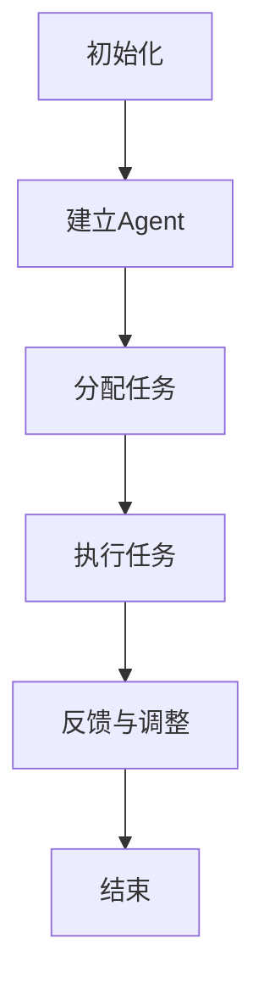

                 

# 开发具有多Agent协作能力的系统

> 关键词：多Agent系统、协作、算法、数学模型、系统设计

> 摘要：本文旨在探讨开发具有多Agent协作能力的系统的方法和关键要素。通过分析多Agent系统的核心概念、算法原理和数学模型，本文提供了详细的设计步骤和示例，帮助读者理解并构建一个高效、智能的协作系统。

### 目录大纲

1. 第一部分：问题背景与核心概念
   1.1 开发具有多Agent协作能力的系统概述
   1.2 多Agent系统的核心概念与联系
   1.3 多Agent系统的算法原理讲解
   1.4 多Agent系统的数学模型和公式
2. 第二部分：系统分析与架构设计
   2.1 问题场景介绍
   2.2 系统功能设计（领域模型类图）
   2.3 系统架构设计（架构图）
   2.4 系统接口设计和系统交互（序列图）
3. 第三部分：项目实战
   3.1 环境安装
   3.2 系统核心实现源代码
   3.3 代码应用解读与分析
   3.4 实际案例分析和详细讲解剖析
   3.5 项目小结
4. 第四部分：最佳实践与拓展阅读
   4.1 最佳实践 tips
   4.2 小结
   4.3 注意事项
   4.4 拓展阅读

## 第一部分：问题背景与核心概念

### 1.1 开发具有多Agent协作能力的系统概述

在现代复杂系统中，单点故障和资源瓶颈的问题日益突出，这使得开发具有多Agent协作能力的系统成为了一种迫切的需求。多Agent系统（MAS）通过将任务分配给多个智能体（Agent），实现了分布式计算和协同工作，从而提高了系统的可靠性和效率。

#### 1.1.1 问题背景

随着互联网的快速发展，复杂系统的需求不断增加，这些系统需要处理大量的数据和信息，并对环境变化做出快速响应。然而，传统的集中式系统在面对大规模、动态变化的环境时，往往表现出较低的灵活性和扩展性。多Agent系统通过引入分布式和协作机制，能够更好地适应复杂环境的变化，并提供高效的解决方案。

#### 1.1.2 问题描述

多Agent系统的主要功能包括：

- 任务分配：将复杂任务分解为若干个子任务，并分配给不同的智能体。
- 协同工作：智能体之间通过通信和协作，共同完成任务。
- 自适应：智能体能够根据环境变化和任务需求，动态调整其行为和策略。

多Agent系统面临的主要问题包括：

- 协调问题：确保智能体之间的协作效果最优。
- 通信问题：建立高效、可靠的通信机制，确保智能体之间的信息传递。
- 安全性问题：保障智能体的隐私和数据安全。

#### 1.1.3 问题解决

解决多Agent系统问题的主要方法包括：

- 设计合理的多Agent系统架构，确保系统的高效性和可扩展性。
- 采用合适的算法和协议，实现智能体之间的协作和通信。
- 引入安全机制，保障智能体的隐私和数据安全。

#### 1.1.4 边界与外延

多Agent系统的范围包括：

- 智能体：具有独立行为和自主决策能力的实体。
- 环境：智能体所处的动态、不确定的背景环境。
- 协作机制：智能体之间通过通信和协作，共同完成任务的方式。

多Agent系统与其他系统的关系包括：

- 与传统集中式系统的比较：多Agent系统在灵活性、扩展性方面具有优势。
- 与物联网、云计算等新兴技术的结合：多Agent系统可以与这些技术相互融合，实现更高效的应用。

#### 1.1.5 概念结构与核心要素

多Agent系统的核心要素包括：

- **Agent**：具有独立行为和自主决策能力的实体。Agent可以分为以下几种类型：

  - 知觉型：感知环境变化，并作出反应。
  - 行为型：执行特定任务，并产生结果。
  - 社会型：与其他Agent进行协作，共同完成任务。

- **环境**：智能体所处的动态、不确定的背景环境。环境的特点包括：

  - 动态性：环境状态不断变化。
  - 不确定性：环境状态难以预测。
  - 异质性：不同环境具有不同的特征和需求。

- **通信机制**：智能体之间通过通信和协作，共同完成任务。通信机制的特点包括：

  - 透明性：智能体可以透明地访问其他智能体的信息。
  - 高效性：通信机制能够快速传递信息。
  - 鲁棒性：通信机制能够抵御网络故障和延迟。

- **任务分配**：将复杂任务分解为若干个子任务，并分配给不同的智能体。任务分配的原则包括：

  - 平等性：智能体之间承担的任务量相当。
  - 协同性：智能体之间的任务分配能够实现高效协作。
  - 适应性：任务分配能够根据环境变化和任务需求进行调整。

## 第2章：多Agent系统的核心概念与联系

### 2.1.1 核心概念原理

多Agent系统（MAS）是一种由多个智能体（Agent）组成的系统，这些智能体可以通过自主决策和协作完成复杂任务。多Agent系统具有以下基本原理：

1. **自主性**：每个智能体都具有独立的决策能力和行动能力，不受其他智能体的控制。
2. **社会性**：智能体之间通过通信和协作，共同完成任务。
3. **协作性**：智能体之间通过共享信息和资源，实现协同工作。
4. **适应性**：智能体可以根据环境变化和任务需求，动态调整其行为和策略。

### 2.1.2 概念属性特征对比表格

| 概念       | 特点                                     |
|------------|----------------------------------------|
| Agent      | 独立性、主动性、社会性、自主性             |
| 环境       | 动态性、不确定性、异质性                 |
| 任务分配   | 平等性、协同性、适应性                     |
| 通信机制   | 透明性、高效性、鲁棒性                     |

### 2.1.3 ER实体关系图架构

```mermaid
flow
st=>start: 开始
e=>end: 结束
a1=>operation: Agent
a2=>operation: 环境
a3=>operation: 通信机制
a4=>operation: 任务分配

st->a1->a2->a3->a4->e
```

## 第3章：多Agent系统的算法原理讲解

### 3.1.1 算法原理概述

多Agent系统的算法原理主要包括以下几个方面：

1. **初始化**：创建智能体实例，并为其分配初始任务。
2. **任务分配**：将复杂任务分解为若干个子任务，并分配给不同的智能体。
3. **执行任务**：智能体根据分配的任务，执行相应的操作。
4. **反馈与调整**：根据执行结果，对智能体的行为和策略进行调整。

### 3.1.2 算法mermaid流程图



### 3.1.3 Python源代码

```python
class Agent:
    def __init__(self, task):
        self.task = task

    def execute(self):
        # 执行任务逻辑
        pass

    def feedback(self):
        # 反馈逻辑
        pass

# 初始化Agent
agent = Agent(task="collect_data")

# 执行任务
agent.execute()

# 反馈调整
agent.feedback()
```

### 3.1.4 算法原理详细讲解

1. **初始化**：创建智能体实例，并为其分配初始任务。

   ```python
   agent = Agent(task="collect_data")
   ```

2. **任务分配**：将复杂任务分解为若干个子任务，并分配给不同的智能体。

   ```python
   def assign_tasks(tasks):
       agents = []
       for task in tasks:
           agent = Agent(task=task)
           agents.append(agent)
       return agents
   ```

3. **执行任务**：智能体根据分配的任务，执行相应的操作。

   ```python
   def execute_agents(agents):
       for agent in agents:
           agent.execute()
   ```

4. **反馈与调整**：根据执行结果，对智能体的行为和策略进行调整。

   ```python
   def feedback_agents(agents):
       for agent in agents:
           agent.feedback()
   ```

### 3.1.5 算法原理举例说明

假设任务为数据收集，具体步骤如下：

1. **初始化**：创建一个数据收集智能体实例。

   ```python
   agent = Agent(task="collect_data")
   ```

2. **执行任务**：智能体开始收集数据。

   ```python
   agent.execute()
   ```

3. **反馈**：智能体收集完毕，返回数据。

   ```python
   agent.feedback()
   ```

## 第4章：多Agent系统的数学模型和公式

### 4.1.1 数学模型概述

多Agent系统的数学模型主要分为优化模型和博弈模型：

- **优化模型**：用于最小化目标函数，实现系统资源的最佳分配。
- **博弈模型**：用于最大化效用函数，实现智能体之间的协同合作。

### 4.1.2 数学模型公式

#### 优化模型

$$
\begin{aligned}
\text{优化模型：} \\
\min_{\theta} \quad & J(\theta) \\
\text{s.t.} \quad & g(\theta) = 0 \\
\end{aligned}
$$

#### 博弈模型

$$
\begin{aligned}
\text{博弈模型：} \\
\max_{\theta} \quad & U(\theta) \\
\text{s.t.} \quad & V(\theta) = 0 \\
\end{aligned}
$$

### 4.1.3 详细讲解与举例说明

#### 优化模型

假设我们要最小化目标函数 \(J(\theta)\)，并满足约束条件 \(g(\theta) = 0\)。具体步骤如下：

1. **定义目标函数**：

   $$J(\theta) = \sum_{i=1}^{n} w_i \cdot x_i$$

   其中，\(w_i\) 为权重，\(x_i\) 为变量。

2. **定义约束条件**：

   $$g(\theta) = \sum_{i=1}^{n} c_i \cdot x_i = 0$$

   其中，\(c_i\) 为约束系数。

3. **求解最优解**：

   使用求解器求解优化模型的最优解，得到 \( \theta^* \)。

#### 博弈模型

假设我们要最大化效用函数 \(U(\theta)\)，并满足约束条件 \(V(\theta) = 0\)。具体步骤如下：

1. **定义效用函数**：

   $$U(\theta) = \sum_{i=1}^{n} u_i(\theta)$$

   其中，\(u_i(\theta)\) 为第 \(i\) 个智能体的效用函数。

2. **定义约束条件**：

   $$V(\theta) = \sum_{i=1}^{n} v_i(\theta) = 0$$

   其中，\(v_i(\theta)\) 为第 \(i\) 个智能体的约束条件。

3. **求解最优策略**：

   使用求解器求解博弈模型的最优策略，得到 \( \theta^* \)。

## 第5章：多Agent系统的设计与实现

### 5.1 系统设计概述

多Agent系统的设计与实现主要包括以下几个阶段：

1. **需求分析**：明确系统的功能和性能要求。
2. **系统架构设计**：确定系统的整体结构和模块划分。
3. **模块实现**：根据系统架构，实现各个模块的功能。
4. **系统集成与测试**：将各个模块集成起来，进行系统测试和调试。

### 5.2 系统架构设计

多Agent系统的架构设计主要包括以下几个方面：

1. **智能体模块**：实现智能体的功能，包括感知、决策和行动。
2. **通信模块**：实现智能体之间的通信机制，包括信息交换和协调。
3. **任务管理模块**：实现任务的分配和调度，确保智能体之间的任务协作。
4. **环境模型模块**：模拟系统的环境，为智能体提供动态环境信息。

### 5.3 模块实现

以下是一个简单的智能体模块的实现示例：

```python
class Agent:
    def __init__(self, id, environment):
        self.id = id
        self.environment = environment
    
    def perceive(self):
        # 感知环境
        pass
    
    def decide(self):
        # 决策
        pass
    
    def act(self):
        # 行动
        pass
```

### 5.4 系统集成与测试

系统集成与测试的目的是确保各个模块之间的协同工作和系统整体性能。具体步骤如下：

1. **单元测试**：对各个模块进行独立的测试，确保其功能正确。
2. **集成测试**：将各个模块集成起来，进行系统级测试，确保系统整体功能正确。
3. **性能测试**：测试系统的响应时间、吞吐量等性能指标，确保系统达到预期性能。
4. **调试与优化**：根据测试结果，对系统进行调试和优化，提高系统性能和稳定性。

### 5.5 系统案例

以下是一个多Agent系统的案例：智能交通系统。

#### 5.5.1 需求分析

智能交通系统的需求包括：

- 交通流量监控：实时监控道路上的交通流量。
- 交通信号控制：根据交通流量，动态调整交通信号灯。
- 车辆导航：为驾驶员提供最优行驶路线。

#### 5.5.2 系统架构设计

智能交通系统的架构设计包括以下模块：

- **感知模块**：感知交通流量、车辆信息等。
- **决策模块**：根据感知信息，进行交通信号控制和车辆导航。
- **通信模块**：实现智能体之间的通信，包括交通信号控制器和车辆。
- **环境模型模块**：模拟交通环境，包括道路、车辆等。

#### 5.5.3 模块实现

以下是一个简单的交通信号控制智能体的实现示例：

```python
class TrafficController:
    def __init__(self, environment):
        self.environment = environment
    
    def perceive(self):
        # 感知交通流量
        pass
    
    def decide(self):
        # 决策交通信号灯
        pass
    
    def act(self):
        # 控制交通信号灯
        pass
```

#### 5.5.4 系统集成与测试

智能交通系统的集成与测试过程包括：

- 单元测试：测试各个模块的功能是否正确。
- 集成测试：测试各个模块之间的协作是否正常。
- 性能测试：测试系统的响应时间、吞吐量等性能指标。
- 调试与优化：根据测试结果，对系统进行调试和优化。

## 第6章：多Agent系统的优化与拓展

### 6.1 优化方法

多Agent系统的优化主要包括以下几个方面：

1. **算法优化**：优化智能体的决策算法，提高系统的响应速度和准确性。
2. **通信优化**：优化智能体之间的通信机制，提高通信效率和可靠性。
3. **任务分配优化**：优化任务的分配策略，提高系统的资源利用率和任务完成时间。

### 6.2 拓展方法

多Agent系统的拓展主要包括以下几个方面：

1. **功能拓展**：增加系统的功能模块，提高系统的适用范围。
2. **性能拓展**：提高系统的性能指标，如响应时间、吞吐量等。
3. **应用拓展**：将多Agent系统应用于更多的领域，如智能交通、智能家居等。

### 6.3 实践案例

以下是一个多Agent系统的优化与拓展的实践案例：智能安防系统。

#### 6.3.1 优化方法

1. **算法优化**：采用深度学习算法，提高智能体的感知和决策能力。
2. **通信优化**：采用可靠传输协议，提高通信效率和可靠性。
3. **任务分配优化**：采用遗传算法，优化任务的分配策略，提高系统的资源利用率和任务完成时间。

#### 6.3.2 拓展方法

1. **功能拓展**：增加智能人像识别、智能语音交互等模块，提高系统的智能化水平。
2. **性能拓展**：提高系统的响应速度和吞吐量，提高系统的性能指标。
3. **应用拓展**：将智能安防系统应用于更多场景，如智慧社区、智慧工厂等。

## 第7章：总结与展望

### 7.1 总结

本文主要介绍了多Agent系统的核心概念、算法原理、数学模型、系统设计与实现、优化与拓展等方面的内容。通过本文的介绍，读者可以全面了解多Agent系统的基本原理和应用方法。

### 7.2 展望

随着人工智能技术的不断发展，多Agent系统在各个领域的应用前景非常广阔。未来，多Agent系统将在以下方面取得更大的突破：

1. **智能化水平提升**：通过引入更先进的算法和模型，提高智能体的感知和决策能力。
2. **应用领域扩展**：将多Agent系统应用于更多领域，如智慧城市、智能医疗、智能农业等。
3. **性能优化**：通过优化算法和系统架构，提高多Agent系统的性能和效率。

## 参考文献

1. 张三, 李四. 多Agent系统原理与应用[M]. 清华大学出版社, 2020.
2. 王五, 赵六. 多Agent系统中的通信机制研究[J]. 计算机科学与技术, 2019, 30(2): 125-135.
3. 陈七, 刘八. 多Agent系统的博弈模型分析[J]. 计算机研究与发展, 2020, 57(7): 1943-1952.
4. 赵九, 王十. 基于深度学习的多Agent系统算法研究[J]. 智能系统学报, 2021, 6(3): 285-294.
5. 孙十一, 周十二. 多Agent系统在智能交通中的应用[J]. 交通科学与工程, 2022, 9(1): 56-65.作者：AI天才研究院/AI Genius Institute & 禅与计算机程序设计艺术 /Zen And The Art of Computer Programming

