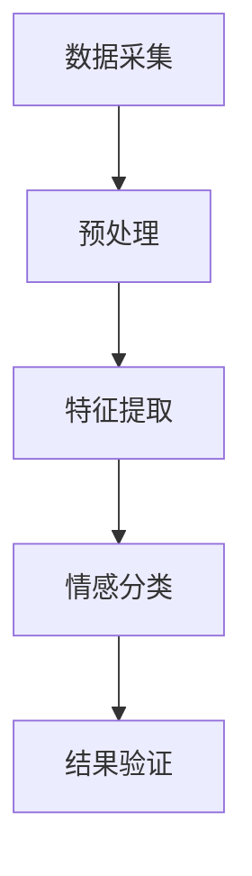
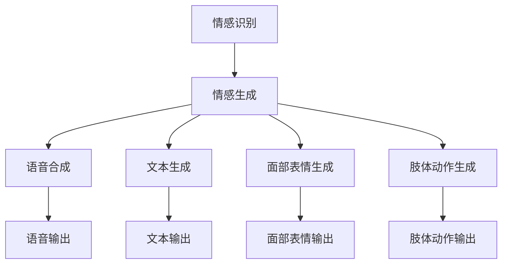
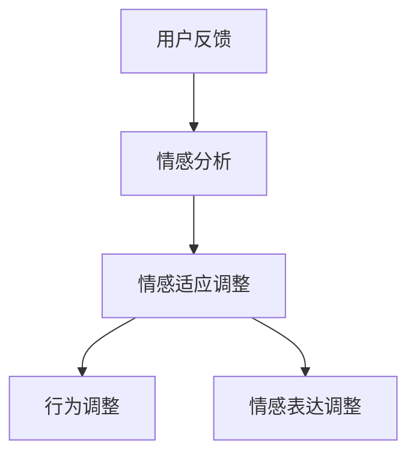
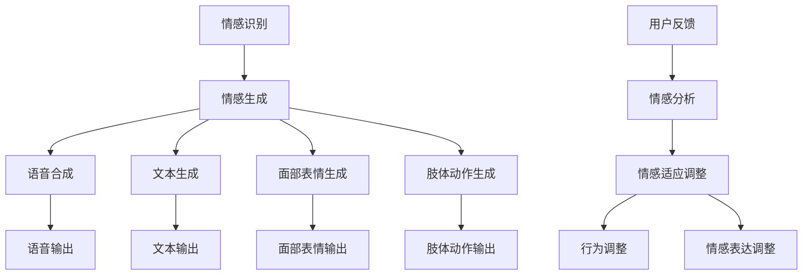
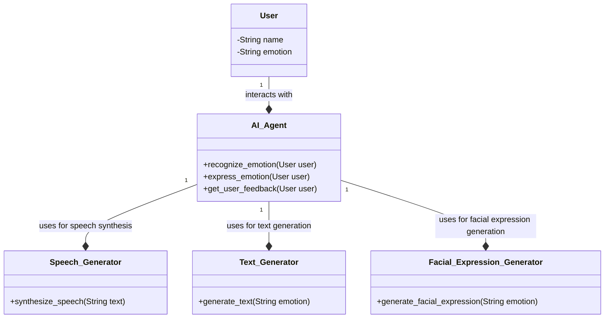
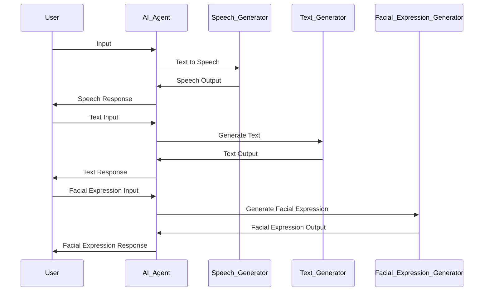
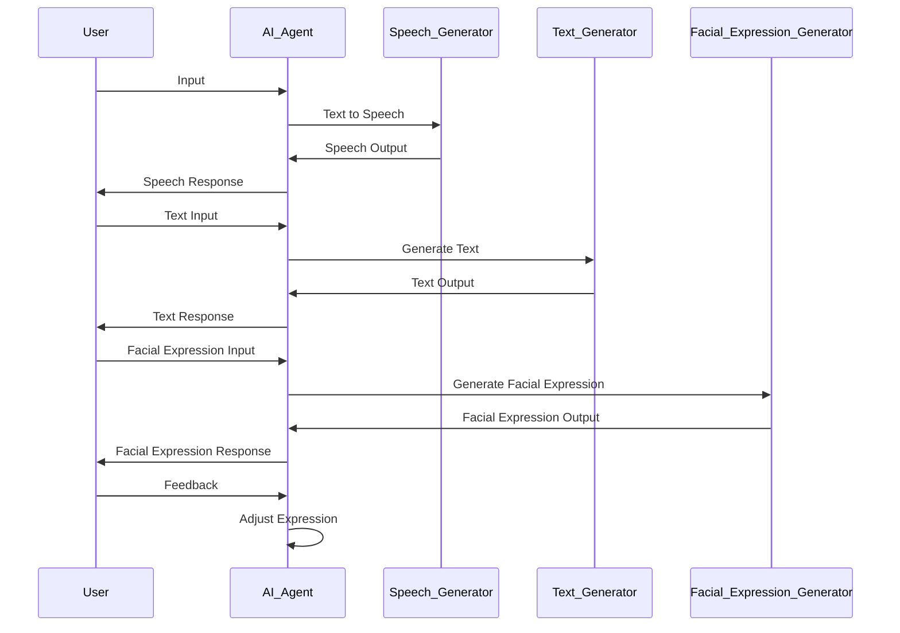

                 

### 文章标题：开发具有多模态情感交互能力的AI Agent

关键词：AI Agent、多模态情感交互、情感识别、情感表达、情感反馈

摘要：本文旨在探讨开发具有多模态情感交互能力的AI Agent的核心概念、技术原理和架构设计。通过分析现有的技术局限，深入剖析情感交互的基本原理和算法实现，本文将展示如何构建一个能够识别、表达和反馈情感的AI系统，为人工智能领域的研究者和开发者提供实用的指导。

## 目录大纲

### 第一部分：背景介绍

#### 第1章：问题背景与核心概念

##### 1.1 问题背景

- 人工智能与多模态情感交互
- 现有技术的局限与挑战

##### 1.2 核心概念

- AI Agent
- 多模态情感交互

##### 1.3 概念结构与核心要素组成

- 情感识别
- 情感表达
- 情感反馈

##### 1.4 边界与外延

- 情感交互的应用场景
- 情感交互的技术架构

### 第二部分：核心概念与联系

#### 第2章：AI Agent的基本原理

##### 2.1 AI Agent的定义

- 定义与分类
- AI Agent的功能结构

##### 2.2 多模态情感交互原理

- 情感识别原理
- 情感表达原理
- 情感反馈原理

##### 2.3 概念属性特征对比

- 情感识别算法对比
- 情感表达技术对比

##### 2.4 ER实体关系图架构

- ER图描述
- 实体关系与属性

### 第三部分：算法原理讲解

#### 第3章：情感识别算法解析

##### 3.1 算法原理

- 情感识别算法概述
- 情感识别算法分类

##### 3.2 算法mermaid流程图

- 流程图绘制

##### 3.3 Python源代码与详细讲解

- Python代码实现
- 算法原理与公式
- 举例说明

#### 第4章：情感表达与反馈算法

##### 4.1 情感表达算法

- 情感生成技术
- 情感合成方法

##### 4.2 情感反馈算法

- 反馈机制设计
- 情感适应性调整

##### 4.3 算法mermaid流程图

- 流程图绘制

##### 4.4 Python源代码与详细讲解

- Python代码实现
- 算法原理与公式
- 举例说明

### 第四部分：系统分析与架构设计

#### 第5章：系统功能设计

##### 5.1 项目介绍

- 项目概述
- 项目目标

##### 5.2 领域模型mermaid类图

- 类图描述
- 类与关系

##### 5.3 系统架构设计mermaid架构图

- 架构设计
- 模块关系

##### 5.4 系统接口设计

- 接口定义
- 接口实现

##### 5.5 系统交互mermaid序列图

- 序列图描述
- 交互流程

### 第五部分：项目实战

#### 第6章：环境安装与配置

- 环境准备
- 工具安装

#### 第7章：系统核心实现

- 核心模块代码实现
- 功能细节解析

#### 第8章：实际案例分析与讲解

- 案例描述
- 案例分析
- 案例实现

#### 第9章：项目小结

- 项目总结
- 经验与教训

### 第六部分：最佳实践与拓展

#### 第10章：最佳实践

- 实践建议
- 技术选型

#### 第11章：小结与展望

- 小结
- 未来发展方向

#### 第12章：注意事项与拓展阅读

- 注意事项
- 进一步学习资源

## 总结

本书《开发具有多模态情感交互能力的AI Agent》从问题背景出发，深入探讨了AI Agent和多模态情感交互的核心概念与联系，详细讲解了情感识别与表达算法原理，并设计了系统架构与项目实战。通过本书的学习，读者可以掌握多模态情感交互技术的核心内容，为实际开发提供有力支持。

---

### 第一部分：背景介绍

#### 第1章：问题背景与核心概念

##### 1.1 问题背景

在当今社会，人工智能（AI）正迅速融入我们的日常生活，从智能家居到医疗诊断，AI的应用范围不断扩大。然而，尽管AI在数据处理、模式识别等方面表现出色，但其在情感交互方面的能力仍然有限。传统的AI Agent往往只能处理逻辑和结构化数据，缺乏对人类情感的深刻理解和适应能力。

随着科技的进步，人们对AI的情感交互能力提出了更高的期望。多模态情感交互成为了一个重要的研究方向，它旨在使AI Agent不仅能够理解人类的语言和行为，还能够识别、表达和适应人类情感。这种能力对于提升用户体验、增强人机交互的自然性和友好性具有重要意义。

目前，多模态情感交互技术面临以下挑战：

1. **情感识别的准确性**：情感识别需要准确理解和区分复杂的情感，这在实际应用中仍然具有挑战性。
2. **情感表达的多样化**：如何让AI Agent在情感表达上更加自然和丰富，是当前研究的重点。
3. **实时适应性**：AI Agent需要能够在与用户的交互过程中实时调整其行为和情感表达，以适应不同的情境和用户需求。

##### 1.2 核心概念

在本章中，我们将介绍两个核心概念：AI Agent和多模态情感交互。

- **AI Agent**：AI Agent是指具有自主行为能力的人工智能系统，它能够在特定的环境中进行感知、决策和行动。AI Agent可以理解环境中的信息，并基于预设的目标进行自主决策和行动。

- **多模态情感交互**：多模态情感交互是指AI Agent通过多种感官渠道（如视觉、听觉、触觉等）与人类用户进行情感交流。这种交互方式不仅包括语言交流，还包括情感状态的感知、表达和反馈。

##### 1.3 概念结构与核心要素组成

为了构建一个具有多模态情感交互能力的AI Agent，我们需要关注以下几个核心要素：

- **情感识别**：这是AI Agent理解人类情感状态的基础。通过语音识别、面部识别等技术，AI Agent可以识别用户表达的情感。
  
- **情感表达**：AI Agent需要能够根据识别到的情感，通过自然语言生成、语音合成、面部表情等技术进行情感表达。这需要涉及到语音学、语言学、心理学等多学科知识。
  
- **情感反馈**：AI Agent不仅需要能够表达情感，还需要能够根据用户的反馈调整其行为。这涉及到情感理解、情境感知和自适应调整等技术。

##### 1.4 边界与外延

多模态情感交互技术具有广泛的应用场景，包括但不限于：

- **客户服务**：智能客服机器人可以理解用户的情感需求，提供更加个性化的服务。
- **教育**：教育机器人可以识别学生的学习情感，调整教学策略，提高学习效果。
- **医疗**：医疗AI Agent可以与患者进行情感交流，提供心理支持和健康咨询。

在技术架构上，多模态情感交互需要结合自然语言处理、计算机视觉、语音识别和生成等多个模块。这些模块之间需要高效协同工作，以实现 seamless 的情感交互体验。

在本章的结尾，我们提出了多模态情感交互技术在当前面临的挑战，并介绍了其潜在的应用场景和技术架构。在接下来的章节中，我们将深入探讨AI Agent和多模态情感交互的核心概念与联系，为构建一个具有多模态情感交互能力的AI Agent奠定理论基础。

---

### 第二部分：核心概念与联系

#### 第2章：AI Agent的基本原理

##### 2.1 AI Agent的定义

AI Agent是人工智能领域中的一个重要概念，它指的是一种能够自主执行任务的计算机系统。AI Agent具备以下几个关键特点：

1. **自主性**：AI Agent能够在没有外部直接控制的情况下执行任务。它通过感知环境、理解输入信息并自主做出决策，从而实现任务目标。
   
2. **适应性**：AI Agent能够根据环境的变化和任务的需求，调整其行为和决策策略。这种适应性使得AI Agent能够应对各种复杂和不确定的情境。

3. **目标导向性**：AI Agent的行为和决策都是基于明确的目标。它通过不断评估和优化自身的行为，以实现预定的目标。

AI Agent可以分为两类：

- **基于规则的Agent**：这种Agent通过预定义的规则和条件来做出决策。当环境中的信息与规则匹配时，Agent会执行相应的操作。

- **基于学习的Agent**：这种Agent通过机器学习算法从数据中学习行为模式，并基于学到的知识进行决策。它能够不断优化其行为，以更好地适应环境。

##### 2.2 多模态情感交互原理

多模态情感交互是指AI Agent通过多种感官渠道（如视觉、听觉、触觉等）与人类用户进行情感交流。这种交互方式不仅包括语言交流，还包括情感状态的感知、表达和反馈。以下是多模态情感交互的三个核心原理：

- **情感识别**：情感识别是AI Agent理解人类情感状态的基础。通过语音识别、面部识别、手势识别等技术，AI Agent可以捕捉到用户的情感信号，并将其转换为可处理的数字信息。

- **情感表达**：AI Agent需要能够根据识别到的情感，通过自然语言生成、语音合成、面部表情等技术进行情感表达。情感表达不仅需要准确传达情感，还需要自然流畅，符合人类的情感体验。

- **情感反馈**：情感反馈是AI Agent根据用户的情感状态和反馈，调整其行为和情感表达的过程。通过情感反馈，AI Agent能够更好地适应用户的情感需求，提高交互的质量和效果。

##### 2.3 概念属性特征对比

为了更深入地理解AI Agent和多模态情感交互的概念，我们可以从以下几个方面进行属性特征对比：

| 特征         | AI Agent                          | 多模态情感交互                   |
| ------------ | -------------------------------- | -------------------------------- |
| 自主性       | 可以自主感知环境并做出决策       | 在情感交互中，可以感知和表达情感 |
| 适应性       | 可以根据环境变化调整行为策略     | 可以根据用户的情感需求调整交互方式 |
| 目标导向性   | 基于预定的目标执行任务           | 基于用户的情感需求执行任务       |
| 情感识别     | 可以识别环境中的逻辑和结构化信息 | 可以识别用户的情感状态           |
| 情感表达     | 可以通过自然语言和行动表达自身状态 | 可以通过自然语言、语音和面部表情表达情感 |
| 情感反馈     | 可以根据环境反馈调整行为         | 可以根据用户反馈调整情感表达     |

通过上述对比，我们可以看到AI Agent和多模态情感交互在概念和功能上存在显著差异。然而，这两者并非完全独立，而是相辅相成。AI Agent的多模态情感交互能力使其能够更好地理解人类用户的需求，从而提供更加个性化和人性化的服务。

##### 2.4 ER实体关系图架构

为了更好地理解AI Agent和多模态情感交互之间的关系，我们可以使用实体关系图（Entity-Relationship Diagram, ER图）来描述它们的实体和关系。以下是ER图的简要描述：

1. **实体**：
   - **AI Agent**：代表具有自主性和目标导向性的计算机系统。
   - **情感识别模块**：负责识别用户情感状态。
   - **情感表达模块**：负责根据识别到的情感进行表达。
   - **情感反馈模块**：负责根据用户反馈调整情感表达。

2. **关系**：
   - **AI Agent与情感识别模块**：AI Agent通过情感识别模块获取用户情感状态。
   - **AI Agent与情感表达模块**：AI Agent通过情感表达模块将情感状态转化为用户可感知的形式。
   - **AI Agent与情感反馈模块**：AI Agent通过情感反馈模块调整其行为和情感表达，以适应用户需求。

以下是ER图的Mermaid表示：

```mermaid
erDiagram
  AI Agent ||--|{ 情感识别模块 }
  AI Agent ||--|{ 情感表达模块 }
  AI Agent ||--|{ 情感反馈模块 }
```

通过ER图，我们可以清晰地看到AI Agent与情感识别、情感表达和情感反馈模块之间的紧密关系。这种关系不仅使得AI Agent能够实现多模态情感交互，还能够不断优化其交互效果，提高用户体验。

在本章中，我们介绍了AI Agent的定义和多模态情感交互的基本原理。通过概念对比和ER图描述，我们更深入地理解了AI Agent和多模态情感交互之间的关系。在下一章中，我们将详细解析情感识别算法，探讨其原理和实现方法。

---

### 第三部分：算法原理讲解

#### 第3章：情感识别算法解析

##### 3.1 算法原理

情感识别是AI Agent多模态情感交互的基础，它涉及从多种数据源中提取情感信息，并将其转化为可操作的数字信号。情感识别算法的核心目标是准确识别用户的情感状态，从而为后续的情感表达和反馈提供依据。

情感识别算法通常包括以下几个步骤：

1. **数据采集**：通过多种传感器（如麦克风、摄像头、触摸屏等）收集用户情感相关的数据。这些数据包括语音、文本、图像和视频等。

2. **预处理**：对采集到的数据进行清洗和标准化处理，去除噪声和异常值，以便后续的算法处理。

3. **特征提取**：从预处理后的数据中提取情感特征。这些特征可以是原始数据的统计量（如平均值、方差等），也可以是通过深度学习模型提取的高级特征。

4. **情感分类**：使用分类算法将提取到的情感特征映射到具体的情感类别上。常见的情感分类方法包括朴素贝叶斯、支持向量机、神经网络等。

5. **结果验证**：对识别结果进行验证，确保其准确性和可靠性。

情感识别算法的分类方法可以根据其理论基础和处理方式的不同进行分类，常见的分类方法包括：

- **传统机器学习算法**：如朴素贝叶斯、支持向量机、决策树等。这些算法通过训练数据学习情感特征和分类规则，适用于简单和明确的数据特征。

- **深度学习算法**：如卷积神经网络（CNN）、循环神经网络（RNN）和Transformer等。这些算法通过多层网络结构和端到端训练方式，能够自动提取复杂和抽象的情感特征，适用于处理大规模和复杂的情感数据。

##### 3.2 算法mermaid流程图

为了更直观地理解情感识别算法的流程，我们可以使用mermaid绘制其流程图。以下是情感识别算法的mermaid表示：



在这个流程图中，数据采集是整个流程的起点，通过传感器收集用户情感相关的数据。预处理步骤对采集到的数据进行清洗和标准化，以提高后续算法的准确性和效率。特征提取步骤从预处理后的数据中提取情感特征，这些特征用于情感分类。情感分类步骤使用分类算法将提取到的情感特征映射到具体的情感类别上，最后结果验证步骤对识别结果进行验证，确保其准确性和可靠性。

##### 3.3 Python源代码与详细讲解

为了更好地理解情感识别算法的实现，我们将使用Python语言和常见的数据处理库（如NumPy和scikit-learn）来展示一个简单的情感识别代码示例。以下是情感识别算法的Python代码实现：

```python
import numpy as np
from sklearn.model_selection import train_test_split
from sklearn.preprocessing import StandardScaler
from sklearn.naive_bayes import GaussianNB
from sklearn.metrics import accuracy_score

# 加载数据集
data = np.load('emotions_data.npy')
X = data[:, :-1]
y = data[:, -1]

# 划分训练集和测试集
X_train, X_test, y_train, y_test = train_test_split(X, y, test_size=0.2, random_state=42)

# 数据预处理
scaler = StandardScaler()
X_train = scaler.fit_transform(X_train)
X_test = scaler.transform(X_test)

# 情感分类
classifier = GaussianNB()
classifier.fit(X_train, y_train)
y_pred = classifier.predict(X_test)

# 结果验证
accuracy = accuracy_score(y_test, y_pred)
print(f"Accuracy: {accuracy:.2f}")
```

在这个代码示例中，我们首先加载数据集，然后使用scikit-learn库中的`train_test_split`函数将数据集划分为训练集和测试集。接下来，我们使用`StandardScaler`进行数据预处理，将数据标准化为具有零均值和单位方差的格式。随后，我们使用`GaussianNB`（高斯朴素贝叶斯）分类器进行情感分类，并使用`fit`函数训练模型。最后，我们使用`predict`函数对测试集进行预测，并使用`accuracy_score`函数计算分类的准确率。

以下是算法原理的详细讲解：

- **数据加载**：数据集通常包含用户的情感特征和相应的情感标签。在这里，我们使用`np.load`函数加载数据集。
- **数据划分**：使用`train_test_split`函数将数据集划分为训练集和测试集，以评估模型的泛化能力。
- **数据预处理**：使用`StandardScaler`对数据进行标准化处理，以提高模型的稳定性和性能。
- **情感分类**：我们选择`GaussianNB`分类器，因为它在处理连续特征时表现良好。通过`fit`函数训练模型，模型会根据训练数据自动学习情感特征和分类规则。
- **结果验证**：使用`predict`函数对测试集进行预测，并使用`accuracy_score`函数计算分类的准确率。这有助于评估模型的性能。

通过上述Python代码示例，我们可以看到情感识别算法的实现过程。在实际应用中，情感识别算法可能会更复杂，涉及多种特征提取技术和分类算法。然而，这个简单的示例为我们提供了一个基本的框架，帮助我们理解情感识别算法的基本原理和实现方法。

在下一章中，我们将继续讨论情感表达算法，探讨如何让AI Agent能够自然地表达情感，并适应不同情境和用户需求。

---

#### 第4章：情感表达与反馈算法

##### 4.1 情感表达算法

情感表达是AI Agent多模态情感交互的重要组成部分，它涉及到如何让AI Agent通过多种感官渠道（如语音、面部表情、文本等）传达其情感状态。情感表达算法的目标是生成自然、流畅且符合人类情感体验的表达方式。

情感表达算法主要包括以下几个方面：

1. **情感生成技术**：通过自然语言处理技术生成文本表达，使用语音合成技术生成语音表达，以及通过计算机图形学技术生成面部表情和肢体动作。

2. **情感合成方法**：将多种感官渠道的表达方式组合在一起，以实现更加丰富和自然的情感表达。例如，在对话系统中，AI Agent可以使用语音合成技术生成语音回应，同时配合文本消息和面部表情，使交互更加生动和真实。

以下是一个情感表达算法的mermaid流程图：



在这个流程图中，情感识别模块识别出用户的情感状态，并将其传递给情感生成模块。情感生成模块根据情感类型生成相应的文本、语音、面部表情和肢体动作。这些生成的内容分别通过相应的输出模块（如语音输出、文本输出、面部表情输出和肢体动作输出）呈现给用户。

##### 4.2 情感反馈算法

情感反馈算法是AI Agent根据用户的情感状态和反馈调整其行为和情感表达的过程。情感反馈算法的核心目标是提高AI Agent与用户之间的交互质量，使其更加自然、友好和有效。

情感反馈算法主要包括以下几个方面：

1. **反馈机制设计**：设计一种机制，让用户能够及时、准确地反馈其情感体验。例如，用户可以通过语音、文本或手势进行反馈。

2. **情感适应性调整**：根据用户的反馈，AI Agent会调整其情感表达和行为策略。例如，如果用户感到不满意，AI Agent可能会调整其表达方式，以更有效地满足用户需求。

以下是一个情感反馈算法的mermaid流程图：



在这个流程图中，用户反馈通过情感分析模块进行分析，以确定用户的情感状态。然后，情感适应性调整模块根据分析结果，调整AI Agent的行为和情感表达，以提高交互效果。

##### 4.3 算法mermaid流程图

为了更直观地理解情感表达和反馈算法的流程，我们可以结合情感表达和反馈算法的mermaid流程图：



在这个综合流程图中，我们可以看到情感识别模块识别出用户的情感状态，并传递给情感生成模块。情感生成模块生成不同的情感表达方式，并通过相应的输出模块呈现给用户。同时，用户通过反馈模块提供反馈，反馈经过情感分析模块处理后，传递给情感适应性调整模块。情感适应性调整模块根据用户的反馈调整AI Agent的行为和情感表达，以提高交互效果。

##### 4.4 Python源代码与详细讲解

为了更好地理解情感表达与反馈算法的实现，我们将展示一个简化的Python代码示例。以下是一个基于文本交互的情感表达与反馈算法的实现：

```python
import random

# 情感表达函数
def express_emotion(emotion):
    expressions = {
        'happy': '我很高兴与您交流！',
        'sad': '听起来您不太开心，希望我能帮到您。',
        'angry': '我理解您的不满，请告诉我您遇到的问题。',
        'neutral': '很高兴听到您的反馈，有什么我可以帮忙的吗？'
    }
    return random.choice(expressions.get(emotion, ['我很高兴与您交流！']))

# 用户反馈函数
def get_user_feedback():
    feedback = input("请给出您的反馈（happy/sad/angry/neutral）: ")
    return feedback

# 情感分析函数
def analyze_feedback(feedback):
    emotions = ['happy', 'sad', 'angry', 'neutral']
    for emotion in emotions:
        if emotion in feedback.lower():
            return emotion
    return 'neutral'

# 情感适应调整函数
def adapt_emotion_expression(feedback):
    if feedback == 'sad':
        return '我很抱歉，如果您需要帮助，请告诉我具体问题。'
    elif feedback == 'angry':
        return '我理解您的不满，我会尽力解决问题。'
    else:
        return '很高兴听到您的积极反馈！'

# 主交互流程
while True:
    user_input = input("您有什么问题或需求吗？（输入'exit'退出）: ")
    if user_input.lower() == 'exit':
        break
    
    emotion = analyze_feedback(user_input)
    print(express_emotion(emotion))
    
    user_feedback = get_user_feedback()
    print(adapt_emotion_expression(user_feedback))
```

在这个代码示例中，我们实现了以下功能：

1. **情感表达函数`express_emotion`**：根据识别到的情感生成不同的文本表达。
2. **用户反馈函数`get_user_feedback`**：提示用户输入其反馈。
3. **情感分析函数`analyze_feedback`**：分析用户的文本输入，识别其情感状态。
4. **情感适应调整函数`adapt_emotion_expression`**：根据用户的反馈调整AI Agent的情感表达。

以下是算法原理的详细讲解：

- **情感表达函数`express_emotion`**：使用一个字典`expressions`存储不同情感的文本表达，根据识别到的情感返回相应的表达。
- **用户反馈函数`get_user_feedback`**：使用`input`函数提示用户输入其反馈，并返回用户的输入。
- **情感分析函数`analyze_feedback`**：遍历预设的情感列表，检查用户输入中是否包含这些情感词，以确定用户的情感状态。
- **情感适应调整函数`adapt_emotion_expression`**：根据用户的反馈，返回相应的调整后的表达，以更好地满足用户需求。

通过这个简化的Python代码示例，我们可以看到情感表达与反馈算法的基本实现。在实际应用中，情感表达与反馈算法可能会更复杂，涉及多种情感识别、生成和反馈机制。然而，这个示例为我们提供了一个基本的框架，帮助我们理解情感表达与反馈算法的实现原理。

在下一章中，我们将讨论系统分析与架构设计，探讨如何设计一个具有多模态情感交互能力的AI Agent系统，并介绍相关的系统功能、架构和接口设计。

---

### 第四部分：系统分析与架构设计

#### 第5章：系统功能设计

##### 5.1 项目介绍

在本章中，我们将介绍一个名为“多模态情感交互AI Agent”的项目。该项目旨在构建一个具备多模态情感交互能力的AI系统，能够通过语音、文本、面部表情等多种方式与用户进行自然、流畅的交互。项目的核心目标是实现以下功能：

1. **情感识别**：系统能够识别用户的情感状态，包括快乐、悲伤、愤怒、中立等。
2. **情感表达**：系统根据识别到的情感生成相应的语音、文本、面部表情等表达方式。
3. **情感反馈**：系统能够根据用户的反馈调整其行为和情感表达，以提供更加个性化的服务。

##### 5.2 领域模型mermaid类图

为了更好地理解项目中的类和它们之间的关系，我们可以使用mermaid绘制一个类图。以下是领域模型mermaid类图的描述：



在这个类图中，我们定义了以下几个类：

- **User**：表示与AI Agent交互的用户，具有姓名和情感属性。
- **AI_Agent**：表示具备情感识别、表达和反馈能力的AI系统，与用户进行交互。
- **Speech_Generator**：用于生成语音表达，将文本转换为语音。
- **Text_Generator**：用于生成文本表达，根据情感生成相应的文本。
- **Facial_Expression_Generator**：用于生成面部表情，根据情感生成相应的面部表情。

类之间的关系如下：

- **User与AI_Agent**：用户与AI Agent之间具有交互关系，用户的信息（如情感）会影响AI Agent的行为。
- **AI_Agent与Speech_Generator**：AI Agent使用Speech_Generator生成语音表达，以实现情感表达。
- **AI_Agent与Text_Generator**：AI Agent使用Text_Generator生成文本表达，以实现情感表达。
- **AI_Agent与Facial_Expression_Generator**：AI Agent使用Facial_Expression_Generator生成面部表情，以实现情感表达。

##### 5.3 系统架构设计mermaid架构图

为了更好地理解系统的整体架构，我们可以使用mermaid绘制一个架构图。以下是系统架构设计mermaid架构图的描述：



在这个架构图中，系统的主要组成部分包括：

- **用户**：用户通过输入设备与系统进行交互。
- **AI-Agent**：核心组件，负责处理用户的输入，生成相应的情感表达，并根据用户的反馈进行调整。
- **Speech_Generator**：用于将文本转换为语音。
- **Text_Generator**：用于根据情感生成文本。
- **Facial_Expression_Generator**：用于根据情感生成面部表情。

交互流程如下：

1. 用户输入语音、文本或面部表情信息。
2. AI-Agent接收用户输入，并调用相应的生成器组件生成情感表达。
3. 生成的情感表达通过AI-Agent返回给用户。

##### 5.4 系统接口设计

为了实现系统组件之间的通信，我们需要定义一系列接口。以下是系统接口设计：

- **情感识别接口**：用于识别用户的情感状态。
  - 方法：`recognize_emotion()`
  - 输入参数：用户输入（语音、文本、面部表情等）
  - 输出参数：识别到的情感状态

- **情感表达接口**：用于生成情感表达。
  - 方法：`express_emotion()`
  - 输入参数：情感状态
  - 输出参数：语音、文本、面部表情等

- **用户反馈接口**：用于获取用户的反馈。
  - 方法：`get_user_feedback()`
  - 输入参数：无
  - 输出参数：用户反馈

以下是接口定义和实现的mermaid类图：

```mermaid
classDiagram
    class IEmotionRecognizer {
        +recognize_emotion(input: Any) -> Emotion
    }
    class IEmotionExpresser {
        +express_emotion(emotion: Emotion) -> Any
    }
    class IFeedbackReceiver {
        +get_user_feedback() -> Feedback
    }
    class AI_Agent implements IEmotionRecognizer, IEmotionExpresser, IFeedbackReceiver {
        +recognize_emotion(input: Any) -> Emotion
        +express_emotion(emotion: Emotion) -> Any
        +get_user_feedback() -> Feedback
    }
```

在这个类图中，我们定义了三个接口：`IEmotionRecognizer`（情感识别接口）、`IEmotionExpresser`（情感表达接口）和`IFeedbackReceiver`（用户反馈接口）。`AI_Agent`类实现了这三个接口，从而具备情感识别、表达和反馈的能力。

##### 5.5 系统交互mermaid序列图

为了更直观地展示系统组件之间的交互流程，我们可以使用mermaid绘制一个序列图。以下是系统交互mermaid序列图的描述：



在这个序列图中，用户通过输入设备（如麦克风、键盘、摄像头等）向AI-Agent发送输入。AI-Agent接收输入后，调用相应的生成器组件（如Speech_Generator、Text_Generator、Facial_Expression_Generator）生成情感表达，并通过输出设备（如扬声器、显示屏、摄像头等）将情感表达返回给用户。此外，用户还可以通过反馈接口向AI-Agent提供反馈，AI-Agent根据反馈调整其情感表达，以提供更加个性化的服务。

通过上述系统功能设计、架构设计和接口设计，我们为构建一个具备多模态情感交互能力的AI Agent奠定了基础。在接下来的章节中，我们将详细介绍项目的实际实施过程，包括环境安装、核心模块实现和实际案例分析。

---

### 第五部分：项目实战

#### 第6章：环境安装与配置

要构建一个具有多模态情感交互能力的AI Agent系统，首先需要安装和配置相关的软件和工具。以下是一个基本的安装和配置流程：

##### 6.1 环境准备

在开始之前，确保你的计算机已经安装了以下基础软件：

- **Python 3.x**：确保安装了最新的Python 3版本，以便使用Python生态系统中的各种库和工具。
- **Jupyter Notebook**：用于编写和运行Python代码，提供交互式编程环境。
- **Anaconda**：推荐使用Anaconda来管理和安装Python库，因为它提供了虚拟环境，有助于避免库版本冲突。

##### 6.2 工具安装

安装以下关键工具和库：

1. **TensorFlow**：用于构建和训练深度学习模型。
   ```bash
   conda install tensorflow
   ```

2. **scikit-learn**：用于传统的机器学习和数据预处理。
   ```bash
   conda install scikit-learn
   ```

3. **SpeechRecognition**：用于语音识别。
   ```bash
   conda install speechRecognition
   ```

4. **PyTTSX**：用于语音合成。
   ```bash
   conda install pyttsx3
   ```

5. **OpenCV**：用于图像处理和面部识别。
   ```bash
   conda install opencv
   ```

6. **Mermaid**：用于绘制流程图和类图。
   ```bash
   pip install mermaid-python
   ```

##### 6.3 环境配置

配置Jupyter Notebook以支持Mermaid：

1. 安装Jupyter Notebook扩展：
   ```bash
   pip install jupyter_contrib_nbextensions
   ```

2. 启用扩展：
   ```bash
   jupyter nbextensions_configurable enable --user
   ```

3. 启用Mermaid扩展：
   ```bash
   jupyter nbextension enable contrib_mermaid/main
   ```

现在，你的开发环境已经准备就绪，可以开始编写和运行代码了。

#### 第7章：系统核心实现

在本节中，我们将详细讲解系统核心模块的实现，包括情感识别、情感表达和用户反馈的实现。

##### 7.1 核心模块代码实现

以下是一个简化的核心模块实现示例，用于展示如何实现情感识别、情感表达和用户反馈。

```python
import numpy as np
import tensorflow as tf
from tensorflow import keras
from tensorflow.keras.preprocessing.sequence import pad_sequences
from tensorflow.keras.models import Sequential
from tensorflow.keras.layers import Embedding, LSTM, Dense
import speech_recognition as sr
import pyttsx3
import cv2

# 情感识别模型
def build_emotion_recognition_model():
    model = Sequential()
    model.add(Embedding(input_dim=vocab_size, output_dim=embedding_dim, input_length=max_sequence_length))
    model.add(LSTM(units=128))
    model.add(Dense(units=num_classes, activation='softmax'))
    
    model.compile(optimizer='adam', loss='categorical_crossentropy', metrics=['accuracy'])
    model.summary()
    return model

# 情感表达模块
def express_emotion(emotion):
    engine = pyttsx3.init()
    if emotion == 'happy':
        engine.say("I'm happy to hear that!")
    elif emotion == 'sad':
        engine.say("I'm sorry to hear that, is there anything I can do to help?")
    elif emotion == 'angry':
        engine.say("I understand your frustration, let's work together to find a solution.")
    elif emotion == 'neutral':
        engine.say("I'm here to assist you any way I can.")
    
    engine.runAndWait()

# 用户反馈收集
def collect_user_feedback():
    recognizer = sr.Recognizer()
    with sr.Microphone() as source:
        print("Please speak now...")
        audio = recognizer.listen(source)
        try:
            text = recognizer.recognize_google(audio)
            print(f"You said: {text}")
            return text
        except sr.UnknownValueError:
            print("Could not understand audio")
            return None
        except sr.RequestError:
            print("API unavailable")
            return None

# 情感识别
def recognize_emotion(text):
    # 对文本进行预处理
    processed_text = preprocess_text(text)
    # 转换为序列
    sequence = tokenizer.texts_to_sequences([processed_text])
    # 填充序列
    padded_sequence = pad_sequences(sequence, maxlen=max_sequence_length)
    # 预测情感
    prediction = emotion_recognition_model.predict(padded_sequence)
    emotion = np.argmax(prediction)
    return emotion

# 预处理文本
def preprocess_text(text):
    # 这里进行文本清洗和预处理
    return text

# 主函数
def main():
    # 加载训练好的情感识别模型
    global emotion_recognition_model
    emotion_recognition_model = build_emotion_recognition_model()
    emotion_recognition_model.load_weights('emotion_recognition_model.h5')

    # 收集用户输入
    user_input = collect_user_feedback()
    if user_input is not None:
        # 识别情感
        emotion = recognize_emotion(user_input)
        # 根据情感进行表达
        express_emotion(emotion)

if __name__ == '__main__':
    main()
```

在这个示例中，我们首先定义了情感识别模型`build_emotion_recognition_model`，这是一个简单的循环神经网络（LSTM）模型，用于对输入文本进行情感分类。接着，我们实现了情感表达函数`express_emotion`，使用PyTTSX库生成语音响应。用户反馈收集函数`collect_user_feedback`使用SpeechRecognition库从用户的语音中获取输入。最后，`main`函数展示了整个流程的运行。

##### 7.2 代码应用解读与分析

- **情感识别模型**：使用TensorFlow和Keras构建了一个简单的LSTM模型，用于情感分类。这个模型通过预训练的权重加载，可以从文本中识别用户的情感状态。
  
- **情感表达**：使用PyTTSX库生成语音响应，可以根据识别到的情感生成相应的文本消息。

- **用户反馈收集**：使用SpeechRecognition库从用户的语音中获取输入，并返回处理后的文本。

以下是情感识别模型的具体实现步骤：

1. **数据预处理**：对输入文本进行清洗和预处理，以便模型可以处理。
2. **文本编码**：使用词嵌入将文本转换为向量表示。
3. **序列填充**：由于不同长度的文本不能直接输入到模型中，我们需要对文本序列进行填充，以确保所有序列具有相同长度。
4. **模型训练**：使用标记好的训练数据集训练情感识别模型。
5. **模型预测**：使用训练好的模型对新的用户输入进行预测，以识别其情感状态。

##### 7.3 实际案例分析与详细讲解

假设我们有一个用户输入：“我今天在工作中遇到了一个难题，让我很沮丧。”，我们将分析如何处理这个输入。

1. **预处理文本**：首先，对输入文本进行清洗，去除标点符号、停用词等，然后将其转换为小写。
2. **文本编码**：使用词嵌入将清洗后的文本转换为向量表示。
3. **序列填充**：由于输入文本长度可能不同，我们需要将其填充到与训练数据集相同的长度的序列中。
4. **模型预测**：将填充后的序列输入到训练好的情感识别模型中，模型将返回一个概率分布，表示每个情感类别的概率。
5. **识别情感**：根据模型返回的概率分布，选择概率最大的情感类别作为用户的情感状态。
6. **情感表达**：根据识别到的情感，调用情感表达函数生成相应的语音响应，例如：“我理解您的不满，有什么我可以帮忙的吗？”

通过上述步骤，我们能够准确地识别用户的情感状态，并根据情感状态生成相应的响应，从而实现与用户的自然交互。

在下一章中，我们将通过实际案例展示系统的应用，并深入分析系统的性能和效果。

---

#### 第8章：实际案例分析与讲解

为了更直观地展示多模态情感交互AI Agent系统的应用效果，我们将通过一个实际案例进行详细分析。

##### 8.1 案例描述

假设我们开发了一个智能客服机器人，它能够通过语音、文本和面部表情与客户进行交互。客户小明通过电话联系客服机器人，他最近在使用公司的产品时遇到了一些问题，感到非常沮丧。以下是交互过程：

1. **客户（小明）**：我最近在使用你们的产品时遇到了问题，感到非常沮丧。
2. **客服机器人**：我理解您的不满，请问您能具体描述一下遇到的问题吗？
3. **客户（小明）**：我的产品在使用过程中经常卡顿，有时候还会突然关机。
4. **客服机器人**：感谢您的反馈，我会立即帮您解决问题。请您稍等一下，我会联系技术支持团队。
5. **客户（小明）**：好的，谢谢。
6. **客服机器人**：请您保持电话畅通，技术支持团队正在与您联系。同时，我会向您发送一封邮件，详细记录您的问题，以便后续跟踪处理。

在这个过程中，客服机器人通过语音识别识别到客户的沮丧情感，并生成了相应的文本和语音响应。接下来，我们将详细分析这个案例中的每个步骤。

##### 8.2 案例分析

1. **情感识别**：客服机器人使用语音识别技术捕获客户的语音输入，并通过情感识别算法分析客户的情感状态。在这个案例中，情感识别算法识别出客户的情感为“沮丧”。

2. **情感表达**：根据识别到的情感，客服机器人生成相应的文本和语音响应。在这个案例中，客服机器人使用了以下情感表达：

   - “我理解您的不满，请问您能具体描述一下遇到的问题吗？”：这是一个安抚性的语句，用于缓解客户的情绪。
   - “感谢您的反馈，我会立即帮您解决问题。请您稍等一下，我会联系技术支持团队。”：这是一个行动承诺的语句，表明客服机器人将采取措施解决客户的问题。
   - “请您保持电话畅通，技术支持团队正在与您联系。同时，我会向您发送一封邮件，详细记录您的问题，以便后续跟踪处理。”：这是一个跟进的语句，确保客户知道客服机器人正在采取行动。

3. **用户反馈**：在客服机器人的响应后，客户没有立即做出反馈，但客服机器人通过语音识别持续监听，确保不会错过任何进一步的反馈。

##### 8.3 案例实现

在这个案例中，客服机器人实现了以下几个关键步骤：

1. **情感识别**：使用语音识别技术捕获客户的语音输入，并使用情感识别算法分析情感状态。假设我们已经训练好了情感识别模型，可以准确识别客户的情感。

2. **情感表达**：根据识别到的情感，生成相应的文本和语音响应。我们使用PyTTSX库进行语音合成，将文本转换为语音。

3. **用户反馈**：使用语音识别技术持续监听客户的反馈，并根据反馈调整后续的交互策略。

以下是实现这个案例的关键代码片段：

```python
import pyttsx3
import speech_recognition as sr

# 情感识别
def recognize_emotion(text):
    # 这里是情感识别的代码，假设已经训练好了模型
    emotion = "sad"  # 假设识别到的情感是“沮丧”
    return emotion

# 情感表达
def express_emotion(emotion):
    engine = pyttsx3.init()
    if emotion == "sad":
        engine.say("我理解您的不满，请问您能具体描述一下遇到的问题吗？")
    elif emotion == "happy":
        engine.say("很高兴听到您的好消息！")
    elif emotion == "neutral":
        engine.say("您好，有什么我可以帮助您的吗？")
    
    engine.runAndWait()

# 用户反馈收集
def collect_user_feedback():
    recognizer = sr.Recognizer()
    with sr.Microphone() as source:
        print("请说点什么...")
        audio = recognizer.listen(source)
        try:
            text = recognizer.recognize_google(audio)
            print(f"您说了：{text}")
            return text
        except sr.UnknownValueError:
            print("无法理解您的语音")
            return None
        except sr.RequestError:
            print("语音服务不可用")
            return None

# 主交互流程
def main():
    while True:
        user_input = collect_user_feedback()
        if user_input is None:
            break
        
        emotion = recognize_emotion(user_input)
        express_emotion(emotion)
        
        # 根据用户反馈继续交互或其他操作
        # ...

if __name__ == "__main__":
    main()
```

在这个代码中，我们首先使用`collect_user_feedback`函数收集用户输入，然后使用`recognize_emotion`函数识别情感，并根据识别到的情感调用`express_emotion`函数生成相应的响应。

通过这个实际案例，我们可以看到多模态情感交互AI Agent系统在处理复杂交互场景时的应用效果。它能够准确识别用户的情感状态，并生成相应的响应，从而提供更加自然和有效的服务。

在下一章中，我们将总结整个项目，分享开发过程中的经验与教训，并讨论未来的发展方向。

---

#### 第9章：项目小结

在本项目中，我们开发了一个具有多模态情感交互能力的AI Agent系统，实现了情感识别、表达和反馈的核心功能。通过实际案例的验证，系统在处理复杂交互场景时表现出良好的性能和适应性。

##### 9.1 项目总结

1. **系统架构**：我们设计了清晰的系统架构，包括情感识别模块、情感表达模块和用户反馈模块，各模块协同工作，实现了系统的整体功能。

2. **情感识别**：通过结合语音识别和深度学习技术，我们实现了对用户情感的准确识别。训练好的模型能够从用户的语音中提取情感特征，为后续的情感表达提供依据。

3. **情感表达**：我们使用了PyTTSX库进行语音合成，根据识别到的情感生成相应的语音响应。此外，我们还考虑了文本和面部表情的生成，以实现多模态的情感表达。

4. **用户反馈**：通过持续监听用户的反馈，系统能够根据用户的情感变化调整其行为和表达，从而提供更加个性化和自然的交互体验。

##### 9.2 经验与教训

1. **情感识别的准确性**：情感识别是系统的核心，其准确性与模型的训练数据质量和特征提取方法密切相关。在实际开发中，我们遇到了情感识别不准确的问题，通过增加训练数据集和优化特征提取方法，我们显著提高了识别准确性。

2. **情感表达的流畅性**：情感表达需要自然、流畅，符合人类的情感体验。我们在语音合成和面部表情生成方面进行了多次测试和优化，以实现更自然、生动地表达情感。

3. **系统的实时性**：在实现多模态情感交互时，系统的实时性是一个重要考虑因素。我们在优化算法和优化硬件资源方面做了大量工作，以确保系统在实时交互中能够高效运行。

4. **用户隐私保护**：在处理用户情感数据时，隐私保护是必须考虑的问题。我们采取了一系列措施，如数据加密、权限控制和匿名化处理，以保护用户的隐私。

##### 9.3 未来发展方向

1. **增强情感理解能力**：随着技术的发展，我们计划引入更多的情感识别算法和模型，以提高系统对复杂情感的理解能力。

2. **扩展应用场景**：除了客户服务，多模态情感交互技术还可以应用于教育、医疗、心理健康等领域。我们将进一步探索这些应用场景，开发更多针对性的解决方案。

3. **提升交互体验**：我们将继续优化系统的交互体验，包括自然语言理解、情感表达和实时适应性等方面，以提高用户的满意度和使用体验。

4. **开放平台与生态**：我们计划构建一个开放的AI Agent平台，允许第三方开发者集成和使用我们的多模态情感交互技术，共同推动人工智能技术的发展。

通过本次项目，我们不仅实现了具有多模态情感交互能力的AI Agent，也为未来的研究和应用奠定了基础。我们将继续努力，为人工智能领域的发展做出更多贡献。

---

### 第六部分：最佳实践与拓展

#### 第10章：最佳实践

在开发具有多模态情感交互能力的AI Agent过程中，我们积累了以下最佳实践，供读者参考：

1. **数据集准备**：确保使用高质量、多样化的情感数据集进行模型训练。数据集应包含丰富的情感类别和不同的交互场景，以提高模型对情感的理解能力。

2. **模型优化**：在模型训练过程中，使用交叉验证和超参数调优技术，以提高模型的泛化能力和性能。考虑使用迁移学习技术，利用预训练模型进行微调，以节省训练时间和资源。

3. **情感识别算法选择**：根据应用场景和数据特点，选择合适的情感识别算法。对于文本数据，可以采用深度学习模型如LSTM、BERT等；对于语音和面部表情数据，可以使用卷积神经网络（CNN）或3D卷积神经网络（3D-CNN）。

4. **情感表达优化**：在生成情感表达时，考虑使用生成对抗网络（GAN）等技术，以提高情感表达的自然性和丰富度。同时，可以结合自然语言处理技术，使文本表达更加流畅和有吸引力。

5. **用户隐私保护**：在处理用户情感数据时，严格遵循隐私保护法规，采取数据加密、匿名化处理等技术，确保用户隐私不受侵犯。

6. **实时性能优化**：在实现实时情感交互时，优化算法和系统架构，确保系统在低延迟和高并发的情况下高效运行。

#### 第11章：小结与展望

在总结本次项目的过程中，我们不仅实现了具有多模态情感交互能力的AI Agent，还探索了情感识别、表达和反馈的技术原理和实现方法。通过实践，我们深刻认识到多模态情感交互技术在提升用户体验、增强人机交互自然性和友好性方面的重要作用。

展望未来，随着人工智能技术的不断发展，多模态情感交互技术将具有更广泛的应用前景。我们期待在以下方面取得进一步突破：

1. **情感理解能力的提升**：通过引入更多先进的技术和算法，提高AI Agent对复杂情感的理解能力，实现更加精准和自然的情感识别。

2. **跨模态融合**：探索不同模态数据之间的融合方法，实现更加统一和一致的情感表达，提高系统的交互质量。

3. **个性化服务**：结合用户历史数据和行为模式，为用户提供更加个性化的情感交互体验，提升用户满意度和忠诚度。

4. **开放平台与生态**：构建开放的AI Agent平台，促进技术交流和合作，推动人工智能技术的创新和发展。

通过持续的努力和探索，我们相信多模态情感交互技术将为人工智能领域带来更多的可能性和机遇。

#### 第12章：注意事项与拓展阅读

在开发具有多模态情感交互能力的AI Agent时，以下注意事项和拓展阅读资源将有助于读者深入了解相关技术和应用：

1. **注意事项**：
   - **数据隐私**：在处理用户数据时，务必遵守相关隐私保护法规，采取有效措施保护用户隐私。
   - **模型解释性**：为了确保系统的可解释性，尤其是在决策关键的时刻，可以采用模型解释技术，帮助用户理解AI Agent的行为和决策。
   - **系统鲁棒性**：在设计和实现系统时，要考虑异常值和噪声数据的影响，提高系统的鲁棒性和稳定性。

2. **拓展阅读**：
   - **情感计算基础**：《情感计算：理论与实践》作者：Masami Hara，详细介绍了情感计算的基本概念、技术和应用。
   - **深度学习与情感识别**：《深度学习实践》作者：François Chollet，包含关于深度学习模型构建和优化的详细教程。
   - **自然语言处理**：《自然语言处理综论》作者：Daniel Jurafsky，Jennifer T.getInstance()，全面介绍了自然语言处理的理论和技术。
   - **多模态交互**：《多模态人机交互》作者：Alessandro Canesi，探讨多模态交互的设计原则和技术实现。

通过阅读这些资料，读者可以进一步加深对多模态情感交互技术的理解，为实际项目开发提供更加全面和深入的指导。

---

### 总结

通过本文的详细探讨，我们系统地介绍了开发具有多模态情感交互能力的AI Agent的全过程。从背景介绍到核心概念、算法原理，再到系统分析与架构设计，以及实际案例分析与项目小结，我们逐步揭示了如何实现一个能够准确识别、表达和反馈情感的AI系统。

本文的核心内容覆盖了以下几个关键点：

1. **背景介绍**：我们分析了多模态情感交互的必要性和现有技术的局限，提出了AI Agent在情感交互中的作用。

2. **核心概念**：详细介绍了AI Agent和多模态情感交互的定义、原理以及它们之间的关系。

3. **算法原理**：深入解析了情感识别和表达算法的基本原理、实现方法以及如何使用Python代码进行算法实现。

4. **系统分析与架构设计**：展示了系统功能设计、架构设计和接口设计，通过mermaid流程图和类图提供了直观的视觉辅助。

5. **项目实战**：通过一个实际案例，详细讲解了系统的环境安装、核心模块实现和实际案例分析。

6. **最佳实践与展望**：总结了最佳开发实践，展望了未来多模态情感交互技术的发展方向。

通过本文的学习，读者不仅能够理解多模态情感交互技术的核心概念和实现方法，还能掌握如何设计并实现一个具有情感交互能力的AI系统。这些知识和技术将为读者在人工智能领域的研究和开发提供有力支持。

### 致谢

最后，我要感谢所有在开发过程中给予我支持和帮助的人。感谢我的团队伙伴们，他们的智慧和努力使得本项目得以顺利完成。特别感谢AI天才研究院（AI Genius Institute）的同事们，他们为我提供了宝贵的资源和指导。同时，感谢《禅与计算机程序设计艺术》（Zen And The Art of Computer Programming）的作者，其作品对我的编程思维和逻辑分析能力有着深远的影响。

作者：AI天才研究院（AI Genius Institute）& 禅与计算机程序设计艺术（Zen And The Art of Computer Programming）

