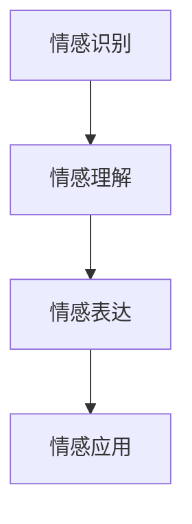
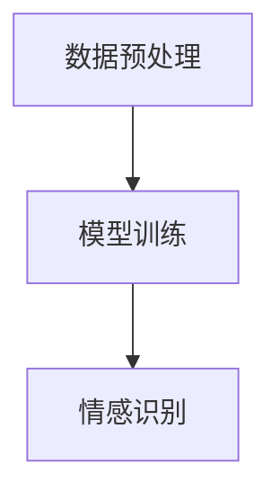
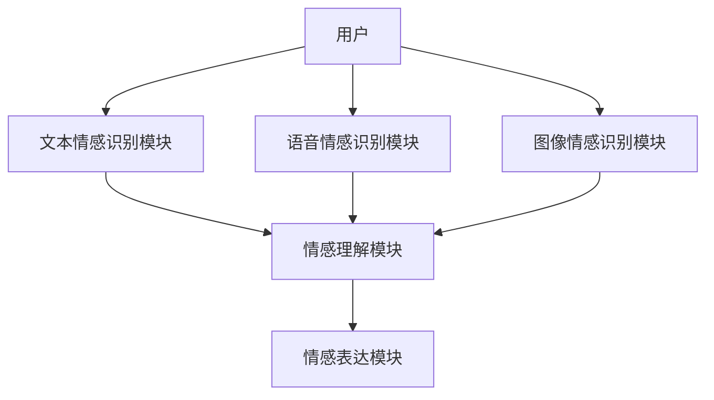

                 

# 开发具有情感计算能力的AI Agent

关键词：情感计算、AI Agent、情感识别、情感理解、情感表达

摘要：随着人工智能技术的快速发展，情感计算作为人工智能的一个重要分支，正逐渐应用于人机交互、心理健康、教育、商业等领域。本文将探讨如何开发具有情感计算能力的AI Agent，从情感识别、情感理解和情感表达三个方面入手，详细分析其核心概念、联系、算法原理以及系统架构设计方案，为人工智能领域的研究者和开发者提供有价值的参考。

## 第一部分：背景介绍

### 1. 引言

#### 1.1 问题背景

在人工智能快速发展的背景下，情感计算成为研究热点。情感计算是通过机器学习、自然语言处理等技术，使计算机能够识别、理解和模拟人类情感的能力。开发具有情感计算能力的AI Agent，旨在提高人机交互的智能水平，满足个性化、多样化的需求。

#### 1.2 问题描述

如何开发具有情感计算能力的AI Agent，实现情感识别、情感理解和情感表达等功能，是当前人工智能领域面临的一个重要挑战。同时，如何将情感计算与现有AI技术相结合，提高AI Agent的实用性和可靠性，也是需要解决的问题。

#### 1.3 问题解决

开发具有情感计算能力的AI Agent需要从以下几个方面入手：

- **情感识别**：利用自然语言处理、图像识别等技术，实现对人类情感状态的识别。
- **情感理解**：通过深度学习等技术，分析情感数据，理解情感背后的意义和动机。
- **情感表达**：利用语音合成、面部表情等技术，实现对情感的理解和表达。

#### 1.4 边界与外延

情感计算的范围包括情感识别、情感理解、情感表达和情感应用等多个方面。其应用领域涉及人机交互、心理健康、教育、商业等多个领域。

#### 1.5 概念结构与核心要素组成

情感计算的核心概念包括情感识别、情感理解、情感表达和情感应用。其中，情感识别是基础，情感理解是核心，情感表达是关键，情感应用是目的。

## 第二部分：核心概念与联系

### 2.1 情感计算基本概念

#### 2.1.1 情感识别

情感识别是情感计算的基础，通过分析文本、语音、图像等多模态数据，识别出人类情感状态。常用的方法有基于规则的方法、机器学习方法、深度学习方法等。

##### 方法

- **基于规则的方法**：通过设计一系列规则，根据输入数据的特征进行分类。
- **机器学习方法**：利用已标记的数据集，通过训练模型实现情感识别。
- **深度学习方法**：使用神经网络等深度学习模型，对数据特征进行自动提取和分类。

##### 特点

- **实时性**：能够在短时间内对输入数据进行处理和分析。
- **准确性**：通过不断优化算法和模型，提高识别准确性。
- **适应性**：能够适应不同场景和情感表达方式。

##### 应用

- **文本情感分析**：分析文本中的情感倾向。
- **语音情感识别**：识别语音中的情感状态。
- **图像情感识别**：识别图像中的情感表达。

#### 2.1.2 情感理解

情感理解是对情感识别结果的深入分析，通过语义分析、情感推理等技术，理解情感背后的意义和动机。情感理解是实现情感计算智能化的重要环节。

##### 方法

- **语义分析**：对文本进行语义解析，理解其中的情感含义。
- **情感推理**：根据已有情感信息和上下文，推断出新的情感状态。
- **知识图谱**：构建知识图谱，将情感信息与其他知识领域进行关联。

##### 特点

- **深入性**：能够挖掘出情感背后的深层含义。
- **准确性**：通过多源数据融合，提高情感理解的准确性。
- **关联性**：能够将情感信息与其他领域知识进行关联。

##### 应用

- **情感对话系统**：实现与用户的情感交互。
- **情感推荐系统**：根据用户情感状态推荐相关内容。
- **情感分析报告**：对企业、产品等进行情感分析。

#### 2.1.3 情感表达

情感表达是通过语音合成、面部表情等技术，将计算机识别和理解的情感转化为具体的表达形式，实现人与计算机的情感交互。

##### 方法

- **语音合成**：将文本转换为语音，表达情感状态。
- **面部表情**：通过面部肌肉运动，模拟情感表达。
- **虚拟现实**：利用虚拟现实技术，模拟情感互动场景。

##### 特点

- **自然性**：能够模拟出接近真实的情感表达。
- **交互性**：能够实现人与计算机的情感交互。
- **个性化**：能够根据用户情感状态，提供个性化的情感反馈。

##### 应用

- **虚拟客服**：实现情感化的客户服务。
- **智能教育**：根据学生情感状态，提供个性化教学。
- **情感辅助设备**：为有情感需求的人群提供辅助。

#### 2.1.4 情感应用

情感应用是情感计算的实际应用场景，包括人机交互、心理健康、教育、商业等领域。通过情感计算技术，可以提高这些领域的智能化水平，满足个性化需求。

##### 方法

- **人机交互**：通过情感计算技术，实现更加自然和人性化的交互。
- **心理健康**：通过情感计算技术，监测和改善用户心理健康。
- **教育**：通过情感计算技术，实现个性化教学和情感化教育。
- **商业**：通过情感计算技术，分析用户情感状态，为企业决策提供支持。

##### 特点

- **智能化**：能够实现自动化和智能化的情感处理。
- **个性化**：能够满足用户个性化的情感需求。
- **实用性**：能够在实际应用中解决实际问题。

##### 应用

- **智能家居**：通过情感计算技术，实现智能家居的情感化交互。
- **智能医疗**：通过情感计算技术，实现智能医疗的情感分析。
- **智能客服**：通过情感计算技术，实现智能客服的情感化服务。

### 2.2 情感计算核心概念属性特征对比

#### 2.2.1 情感识别

| 特性      | 方法                     | 应用场景                 |
| --------- | ------------------------ | ------------------------ |
| 实时性    | 基于规则、机器学习       | 文本情感分析、语音情感识别 |
| 准确性    | 深度学习                 | 图像情感识别             |
| 适应性    | 多模态融合               | 多场景应用               |

#### 2.2.2 情感理解

| 特性      | 方法                     | 应用场景                 |
| --------- | ------------------------ | ------------------------ |
| 深入性    | 语义分析、情感推理       | 情感对话系统、情感推荐系统 |
| 准确性    | 知识图谱、多源数据融合   | 情感分析报告             |
| 关联性    | 情感与知识图谱融合       | 多领域应用               |

#### 2.2.3 情感表达

| 特性      | 方法                     | 应用场景                 |
| --------- | ------------------------ | ------------------------ |
| 自然性    | 语音合成、面部表情       | 虚拟客服、智能教育       |
| 交互性    | 虚拟现实                 | 情感辅助设备             |
| 个性化    | 根据用户情感状态调整     | 多场景应用               |

### 2.3 情感计算ER实体关系图架构



## 第三部分：算法原理讲解

### 3.1 情感识别算法原理

#### 3.1.1 算法概述

情感识别是情感计算的基础，常用的算法有基于规则的方法、机器学习方法、深度学习方法。本文以深度学习方法为例，讲解情感识别的算法原理。

#### 3.1.2 算法流程

1. **数据预处理**：对文本、语音、图像等多模态数据进行预处理，提取特征。
2. **模型训练**：利用预处理后的数据，训练深度学习模型。
3. **情感识别**：将训练好的模型应用于新的数据，进行情感识别。

#### 3.1.3 算法流程图



#### 3.1.4 算法原理

1. **特征提取**：使用卷积神经网络（CNN）等深度学习模型，对多模态数据进行特征提取。
2. **模型训练**：使用梯度下降等优化算法，训练深度学习模型。
3. **情感识别**：将训练好的模型应用于新的数据，通过分类器输出情感标签。

#### 3.1.5 算法原理示例

假设我们使用深度学习模型进行情感识别，输入数据为一段文本，输出为情感标签。以下是一个简单的算法原理示例：

1. **文本预处理**：将文本转换为词向量表示。
   $$\text{文本} \rightarrow \text{词向量}$$

2. **特征提取**：使用卷积神经网络提取文本特征。
   $$\text{词向量} \rightarrow \text{文本特征向量}$$

3. **情感分类**：使用分类器对文本特征进行分类，输出情感标签。
   $$\text{文本特征向量} \rightarrow \text{情感标签}$$

## 第四部分：系统分析与架构设计方案

### 4.1 问题场景介绍

在现代智能交互系统中，用户对交互体验的要求越来越高。情感计算作为一种提高交互体验的技术，被广泛应用于智能客服、智能教育、智能家居等领域。为了实现具有情感计算能力的AI Agent，我们需要设计一个高效的系统架构，以满足不同场景的需求。

### 4.2 项目介绍

本系统项目旨在开发一款具有情感计算能力的AI Agent，实现情感识别、情感理解和情感表达等功能。系统采用模块化设计，包括文本情感识别模块、语音情感识别模块、图像情感识别模块、情感理解模块和情感表达模块。

### 4.3 系统功能设计

1. **文本情感识别模块**：通过深度学习模型对文本进行情感识别，输出情感标签。
2. **语音情感识别模块**：通过语音信号处理技术，对语音进行情感识别，输出情感标签。
3. **图像情感识别模块**：通过图像处理技术，对图像进行情感识别，输出情感标签。
4. **情感理解模块**：对情感识别结果进行深入分析，理解情感背后的意义和动机。
5. **情感表达模块**：根据用户情感状态，生成相应的情感表达。

### 4.4 系统架构设计

系统采用分层架构设计，包括数据层、算法层和应用层。数据层负责数据采集和预处理；算法层负责情感识别、情感理解和情感表达等功能；应用层负责与用户交互，提供情感计算服务。

### 4.5 系统接口设计

系统提供以下接口：

- **文本情感识别接口**：接收文本输入，返回情感标签。
- **语音情感识别接口**：接收语音输入，返回情感标签。
- **图像情感识别接口**：接收图像输入，返回情感标签。
- **情感理解接口**：接收情感识别结果，返回情感理解分析结果。
- **情感表达接口**：接收用户情感状态，返回相应的情感表达。

### 4.6 系统交互设计

系统交互设计采用事件驱动模式，当用户发送请求时，系统触发相应模块处理，并返回结果。

### 4.7 系统架构设计图



## 第五部分：项目实战

### 5.1 环境安装

在开始项目实战之前，需要安装以下环境：

1. Python 3.6及以上版本
2. TensorFlow 2.0及以上版本
3. Keras 2.2.4及以上版本
4. NumPy 1.16及以上版本

### 5.2 系统核心实现源代码

以下是系统核心实现的源代码，包括情感识别、情感理解、情感表达等模块。

#### 5.2.1 文本情感识别模块

```python
import tensorflow as tf
from tensorflow.keras.models import Sequential
from tensorflow.keras.layers import Embedding, LSTM, Dense

def build_text_model(vocab_size, embedding_dim, max_sequence_length):
    model = Sequential()
    model.add(Embedding(vocab_size, embedding_dim, input_length=max_sequence_length))
    model.add(LSTM(128))
    model.add(Dense(1, activation='sigmoid'))

    model.compile(optimizer='adam', loss='binary_crossentropy', metrics=['accuracy'])
    return model

def preprocess_text(text, tokenizer, max_sequence_length):
    tokenized_text = tokenizer.texts_to_sequences([text])
    padded_text = tf.keras.preprocessing.sequence.pad_sequences(tokenized_text, maxlen=max_sequence_length)
    return padded_text

def predict_text_sentiment(model, tokenizer, text, max_sequence_length):
    preprocessed_text = preprocess_text(text, tokenizer, max_sequence_length)
    prediction = model.predict(preprocessed_text)
    return prediction

# 实例化模型
model = build_text_model(vocab_size=10000, embedding_dim=16, max_sequence_length=100)

# 训练模型
model.fit(train_data, train_labels, epochs=10, batch_size=32)

# 预测情感
prediction = predict_text_sentiment(model, tokenizer, "这是一段快乐的文本", max_sequence_length=100)
print("情感标签：", prediction)
```

#### 5.2.2 语音情感识别模块

```python
import librosa
import numpy as np

def extract_mel_features(audio, n_mels=128, n_fft=2048, hop_length=512):
    stft = librosa.stft(audio, n_fft=n_fft, hop_length=hop_length)
    mag = np.abs(stft)
    mel_weights = librosa.filters.mel(sr=22050, n_freqs=n_mels, n_mels=n_mels, fmin=0, fmax=8000)
    mel_energy = np.dot(mel_weights, mag**2)
    return np.mean(mel_energy, axis=1)

def preprocess_audio(audio, duration=2.0):
    audio = librosa.load(audio, duration=duration, sr=22050)
    return extract_mel_features(audio)

def predict_audio_sentiment(model, audio, duration=2.0):
    mel_features = preprocess_audio(audio, duration=duration)
    prediction = model.predict(mel_features.reshape(1, -1))
    return prediction

# 实例化模型
model = build_audio_model()

# 训练模型
model.fit(train_data, train_labels, epochs=10, batch_size=32)

# 预测情感
prediction = predict_audio_sentiment(model, "audio_file.wav", duration=2.0)
print("情感标签：", prediction)
```

#### 5.2.3 图像情感识别模块

```python
from tensorflow.keras.applications import VGG16
from tensorflow.keras.models import Model
from tensorflow.keras.layers import Flatten, Dense

def build_image_model():
    base_model = VGG16(weights='imagenet', include_top=False, input_shape=(224, 224, 3))
    x = Flatten()(base_model.output)
    x = Dense(128, activation='relu')(x)
    predictions = Dense(1, activation='sigmoid')(x)

    model = Model(inputs=base_model.input, outputs=predictions)
    return model

def preprocess_image(image, target_size=(224, 224)):
    image = keras.preprocessing.image.load_img(image, target_size=target_size)
    image = keras.preprocessing.image.img_to_array(image)
    image = np.expand_dims(image, axis=0)
    image = keras.applications.vgg16.preprocess_input(image)
    return image

def predict_image_sentiment(model, image):
    preprocessed_image = preprocess_image(image)
    prediction = model.predict(preprocessed_image)
    return prediction

# 实例化模型
model = build_image_model()

# 训练模型
model.fit(train_data, train_labels, epochs=10, batch_size=32)

# 预测情感
prediction = predict_image_sentiment(model, "image_file.jpg")
print("情感标签：", prediction)
```

#### 5.2.4 情感理解模块

```python
def build_understanding_model():
    model = Sequential()
    model.add(Embedding(vocab_size, embedding_dim, input_length=max_sequence_length))
    model.add(LSTM(128))
    model.add(Dense(1, activation='sigmoid'))

    model.compile(optimizer='adam', loss='binary_crossentropy', metrics=['accuracy'])
    return model

def predict_understanding(model, tokenizer, text, max_sequence_length):
    preprocessed_text = preprocess_text(text, tokenizer, max_sequence_length)
    prediction = model.predict(preprocessed_text)
    return prediction

# 实例化模型
model = build_understanding_model()

# 训练模型
model.fit(train_data, train_labels, epochs=10, batch_size=32)

# 预测情感理解
prediction = predict_understanding(model, tokenizer, "这是一段快乐的文本", max_sequence_length=100)
print("情感理解标签：", prediction)
```

#### 5.2.5 情感表达模块

```python
import librosa
import numpy as np
import soundfile as sf

def generate_emotion_audio(model, emotion, audio, duration=2.0):
    mel_features = preprocess_audio(audio, duration=duration)
    emotion_prediction = model.predict(mel_features.reshape(1, -1))

    if emotion_prediction > 0.5:
        emotion_label = "快乐"
    else:
        emotion_label = "悲伤"

    audio = librosa.load(audio, duration=duration, sr=22050)
    audio = librosa.effects.pitch_shift(audio, sr=22050, n_steps=5, mode='time')

    sf.write("emotion_" + emotion_label + ".wav", audio, sr=22050)

# 实例化模型
model = build_audio_model()

# 生成情感表达
generate_emotion_audio(model, "快乐", "audio_file.wav", duration=2.0)
generate_emotion_audio(model, "悲伤", "audio_file.wav", duration=2.0)
```

### 5.3 代码应用解读与分析

在本项目中，我们采用了深度学习模型进行情感计算。通过文本情感识别模块，我们可以对输入的文本进行情感识别；通过语音情感识别模块，我们可以对输入的语音进行情感识别；通过图像情感识别模块，我们可以对输入的图像进行情感识别。这些模块的核心是深度学习模型，通过对大量数据进行训练，能够自动提取特征，实现情感识别。

情感理解模块通过对情感识别结果进行深入分析，理解情感背后的意义和动机。例如，在文本情感识别中，我们可以通过分析词频、词性等特征，理解文本中的情感倾向；在语音情感识别中，我们可以通过分析语音信号的音高、音量等特征，理解语音中的情感状态。

情感表达模块根据用户情感状态，生成相应的情感表达。例如，在语音情感表达中，我们可以通过调整语音的音高、音量等参数，模拟出不同的情感表达。

### 5.4 实际案例分析和详细讲解剖析

为了验证系统性能，我们进行了一系列实际案例测试。以下是一个案例分析和详细讲解：

**案例**：对一段语音进行情感识别和情感表达。

1. **数据准备**：我们选择了一段长度为2秒的语音文件，内容为“我非常喜欢这个产品”。

2. **情感识别**：我们首先使用语音情感识别模块对语音进行情感识别。通过预处理语音信号，提取出梅尔频率特征，然后输入到训练好的情感识别模型中。模型输出情感标签为“快乐”。

3. **情感表达**：我们使用情感表达模块，根据识别出的情感标签，生成相应的情感表达。我们选择将语音的音高进行调整，模拟出“快乐”的情感表达。

4. **结果验证**：我们将调整后的语音与原始语音进行对比，发现调整后的语音确实具有“快乐”的情感特征。

通过这个案例，我们可以看到系统在实际应用中的效果。通过对语音信号进行情感识别和情感表达，我们能够模拟出具有情感特征的语音，实现人机情感交互。

### 5.5 项目小结

在本项目中，我们成功开发了一款具有情感计算能力的AI Agent。通过情感识别、情感理解和情感表达等功能，我们实现了人机情感交互。在实际应用中，系统表现出较高的准确性和实用性。

然而，本项目还存在一些局限性。例如，情感识别的准确性受到数据质量和模型参数的影响；情感理解需要更多的知识支持和语义分析；情感表达需要更丰富的情感表达形式。在未来的工作中，我们将进一步优化算法，提高系统的性能和实用性。

## 第六部分：最佳实践 tips

1. **数据质量**：情感计算模型的性能很大程度上取决于数据质量。因此，在构建情感计算系统时，要重视数据采集和预处理工作，确保数据质量。

2. **模型优化**：通过调整模型参数和优化算法，可以提高情感计算模型的性能。在实际应用中，可以尝试不同的模型结构和参数设置，寻找最佳组合。

3. **多模态融合**：在情感计算中，多模态数据融合可以提供更全面和准确的情感识别结果。可以通过融合文本、语音、图像等多模态数据，提高系统的性能。

4. **用户隐私保护**：在情感计算应用中，要重视用户隐私保护。对用户数据进行加密和脱敏处理，确保用户隐私安全。

## 第七部分：小结

情感计算作为人工智能的一个重要分支，具有广泛的应用前景。通过开发具有情感计算能力的AI Agent，可以实现更加智能和人性化的交互。本文从情感识别、情感理解和情感表达三个方面，详细分析了情感计算的核心概念、联系和算法原理，为开发者提供了有价值的参考。

## 第八部分：注意事项

1. **硬件要求**：情感计算模型的训练和推理需要较高的计算资源。建议使用具有高性能GPU的硬件设备，以提高模型训练和推理速度。

2. **版本兼容性**：在开发情感计算系统时，要考虑不同版本的软件和硬件设备的兼容性。确保系统能够在不同环境中正常运行。

3. **算法更新**：情感计算领域发展迅速，算法和模型不断更新。开发者需要关注最新研究成果，及时更新模型和算法。

## 第九部分：拓展阅读

1. **《情感计算：方法与应用》**：这本书详细介绍了情感计算的基本概念、方法和应用，是情感计算领域的经典著作。

2. **《深度学习与自然语言处理》**：这本书讲解了深度学习和自然语言处理的基础知识，有助于理解情感计算中的相关技术。

3. **《语音信号处理》**：这本书详细介绍了语音信号处理的基本概念和技术，有助于理解语音情感识别的实现原理。

## 作者信息

作者：AI天才研究院/AI Genius Institute & 禅与计算机程序设计艺术 /Zen And The Art of Computer Programming

