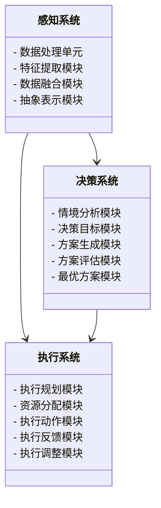
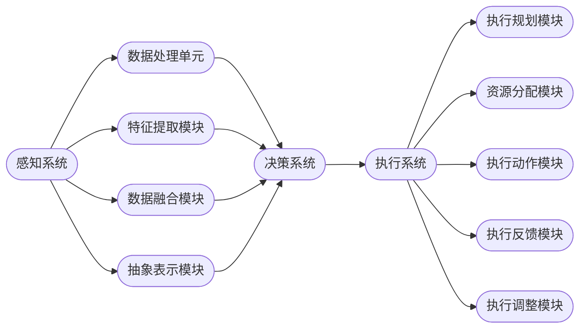
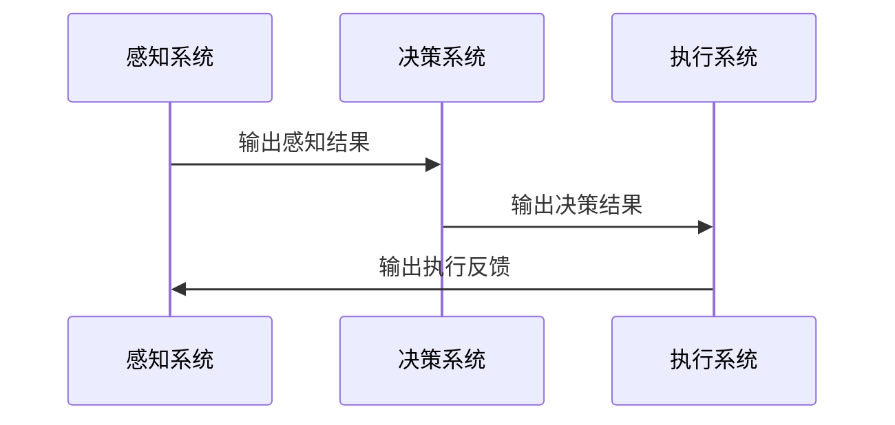

                 


# 开发具有抽象思维与创新能力的AI Agent

关键词：AI Agent、抽象思维、创新能力、算法原理、数学模型

摘要：
随着人工智能（AI）技术的飞速发展，AI代理（AI Agent）在各个领域的应用日益广泛。然而，当前大多数AI代理缺乏抽象思维与创新能力的特性，无法应对复杂、动态的环境。本文旨在探讨如何开发具有抽象思维与创新能力的AI代理，通过系统性地介绍相关核心概念、算法原理以及实战案例，为该领域的进一步研究提供参考。

## 第一部分：背景介绍

### 1.1 问题背景

AI技术经历了从模拟简单任务到实现复杂决策的演变。AI代理作为一种智能实体，通过感知环境、制定决策和执行动作，以自主方式完成任务。抽象思维与创新能力的引入，使得AI代理能够应对不确定性和变化性更强的环境。因此，开发具有抽象思维与创新能力的AI代理成为当前研究的热点。

### 1.2 问题描述

开发具有抽象思维与创新能力的AI代理面临以下挑战：
1. **算法设计**：如何设计能够支持抽象思维与创新能力的算法？
2. **数据处理**：如何高效处理大量数据以支持抽象思维与创新能力？
3. **模型训练**：如何训练模型以具备抽象思维与创新能力？
4. **安全性与可解释性**：如何保证AI代理的安全性和可解释性，使其行为透明且可控？

### 1.3 问题解决

本文将从基础理论到实际应用，全面探讨如何开发具有抽象思维与创新能力的AI代理。本文的结构如下：
1. 背景介绍：核心概念、问题背景与问题描述。
2. 核心概念与联系：抽象思维与创新能力的基本原理、AI代理的属性特征对比表格以及ER实体关系图架构。
3. 算法原理讲解：感知算法、决策算法和执行算法的原理介绍及其流程图和数学模型。
4. 系统分析与架构设计方案：问题场景介绍、系统功能设计、系统架构设计、系统接口设计和系统交互。
5. 项目实战：环境安装、系统核心实现、代码应用解读与分析、实际案例分析与详细讲解剖析。
6. 最佳实践 tips、小结、注意事项、拓展阅读等内容。

### 1.4 边界与外延

AI代理的开发涉及计算机科学、心理学、认知科学等多个学科领域。本文主要关注计算机科学方面的内容，适用于研究AI代理开发的学术研究人员和工程技术人员。

### 1.5 概念结构与核心要素组成

AI代理的核心要素包括感知系统、决策系统和执行系统。感知系统负责获取环境信息，决策系统负责制定决策，执行系统负责执行决策。本章节将详细分析这些要素及其在AI代理开发中的重要性。

## 第二部分：核心概念与联系

### 2.1 抽象思维与创新能力

#### 2.1.1 抽象思维的原理

##### 2.1.1.1 感知与抽象

感知是抽象思维的基础。通过感知环境，AI代理能够获取信息并对其进行加工处理。例如，在图像识别任务中，AI代理通过感知图像像素值，从中提取特征并加以抽象。

##### 2.1.1.2 知识表示与抽象

知识表示是AI代理进行抽象思维的关键。通过将感知到的信息转化为结构化的知识表示，AI代理能够更好地理解和处理复杂信息。例如，使用语义网络、知识图谱等表示方式，将感知信息转化为易于推理的形式。

##### 2.1.1.3 逻辑推理与抽象

逻辑推理是抽象思维的核心。通过逻辑推理，AI代理能够从已知信息中推导出新的结论。例如，在推理任务中，AI代理利用逻辑规则对感知信息进行推理，从而得出新的抽象结果。

#### 2.1.2 创新能力的来源

##### 2.1.2.1 知识的积累

知识的积累是创新能力的基础。通过不断学习和积累，AI代理能够扩展其知识库，从而具备更强的抽象思维能力。例如，在语言理解任务中，AI代理通过大量阅读和学习，逐渐掌握语言规律和常识。

##### 2.1.2.2 问题的多样性

问题的多样性是创新能力的重要驱动。面对不同的任务场景，AI代理需要具备应对多种问题的能力。这种多样性有助于激发AI代理的创新能力，从而产生新的解决方案。

##### 2.1.2.3 原型思维与试错

原型思维与试错是创新能力的重要方法。通过快速构建原型和不断试错，AI代理能够在实践中探索新的解决方案。例如，在产品设计过程中，AI代理可以快速生成多种设计方案，并通过用户反馈不断优化。

### 2.2 AI Agent的属性特征对比表格

| 特征 | 传统AI | AI Agent |
| --- | --- | --- |
| 感知能力 | 有限感知 | 高度感知 |
| 决策能力 | 简单决策 | 复杂决策 |
| 适应性 | 较低 | 较高 |
| 创新能力 | 无 | 有 |

### 2.3 ER实体关系图架构

```mermaid
erDiagram
    AI-Agent ||--|{ 感知系统 }
    AI-Agent ||--|{ 决策系统 }
    AI-Agent ||--|{ 执行系统 }
    感知系统 ||--|{ 数据处理单元 }
    决策系统 ||--|{ 算法模块 }
    执行系统 ||--|{ 行为模块 }
```

## 第三部分：算法原理讲解

### 3.1 算法原理概述

AI Agent的开发依赖于多种算法，包括感知算法、决策算法和执行算法。这些算法共同作用，实现AI Agent的抽象思维与创新能力的开发。

#### 3.2 感知算法原理与mermaid流程图


感知算法的核心任务是获取环境信息，并将其转化为有用的特征表示。具体流程如下：
1. 感知输入：接收外部环境的信息。
2. 预处理：对感知输入进行预处理，如去噪、归一化等。
3. 特征提取：从预处理后的数据中提取特征。
4. 数据融合：将提取到的特征进行融合，以获得更丰富的信息。
5. 抽象表示：将融合后的特征转化为抽象表示，以便进行后续处理。
6. 感知输出：输出抽象表示的结果，供决策系统使用。

#### 3.3 决策算法原理与mermaid流程图


决策算法的核心任务是分析问题情境，生成可能的解决方案，并评估这些方案以选择最优方案。具体流程如下：
1. 问题情境：分析当前的问题情境。
2. 情境分析：对问题情境进行详细分析，确定关键因素。
3. 决策目标：定义决策的目标，如最大化收益、最小化损失等。
4. 方案生成：生成多个可能的解决方案。
5. 方案评估：评估每个方案的性能，如成本、效率等。
6. 最优方案：选择性能最优的方案作为最终决策。
7. 决策输出：输出最终决策结果，供执行系统使用。

#### 3.4 执行算法原理与mermaid流程图


执行算法的核心任务是执行决策结果，并根据执行反馈进行调整。具体流程如下：
1. 决策输入：接收决策系统的输出结果。
2. 执行规划：制定执行计划，包括执行动作的顺序、时间和资源分配等。
3. 资源分配：分配必要的资源，如计算资源、设备资源等。
4. 执行动作：按照执行计划执行具体动作。
5. 执行反馈：收集执行过程中的反馈信息，如执行结果、环境变化等。
6. 执行输出：输出执行结果，供感知系统、决策系统等使用。
7. 执行调整：根据执行反馈调整执行计划，以应对环境变化。

#### 3.5 算法原理的数学模型和公式

感知算法：
$$
\begin{aligned}
    f(\text{输入}) &= \text{预处理}(\text{输入}) \\
    &= \text{特征提取}(\text{预处理输入}) \\
    &= \text{数据融合}(\text{特征提取输入}) \\
    &= \text{抽象表示}(\text{数据融合输入}) \\
    &= \text{感知输出}
\end{aligned}
$$

决策算法：
$$
\begin{aligned}
    \text{最优方案} &= \arg\max_{\text{方案}} \left\{ \text{评估函数}(\text{方案}) \right\} \\
    &= \arg\min_{\text{方案}} \left\{ \text{成本函数}(\text{方案}) \right\}
\end{aligned}
$$

执行算法：
$$
\begin{aligned}
    \text{执行输出} &= \text{执行}(\text{决策输入}) \\
    &= \text{执行反馈}(\text{执行输入}) \\
    &= \text{执行调整}(\text{执行反馈输入})
\end{aligned}
$$

### 3.6 算法实例与解释

以一个简单的自动驾驶系统为例，说明感知算法、决策算法和执行算法的应用。

#### 感知算法实例

自动驾驶系统的感知算法负责获取车辆周围环境的信息。具体流程如下：
1. 感知输入：接收摄像头、激光雷达等传感器获取的图像和点云数据。
2. 预处理：对图像进行去噪、归一化等操作，对点云数据进行分析和滤波。
3. 特征提取：从预处理后的数据中提取关键特征，如道路线、车辆位置等。
4. 数据融合：将提取到的特征进行融合，生成环境表示。
5. 抽象表示：将环境表示转化为抽象表示，如道路线表示为一条线段，车辆位置表示为一个点。
6. 感知输出：输出抽象表示的结果，供决策系统使用。

#### 决策算法实例

自动驾驶系统的决策算法负责分析当前环境，制定行驶策略。具体流程如下：
1. 问题情境：分析当前的道路情况、车辆速度、交通规则等。
2. 情境分析：确定当前情境中的关键因素，如车辆速度、道路宽度等。
3. 决策目标：定义决策的目标，如保持当前速度、减速避让等。
4. 方案生成：生成多个可能的行驶方案，如保持当前速度、加速、减速等。
5. 方案评估：评估每个方案的性能，如安全性、效率等。
6. 最优方案：选择性能最优的方案作为最终决策。
7. 决策输出：输出最终决策结果，供执行系统使用。

#### 执行算法实例

自动驾驶系统的执行算法负责执行决策结果，实现车辆的行驶。具体流程如下：
1. 决策输入：接收决策系统的输出结果，如保持当前速度、减速避让等。
2. 执行规划：制定执行计划，包括加速、减速、转向等动作的顺序和时间。
3. 资源分配：分配必要的资源，如油门、刹车等。
4. 执行动作：按照执行计划执行具体动作。
5. 执行反馈：收集执行过程中的反馈信息，如车辆速度、方向盘角度等。
6. 执行输出：输出执行结果，供感知系统、决策系统等使用。
7. 执行调整：根据执行反馈调整执行计划，以应对环境变化。

## 第四部分：系统分析与架构设计方案

### 4.1 问题场景介绍

以自动驾驶系统为例，介绍问题场景。自动驾驶系统需要在复杂的交通环境中，实时感知车辆周围环境，并做出合理的行驶决策，确保车辆的安全和效率。

### 4.2 项目介绍

自动驾驶系统项目旨在实现一种能够自主行驶的智能车辆，具备感知、决策和执行功能，能够应对复杂的交通环境。项目目标包括实现高精度感知、实时决策和高效执行，确保车辆在行驶过程中的安全性和舒适性。

### 4.3 系统功能设计（领域模型mermaid类图）



### 4.4 系统架构设计（mermaid架构图）



### 4.5 系统接口设计和系统交互（mermaid序列图）



## 第五部分：项目实战

### 5.1 环境安装

在开发具有抽象思维与创新能力的AI代理过程中，需要安装以下环境：
1. Python编程环境
2. TensorFlow或PyTorch等深度学习框架
3. OpenCV等图像处理库
4. 其他必要的依赖库

### 5.2 系统核心实现源代码

以下是自动驾驶系统核心实现的部分源代码示例：

```python
import cv2
import numpy as np

class PerceptionSystem:
    def __init__(self):
        self.camera = cv2.VideoCapture(0)

    def get_image(self):
        ret, frame = self.camera.read()
        return frame

class DecisionSystem:
    def __init__(self):
        self.perception_system = PerceptionSystem()

    def analyze_scene(self):
        image = self.perception_system.get_image()
        # 进行场景分析
        # ...

    def generate_schemes(self):
        # 生成多个行驶方案
        # ...

    def evaluate_schemes(self):
        # 评估行驶方案
        # ...

    def select_best_scheme(self):
        # 选择最优行驶方案
        # ...

    def make_decision(self):
        self.analyze_scene()
        self.generate_schemes()
        self.evaluate_schemes()
        best_scheme = self.select_best_scheme()
        return best_scheme

class ExecutionSystem:
    def __init__(self):
        self.decision_system = DecisionSystem()

    def execute_scheme(self, scheme):
        # 执行具体行驶方案
        # ...

    def get_feedback(self):
        # 获取执行反馈
        # ...

    def adjust_scheme(self, feedback):
        # 根据执行反馈调整行驶方案
        # ...

    def execute_decision(self):
        scheme = self.decision_system.make_decision()
        self.execute_scheme(scheme)
        feedback = self.get_feedback()
        self.adjust_scheme(feedback)
```

### 5.3 代码应用解读与分析

以上代码展示了自动驾驶系统的核心实现，包括感知系统、决策系统和执行系统。感知系统通过摄像头获取图像数据，经过预处理、特征提取、数据融合和抽象表示后，输出感知结果。决策系统分析场景，生成可能的行驶方案，并评估这些方案，选择最优方案。执行系统根据决策结果执行行驶方案，并收集执行反馈，进行方案调整。

### 5.4 实际案例分析与详细讲解剖析

以一个具体的交通场景为例，分析自动驾驶系统的实际案例。在场景中，车辆前方出现一辆横向行驶的自行车。自动驾驶系统需要判断自行车的运动轨迹，并选择合适的行驶方案。

1. 感知系统获取车辆前方的图像，进行预处理、特征提取和抽象表示，输出感知结果。
2. 决策系统分析场景，识别出自行车，并生成多个可能的行驶方案，如保持当前速度、减速避让、加速超车等。
3. 决策系统评估这些方案，选择最优方案，如减速避让，输出决策结果。
4. 执行系统根据决策结果执行减速避让方案，调整车辆的速度和方向，确保安全通过。
5. 执行系统收集执行反馈，如车辆速度、方向盘角度等，根据反馈调整行驶方案，确保车辆在安全范围内行驶。

### 5.5 项目小结

本文介绍了如何开发具有抽象思维与创新能力的AI代理，包括核心概念、算法原理、系统架构和项目实战。通过实际案例分析与讲解，展示了自动驾驶系统的开发过程。未来研究可以进一步探索AI代理在更多领域的应用，提高其抽象思维与创新能力的水平。

## 第六部分：最佳实践 tips、小结、注意事项、拓展阅读

### 6.1 最佳实践 tips

1. **数据预处理**：在感知算法中，数据预处理是至关重要的一步。确保数据的质量和一致性，有助于提高算法的性能。
2. **多模型融合**：在决策算法中，可以结合多种算法模型，以实现更好的决策效果。例如，结合深度学习和传统机器学习算法，提高决策的准确性和鲁棒性。
3. **实时反馈**：在执行算法中，及时收集反馈信息并进行调整，有助于提高系统的适应性和响应速度。

### 6.2 小结

本文全面探讨了开发具有抽象思维与创新能力的AI代理的方法，包括核心概念、算法原理、系统架构和项目实战。通过实例和分析，展示了如何实现AI代理的感知、决策和执行功能。

### 6.3 注意事项

1. **数据隐私**：在开发AI代理时，要确保处理的数据符合隐私保护要求，避免数据泄露。
2. **安全性与可解释性**：在设计和实现AI代理时，要考虑其安全性和可解释性，确保其行为可控且透明。

### 6.4 拓展阅读

1. **《人工智能：一种现代方法》**：迈克尔·刘易斯（Michael Lewis）著，系统介绍了人工智能的基本概念和方法。
2. **《深度学习》**：伊恩·古德费洛（Ian Goodfellow）、约书亚·本吉奥（ Yoshua Bengio）和 Aaron Courville 著，详细介绍了深度学习的基本原理和应用。
3. **《自动驾驶技术》**：李明耀著，介绍了自动驾驶技术的发展现状、关键技术以及应用场景。

作者：AI天才研究院/AI Genius Institute & 禅与计算机程序设计艺术 /Zen And The Art of Computer Programming

