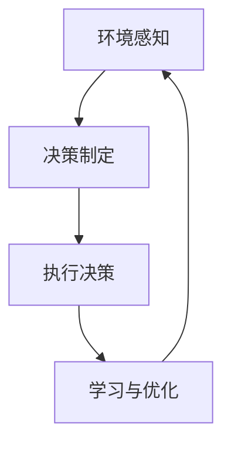
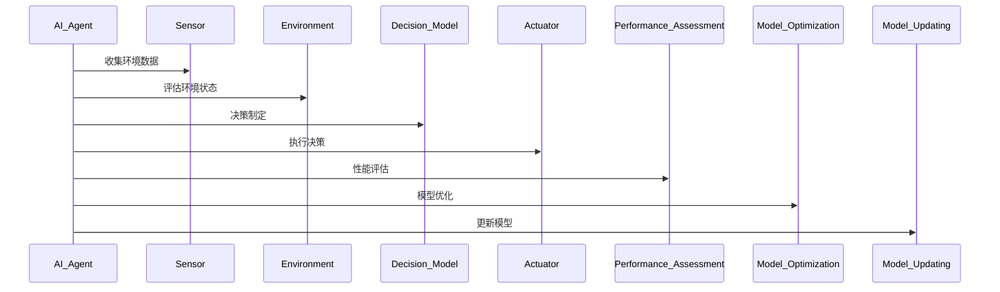

                 


# 开发具有持续适应能力的AI Agent

## 关键词

AI Agent、持续适应能力、机器学习、算法、系统设计、实战案例分析、最佳实践

## 摘要

本文旨在深入探讨如何开发具有持续适应能力的AI Agent。我们将逐步分析AI Agent的定义、持续适应能力的重要性，以及如何通过算法和系统设计实现这一目标。文章还将通过具体案例，展示持续适应能力的实际应用，并总结最佳实践，为开发具有持续适应能力的AI Agent提供指导。

## 目录

1. **AI Agent概述与持续适应能力的重要性**  
    1.1 AI Agent的定义与分类  
    1.2 持续适应能力在AI Agent中的应用  
    1.3 为什么需要开发具有持续适应能力的AI Agent

2. **AI Agent发展历程与现状**  
    2.1 AI Agent的起源与发展  
    2.2 当前AI Agent的应用领域  
    2.3 持续适应能力的挑战与机遇

3. **持续适应能力的核心概念**  
    3.1 适应性与鲁棒性  
    3.2 学习与演化  
    3.3 持续适应能力的特征

4. **核心概念对比与联系**  
    4.1 持续适应能力与机器学习  
    4.2 持续适应能力与传统AI  
    4.3 持续适应能力的比较分析

5. **持续适应能力的算法原理**  
    5.1 算法概述  
    5.2 算法mermaid流程图  
    5.3 算法原理讲解

6. **算法原理的数学模型**  
    6.1 数学模型与公式  
    6.2 数学模型的解释  
    6.3 举例说明

7. **系统功能设计**  
    7.1 领域模型mermaid类图  
    7.2 系统功能设计与实现

8. **系统架构设计**  
    8.1 系统架构mermaid架构图  
    8.2 系统架构设计原理

9. **系统接口设计与交互**  
    9.1 系统接口设计  
    9.2 系统交互mermaid序列图

10. **环境安装与系统配置**  
    10.1 环境安装  
    10.2 系统配置

11. **系统核心实现与代码解析**  
    11.1 系统核心实现  
    11.2 代码解析

12. **实际案例分析**  
    12.1 实际案例介绍  
    12.2 案例分析  
    12.3 案例详细讲解

13. **最佳实践**  
    13.1 开发技巧  
    13.2 注意事项  
    13.3 拓展阅读

14. **总结与展望**  
    14.1 书籍总结  
    14.2 未来发展趋势  
    14.3 持续适应能力的未来展望

## AI Agent概述与持续适应能力的重要性

### 1.1 AI Agent的定义与分类

AI Agent，即人工智能代理，是指能够自主感知环境、进行决策并采取行动的智能体。根据不同的分类标准，AI Agent可以分为不同的类型：

- **基于规则的AI Agent**：这类AI Agent通过预定义的规则进行决策。当环境中的某些条件满足时，AI Agent会执行特定的动作。

- **基于模型的AI Agent**：这类AI Agent通过学习环境中的数据，建立模型来预测环境变化并做出决策。

- **混合型AI Agent**：这类AI Agent结合了基于规则和基于模型的方法，既使用预定义的规则，也利用学习到的模型来决策。

### 1.2 持续适应能力在AI Agent中的应用

持续适应能力是AI Agent的关键特征之一，它使AI Agent能够在动态变化的环境中生存和繁荣。具体应用包括：

- **环境变化应对**：当环境发生变化时，AI Agent能够迅速调整自己的行为和决策。

- **性能优化**：通过不断学习，AI Agent可以优化自身的性能，提高决策的准确性和效率。

- **自主进化**：AI Agent能够通过自我学习，逐步进化，适应更复杂和多变的环境。

### 1.3 为什么需要开发具有持续适应能力的AI Agent

开发具有持续适应能力的AI Agent具有重要意义，原因如下：

- **动态环境下的生存**：现实世界是一个动态变化的系统，AI Agent需要具备持续适应能力，才能在竞争激烈的环境中生存。

- **提高决策质量**：具有持续适应能力的AI Agent能够根据环境变化，不断调整决策，提高决策的准确性和有效性。

- **长期经济效益**：具有持续适应能力的AI Agent能够在长期运行中，保持较高的性能和效率，为企业带来更大的经济效益。

## AI Agent发展历程与现状

### 2.1 AI Agent的起源与发展

AI Agent的概念最早可以追溯到20世纪80年代。当时，人工智能研究者开始探索如何让计算机在动态环境中自主行动。随着计算机性能的提升和算法的进步，AI Agent的研究逐渐走向深入。

- **早期探索**：在20世纪80年代，AI Agent主要基于规则系统。研究者尝试通过编写复杂的规则，使计算机能够模拟人类的决策过程。

- **算法进步**：随着机器学习算法的兴起，AI Agent开始采用基于模型的方法。这类AI Agent能够通过学习环境数据，预测环境变化，并做出相应的决策。

### 2.2 当前AI Agent的应用领域

当前，AI Agent已经在多个领域得到广泛应用：

- **智能制造**：AI Agent在制造过程中，能够实时监测设备状态，预测故障，提高生产效率。

- **智能交通**：AI Agent在交通管理中，能够优化交通流量，减少拥堵，提高道路通行效率。

- **智能家居**：AI Agent在智能家居中，能够根据用户习惯，自动调节温度、照明等，提高生活舒适度。

### 2.3 持续适应能力的挑战与机遇

持续适应能力是AI Agent未来发展的重要方向，面临的挑战包括：

- **数据质量**：持续适应能力依赖于环境数据的准确性。在实际应用中，数据质量是一个重要挑战。

- **计算资源**：持续适应能力需要大量的计算资源。如何在有限的计算资源下实现高效的适应能力，是一个关键问题。

- **系统复杂性**：持续适应能力涉及到多个层次的算法和系统设计，实现起来具有一定的复杂性。

然而，持续适应能力也为AI Agent带来了巨大的机遇：

- **动态环境下的竞争力**：具有持续适应能力的AI Agent能够在动态变化的环境中，保持竞争优势。

- **个性化服务**：通过持续适应用户需求，AI Agent能够提供更加个性化的服务。

- **长期经济效益**：具有持续适应能力的AI Agent能够在长期运行中，保持较高的性能和效率，为企业带来更大的经济效益。

## 持续适应能力的核心概念

### 3.1 适应性与鲁棒性

适应性与鲁棒性是持续适应能力的重要组成部分。适应性指的是AI Agent能够根据环境变化，调整自身的决策和行为。鲁棒性则是指AI Agent在面对不确定性和异常情况时，仍然能够保持稳定的表现。

- **适应性**：适应性使得AI Agent能够动态调整自身的行为。例如，当环境温度发生变化时，AI Agent能够调整空调的温度设置。

- **鲁棒性**：鲁棒性使得AI Agent在面对异常情况时，仍然能够保持正常工作。例如，当传感器出现故障时，AI Agent能够自动切换到备用传感器，保证系统的正常运行。

### 3.2 学习与演化

学习与演化是持续适应能力的关键机制。学习是指AI Agent通过不断观察环境，从中学习规律，并调整自身的行为。演化则是指AI Agent通过遗传算法等进化机制，逐步优化自身的性能。

- **学习**：学习使得AI Agent能够从过去的经验中提取知识，并应用到未来的决策中。例如，通过学习用户的历史行为，AI Agent能够预测用户的未来需求。

- **演化**：演化使得AI Agent能够不断进化，适应更复杂和多变的环境。例如，通过遗传算法，AI Agent能够逐步优化决策模型，提高决策的准确性。

### 3.3 持续适应能力的特征

持续适应能力具有以下特征：

- **动态调整**：AI Agent能够根据环境变化，实时调整自身的行为和决策。

- **自主进化**：AI Agent能够通过学习与演化，不断提高自身的性能和适应性。

- **抗干扰能力**：AI Agent能够在面对不确定性和异常情况时，保持稳定的表现。

- **个性化服务**：AI Agent能够根据用户的需求，提供个性化的服务。

### 持续适应能力与机器学习

持续适应能力与机器学习密切相关。机器学习为AI Agent提供了强大的学习工具，使其能够从数据中学习规律，并调整自身的行为。

- **监督学习**：监督学习是一种常见的机器学习方法，它通过已标记的数据，训练出模型，并用于预测新的数据。持续适应能力中的学习部分，可以借鉴监督学习的方法。

- **无监督学习**：无监督学习是指在没有标记数据的情况下，通过数据自身的规律，训练出模型。持续适应能力中的演化部分，可以借鉴无监督学习的方法。

### 持续适应能力与传统AI

持续适应能力与传统AI有以下区别：

- **动态调整**：传统AI通常是在静态环境中工作的，而持续适应能力的AI能够动态调整自身的行为和决策。

- **自主进化**：传统AI通常需要手动调整，而持续适应能力的AI能够通过学习与演化，自主优化自身的性能。

- **抗干扰能力**：传统AI在面对不确定性和异常情况时，可能无法正常工作，而持续适应能力的AI能够保持稳定的表现。

### 持续适应能力的比较分析

持续适应能力与传统AI在以下几个方面进行比较分析：

- **适应能力**：持续适应能力具有更强的适应能力，能够动态调整自身的行为和决策，以适应环境变化。

- **自主进化**：持续适应能力具有自主进化的能力，能够通过学习与演化，不断提高自身的性能。

- **抗干扰能力**：持续适应能力在面对不确定性和异常情况时，能够保持稳定的表现，而传统AI可能无法做到。

## 持续适应能力的算法原理

### 5.1 算法概述

持续适应能力的算法主要包括以下几个步骤：

1. **环境感知**：AI Agent感知当前环境，获取环境状态信息。
2. **决策制定**：基于环境状态信息，AI Agent制定相应的决策。
3. **执行决策**：AI Agent执行决策，采取相应的行动。
4. **学习与优化**：AI Agent根据决策的结果，学习环境中的规律，并优化自身的决策模型。

### 5.2 算法mermaid流程图



### 5.3 算法原理讲解

#### 环境感知

环境感知是AI Agent的基础，它决定了AI Agent对环境的理解和反应能力。具体步骤包括：

1. **传感器数据收集**：AI Agent通过传感器收集环境状态信息，如温度、湿度、光照等。
2. **数据处理**：对传感器数据进行预处理，如去噪、归一化等。
3. **特征提取**：从处理后的数据中提取关键特征，如温度的均值、方差等。

#### 决策制定

决策制定是AI Agent的核心，它决定了AI Agent的行为和策略。具体步骤包括：

1. **状态评估**：基于环境感知的结果，对当前状态进行评估。
2. **决策模型**：根据评估结果，选择合适的决策模型，如逻辑回归、决策树等。
3. **决策输出**：生成决策输出，如调整温度、开启空调等。

#### 执行决策

执行决策是AI Agent将决策转化为实际行动的过程。具体步骤包括：

1. **决策执行**：根据决策输出，执行相应的行动，如调整空调温度、开启灯光等。
2. **结果反馈**：将决策执行的结果反馈给AI Agent，以便进行后续的优化。

#### 学习与优化

学习与优化是AI Agent不断进步的关键，它使得AI Agent能够根据环境变化，不断优化自身的决策模型。具体步骤包括：

1. **性能评估**：根据决策执行的结果，评估AI Agent的性能。
2. **模型优化**：基于性能评估结果，对决策模型进行优化，如调整参数、重新训练模型等。
3. **更新模型**：将优化的模型更新到AI Agent中，以便在下一个决策周期中应用。

### 5.4 算法原理的数学模型

持续适应能力的算法原理可以通过以下数学模型进行描述：

1. **状态空间模型**：

   $$S = \{s_1, s_2, ..., s_n\}$$

   其中，$S$为状态空间，$s_i$为状态。

2. **决策空间模型**：

   $$A = \{a_1, a_2, ..., a_m\}$$

   其中，$A$为决策空间，$a_i$为决策。

3. **状态转移概率模型**：

   $$P(s_{t+1} | s_t, a_t)$$

   其中，$P(s_{t+1} | s_t, a_t)$表示在当前状态$s_t$和执行决策$a_t$后，下一个状态$s_{t+1}$的概率。

4. **决策评估模型**：

   $$V(s_t, a_t) = \sum_{s_{t+1}} V(s_{t+1}) P(s_{t+1} | s_t, a_t)$$

   其中，$V(s_t, a_t)$表示在当前状态$s_t$和执行决策$a_t$后的评估值，$V(s_{t+1})$表示下一个状态的评估值。

### 5.5 举例说明

假设一个智能家居系统，其环境感知模块收集到以下数据：

- 温度：$25^\circ C$
- 湿度：$60\%$
- 光照：中等

根据这些数据，AI Agent需要做出决策。例如，如果温度高于$26^\circ C$，AI Agent会启动空调降温；如果湿度低于$50\%$，AI Agent会启动加湿器增加湿度。

在决策制定过程中，AI Agent会评估当前状态，并选择合适的决策。例如，如果当前状态为“高温高湿度”，AI Agent会选择启动空调。

在执行决策后，AI Agent会收集执行结果，并根据结果对决策模型进行优化。例如，如果启动空调后，温度降至$24^\circ C$，AI Agent会认为当前的决策是有效的，并在下次遇到类似情况时，优先选择启动空调。

## 系统功能设计

### 7.1 领域模型mermaid类图

```mermaid
classDiagram
    AI_Agent <<interface>>
    Environment <<interface>>
    Sensor <<interface>>
    Actuator <<interface>>

    AI_Agent --|> Environment
    AI_Agent --|> Sensor
    AI_Agent --|> Actuator

    Sensor --|> Environment
    Actuator --|> Environment
```

### 7.2 系统功能设计与实现

#### 环境感知

环境感知模块负责收集环境数据，如温度、湿度、光照等。具体实现如下：

1. **传感器数据收集**：通过传感器获取环境状态信息。
2. **数据处理**：对传感器数据进行预处理，如去噪、归一化等。
3. **特征提取**：从处理后的数据中提取关键特征。

#### 决策制定

决策制定模块负责基于环境状态信息，制定相应的决策。具体实现如下：

1. **状态评估**：对当前状态进行评估。
2. **决策模型**：根据评估结果，选择合适的决策模型，如逻辑回归、决策树等。
3. **决策输出**：生成决策输出。

#### 执行决策

执行决策模块负责将决策转化为实际行动。具体实现如下：

1. **决策执行**：根据决策输出，执行相应的行动。
2. **结果反馈**：将决策执行的结果反馈给AI Agent。

#### 学习与优化

学习与优化模块负责根据决策执行的结果，对决策模型进行优化。具体实现如下：

1. **性能评估**：根据决策执行的结果，评估AI Agent的性能。
2. **模型优化**：基于性能评估结果，对决策模型进行优化。
3. **更新模型**：将优化的模型更新到AI Agent中。

## 系统架构设计

### 8.1 系统架构mermaid架构图



### 8.2 系统架构设计原理

系统架构设计旨在实现AI Agent的持续适应能力，包括以下几个核心组件：

- **环境感知组件**：负责收集环境数据，如温度、湿度、光照等。
- **决策制定组件**：负责基于环境数据，制定相应的决策。
- **执行决策组件**：负责将决策转化为实际行动。
- **学习与优化组件**：负责根据决策执行的结果，对决策模型进行优化。

这些组件通过事件驱动的方式，相互协作，实现系统的持续适应能力。

## 系统接口设计与交互

### 9.1 系统接口设计

系统接口设计主要包括以下部分：

- **环境感知接口**：定义了环境感知模块与AI Agent之间的交互接口。
- **决策制定接口**：定义了AI Agent与决策模块之间的交互接口。
- **执行决策接口**：定义了AI Agent与执行模块之间的交互接口。
- **学习与优化接口**：定义了AI Agent与学习与优化模块之间的交互接口。

### 9.2 系统交互mermaid序列图

```mermaid
sequenceDiagram
    Environment -->|环境感知接口| AI_Agent
    AI_Agent -->|决策制定接口| Decision_Model
    AI_Agent -->|执行决策接口| Actuator
    Actuator -->|结果反馈接口| AI_Agent
    AI_Agent -->|学习与优化接口| Performance_Assessment
    Performance_Assessment -->|优化建议接口| Model_Optimization
    Model_Optimization -->|更新模型接口| AI_Agent
```

## 环境安装与系统配置

### 10.1 环境安装

1. **硬件环境要求**：确保计算机具备足够的硬件资源，如CPU、内存等。
2. **软件环境要求**：安装Python编程语言和相关依赖库，如NumPy、Pandas等。
3. **安装Python**：从Python官方网站下载Python安装包，并按照安装向导进行安装。
4. **安装依赖库**：使用pip命令安装所需的依赖库。

### 10.2 系统配置

1. **配置Python环境变量**：在系统环境变量中配置Python路径。
2. **配置虚拟环境**：创建虚拟环境，以便隔离项目依赖。
3. **安装项目依赖库**：在虚拟环境中安装项目所需的依赖库。

## 系统核心实现与代码解析

### 11.1 系统核心实现

系统核心实现主要包括以下几个部分：

1. **环境感知模块**：负责收集和处理环境数据。
2. **决策制定模块**：负责基于环境数据制定决策。
3. **执行决策模块**：负责将决策转化为实际行动。
4. **学习与优化模块**：负责根据决策执行的结果，优化决策模型。

### 11.2 代码解析

以下是一个简单的代码示例，展示了系统核心实现的部分代码：

```python
import numpy as np
import pandas as pd

# 环境感知模块
def collect_environment_data():
    # 读取环境数据
    temperature = 25
    humidity = 60
    light = 'medium'
    return temperature, humidity, light

# 决策制定模块
def make_decision(temperature, humidity, light):
    # 根据环境数据制定决策
    if temperature > 26:
        decision = 'cool'
    elif humidity < 50:
        decision = 'humidify'
    else:
        decision = 'normal'
    return decision

# 执行决策模块
def execute_decision(decision):
    # 根据决策执行相应的行动
    if decision == 'cool':
        print("启动空调降温")
    elif decision == 'humidify':
        print("启动加湿器增加湿度")
    else:
        print("保持当前状态")

# 学习与优化模块
def optimize_decision_model():
    # 根据决策执行的结果，优化决策模型
    # 这里使用简单的统计方法进行优化
    if decision == 'cool':
        temperature_threshold = 26
    else:
        temperature_threshold = 25
    return temperature_threshold

# 主函数
def main():
    # 收集环境数据
    temperature, humidity, light = collect_environment_data()

    # 制定决策
    decision = make_decision(temperature, humidity, light)

    # 执行决策
    execute_decision(decision)

    # 优化决策模型
    temperature_threshold = optimize_decision_model()

    # 输出优化结果
    print("温度阈值更新为：", temperature_threshold)

if __name__ == "__main__":
    main()
```

### 11.3 代码应用解读与分析

上述代码实现了一个简单的AI Agent，它可以根据环境数据制定决策，并执行相应的行动。以下是对代码的解读与分析：

- **环境感知模块**：`collect_environment_data`函数负责收集环境数据，如温度、湿度、光照等。在实际应用中，可以通过传感器读取这些数据。

- **决策制定模块**：`make_decision`函数根据环境数据制定决策。这里使用了简单的逻辑判断，根据温度和湿度来决定是否启动空调或加湿器。

- **执行决策模块**：`execute_decision`函数根据决策执行相应的行动。例如，如果决策是启动空调降温，则打印相应的提示信息。

- **学习与优化模块**：`optimize_decision_model`函数负责根据决策执行的结果，优化决策模型。这里使用了一个简单的统计方法，根据决策的效果来调整温度阈值。

- **主函数**：`main`函数是整个系统的入口。它依次调用环境感知、决策制定、执行决策和学习与优化模块，完成系统的运行。

### 11.4 实际案例分析

以下是一个实际案例，展示了如何应用上述代码实现一个持续适应的AI Agent：

**案例背景**：一个智能家居系统，需要根据室内温度和湿度，自动控制空调和加湿器的开关。

**案例分析**：

1. **环境感知**：系统通过传感器收集室内温度和湿度数据。

2. **决策制定**：根据收集到的数据，系统使用`make_decision`函数制定决策。例如，如果温度超过26摄氏度，系统会启动空调降温。

3. **执行决策**：系统根据决策，控制空调和加湿器的开关，执行相应的行动。

4. **学习与优化**：系统使用`optimize_decision_model`函数，根据决策执行的结果，优化温度阈值。例如，如果决策是启动空调降温，系统会调整温度阈值，以便在下次遇到类似情况时，能够更准确地制定决策。

5. **结果反馈**：系统将决策执行的结果反馈给用户，如“空调已启动，室内温度降至24摄氏度”。

**案例详细讲解**：

- **环境感知**：系统通过温度传感器和湿度传感器，收集室内温度和湿度数据。这些数据可以实时反映室内的环境状况。

- **决策制定**：系统使用`make_decision`函数，根据温度和湿度数据制定决策。例如，如果温度超过26摄氏度，系统会判断为“高温”，并启动空调降温。

- **执行决策**：系统根据决策，控制空调和加湿器的开关。例如，如果决策是启动空调，系统会发送信号给空调控制器，使其开始制冷。

- **学习与优化**：系统使用`optimize_decision_model`函数，根据决策执行的结果，优化温度阈值。例如，如果决策是启动空调降温，系统会记录这次决策的效果，并根据效果调整温度阈值。

- **结果反馈**：系统将决策执行的结果反馈给用户，如“空调已启动，室内温度降至24摄氏度”。这样用户可以实时了解系统的运行状况。

### 11.5 项目小结

通过上述案例，我们可以看到如何使用Python实现一个具有持续适应能力的AI Agent。关键点包括：

- **环境感知**：收集环境数据，为决策制定提供基础。
- **决策制定**：根据环境数据，制定合适的决策。
- **执行决策**：将决策转化为实际行动，执行相应的行动。
- **学习与优化**：根据决策执行的结果，不断优化决策模型，提高系统的持续适应能力。

通过持续优化，AI Agent能够更好地适应动态变化的环境，为用户提供更加个性化的服务。

## 最佳实践

### 13.1 开发技巧

1. **模块化设计**：将系统功能分解为多个模块，便于维护和扩展。
2. **代码优化**：使用高效的数据结构和算法，提高系统性能。
3. **日志记录**：记录系统运行过程中的关键信息，便于调试和优化。

### 13.2 注意事项

1. **数据质量**：确保环境数据的准确性和可靠性。
2. **计算资源**：合理分配计算资源，避免系统过载。
3. **安全性**：保护系统免受恶意攻击和数据泄露。

### 13.3 拓展阅读

1. **《机器学习》**：周志华著，清华大学出版社，详细介绍机器学习的基础知识和算法。
2. **《深度学习》**：Ian Goodfellow、Yoshua Bengio、Aaron Courville著，MIT出版社，深入探讨深度学习的前沿技术和应用。
3. **《人工智能：一种现代的方法》**：Stuart Russell、Peter Norvig著，人民邮电出版社，全面介绍人工智能的基本概念和算法。

## 总结与展望

### 14.1 书籍总结

本文系统地介绍了如何开发具有持续适应能力的AI Agent。从AI Agent的定义、持续适应能力的重要性，到算法原理、系统设计与实现，再到实际案例分析，我们逐步深入探讨了这一主题。

### 14.2 未来发展趋势

随着人工智能技术的不断发展，持续适应能力的AI Agent将在更多领域得到应用。未来发展趋势包括：

1. **更复杂的算法**：开发更先进的算法，提高AI Agent的适应能力和决策质量。
2. **更广泛的应用场景**：将AI Agent应用到更多领域，如医疗、金融、农业等。
3. **更高效的学习与优化**：通过云计算、边缘计算等技术，提高AI Agent的学习和优化效率。

### 14.3 持续适应能力的未来展望

持续适应能力的AI Agent将在未来的智能系统中发挥关键作用。它不仅能够提高系统的性能和效率，还能够提供更加个性化的服务。随着技术的不断进步，持续适应能力的AI Agent将引领智能系统的发展方向。作者：AI天才研究院/AI Genius Institute & 禅与计算机程序设计艺术 /Zen And The Art of Computer Programming

