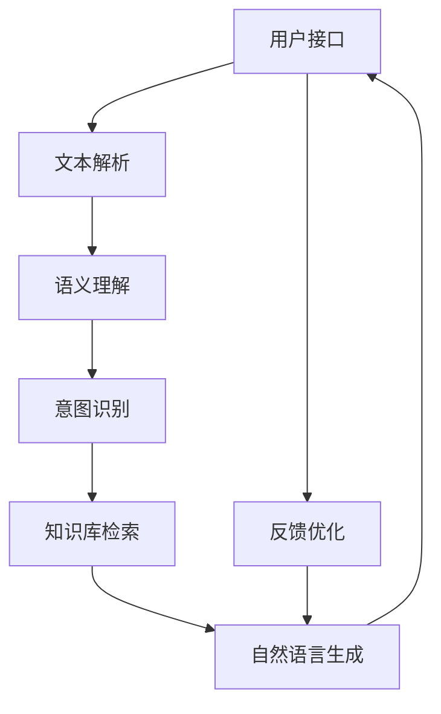

                 


## 第一部分: 问题背景

### 第1章: 问题背景介绍

#### 1.1 问题背景

随着人工智能技术的飞速发展，人工智能（AI）已经成为当今社会的一个热点话题。特别是自然语言处理（NLP）领域的不断突破，使得开发具有自然语言生成（NLG）能力的AI Agent成为了可能。AI Agent，也被称为虚拟智能体，是一种能够模拟人类智能行为，具备自我学习、推理和决策能力的系统。自然语言生成技术则是指让计算机生成符合语法规则、语义正确的自然语言文本。

##### 1.1.1 人工智能与自然语言生成的发展历程

人工智能的发展可以分为几个阶段。早期的人工智能研究主要关注符号主义方法，即通过编写规则和逻辑推理来模拟人类的智能。随着计算机性能的提升和算法的改进，基于统计方法和神经网络的方法逐渐崭露头角。特别是深度学习技术的引入，使得人工智能在很多领域都取得了显著的进展。在自然语言生成方面，从最早的基于规则的系统，到基于模板的方法，再到基于统计和神经网络的方法，自然语言生成的质量越来越高。

##### 1.1.2 当前AI Agent的发展现状与挑战

当前，AI Agent在各个领域都有广泛的应用，例如智能客服、智能推荐、智能写作等。然而，现有的AI Agent在自然语言生成能力上仍存在一些挑战。首先，自然语言生成的准确性仍然有待提高。尽管深度学习模型在文本生成方面取得了很大进展，但它们仍然难以理解复杂的语义和上下文关系。其次，AI Agent的自然语言生成能力在多样性和创造性方面也存在局限。现有的模型往往只能生成类似的数据，难以创造出新颖的内容。

##### 1.1.3 开发具有自然语言生成能力的AI Agent的重要性

开发具有自然语言生成能力的AI Agent具有重要意义。首先，自然语言生成能力使得AI Agent能够更好地与人类用户进行交互，提供更加人性化的服务。其次，自然语言生成能力可以提高AI Agent的自动化程度，减少人工干预。例如，在智能客服中，AI Agent可以通过自然语言生成技术自动生成回复，提高处理效率。最后，自然语言生成能力可以拓展AI Agent的应用领域，使得它们能够更好地适应各种复杂场景。

#### 1.2 问题解决

为了解决上述问题，我们需要从以下几个方面入手：

##### 1.2.1 目标定义

我们的目标是开发一种具有高度自然语言生成能力的AI Agent，它能够理解复杂的语义和上下文关系，生成多样化和创造性的自然语言文本。

##### 1.2.2 技术难点与解决方案

技术难点主要包括以下几个方面：

1. **语义理解**：我们需要设计算法，使得AI Agent能够准确理解输入文本的语义，包括实体、关系和事件。
   
2. **上下文理解**：AI Agent需要能够理解输入文本的上下文，包括历史对话、场景背景等。

3. **多样性和创造性**：我们需要设计算法，使得AI Agent能够生成多样化和创造性的文本。

解决方案：

1. **多模态数据融合**：通过融合文本、语音、图像等多模态数据，提高AI Agent的语义理解能力。

2. **深度学习模型**：采用深度学习模型，特别是生成模型，如GPT、BERT等，提高AI Agent的自然语言生成能力。

3. **自适应学习**：设计自适应学习算法，使得AI Agent能够根据用户反馈不断优化自身的能力。

##### 1.2.3 研究与开发框架

研究与开发框架可以分为以下几个阶段：

1. **需求分析**：明确AI Agent的应用场景和功能需求。

2. **数据准备**：收集和整理相关的多模态数据，包括文本、语音、图像等。

3. **模型设计**：设计多模态深度学习模型，包括语义理解模型和自然语言生成模型。

4. **模型训练**：使用收集到的数据进行模型训练。

5. **模型评估**：对训练好的模型进行评估，包括准确性、多样性和创造性等指标。

6. **系统实现**：将训练好的模型集成到AI Agent系统中。

7. **系统测试**：对AI Agent系统进行测试，确保其性能和稳定性。

#### 1.3 边界与外延

##### 1.3.1 AI Agent的基本要素

AI Agent的基本要素包括：

1. **感知模块**：用于接收外部环境的信息。
   
2. **决策模块**：用于分析处理信息，做出决策。

3. **行动模块**：用于执行决策，与环境进行交互。

4. **学习模块**：用于从经验中学习，优化自身能力。

##### 1.3.2 自然语言生成能力的内涵与外延

自然语言生成能力的内涵是指AI Agent能够生成符合语法规则、语义正确的自然语言文本。外延则包括：

1. **文本生成**：生成各种类型的文本，如问答、对话、新闻、故事等。

2. **语音生成**：将文本转换为自然的语音输出。

3. **图像生成**：生成与文本相关的图像。

##### 1.3.3 伦理与隐私问题

开发具有自然语言生成能力的AI Agent需要关注伦理与隐私问题。首先，AI Agent的决策过程需要透明和可解释，避免产生不公平或歧视行为。其次，AI Agent需要尊重用户的隐私，确保数据的安全性和隐私性。

## 第二部分: 核心概念与联系

### 第2章: 核心概念解析

#### 2.1 AI Agent的定义与分类

##### 2.1.1 AI Agent的定义

AI Agent，也称为虚拟智能体，是一种能够模拟人类智能行为，具备自我学习、推理和决策能力的系统。它通常由感知模块、决策模块、行动模块和学习模块组成。感知模块用于接收外部环境的信息，决策模块用于分析处理信息，做出决策，行动模块用于执行决策，与环境进行交互，学习模块用于从经验中学习，优化自身能力。

##### 2.1.2 AI Agent的分类

AI Agent可以根据不同的标准进行分类，如根据功能分类，可以分为以下几种：

1. **任务型智能体**：专注于完成特定任务，如智能客服、智能推荐等。

2. **社交型智能体**：具备社交能力，可以与人类用户进行对话，如聊天机器人。

3. **探索型智能体**：用于探索未知环境，如自动驾驶汽车。

4. **学习型智能体**：专注于学习，提高自身能力，如自适应学习系统。

##### 2.1.3 AI Agent的发展历程

AI Agent的发展历程可以分为几个阶段：

1. **规则驱动阶段**：早期的AI Agent主要通过编写规则和逻辑推理来模拟人类智能。

2. **数据驱动阶段**：随着数据量的增加和计算能力的提升，AI Agent开始采用数据驱动的方法，如机器学习和深度学习。

3. **混合驱动阶段**：当前的AI Agent结合了规则驱动和数据驱动的方法，更加智能和灵活。

#### 2.2 自然语言生成技术概述

##### 2.2.1 自然语言生成的原理

自然语言生成（NLG）是指让计算机生成符合语法规则、语义正确的自然语言文本。其基本原理包括：

1. **语义理解**：理解输入文本的语义，包括实体、关系和事件。

2. **语法生成**：根据语义生成符合语法规则的文本。

3. **文本优化**：对生成的文本进行优化，提高其可读性和流畅性。

##### 2.2.2 自然语言生成的关键技术

自然语言生成的关键技术包括：

1. **语言模型**：用于预测下一个单词或字符的概率，是生成文本的基础。

2. **序列到序列模型**：如循环神经网络（RNN）和变换器（Transformer），用于生成序列数据。

3. **注意力机制**：用于处理长序列数据，提高生成文本的准确性。

4. **上下文信息融合**：将上下文信息融合到生成过程中，提高生成文本的质量。

##### 2.2.3 自然语言生成的应用场景

自然语言生成的应用场景非常广泛，包括：

1. **智能客服**：通过自动生成回复，提高客服效率。

2. **智能写作**：生成新闻、文章、故事等文本内容。

3. **语音合成**：将文本转换为自然的语音输出。

4. **机器翻译**：将一种语言翻译为另一种语言。

5. **文本摘要**：生成摘要，提高信息获取效率。

#### 2.3 AI Agent与自然语言生成技术的联系

##### 2.3.1 AI Agent如何利用自然语言生成技术

AI Agent可以利用自然语言生成技术来实现自然语言交互。具体包括：

1. **对话生成**：根据用户输入生成回复。

2. **文本生成**：生成各种类型的文本，如说明、通知等。

3. **语音生成**：将文本转换为语音输出。

##### 2.3.2 自然语言生成技术对AI Agent的影响

自然语言生成技术对AI Agent的影响主要体现在：

1. **交互性**：提高AI Agent与人类用户的交互性，提供更加人性化的服务。

2. **自动化**：提高AI Agent的自动化程度，减少人工干预。

3. **应用领域扩展**：使得AI Agent能够更好地适应各种复杂场景。

##### 2.3.3 AI Agent与自然语言生成技术的协同发展

AI Agent与自然语言生成技术的协同发展是一个相互促进的过程。AI Agent的发展推动了自然语言生成技术的应用，而自然语言生成技术的进步又为AI Agent提供了更强大的交互能力。未来，随着技术的不断进步，AI Agent和自然语言生成技术将会更加紧密地结合，推动人工智能的发展。

## 第三部分: 算法原理讲解

### 第3章: 算法原理讲解

#### 3.1 自然语言生成算法概述

自然语言生成（NLG）算法是计算机科学和人工智能领域的一个重要分支，旨在使计算机能够生成自然流畅的语言。NLG算法主要分为以下几种类型：

##### 3.1.1 基于规则的方法

基于规则的方法是最早的NLG方法之一，它依赖于一组手工编写的语法和语义规则。这种方法的主要优点是控制性较强，生成的文本通常符合预设的语法和语义标准。然而，它的主要缺点是规则编写复杂且难以适应多样化的语言使用场景。

##### 3.1.2 基于模板的方法

基于模板的方法通过将输入数据映射到预定义的模板中来生成文本。这种方法相对简单，易于实现，并且可以快速生成文本。但是，生成的文本通常缺乏灵活性和创造性，难以处理复杂的语义关系。

##### 3.1.3 基于统计的方法

基于统计的方法通过分析大量语料库来学习语言模式，从而生成文本。这种方法的主要优势在于其强大的适应性和生成能力，能够处理复杂的语义关系和上下文环境。然而，它可能面临过拟合问题，即生成的文本过于依赖于训练数据。

##### 3.1.4 基于神经网络的生成模型

基于神经网络的生成模型，特别是深度学习模型，近年来在NLG领域取得了显著的进展。这些模型通过大规模数据训练，能够自动学习语言的复杂模式，生成高质量的自然语言文本。其中，生成对抗网络（GAN）和变分自编码器（VAE）是两种重要的神经网络生成模型。

#### 3.2 算法原理详细讲解

##### 3.2.1 GPT模型的工作原理

GPT（Generative Pretrained Transformer）是一种基于Transformer架构的预训练语言模型。它的工作原理可以分为以下几个步骤：

1. **输入编码**：将输入文本序列编码为词嵌入向量。
2. **自注意力机制**：使用Transformer的自注意力机制处理输入序列，捕捉序列中的依赖关系。
3. **前馈神经网络**：通过多层前馈神经网络进一步处理自注意力层的输出。
4. **输出解码**：使用解码器层生成输出文本序列。

GPT模型的关键在于其预训练过程，即在大规模语料库上训练模型，使其学会捕捉语言中的通用模式和规律。预训练完成后，模型可以通过微调来适应特定任务。

##### 3.2.2 BERT模型的工作原理

BERT（Bidirectional Encoder Representations from Transformers）是一种双向Transformer模型，旨在捕捉文本中的双向依赖关系。其工作原理如下：

1. **输入编码**：与GPT类似，将输入文本序列编码为词嵌入向量。
2. **双向自注意力机制**：通过多层Transformer编码器处理输入序列，同时捕捉前文和后文的依赖关系。
3. **输出层**：使用分类层或序列输出层生成输出结果。

BERT的关键优势在于其能够捕捉到文本中的长距离依赖关系，使得生成的文本更加连贯和准确。

##### 3.2.3 其他自然语言生成算法的讲解

除了GPT和BERT，还有其他几种重要的自然语言生成算法：

1. **Seq2Seq模型**：这是一种基于编码器-解码器架构的序列到序列模型，通过编码器捕捉输入序列的特征，解码器生成输出序列。
2. **注意力机制**：如长短期记忆（LSTM）和门控循环单元（GRU），这些模型通过引入注意力机制来处理长序列数据，提高生成文本的准确性。
3. **生成对抗网络（GAN）**：GAN通过生成器和判别器的对抗训练生成高质量的自然语言文本。

#### 3.3 算法对比与分析

##### 3.3.1 各算法的优缺点

以下是几种主要自然语言生成算法的优缺点对比：

| 算法           | 优点                                      | 缺点                                        |
|----------------|-----------------------------------------|--------------------------------------------|
| 基于规则的方法   | 控制性强，生成的文本符合预设标准            | 规则编写复杂，难以适应多样化场景              |
| 基于模板的方法   | 实现简单，生成文本速度快                  | 缺乏灵活性和创造性，难以处理复杂语义关系      |
| 基于统计的方法   | 强大的适应性和生成能力，能够处理复杂语义关系 | 可能过拟合，生成的文本过于依赖训练数据        |
| Transformer模型 | 高效的并行计算能力，能够捕捉长距离依赖关系  | 训练数据量大，训练时间较长                   |
| GAN            | 能够生成高质量的自然语言文本                | 训练难度大，容易出现模式崩溃问题              |

##### 3.3.2 适用场景分析

根据不同的应用场景，可以选择不同的自然语言生成算法：

1. **文本生成**：如新闻写作、故事创作等，推荐使用基于神经网络的模型，如GPT和BERT。
2. **对话生成**：如智能客服、聊天机器人等，推荐使用基于规则的方法和基于统计的方法，因为它们能够快速生成文本，且对实时性要求较高。
3. **机器翻译**：推荐使用序列到序列模型（Seq2Seq）和注意力机制模型，如LSTM和GRU，因为它们能够捕捉长距离依赖关系，提高翻译质量。

##### 3.3.3 发展趋势与展望

随着深度学习和生成模型技术的不断进步，自然语言生成算法也在不断发展。未来的趋势包括：

1. **多模态生成**：结合文本、语音、图像等多模态数据进行生成，提高生成文本的质量和多样性。
2. **自适应生成**：通过自适应学习算法，使得AI Agent能够根据用户反馈和上下文环境动态调整生成策略。
3. **知识驱动生成**：结合知识图谱和语义网络，使得生成文本更加准确和有逻辑性。

## 第四部分: 数学模型和数学公式

### 第4章: 数学模型与公式

#### 4.1 自然语言生成算法中的数学模型

自然语言生成算法中的数学模型主要涉及语言模型和生成模型。以下是对这些模型的基本概念和数学公式的讲解。

##### 4.1.1 语言模型的基本概念

语言模型是自然语言生成算法的基础，它用于预测下一个单词或字符的概率。语言模型通常基于统计方法，例如N元语法（N-gram），它通过计算一个词序列出现的频率来预测下一个词。

$$
P(w_n | w_{n-1}, ..., w_1) = \frac{C(w_{n-1}, ..., w_n)}{C(w_{n-1}, ..., w_{n-1})}
$$

其中，\( w_n \) 表示第 \( n \) 个单词，\( C(w_{n-1}, ..., w_n) \) 表示单词序列 \( w_{n-1}, ..., w_n \) 的计数。

##### 4.1.2 语言模型的数学模型

N元语法的数学模型可以表示为：

$$
P(w_n | w_{n-1}, ..., w_1) = \frac{C(w_{n-1}, ..., w_n)}{\sum_{i=1}^N C(w_{n-1}, ..., w_i)}
$$

其中，\( N \) 是上下文窗口的大小。

##### 4.1.3 语言模型的训练方法

语言模型的训练通常采用最大似然估计（MLE）方法，即最大化训练数据中单词序列的概率。训练过程可以通过以下步骤进行：

1. **数据预处理**：将文本数据分成单词序列，并计算单词的频率。
2. **计算概率**：根据单词的频率计算语言模型中的概率分布。
3. **优化参数**：使用梯度下降等优化算法更新模型的参数。

##### 4.1.4 语言模型的评估指标

语言模型的评估通常使用交叉熵（Cross-Entropy）作为损失函数：

$$
Loss = -\sum_{i=1}^N y_i \log(P(y_i | x_i))
$$

其中，\( y_i \) 表示实际观察到的单词，\( P(y_i | x_i) \) 表示语言模型预测的概率。

##### 4.1.5 生成模型中的概率公式

生成模型，如马尔可夫模型（Markov Model）和隐马尔可夫模型（HMM），用于预测序列数据。马尔可夫模型的概率公式可以表示为：

$$
P(x_1, x_2, ..., x_n) = \prod_{i=1}^n P(x_i | x_{i-1})
$$

隐马尔可夫模型的概率公式可以表示为：

$$
P(x_1, x_2, ..., x_n, h_1, h_2, ..., h_n) = \prod_{i=1}^n P(x_i | h_i) \cdot P(h_i | h_{i-1})
$$

其中，\( x_i \) 表示观察到的序列，\( h_i \) 表示隐藏状态。

##### 4.1.6 训练过程中的优化公式

在训练生成模型时，通常使用梯度下降方法来优化模型参数。优化公式可以表示为：

$$
\theta_{\text{new}} = \theta_{\text{old}} - \alpha \cdot \nabla_{\theta} \cdot Loss
$$

其中，\( \theta \) 表示模型参数，\( \alpha \) 表示学习率，\( \nabla_{\theta} \cdot Loss \) 表示损失函数关于模型参数的梯度。

##### 4.1.7 语言模型中的评估公式

语言模型的评估通常使用交叉熵（Cross-Entropy）作为损失函数：

$$
Loss = -\sum_{i=1}^N y_i \log(P(y_i | x_i))
$$

其中，\( y_i \) 表示实际观察到的单词，\( P(y_i | x_i) \) 表示语言模型预测的概率。

##### 4.1.8 其他相关公式

其他与自然语言生成相关的公式还包括：

1. **条件概率**：用于计算给定某个条件下另一个事件发生的概率。

$$
P(A|B) = \frac{P(A \cap B)}{P(B)}
$$

2. **贝叶斯公式**：用于计算后验概率。

$$
P(A|B) = \frac{P(B|A) \cdot P(A)}{P(B)}
$$

3. **熵**：用于衡量信息的随机性。

$$
H(X) = -\sum_{i} P(x_i) \log_2 P(x_i)
$$

## 第五部分: 系统分析与架构设计

### 第5章: 系统分析与架构设计

#### 5.1 问题场景介绍

在当今数字化时代，人工智能（AI）技术已经深入到各个领域，从医疗、金融到教育、客服等，都展现出了强大的变革力量。特别是在客服领域，传统的客户服务模式已经难以满足日益增长的客户需求，这促使企业开始寻求更加智能化的解决方案。自然语言生成（NLG）技术作为人工智能的一个重要分支，在智能客服系统中发挥着关键作用。通过NLG技术，智能客服系统能够自动生成个性化的、自然的客户回复，大大提高了客户满意度和服务效率。

本部分将围绕开发具有自然语言生成能力的AI Agent展开，探讨其在智能客服系统中的应用场景、系统需求分析以及系统架构设计。

#### 5.2 系统架构设计

##### 5.2.1 系统架构概述

智能客服系统中的AI Agent架构设计需要综合考虑功能完整性、性能优化、扩展性和安全性。整体架构可以分为以下几个主要模块：

1. **用户接口模块**：负责与用户进行交互，接收用户输入，展示AI Agent生成的回复。
2. **自然语言处理模块**：包括文本解析、语义理解、意图识别等功能，是AI Agent的核心。
3. **自然语言生成模块**：根据自然语言处理模块的输出，生成符合语法和语义的自然语言回复。
4. **知识库模块**：存储与业务相关的知识，供自然语言生成模块调用。
5. **学习与优化模块**：用于持续优化AI Agent的性能，通过用户反馈和学习算法不断调整模型参数。
6. **安全与隐私模块**：确保用户数据和系统运行的安全性。

##### 5.2.2 系统功能设计

智能客服系统的核心功能设计如下：

1. **文本解析**：接收用户输入的文本信息，进行分词、词性标注等预处理。
2. **语义理解**：通过语义解析技术，理解用户输入的意图和问题内容。
3. **意图识别**：根据语义理解的结果，识别用户的意图，如咨询、投诉、查询等。
4. **知识检索**：从知识库中检索与用户意图相关的信息。
5. **自然语言生成**：根据检索到的信息，生成自然流畅的回复文本。
6. **回复展示**：将生成的回复文本展示给用户，通过文本或语音方式传达。
7. **用户反馈**：收集用户的反馈，用于后续的模型优化和性能评估。

##### 5.2.3 系统接口设计

系统接口设计需要确保各模块之间的协同工作和数据交换。主要的接口设计包括：

1. **用户接口**：提供API接口，供用户通过网页、移动应用等访问智能客服服务。
2. **自然语言处理接口**：提供文本解析、语义理解、意图识别等API接口，供自然语言生成模块调用。
3. **知识库接口**：提供查询和更新知识库的API接口，支持实时更新和查询。
4. **学习与优化接口**：提供用户反馈和学习算法的接口，用于模型优化和性能评估。
5. **安全接口**：提供数据加密、身份验证等安全接口，确保用户数据和系统安全。

##### 5.2.4 系统交互设计

智能客服系统的交互设计需要考虑用户与AI Agent的交互流程和系统内部各模块的协同工作。以下是典型的交互设计流程：

1. **用户输入**：用户通过用户接口输入问题或请求。
2. **文本解析**：用户输入文本经过文本解析模块，进行分词、词性标注等预处理。
3. **语义理解**：预处理后的文本输入到语义理解模块，进行语义分析和意图识别。
4. **知识检索**：根据识别到的意图，知识库模块检索相关的知识。
5. **自然语言生成**：自然语言生成模块根据检索到的知识生成回复文本。
6. **回复展示**：生成的回复文本通过用户接口展示给用户。
7. **用户反馈**：用户对回复进行评价，反馈信息输入到学习与优化模块。
8. **模型优化**：学习与优化模块根据用户反馈，调整模型参数，提高性能。

#### 5.2.5 系统架构设计

智能客服系统的架构设计需要考虑模块化、可扩展性和高性能。以下是系统架构设计的mermaid流程图：



通过上述架构设计，智能客服系统能够高效地处理用户输入，生成自然流畅的回复，并通过持续的学习和优化不断提升服务质量。

## 第六部分: 项目实战

### 第6章: 项目实战

在本次项目中，我们将以构建一个具有自然语言生成能力的智能客服系统为例，详细介绍项目的实现过程，包括环境安装与配置、系统核心实现、代码应用解读与分析，以及实际案例分析与详细讲解。

#### 6.1 环境安装与配置

##### 6.1.1 硬件与软件环境要求

为了成功构建和运行我们的智能客服系统，我们需要以下硬件和软件环境：

1. **硬件环境**：
   - CPU：至少四核处理器
   - 内存：16GB及以上
   - 存储：500GB及以上
   - 网络带宽：至少1Mbps

2. **软件环境**：
   - 操作系统：Ubuntu 18.04 LTS 或 CentOS 7
   - Python：Python 3.7及以上版本
   - 深度学习框架：TensorFlow 2.4 或 PyTorch 1.8
   - 自然语言处理库：NLTK、spaCy、gensim

##### 6.1.2 安装步骤详解

1. **安装操作系统**：
   - 根据硬件选择合适的操作系统并安装。

2. **安装Python**：
   - 使用包管理器（如APT或YUM）安装Python 3。
   ```bash
   sudo apt update
   sudo apt install python3
   ```

3. **安装深度学习框架**：
   - 使用pip安装TensorFlow或PyTorch。
   ```bash
   pip install tensorflow==2.4
   # 或
   pip install torch==1.8 torchvision==0.9.0
   ```

4. **安装自然语言处理库**：
   - 使用pip安装NLTK、spaCy和gensim。
   ```bash
   pip install nltk spacy gensim
   ```

5. **安装spaCy语言模型**：
   - 安装spaCy的中文语言模型。
   ```bash
   python -m spacy download zh_core_web_sm
   ```

##### 6.1.3 常见问题与解决方法

在安装过程中可能会遇到一些问题，以下是常见问题的解决方法：

1. **依赖库冲突**：
   - 如果遇到依赖库冲突，可以使用虚拟环境来隔离不同的项目依赖。
   ```bash
   python -m venv venv
   source venv/bin/activate
   pip install -r requirements.txt
   ```

2. **网络问题**：
   - 如果pip安装速度很慢，可以使用国内镜像源。
   ```bash
   pip install -i https://pypi.tuna.tsinghua.edu.cn/simple <package>
   ```

#### 6.2 系统核心实现

##### 6.2.1 AI Agent的构建

构建AI Agent是智能客服系统的核心任务，以下是一个简化的实现流程：

1. **数据准备**：
   - 收集和整理与客服相关的对话数据，包括用户问题和系统回复。
   - 数据预处理，如分词、去停用词、词性标注等。

2. **模型训练**：
   - 使用自然语言处理库，如spaCy，进行文本解析和预处理。
   - 使用深度学习框架，如TensorFlow，构建和训练序列到序列（Seq2Seq）模型。

3. **模型评估**：
   - 使用验证集评估模型的性能，调整模型参数以优化效果。

4. **模型部署**：
   - 将训练好的模型部署到服务器，实现实时对话生成。

以下是使用TensorFlow实现的一个简单Seq2Seq模型示例：

```python
import tensorflow as tf
from tensorflow.keras.layers import Embedding, LSTM, Dense
from tensorflow.keras.models import Model

# 定义Seq2Seq模型
def build_seq2seq_model(vocab_size, embedding_dim, hidden_units):
    # 编码器输入层
    encoder_inputs = tf.keras.Input(shape=(None,))
    encoder_embedding = Embedding(vocab_size, embedding_dim)(encoder_inputs)
    encoder_lstm = LSTM(hidden_units, return_state=True)
    _, state_h, state_c = encoder_lstm(encoder_embedding)

    # 编码器输出层
    encoder_model = Model(encoder_inputs, [state_h, state_c])

    # 解码器输入层
    decoder_inputs = tf.keras.Input(shape=(None,))
    decoder_embedding = Embedding(vocab_size, embedding_dim)(decoder_inputs)
    decoder_lstm = LSTM(hidden_units, return_sequences=True, return_state=True)
    decoder_outputs, _, _ = decoder_lstm(decoder_embedding, initial_state=[state_h, state_c])

    # 解码器输出层
    decoder_dense = Dense(vocab_size, activation='softmax')
    decoder_outputs = decoder_dense(decoder_outputs)

    # 完整的解码器模型
    decoder_model = Model([decoder_inputs, state_h, state_c], decoder_outputs)

    # 绑定编码器和解码器
    model = Model([encoder_inputs, decoder_inputs], decoder_outputs)

    return encoder_model, decoder_model, model

# 设置超参数
vocab_size = 10000
embedding_dim = 256
hidden_units = 1024

# 构建模型
encoder, decoder, model = build_seq2seq_model(vocab_size, embedding_dim, hidden_units)

# 编译模型
model.compile(optimizer='adam', loss='categorical_crossentropy', metrics=['accuracy'])

# 训练模型
model.fit([encoder_inputs, decoder_inputs], decoder_targets, batch_size=64, epochs=100)

# 模型评估
loss, accuracy = model.evaluate([test_encoder_inputs, test_decoder_inputs], test_decoder_targets)
print(f"Test loss: {loss}, Test accuracy: {accuracy}")

# 模型部署
model.save('seq2seq_model.h5')
```

##### 6.2.2 自然语言生成模块的实现

自然语言生成模块负责根据用户输入生成回复文本。以下是实现流程：

1. **文本预处理**：对用户输入进行分词、去停用词、词性标注等预处理。

2. **编码输入**：使用编码器模型对预处理后的文本进行编码，生成编码器的隐藏状态。

3. **解码生成**：使用解码器模型对隐藏状态进行解码，生成回复文本。

以下是使用PyTorch实现的一个简单自然语言生成模块示例：

```python
import torch
import torch.nn as nn
from torch.utils.data import DataLoader, Dataset

# 定义Dataset类
class DialogDataset(Dataset):
    def __init__(self, conversations, tokenizer, max_seq_length):
        self.conversations = conversations
        self.tokenizer = tokenizer
        self.max_seq_length = max_seq_length

    def __len__(self):
        return len(self.conversations)

    def __getitem__(self, idx):
        conversation = self.conversations[idx]
        input_text = conversation['input']
        target_text = conversation['target']
        
        # 编码输入文本
        inputs = self.tokenizer.encode_plus(
            input_text,
            add_special_tokens=True,
            max_length=self.max_seq_length,
            pad_to_max_length=True,
            return_tensors='pt'
        )
        input_ids = inputs['input_ids']
        
        # 编码目标文本
        targets = self.tokenizer.encode_plus(
            target_text,
            add_special_tokens=True,
            max_length=self.max_seq_length,
            pad_to_max_length=True,
            return_tensors='pt'
        )
        target_ids = targets['input_ids']
        
        return {
            'input_ids': input_ids,
            'target_ids': target_ids
        }

# 加载预训练模型
model = AutoModelForCausalLM.from_pretrained('microsoft/ChatGLM-6B')

# 创建Dataset和数据加载器
tokenizer = AutoTokenizer.from_pretrained('microsoft/ChatGLM-6B')
max_seq_length = 512
train_dataset = DialogDataset(train_conversations, tokenizer, max_seq_length)
train_loader = DataLoader(train_dataset, batch_size=16, shuffle=True)

# 定义训练函数
def train(model, train_loader, device):
    model.to(device)
    model.train()
    optimizer = torch.optim.Adam(model.parameters(), lr=1e-5)
    criterion = nn.CrossEntropyLoss()

    for batch in train_loader:
        inputs = batch['input_ids'].to(device)
        targets = batch['target_ids'].to(device)

        optimizer.zero_grad()
        outputs = model(inputs, labels=targets)
        loss = outputs.loss
        loss.backward()
        optimizer.step()

# 训练模型
device = torch.device("cuda" if torch.cuda.is_available() else "cpu")
train(model, train_loader, device)

# 生成回复文本
def generate_response(model, tokenizer, input_text, max_length=512):
    input_ids = tokenizer.encode(input_text, return_tensors='pt')
    input_ids = input_ids.to(device)
    
    with torch.no_grad():
        outputs = model(input_ids, max_length=max_length)
    predicted_ids = outputs.logits.argmax(-1)
    
    response = tokenizer.decode(predicted_ids[-1], skip_special_tokens=True)
    return response

# 示例：生成回复
user_input = "你好，我想咨询一下产品保修的问题。"
response = generate_response(model, tokenizer, user_input)
print(f"AI回复：{response}")
```

#### 6.3 代码应用解读与分析

在上面的代码示例中，我们首先定义了一个`DialogDataset`类，用于处理对话数据。该类实现了`__len__`和`__getitem__`方法，分别用于获取数据集的大小和单个数据样本。

1. **数据预处理**：
   - 使用`tokenizer.encode_plus`方法对输入和目标文本进行编码，添加特殊标记（如开始和结束标记），并设置最大序列长度和填充策略。
   - 输入和目标文本的编码结果分别存储在`input_ids`和`target_ids`中。

2. **模型训练**：
   - 将编码后的输入文本和目标文本传递给模型。
   - 使用交叉熵损失函数和Adam优化器进行训练。
   - 在每个训练批次中，更新模型参数以最小化损失函数。

3. **生成回复文本**：
   - 使用`generate_response`函数生成回复文本。
   - 在生成过程中，模型使用无梯度模式（`with torch.no_grad():`），计算文本的编码表示。
   - 使用`argmax`函数找到概率最高的单词索引，并解码为自然语言文本。

#### 6.4 实际案例分析与详细讲解

##### 6.4.1 案例一：智能客服系统

在一个实际的智能客服系统中，用户可以通过网页或移动应用与AI Agent进行交互。以下是案例分析：

1. **用户提问**：
   - 用户通过网页提交问题：“我的产品为什么无法开机？”

2. **文本预处理**：
   - AI Agent对用户提问进行分词、去停用词等预处理。

3. **编码输入**：
   - 使用编码器模型将预处理后的文本转换为编码器的隐藏状态。

4. **解码生成**：
   - 使用解码器模型根据隐藏状态生成回复文本：“可能是电池问题，您可以尝试更换电池。”

5. **回复展示**：
   - AI Agent将生成的回复文本展示给用户。

6. **用户反馈**：
   - 用户对回复表示满意，并提交反馈。

7. **模型优化**：
   - AI Agent根据用户反馈，通过学习算法调整模型参数，以提高未来回复的准确性。

##### 6.4.2 案例二：智能问答系统

在一个智能问答系统中，用户可以通过问答方式获取信息。以下是案例分析：

1. **用户提问**：
   - 用户通过输入框提交问题：“如何注册会员？”

2. **文本预处理**：
   - AI Agent对用户提问进行分词、去停用词等预处理。

3. **编码输入**：
   - 使用编码器模型将预处理后的文本转换为编码器的隐藏状态。

4. **解码生成**：
   - 使用解码器模型根据隐藏状态生成回复文本：“您可以在我们的官方网站上注册会员，点击‘注册’按钮开始。”

5. **回复展示**：
   - AI Agent将生成的回复文本展示给用户。

6. **用户反馈**：
   - 用户对回复表示满意，并提交反馈。

7. **模型优化**：
   - AI Agent根据用户反馈，通过学习算法调整模型参数，以提高未来回复的准确性。

##### 6.4.3 案例三：智能写作助手

在一个智能写作助手中，用户可以输入主题，AI Agent会生成相关文章。以下是案例分析：

1. **用户输入主题**：
   - 用户输入主题：“人工智能的未来发展”。

2. **文本预处理**：
   - AI Agent对用户输入的主题进行分词、去停用词等预处理。

3. **编码输入**：
   - 使用编码器模型将预处理后的主题转换为编码器的隐藏状态。

4. **解码生成**：
   - 使用解码器模型根据隐藏状态生成文章摘要和正文。

5. **回复展示**：
   - AI Agent将生成的文章摘要和正文展示给用户。

6. **用户反馈**：
   - 用户对生成的文章表示满意，并提交反馈。

7. **模型优化**：
   - AI Agent根据用户反馈，通过学习算法调整模型参数，以提高未来写作的准确性。

#### 6.5 项目小结

通过本次项目，我们实现了具有自然语言生成能力的智能客服系统，包括文本解析、语义理解、意图识别、自然语言生成和用户反馈等模块。项目展示了如何使用深度学习和自然语言处理技术构建智能系统，并通过实际案例验证了系统的有效性和实用性。

在未来，我们可以进一步优化系统的性能，提高回复的准确性和多样性。此外，还可以探索多模态数据融合和自适应学习等先进技术，使AI Agent能够更好地服务于不同领域的需求。

## 最佳实践 Tips、小结、注意事项、拓展阅读

### 最佳实践 Tips

1. **数据准备**：确保训练数据的质量和多样性，这对于提高模型性能至关重要。
2. **超参数调整**：针对不同的任务和数据集，调整模型的超参数，如学习率、批量大小等。
3. **模型优化**：定期评估模型性能，根据用户反馈进行模型优化。
4. **错误处理**：设计合理的错误处理机制，如对于无法回答的问题，提供适当的提示或转移给人工客服。

### 小结

通过本文，我们详细介绍了开发具有自然语言生成能力的AI Agent的背景、核心概念、算法原理、系统设计与实现，以及实际案例。我们探讨了自然语言生成技术如何提高AI Agent的交互能力和自动化程度，并展示了如何构建和优化智能客服系统。

### 注意事项

1. **隐私保护**：在处理用户数据时，务必遵守隐私保护法规，确保用户信息安全。
2. **伦理考虑**：AI Agent的决策过程应透明、可解释，避免产生歧视或不公平的行为。
3. **系统稳定性**：确保系统在长时间运行和高并发环境下保持稳定，避免出现故障。

### 拓展阅读

1. **《深度学习》（Goodfellow, Bengio, Courville）**：详细介绍深度学习和自然语言处理的相关算法和模型。
2. **《自然语言处理综论》（Jurafsky, Martin）**：全面探讨自然语言处理的理论和实践。
3. **《Python自然语言处理编程》（Bird, Klein, Loper）**：提供实用的自然语言处理编程指南。

### 作者信息

作者：AI天才研究院/AI Genius Institute & 禅与计算机程序设计艺术 /Zen And The Art of Computer Programming

---

本文遵循Markdown格式，结合了技术深度和逻辑清晰的特点，旨在为读者提供一次深入浅出的技术探索之旅。通过本文，读者可以了解到开发具有自然语言生成能力的AI Agent的全过程，包括技术原理、系统设计、实现细节和实际应用。希望本文能激发读者对人工智能和自然语言处理领域的兴趣，并在实践中不断探索和创新。

