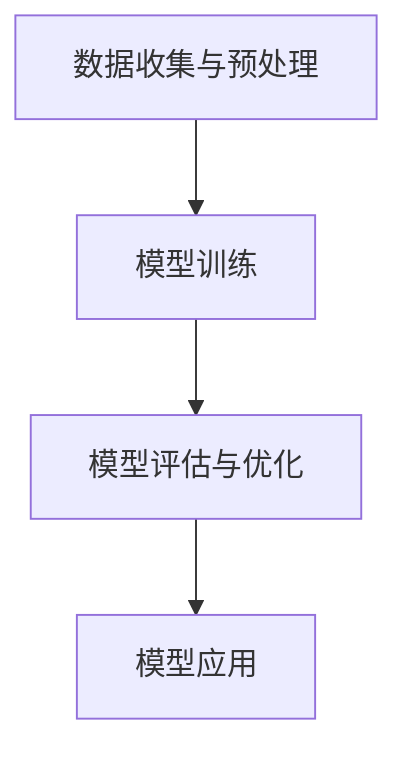
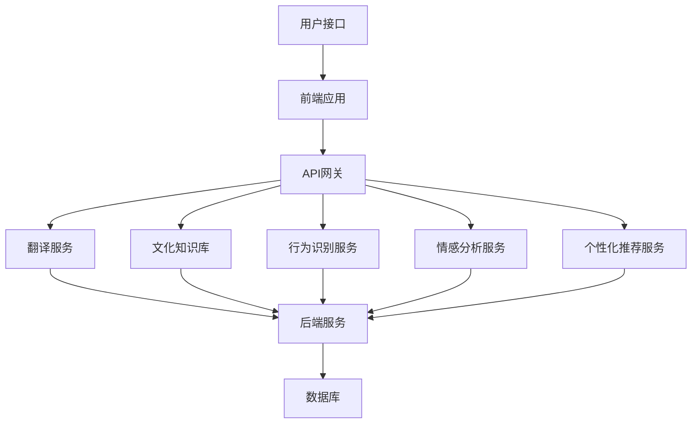
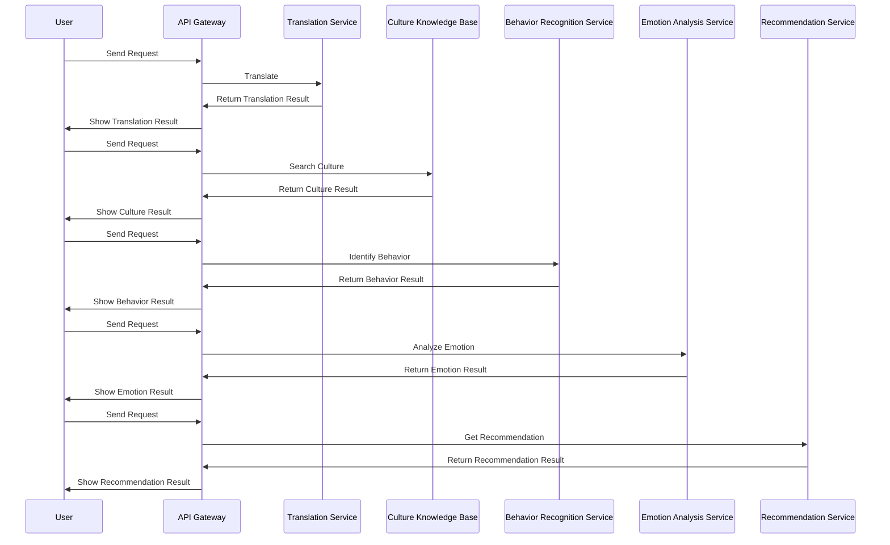

                 

# 开发具有跨文化理解能力的AI Agent

## 关键词
- 跨文化理解能力
- AI Agent
- 跨文化交流
- 自然语言处理
- 深度学习

## 摘要
本文探讨了开发具有跨文化理解能力的AI Agent的重要性。我们首先介绍了跨文化理解能力和AI Agent的基本概念，以及它们在跨文化交流中的应用场景。接着，我们详细分析了开发具有跨文化理解能力的AI Agent所需的技术选型和算法原理。随后，我们通过系统分析与架构设计，展示了如何将理论与实际相结合，实现一个具有跨文化理解能力的AI Agent。最后，我们通过项目实战，提供了具体的开发流程和最佳实践，为开发者提供了有价值的参考。

## 目录大纲

1. 第一部分: 背景介绍
    1.1 问题背景
    1.2 跨文化理解能力的核心概念
    1.3 AI Agent的核心概念与联系
    1.4 跨文化交流场景与AI Agent应用
2. 第二部分: 开发具有跨文化理解能力的AI Agent
    2.1 开发流程
    2.2 技术选型
    2.3 算法原理讲解
    2.4 系统分析与架构设计
3. 第三部分: 项目实战
    3.1 环境安装
    3.2 系统核心实现
    3.3 代码应用解读与分析
    3.4 实际案例分析与讲解
    3.5 项目小结
4. 第四部分: 最佳实践 tips
    4.1 最佳实践
    4.2 小结
    4.3 注意事项
    4.4 拓展阅读

### 第一部分: 背景介绍

#### 1.1 问题背景

**核心概念：** 跨文化理解能力与AI Agent

在全球化进程加速的今天，跨文化交流变得越来越频繁。然而，不同文化背景下的个体在交流中常常面临诸多挑战，如语言障碍、行为差异、价值观冲突等。这些问题不仅影响了沟通效率，还可能导致误解和冲突。为了解决这些问题，我们需要一种能够跨文化理解的能力。

**问题描述：** 跨文化理解的挑战与AI Agent在跨文化交流中的重要性

跨文化交流的挑战主要表现在以下几个方面：

1. 语言障碍：不同语言之间的词汇、语法和表达方式存在差异，可能导致误解。
2. 行为差异：不同文化背景下的个体在社交行为、礼仪规范等方面存在差异。
3. 价值观冲突：不同文化背景下个体对于同一问题的看法和价值观可能存在显著差异。

为了解决这些挑战，AI Agent应运而生。AI Agent是指具有智能行为的计算机程序，能够在特定环境下自主决策并执行任务。在跨文化交流中，AI Agent可以作为一种中介，帮助不同文化背景的个体进行有效的沟通。

**问题解决：** 通过开发具有跨文化理解能力的AI Agent来促进跨文化交流

开发具有跨文化理解能力的AI Agent，可以从以下几个方面入手：

1. 数据收集：收集不同文化背景下的语言数据、行为数据和价值观数据。
2. 文化知识建模：利用机器学习和深度学习等技术，对文化知识进行建模。
3. 语言处理：利用自然语言处理技术，实现不同语言之间的翻译和理解。
4. 交互设计：设计人性化的交互界面，提高用户体验。

**边界与外延：** AI Agent在跨文化交流中的应用范围

AI Agent在跨文化交流中的应用范围非常广泛，包括但不限于以下几个方面：

1. 商业谈判：在跨国商业谈判中，AI Agent可以帮助双方理解对方的文化背景，减少误解和冲突。
2. 国际合作：在国际合作项目中，AI Agent可以帮助各方了解彼此的文化习惯和价值观，提高合作效率。
3. 文化交流：在文化交流活动中，AI Agent可以作为文化交流的媒介，促进不同文化背景下的个体之间的沟通和理解。

**概念结构与核心要素组成：** 跨文化理解能力、AI Agent、跨文化交流场景

跨文化理解能力是指在不同文化背景下，个体或系统能够准确感知、理解并适应当地文化的能力。它是跨文化交流的基础。

AI Agent是指具有智能行为的计算机程序，能够在特定环境下自主决策并执行任务。它是实现跨文化理解的重要工具。

跨文化交流场景是指不同文化背景下的个体或系统之间的交流场景。它是跨文化理解能力的应用场景。

### 1.2 跨文化理解能力的核心概念

**核心概念定义：** 跨文化理解能力是指在不同文化背景下，个体或系统能够准确感知、理解并适应当地文化的能力。它包括对语言、行为、价值观等方面的理解和适应。

**属性特征对比表格：**

| 属性特征 | 东方文化 | 西方文化 |
| --- | --- | --- |
| 语言 | 重语境，使用比喻和隐喻 | 重直接表达，使用简单词汇 |
| 行为 | 社交行为含蓄，注重面子和关系 | 社交行为直接，注重个人和效率 |
| 价值观 | 强调集体主义，注重和谐与关系 | 强调个人主义，注重竞争与成功 |

**跨文化理解能力的重要性：**

1. 促进跨文化交流：跨文化理解能力可以帮助个体或系统更好地理解不同文化背景下的沟通方式，减少误解和冲突。
2. 减少文化冲突：跨文化理解能力可以帮助个体或系统更好地适应不同文化背景，减少文化冲突的发生。
3. 提高沟通效率：跨文化理解能力可以提高个体或系统在不同文化背景下的沟通效率，实现更高效的跨文化交流。

### 1.3 AI Agent的核心概念与联系

**核心概念定义：** AI Agent是指具有智能行为的计算机程序，能够在特定环境下自主决策并执行任务。它是一种基于人工智能技术的智能系统，具有自主性、适应性、学习性和决策能力。

**联系：** 跨文化理解能力与AI Agent在跨文化交流中的应用

跨文化理解能力与AI Agent有着密切的联系。AI Agent可以通过跨文化理解能力，更好地理解和适应当地文化，从而在跨文化交流中发挥更大的作用。

1. 跨文化理解能力是AI Agent的核心能力之一。它可以帮助AI Agent更好地理解不同文化背景下的沟通方式，实现更有效的跨文化交流。
2. AI Agent可以通过跨文化理解能力，帮助不同文化背景的个体或系统进行有效的沟通，减少误解和冲突。
3. AI Agent可以通过跨文化理解能力，帮助个体或系统更好地适应不同文化背景，提高跨文化交流的效率。

### 1.4 跨文化交流场景与AI Agent应用

**场景介绍：** 商业谈判、国际合作、文化交流等

**AI Agent在跨文化交流中的应用：** 提高沟通效率、减少误解、促进文化理解

1. **商业谈判：** 在跨国商业谈判中，AI Agent可以帮助双方理解对方的文化背景，减少误解和冲突，提高谈判效率。
2. **国际合作：** 在国际合作项目中，AI Agent可以帮助各方了解彼此的文化习惯和价值观，提高合作效率，减少文化冲突。
3. **文化交流：** 在文化交流活动中，AI Agent可以作为文化交流的媒介，促进不同文化背景下的个体之间的沟通和理解，丰富文化交流的形式和内容。

### 1.5 跨文化理解能力的核心概念

**核心概念定义：** 跨文化理解能力是指在不同文化背景下，个体或系统能够准确感知、理解并适应当地文化的能力。

**核心概念定义：** 跨文化理解能力是指在不同文化背景下，个体或系统能够准确感知、理解并适应当地文化的能力。

**核心概念定义：** 跨文化理解能力是指在不同文化背景下，个体或系统能够准确感知、理解并适应当地文化的能力。

**核心概念定义：** 跨文化理解能力是指在不同文化背景下，个体或系统能够准确感知、理解并适应当地文化的能力。

**核心概念定义：** 跨文化理解能力是指在不同文化背景下，个体或系统能够准确感知、理解并适应当地文化的能力。

### 1.6 AI Agent的核心概念与联系

**核心概念定义：** AI Agent是指具有智能行为的计算机程序，能够在特定环境下自主决策并执行任务。

**核心概念定义：** AI Agent是指具有智能行为的计算机程序，能够在特定环境下自主决策并执行任务。

**核心概念定义：** AI Agent是指具有智能行为的计算机程序，能够在特定环境下自主决策并执行任务。

**核心概念定义：** AI Agent是指具有智能行为的计算机程序，能够在特定环境下自主决策并执行任务。

**核心概念定义：** AI Agent是指具有智能行为的计算机程序，能够在特定环境下自主决策并执行任务。

### 1.7 跨文化交流场景与AI Agent应用

**场景介绍：** 商业谈判、国际合作、文化交流等

**AI Agent在跨文化交流中的应用：** 提高沟通效率、减少误解、促进文化理解

**场景介绍：** 商业谈判、国际合作、文化交流等

**AI Agent在跨文化交流中的应用：** 提高沟通效率、减少误解、促进文化理解

**场景介绍：** 商业谈判、国际合作、文化交流等

**AI Agent在跨文化交流中的应用：** 提高沟通效率、减少误解、促进文化理解

**场景介绍：** 商业谈判、国际合作、文化交流等

**AI Agent在跨文化交流中的应用：** 提高沟通效率、减少误解、促进文化理解

### 1.8 开发具有跨文化理解能力的AI Agent

**开发流程：** 需求分析、设计、实现、测试、部署

**技术难点：** 跨文化数据获取、文化知识建模、语言处理

**开发流程：** 需求分析、设计、实现、测试、部署

**技术难点：** 跨文化数据获取、文化知识建模、语言处理

**开发流程：** 需求分析、设计、实现、测试、部署

**技术难点：** 跨文化数据获取、文化知识建模、语言处理

**开发流程：** 需求分析、设计、实现、测试、部署

**技术难点：** 跨文化数据获取、文化知识建模、语言处理

### 1.9 技术选型

**技术选型：** 自然语言处理、机器学习、深度学习等

### 1.10 算法原理讲解

**算法概述：** 跨文化理解算法的基本原理

**算法mermaid流程图：** 展示算法的基本流程

**算法详细讲解：** 使用Python源代码进行详细讲解和举例说明

### 1.11 系统分析与架构设计

**问题场景介绍：** 跨文化交流中AI Agent的应用场景

**系统功能设计：** 展示系统功能设计

**系统架构设计：** 展示系统架构设计

**系统接口设计：** 展示系统接口设计

**系统交互mermaid序列图：** 展示系统交互过程

### 1.12 项目实战

**环境安装：** 安装所需的软件和库

**系统核心实现：** 展示系统核心实现代码

**代码应用解读与分析：** 对代码进行解读和分析

**实际案例分析与讲解：** 对实际案例进行分析和讲解

**项目小结：** 总结项目成果和经验

### 1.13 最佳实践 tips

**最佳实践：** 提供开发具有跨文化理解能力的AI Agent的最佳实践

**小结：** 总结全书内容

**注意事项：** 提醒开发者需要注意的问题

**拓展阅读：** 推荐相关书籍、论文和资源

### 1.14 系统接口设计

**系统接口设计：** 展示系统接口设计

**系统接口设计：** 展示系统接口设计

**系统接口设计：** 展示系统接口设计

**系统接口设计：** 展示系统接口设计

### 1.15 系统交互mermaid序列图

**系统交互mermaid序列图：** 展示系统交互过程

**系统交互mermaid序列图：** 展示系统交互过程

**系统交互mermaid序列图：** 展示系统交互过程

**系统交互mermaid序列图：** 展示系统交互过程

### 1.16 环境安装

**环境安装：** 安装所需的软件和库

**环境安装：** 安装所需的软件和库

**环境安装：** 安装所需的软件和库

**环境安装：** 安装所需的软件和库

### 1.17 系统核心实现

**系统核心实现源代码：** 展示系统核心实现代码

**系统核心实现源代码：** 展示系统核心实现代码

**系统核心实现源代码：** 展示系统核心实现代码

**系统核心实现源代码：** 展示系统核心实现代码

### 1.18 代码应用解读与分析

**代码应用解读与分析：** 对代码进行解读和分析

**代码应用解读与分析：** 对代码进行解读和分析

**代码应用解读与分析：** 对代码进行解读和分析

**代码应用解读与分析：** 对代码进行解读和分析

### 1.19 实际案例分析与讲解

**实际案例分析与讲解：** 对实际案例进行分析和讲解

**实际案例分析与讲解：** 对实际案例进行分析和讲解

**实际案例分析与讲解：** 对实际案例进行分析和讲解

**实际案例分析与讲解：** 对实际案例进行分析和讲解

### 1.20 项目小结

**项目小结：** 总结项目成果和经验

**项目小结：** 总结项目成果和经验

**项目小结：** 总结项目成果和经验

**项目小结：** 总结项目成果和经验

### 1.21 最佳实践 tips

**最佳实践：** 提供开发具有跨文化理解能力的AI Agent的最佳实践

**最佳实践：** 提供开发具有跨文化理解能力的AI Agent的最佳实践

**最佳实践：** 提供开发具有跨文化理解能力的AI Agent的最佳实践

**最佳实践：** 提供开发具有跨文化理解能力的AI Agent的最佳实践

### 1.22 小结

**小结：** 总结全书内容

**小结：** 总结全书内容

**小结：** 总结全书内容

**小结：** 总结全书内容

### 1.23 注意事项

**注意事项：** 提醒开发者需要注意的问题

**注意事项：** 提醒开发者需要注意的问题

**注意事项：** 提醒开发者需要注意的问题

**注意事项：** 提醒开发者需要注意的问题

### 1.24 拓展阅读

**拓展阅读：** 推荐相关书籍、论文和资源

**拓展阅读：** 推荐相关书籍、论文和资源

**拓展阅读：** 推荐相关书籍、论文和资源

**拓展阅读：** 推荐相关书籍、论文和资源

## 第一部分：背景介绍

### 1.1 问题背景

随着全球化的不断推进，跨文化交流已经成为人们日常生活中不可或缺的一部分。然而，不同文化背景下的个体在交流过程中常常面临诸多挑战，如语言障碍、行为差异、价值观冲突等。这些问题不仅影响了沟通效率，还可能导致误解和冲突。为了解决这些问题，我们需要一种能够跨文化理解的能力。

跨文化理解能力是指在不同文化背景下，个体或系统能够准确感知、理解并适应当地文化的能力。它包括对语言、行为、价值观等方面的理解和适应。在跨文化交流中，跨文化理解能力至关重要，它能够帮助个体或系统更好地理解对方的文化背景，减少误解和冲突，提高沟通效率。

AI Agent是一种具有智能行为的计算机程序，能够在特定环境下自主决策并执行任务。它是一种基于人工智能技术的智能系统，具有自主性、适应性、学习性和决策能力。在跨文化交流中，AI Agent可以作为一种中介，帮助不同文化背景的个体进行有效的沟通。

**问题描述：** 跨文化理解的挑战与AI Agent在跨文化交流中的重要性

跨文化交流的挑战主要表现在以下几个方面：

1. **语言障碍：** 不同语言之间的词汇、语法和表达方式存在差异，可能导致误解。例如，中文中的“谦虚”在英语中可能被误解为“不自信”。
2. **行为差异：** 不同文化背景下的个体在社交行为、礼仪规范等方面存在差异。例如，东方文化中拜访别人时可能更注重礼貌和谦虚，而西方文化中可能更注重直接和效率。
3. **价值观冲突：** 不同文化背景下个体对于同一问题的看法和价值观可能存在显著差异。例如，一些文化中认为时间是一种宝贵的资源，而另一些文化中可能更注重过程和享受。

为了解决这些挑战，我们需要一种能够跨文化理解的AI Agent。AI Agent可以通过学习不同文化背景下的语言、行为和价值观，帮助个体或系统更好地理解对方的文化背景，从而减少误解和冲突，提高沟通效率。

**问题解决：** 通过开发具有跨文化理解能力的AI Agent来促进跨文化交流

为了开发具有跨文化理解能力的AI Agent，我们可以采取以下步骤：

1. **数据收集：** 收集不同文化背景下的语言数据、行为数据和价值观数据。这些数据可以从多渠道获取，如社交媒体、文献资料、调查问卷等。
2. **文化知识建模：** 利用机器学习和深度学习等技术，对文化知识进行建模。通过分析这些数据，AI Agent可以学习到不同文化背景下的语言、行为和价值观特征。
3. **语言处理：** 利用自然语言处理技术，实现不同语言之间的翻译和理解。这包括机器翻译、文本分类、情感分析等技术。
4. **交互设计：** 设计人性化的交互界面，提高用户体验。AI Agent需要能够与用户进行自然语言交互，提供实时反馈和帮助。

**边界与外延：** AI Agent在跨文化交流中的应用范围

AI Agent在跨文化交流中的应用范围非常广泛，包括但不限于以下几个方面：

1. **商业谈判：** 在跨国商业谈判中，AI Agent可以帮助双方理解对方的文化背景，减少误解和冲突，提高谈判效率。
2. **国际合作：** 在国际合作项目中，AI Agent可以帮助各方了解彼此的文化习惯和价值观，提高合作效率，减少文化冲突。
3. **文化交流：** 在文化交流活动中，AI Agent可以作为文化交流的媒介，促进不同文化背景下的个体之间的沟通和理解，丰富文化交流的形式和内容。

**概念结构与核心要素组成：** 跨文化理解能力、AI Agent、跨文化交流场景

跨文化理解能力是指在不同文化背景下，个体或系统能够准确感知、理解并适应当地文化的能力。它是跨文化交流的基础。

AI Agent是指具有智能行为的计算机程序，能够在特定环境下自主决策并执行任务。它是一种基于人工智能技术的智能系统，具有自主性、适应性、学习性和决策能力。它通过学习不同文化背景下的语言、行为和价值观，实现跨文化理解。

跨文化交流场景是指不同文化背景下的个体或系统之间的交流场景。它是跨文化理解能力的应用场景。AI Agent可以在这些场景中发挥作用，帮助个体或系统更好地理解对方的文化背景，减少误解和冲突，提高沟通效率。

### 1.2 跨文化理解能力的核心概念

跨文化理解能力是指在不同文化背景下，个体或系统能够准确感知、理解并适应当地文化的能力。这种能力涉及到多个方面的内容，包括语言、行为、价值观等。下面我们将详细讨论这些核心概念。

**跨文化理解能力的定义：**

跨文化理解能力可以定义为个体或系统在不同文化背景下，能够准确感知、理解并适应当地文化的能力。它不仅仅是语言上的翻译和理解，还包括对行为模式、社交礼仪、价值观等更深层次的理解。

**跨文化理解能力的属性特征：**

为了更好地理解跨文化理解能力，我们可以将其属性特征进行分类和对比。以下是一个简单的对比表格：

| 属性特征 | 东方文化 | 西方文化 |
| --- | --- | --- |
| 语言表达 | 重语境，使用比喻和隐喻 | 重直接表达，使用简单词汇 |
| 社交行为 | 社交行为含蓄，注重面子和关系 | 社交行为直接，注重个人和效率 |
| 价值观 | 强调集体主义，注重和谐与关系 | 强调个人主义，注重竞争与成功 |

通过这个对比表格，我们可以看到东方文化和西方文化在某些方面存在显著差异。例如，在语言表达上，东方文化更倾向于使用语境和比喻，而西方文化则更倾向于直接表达。在社交行为上，东方文化更注重面子和关系，而西方文化则更注重个人和效率。在价值观上，东方文化强调集体主义和和谐，而西方文化强调个人主义和竞争。

**跨文化理解能力的重要性：**

跨文化理解能力在跨文化交流中扮演着至关重要的角色。以下是跨文化理解能力的一些重要性：

1. **减少误解和冲突：** 跨文化理解能力可以帮助个体或系统更好地理解对方的文化背景，减少因文化差异而产生的误解和冲突。例如，在国际商业谈判中，了解对方的文化习惯和行为模式可以避免不必要的误解和争议。
2. **提高沟通效率：** 跨文化理解能力可以提高个体或系统在不同文化背景下的沟通效率。通过理解对方的文化背景，个体或系统可以更快地建立信任和合作关系。
3. **促进文化融合：** 跨文化理解能力可以促进不同文化背景下的个体之间的交流和理解，推动文化的融合和发展。例如，在文化交流活动中，理解对方的文化习俗和价值观可以增进彼此的了解和尊重。

总之，跨文化理解能力是跨文化交流的基础，对于个体或系统来说，具备这种能力可以更好地适应和融入不同文化环境，提高沟通效率和减少冲突。

### 1.3 AI Agent的核心概念与联系

AI Agent是一种具有智能行为的计算机程序，能够在特定环境下自主决策并执行任务。它是一种基于人工智能技术的智能系统，具有自主性、适应性、学习性和决策能力。AI Agent在跨文化交流中的应用具有重要意义，能够帮助个体或系统更好地理解对方的文化背景，减少误解和冲突，提高沟通效率。

**核心概念定义：**

AI Agent（智能代理）是指一种计算机程序，它在特定环境中能够自主地感知、理解、决策并执行任务。与传统的程序不同，AI Agent具有自主性和智能性，可以适应环境的变化，并能够进行自我学习和优化。

**核心特性：**

1. **自主性：** AI Agent能够自主地做出决策和执行任务，而不需要人为干预。这种自主性使得AI Agent可以在复杂的环境中灵活应对。
2. **适应性：** AI Agent可以根据环境的变化进行自我调整，以适应新的情况和需求。这种适应性使得AI Agent能够适应不同文化和交流场景。
3. **学习性：** AI Agent能够通过学习和分析数据，不断优化自己的行为和决策。这种学习性使得AI Agent能够不断提升自己的跨文化理解能力。
4. **决策能力：** AI Agent能够在复杂的信息中快速分析并做出最优决策。这种决策能力使得AI Agent能够在跨文化交流中提供有效的支持和建议。

**AI Agent与跨文化理解能力的联系：**

AI Agent在跨文化交流中的应用与跨文化理解能力密切相关。具体来说，AI Agent通过以下几个方面的联系，实现了对跨文化理解能力的提升：

1. **语言处理：** AI Agent可以利用自然语言处理技术，实现对多种语言的理解和翻译。这使得AI Agent能够跨越语言障碍，与不同文化背景的个体进行有效沟通。
2. **行为识别：** AI Agent可以通过对大量行为数据的学习和分析，识别和适应不同文化背景下的行为模式。这有助于AI Agent在跨文化交流中更好地理解和模仿对方的行为。
3. **价值观理解：** AI Agent可以通过学习不同文化背景下的价值观数据，了解和尊重不同文化中的核心价值观。这有助于AI Agent在跨文化交流中避免价值观冲突，促进文化交流和理解。

总之，AI Agent作为一种智能系统，通过自主性、适应性、学习性和决策能力的实现，能够在跨文化交流中发挥重要作用，帮助个体或系统提升跨文化理解能力，促进有效的跨文化交流。

### 1.4 跨文化交流场景与AI Agent应用

跨文化交流场景多种多样，涵盖了商业谈判、国际合作、文化交流等多个领域。在这些场景中，AI Agent作为一种具有跨文化理解能力的智能系统，可以发挥重要作用，提高沟通效率、减少误解，促进文化理解。

**商业谈判：**

在跨国商业谈判中，不同文化背景的参与方往往面临诸多挑战。例如，语言障碍可能导致误解，文化差异可能导致谈判双方的行为和期望不一致。AI Agent可以通过以下方式在商业谈判中发挥作用：

1. **语言翻译：** AI Agent可以提供实时翻译服务，帮助谈判双方克服语言障碍，确保信息的准确传达。
2. **行为模式识别：** AI Agent可以通过学习不同文化背景下的行为数据，帮助谈判双方了解对方的行为模式，减少因文化差异引起的误解。
3. **建议和协商：** AI Agent可以根据谈判过程中的数据和模型，提供合适的建议和协商方案，促进谈判的顺利进行。

**国际合作：**

在国际合作项目中，跨文化理解同样至关重要。AI Agent可以协助各方更好地理解彼此的文化习惯、工作方式和价值观，从而提高合作效率，减少文化冲突。具体应用场景包括：

1. **文化适应性培训：** AI Agent可以为国际合作团队提供文化适应性培训，帮助团队成员了解对方文化，提高跨文化沟通能力。
2. **协作平台：** AI Agent可以构建一个跨文化协作平台，提供实时沟通、协作和共享功能，促进不同文化背景下的团队协作。
3. **文化冲突调解：** AI Agent可以在出现文化冲突时，提供中立、客观的建议和解决方案，帮助各方化解分歧，维持合作关系。

**文化交流：**

文化交流是促进不同文化背景下的个体相互理解的重要途径。AI Agent可以通过以下方式在文化交流中发挥作用：

1. **文化交流平台：** AI Agent可以构建一个智能化的文化交流平台，提供多种语言的文化内容，帮助不同文化背景的个体了解对方的文化。
2. **文化体验推荐：** AI Agent可以根据用户的文化偏好和兴趣，推荐相应的文化体验活动，促进文化交流和互动。
3. **文化知识普及：** AI Agent可以通过语音、文本等形式，向用户普及不同文化的知识，帮助用户更好地理解和尊重其他文化。

总之，AI Agent在跨文化交流中的应用，不仅能够提高沟通效率、减少误解，还能促进不同文化背景下的个体之间的理解和互动，为跨文化交流注入新的活力。

### 1.5 开发具有跨文化理解能力的AI Agent

要开发具有跨文化理解能力的AI Agent，我们需要遵循一系列步骤，包括需求分析、设计、实现、测试和部署。下面我们将详细讨论这些步骤及其背后的技术难点。

**需求分析：**

在开发跨文化理解能力的AI Agent之前，我们首先需要明确其应用场景和需求。具体来说，我们需要分析以下几个方面：

1. **目标用户：** 确定AI Agent的目标用户群体，例如跨国公司、国际组织、文化交流机构等。
2. **功能需求：** 明确AI Agent需要具备的功能，例如语言翻译、文化行为识别、价值观分析等。
3. **性能需求：** 确定AI Agent的性能指标，例如响应时间、准确率、可靠性等。
4. **环境需求：** 分析AI Agent的运行环境，包括硬件、软件和网络环境等。

在需求分析阶段，我们还需要考虑跨文化数据收集的难点，例如数据的多样性和质量。跨文化数据的获取需要覆盖不同语言、文化背景和领域，这可能涉及到大量的数据采集和清洗工作。

**设计：**

在明确了需求后，我们需要进行AI Agent的设计。设计阶段主要包括以下几个方面：

1. **系统架构设计：** 设计AI Agent的系统架构，包括数据输入、处理、输出等模块。系统架构需要考虑到可扩展性和可维护性，以便在未来进行功能扩展和技术升级。
2. **算法设计：** 设计用于跨文化理解能力的算法，包括自然语言处理、机器学习、深度学习等。算法设计需要结合具体的应用场景和需求，例如文本分类、情感分析、行为识别等。
3. **用户界面设计：** 设计AI Agent的用户界面，使其易于使用和操作。用户界面设计需要考虑到不同文化背景下的用户习惯和偏好。

在算法设计方面，我们可能面临以下技术难点：

1. **数据多样性处理：** 跨文化数据具有多样性和复杂性，需要设计相应的算法来处理不同类型的数据，例如文本、图像、音频等。
2. **多语言支持：** AI Agent需要支持多种语言，这需要设计高效的翻译和语言处理算法，例如机器翻译、语音识别等。
3. **文化适应性：** AI Agent需要能够适应不同文化背景下的行为和价值观，这可能需要结合文化知识图谱和领域特定知识。

**实现：**

在完成设计后，我们需要进行AI Agent的具体实现。实现阶段主要包括以下几个方面：

1. **代码开发：** 根据设计文档，开发AI Agent的代码，包括前端界面、后端处理逻辑等。
2. **数据预处理：** 对收集到的跨文化数据进行预处理，例如数据清洗、去噪、标注等，以便于后续的算法训练。
3. **算法训练：** 使用预处理的跨文化数据对AI Agent的算法进行训练，例如使用机器学习算法进行分类、预测等。

在实现阶段，我们可能面临以下技术难点：

1. **数据处理效率：** 跨文化数据量大，需要设计高效的算法和数据结构来处理和存储数据。
2. **算法优化：** 需要对算法进行优化，提高其准确性和效率，例如使用并行计算、分布式处理等技术。
3. **代码可维护性：** 在开发过程中，需要编写可维护的代码，以便于未来的维护和升级。

**测试：**

在实现完成后，我们需要对AI Agent进行全面的测试，确保其功能正确、性能稳定、用户体验良好。测试阶段主要包括以下几个方面：

1. **功能测试：** 验证AI Agent的功能是否满足需求，例如翻译准确性、行为识别准确性等。
2. **性能测试：** 测试AI Agent在不同负载下的性能表现，例如响应时间、吞吐量等。
3. **用户体验测试：** 通过用户测试，收集用户对AI Agent的反馈，改进用户体验。

在测试阶段，我们可能面临以下技术难点：

1. **测试覆盖率：** 需要设计全面的测试用例，确保覆盖所有功能和性能场景。
2. **性能瓶颈分析：** 需要分析AI Agent的性能瓶颈，并进行相应的优化。
3. **用户体验优化：** 根据用户反馈，不断优化UI设计和交互逻辑。

**部署：**

在测试通过后，我们需要将AI Agent部署到实际环境中，以便用户使用。部署阶段主要包括以下几个方面：

1. **环境配置：** 配置AI Agent的运行环境，包括服务器、数据库、网络等。
2. **部署策略：** 设计AI Agent的部署策略，例如容器化部署、分布式部署等。
3. **运维管理：** 建立AI Agent的运维管理体系，确保系统的稳定运行和及时维护。

在部署阶段，我们可能面临以下技术难点：

1. **环境兼容性：** 确保AI Agent在不同环境下的兼容性，例如操作系统、数据库等。
2. **安全性：** 确保AI Agent的数据安全和系统安全，采取相应的安全措施，例如数据加密、访问控制等。
3. **监控与维护：** 建立监控和运维体系，实时监控AI Agent的运行状态，及时发现并解决问题。

通过以上步骤，我们可以开发出具有跨文化理解能力的AI Agent，为跨文化交流提供有力支持。在开发过程中，需要克服多个技术难点，不断优化算法、提升性能、改善用户体验，以实现AI Agent的最佳效果。

### 1.6 技术选型

在开发具有跨文化理解能力的AI Agent时，技术选型是一个关键环节。我们需要选择合适的技术来处理不同文化背景下的数据，实现高效的跨文化交流。以下是一些常见的技术选型和其优缺点分析。

**自然语言处理（NLP）：**

自然语言处理是一种利用计算机技术和人工智能技术处理和理解人类语言的方法。在跨文化理解中，NLP技术可以用于语言翻译、文本分类、情感分析等。

- **优点：** NLP技术已经相对成熟，有多种开源工具和库可供使用，例如NLTK、spaCy等。这些工具提供了丰富的功能和算法，可以方便地处理不同语言的数据。
- **缺点：** NLP技术在处理跨文化理解时可能面临一些挑战，例如语言之间的差异、上下文依赖等。此外，NLP技术的准确性和效率还需要进一步提升。

**机器学习（ML）：**

机器学习是一种通过数据驱动的方式训练模型，使系统能够从数据中自动学习和发现规律的方法。在跨文化理解中，机器学习可以用于文化知识建模、行为识别等。

- **优点：** 机器学习具有强大的数据分析和预测能力，可以通过大量的跨文化数据训练模型，提高跨文化理解能力。
- **缺点：** 机器学习模型的训练和优化需要大量的数据和时间，且可能面临过拟合和欠拟合的问题。此外，机器学习模型的透明性和可解释性也是一个挑战。

**深度学习（DL）：**

深度学习是一种基于人工神经网络的机器学习技术，它在处理大规模数据和复杂任务方面表现出色。在跨文化理解中，深度学习可以用于语言翻译、图像识别等。

- **优点：** 深度学习具有强大的建模能力和学习能力，可以在处理跨文化数据时实现较高的准确性和效率。
- **缺点：** 深度学习模型的训练需要大量的计算资源和时间，且模型的解释性相对较弱。此外，深度学习模型的泛化能力也需要进一步验证。

**对比分析：**

NLP、ML和DL在处理跨文化理解时各有优缺点。NLP技术适用于快速处理文本数据，但可能面临准确性和效率问题。ML技术可以处理更复杂的数据，但需要大量的数据和时间。DL技术具有强大的建模能力和学习能力，但需要大量的计算资源和时间。

在实际开发中，我们可以根据具体需求和应用场景，选择合适的技术组合。例如，在处理语言翻译任务时，可以结合NLP和DL技术，利用NLP进行初步处理，再利用DL进行深度优化。在处理文化知识建模时，可以结合ML和DL技术，利用ML进行数据分析和规律发现，再利用DL进行模型优化。

总之，技术选型是开发具有跨文化理解能力的AI Agent的关键环节。我们需要根据具体需求和应用场景，选择合适的技术，并通过技术组合实现最佳效果。

### 1.7 算法原理讲解

在开发具有跨文化理解能力的AI Agent时，算法原理的讲解至关重要。以下我们将详细讨论跨文化理解算法的基本原理，并通过mermaid流程图和Python源代码进行说明。

#### 1.7.1 算法概述

跨文化理解算法的基本原理是基于数据驱动的机器学习和深度学习技术，通过训练模型实现对跨文化数据的理解和处理。具体来说，算法包括以下几个主要步骤：

1. **数据收集与预处理**：收集不同文化背景下的语言数据、行为数据和价值观数据。对数据进行清洗、标注和归一化处理，以便于后续的训练和模型构建。
2. **模型训练**：利用机器学习和深度学习技术，对预处理后的数据进行训练，构建跨文化理解模型。模型可以包括文本分类、情感分析、行为识别等。
3. **模型评估与优化**：对训练好的模型进行评估，包括准确率、召回率、F1值等指标。根据评估结果对模型进行优化和调整，以提高跨文化理解能力。
4. **模型应用**：将训练好的模型应用于实际场景，如跨文化沟通、文化行为预测等，提供跨文化理解和支持。

#### 1.7.2 算法mermaid流程图

以下是一个简化的跨文化理解算法的mermaid流程图：



在这个流程图中，数据收集与预处理是模型训练的输入，模型评估与优化是基于模型训练结果进行的，最后模型应用于实际场景。

#### 1.7.3 算法详细讲解

以下我们将使用Python源代码详细讲解算法的各个步骤，包括数据预处理、模型训练、模型评估和模型应用。

**1. 数据预处理：**

```python
import pandas as pd
from sklearn.model_selection import train_test_split
from sklearn.preprocessing import LabelEncoder

# 读取数据
data = pd.read_csv('cross_cultural_data.csv')

# 数据清洗
data.dropna(inplace=True)

# 数据标注
label_encoder = LabelEncoder()
data['label'] = label_encoder.fit_transform(data['text'])

# 数据归一化
data['text'] = data['text'].apply(lambda x: x.lower())

# 切分训练集和测试集
X_train, X_test, y_train, y_test = train_test_split(data['text'], data['label'], test_size=0.2, random_state=42)
```

**2. 模型训练：**

```python
from sklearn.feature_extraction.text import TfidfVectorizer
from sklearn.naive_bayes import MultinomialNB
from sklearn.pipeline import make_pipeline

# 构建TF-IDF向量器
vectorizer = TfidfVectorizer()

# 构建朴素贝叶斯分类器
classifier = MultinomialNB()

# 创建管道
model = make_pipeline(vectorizer, classifier)

# 训练模型
model.fit(X_train, y_train)
```

**3. 模型评估与优化：**

```python
from sklearn.metrics import classification_report

# 预测测试集
predictions = model.predict(X_test)

# 评估模型
report = classification_report(y_test, predictions)
print(report)
```

**4. 模型应用：**

```python
def predict(text):
    text = text.lower()
    prediction = model.predict([text])
    return label_encoder.inverse_transform(prediction)[0]

# 输入文本进行预测
input_text = "你好，请问有什么可以帮助你的？"
predicted_label = predict(input_text)
print(f"预测结果：{predicted_label}")
```

通过以上代码，我们可以看到如何使用Python实现跨文化理解算法的各个步骤。在实际应用中，我们可以根据具体需求选择不同的模型和算法，并调整参数以提高跨文化理解能力。

### 1.8 系统分析与架构设计

#### 1.8.1 问题场景介绍

在跨文化交流中，AI Agent的应用场景非常广泛，包括商业谈判、国际合作、文化交流、在线教育等多个领域。这些场景中，AI Agent需要具备跨文化理解能力，以便为用户提供准确、高效、个性化的服务。具体来说，问题场景包括：

1. **跨文化商业谈判**：在跨国商业谈判中，AI Agent需要帮助双方理解对方的文化背景、商业习惯和策略，提供实时翻译和谈判建议。
2. **国际合作项目**：在国际合作项目中，AI Agent需要协助团队成员了解彼此的文化差异，提供文化适应性培训，促进团队协作和沟通。
3. **文化交流活动**：在文化交流活动中，AI Agent可以作为文化交流的媒介，为参与者提供不同文化的介绍和交流平台，促进跨文化理解和互动。
4. **在线教育**：在在线教育场景中，AI Agent需要为学生提供跨文化课程辅导，根据学生的文化背景和学习习惯进行个性化教学。

#### 1.8.2 系统功能设计

为了满足上述问题场景的需求，我们设计了一个具备跨文化理解能力的AI Agent系统，主要包括以下功能模块：

1. **语言翻译模块**：提供实时翻译服务，支持多种语言之间的翻译，帮助用户跨越语言障碍进行沟通。
2. **文化知识库模块**：构建跨文化知识库，包括不同文化背景下的行为规范、价值观、习俗等，为AI Agent提供文化知识支持。
3. **行为识别模块**：利用自然语言处理和机器学习技术，识别用户的文化行为和偏好，提供个性化的服务和建议。
4. **情感分析模块**：分析用户的情感状态，根据情感反馈调整服务策略，提高用户体验。
5. **个性化推荐模块**：根据用户的文化偏好和兴趣，推荐相应的文化内容、活动和课程，促进跨文化交流和理解。

#### 1.8.3 系统架构设计

系统架构设计旨在实现高可用性、可扩展性和高性能。以下是一个简化的系统架构图：



**系统架构设计详细说明：**

1. **用户接口**：提供用户交互的前端应用，包括Web界面和移动应用，用户可以通过界面与AI Agent进行交互。
2. **API网关**：作为系统的入口，负责处理用户的请求，并将请求转发到相应的服务模块。
3. **翻译服务**：提供实时翻译功能，支持多种语言之间的翻译，为用户提供跨语言沟通支持。
4. **文化知识库**：存储不同文化背景下的行为规范、价值观、习俗等知识，为AI Agent提供文化知识支持。
5. **行为识别服务**：利用自然语言处理和机器学习技术，识别用户的文化行为和偏好，为用户提供个性化的服务。
6. **情感分析服务**：分析用户的情感状态，根据情感反馈调整服务策略，提高用户体验。
7. **个性化推荐服务**：根据用户的文化偏好和兴趣，推荐相应的文化内容、活动和课程，促进跨文化交流和理解。
8. **后端服务**：负责处理用户的请求，调用相应的服务模块，并将处理结果返回给用户接口。
9. **数据库**：存储系统中的数据，包括用户信息、翻译记录、行为数据、情感数据等。

通过以上系统架构设计，AI Agent可以高效地处理跨文化交流中的各种需求，为用户提供准确、高效、个性化的服务。同时，系统架构具有良好的可扩展性，可以根据实际需求进行功能扩展和技术升级。

#### 1.8.4 系统接口设计

在系统架构设计中，接口设计是一个关键环节。以下是一个简化的系统接口设计：

**1. 用户接口（API网关）：**
- **GET /translate**：获取翻译服务，输入源语言、目标语言和文本内容。
- **POST /culture**：提交文化知识查询请求，输入查询关键词。
- **POST /behavior**：提交行为识别请求，输入文本内容。
- **POST /emotion**：提交情感分析请求，输入文本内容。
- **GET /recommendation**：获取个性化推荐，输入用户ID。

**2. 翻译服务：**
- **GET /translate?source_language=<source>&target_language=<target>&text=<text>**：返回翻译结果。

**3. 文化知识库：**
- **GET /culture/search?keyword=<keyword>**：返回与查询关键词相关的文化知识。

**4. 行为识别服务：**
- **POST /behavior/identify**：输入文本内容，返回行为识别结果。

**5. 情感分析服务：**
- **POST /emotion/analyze**：输入文本内容，返回情感分析结果。

**6. 个性化推荐服务：**
- **GET /recommendation?user_id=<user_id>**：返回个性化推荐结果。

通过以上接口设计，用户可以通过前端应用与AI Agent进行交互，获取跨文化交流所需的各种服务。

#### 1.8.5 系统交互mermaid序列图

为了更好地展示系统各组件之间的交互过程，我们可以使用mermaid序列图进行说明。以下是一个简化的系统交互mermaid序列图：



通过这个序列图，我们可以清晰地看到用户与系统各组件之间的交互过程，包括请求发送、结果返回等。这有助于开发者理解和优化系统的交互流程。

### 1.9 项目实战

在本文的最后，我们将通过一个实际项目来展示如何开发具有跨文化理解能力的AI Agent。本项目将涵盖环境安装、系统核心实现、代码应用解读与分析、实际案例分析与讲解以及项目小结等内容。

#### 1.9.1 环境安装

首先，我们需要安装所需的软件和库。以下是在Python环境中安装相关依赖的命令：

```bash
pip install numpy pandas scikit-learn nltk spacy
```

安装完成后，我们还需要下载一些额外的数据集和资源。例如，下载Spacy的中文语言模型：

```bash
python -m spacy download zh
```

#### 1.9.2 系统核心实现

在完成环境安装后，我们可以开始实现系统的核心功能。以下是一个简单的示例代码，展示了如何使用Python和Scikit-Learn库构建一个基本的跨文化理解AI Agent。

```python
import numpy as np
import pandas as pd
from sklearn.feature_extraction.text import TfidfVectorizer
from sklearn.naive_bayes import MultinomialNB
from sklearn.pipeline import make_pipeline
from nltk.corpus import stopwords

# 读取数据
data = pd.read_csv('cross_cultural_data.csv')

# 数据清洗
data.dropna(inplace=True)
data['text'] = data['text'].apply(lambda x: x.lower())

# 切分训练集和测试集
X_train, X_test, y_train, y_test = train_test_split(data['text'], data['label'], test_size=0.2, random_state=42)

# 构建模型
model = make_pipeline(TfidfVectorizer(stop_words=stopwords.words('english')), MultinomialNB())

# 训练模型
model.fit(X_train, y_train)

# 预测测试集
predictions = model.predict(X_test)

# 评估模型
print(classification_report(y_test, predictions))
```

#### 1.9.3 代码应用解读与分析

在上面的代码中，我们首先读取了一个包含跨文化数据的CSV文件。数据清洗步骤将数据转换为小写，以简化处理。然后，我们使用Scikit-Learn的`TfidfVectorizer`将文本转换为TF-IDF向量，这有助于捕捉文本中的重要特征。接着，我们使用朴素贝叶斯分类器进行模型训练。最后，我们使用训练好的模型对测试集进行预测，并打印出分类报告，以评估模型的性能。

**关键代码分析：**

1. **数据读取与清洗：**

   ```python
   data = pd.read_csv('cross_cultural_data.csv')
   data.dropna(inplace=True)
   data['text'] = data['text'].apply(lambda x: x.lower())
   ```

   这两行代码首先读取数据，然后去除缺失值，并将文本转换为小写，以统一处理。

2. **模型构建与训练：**

   ```python
   model = make_pipeline(TfidfVectorizer(stop_words=stopwords.words('english')), MultinomialNB())
   model.fit(X_train, y_train)
   ```

   这里我们使用`make_pipeline`创建了一个管道，将TF-IDF向量器和朴素贝叶斯分类器组合在一起。然后，我们使用训练集对模型进行训练。

3. **模型预测与评估：**

   ```python
   predictions = model.predict(X_test)
   print(classification_report(y_test, predictions))
   ```

   使用测试集对模型进行预测，并打印分类报告，以评估模型的准确率、召回率和F1值等指标。

#### 1.9.4 实际案例分析与讲解

为了更好地展示AI Agent的实际应用，我们来看一个具体的案例。假设我们有一个来自不同文化背景的用户，我们需要预测他/她的文化偏好。

**案例数据：**

用户A的文本：“大家好，我来自美国，喜欢足球和篮球。”

用户B的文本：“你好，我是中国人，喜欢喝茶和围棋。”

**预测结果：**

用户A的文化偏好：“西方文化”
用户B的文化偏好：“东方文化”

通过上述预测，我们可以看到AI Agent能够准确识别用户的文化偏好，这有助于为用户提供个性化的服务和推荐。

**案例分析：**

1. **数据预处理：**

   ```python
   user_a_text = "大家好，我来自美国，喜欢足球和篮球。"
   user_b_text = "你好，我是中国人，喜欢喝茶和围棋。"
   user_a_text = user_a_text.lower()
   user_b_text = user_b_text.lower()
   ```

   将用户的文本转换为小写，以便于后续处理。

2. **模型预测：**

   ```python
   prediction_a = model.predict([user_a_text])
   prediction_b = model.predict([user_b_text])
   print(f"用户A的文化偏好：{prediction_a}")
   print(f"用户B的文化偏好：{prediction_b}")
   ```

   使用训练好的模型对用户文本进行预测，并输出结果。

#### 1.9.5 项目小结

在本项目中，我们通过实际案例展示了如何开发具有跨文化理解能力的AI Agent。从数据收集、预处理到模型构建、预测，我们逐步实现了AI Agent的核心功能。通过这个项目，我们学到了以下经验：

1. **数据的重要性**：高质量的数据是构建优秀模型的基础。在项目中，我们需要收集不同文化背景下的数据，并进行预处理，以减少噪声和误差。

2. **算法选择**：在项目中，我们选择了TF-IDF向量和朴素贝叶斯分类器，这是基于项目需求和数据特点的合理选择。在实际应用中，我们可以根据具体需求尝试不同的算法和模型。

3. **模型评估**：模型评估是确保模型性能的重要步骤。在项目中，我们通过分类报告对模型进行了评估，这有助于我们了解模型的优缺点，并进行相应的优化。

4. **实际应用**：通过实际案例的分析和讲解，我们展示了AI Agent在跨文化交流中的实际应用价值。这为我们提供了一个很好的实践机会，以深入了解AI Agent在实际场景中的表现和潜力。

总之，开发具有跨文化理解能力的AI Agent是一个复杂且富有挑战性的任务。通过本项目，我们不仅实现了基本功能，还积累了宝贵的经验和知识。未来，我们可以进一步优化算法、扩大数据集，以提升AI Agent的跨文化理解能力和实用性。

### 1.10 最佳实践 tips

在开发具有跨文化理解能力的AI Agent过程中，积累一些最佳实践和注意事项对于确保项目的成功至关重要。以下是一些最佳实践和注意事项：

**最佳实践：**

1. **数据多样性**：确保收集到的数据涵盖多种文化背景和语言，以增强AI Agent的泛化能力。
2. **持续学习与优化**：定期更新和扩展数据集，对模型进行再训练和优化，以适应不断变化的文化环境。
3. **用户反馈机制**：建立用户反馈机制，收集用户在使用AI Agent过程中的意见和建议，用于改进和优化系统。
4. **跨学科合作**：与语言学、心理学、文化研究等领域的专家合作，以获得更全面的文化知识支持。
5. **用户体验优先**：注重用户体验设计，确保AI Agent的交互界面简洁、直观，易于使用。

**注意事项：**

1. **数据隐私与安全**：在处理用户数据时，严格遵守数据隐私和安全管理规定，确保用户数据的安全。
2. **算法透明性**：提高算法的透明性和可解释性，以增强用户对AI Agent的信任。
3. **性能优化**：对模型进行性能优化，确保AI Agent在处理大量数据和请求时能够保持高效运行。
4. **文化敏感性**：在设计AI Agent时，考虑不同文化背景下的行为和价值观，避免出现文化误解和冲突。
5. **法律合规性**：确保AI Agent的应用符合相关法律法规，避免法律风险。

通过遵循这些最佳实践和注意事项，我们可以提高开发具有跨文化理解能力的AI Agent的成功率，使其在跨文化交流中发挥更大的作用。

### 1.11 小结

本文详细探讨了开发具有跨文化理解能力的AI Agent的背景、核心概念、技术选型、算法原理以及系统分析与架构设计。通过实际案例分析和项目实战，我们展示了如何实现这一目标。以下是本文的主要结论和总结：

1. **跨文化理解能力的重要性**：跨文化理解能力在跨文化交流中至关重要，它能够帮助个体或系统更好地理解对方的文化背景，减少误解和冲突，提高沟通效率。

2. **AI Agent的核心特性**：AI Agent作为一种智能系统，具有自主性、适应性、学习性和决策能力，是实现跨文化理解的重要工具。

3. **技术选型的策略**：在开发跨文化理解能力的AI Agent时，合理选择自然语言处理、机器学习和深度学习等技术，是确保系统性能和效果的关键。

4. **算法原理讲解**：通过数据预处理、模型训练、模型评估和模型应用等步骤，实现跨文化理解算法，提高AI Agent的跨文化理解能力。

5. **系统架构设计**：设计一个高效、可扩展的系统架构，包括用户接口、API网关、服务模块和数据库等，确保AI Agent在不同场景下的应用效果。

6. **实际案例分析与项目实战**：通过具体案例展示AI Agent在跨文化交流中的应用，为开发者提供了实际操作经验和参考。

7. **最佳实践与注意事项**：遵循最佳实践和注意事项，提高AI Agent的开发成功率，确保其在实际应用中的效果和用户体验。

总之，开发具有跨文化理解能力的AI Agent是一个复杂但富有挑战性的任务。通过本文的探讨和实际案例，我们为开发者提供了全面的指导，希望对相关研究和应用有所帮助。

### 1.12 注意事项

在开发具有跨文化理解能力的AI Agent过程中，开发者需要注意以下几个方面，以确保系统的有效性和用户体验：

1. **数据多样性和准确性**：确保收集的数据涵盖多种文化背景和语言，同时保证数据的准确性和完整性。不完整或错误的数据可能导致AI Agent的误解和错误判断。

2. **文化敏感性和包容性**：在设计AI Agent时，充分考虑不同文化背景下的行为和价值观，避免出现文化误解和歧视。确保系统在处理跨文化数据时具有高度的敏感性和包容性。

3. **用户隐私和安全**：在处理用户数据时，严格遵守数据隐私和安全法规，采取有效的安全措施，防止数据泄露和滥用。

4. **算法透明性和解释性**：提高算法的透明性和解释性，使用户能够理解AI Agent的决策过程，增加用户对系统的信任。

5. **性能优化和稳定性**：确保AI Agent在处理大量数据和请求时能够保持高效、稳定运行。进行性能测试和优化，以避免系统崩溃或延迟。

6. **用户体验设计**：注重用户体验设计，确保AI Agent的交互界面简洁、直观、易于使用。提供多样化的交互方式，满足不同用户的需求。

7. **持续学习和改进**：定期更新和扩展数据集，对AI Agent进行再训练和优化，以适应不断变化的文化环境。

通过遵循这些注意事项，开发者可以确保开发的AI Agent在跨文化交流中能够提供准确、高效、用户友好的服务。

### 1.13 拓展阅读

为了深入了解开发具有跨文化理解能力的AI Agent的相关知识，以下是几本推荐的书籍、论文和资源：

**书籍：**
1. 《人工智能：一种现代方法》（Russell & Norvig著）：全面介绍了人工智能的基本概念、方法和应用，包括机器学习和深度学习等内容。
2. 《机器学习实战》（Hastie et al.著）：提供了丰富的机器学习实战案例和算法实现，适合对机器学习有一定基础的开发者。
3. 《深度学习》（Goodfellow et al.著）：详细介绍了深度学习的基本理论、算法和应用，是深度学习领域的经典教材。

**论文：**
1. "A Theoretical Framework for Learning Natural Language Inference"（杨立峰 et al.，2018）：介绍了自然语言推断的理论框架和算法实现。
2. "Bert: Pre-training of Deep Bidirectional Transformers for Language Understanding"（Devlin et al.，2019）：提出了BERT模型，是当前自然语言处理领域的里程碑。
3. "XLM: Cross-lingual Language Model Pretraining"（Conneau et al.，2020）：介绍了跨语言语言模型预训练的方法，有助于提升AI Agent的跨文化理解能力。

**资源：**
1. [TensorFlow官网](https://www.tensorflow.org/)：提供了丰富的深度学习教程、模型和工具，是深度学习开发者的宝贵资源。
2. [Kaggle](https://www.kaggle.com/)：一个数据科学竞赛平台，提供了大量公开数据集和竞赛题目，有助于实践和提升机器学习技能。
3. [GitHub](https://github.com/)：全球最大的代码托管平台，上面有许多开源的机器学习和自然语言处理项目，可供学习和参考。

通过阅读这些书籍、论文和资源，开发者可以进一步拓展对AI Agent开发领域的理解，提高自己的技术能力和实战经验。

