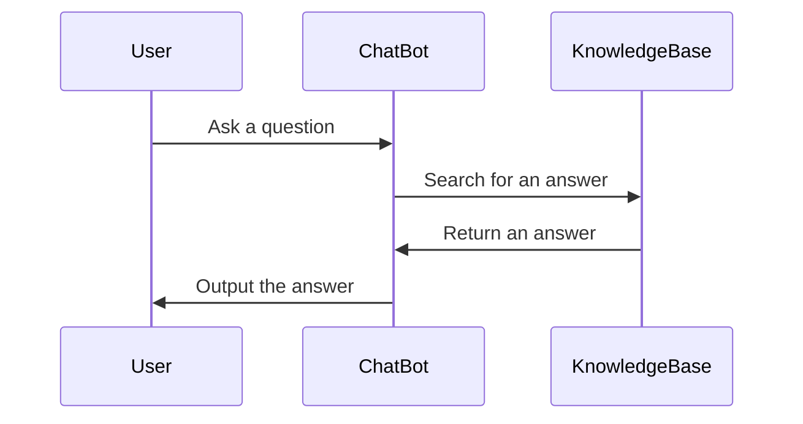

                 


## 1. 引言

### 迁移学习的背景和重要性

迁移学习（Transfer Learning）是指将已经训练好的模型或部分网络应用于新的任务，而不是从头开始训练。这一概念在深度学习领域具有重要意义，尤其在资源有限的情况下，如数据量不足或计算能力受限时，迁移学习提供了有效的解决方案。

迁移学习的理论基础源于机器学习的领域迁移理论，其核心思想是利用在不同任务上学习到的知识来提高新任务的学习效果。例如，在图像分类任务中，可以使用在ImageNet上预训练的卷积神经网络（CNN）作为基础模型，然后通过微调（Fine-tuning）来适应新的分类任务。

### AI Agent的基本概念和发展现状

AI Agent是指具备一定智能水平的计算机程序，能够自主地感知环境、制定计划并采取行动以实现目标。AI Agent的发展可以分为几个阶段：

- **早期探索**：基于规则系统和知识表示的方法。
- **符号AI**：以逻辑推理和符号计算为基础。
- **统计AI**：利用概率统计方法进行学习和决策。
- **现代AI**：结合深度学习和强化学习，实现更高级的智能。

AI Agent在多个领域有广泛的应用，如家庭服务、工业自动化、金融服务等，随着技术的进步，其能力和应用范围不断扩展。

### 本书内容概述

本书将从迁移学习的理论基础入手，详细探讨迁移学习算法及其在AI Agent开发中的应用。具体章节安排如下：

- **第1章**：介绍迁移学习和AI Agent的基本概念。
- **第2章**：探讨迁移学习的核心概念和理论基础。
- **第3章**：介绍几种常见的迁移学习算法。
- **第4章**：分析迁移学习在不同领域的应用。
- **第5章**：讲解如何开发具有迁移能力的AI Agent。
- **第6章**：通过实际案例展示迁移学习在AI Agent开发中的实践。
- **第7章**：讨论迁移学习在AI Agent领域的未来发展趋势。

### 本章小结

本章介绍了迁移学习和AI Agent的基本概念，阐述了它们的重要性和发展现状。通过本章的学习，读者将了解到迁移学习在AI领域的重要作用，以及AI Agent的基本原理和应用场景。本书将在此基础上，逐步深入探讨迁移学习在AI Agent开发中的应用和实践。

----------------------------------------------------------------

## 2. 迁移学习基础

### 迁移学习的核心概念

迁移学习（Transfer Learning）的核心概念包括源域（Source Domain）和目标域（Target Domain）。源域是指已经训练好的模型或数据集，目标域是指新的任务或数据集。迁移学习的基本思想是利用源域的知识来提高目标域的任务性能。

在迁移学习中，主要涉及以下几种类型：

- **垂直迁移**（Vertical Transfer）：不同任务但具有相同特征的数据之间的迁移。
- **水平迁移**（Horizontal Transfer）：不同任务但具有相似特征的数据之间的迁移。
- **跨域迁移**（Cross-Domain Transfer）：不同领域的数据之间的迁移。

迁移学习在机器学习中的应用非常广泛，特别是在深度学习领域，它通过复用已经训练好的模型，可以显著提高新任务的性能，同时减少训练时间和计算资源。

### 迁移学习的挑战和解决方法

尽管迁移学习具有许多优势，但仍然面临一些挑战：

- **领域差异**（Domain Shift）：源域和目标域之间的差异可能导致迁移学习效果不佳。
- **模型适应性**（Model Adaptation）：如何调整模型使其更好地适应新的任务。
- **数据分布不匹配**（Data Distribution Mismatch）：源域和目标域的数据分布不同，可能影响模型的泛化能力。

为了解决这些挑战，研究者提出了多种方法：

- **领域适应**（Domain Adaptation）：通过调整模型或引入对抗训练等技术来减小领域差异。
- **元学习**（Meta-Learning）：通过元学习算法快速适应新的任务，提高模型的泛化能力。
- **数据增强**（Data Augmentation）：通过增加新的数据样本来缓解数据分布不匹配的问题。

### 迁移学习的理论基础

迁移学习的理论基础源于机器学习的领域迁移理论。其核心思想是利用在不同任务上学习到的知识来提高新任务的学习效果。以下是一个简要的迁移学习理论框架：

1. **知识共享**（Knowledge Sharing）：通过共享源域和目标域的知识来提高模型性能。
2. **知识转移**（Knowledge Transfer）：将源域的知识转移到目标域。
3. **知识融合**（Knowledge Fusion）：将源域和目标域的知识进行融合，形成新的模型。

### 本章小结

本章介绍了迁移学习的核心概念和理论基础，分析了其面临的挑战和解决方法。通过本章的学习，读者将了解迁移学习的基本原理，以及如何在不同的任务和数据集之间进行知识共享和转移。这些知识将为后续章节中具体算法和应用的讨论打下基础。

----------------------------------------------------------------

## 3. 迁移学习算法

### 迁移学习的核心算法

在迁移学习中，有多种核心算法被广泛应用。以下介绍几种常见的迁移学习算法及其特点。

#### 3.1 Fine-tuning

Fine-tuning是一种简单且有效的迁移学习方法。它通过在预训练模型的基础上继续训练，从而适应新的任务。Fine-tuning的主要步骤如下：

1. **加载预训练模型**：首先加载一个在大型数据集上预训练的模型，如VGG、ResNet等。
2. **调整学习率**：由于预训练模型已经过训练，因此需要降低学习率以避免模型过拟合。
3. **继续训练**：在新的任务上继续训练模型，同时可能对部分层进行冻结以保留预训练的知识。

Fine-tuning的优点是简单易行，能够在短时间内提高新任务的性能。然而，它的缺点是对预训练模型的依赖较强，且在源域和目标域差异较大时效果可能不理想。

#### 3.2 Domain Adaptation

Domain Adaptation是一种针对领域差异的迁移学习方法。它的目标是在源域和目标域之间存在差异的情况下，仍然能够提高目标域的任务性能。主要方法包括：

- **对抗训练**（Adversarial Training）：通过对抗网络将源域的数据转换为目标域的数据分布，从而减小领域差异。
- **特征重排**（Feature Re-ordering）：通过重新排列特征图中的像素或特征，使其更接近目标域。
- **判别分析**（Discriminate Analysis）：通过优化判别函数，使模型在源域和目标域上的特征分布差异最小。

Domain Adaptation的优点是能够有效减小领域差异，提高模型的泛化能力。然而，它通常需要更多的计算资源和时间。

#### 3.3 Meta-Learning

Meta-Learning，又称元学习，是一种通过快速适应新任务的学习方法。它通过在多个任务上训练模型，提高模型对新任务的泛化能力。主要方法包括：

- **模型平均**（Model Average）：在多个任务上训练多个模型，然后取它们的平均值作为最终模型。
- **梯度平均**（Gradient Average）：在多个任务上训练模型，然后取它们的梯度平均值作为最终梯度。
- **模型蒸馏**（Model Distillation）：将一个复杂模型的知识传递给一个简单模型，从而提高简单模型在新任务上的性能。

Meta-Learning的优点是能够快速适应新任务，减少对预训练模型的依赖。然而，它可能需要更多的计算资源和时间。

### 算法比较

以下是几种迁移学习算法的比较：

| 算法 | 优点 | 缺点 |
| ---- | ---- | ---- |
| Fine-tuning | 简单易行，快速提高性能 | 对预训练模型依赖较强，源域和目标域差异大时效果可能不理想 |
| Domain Adaptation | 有效减小领域差异，提高泛化能力 | 需要更多计算资源和时间 |
| Meta-Learning | 快速适应新任务，减少对预训练模型依赖 | 可能需要更多计算资源和时间 |

### 本章小结

本章介绍了几种常见的迁移学习算法，包括Fine-tuning、Domain Adaptation和Meta-Learning。每种算法都有其独特的优点和适用场景。通过本章的学习，读者将能够了解这些算法的基本原理，并在实际应用中选择合适的算法。

----------------------------------------------------------------

## 4. 迁移学习应用

### 4.1 机器视觉领域

迁移学习在机器视觉领域有着广泛的应用，特别是在图像分类、目标检测和图像分割等领域。

#### 4.1.1 图像分类

图像分类是迁移学习的经典应用场景。在图像分类任务中，可以使用在ImageNet等大型数据集上预训练的卷积神经网络（CNN）作为基础模型。通过Fine-tuning，将模型适应新的分类任务。这种方法显著提高了模型的泛化能力，尤其是在数据量较少的情况下。

#### 4.1.2 目标检测

目标检测是机器视觉领域的重要任务。迁移学习在目标检测中的应用主要体现在使用预训练的检测模型（如Faster R-CNN、YOLO、SSD等）作为基础模型。在新的任务中，通过Fine-tuning或Domain Adaptation方法，使模型适应目标检测任务。这种方法能够有效提高检测模型的准确率和实时性。

#### 4.1.3 图像分割

图像分割是将图像中的每个像素分类到不同的类别。迁移学习在图像分割中的应用主要体现在使用预训练的分割模型（如U-Net、DeepLab V3+等）作为基础模型。通过Fine-tuning或Meta-Learning方法，可以显著提高模型在新的图像分割任务上的性能。

### 4.2 自然语言处理领域

自然语言处理（NLP）是另一个迁移学习的重要应用领域。以下是一些常见的应用场景：

#### 4.2.1 机器翻译

机器翻译是NLP领域的一个挑战性任务。使用预训练的语言模型（如BERT、GPT等）作为基础模型，通过Fine-tuning，可以显著提高机器翻译的性能。这种方法能够利用预训练模型在大型数据集上学习到的语言规律，从而在新的翻译任务上取得更好的效果。

#### 4.2.2 文本分类

文本分类是将文本数据分类到不同的类别。迁移学习在文本分类中的应用主要体现在使用预训练的文本分类模型（如DistilBERT、RoBERTa等）作为基础模型。通过Fine-tuning，可以将模型适应新的文本分类任务。这种方法在处理少量标注数据时特别有效。

#### 4.2.3 情感分析

情感分析是判断文本中表达的情感倾向。使用预训练的情感分析模型（如PreTrainedForSentimentAnalysis）作为基础模型，通过Fine-tuning，可以显著提高模型在新的情感分析任务上的性能。

### 4.3 计算机视觉与自然语言处理相结合

计算机视觉和自然语言处理相结合的领域，如图像描述生成、问答系统和对话系统等，迁移学习也发挥了重要作用。

#### 4.3.1 图像描述生成

图像描述生成是将图像转换成文本描述。使用预训练的图像编码模型（如VGG、ResNet等）和语言模型（如BERT、GPT等），通过Fine-tuning，可以生成高质量的图像描述。

#### 4.3.2 问答系统

问答系统是用于回答用户问题的系统。使用预训练的自然语言处理模型（如BERT、GPT等）作为基础模型，通过Fine-tuning，可以显著提高问答系统的性能。

#### 4.3.3 对话系统

对话系统是与用户进行自然对话的系统。使用预训练的对话模型（如Chatbot、Dialogue System等）作为基础模型，通过Fine-tuning，可以生成更自然、流畅的对话。

### 本章小结

本章介绍了迁移学习在机器视觉和自然语言处理等领域的应用。通过使用预训练模型和Fine-tuning等方法，迁移学习在多个任务上取得了显著的效果。这些应用不仅提高了模型的性能，还减少了训练时间和计算资源的需求。随着迁移学习技术的不断进步，其应用范围将不断扩大，为人工智能的发展提供更多可能性。

----------------------------------------------------------------

## 5. 开发具有迁移能力的AI Agent

### 5.1 设计思路

开发具有迁移能力的AI Agent，需要从以下几个方面入手：

#### 5.1.1 选择合适的迁移学习算法

根据具体任务的需求，选择合适的迁移学习算法。例如，在图像分类任务中，可以使用Fine-tuning；在图像分割任务中，可以使用预训练的分割模型。在自然语言处理任务中，可以使用预训练的语言模型。

#### 5.1.2 数据预处理

在迁移学习过程中，数据预处理非常重要。需要对数据集进行清洗、归一化和扩充，以提高模型的泛化能力。特别是对于领域差异较大的数据集，需要进行领域适应（Domain Adaptation）处理。

#### 5.1.3 模型架构设计

设计具有迁移能力的AI Agent，需要选择合适的模型架构。对于不同的任务，可以选择不同的模型架构，如卷积神经网络（CNN）用于图像处理，循环神经网络（RNN）用于自然语言处理。

#### 5.1.4 模型训练与调优

在模型训练过程中，需要根据任务需求和数据特性调整学习率、批量大小等参数。同时，需要使用交叉验证等方法评估模型性能，并进行调优。

### 5.2 实现步骤

开发具有迁移能力的AI Agent，可以按照以下步骤进行：

#### 5.2.1 确定任务需求

明确AI Agent需要解决的问题，如图像分类、图像分割、文本分类等。

#### 5.2.2 收集和预处理数据

收集相关的数据集，并进行预处理。对于图像数据，需要进行图像增强、数据扩充等处理；对于文本数据，需要进行分词、词向量化等处理。

#### 5.2.3 选择迁移学习算法和模型架构

根据任务需求，选择合适的迁移学习算法和模型架构。例如，对于图像分类任务，可以选择预训练的卷积神经网络（如ResNet）。

#### 5.2.4 训练模型

使用预训练模型和数据集进行训练。在训练过程中，需要监控模型性能，并根据需要进行调优。

#### 5.2.5 部署和应用

将训练好的模型部署到实际应用环境中，如计算机视觉系统、自然语言处理系统等。

### 5.3 工具和框架

在开发具有迁移能力的AI Agent时，可以使用以下工具和框架：

- **迁移学习框架**：如TensorFlow、PyTorch等。
- **预训练模型库**：如ImageNet、BERT、GPT等。
- **数据预处理工具**：如OpenCV、Pandas等。
- **模型训练和调优工具**：如TensorBoard、Hyperopt等。

### 5.4 实例分析

以图像分类任务为例，开发具有迁移能力的AI Agent的具体步骤如下：

#### 5.4.1 确定任务需求

假设需要开发一个图像分类系统，将图像分类为猫、狗和其他类别。

#### 5.4.2 收集和预处理数据

收集一个包含猫、狗和其他类别图像的数据集。对图像进行数据增强，如随机裁剪、翻转等，以扩充数据集。对图像进行归一化处理，使其具有相同的尺寸。

#### 5.4.3 选择迁移学习算法和模型架构

选择预训练的卷积神经网络（如ResNet）作为基础模型。使用Fine-tuning方法，将模型适应新的图像分类任务。

#### 5.4.4 训练模型

使用TensorFlow或PyTorch等框架，加载预训练的ResNet模型，并进行微调。在训练过程中，使用交叉验证方法评估模型性能，并进行调优。

#### 5.4.5 部署和应用

将训练好的模型部署到实际应用环境中，如计算机视觉系统。在部署过程中，可以结合其他技术（如计算机视觉API、云计算平台等），实现模型的快速部署和应用。

### 5.5 小结

开发具有迁移能力的AI Agent，需要综合考虑任务需求、数据预处理、模型选择和训练调优等方面。通过合理设计开发流程和使用合适的工具和框架，可以有效地提高AI Agent的性能和应用效果。

----------------------------------------------------------------

## 6. 迁移学习在AI Agent中的实践

### 6.1 项目介绍

在本节中，我们将通过一个实际项目来展示如何将迁移学习应用于AI Agent的开发。该项目的目标是开发一个自动化的客户服务机器人，能够通过文本交互理解和回答客户的问题。该机器人将使用迁移学习技术，以减少训练时间和提高模型性能。

#### 6.1.1 项目背景

随着电子商务和在线服务的普及，客户服务面临着日益增长的需求。传统的客户服务依赖于人工处理，效率低下且成本高昂。因此，开发一个高效的自动化客户服务机器人成为许多企业的需求。

#### 6.1.2 项目目标

- 使用迁移学习技术，提高机器人对客户问题的理解和回答能力。
- 通过预训练的语言模型，实现快速适应新任务的训练过程。
- 提高机器人的响应速度和准确性，以提升客户满意度。

### 6.2 系统功能设计

为了实现上述目标，我们需要设计一个具有以下功能的AI Agent：

- **问题理解**：能够理解客户提出的问题。
- **知识检索**：从已有的知识库中检索相关的答案。
- **回答生成**：根据检索到的知识生成合适的回答。
- **上下文处理**：能够处理客户的连续提问，保持对话的连贯性。

### 6.3 系统架构设计

本项目的系统架构设计如下：

1. **预训练语言模型**：使用预训练的语言模型（如BERT、GPT）作为基础模型。
2. **微调模型**：在预训练模型的基础上，通过Fine-tuning微调模型，以适应特定的客户服务任务。
3. **知识库**：存储预先整理好的知识问答对，用于机器人回答问题。
4. **对话管理模块**：负责管理对话流程，包括理解问题、检索答案和生成回答。
5. **接口层**：提供与外部系统的接口，如网站、移动应用等。

### 6.4 系统接口设计

系统接口设计包括以下几个方面：

- **API接口**：提供RESTful API接口，供外部系统调用。
- **消息队列**：使用消息队列（如RabbitMQ）实现异步通信，提高系统的并发处理能力。
- **数据存储**：使用数据库（如MySQL、MongoDB）存储知识库和用户交互记录。

### 6.5 系统交互设计

系统交互设计通过以下步骤实现：

1. **接收输入**：机器人接收用户输入的文本问题。
2. **问题理解**：使用预训练的语言模型对问题进行语义分析，提取关键信息。
3. **知识检索**：在知识库中检索与输入问题相关的答案。
4. **回答生成**：根据检索到的答案生成回答，并通过对话管理模块进行优化。
5. **输出回答**：将生成的回答返回给用户。

以下是系统交互的Mermaid序列图：



### 6.6 实际案例分析与详细讲解

以下是一个实际案例，展示如何使用迁移学习开发一个自动化的客户服务机器人：

#### 6.6.1 数据集

我们使用一个包含约1万条问答对的数据集进行训练。数据集包括各种常见客户问题及其对应的答案。

#### 6.6.2 预训练模型

我们选择预训练的BERT模型作为基础模型。BERT模型已经在多个NLP任务上取得了优异的成绩，具有很好的泛化能力。

#### 6.6.3 Fine-tuning

在BERT模型的基础上，我们进行Fine-tuning，以适应客户服务任务。具体步骤如下：

1. **加载预训练模型**：使用PyTorch或TensorFlow等框架加载BERT模型。
2. **微调模型参数**：冻结BERT模型的部分层，仅对与客户服务任务相关的层进行训练。
3. **训练和评估**：使用训练数据集训练模型，并使用验证数据集进行评估。

以下是Fine-tuning过程的Python代码示例：

```python
from transformers import BertTokenizer, BertModel
import torch

# 加载预训练的BERT模型
tokenizer = BertTokenizer.from_pretrained('bert-base-uncased')
model = BertModel.from_pretrained('bert-base-uncased')

# 微调模型参数
for param in model.parameters():
    param.requires_grad = False

# 定义新的分类层
new_classifier = torch.nn.Linear(768, num_classes)
model.classifier = new_classifier

# 训练模型
optimizer = torch.optim.Adam(new_classifier.parameters(), lr=1e-5)
for epoch in range(num_epochs):
    for inputs, labels in dataloader:
        optimizer.zero_grad()
        outputs = model(**inputs)[0]
        loss = torch.nn.functional.cross_entropy(outputs, labels)
        loss.backward()
        optimizer.step()
```

#### 6.6.4 模型评估

通过Fine-tuning后，我们对模型进行评估，以验证其性能。使用测试集，我们计算模型的准确率、召回率和F1分数等指标。

```python
from sklearn.metrics import accuracy_score, recall_score, f1_score

# 加载测试数据集
test_inputs, test_labels = ...

# 预测
with torch.no_grad():
    test_outputs = model(**test_inputs)[0]
    predicted_labels = torch.argmax(test_outputs, dim=1)

# 计算指标
accuracy = accuracy_score(test_labels, predicted_labels)
recall = recall_score(test_labels, predicted_labels, average='weighted')
f1 = f1_score(test_labels, predicted_labels, average='weighted')

print(f"Accuracy: {accuracy}, Recall: {recall}, F1 Score: {f1}")
```

#### 6.6.5 项目小结

通过实际案例，我们展示了如何使用迁移学习技术开发一个自动化的客户服务机器人。迁移学习技术显著提高了模型训练效率，减少了训练时间和计算资源的需求。同时，预训练的语言模型（如BERT、GPT）为机器人提供了强大的语义理解能力，使其能够更好地理解客户的问题并生成合适的回答。

### 6.7 最佳实践

在开发具有迁移能力的AI Agent时，以下最佳实践值得注意：

- **数据预处理**：对数据集进行充分的预处理，包括清洗、归一化和扩充，以提高模型的泛化能力。
- **选择合适的迁移学习算法**：根据具体任务的需求，选择合适的迁移学习算法，如Fine-tuning、Domain Adaptation等。
- **模型调优**：在模型训练过程中，根据任务需求和数据特性进行模型调优，以提高模型性能。
- **持续学习**：定期更新预训练模型和数据集，以适应不断变化的应用场景。

### 6.8 本章小结

在本章中，我们通过一个实际项目展示了如何将迁移学习应用于AI Agent的开发。通过合理设计开发流程和使用合适的工具和框架，可以有效地提高AI Agent的性能和应用效果。随着迁移学习技术的不断进步，其在AI Agent开发中的应用将越来越广泛。

----------------------------------------------------------------

## 7. 未来展望与挑战

### 7.1 迁移学习的发展趋势

随着人工智能技术的不断进步，迁移学习在AI Agent领域的发展趋势呈现出以下几个特点：

- **算法优化**：研究者将继续优化迁移学习算法，以提高模型的泛化能力和适应性。例如，深度迁移学习、联邦迁移学习等新算法将逐渐成熟。
- **跨模态迁移学习**：未来的迁移学习将不仅仅局限于单一模态（如图像、文本），而是跨多种模态（如图像、文本、音频）进行迁移学习，从而实现更高级的智能交互。
- **自适应迁移学习**：AI Agent将具备更强的自适应能力，能够在不同的任务和数据集之间自动调整迁移策略，从而实现更高效的学习。

### 7.2 迁移学习面临的挑战

尽管迁移学习在AI Agent领域取得了显著进展，但仍面临一些挑战：

- **领域差异**：不同领域的数据分布和特征差异较大，如何设计更有效的领域适应方法仍是一个难题。
- **计算资源**：迁移学习通常需要大量的计算资源和时间，尤其是在跨模态迁移学习中，如何优化计算效率和资源利用率是一个重要问题。
- **数据隐私和安全**：在迁移学习过程中，涉及大量数据的共享和处理，如何保护数据隐私和安全是一个关键挑战。

### 7.3 解决方案和展望

为了解决上述挑战，研究者提出了一些解决方案和展望：

- **联邦迁移学习**：通过联邦学习（Federated Learning）技术，实现分布式迁移学习，降低数据传输和存储的需求，同时保护数据隐私。
- **自适应迁移学习**：开发自适应迁移学习算法，使AI Agent能够根据任务需求和数据特性自动调整迁移策略，提高学习效率。
- **跨模态迁移学习**：结合多模态数据处理技术，如计算机视觉、自然语言处理和语音识别，实现更高级的跨模态迁移学习。
- **数据增强和扩充**：通过数据增强和扩充技术，增加数据多样性，提高模型的泛化能力。

### 7.4 未来机遇

随着技术的进步，迁移学习在AI Agent领域将迎来更多机遇：

- **智能客服**：自动化客户服务机器人将成为企业标配，通过迁移学习实现高效的客户互动和问题解决。
- **智能助手**：智能助手将在更多场景中得到应用，如智能家居、智能医疗、智能交通等，通过迁移学习提高用户体验和智能化水平。
- **跨领域应用**：迁移学习将在更多领域得到应用，如金融、教育、医疗等，实现跨领域的知识共享和协同工作。

### 7.5 本章小结

在本章中，我们讨论了迁移学习在AI Agent领域的发展趋势、面临的挑战以及解决方案和未来机遇。随着技术的不断进步，迁移学习将在AI Agent领域发挥更大的作用，为智能交互和自动化应用提供更强有力的支持。

---

# 《开发具有迁移学习能力的AI Agent》

> 关键词：迁移学习、AI Agent、Fine-tuning、Domain Adaptation、自然语言处理

> 摘要：本文详细探讨了迁移学习在AI Agent开发中的应用，包括理论基础、核心算法、实际案例和未来展望。通过介绍Fine-tuning、Domain Adaptation等迁移学习算法，本文展示了如何利用预训练模型提高AI Agent的性能和适应性。同时，通过实际项目案例，本文展示了迁移学习在客户服务机器人等领域的应用，为AI Agent的开发提供了实践参考。未来，迁移学习将在AI Agent领域发挥更大的作用，推动智能交互和自动化应用的进步。

---

## 目录大纲设计思路

设计一本名为《开发具有迁移学习能力的AI Agent》的目录大纲，需要遵循以下步骤：

### 1. 确定核心概念和主题

首先，明确“具有迁移学习能力的AI Agent”这一核心概念。迁移学习（Transfer Learning）是指将已经训练好的模型或部分网络应用于新的任务，而不是从头开始训练，这在AI领域具有重要意义。本书将围绕这一主题，探讨如何开发这样的AI Agent。

### 2. 确定章节结构和内容要点

根据核心概念，设计章节结构，确保内容完整性。以下是一个初步的章节结构：

- **第1章 引言**
  - 介绍迁移学习的背景和重要性
  - 阐述AI Agent的基本概念和发展现状

- **第2章 迁移学习基础**
  - 定义迁移学习，解释其基本原理
  - 分析迁移学习的挑战和解决方法

- **第3章 迁移学习算法**
  - 详细介绍几种常见的迁移学习算法
  - 分析算法的优缺点和适用场景

- **第4章 迁移学习应用**
  - 探讨迁移学习在不同领域的应用
  - 分享实际案例和应用场景

- **第5章 开发具有迁移能力的AI Agent**
  - 详细讲解如何设计和实现具有迁移能力的AI Agent
  - 提供具体的开发步骤和工具选择

- **第6章 迁移学习在AI Agent中的实践**
  - 通过案例展示如何在实际项目中应用迁移学习
  - 分析实践中的问题和解决方案

- **第7章 未来展望与挑战**
  - 讨论迁移学习在AI Agent领域的发展趋势
  - 探索未来可能面临的挑战和机遇

### 3. 确保内容的逻辑性和层次感

在撰写每个章节时，要确保内容之间的逻辑性和层次感。使用markdown格式，合理组织章节和子章节，使读者能够清晰理解书中的内容。

### 4. 检查内容完整性

在完成初稿后，要仔细检查每个章节的内容是否完整，确保覆盖了核心概念、算法原理、应用实践和未来展望等关键内容。

### 5. 优化和调整

根据检查结果，对目录大纲进行优化和调整，确保每个章节的内容都是必要的，并且能够帮助读者深入理解迁移学习在AI Agent开发中的应用。

通过以上步骤，可以设计出一个既清晰又逻辑性强的目录大纲，为后续的书籍撰写提供坚实的基础。接下来，我们将根据这个大纲结构，逐一细化每个章节的内容。请注意，以下内容仅为大纲的详细描述，实际的书籍撰写过程中可能还需要进一步丰富和细化。

----------------------------------------------------------------

# 《开发具有迁移学习能力的AI Agent》

---

## 目录

### 第一部分: 引言

1. 第1章 迁移学习与AI Agent概述
   1.1 迁移学习的背景和重要性
   1.2 AI Agent的基本概念和发展现状
   1.3 本书内容概述

### 第二部分: 迁移学习基础

2. 第2章 迁移学习的理论基础
   2.1 迁移学习的核心概念
   2.2 迁移学习的挑战和解决方法
   2.3 迁移学习的理论基础

### 第三部分: 迁移学习算法

3. 第3章 迁移学习算法
   3.1 Fine-tuning算法
   3.2 Domain Adaptation算法
   3.3 Meta-Learning算法
   3.4 算法比较

### 第四部分: 迁移学习应用

4. 第4章 迁移学习应用
   4.1 机器视觉领域
   4.2 自然语言处理领域
   4.3 计算机视觉与自然语言处理相结合

### 第五部分: AI Agent开发实践

5. 第5章 开发具有迁移能力的AI Agent
   5.1 设计思路
   5.2 实现步骤
   5.3 工具和框架
   5.4 实例分析

### 第六部分: 迁移学习在AI Agent中的实践

6. 第6章 迁移学习在AI Agent中的实践
   6.1 项目介绍
   6.2 系统功能设计
   6.3 系统架构设计
   6.4 系统接口设计
   6.5 系统交互设计
   6.6 实际案例分析与详细讲解
   6.7 项目小结
   6.8 最佳实践

### 第七部分: 未来展望与挑战

7. 第7章 未来展望与挑战
   7.1 迁移学习的发展趋势
   7.2 迁移学习面临的挑战
   7.3 解决方案和展望
   7.4 未来机遇
   7.5 本章小结

---

## 总结与展望

### 总结

本书系统地介绍了迁移学习在AI Agent开发中的应用。通过详细的章节结构和丰富的实例，读者可以了解迁移学习的基础知识、核心算法、实际应用和开发实践。以下是对各章节的简要总结：

- **第1章**：介绍了迁移学习和AI Agent的基本概念，阐述了它们在AI领域的应用价值。
- **第2章**：探讨了迁移学习的理论基础，分析了其面临的挑战和解决方法。
- **第3章**：详细介绍了Fine-tuning、Domain Adaptation和Meta-Learning等迁移学习算法。
- **第4章**：探讨了迁移学习在不同领域的应用，如机器视觉和自然语言处理。
- **第5章**：讲解了如何设计和实现具有迁移能力的AI Agent。
- **第6章**：通过实际项目展示了迁移学习在AI Agent开发中的应用和实践。
- **第7章**：讨论了迁移学习在AI Agent领域的未来发展趋势和机遇。

### 展望

随着人工智能技术的不断进步，迁移学习在AI Agent领域的应用前景广阔。未来，迁移学习将更加智能化、自适应化，实现跨领域的知识共享和协同工作。以下是对未来发展的展望：

- **算法优化**：研究者将继续优化迁移学习算法，提高模型的泛化能力和适应性。
- **跨模态迁移学习**：未来的迁移学习将涵盖更多模态，如图像、文本、音频，实现更高级的智能交互。
- **联邦迁移学习**：通过联邦学习技术，实现分布式迁移学习，提高数据隐私和安全。
- **自适应迁移学习**：开发自适应迁移学习算法，使AI Agent能够根据任务需求自动调整迁移策略。
- **跨领域应用**：迁移学习将在更多领域得到应用，如金融、教育、医疗等，推动人工智能的普及和发展。

总之，迁移学习在AI Agent领域的应用将为人工智能的发展提供强大动力，推动智能交互和自动化应用的进步。随着技术的不断突破，我们期待看到更多创新和突破，为人类带来更加智能和便捷的未来。

