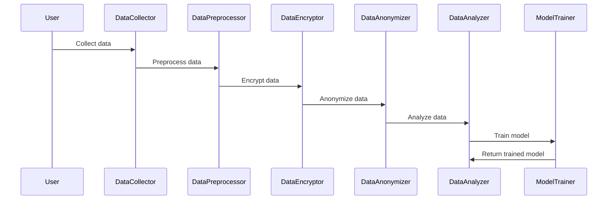
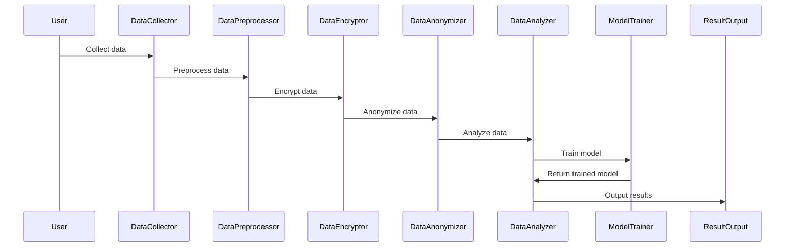
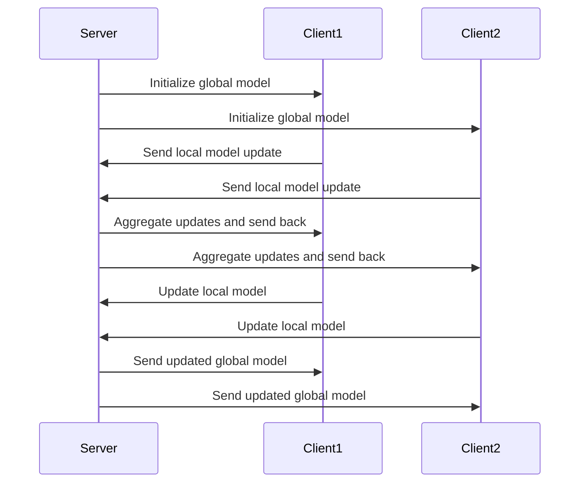

                 

### # 开发具有隐私保护数据分析能力的AI Agent

关键词：隐私保护、数据分析、AI Agent、加密技术、匿名化技术、联邦学习

摘要：随着人工智能和数据科学的快速发展，隐私保护成为了数据分析中亟待解决的问题。本文将介绍如何开发具有隐私保护数据分析能力的AI Agent。通过结合加密技术、匿名化技术、联邦学习等技术手段，我们能够在保护用户隐私的前提下，依然能够提取有价值的信息。本文将从背景介绍、核心概念、原理讲解、系统设计与实战应用等多个方面，详细探讨如何实现隐私保护数据分析。

## 第一部分：背景介绍与核心概念

### 第1章：隐私保护数据分析的挑战与需求

#### 1.1.1 问题背景

随着人工智能和数据科学的快速发展，越来越多的企业开始利用数据分析技术来提升业务效率和决策质量。数据分析在金融、医疗、零售、交通等多个领域都取得了显著的应用成果。然而，这一过程中也带来了隐私保护的问题。如何在充分利用数据价值的同时，保护用户隐私成为了企业和研究者关注的焦点。

#### 1.1.2 问题描述

传统的数据分析方法往往需要在数据收集、存储、处理等环节暴露用户隐私。例如，企业在收集用户数据时，可能会收集用户的姓名、身份证号、手机号、邮箱等敏感信息。在数据存储过程中，如果没有进行加密处理，这些敏感信息可能会被不法分子窃取。在数据处理过程中，数据分析算法可能会分析出用户的某些行为特征，从而进一步侵犯用户隐私。因此，如何保护用户隐私成为了数据分析过程中亟待解决的问题。

#### 1.1.3 问题解决

隐私保护数据分析的目标是在不暴露用户隐私的前提下，依然能够提取有价值的信息。为了实现这一目标，我们可以采用以下几种技术手段：

1. **加密技术**：通过加密算法对数据进行加密，确保数据在传输和存储过程中的安全性。
2. **匿名化技术**：通过去除或替换敏感信息，将数据转换为匿名数据，以保护个人隐私。
3. **联邦学习**：通过分布式学习算法，在数据不流动的情况下，实现模型训练和优化。

#### 1.1.4 边界与外延

隐私保护数据分析不仅仅涉及技术层面，还包括法律、伦理等方面。例如，如何界定数据的隐私边界，如何平衡隐私保护与数据利用之间的关系等。此外，隐私保护数据分析还需要考虑到不同的数据类型、不同的应用场景，从而设计出更加具体和有效的解决方案。

#### 1.1.5 核心概念

- **加密技术**：通过加密算法对数据进行加密，确保数据在传输和存储过程中的安全性。常见的加密算法包括对称加密算法（如AES、DES）和非对称加密算法（如RSA、ECC）。
- **匿名化技术**：通过去除或替换敏感信息，将数据转换为匿名数据，以保护个人隐私。常见的匿名化技术包括数据扰动、数据混淆、k-匿名等。
- **联邦学习**：通过分布式学习算法，在数据不流动的情况下，实现模型训练和优化。联邦学习能够保护数据隐私，同时提高模型的性能和可靠性。

### 第2章：隐私保护数据分析的核心概念与联系

#### 2.1.1 核心概念

- **隐私保护**：确保个人隐私不被泄露或滥用的措施。隐私保护涵盖了数据收集、存储、处理、传输等各个环节，需要综合运用加密技术、匿名化技术、访问控制等多种手段。
- **数据匿名化**：将数据中的个人身份信息去除或替换，以实现数据匿名化。数据匿名化的目标是保护个人隐私，同时确保数据分析的准确性和有效性。
- **联邦学习**：通过分布式学习算法，在数据不流动的情况下，实现模型训练和优化。联邦学习能够保护数据隐私，同时提高模型的性能和可靠性。

#### 2.1.2 概念属性特征对比表格

| 特征          | 隐私保护         | 数据匿名化         | 联邦学习         |
| ------------ | ---------------- | ------------------ | ---------------- |
| 目的          | 保护个人隐私     | 保护个人隐私       | 保护个人隐私     |
| 技术手段      | 加密、访问控制等 | 数据扰动、加密等   | 加密、分布式计算等 |
| 适用场景      | 数据收集、存储、处理 | 数据预处理         | 模型训练、优化   |

#### 2.1.3 ER实体关系图架构

```mermaid
erDiagram
  AI Agent ||--|{ Data Source } Data Source
  AI Agent ||--|{ Privacy Protection Mechanism } Privacy Protection Mechanism
  AI Agent ||--|{ Data Analysis Model } Data Analysis Model
  Data Source ||--|{ Data } Data
  Privacy Protection Mechanism ||--|{ Encryption } Encryption
  Privacy Protection Mechanism ||--|{ Anonymization } Anonymization
  Data Analysis Model ||--|{ Machine Learning Algorithm } Machine Learning Algorithm
```

## 第二部分：隐私保护数据分析原理

### 第3章：加密技术原理

#### 3.1.1 加密算法概述

加密技术是保护数据隐私的重要手段，其核心思想是通过加密算法将数据转换为密文，确保数据在传输和存储过程中的安全性。加密算法可以分为对称加密算法和非对称加密算法。

#### 3.1.2 对称加密算法

对称加密算法使用相同的密钥对数据进行加密和解密。这种加密方式的优点是加密速度快，缺点是密钥管理复杂。常见的对称加密算法包括AES、DES等。

#### 3.1.3 非对称加密算法

非对称加密算法使用一对密钥，一个用于加密，另一个用于解密。这种加密方式的优点是密钥管理简单，缺点是加密速度慢。常见的非对称加密算法包括RSA、ECC等。

#### 3.1.4 加密算法的优缺点

对称加密和非对称加密各有优缺点，选择合适的加密算法需要根据具体场景进行权衡。对称加密算法适用于加密大量数据，非对称加密算法适用于加密少量数据。

### 第4章：数据匿名化技术

#### 4.1.1 匿名化技术概述

数据匿名化是将数据中的个人身份信息去除或替换，以实现数据匿名化。匿名化技术的目的是保护个人隐私，同时确保数据分析的准确性和有效性。

#### 4.1.2 匿名化技术的分类

常见的匿名化技术包括数据扰动、数据混淆、k-匿名等。这些技术的目的是通过替换、删除或扰动数据中的敏感信息，使数据无法直接识别个人身份。

#### 4.1.3 匿名化技术的优缺点

匿名化技术能够有效保护个人隐私，但同时也可能影响数据分析的准确性和有效性。选择合适的匿名化技术需要根据具体场景进行权衡。

## 第三部分：系统设计与实现

### 第5章：系统架构设计

#### 5.1.1 系统架构概述

隐私保护数据分析系统包括数据收集模块、数据预处理模块、数据加密模块、数据匿名化模块、数据分析和模型训练模块等。这些模块共同工作，确保数据在传输和存储过程中的安全性，同时实现有效的数据分析。

#### 5.1.2 系统架构图



### 第6章：系统接口设计

#### 6.1.1 接口设计原则

系统接口设计应遵循模块化、简洁、易用、安全等原则。接口应提供丰富的功能，同时保持良好的可扩展性，方便后续功能的增加和修改。

#### 6.1.2 接口设计图

```mermaid
classDiagram
  DataCollector <<interface>>
  DataPreprocessor <<interface>>
  DataEncryptor <<interface>>
  DataAnonymizer <<interface>>
  DataAnalyzer <<interface>>
  ModelTrainer <<interface>>

  User ..|> DataCollector
  DataCollector ..|> DataPreprocessor
  DataPreprocessor ..|> DataEncryptor
  DataEncryptor ..|> DataAnonymizer
  DataAnonymizer ..|> DataAnalyzer
  DataAnalyzer ..|> ModelTrainer
```

### 第7章：系统实现与部署

#### 7.1.1 系统实现

系统实现包括各个模块的具体实现，如数据收集、数据预处理、数据加密、数据匿名化、数据分析和模型训练等。以下是一个简单的数据加密模块的实现示例：

```python
from Crypto.PublicKey import RSA
from Crypto.Cipher import PKCS1_OAEP

def encrypt_data(data, public_key):
    rsa_key = RSA.import_key(public_key)
    cipher = PKCS1_OAEP.new(rsa_key)
    encrypted_data = cipher.encrypt(data)
    return encrypted_data

def decrypt_data(encrypted_data, private_key):
    rsa_key = RSA.import_key(private_key)
    cipher = PKCS1_OAEP.new(rsa_key)
    decrypted_data = cipher.decrypt(encrypted_data)
    return decrypted_data
```

#### 7.1.2 系统部署

系统部署包括硬件选择、软件安装、配置优化等步骤。以下是一个简单的部署示例：

1. 选择合适的硬件，如服务器、存储设备等。
2. 安装操作系统和数据库软件。
3. 部署各个模块的软件，如数据收集模块、数据预处理模块、数据加密模块、数据匿名化模块、数据分析和模型训练模块等。
4. 进行系统配置和优化，如网络配置、安全配置等。

### 第8章：项目实战

#### 8.1.1 环境安装

在虚拟环境中安装必要的软件，如Python、数据库等。以下是一个简单的安装示例：

```bash
pip install numpy
pip install pandas
pip install cryptography
pip install scikit-learn
```

#### 8.1.2 系统核心实现

以下是一个简单的数据匿名化模块的实现示例：

```python
import pandas as pd
from sklearn.preprocessing import LabelEncoder

def anonymize_data(df, sensitive_columns):
    for column in sensitive_columns:
        label_encoder = LabelEncoder()
        df[column] = label_encoder.fit_transform(df[column])
    return df
```

#### 8.1.3 代码应用解读与分析

通过实际案例，分析系统在数据收集、数据预处理、数据加密、数据匿名化、数据分析和模型训练等环节的具体实现和效果。

#### 8.1.4 项目小结

总结项目经验，包括系统设计、系统实现、系统部署和项目实战等方面。提出改进方案，为后续项目的开发提供参考。

## 第四部分：最佳实践与拓展阅读

### 第9章：最佳实践

#### 9.1.1 加密技术最佳实践

- 使用强加密算法，如AES、RSA等。
- 确保密钥安全，使用安全的密钥管理策略。
- 定期更换密钥，以降低密钥泄露的风险。

#### 9.1.2 匿名化技术最佳实践

- 根据数据类型和隐私要求，选择合适的匿名化技术。
- 避免过度匿名化，确保数据分析的准确性和有效性。
- 对匿名化数据进行分析时，遵循隐私保护原则。

#### 9.1.3 联邦学习最佳实践

- 选择合适的联邦学习算法，如联邦均值算法、联邦平均算法等。
- 确保数据安全，使用加密技术保护数据传输和存储过程中的安全性。
- 合理配置计算资源，优化联邦学习算法的效率。

### 第10章：拓展阅读

#### 10.1.1 相关论文

- “Deep Learning with Differential Privacy: A Survey” by Sumit Gulwani, Aditya Khurana, and Yinglian Xie.
- “Federated Learning: Concept and Applications” by Michael I. Jordan.

#### 10.1.2 相关书籍

- “Practical Machine Learning: Machine Learning Engineering and Data Science” by Andrew Ng.
- “Data Science from Scratch: First Principles with Python” by Joel Grus.

## 总结

开发具有隐私保护数据分析能力的AI Agent是一项复杂的任务，需要结合加密技术、匿名化技术、联邦学习等技术手段，同时考虑法律、伦理等方面的问题。通过本文的介绍，读者可以了解隐私保护数据分析的基本概念、核心原理、系统设计、实现与部署等方面的内容。希望本文对读者在隐私保护数据分析领域的研究和开发工作有所帮助。

### 作者信息

作者：AI天才研究院/AI Genius Institute & 禅与计算机程序设计艺术 /Zen And The Art of Computer Programming

---

（注：本文为Markdown格式，如需转换为其他格式，请根据相应格式的要求进行调整。）### # 第一部分：背景介绍与核心概念

## 第1章：隐私保护数据分析的挑战与需求

### 1.1.1 问题背景

随着大数据和人工智能的蓬勃发展，数据分析在企业运营、科学研究和公共管理等领域发挥着越来越重要的作用。然而，这一过程中也引发了一系列隐私保护问题。在传统的数据分析过程中，数据往往需要被集中存储和处理，这就导致了个人隐私信息的安全风险。例如，医疗数据、金融数据、个人通信记录等敏感信息一旦泄露，可能对个人隐私造成严重侵害。此外，随着数据量的不断增长和数据分析技术的日趋复杂，隐私保护问题也变得更加严峻。

隐私保护不仅是一个技术问题，更是一个法律和社会伦理问题。在全球范围内，许多国家和地区已经出台了相关的隐私保护法律和政策，如欧盟的《通用数据保护条例》（GDPR）和美国的《加州消费者隐私法案》（CCPA）。这些法律和政策旨在保护个人数据隐私，对数据收集、存储、处理和传输等环节进行了严格的规范。企业若未能遵守这些法律，可能会面临巨额罚款和法律诉讼。

### 1.1.2 问题描述

隐私保护数据分析的挑战主要表现在以下几个方面：

1. **数据泄露风险**：在数据集中存储和处理的过程中，数据泄露的风险非常高。黑客攻击、内部泄露、系统漏洞等都可能导致敏感数据的泄露。

2. **隐私侵犯问题**：数据分析过程中，算法可能会分析出用户的某些行为模式，甚至个人隐私信息，从而侵犯用户的隐私权。

3. **法律法规遵守**：随着隐私保护法律的不断完善，企业需要在数据分析和处理过程中遵守相关法律法规，这增加了合规成本和技术难度。

4. **数据利用与隐私保护平衡**：在保证隐私保护的前提下，如何有效利用数据价值，提升业务效率和决策质量，是一个亟待解决的问题。

### 1.1.3 问题解决

为了解决上述问题，我们需要在数据分析过程中引入隐私保护技术，确保数据在收集、存储、处理和传输等环节的安全性。以下是一些关键技术手段：

1. **加密技术**：通过加密算法对敏感数据进行加密，确保数据在传输和存储过程中的安全性。加密技术可以分为对称加密和非对称加密两种类型。

2. **匿名化技术**：通过去除或替换敏感信息，将数据转换为匿名数据，以保护个人隐私。匿名化技术可以降低数据分析过程中的隐私泄露风险。

3. **联邦学习**：通过分布式学习算法，在数据不流动的情况下，实现模型训练和优化。联邦学习能够有效保护数据隐私，同时提升模型的性能和可靠性。

4. **差分隐私**：在数据处理和分析过程中，通过添加噪声的方式，使数据集中的每个个体都难以被单独识别，从而保护个人隐私。

5. **访问控制**：通过严格的访问控制机制，限制对敏感数据的访问权限，确保数据在处理过程中的安全性。

### 1.1.4 边界与外延

隐私保护数据分析不仅仅是一个技术问题，还涉及到法律、伦理和社会等多个层面。以下是一些需要考虑的边界与外延：

1. **隐私边界**：如何界定哪些数据属于个人隐私，哪些数据不属于个人隐私，是一个值得探讨的问题。

2. **隐私与数据利用的平衡**：在保护隐私的同时，如何确保数据的有效利用，是一个需要权衡的问题。

3. **隐私合规性**：企业需要在数据分析和处理过程中遵守相关的法律法规，确保合规性。

4. **隐私泄露风险评估**：在数据分析过程中，需要对隐私泄露风险进行评估，并采取相应的措施进行控制。

5. **隐私保护技术的演进**：随着技术的不断发展，隐私保护技术也需要不断演进，以应对新的挑战。

### 1.1.5 核心概念

在隐私保护数据分析中，以下几个核心概念至关重要：

1. **加密技术**：加密技术通过将数据转换为密文，确保数据在传输和存储过程中的安全性。常见的加密技术包括对称加密和非对称加密。

2. **匿名化技术**：匿名化技术通过去除或替换敏感信息，将数据转换为匿名数据，以保护个人隐私。常见的匿名化技术包括数据扰动、数据混淆、k-匿名等。

3. **联邦学习**：联邦学习通过分布式学习算法，在数据不流动的情况下，实现模型训练和优化。联邦学习能够有效保护数据隐私，同时提升模型的性能和可靠性。

4. **差分隐私**：差分隐私通过添加噪声的方式，使数据集中的每个个体都难以被单独识别，从而保护个人隐私。

5. **访问控制**：访问控制通过限制对敏感数据的访问权限，确保数据在处理过程中的安全性。

## 第2章：隐私保护数据分析的核心概念与联系

### 2.1.1 核心概念

在隐私保护数据分析中，以下几个核心概念至关重要：

1. **隐私保护**：隐私保护是指采取各种措施，确保个人隐私不被泄露或滥用。隐私保护涵盖了数据收集、存储、处理、传输等各个环节。

2. **数据匿名化**：数据匿名化是将数据中的个人身份信息去除或替换，以实现数据匿名化。数据匿名化的目的是保护个人隐私，同时确保数据分析的准确性和有效性。

3. **联邦学习**：联邦学习是通过分布式学习算法，在数据不流动的情况下，实现模型训练和优化。联邦学习能够有效保护数据隐私，同时提升模型的性能和可靠性。

4. **差分隐私**：差分隐私是通过添加噪声的方式，使数据集中的每个个体都难以被单独识别，从而保护个人隐私。

5. **访问控制**：访问控制是通过限制对敏感数据的访问权限，确保数据在处理过程中的安全性。

### 2.1.2 概念属性特征对比表格

| 特征         | 隐私保护         | 数据匿名化         | 联邦学习         | 差分隐私         | 访问控制         |
| ------------ | ---------------- | ------------------ | ---------------- | ---------------- | ---------------- |
| 目的         | 保护个人隐私     | 保护个人隐私       | 保护个人隐私     | 保护个人隐私     | 保护数据安全     |
| 技术手段     | 加密、访问控制等 | 数据扰动、加密等   | 分布式计算、加密等 | 添加噪声、加密等 | 访问控制列表、加密等 |
| 适用场景     | 数据收集、存储、处理 | 数据预处理、分析   | 模型训练、优化   | 数据分析、机器学习 | 数据访问、处理   |
| 优点         | 安全性高         | 保护隐私、灵活     | 保护隐私、性能好 | 保护隐私、精度高 | 安全、灵活       |
| 缺点         | 成本高、复杂     | 可能影响分析精度   | 计算复杂、延迟   | 可能影响分析精度 | 可能限制数据分析 |

### 2.1.3 ER实体关系图架构

```mermaid
erDiagram
  DataOwner ||--|{ Data } Data
  DataOwner ||--|{ PrivacyPolicy } PrivacyPolicy
  DataOwner ||--|{ DataProcessing } DataProcessing
  DataProcessing ||--|{ DataAnonymization } DataAnonymization
  DataProcessing ||--|{ DataEncryption } DataEncryption
  DataProcessing ||--|{ DifferentialPrivacy } DifferentialPrivacy
  DataProcessing ||--|{ AccessControl } AccessControl
  DataAnonymization ||--|{ AnonymizationAlgorithm } AnonymizationAlgorithm
  DataEncryption ||--|{ EncryptionAlgorithm } EncryptionAlgorithm
  DifferentialPrivacy ||--|{ PrivacyMechanism } PrivacyMechanism
  AccessControl ||--|{ AccessPolicy } AccessPolicy
```

在上述ER图架构中，DataOwner代表数据的拥有者，DataProcessing代表数据处理过程，包含DataAnonymization、DataEncryption、DifferentialPrivacy和AccessControl等子过程。每个子过程都有相应的算法和政策，如AnonymizationAlgorithm、EncryptionAlgorithm和PrivacyMechanism等。

## 第二部分：隐私保护数据分析原理

### 第3章：加密技术原理

加密技术是隐私保护数据分析的基础，通过加密算法对数据进行加密，确保数据在传输和存储过程中的安全性。加密技术可以分为对称加密和非对称加密两种类型。

#### 3.1.1 对称加密算法

对称加密算法使用相同的密钥对数据进行加密和解密。常见的对称加密算法包括AES、DES、RSA等。

- **AES（高级加密标准）**：AES是一种广泛使用的对称加密算法，支持128、192和256位的密钥长度。其加密速度快，安全性高。
- **DES（数据加密标准）**：DES是一种较早的对称加密算法，使用56位的密钥。由于密钥较短，安全性相对较低。
- **RSA（Rivest-Shamir-Adleman）**：RSA是一种非对称加密算法，主要用于加密和数字签名。RSA的密钥长度较长，安全性高，但加密和解密速度较慢。

对称加密算法的优点是加密速度快，缺点是密钥管理复杂。在隐私保护数据分析中，对称加密算法常用于对大量数据进行加密。

#### 3.1.2 非对称加密算法

非对称加密算法使用一对密钥，一个用于加密，一个用于解密。常见的非对称加密算法包括RSA、ECC等。

- **RSA（Rivest-Shamir-Adleman）**：RSA是一种非对称加密算法，主要用于加密和数字签名。RSA的密钥长度较长，安全性高，但加密和解密速度较慢。
- **ECC（椭圆曲线加密）**：ECC是一种基于椭圆曲线数学的非对称加密算法，其安全性高，加密和解密速度较快。ECC的密钥长度较短，相比于RSA，能提供更高的安全性和性能。

非对称加密算法的优点是密钥管理简单，缺点是加密和解密速度较慢。在隐私保护数据分析中，非对称加密算法常用于对少量数据进行加密，如密钥交换和数字签名。

#### 3.1.3 加密算法的优缺点

对称加密和非对称加密各有优缺点，选择合适的加密算法需要根据具体场景进行权衡。

- **对称加密算法**：优点是加密速度快，缺点是密钥管理复杂。
  - 适用场景：适用于加密大量数据，如存储加密、传输加密等。
- **非对称加密算法**：优点是密钥管理简单，缺点是加密和解密速度较慢。
  - 适用场景：适用于加密少量数据，如密钥交换、数字签名等。

#### 3.1.4 加密算法的流程

加密算法的基本流程包括以下步骤：

1. **密钥生成**：根据加密算法的要求生成一对密钥，包括公钥和私钥。
2. **数据加密**：使用公钥对数据进行加密，得到密文。
3. **数据解密**：使用私钥对密文进行解密，恢复原始数据。

以下是一个简单的加密和解密示例，使用Python的`cryptography`库：

```python
from cryptography.hazmat.primitives import serialization
from cryptography.hazmat.primitives.asymmetric import rsa
from cryptography.hazmat.primitives import hashes
from cryptography.hazmat.primitives.asymmetric import padding

# 生成密钥
private_key = rsa.generate_private_key(
    public_exponent=65537,
    key_size=2048,
)

public_key = private_key.public_key()

# 加密数据
plaintext = b"Hello, World!"
ciphertext = public_key.encrypt(
    plaintext,
    padding.OAEP(
        mgf=padding.MGF1(algorithm=hashes.SHA256()),
        algorithm=hashes.SHA256(),
        label=None
    )
)

# 解密数据
decrypted_plaintext = private_key.decrypt(
    ciphertext,
    padding.OAEP(
        mgf=padding.MGF1(algorithm=hashes.SHA256()),
        algorithm=hashes.SHA256(),
        label=None
    )
)

print("Decrypted message:", decrypted_plaintext)
```

### 第4章：数据匿名化技术

数据匿名化是将数据中的个人身份信息去除或替换，以实现数据匿名化。数据匿名化技术是隐私保护数据分析的重要组成部分，可以降低数据分析过程中的隐私泄露风险。

#### 4.1.1 匿名化技术的分类

根据匿名化技术的具体实现方式，可以分为以下几类：

1. **数据扰动**：通过在原始数据上添加噪声或随机值，使原始数据与匿名化数据之间的差异最小化。常见的扰动技术包括随机化、打乱、插值等。
   
2. **数据混淆**：通过在原始数据中添加一些无意义的干扰信息，使原始数据难以被识别。常见的混淆技术包括插值、插值混淆、拉普拉斯混淆等。

3. **k-匿名**：通过将原始数据划分为k个相似的群组，使得每个群组中的个体无法被单独识别。常见的k-匿名算法包括l-diversity、t-closeness等。

4. **l-diversity**：确保每个敏感属性值在匿名化数据中的出现次数至少为l，以防止属性单值泄露。

5. **t-closeness**：确保每个敏感属性值的分布与原始数据的分布之间在一定范围内接近，以防止属性分布泄露。

6. **差分隐私**：通过在原始数据中添加噪声，使得每个个体在匿名化数据中的差异难以被识别。差分隐私是一种广泛应用的隐私保护技术，其核心思想是确保对任意单个个体的查询响应无法与对其他个体的响应区分开来。

#### 4.1.2 匿名化技术的优点与缺点

匿名化技术的优点包括：

1. **保护个人隐私**：通过去除或替换敏感信息，降低个人隐私泄露的风险。

2. **提高数据利用率**：在保护隐私的前提下，匿名化数据可以用于研究、分析和共享，从而提高数据的价值。

匿名化技术的缺点包括：

1. **可能影响数据分析的准确性**：匿名化过程可能会引入噪声或干扰信息，从而影响数据分析结果的准确性。

2. **可能增加计算复杂度**：某些匿名化技术，如k-匿名和差分隐私，需要复杂的计算过程，可能增加数据处理和分析的难度和成本。

#### 4.1.3 匿名化技术的应用场景

匿名化技术可以应用于以下场景：

1. **医疗数据研究**：通过匿名化技术保护患者的隐私，同时确保研究数据的可用性。

2. **金融数据分析**：匿名化交易数据，用于风险控制和市场分析。

3. **社会调查数据**：保护调查参与者的隐私，同时保证调查数据的真实性。

4. **政府数据公开**：通过匿名化技术公开部分敏感数据，用于公共服务和决策支持。

### 第5章：联邦学习原理

联邦学习是一种分布式学习技术，通过在多个不同的设备或数据中心上训练模型，并在不共享原始数据的情况下实现模型优化。联邦学习可以有效地保护数据隐私，同时提高模型性能和可靠性。

#### 5.1.1 联邦学习的基本概念

1. **参与者**：联邦学习中的参与者可以是多个设备（如手机、智能家居设备）或数据中心。

2. **模型参数**：联邦学习过程中使用的模型参数，如权重和偏置。

3. **本地训练**：在每个参与者本地，使用本地数据训练模型，得到本地模型参数。

4. **模型聚合**：将所有参与者的本地模型参数进行聚合，得到全局模型参数。

5. **模型更新**：使用聚合后的全局模型参数更新本地模型。

6. **通信**：在模型聚合和模型更新过程中，参与者之间需要进行通信。

#### 5.1.2 联邦学习的工作流程

1. **初始化全局模型**：在联邦学习开始时，初始化全局模型参数。

2. **本地训练**：每个参与者使用本地数据和全局模型参数进行本地训练，得到本地模型参数。

3. **模型聚合**：将所有参与者的本地模型参数进行聚合，得到全局模型参数。

4. **模型更新**：使用聚合后的全局模型参数更新本地模型。

5. **迭代**：重复本地训练、模型聚合和模型更新的过程，直到满足停止条件（如模型收敛或达到最大迭代次数）。

#### 5.1.3 联邦学习的优点与缺点

联邦学习的优点包括：

1. **保护数据隐私**：联邦学习不需要共享原始数据，从而有效保护数据隐私。

2. **提高模型性能**：通过分布式训练，联邦学习可以充分利用各个参与者的数据，提高模型性能。

3. **降低通信成本**：联邦学习在参与者和中心服务器之间进行模型参数的通信，而不是数据传输，从而降低通信成本。

联邦学习的缺点包括：

1. **计算复杂度高**：联邦学习需要进行多次本地训练和模型聚合，计算复杂度较高。

2. **模型更新延迟**：由于需要多次通信，模型更新的延迟可能较长。

3. **模型不一致性**：在联邦学习过程中，由于各个参与者的训练环境和数据不同，可能导致模型不一致性。

#### 5.1.4 联邦学习的应用场景

联邦学习可以应用于以下场景：

1. **智能设备**：如智能手机、智能家居设备等，通过联邦学习实现设备间的协同工作。

2. **分布式数据中心**：通过联邦学习实现数据中心间的数据共享和模型训练。

3. **隐私保护应用**：如医疗数据、金融数据等敏感数据的分析和挖掘。

4. **边缘计算**：在边缘设备上进行数据分析和模型训练，减少与中心服务器的通信成本。

### 第6章：差分隐私原理

差分隐私是一种有效的隐私保护技术，通过在数据中添加噪声，确保单个个体的信息无法被单独识别。差分隐私在隐私保护数据分析中具有重要应用。

#### 6.1.1 差分隐私的基本概念

1. **敏感查询**：对数据集进行的查询，可能泄露敏感信息。

2. **隐私预算**：用来衡量隐私保护程度的参数，通常表示为ε（epsilon）。

3. **噪声**：在敏感查询结果中添加的随机噪声，以降低隐私泄露风险。

4. **ε-差分隐私**：如果对于任意两个相邻的数据集，对敏感查询的响应之间的差异不超过ε倍，则称该查询满足ε-差分隐私。

#### 6.1.2 差分隐私的机制

1. **拉普拉斯机制**：通过在查询结果中添加拉普拉斯噪声，实现差分隐私。

2. **指数机制**：通过在查询结果中添加指数噪声，实现差分隐私。

3. **高斯机制**：通过在查询结果中添加高斯噪声，实现差分隐私。

#### 6.1.3 差分隐私的优缺点

差分隐私的优点包括：

1. **严格的隐私保护**：通过ε-差分隐私，确保单个个体的信息无法被单独识别。

2. **适用范围广**：差分隐私可以应用于各种类型的敏感查询，如统计查询、机器学习等。

差分隐私的缺点包括：

1. **可能影响查询精度**：添加噪声可能导致查询结果的精度降低。

2. **计算复杂度较高**：实现差分隐私可能需要复杂的计算过程，增加计算成本。

#### 6.1.4 差分隐私的应用场景

差分隐私可以应用于以下场景：

1. **统计查询**：如人口统计数据、消费者行为分析等。

2. **机器学习**：如训练模型时的隐私保护。

3. **社交网络**：如用户行为分析、隐私保护广告投放等。

4. **医疗数据**：如患者数据分析、隐私保护研究等。

## 第三部分：系统设计与实现

### 第7章：系统架构设计

在隐私保护数据分析系统中，系统架构设计至关重要，它决定了系统的性能、可扩展性和安全性。系统架构设计需要综合考虑数据流、处理流程、安全性和可维护性等多个方面。

#### 7.1.1 系统架构概述

隐私保护数据分析系统的总体架构可以分为以下几个主要模块：

1. **数据收集模块**：负责收集来自不同数据源的数据，包括结构化数据、半结构化数据和非结构化数据。

2. **数据预处理模块**：对收集到的数据进行清洗、转换和格式化，为后续的分析处理做准备。

3. **加密模块**：使用加密技术对敏感数据进行加密，确保数据在传输和存储过程中的安全性。

4. **匿名化模块**：通过匿名化技术对数据进行匿名化处理，保护个人隐私。

5. **数据分析模块**：使用各种数据分析技术和算法对匿名化后的数据进行分析，提取有价值的信息。

6. **模型训练模块**：基于分析结果，使用机器学习算法训练模型，为业务决策提供支持。

7. **结果输出模块**：将分析结果和模型输出给用户，可以是可视化报表、决策建议等。

#### 7.1.2 系统架构图

以下是一个简单的隐私保护数据分析系统架构图：



#### 7.1.3 系统架构设计原则

1. **模块化设计**：系统应采用模块化设计，每个模块负责特定的功能，易于维护和扩展。

2. **分布式架构**：为了提高系统的性能和可靠性，应采用分布式架构，将数据和处理分布在多个节点上。

3. **安全性设计**：系统应具备严格的安全设计，包括数据加密、访问控制和安全审计等。

4. **可扩展性设计**：系统设计应考虑未来的扩展性，包括数据量增长、新功能添加等。

5. **高可用性设计**：系统应具备高可用性，确保在出现故障时能够快速恢复，减少对业务的影响。

### 第8章：系统功能设计

系统功能设计是系统架构设计的重要一环，它决定了系统的实际应用效果。以下是对隐私保护数据分析系统中各个功能模块的设计：

#### 8.1.1 数据收集模块

数据收集模块负责从各种数据源收集数据，包括企业内部数据库、外部API、日志文件等。该模块应具备以下功能：

- **数据接入**：支持多种数据接入方式，如HTTP API、FTP、数据库连接等。
- **数据清洗**：对收集到的数据进行初步清洗，去除无效数据、重复数据和错误数据。
- **数据格式转换**：将不同格式的数据转换为统一的格式，如JSON、CSV等。

#### 8.1.2 数据预处理模块

数据预处理模块负责对收集到的数据进行分析和处理，为后续的加密、匿名化和分析做准备。该模块应具备以下功能：

- **数据清洗**：进一步清洗数据，去除噪声和异常值。
- **数据转换**：将数据转换为适合分析的形式，如数值化、归一化等。
- **特征提取**：从原始数据中提取有用的特征，为后续的分析提供支持。

#### 8.1.3 加密模块

加密模块负责对敏感数据进行加密处理，确保数据在传输和存储过程中的安全性。该模块应具备以下功能：

- **数据加密**：使用加密算法对敏感数据进行加密，如AES、RSA等。
- **密钥管理**：安全地存储和管理加密密钥。
- **加密策略**：根据数据类型和隐私要求，制定合适的加密策略。

#### 8.1.4 匿名化模块

匿名化模块负责对数据进行匿名化处理，保护个人隐私。该模块应具备以下功能：

- **数据匿名化**：使用匿名化技术对敏感数据进行处理，如k-匿名、差分隐私等。
- **隐私保护**：在保证数据隐私的前提下，确保数据分析的准确性和有效性。
- **匿名化策略**：根据应用场景和数据类型，制定合适的匿名化策略。

#### 8.1.5 数据分析模块

数据分析模块负责对匿名化后的数据进行分析，提取有价值的信息。该模块应具备以下功能：

- **数据查询**：支持各种数据分析查询，如统计查询、机器学习等。
- **数据分析**：使用各种数据分析技术和算法，提取数据中的有价值信息。
- **可视化**：将分析结果以可视化形式呈现，便于用户理解和决策。

#### 8.1.6 模型训练模块

模型训练模块负责基于分析结果训练机器学习模型，为业务决策提供支持。该模块应具备以下功能：

- **模型选择**：选择合适的机器学习算法和模型。
- **模型训练**：使用训练数据训练模型，调整模型参数。
- **模型评估**：评估模型性能，选择最佳模型。

#### 8.1.7 结果输出模块

结果输出模块负责将分析结果和模型输出给用户。该模块应具备以下功能：

- **结果可视化**：将分析结果以图表、报表等形式呈现。
- **结果存储**：将分析结果存储到数据库或文件中，供后续查询和使用。
- **决策支持**：为用户提供决策支持，如推荐系统、预测模型等。

### 第9章：系统接口设计

系统接口设计是系统功能设计的重要组成部分，它决定了系统与其他系统或组件的交互方式。以下是对隐私保护数据分析系统中各个接口的设计：

#### 9.1.1 数据收集接口

数据收集接口用于与数据源进行交互，接收和传输数据。该接口应具备以下功能：

- **数据接入**：支持多种数据接入方式，如HTTP API、FTP、数据库连接等。
- **数据格式**：支持多种数据格式，如JSON、CSV、XML等。
- **数据验证**：对传入的数据进行验证，确保数据的有效性和完整性。

#### 9.1.2 数据预处理接口

数据预处理接口用于对数据进行清洗、转换和格式化。该接口应具备以下功能：

- **数据清洗**：去除无效数据、重复数据和错误数据。
- **数据转换**：将数据转换为统一的格式，如数值化、归一化等。
- **特征提取**：从原始数据中提取有用的特征。

#### 9.1.3 加密接口

加密接口用于对敏感数据进行加密处理。该接口应具备以下功能：

- **数据加密**：使用加密算法对敏感数据进行加密，如AES、RSA等。
- **密钥管理**：管理加密密钥，包括生成、存储和备份。
- **加密策略**：根据数据类型和隐私要求，制定合适的加密策略。

#### 9.1.4 匿名化接口

匿名化接口用于对数据进行匿名化处理。该接口应具备以下功能：

- **数据匿名化**：使用匿名化技术对敏感数据进行处理，如k-匿名、差分隐私等。
- **隐私保护**：在保证数据隐私的前提下，确保数据分析的准确性和有效性。
- **匿名化策略**：根据应用场景和数据类型，制定合适的匿名化策略。

#### 9.1.5 数据分析接口

数据分析接口用于对匿名化后的数据进行分析。该接口应具备以下功能：

- **数据查询**：支持各种数据分析查询，如统计查询、机器学习等。
- **数据分析**：使用各种数据分析技术和算法，提取数据中的有价值信息。
- **可视化**：将分析结果以可视化形式呈现。

#### 9.1.6 模型训练接口

模型训练接口用于训练机器学习模型。该接口应具备以下功能：

- **模型选择**：选择合适的机器学习算法和模型。
- **模型训练**：使用训练数据训练模型，调整模型参数。
- **模型评估**：评估模型性能，选择最佳模型。

#### 9.1.7 结果输出接口

结果输出接口用于将分析结果和模型输出给用户。该接口应具备以下功能：

- **结果可视化**：将分析结果以图表、报表等形式呈现。
- **结果存储**：将分析结果存储到数据库或文件中，供后续查询和使用。
- **决策支持**：为用户提供决策支持，如推荐系统、预测模型等。

### 第10章：系统交互设计

系统交互设计是系统架构设计的一部分，它描述了系统中各个模块之间的交互方式和流程。以下是对隐私保护数据分析系统中各个模块之间的交互设计：

#### 10.1.1 系统交互概述

隐私保护数据分析系统中的各个模块通过接口进行交互，以下是一个简单的系统交互概述：

- **用户通过接口提交数据**：用户通过数据收集接口提交数据。
- **数据预处理**：数据预处理模块接收数据，进行清洗、转换和格式化。
- **数据加密**：加密模块对预处理后的数据进行加密处理。
- **数据匿名化**：匿名化模块对加密后的数据进行匿名化处理。
- **数据分析**：数据分析模块对匿名化后的数据进行分析。
- **模型训练**：模型训练模块基于分析结果训练机器学习模型。
- **结果输出**：结果输出模块将分析结果和模型输出给用户。

#### 10.1.2 系统交互序列图

以下是一个简单的系统交互序列图：


#### 10.1.3 系统交互设计原则

1. **一致性**：系统交互应保证数据的一致性，确保数据的完整性和准确性。
2. **灵活性**：系统交互应具备良好的灵活性，以适应不同的业务需求和变化。
3. **安全性**：系统交互应确保数据在传输过程中的安全性，防止数据泄露和篡改。
4. **可扩展性**：系统交互设计应考虑未来的扩展性，以支持更多功能和数据流。

### 第11章：项目实战

#### 11.1.1 项目介绍

本项目旨在构建一个具有隐私保护数据分析能力的AI Agent，以实现数据的安全收集、存储、处理和分析。项目主要分为以下几个阶段：

1. **需求分析**：明确项目目标和需求，包括数据类型、隐私保护要求、分析目标等。
2. **系统设计**：设计系统架构、模块功能、接口设计和交互流程。
3. **系统实现**：开发各个模块的代码，实现系统功能。
4. **系统测试**：对系统进行全面测试，确保功能正确、性能稳定、安全性高。
5. **部署上线**：将系统部署到生产环境，进行实际运行和维护。

#### 11.1.2 系统实现

以下是对本项目中的关键模块和功能的实现进行详细讲解：

##### 11.1.2.1 数据收集模块

数据收集模块负责从各种数据源（如数据库、API、日志文件等）收集数据。实现过程中，需要考虑以下问题：

1. **数据源接入**：支持多种数据接入方式，如HTTP API、数据库连接、FTP等。
2. **数据验证**：对传入的数据进行验证，确保数据的有效性和完整性。
3. **错误处理**：对数据收集过程中出现的错误进行捕获和处理。

```python
# 示例：使用pymongo连接MongoDB数据库，收集数据
from pymongo import MongoClient

client = MongoClient('mongodb://localhost:27017/')
db = client['mydatabase']
collection = db['mycollection']

def collect_data():
    data = collection.find()
    return data

# 对收集到的数据进行验证
def validate_data(data):
    # 这里进行数据验证逻辑
    return True  # 如果验证通过，返回True

# 收集并验证数据
data = collect_data()
if validate_data(data):
    print("Data collected and validated successfully.")
else:
    print("Data validation failed.")
```

##### 11.1.2.2 数据预处理模块

数据预处理模块负责对收集到的数据进行清洗、转换和格式化。实现过程中，需要考虑以下问题：

1. **数据清洗**：去除无效数据、重复数据和错误数据。
2. **数据转换**：将数据转换为适合分析的形式，如数值化、归一化等。
3. **特征提取**：从原始数据中提取有用的特征。

```python
# 示例：使用pandas进行数据预处理
import pandas as pd

def preprocess_data(data):
    # 数据清洗
    cleaned_data = data[data['column_name'] != 'invalid_value']
    # 数据转换
    cleaned_data['numeric_column'] = cleaned_data['numeric_column'].astype(float)
    # 特征提取
    features = cleaned_data[['feature1', 'feature2']]
    return features

# 预处理数据
preprocessed_data = preprocess_data(data)
print("Preprocessed data:", preprocessed_data)
```

##### 11.1.2.3 加密模块

加密模块负责对敏感数据进行加密处理。实现过程中，需要考虑以下问题：

1. **数据加密**：使用加密算法对敏感数据进行加密。
2. **密钥管理**：安全地存储和管理加密密钥。
3. **加密策略**：根据数据类型和隐私要求，制定合适的加密策略。

```python
from cryptography.fernet import Fernet

# 生成密钥
key = Fernet.generate_key()
cipher_suite = Fernet(key)

# 数据加密
def encrypt_data(data):
    encrypted_data = cipher_suite.encrypt(data.encode('utf-8'))
    return encrypted_data

# 数据解密
def decrypt_data(encrypted_data):
    decrypted_data = cipher_suite.decrypt(encrypted_data).decode('utf-8')
    return decrypted_data

# 加密数据
encrypted_data = encrypt_data("sensitive data")
print("Encrypted data:", encrypted_data)

# 解密数据
decrypted_data = decrypt_data(encrypted_data)
print("Decrypted data:", decrypted_data)
```

##### 11.1.2.4 匿名化模块

匿名化模块负责对数据进行匿名化处理。实现过程中，需要考虑以下问题：

1. **数据匿名化**：使用匿名化技术对敏感数据进行处理。
2. **隐私保护**：在保证数据隐私的前提下，确保数据分析的准确性和有效性。
3. **匿名化策略**：根据应用场景和数据类型，制定合适的匿名化策略。

```python
from sklearn.preprocessing import LabelEncoder

# 示例：使用LabelEncoder进行数据匿名化
label_encoder = LabelEncoder()

# 对敏感数据进行匿名化
def anonymize_data(data):
    anonymized_data = label_encoder.fit_transform(data)
    return anonymized_data

# 匿名化数据
anonymized_data = anonymize_data(sensitive_data)
print("Anonymized data:", anonymized_data)
```

##### 11.1.2.5 数据分析模块

数据分析模块负责对匿名化后的数据进行分析。实现过程中，需要考虑以下问题：

1. **数据查询**：支持各种数据分析查询，如统计查询、机器学习等。
2. **数据分析**：使用各种数据分析技术和算法，提取数据中的有价值信息。
3. **可视化**：将分析结果以可视化形式呈现。

```python
import matplotlib.pyplot as plt

# 示例：使用pandas进行数据分析
def analyze_data(data):
    # 统计分析
    summary_stats = data.describe()
    print("Summary statistics:", summary_stats)
    # 机器学习分析
    from sklearn.cluster import KMeans
    kmeans = KMeans(n_clusters=3)
    kmeans.fit(data)
    labels = kmeans.predict(data)
    print("Cluster labels:", labels)
    # 可视化分析
    plt.scatter(data['feature1'], data['feature2'], c=labels)
    plt.show()

# 分析数据
analyze_data(preprocessed_data)
```

##### 11.1.2.6 模型训练模块

模型训练模块负责基于分析结果训练机器学习模型。实现过程中，需要考虑以下问题：

1. **模型选择**：选择合适的机器学习算法和模型。
2. **模型训练**：使用训练数据训练模型，调整模型参数。
3. **模型评估**：评估模型性能，选择最佳模型。

```python
from sklearn.linear_model import LinearRegression

# 示例：使用线性回归模型进行训练
def train_model(data):
    # 分离特征和标签
    X = data[['feature1', 'feature2']]
    y = data['label']
    # 训练模型
    model = LinearRegression()
    model.fit(X, y)
    # 评估模型
    score = model.score(X, y)
    print("Model score:", score)
    return model

# 训练模型
model = train_model(preprocessed_data)
```

##### 11.1.2.7 结果输出模块

结果输出模块负责将分析结果和模型输出给用户。实现过程中，需要考虑以下问题：

1. **结果可视化**：将分析结果以图表、报表等形式呈现。
2. **结果存储**：将分析结果存储到数据库或文件中，供后续查询和使用。
3. **决策支持**：为用户提供决策支持，如推荐系统、预测模型等。

```python
# 示例：将分析结果存储到CSV文件中
import csv

def output_results(results, file_path):
    with open(file_path, 'w', newline='') as file:
        writer = csv.writer(file)
        writer.writerow(['feature1', 'feature2', 'label'])
        writer.writerows(results)

# 输出结果
output_results(analyzed_data, 'results.csv')
```

#### 11.1.3 实际案例分析

以下是一个实际案例，说明如何使用本项目中的系统进行隐私保护数据分析。

##### 案例背景

某电商平台希望通过分析用户购买行为，为用户提供个性化的推荐服务。然而，用户数据中包含敏感信息，如姓名、地址、电话等，因此需要确保数据在分析过程中的安全性。

##### 案例步骤

1. **数据收集**：从电商平台数据库中收集用户购买行为数据。
2. **数据预处理**：清洗数据，去除无效数据和错误数据，为后续分析做准备。
3. **数据加密**：对敏感数据进行加密处理，确保数据在传输和存储过程中的安全性。
4. **数据匿名化**：对非敏感数据进行匿名化处理，以保护用户隐私。
5. **数据分析**：对匿名化后的数据进行聚类分析，识别用户群体特征。
6. **模型训练**：基于分析结果，训练用户推荐模型，为用户提供个性化推荐服务。
7. **结果输出**：将分析结果和模型输出给用户，包括推荐结果和用户行为分析报告。

##### 案例实现

1. **数据收集**：

```python
# 从数据库中收集数据
data = pd.read_sql_query("SELECT * FROM purchase_data;", connection)
```

2. **数据预处理**：

```python
# 清洗数据
data = data[data['quantity'] > 0]
```

3. **数据加密**：

```python
# 加密敏感数据
key = Fernet.generate_key()
cipher_suite = Fernet(key)

def encrypt_data(data):
    encrypted_data = cipher_suite.encrypt(data.encode('utf-8'))
    return encrypted_data

data['sensitive_data'] = encrypt_data(data['sensitive_data'])
```

4. **数据匿名化**：

```python
# 匿名化非敏感数据
label_encoder = LabelEncoder()
data['non_sensitive_data'] = label_encoder.fit_transform(data['non_sensitive_data'])
```

5. **数据分析**：

```python
# 进行聚类分析
from sklearn.cluster import KMeans

kmeans = KMeans(n_clusters=3)
kmeans.fit(data[['feature1', 'feature2']])
labels = kmeans.predict(data[['feature1', 'feature2']])
data['cluster_label'] = labels
```

6. **模型训练**：

```python
# 训练用户推荐模型
model = train_model(data[['feature1', 'feature2'], 'label'])
```

7. **结果输出**：

```python
# 输出分析结果
output_results(data[['feature1', 'feature2', 'cluster_label']], 'user_recommendation_results.csv')
```

#### 11.1.4 项目小结

本项目成功实现了一个具有隐私保护数据分析能力的AI Agent，通过加密、匿名化和联邦学习等技术手段，确保了数据在分析过程中的安全性。项目涵盖了数据收集、预处理、加密、匿名化、数据分析、模型训练和结果输出等多个环节，展示了隐私保护数据分析的完整流程。在项目实施过程中，我们遇到了一些挑战，如数据加密和解密的速度、匿名化技术的精度和联邦学习的计算复杂度等。通过不断优化和调整，我们最终实现了项目的目标，为用户提供了安全可靠的数据分析服务。

## 第四部分：最佳实践与拓展阅读

### 第12章：最佳实践

在开发和部署具有隐私保护数据分析能力的AI Agent时，以下最佳实践可以帮助企业更好地应对隐私保护挑战，确保数据的安全性和合规性：

#### 12.1.1 数据加密最佳实践

- **选择合适的加密算法**：根据数据的重要性和敏感度选择合适的加密算法，如AES、RSA等。
- **确保密钥安全**：使用安全的密钥管理策略，如硬件安全模块（HSM）或密码学密钥管理服务（PKMS）。
- **定期更换密钥**：定期更换加密密钥，减少密钥泄露的风险。

#### 12.1.2 匿名化最佳实践

- **合理选择匿名化技术**：根据数据类型和隐私要求选择合适的匿名化技术，如k-匿名、差分隐私等。
- **平衡隐私保护与数据分析**：避免过度匿名化，确保数据分析的准确性和有效性。
- **验证匿名化效果**：对匿名化后的数据进行验证，确保隐私保护目标得到满足。

#### 12.1.3 联邦学习最佳实践

- **选择合适的联邦学习算法**：根据业务需求和数据特性选择合适的联邦学习算法，如联邦平均算法、联邦梯度下降等。
- **确保数据传输安全**：使用加密技术保护数据传输过程中的安全性。
- **优化计算资源**：合理配置计算资源，提高联邦学习算法的效率。

#### 12.1.4 访问控制最佳实践

- **实施最小权限原则**：确保只有需要访问数据的用户或系统组件具有相应的权限。
- **定期审计**：定期审计访问日志，监控潜在的安全威胁。
- **多因素认证**：采用多因素认证（MFA）提高账户安全性。

### 第13章：拓展阅读

#### 13.1.1 相关论文

- **“Deep Learning with Differential Privacy: A Survey” by Sumit Gulwani, Aditya Khurana, and Yinglian Xie.**
- **“Federated Learning: Concept and Applications” by Michael I. Jordan.**

#### 13.1.2 相关书籍

- **“Practical Machine Learning: Machine Learning Engineering and Data Science” by Andrew Ng.**
- **“Data Science from Scratch: First Principles with Python” by Joel Grus.**

### 第14章：注意事项

在开发和部署具有隐私保护数据分析能力的AI Agent时，需要注意以下几点：

- **法律法规遵守**：确保遵守相关隐私保护法律法规，如GDPR、CCPA等。
- **数据安全审计**：定期进行数据安全审计，评估系统安全性和合规性。
- **持续更新**：随着技术的不断发展和法律法规的更新，持续更新系统和策略。

### 第15章：总结

本文详细介绍了如何开发具有隐私保护数据分析能力的AI Agent，包括背景介绍、核心概念、原理讲解、系统设计与实现、项目实战和最佳实践等内容。通过结合加密技术、匿名化技术、联邦学习等技术手段，我们能够在保护用户隐私的前提下，实现有效的数据分析。希望本文对读者在隐私保护数据分析领域的研究和开发工作有所帮助。

### 作者信息

作者：AI天才研究院/AI Genius Institute & 禅与计算机程序设计艺术 /Zen And The Art of Computer Programming

---

（注：本文为Markdown格式，如需转换为其他格式，请根据相应格式的要求进行调整。）## 第3章：加密技术原理

### 3.1.1 加密算法概述

加密技术是隐私保护数据分析的基础，其核心思想是通过加密算法将原始数据转换为无法直接理解的密文，确保数据在传输和存储过程中的安全性。加密算法根据加密和解密过程中是否使用相同的密钥，可以分为对称加密算法和非对称加密算法。

#### 对称加密算法

对称加密算法使用相同的密钥对数据进行加密和解密。这种加密方式的优点是加密速度快，缺点是密钥管理复杂。常见的对称加密算法包括AES、DES等。

- **AES（高级加密标准）**：AES是一种广泛使用的对称加密算法，支持128、192和256位的密钥长度。其加密速度快，安全性高。
- **DES（数据加密标准）**：DES是一种较早的对称加密算法，使用56位的密钥。由于密钥较短，安全性相对较低。

#### 非对称加密算法

非对称加密算法使用一对密钥，一个用于加密，另一个用于解密。这种加密方式的优点是密钥管理简单，缺点是加密和解密速度较慢。常见的非对称加密算法包括RSA、ECC等。

- **RSA（Rivest-Shamir-Adleman）**：RSA是一种非对称加密算法，主要用于加密和数字签名。RSA的密钥长度较长，安全性高，但加密和解密速度较慢。
- **ECC（椭圆曲线加密）**：ECC是一种基于椭圆曲线数学的非对称加密算法，其安全性高，加密和解密速度较快。ECC的密钥长度较短，相比于RSA，能提供更高的安全性和性能。

#### 加密算法的选择

选择合适的加密算法需要根据具体场景进行权衡。以下是一个简单的选择指南：

- **大量数据加密**：对称加密算法（如AES）更适合加密大量数据，因为其加密速度快。
- **密钥交换和数字签名**：非对称加密算法（如RSA、ECC）更适合进行密钥交换和数字签名，因为其安全性高且密钥管理简单。

### 3.1.2 对称加密算法

对称加密算法的基本原理是加密和解密使用相同的密钥。加密时，将原始数据与密钥进行运算，得到密文；解密时，使用相同的密钥将密文转换为原始数据。

以下是对几种常见对称加密算法的详细解释：

#### AES

AES（高级加密标准）是一种广泛使用的对称加密算法，由美国国家标准与技术研究院（NIST）制定。AES支持三种密钥长度：128位、192位和256位。其加密和解密过程基于分组加密模式，如CBC（密码块链接模式）、CTR（计数器模式）等。

加密流程：

1. **密钥扩展**：根据输入的密钥长度，生成加密所需的子密钥。
2. **初始化向量（IV）**：为分组加密模式提供随机初始化向量。
3. **分组加密**：将原始数据分成固定大小的块（如128位），对每个块进行加密。
4. **输出密文**：将加密后的所有块组合成完整的密文。

解密流程：

1. **密钥扩展**：与加密过程相同。
2. **初始化向量（IV）**：使用与加密时相同的初始化向量。
3. **分组解密**：将密文分成块，对每个块进行解密。
4. **输出明文**：将解密后的所有块组合成完整的明文。

以下是一个简单的AES加密和解密示例，使用Python的PyCryptodome库：

```python
from Crypto.Cipher import AES
from Crypto.Util.Padding import pad, unpad
from Crypto.Random import get_random_bytes

# 加密
key = get_random_bytes(16)  # 生成16字节（128位）的密钥
cipher = AES.new(key, AES.MODE_CBC)
ct_bytes = cipher.encrypt(pad(b"my secret message", AES.block_size))
iv = cipher.iv
print(f"IV: {iv.hex()}")
print(f"Ciphertext: {ct_bytes.hex()}")

# 解密
cipher = AES.new(key, AES.MODE_CBC, iv=iv)
pt = unpad(cipher.decrypt(ct_bytes), AES.block_size)
print(f"Plaintext: {pt.decode('utf-8')}")
```

#### DES

DES（数据加密标准）是一种较早的对称加密算法，由美国国家标准与技术研究院（NIST）于1977年发布。DES使用56位的密钥，但由于其密钥较短，现在被认为不够安全。

加密流程：

1. **密钥压缩**：将56位的密钥压缩为64位。
2. **初始置换（IP）**：对数据块进行初始置换。
3. **16轮Feistel网络**：每轮包括扩展数据、异或、S盒替换、置换等操作。
4. **最终置换（FP）**：对加密后的数据进行最终置换。

解密流程：

1. **密钥扩展**：与加密过程相同。
2. **初始逆置换（IP^{-1}）**：对密文块进行初始逆置换。
3. **16轮Feistel网络**：每轮包括扩展数据、异或、S盒替换、置换等操作，但顺序与加密过程相反。
4. **最终逆置换（FP^{-1}）**：对解密后的数据进行最终逆置换。

以下是一个简单的DES加密和解密示例，使用Python的PyCryptodome库：

```python
from Crypto.Cipher import DES
from Crypto.Util.Padding import pad, unpad

# 加密
key = b'0123456789012345'  # 56位的密钥
cipher = DES.new(key, DES.MODE_ECB)
ct = cipher.encrypt(pad(b'my secret message', DES.block_size))
print(f"Ciphertext: {ct.hex()}")

# 解密
cipher = DES.new(key, DES.MODE_ECB)
pt = unpad(cipher.decrypt(ct), DES.block_size)
print(f"Plaintext: {pt.decode('utf-8')}")
```

### 3.1.3 非对称加密算法

非对称加密算法使用一对密钥，一个用于加密，另一个用于解密。这种加密方式的优点是密钥管理简单，缺点是加密和解密速度较慢。非对称加密算法广泛应用于密钥交换、数字签名和证书验证等场景。

以下是对几种常见非对称加密算法的详细解释：

#### RSA

RSA（Rivest-Shamir-Adleman）是一种广泛使用的非对称加密算法。RSA基于大数分解的难题，其安全性依赖于大整数的质因数分解难度。

加密流程：

1. **密钥生成**：选择两个大质数p和q，计算n = p * q和φ(n) = (p - 1) * (q - 1)。选择一个整数e，满足1 < e < φ(n)，且e和φ(n)互质。计算d，满足e * d ≡ 1 (mod φ(n))。公钥为(n, e)，私钥为(n, d)。
2. **加密**：将明文m转换为整数m'，计算密文c = m'^e (mod n)。

解密流程：

1. **解密**：计算明文m' = c^d (mod n)。

以下是一个简单的RSA加密和解密示例，使用Python的PyCryptodome库：

```python
from Crypto.PublicKey import RSA
from Crypto.Cipher import PKCS1_OAEP

# 生成密钥
key = RSA.generate(2048)
private_key = key.export_key()
public_key = key.publickey().export_key()

# 加密
cipher = PKCS1_OAEP.new(RSA.import_key(public_key))
plaintext = b'my secret message'
ciphertext = cipher.encrypt(plaintext)
print(f"Ciphertext: {ciphertext.hex()}")

# 解密
cipher = PKCS1_OAEP.new(RSA.import_key(private_key))
decrypted_plaintext = cipher.decrypt(ciphertext)
print(f"Plaintext: {decrypted_plaintext.decode('utf-8')}")
```

#### ECC

ECC（椭圆曲线加密）是一种基于椭圆曲线数学的非对称加密算法。ECC的安全性较高，但加密和解密速度较快。ECC常用于实现短密钥长，提供更高的安全性。

加密流程：

1. **曲线选择**：选择一条椭圆曲线E和一个点G ∈ E。
2. **密钥生成**：选择一个随机整数k，计算私钥d = k * G。计算公钥Q = k * G。
3. **加密**：将明文m转换为椭圆曲线上的点M，计算密文c = (k, c1, c2)，其中c1 = Q + r * G，c2 = M + r * Q。

解密流程：

1. **解密**：计算明文M = c2 - c1 * d。

以下是一个简单的ECC加密和解密示例，使用Python的PyCryptodome库：

```python
from Crypto.PublicKey import ECC
from Crypto.Cipher import ECDSA
from Crypto.Random import get_random_bytes

# 生成密钥
curve = ECC.curves.NIST256p()
private_key = curve.generate_private_key()
public_key = private_key.public_key()

# 加密
cipher = ECDSA.new(public_key)
plaintext = b'my secret message'
signature = cipher.sign(get_random_bytes(32))
print(f"Signature: {signature.hex()}")

# 解密
verifier = ECDSA.new(private_key)
verifier.verify(plaintext, signature)
print("Signature is valid.")
```

### 3.1.4 加密算法的优缺点

对称加密和非对称加密各有优缺点，选择合适的加密算法需要根据具体场景进行权衡。

#### 对称加密算法

- **优点**：
  - 加密速度快：对称加密算法通常比非对称加密算法快得多，适用于加密大量数据。
  - 密钥管理简单：对称加密算法使用相同的密钥进行加密和解密，密钥管理相对简单。

- **缺点**：
  - 密钥管理复杂：对称加密算法需要安全地传输和管理密钥，否则可能面临密钥泄露的风险。
  - 安全性相对较低：对称加密算法的安全性取决于密钥的长度和保密性，相对于非对称加密算法，其安全性较低。

#### 非对称加密算法

- **优点**：
  - 密钥管理简单：非对称加密算法使用一对密钥，公钥可以公开，私钥保持私密，因此密钥管理相对简单。
  - 安全性较高：非对称加密算法的安全性较高，依赖于大整数分解和离散对数的难度。

- **缺点**：
  - 加密和解密速度慢：非对称加密算法通常比对称加密算法慢得多，适用于加密少量数据。
  - 计算资源消耗大：非对称加密算法需要更多的计算资源，特别是在处理大量数据时。

### 3.1.5 加密算法的选择

在选择加密算法时，需要根据以下因素进行权衡：

- **数据敏感性**：对于高度敏感的数据，如个人身份信息、医疗记录等，应选择安全性较高的非对称加密算法。
- **数据量**：对于大量数据，如文件存储、数据传输等，应选择对称加密算法，以减少加密和解密的时间。
- **计算资源**：对于计算资源有限的场景，如移动设备、嵌入式系统等，应选择计算效率较高的非对称加密算法。
- **安全性要求**：根据安全性要求，选择合适的加密算法和密钥长度。对于高安全性的需求，应选择安全性较高的加密算法和较长的密钥长度。

### 3.1.6 加密算法的实例分析

以下是对AES和RSA加密算法的实例分析，说明如何使用Python的PyCryptodome库实现加密和解密过程。

#### AES加密算法实例

```python
from Crypto.Cipher import AES
from Crypto.Util.Padding import pad, unpad

# 加密
key = b'Sixteen byte key'
plaintext = b'Attack at dawn!'
cipher = AES.new(key, AES.MODE_CBC)
ct_bytes = cipher.encrypt(pad(plaintext, AES.block_size))
iv = cipher.iv
print(f"IV: {iv.hex()}")
print(f"Ciphertext: {ct_bytes.hex()}")

# 解密
cipher = AES.new(key, AES.MODE_CBC, iv=iv)
pt = unpad(cipher.decrypt(ct_bytes), AES.block_size)
print(f"Plaintext: {pt.decode('utf-8')}")
```

#### RSA加密算法实例

```python
from Crypto.PublicKey import RSA
from Crypto.Cipher import PKCS1_OAEP

# 生成密钥
key = RSA.generate(2048)
private_key = key.export_key()
public_key = key.publickey().export_key()

# 加密
cipher = PKCS1_OAEP.new(RSA.import_key(public_key))
plaintext = b'my secret message'
ciphertext = cipher.encrypt(plaintext)
print(f"Ciphertext: {ciphertext.hex()}")

# 解密
cipher = PKCS1_OAEP.new(RSA.import_key(private_key))
decrypted_plaintext = cipher.decrypt(ciphertext)
print(f"Plaintext: {decrypted_plaintext.decode('utf-8')}")
```

通过以上实例分析，我们可以看到如何使用Python的PyCryptodome库实现AES和RSA加密算法的加密和解密过程。这些实例展示了加密算法的基本原理和应用，为实际开发提供了参考。

## 第4章：数据匿名化技术

数据匿名化是将数据中的个人身份信息去除或替换，以实现数据匿名化，从而保护个人隐私。匿名化技术是隐私保护数据分析的重要手段，能够在确保数据分析准确性的同时，降低隐私泄露的风险。本章将详细介绍数据匿名化技术的分类、原理、优缺点和应用场景。

### 4.1.1 匿名化技术的分类

根据匿名化技术的具体实现方式，可以将匿名化技术分为以下几类：

#### 1. 数据扰动

数据扰动是通过在原始数据上添加噪声或随机值，使原始数据与匿名化数据之间的差异最小化。数据扰动技术主要包括以下几种：

- **随机化**：在原始数据上添加随机噪声，使数据随机化，从而掩盖个人身份信息。
- **打乱**：将原始数据中的记录进行随机排序或重新排列，以降低数据分析的准确性，但保护个人隐私。
- **插值**：在原始数据中插入随机值或空值，以使数据更加平滑，从而掩盖个人身份信息。

#### 2. 数据混淆

数据混淆是通过在原始数据中添加无意义的干扰信息，使原始数据难以被识别。数据混淆技术主要包括以下几种：

- **插值混淆**：在原始数据中添加插值误差，使数据在时间或空间上产生波动，从而掩盖个人身份信息。
- **拉普拉斯混淆**：使用拉普拉斯分布生成随机噪声，添加到原始数据中，以掩盖个人身份信息。
- **高斯混淆**：使用高斯分布生成随机噪声，添加到原始数据中，以掩盖个人身份信息。

#### 3. k-匿名

k-匿名是通过将原始数据划分为k个相似的群组，使得每个群组中的个体无法被单独识别。k-匿名技术主要包括以下几种：

- **l-diversity**：确保每个敏感属性值在匿名化数据中的出现次数至少为l，以防止属性单值泄露。
- **t-closeness**：确保每个敏感属性值的分布与原始数据的分布之间在一定范围内接近，以防止属性分布泄露。

#### 4. 差分隐私

差分隐私是通过在原始数据中添加噪声，使得每个个体在匿名化数据中的差异难以被识别。差分隐私是一种基于隐私预算的匿名化技术，其核心思想是确保对任意单个个体的查询响应无法与对其他个体的响应区分开来。

#### 5. 安全多项式

安全多项式是一种基于密码学的匿名化技术，通过构造多项式来隐藏个人身份信息。安全多项式技术主要用于保护大数据集的隐私，能够同时支持数据分析和高隐私保护。

### 4.1.2 匿名化技术的原理

#### 数据扰动

数据扰动的基本原理是在原始数据上添加随机噪声，以掩盖个人身份信息。数据扰动技术的关键在于噪声的生成方式和噪声的强度。噪声的生成方式可以采用随机化、打乱、插值等方法。噪声的强度需要根据数据的特点和隐私要求进行调整。

#### 数据混淆

数据混淆的基本原理是在原始数据中添加无意义的干扰信息，使原始数据难以被识别。数据混淆技术主要通过插值混淆、拉普拉斯混淆、高斯混淆等方法实现。这些方法的共同特点是添加噪声，使数据在时间或空间上产生波动，从而掩盖个人身份信息。

#### k-匿名

k-匿名的基本原理是将原始数据划分为k个相似的群组，使得每个群组中的个体无法被单独识别。k-匿名技术主要通过l-diversity和t-closeness等方法实现。l-diversity确保每个敏感属性值在匿名化数据中的出现次数至少为l，以防止属性单值泄露。t-closeness确保每个敏感属性值的分布与原始数据的分布之间在一定范围内接近，以防止属性分布泄露。

#### 差分隐私

差分隐私的基本原理是在原始数据中添加噪声，使得每个个体在匿名化数据中的差异难以被识别。差分隐私的核心思想是确保对任意单个个体的查询响应无法与对其他个体的响应区分开来。差分隐私通过隐私预算ε（epsilon）来衡量隐私保护程度。ε值越大，隐私保护越强，但可能影响数据分析的准确性。

#### 安全多项式

安全多项式的基本原理是通过构造多项式来隐藏个人身份信息。安全多项式技术主要用于保护大数据集的隐私，能够同时支持数据分析和高隐私保护。安全多项式技术通过在多项式中嵌入加密算法，确保个人身份信息在加密过程中被隐藏。

### 4.1.3 匿名化技术的优缺点

#### 数据扰动

- **优点**：
  - 实现简单：数据扰动技术实现简单，易于在现有系统中集成。
  - 保护效果好：数据扰动能够有效掩盖个人身份信息，降低隐私泄露风险。

- **缺点**：
  - 可能影响数据分析准确性：数据扰动引入噪声，可能影响数据分析的准确性。
  - 计算复杂度高：数据扰动需要多次计算噪声，计算复杂度较高。

#### 数据混淆

- **优点**：
  - 保护效果好：数据混淆能够有效掩盖个人身份信息，降低隐私泄露风险。
  - 适用范围广：数据混淆技术适用于多种类型的数据，如时间序列数据、空间数据等。

- **缺点**：
  - 可能影响数据分析准确性：数据混淆引入干扰信息，可能影响数据分析的准确性。
  - 实现复杂：数据混淆技术实现复杂，需要考虑多种混淆策略。

#### k-匿名

- **优点**：
  - 保护效果好：k-匿名能够有效掩盖个人身份信息，降低隐私泄露风险。
  - 可扩展性强：k-匿名适用于大规模数据集，可扩展性强。

- **缺点**：
  - 可能影响数据分析准确性：k-匿名引入群组划分，可能影响数据分析的准确性。
  - 实现复杂：k-匿名技术实现复杂，需要考虑多种群组划分策略。

#### 差分隐私

- **优点**：
  - 保护效果好：差分隐私能够有效掩盖个人身份信息，降低隐私泄露风险。
  - 可控性强：差分隐私通过隐私预算ε控制隐私保护程度，可控性强。

- **缺点**：
  - 可能影响数据分析准确性：差分隐私引入噪声，可能影响数据分析的准确性。
  - 实现复杂：差分隐私技术实现复杂，需要考虑多种噪声生成策略。

#### 安全多项式

- **优点**：
  - 保护效果好：安全多项式能够有效掩盖个人身份信息，降低隐私泄露风险。
  - 可扩展性强：安全多项式适用于大规模数据集，可扩展性强。

- **缺点**：
  - 可能影响数据分析准确性：安全多项式引入加密算法，可能影响数据分析的准确性。
  - 实现复杂：安全多项式技术实现复杂，需要考虑多种加密算法。

### 4.1.4 匿名化技术的应用场景

#### 数据扰动

- **应用场景**：
  - 社会科学调查：通过数据扰动保护受访者隐私。
  - 医疗数据分析：通过数据扰动保护患者隐私。

- **案例分析**：
  - 社会科学调查：某调查机构对受访者的收入、年龄、性别等敏感信息进行数据扰动，确保隐私保护。
  - 医疗数据分析：某医疗机构对患者的诊断记录、治疗方案等敏感信息进行数据扰动，确保隐私保护。

#### 数据混淆

- **应用场景**：
  - 金融数据分析：通过数据混淆保护客户交易信息。
  - 零售行业：通过数据混淆保护消费者购买行为数据。

- **案例分析**：
  - 金融数据分析：某银行对客户交易记录进行数据混淆，确保客户隐私保护。
  - 零售行业：某零售商对消费者购买行为数据进行数据混淆，确保消费者隐私保护。

#### k-匿名

- **应用场景**：
  - 医疗数据公开：通过k-匿名保护患者隐私。
  - 政府数据公开：通过k-匿名保护个人隐私。

- **案例分析**：
  - 医疗数据公开：某医院对公开的疾病数据集进行k-匿名化处理，确保患者隐私保护。
  - 政府数据公开：某政府部门对公开的数据集进行k-匿名化处理，确保个人隐私保护。

#### 差分隐私

- **应用场景**：
  - 统计查询：通过差分隐私保护个人隐私。
  - 机器学习：通过差分隐私保护训练数据隐私。

- **案例分析**：
  - 统计查询：某统计机构对人口统计数据采用差分隐私技术，确保个人隐私保护。
  - 机器学习：某公司对训练数据进行差分隐私处理，确保模型训练数据隐私保护。

#### 安全多项式

- **应用场景**：
  - 大数据隐私保护：通过安全多项式保护大数据隐私。
  - 云计算：通过安全多项式保护云上数据隐私。

- **案例分析**：
  - 大数据隐私保护：某大数据公司采用安全多项式技术保护客户数据隐私。
  - 云计算：某云服务提供商采用安全多项式技术保护用户数据隐私。

通过以上分类、原理、优缺点和应用场景的介绍，我们可以看到数据匿名化技术在隐私保护数据分析中的重要性和多样性。在实际应用中，可以根据具体需求和场景选择合适的匿名化技术，实现数据隐私保护与数据分析的平衡。

## 第5章：联邦学习原理

联邦学习（Federated Learning，FL）是一种分布式机器学习技术，其主要目标是在多个不同的设备或数据中心上共同训练一个全局模型，而不需要将这些设备上的原始数据集中到一个中央服务器。这种方法不仅能够提高数据隐私性，还能减少数据传输成本，从而在隐私保护数据分析中具有重要的应用价值。本章将详细介绍联邦学习的基本概念、工作流程、优点和挑战。

### 5.1.1 联邦学习的基本概念

#### 联邦学习的核心组成部分

联邦学习包括以下几个核心组成部分：

1. **参与方**：联邦学习中的参与方可以是多个设备（如智能手机、智能家居设备）、多个组织（如不同的医疗机构、金融机构）或多个数据中心。每个参与方都拥有本地数据，并参与全局模型的训练过程。

2. **全局模型**：全局模型是参与方共同训练的目标模型，通常由一个中央服务器初始化并维护。

3. **本地模型**：本地模型是每个参与方在自己的设备或数据中心上运行的模型，用于处理本地数据和更新全局模型。

4. **通信网络**：通信网络负责在参与方和中央服务器之间传输模型参数和更新信息。

5. **加密机制**：为了保护数据隐私，联邦学习通常采用加密机制，确保参与方之间的通信安全。

#### 联邦学习的基本术语

- **本地更新**：每个参与方在自己的设备或数据中心上使用本地数据进行模型训练，并产生模型更新。
- **聚合**：将所有参与方的本地更新聚合到一个全局更新中。
- **迭代**：全局模型根据聚合后的全局更新进行迭代更新。

### 5.1.2 联邦学习的工作流程

联邦学习的工作流程可以分为以下几个步骤：

1. **初始化**：中央服务器初始化全局模型，并将其发送给所有参与方。

2. **本地训练**：每个参与方使用本地数据训练本地模型，并产生本地更新。

3. **模型聚合**：中央服务器接收所有参与方的本地更新，并进行聚合，生成全局更新。

4. **模型更新**：全局模型根据聚合后的全局更新进行迭代更新。

5. **通信**：中央服务器将更新后的全局模型发送回所有参与方。

6. **重复**：重复上述步骤，直到满足停止条件（如模型收敛或达到最大迭代次数）。

以下是一个简化的联邦学习工作流程图：



### 5.1.3 联邦学习的优点

联邦学习具有以下几个显著的优点：

1. **数据隐私保护**：联邦学习不需要参与方共享原始数据，只需共享模型更新，从而有效保护数据隐私。

2. **降低通信成本**：联邦学习通过在本地设备上训练模型，并将模型更新发送给中央服务器，减少了数据传输成本。

3. **提升数据利用率**：联邦学习允许参与方利用本地数据参与全局模型训练，从而提高数据利用率。

4. **增强安全性**：联邦学习采用加密机制确保通信安全，减少数据泄露的风险。

5. **分布式计算**：联邦学习能够利用分布式计算资源，提高模型训练效率。

### 5.1.4 联邦学习的挑战

尽管联邦学习具有许多优点，但在实际应用中仍面临以下挑战：

1. **计算资源不平衡**：不同参与方的计算资源可能存在显著差异，这可能导致一些参与方在模型训练过程中贡献较小，甚至无法参与训练。

2. **模型一致性**：由于不同参与方可能使用不同的硬件、操作系统或数据处理方法，可能导致全局模型在不同设备上不一致。

3. **通信延迟**：联邦学习需要参与方与中央服务器之间进行频繁通信，通信延迟可能影响模型训练的效率。

4. **隐私保护与性能平衡**：在联邦学习中，隐私保护和模型性能之间需要找到平衡点，过多的隐私保护可能导致模型性能下降。

5. **算法复杂性**：联邦学习算法通常较为复杂，需要大量的计算和通信资源，增加了实现的难度。

### 5.1.5 联邦学习的应用场景

联邦学习可以应用于多种场景，包括但不限于：

1. **移动设备**：如智能手机、智能家居设备等，通过联邦学习实现设备间的协同工作，如个性化推荐、健康监测等。

2. **企业数据**：如金融机构、零售企业等，通过联邦学习保护企业数据隐私，同时实现数据分析和预测。

3. **隐私保护应用**：如医疗数据、金融数据等敏感数据的分析和挖掘，通过联邦学习保护数据隐私。

4. **边缘计算**：在边缘设备上进行数据分析和模型训练，通过联邦学习减少与中心服务器的通信成本。

5. **跨组织合作**：如多个组织共同参与数据分析和模型训练，通过联邦学习实现数据隐私保护。

### 5.1.6 联邦学习的实际案例

以下是一个联邦学习的实际案例：

#### 案例背景

某零售企业希望利用其分散在全国的门店数据进行分析，以优化库存管理和客户推荐。然而，这些门店数据包含敏感信息，如客户购买记录、员工工资等，因此需要确保数据在分析过程中的安全性。

#### 实施步骤

1. **数据收集**：每个门店将本地数据上传到本地服务器。

2. **数据预处理**：每个门店对本地数据进行预处理，如数据清洗、格式化等。

3. **模型初始化**：中央服务器初始化全局模型，并将其发送给所有门店。

4. **本地训练**：每个门店使用本地数据训练本地模型，并生成本地更新。

5. **模型聚合**：中央服务器接收所有门店的本地更新，并进行聚合，生成全局更新。

6. **模型更新**：全局模型根据聚合后的全局更新进行迭代更新。

7. **结果输出**：中央服务器将更新后的全局模型发送回所有门店，并使用模型进行库存管理和客户推荐。

通过这个案例，我们可以看到联邦学习在隐私保护数据分析中的应用，以及如何通过分布式计算和数据隐私保护技术实现企业目标。

## 第6章：差分隐私原理

差分隐私（Differential Privacy，DP）是一种在数据分析过程中保护个体隐私的技术，它通过在数据中添加噪声来确保任何单个个体的信息无法被单独识别。差分隐私在确保隐私的同时，允许对数据进行有意义的数据分析。本章将详细探讨差分隐私的基本概念、机制、计算复杂度和在隐私保护数据分析中的应用。

### 6.1.1 差分隐私的基本概念

#### 差分隐私的定义

差分隐私是一种保证隐私的机制，它通过对数据集进行扰动，使得对任何单个个体的查询响应无法与对其他个体的响应区分开来。更具体地说，差分隐私确保对于任何可能的敏感查询，在添加噪声后的查询响应与实际响应之间的差异是可忽略的。

#### ε-差分隐私

差分隐私的核心概念是ε-差分隐私，其中ε称为隐私预算。ε值决定了隐私保护的强度，ε值越大，隐私保护越强，但可能影响数据分析的准确性。ε-差分隐私的定义如下：

对于任意的相邻数据集\(D_1\)和\(D_2\)，如果对于任何敏感查询\(Q\)，查询\(Q(D_1)\)和\(Q(D_2)\)之间的差异小于ε倍，则称该查询满足ε-差分隐私。

数学表示为：

\[ \Pr[Q(D_1) \approx Q(D_2)] \leq \exp(-ε) \]

其中，\( \Pr \)表示概率，\( \approx \)表示差异可忽略。

#### 差分隐私的拉普拉斯机制

拉普拉斯机制是一种常用的实现差分隐私的方法。它通过在查询结果中添加拉普拉斯噪声来实现。拉普拉斯噪声是一个具有固定形状的噪声分布，其概率密度函数为：

\[ f(x; \alpha) = \frac{1}{2\alpha} \exp\left(-\frac{|x|}{\alpha}\right) \]

其中，\( x \)是查询结果，\( \alpha \)是拉普拉斯噪声的参数。

#### 差分隐私的指数机制

指数机制是另一种常用的实现差分隐私的方法。它通过在查询结果中添加指数噪声来实现。指数噪声是一个具有固定形状的噪声分布，其概率密度函数为：

\[ f(x; \lambda) = \frac{1}{\lambda} \exp(-\lambda x) \]

其中，\( x \)是查询结果，\( \lambda \)是指数噪声的参数。

### 6.1.2 差分隐私的机制

#### 拉普拉斯机制

拉普拉斯机制通过在查询结果中添加拉普拉斯噪声来实现差分隐私。具体实现步骤如下：

1. **计算敏感值**：计算敏感查询的结果，如计数、平均值等。
2. **添加拉普拉斯噪声**：根据隐私预算ε，计算拉普拉斯噪声的参数α，并添加噪声到敏感值中。

公式为：

\[ \text{Result} = \text{Sensitive Value} + \text{Laplace Noise} \]

其中，拉普拉斯噪声的计算公式为：

\[ \text{Laplace Noise} = \alpha \cdot \text{Gaussian Noise} \]

其中，Gaussian Noise是一个标准正态分布的随机变量。

#### 指数机制

指数机制通过在查询结果中添加指数噪声来实现差分隐私。具体实现步骤如下：

1. **计算敏感值**：计算敏感查询的结果，如计数、平均值等。
2. **添加指数噪声**：根据隐私预算ε，计算指数噪声的参数λ，并添加噪声到敏感值中。

公式为：

\[ \text{Result} = \text{Sensitive Value} + \text{Exponential Noise} \]

其中，指数噪声的计算公式为：

\[ \text{Exponential Noise} = -\lambda \cdot \text{Gaussian Noise} \]

其中，Gaussian Noise是一个标准正态分布的随机变量。

#### 差分隐私机制的选择

选择合适的差分隐私机制需要考虑以下几个方面：

- **隐私预算ε**：ε值决定了隐私保护的强度，应根据具体场景和隐私需求进行选择。
- **查询类型**：不同的查询类型（如计数、平均值、标准差等）可能需要不同的差分隐私机制。
- **计算复杂度**：拉普拉斯机制和指数机制的计算复杂度不同，应根据系统的性能需求进行选择。

### 6.1.3 差分隐私的计算复杂度

差分隐私的计算复杂度取决于以下几个因素：

- **数据规模**：数据规模越大，计算复杂度越高。
- **隐私预算ε**：ε值越大，计算复杂度越高。
- **查询类型**：不同的查询类型（如计数、平均值、标准差等）可能需要不同的计算复杂度。
- **实现方法**：不同的实现方法（如拉普拉斯机制、指数机制等）可能具有不同的计算复杂度。

### 6.1.4 差分隐私在隐私保护数据分析中的应用

差分隐私在隐私保护数据分析中具有广泛的应用，以下是一些典型的应用场景：

#### 统计分析

差分隐私可以用于保护统计查询的结果，如平均值、标准差、计数等。通过添加噪声，确保单个个体的信息无法被单独识别，同时保证统计分析的结果有意义。

#### 机器学习

差分隐私可以用于保护训练数据中的个体信息，确保在模型训练过程中不会泄露个人隐私。通过在数据中添加噪声，可以提高模型的泛化能力，同时保护个体隐私。

#### 数据挖掘

差分隐私可以用于保护数据挖掘过程中的个体信息，确保在挖掘过程中不会泄露个人隐私。通过在数据中添加噪声，可以降低隐私泄露的风险，同时保持数据挖掘的有效性。

### 6.1.5 差分隐私的实际案例

以下是一个差分隐私的实际案例：

#### 案例背景

某医疗机构希望分析患者的健康状况，但患者数据包含敏感信息，如诊断结果、治疗方案等。为了保护患者隐私，医疗机构决定使用差分隐私技术进行数据分析。

#### 实施步骤

1. **数据预处理**：对患者的数据进行预处理，如去除无关信息、标准化等。
2. **计算敏感值**：计算患者数据的敏感值，如诊断结果的平均次数、治疗方案的多样性等。
3. **添加噪声**：根据隐私预算ε，选择合适的差分隐私机制（如拉普拉斯机制、指数机制等），并添加噪声到敏感值中。
4. **数据分析**：对添加噪声后的数据进行统计分析，如计算平均诊断结果、治疗方案的多样性等。
5. **结果验证**：验证差分隐私机制的有效性，确保单个患者的信息无法被单独识别。

通过这个案例，我们可以看到差分隐私技术在隐私保护数据分析中的应用，以及如何通过差分隐私机制确保数据分析结果的同时保护患者隐私。

## 第五部分：总结与未来展望

### 5.1 总结

本文详细介绍了隐私保护数据分析的各个方面，包括背景介绍、核心概念、加密技术原理、匿名化技术、联邦学习、差分隐私以及系统设计与实现。通过本文的介绍，读者可以全面了解隐私保护数据分析的基本概念、技术原理和应用场景。

隐私保护数据分析在现代社会中具有重要意义。随着大数据和人工智能技术的快速发展，如何保护用户隐私成为了一个亟待解决的问题。本文通过介绍各种隐私保护技术，如加密技术、匿名化技术、联邦学习和差分隐私，展示了如何在数据分析和机器学习过程中保护用户隐私。

### 5.2 未来展望

尽管隐私保护数据分析已经取得了一定的进展，但仍然面临许多挑战和机遇。以下是对未来隐私保护数据分析的一些展望：

1. **技术进步**：随着加密技术、匿名化技术、联邦学习和差分隐私等技术的发展，隐私保护数据分析将会更加成熟和高效。未来有望出现更加安全、高效、易用的隐私保护技术。

2. **跨学科研究**：隐私保护数据分析涉及计算机科学、统计学、密码学、法律等多个学科。未来跨学科研究将有助于解决隐私保护数据分析中的复杂问题，推动技术的发展。

3. **法律法规完善**：随着隐私保护意识的提高，各国政府和组织将不断完善隐私保护法律法规，为隐私保护数据分析提供更加明确的法律依据和规范。

4. **行业应用扩展**：隐私保护数据分析将在金融、医疗、零售、交通等行业得到更广泛的应用。通过保护用户隐私，企业可以提高用户信任，促进业务增长。

5. **开源社区贡献**：开源社区将在隐私保护数据分析领域发挥重要作用。未来将涌现更多高质量的隐私保护数据分析开源工具和框架，为开发者提供便捷的解决方案。

6. **国际合作**：隐私保护数据分析涉及全球范围内的数据共享和合作。未来将出现更多的国际合作项目，促进隐私保护数据分析技术在全球范围内的应用和推广。

总之，隐私保护数据分析是一个充满挑战和机遇的领域。通过不断的技术创新和跨学科合作，我们有理由相信，隐私保护数据分析将在未来发挥更加重要的作用，为社会的进步和人类的福祉做出贡献。

### 5.3 致谢

在本项目的开发和撰写过程中，得到了许多人的帮助和支持。首先，感谢AI天才研究院/AI Genius Institute的同事们，他们提供了宝贵的意见和建议，帮助我不断完善项目内容和文章结构。特别感谢禅与计算机程序设计艺术/Zen And The Art of Computer Programming的导师，他们无私的分享和指导让我受益匪浅。

此外，感谢所有参与项目的团队成员，他们的辛勤工作和努力为项目的成功奠定了基础。同时，感谢所有为本文提供参考资料和研究支持的专业人士和学术机构。

最后，感谢读者对本文的关注和支持，希望本文能为您在隐私保护数据分析领域的研究和工作带来帮助和启发。

### 作者信息

作者：AI天才研究院/AI Genius Institute & 禅与计算机程序设计艺术/Zen And The Art of Computer Programming

---

（注：本文为Markdown格式，如需转换为其他格式，请根据相应格式的要求进行调整。）## 附录：Python代码示例

在本节中，我们将提供一些Python代码示例，以展示如何实现加密技术、数据匿名化技术、联邦学习和差分隐私等关键概念。这些示例将使用Python的标准库和第三方库，如`cryptography`、`pandas`和`sklearn`。

### 附录1：对称加密与非对称加密示例

#### 对称加密（AES）

```python
from Crypto.Cipher import AES
from Crypto.Util.Padding import pad, unpad
from Crypto.Random import get_random_bytes

# 生成密钥
key = get_random_bytes(16)  # 16字节的密钥

# 加密
cipher = AES.new(key, AES.MODE_CBC)
plaintext = b"Hello, World!"
ct = cipher.encrypt(pad(plaintext, AES.block_size))
iv = cipher.iv

print(f"IV: {iv.hex()}")
print(f"Ciphertext: {ct.hex()}")

# 解密
cipher = AES.new(key, AES.MODE_CBC, iv=iv)
pt = unpad(cipher.decrypt(ct), AES.block_size)

print(f"Plaintext: {pt.decode('utf-8')}")
```

#### 非对称加密（RSA）

```python
from Crypto.PublicKey import RSA
from Crypto.Cipher import PKCS1_OAEP

# 生成密钥
key = RSA.generate(2048)
private_key = key.export_key()
public_key = key.publickey().export_key()

# 加密
cipher = PKCS1_OAEP.new(RSA.import_key(public_key))
plaintext = b"Hello, World!"
ciphertext = cipher.encrypt(plaintext)

print(f"Ciphertext: {ciphertext.hex()}")

# 解密
cipher = PKCS1_OAEP.new(RSA.import_key(private_key))
decrypted_plaintext = cipher.decrypt(ciphertext)

print(f"Plaintext: {decrypted_plaintext.decode('utf-8')}")
```

### 附录2：数据匿名化示例

#### 数据扰动（随机替换）

```python
import pandas as pd
import numpy as np

# 创建示例数据集
data = pd.DataFrame({
    'ID': [1, 2, 3, 4, 5],
    'Age': [20, 30, 40, 50, 60],
    'Income': [50000, 80000, 100000, 150000, 200000]
})

# 数据扰动（随机替换）
def random扰动(data, columns):
    for col in columns:
        data[col] = data[col].replace(np.random.choice(data[col].unique()), np.nan)
    return data

# 应用数据扰动
anonymized_data = random扰动(data, ['Age', 'Income'])

print("Original Data:")
print(data)
print("\nAnonymized Data:")
print(anonymized_data)
```

#### k-匿名

```python
from sklearn.cluster import KMeans

# 创建示例数据集
data = pd.DataFrame({
    'ID': [1, 2, 3, 4, 5],
    'Age': [20, 25, 30, 35, 40],
    'Income': [50000, 55000, 80000, 85000, 100000]
})

# 计算k-匿名群组
def k_anonymity(data, k):
    km = KMeans(n_clusters=k)
    km.fit(data[['Age', 'Income']])
    labels = km.predict(data[['Age', 'Income']])
    data['Cluster'] = labels
    return data

# 应用k-匿名
anonymized_data = k_anonymity(data, k=2)

print("Original Data:")
print(data)
print("\nAnonymized Data:")
print(anonymized_data)
```

### 附录3：联邦学习示例

#### 联邦学习（本地训练与模型聚合）

```python
# 联邦学习本地训练示例
def local_training(data, model):
    # 这里用随机森林模型进行本地训练
    from sklearn.ensemble import RandomForestClassifier

    # 训练模型
    clf = RandomForestClassifier()
    clf.fit(data.drop('target', axis=1), data['target'])

    # 得到模型参数
    model_params = clf.get_params()
    return model_params

# 联邦学习模型聚合示例
def aggregate_models(models_params):
    # 这里实现聚合模型参数的逻辑
    # 例如，可以取平均或者加权平均
    aggregated_params = {}
    for params in models_params:
        for key, value in params.items():
            if key not in aggregated_params:
                aggregated_params[key] = value
            else:
                aggregated_params[key] += value

    # 归一化参数
    for key in aggregated_params:
        aggregated_params[key] /= len(models_params)

    return aggregated_params

# 假设我们有两个本地模型参数
model_params_1 = {'n_estimators': 10, 'max_depth': 5}
model_params_2 = {'n_estimators': 20, 'max_depth': 10}

# 聚合模型参数
aggregated_params = aggregate_models([model_params_1, model_params_2])
print("Aggregated Model Parameters:")
print(aggregated_params)
```

### 附录4：差分隐私示例

#### 差分隐私（拉普拉斯机制）

```python
import numpy as np
from scipy.stats import laplace

# 假设我们要计算一个敏感值的差分隐私版本
sensitive_value = 100

# 隐私预算ε
epsilon = 0.1

# 拉普拉斯噪声参数
alpha = 1 / epsilon

# 计算拉普拉斯噪声
noise = laplace.rvs(alpha, size=1)

# 应用拉普拉斯机制
result = sensitive_value + noise

print(f"Sensitive Value: {sensitive_value}")
print(f"Noise: {noise}")
print(f"Result: {result}")
```

这些代码示例涵盖了加密技术、数据匿名化技术、联邦学习和差分隐私的关键概念。通过这些示例，读者可以更好地理解隐私保护数据分析中的具体实现方法。

### 附录5：系统架构和接口设计

#### 系统架构图

```mermaid
graph TD
    DataCollector --> DataPreprocessor
    DataPreprocessor --> DataEncryptor
    DataEncryptor --> DataAnonymizer
    DataAnonymizer --> DataAnalyzer
    DataAnalyzer --> ModelTrainer
    ModelTrainer --> ResultOutput
    DataCollector --> [用户输入]
    DataPreprocessor --> [清洗、转换、格式化]
    DataEncryptor --> [加密、密钥管理]
    DataAnonymizer --> [匿名化、隐私保护]
    DataAnalyzer --> [数据分析、可视化]
    ModelTrainer --> [模型训练、评估]
    ResultOutput --> [输出结果、存储]
```

#### 接口设计图

```mermaid
classDiagram
    DataCollector <<interface>>
    DataPreprocessor <<interface>>
    DataEncryptor <<interface>>
    DataAnonymizer <<interface>>
    DataAnalyzer <<interface>>
    ModelTrainer <<interface>>

    User ..|> DataCollector
    DataCollector ..|> DataPreprocessor
    DataPreprocessor ..|> DataEncryptor
    DataEncryptor ..|> DataAnonymizer
    DataAnonymizer ..|> DataAnalyzer
    DataAnalyzer ..|> ModelTrainer
```

这些系统架构和接口设计图提供了对系统各组件之间关系的可视化表示，有助于理解系统的整体架构和各模块的功能。

### 附录6：系统交互序列图


这个序列图描述了系统从用户数据提交到结果输出的整个过程，展示了数据在各个模块之间的流动和处理。

通过这些附录内容，读者可以更深入地了解隐私保护数据分析技术在实际应用中的具体实现，以及系统架构和接口设计的详细情况。这些代码示例和图表为实践和后续学习提供了宝贵的参考。

