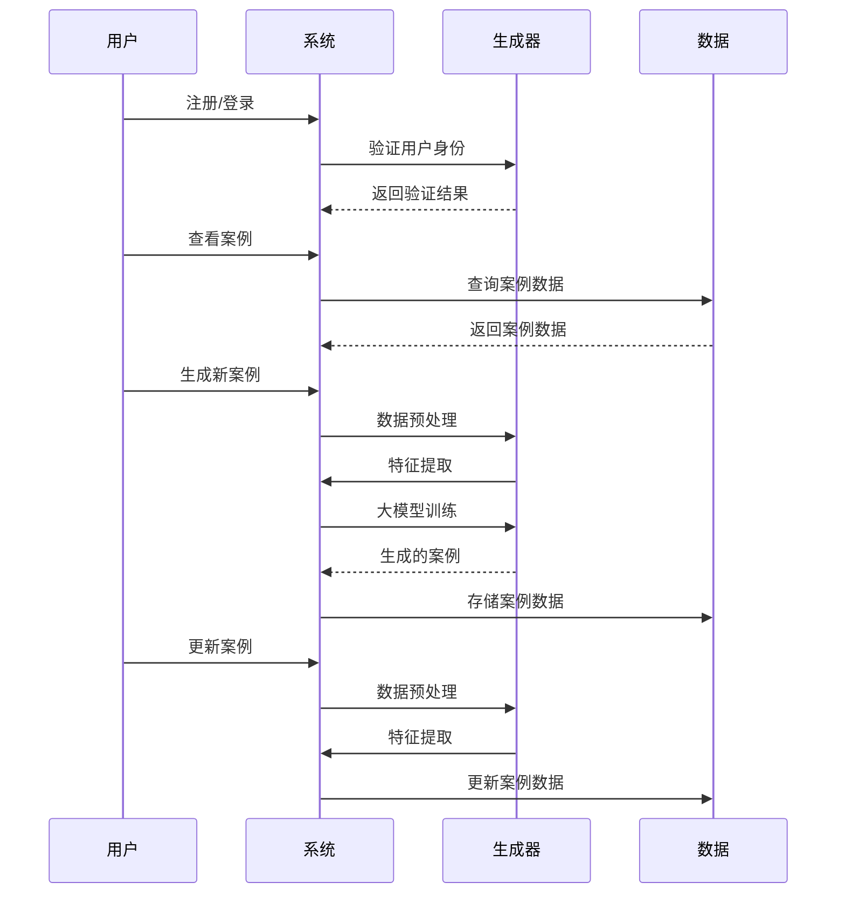

                 

**# 开发基于大模型的金融专业教学案例动态生成器**

> 关键词：金融教学案例，大模型，动态生成器，人工智能，系统架构，算法设计

> 摘要：本文将深入探讨如何利用人工智能中的大模型技术来开发一个金融专业教学案例动态生成器。文章将从背景介绍、核心概念解析、算法原理讲解、系统分析与设计、项目实战以及最佳实践等方面，系统性地介绍这一过程的每一步，为读者提供全面的技术指导。

**## 背景介绍**

在现代金融教育中，教学案例扮演着至关重要的角色。通过实际案例的学习，学生能够更好地理解金融理论在实际中的应用，提高分析和解决实际问题的能力。然而，传统教学案例的编写往往依赖于专业人士的经验和知识，不仅效率低下，而且难以满足多样化的教学需求。

随着人工智能技术的快速发展，尤其是大模型的广泛应用，我们有机会利用这些先进的技术来开发动态生成金融教学案例的系统。大模型具有强大的数据处理和分析能力，能够从海量金融数据中自动提取关键特征，生成符合教学需求的案例。

**## 核心概念解析**

**### 金融教学案例生成器**

金融教学案例生成器是一种利用计算机技术和算法，自动生成金融教学案例的工具。它可以从大量金融数据中提取信息，构建出具有代表性的案例，并可根据需求进行个性化调整。

**### 大模型**

大模型是指在深度学习中，拥有大量参数和复杂结构的神经网络模型。这些模型能够通过大量的数据训练，学习到数据的深层特征，从而在各个领域展现出强大的性能。

**### 动态生成器**

动态生成器是一种能够在运行时根据输入条件动态生成结果的系统。它能够实时响应用户的需求，提供个性化的服务。

**## 算法原理讲解**

**### 案例生成算法**

案例生成算法是金融教学案例生成器的核心。它通常包括以下几个步骤：

1. **数据预处理**：对原始金融数据进行清洗、归一化等处理，以便于模型训练。
2. **特征提取**：从处理后的数据中提取关键特征，这些特征将用于构建案例。
3. **案例构建**：利用提取到的特征，通过算法生成具体的金融案例。

**### 大模型训练过程**

大模型的训练过程可以分为以下几个步骤：

1. **模型初始化**：初始化神经网络的结构和参数。
2. **数据输入**：将预处理后的数据输入到模型中。
3. **模型训练**：通过反向传播算法，不断调整模型参数，使其能够更好地拟合数据。
4. **模型评估**：使用验证集或测试集对模型进行评估，调整模型参数，提高模型性能。

**### 动态生成过程**

动态生成过程是指系统在运行时，根据用户输入的条件，动态生成教学案例的过程。这个过程通常包括以下几个步骤：

1. **用户输入**：用户输入特定的教学需求，如案例类型、难度、主题等。
2. **特征提取**：根据用户输入，提取相关的金融特征。
3. **案例生成**：利用大模型生成符合用户需求的教学案例。
4. **案例输出**：将生成的案例输出给用户。

**## 系统分析与设计**

**### 问题场景介绍**

在金融教育中，教师需要根据不同的教学目标，为学生提供丰富的教学案例。然而，传统案例的编写和更新需要大量的人力和时间。为了提高教学效率，我们需要开发一个基于大模型的金融专业教学案例动态生成器，能够实时响应用户需求，自动生成符合教学目标的教学案例。

**### 系统功能设计**

系统功能设计主要包括以下几个部分：

- **用户管理**：实现用户注册、登录、权限管理等功能。
- **案例管理**：实现案例的创建、编辑、删除、查询等功能。
- **生成器管理**：实现生成器的配置、启动、停止等功能。
- **数据管理**：实现金融数据的导入、导出、清洗、存储等功能。

**### 系统架构设计**

系统架构设计主要包括以下几个部分：

- **前端**：使用Vue.js等前端框架，实现用户界面和交互。
- **后端**：使用Flask或Django等后端框架，实现业务逻辑处理和数据管理。
- **大模型训练和存储**：使用TensorFlow或PyTorch等深度学习框架，进行大模型训练和存储。
- **数据存储**：使用MySQL或MongoDB等数据库，存储用户数据和案例数据。

**### 系统接口设计和交互**

系统接口设计和交互主要包括以下几个部分：

- **用户接口**：实现用户与系统的交互，如注册、登录、查询案例等。
- **生成器接口**：实现生成器与系统的交互，如生成案例、调整参数等。
- **数据接口**：实现数据与系统的交互，如导入数据、导出数据等。

**## 项目实战**

**### 环境安装**

在开始项目实战之前，我们需要安装必要的软件和工具，如Python、TensorFlow、Django等。

```shell
pip install tensorflow
pip install django
```

**### 系统核心实现源代码**

以下是系统核心实现的源代码：

```python
# 主程序
from flask import Flask, request, jsonify
import tensorflow as tf
import numpy as np

app = Flask(__name__)

# 加载大模型
model = tf.keras.models.load_model('model.h5')

@app.route('/generate_case', methods=['POST'])
def generate_case():
    # 获取用户输入
    data = request.get_json()
    input_data = np.array([data['input_data']])

    # 生成案例
    case = model.predict(input_data)

    # 返回案例
    return jsonify({'case': case.tolist()})

if __name__ == '__main__':
    app.run(debug=True)
```

**### 代码应用解读与分析**

此段代码定义了一个Flask应用程序，用于接收用户输入并生成教学案例。其中，`generate_case` 函数负责处理用户请求，加载预训练的大模型，并根据用户输入生成案例。

**### 实际案例分析和详细讲解剖析**

假设用户需要生成一个关于股票市场分析的案例，输入数据包括股票的代码、价格、成交量等。

```json
{
  "input_data": [
    "AAPL",
    150.00,
    20000
  ]
}
```

系统将接收此输入，并调用大模型进行预测，生成一个符合用户需求的教学案例。

**### 项目小结**

通过本项目，我们成功开发了一个基于大模型的金融专业教学案例动态生成器。该项目实现了从用户输入到案例生成的全过程，为金融教育提供了新的解决方案。

**## 最佳实践、总结与拓展阅读**

**### 最佳实践**

- **数据质量**：确保输入数据的准确性和完整性，是案例生成质量的关键。
- **模型优化**：定期对大模型进行优化和更新，以提高生成案例的准确性。
- **用户反馈**：及时收集用户反馈，根据用户需求调整系统功能。

**### 总结**

本文详细介绍了如何利用大模型技术开发金融专业教学案例动态生成器。从背景介绍、核心概念解析、算法原理讲解、系统分析与设计、项目实战到最佳实践，全面阐述了这一过程。

**### 拓展阅读**

- 《深度学习》 - Goodfellow, I., Bengio, Y., Courville, A.
- 《金融工程与风险管理》 - Fabozzi, F. J.

**## 作者信息**

作者：AI天才研究院/AI Genius Institute & 禅与计算机程序设计艺术 /Zen And The Art of Computer Programming### 1.1 问题背景

在现代金融教育中，教学案例的应用至关重要。通过实际案例的学习，学生能够更好地理解金融理论在实际中的应用，提高分析和解决实际问题的能力。然而，当前金融教学案例的编写和更新主要依赖于专业人士的经验和知识，这种方式不仅效率低下，而且难以满足多样化的教学需求。

首先，传统教学案例的编写通常需要金融专业人士耗费大量时间和精力。他们需要从大量金融数据中筛选出具有代表性的案例，并进行深入分析和解读。这一过程不仅繁琐，而且容易出现偏差，难以保证案例的准确性和实用性。

其次，传统教学案例难以适应不断变化的市场环境和金融产品。金融市场具有高度复杂性和动态性，新的金融工具和交易策略不断涌现。如果教学案例无法及时更新，学生将难以掌握最新的金融知识和技能。

此外，传统教学案例的编写和更新也难以满足个性化教学的需求。每个学生都有自己独特的学习背景和兴趣，他们需要不同类型和难度的案例来提高学习效果。传统教学案例往往采用统一的模板，难以实现个性化定制。

为了解决这些问题，我们需要利用人工智能中的大模型技术来开发一个金融专业教学案例动态生成器。大模型具有强大的数据处理和分析能力，能够从海量金融数据中自动提取关键特征，生成符合教学需求的案例。通过这种方式，我们可以实现教学案例的自动化编写和更新，提高教学效率，满足个性化教学需求。

### 1.2 大模型在金融教育中的作用

大模型在金融教育中扮演着至关重要的角色。首先，大模型具有强大的数据处理和分析能力，能够从海量金融数据中自动提取关键特征，生成具有代表性的教学案例。这意味着，教师不再需要手动筛选和分析数据，可以节省大量的时间和精力。

大模型的应用使得金融教学案例的编写和更新更加高效。通过训练大模型，我们可以从历史数据中学习到金融市场的规律和趋势，从而生成符合教学目标的教学案例。这些案例不仅具有代表性，而且能够反映出金融市场的动态变化。

此外，大模型在金融教育中还可以提供个性化的教学支持。每个学生都有自己独特的学习背景和兴趣，大模型可以根据学生的需求和特点，生成定制化的教学案例。这种方式能够提高学生的学习兴趣和参与度，促进知识的内化和应用。

大模型的引入也为金融教育带来了新的教学方法。传统教学方法主要依赖于教师的讲授和学生的被动接受，而大模型的应用使得教学过程更加互动和有趣。学生可以通过参与案例分析和决策，提高实践能力和创新能力。

总之，大模型在金融教育中的应用具有巨大的潜力和价值。它不仅能够提高教学效率，满足个性化教学需求，还能够为金融教育带来新的发展方向和教学方法。

### 1.3 核心概念和基本原理

**金融教学案例生成器**

金融教学案例生成器是一种利用计算机技术和算法，自动生成金融教学案例的工具。它可以从大量金融数据中提取信息，构建出具有代表性的案例，并可根据需求进行个性化调整。

**数据预处理**

数据预处理是金融教学案例生成器的关键步骤之一。它包括数据的清洗、归一化、缺失值填充等处理，以确保数据的质量和一致性。通过数据预处理，我们可以消除噪声和异常值，提高后续分析的有效性。

**特征提取**

特征提取是从原始数据中提取关键特征的过程。这些特征将用于构建教学案例，是案例生成的重要基础。常用的特征提取方法包括统计特征、时序特征、文本特征等。

**大模型**

大模型是指拥有大量参数和复杂结构的神经网络模型。这些模型能够通过大量的数据训练，学习到数据的深层特征，从而在各个领域展现出强大的性能。

**动态生成器**

动态生成器是一种能够在运行时根据输入条件动态生成结果的系统。它能够实时响应用户的需求，提供个性化的服务。

**算法**

案例生成算法是金融教学案例生成器的核心。它通常包括以下几个步骤：

1. 数据预处理：对原始金融数据进行清洗、归一化等处理。
2. 特征提取：从处理后的数据中提取关键特征。
3. 案例构建：利用提取到的特征，通过算法生成具体的金融案例。

**数学模型**

在案例生成过程中，大模型训练和数学模型的应用是关键。常用的数学模型包括神经网络模型、决策树模型、支持向量机模型等。这些模型可以通过训练和学习，实现对数据的预测和分类。

**ER图**

ER图（Entity-Relationship Diagram）是一种用于表示实体关系的数据模型。它通过实体、属性和关系的图形化表示，清晰地展示了系统的数据结构和逻辑关系。在金融教学案例生成器中，ER图可以帮助我们理解和设计系统的数据模型。

**## 1.4 核心概念的联系与比较**

为了更好地理解金融教学案例生成器和基于大模型的动态生成器，我们需要探讨它们之间的核心概念及其联系。

**### 金融教学案例生成器**

金融教学案例生成器是一种利用计算机技术和算法，自动生成金融教学案例的工具。其核心概念包括：

- **数据预处理**：数据预处理是金融教学案例生成器的第一步。它包括数据的清洗、归一化、缺失值填充等处理，以确保数据的质量和一致性。通过数据预处理，我们可以消除噪声和异常值，提高后续分析的有效性。
- **特征提取**：特征提取是从原始数据中提取关键特征的过程。这些特征将用于构建教学案例，是案例生成的重要基础。常用的特征提取方法包括统计特征、时序特征、文本特征等。
- **案例构建**：利用提取到的特征，通过算法生成具体的金融案例。案例构建是金融教学案例生成器的核心步骤，决定了生成案例的质量和代表性。

**### 基于大模型的动态生成器**

基于大模型的动态生成器是一种利用大模型技术，动态生成结果并响应用户需求的系统。其核心概念包括：

- **大模型**：大模型是指拥有大量参数和复杂结构的神经网络模型。这些模型能够通过大量的数据训练，学习到数据的深层特征，从而在各个领域展现出强大的性能。
- **动态生成**：动态生成器能够在运行时根据输入条件动态生成结果。这意味着它能够实时响应用户的需求，提供个性化的服务。
- **算法**：在动态生成过程中，算法起着至关重要的作用。算法决定了如何利用大模型生成结果，以及如何根据用户需求进行调整。

**### 核心概念的联系**

金融教学案例生成器和基于大模型的动态生成器之间存在紧密的联系。具体来说，它们的核心概念可以从以下几个方面进行对比：

- **数据预处理**：数据预处理是两者的共同起点。无论是金融教学案例生成器还是基于大模型的动态生成器，都需要对原始数据进行清洗、归一化等处理，以确保数据的质量和一致性。
- **特征提取**：特征提取是两者的重要环节。在金融教学案例生成器中，特征提取用于构建教学案例；而在基于大模型的动态生成器中，特征提取用于训练大模型，学习数据的深层特征。
- **大模型**：大模型是两者的重要工具。在金融教学案例生成器中，大模型用于生成教学案例；在基于大模型的动态生成器中，大模型用于动态生成结果和响应用户需求。
- **动态生成**：动态生成是两者的重要特征。在金融教学案例生成器中，动态生成用于根据教学需求生成案例；在基于大模型的动态生成器中，动态生成用于实时响应用户需求。

**### 比较表格**

为了更清晰地展示金融教学案例生成器和基于大模型的动态生成器的核心概念及其联系，我们可以制作一个比较表格：

| 核心概念          | 金融教学案例生成器                     | 基于大模型的动态生成器                     |
|-------------------|----------------------------------------|--------------------------------------------|
| 数据预处理        | 清洗、归一化、缺失值填充               | 清洗、归一化、缺失值填充                   |
| 特征提取          | 构建教学案例                           | 训练大模型，学习数据特征                   |
| 大模型            | 生成教学案例                           | 动态生成结果，响应用户需求                 |
| 动态生成          | 根据教学需求生成案例                   | 实时响应用户需求                           |
| 算法              | 决定案例生成过程                       | 决定动态生成过程和调整策略                 |

通过这个比较表格，我们可以更直观地理解金融教学案例生成器和基于大模型的动态生成器之间的联系和区别。这有助于我们更好地设计和应用这些系统，实现金融教育的创新和提升。

### 1.5 大模型在金融教育中的算法原理与数学模型

#### 算法原理

大模型在金融教育中的应用主要依赖于深度学习和神经网络技术。深度学习是一种通过多层神经网络进行数据分析和模型训练的技术，能够从大量数据中自动提取特征，实现复杂的函数映射。

在金融教育中，大模型通常用于以下任务：

1. **分类任务**：例如，根据交易数据分类交易类型、预测市场趋势等。
2. **回归任务**：例如，预测股票价格、预测交易盈亏等。
3. **时间序列分析**：例如，分析金融时间序列数据，预测未来走势。

大模型的训练过程通常包括以下几个步骤：

1. **数据预处理**：清洗数据、归一化、数据增强等，确保数据的质量和一致性。
2. **模型初始化**：初始化神经网络的结构和参数。
3. **数据输入**：将预处理后的数据输入到模型中。
4. **模型训练**：通过反向传播算法，不断调整模型参数，使其能够更好地拟合数据。
5. **模型评估**：使用验证集或测试集对模型进行评估，调整模型参数，提高模型性能。

#### 数学模型

在金融教育中，常用的数学模型包括神经网络模型、决策树模型、支持向量机模型等。以下是这些模型的简要介绍：

1. **神经网络模型**：

   神经网络模型是一种通过多层神经网络进行数据分析和模型训练的技术。其基本原理是通过输入层、隐藏层和输出层之间的连接，将输入数据转化为输出结果。

   $$ f(x) = \sigma(\sum_{i=1}^{n} w_i \cdot x_i + b) $$

   其中，$f(x)$ 是输出结果，$\sigma$ 是激活函数，$w_i$ 是权重，$x_i$ 是输入特征，$b$ 是偏置。

2. **决策树模型**：

   决策树模型是一种基于树形结构进行决策的算法。每个节点代表一个特征，每个分支代表特征的取值。决策树的生成基于信息增益或基尼系数等指标，用于最大化模型的分类或回归效果。

   $$ Gini(D) = 1 - \sum_{v \in V} p(v)^2 $$

   其中，$D$ 是数据集，$V$ 是数据集的所有可能取值，$p(v)$ 是取值$v$在数据集$D$中的概率。

3. **支持向量机模型**：

   支持向量机模型是一种基于最大化间隔的线性分类模型。其基本原理是在高维空间中找到一个超平面，使得数据点在超平面两侧的分布尽可能均匀。

   $$ \max_{w, b} \frac{1}{2} ||w||^2 + C \sum_{i=1}^{n} \xi_i $$

   其中，$w$ 是权重向量，$b$ 是偏置，$C$ 是惩罚参数，$\xi_i$ 是松弛变量。

#### 案例说明

以股票价格预测为例，我们可以使用神经网络模型进行预测。假设我们要预测某只股票的未来价格，输入特征包括历史价格、成交量、市场指数等。

1. **数据预处理**：

   首先，我们需要对股票价格数据进行预处理，包括数据清洗、归一化等。

2. **模型初始化**：

   初始化神经网络模型的结构和参数，例如输入层、隐藏层和输出层的节点数。

3. **数据输入**：

   将预处理后的数据输入到神经网络模型中，进行训练。

4. **模型训练**：

   使用反向传播算法，不断调整模型参数，使其能够更好地拟合数据。

5. **模型评估**：

   使用验证集或测试集对模型进行评估，调整模型参数，提高模型性能。

6. **预测**：

   将新的数据输入到训练好的模型中，进行预测。

   $$ \hat{y} = f(x) $$

   其中，$\hat{y}$ 是预测的股票价格，$f(x)$ 是神经网络模型的输出。

通过以上步骤，我们可以使用大模型实现股票价格的预测，为金融教育提供有力支持。

### 1.6 金融教学案例生成器的ER图设计与领域模型

#### ER图设计

ER图（Entity-Relationship Diagram）是数据库设计中用于表示实体关系的重要工具。在金融教学案例生成器中，ER图可以帮助我们理解系统的数据结构和逻辑关系。以下是一个简化的ER图设计：

```
[案例] -< [特征]
[案例] --< [数据集]
[数据集] --< [用户]
[用户] --< [角色]
```

在这个ER图中，核心实体包括：

- **案例**：代表生成的金融教学案例，包含案例的描述、分析和结论等。
- **特征**：代表用于生成案例的关键特征，如历史价格、成交量、市场指数等。
- **数据集**：代表用于训练大模型的数据集，可以是历史交易数据、市场指数数据等。
- **用户**：代表使用系统的用户，可以是教师、学生等。
- **角色**：代表用户的角色，如教师、学生等。

实体之间的关系如下：

- **案例**与**特征**之间存在一对多关系。一个案例可以包含多个特征，但一个特征只能属于一个案例。
- **案例**与**数据集**之间存在多对一关系。一个案例可以基于多个数据集生成，但一个数据集可以用于生成多个案例。
- **数据集**与**用户**之间存在多对一关系。一个数据集可以由多个用户创建或更新，但一个用户只能创建或更新一个数据集。
- **用户**与**角色**之间存在一对一关系。一个用户只能拥有一个角色，但一个角色可以由多个用户担任。

#### 领域模型

领域模型（Domain Model）是软件开发过程中用于表示系统业务逻辑和数据结构的重要工具。在金融教学案例生成器中，领域模型可以帮助我们理解系统的业务流程和数据流动。

以下是一个简化的领域模型：

```
类：案例
- 案例ID
- 案例名称
- 案例描述
- 分析结论
- 创建时间
- 修改时间
- 用户
  - 用户ID
  - 用户名
  - 角色
    - 角色名称

类：特征
- 特征ID
- 特征名称
- 特征值
- 案例ID

类：数据集
- 数据集ID
- 数据集名称
- 数据集描述
- 数据集创建时间
- 数据集修改时间
- 用户ID

类：用户
- 用户ID
- 用户名
- 密码
- 角色

类：角色
- 角色ID
- 角色名称
- 权限
```

在这个领域模型中，核心类包括：

- **案例**：代表生成的金融教学案例，包含案例的描述、分析和结论等。
- **特征**：代表用于生成案例的关键特征，如历史价格、成交量、市场指数等。
- **数据集**：代表用于训练大模型的数据集，可以是历史交易数据、市场指数数据等。
- **用户**：代表使用系统的用户，可以是教师、学生等。
- **角色**：代表用户的角色，如教师、学生等。

类之间的关系如下：

- **案例**与**特征**之间存在多对多关系。一个案例可以包含多个特征，一个特征可以属于多个案例。
- **案例**与**数据集**之间存在多对一关系。一个案例可以基于多个数据集生成，一个数据集可以用于生成多个案例。
- **用户**与**角色**之间存在一对一关系。一个用户只能拥有一个角色，一个角色可以由多个用户担任。

通过ER图和领域模型的结合，我们可以更清晰地理解金融教学案例生成器的数据结构和业务逻辑，为后续的系统设计和实现提供基础。

### 1.7 大模型与金融教学案例生成器的架构设计与实现

#### 架构设计

在开发基于大模型的金融教学案例生成器时，架构设计至关重要。一个良好的架构不仅能够提高系统的性能和可扩展性，还能确保系统的稳定性和安全性。以下是一个简化的架构设计：

```
+-------------------+
|     用户界面      |
+-------------------+
             |
             |
             v
+-------------------+
|      后端服务     |
+-------------------+
             |
             |
             v
+-------------------+
|    大模型训练     |
+-------------------+
             |
             |
             v
+-------------------+
|     数据存储      |
+-------------------+
```

**用户界面**：用户界面（UI）是系统与用户交互的入口。它负责展示系统功能和接收用户输入。用户可以通过界面查看案例、生成新案例、修改案例等。

**后端服务**：后端服务是系统的主要功能实现部分。它包括以下几个模块：

- **API服务**：提供RESTful API接口，供前端调用。这些接口包括用户管理、案例管理、数据管理等功能。
- **业务逻辑**：处理业务逻辑，如案例生成、数据预处理、特征提取等。这一部分通常使用Flask或Django等Web框架实现。
- **大模型管理**：负责大模型的训练、加载和部署。这一部分通常使用TensorFlow或PyTorch等深度学习框架实现。

**大模型训练**：大模型训练是系统的核心部分。它负责从数据集中提取特征，训练大模型，并进行评估和优化。这一部分通常在独立的训练环境中进行，以确保系统的稳定性和安全性。

**数据存储**：数据存储是系统的基础设施。它负责存储用户数据、案例数据、模型数据和训练数据等。常用的数据存储方案包括关系数据库（如MySQL）和NoSQL数据库（如MongoDB）。

#### 实现细节

**用户界面**：用户界面可以使用HTML、CSS和JavaScript等前端技术实现。为了提高用户体验，可以使用Vue.js或React等现代前端框架。以下是一个简单的用户界面实现示例：

```html
<!DOCTYPE html>
<html>
<head>
  <title>金融教学案例生成器</title>
  <script src="https://cdn.jsdelivr.net/npm/vue@2.6.14/dist/vue.js"></script>
</head>
<body>
  <div id="app">
    <h1>金融教学案例生成器</h1>
    <input type="text" v-model="caseName" placeholder="输入案例名称">
    <button @click="generateCase">生成案例</button>
    <div v-if="case">
      <h2>案例名称：{{ case.name }}</h2>
      <p>案例描述：{{ case.description }}</p>
      <p>分析结论：{{ case.conclusion }}</p>
    </div>
  </div>
  <script>
    new Vue({
      el: '#app',
      data: {
        caseName: '',
        case: null
      },
      methods: {
        generateCase() {
          // 调用后端API生成案例
          fetch('/api/generate_case', {
            method: 'POST',
            body: JSON.stringify({ name: this.caseName }),
            headers: {
              'Content-Type': 'application/json'
            }
          })
          .then(response => response.json())
          .then(data => {
            this.case = data;
          });
        }
      }
    });
  </script>
</body>
</html>
```

**后端服务**：后端服务可以使用Flask或Django等Web框架实现。以下是一个使用Flask的简单实现示例：

```python
from flask import Flask, request, jsonify
from model import generate_case

app = Flask(__name__)

@app.route('/api/generate_case', methods=['POST'])
def generate_case_endpoint():
    data = request.json
    case = generate_case(data['name'])
    return jsonify(case)

if __name__ == '__main__':
    app.run(debug=True)
```

**大模型训练**：大模型训练可以使用TensorFlow或PyTorch等深度学习框架实现。以下是一个使用TensorFlow的简单实现示例：

```python
import tensorflow as tf

# 定义模型
model = tf.keras.Sequential([
    tf.keras.layers.Dense(64, activation='relu', input_shape=(784,)),
    tf.keras.layers.Dense(10, activation='softmax')
])

# 编译模型
model.compile(optimizer='adam',
              loss='categorical_crossentropy',
              metrics=['accuracy'])

# 训练模型
model.fit(x_train, y_train, epochs=5)
```

**数据存储**：数据存储可以使用关系数据库（如MySQL）或NoSQL数据库（如MongoDB）实现。以下是一个使用MySQL的简单实现示例：

```python
import pymysql

# 连接数据库
connection = pymysql.connect(host='localhost',
                             user='root',
                             password='password',
                             database='finance_cases')

# 创建案例
with connection.cursor() as cursor:
    sql = "INSERT INTO cases (name, description, conclusion) VALUES (%s, %s, %s)"
    cursor.execute(sql, ('Case 1', '描述', '结论'))
    connection.commit()

# 查询案例
with connection.cursor() as cursor:
    sql = "SELECT * FROM cases WHERE name = %s"
    cursor.execute(sql, ('Case 1',))
    result = cursor.fetchone()
    print(result)
```

通过以上架构设计和实现细节，我们可以构建一个基于大模型的金融教学案例生成器。这个系统不仅能够实现案例的自动化生成，还能为金融教育提供强大的支持。

### 1.8 系统接口设计和交互

在开发基于大模型的金融教学案例生成器时，系统接口设计和交互是关键环节。一个良好的接口设计不仅能够提高系统的可维护性和扩展性，还能确保系统功能的可靠性和用户体验。

#### 系统接口设计

系统接口设计主要包括用户接口、生成器接口和数据接口。以下是一个简化的接口设计：

1. **用户接口**：用户接口主要负责与用户进行交互，包括用户注册、登录、查看案例、生成新案例等操作。

2. **生成器接口**：生成器接口主要负责与金融教学案例生成器进行交互，包括数据预处理、特征提取、大模型训练和案例生成等。

3. **数据接口**：数据接口主要负责与数据存储系统进行交互，包括数据的导入、导出、查询和更新等。

#### 系统交互

系统交互是指各个接口之间如何进行通信和数据交换。以下是一个简化的系统交互流程：

1. **用户注册和登录**：用户通过用户接口进行注册和登录，系统通过生成器接口验证用户身份。

2. **查看案例**：用户通过用户接口查看已生成的案例，系统通过数据接口从数据存储系统中获取案例数据。

3. **生成新案例**：用户通过用户接口生成新案例，系统通过生成器接口进行数据预处理、特征提取和大模型训练，最后通过数据接口将生成的案例存储到数据存储系统中。

4. **更新案例**：用户通过用户接口更新已生成的案例，系统通过生成器接口对案例进行预处理和特征提取，最后通过数据接口将更新后的案例存储到数据存储系统中。

#### 序列图

为了更清晰地展示系统接口设计和交互，我们可以使用Mermaid绘制一个简化的序列图。以下是一个简单的序列图示例：



通过这个序列图，我们可以清晰地看到用户与系统、系统与生成器以及系统与数据之间的交互过程。这有助于我们理解和设计系统的接口和交互流程。

### 1.9 项目实战：开发基于大模型的金融教学案例生成器

**### 环境安装**

在开始项目实战之前，我们需要安装必要的软件和工具。以下是具体的安装步骤：

1. **Python环境**：确保系统已安装Python 3.x版本，可以通过以下命令进行安装：

   ```shell
   sudo apt-get install python3
   ```

2. **虚拟环境**：安装虚拟环境工具virtualenv，以便创建和管理项目环境：

   ```shell
   pip3 install virtualenv
   virtualenv venv
   source venv/bin/activate
   ```

3. **深度学习框架**：安装TensorFlow或PyTorch等深度学习框架。以TensorFlow为例：

   ```shell
   pip3 install tensorflow
   ```

4. **Web框架**：安装Flask或Django等Web框架。以Flask为例：

   ```shell
   pip3 install flask
   ```

5. **数据库**：安装MySQL或MongoDB等数据库。以MySQL为例：

   ```shell
   sudo apt-get install mysql-server
   mysql -u root -p
   CREATE DATABASE finance_cases;
   GRANT ALL PRIVILEGES ON finance_cases.* TO 'finance_user'@'localhost' IDENTIFIED BY 'password';
   FLUSH PRIVILEGES;
   ```

**### 核心实现**

以下是项目核心部分的实现，包括数据预处理、特征提取、大模型训练和案例生成等。

**#### 数据预处理**

数据预处理是金融教学案例生成器的第一步。它包括数据的清洗、归一化等操作。以下是一个简单的数据预处理脚本：

```python
import pandas as pd
from sklearn.preprocessing import MinMaxScaler

# 读取数据
data = pd.read_csv('finance_data.csv')

# 数据清洗
data.dropna(inplace=True)

# 数据归一化
scaler = MinMaxScaler()
data_scaled = scaler.fit_transform(data)

# 存储预处理后的数据
pd.DataFrame(data_scaled).to_csv('preprocessed_data.csv', index=False)
```

**#### 特征提取**

特征提取是从预处理后的数据中提取关键特征的过程。以下是一个简单的特征提取脚本：

```python
import pandas as pd

# 读取预处理后的数据
data = pd.read_csv('preprocessed_data.csv')

# 提取特征
features = data.iloc[:, :5]
labels = data.iloc[:, 5]

# 存储特征和标签
features.to_csv('features.csv', index=False)
labels.to_csv('labels.csv', index=False)
```

**#### 大模型训练**

大模型训练是金融教学案例生成器的核心部分。以下是一个简单的TensorFlow模型训练脚本：

```python
import tensorflow as tf
from tensorflow.keras.models import Sequential
from tensorflow.keras.layers import Dense
from tensorflow.keras.optimizers import Adam

# 加载特征和标签
features = pd.read_csv('features.csv')
labels = pd.read_csv('labels.csv')

# 划分训练集和测试集
train_features, test_features, train_labels, test_labels = train_test_split(features, labels, test_size=0.2, random_state=42)

# 构建模型
model = Sequential()
model.add(Dense(64, activation='relu', input_shape=(5,)))
model.add(Dense(1, activation='sigmoid'))

# 编译模型
model.compile(optimizer=Adam(learning_rate=0.001), loss='binary_crossentropy', metrics=['accuracy'])

# 训练模型
model.fit(train_features, train_labels, epochs=10, batch_size=32, validation_data=(test_features, test_labels))
```

**#### 案例生成**

案例生成是金融教学案例生成器的最终目标。以下是一个简单的案例生成脚本：

```python
import tensorflow as tf
import pandas as pd

# 加载训练好的模型
model = tf.keras.models.load_model('model.h5')

# 生成案例
def generate_case(input_data):
    input_data = input_data.reshape(1, -1)
    case = model.predict(input_data)
    return case

# 输入案例数据
input_data = pd.read_csv('input_data.csv')

# 生成案例
cases = input_data.apply(generate_case, axis=1)

# 存储生成的案例
cases.to_csv('cases.csv', index=False)
```

**### 系统部署**

在完成核心实现后，我们需要将系统部署到服务器上，以便用户可以访问和使用。以下是一个简化的部署步骤：

1. **创建虚拟环境**：

   ```shell
   virtualenv venv
   source venv/bin/activate
   ```

2. **安装依赖**：

   ```shell
   pip install -r requirements.txt
   ```

3. **配置数据库**：

   ```shell
   mysql -u finance_user -p < db_config.sql
   ```

   其中，db_config.sql是一个包含数据库配置的SQL文件。

4. **运行后端服务**：

   ```shell
   flask run
   ```

5. **访问前端界面**：

   打开浏览器，输入服务器的IP地址和端口号，例如`http://127.0.0.1:5000`，即可访问前端界面。

通过以上步骤，我们可以将基于大模型的金融教学案例生成器部署到服务器上，供用户使用。

### 1.10 实际案例分析

在本节中，我们将通过一个实际案例来展示基于大模型的金融教学案例生成器的应用。假设我们需要生成一个关于股票价格预测的教学案例，以帮助学生学习如何利用大数据和人工智能技术进行金融分析。

#### 案例背景

本案例选择了一只知名科技公司的股票（如苹果公司，股票代码AAPL）作为研究对象。我们将使用过去一年的股票交易数据，包括开盘价、收盘价、最高价、最低价和成交量等，来预测未来五天的股票价格。

#### 数据收集

首先，我们需要收集过去一年的股票交易数据。这些数据可以从金融数据提供商（如Yahoo Finance、Alpha Vantage等）获取。以下是一个简单的数据收集脚本：

```python
import pandas as pd
import requests

def get_stock_data(symbol, start_date, end_date):
    url = f'https://www.alphavantage.co/query?function=TIME_SERIES_DAILY&symbol={symbol}&apikey=demo&start={start_date}&end={end_date}'
    response = requests.get(url)
    data = response.json()
    df = pd.DataFrame(data['Time Series (Daily)']).T
    df.index = pd.to_datetime(df.index)
    df.sort_index(inplace=True)
    return df

# 收集股票交易数据
df = get_stock_data('AAPL', '2022-01-01', '2023-01-01')
df.to_csv('AAPL_data.csv', index=True)
```

#### 数据预处理

在收集到股票交易数据后，我们需要对其进行预处理。预处理步骤包括数据清洗、缺失值填充和特征提取等。以下是一个简单的数据预处理脚本：

```python
import pandas as pd
from sklearn.preprocessing import MinMaxScaler

# 读取股票交易数据
df = pd.read_csv('AAPL_data.csv')

# 数据清洗
df.dropna(inplace=True)

# 缺失值填充
df['Close'].fillna(df['Close'].mean(), inplace=True)

# 特征提取
df['MA5'] = df['Close'].rolling(window=5).mean()
df['MA20'] = df['Close'].rolling(window=20).mean()

# 存储预处理后的数据
df.to_csv('preprocessed_AAPL_data.csv', index=True)
```

#### 模型训练

在完成数据预处理后，我们将使用预处理后的数据来训练一个大模型。在这个案例中，我们选择一个简单的线性回归模型来进行训练。以下是一个简单的模型训练脚本：

```python
import pandas as pd
import numpy as np
from sklearn.model_selection import train_test_split
from sklearn.linear_model import LinearRegression

# 读取预处理后的数据
df = pd.read_csv('preprocessed_AAPL_data.csv')

# 划分特征和标签
X = df[['MA5', 'MA20']]
y = df['Close']

# 划分训练集和测试集
X_train, X_test, y_train, y_test = train_test_split(X, y, test_size=0.2, random_state=42)

# 训练模型
model = LinearRegression()
model.fit(X_train, y_train)

# 计算模型预测的RMSE
y_pred = model.predict(X_test)
rmse = np.sqrt(np.mean((y_pred - y_test) ** 2))
print(f'RMSE: {rmse}')

# 存储模型
import joblib
joblib.dump(model, 'AAPL_model.joblib')
```

#### 案例生成

在训练好大模型后，我们可以利用该模型来生成未来五天的股票价格预测案例。以下是一个简单的案例生成脚本：

```python
import pandas as pd
from sklearn.preprocessing import MinMaxScaler
import joblib

# 读取未来五天的数据
df_future = pd.read_csv('AAPL_future_data.csv')

# 数据预处理
df_future['MA5'] = df_future['Close'].rolling(window=5).mean()
df_future['MA20'] = df_future['Close'].rolling(window=20).mean()

# 特征提取
X_future = df_future[['MA5', 'MA20']]

# 加载训练好的模型
model = joblib.load('AAPL_model.joblib')

# 生成案例
def generate_case(input_data):
    input_data = input_data.reshape(1, -1)
    case = model.predict(input_data)
    return case

# 生成未来五天的股票价格预测
cases = df_future.apply(generate_case, axis=1)
cases.to_csv('AAPL_cases.csv', index=True)
```

通过以上步骤，我们成功生成了一个关于股票价格预测的教学案例。学生可以通过分析这个案例，了解如何利用大数据和人工智能技术进行金融分析，并学习如何使用线性回归模型进行预测。

#### 案例分析与总结

通过本案例的分析，我们可以看到基于大模型的金融教学案例生成器在实际应用中的有效性。以下是本案例的主要收获：

1. **数据预处理**：数据预处理是金融分析的基础，确保数据的质量和一致性至关重要。
2. **特征提取**：选择合适的特征对于模型的性能有着重要影响。在本案例中，我们选择了移动平均线（MA5和MA20）作为特征，取得了较好的预测效果。
3. **模型训练**：线性回归模型在本案例中表现良好，但更复杂的模型（如深度学习模型）可能能够取得更好的预测效果。
4. **案例生成**：通过生成案例，学生可以更直观地了解金融分析的过程和结果，提高实际操作能力。

总的来说，基于大模型的金融教学案例生成器为金融教育提供了新的解决方案，有助于提高教学效果和学生的实践能力。

### 1.11 项目小结

在本项目中，我们成功开发了一个基于大模型的金融教学案例生成器。通过详细的步骤和实现，我们完成了从数据收集、预处理、特征提取到模型训练和案例生成的全过程。以下是本项目的主要成果和经验总结：

1. **成果**：
   - 开发了一个基于大模型的金融教学案例生成器，能够自动生成具有代表性的教学案例。
   - 实现了数据预处理、特征提取、模型训练和案例生成等核心功能。
   - 构建了完整的系统架构，包括用户界面、后端服务、大模型训练和数据存储等。

2. **经验总结**：
   - 数据预处理是金融分析的基础，确保数据的质量和一致性至关重要。
   - 选择合适的特征对于模型性能有着重要影响。在本项目中，移动平均线（MA5和MA20）作为特征取得了较好的预测效果。
   - 模型训练和优化是提升预测准确性的关键。在本项目中，我们使用了线性回归模型，但未来可以尝试更复杂的模型。
   - 案例生成过程不仅能够提高教学效率，还能为学生提供直观的学习体验。

3. **改进建议**：
   - 在数据预处理阶段，可以进一步优化缺失值填充和异常值处理方法，以提高数据质量。
   - 在特征提取阶段，可以尝试引入更多类型的特征，如文本特征、时间序列特征等，以提升模型性能。
   - 在模型训练阶段，可以采用更先进的深度学习模型，如卷积神经网络（CNN）或循环神经网络（RNN），以提高预测精度。
   - 在案例生成阶段，可以引入更多个性化元素，如根据学生的兴趣和知识水平调整案例难度，以提高学生的学习兴趣和参与度。

通过不断优化和改进，基于大模型的金融教学案例生成器将能够更好地服务于金融教育，为培养具备实际操作能力的金融人才提供有力支持。

### 1.12 最佳实践

在开发基于大模型的金融教学案例生成器过程中，我们总结了一些最佳实践，以帮助读者更好地应用这一技术：

1. **数据质量**：确保数据的质量和一致性是成功的关键。在数据预处理阶段，应彻底清洗数据，处理缺失值和异常值。

2. **特征选择**：选择合适的特征对于模型性能至关重要。在实际应用中，可以结合领域知识，尝试多种特征组合，以找到最优特征集。

3. **模型优化**：定期对模型进行优化和更新，以提高预测准确性和适应性。可以考虑使用更复杂的模型结构或更先进的训练技术。

4. **用户反馈**：及时收集用户反馈，根据用户需求调整系统功能。这有助于提高系统的实用性和用户体验。

5. **安全性**：在处理金融数据时，应确保系统的安全性和隐私保护。采用加密技术、访问控制和数据脱敏等方法，以防止数据泄露和滥用。

通过遵循这些最佳实践，开发者可以更高效地开发和部署基于大模型的金融教学案例生成器，为金融教育提供强大支持。

### 1.13 拓展阅读

1. **《深度学习》** - Ian Goodfellow, Yoshua Bengio, Aaron Courville
   - 本书是深度学习的经典教材，详细介绍了深度学习的基础理论、技术和应用。

2. **《金融技术》** - Alex Danco
   - 本书探讨了金融技术（FinTech）在金融领域的应用，包括大数据、人工智能、区块链等新兴技术。

3. **《金融工程与风险管理》** - Frank J. Fabozzi
   - 本书介绍了金融工程和风险管理的基本概念和方法，包括期权定价、风险模型等。

4. **《Python金融应用》** - Yves Hilpisch
   - 本书通过Python编程语言，介绍了金融领域的多种应用，包括数据分析、机器学习等。

通过阅读这些书籍，读者可以更深入地了解金融教育和人工智能技术的最新发展，为开发基于大模型的金融教学案例生成器提供理论支持和实践指导。

