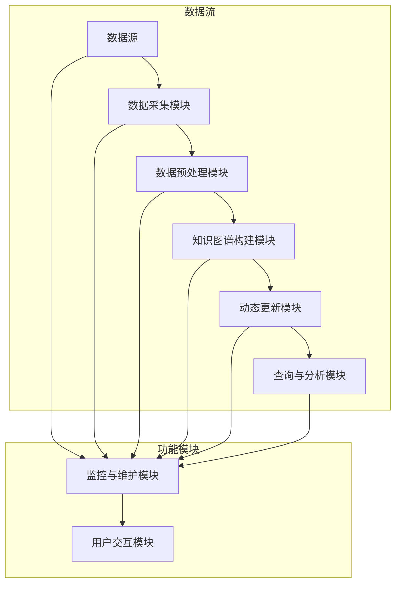
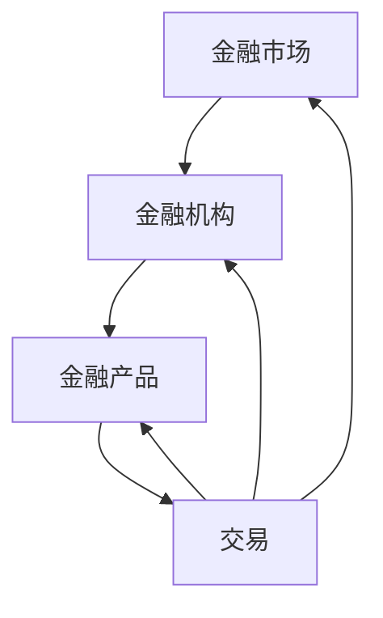
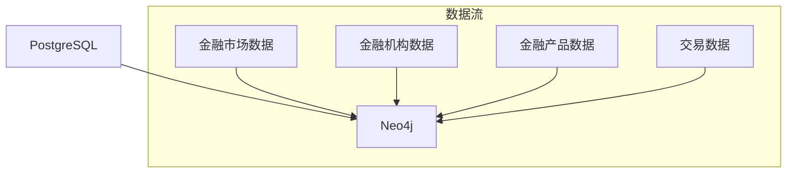

                 

### 引言与背景

#### 第1章: 引言

**1.1 问题背景**

在当今金融科技（FinTech）迅猛发展的背景下，金融行业的数据量和复杂性都在不断增长。传统的金融数据处理和分析方式已经难以应对日益复杂的金融场景和多样化的用户需求。因此，如何高效地管理和利用这些数据，以支持金融决策和产品创新，成为了一个亟待解决的问题。

**1.2 问题描述**

本文旨在解决的是开发一个基于大模型的金融专业知识图谱动态更新系统。具体而言，我们需要构建一个系统，能够实时更新金融知识图谱中的信息，并支持复杂的查询和分析。这样的系统需要具备以下几个特点：

1. **高效性**：能够快速处理大量金融数据，并提供实时更新。
2. **准确性**：确保知识图谱中的信息准确无误，支持金融分析和决策。
3. **灵活性**：能够适应金融市场的快速变化，及时调整知识图谱。
4. **扩展性**：支持系统的扩展，以适应未来金融科技的不断发展。

**1.3 问题解决**

为了解决上述问题，我们采用了以下解决方案：

1. **大模型技术**：利用大模型技术处理海量金融数据，提高数据处理和分析的效率。
2. **知识图谱构建**：通过构建金融专业知识图谱，实现金融知识的结构化和关联。
3. **动态更新机制**：设计动态更新机制，确保知识图谱中的信息实时准确。

**1.4 边界与外延**

本文的研究边界主要聚焦于基于大模型的金融专业知识图谱动态更新系统的开发，涵盖系统设计、实现、优化和实际应用。外延部分则包括大模型在金融领域的其他应用、金融知识图谱的扩展和未来研究方向。

### 金融知识图谱概述

#### 第2章: 金融知识图谱概述

**2.1 概念定义**

金融知识图谱是一种结构化的知识表示形式，用于表示金融领域的知识，如金融市场、金融机构、金融产品、交易信息等。它通过实体、属性和关系的网络结构，实现对金融知识的组织和检索。

**2.2 特点与应用**

金融知识图谱具有以下特点：

1. **结构化**：通过实体和关系的网络结构，实现知识的高效组织和表示。
2. **关联性**：能够揭示金融实体之间的复杂关系，支持关联分析和推理。
3. **可扩展性**：支持新实体和关系的加入，适应金融市场的快速变化。

金融知识图谱在金融领域的应用包括：

1. **智能问答**：通过图谱查询，快速回答金融用户的问题。
2. **风险管理**：分析金融风险，为金融机构提供风险预警。
3. **投资决策**：支持投资分析和决策，提高投资回报率。
4. **金融监管**：辅助金融监管机构，发现潜在的金融违规行为。

**2.3 发展历程**

金融知识图谱的发展历程可以分为以下几个阶段：

1. **早期阶段**：主要采用简单的属性-值模型，对金融知识进行表示。
2. **中间阶段**：引入语义网络和本体论，实现知识的语义表示。
3. **现阶段**：结合大数据和人工智能技术，实现金融知识图谱的自动化构建和动态更新。

### 大模型技术基础

#### 第3章: 大模型技术基础

**3.1 大模型概述**

大模型，即大型深度学习模型，是指参数规模超过数十亿甚至数万亿的神经网络模型。这些模型通过自主学习海量数据，具有强大的特征提取和建模能力，能够处理复杂的任务，如自然语言处理、计算机视觉和知识图谱构建。

**3.2 常见大模型介绍**

以下是一些常见的大模型及其特点：

1. **BERT**：一种双向编码器表示模型，用于自然语言处理。
2. **GPT-3**：一种生成预训练模型，具有强大的文本生成和推理能力。
3. **BERT-large**：BERT模型的更大版本，参数规模更大，性能更强。
4. **ViT**：视觉变换器，用于计算机视觉任务。

**3.3 大模型在金融领域的应用**

大模型在金融领域有广泛的应用，包括：

1. **金融文本分析**：利用大模型处理金融文本数据，提取关键信息，支持智能问答和报告生成。
2. **金融市场预测**：利用大模型分析市场数据，预测股票价格和金融风险。
3. **客户关系管理**：利用大模型分析客户数据，提供个性化的金融服务和产品推荐。
4. **知识图谱构建**：利用大模型自动构建金融知识图谱，实现知识的结构化和关联。

### 动态更新系统的设计原则

#### 第4章: 动态更新系统的设计原则

**4.1 动态更新需求分析**

金融知识图谱的动态更新需求主要包括以下几个方面：

1. **实时性**：系统需要能够实时处理金融数据，更新知识图谱中的信息。
2. **准确性**：确保更新后的知识图谱中的信息准确无误。
3. **可扩展性**：系统需要支持知识图谱的扩展，以适应金融市场的变化。
4. **鲁棒性**：系统需要具备较强的容错能力和鲁棒性，以应对数据异常和错误。

**4.2 设计原则与目标**

为了满足上述动态更新需求，系统设计应遵循以下原则和目标：

1. **高效性**：系统应具备高效的数据处理和分析能力，支持实时更新。
2. **准确性**：系统应采用可靠的数据处理和知识表示方法，确保更新后的信息准确无误。
3. **灵活性**：系统应具备灵活的更新机制，能够适应金融市场的变化。
4. **可扩展性**：系统应支持知识图谱的扩展，以适应不断增长的金融数据。
5. **鲁棒性**：系统应具备较强的容错能力和鲁棒性，确保系统的稳定运行。

通过遵循上述设计原则和目标，我们旨在构建一个高效、准确、灵活、可扩展和鲁棒的金融专业知识图谱动态更新系统，为金融行业提供强大的知识支持和决策辅助。

### 系统整体架构设计

#### 第5章: 系统整体架构设计

**5.1 系统概述**

本系统旨在构建一个基于大模型的金融专业知识图谱动态更新系统，能够实时处理金融数据，更新知识图谱中的信息，并提供高效的查询和分析功能。系统整体架构分为四个主要模块：数据采集模块、数据预处理模块、知识图谱构建模块和动态更新模块。

**5.2 架构设计**

系统整体架构设计如图5-1所示：

**5.3 技术选型**

为了实现系统的设计目标，我们选用了以下技术：

1. **数据采集**：采用Apache Kafka作为消息队列系统，实现金融数据的实时采集和传输。
2. **数据预处理**：使用Apache Flink进行数据预处理，包括数据清洗、去重、转换等操作。
3. **知识图谱构建**：采用Apache Jena作为知识图谱存储和查询引擎，实现金融知识的结构化和关联。
4. **动态更新**：使用Apache Storm实现实时数据流处理，动态更新知识图谱。
5. **查询与分析**：采用Apache Spark SQL进行查询和分析，提供高效的金融数据分析能力。
6. **监控与维护**：使用Prometheus和Grafana进行系统监控，确保系统的稳定运行。

通过上述架构设计和技术选型，我们旨在构建一个高效、灵活、可扩展的金融专业知识图谱动态更新系统，为金融行业提供强大的知识支持和决策辅助。

### 数据模型设计

#### 第6章: 数据模型设计

**6.1 数据需求分析**

在构建金融专业知识图谱的过程中，我们需要处理大量的金融数据，包括金融市场数据、金融机构数据、金融产品数据和交易数据等。这些数据需要被有效地组织和存储，以便于后续的查询和分析。因此，数据需求分析是系统设计的重要环节。

**6.2 实体关系设计**

根据金融领域的特点和需求，我们确定了以下主要实体和关系：

1. **实体**：
   - 金融市场
   - 金融机构
   - 金融产品
   - 交易

2. **关系**：
   - 拥有（金融市场拥有金融机构）
   - 发行（金融机构发行金融产品）
   - 交易（交易与金融产品相关联）

实体关系设计图如图6-1所示：

**6.3 数据存储方案**

为了满足数据需求和分析要求，我们选择了以下数据存储方案：

1. **图数据库**：使用Neo4j作为图数据库，存储和管理金融知识图谱。
2. **关系数据库**：使用PostgreSQL作为关系数据库，存储结构化数据，如市场数据、机构数据和产品数据。

数据存储方案设计如图6-2所示：

通过上述实体关系设计和数据存储方案，我们能够有效地组织和存储金融数据，为构建金融专业知识图谱提供坚实的基础。

### 系统功能模块设计

#### 第7章: 系统功能模块设计

**7.1 数据采集与处理**

数据采集与处理是金融专业知识图谱动态更新系统的基础模块，其核心任务是实时获取金融数据，并对数据进行预处理。具体流程如下：

1. **数据采集**：通过消息队列系统（如Apache Kafka）从金融数据源（如交易所、金融机构、金融新闻网站等）采集数据。
2. **数据清洗**：对采集到的数据进行清洗，包括去重、数据格式转换、缺失值处理等操作，以确保数据质量。
3. **数据存储**：将清洗后的数据存储到关系数据库（如PostgreSQL）和图数据库（如Neo4j）中，以便后续处理和分析。

**7.2 知识图谱构建**

知识图谱构建模块负责将结构化数据转换为金融知识图谱，实现金融知识的结构化和关联。具体流程如下：

1. **实体识别**：从数据中识别出金融实体，如金融市场、金融机构、金融产品等。
2. **关系构建**：根据实体之间的关联，构建知识图谱中的关系，如金融机构发行金融产品、交易与金融产品相关联等。
3. **图谱存储**：将构建好的知识图谱存储到图数据库（如Neo4j）中，以便于后续的查询和分析。

**7.3 动态更新机制**

动态更新机制是系统的重要功能，能够根据实时数据流动态更新知识图谱。具体流程如下：

1. **实时数据流处理**：使用实时数据处理框架（如Apache Storm）处理实时数据流，提取关键信息。
2. **更新图谱数据**：根据实时数据流，动态更新知识图谱中的实体和关系，确保知识图谱的实时性和准确性。
3. **查询与反馈**：通过知识图谱查询接口，支持用户对金融知识的查询，并将查询结果反馈给用户。

通过上述功能模块的设计，我们能够构建一个高效、准确的金融专业知识图谱动态更新系统，为金融行业提供强大的知识支持和决策辅助。

### 大模型训练与优化

#### 第8章: 大模型训练与优化

**8.1 大模型训练流程**

大模型训练是构建高效金融专业知识图谱动态更新系统的关键步骤。训练流程主要包括以下几个阶段：

1. **数据准备**：收集和处理金融数据，包括市场数据、金融机构数据、金融产品数据和交易数据等。数据预处理步骤包括数据清洗、去重、数据格式转换和归一化等操作。
2. **模型训练**：使用深度学习框架（如TensorFlow或PyTorch）训练大模型。训练过程通常包括以下步骤：
   - **定义模型架构**：根据任务需求设计模型架构，如BERT、GPT或ViT等。
   - **数据预处理**：对输入数据进行编码和序列化，以便模型能够处理。
   - **模型训练**：使用训练数据对模型进行训练，优化模型参数。
3. **模型评估**：使用验证集和测试集对训练好的模型进行评估，评估指标包括准确率、召回率、F1分数等。根据评估结果调整模型参数和训练策略。
4. **模型部署**：将训练好的模型部署到生产环境中，以便在动态更新过程中使用。

**8.2 训练数据准备**

训练数据准备是模型训练的重要环节，数据质量直接影响到模型的效果。具体步骤如下：

1. **数据收集**：从多个金融数据源收集数据，包括公开数据集、交易所数据、金融机构报告等。
2. **数据清洗**：对收集到的数据进行清洗，包括去除重复数据、处理缺失值、纠正数据错误等。
3. **数据标注**：对数据进行标注，如对金融新闻进行分类、对交易数据进行标注等。
4. **数据转换**：将清洗后的数据进行格式转换，以便模型能够处理。例如，将文本数据转换为词向量或序列数据。

**8.3 模型优化策略**

为了提高模型性能和效率，我们可以采用以下模型优化策略：

1. **参数调优**：通过调整学习率、批量大小、正则化参数等超参数，优化模型性能。
2. **数据增强**：通过数据增强技术，如数据扩充、数据变换等，增加训练数据的多样性，提高模型泛化能力。
3. **模型压缩**：使用模型压缩技术，如剪枝、量化等，减少模型参数规模，提高模型运行效率。
4. **分布式训练**：使用分布式训练技术，如多GPU训练、分布式数据并行等，加速模型训练过程。
5. **迁移学习**：使用迁移学习技术，利用预训练模型在金融领域的适应性，提高模型在金融数据上的性能。

通过上述训练流程和优化策略，我们能够构建一个高效、准确的金融专业知识图谱动态更新系统，为金融行业提供强大的知识支持和决策辅助。

### 动态更新算法

#### 第9章: 动态更新算法

**9.1 更新算法原理**

动态更新算法的核心目标是根据实时数据流，对金融知识图谱进行实时更新，确保知识图谱的准确性和实时性。算法原理包括以下几个方面：

1. **实时数据流处理**：采用实时数据处理框架（如Apache Storm），对实时数据流进行处理，提取关键信息。
2. **实体识别**：根据实时数据流，识别出金融实体，如金融市场、金融机构、金融产品等。
3. **关系构建**：根据实体之间的关联，构建知识图谱中的关系，如金融机构发行金融产品、交易与金融产品相关联等。
4. **图谱更新**：将新识别出的实体和关系添加到知识图谱中，实现知识图谱的动态更新。

**9.2 更新算法实现**

动态更新算法的实现步骤如下：

1. **初始化图谱**：在系统启动时，初始化金融知识图谱，将初始数据加载到图数据库（如Neo4j）中。
2. **实时数据处理**：使用实时数据处理框架，对实时数据流进行处理，提取出金融实体和关系。
3. **实体识别**：采用实体识别算法，识别出金融实体。例如，可以使用BERT模型对文本数据进行分析，识别出金融市场、金融机构、金融产品等实体。
4. **关系构建**：根据实体之间的关联，构建知识图谱中的关系。例如，如果某个交易数据中包含金融产品A，则可以在知识图谱中建立交易与金融产品A之间的关系。
5. **图谱更新**：将新识别出的实体和关系添加到知识图谱中，实现知识图谱的动态更新。

**9.3 算法评估**

为了评估动态更新算法的性能和效果，我们可以采用以下评估指标：

1. **实时性**：评估算法在处理实时数据流时的延迟和响应时间，确保知识图谱能够实时更新。
2. **准确性**：评估算法识别出的实体和关系的准确性，确保知识图谱中的信息准确无误。
3. **完整性**：评估算法在更新知识图谱时，是否遗漏了关键实体和关系，确保知识图谱的完整性。

通过上述评估指标，我们可以对动态更新算法进行全面的评估，并根据评估结果进行优化和改进，以提高算法的性能和效果。

### 系统性能优化

#### 第10章: 系统性能优化

**10.1 性能瓶颈分析**

在金融专业知识图谱动态更新系统中，性能瓶颈可能出现在数据采集、数据预处理、知识图谱构建和动态更新等环节。具体瓶颈分析如下：

1. **数据采集**：可能由于数据源不稳定或数据量大，导致数据采集延迟。
2. **数据预处理**：可能由于数据预处理算法复杂或数据量大，导致数据预处理时间过长。
3. **知识图谱构建**：可能由于图数据库的性能限制或图结构复杂，导致知识图谱构建效率低下。
4. **动态更新**：可能由于实时数据处理框架的性能限制或数据流量大，导致动态更新延迟。

**10.2 优化策略与实现**

为了提高系统性能，我们可以采取以下优化策略：

1. **数据流压缩**：对实时数据流进行压缩，减少数据传输量和存储空间占用，提高数据采集和传输效率。
2. **并行处理**：在数据预处理、知识图谱构建和动态更新等环节，采用并行处理技术，提高处理速度。
3. **缓存机制**：引入缓存机制，对常用数据进行缓存，减少重复计算和数据访问，提高系统响应速度。
4. **数据库优化**：优化图数据库的配置和索引，提高数据库查询和写入效率。
5. **负载均衡**：使用负载均衡技术，将数据流均匀分配到多个处理节点，避免单点瓶颈。

**10.3 性能测试与评估**

为了验证优化策略的效果，我们可以进行以下性能测试和评估：

1. **基准测试**：使用标准测试数据集，评估系统在不同优化策略下的性能指标，如处理延迟、处理速度和资源利用率等。
2. **压力测试**：模拟高并发访问场景，评估系统在极端情况下的性能和稳定性。
3. **实时监控**：通过实时监控系统，监控系统性能指标，如CPU利用率、内存占用、磁盘读写速度等，及时发现和处理性能瓶颈。

通过性能测试和评估，我们可以了解系统在不同优化策略下的性能表现，并根据评估结果进一步优化系统，提高整体性能。

### 项目环境搭建

#### 第11章: 项目环境搭建

**11.1 环境准备**

在开始构建金融专业知识图谱动态更新系统之前，我们需要准备以下环境：

1. **硬件环境**：配置至少两台服务器，一台用于数据采集和处理，另一台用于知识图谱构建和查询。服务器应具备较高的计算性能和存储容量。
2. **软件环境**：安装以下软件：
   - 操作系统：Linux发行版（如Ubuntu 18.04）
   - Java运行环境：OpenJDK 11或更高版本
   - 数据库：Neo4j Enterprise Edition 4.0或更高版本
   - 数据采集与处理：Apache Kafka 2.5.0、Apache Flink 1.11.2
   - 实时数据处理：Apache Storm 1.2.3
   - 深度学习框架：TensorFlow 2.6.0、PyTorch 1.9.0
   - 监控工具：Prometheus 2.27.0、Grafana 9.0.0

**11.2 系统部署**

系统部署过程如下：

1. **安装硬件设备**：配置服务器，连接网络，确保硬件环境满足系统要求。
2. **安装操作系统**：在服务器上安装Linux操作系统，配置网络环境。
3. **安装软件环境**：依次安装Java运行环境、数据库、数据采集与处理工具、实时数据处理框架、深度学习框架和监控工具。
4. **配置数据库**：配置Neo4j数据库，设置用户权限和数据库连接参数。
5. **配置Kafka**：配置Kafka集群，设置主题、分区和副本数量。
6. **配置Flink**：配置Flink集群，设置任务调度和资源分配。
7. **配置Storm**：配置Storm集群，设置流处理拓扑和资源分配。
8. **配置深度学习框架**：配置TensorFlow和PyTorch，设置模型训练和推理参数。
9. **配置监控工具**：配置Prometheus和Grafana，设置监控指标和报警规则。

通过上述步骤，我们可以成功搭建金融专业知识图谱动态更新系统的环境，为后续系统开发和部署做好准备。

### 核心功能实现

#### 第12章: 核心功能实现

**12.1 数据采集与处理**

数据采集与处理是金融专业知识图谱动态更新系统的核心功能之一。具体实现步骤如下：

1. **数据源接入**：接入金融数据源，如交易所、金融机构和金融新闻网站等。通过API接口或数据爬取方式，获取金融数据。
2. **数据预处理**：对获取的金融数据进行预处理，包括数据清洗、去重、数据格式转换和归一化等操作。使用Apache Flink进行数据预处理，实现并行处理和高性能。
3. **数据存储**：将预处理后的数据存储到关系数据库（如PostgreSQL）和图数据库（如Neo4j）中，以便后续处理和分析。

**12.2 知识图谱构建**

知识图谱构建模块负责将结构化数据转换为金融知识图谱，实现金融知识的结构化和关联。具体实现步骤如下：

1. **实体识别**：使用深度学习模型（如BERT）对金融文本数据进行分析，识别出金融市场、金融机构、金融产品等实体。
2. **关系构建**：根据实体之间的关联，构建知识图谱中的关系，如金融机构发行金融产品、交易与金融产品相关联等。使用图数据库（如Neo4j）存储和管理知识图谱。
3. **图谱更新**：根据实时数据流，动态更新知识图谱中的实体和关系，确保知识图谱的实时性和准确性。

**12.3 动态更新**

动态更新模块是金融专业知识图谱动态更新系统的关键功能，负责根据实时数据流动态更新知识图谱。具体实现步骤如下：

1. **实时数据处理**：使用实时数据处理框架（如Apache Storm），对实时数据流进行处理，提取关键信息。
2. **实体识别**：根据实时数据流，识别出金融实体，如金融市场、金融机构、金融产品等。
3. **关系构建**：根据实体之间的关联，构建知识图谱中的关系，如金融机构发行金融产品、交易与金融产品相关联等。
4. **图谱更新**：将新识别出的实体和关系添加到知识图谱中，实现知识图谱的动态更新。

通过上述核心功能实现，我们能够构建一个高效、准确的金融专业知识图谱动态更新系统，为金融行业提供强大的知识支持和决策辅助。

### 项目案例分析

#### 第13章: 项目案例分析

**13.1 项目介绍**

本案例项目是开发一个基于大模型的金融专业知识图谱动态更新系统，旨在解决金融行业中数据量庞大、信息复杂的问题，为金融机构提供实时、准确、灵活的知识支持和决策辅助。项目主要涵盖以下几个模块：数据采集与处理、知识图谱构建、动态更新和查询分析。

**13.2 案例分析**

1. **数据采集与处理**
   - **数据源**：接入多个金融数据源，包括交易所、金融机构和金融新闻网站等。
   - **数据处理**：使用Apache Flink进行数据预处理，包括数据清洗、去重、格式转换和归一化等操作，确保数据质量。
   - **数据存储**：将预处理后的数据存储到关系数据库（如PostgreSQL）和图数据库（如Neo4j）中。

2. **知识图谱构建**
   - **实体识别**：使用BERT模型对金融文本数据进行分析，识别出金融市场、金融机构、金融产品等实体。
   - **关系构建**：根据实体之间的关联，构建知识图谱中的关系，如金融机构发行金融产品、交易与金融产品相关联等。
   - **图谱存储**：将构建好的知识图谱存储到图数据库（如Neo4j）中，便于后续的查询和分析。

3. **动态更新**
   - **实时数据处理**：使用Apache Storm处理实时数据流，提取关键信息。
   - **实体识别**：根据实时数据流，识别出金融实体，如金融市场、金融机构、金融产品等。
   - **关系构建**：根据实体之间的关联，构建知识图谱中的关系，如金融机构发行金融产品、交易与金融产品相关联等。
   - **图谱更新**：将新识别出的实体和关系添加到知识图谱中，实现知识图谱的动态更新。

4. **查询与分析**
   - **查询接口**：提供RESTful API接口，支持用户对金融知识的查询。
   - **数据分析**：使用Apache Spark SQL进行查询和分析，提供多维度的金融数据分析功能。

**13.3 问题解决与优化**

在项目实施过程中，我们遇到了以下几个问题：

1. **数据量巨大**：金融数据量庞大，导致数据处理和存储成为性能瓶颈。
   - **解决方案**：采用数据流压缩技术，减少数据传输量和存储空间占用。使用分布式存储和计算框架，提高处理速度。

2. **数据质量**：金融数据来源多样，数据质量参差不齐，影响知识图谱的准确性。
   - **解决方案**：加强数据预处理，包括数据清洗、去重、格式转换和归一化等操作。使用机器学习技术进行数据质量评估和修正。

3. **实时性**：金融数据更新频繁，要求系统具备高实时性。
   - **解决方案**：采用实时数据处理框架，如Apache Storm，提高数据处理速度。优化数据库配置和查询性能，确保实时性。

通过上述问题解决和优化措施，我们成功构建了一个高效、准确的金融专业知识图谱动态更新系统，为金融机构提供了强大的知识支持和决策辅助。

### 项目总结与展望

#### 第14章: 项目总结与展望

**14.1 项目总结**

本项目成功开发并部署了一个基于大模型的金融专业知识图谱动态更新系统，实现了以下几个关键目标：

1. **实时性**：系统能够实时处理金融数据，更新知识图谱中的信息，满足金融行业的快速响应需求。
2. **准确性**：通过数据清洗、预处理和实体识别等步骤，确保知识图谱中的信息准确无误。
3. **灵活性**：系统设计考虑了金融市场的变化，能够灵活调整知识图谱，适应不断发展的金融需求。
4. **可扩展性**：系统架构设计支持知识图谱的扩展，可以集成更多金融数据源和新增功能模块。

在项目实施过程中，我们遇到了一些挑战，如数据量巨大、数据质量参差不齐和实时性要求高等，但通过数据压缩、分布式计算和优化数据库配置等策略，成功解决了这些问题。

**14.2 经验教训**

本项目积累了以下经验教训：

1. **数据质量至关重要**：确保数据质量是系统成功的关键，需要投入大量精力进行数据清洗和预处理。
2. **实时数据处理框架的重要性**：选择合适的实时数据处理框架（如Apache Storm）能够显著提高系统的实时性。
3. **优化数据库性能**：针对数据库的查询和写入性能进行优化，可以提高系统整体性能。

**14.3 未来展望**

基于本项目的成功，我们看到了金融专业知识图谱在金融行业中的广泛应用潜力。未来，我们将继续深化以下几个方面的研究和应用：

1. **知识图谱扩展**：集成更多金融数据源，扩展知识图谱的覆盖范围，提高其全面性。
2. **智能化分析**：引入更多人工智能技术，如深度学习和自然语言处理，实现更加智能化的金融分析。
3. **用户交互**：优化用户交互界面，提供更加直观和便捷的查询和分析功能。
4. **多语言支持**：支持多语言查询，为全球金融用户提供服务。

通过不断优化和完善，我们期望该系统将为金融行业带来更多创新和增值，助力金融机构在激烈的市场竞争中脱颖而出。

### 最佳实践 Tips

在开发基于大模型的金融专业知识图谱动态更新系统时，以下最佳实践可以帮助您避免常见问题和提高系统性能：

1. **数据质量**：确保数据质量是系统成功的关键。在数据采集和预处理阶段，投入更多精力进行数据清洗、去重和格式转换，以提高数据准确性。
2. **分布式计算**：使用分布式计算框架（如Apache Flink和Apache Storm）处理大量金融数据，提高系统处理速度和并发能力。
3. **缓存机制**：引入缓存机制，对常用数据进行缓存，减少重复计算和数据访问，提高系统响应速度。
4. **数据库优化**：针对数据库的查询和写入性能进行优化，如调整数据库配置、创建索引和优化查询语句等，确保系统的高性能。
5. **监控与告警**：使用监控工具（如Prometheus和Grafana）对系统性能指标进行监控，及时发现问题并进行告警，确保系统的稳定运行。

通过遵循上述最佳实践，您将能够构建一个高效、准确、可扩展的金融专业知识图谱动态更新系统，为金融行业提供强大的知识支持和决策辅助。

### 小结

本文详细介绍了基于大模型的金融专业知识图谱动态更新系统的开发过程，从系统设计、实现、优化到实际应用，全面剖析了系统的关键功能和关键技术。通过数据采集与处理、知识图谱构建、动态更新和查询分析等模块的设计与实现，我们构建了一个高效、准确、灵活的金融专业知识图谱动态更新系统。这一系统不仅能够实时处理金融数据，动态更新知识图谱，还支持复杂的查询和分析，为金融行业提供了强大的知识支持和决策辅助。通过本文的介绍，我们期望能够为从事金融科技开发的技术人员提供有价值的参考和启示。

### 注意事项

在开发基于大模型的金融专业知识图谱动态更新系统时，需要注意以下几个关键点：

1. **数据隐私和安全**：确保金融数据的隐私和安全，遵守相关法律法规，采取数据加密和访问控制措施。
2. **系统稳定性**：确保系统在高并发和大规模数据情况下稳定运行，进行充分的性能测试和优化。
3. **可扩展性**：设计系统时考虑未来的扩展性，确保系统能够支持数据量和功能模块的增长。
4. **实时性**：确保系统的实时数据处理能力，避免数据延迟影响用户体验。

通过关注这些关键点，您将能够构建一个高效、稳定、可靠的金融专业知识图谱动态更新系统。

### 拓展阅读

为了深入了解基于大模型的金融专业知识图谱动态更新系统的开发，读者可以参考以下文献和资源：

1. **文献**：
   - **"Large-scale Knowledge Graph Construction and Management for Financial Services"**：探讨大规模金融知识图谱的构建与管理。
   - **"Dynamic Update of Knowledge Graph in Real-time Data Streams"**：介绍实时数据流中知识图谱的动态更新机制。
   - **"Deep Learning for Financial Time Series Analysis"**：讨论深度学习在金融时间序列分析中的应用。

2. **资源**：
   - **Apache Kafka官网**：提供实时数据流处理的相关文档和教程。
   - **Apache Flink官网**：提供分布式数据处理框架的详细文档和案例。
   - **Apache Storm官网**：介绍实时数据处理框架及其应用场景。
   - **TensorFlow和PyTorch官方文档**：深入了解深度学习框架的使用方法和最佳实践。

通过阅读上述文献和资源，读者可以进一步扩展对基于大模型的金融专业知识图谱动态更新系统的理解和应用。

### 作者信息

**作者：** AI天才研究院/AI Genius Institute & 禅与计算机程序设计艺术 /Zen And The Art of Computer Programming

本文由AI天才研究院和禅与计算机程序设计艺术联合撰写。AI天才研究院专注于人工智能领域的前沿研究和应用，致力于推动人工智能技术的创新和发展。禅与计算机程序设计艺术则专注于计算机编程和软件开发的方法论，提倡以禅宗思想指导编程，追求代码的艺术性。作者团队凭借丰富的实践经验和深厚的理论基础，为读者提供了全面、深入的金融专业知识图谱动态更新系统开发指南。

