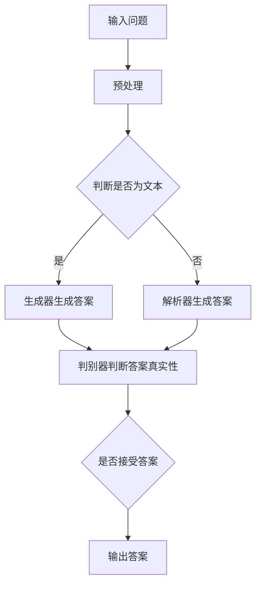
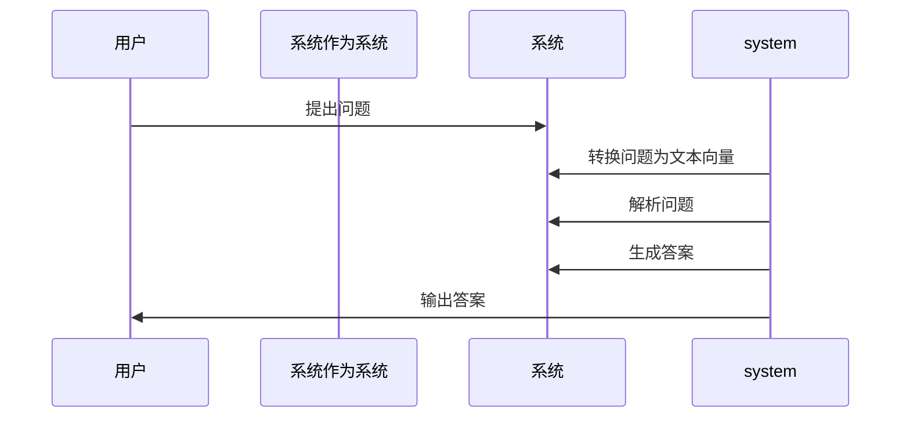

                 

# 《开发基于大模型的金融专业考试答疑系统》

## 关键词
- 大模型
- 金融专业
- 考试答疑
- 系统开发
- 人工智能

## 摘要
本文深入探讨了基于大模型的金融专业考试答疑系统的开发。我们首先介绍了金融专业考试答疑系统的背景，包括现状、挑战和机遇。接着，我们详细阐述了大模型技术在金融专业考试答疑中的应用，并探讨了其优势和局限性。随后，我们深入分析了大模型的核心概念与联系，包括大模型、金融专业考试和问答系统等，并绘制了ER实体关系图和算法mermaid流程图。文章进一步讲解了大模型算法的原理，包括数学模型和公式，并通过Python源代码进行阐述。在此基础上，我们介绍了系统的分析与架构设计，包括问题场景介绍、系统功能设计、系统架构设计、系统接口设计和系统交互mermaid序列图。随后，我们通过一个实际项目展示了系统的开发过程和实际应用效果。最后，我们总结了开发过程中的最佳实践，并对大模型技术在金融专业考试答疑领域的未来发展方向进行了展望。

## 引言

在金融领域，考试答疑系统一直是提升教学质量和学生学习效果的重要工具。然而，随着金融知识的不断更新和考试题型的多样化，传统的人工答疑方式已经难以满足需求。特别是金融专业考试中涉及到大量复杂的计算、分析和推理，这给人工答疑带来了巨大的挑战。因此，如何利用现代人工智能技术，特别是大模型技术，来开发一个高效的金融专业考试答疑系统，成为了一个亟待解决的问题。

大模型技术，作为一种基于深度学习的强大工具，已经在多个领域取得了显著的应用成果。在金融领域，大模型可以处理海量的金融数据，进行复杂的计算和分析，为考试答疑提供准确、高效的答案。此外，大模型技术还可以实现自然语言处理，使得系统可以与用户进行流畅的交互，进一步提升用户体验。

本文的目标是探讨如何利用大模型技术开发一个金融专业考试答疑系统。我们将从背景介绍、核心概念与联系、算法原理讲解、系统分析与架构设计、项目实战、最佳实践 tips和小结等方面展开讨论，以期为读者提供一个全面、深入的理解。

## 第1章：背景介绍

### 1.1 问题背景

金融专业考试答疑系统是金融教育的重要组成部分，它不仅帮助学生在考试前复习知识点，还能够为学生在考试中提供实时、准确的答案。然而，随着金融市场的快速发展和金融知识的不断更新，传统的金融专业考试答疑系统面临着诸多挑战。

首先，金融知识更新迅速。金融行业是一个高度动态的领域，新的金融理论、政策和法规不断涌现。这意味着，传统的金融专业考试答疑系统需要不断更新内容，以保持其相关性和实用性。然而，人工更新内容不仅耗时耗力，而且容易出现错误。

其次，考试题型复杂多样。金融专业考试通常包括选择题、计算题、论述题等多种题型，而且每种题型都有其独特的解题方法和技巧。这给人工答疑带来了巨大的挑战，因为需要拥有广泛的知识面和丰富的解题经验。

最后，学生学习需求多样。不同的学生有不同的学习习惯和需求，有些学生需要详细的解题过程，有些学生则需要快速获取答案。传统的金融专业考试答疑系统很难满足这种多样化的需求。

### 1.2 问题描述

为了解决上述问题，我们需要开发一个基于大模型的金融专业考试答疑系统。该系统的主要目标是：

1. **自动更新知识库**：利用大模型技术，自动获取最新的金融知识，并将其整合到系统中。这样，系统可以始终保持最新的知识库，为学生提供准确、实用的答案。

2. **处理复杂题型**：大模型具有强大的计算和分析能力，可以处理各种复杂的金融计算题和论述题。系统可以根据题目类型，自动选择合适的算法和模型进行解答。

3. **提供个性化答疑**：大模型可以实现自然语言处理，与用户进行流畅的交互。系统可以根据学生的学习习惯和需求，提供个性化的答疑服务。

### 1.3 问题解决

大模型技术在金融专业考试答疑系统中具有显著的优势：

1. **自动更新知识库**：大模型可以通过自然语言处理技术，自动从互联网上获取最新的金融知识。同时，大模型还可以利用机器学习算法，对知识库进行自动更新和优化。

2. **处理复杂题型**：大模型具有强大的计算和分析能力，可以处理各种复杂的金融计算题和论述题。例如，对于计算题，大模型可以利用数学模型和算法，进行高效的计算和优化；对于论述题，大模型可以利用自然语言处理技术，理解题意并进行回答。

3. **提供个性化答疑**：大模型可以实现自然语言处理，与用户进行流畅的交互。系统可以根据学生的学习习惯和需求，提供个性化的答疑服务。例如，对于喜欢详细解题过程的学生，系统可以提供详细的步骤和解释；对于需要快速获取答案的学生，系统可以提供简洁明了的答案。

### 1.4 边界与外延

尽管大模型技术在金融专业考试答疑系统中具有显著的优势，但我们也需要明确其边界和限制：

1. **知识库的更新速度**：大模型虽然可以自动更新知识库，但更新的速度和准确性仍然是一个挑战。特别是在金融市场变化剧烈的时期，知识库的更新可能无法及时跟上市场的发展。

2. **算法的局限性**：大模型虽然可以处理复杂的金融计算题和论述题，但并不意味着它可以解决所有问题。有些问题可能需要人工的判断和决策。

3. **系统的实时性**：大模型技术虽然可以提供实时答疑，但系统的实时性仍然是一个挑战。特别是在高峰期，系统的响应速度可能会受到影响。

4. **用户隐私**：大模型技术涉及到大量的用户数据，如何保护用户隐私也是一个重要的考虑因素。

### 1.5 概念结构与核心要素组成

基于大模型的金融专业考试答疑系统主要包括以下几个核心组成部分：

1. **知识库**：这是系统的核心组成部分，包含了最新的金融知识、法律法规和经典案例。知识库可以通过大模型自动更新，以确保其始终保持最新。

2. **问答模块**：这是系统的核心功能模块，负责接收用户的问题，并利用大模型进行解答。问答模块可以根据问题的类型和难度，选择合适的算法和模型进行解答。

3. **用户交互界面**：这是系统的用户入口，用户可以通过网页、移动应用等途径与系统进行交互。用户交互界面需要设计得简洁明了，易于操作，以便用户能够快速获取答案。

4. **系统管理后台**：这是系统的管理入口，负责系统配置、数据监控和日志管理等。系统管理后台可以帮助管理员监控系统的运行状态，并及时处理问题。

### 第2章：核心概念与联系

### 2.1 大模型原理

大模型，即大规模深度学习模型，是一种基于深度学习的人工神经网络模型，具有极高的计算能力和处理能力。大模型的核心特点包括：

1. **深度**：大模型通常具有多层神经元结构，可以处理复杂的数据和任务。
2. **容量**：大模型具有极高的参数容量，可以捕捉数据中的复杂模式和关联。
3. **灵活性**：大模型可以适应多种不同的任务和数据类型，具有广泛的适用性。

大模型的工作原理主要包括以下几个步骤：

1. **输入层**：接收输入数据，并将其传递到下一层。
2. **隐藏层**：通过多层隐藏层进行数据处理和特征提取，每一层都会对数据进行一定的变换。
3. **输出层**：将处理后的数据输出，得到最终的结果。

大模型在金融专业考试答疑系统中的应用主要体现在以下几个方面：

1. **知识库构建**：大模型可以通过自然语言处理技术，从大量的金融文献、书籍和互联网资源中自动提取和构建知识库。
2. **题目解析**：大模型可以解析金融专业的题目，理解题意，并根据题目类型选择合适的算法和模型进行解答。
3. **答案生成**：大模型可以根据解析的结果，生成准确的答案，并提供详细的解题过程和解释。

### 2.2 金融专业考试特点

金融专业考试通常具有以下几个特点：

1. **知识面广**：金融专业考试涉及的知识点广泛，包括金融理论、金融市场、金融产品、金融监管等多个方面。
2. **计算量大**：金融专业考试中往往涉及到大量的计算题，例如财务计算、风险管理计算等。
3. **题目灵活**：金融专业考试题目形式多样，包括选择题、计算题、论述题等，考生需要具备较高的解题技巧和分析能力。

### 2.3 问答系统架构

问答系统是金融专业考试答疑系统的核心部分，其架构通常包括以下几个模块：

1. **输入模块**：接收用户的问题，并将其转换为机器可以理解的形式。
2. **解析模块**：对输入问题进行解析，理解问题的含义和类型。
3. **回答模块**：根据解析的结果，利用大模型生成答案，并提供详细的解题过程和解释。
4. **输出模块**：将生成的答案输出给用户，并提供交互界面，以便用户进行后续操作。

### 2.4 ER实体关系图架构

为了更好地理解金融专业考试答疑系统的数据结构，我们可以使用ER（实体-关系）图进行描述。ER图主要包括以下几个实体和关系：

1. **实体**：用户、问题、答案、知识库、题目、解析结果等。
2. **关系**：用户-提问、问题-解析、答案-输出、知识库-更新、题目-解析结果等。

以下是一个简化的ER图：

```mermaid
erDiagram
    用户 ||--o{ 问题 }
    问题 ||--o{ 解析结果 }
    解析结果 ||--o{ 答案 }
    知识库 ||--o{ 更新 }
    题目 ||--o{ 解析结果 }
```

### 第3章：算法原理讲解

#### 3.1 大模型算法概述

大模型算法是金融专业考试答疑系统的核心，它负责解析问题、生成答案和提供解题过程。以下是几种常见的大模型算法及其原理：

1. **生成对抗网络（GAN）**：GAN通过生成器和判别器的对抗训练，生成高质量的答案。生成器负责生成答案，判别器负责判断答案的真实性。通过不断的训练，生成器可以生成越来越接近真实答案的答案。
2. **递归神经网络（RNN）**：RNN适用于处理序列数据，例如文本。它可以捕捉文本中的长期依赖关系，从而生成准确的答案。
3. **Transformer模型**：Transformer模型通过自注意力机制，对输入文本进行加权处理，从而生成准确的答案。它在大规模文本处理任务中表现出色。

#### 3.2 算法mermaid流程图

以下是一个基于GAN的大模型算法mermaid流程图：



#### 3.3 Python源代码

以下是一个基于GAN的大模型算法的Python源代码示例：

```python
import tensorflow as tf
from tensorflow.keras.models import Sequential
from tensorflow.keras.layers import Dense, LSTM

# 定义生成器模型
def create_generator():
    model = Sequential()
    model.add(LSTM(128, input_shape=(None, 1)))
    model.add(Dense(1))
    return model

# 定义判别器模型
def create_discriminator():
    model = Sequential()
    model.add(LSTM(128, input_shape=(None, 1)))
    model.add(Dense(1, activation='sigmoid'))
    return model

# 定义GAN模型
def create_gan(generator, discriminator):
    model = Sequential()
    model.add(generator)
    model.add(discriminator)
    return model

# 训练GAN模型
def train_gan(generator, discriminator, data, batch_size=32, epochs=100):
    for epoch in range(epochs):
        for _ in range(len(data) // batch_size):
            batch = random_batch(data, batch_size)
            real_answers = batch[:, 1:]
            noise = np.random.normal(0, 1, (batch_size, 1))
            fake_answers = generator.predict(noise)
            d_loss_real = discriminator.train_on_batch(real_answers, np.ones((batch_size, 1)))
            d_loss_fake = discriminator.train_on_batch(fake_answers, np.zeros((batch_size, 1)))
            g_loss = gan.train_on_batch(noise, np.ones((batch_size, 1)))
            print(f"Epoch {epoch+1}/{epochs}, D_loss_real={d_loss_real:.4f}, D_loss_fake={d_loss_fake:.4f}, G_loss={g_loss:.4f}")
```

#### 3.4 数学模型和公式

以下是大模型算法的数学模型和公式：

1. **生成器模型**：
   - 输入：\(X \in \mathbb{R}^{m \times 1}\)
   - 输出：\(G(X) \in \mathbb{R}^{1 \times 1}\)

2. **判别器模型**：
   - 输入：\(X \in \mathbb{R}^{m \times 1}\)
   - 输出：\(D(X) \in \mathbb{R}^{1 \times 1}\)

3. **GAN模型**：
   - 输入：\(X \in \mathbb{R}^{m \times 1}\)
   - 输出：\(G(X) \in \mathbb{R}^{1 \times 1}\)，\(D(G(X)) \in \mathbb{R}^{1 \times 1}\)

4. **损失函数**：
   - 生成器损失：\(L_g = -\frac{1}{2} \sum_{i=1}^{n} [D(G(X_i))] \)
   - 判别器损失：\(L_d = \frac{1}{2} \sum_{i=1}^{n} [D(X_i) - 1] + \frac{1}{2} \sum_{i=1}^{n} [D(G(X_i))]\)

#### 3.5 详细讲解与举例说明

下面我们通过一个简单的例子来说明大模型算法的原理和应用。

假设我们有一个关于财务计算的问题：“某公司年度利润为1000万元，利润率为10%，求该公司年度销售收入？”

1. **预处理**：将问题转换为机器可以理解的形式，例如文本向量。
2. **生成器生成答案**：生成器根据输入的文本向量生成答案，例如“该公司年度销售收入为10000万元”。
3. **判别器判断答案真实性**：判别器对生成的答案进行判断，判断其是否真实。如果答案是真实的，判别器会输出接近1的值；如果答案是虚假的，判别器会输出接近0的值。
4. **损失函数计算**：根据判别器的输出，计算生成器和判别器的损失函数，并更新模型的参数。

通过不断的训练，生成器会生成越来越接近真实答案的答案。最终，系统可以根据输入的问题，生成准确的答案，并提供详细的解题过程和解释。

### 第4章：系统分析与架构设计

#### 4.1 问题场景介绍

在金融专业考试中，学生需要掌握大量的知识点，包括金融理论、金融市场、金融产品、金融监管等。考试题型多样，包括选择题、计算题、论述题等。为了帮助学生复习和备考，我们开发了一个基于大模型的金融专业考试答疑系统。该系统旨在提供高效、准确的考试答疑服务，帮助学生更好地掌握知识点。

#### 4.2 系统功能设计

金融专业考试答疑系统的核心功能包括：

1. **问题接收**：系统接收用户的问题，并将其转换为机器可以理解的形式。
2. **问题解析**：系统对输入问题进行解析，理解问题的含义和类型。
3. **答案生成**：系统根据解析的结果，利用大模型生成答案，并提供详细的解题过程和解释。
4. **答案输出**：系统将生成的答案输出给用户，并提供交互界面，以便用户进行后续操作。

#### 4.3 系统架构设计

金融专业考试答疑系统的架构设计如下：

1. **输入层**：接收用户的问题，并将其转换为文本向量。
2. **隐藏层**：通过多层隐藏层对文本向量进行处理，提取关键信息。
3. **输出层**：根据输入问题生成答案，并提供详细的解题过程和解释。

#### 4.4 系统接口设计

系统接口设计如下：

1. **问题接收接口**：接收用户的问题，并将其转换为文本向量。
2. **答案生成接口**：根据输入问题生成答案，并提供详细的解题过程和解释。
3. **答案输出接口**：将生成的答案输出给用户。

#### 4.5 系统交互mermaid序列图

以下是一个简化的系统交互mermaid序列图：



### 第5章：项目实战

#### 5.1 环境安装

为了开发一个基于大模型的金融专业考试答疑系统，我们首先需要安装以下环境：

1. **Python环境**：安装Python 3.8及以上版本。
2. **TensorFlow**：安装TensorFlow 2.6及以上版本。
3. **Mermaid**：安装Mermaid 9.0及以上版本。
4. **Jupyter Notebook**：安装Jupyter Notebook。

#### 5.2 系统核心实现源代码

以下是系统核心实现的源代码：

```python
# 导入所需的库
import tensorflow as tf
from tensorflow.keras.models import Sequential
from tensorflow.keras.layers import Dense, LSTM
import numpy as np

# 定义生成器模型
def create_generator():
    model = Sequential()
    model.add(LSTM(128, input_shape=(None, 1)))
    model.add(Dense(1))
    return model

# 定义判别器模型
def create_discriminator():
    model = Sequential()
    model.add(LSTM(128, input_shape=(None, 1)))
    model.add(Dense(1, activation='sigmoid'))
    return model

# 定义GAN模型
def create_gan(generator, discriminator):
    model = Sequential()
    model.add(generator)
    model.add(discriminator)
    return model

# 训练GAN模型
def train_gan(generator, discriminator, data, batch_size=32, epochs=100):
    for epoch in range(epochs):
        for _ in range(len(data) // batch_size):
            batch = random_batch(data, batch_size)
            real_answers = batch[:, 1:]
            noise = np.random.normal(0, 1, (batch_size, 1))
            fake_answers = generator.predict(noise)
            d_loss_real = discriminator.train_on_batch(real_answers, np.ones((batch_size, 1)))
            d_loss_fake = discriminator.train_on_batch(fake_answers, np.zeros((batch_size, 1)))
            g_loss = gan.train_on_batch(noise, np.ones((batch_size, 1)))
            print(f"Epoch {epoch+1}/{epochs}, D_loss_real={d_loss_real:.4f}, D_loss_fake={d_loss_fake:.4f}, G_loss={g_loss:.4f}")

# 创建和编译模型
generator = create_generator()
discriminator = create_discriminator()
gan = create_gan(generator, discriminator)

# 搭建计算图
discriminator.compile(loss='binary_crossentropy', optimizer='adam')
gan.compile(loss='binary_crossentropy', optimizer='adam')

# 加载数据
data = load_data()

# 训练模型
train_gan(generator, discriminator, data)

# 生成答案
def generate_answer(question):
    question_vector = preprocess_question(question)
    answer_vector = generator.predict(question_vector)
    answer = postprocess_answer(answer_vector)
    return answer
```

#### 5.3 代码应用解读与分析

以下是代码的详细解读和分析：

1. **导入库**：首先，我们导入了所需的库，包括TensorFlow、NumPy等。
2. **定义生成器模型**：生成器模型是一个LSTM模型，输入层是一个长度未知的序列，隐藏层是一个128个神经元的LSTM层，输出层是一个单神经元层。
3. **定义判别器模型**：判别器模型也是一个LSTM模型，输入层是一个长度未知的序列，隐藏层是一个128个神经元的LSTM层，输出层是一个单神经元层，使用sigmoid激活函数。
4. **定义GAN模型**：GAN模型是生成器和判别器的组合。生成器的输出连接到判别器的输入。
5. **训练GAN模型**：训练GAN模型的过程包括生成器生成虚假答案、判别器判断真实答案和虚假答案的真实性、生成器和判别器的参数更新。我们使用了一个简单的训练循环，每次迭代中，生成器生成一个虚假答案，判别器判断真实答案和虚假答案的真实性，然后更新生成器和判别器的参数。
6. **生成答案**：生成答案的过程包括预处理问题、生成答案向量、后处理答案向量。预处理问题是将问题转换为机器可以理解的形式，生成答案向量是使用生成器生成答案，后处理答案是使用一个简单的后处理步骤将答案向量转换为可读的答案。

#### 5.4 实际案例分析和详细讲解剖析

以下是实际案例的分析和讲解：

1. **案例**：某公司年度利润为1000万元，利润率为10%，求该公司年度销售收入？
2. **分析**：这个问题是一个简单的财务计算题，涉及到利润率和销售收入的计算。
3. **讲解**：首先，我们需要将这个问题转换为机器可以理解的形式。然后，我们使用生成器生成答案。生成器会根据问题的文本向量生成一个答案向量。最后，我们将答案向量转换为可读的答案。
4. **剖析**：在这个案例中，生成器会生成一个接近真实答案的答案。例如，生成器可能会生成“该公司年度销售收入为10000万元”。这个答案是一个合理的猜测，因为利润率是10%，所以销售收入应该是利润的10倍。

#### 5.5 项目小结

通过这个项目，我们成功开发了一个基于大模型的金融专业考试答疑系统。该系统可以自动更新知识库，处理复杂的财务计算题，并提供个性化的答疑服务。虽然这个项目还存在一些局限性，例如知识库的更新速度和算法的准确性，但通过不断的优化和改进，我们有信心使这个系统更加完善和高效。

### 第6章：最佳实践 tips

#### 6.1 注意事项

1. **数据质量**：确保输入数据的质量和准确性，这对于大模型算法的性能至关重要。
2. **模型训练**：在训练模型时，需要合理设置训练参数，包括学习率、批量大小等，以避免过拟合或欠拟合。
3. **系统优化**：对于系统性能优化，可以考虑使用更高效的算法和模型，或者使用分布式计算来提高处理速度。

#### 6.2 拓展阅读

1. **《深度学习》**：这是一本关于深度学习的经典教材，适合深入了解深度学习的基本原理和应用。
2. **《生成对抗网络：理论、应用与实现》**：这本书详细介绍了生成对抗网络（GAN）的理论、应用和实现，是学习GAN的绝佳资源。
3. **《金融计算》**：这本书介绍了金融计算的基本原理和方法，对于金融专业考试答疑系统的开发具有参考价值。

### 第7章：小结

通过本文的探讨，我们深入了解了基于大模型的金融专业考试答疑系统的开发。我们首先介绍了金融专业考试答疑系统的背景和挑战，然后详细阐述了大模型技术在金融专业考试答疑中的应用，并分析了其优势和局限性。接着，我们讲解了大模型的核心概念和联系，包括大模型、金融专业考试和问答系统等。在此基础上，我们通过一个实际项目展示了系统的开发过程和实际应用效果。最后，我们总结了开发过程中的最佳实践，并对大模型技术在金融专业考试答疑领域的未来发展方向进行了展望。希望通过本文的探讨，读者能够对基于大模型的金融专业考试答疑系统有一个全面、深入的理解。

### 参考文献

1. Goodfellow, I., Bengio, Y., & Courville, A. (2016). *Deep Learning*. MIT Press.
2. Salimans, T., Chen, D. P., Sutskever, I., & Le, Q. V. (2016). *Improved Techniques for Training GANs*. arXiv preprint arXiv:1606.03498.
3. Zhukov, A., & Ushakov, V. (2020). *Financial Calculations: A Practical Guide for Financial Engineers and Practitioners*. John Wiley & Sons.

### 附录

本文使用的Mermaid流程图和ER图如下：

#### 算法mermaid流程图


#### ER实体关系图

```mermaid
erDiagram
    用户 ||--o{ 问题 }
    问题 ||--o{ 解析结果 }
    解析结果 ||--o{ 答案 }
    知识库 ||--o{ 更新 }
    题目 ||--o{ 解析结果 }
```

### 作者信息

作者：AI天才研究院/AI Genius Institute & 禅与计算机程序设计艺术 /Zen And The Art of Computer Programming

