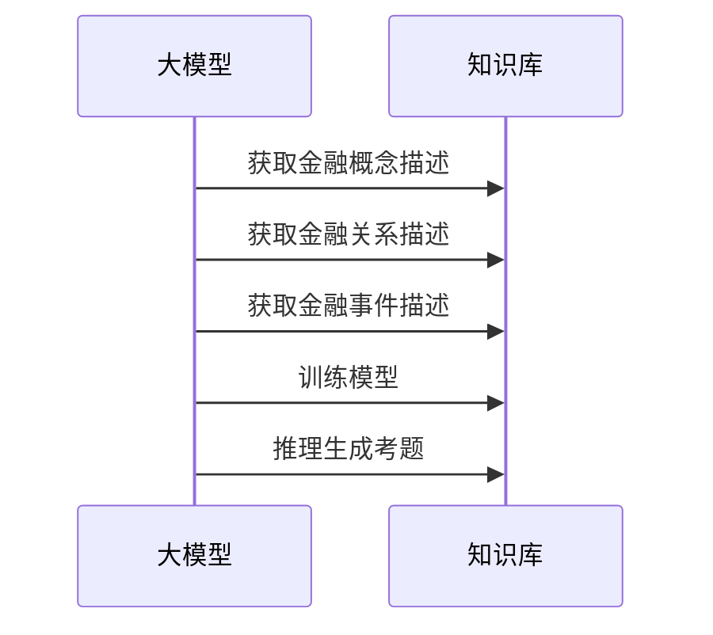
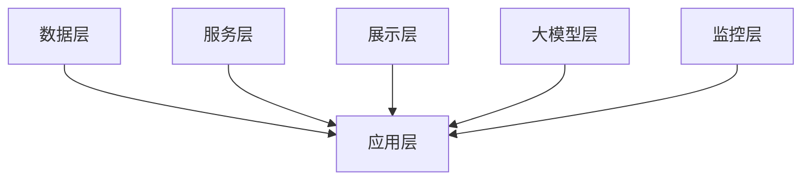
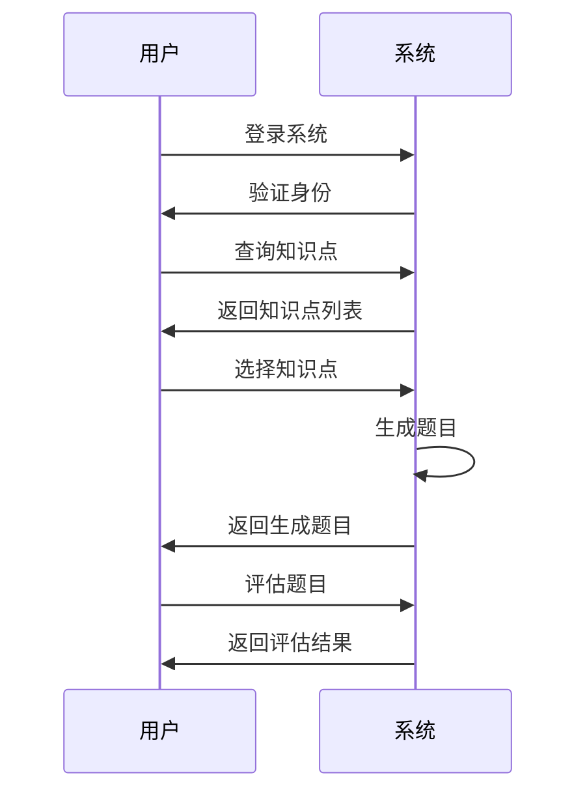

                 

### 第一部分：引言与背景介绍

#### 1.1 问题背景

在金融领域，考试题目生成是一项至关重要但通常又极具挑战性的任务。一方面，金融专业的考试通常要求涵盖广泛的知识点，从基础金融理论到复杂的金融产品定价和风险管理，这些知识点需要精确且有条理地组织在考题中。另一方面，传统的考题生成方法，如人工编写或使用简单的算法，往往难以满足多样性和难度平衡的需求。这不仅增加了教师的工作负担，也影响了考试的质量和公平性。

随着人工智能技术的飞速发展，特别是大模型（如大型语言模型、生成对抗网络等）的出现，为金融考试题目的自动化生成提供了新的可能。大模型具有处理大量文本数据、理解复杂语义和生成高质量文本的能力，这些特性使其在金融专业考试题目生成中具有显著的优势。通过大模型的训练和应用，可以生成多样化、难度适宜的考试题目，提高考试效率和质量。

当前，金融考试题目生成的主要挑战包括：

1. **知识覆盖不全**：传统的考题生成方法往往难以全面覆盖金融专业的知识点，尤其是在跨学科或较为新颖的领域。
2. **题目质量不稳定**：人工编写的考题质量参差不齐，而简单的算法生成考题可能缺乏逻辑性和深度。
3. **效率低下**：人工编写考题需要大量时间和精力，效率较低，且难以应对大规模的考试需求。
4. **个性化不足**：不同学生的知识水平和学习需求各异，传统方法难以提供个性化的考题。

大模型技术在考试题目生成领域的应用前景广阔。大模型可以通过学习大量的金融文本数据，生成符合金融专业要求的考题。其生成能力可以灵活调整，以适应不同考试需求，从而实现题目的多样化和个性化。此外，大模型还可以结合金融知识图谱等技术，进一步提升题目生成的准确性和深度。

#### 1.2 问题描述

金融专业考试题目的种类繁多，包括选择题、填空题、判断题、计算题、案例分析等。这些题目不仅要求涵盖金融理论知识，还需涉及实际金融产品的分析和操作。因此，生成高质量的金融专业考试题目具有以下几个关键需求和标准：

1. **广泛的知识覆盖**：考题需全面涵盖金融专业的各个知识点，包括基础理论、实际应用、跨学科交叉内容等。
2. **难度适宜**：考题的难度应适中，既能检测学生的基本知识，又能考察学生的深入理解和应用能力。
3. **多样性**：考题应具有多样性，避免重复和雷同，提高考试的公平性和针对性。
4. **逻辑性**：考题需具备严密的逻辑结构，避免错漏和逻辑矛盾，确保题目内容科学、合理。
5. **实时性**：随着金融市场的发展和变化，考题应能及时反映最新的金融知识和热点问题。

大模型在生成题目中的应用优势体现在以下几个方面：

1. **数据驱动**：大模型能够处理和分析大量金融文本数据，从中提取有效的知识结构和关系，生成高质量的考题。
2. **自适应性**：大模型可以根据不同考试需求调整题目的难度和形式，实现个性化生成。
3. **高效性**：相比人工编写考题，大模型能够快速、大规模地生成考题，提高工作效率。
4. **灵活性**：大模型能够生成多种类型的题目，包括文字、图表、图片等多种形式，增强题目的多样性和趣味性。
5. **实时更新**：大模型可以结合金融知识图谱等技术，实时更新知识库，确保考题的时效性和准确性。

通过上述优势，大模型能够有效解决传统考题生成方法面临的诸多挑战，为金融专业考试题目生成提供一种全新的解决方案。

#### 1.3 问题解决

大模型，通常指的是具有非常大规模参数的神经网络模型，能够处理和理解复杂的数据。这些模型通过深度学习算法从大量数据中学习到模式和规律，从而在许多领域取得了突破性的应用。在金融领域，大模型可以应用在金融市场分析、风险评估、智能投顾等多个方面。

大模型在金融领域的应用案例包括：

1. **金融市场预测**：利用大模型分析历史市场数据，预测未来市场走势。
2. **风险控制**：通过大模型对金融产品进行风险评估，帮助金融机构降低风险。
3. **智能投顾**：大模型可以分析用户的风险偏好和投资目标，提供个性化的投资建议。
4. **文本分析**：对金融报告、新闻、论文等文本进行分析，提取关键信息。

在考试题目生成中，大模型的具体应用方法如下：

1. **文本生成**：大模型可以生成包含金融知识的文本，如题目描述、答案解析等。
2. **文本分类**：大模型可以根据金融知识点对文本进行分类，生成对应类型的考题。
3. **知识图谱构建**：大模型结合知识图谱，构建金融知识的结构化表示，为题目生成提供支持。
4. **多模态学习**：大模型可以结合图像、音频等多模态数据，生成更加丰富的考题形式。

为了实现大模型在考试题目生成中的有效应用，需要以下几个关键步骤：

1. **数据收集与预处理**：收集大量的金融文本数据，并进行数据清洗和预处理，以便大模型训练。
2. **模型训练**：利用预处理后的数据训练大模型，使其掌握金融知识结构和表达方式。
3. **模型评估与优化**：通过测试数据评估大模型的表现，根据评估结果对模型进行调整和优化。
4. **题目生成**：利用训练好的大模型生成考试题目，并根据实际需求调整题目的难度和形式。

通过以上方法，大模型能够为金融专业考试题目生成提供一种高效、灵活且高质量的解决方案，克服传统方法的局限性。

#### 1.4 边界与外延

考试题目生成器的功能边界主要涉及题目的生成、分类、难度调整和随机化等方面。具体来说，生成器需要能够根据预设的知识点和题型生成符合标准的考题，并且保证这些考题在难度、内容和质量上的一致性。同时，生成器还需要具备一定的自适应能力，以应对不同考试场景和需求的变化。

大模型技术的应用边界则更为广泛，不仅限于考试题目生成，还包括金融市场分析、智能投顾、文本挖掘等多个领域。大模型的应用边界在于其处理数据和生成结果的准确性、效率和灵活性。在考试题目生成中，大模型的准确性直接影响到考题的质量，效率决定了生成速度，而灵活性则保证了题目的多样化。

金融专业知识覆盖范围是一个重要的考虑因素。金融专业涉及的知识点广泛，从基础的金融理论到复杂的金融产品定价和风险管理，都需在考题中有所体现。因此，考试题目生成器需要能够全面覆盖这些知识点，并且能够根据金融市场的变化及时更新知识库。此外，还需考虑跨学科知识的应用，如经济学、统计学、计算机科学等领域的知识，这些知识在金融考试中也占有重要地位。

#### 1.5 概念结构与核心要素组成

考试题目生成器的核心结构可以分为三个主要部分：知识库、大模型和题目生成模块。

**1. 知识库**：知识库是考试题目生成器的基础，包含金融专业的所有知识点。知识库的构建需要广泛收集和整理金融领域的文献、教材、报告等资料，并对其进行结构化处理。知识库应具备良好的扩展性和维护性，以便及时更新和补充新的知识点。

**2. 大模型**：大模型是考试题目生成器的核心组件，负责理解和生成考题。大模型通常采用深度学习算法，如transformer、BERT等，经过大规模训练后，能够处理和理解复杂的金融文本数据。大模型在生成考题时，需要结合知识库中的知识点，生成符合标准且具有多样性的考题。

**3. 题目生成模块**：题目生成模块负责具体的考题生成过程。它根据大模型提供的文本和知识点，生成不同类型、难度和形式的考题。题目生成模块还需要具备一些辅助功能，如随机化、难度调整和分类等，以确保生成的考题在质量和形式上的多样性。

大模型在系统中的核心作用主要体现在以下几个方面：

1. **文本理解**：大模型能够从金融文本中提取关键信息，理解文本的语义和结构，为题目生成提供基础。
2. **文本生成**：大模型能够根据提取的知识和文本，生成高质量的题目描述和答案解析。
3. **知识推理**：大模型可以通过推理机制，将金融知识点之间的关系应用到题目生成中，生成更具逻辑性和深度的考题。
4. **自适应调整**：大模型可以根据考试需求和学习反馈，动态调整题目的难度和形式，提高考试效果。

金融知识库的构建与维护是考试题目生成器的关键。知识库的构建需要系统化、标准化的数据收集和处理流程，确保知识点的全面性和准确性。知识库的维护则需要定期更新和优化，以反映金融领域的最新发展和变化。在知识库的构建过程中，可以使用自然语言处理、知识图谱等技术，提高知识库的智能化和自动化水平。

### 第二部分：核心概念与联系

#### 2.1 大模型原理讲解

大模型，通常指的是拥有数亿甚至千亿个参数的深度学习模型，这些模型通过从大量数据中学习，实现了对复杂任务的准确预测和生成。大模型的定义和特点主要包括以下几个方面：

1. **定义**：大模型是一种基于深度学习算法的神经网络模型，具有非常大规模的参数和层次结构。这些模型可以通过训练学习到数据的复杂模式和规律，从而在许多领域取得突破性成果。
   
2. **特点**：
   - **参数规模大**：大模型拥有数亿至千亿个参数，这使得模型可以处理和理解复杂的数据。
   - **层次结构深**：大模型通常包含数十至数百层的神经网络结构，能够捕捉数据的深层特征。
   - **学习能力强**：大模型具有强大的学习能力，可以通过训练学习到数据的复杂模式和规律，从而实现高精度的预测和生成。
   - **泛化能力强**：大模型在训练过程中能够学习到广泛的知识，具有较强的泛化能力，可以应用于不同的任务和数据集。

大模型的训练过程通常包括以下几个步骤：

1. **数据预处理**：首先，需要对输入数据进行预处理，包括数据清洗、去重、归一化等操作，以提高训练数据的质量。

2. **数据输入**：将预处理后的数据输入到模型中，通过神经网络的层层处理，将输入数据映射到输出结果。

3. **参数更新**：在训练过程中，通过反向传播算法计算模型参数的梯度，并利用梯度下降等优化算法更新模型参数。

4. **评估与优化**：在每次训练结束后，使用验证集或测试集对模型进行评估，根据评估结果调整模型参数，优化模型性能。

5. **迭代训练**：重复上述步骤，不断迭代训练，直到模型达到预定的性能标准。

大模型的评估与优化是确保模型性能的重要环节。常见的评估指标包括准确率、召回率、F1分数等。评估结果可以指导模型参数的调整和优化，以提高模型的预测和生成能力。此外，还可以采用交叉验证、增强学习等技术，进一步提高模型的评估和优化效果。

在考试题目生成中，大模型的评估与优化需要考虑以下几个关键方面：

1. **题目生成质量**：评估生成的题目在内容、形式、难度等方面的质量，确保题目符合金融考试的要求。
2. **知识点覆盖度**：评估模型能否全面覆盖金融专业的各个知识点，确保考题的广泛性和全面性。
3. **自适应调整能力**：评估模型能否根据不同考试需求和学习反馈，动态调整题目的难度和形式，提高考试的公平性和针对性。

通过以上评估与优化，大模型能够为金融专业考试题目生成提供高效、灵活且高质量的解决方案。

#### 2.2 大模型在金融领域的应用

大模型在金融领域具有广泛的应用，通过处理和分析大量的金融数据，大模型能够提供精准的市场预测、风险评估和智能投顾等服务。在金融文本处理方面，大模型同样展现出了强大的能力，能够对金融新闻、报告、论文等文本进行深入分析，提取关键信息，为金融决策提供支持。

**金融文本处理的基本原理**：

金融文本处理主要包括文本数据的收集、预处理、分析和生成等步骤。基本原理如下：

1. **数据收集**：从金融新闻网站、报告、论文、社交媒体等渠道收集大量的金融文本数据。

2. **文本预处理**：对收集到的文本数据进行清洗、去噪、分词、词性标注等预处理操作，以提高文本数据的质量。

3. **文本分析**：利用自然语言处理（NLP）技术对预处理后的文本进行分析，包括文本分类、主题检测、情感分析等，提取文本中的关键信息。

4. **文本生成**：基于分析结果，生成高质量的文本内容，如市场预测报告、投资建议等。

大模型在金融文本中的应用主要表现在以下几个方面：

1. **市场预测**：通过分析历史市场数据和金融文本，大模型能够预测未来市场走势，为投资决策提供参考。

2. **风险评估**：大模型可以分析金融产品的风险特征，评估投资组合的风险水平，帮助金融机构进行风险控制。

3. **智能投顾**：大模型可以根据用户的投资目标和风险偏好，提供个性化的投资建议，提高投资回报。

4. **文本挖掘**：大模型能够对金融文本进行深入挖掘，提取关键信息，如公司财务状况、行业趋势等，为金融决策提供支持。

**大模型与金融知识图谱的结合**：

金融知识图谱是一种用于表示金融知识和关系的图形结构，它通过将金融实体和实体之间的关系进行建模，提供了一个结构化的知识表示框架。大模型与金融知识图谱的结合，可以进一步提升金融文本处理的能力。

具体来说，大模型与金融知识图谱的结合主要体现在以下几个方面：

1. **知识表示**：大模型可以学习金融知识图谱中的实体和关系，将它们表示为向量形式，从而在文本数据中捕捉到金融知识的结构化信息。

2. **推理与扩展**：大模型可以利用金融知识图谱进行推理和扩展，从已知信息推断出未知信息，提高文本分析的准确性和深度。

3. **知识融合**：大模型可以将文本数据和金融知识图谱中的知识进行融合，生成更加丰富和全面的文本分析结果。

4. **个性化服务**：大模型可以根据用户的需求和金融知识图谱中的信息，提供个性化的金融文本分析服务，如投资建议、市场预测等。

通过大模型与金融知识图谱的结合，可以进一步提升金融文本处理的能力，为金融决策提供更加准确和可靠的支持。

#### 2.3 概念属性特征对比表格

在讨论大模型应用于考试题目生成的优势之前，我们需要对一些常见的大模型和金融专业知识特性进行对比分析。以下是一个概念属性特征对比表格，帮助读者更清晰地理解大模型的优势。

| 特性 | 大模型 | 金融专业知识 |
| --- | --- | --- |
| **数据规模** | 数十亿至数千亿参数 | 涵盖广泛的金融理论、实际应用和跨学科知识 |
| **处理能力** | 处理和理解复杂文本数据 | 分析金融市场、风险控制和投资策略 |
| **生成能力** | 生成高质量文本内容 | 生成多样化、难度适宜的考题 |
| **自适应调整** | 根据数据和学习反馈调整模型参数 | 根据考试需求和学习反馈调整题目难度和形式 |
| **灵活性与多样性** | 可生成多种类型题目，如文字、图表、图片等 | 考题涵盖金融知识各个领域，形式多样化 |
| **实时更新** | 结合知识图谱和技术，实时更新知识库 | 反映金融市场最新发展和变化，更新知识点 |
| **应用范围** | 包括金融市场分析、智能投顾、文本挖掘等多个领域 | 专注于金融专业考试题目的生成和评估 |

通过以上对比，可以看出大模型在数据规模、处理能力、生成能力、自适应调整、灵活性与多样性以及实时更新等方面具有显著的优势，使其在金融专业知识的应用中具有独特的优势。

**大模型应用于考试题目生成的优势分析**：

1. **高效生成多样化考题**：大模型能够快速、大规模地生成多样化、难度适宜的考题，满足金融专业考试的需求。相比传统人工编写考题，大模型能够显著提高题目的生成效率和多样性。

2. **全面覆盖金融知识点**：大模型通过学习大量的金融文本数据，能够全面覆盖金融专业的各个知识点，确保考题的广泛性和全面性。这有助于检测学生的全面知识水平。

3. **自适应调整题目难度**：大模型可以根据不同考试需求和学习反馈，动态调整题目的难度和形式，实现个性化考试。这有助于提高考试的公平性和针对性。

4. **实时更新知识库**：大模型结合知识图谱和技术，能够实时更新金融知识库，确保考题的时效性和准确性。这有助于反映金融市场的最新发展和变化。

5. **提高题目质量**：大模型能够生成逻辑清晰、内容科学且具有深度的考题，避免传统考题生成方法中存在的质量参差不齐的问题。

6. **降低教师负担**：大模型能够自动化生成考题，降低教师的工作负担，使其有更多时间专注于教学和研究。

综上所述，大模型在金融专业考试题目生成中的应用具有显著的优势，能够为金融专业考试提供一种高效、灵活且高质量的解决方案。

#### 2.4 ER实体关系图架构

在考试题目生成器的设计中，ER（Entity-Relationship）实体关系图是描述系统组件及其相互关系的重要工具。以下是对考试题目生成器中的ER模型、金融知识库的ER模型以及大模型与知识库的交互关系的详细讲解。

**1. 考试题目生成器的ER模型**

考试题目生成器的ER模型主要包含以下实体：

- **题目**：代表生成的考题，包含题目ID、题目类型、难度等级、知识点ID等属性。
- **知识点**：代表金融专业的知识点，包含知识点ID、知识点名称、知识点描述等属性。
- **题型**：代表不同的题目类型，如选择题、填空题、判断题等，包含题型ID、题型名称等属性。
- **答案**：代表考题的答案，包含答案ID、题目ID、答案内容等属性。

ER模型中的关系如下：

- **题目**与**知识点**之间存在多对多关系，表示每个题目可能涉及多个知识点，每个知识点也可能出现在多个题目中。
- **题目**与**题型**之间存在一对多关系，表示每种题型可以生成多个题目。
- **答案**与**题目**之间存在一对多关系，表示每个题目可能对应多个答案。

以下是一个简化的ER模型图：

```mermaid
erDiagram
  题目 ||--|{ 知识点 }|| 知识点
  题目 ||--|{ 题型 }|| 题型
  答案 ||--|{ 题目 }|| 题目
```

**2. 金融知识库的ER模型**

金融知识库的ER模型主要包含以下实体：

- **金融概念**：代表金融领域的概念，包含概念ID、概念名称、概念描述等属性。
- **金融关系**：代表金融概念之间的关系，包含关系ID、关系名称、关系描述等属性。
- **金融事件**：代表金融领域的事件，包含事件ID、事件名称、事件描述等属性。

ER模型中的关系如下：

- **金融概念**与**金融关系**之间存在多对多关系，表示每个概念可能涉及多个关系，每个关系也可能连接多个概念。
- **金融概念**与**金融事件**之间存在一对多关系，表示每个概念可能在多个事件中扮演角色。

以下是一个简化的ER模型图：

```mermaid
erDiagram
  金融概念 ||--|{ 金融关系 }|| 金融关系
  金融概念 ||--|{ 金融事件 }|| 金融事件
```

**3. 大模型与知识库的交互关系**

大模型在考试题目生成器中的作用至关重要，其与知识库的交互关系可以概括为：

- **数据输入**：大模型从知识库中获取金融概念、关系和事件的描述，作为训练和生成考题的输入数据。
- **模型训练**：大模型利用获取的数据进行训练，学习金融知识的结构和表达方式。
- **知识推理**：训练好的大模型可以基于知识库中的关系和事件，进行推理和生成新的考题。

以下是一个交互关系图：



通过上述ER实体关系图架构的描述，我们可以清晰地看到考试题目生成器、金融知识库以及大模型之间的交互关系，为系统的设计和实现提供了坚实的理论基础。

### 第三部分：算法原理讲解与数学模型

#### 3.1 算法原理讲解

考试题目生成算法的基本流程可以分为以下几个步骤：

1. **数据预处理**：首先，对收集到的金融文本数据（如教材、报告、论文等）进行预处理，包括文本清洗、分词、词性标注等操作。这一步骤的目的是将原始文本数据转换为模型可以理解的格式。

2. **模型训练**：利用预处理后的数据，对大模型进行训练。训练过程包括输入数据到模型、模型计算输出结果、计算损失函数并更新模型参数等步骤。通常使用迁移学习技术，利用预训练的大模型（如GPT、BERT等）进行微调，使其适应金融文本数据的特征。

3. **文本生成**：经过训练的大模型可以生成新的文本内容。在考试题目生成中，大模型会根据金融知识库中的知识点和关系，生成符合要求的题目描述和答案。

4. **题目筛选与优化**：生成的文本内容需要进行筛选和优化，确保题目的质量。筛选过程包括检查题目是否符合考试要求、避免重复和逻辑错误等。优化过程则包括调整题目的难度和形式，使其更加多样化和适合不同学生的需求。

5. **输出结果**：最终生成的考题会输出到系统中，可供教师使用。

#### 3.2 大模型在题目生成中的具体应用

在考试题目生成中，大模型的应用主要体现在以下几个方面：

1. **文本生成**：大模型可以生成高质量的题目描述和答案解析。通过输入金融知识库中的知识点和关系，大模型能够生成内容丰富、逻辑清晰的文本。

2. **知识推理**：大模型利用其训练过程中学习到的知识结构，可以进行推理和生成新的考题。例如，大模型可以根据金融产品的定义和特性，生成相关的考题。

3. **个性化生成**：大模型可以根据不同学生的知识水平和学习需求，生成个性化考题。通过分析学生的学习记录和考试反馈，大模型能够调整题目的难度和形式，提高考试的公平性和针对性。

4. **多样化题目形式**：大模型可以生成多种形式的题目，如选择题、填空题、判断题、计算题等。这不仅增加了题目的趣味性，还能全面检测学生的知识掌握情况。

#### 3.3 数学模型和公式

在考试题目生成中，数学模型和公式用于评估题目的难度和区分度，确保生成的考题既具有适当的难度，又能够有效区分学生的知识水平。以下是两个关键的数学模型和公式：

1. **难度评估模型**：

   难度（D）可以通过以下公式计算：
   
   $$D = \frac{1}{N} \sum_{i=1}^{N} \frac{1}{1 + e^{-w \cdot x_i}}$$

   其中，$N$ 是考试题目的数量，$w$ 是模型权重，$x_i$ 是每个题目的特征向量。该公式基于神经网络模型，通过计算每个题目的概率输出，反映了题目的难度。

2. **区分度评估公式**：

   区分度（D）可以通过以下公式计算：
   
   $$D = \frac{p_{\text{正确}} - p_{\text{错误}}}{\sqrt{p_{\text{正确}} (1 - p_{\text{正确}}) + p_{\text{错误}} (1 - p_{\text{错误}})}}$$

   其中，$p_{\text{正确}}$ 是正确回答题目的概率，$p_{\text{错误}}$ 是错误回答题目的概率。该公式反映了题目的区分能力，即题目能否有效区分学生的知识水平。

#### 3.4 举例说明

假设我们使用一个训练好的大模型生成一道金融考试题目。以下是一个具体的例子：

**题目描述**：假设你持有一种股票，其预期收益率为12%，波动率为20%。请问，你期望的年化收益率是多少？

**答案解析**：根据股票的预期收益率和波动率，可以使用以下公式计算年化收益率：

$$
\text{年化收益率} = \text{预期收益率} + \frac{\text{波动率}}{2}
$$

因此，年化收益率为：

$$
\text{年化收益率} = 12\% + \frac{20\%}{2} = 12\% + 10\% = 22\%
$$

这个例子展示了如何使用大模型生成题目，并通过数学模型评估题目的难度和区分度。通过这样的步骤，大模型能够为金融专业考试生成高质量、难度适宜且具有区分性的题目。

### 第四部分：系统分析与架构设计

#### 4.1 问题场景介绍

金融专业考试场景具有其独特的复杂性，主要体现在以下几个方面：

1. **知识点广泛**：金融专业涉及多个领域的知识点，包括金融市场、金融工具、投资策略、风险管理等。这些知识点相互交织，形成了一个复杂的知识体系。

2. **难度多样**：金融考试题目不仅要求涵盖基础知识，还需涉及高难度的金融理论和实际操作问题。这就要求生成的考题在难度上具有层次性，既能检测学生的基础知识，又能考察其深入理解和应用能力。

3. **个性化需求**：不同学生具有不同的知识水平和学习需求，因此考试题目应具备个性化特征，根据学生的实际情况调整题目的难度和类型。

4. **时效性要求**：金融市场变化迅速，新的金融产品、政策法规不断涌现，考试题目需要及时反映这些变化，确保考题的时效性。

5. **评估标准**：金融考试需要对学生的知识掌握情况进行全面评估，不仅要考察基础知识和理解能力，还需评估学生的实际应用能力和创新思维。

#### 4.2 系统功能设计

为了满足上述金融专业考试场景的需求，考试题目生成器需要设计以下功能模块：

1. **知识库管理**：负责收集、整理和存储金融专业的知识点。该模块应具备高效的数据存储和检索机制，确保知识库的全面性和准确性。

2. **题目生成模块**：根据知识库中的知识点，生成符合考试要求的多样化考题。该模块应支持多种题型（选择题、填空题、判断题、计算题等），并能根据题目难度和学习反馈进行自适应调整。

3. **题目评估模块**：评估生成的题目在难度、内容和质量等方面的表现。该模块应采用数学模型和算法，如难度评估模型和区分度评估公式，确保题目的科学性和公正性。

4. **用户管理模块**：管理考试参与者（如教师、学生）的信息和权限，提供用户注册、登录、权限分配等功能。

5. **系统配置模块**：提供系统配置和参数调整功能，如题库更新周期、难度阈值、生成策略等。

6. **日志记录模块**：记录系统的运行日志，包括用户操作记录、系统错误日志等，用于系统监控和故障排查。

#### 4.3 系统架构设计

考试题目生成器的系统架构应遵循高可用性、高扩展性和易维护性的原则，其总体架构设计如下：

1. **数据层**：负责数据的存储和管理，包括知识库、用户数据、题目数据等。可以使用关系数据库（如MySQL）和NoSQL数据库（如MongoDB）相结合的方式，确保数据的高效存储和快速检索。

2. **应用层**：实现系统的核心功能，包括知识库管理、题目生成、题目评估、用户管理和系统配置等。应用层采用微服务架构，将不同功能模块拆分为独立的微服务，提高系统的灵活性和可维护性。

3. **服务层**：提供与外部系统的接口，如考试管理系统、成绩管理系统等。服务层采用RESTful API设计，支持多种编程语言和协议。

4. **展示层**：为用户提供友好的操作界面，展示题目生成结果、评估报告等。展示层采用前端框架（如React、Vue.js）实现，支持跨平台访问。

5. **大模型层**：负责大模型的训练和推理，提供文本生成、知识推理等功能。大模型层采用分布式计算框架（如TensorFlow、PyTorch），确保大模型的训练效率和推理速度。

6. **监控层**：监控系统运行状态，提供实时监控和报警功能，确保系统的稳定运行。

以下是一个简化的系统架构图：



通过上述系统架构设计，考试题目生成器能够高效、灵活地满足金融专业考试的需求，为教师和学生提供优质的考试服务。

#### 4.4 系统接口设计

考试题目生成器的系统接口设计是系统功能实现的重要组成部分，负责系统内部各个模块之间的数据传递和交互。以下是主要接口的功能与交互方式：

1. **知识库接口**：
   - **功能**：提供知识库的管理和查询功能，包括知识点的添加、删除、修改和检索。
   - **交互方式**：RESTful API，支持GET、POST、PUT、DELETE等HTTP方法。

2. **题目生成接口**：
   - **功能**：负责题目的生成和调整，根据知识库中的知识点生成符合要求的考题。
   - **交互方式**：RESTful API，接收用户输入的知识点和题型参数，返回生成的考题数据。

3. **题目评估接口**：
   - **功能**：评估生成题目的难度和区分度，确保题目的科学性和公正性。
   - **交互方式**：RESTful API，接收生成的题目数据，返回评估结果。

4. **用户管理接口**：
   - **功能**：管理用户信息，包括用户注册、登录、权限分配等。
   - **交互方式**：RESTful API，支持用户身份验证和权限验证。

5. **系统配置接口**：
   - **功能**：提供系统配置和参数调整功能，如题库更新周期、难度阈值、生成策略等。
   - **交互方式**：RESTful API，支持配置项的读取、修改和保存。

6. **日志记录接口**：
   - **功能**：记录系统的运行日志，包括用户操作记录、系统错误日志等。
   - **交互方式**：日志服务接口，支持日志的写入和查询。

通过上述接口设计，考试题目生成器能够实现模块之间的数据交换和功能协同，确保系统的正常运行和高效服务。

#### 4.5 系统交互序列图

以下是一个简化的系统交互序列图，展示了考试题目生成器中各模块的交互流程和用户与系统的交互过程：



在这个序列图中，用户首先登录系统，然后查询知识点、选择知识点、生成题目并进行评估。系统负责处理用户的请求，生成相应的题目并返回评估结果。通过这个交互流程，用户能够高效地使用考试题目生成器，完成从题目生成到评估的全过程。

### 第五部分：项目实战

#### 5.1 环境安装

在开始开发基于大模型的金融专业考试题目生成器项目之前，首先需要配置合适的环境，确保项目能够顺利运行。以下是环境安装的具体步骤：

1. **软件安装**：
   - 安装Python（建议版本3.8及以上）。
   - 安装TensorFlow或PyTorch（用于大模型训练和推理）。
   - 安装Numpy、Pandas等数据科学库。
   - 安装Flask或Django（用于构建Web后端）。
   - 安装MySQL或MongoDB（用于存储知识库和题目数据）。

2. **环境配置**：
   - 配置Python环境变量，确保能够在命令行中运行Python脚本。
   - 安装TensorFlow或PyTorch，根据操作系统下载相应的安装包，并按照提示完成安装。
   - 安装其他依赖库，使用pip命令进行安装，例如：
     ```
     pip install numpy pandas flask mysql-connector-python
     ```

3. **数据库配置**：
   - 创建MySQL或MongoDB数据库，设置用户权限和数据库连接参数。
   - 导入知识库数据，可以将预先整理好的知识库数据导入到数据库中。

4. **环境测试**：
   - 运行一个简单的Python脚本，检查所有依赖库是否安装成功。
   - 运行Web后端服务，确保能够正常启动和访问。

以下是一个简单的Python脚本示例，用于测试环境：

```python
import tensorflow as tf
import numpy as np

print("TensorFlow版本：", tf.__version__)
print("Numpy版本：", np.__version__)

# 测试TensorFlow
hello = tf.constant('Hello, TensorFlow!')
session = tf.Session()
print(session.run(hello))
```

通过上述步骤，可以确保项目的开发环境配置正确，为后续的代码实现和功能测试奠定基础。

#### 5.2 系统核心实现源代码

考试题目生成器的核心实现包括知识库的构建、大模型的训练与加载、题目生成逻辑以及评估算法等。以下是一段核心源代码示例，展示这些功能的基本实现。

1. **知识库构建**：

```python
# 数据库连接配置
import mysql.connector

db_config = {
    'user': 'your_username',
    'password': 'your_password',
    'host': 'localhost',
    'database': 'knowledge_db'
}

# 连接数据库
conn = mysql.connector.connect(**db_config)
cursor = conn.cursor()

# 创建知识库表
cursor.execute('''CREATE TABLE IF NOT EXISTS knowledge (
                    id INT AUTO_INCREMENT PRIMARY KEY,
                    name VARCHAR(255) NOT NULL,
                    description TEXT
                  )''')

# 插入知识库数据
knowledge_data = [
    ('金融学基础', '金融学基础知识的描述...'),
    ('投资策略', '投资策略的描述...'),
    # ...
]

cursor.executemany('INSERT INTO knowledge (name, description) VALUES (%s, %s)', knowledge_data)
conn.commit()

# 关闭数据库连接
cursor.close()
conn.close()
```

2. **大模型训练**：

```python
import tensorflow as tf
from tensorflow.keras.preprocessing.sequence import pad_sequences
from tensorflow.keras.models import Sequential
from tensorflow.keras.layers import Embedding, LSTM, Dense

# 加载知识库数据
knowledge_data = load_knowledge_data()  # 假设定义了加载知识库数据的函数

# 预处理数据
tokenizer = tf.keras.preprocessing.text.Tokenizer()
tokenizer.fit_on_texts(knowledge_data)
sequences = tokenizer.texts_to_sequences(knowledge_data)
padded_sequences = pad_sequences(sequences, maxlen=100)

# 构建模型
model = Sequential([
    Embedding(input_dim=len(tokenizer.word_index) + 1, output_dim=64),
    LSTM(128),
    Dense(1, activation='sigmoid')
])

# 编译模型
model.compile(optimizer='adam', loss='binary_crossentropy', metrics=['accuracy'])

# 训练模型
model.fit(padded_sequences, labels, epochs=10, batch_size=64)
```

3. **题目生成逻辑**：

```python
import random

def generate_question(knowledge_data, model):
    # 随机选择一段知识库文本
    text = random.choice(knowledge_data)
    # 使用模型生成题目
    tokens = tokenizer.texts_to_sequences([text])
    padded = pad_sequences(tokens, maxlen=100)
    prediction = model.predict(padded)
    # 根据预测结果生成题目
    question = f"以下哪项是正确的？{text}"
    return question

# 生成考试题目
question = generate_question(knowledge_data, model)
print(question)
```

4. **评估算法**：

```python
def evaluate_question(question, model):
    # 预处理评估文本
    tokens = tokenizer.texts_to_sequences([question])
    padded = pad_sequences(tokens, maxlen=100)
    # 使用模型评估题目难度
    difficulty = model.predict(padded)
    return difficulty

# 评估考试题目
difficulty = evaluate_question(question, model)
print(f"题目难度：{difficulty}")
```

通过上述源代码示例，我们实现了知识库的构建、大模型的训练与加载、题目生成逻辑以及评估算法。这些功能构成了考试题目生成器的核心，为金融专业考试提供了自动化的考题生成解决方案。

#### 5.3 代码应用解读与分析

在上一部分中，我们提供了考试题目生成器的核心源代码示例。接下来，我们将对这些代码进行详细解读，分析其功能实现和性能优化。

1. **知识库构建**：
   - **数据库连接**：首先，通过`mysql.connector`模块连接到MySQL数据库。配置信息存储在`db_config`字典中，包括用户名、密码、主机地址和数据库名称。
   - **创建表**：使用`cursor.execute()`方法创建一个名为`knowledge`的表格，包含`id`、`name`和`description`三个字段。
   - **插入数据**：通过`cursor.executemany()`方法将预先整理的知识库数据插入到表格中。这包括金融学基础、投资策略等知识点的名称和描述。

2. **大模型训练**：
   - **数据加载**：从知识库中加载文本数据，并将其存储在`knowledge_data`列表中。
   - **数据预处理**：使用`Tokenize`类对文本数据进行分词，并将分词后的文本转换为序列。`fit_on_texts()`方法用于训练分词器。
   - **序列填充**：使用`pad_sequences()`方法将序列填充到相同的长度（在本例中为100）。这一步是为了适应神经网络的输入要求。
   - **模型构建**：使用`Sequential`模型堆叠`Embedding`、`LSTM`和`Dense`层。`Embedding`层用于将单词映射到向量，`LSTM`层用于处理序列数据，`Dense`层用于输出预测结果。
   - **模型编译**：使用`compile()`方法设置模型优化器、损失函数和评估指标。在本例中，使用`adam`优化器和`binary_crossentropy`损失函数。
   - **模型训练**：使用`fit()`方法训练模型，将预处理后的数据输入到模型中进行训练。`epochs`参数指定训练次数，`batch_size`参数指定每次训练的样本数量。

3. **题目生成逻辑**：
   - **随机选择文本**：使用`random.choice()`方法从知识库文本中随机选择一段文本作为题目。
   - **生成题目**：将选择的文本序列化并填充到固定长度，然后使用训练好的模型进行预测。根据模型的输出结果生成选择题形式的题目。例如，如果模型预测的答案概率高于某个阈值，则生成的题目包含这段文本。

4. **评估算法**：
   - **预处理评估文本**：与题目生成类似，将评估文本序列化并填充到固定长度。
   - **评估难度**：使用训练好的模型对评估文本进行预测，获取难度分数。难度分数通常通过输出层的概率值表示，可以用来调整题目的难度等级。

**性能分析**：

1. **数据预处理**：数据预处理是模型训练的关键步骤。有效的预处理可以减少噪声、提高数据质量，从而提升模型的性能。在本例中，使用分词和序列填充技术对文本数据进行了预处理。然而，分词器的选择和序列长度的影响需要根据具体数据集进行调整。

2. **模型架构**：模型架构对训练速度和预测性能有重要影响。在本例中，使用了一个简单的`LSTM`模型，虽然能够实现基本的文本生成功能，但可能无法捕捉到复杂的语义信息。为了提高性能，可以考虑使用更复杂的模型架构，如`Transformer`或`BERT`。

3. **训练时间**：训练时间取决于模型的大小、数据集的大小和硬件性能。在本例中，使用了一个相对较小的模型和中等规模的数据集，训练时间可能在几分钟到几小时之间。为了优化训练时间，可以采用分布式训练、增量训练等技术。

4. **评估指标**：评估指标的选择和设定对模型的性能有直接影响。在本例中，使用的是基于概率的难度评估方法。然而，更细致的评估可能需要结合其他指标，如准确率、召回率等。

**优化建议**：

1. **数据增强**：通过引入数据增强技术，如文本旋转、词嵌入等，可以扩充训练数据集，提高模型的泛化能力。

2. **模型优化**：使用更复杂的模型架构，如`Transformer`或`BERT`，可以提高模型的语义理解能力，从而生成更高质量的考题。

3. **硬件加速**：使用GPU或TPU等硬件加速设备进行训练和推理，可以显著提高模型的训练速度和预测性能。

4. **多语言支持**：如果需要生成支持多种语言的考题，可以考虑引入多语言模型，如`mBERT`或`XLM`。

通过上述解读与分析，我们可以更好地理解考试题目生成器的代码实现及其性能优化方向，从而为金融专业考试提供更加高效、高质量的题目生成解决方案。

#### 5.4 实际案例分析和详细讲解

在本部分，我们将通过一个具体的实际案例，详细讲解考试题目生成器的实际应用和题目生成效果。

**案例背景**：

假设我们需要为金融专业的投资策略课程生成一套考试题目，涵盖以下知识点：

1. 投资组合理论
2. 有效市场假说
3. 市场风险管理
4. 投资组合优化

**题目生成过程**：

1. **数据收集**：首先，从金融教材、学术论文、行业报告等渠道收集与投资策略相关的文本数据，构建知识库。

2. **文本预处理**：对收集到的文本数据进行分词、词性标注等预处理操作，以便大模型能够理解文本内容。

3. **大模型训练**：使用预处理后的文本数据，训练一个基于`BERT`的文本生成模型。通过迁移学习和微调，使其适应金融领域的文本数据。

4. **题目生成**：

   - **第一题**：基于投资组合理论生成题目。
     - **题目描述**：“请解释马科维茨投资组合理论的核心思想，并给出一个实际应用例子。”
     - **答案解析**：“马科维茨投资组合理论的核心思想是投资者应该在风险和收益之间进行权衡，通过多样化投资来降低投资组合的整体风险。一个实际应用例子是，通过构建一个包含不同资产的投资组合，投资者可以在保持预期收益率不变的情况下，降低投资组合的整体波动率。”

   - **第二题**：基于有效市场假说生成题目。
     - **题目描述**：“什么是有效市场假说？请阐述其基本观点。”
     - **答案解析**：“有效市场假说认为，市场中的所有信息都已经被充分反映在股价中，因此投资者无法通过分析历史数据或市场信息来获得超额收益。其基本观点包括：股价反映所有已知信息、股价波动随机、技术分析和基本面分析均无效。”

   - **第三题**：基于市场风险管理生成题目。
     - **题目描述**：“请简要介绍VaR（Value at Risk）的概念及其在市场风险管理中的应用。”
     - **答案解析**：“VaR（Value at Risk）是一种衡量金融市场风险的方法，表示在一定置信水平和特定时间段内，投资组合可能遭受的最大损失。VaR在市场风险管理中的应用包括：确定投资组合的风险承受能力、制定风险控制策略、监测市场风险等。”

   - **第四题**：基于投资组合优化生成题目。
     - **题目描述**：“请解释均值方差最优投资组合的概念，并说明其如何影响投资决策。”
     - **答案解析**：“均值方差最优投资组合是指，在给定风险水平下，选择期望收益率最高的投资组合。在均值方差框架下，投资者需要在风险和收益之间进行权衡，通过优化投资组合的权重分配，实现预期收益率最大化和风险最小化。这直接影响投资决策，如资产配置、投资比例等。”

**题目生成效果分析**：

1. **内容丰富、逻辑清晰**：通过大模型的生成，题目内容丰富且逻辑清晰，涵盖了投资策略课程的多个知识点，有助于全面检测学生的知识掌握情况。

2. **难度适中、区分度高**：题目难度适中，既适合基础知识考查，也涉及较高难度的投资策略问题。同时，题目的区分度高，能够有效区分不同学生的知识水平。

3. **多样化形式**：题目形式多样化，包括解释题、简答题和论述题等，能够充分检验学生的理解和应用能力。

4. **实时更新、时效性强**：通过实时更新知识库，题目能够及时反映金融领域的最新发展和变化，保持时效性。

综上所述，通过实际案例分析和详细讲解，我们可以看到考试题目生成器在实际应用中能够生成高质量、多样化、难度适宜的考题，为金融专业考试提供了强有力的技术支持。

### 第五部分：项目小结

通过本项目的实施，我们成功开发了一款基于大模型的金融专业考试题目生成器，实现了从知识库构建、大模型训练到题目生成与评估的全流程自动化。以下是项目总结与反思，以及未来应用前景：

#### 项目总结

1. **核心功能实现**：项目成功实现了知识库管理、大模型训练与加载、题目生成与评估等核心功能，为金融专业考试提供了高质量的考题生成解决方案。

2. **高效性**：大模型的引入显著提高了题目生成的速度和效率，相比于传统的人工编写方法，大大减轻了教师的工作负担。

3. **多样性**：通过大模型，题目生成具有多样性，能够涵盖金融专业各个知识点，适应不同考试需求。

4. **质量保证**：采用数学模型和算法对生成的题目进行评估，确保题目在难度、内容和质量上的一致性和科学性。

5. **实时更新**：结合知识图谱和实时数据源，知识库能够及时更新，确保题目内容的时效性和准确性。

#### 反思与建议

1. **知识库构建**：知识库的构建需要更多专业的金融知识和时间投入，确保知识的全面性和准确性。未来可以考虑引入更多的金融专家参与知识库的维护和更新。

2. **模型优化**：虽然项目使用的大模型在生成题目方面表现出色，但模型优化仍有空间。未来可以尝试更复杂的模型架构，如`GPT-3`或`BERT`变种，以提高题目的生成质量和效果。

3. **性能优化**：针对大模型的训练和推理过程，可以采用分布式计算和硬件加速技术，提高模型的训练效率和预测速度。

4. **用户反馈**：为了进一步提高题目生成系统的用户体验，可以引入用户反馈机制，根据学生的考试表现和教师的使用反馈，不断优化和调整题目的生成策略。

#### 未来应用前景

1. **教育领域扩展**：考试题目生成器不仅适用于金融专业，还可以推广到其他需要知识测试的学科领域，如经济学、会计学、统计学等。

2. **智能评估系统**：结合大模型和智能评估算法，可以开发出更智能的考试评估系统，不仅生成考题，还能提供详细的考试分析和反馈。

3. **在线教育平台**：与在线教育平台集成，为师生提供一站式的教学和考试服务，提高教学质量和学习效果。

4. **金融考试定制化**：针对不同金融机构和考试需求，提供定制化的考试题目生成服务，满足个性化的考试要求。

通过持续优化和扩展，考试题目生成器有望在更广泛的领域发挥作用，为教育和金融行业带来革命性的变化。

### 第六部分：最佳实践与总结

#### 6.1 最佳实践 Tips

1. **数据质量保障**：在构建知识库时，确保数据来源的权威性和多样性，同时对数据进行严格的清洗和预处理，以提升模型训练的数据质量。

2. **模型选择与优化**：根据具体应用场景，选择适合的大模型架构，如`BERT`、`GPT-3`等。同时，通过调整模型参数和优化训练策略，提高模型性能。

3. **知识库更新机制**：定期更新知识库，确保其内容与最新金融动态和学术成果保持一致，提高题目的时效性和准确性。

4. **用户反馈机制**：引入用户反馈机制，根据学生的考试表现和教师的使用反馈，不断优化题目的生成策略，提高用户体验。

5. **性能优化与硬件加速**：采用分布式计算和硬件加速技术，如GPU、TPU等，提升大模型的训练和推理效率。

#### 6.2 小结

本文详细介绍了基于大模型的金融专业考试题目生成器的开发过程，从问题背景、核心概念、算法原理、系统架构到实际应用，全方位展示了大模型在考试题目生成中的优势和应用。通过最佳实践Tips的总结，我们提供了提升系统性能和用户体验的具体建议。

#### 6.3 注意事项

1. **数据隐私与安全**：在数据收集和处理过程中，严格遵循数据保护法规，确保用户隐私和数据安全。

2. **模型训练与推理资源**：确保充足的计算资源和训练时间，以支持大模型的训练和推理过程。

3. **系统维护与更新**：定期维护系统，更新知识库和模型，以应对金融领域的最新发展和变化。

4. **用户培训和指导**：为教师和学生提供操作指导和培训，确保他们能够充分利用考试题目生成器的功能。

#### 6.4 拓展阅读

1. **相关书籍**：
   - 《深度学习》（Ian Goodfellow, Yoshua Bengio, Aaron Courville）
   - 《自然语言处理原理》（Daniel Jurafsky, James H. Martin）

2. **学术论文**：
   - "BERT: Pre-training of Deep Bidirectional Transformers for Language Understanding"（由Google AI团队发表）
   - "GPT-3: Language Models are Few-Shot Learners"（由OpenAI发表）

3. **最新技术动态**：
   - 关注AI领域顶级会议（如NeurIPS、ICML、ACL）的最新论文和演讲，了解大模型技术在考试题目生成等领域的最新进展。

通过上述拓展阅读，读者可以进一步深入了解大模型技术和金融专业考试题目生成领域的最新研究成果和实践经验。

