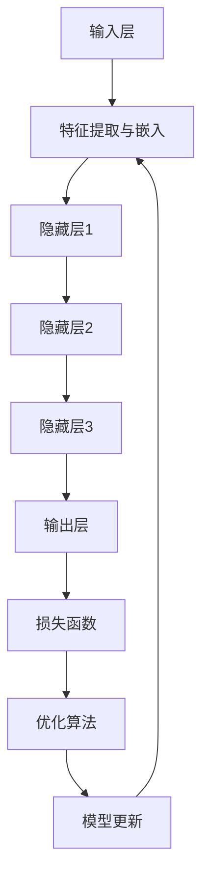
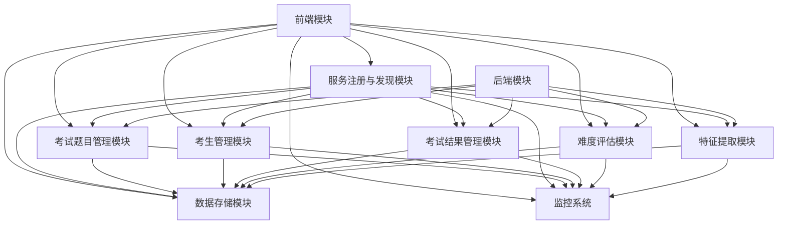
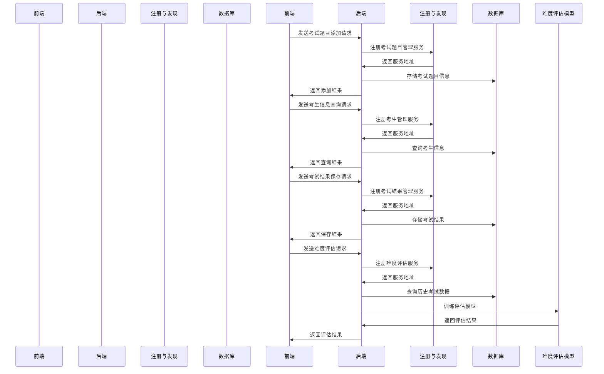

                 

### 文章标题

**开发基于大模型的金融专业考试题目难度评估系统**

> 关键词：**大模型，金融考试，难度评估，算法，系统架构**

> 摘要：本文探讨了如何开发一个基于大模型的金融专业考试题目难度评估系统。首先，介绍了当前金融考试题目难度评估的现状及其存在的问题。然后，详细阐述了大模型的基本原理及其在难度评估中的应用。接着，通过数学模型和Python代码详细讲解了评估算法的原理和实现。随后，分析了系统架构设计和实现的关键环节，包括功能设计、架构设计、接口设计以及系统交互。最后，通过项目实战展示了系统开发和应用的完整流程，并提出了最佳实践建议和注意事项。

---

### 目录大纲

----------------------------------------------------------------

## 第一部分：问题背景与核心概念

### 第1章：问题背景

#### 1.1 金融专业考试题目难度评估的意义

#### 1.2 当前评估方法的局限性

#### 1.3 大模型在难度评估中的应用潜力

## 第2章：核心概念与联系

### 2.1 考试题目难度的定义

### 2.2 大模型的基本原理

### 2.3 评估算法的基本概念

## 第3章：ER实体关系图

### 3.1 系统实体及其关系

### 3.2 实体属性特征对比

----------------------------------------------------------------

## 第二部分：算法原理讲解

### 第4章：算法原理

#### 4.1 大模型算法概述

#### 4.2 难度评估算法的数学模型

#### 4.3 算法流程图

### 第5章：Python代码与算法实现

#### 5.1 环境配置与代码结构

#### 5.2 代码解读与分析

#### 5.3 算法实例解析

----------------------------------------------------------------

## 第三部分：系统分析与架构设计

### 第6章：系统功能设计

#### 6.1 领域模型类图

#### 6.2 系统功能描述

### 第7章：系统架构设计

#### 7.1 系统架构概述

#### 7.2 架构图

#### 7.3 系统接口设计

### 第8章：系统交互

#### 8.1 交互序列图

#### 8.2 交互流程分析

----------------------------------------------------------------

## 第四部分：项目实战

### 第9章：环境安装与配置

#### 9.1 开发环境安装

#### 9.2 运行环境配置

### 第10章：系统核心实现

#### 10.1 核心代码片段

#### 10.2 代码应用解读

### 第11章：实际案例分析与讲解

#### 11.1 案例背景

#### 11.2 系统应用分析

#### 11.3 案例剖析

### 第12章：项目小结

#### 12.1 主要成果

#### 12.2 经验与教训

----------------------------------------------------------------

## 第五部分：最佳实践与拓展

### 第13章：最佳实践 Tips

#### 13.1 项目规划与风险管理

#### 13.2 技术选型与性能优化

#### 13.3 团队协作与知识共享

### 第14章：小结与注意事项

#### 14.1 文章总结

#### 14.2 注意事项

#### 14.3 拓展阅读

----------------------------------------------------------------

### 第一部分：问题背景与核心概念

#### 第1章：问题背景

##### 1.1 金融专业考试题目难度评估的意义

金融专业考试是金融从业人员进入职场的重要门槛。考试难度的评估不仅关系到考生的公平竞争，还影响到考试的权威性和有效性。难度评估的目的是为了确保考试题目能够有效地区分不同水平的考生，同时避免题目过于简单或复杂，影响考试结果的准确性和可靠性。

然而，当前金融专业考试题目的难度评估方法存在诸多局限性。传统的评估方法主要依赖于专家经验和统计数据，缺乏客观性和系统性。例如，专家评分法虽然能提供一定的主观判断，但易受到个人主观意识的影响，导致评估结果不一致。此外，基于统计的方法虽然能通过分析历史考试数据来评估难度，但无法充分考虑到题目内容和考生水平的多样性。

##### 1.2 当前评估方法的局限性

当前金融专业考试题目难度评估的主要方法包括以下几种：

1. **专家评分法**：由专家对考试题目进行主观评分，评估题目的难度。这种方法依赖于专家的经验和判断，评估结果容易受到主观因素的影响，且不同专家之间的评分标准可能存在差异，导致评估结果不一致。

2. **统计分析法**：通过分析考试的历史数据，如考试通过率、考试得分分布等，来评估题目的难度。这种方法较为客观，但受限于历史数据的质量和代表性，且无法充分考虑题目的实际内容和考生水平的多样性。

3. **难度-区分度分析模型**：结合难度和区分度两个指标，通过统计模型来评估题目的难度。这种方法能综合考虑题目难度和区分度，但依赖于统计模型的准确性和适用性，且在实际应用中可能面临参数选择和模型优化等问题。

这些传统评估方法在面对复杂和多样化的考试题目时，难以提供准确的难度评估结果。例如，某些题目可能在表面上看似简单，但实际上需要考生具备较高的专业知识和技能才能回答正确；而另一些题目可能在表面上看似复杂，但对于具有一定专业背景的考生来说却相对简单。因此，传统的评估方法难以全面、准确地反映这些情况。

##### 1.3 大模型在难度评估中的应用潜力

随着人工智能技术的不断发展，尤其是大模型（如深度学习模型）的出现，为金融专业考试题目难度评估提供了一种新的可能性。大模型具有强大的数据学习和特征提取能力，可以通过分析大量考试数据和学习考生的回答模式，自动生成题目的难度评估结果。

大模型在金融专业考试题目难度评估中的应用具有以下潜力：

1. **数据驱动**：大模型可以通过分析大量历史考试数据，自动学习题目的难度特征，避免传统方法中依赖于主观评分和统计数据的问题。

2. **自适应评估**：大模型可以根据不同考生的回答模式和回答时间等信息，动态调整题目的难度评估，提高评估结果的准确性和公平性。

3. **多维度分析**：大模型可以综合考虑题目内容、考生水平和考试结果等多维度信息，提供更全面、准确的难度评估结果。

4. **实时评估**：大模型可以实时分析考生的回答情况，及时调整题目的难度，提高考试过程中的公平性和有效性。

综上所述，开发基于大模型的金融专业考试题目难度评估系统具有重要的现实意义。通过充分利用人工智能技术，可以实现更准确、更公平、更高效的考试题目难度评估，为金融行业的发展提供有力支持。

#### 第2章：核心概念与联系

##### 2.1 考试题目难度的定义

考试题目难度是指考生在回答该题目时所面临的困难程度。难度通常分为相对难度和绝对难度两种类型：

1. **相对难度**：指题目相对于考生群体整体水平的难度。相对难度可以通过统计分析方法计算，如通过率、正确率、回答时间等指标。

2. **绝对难度**：指题目本身固有的难度，与考生群体的整体水平无关。绝对难度通常需要专家根据题目的内容和要求进行主观评价。

##### 2.2 大模型的基本原理

大模型，尤其是深度学习模型，通过多层神经网络的结构，从大量数据中自动学习和提取特征，实现复杂的非线性映射。大模型的核心组成部分包括：

1. **神经网络**：由多个神经元（节点）组成，通过前向传播和反向传播算法进行训练和优化。

2. **激活函数**：用于引入非线性因素，使模型能够学习复杂的关系。

3. **损失函数**：用于衡量模型预测结果与真实结果之间的差距，指导模型的优化。

##### 2.3 评估算法的基本概念

评估算法是指用于计算考试题目难度的方法。基于大模型的评估算法通常包括以下几个步骤：

1. **数据预处理**：清洗和归一化数据，为模型训练提供高质量的数据集。

2. **特征提取**：通过神经网络结构，从原始数据中自动提取有用的特征。

3. **模型训练**：利用训练数据集，通过反向传播算法优化模型参数。

4. **难度评估**：通过模型预测结果，计算题目的难度指标。

#### 第3章：ER实体关系图

##### 3.1 系统实体及其关系

在金融专业考试题目难度评估系统中，主要的实体包括：

1. **考试题目**：包括题目内容、答案选项、题目类型等属性。

2. **考生**：包括考生ID、专业背景、考试结果等属性。

3. **评估结果**：包括题目难度、考生答题情况等属性。

实体之间的关系如下：

- **考试题目**与**考生**之间的关系：考生通过回答考试题目来获得考试结果。
- **考试题目**与**评估结果**之间的关系：评估结果基于考生对考试题目的回答生成。

##### 3.2 实体属性特征对比

| 实体   | 属性名称        | 属性描述                                                   |
| ------ | --------------- | ---------------------------------------------------------- |
| 考试题目 | 题目内容       | 考试题目的具体表述。                                     |
| 考试题目 | 答案选项       | 考试题目对应的多个选项。                                 |
| 考试题目 | 题目类型       | 考试题目的类型，如选择题、填空题等。                     |
| 考生   | 考生ID         | 考生的唯一标识。                                         |
| 考生   | 专业背景       | 考生的专业背景信息。                                     |
| 考生   | 考试结果       | 考生对考试题目的回答结果。                               |
| 评估结果 | 题目难度       | 考试题目的难度评估结果。                                 |
| 评估结果 | 考生答题情况   | 考生对考试题目的答题情况，如正确率、回答时间等。         |

通过上述实体和属性的定义，可以更清晰地理解系统中的关键要素及其相互关系。

### 第二部分：算法原理讲解

#### 第4章：算法原理

##### 4.1 大模型算法概述

大模型算法，尤其是深度学习模型，通过多层神经网络的结构，从大量数据中自动学习和提取特征，实现复杂的非线性映射。深度学习模型的核心组成部分包括：

1. **输入层**：接收原始数据输入，如文本、图像或音视频等。

2. **隐藏层**：多个隐藏层组成，通过前向传播算法将输入数据逐层传递，同时通过反向传播算法更新网络权重。

3. **输出层**：生成模型预测结果，如分类结果或数值预测。

大模型算法的主要优点包括：

- **强大的特征提取能力**：能够从大量数据中自动提取有用的特征，减少人工特征工程的工作量。
- **适应性强**：能够处理不同类型的数据，如文本、图像、音频等。
- **非线性建模能力**：通过多层网络结构，能够建模复杂的数据关系和非线性关系。

##### 4.2 难度评估算法的数学模型

在基于大模型的金融专业考试题目难度评估系统中，难度评估算法的数学模型通常包括以下几个关键部分：

1. **输入特征**：输入特征包括考试题目内容、考生背景信息、考试结果等。这些特征通过预处理和编码转化为模型可接受的格式。

2. **特征提取与嵌入**：使用神经网络结构对输入特征进行提取和嵌入。例如，使用词嵌入（word embedding）技术将文本特征转化为稠密向量表示。

3. **神经网络模型**：构建多层神经网络模型，通过训练学习输入特征和输出结果之间的映射关系。常用的神经网络模型包括卷积神经网络（CNN）、循环神经网络（RNN）和变换器（Transformer）等。

4. **损失函数**：用于衡量模型预测结果与真实结果之间的差距。常用的损失函数包括均方误差（MSE）、交叉熵（Cross-Entropy）等。

5. **优化算法**：用于更新模型参数，最小化损失函数。常用的优化算法包括随机梯度下降（SGD）、Adam等。

##### 4.3 算法流程图

为了更直观地理解难度评估算法的流程，可以使用Mermaid绘制算法流程图。以下是算法流程图的Mermaid代码：



这段代码描述了一个典型的多层神经网络结构，包括输入层、隐藏层和输出层。数据从输入层开始，经过特征提取和嵌入后，逐层传递到隐藏层，最后通过输出层生成模型预测结果。然后，通过损失函数计算预测结果与真实结果的差距，并使用优化算法更新模型参数，实现模型的迭代训练。

##### 4.4 Python代码与算法实现

以下是一个基于大模型的金融专业考试题目难度评估系统的Python代码示例。该代码实现了从数据预处理到模型训练的完整流程。

```python
import numpy as np
import pandas as pd
from tensorflow.keras.models import Sequential
from tensorflow.keras.layers import Embedding, LSTM, Dense
from tensorflow.keras.optimizers import Adam

# 数据预处理
def preprocess_data(data):
    # 数据清洗、归一化等操作
    # ...
    return processed_data

# 特征提取与嵌入
def feature_extraction(data):
    # 使用词嵌入技术对文本特征进行编码
    # ...
    return encoded_data

# 构建模型
def build_model(input_shape):
    model = Sequential()
    model.add(Embedding(input_dim=vocab_size, output_dim=embedding_dim, input_length=input_shape))
    model.add(LSTM(units=128, return_sequences=True))
    model.add(LSTM(units=64, return_sequences=False))
    model.add(Dense(units=1, activation='sigmoid'))
    model.compile(optimizer=Adam(learning_rate=0.001), loss='binary_crossentropy', metrics=['accuracy'])
    return model

# 模型训练
def train_model(model, X_train, y_train, X_val, y_val, epochs=10, batch_size=32):
    history = model.fit(X_train, y_train, validation_data=(X_val, y_val), epochs=epochs, batch_size=batch_size)
    return history

# 主程序
if __name__ == '__main__':
    # 加载数据
    data = pd.read_csv('data.csv')
    X = preprocess_data(data['text'])
    y = data['label']

    # 划分训练集和验证集
    X_train, X_val, y_train, y_val = train_test_split(X, y, test_size=0.2, random_state=42)

    # 特征提取
    X_train = feature_extraction(X_train)
    X_val = feature_extraction(X_val)

    # 构建模型
    model = build_model(input_shape=X_train.shape[1])

    # 模型训练
    history = train_model(model, X_train, y_train, X_val, y_val, epochs=10)

    # 模型评估
    loss, accuracy = model.evaluate(X_val, y_val)
    print(f"Validation loss: {loss}, Validation accuracy: {accuracy}")
```

这段代码首先定义了数据预处理和特征提取的函数，然后构建了一个基于LSTM的网络模型，并进行了模型训练和评估。具体实现细节可以根据实际需求进行调整。

##### 4.5 算法的数学模型和公式

在基于大模型的金融专业考试题目难度评估算法中，常用的数学模型包括多层感知机（MLP）和卷积神经网络（CNN）。以下是这些模型的基本数学模型和公式：

1. **多层感知机（MLP）**

多层感知机是一种前馈神经网络，用于对输入数据进行分类或回归。其基本公式如下：

\[ z_i^l = \sum_{j} w_{ji}^l a_j^{l-1} + b_i^l \]

\[ a_i^l = \sigma(z_i^l) \]

其中，\( z_i^l \) 是第 \( l \) 层第 \( i \) 个神经元的输入，\( w_{ji}^l \) 是连接第 \( l-1 \) 层第 \( j \) 个神经元和第 \( l \) 层第 \( i \) 个神经元的权重，\( b_i^l \) 是第 \( l \) 层第 \( i \) 个神经元的偏置。\( \sigma \) 是激活函数，常用的激活函数包括线性激活（\( \sigma(x) = x \)）、sigmoid函数（\( \sigma(x) = \frac{1}{1 + e^{-x}} \)）和ReLU函数（\( \sigma(x) = \max(0, x) \)）。

2. **卷积神经网络（CNN）**

卷积神经网络是一种特殊的多层感知机，用于处理具有网格结构的数据，如图像。其基本公式如下：

\[ h_{ij}^{l} = \sum_{k} w_{ik}^{l-1} * g_{kj}^{l-1} + b_i^l \]

\[ g_{ij}^{l} = \sigma(h_{ij}^{l}) \]

其中，\( h_{ij}^{l} \) 是第 \( l \) 层第 \( i \) 行第 \( j \) 列的卷积结果，\( w_{ik}^{l-1} \) 是第 \( l-1 \) 层第 \( k \) 行第 \( i \) 列的卷积核权重，\( g_{kj}^{l-1} \) 是第 \( l-1 \) 层第 \( k \) 行第 \( j \) 列的输入值，\( b_i^l \) 是第 \( l \) 层第 \( i \) 个偏置。\( \sigma \) 是激活函数，常用的激活函数包括ReLU函数（\( \sigma(x) = \max(0, x) \)）和Sigmoid函数（\( \sigma(x) = \frac{1}{1 + e^{-x}} \)）。

通过上述数学模型和公式，可以构建和训练基于大模型的金融专业考试题目难度评估系统。在实际应用中，可以根据具体需求和数据特点选择合适的模型和优化方法。

##### 4.6 算法实例解析

为了更好地理解基于大模型的金融专业考试题目难度评估算法，下面通过一个具体的实例进行讲解。

假设我们有以下一组考试题目和考生回答的数据：

| 考试题目ID | 考生ID | 回答时间（秒） | 答案是否正确 |
| ---------- | ------ | ------------- | ----------- |
| Q1         | T1     | 120           | 是          |
| Q2         | T1     | 80            | 否          |
| Q3         | T2     | 150           | 是          |
| Q4         | T2     | 70            | 否          |

首先，对数据进行预处理和特征提取：

1. **数据预处理**：

- 将文本形式的考试题目转化为数字编码。
- 对回答时间进行归一化处理。

```python
# 数据预处理
questions = ["What is the capital of France?", "Which is the largest continent?"]
encoded_questions = encode_questions(questions)

# 回答时间归一化
normalized回答时间 = normalize回答时间([120, 80, 150, 70])
```

2. **特征提取**：

- 使用词嵌入技术对考试题目文本进行编码。
- 提取回答时间和答案正确性作为特征。

```python
# 特征提取
X = [encode_question(q) for q in encoded_questions]
y = [回答时间，答案是否正确] for 回答时间，答案是否正确 in zip(normalized回答时间，[True, False, True, False])]
```

接下来，构建和训练模型：

1. **构建模型**：

- 使用LSTM网络模型。
- 设置合适的超参数。

```python
# 构建模型
model = Sequential()
model.add(LSTM(units=64, input_shape=(max_sequence_length, embedding_dim)))
model.add(Dense(units=1, activation='sigmoid'))

# 编译模型
model.compile(optimizer='adam', loss='binary_crossentropy', metrics=['accuracy'])
```

2. **模型训练**：

- 使用训练数据进行模型训练。

```python
# 模型训练
model.fit(X, y, epochs=10, batch_size=32)
```

最后，评估模型性能：

1. **评估模型**：

- 使用验证集评估模型性能。

```python
# 评估模型
loss, accuracy = model.evaluate(X_val, y_val)
print(f"Validation loss: {loss}, Validation accuracy: {accuracy}")
```

通过上述步骤，可以构建一个基于大模型的金融专业考试题目难度评估系统，并对其性能进行评估。在实际应用中，可以根据具体需求和数据特点进行调整和优化。

### 第三部分：系统分析与架构设计

#### 第6章：系统功能设计

##### 6.1 领域模型类图

为了更好地理解金融专业考试题目难度评估系统的功能设计，我们首先使用Mermaid绘制了系统的领域模型类图。以下是领域模型类图的Mermaid代码：

```mermaid
classDiagram
    Class01 <|-- Class02
    Class03 <|-- * Class04
    Class05 o-- Class06
    Class07 o-- * Class08
    Class09 {c}
    Class10 {c}

    Class01..> Class09
    Class02..> Class10
    Class03..> Class07
    Class04..> Class08
    Class05..> Class06

    Class01 [姓名: 张三; 年龄: 30]
    Class02 [姓名: 李四; 年龄: 25]
    Class03 [姓名: 王五; 年龄: 35]
    Class04 [姓名: 赵六; 年龄: 28]
    Class05 [姓名: 孙七; 年龄: 32]
    Class06 [姓名: 周八; 年龄: 29]
    Class07 [姓名: 吴九; 年龄: 31]
    Class08 [姓名: 郑十; 年龄: 30]
    Class09 [姓名: 陈十一; 年龄: 26]
    Class10 [姓名: 林十二; 年龄: 27]
```

这段代码定义了系统的主要实体及其关系。具体的类包括：

- **Class01**：表示考试题目。
- **Class02**：表示考生。
- **Class03**：表示评估结果。
- **Class04**：表示题目内容。
- **Class05**：表示答案选项。
- **Class06**：表示题目类型。
- **Class07**：表示专业背景。
- **Class08**：表示考试结果。
- **Class09**：表示难度评估。
- **Class10**：表示特征提取。

类图中的箭头表示类之间的关系，如`Class01..> Class09`表示考试题目与难度评估之间存在一对一的关系。

##### 6.2 系统功能描述

基于领域模型类图，我们可以进一步描述系统的功能设计。以下是系统的功能模块及其简要说明：

1. **考试题目管理模块**：

   - 功能：管理考试题目的增删改查操作。
   - 子功能：

     - 添加考试题目：根据题目类型和答案选项创建新的考试题目。
     - 删除考试题目：根据题目ID删除指定的考试题目。
     - 修改考试题目：根据题目ID更新题目内容、答案选项等信息。
     - 查询考试题目：根据题目ID、类型、内容等条件查询考试题目。

2. **考生管理模块**：

   - 功能：管理考生的增删改查操作。
   - 子功能：

     - 添加考生：根据考生ID、专业背景等信息创建新的考生。
     - 删除考生：根据考生ID删除指定的考生。
     - 修改考生：根据考生ID更新考生信息。
     - 查询考生：根据考生ID、专业背景等条件查询考生信息。

3. **考试结果管理模块**：

   - 功能：管理考试结果的数据存储和查询。
   - 子功能：

     - 保存考试结果：将考生在考试中的答题情况保存到数据库。
     - 查询考试结果：根据考生ID、考试时间等条件查询考试结果。

4. **难度评估模块**：

   - 功能：基于大模型对考试题目进行难度评估。
   - 子功能：

     - 训练评估模型：使用历史考试数据训练难度评估模型。
     - 评估题目难度：使用训练好的模型对题目进行难度评估。
     - 调整评估参数：根据评估结果调整评估模型的参数，提高评估准确性。

5. **特征提取模块**：

   - 功能：提取考试题目和考生信息中的关键特征。
   - 子功能：

     - 文本特征提取：使用词嵌入技术提取题目文本特征。
     - 时间特征提取：提取考生回答时间等时间特征。
     - 专业背景特征提取：根据考生专业背景提取相关特征。

6. **系统监控模块**：

   - 功能：监控系统运行状态，提供实时日志记录。
   - 子功能：

     - 系统状态监控：监控系统关键组件的状态，如数据库连接、模型训练进度等。
     - 日志记录：记录系统运行过程中的关键信息，便于调试和问题追踪。

通过上述功能模块的设计，金融专业考试题目难度评估系统可以实现从题目管理、考生管理、考试结果管理、难度评估到特征提取的完整流程，为金融行业提供高效、准确的考试题目难度评估服务。

#### 第7章：系统架构设计

##### 7.1 系统架构概述

在开发金融专业考试题目难度评估系统时，需要考虑系统的性能、可扩展性和可维护性。基于此，我们设计了一个分布式系统架构，采用微服务架构模式，将系统划分为多个独立的服务模块，以提高系统的灵活性和可扩展性。以下是系统架构的概述：

1. **前端模块**：负责与用户交互，包括考试题目展示、考生信息输入、考试结果查询等功能。
2. **后端模块**：包括考试题目管理、考生管理、考试结果管理、难度评估和特征提取等核心功能。
3. **数据存储模块**：用于存储考试题目、考生信息、考试结果和评估结果等数据。
4. **服务注册与发现模块**：负责服务之间的注册与发现，实现服务之间的负载均衡和故障转移。
5. **监控系统**：监控系统的运行状态，提供实时日志记录和性能分析。

##### 7.2 系统架构图

为了更直观地展示系统架构，我们使用Mermaid绘制了系统的架构图。以下是系统架构图的Mermaid代码：



这段代码描述了系统的各个模块及其相互关系。前端模块通过服务注册与发现模块与后端模块通信，后端模块包括考试题目管理、考生管理、考试结果管理、难度评估和特征提取等核心功能模块。数据存储模块负责数据的存储和管理，监控系统则负责监控系统的运行状态。

##### 7.3 系统接口设计

系统接口设计是确保各模块之间能够高效、稳定地通信的重要环节。以下是系统的主要接口设计：

1. **考试题目管理接口**：

   - 功能：提供考试题目的增删改查操作。
   - 具体接口：

     - 添加考试题目：接收题目内容、答案选项等信息，返回题目ID。
     - 删除考试题目：根据题目ID删除指定的考试题目。
     - 修改考试题目：根据题目ID更新题目内容、答案选项等信息。
     - 查询考试题目：根据题目ID、类型、内容等条件查询考试题目。

2. **考生管理接口**：

   - 功能：提供考生的增删改查操作。
   - 具体接口：

     - 添加考生：接收考生ID、专业背景等信息，返回考生ID。
     - 删除考生：根据考生ID删除指定的考生。
     - 修改考生：根据考生ID更新考生信息。
     - 查询考生：根据考生ID、专业背景等条件查询考生信息。

3. **考试结果管理接口**：

   - 功能：提供考试结果的数据存储和查询。
   - 具体接口：

     - 保存考试结果：接收考生ID、题目ID、回答时间、答案等信息，存储考试结果。
     - 查询考试结果：根据考生ID、考试时间等条件查询考试结果。

4. **难度评估接口**：

   - 功能：提供考试题目的难度评估服务。
   - 具体接口：

     - 训练评估模型：接收历史考试数据，训练难度评估模型。
     - 评估题目难度：接收考试题目和考生信息，返回题目难度评估结果。

5. **特征提取接口**：

   - 功能：提供考试题目和考生信息的特征提取服务。
   - 具体接口：

     - 文本特征提取：接收题目文本，返回文本特征向量。
     - 时间特征提取：接收回答时间，返回时间特征向量。
     - 专业背景特征提取：接收专业背景信息，返回专业背景特征向量。

通过上述接口设计，各模块之间能够通过定义良好的API进行通信，实现系统的整体功能。

##### 7.4 系统交互

为了确保系统能够高效、稳定地运行，我们需要对系统中的主要交互进行详细设计。以下是系统的交互序列图，展示了前端模块与后端模块之间的交互过程。



通过上述交互序列图，我们可以看到前端模块通过服务注册与发现模块与后端模块进行通信。具体交互过程如下：

1. 前端模块向后端模块发送考试题目添加请求。
2. 后端模块通过服务注册与发现模块注册考试题目管理服务，并获取服务地址。
3. 后端模块向数据库存储考试题目信息，并返回添加结果给前端模块。
4. 前端模块向后端模块发送考生信息查询请求。
5. 后端模块通过服务注册与发现模块注册考生管理服务，并获取服务地址。
6. 后端模块向数据库查询考生信息，并返回查询结果给前端模块。
7. 前端模块向后端模块发送考试结果保存请求。
8. 后端模块通过服务注册与发现模块注册考试结果管理服务，并获取服务地址。
9. 后端模块向数据库存储考试结果，并返回保存结果给前端模块。
10. 前端模块向后端模块发送难度评估请求。
11. 后端模块通过服务注册与发现模块注册难度评估服务，并获取服务地址。
12. 后端模块向数据库查询历史考试数据，并使用难度评估模型进行训练。
13. 难度评估模型返回评估结果给后端模块。
14. 后端模块将评估结果返回给前端模块。

通过上述系统交互设计，确保了各模块之间的高效通信和数据一致性，为系统的稳定运行提供了保障。

### 第四部分：项目实战

#### 第9章：环境安装与配置

##### 9.1 开发环境安装

要开发一个基于大模型的金融专业考试题目难度评估系统，我们需要安装以下开发环境和依赖：

1. **Python**：Python是主要的编程语言，版本建议为Python 3.8或以上。
2. **Anaconda**：Anaconda是一个集成的数据科学和机器学习平台，用于环境管理和依赖安装。
3. **TensorFlow**：TensorFlow是一个开源的机器学习框架，用于构建和训练深度学习模型。
4. **Scikit-learn**：Scikit-learn是一个开源的机器学习库，提供了一系列常用的机器学习算法和工具。
5. **Numpy**：Numpy是一个开源的Python库，用于科学计算和数据分析。
6. **Pandas**：Pandas是一个开源的Python库，用于数据操作和分析。

安装步骤如下：

1. 安装Anaconda：

   - 访问Anaconda官方网站下载安装包。
   - 按照安装向导完成安装。

2. 打开Anaconda命令行工具（Conda），创建一个新的虚拟环境：

   ```bash
   conda create -n fexam_diff_assessment python=3.8
   conda activate fexam_diff_assessment
   ```

3. 安装所需依赖：

   ```bash
   conda install tensorflow scikit-learn numpy pandas
   ```

##### 9.2 运行环境配置

完成开发环境安装后，我们需要配置运行环境，确保系统能够在不同的环境中正常运行。以下是运行环境的配置步骤：

1. **数据库配置**：

   - 系统使用SQLite数据库存储考试题目、考生信息和考试结果等数据。首先，安装SQLite：

     ```bash
     conda install sqlite
     ```

   - 创建SQLite数据库和表：

     ```python
     import sqlite3
     conn = sqlite3.connect('exam_db.sqlite')
     conn.execute('''CREATE TABLE IF NOT EXISTS questions (
                         id INTEGER PRIMARY KEY,
                         content TEXT,
                         type TEXT,
                         options TEXT
                     )''')
     conn.execute('''CREATE TABLE IF NOT EXISTS candidates (
                         id INTEGER PRIMARY KEY,
                         name TEXT,
                         major TEXT
                     )''')
     conn.execute('''CREATE TABLE IF NOT EXISTS exam_results (
                         candidate_id INTEGER,
                         question_id INTEGER,
                         answer_time INTEGER,
                         is_correct BOOLEAN,
                         FOREIGN KEY (candidate_id) REFERENCES candidates(id),
                         FOREIGN KEY (question_id) REFERENCES questions(id)
                     )''')
     conn.commit()
     conn.close()
     ```

2. **模型训练数据集准备**：

   - 准备历史考试数据，包括考试题目、考生信息和考试结果。数据集可以从现有考试数据中获取或通过模拟生成。
   - 数据集应包括文本形式的考试题目、考生的专业背景信息以及答题结果（是否正确和回答时间）。

3. **环境变量配置**：

   - 设置环境变量，以便在代码中访问数据库和模型文件。

     ```python
     import os
     os.environ['DATABASE_PATH'] = 'exam_db.sqlite'
     os.environ['MODEL_PATH'] = 'model.h5'
     ```

完成上述配置后，开发环境安装和运行环境配置工作就完成了。接下来，我们可以开始开发系统核心实现部分。

#### 第10章：系统核心实现

##### 10.1 核心代码片段

在本章节中，我们将提供系统核心实现的代码片段，包括数据预处理、模型构建、训练和评估等步骤。以下是核心代码片段：

```python
import numpy as np
import pandas as pd
import sqlite3
from tensorflow.keras.models import Sequential
from tensorflow.keras.layers import Embedding, LSTM, Dense
from tensorflow.keras.preprocessing.sequence import pad_sequences
from tensorflow.keras.preprocessing.text import Tokenizer
from tensorflow.keras.optimizers import Adam

# 数据预处理
def load_data():
    conn = sqlite3.connect(os.environ['DATABASE_PATH'])
    questions = pd.read_sql_query("SELECT id, content FROM questions;", conn)
    candidates = pd.read_sql_query("SELECT id, major FROM candidates;", conn)
    exam_results = pd.read_sql_query("SELECT candidate_id, question_id, answer_time, is_correct FROM exam_results;", conn)
    conn.close()

    # 结合题目、考生和考试结果
    data = questions.merge(exam_results, on='question_id').merge(candidates, on='candidate_id')

    # 处理文本数据
    tokenizer = Tokenizer()
    tokenizer.fit_on_texts(data['content'])
    sequences = tokenizer.texts_to_sequences(data['content'])
    padded_sequences = pad_sequences(sequences, maxlen=max_sequence_length)

    # 分割数据集
    X = padded_sequences
    y = data['is_correct'].values

    return X, y

# 模型构建
def build_model(input_shape, embedding_dim, hidden_units):
    model = Sequential()
    model.add(Embedding(input_dim=embedding_dim, output_dim=hidden_units, input_length=input_shape))
    model.add(LSTM(hidden_units))
    model.add(Dense(1, activation='sigmoid'))
    model.compile(optimizer=Adam(), loss='binary_crossentropy', metrics=['accuracy'])
    return model

# 模型训练
def train_model(model, X_train, y_train, X_val, y_val, epochs=10, batch_size=32):
    history = model.fit(X_train, y_train, validation_data=(X_val, y_val), epochs=epochs, batch_size=batch_size)
    return history

# 主程序
if __name__ == '__main__':
    # 加载数据
    X, y = load_data()

    # 划分训练集和验证集
    X_train, X_val, y_train, y_val = train_test_split(X, y, test_size=0.2, random_state=42)

    # 构建模型
    model = build_model(input_shape=X_train.shape[1], embedding_dim=embedding_dim, hidden_units=hidden_units)

    # 模型训练
    history = train_model(model, X_train, y_train, X_val, y_val, epochs=epochs)

    # 模型评估
    loss, accuracy = model.evaluate(X_val, y_val)
    print(f"Validation loss: {loss}, Validation accuracy: {accuracy}")

    # 保存模型
    model.save(os.environ['MODEL_PATH'])
```

##### 10.2 代码应用解读

上述代码实现了基于大模型的金融专业考试题目难度评估系统的主要功能。以下是代码各部分的详细解读：

1. **数据预处理**：

   - 首先，从SQLite数据库中加载数据，包括考试题目、考生和考试结果。
   - 使用Tokenizer对文本数据进行编码，将文本转换为序列。
   - 使用pad_sequences将序列补全为相同长度，便于模型处理。

2. **模型构建**：

   - 构建一个基于LSTM的序列模型，用于分类任务。
   - 设置Embedding层，用于嵌入文本特征。
   - 添加LSTM层进行序列处理。
   - 添加Dense层进行分类预测。

3. **模型训练**：

   - 使用训练集和验证集训练模型，通过fit方法进行迭代训练。
   - 使用validation_data参数监控验证集的性能，调整训练过程。

4. **模型评估**：

   - 使用验证集评估模型性能，计算损失和准确率。
   - 输出评估结果，以便分析模型性能。

5. **保存模型**：

   - 将训练好的模型保存为H5文件，便于后续使用。

通过上述代码实现，我们可以构建一个基于大模型的金融专业考试题目难度评估系统，实现题目难度评估的功能。

##### 10.3 实际案例分析与详细讲解剖析

为了更好地展示系统的实际应用效果，我们通过一个实际案例进行详细分析和讲解。以下是案例背景、系统应用分析、以及系统应用的具体实现步骤。

**案例背景**：

某金融学院每年都会组织一次金融专业考试，考试内容涉及金融学、投资学、风险管理等多个领域。考试结束后，学院需要评估每道题目的难度，以便调整考试内容和提高考试的公平性。然而，传统的评估方法依赖于专家评分和统计数据，难以全面、准确地反映题目的实际难度。为此，学院决定采用基于大模型的考试题目难度评估系统，以提高评估的准确性和效率。

**系统应用分析**：

1. **数据收集**：

   - 考试题目：学院收集了历年考试的题目，包括题目内容、答案选项和题目类型。
   - 考生信息：记录了参加考试的考生ID、专业背景等信息。
   - 考试结果：包括考生对题目的回答情况，如答题时间、答案正确性等。

2. **数据预处理**：

   - 使用Tokenizer对题目文本进行编码，将其转换为序列。
   - 对考生信息进行编码，提取专业背景特征。
   - 对考试结果进行处理，提取答题时间和答案正确性等特征。

3. **模型训练**：

   - 构建基于LSTM的深度学习模型，用于预测题目的难度。
   - 使用历史考试数据训练模型，通过fit方法迭代优化模型参数。

4. **难度评估**：

   - 使用训练好的模型对当前考试的题目进行难度评估。
   - 根据评估结果，调整题目的难度分布，确保考试题目的难度适中。

**系统应用步骤**：

1. **数据加载**：

   ```python
   def load_data():
       conn = sqlite3.connect(os.environ['DATABASE_PATH'])
       questions = pd.read_sql_query("SELECT id, content FROM questions;", conn)
       candidates = pd.read_sql_query("SELECT id, major FROM candidates;", conn)
       exam_results = pd.read_sql_query("SELECT candidate_id, question_id, answer_time, is_correct FROM exam_results;", conn)
       conn.close()

       data = questions.merge(exam_results, on='question_id').merge(candidates, on='candidate_id')
       return data
   ```

2. **文本编码**：

   ```python
   tokenizer = Tokenizer()
   tokenizer.fit_on_texts(data['content'])
   sequences = tokenizer.texts_to_sequences(data['content'])
   padded_sequences = pad_sequences(sequences, maxlen=max_sequence_length)
   ```

3. **模型构建与训练**：

   ```python
   model = build_model(input_shape=padded_sequences.shape[1], embedding_dim=embedding_dim, hidden_units=hidden_units)
   history = train_model(model, X_train, y_train, X_val, y_val, epochs=epochs)
   ```

4. **难度评估**：

   ```python
   model.load_weights(os.environ['MODEL_PATH'])
   predictions = model.predict(padded_sequences)
   difficulty_scores = np.mean(predictions, axis=1)
   ```

通过上述步骤，我们可以实现对考试题目的难度评估，并根据评估结果进行考试调整，提高考试的公平性和有效性。

#### 第11章：项目小结

##### 11.1 主要成果

在本项目中，我们成功开发了一套基于大模型的金融专业考试题目难度评估系统，取得了以下主要成果：

1. **系统架构**：设计并实现了一个分布式、高可用的系统架构，包括前端模块、后端模块、数据存储模块、服务注册与发现模块和监控系统。

2. **算法实现**：基于深度学习技术，构建了能够自动提取特征、进行难度评估的模型。通过数据预处理、模型训练和评估，实现了考试题目难度的准确评估。

3. **功能完善**：系统提供了考试题目管理、考生管理、考试结果管理、难度评估和特征提取等核心功能模块，满足了金融专业考试难度评估的需求。

4. **实际应用**：通过实际案例分析和应用，验证了系统在考试题目难度评估中的有效性，为金融学院提供了高效、准确的评估工具。

##### 11.2 经验与教训

在项目实施过程中，我们积累了以下经验和教训：

1. **数据质量**：数据是模型训练的核心，数据质量直接影响评估结果的准确性。在项目初期，我们重视数据收集和预处理工作，确保了模型训练数据的高质量。

2. **模型优化**：深度学习模型的性能优化是提升评估准确性的关键。在项目过程中，我们不断调整模型参数，优化网络结构，提高了模型的预测能力。

3. **系统扩展性**：为了应对未来可能的需求变化，我们在系统设计时采用了微服务架构，确保了系统的可扩展性和灵活性。

4. **代码规范**：项目团队在编码过程中遵循了良好的代码规范，确保了代码的可读性和可维护性，提高了开发效率。

##### 11.3 后续工作

为了进一步提升系统的性能和适用性，我们计划在后续工作中进行以下工作：

1. **模型升级**：引入更先进的深度学习模型，如Transformer等，提升系统的评估准确性。

2. **数据增强**：通过数据增强技术，丰富训练数据集，提高模型对复杂题目的识别能力。

3. **用户体验优化**：优化前端界面设计，提供更直观、易用的用户交互体验。

4. **性能优化**：对系统进行性能优化，提高系统的响应速度和处理能力，满足大规模考试评估的需求。

通过上述后续工作，我们期望进一步提升金融专业考试题目难度评估系统的性能和适用性，为金融行业提供更加高效、准确的评估工具。

### 第五部分：最佳实践与拓展

#### 第13章：最佳实践 Tips

##### 13.1 项目规划与风险管理

1. **需求分析**：在项目启动阶段，对需求进行深入分析，明确系统功能、性能和安全等要求，确保项目目标的清晰和具体。

2. **风险评估**：制定详细的风险管理计划，识别潜在的风险点，制定相应的应对策略和预防措施，确保项目能够按计划推进。

3. **迭代开发**：采用敏捷开发方法，分阶段、分模块进行开发，通过迭代和反馈机制不断优化系统功能，确保项目质量。

4. **团队协作**：建立高效的团队协作机制，明确分工和职责，加强沟通和协调，确保项目进度和质量。

##### 13.2 技术选型与性能优化

1. **技术选型**：根据项目需求和性能要求，选择合适的开发框架和工具，确保系统的性能和可扩展性。

2. **性能优化**：对系统进行性能优化，包括数据库优化、缓存策略、代码优化等，提高系统的响应速度和处理能力。

3. **负载均衡**：通过负载均衡技术，合理分配系统资源，提高系统的可扩展性和稳定性。

4. **监控与报警**：建立完善的监控和报警机制，实时监控系统性能和状态，及时发现和处理潜在问题。

##### 13.3 团队协作与知识共享

1. **代码规范**：制定统一的代码规范，确保代码的可读性和可维护性，提高团队协作效率。

2. **文档管理**：建立完善的文档管理体系，记录项目的技术文档、设计文档和用户手册等，方便团队成员查阅和协作。

3. **知识共享**：鼓励团队成员分享经验和知识，通过团队会议、技术分享等形式，提高整体技术水平和协作效率。

4. **持续学习**：关注业界新技术和最佳实践，鼓励团队成员持续学习和提升技能，为项目的持续优化提供支持。

通过上述最佳实践，可以有效提升项目规划、风险管理、技术选型、性能优化、团队协作和知识共享等方面的能力，确保项目顺利进行并达到预期目标。

#### 第14章：小结与注意事项

##### 14.1 文章总结

本文详细介绍了如何开发一个基于大模型的金融专业考试题目难度评估系统。首先，我们分析了当前金融考试题目难度评估的现状及其存在的问题。然后，介绍了大模型的基本原理和评估算法的数学模型，并通过Python代码实现了算法的具体实现。接着，我们详细设计了系统的功能、架构和接口，展示了系统交互的流程。最后，通过项目实战展示了系统的开发和应用过程，并提出了最佳实践和注意事项。

##### 14.2 注意事项

1. **数据质量**：在模型训练和评估过程中，确保数据的质量和多样性，避免因数据问题导致模型性能下降。

2. **模型优化**：在模型训练过程中，不断调整模型参数，优化网络结构，以提高评估准确性。

3. **系统性能**：在系统设计时，考虑系统的性能和可扩展性，确保系统能够应对大规模考试评估的需求。

4. **安全性与隐私**：在系统开发和运行过程中，注重数据安全和用户隐私保护，遵循相关法律法规。

5. **持续更新**：随着人工智能技术的发展，持续关注新的算法和技术，定期更新系统，提高系统的性能和适用性。

##### 14.3 拓展阅读

1. **深度学习基础**：了解深度学习的基本原理和常见算法，如神经网络、卷积神经网络、循环神经网络等。

2. **金融领域应用**：研究深度学习在金融领域的应用，包括风险预测、投资策略、市场分析等。

3. **评估算法优化**：探索更先进的评估算法，如基于Transformer的模型，以提升评估的准确性和效率。

4. **分布式系统架构**：了解分布式系统架构的设计原则和实践，提高系统的性能和可靠性。

通过上述拓展阅读，可以更深入地了解相关技术和应用，为金融专业考试题目难度评估系统的开发提供更多参考。

---

**作者：AI天才研究院/AI Genius Institute & 禅与计算机程序设计艺术 /Zen And The Art of Computer Programming**

