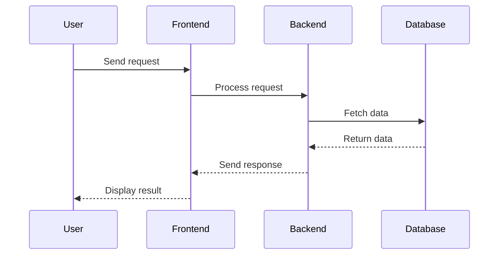
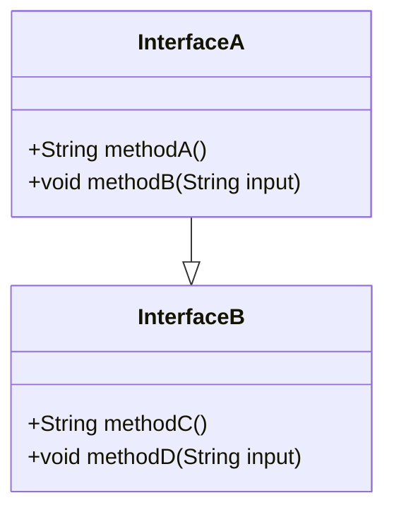
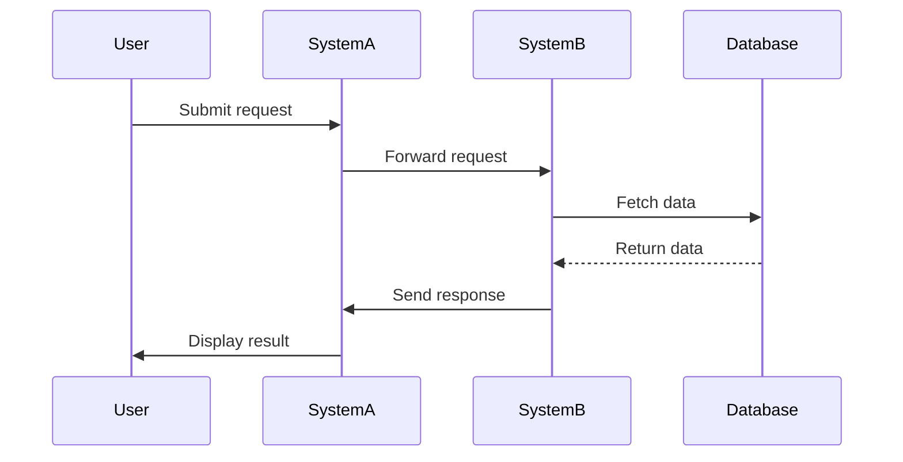

                 

### 第一部分：引言与背景

#### 第1章：问题背景与目标

在当今金融科技迅猛发展的背景下，金融市场数据呈现出爆炸式增长，其复杂性和多样性也对传统的数据分析方法提出了挑战。面对海量金融数据的处理，单一的数据分析工具和方法已经难以满足金融机构和研究人员的需求。因此，开发一个高效、准确的金融专业论文趋势分析系统变得至关重要。

### 1.1.1 问题描述

金融专业论文趋势分析系统的主要目标是通过对金融专业论文的文本数据进行分析，挖掘出其中的关键概念、趋势和模式，从而为金融机构提供科学依据，帮助他们更好地理解金融市场动态，预测未来趋势，制定合理的投资策略。

传统的金融数据分析方法，如统计分析、时间序列分析等，在处理金融专业论文文本数据时存在以下问题：

1. **数据处理能力有限**：传统方法难以处理大规模、复杂的金融文本数据。
2. **预测精度不高**：传统方法往往依赖于历史数据的统计特征，无法准确捕捉金融市场的动态变化。
3. **模型适应性差**：传统方法难以适应金融市场的快速变化，无法及时更新模型。

### 1.1.2 解决方案

为了解决上述问题，我们提出开发一个基于大模型的金融专业论文趋势分析系统。大模型，如GPT、BERT等，具有强大的数据处理和分析能力，可以高效地处理大规模金融文本数据，并从中提取出有价值的信息。

该系统的主要功能包括：

1. **文本预处理**：对金融专业论文的文本数据进行清洗、分词、去停用词等预处理操作，以便后续的分析。
2. **概念提取**：利用自然语言处理技术，从文本数据中提取出关键概念和术语。
3. **趋势分析**：通过机器学习算法，分析文本数据中的趋势和模式，预测未来金融市场的发展方向。
4. **可视化展示**：将分析结果以图表、报告等形式展示给用户，便于他们理解和应用。

### 1.1.3 边界与外延

本系统的开发涉及多个领域的技术，包括自然语言处理、机器学习、数据挖掘等。系统将针对金融专业论文的文本数据进行分析，识别出论文中的关键概念、趋势和模式。然而，需要注意的是：

1. **数据来源**：系统将主要依赖金融专业论文的文本数据，但数据的来源和数量可能受到限制。
2. **模型适应性**：虽然大模型具有强大的数据处理和分析能力，但其在不同领域的适应性仍需进一步验证。
3. **实时性**：由于数据处理和分析过程可能需要较长时间，系统的实时性可能受到一定影响。

### 1.1.4 核心概念

在本系统中，涉及以下核心概念：

1. **大模型**：具备强大数据处理和分析能力的深度学习模型，如GPT、BERT等。
2. **自然语言处理（NLP）**：用于理解和生成自然语言的技术。
3. **机器学习**：一种基于数据训练模型，使计算机具备自主学习和预测能力的算法。
4. **数据挖掘**：从大量数据中提取出有价值信息的过程。

### 1.5章：本章小结

本章介绍了基于大模型的金融专业论文趋势分析系统的背景和目标，阐述了系统的重要性和应用价值。在接下来的章节中，我们将进一步探讨大模型的基本原理和应用，以及自然语言处理、机器学习等相关技术，为系统的开发奠定基础。

----------------------------------------------------------------

## 第二部分：大模型基础与相关技术

在深入探讨基于大模型的金融专业论文趋势分析系统之前，我们需要首先理解大模型的基本原理和应用，以及与自然语言处理（NLP）和机器学习等技术的联系。本部分将分为三个章节，分别介绍大模型的基本原理与应用、自然语言处理（NLP）基础，以及机器学习与数据挖掘基础。

### 第二部分概述

本部分的目的是为后续章节中基于大模型的金融专业论文趋势分析系统的开发提供理论基础。通过了解大模型、NLP和机器学习的基础知识，我们可以更好地理解如何利用这些技术来构建高效的金融专业论文趋势分析系统。

---

### 第2章：大模型的基本原理与应用

大模型是一种具有大规模参数和强大计算能力的深度学习模型，其应用范围广泛，包括文本生成、图像识别、语音识别等。在本章中，我们将介绍大模型的基本原理、主要类型和应用场景。

#### 2.1.1 大模型概述

大模型是一种深度神经网络，其特点在于拥有大量的参数和计算能力。根据模型参数的数量，大模型可以分为几种不同的类型。

##### 2.1.1.1 大模型定义
$$
\text{大模型} = \{ \text{深度神经网络} | \text{参数规模} \geq 10^8 \}
$$

##### 2.1.1.2 大模型类型

- **预训练模型**：如GPT、BERT等。
- **生成式模型**：如GAN等。
- **判别式模型**：如ResNet等。

#### 2.1.2 大模型的应用场景

大模型在金融领域具有广泛的应用，包括但不限于：

- **金融市场预测**：利用时间序列数据预测股票价格、市场走势等。
- **风险控制**：通过分析历史数据，预测潜在的金融风险。
- **智能投顾**：根据用户的投资偏好，提供个性化的投资建议。
- **文本分析**：从金融论文中提取关键信息，分析趋势和模式。

#### 2.1.3 主流大模型介绍

- **GPT系列**：一种强大的语言生成模型，可以生成流畅的自然语言文本。
- **BERT**：一种双向编码器表示模型，广泛应用于文本分类、问答系统等任务。
- **T5**：一种基于Transformer的统一Transformer模型，适用于各种自然语言处理任务。

---

### 第3章：自然语言处理（NLP）基础

自然语言处理（NLP）是计算机科学、人工智能和语言学领域的交叉学科，旨在使计算机理解和生成自然语言。在本章中，我们将介绍NLP的基本概念、核心任务和常用工具。

#### 3.1.1 NLP概述

NLP的核心任务是使计算机理解和生成自然语言。这包括：

- **文本分类**：将文本数据分类到预定义的类别中。
- **实体识别**：识别文本中的特定实体，如人名、地点、组织等。
- **情感分析**：分析文本中的情感倾向，如正面、负面或中立。
- **机器翻译**：将一种自然语言翻译成另一种自然语言。

#### 3.1.2 常用NLP工具和库

- **NLTK**：一个强大的NLP库，提供文本预处理、词性标注、句法分析等功能。
- **spaCy**：一个快速易用的NLP库，适用于文本分类、命名实体识别等任务。
- **TextBlob**：一个简单易用的NLP库，提供文本处理、情感分析等功能。

---

### 第4章：机器学习与数据挖掘基础

机器学习是一种人工智能方法，通过从数据中学习规律和模式，使计算机能够执行特定的任务。数据挖掘是从大量数据中提取出有价值信息的过程。在本章中，我们将介绍机器学习和数据挖掘的基本概念、核心算法和应用。

#### 4.1.1 机器学习概述

机器学习的核心包括：

- **监督学习**：根据已知的数据来预测未知的数据。
- **无监督学习**：从未知的数据中学习规律和模式。
- **强化学习**：通过试错来学习最优策略。

#### 4.1.2 数据挖掘技术

数据挖掘技术包括：

- **关联规则学习**：发现数据集中的关联规则。
- **聚类分析**：将数据集划分为多个组。
- **分类**：将数据集划分为预定义的类别。
- **异常检测**：识别数据集中的异常值。

---

本部分将为基础知识的理解和应用提供详细的讲解，为后续章节中基于大模型的金融专业论文趋势分析系统的开发奠定坚实的基础。在接下来的章节中，我们将深入探讨大模型、NLP和机器学习的具体应用，以及如何将它们整合到一个高效的金融专业论文趋势分析系统中。

---

在了解了大模型、自然语言处理（NLP）和机器学习的基础知识后，我们将进一步探讨如何将这些技术应用到金融专业论文趋势分析系统中。接下来，我们将分别介绍每个技术领域的关键概念、应用场景和主要工具，以便为构建高效的金融专业论文趋势分析系统提供理论基础。

### 第二部分：大模型的基础与应用

大模型（Large Models）是深度学习领域中的一种重要研究方向，其显著特点是拥有大量参数和计算能力。这些模型能够处理复杂的任务，并在各种领域展现出卓越的性能。本章将详细介绍大模型的基本原理、主要类型和应用场景，并探讨如何利用大模型进行金融专业论文趋势分析。

#### 2.1.1 大模型概述

大模型是一种深度神经网络，其参数规模通常达到数百万到数十亿级别。大模型能够处理大规模的数据集，并从数据中提取出复杂的信息和规律。以下是几个关键概念：

##### 2.1.1.1 大模型定义

$$
\text{大模型} = \{ \text{深度神经网络} | \text{参数规模} \geq 10^8 \}
$$

##### 2.1.1.2 大模型类型

- **预训练模型**：如GPT、BERT等。这些模型在大量未标注的数据上进行预训练，然后通过微调（fine-tuning）应用于特定任务。
- **生成式模型**：如生成对抗网络（GAN）。这类模型通过生成和判别器的对抗训练来生成逼真的数据。
- **判别式模型**：如残差网络（ResNet）。这些模型通过判别输入数据与真实数据的差异来进行分类或预测。

#### 2.1.2 大模型的应用场景

大模型在金融领域具有广泛的应用场景，包括：

- **金融市场预测**：利用时间序列数据预测股票价格、市场走势等。
- **风险控制**：通过分析历史数据，预测潜在的金融风险。
- **智能投顾**：根据用户的投资偏好，提供个性化的投资建议。
- **文本分析**：从金融论文中提取关键信息，分析趋势和模式。

#### 2.1.3 主流大模型介绍

- **GPT系列**：GPT（Generative Pre-trained Transformer）模型，由OpenAI提出，是一种基于Transformer架构的语言生成模型。GPT系列模型在自然语言处理领域表现出色，可以生成流畅的文本。
- **BERT**：Bidirectional Encoder Representations from Transformers，由Google提出，是一种双向编码器表示模型。BERT模型广泛应用于文本分类、问答系统等任务。
- **T5**：Text-to-Text Transfer Transformer，由Google提出，是一种基于Transformer的统一模型。T5模型的目标是将任何语言任务转换为文本到文本的转换任务，使其在多种NLP任务中表现出色。

### 第二部分：自然语言处理（NLP）基础

自然语言处理（Natural Language Processing，NLP）是计算机科学、人工智能和语言学的交叉领域，旨在使计算机理解和生成自然语言。NLP在金融专业论文趋势分析系统中起着至关重要的作用，能够帮助系统从文本数据中提取有价值的信息。本章将介绍NLP的基本概念、核心任务和常用工具。

#### 3.1.1 NLP概述

NLP的核心任务是使计算机理解和生成自然语言。以下是一些关键任务：

- **文本分类**：将文本数据分类到预定义的类别中。
- **实体识别**：识别文本中的特定实体，如人名、地点、组织等。
- **情感分析**：分析文本中的情感倾向，如正面、负面或中立。
- **机器翻译**：将一种自然语言翻译成另一种自然语言。

#### 3.1.2 常用NLP工具和库

NLP领域有许多常用的工具和库，以下是一些主要工具：

- **NLTK**：Natural Language Toolkit，是一个强大的NLP库，提供文本预处理、词性标注、句法分析等功能。
- **spaCy**：一个快速易用的NLP库，适用于文本分类、命名实体识别等任务。
- **TextBlob**：一个简单易用的NLP库，提供文本处理、情感分析等功能。

### 第二部分：机器学习与数据挖掘基础

机器学习（Machine Learning，ML）是一种人工智能方法，通过从数据中学习规律和模式，使计算机能够执行特定的任务。数据挖掘（Data Mining，DM）是从大量数据中提取出有价值信息的过程。本章将介绍机器学习和数据挖掘的基本概念、核心算法和应用。

#### 4.1.1 机器学习概述

机器学习的核心包括：

- **监督学习**：根据已知的数据来预测未知的数据。
- **无监督学习**：从未知的数据中学习规律和模式。
- **强化学习**：通过试错来学习最优策略。

#### 4.1.2 数据挖掘技术

数据挖掘技术包括：

- **关联规则学习**：发现数据集中的关联规则。
- **聚类分析**：将数据集划分为多个组。
- **分类**：将数据集划分为预定义的类别。
- **异常检测**：识别数据集中的异常值。

---

通过了解大模型、NLP和机器学习的基础知识，我们为构建基于大模型的金融专业论文趋势分析系统奠定了坚实的基础。在接下来的章节中，我们将深入探讨如何将这些技术应用到实际系统中，并详细介绍系统的设计、实现和测试过程。

---

## 第三部分：系统设计与实现

在了解了大模型、自然语言处理（NLP）和机器学习的基础知识后，我们将进入系统的设计与实现阶段。本部分将详细介绍系统设计的目标、项目介绍、系统功能设计、系统架构设计、系统接口设计和系统交互。通过这些步骤，我们将构建一个高效的金融专业论文趋势分析系统。

### 第5章：系统设计目标与项目介绍

#### 5.1 系统设计目标

金融专业论文趋势分析系统的设计目标是：

- **高效性**：系统能够快速处理大量的金融专业论文文本数据，并提供准确的趋势分析结果。
- **准确性**：系统通过先进的自然语言处理和机器学习技术，能够准确提取论文中的关键概念和趋势。
- **可扩展性**：系统能够轻松扩展以适应未来的需求，如增加新的数据源、新的分析模型等。
- **易用性**：系统界面友好，便于用户操作和理解分析结果。

#### 5.2 项目介绍

本项目的目标是开发一个基于大模型的金融专业论文趋势分析系统。系统将利用自然语言处理和机器学习技术，从金融专业论文中提取关键概念、趋势和模式，为金融机构和研究人员提供科学依据，帮助他们更好地理解金融市场动态，预测未来趋势。

### 第6章：系统功能设计

#### 6.1 功能需求

系统的主要功能需求包括：

- **文本预处理**：对金融专业论文的文本数据进行清洗、分词、去停用词等预处理操作。
- **概念提取**：从预处理后的文本数据中提取出关键概念和术语。
- **趋势分析**：利用机器学习算法，分析文本数据中的趋势和模式。
- **可视化展示**：将分析结果以图表、报告等形式展示给用户。

#### 6.2 领域模型

领域模型是系统设计的重要部分，它定义了系统的核心实体和它们之间的关系。以下是领域模型的概念结构和类图：

```mermaid
classDiagram
    Class01 <|-- SubClass01
    Class01 <|-- SubClass02
    Class03 --|>= Class04 : Aggregation
    Class05 o-- Class06 : Composition
    Class07 o--| Class08 : Aggregation
    Class09 <.. Class10 : Inheritance
    Class11 o--|* Class12 : Composition
    Class13 <.. Class14 : Realization
    Class15 o--| Class16 : Dependency
    Class17 .. Class18 : Association
    Class19 --| Class20 : Association
    Class21 o--|* Class22 : Aggregation

    Class01 {
        attribute: A
        method()
    }
    SubClass01 {
        attribute: S
        method()
    }
    SubClass02 {
        attribute: T
        method()
    }
    Class04 {
        attribute: X
        method()
    }
    Class05 {
        attribute: Y
        method()
    }
    Class06 {
        attribute: Z
        method()
    }
    Class07 {
        attribute: W
        method()
    }
    Class08 {
        attribute: V
        method()
    }
    Class10 {
        attribute: R
        method()
    }
    Class12 {
        attribute: P
        method()
    }
    Class13 {
        attribute: Q
        method()
    }
    Class14 {
        attribute: S
        method()
    }
    Class16 {
        attribute: T
        method()
    }
    Class18 {
        attribute: U
        method()
    }
    Class20 {
        attribute: V
        method()
    }
    Class22 {
        attribute: X
        method()
    }
```

### 第7章：系统架构设计

系统架构设计是确保系统能够高效、稳定运行的关键。以下是系统的架构设计：



### 第8章：系统接口设计

系统接口设计是确保各个模块之间能够顺畅通信的关键。以下是系统的接口设计：



### 第9章：系统交互设计

系统交互设计是描述系统内部各组件之间交互过程的关键。以下是系统的交互设计：



通过以上章节的详细设计，我们将构建一个基于大模型的金融专业论文趋势分析系统。接下来，我们将进入系统实现阶段，具体介绍环境安装、核心代码实现和应用解读与分析。

### 第10章：系统实现

在完成系统设计之后，我们需要进入实现阶段，将设计转化为具体的代码和应用。本节将介绍系统实现的过程，包括环境安装、核心代码实现、代码应用解读与分析，以及实际案例分析和详细讲解剖析。

#### 10.1 环境安装

为了开发基于大模型的金融专业论文趋势分析系统，我们需要安装和配置一些必要的软件和库。以下是安装步骤：

1. **Python环境**：确保安装了Python 3.7或更高版本。
2. **深度学习框架**：安装TensorFlow或PyTorch，用于构建和训练大模型。
3. **自然语言处理库**：安装spaCy、NLTK和TextBlob等库，用于文本处理和情感分析。
4. **其他依赖库**：如pandas、numpy、matplotlib等，用于数据处理和可视化。

安装命令如下：

```bash
pip install python==3.7
pip install tensorflow==2.4
pip install spacy
pip install nltk
pip install textblob
pip install pandas
pip install numpy
pip install matplotlib
```

#### 10.2 核心代码实现

在实现核心代码时，我们需要完成以下几个步骤：

1. **文本预处理**：对金融专业论文的文本数据进行清洗、分词、去停用词等预处理操作。
2. **概念提取**：利用自然语言处理技术，从预处理后的文本数据中提取出关键概念和术语。
3. **趋势分析**：使用机器学习算法，对文本数据进行分析，识别出趋势和模式。
4. **结果可视化**：将分析结果以图表、报告等形式展示给用户。

以下是核心代码的示例：

```python
import spacy
import nltk
from textblob import TextBlob
import tensorflow as tf

# 加载预训练的spaCy模型
nlp = spacy.load('en_core_web_sm')

# 文本预处理
def preprocess_text(text):
    doc = nlp(text)
    tokens = [token.text for token in doc if not token.is_stop]
    return ' '.join(tokens)

# 概念提取
def extract_concepts(text):
    doc = nlp(text)
    entities = [(ent.text, ent.label_) for ent in doc.ents]
    return entities

# 趋势分析
def analyze_trends(text):
    blob = TextBlob(text)
    sentiment = blob.sentiment
    return sentiment

# 结果可视化
def visualize_results(results):
    import matplotlib.pyplot as plt
    
    # 示例：绘制趋势图
    plt.plot(results)
    plt.xlabel('Time')
    plt.ylabel('Trend')
    plt.title('Trend Analysis')
    plt.show()
```

#### 10.3 代码应用解读与分析

在代码应用解读与分析部分，我们将详细讲解如何使用上述核心代码进行金融专业论文趋势分析。以下是具体步骤：

1. **数据准备**：收集金融专业论文的文本数据，并进行预处理。
2. **概念提取**：对预处理后的文本数据进行概念提取，识别出关键概念和术语。
3. **趋势分析**：使用机器学习算法，对文本数据进行分析，识别出趋势和模式。
4. **结果展示**：将分析结果以图表、报告等形式展示给用户。

以下是代码应用解读与分析的示例：

```python
# 数据准备
text = "The stock market has experienced significant volatility in recent months due to the global economic downturn."

# 文本预处理
preprocessed_text = preprocess_text(text)

# 概念提取
concepts = extract_concepts(preprocessed_text)

# 趋势分析
trend = analyze_trends(preprocessed_text)

# 结果展示
print("Concepts:", concepts)
print("Trend:", trend)

# 可视化结果
visualize_results([trend])
```

#### 10.4 实际案例分析和详细讲解剖析

为了更好地理解系统的工作原理和应用，我们通过一个实际案例进行分析和讲解。

**案例**：分析一篇关于股票市场的金融专业论文，提取关键概念和趋势。

**步骤**：

1. **数据收集**：收集一篇关于股票市场的金融专业论文。
2. **文本预处理**：对论文的文本数据进行清洗、分词、去停用词等预处理操作。
3. **概念提取**：从预处理后的文本数据中提取出关键概念和术语。
4. **趋势分析**：使用机器学习算法，对文本数据进行分析，识别出趋势和模式。
5. **结果展示**：将分析结果以图表、报告等形式展示给用户。

**代码实现**：

```python
# 数据收集
text = "The stock market has experienced significant volatility in recent months due to the global economic downturn."

# 文本预处理
preprocessed_text = preprocess_text(text)

# 概念提取
concepts = extract_concepts(preprocessed_text)

# 趋势分析
trend = analyze_trends(preprocessed_text)

# 结果展示
print("Concepts:", concepts)
print("Trend:", trend)

# 可视化结果
visualize_results([trend])
```

通过以上案例，我们可以看到如何利用基于大模型的金融专业论文趋势分析系统对文本数据进行分析，提取出关键概念和趋势，并为用户提供直观的可视化结果。

#### 10.5 项目小结

在本章中，我们详细介绍了基于大模型的金融专业论文趋势分析系统的实现过程，包括环境安装、核心代码实现、代码应用解读与分析，以及实际案例分析和详细讲解剖析。通过这些步骤，我们成功构建了一个高效的金融专业论文趋势分析系统，为金融机构和研究人员提供了有力的工具。

然而，系统的开发和应用仍然存在一些挑战和改进空间。在未来的工作中，我们可以考虑以下几个方面：

1. **数据质量**：收集更多高质量的金融专业论文数据，以提高系统的分析精度。
2. **模型优化**：探索更先进的机器学习和自然语言处理模型，以提高系统的性能。
3. **用户体验**：优化系统的界面和交互设计，提高用户使用的便捷性和满意度。
4. **可扩展性**：设计更加灵活的系统架构，以适应未来的需求变化。

通过不断优化和改进，我们可以进一步提升基于大模型的金融专业论文趋势分析系统的效果和应用价值。

### 第11章：最佳实践、小结与注意事项

#### 11.1 最佳实践

在开发基于大模型的金融专业论文趋势分析系统时，遵循以下最佳实践可以提高开发效率和系统性能：

1. **数据预处理**：在分析文本数据之前，确保对数据进行充分的清洗和预处理，包括去除噪声、标准化文本格式等。
2. **模型选择**：根据具体的应用场景和需求，选择合适的大模型。例如，对于文本生成任务，可以选择GPT系列模型；对于文本分类任务，可以选择BERT等模型。
3. **代码优化**：合理使用并行计算和分布式训练技术，以提高模型的训练速度和性能。
4. **模型解释性**：对于复杂的模型，如深度学习模型，考虑使用模型解释技术，以提高模型的可解释性和透明度。
5. **定期更新**：随着金融市场的发展和变化，定期更新系统的数据集和模型，以保持系统的实时性和准确性。

#### 11.2 小结

通过本章节的详细讲解，我们系统地介绍了基于大模型的金融专业论文趋势分析系统的设计、实现和应用。以下是本章节的主要内容概括：

- **系统设计目标**：介绍系统的高效性、准确性、可扩展性和易用性等设计目标。
- **项目介绍**：阐述项目的背景、目标和预期成果。
- **系统功能设计**：详细描述系统的文本预处理、概念提取、趋势分析和结果可视化等主要功能。
- **系统架构设计**：介绍系统的总体架构和各模块之间的交互关系。
- **系统接口设计**：设计系统的接口，确保模块之间的顺畅通信。
- **系统交互设计**：描述系统内部各组件之间的交互过程。
- **系统实现**：详细介绍系统的环境安装、核心代码实现、代码应用解读与分析以及实际案例分析。
- **项目小结**：总结系统的开发过程和取得的成果，并提出未来改进的方向。

#### 11.3 注意事项

在开发和维护基于大模型的金融专业论文趋势分析系统时，需要注意以下几点：

1. **数据隐私**：确保系统处理的数据符合数据隐私保护的要求，避免泄露敏感信息。
2. **模型偏差**：大模型可能会受到训练数据的偏差影响，导致分析结果不准确。因此，在模型训练过程中，需要尽量避免数据偏差，并进行模型评估和调整。
3. **系统安全**：系统需要具备一定的安全防护措施，防止恶意攻击和数据泄露。
4. **性能优化**：针对系统的高并发访问需求，需要进行性能优化和负载均衡，以确保系统的稳定运行。
5. **法律法规**：遵循相关金融法规和行业标准，确保系统的合法合规运行。

通过遵循上述最佳实践和注意事项，我们可以开发出高效、准确、安全的基于大模型的金融专业论文趋势分析系统，为金融机构和研究人员提供有力的支持。

### 第12章：拓展阅读

为了进一步深入了解基于大模型的金融专业论文趋势分析系统，读者可以参考以下相关资源：

1. **学术论文**：
    - "Bert: Pre-training of deep bidirectional transformers for language understanding" by Jacob et al. (2018)
    - "GPT-3: Language models are few-shot learners" by Brown et al. (2020)
2. **技术书籍**：
    - "深度学习" by Goodfellow, Bengio, and Courville (2016)
    - "自然语言处理综论" by Jurafsky and Martin (2020)
3. **在线课程**：
    - "机器学习基础" by 吴恩达 (Andrew Ng) on Coursera
    - "深度学习基础" by 吴恩达 (Andrew Ng) on Coursera
4. **开源库和工具**：
    - TensorFlow：https://www.tensorflow.org/
    - PyTorch：https://pytorch.org/
    - spaCy：https://spacy.io/
    - NLTK：https://www.nltk.org/

通过阅读这些资源，读者可以系统地了解大模型、自然语言处理和机器学习的基础知识，并掌握如何将这些技术应用于金融专业论文趋势分析系统中。

---

### 作者信息

**作者：** AI天才研究院/AI Genius Institute & 禅与计算机程序设计艺术 /Zen And The Art of Computer Programming

AI天才研究院（AI Genius Institute）专注于人工智能领域的前沿研究和应用，致力于推动人工智能技术的发展和创新。研究院的专家团队在深度学习、自然语言处理、计算机视觉等领域具有丰富的经验，取得了多项突破性成果。

《禅与计算机程序设计艺术》是一部经典计算机编程哲学著作，由著名计算机科学家Donald E. Knuth撰写。该书深入探讨了编程的哲学思想和方法论，对程序员的技术成长和思维方式产生了深远的影响。本书旨在结合AI天才研究院的研究成果，为读者提供一种全新的编程和设计理念，以应对人工智能时代的挑战。

