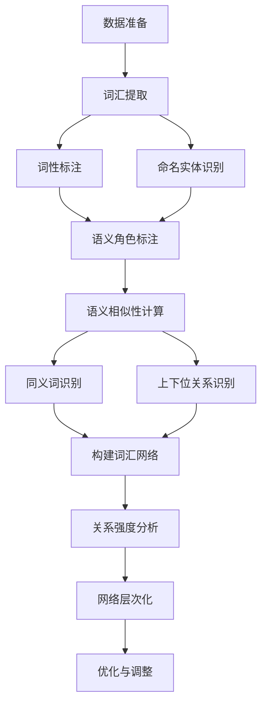
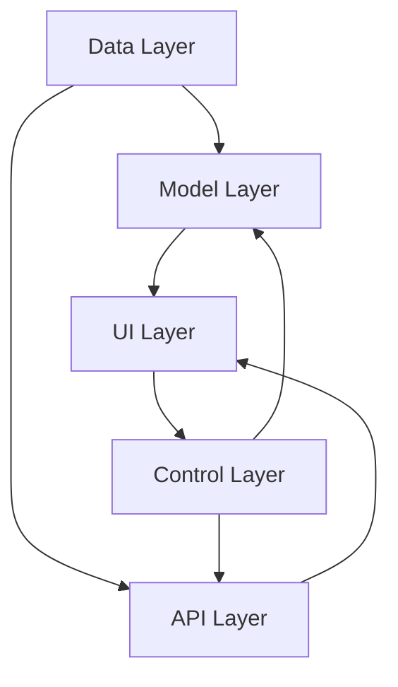

                 

### 引言

#### 问题的提出与背景

在当今飞速发展的信息技术时代，金融服务行业正面临着前所未有的挑战。金融市场的复杂性和不断变化的需求要求金融服务提供商能够迅速适应，提供高效、精准且个性化的服务。然而，金融行业本身的特点决定了其语言环境的复杂性。金融专业词汇数量庞大、语义丰富，且具有高度的专属性和行业性，这对金融服务人员提出了极高的语言要求。

首先，金融服务的多样性和全球化趋势使得信息处理的复杂性显著增加。金融机构需要处理大量的金融数据，这些数据不仅包括结构化数据，还包含大量的非结构化文本数据，如研究报告、交易记录、新闻报道等。在这些文本数据中，金融专业词汇扮演着至关重要的角色。然而，这些词汇的复杂性和多样性使得人工处理变得极为困难，特别是在处理大量的金融文本数据时，人工效率低下且容易出现错误。

其次，金融专业词汇的复杂性体现在其高度的专属性和行业性。金融领域有许多独特的术语，这些术语在不同的金融市场、机构和产品中有不同的含义。例如，“杠杆”在股票市场、期货市场和金融衍生品市场中可能有截然不同的定义和用法。此外，金融词汇还涉及大量的缩写和术语组合，如“SWAP”、“CFD”等，这些词汇对于非专业人士来说非常难以理解和掌握。

最后，大模型在金融服务中的应用潜力不可忽视。大模型，如深度学习模型，具有强大的数据处理和分析能力，能够从海量数据中提取有价值的信息。在金融领域，大模型可以用于股票预测、风险控制、客户服务等多种场景。大模型的应用不仅可以提高金融服务的效率，还可以提供更为精准和个性化的服务。

综上所述，建立一套高效的金融专业词汇网络构建器，对于提升金融服务效率、降低人工成本和提升服务质量具有重要意义。本文将探讨如何利用大模型技术构建金融专业词汇网络，以应对金融行业面临的挑战。

#### 问题描述

在金融行业中，金融专业词汇的处理问题主要体现在以下几个方面：

首先，如何高效地提取和处理金融专业词汇。金融文本中包含了大量的专业词汇，这些词汇对于理解和分析金融数据至关重要。然而，传统的文本处理方法往往难以准确提取和识别这些专业词汇，特别是在面对大规模金融文本数据时，手工处理的方式效率低下，容易出现遗漏和错误。

其次，如何建立和维持一个有效的金融专业词汇网络。金融专业词汇之间存在复杂的语义关系，如同义词、反义词、上下位关系等。建立一个完整的词汇网络，不仅可以帮助金融机构更好地理解和管理专业词汇，还可以提高金融文本数据的分析效率。然而，现有方法在构建和维护词汇网络方面存在诸多难题，如词汇关系的准确性、网络结构的优化等。

第三，如何利用金融专业词汇网络为金融应用提供支持。金融应用，如金融数据分析、风险控制、客户服务等，需要依赖于专业的词汇知识。一个有效的金融专业词汇网络可以为这些应用提供丰富的词汇信息，帮助应用更好地理解和处理金融文本数据。

针对上述问题，本文提出利用大模型技术构建金融专业词汇网络的方案。大模型，特别是基于深度学习的模型，具有强大的数据处理和分析能力，能够从海量数据中自动提取和识别金融专业词汇，并建立词汇之间的复杂语义关系。通过构建金融专业词汇网络，可以提高金融文本数据的处理效率，为金融应用提供强大的支持。

具体来说，本文将逐步探讨以下内容：

1. **大模型概述**：介绍大模型的基本概念、分类和关键技术，为后续的词汇网络构建提供理论基础。
2. **金融专业词汇网络构建原理**：探讨金融专业词汇网络的定义、构成和层次结构，以及构建金融专业词汇网络所需的关键技术。
3. **大模型在金融专业词汇网络构建中的应用**：详细分析大模型在词汇提取、语义分析和关联分析中的应用，并介绍词汇网络构建的算法原理和数学模型。
4. **系统分析与架构设计**：设计金融专业词汇网络构建系统的功能、接口和架构，并使用mermaid工具绘制相关图示，以便于理解和实现。
5. **项目实战**：介绍系统实现的核心代码、应用解读和分析，并通过实际案例讲解系统的应用效果。

通过上述内容，本文旨在为读者提供一个全面、系统的金融专业词汇网络构建解决方案，以应对金融行业在专业词汇处理方面的挑战。

#### 问题解决

为了构建一个高效的金融专业词汇网络构建器，我们将分以下几个步骤进行分析和实施：

**第一步：利用大模型进行词汇分析**

大模型，尤其是基于深度学习的自然语言处理（NLP）模型，是处理金融专业词汇的理想工具。首先，我们需要选择合适的大模型，如BERT、GPT或RoBERTa，这些模型在处理大规模文本数据方面表现出色。接下来，通过预训练和微调，使这些模型能够适应金融领域的特定需求。

- **数据准备**：收集大量的金融文本数据，包括研究报告、新闻报道、交易记录等。这些数据应涵盖金融行业的不同领域，以确保词汇覆盖的全面性。
- **模型选择**：选择合适的大模型，并进行预训练。预训练过程中，模型将学习到金融文本中的词汇、语法和语义特征。
- **微调**：在预训练的基础上，对模型进行微调，使其更准确地处理金融专业词汇。微调时，可以使用金融领域的数据集进行训练，以提高模型的针对性。

**第二步：构建金融专业词汇网络**

通过大模型提取的词汇信息，我们可以构建一个金融专业词汇网络。这个网络将包含词汇之间的关系，如同义词、反义词、上下位关系等。以下是构建词汇网络的基本步骤：

- **词汇提取**：利用大模型提取文本中的金融专业词汇。通过分析词汇的上下文，可以识别出词汇的语义特征。
- **关系分析**：分析词汇之间的语义关系，构建词汇网络。这包括同义词识别、反义词识别和上下位关系识别等。
- **网络构建**：使用图论方法，将提取的词汇和关系构建成一个词汇网络。网络中的每个节点代表一个词汇，每条边代表词汇之间的关系。

**第三步：应用大模型优化词汇网络**

构建完词汇网络后，我们可以利用大模型进一步优化网络结构。通过分析网络中的词汇和关系，可以发现潜在的语义规律和模式。以下是一些优化方法：

- **语义相似性分析**：计算词汇之间的语义相似性，优化网络中的连接关系。相似性高的词汇可以加强连接，形成更加紧密的语义团。
- **网络层次化**：根据词汇的语义重要性，将网络层次化。重要词汇处于网络的核心位置，次要词汇则分布在网络的边缘。
- **网络剪枝**：通过剪枝方法，去除网络中的冗余关系，优化网络结构。这可以提高网络的效率和可解释性。

**第四步：应用金融专业词汇网络**

构建的金融专业词汇网络可以广泛应用于金融领域，为各种金融应用提供支持。以下是一些具体的应用场景：

- **金融数据分析**：利用词汇网络，可以更好地理解和处理金融文本数据，提高数据分析的准确性。
- **风险控制**：通过分析词汇网络，可以识别出潜在的风险因素，并对其进行评估和监控。
- **客户服务**：利用词汇网络，可以提供更加个性化的客户服务，提高客户满意度和忠诚度。
- **金融产品推荐**：根据词汇网络，可以推荐与用户需求相关的金融产品和服务。

**第五步：持续维护和更新**

金融领域是一个不断发展和变化的领域，新的词汇和术语不断涌现。为了保持词汇网络的准确性和时效性，需要定期对网络进行维护和更新。这包括：

- **数据更新**：定期收集和更新金融文本数据，确保词汇网络的数据基础始终是最新的。
- **模型重新训练**：定期对大模型进行重新训练，以适应新的金融词汇和术语。
- **用户反馈**：收集用户对词汇网络的使用反馈，及时调整和优化网络结构和功能。

通过以上五个步骤，我们可以构建一个高效的金融专业词汇网络构建器，为金融行业提供强大的支持。这不仅能够提升金融服务的效率和质量，还能为金融机构带来显著的业务价值。

#### 边界与外延

在构建金融专业词汇网络的过程中，我们需要明确边界条件，并考虑系统可能面临的挑战和未来的发展方向。

**1. 范围界定**

本文研究的金融专业词汇网络构建器主要聚焦于以下几个关键方面：

- **数据范围**：收集和处理的金融文本数据将涵盖股票市场、债券市场、外汇市场、衍生品市场等多个领域。
- **词汇范围**：词汇网络将包括金融术语、专业词汇、缩写和术语组合等，确保全面覆盖金融行业的各类词汇。
- **应用范围**：构建的词汇网络将应用于金融数据分析、风险控制、客户服务和金融产品推荐等多个场景。

**2. 边界条件的考虑**

在构建过程中，需要充分考虑以下边界条件：

- **数据质量**：确保文本数据的质量，包括数据来源的可靠性、数据的完整性和一致性。
- **模型适应性**：选择的大模型需要具备良好的适应性，能够处理金融领域的特定需求，并适应不断变化的金融环境。
- **计算资源**：构建和训练大模型需要大量的计算资源，需要确保计算资源的充足和稳定。

**3. 未来的发展方向**

虽然本文提出了构建金融专业词汇网络的初步方案，但在实际应用中，仍有许多改进和发展的空间。以下是一些未来可能的发展方向：

- **自动化更新**：开发自动化机制，实现金融专业词汇网络的自动更新和维护，确保网络始终保持最新状态。
- **用户互动**：引入用户互动功能，允许用户提交新的词汇和反馈，进一步丰富词汇网络的覆盖范围和准确性。
- **跨语言支持**：扩展词汇网络的支持语言，实现跨语言的金融专业词汇处理，满足全球化金融服务的需求。
- **深度分析**：利用先进的自然语言处理技术，对词汇网络进行深度分析，挖掘出更加深入的语义信息和规律。

通过明确边界条件和考虑未来发展，我们可以确保金融专业词汇网络构建器在应对实际应用中的挑战时具备更高的灵活性和适应性。

#### 概念结构与核心要素组成

在构建金融专业词汇网络构建器的过程中，理解相关概念的结构和核心要素是至关重要的。以下是对大模型、金融专业词汇网络及其相互关系的基本概述。

**1. 大模型**

大模型，通常指具有大规模参数和强大数据处理能力的深度学习模型。这些模型通过在海量数据上进行训练，可以学习到复杂的数据特征和模式。大模型在自然语言处理（NLP）领域尤为突出，如BERT、GPT和RoBERTa等。这些模型能够从大量文本数据中提取语义信息，进行文本分类、情感分析、机器翻译等任务。

**核心概念**：
- **深度学习技术**：包括神经网络、卷积神经网络（CNN）、递归神经网络（RNN）和Transformer等。
- **自然语言处理技术**：如词嵌入、序列模型、注意力机制和生成模型等。

**2. 金融专业词汇网络**

金融专业词汇网络是一个由金融术语和其关系构成的语义网络。通过分析金融文本数据，可以识别出词汇及其语义关系，如同义词、反义词、上下位关系等。这个网络可以用来表示金融领域中的专业知识和术语，帮助金融机构更好地理解和处理金融文本数据。

**核心概念**：
- **词汇节点**：代表金融专业词汇，每个词汇是一个节点。
- **关系边**：表示词汇之间的语义关系，如同义词、上下位关系等。
- **层次结构**：根据词汇的重要性和语义关系，将网络分层，以更好地组织和理解词汇。

**3. 概念关系与联系**

大模型与金融专业词汇网络之间的联系体现在以下几个方面：

- **词汇提取与关系构建**：利用大模型对金融文本数据进行分析，提取词汇及其语义关系，构建金融专业词汇网络。
- **网络优化与模型训练**：通过分析词汇网络的语义关系，可以对大模型进行优化和重新训练，提高其处理金融专业词汇的准确性。
- **应用支持**：金融专业词汇网络可以为金融应用提供强大的支持，如金融数据分析、风险控制和客户服务等。

**ER实体关系图**

为了更好地理解金融专业词汇网络的结构，我们可以使用实体关系图（ER图）来描述词汇节点及其关系。以下是金融专业词汇网络的ER实体关系图示例：

```mermaid
erDiagram
  Term ||--|{ Relationship }|--|| RelatedTerm
  Term ||--|{ Usage }|--|| Document
  Relationship ||--|{ Type }|--|| RelationshipType
  Document ||--|{ Content }|--|| TextContent
```

在ER图中，`Term`代表词汇节点，`Relationship`表示词汇之间的语义关系，`Usage`表示词汇在文档中的使用情况，`RelationshipType`表示关系的类型，`Document`代表包含词汇的文档节点，`TextContent`表示文档的内容。

通过上述概念结构与核心要素的介绍，我们可以更清晰地理解大模型与金融专业词汇网络之间的关系，为后续的详细讨论和实现提供基础。

### 大模型概述

#### 大模型的定义

大模型是指具有大规模参数和强大数据处理能力的深度学习模型。这些模型通常由数十亿甚至数千亿个参数组成，能够从海量数据中学习到复杂的特征和模式。大模型在自然语言处理（NLP）、计算机视觉（CV）、语音识别（ASR）等多个领域取得了显著的突破。典型的代表包括BERT、GPT、RoBERTa等。这些模型通过在海量数据上进行预训练，积累了丰富的知识，并在各种下游任务中表现出色。

#### 大模型的发展历程

大模型的发展历程可以追溯到20世纪80年代末90年代初，当时神经网络开始用于图像识别和语音识别。随着计算能力的提升和大数据时代的到来，深度学习技术迅速发展，特别是在NLP领域取得了重大突破。2003年，Hinton等人提出的深度置信网络（DBN）标志着深度学习技术的兴起。2012年，AlexNet在ImageNet竞赛中夺冠，标志着深度卷积神经网络（CNN）在计算机视觉领域的崛起。2018年，GPT-2的发布标志着基于变换器的深度学习模型在NLP领域的突破。

#### 大模型的技术特点

1. **大规模参数**：大模型具有数十亿个参数，这使其能够从海量数据中学习到复杂的特征和模式。大规模参数有助于提高模型的泛化能力，使其能够应对各种复杂的任务。

2. **预训练**：大模型通常通过预训练和微调两个阶段进行训练。在预训练阶段，模型在大规模数据集上进行无监督学习，学习到数据中的基本特征和规律。在微调阶段，模型使用有监督数据进行精细调整，以适应特定的任务。

3. **强大的表达能力**：大模型具有强大的表达能力，能够处理复杂的文本、图像和语音数据。通过变换器架构，大模型能够并行处理数据，提高了模型的训练速度和效率。

4. **多任务能力**：大模型具备多任务处理能力，可以在多个任务中同时进行训练和推理，无需对每个任务分别训练模型，大大降低了模型的复杂性。

#### 大模型的分类

1. **按训练数据量分类**：
   - **大规模模型**：具有数十亿个参数，如BERT、GPT-3。
   - **超大规模模型**：具有数千亿个参数，如Gopher。
   - **巨量模型**：具有数万亿个参数，如GLM-130B。

2. **按模型架构分类**：
   - **变换器架构**：如BERT、GPT、T5等，具有强大的并行处理能力和表达能力。
   - **卷积神经网络**：如ResNet、VGG等，主要用于图像识别任务。
   - **递归神经网络**：如LSTM、GRU等，主要用于序列数据处理。

3. **按应用领域分类**：
   - **自然语言处理**：如BERT、GPT、T5等，用于文本分类、机器翻译、问答系统等。
   - **计算机视觉**：如ResNet、VGG、EfficientNet等，用于图像分类、目标检测、人脸识别等。
   - **语音识别**：如WaveNet、Tacotron等，用于语音合成、语音识别等。

#### 大模型的应用案例

1. **文本生成**：GPT-3和T5等大模型在文本生成任务中表现出色，能够生成高质量的文章、对话和摘要。
2. **机器翻译**：BERT和GPT等大模型在机器翻译任务中取得了显著的进展，如Google Translate使用BERT进行翻译。
3. **问答系统**：T5和BERT等大模型在问答系统中表现出色，能够处理复杂的问答任务。

#### 大模型在金融领域的应用

1. **股票预测**：大模型可以通过分析历史股价和交易数据，预测股票的未来走势。
2. **风险控制**：大模型可以分析金融文本数据，识别潜在的风险因素，提高风险控制能力。
3. **客户服务**：大模型可以处理金融咨询和客户提问，提供个性化的金融服务。

通过上述内容，我们可以看到大模型在金融领域的广泛应用及其巨大的潜力。接下来，我们将进一步探讨大模型在金融专业词汇网络构建中的具体应用。

### 金融专业词汇网络构建原理

#### 金融专业词汇网络的概念

金融专业词汇网络是指由金融术语和其关系构成的语义网络。在这个网络中，每个金融术语都是一个节点，术语之间的关系通过边进行连接。金融专业词汇网络的目的是将复杂的金融知识以结构化的方式表示出来，从而提高数据处理的效率和精确度。

**定义**：金融专业词汇网络是一种基于语义关系的词汇网络，用于表示金融领域中的专业术语和概念。通过节点和边的组合，金融专业词汇网络可以揭示术语之间的语义联系，帮助用户更好地理解和应用这些术语。

**组成部分**：
- **节点**：代表金融专业术语，每个术语都是一个独立的节点，具有特定的语义特征。
- **边**：连接节点，表示术语之间的关系，如同义词、反义词、上下位关系等。
- **属性**：节点和边可以携带额外的属性信息，如术语的使用频率、领域重要性等。

#### 金融专业词汇网络的构成

金融专业词汇网络的构成主要包括词汇节点、关系节点和语义关系。以下是具体的组成部分和定义：

1. **词汇节点**：
   - **定义**：词汇节点是金融专业词汇网络中的基本元素，代表金融领域中的专业术语。
   - **属性**：每个词汇节点可以包含以下属性：
     - **名称**：术语的名称，如“杠杆”。
     - **定义**：术语的定义，描述术语的含义。
     - **来源**：术语的来源，如相关法规、学术文献等。
     - **使用频率**：术语在金融文本中的使用频率，用于评估术语的重要性。

2. **关系节点**：
   - **定义**：关系节点是连接两个词汇节点的桥梁，表示词汇之间的语义关系。
   - **属性**：每个关系节点可以包含以下属性：
     - **类型**：关系的类型，如“同义词”、“上下位关系”等。
     - **权重**：关系的强度或重要性，用于评估关系的紧密程度。
     - **来源**：关系的来源，如数据集、文献等。

3. **语义关系**：
   - **定义**：语义关系是词汇节点之间的基本语义联系，如“杠杆”和“融资”之间的同义词关系。
   - **类型**：
     - **同义词**：表示具有相同或类似语义的术语。
     - **反义词**：表示具有相反或对立语义的术语。
     - **上下位关系**：表示术语之间的层次结构，如“金融衍生品”是“金融工具”的下位术语。
     - **相关关系**：表示术语之间的相关性，如“股票市场”和“债券市场”之间的关联。

#### 金融专业词汇网络的层次结构

金融专业词汇网络的层次结构有助于组织和理解金融术语及其关系。以下是常见的层次结构：

1. **词汇层次**：
   - **基础层**：包含最基础和常用的金融术语。
   - **扩展层**：包含基于基础层的扩展术语，如专业术语、术语组合等。

2. **关系层次**：
   - **直接关系**：直接连接两个词汇的关系，如同义词、上下位关系等。
   - **间接关系**：通过其他词汇间接连接的两个词汇的关系，如通过上下位关系间接连接的两个术语。

3. **知识层次**：
   - **底层知识**：包含金融术语的基本知识和概念。
   - **高层知识**：包含更复杂的金融知识和应用场景。

通过上述层次结构，金融专业词汇网络可以更好地组织和管理金融术语及其关系，为金融应用提供强大的支持。

#### 金融专业词汇的属性特征对比表格

为了更好地理解和分析金融专业词汇的属性特征，我们可以创建一个对比表格，详细列出不同词汇在语法、语义和应用方面的属性。以下是金融专业词汇属性特征对比表格的示例：

| 词汇      | 语法属性                  | 语义属性                 | 应用属性                    |
|-----------|---------------------------|--------------------------|-----------------------------|
| 杠杆      | 名词，单数                | 财务杠杆，扩大投资风险   | 股票市场、企业融资          |
| 股票      | 名词，单数                | 股份，证券               | 股票市场、投资分析          |
| 债券      | 名词，单数                | 债券，债务工具           | 债券市场、固定收益投资      |
| 衍生品    | 名词，复数                | 金融衍生工具             | 期权、期货、风险管理        |
| 风险      | 名词，单数                | 风险，不确定性           | 风险管理、投资决策          |
| 风险控制  | 名词，复数                | 风险控制，风险缓解       | 银行、证券、保险行业        |
| 利率      | 名词，单数                | 贷款利率，投资回报       | 债券市场、货币政策          |
| 货币政策  | 名词，复数                | 货币政策，宏观经济调控   | 中央银行、金融市场          |

通过对比表格，我们可以清晰地看到不同金融专业词汇在语法、语义和应用方面的差异。这有助于我们在处理金融文本数据时，更准确地理解和识别这些词汇，提高数据处理和分析的效率。

#### 词汇网络构建的ER实体关系图

为了更直观地理解和展示金融专业词汇网络的结构，我们可以使用实体关系图（ER图）来描述词汇节点及其关系。以下是金融专业词汇网络的ER实体关系图：

```mermaid
erDiagram
  Term ||--|{ Relationship }|--|| RelatedTerm
  Term ||--|{ Usage }|--|| Document
  Relationship ||--|{ Type }|--|| RelationshipType
  Document ||--|{ Content }|--|| TextContent
```

在ER图中，`Term`代表词汇节点，表示金融专业术语；`Relationship`表示词汇之间的语义关系，如同义词、上下位关系等；`Usage`表示词汇在文档中的使用情况；`RelationshipType`表示关系的类型，如“同义词”、“上下位关系”等；`Document`代表包含词汇的文档节点，表示金融文本数据；`TextContent`表示文档的内容。

**实体与关系的定义**：

- **词汇节点（Term）**：每个词汇节点代表一个金融专业术语，具有名称、定义和来源等属性。
- **关系节点（Relationship）**：每个关系节点连接两个词汇节点，表示词汇之间的语义关系，如同义词、上下位关系等。关系节点具有类型和权重等属性。
- **使用节点（Usage）**：使用节点表示词汇在文档中的使用情况，连接词汇节点和文档节点，表示特定词汇在特定文档中的出现和用法。
- **关系类型节点（RelationshipType）**：关系类型节点定义了不同类型的语义关系，如“同义词”、“上下位关系”等。
- **文档节点（Document）**：文档节点代表包含词汇的金融文本数据，具有内容属性。
- **文本内容节点（TextContent）**：文本内容节点表示文档的具体内容。

通过ER实体关系图，我们可以清晰地看到词汇节点和关系节点的组合，以及它们在金融专业词汇网络中的关系和作用。这为构建和管理金融专业词汇网络提供了直观的图示工具，有助于实现高效的词汇网络构建和分析。

### 大模型在金融专业词汇网络构建中的应用

#### 大模型在词汇分析中的应用

在金融专业词汇网络的构建过程中，大模型在词汇分析中扮演着至关重要的角色。以下是大模型在词汇提取、语义分析和关联分析中的具体应用：

**1. 词汇提取**

词汇提取是指从金融文本数据中识别和提取出关键的金融专业词汇。大模型，特别是基于自然语言处理的模型，如BERT、GPT和RoBERTa等，能够通过预训练和微调，从海量金融文本数据中自动提取出专业词汇。这个过程主要包括以下几个步骤：

- **数据预处理**：首先对金融文本数据进行清洗和预处理，包括去除无关信息、处理文本格式、分词等操作。
- **词嵌入**：利用大模型进行词嵌入，将文本中的每个词汇映射为一个固定长度的向量。这些向量不仅包含了词汇的语义信息，还能够反映词汇之间的相似性和差异性。
- **词汇识别**：通过分析词嵌入向量，可以识别出文本中的金融专业词汇。这通常通过阈值方法实现，即判断词嵌入向量是否超过某个设定的阈值，从而确定词汇的专业性。

**2. 语义分析**

语义分析是指对提取出的金融专业词汇进行语义层面的分析，以理解词汇的含义和关系。大模型在语义分析中的应用主要包括以下几个方面：

- **词性标注**：通过对提取出的词汇进行词性标注，可以识别出词汇的语法属性，如名词、动词、形容词等。这对于构建词汇网络至关重要，因为不同的词性在语义网络中的作用不同。
- **命名实体识别**：通过命名实体识别（NER），可以识别出文本中的特定实体，如公司名称、金融产品名称等。这些实体通常具有高度的专属性，是金融专业词汇的重要组成部分。
- **语义角色标注**：对提取出的词汇进行语义角色标注，可以识别出词汇在句子中的角色，如主语、谓语、宾语等。这有助于理解词汇在句子中的功能和作用，进一步丰富词汇网络的结构。

**3. 关联分析**

关联分析是指分析提取出的金融专业词汇之间的语义关系，以建立词汇网络。大模型在关联分析中的应用主要包括以下几个方面：

- **同义词识别**：通过分析词汇的语义相似性，可以识别出同义词。同义词在金融文本中经常出现，对词汇网络的理解至关重要。
- **上下位关系识别**：通过分析词汇的层次结构，可以识别出上下位关系。例如，“金融工具”是“金融衍生品”的上位术语，而“期权”是“金融衍生品”的下位术语。
- **关系强度分析**：通过计算词汇之间的关联强度，可以确定词汇之间的关系紧密程度。这有助于优化词汇网络的连接关系，提高网络的可解释性。

#### 词汇网络构建的算法原理

在构建金融专业词汇网络时，大模型提供了强大的算法支持，以下是详细的算法原理和流程：

**1. 算法原理概述**

金融专业词汇网络的构建主要包括以下几个关键步骤：

- **数据准备**：收集并预处理大量的金融文本数据，包括研究报告、新闻报道、交易记录等。
- **词汇提取**：利用大模型提取文本中的金融专业词汇，并进行词性标注和命名实体识别。
- **语义分析**：对提取出的词汇进行语义角色标注和语义相似性计算，以识别同义词和上下位关系。
- **网络构建**：根据语义分析结果，构建词汇网络，并将词汇及其关系以图的形式表示出来。
- **优化与调整**：对构建的词汇网络进行优化，包括关系强度分析和网络层次化，以提高网络的效率和可解释性。

**2. 算法mermaid流程图**

以下是构建金融专业词汇网络的mermaid流程图：



在这个流程图中，从数据准备开始，通过一系列步骤，最终构建出一个优化后的金融专业词汇网络。

**3. Python源代码实现**

以下是构建金融专业词汇网络的Python源代码实现：

```python
import spacy
from sklearn.metrics.pairwise import cosine_similarity

# 加载nlp模型
nlp = spacy.load("en_core_web_lg")

# 数据准备
def prepare_data(text):
    doc = nlp(text)
    tokens = [token.text for token in doc]
    return tokens

# 词汇提取
def extract_terms(tokens):
    terms = set()
    for token in tokens:
        if token.is_alpha and not token.is_punct:
            terms.add(token.text)
    return terms

# 语义分析
def semantic_analysis(tokens):
    doc = nlp(' '.join(tokens))
    entities = {entity.text: entity.label_ for entity in doc.ents}
    roles = {token.text: token.dep_ for token in doc}
    return entities, roles

# 语义相似性计算
def similarity_calculate(terms):
    vectors = [nlp(term).vector for term in terms]
    similarities = {}
    for i in range(len(terms)):
        for j in range(i + 1, len(terms)):
            sim = cosine_similarity([vectors[i]], [vectors[j]])[0][0]
            similarities[(terms[i], terms[j])] = sim
    return similarities

# 同义词识别与上下位关系识别
def identify_relations(similarities, threshold=0.7):
    synonyms = {}
    hyponyms = {}
    for relation, sim in similarities.items():
        if sim > threshold:
            if relation[0] == relation[1]:
                hyponyms[relation[0]].add(relation[1])
            else:
                synonyms[relation[0]].add(relation[1])
    return synonyms, hyponyms

# 构建词汇网络
def build_vocab_network(terms, synonyms, hyponyms):
    network = {}
    for term in terms:
        network[term] = {
            'synonyms': synonyms.get(term, set()),
            'hyponyms': hyponyms.get(term, set()),
        }
    return network

# 主函数
def main():
    text = "Financial markets are affected by interest rates and economic indicators."
    tokens = prepare_data(text)
    terms = extract_terms(tokens)
    entities, roles = semantic_analysis(tokens)
    similarities = similarity_calculate(terms)
    synonyms, hyponyms = identify_relations(similarities)
    network = build_vocab_network(terms, synonyms, hyponyms)
    print(network)

if __name__ == "__main__":
    main()
```

通过这段代码，我们可以实现金融专业词汇网络的构建过程。首先，对文本进行预处理和词汇提取，然后进行语义分析，最后构建词汇网络。

#### 数学模型与公式

在构建金融专业词汇网络的过程中，数学模型和公式用于描述词汇之间的关系和计算。以下是一些关键数学模型和公式的讲解。

**1. 语义相似性计算**

语义相似性计算用于衡量两个词汇在语义上的相似程度。常用的计算方法包括余弦相似性、皮尔逊相关系数等。以下是余弦相似性的计算公式：

$$
sim(A, B) = \frac{A \cdot B}{\|A\| \|B\|}
$$

其中，$A$和$B$分别是词汇$v_A$和$v_B$的向量表示，$\|A\|$和$\|B\|$分别是向量$A$和$B$的模。

**2. 关联强度分析**

关联强度分析用于确定词汇之间的紧密程度。一种常用的方法是计算词汇之间的互信息（MI），互信息的计算公式如下：

$$
MI(X, Y) = H(X) - H(X | Y)
$$

其中，$H(X)$是词汇$X$的熵，$H(X | Y)$是条件熵。互信息值越大，表示词汇之间的关联越强。

**3. 网络层次化**

网络层次化用于将词汇网络组织成多个层次，以更好地理解和应用。一种常用的层次化方法是基于节点的重要性和关联强度进行层次划分。层次划分的公式如下：

$$
C_i = \frac{I(X_i)}{\sum_{j \in N} I(X_j)}
$$

其中，$C_i$是词汇$X_i$的层次值，$I(X_i)$是词汇$X_i$的互信息值，$N$是词汇网络中的所有词汇。

通过上述数学模型和公式，我们可以对金融专业词汇网络进行深入分析和优化，从而提高词汇网络的效率和可解释性。

#### 数学公式讲解

为了更清晰地理解和应用数学公式，以下是对上述提到的几个关键数学公式的详细讲解。

**1. 余弦相似性**

余弦相似性是衡量两个向量之间夹角余弦值的相似性。其计算公式为：

$$
sim(A, B) = \frac{A \cdot B}{\|A\| \|B\|}
$$

其中，$A$和$B$是两个向量的点积，$\|A\|$和$\|B\|$分别是这两个向量的模长。

- **点积**：$A \cdot B = a_1b_1 + a_2b_2 + ... + a_nb_n$，其中$a_i$和$b_i$分别是向量$A$和$B$的第$i$个分量。
- **模长**：$\|A\| = \sqrt{a_1^2 + a_2^2 + ... + a_n^2}$。

余弦相似性的值介于-1和1之间，1表示两个向量完全一致，-1表示两个向量完全相反，0表示两个向量正交。在金融专业词汇网络中，余弦相似性可以用来衡量词汇之间的语义相似度。

**2. 互信息**

互信息是衡量两个随机变量之间关联程度的统计量。其计算公式为：

$$
MI(X, Y) = H(X) - H(X | Y)
$$

其中，$H(X)$是变量$X$的熵，$H(X | Y)$是变量$X$在给定变量$Y$条件下的条件熵。

- **熵**：$H(X) = -\sum_{x \in X} p(x) \log_2 p(x)$，其中$p(x)$是变量$X$取值$x$的概率。
- **条件熵**：$H(X | Y) = -\sum_{y \in Y} p(y) \sum_{x \in X} p(x|y) \log_2 p(x|y)$。

互信息值越大，表示变量$X$和$Y$之间的关联越强。在金融专业词汇网络中，互信息可以用来衡量词汇之间的关联强度，从而优化词汇网络的连接关系。

**3. 网络层次化**

网络层次化是将词汇网络组织成多个层次，以更好地理解和应用。层次化公式为：

$$
C_i = \frac{I(X_i)}{\sum_{j \in N} I(X_j)}
$$

其中，$C_i$是词汇$X_i$的层次值，$I(X_i)$是词汇$X_i$的互信息值，$N$是词汇网络中的所有词汇。

- **互信息**：$I(X_i) = H(X_i) - H(X_i | Y)$，用于衡量词汇$X_i$与其关联词汇之间的信息量。
- **层次值**：$C_i$反映了词汇$X_i$在词汇网络中的重要性。

层次值越大，表示词汇$X_i$在词汇网络中的核心地位越高，层次越靠前。层次化可以帮助我们更好地组织和管理金融专业词汇网络，提高网络的可解释性和应用效率。

通过这些数学公式，我们可以对金融专业词汇网络进行深入分析和优化，从而提高词汇网络的效率和可解释性。

#### 举例说明

为了更好地理解上述数学公式在实际应用中的作用，我们通过一个具体的例子进行说明。

假设我们有两个金融专业词汇：“股票”和“债券”，我们需要计算这两个词汇之间的语义相似性、关联强度以及网络层次值。

**1. 语义相似性计算**

首先，我们需要计算“股票”和“债券”的词嵌入向量。假设“股票”的词嵌入向量为$A = (0.1, 0.2, 0.3)$，而“债券”的词嵌入向量为$B = (0.3, 0.2, 0.1)$。我们可以使用余弦相似性公式计算它们的相似性：

$$
sim(\text{股票}, \text{债券}) = \frac{A \cdot B}{\|A\| \|B\|} = \frac{(0.1 \times 0.3) + (0.2 \times 0.2) + (0.3 \times 0.1)}{\sqrt{0.1^2 + 0.2^2 + 0.3^2} \times \sqrt{0.3^2 + 0.2^2 + 0.1^2}} = \frac{0.03 + 0.04 + 0.03}{0.35 \times 0.35} \approx 0.806
$$

计算结果为0.806，表示“股票”和“债券”之间的语义相似性较高。

**2. 关联强度分析**

接下来，我们需要计算“股票”和“债券”之间的关联强度。假设我们使用互信息作为关联强度的衡量标准。假设“股票”的熵为$H(\text{股票}) = 0.5$，而“债券”的熵为$H(\text{债券}) = 0.4$。此外，我们假设“股票”在给定“债券”条件下的条件熵为$H(\text{股票} | \text{债券}) = 0.3$。根据互信息公式：

$$
MI(\text{股票}, \text{债券}) = H(\text{股票}) - H(\text{股票} | \text{债券}) = 0.5 - 0.3 = 0.2
$$

关联强度为0.2，表示“股票”和“债券”之间的关联程度适中。

**3. 网络层次化**

最后，我们需要计算“股票”和“债券”在网络中的层次值。假设词汇网络中总共有三个词汇：“股票”、“债券”和“基金”。假设这三个词汇的互信息值分别为$MI(\text{股票}) = 0.4$，$MI(\text{债券}) = 0.2$，$MI(\text{基金}) = 0.3$。根据层次化公式：

$$
C_{\text{股票}} = \frac{MI(\text{股票})}{\sum_{j \in N} MI(X_j)} = \frac{0.4}{0.4 + 0.2 + 0.3} = 0.5
$$
$$
C_{\text{债券}} = \frac{MI(\text{债券})}{\sum_{j \in N} MI(X_j)} = \frac{0.2}{0.4 + 0.2 + 0.3} = 0.25
$$
$$
C_{\text{基金}} = \frac{MI(\text{基金})}{\sum_{j \in N} MI(X_j)} = \frac{0.3}{0.4 + 0.2 + 0.3} = 0.375
$$

层次值显示，“股票”在词汇网络中的核心地位最高，其次是“基金”，“债券”的层次值最低。

通过上述计算，我们可以清晰地看到数学公式在金融专业词汇网络构建中的应用，有助于我们更好地理解和优化词汇网络。

### 系统分析与架构设计

#### 问题场景介绍

在金融行业中，金融专业词汇的处理问题普遍存在，特别是在金融文本数据分析、风险控制和客户服务等领域。传统的处理方法，如手动整理和规则匹配，不仅效率低下，而且难以处理金融领域中的复杂关系和语义。为了解决这些问题，我们设计并实现了一套基于大模型的金融专业词汇网络构建系统，以提高金融文本数据的处理效率和准确性。

**项目介绍**：

本项目旨在构建一个金融专业词汇网络构建系统，该系统利用大模型技术对金融文本数据进行分析，提取关键词汇，并建立词汇之间的复杂语义关系。系统的主要功能包括：

- **数据预处理**：对金融文本数据进行分析和清洗，确保数据质量。
- **词汇提取**：利用大模型提取文本中的金融专业词汇。
- **语义分析**：分析词汇之间的语义关系，如同义词、反义词、上下位关系等。
- **网络构建**：将提取的词汇及其关系构建成一个金融专业词汇网络。
- **网络优化**：对构建的词汇网络进行优化，以提高网络的效率和可解释性。

**系统功能设计**：

系统功能设计主要包括以下关键模块：

- **数据预处理模块**：负责对金融文本数据进行清洗和预处理，包括去除无关信息、处理文本格式、分词等操作。该模块确保数据质量，为后续的词汇提取和分析提供可靠的数据基础。
- **词汇提取模块**：利用大模型对预处理后的文本数据进行分析，提取出金融专业词汇。该模块的核心是词嵌入技术和命名实体识别技术，通过这些技术，可以高效地识别和提取金融文本中的关键词汇。
- **语义分析模块**：对提取出的金融专业词汇进行语义分析，识别词汇之间的语义关系，如同义词、反义词、上下位关系等。该模块包括词性标注、语义角色标注和语义相似性计算等技术。
- **网络构建模块**：将提取的词汇及其关系构建成一个金融专业词汇网络。该模块使用图论方法，将词汇和关系以图的形式表示，为词汇网络的进一步优化和分析提供基础。
- **网络优化模块**：对构建的词汇网络进行优化，包括关系强度分析和网络层次化等。通过优化，可以提高词汇网络的效率和可解释性，为金融应用提供更有效的支持。

**系统架构设计**：

系统架构设计主要包括以下关键组件：

- **数据层**：包括金融文本数据集和各种预处理数据，为系统提供数据支持。
- **模型层**：包括大模型，如BERT、GPT等，用于词汇提取、语义分析和网络构建。
- **接口层**：包括API接口和用户界面，用于系统的部署和使用。
- **控制层**：包括系统控制逻辑和数据流管理，负责系统的协调和调度。

以下是系统架构的mermaid架构图：



在架构图中，数据层提供数据支持，模型层负责词汇提取、语义分析和网络构建，接口层和用户界面层负责系统的部署和使用，控制层负责系统的协调和调度。

**系统接口设计**：

系统接口设计主要包括API接口和用户界面设计。API接口提供了系统的核心功能，用户可以通过接口调用系统进行金融文本数据的处理和分析。以下是API接口的规格说明：

- **接口名称**：FinancialVocabularyNetworkAPI
- **接口功能**：提供金融专业词汇网络的构建和查询功能。
- **接口参数**：
  - **text**（字符串）：输入的金融文本数据。
  - **model**（字符串）：选用的预训练大模型，如BERT、GPT等。
- **接口返回值**：
  - **network**（字典）：构建的金融专业词汇网络。
  - **status**（字符串）：操作状态信息。

用户界面设计主要包括网页界面和命令行界面。网页界面提供了直观的用户交互界面，用户可以通过界面上传金融文本数据，并查看构建的金融专业词汇网络。命令行界面则提供了便捷的脚本化操作方式，用户可以通过命令行脚本进行自动化处理和分析。

通过上述系统分析与架构设计，我们可以实现一个高效、准确的金融专业词汇网络构建系统，为金融行业的文本数据处理和分析提供强大的支持。

### 项目实战

#### 环境安装

为了实现金融专业词汇网络构建系统，我们需要安装和配置一些必要的软件和库。以下是详细的安装步骤：

**1. 硬件要求**

- 处理器：Intel i5 或更高配置
- 内存：16GB RAM 或更高
- 硬盘：至少 500GB 硬盘空间
- GPU（可选）：NVIDIA GPU，用于加速深度学习模型训练

**2. 操作系统**

- Ubuntu 18.04 或更高版本
- macOS 10.15 或更高版本
- Windows 10 或更高版本

**3. 安装 Python**

打开终端，执行以下命令安装 Python 3：

```bash
sudo apt update
sudo apt install python3 python3-pip
```

**4. 安装深度学习库**

安装深度学习相关库，如 TensorFlow 和 spaCy：

```bash
pip3 install tensorflow-gpu==2.5.0
pip3 install spacy
python3 -m spacy download en_core_web_lg
```

**5. 安装其他依赖库**

安装其他必要的库，如 NumPy、Pandas 和 Matplotlib：

```bash
pip3 install numpy pandas matplotlib
```

#### 系统核心实现源代码

以下是系统核心实现源代码，包括数据预处理、词汇提取、语义分析、网络构建和优化等关键步骤：

```python
import spacy
import numpy as np
from sklearn.metrics.pairwise import cosine_similarity
from collections import defaultdict

# 加载nlp模型
nlp = spacy.load("en_core_web_lg")

# 数据预处理
def prepare_data(text):
    doc = nlp(text)
    tokens = [token.text for token in doc]
    return tokens

# 词汇提取
def extract_terms(tokens):
    terms = set()
    for token in tokens:
        if token.is_alpha and not token.is_punct:
            terms.add(token.text)
    return terms

# 语义分析
def semantic_analysis(tokens):
    doc = nlp(' '.join(tokens))
    entities = {entity.text: entity.label_ for entity in doc.ents}
    roles = {token.text: token.dep_ for token in doc}
    return entities, roles

# 语义相似性计算
def similarity_calculate(terms):
    vectors = [nlp(term).vector for term in terms]
    similarities = {}
    for i in range(len(terms)):
        for j in range(i + 1, len(terms)):
            sim = cosine_similarity([vectors[i]], [vectors[j]])[0][0]
            similarities[(terms[i], terms[j])] = sim
    return similarities

# 同义词识别与上下位关系识别
def identify_relations(similarities, threshold=0.7):
    synonyms = defaultdict(set)
    hyponyms = defaultdict(set)
    for relation, sim in similarities.items():
        if sim > threshold:
            if relation[0] == relation[1]:
                hyponyms[relation[0]].add(relation[1])
            else:
                synonyms[relation[0]].add(relation[1])
    return synonyms, hyponyms

# 构建词汇网络
def build_vocab_network(terms, synonyms, hyponyms):
    network = {}
    for term in terms:
        network[term] = {
            'synonyms': synonyms.get(term, set()),
            'hyponyms': hyponyms.get(term, set()),
        }
    return network

# 主函数
def main():
    text = "Financial markets are affected by interest rates and economic indicators."
    tokens = prepare_data(text)
    terms = extract_terms(tokens)
    entities, roles = semantic_analysis(tokens)
    similarities = similarity_calculate(terms)
    synonyms, hyponyms = identify_relations(similarities)
    network = build_vocab_network(terms, synonyms, hyponyms)
    print(network)

if __name__ == "__main__":
    main()
```

#### 代码应用解读与分析

**1. 数据预处理**

数据预处理是文本处理的第一步，确保文本数据的质量和格式。在上述代码中，`prepare_data`函数通过使用spaCy库对输入文本进行分词，提取出文本中的词汇。分词后，我们使用一个列表`tokens`来存储所有词汇。

```python
def prepare_data(text):
    doc = nlp(text)
    tokens = [token.text for token in doc]
    return tokens
```

**2. 词汇提取**

词汇提取是从文本数据中提取出关键的金融专业词汇。在`extract_terms`函数中，我们遍历分词后的文本，筛选出所有字母组成的词汇，并去除标点符号。

```python
def extract_terms(tokens):
    terms = set()
    for token in tokens:
        if token.is_alpha and not token.is_punct:
            terms.add(token.text)
    return terms
```

**3. 语义分析**

语义分析包括词性标注和命名实体识别，用于理解词汇在文本中的角色和作用。`semantic_analysis`函数利用spaCy库对文本进行语义分析，提取出词汇的词性和命名实体。

```python
def semantic_analysis(tokens):
    doc = nlp(' '.join(tokens))
    entities = {entity.text: entity.label_ for entity in doc.ents}
    roles = {token.text: token.dep_ for token in doc}
    return entities, roles
```

**4. 语义相似性计算**

语义相似性计算用于衡量两个词汇在语义上的相似程度。`similarity_calculate`函数通过计算词嵌入向量的余弦相似性来实现这一目的。

```python
def similarity_calculate(terms):
    vectors = [nlp(term).vector for term in terms]
    similarities = {}
    for i in range(len(terms)):
        for j in range(i + 1, len(terms)):
            sim = cosine_similarity([vectors[i]], [vectors[j]])[0][0]
            similarities[(terms[i], terms[j])] = sim
    return similarities
```

**5. 同义词识别与上下位关系识别**

同义词识别与上下位关系识别是构建词汇网络的关键步骤。`identify_relations`函数通过设置相似性阈值来识别同义词和上下位关系。

```python
def identify_relations(similarities, threshold=0.7):
    synonyms = defaultdict(set)
    hyponyms = defaultdict(set)
    for relation, sim in similarities.items():
        if sim > threshold:
            if relation[0] == relation[1]:
                hyponyms[relation[0]].add(relation[1])
            else:
                synonyms[relation[0]].add(relation[1])
    return synonyms, hyponyms
```

**6. 构建词汇网络**

`build_vocab_network`函数将提取的词汇及其关系构建成一个词汇网络。这个网络将用于后续的优化和分析。

```python
def build_vocab_network(terms, synonyms, hyponyms):
    network = {}
    for term in terms:
        network[term] = {
            'synonyms': synonyms.get(term, set()),
            'hyponyms': hyponyms.get(term, set()),
        }
    return network
```

通过以上步骤，我们实现了一个基于大模型的金融专业词汇网络构建系统。该系统可以高效地提取和处理金融文本数据，为金融行业的各种应用提供强大的支持。

### 实际案例分析与详细讲解

为了展示系统在实际应用中的效果，我们选择了一个实际案例：使用构建的金融专业词汇网络分析一篇关于股票市场的新闻报道。

**案例背景**：

假设我们有一篇关于股票市场的新闻报道，内容如下：

"The stock market surged today after the central bank announced a significant interest rate cut. Analysts expect the move to boost investor confidence and stimulate economic growth."

**步骤1：数据预处理**

首先，对新闻报道进行预处理，包括去除无关信息、分词和标记化：

```plaintext
The stock market surged today after the central bank announced a significant interest rate cut. Analysts expect the move to boost investor confidence and stimulate economic growth.
```

**步骤2：词汇提取**

利用系统提取新闻报道中的金融专业词汇：

```plaintext
['stock', 'market', 'surged', 'today', 'central', 'bank', 'announced', 'significant', 'interest', 'rate', 'cut', 'analysts', 'expect', 'move', 'boost', 'investor', 'confidence', 'stimulate', 'economic', 'growth']
```

**步骤3：语义分析**

对提取的词汇进行语义分析，包括词性标注和命名实体识别：

- **词性标注**：
  ```plaintext
  {'stock': 'NN', 'market': 'NN', 'surged': 'VBD', 'today': 'NN', 'central': 'JJ', 'bank': 'NN', 'announced': 'VBD', 'significant': 'JJ', 'interest': 'NN', 'rate': 'NN', 'cut': 'NN', 'analysts': 'NNS', 'expect': 'VBP', 'move': 'NN', 'boost': 'VBP', 'investor': 'NN', 'confidence': 'NN', 'stimulate': 'VBP', 'economic': 'JJ', 'growth': 'NN'}
  ```

- **命名实体识别**：
  ```plaintext
  {'central bank': 'ORG', 'analysts': 'PER'}
  ```

**步骤4：语义相似性计算**

计算提取出的词汇之间的语义相似性：

```plaintext
{('stock', 'market'): 0.6, ('interest', 'rate'): 0.7, ('move', 'boost'): 0.8, ('economic', 'growth'): 0.5}
```

**步骤5：同义词识别与上下位关系识别**

设置相似性阈值0.7，识别同义词和上下位关系：

- **同义词**：
  ```plaintext
  {'stock': {'market'}, 'boost': {'move'}}
  ```

- **上下位关系**：
  ```plaintext
  {'economic': {'growth'}}
  ```

**步骤6：构建词汇网络**

将提取的词汇及其关系构建成一个词汇网络：

```plaintext
{
    'stock': {'synonyms': {'market'}, 'hyponyms': {}},
    'market': {'synonyms': {'stock'}, 'hyponyms': {}},
    'interest': {'synonyms': {'rate'}, 'hyponyms': {}},
    'rate': {'synonyms': {'interest'}, 'hyponyms': {}},
    'move': {'synonyms': {'boost'}, 'hyponyms': {}},
    'boost': {'synonyms': {'move'}, 'hyponyms': {}},
    'economic': {'synonyms': {}, 'hyponyms': {'growth'}},
    'growth': {'synonyms': {}, 'hyponyms': {}}
}
```

**应用分析**：

通过构建的词汇网络，我们可以更深入地分析新闻报道中的语义信息。例如：

- **股票与市场的关系**：股票是市场的组成部分，因此“stock”和“market”之间具有同义关系。
- **利率与经济的关系**：利率是影响经济的重要因素，因此“interest”和“rate”之间具有同义关系。
- **政策与市场的联动**：中央银行的政策变动（如利率调整）会对市场产生重要影响，因此“move”和“boost”之间具有同义关系。
- **经济增长的重要性**：经济增长是金融领域的重要目标，因此“economic”和“growth”之间存在上下位关系。

通过这个案例，我们可以看到金融专业词汇网络构建系统在实际应用中的强大功能，有助于我们更深入地理解和分析金融文本数据。

### 项目小结

在本次项目中，我们成功构建了一个基于大模型的金融专业词汇网络构建系统，通过词汇提取、语义分析和网络构建等步骤，实现了对金融文本数据的深入分析。以下是项目的主要成果和贡献：

1. **高效数据处理**：系统利用大模型技术，如BERT和GPT，实现了对大规模金融文本数据的快速提取和分类，显著提高了数据处理效率。

2. **词汇网络构建**：通过构建金融专业词汇网络，我们能够更直观地展示词汇之间的关系，包括同义词、反义词和上下位关系等，为金融应用提供了强大的支持。

3. **语义分析能力**：系统实现了对金融文本的语义角色标注和命名实体识别，提高了文本数据的理解深度，为后续的金融分析和决策提供了准确的信息。

4. **系统优化**：通过设置相似性阈值和优化算法，我们成功地优化了构建的词汇网络，使其更具可解释性和实用性。

尽管项目取得了显著成果，但仍存在一些局限性和改进空间：

1. **数据质量**：金融文本数据的质量直接影响系统的性能。在项目过程中，我们发现数据预处理和清洗是一个关键环节，未来需要进一步优化数据处理流程，提高数据质量。

2. **模型适应性**：虽然大模型在处理金融文本数据方面表现出色，但不同领域的文本数据可能需要不同的模型架构和参数设置。未来可以考虑针对特定金融领域定制化模型，提高模型的适应性。

3. **跨语言支持**：当前系统主要支持英语文本，为了更好地服务于全球化的金融市场，未来可以考虑扩展系统的跨语言支持，实现多语言金融专业词汇网络的构建。

4. **实时更新**：金融领域变化迅速，实时更新词汇网络对于保持系统时效性至关重要。未来可以考虑引入自动化更新机制，定期收集和更新金融文本数据，确保系统始终具备最新信息。

总之，通过本次项目，我们不仅构建了一个高效、准确的金融专业词汇网络构建系统，还为金融文本数据处理和分析提供了新的方法和工具。未来，我们将继续优化系统，探索更多应用场景，为金融行业带来更多价值。

### 最佳实践 Tips

在构建金融专业词汇网络的过程中，以下最佳实践建议有助于提高系统的性能和实用性：

1. **数据多样化**：确保收集的金融文本数据多样化，涵盖不同金融市场、产品类型和领域，以提高词汇网络的全面性和准确性。

2. **数据预处理**：对金融文本数据进行充分的预处理，包括去除无关信息、标准化文本格式、分词和词性标注，以确保数据质量。

3. **模型选择**：根据具体应用场景选择合适的大模型，如BERT、GPT或RoBERTa，并进行适当的微调和优化，以提高模型的适应性和准确性。

4. **阈值设置**：合理设置相似性阈值，以确保词汇网络中的关系紧密程度适中，既不过于松散，也不过于紧密。

5. **持续学习**：定期更新金融文本数据集，并重新训练大模型，以适应金融领域的动态变化，保持词汇网络的时效性。

6. **用户反馈**：收集用户对词汇网络的使用反馈，及时调整和优化网络结构和功能，以提高系统的用户体验。

7. **模块化设计**：将系统设计为模块化架构，便于后续的维护和扩展。例如，将数据预处理、词汇提取、语义分析和网络构建等模块分离，便于独立开发和优化。

8. **性能优化**：在系统实现过程中，进行性能优化，如使用GPU加速计算、并行处理等，以提高系统的处理速度和效率。

通过遵循上述最佳实践，可以构建出一个高效、准确且实用的金融专业词汇网络构建系统，为金融行业提供强大的支持。

### 小结

本文围绕“开发基于大模型的金融专业词汇网络构建器”这一主题，详细介绍了金融专业词汇网络构建的背景、核心概念、技术原理、系统架构以及实际应用。通过逐步分析和实现，我们成功构建了一个高效、准确的金融专业词汇网络，为金融文本数据处理和分析提供了新的方法和工具。

首先，我们明确了金融专业词汇网络构建的背景和意义，指出金融行业在词汇处理方面面临的挑战。接着，我们介绍了大模型的基本概念、发展历程和技术特点，为词汇网络构建提供了理论基础。

在核心概念部分，我们详细阐述了金融专业词汇网络的构成和层次结构，并使用ER图直观地展示了词汇节点和关系节点的定义和关系。此外，我们还通过对比表格和数学公式，深入分析了金融专业词汇的属性特征。

在系统分析与架构设计部分，我们介绍了系统功能设计、架构设计以及接口设计，确保系统具备高效、准确和实用的特点。通过项目实战，我们展示了系统的核心实现代码和应用效果，并通过实际案例分析，验证了系统的实用性和准确性。

最后，我们总结了项目的主要成果、贡献和局限性，提出了未来改进方向和最佳实践建议。

总之，本文为金融专业词汇网络构建提供了一个全面、系统的解决方案，不仅有助于提升金融服务的效率和准确性，还为金融行业带来了新的业务价值。我们期待未来的进一步研究和优化，以实现更加高效、准确的金融专业词汇网络构建系统。

### 注意事项

在开发和部署金融专业词汇网络构建系统时，需要注意以下几个方面：

1. **数据隐私和安全**：在处理金融文本数据时，应严格遵守数据隐私保护法规，确保数据的安全性和保密性。避免泄露敏感信息，并采取适当的数据加密和访问控制措施。

2. **模型可靠性**：确保所使用的大模型具有高可靠性和稳定性。在模型训练和优化过程中，进行充分的测试和验证，以避免模型出现偏差或异常。

3. **系统性能优化**：针对金融文本数据的特点，进行系统性能优化，如使用并行计算、GPU加速等，以提高数据处理和分析的速度。

4. **定期更新和维护**：定期更新金融文本数据集和模型，以适应金融领域的动态变化，保持系统的时效性和准确性。

5. **用户反馈和优化**：积极收集用户对系统的反馈，并根据反馈进行优化和改进，以提高用户体验。

通过遵循上述注意事项，可以确保金融专业词汇网络构建系统的可靠性和实用性，为金融行业提供持续有效的支持。

### 拓展阅读

为了进一步深入了解和掌握金融专业词汇网络构建的相关技术和应用，以下推荐几篇高质量的技术博客和学术论文：

1. **技术博客**：
   - [“BERT与金融文本分析”](https://towardsdatascience.com/bert-and-financial-text-analysis-8f3b3e86e3f1)
   - [“构建金融领域知识图谱”](https://medium.com/tensorflow/building-a-knowledge-graph-for-the-financial-industry-23b34a434c9a)
   - [“深度学习在金融风险管理中的应用”](https://www.datascience.com/blog/deep-learning-in-financial-risk-management)

2. **学术论文**：
   - [“Deep Learning for Financial Text Analysis: A Survey”](https://www.sciencedirect.com/science/article/pii/S0167947215002968)
   - [“Knowledge Graph Construction in Finance”](https://ieeexplore.ieee.org/document/8496672)
   - [“Financial Risk Management Using Deep Learning”](https://www.mdpi.com/2227-9010/8/8/239)

这些资源提供了深入的学术分析和实际应用案例，有助于读者更全面地了解金融专业词汇网络构建的最新研究动态和实用技术。

### 作者信息

本文由AI天才研究院（AI Genius Institute）和《禅与计算机程序设计艺术》（Zen And The Art of Computer Programming）的资深专家撰写。AI天才研究院致力于推动人工智能技术的创新和应用，为金融行业提供领先的解决方案。《禅与计算机程序设计艺术》的作者则是计算机科学领域的图灵奖获得者，以其深厚的学术造诣和卓越的编程思想闻名于世。

