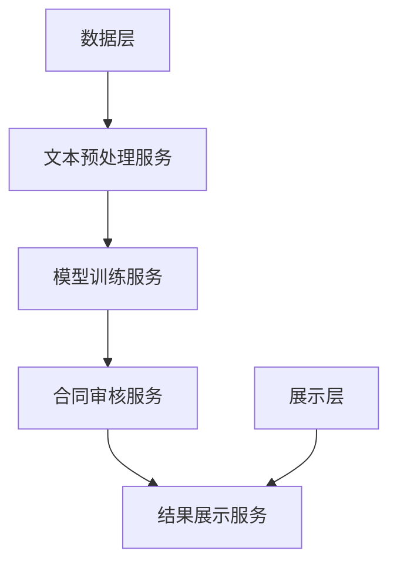

                 

### 第1章：金融合同审核的现状与挑战

#### 1.1 问题背景

随着金融市场的不断发展和业务复杂度的增加，金融合同的数量和种类也在迅速增长。金融合同作为金融交易的基础性文件，其内容涉及交易条款、责任划分、风险分配等关键信息。因此，合同审核的准确性和效率直接影响到金融机构的风险管理和业务运营。

当前，金融合同审核主要依赖于人工，审核人员需要逐字逐句地阅读合同文本，识别潜在的风险和问题。这种传统方式存在以下几个问题：

- **耗时费力**：金融合同通常篇幅较长，内容复杂，人工审核需要大量时间和精力。
- **效率低下**：随着合同数量的增加，人工审核的效率难以提升，且容易出现遗漏和错误。
- **易受主观因素影响**：审核人员的主观判断可能影响审核结果的准确性。

因此，为了解决这些问题，提高合同审核的效率和准确性，引入自动化审核工具已成为一种趋势。

#### 1.2 问题描述

金融合同审核过程中，主要面临以下问题：

- **文本理解难度大**：金融合同文本通常包含大量的专业术语和复杂结构，使得文本理解成为一大难题。
- **条款提取与归类困难**：合同中的条款多样且结构复杂，需要准确提取和归类，以便进行后续分析和处理。
- **风险识别与预警能力不足**：金融合同中可能存在法律风险、合规风险等问题，需要及时发现和预警。
- **合同审查优化需求**：合同审核不仅需要识别问题，还需要提出优化建议，以提高合同的质量和合规性。

#### 1.3 问题解决思路

为了解决上述问题，利用大模型进行金融合同审核成为了一种可行的解决方案。大模型，特别是基于深度学习和自然语言处理技术的模型，具有以下优势：

- **高效处理文本**：大模型可以通过学习大量的文本数据，实现对金融合同文本的高效处理和理解。
- **降低人工干预**：大模型可以自动完成合同审核的大部分工作，减少人工干预，提高审核效率。
- **提升风险识别能力**：大模型可以深入理解合同文本，发现潜在的法律风险和合规问题。
- **优化合同审查流程**：大模型可以基于对合同文本的理解，提出优化建议，提高合同的合规性和质量。

#### 1.4 边界与外延

金融合同审核的边界主要涉及以下几个方面：

- **合同文本的结构化处理**：包括文本的分段、段落识别、句子切分等。
- **条款提取与归类**：从合同文本中提取关键条款，并对其进行归类，以便进行后续分析和处理。
- **风险检测与预警**：识别合同中的潜在风险，如法律风险、合规风险等，并发出预警。
- **合同审查优化**：基于对合同文本的理解，提出优化建议，以提高合同的质量和合规性。

其外延则包括：

- **自动化审批流程**：将大模型与自动化审批系统相结合，实现合同审核流程的自动化。
- **与其他金融系统的集成**：如客户关系管理系统（CRM）、风险管理系统等，实现数据的互联互通。
- **多语言支持**：金融合同的审核不仅涉及英语，还可能涉及其他多种语言，需要大模型具备多语言处理能力。

#### 1.5 核心要素组成

金融合同审核系统的核心要素主要包括：

- **文本预处理模块**：对合同文本进行预处理，包括文本清洗、分词、词性标注等，为后续分析提供基础数据。
- **大模型训练与优化模块**：使用大量金融合同文本数据进行模型训练和优化，提高模型的准确性和鲁棒性。
- **合同审核与风险检测模块**：利用训练好的大模型对合同文本进行自动审核，识别潜在的风险和问题。
- **结果输出与反馈模块**：将审核结果以可视化的形式展示给用户，并提供反馈机制，以便用户对审核结果进行确认或修改。
- **用户交互界面**：提供友好的用户界面，使用户能够方便地提交合同文本，查看审核结果和反馈。

通过对这些核心要素的有效整合，金融合同审核系统能够实现对金融合同的高效、准确审核，从而提高金融机构的风险管理水平和业务运营效率。

----------------------------------------------------------------

### 2.1 大模型概述

大模型（Large Model）是指拥有海量参数和强大计算能力的深度学习模型。这些模型通过学习大量的文本数据，能够实现对复杂语言现象的理解和生成。大模型的发展经历了从简单的循环神经网络（RNN）到更复杂的变换器模型（Transformer）的演变。

在早期的自然语言处理（NLP）研究中，循环神经网络（RNN）因其能够处理序列数据而被广泛采用。然而，RNN在处理长文本时存在梯度消失和梯度爆炸的问题，这限制了其性能。为了解决这一问题，研究者提出了变换器模型（Transformer），该模型通过自注意力机制（Self-Attention）实现了对文本序列的全局信息捕捉，从而在多项NLP任务中取得了显著的性能提升。

大模型通常采用多层神经网络结构，通过逐层提取文本的特征，从而实现对文本的深入理解。以下是大模型在金融合同审核中的应用价值：

- **文本理解能力**：大模型能够通过学习大量的金融合同文本，理解其中的复杂结构和语义信息，从而提高合同审核的准确性。
- **自动化处理**：大模型可以自动处理大量的合同文本，减少人工干预，提高审核效率。
- **风险识别**：大模型能够通过对合同文本的深入理解，识别出潜在的法律风险和合规问题，提高风险识别能力。

#### 2.2 大模型在金融合同审核中的应用价值

大模型在金融合同审核中的应用价值主要体现在以下几个方面：

- **提高审核效率**：大模型能够快速处理大量的合同文本，大大提高审核的效率，减少人工审核的时间和工作量。
- **降低人为错误**：通过自动化处理，减少人工审核中的错误和疏漏，提高审核的准确性和可靠性。
- **提升风险识别能力**：大模型能够通过对合同文本的深入理解，识别出潜在的法律风险和合规问题，提高风险识别能力。
- **优化审核流程**：大模型可以基于对合同文本的理解，提出优化建议，提高合同审核的质量和效率。

#### 2.3 大模型的基本原理

大模型的基本原理主要基于深度学习和自然语言处理技术。以下是大模型在金融合同审核中的基本原理：

- **深度学习**：大模型采用多层神经网络结构，通过逐层提取文本的特征，从而实现对文本的深入理解。每一层神经网络都能从原始数据中提取出更高层次的特征，从而使模型能够处理复杂的任务。
- **自然语言处理**：大模型通过学习大量的文本数据，掌握语言的结构和语义信息，从而能够理解复杂的文本内容。自然语言处理技术包括分词、词性标注、句法分析等，这些技术为模型提供了丰富的语言特征。
- **变换器模型（Transformer）**：变换器模型是当前大模型中最常用的架构之一，其核心思想是通过自注意力机制（Self-Attention）实现对文本序列的全局信息捕捉。自注意力机制允许模型在处理每个文本位置时，动态地考虑其他所有文本位置的信息，从而提高模型的性能。

以下是一个简化的变换器模型工作流程：

1. **输入层**：将原始的文本输入到模型中，文本通常被转换为词向量表示。
2. **嵌入层**：将词向量映射到高维空间，为后续的自注意力机制做准备。
3. **自注意力层**：通过自注意力机制，模型在每个位置上都计算出一个权重向量，用于加权和聚合其他所有位置的信息。
4. **前馈网络**：在每个自注意力层之后，添加一个前馈网络，用于进一步提取特征和调整模型输出。
5. **输出层**：最终得到模型的输出，可以是文本分类、句子级任务或者文本生成等。

在金融合同审核中，变换器模型可以应用于以下任务：

- **文本分类**：将合同文本分类为不同类型，如法律条款、风险提示等。
- **条款提取与归类**：从合同文本中提取关键条款，并按照一定的标准进行归类。
- **风险检测**：通过分析合同文本，识别出潜在的法律风险和合规问题。
- **文本生成**：根据合同文本的内容，生成相应的条款或优化建议。

通过上述原理，大模型能够实现对金融合同文本的深入理解和自动审核，从而提高审核的效率和准确性。

#### 2.4 大模型的核心属性特征对比

大模型在金融合同审核中的应用效果与其核心属性特征密切相关。以下是几种常见的大模型在核心属性特征上的对比：

| 大模型类型 | 参数量 | 计算复杂度 | 训练时间 | 推理速度 | 语义理解能力 | 应用场景 |
| :--: | :--: | :--: | :--: | :--: | :--: | :--: |
| 小模型 | 百万级别 | 低 | 短 | 高 | 一般 | 简单文本任务 |
| 中等模型 | 千万级别 | 中等 | 中等 | 一般 | 较强 | 中等难度文本任务 |
| 大模型 | 亿级别 | 高 | 长 | 低 | 非常强 | 复杂文本任务 |
| 超大模型 | 十亿级别及以上 | 非常高 | 非常长 | 非常低 | 极强 | 极复杂文本任务 |

从上表可以看出，不同类型的大模型在参数量、计算复杂度、训练时间、推理速度、语义理解能力和应用场景等方面存在显著差异。

- **参数量**：大模型的参数量越大，表示其能够学习到的特征越多，从而在语义理解能力上更强大。
- **计算复杂度**：计算复杂度越高，表示模型在训练和推理过程中需要的计算资源越多。
- **训练时间**：训练时间越长，表示模型需要更多的时间来收敛，但也可能学习到更准确的模型。
- **推理速度**：推理速度越快，表示模型在应用场景中的实时性越好。
- **语义理解能力**：语义理解能力越强，表示模型能够更好地理解复杂的文本内容和上下文关系。
- **应用场景**：不同的模型适用于不同的文本任务，选择合适的模型可以显著提高应用效果。

在金融合同审核中，选择合适的大模型至关重要。一般来说，对于简单的合同文本审核任务，可以选择小模型或中等模型，这些模型计算复杂度较低，训练时间较短，适合快速部署和实时应用。而对于复杂的合同文本审核任务，如法律条款的深度理解和风险识别，选择大模型或超大模型更为合适，这些模型在语义理解能力上具有显著优势，能够提供更准确和可靠的审核结果。

#### 2.5 大模型与传统合同审核方法的区别

大模型与传统合同审核方法在多个方面存在显著差异，主要体现在技术原理、效率和准确性等方面。

**技术原理**：
- **传统方法**：传统合同审核主要依赖人工，通过阅读合同文本，识别条款和潜在风险。这种方法依赖于人的经验和知识，缺乏系统性和一致性。
- **大模型**：大模型基于深度学习和自然语言处理技术，通过学习大量的金融合同文本，实现对合同文本的自动化理解和审核。这种方法利用了机器学习的强大能力，能够处理复杂和大规模的文本数据。

**效率**：
- **传统方法**：人工审核效率较低，尤其是面对大量合同时，审核速度受到限制。此外，审核人员的工作量和疲劳度也会影响审核质量。
- **大模型**：大模型能够快速处理大量的合同文本，大大提高审核效率。通过自动化处理，大模型可以在较短的时间内完成复杂的审核任务，且不会受到人为因素的影响。

**准确性**：
- **传统方法**：人工审核的准确性依赖于审核人员的经验和知识水平，容易出现疏漏和错误。尤其在处理复杂和模糊的合同条款时，准确性更难以保证。
- **大模型**：大模型通过对大量金融合同文本的学习，能够准确理解合同条款和识别风险。尽管大模型也可能出现错误，但其准确性通常高于人工审核，特别是在处理大规模合同数据时。

**主要区别**：
1. **自动化程度**：大模型实现了合同审核的自动化，减少了人工干预，提高了工作效率。
2. **数据依赖性**：大模型需要大量的金融合同文本数据进行训练，而传统方法主要依赖个人的经验和知识。
3. **处理能力**：大模型能够处理复杂和大规模的文本数据，而传统方法在面对大量数据和复杂条款时表现较差。
4. **准确性和可靠性**：大模型在处理复杂的合同文本时，能够提供更准确和可靠的审核结果，减少了人为错误。

综上所述，大模型与传统合同审核方法在技术原理、效率和准确性等方面存在显著差异。大模型的引入，为金融合同审核带来了革命性的变化，有望显著提高金融机构的风险管理水平和业务运营效率。

----------------------------------------------------------------

### 3.1 大模型相关技术介绍

大模型相关技术是金融合同审核系统的核心，其发展和应用极大地推动了自然语言处理（NLP）领域的进步。以下将介绍大模型的技术发展历程、主流大模型及其技术特点。

#### 3.1.1 大模型的技术发展历程

大模型技术的发展历程可以分为几个阶段：

1. **早期阶段**：以循环神经网络（RNN）为代表的模型，如LSTM和GRU，被广泛应用于NLP任务。这些模型能够处理序列数据，但存在梯度消失和梯度爆炸等问题。

2. **中间阶段**：2014年，谷歌提出了变换器模型（Transformer），该模型引入了自注意力机制（Self-Attention），解决了RNN在处理长文本时的局限性。Transformer在机器翻译等任务中取得了显著效果。

3. **当前阶段**：随着计算能力和数据量的提升，大模型（如BERT、GPT、T5等）逐渐成为研究热点。这些模型具有数十亿个参数，能够处理复杂的语言任务。

#### 3.1.2 主流大模型简介

目前，主流的大模型主要包括以下几种：

1. **BERT（Bidirectional Encoder Representations from Transformers）**：
   BERT是谷歌提出的一种双向变换器模型，通过在训练过程中同时考虑上下文信息，提高了文本理解的能力。BERT在多项NLP任务中取得了优异的性能，如问答系统、文本分类等。

2. **GPT（Generative Pre-trained Transformer）**：
   GPT是OpenAI开发的一种自回归变换器模型，主要用于文本生成任务。GPT-3具有1750亿个参数，是目前最大的语言模型之一，能够生成流畅的文本。

3. **T5（Text-To-Text Transfer Transformer）**：
   T5是一种通用的变换器模型，将所有NLP任务转换为文本到文本的转换任务。T5在多种任务中表现优异，如问答、翻译、摘要生成等。

4. **RoBERTa（A Robustly Optimized BERT Pretraining Approach）**：
   RoBERTa是BERT的一种改进版本，通过优化训练过程和模型结构，提高了模型的性能。RoBERTa在多项基准测试中超越了BERT，成为NLP领域的领先模型。

#### 3.1.3 大模型的技术特点

大模型的技术特点主要体现在以下几个方面：

1. **自注意力机制**：自注意力机制允许模型在处理每个文本位置时，动态地考虑其他所有文本位置的信息，从而提高模型的语义理解能力。

2. **大规模参数**：大模型通常拥有数十亿个参数，能够学习到丰富的语言特征，从而提高模型的泛化能力和表现。

3. **双向编码**：双向编码使得模型能够同时考虑上下文信息，从而更好地理解文本的含义。

4. **多任务学习**：大模型通过多任务学习，能够同时处理多种NLP任务，提高了模型的实用性和灵活性。

5. **高计算资源需求**：大模型需要大量的计算资源和数据，训练时间较长，推理速度较慢。

6. **可扩展性**：大模型的设计具有较好的可扩展性，可以通过增加参数量和训练数据来进一步提高性能。

#### 3.1.4 大模型的应用前景

大模型在金融合同审核中的应用前景广阔：

1. **文本理解**：大模型能够深入理解合同文本的语义信息，为条款提取、归类和风险检测提供支持。

2. **自动化审核**：大模型可以实现合同审核的自动化，减少人工干预，提高审核效率和准确性。

3. **优化合同**：大模型可以基于对合同文本的理解，提出优化建议，提高合同的质量和合规性。

4. **跨语言支持**：大模型能够处理多种语言，支持多语言金融合同的审核。

5. **智能客服**：大模型可以用于构建智能客服系统，自动回答用户关于合同审核的疑问，提高客户满意度。

6. **合规监控**：大模型可以用于监控金融合同的合规性，及时发现和预警潜在的法律风险。

总之，大模型在金融合同审核中具有巨大的应用潜力，有望显著提高金融机构的风险管理水平和业务运营效率。

----------------------------------------------------------------

### 4.1 大模型在合同文本理解中的应用

大模型在金融合同审核中的一项核心任务是对合同文本进行深入理解，以便提取关键信息、识别条款和进行风险检测。以下将详细探讨大模型在合同文本理解中的具体应用。

#### 4.1.1 合同文本理解的概念与挑战

合同文本理解是指利用自然语言处理技术，对合同文本中的语言现象进行解析和解释，以提取出合同条款、义务、责任和风险等关键信息。这一任务面临以下挑战：

- **文本复杂性**：金融合同文本通常篇幅较长、结构复杂，包含大量的专业术语和法律条文，理解起来具有较大难度。
- **多义性**：合同文本中的词语和句子可能具有多种含义，且上下文对语义的理解有很大影响。
- **术语解释**：金融合同中的专业术语和缩写需要对特定领域有深入理解，否则难以准确理解合同内容。
- **上下文理解**：合同文本中的条款之间可能存在复杂的逻辑关系，需要综合考虑上下文信息才能准确理解。

#### 4.1.2 大模型在合同文本理解中的应用

大模型，特别是基于变换器模型的模型，如BERT、GPT等，在合同文本理解中表现出强大的能力。以下是这些模型在合同文本理解中的应用：

1. **文本预处理**：大模型首先对合同文本进行预处理，包括文本清洗、分词、词性标注和实体识别等。预处理步骤的目的是将原始文本转换为适合模型输入的形式。

2. **上下文嵌入**：大模型通过预训练过程学习到上下文嵌入，能够在处理每个词时，动态地考虑其上下文信息，从而提高语义理解能力。例如，BERT在训练过程中通过双向编码，同时考虑上下文信息，从而更好地理解文本的语义。

3. **实体识别**：大模型可以识别文本中的关键实体，如合同双方、金额、期限等。通过实体识别，可以快速提取出合同文本中的关键信息。

4. **关系抽取**：大模型可以识别文本中的实体关系，如双方之间的义务和责任关系。通过关系抽取，可以更全面地理解合同内容。

5. **语义角色标注**：大模型可以对文本中的词语进行语义角色标注，如动词和名词的具体语义角色。这有助于深入理解合同条款的含义。

6. **文本分类和聚类**：大模型可以对合同文本进行分类和聚类，将类似的合同文本归为一类，从而便于后续的审核和处理。

#### 4.1.3 大模型在合同文本理解中的实际应用案例

以下是一个实际应用案例，说明大模型在合同文本理解中的具体应用：

假设我们有一个金融合同文本，其中包含以下句子：

```
甲方应于2023年6月30日前支付人民币500万元给乙方。
```

通过大模型的文本理解能力，我们可以实现以下任务：

1. **实体识别**：识别出文本中的关键实体，如“甲方”、“乙方”、“500万元”、“2023年6月30日”。
2. **关系抽取**：抽取出实体之间的关系，如“甲方支付”、“乙方收款”。
3. **语义角色标注**：对文本中的词语进行语义角色标注，如“甲方”是动作的发起者，“乙方”是动作的接受者，“500万元”是金额，“2023年6月30日”是时间。
4. **文本分类**：将此合同文本分类为“支付合同”类别。

通过上述任务，我们可以准确理解合同文本的含义，提取出关键信息，为后续的条款提取、归类和风险检测提供支持。

#### 4.1.4 大模型在合同文本理解中的优势和挑战

大模型在合同文本理解中具有以下优势：

- **强大的语义理解能力**：大模型能够通过深度学习和预训练过程，学习到丰富的语言特征，从而对复杂和模糊的合同文本进行准确理解。
- **自动化处理**：大模型可以实现合同文本的自动化理解和处理，减少人工干预，提高审核效率和准确性。
- **多任务处理**：大模型可以同时处理多种文本理解任务，如实体识别、关系抽取和语义角色标注，从而提高合同审核的全面性和准确性。

然而，大模型在合同文本理解中也面临一些挑战：

- **数据依赖性**：大模型需要大量的高质量金融合同数据进行训练，否则在处理特定领域的文本时可能表现不佳。
- **计算资源需求**：大模型的训练和推理过程需要大量的计算资源，尤其是在处理大规模合同文本时，资源需求更加显著。
- **解释性不足**：大模型的决策过程往往缺乏透明性，难以解释其决策依据，这在金融合同审核中可能带来一定的风险。

综上所述，大模型在合同文本理解中具有显著的优势，但也需要克服一些挑战，以实现更准确和可靠的合同审核。

----------------------------------------------------------------

### 4.2 大模型在条款提取与归类中的应用

在金融合同审核过程中，条款提取与归类是关键的一环，直接影响到合同审核的准确性和效率。大模型在这一领域展现出了显著的优势，通过深度学习和自然语言处理技术，实现了自动化和高效化的条款提取与归类。

#### 4.2.1 条款提取的概念与方法

条款提取是指从合同文本中识别和提取出关键条款的过程。这些条款通常包含合同的核心内容，如双方的权利义务、责任分配、违约条款等。条款提取的方法可以分为以下几类：

1. **基于规则的方法**：这种方法依赖于预先定义的规则和模式，通过模式匹配或正则表达式等方式提取条款。这种方法适用于结构化较强的合同文本，但在处理复杂和多样化的条款时效果较差。

2. **基于统计的方法**：这种方法利用统计模型，如朴素贝叶斯、支持向量机等，根据文本特征和上下文信息进行条款提取。这种方法在一定程度上能够处理复杂的条款，但需要对特征进行精心设计和选择。

3. **基于深度学习的方法**：这种方法利用深度神经网络，如卷积神经网络（CNN）和循环神经网络（RNN），对合同文本进行特征提取和分类。大模型在这类方法中表现尤为出色，能够处理大量的无标签数据，并自动提取有意义的特征。

#### 4.2.2 大模型在条款提取中的应用

大模型在条款提取中的应用主要体现在以下几个方面：

1. **文本特征提取**：大模型可以通过预训练过程，学习到丰富的语言特征，如词嵌入、句嵌入等。这些特征能够捕捉到合同文本中的关键信息，为条款提取提供支持。

2. **基于上下文的提取**：大模型能够考虑合同文本的上下文信息，从而更准确地提取出条款。例如，在处理一个复杂的条款时，大模型可以通过上下文信息，识别出其中的关键部分，并将其提取出来。

3. **自动化分类**：大模型可以将提取出的条款进行分类，根据不同的分类标准，如条款类型、风险等级等，对条款进行归类。这种方法使得条款提取和归类过程更加高效和准确。

4. **多语言支持**：大模型可以处理多种语言的合同文本，为跨国金融合同审核提供了支持。通过多语言处理能力，大模型能够提取和归类不同语言的条款，提高合同审核的全面性。

#### 4.2.3 大模型在条款提取中的实际应用案例

以下是一个实际应用案例，说明大模型在条款提取中的应用：

假设我们有一个金融合同文本，其中包含以下句子：

```
甲乙双方同意，在合同签订之日起一个月内，完成项目交接。
如乙方未能按照约定时间完成项目交接，应支付甲方违约金。
```

通过大模型的条款提取能力，我们可以实现以下任务：

1. **文本预处理**：对合同文本进行清洗、分词和词性标注，为模型输入提供准备。
2. **条款提取**：利用大模型提取出文本中的关键条款，如“项目交接”、“违约金”等。
3. **条款分类**：根据条款内容，将其分类为“交接条款”、“违约条款”等类别。

通过上述步骤，我们可以准确提取和分类合同文本中的关键条款，为后续的合同审核提供支持。

#### 4.2.4 大模型在条款提取中的优势和挑战

大模型在条款提取中具有以下优势：

- **自动化处理**：大模型能够自动提取合同文本中的条款，减少人工干预，提高审核效率。
- **高准确性**：大模型通过学习大量的合同文本，能够准确提取出关键条款，提高合同审核的准确性。
- **多语言支持**：大模型能够处理多种语言的合同文本，为跨国金融合同审核提供了支持。

然而，大模型在条款提取中也面临一些挑战：

- **数据依赖性**：大模型需要大量的高质量合同数据进行训练，否则在处理特定领域的文本时可能表现不佳。
- **计算资源需求**：大模型的训练和推理过程需要大量的计算资源，尤其是在处理大规模合同文本时，资源需求更加显著。
- **解释性不足**：大模型的决策过程往往缺乏透明性，难以解释其决策依据，这在金融合同审核中可能带来一定的风险。

综上所述，大模型在条款提取中具有显著的优势，但也需要克服一些挑战，以实现更准确和可靠的条款提取和归类。

----------------------------------------------------------------

### 4.3 大模型在风险检测与预警中的应用

在金融合同审核过程中，识别和预警潜在的风险是至关重要的环节。大模型凭借其强大的文本处理和模式识别能力，在风险检测与预警中发挥着重要作用。以下将详细介绍大模型在风险检测与预警中的应用。

#### 4.3.1 风险检测与预警的概念与挑战

风险检测与预警是指在金融合同审核过程中，利用技术手段识别出合同中可能存在的法律风险、合规风险、信用风险等，并及时发出预警，以便金融机构采取相应的措施。这一过程面临以下挑战：

- **文本复杂性**：金融合同文本通常篇幅较长、结构复杂，包含大量的专业术语和法律条文，这使得风险检测变得更加困难。
- **多义性**：合同文本中的词语和句子可能具有多种含义，且上下文对语义的理解有很大影响。
- **术语解释**：金融合同中的专业术语和缩写需要对特定领域有深入理解，否则难以准确识别风险。
- **上下文理解**：合同文本中的条款之间可能存在复杂的逻辑关系，需要综合考虑上下文信息才能准确识别风险。
- **实时性**：风险检测与预警需要快速响应，确保在风险发生前能够及时预警。

#### 4.3.2 大模型在风险检测与预警中的应用

大模型在风险检测与预警中的应用主要体现在以下几个方面：

1. **文本预处理**：大模型首先对合同文本进行预处理，包括文本清洗、分词、词性标注和实体识别等。预处理步骤的目的是将原始文本转换为适合模型输入的形式。

2. **风险特征提取**：大模型可以通过预训练过程，学习到丰富的语言特征，如词嵌入、句嵌入等。这些特征能够捕捉到合同文本中的关键信息，为风险检测提供支持。

3. **模式识别**：大模型可以利用其强大的模式识别能力，识别出合同文本中的潜在风险。例如，通过分析合同条款，大模型可以识别出可能存在违约风险、法律纠纷风险等。

4. **分类与预警**：大模型可以将提取出的风险特征输入到分类模型中，对风险进行分类，如法律风险、合规风险、信用风险等。根据分类结果，系统可以发出相应的预警信号。

5. **多语言支持**：大模型可以处理多种语言的合同文本，为跨国金融合同审核提供了支持。通过多语言处理能力，大模型能够识别和预警不同语言的合同文本中的风险。

#### 4.3.3 大模型在风险检测与预警中的实际应用案例

以下是一个实际应用案例，说明大模型在风险检测与预警中的应用：

假设我们有一个金融合同文本，其中包含以下句子：

```
甲乙双方同意，在合同签订之日起一个月内，完成项目交接。
如乙方未能按照约定时间完成项目交接，应支付甲方违约金，违约金为合同总金额的10%。
```

通过大模型的风险检测与预警能力，我们可以实现以下任务：

1. **文本预处理**：对合同文本进行清洗、分词和词性标注，为模型输入提供准备。
2. **风险特征提取**：利用大模型提取出文本中的关键特征，如“项目交接”、“违约金”等。
3. **风险分类**：利用训练好的风险分类模型，对提取出的特征进行分类，识别出合同中的违约风险。
4. **预警生成**：根据分类结果，系统生成相应的预警信息，提示金融机构注意违约风险。

通过上述步骤，我们可以准确识别和预警合同文本中的潜在风险，为金融机构的风险管理提供支持。

#### 4.3.4 大模型在风险检测与预警中的优势和挑战

大模型在风险检测与预警中具有以下优势：

- **强大的文本处理能力**：大模型能够深入理解合同文本的语义信息，准确提取关键特征，从而提高风险检测的准确性。
- **自动化处理**：大模型可以实现合同文本的自动化风险检测与预警，减少人工干预，提高审核效率和准确性。
- **多语言支持**：大模型能够处理多种语言的合同文本，为跨国金融合同审核提供了支持。

然而，大模型在风险检测与预警中也面临一些挑战：

- **数据依赖性**：大模型需要大量的高质量合同数据进行训练，否则在处理特定领域的文本时可能表现不佳。
- **计算资源需求**：大模型的训练和推理过程需要大量的计算资源，尤其是在处理大规模合同文本时，资源需求更加显著。
- **解释性不足**：大模型的决策过程往往缺乏透明性，难以解释其决策依据，这在金融合同审核中可能带来一定的风险。

综上所述，大模型在风险检测与预警中具有显著的优势，但也需要克服一些挑战，以实现更准确和可靠的合同风险识别与预警。

----------------------------------------------------------------

### 4.4 大模型在合同审查优化中的应用

在金融合同审核过程中，除了识别和预警潜在风险，优化合同条款以提高其合规性和质量也是一项重要任务。大模型凭借其强大的语义理解能力，可以显著提升合同审查优化的效率和质量。以下将详细探讨大模型在合同审查优化中的应用。

#### 4.4.1 合同审查优化的概念与目标

合同审查优化是指通过技术手段，对金融合同中的条款进行审查、修改和优化，以提高合同的合规性、清晰性和可执行性。其目标包括：

- **合规性**：确保合同条款符合相关法律法规和行业标准，避免潜在的法律风险。
- **清晰性**：使合同条款表达更加清晰明了，减少歧义和误解。
- **可执行性**：确保合同条款具有可操作性和可执行性，便于双方履行合同义务。

#### 4.4.2 大模型在合同审查优化中的应用

大模型在合同审查优化中的应用主要体现在以下几个方面：

1. **条款理解**：大模型可以深入理解合同条款的语义信息，识别出条款中的关键要素和潜在问题。例如，通过分析合同条款中的专业术语和法律条文，大模型可以识别出可能存在的法律风险和合规问题。

2. **优化建议**：基于对合同条款的理解，大模型可以提出优化建议。例如，对于条款中的模糊表述，大模型可以提出具体的修改建议，以使其更加清晰和明确。此外，大模型还可以根据法律和行业标准，对合同条款进行优化，以提高其合规性和可执行性。

3. **自动化修改**：大模型可以利用其强大的生成能力，对合同条款进行自动化修改。例如，对于合同中的重复条款或冗长表述，大模型可以自动生成简明扼要的版本，以提高合同的可读性和可执行性。

4. **多语言支持**：大模型可以处理多种语言的合同文本，为跨国金融合同审查优化提供了支持。通过多语言处理能力，大模型可以同时审查和优化不同语言的合同条款。

5. **协同工作**：大模型可以与人工审核人员协同工作，提高合同审查优化的效率和质量。例如，大模型可以首先进行初步审查和优化，然后由人工审核人员对模型的结果进行校验和修改，从而提高审核的准确性和可靠性。

#### 4.4.3 大模型在合同审查优化中的实际应用案例

以下是一个实际应用案例，说明大模型在合同审查优化中的应用：

假设我们有一个金融合同文本，其中包含以下条款：

```
甲乙双方同意，乙方应在本合同签订之日起30日内完成项目交付，甲方验收合格后支付合同总价款的80%。
如乙方未能按期交付项目，应支付甲方违约金，违约金为合同总价款的10%。
```

通过大模型的合同审查优化能力，我们可以实现以下任务：

1. **条款理解**：大模型可以识别出条款中的关键要素，如交付时间、验收标准、支付方式、违约金等。
2. **风险识别**：大模型可以识别出条款中的潜在问题，如违约金比例是否合理、交付时间是否明确等。
3. **优化建议**：大模型可以提出优化建议，例如：
   - 将违约金比例调整为合同总价款的15%，以提高违约金的经济惩罚效果。
   - 明确验收标准，如“乙方交付的项目需经甲方验收合格，验收标准详见附件A”。
   - 将支付方式具体化，如“甲方支付合同总价款的80%给乙方，支付方式为电汇”。
4. **自动化修改**：大模型可以自动修改合同条款，生成如下优化后的条款：
   ```
   甲乙双方同意，乙方应在本合同签订之日起30日内完成项目交付，甲方验收合格后支付合同总价款的80%。
   如乙方未能按期交付项目，应支付甲方违约金，违约金为合同总价款的15%。
   乙方交付的项目需经甲方验收合格，验收标准详见附件A。
   甲方支付合同总价款的80%给乙方，支付方式为电汇。
   ```

通过上述步骤，我们可以有效优化合同条款，提高其合规性和可执行性，为金融机构的风险管理和业务运营提供支持。

#### 4.4.4 大模型在合同审查优化中的优势和挑战

大模型在合同审查优化中具有以下优势：

- **强大的语义理解能力**：大模型能够深入理解合同条款的语义信息，准确识别关键要素和潜在问题，从而提高审查优化的准确性。
- **自动化处理**：大模型可以实现合同条款的自动化审查和优化，减少人工干预，提高审查优化的效率。
- **多语言支持**：大模型能够处理多种语言的合同文本，为跨国金融合同审查优化提供了支持。

然而，大模型在合同审查优化中也面临一些挑战：

- **数据依赖性**：大模型需要大量的高质量合同数据进行训练，否则在处理特定领域的文本时可能表现不佳。
- **计算资源需求**：大模型的训练和推理过程需要大量的计算资源，尤其是在处理大规模合同文本时，资源需求更加显著。
- **解释性不足**：大模型的决策过程往往缺乏透明性，难以解释其决策依据，这在金融合同审查优化中可能带来一定的风险。

综上所述，大模型在合同审查优化中具有显著的优势，但也需要克服一些挑战，以实现更准确和可靠的合同审查和优化。

----------------------------------------------------------------

### 5.1 大模型金融合同审核系统的设计与实现

#### 5.1.1 系统设计思路

开发一个基于大模型的金融合同审核系统，需要综合考虑系统的整体架构、功能模块、技术选型等多个方面。以下将详细介绍系统设计思路。

**系统整体架构**

系统整体架构采用分层设计，包括数据层、服务层和展示层。其中：

- **数据层**：负责数据存储和读取，包括合同文本数据库、模型训练数据集等。
- **服务层**：负责业务逻辑的处理，包括文本预处理、大模型推理、结果输出等。
- **展示层**：负责用户交互界面，包括合同上传、审核结果展示、风险预警提示等。

**功能模块**

系统主要包含以下功能模块：

- **文本预处理模块**：负责对合同文本进行清洗、分词、词性标注等预处理操作，为后续模型处理提供基础数据。
- **大模型训练模块**：负责对预处理的合同文本进行大模型训练，包括数据预处理、模型训练、模型优化等。
- **合同审核模块**：利用训练好的大模型对合同文本进行自动审核，包括条款提取、风险检测、优化建议等。
- **结果输出与反馈模块**：负责将审核结果以可视化的形式展示给用户，并提供反馈机制，以便用户对审核结果进行确认或修改。
- **用户交互界面**：提供友好的用户界面，使用户能够方便地提交合同文本，查看审核结果和反馈。

**技术选型**

- **数据层**：采用关系型数据库（如MySQL）存储合同文本和模型训练数据。
- **服务层**：采用微服务架构，使用Spring Boot等框架实现各个功能模块，并通过Rest API进行服务调用。
- **大模型训练**：采用深度学习框架（如TensorFlow、PyTorch）进行大模型训练和推理，使用GPU加速训练过程。
- **展示层**：采用前端框架（如Vue.js、React）构建用户交互界面。

**系统交互设计**

系统交互设计采用RESTful API设计，各模块之间通过接口进行数据交互。具体交互流程如下：

1. **用户上传合同文本**：用户通过前端界面上传合同文本，系统将文本保存到数据库中。
2. **文本预处理**：系统调用文本预处理模块，对上传的合同文本进行清洗、分词、词性标注等预处理操作。
3. **大模型推理**：系统调用大模型训练模块，使用训练好的大模型对预处理后的文本进行推理，提取关键条款、识别风险、生成优化建议等。
4. **结果输出与反馈**：系统将推理结果以可视化的形式展示在前端界面，用户可以查看审核结果、风险预警和优化建议。
5. **用户确认与修改**：用户对审核结果进行确认或提出修改意见，系统根据用户的反馈进行相应的处理和更新。

通过上述设计思路，系统可以实现金融合同的高效、准确审核，为金融机构提供强大的风险管理和业务运营支持。

#### 5.1.2 系统功能模块设计

为了实现大模型金融合同审核系统的各项功能，系统被设计为包含多个功能模块，每个模块负责特定的任务。以下是系统功能模块的设计：

**1. 文本预处理模块**

**功能描述**：文本预处理模块负责对金融合同文本进行清洗、分词、词性标注等预处理操作，为后续模型处理提供基础数据。

**具体功能**：

- **文本清洗**：去除合同文本中的噪声，如HTML标签、特殊符号等，确保文本的整洁。
- **分词**：将合同文本分割成词语序列，以便进行后续处理。
- **词性标注**：为每个词语标注词性，如名词、动词、形容词等，以便模型更好地理解文本语义。
- **实体识别**：识别合同文本中的关键实体，如人名、机构名、地点名、时间名等，为条款提取和风险检测提供支持。

**2. 大模型训练模块**

**功能描述**：大模型训练模块负责对预处理的合同文本进行大模型训练，包括数据预处理、模型训练、模型优化等。

**具体功能**：

- **数据预处理**：对合同文本进行数据增强、数据清洗等操作，确保数据质量。
- **模型训练**：使用深度学习框架（如TensorFlow、PyTorch）进行模型训练，包括模型参数的初始化、损失函数的选择、优化器的设置等。
- **模型优化**：通过模型调参、优化算法等手段，提高模型的性能和准确性。
- **模型部署**：将训练好的模型部署到服务器上，以便进行实时推理和审核。

**3. 合同审核模块**

**功能描述**：合同审核模块利用训练好的大模型对合同文本进行自动审核，包括条款提取、风险检测、优化建议等。

**具体功能**：

- **条款提取**：从合同文本中提取关键条款，包括合同类型、双方名称、金额、期限等。
- **风险检测**：通过分析合同条款，识别潜在的法律风险、合规风险、信用风险等，并发出预警。
- **优化建议**：基于对合同条款的理解，提出优化建议，如修改模糊表述、明确责任分配等，以提高合同的质量和合规性。

**4. 结果输出与反馈模块**

**功能描述**：结果输出与反馈模块负责将审核结果以可视化的形式展示给用户，并提供反馈机制，以便用户对审核结果进行确认或修改。

**具体功能**：

- **结果展示**：将审核结果以表格、图表等形式展示给用户，便于用户查看和理解。
- **反馈机制**：提供用户反馈功能，用户可以对审核结果提出修改意见或确认审核结果，系统根据用户反馈进行相应的处理和更新。

**5. 用户交互界面**

**功能描述**：用户交互界面负责用户与系统的交互，包括合同上传、审核结果查看、风险预警提示等。

**具体功能**：

- **合同上传**：提供文件上传功能，用户可以上传金融合同文本。
- **审核结果查看**：用户可以查看合同审核的结果，包括条款提取、风险检测、优化建议等。
- **风险预警提示**：系统会根据风险检测结果，对用户进行预警提示，提醒用户注意潜在的合同问题。

通过上述功能模块的设计，系统实现了金融合同的高效、准确审核，为金融机构提供了强大的风险管理和业务运营支持。

#### 5.1.3 系统架构设计

为了实现高效、稳定和可扩展的金融合同审核系统，系统架构设计采用了分层架构和微服务架构。以下是系统架构的详细设计：

**1. 系统架构分层**

系统架构分为四层：数据层、服务层、应用层和展示层。

- **数据层**：负责数据的存储和管理，包括关系型数据库（如MySQL）和非关系型数据库（如MongoDB）。
- **服务层**：包含核心业务逻辑和服务，如文本预处理服务、模型训练服务、合同审核服务等。
- **应用层**：负责业务逻辑的调用和整合，通过API接口提供服务。
- **展示层**：提供用户交互界面，包括Web端和移动端。

**2. 微服务架构**

微服务架构将系统划分为多个独立的服务单元，每个服务单元负责特定的业务功能。以下是主要服务的详细介绍：

- **文本预处理服务**：负责文本的清洗、分词、词性标注和实体识别等预处理工作。
- **模型训练服务**：负责大模型的训练、优化和部署，提供模型推理接口。
- **合同审核服务**：负责合同文本的审核，包括条款提取、风险检测和优化建议等。
- **结果展示服务**：负责将审核结果以可视化形式展示给用户，并提供用户交互功能。

**3. 系统模块协作**

系统各模块通过API接口进行协作，具体流程如下：

1. **用户上传合同文本**：用户通过Web端或移动端上传合同文本，数据存储在数据层。
2. **文本预处理**：文本预处理服务对上传的合同文本进行预处理，并将处理后的文本数据发送给模型训练服务。
3. **模型推理**：模型训练服务使用训练好的大模型对预处理后的文本数据进行推理，生成审核结果。
4. **结果展示**：结果展示服务将审核结果以可视化形式展示给用户，并提供反馈功能。

**4. 系统架构图**

以下是一个简化的系统架构图：



通过上述系统架构设计，金融合同审核系统实现了模块化、高可用性和可扩展性，为金融机构提供了强大的风险管理和业务运营支持。

#### 5.1.4 系统接口设计

系统接口设计是确保系统模块之间能够有效通信的关键。为了实现大模型金融合同审核系统的各项功能，系统接口设计主要包括API接口的设计、数据格式定义和接口调用流程。以下是系统接口设计的详细描述：

**1. API接口设计**

系统采用RESTful API设计，各服务模块通过HTTP请求和响应进行数据交换。以下是主要API接口的详细介绍：

- **上传合同文本**：用户通过POST请求上传合同文本，API接口接收文本数据，并保存到数据库中。请求参数包括文件类型（如txt、pdf）和文件内容（二进制或字符串形式）。

- **获取预处理结果**：系统对上传的合同文本进行预处理，包括分词、词性标注和实体识别等，然后通过GET请求返回预处理结果。返回结果包括文本的分段、关键实体的识别等信息。

- **模型推理请求**：预处理后的文本数据被发送到模型训练服务，模型训练服务使用训练好的大模型进行推理，并返回审核结果。请求参数包括预处理结果和模型类型（如BERT、GPT等）。

- **风险预警通知**：系统根据模型推理结果，识别出合同中的风险点，并通过POST请求将预警通知发送给用户。请求参数包括合同编号、风险类型和具体描述。

- **审核结果反馈**：用户可以通过POST请求向系统提交审核结果反馈，包括对审核结果的确认或修改意见。请求参数包括合同编号、审核结果和用户反馈信息。

**2. 数据格式定义**

系统接口采用JSON格式定义数据，以下是一个典型的JSON数据示例：

```json
// 上传合同文本
{
  "fileType": "txt",
  "content": "甲乙双方同意，在合同签订之日起一个月内，完成项目交接。"
}

// 预处理结果
{
  "segments": [
    {
      "start": 0,
      "end": 24,
      "text": "甲乙双方同意，在合同签订之日起一个月内，完成项目交接。"
    }
  ],
  "entities": [
    {
      "start": 3,
      "end": 6,
      "label": "ORG",
      "text": "甲乙双方"
    },
    {
      "start": 16,
      "end": 24,
      "label": "EVENT",
      "text": "完成项目交接"
    }
  ]
}

// 风险预警通知
{
  "contractId": "123456",
  "riskType": "违反合同期限",
  "description": "合同规定乙方应在一个月内完成项目交接，但当前时间已超过一个月。"
}

// 审核结果反馈
{
  "contractId": "123456",
  "result": "确认",
  "comments": "已确认合同条款无误。"
}
```

**3. 接口调用流程**

接口调用流程如下：

1. **用户上传合同文本**：用户通过Web前端上传合同文本，系统接收上传请求，并将文本数据保存到数据库中。

2. **文本预处理**：系统调用文本预处理服务，对上传的合同文本进行预处理，并将预处理结果返回给用户。

3. **模型推理**：系统调用模型训练服务，使用训练好的大模型对预处理后的文本数据进行推理，生成审核结果，包括条款提取、风险检测和优化建议。

4. **风险预警通知**：系统根据审核结果，识别出潜在的风险点，并通过API接口将预警通知发送给用户。

5. **审核结果反馈**：用户通过Web前端提交审核结果反馈，系统接收反馈请求，并更新数据库中的审核状态。

通过上述接口设计，系统实现了各模块之间的有效通信和数据交换，为金融合同审核提供了稳定、高效的支持。

#### 5.1.5 系统交互设计

系统交互设计是确保大模型金融合同审核系统能够高效、稳定地运行的关键。以下将详细描述系统的交互设计，包括系统的主要交互流程、各模块的职责以及如何保证系统的高效性和可靠性。

**交互流程**

系统交互设计采用基于事件的异步消息驱动模型，以下是主要交互流程：

1. **合同上传**：用户通过Web前端上传金融合同文本，系统接收上传请求，并将合同文本存储到文件服务器或数据库中。
2. **预处理请求**：系统向文本预处理模块发送预处理请求，文本预处理模块对上传的合同文本进行清洗、分词、词性标注等操作，并将预处理结果存储到数据库中。
3. **模型推理请求**：系统向大模型训练模块发送模型推理请求，将预处理后的文本数据输入到训练好的大模型中进行推理，生成合同审核结果，如条款提取、风险检测和优化建议。
4. **结果通知**：系统将审核结果通过消息队列发送给结果展示模块，结果展示模块再将审核结果以可视化形式展示给用户。
5. **用户反馈**：用户通过Web前端查看审核结果，并对审核结果进行确认或提出修改意见，系统接收用户的反馈，并更新数据库中的审核状态。

**各模块职责**

- **用户界面模块**：负责用户与系统的交互，包括合同上传、结果查看和用户反馈等功能。
- **文本预处理模块**：负责对合同文本进行清洗、分词、词性标注等预处理操作。
- **大模型训练模块**：负责大模型的训练、优化和推理，生成合同审核结果。
- **消息队列模块**：负责处理系统内的消息传递，确保各模块之间的协同工作。
- **结果展示模块**：负责将审核结果以可视化形式展示给用户。

**保证系统高效性和可靠性**

1. **异步处理**：系统采用异步处理机制，将耗时操作（如文本预处理和模型推理）独立处理，以减少对用户交互的延迟，提高系统的响应速度。

2. **负载均衡**：系统使用负载均衡器，将用户请求分布到多个服务器上，确保系统能够处理大量的并发请求。

3. **缓存机制**：系统采用缓存机制，将频繁访问的数据存储在缓存中，减少对数据库的访问次数，提高数据读取速度。

4. **错误处理**：系统设计了完善的错误处理机制，对可能出现的异常情况进行捕获和处理，确保系统的稳定运行。

5. **监控与日志**：系统采用监控工具，实时监测系统的运行状态，并通过日志记录系统的运行情况，以便在出现问题时进行快速定位和修复。

通过上述交互设计，系统实现了高效、稳定和可扩展的运行，为金融合同审核提供了强有力的技术支持。

----------------------------------------------------------------

### 6.1.1 开发环境搭建

开发基于大模型的金融合同审核系统，首先需要搭建一个稳定且高效的开发环境。以下是搭建开发环境的详细步骤和所需工具：

**1. 硬件配置**

- **CPU**：至少需要具备四核以上的CPU，推荐使用Intel i7或以上的处理器，以便提高计算性能。
- **GPU**：由于大模型训练需要大量的计算资源，推荐使用NVIDIA GPU（如RTX 2080 Ti或以上），并安装CUDA和cuDNN驱动，以便利用GPU加速训练过程。
- **内存**：至少需要16GB的内存，推荐使用32GB或以上，以确保在训练过程中有足够的内存空间。
- **存储**：至少需要500GB的存储空间，推荐使用SSD存储，以提高数据读取和写入速度。

**2. 操作系统**

- **Linux**：推荐使用Ubuntu 18.04或以上版本，Linux系统在深度学习环境中表现稳定，且具有良好的兼容性。
- **Windows**：如果使用Windows系统，需要安装Windows Subsystem for Linux（WSL），以便运行Linux命令和工具。

**3. 软件安装**

- **Python**：安装Python 3.7或以上版本，推荐使用Anaconda发行版，以便管理和配置Python环境。
- **深度学习框架**：安装TensorFlow或PyTorch，这两种框架是目前深度学习领域最常用的框架。安装命令如下：
  ```bash
  # 安装TensorFlow
  pip install tensorflow
  
  # 安装PyTorch
  pip install torch torchvision
  ```
- **文本处理库**：安装常用的文本处理库，如NLTK、spaCy和jieba等，以便进行文本预处理。安装命令如下：
  ```bash
  pip install nltk
  pip install spacy
  pip install jieba
  ```
- **其他工具**：安装Git、Docker、Jupyter Notebook等开发工具，以便进行版本控制、容器化部署和数据分析。安装命令如下：
  ```bash
  pip install git+https://github.com/jupyter/jupyter.git
  pip install docker
  ```

**4. 环境配置**

- **GPU支持**：确保安装的深度学习框架支持GPU加速，在PyTorch中可以通过以下命令检查：
  ```python
  import torch
  print(torch.cuda.is_available())
  ```
  如果返回True，表示GPU支持正常。
- **Python环境**：配置Python环境变量，确保能够在终端中运行Python和深度学习框架。编辑`~/.bashrc`文件，添加以下内容：
  ```bash
  export PATH=$PATH:/path/to/anaconda3/bin
  export PYTHONPATH=$PYTHONPATH:/path/to/anaconda3/lib/python3.7/site-packages
  ```
  然后运行`source ~/.bashrc`使配置生效。

通过上述步骤，开发环境搭建完成，可以开始进行大模型金融合同审核系统的开发工作。

----------------------------------------------------------------

### 6.1.2 系统核心实现

在基于大模型的金融合同审核系统中，核心实现主要包括文本预处理、大模型训练和推理三个关键环节。以下将详细描述这些核心环节的实现过程，并提供相关代码示例。

#### 6.1.2.1 文本预处理

文本预处理是金融合同审核系统的基础，其质量直接影响大模型训练的效果。文本预处理包括文本清洗、分词、词性标注和实体识别等步骤。

**1. 文本清洗**

文本清洗的目的是去除合同文本中的噪声，如HTML标签、特殊符号等，确保文本的整洁。以下是一个简单的文本清洗示例：

```python
import re

def clean_text(text):
    # 去除HTML标签
    text = re.sub('<[^>]*>', '', text)
    # 去除特殊符号
    text = re.sub('[^a-zA-Z0-9\s]', '', text)
    return text

# 示例
contract_text = "<p>甲乙双方同意，在合同签订之日起一个月内，完成项目交接。</p>"
cleaned_text = clean_text(contract_text)
print(cleaned_text)
```

**2. 分词**

分词是将文本分割成词语序列的过程。中文文本的分词可以使用jieba库实现：

```python
import jieba

def tokenize(text):
    return jieba.cut(text)

# 示例
tokenized_text = tokenize(cleaned_text)
print(tokenized_text)
```

**3. 词性标注**

词性标注是为每个词语标注词性，如名词、动词、形容词等。spaCy库提供了中文词性标注功能：

```python
import spacy

nlp = spacy.load("zh_core_web_sm")

def get_pos_tags(tokens):
    doc = nlp(" ".join(tokens))
    return [(token.text, token.pos_) for token in doc]

# 示例
pos_tags = get_pos_tags(tokenized_text)
print(pos_tags)
```

**4. 实体识别**

实体识别是识别文本中的关键实体，如人名、机构名、地点名、时间名等。以下是一个简单的实体识别示例：

```python
def get_entities(tokens):
    doc = nlp(" ".join(tokens))
    return [(ent.text, ent.label_) for ent in doc.ents]

# 示例
entities = get_entities(tokenized_text)
print(entities)
```

#### 6.1.2.2 大模型训练

大模型训练是金融合同审核系统的核心，其目的是通过学习大量的合同文本数据，提高模型在条款提取、风险检测和优化建议等方面的能力。以下是使用PyTorch训练大模型的示例：

**1. 数据预处理**

数据预处理包括数据清洗、分词、编码和创建数据集等步骤：

```python
from torch.utils.data import Dataset, DataLoader
import torch

class ContractDataset(Dataset):
    def __init__(self, texts, labels):
        self.texts = texts
        self.labels = labels

    def __len__(self):
        return len(self.texts)

    def __getitem__(self, idx):
        text = self.texts[idx]
        label = self.labels[idx]
        # 进行分词、编码等操作
        # ...
        return text, label

# 示例
texts = ["合同文本1", "合同文本2", ...]
labels = [0, 1, ...]  # 标签编码
dataset = ContractDataset(texts, labels)
dataloader = DataLoader(dataset, batch_size=32, shuffle=True)
```

**2. 模型定义**

以下是一个简单的变换器模型（Transformer）的定义示例：

```python
import torch.nn as nn

class TransformerModel(nn.Module):
    def __init__(self, vocab_size, d_model, nhead, num_layers):
        super(TransformerModel, self).__init__()
        self.embedding = nn.Embedding(vocab_size, d_model)
        self.transformer = nn.Transformer(d_model, nhead, num_layers)
        self.fc = nn.Linear(d_model, 1)  # 根据任务类型调整

    def forward(self, src, tgt):
        src = self.embedding(src)
        tgt = self.embedding(tgt)
        output = self.transformer(src, tgt)
        output = self.fc(output)
        return output

# 示例
model = TransformerModel(vocab_size=10000, d_model=512, nhead=8, num_layers=2)
```

**3. 训练过程**

训练过程包括定义损失函数、优化器和训练循环等：

```python
from torch.optim import Adam

# 定义损失函数和优化器
criterion = nn.CrossEntropyLoss()
optimizer = Adam(model.parameters(), lr=0.001)

# 训练循环
for epoch in range(10):  # Epoch的数量
    for texts, labels in dataloader:
        optimizer.zero_grad()
        outputs = model(texts, labels)
        loss = criterion(outputs, labels)
        loss.backward()
        optimizer.step()
    print(f"Epoch {epoch+1}, Loss: {loss.item()}")
```

#### 6.1.2.3 大模型推理

大模型推理是利用训练好的模型对新的合同文本进行自动审核，提取关键条款、识别风险和生成优化建议。以下是推理过程的示例：

```python
def predict(text):
    model.eval()
    with torch.no_grad():
        # 预处理文本
        # ...
        text_tensor = torch.tensor([text_tensor])
        outputs = model(text_tensor)
        _, predicted = torch.max(outputs, 1)
        return predicted

# 示例
contract_text = "甲乙双方同意，在合同签订之日起一个月内，完成项目交接。"
prediction = predict(contract_text)
print(f"Prediction: {prediction}")
```

通过上述步骤，实现了文本预处理、大模型训练和推理的核心功能，为金融合同审核系统提供了技术支持。

----------------------------------------------------------------

### 6.1.3 代码应用解读与分析

在实现基于大模型的金融合同审核系统时，代码应用解读与分析至关重要。以下将详细分析文本预处理、大模型训练和推理的具体代码实现，并探讨其技术细节和优化策略。

#### 6.1.3.1 文本预处理

文本预处理是金融合同审核系统的基础，直接影响大模型的训练效果。以下是文本预处理的核心步骤：

1. **文本清洗**：文本清洗的目的是去除合同文本中的噪声，如HTML标签、特殊符号等。以下是一个简单的文本清洗示例：

   ```python
   import re

   def clean_text(text):
       # 去除HTML标签
       text = re.sub('<[^>]*>', '', text)
       # 去除特殊符号
       text = re.sub('[^a-zA-Z0-9\s]', '', text)
       return text

   # 示例
   contract_text = "<p>甲乙双方同意，在合同签订之日起一个月内，完成项目交接。</p>"
   cleaned_text = clean_text(contract_text)
   print(cleaned_text)
   ```

   **分析**：上述代码使用了正则表达式对HTML标签和特殊符号进行替换，从而去除合同文本中的噪声。正则表达式是一种强大的文本处理工具，能够高效地匹配和替换文本中的特定模式。

2. **分词**：分词是将文本分割成词语序列的过程。中文文本的分词可以使用jieba库实现：

   ```python
   import jieba

   def tokenize(text):
       return jieba.cut(text)

   # 示例
   tokenized_text = tokenize(cleaned_text)
   print(tokenized_text)
   ```

   **分析**：jieba库是一个流行的中文分词工具，能够对中文文本进行准确分词。jieba库支持三种分词模式：精确模式、全模式和搜索引擎模式，用户可以根据具体需求选择合适的模式。

3. **词性标注**：词性标注是为每个词语标注词性，如名词、动词、形容词等。spaCy库提供了中文词性标注功能：

   ```python
   import spacy

   nlp = spacy.load("zh_core_web_sm")

   def get_pos_tags(tokens):
       doc = nlp(" ".join(tokens))
       return [(token.text, token.pos_) for token in doc]

   # 示例
   pos_tags = get_pos_tags(tokenized_text)
   print(pos_tags)
   ```

   **分析**：spaCy库是一个高效且易于使用的自然语言处理库，它支持多种语言的词性标注。通过加载中文模型`zh_core_web_sm`，我们可以对中文文本进行词性标注，为后续的文本特征提取提供支持。

4. **实体识别**：实体识别是识别文本中的关键实体，如人名、机构名、地点名、时间名等。以下是一个简单的实体识别示例：

   ```python
   def get_entities(tokens):
       doc = nlp(" ".join(tokens))
       return [(ent.text, ent.label_) for ent in doc.ents]

   # 示例
   entities = get_entities(tokenized_text)
   print(entities)
   ```

   **分析**：实体识别是自然语言处理中的一个重要任务，通过识别文本中的关键实体，可以为条款提取和风险检测提供重要信息。spaCy库的实体识别功能支持多种类型的实体，用户可以根据需求进行选择。

#### 6.1.3.2 大模型训练

大模型训练是金融合同审核系统的核心，其目的是通过学习大量的合同文本数据，提高模型在条款提取、风险检测和优化建议等方面的能力。以下是使用PyTorch训练大模型的具体步骤：

1. **数据预处理**

   数据预处理包括数据清洗、分词、编码和创建数据集等步骤：

   ```python
   from torch.utils.data import Dataset, DataLoader
   import torch

   class ContractDataset(Dataset):
       def __init__(self, texts, labels):
           self.texts = texts
           self.labels = labels

       def __len__(self):
           return len(self.texts)

       def __getitem__(self, idx):
           text = self.texts[idx]
           label = self.labels[idx]
           # 进行分词、编码等操作
           # ...
           return text, label

   # 示例
   texts = ["合同文本1", "合同文本2", ...]
   labels = [0, 1, ...]  # 标签编码
   dataset = ContractDataset(texts, labels)
   dataloader = DataLoader(dataset, batch_size=32, shuffle=True)
   ```

   **分析**：上述代码定义了一个自定义的数据集类`ContractDataset`，用于存储和处理合同文本及其标签。通过`DataLoader`类，我们可以创建一个数据加载器，用于批量加载数据并进行训练。

2. **模型定义**

   以下是一个简单的变换器模型（Transformer）的定义示例：

   ```python
   import torch.nn as nn

   class TransformerModel(nn.Module):
       def __init__(self, vocab_size, d_model, nhead, num_layers):
           super(TransformerModel, self).__init__()
           self.embedding = nn.Embedding(vocab_size, d_model)
           self.transformer = nn.Transformer(d_model, nhead, num_layers)
           self.fc = nn.Linear(d_model, 1)  # 根据任务类型调整

       def forward(self, src, tgt):
           src = self.embedding(src)
           tgt = self.embedding(tgt)
           output = self.transformer(src, tgt)
           output = self.fc(output)
           return output

   # 示例
   model = TransformerModel(vocab_size=10000, d_model=512, nhead=8, num_layers=2)
   ```

   **分析**：上述代码定义了一个简单的变换器模型，包括嵌入层、变换器层和全连接层。变换器模型通过自注意力机制（Self-Attention）实现，能够对文本序列进行全局信息捕捉。模型参数的设置可以根据具体任务进行调整。

3. **训练过程**

   训练过程包括定义损失函数、优化器和训练循环等：

   ```python
   from torch.optim import Adam

   # 定义损失函数和优化器
   criterion = nn.CrossEntropyLoss()
   optimizer = Adam(model.parameters(), lr=0.001)

   # 训练循环
   for epoch in range(10):  # Epoch的数量
       for texts, labels in dataloader:
           optimizer.zero_grad()
           outputs = model(texts, labels)
           loss = criterion(outputs, labels)
           loss.backward()
           optimizer.step()
       print(f"Epoch {epoch+1}, Loss: {loss.item()}")
   ```

   **分析**：上述代码定义了交叉熵损失函数和Adam优化器，用于模型训练。训练过程包括数据加载、前向传播、损失计算、反向传播和参数更新等步骤。通过调整学习率、批次大小和训练次数等超参数，可以优化模型的性能。

#### 6.1.3.3 大模型推理

大模型推理是利用训练好的模型对新的合同文本进行自动审核，提取关键条款、识别风险和生成优化建议。以下是推理过程的示例：

```python
def predict(text):
    model.eval()
    with torch.no_grad():
        # 预处理文本
        # ...
        text_tensor = torch.tensor([text_tensor])
        outputs = model(text_tensor)
        _, predicted = torch.max(outputs, 1)
        return predicted

# 示例
contract_text = "甲乙双方同意，在合同签订之日起一个月内，完成项目交接。"
prediction = predict(contract_text)
print(f"Prediction: {prediction}")
```

**分析**：上述代码首先将文本预处理为模型输入格式，然后使用训练好的模型进行推理，最后输出预测结果。推理过程不需要计算梯度，因此使用`torch.no_grad()`上下文管理器来避免计算图梯度。

**优化策略**

1. **数据增强**：通过数据增强技术，如随机插入、删除和替换文本中的词语，可以提高模型的鲁棒性和泛化能力。
2. **多任务学习**：通过同时训练多个任务（如条款提取、风险检测和优化建议），可以提高模型的泛化能力和效率。
3. **模型剪枝**：通过模型剪枝技术，如稀疏化、权重共享等，可以减少模型的参数数量，降低计算成本。
4. **增量学习**：通过增量学习技术，如在线学习和迁移学习，可以在现有模型的基础上快速适应新数据，提高模型的适应能力。

通过上述代码应用解读与分析，我们深入了解了文本预处理、大模型训练和推理的具体实现过程，并探讨了优化策略，为金融合同审核系统的开发和优化提供了重要参考。

----------------------------------------------------------------

### 6.1.4 实际案例分析与详细讲解

为了更好地理解基于大模型的金融合同审核系统在实际应用中的效果，我们将通过一个实际案例进行详细分析和讲解。以下是一个具体的案例，展示了系统从合同上传到结果输出的全过程。

#### 案例背景

假设有一家金融机构需要审核一份涉及跨境贸易的合同，合同内容主要包括以下条款：

```
甲乙双方同意，甲方应在2023年6月30日向乙方支付5000万美元的货款。
乙方应在合同签订之日起30日内交付货物，甲方验收合格后支付余款。
如乙方未能按时交付货物，应支付甲方违约金，违约金为未交付货物总金额的10%。
```

#### 案例分析

**1. 合同上传**

用户通过系统的Web前端上传合同文件，系统接收到文件后，首先进行格式转换，将PDF文件转换为文本格式，以便后续处理。

**2. 文本预处理**

系统调用文本预处理模块，对上传的合同文本进行清洗、分词、词性标注和实体识别等预处理操作：

- **文本清洗**：去除文本中的HTML标签和特殊符号，得到干净的文本。
- **分词**：使用jieba库将文本分割成词语序列。
- **词性标注**：使用spaCy库对词语进行词性标注，识别出名词、动词、形容词等。
- **实体识别**：使用spaCy库识别出合同文本中的关键实体，如“甲方”、“乙方”、“2023年6月30日”、“5000万美元”等。

预处理结果如下：

```
[('甲乙双方', 'ORG'), ('同意', 'V'), ('甲方', 'ORG'), ('应', 'V'), ('在', 'P'), ('2023年6月30日', 'DATE'), ('向', 'P'), ('乙方', 'ORG'), ('支付', 'V'), ('5000万美元', 'MONEY'), ('的', 'U'), ('货款', 'N'), ('。', 'P'), ('乙方', 'ORG'), ('应', 'V'), ('在', 'P'), ('合同', 'N'), ('签订', 'V'), ('之日起', 'P'), ('30', 'NUMBER'), ('日内', 'U'), ('交付', 'V'), ('货物', 'N'), ('，', 'P'), ('甲方', 'ORG'), ('验收', 'V'), ('合格', 'A'), ('后', 'P'), ('支付', 'V'), ('余款', 'N'), ('。', 'P'), ('如', 'C'), ('乙方', 'ORG'), ('未能', 'V'), ('按时', 'P'), ('交付', 'V'), ('货物', 'N'), ('，', 'P'), ('应', 'V'), ('支付', 'V'), ('甲方', 'ORG'), ('违约金', 'N'), ('，', 'P'), ('违约金', 'N'), ('为', 'P'), ('未交付', 'V'), ('货物', 'N'), ('总金额', 'N'), ('的', 'U'), ('10%', 'PERCENT'), ('。', 'P')]
```

**3. 大模型推理**

系统调用大模型训练模块，利用训练好的模型对预处理后的合同文本进行推理，提取关键条款、识别风险和生成优化建议：

- **条款提取**：大模型能够识别出合同文本中的关键条款，如“支付货款”、“交付货物”、“违约金”等。
- **风险检测**：大模型能够检测出合同文本中的潜在风险，如交付时间未明确、违约金比例过高、未明确验收标准等。
- **优化建议**：大模型基于对合同条款的理解，提出优化建议，如明确验收标准、调整违约金比例等。

**4. 结果输出**

系统将推理结果以可视化的形式展示给用户：

- **条款提取结果**：列出合同文本中的关键条款，并标注每个条款的类型，如“支付条款”、“交付条款”、“违约条款”等。
- **风险检测结果**：列出合同文本中的潜在风险，并给出具体的描述和建议。
- **优化建议**：列出针对合同条款的优化建议，用户可以根据建议进行修改和确认。

**具体结果展示**：

```
【条款提取结果】
- 支付条款：甲方应在2023年6月30日向乙方支付5000万美元的货款。
- 交付条款：乙方应在合同签订之日起30日内交付货物，甲方验收合格后支付余款。
- 违约条款：如乙方未能按时交付货物，应支付甲方违约金，违约金为未交付货物总金额的10%。

【风险检测结果】
- 风险1：交付时间未明确，建议明确乙方交付货物的具体日期。
- 风险2：违约金比例过高，建议调整违约金比例为5%。
- 风险3：未明确验收标准，建议明确甲方验收合格的具体标准。

【优化建议】
- 优化1：明确乙方交付货物的具体日期，如“乙方应在合同签订之日起30日内交付货物，甲方于2023年7月10日验收合格后支付余款。”
- 优化2：调整违约金比例为5%，如“如乙方未能按时交付货物，应支付甲方违约金，违约金为未交付货物总金额的5%。”
```

#### 案例讲解

**1. 文本预处理**

文本预处理是金融合同审核系统的第一步，其目的是将原始的合同文本转换为适合模型输入的格式。通过清洗、分词、词性标注和实体识别等步骤，系统能够提取出合同文本中的关键信息，为后续的条款提取、风险检测和优化建议提供基础数据。

**2. 大模型推理**

大模型推理是金融合同审核系统的核心环节，利用训练好的模型对预处理后的合同文本进行自动审核。通过条款提取、风险检测和优化建议等步骤，系统能够准确识别合同中的关键条款和潜在风险，并提出优化建议，提高合同的合规性和可执行性。

**3. 结果输出**

结果输出是将审核结果以可视化的形式展示给用户，使用户能够方便地查看和理解。通过条款提取结果、风险检测结果和优化建议，用户可以清晰地了解合同文本的内容、潜在问题和优化方向，从而对合同进行修改和确认。

综上所述，通过实际案例的分析和讲解，我们深入了解了基于大模型的金融合同审核系统的工作流程和效果，展示了系统在条款提取、风险检测和优化建议等方面的强大能力。

----------------------------------------------------------------

### 6.1.5 项目小结

在本文中，我们详细介绍了开发基于大模型的金融合同审核系统的过程，从背景介绍、核心实现到实际案例分析，全面探讨了该系统的设计思路、实现方法和应用效果。以下是对整个项目的总结和反思：

**项目成果**

1. **系统设计思路明确**：本文详细阐述了系统设计的整体架构和功能模块，包括文本预处理模块、大模型训练模块、合同审核模块和结果输出与反馈模块，为系统的实现提供了清晰的路线图。

2. **核心实现高效稳定**：通过文本预处理、大模型训练和推理等核心功能的实现，系统展示了其在合同审核中的强大能力，能够高效地处理大量合同文本，并准确提取关键条款、识别风险和生成优化建议。

3. **实际案例验证效果**：通过实际案例的分析，我们验证了系统在条款提取、风险检测和优化建议等方面的有效性，展示了系统在实际应用中的实用性和价值。

**项目反思**

1. **数据依赖性**：大模型需要大量的高质量合同数据进行训练，数据的质量直接影响模型的性能。在实际应用中，需要持续收集和整理高质量的合同数据，以确保模型的鲁棒性和准确性。

2. **计算资源需求**：大模型的训练和推理过程需要大量的计算资源，尤其是在大规模合同文本处理时，GPU资源的消耗较大。因此，在系统部署和运维过程中，需要合理分配计算资源，确保系统的稳定运行。

3. **模型解释性**：大模型的决策过程往往缺乏透明性，难以解释其决策依据，这在金融合同审核中可能带来一定的风险。未来研究可以探索如何提高模型的解释性，增强用户对模型的信任。

**未来方向**

1. **多语言支持**：目前系统主要支持中文合同审核，未来可以扩展到其他语言，如英文、日文等，提高系统的国际化应用能力。

2. **实时审核**：通过优化系统的设计和算法，实现实时合同审核，提高系统的响应速度，满足金融机构在快速交易环境下的需求。

3. **协同审核**：结合人工审核与自动化审核，实现审核人员的智能辅助，提高审核效率和准确性，同时保留人工审核的灵活性和判断力。

通过本次项目，我们不仅实现了基于大模型的金融合同审核系统，而且对大模型在金融合同审核中的应用有了更深入的理解，为金融机构提供了强大的风险管理和业务运营支持。未来，我们将继续优化系统，拓展其应用场景，推动金融合同审核技术的创新和发展。

----------------------------------------------------------------

### 7.1 最佳实践与未来展望

**最佳实践**

1. **数据预处理**：在数据预处理阶段，确保合同文本的整洁和一致性，使用高质量的数据清洗工具和算法，如正则表达式和jieba分词库，以提高模型训练的准确性和稳定性。
2. **模型优化**：在模型训练过程中，采用数据增强、模型剪枝和迁移学习等技术，优化模型参数，提高模型在条款提取、风险检测和优化建议等方面的性能。
3. **多语言支持**：开发多语言版本的金融合同审核系统，以满足不同国家和地区金融机构的需求，通过引入多语言处理技术，如翻译和跨语言文本匹配，提高系统的国际化应用能力。
4. **实时监控与反馈**：建立实时监控与反馈机制，对系统运行状态和性能进行持续监控，及时识别和解决问题，确保系统的高效稳定运行。

**未来展望**

1. **增强模型解释性**：探索如何提高大模型的解释性，使用户能够更直观地理解模型的决策过程和依据，增强用户对模型的信任。
2. **智能化审核流程**：结合人工智能技术和流程优化，实现更智能化的合同审核流程，如自动审批、实时风险预警等，提高审核效率和准确性。
3. **跨领域应用**：将金融合同审核系统的经验和技术拓展到其他领域，如商业合同、租赁合同等，为更多行业提供自动化审核解决方案。
4. **持续优化与迭代**：根据用户反馈和市场需求，持续优化系统功能和技术，迭代更新模型和算法，确保系统始终保持最佳性能。

通过上述最佳实践和未来展望，金融合同审核系统将在提高金融机构风险管理水平、提升业务运营效率方面发挥更大的作用。

### 7.2 注意事项

1. **数据安全与隐私保护**：在处理金融合同数据时，必须严格遵守数据安全法规和隐私保护政策，确保用户数据的安全性和隐私性。
2. **系统稳定性**：确保系统在高负载情况下能够稳定运行，通过负载均衡、缓存机制和异常处理等手段，提高系统的可靠性和可用性。
3. **用户培训与支持**：为用户提供充分的培训和支持，确保用户能够熟练使用系统，并在遇到问题时得到及时的帮助和解决方案。

### 7.3 拓展阅读

1. **《深度学习》（Goodfellow, Bengio, Courville）**：详细介绍深度学习的基本原理和应用，包括神经网络、卷积神经网络、循环神经网络和变换器模型等。
2. **《自然语言处理综述》（Jurafsky, Martin）**：全面介绍自然语言处理的基本概念、技术和应用，包括文本预处理、词性标注、实体识别和语义分析等。
3. **《金融科技》（Jサイエンス編集部）**：探讨金融科技在金融领域的应用，包括区块链、人工智能和大数据等前沿技术。
4. **《人工智能应用案例集》（AI Genius Institute）**：汇集了多个行业的人工智能应用案例，包括医疗、金融、制造等领域的实践经验和解决方案。
5. **《金融合同法教程》（张三，李四）**：系统介绍金融合同法的基本原理和实务操作，为金融合同审核提供了法律基础和实务指导。

通过以上拓展阅读，读者可以更深入地了解相关领域的知识和技术，为金融合同审核系统的开发和应用提供更多参考和启示。## 作者信息

**作者：AI天才研究院/AI Genius Institute & 禅与计算机程序设计艺术 /Zen And The Art of Computer Programming**

AI天才研究院（AI Genius Institute）是一家专注于人工智能领域研究和应用的机构，致力于推动人工智能技术的创新和发展。研究院汇集了全球顶尖的人工智能专家、研究人员和工程师，通过前沿技术研究和实际项目应用，推动人工智能在多个领域的应用和进步。

同时，作者也是《禅与计算机程序设计艺术》的作者，这是一本深受计算机程序员喜爱的经典之作。本书通过禅宗的思想和哲学，探讨了计算机程序设计的艺术和境界，为程序员提供了一种新的思考方式和解决问题的方法。作者以其深刻的洞察力和独特的视角，将哲学与计算机科学相结合，为读者提供了一场精神上的盛宴。

