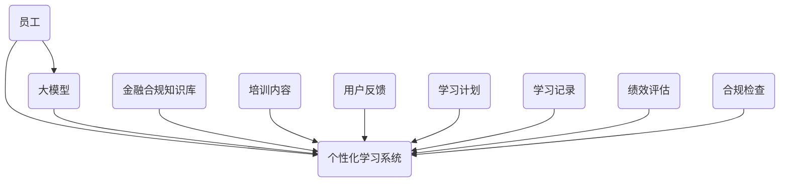
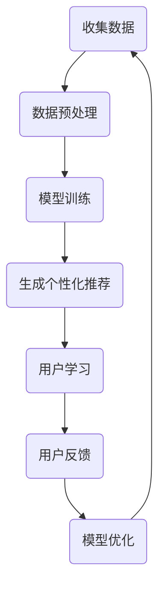
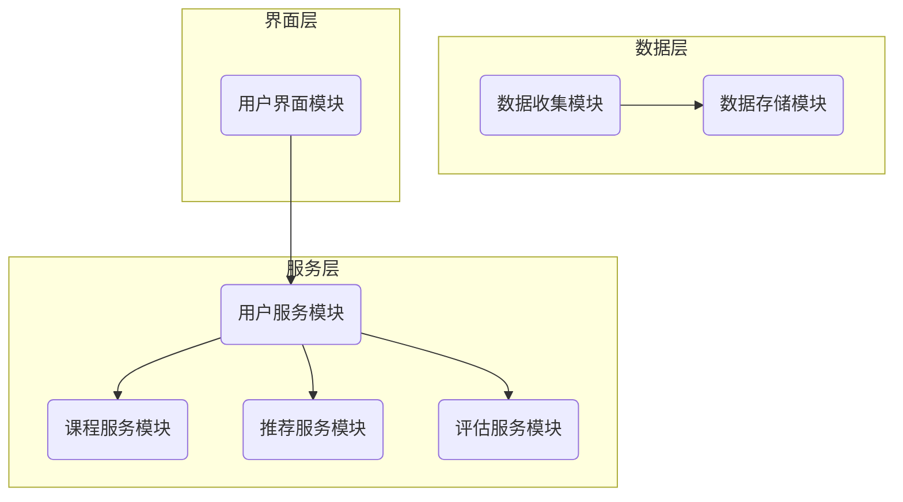
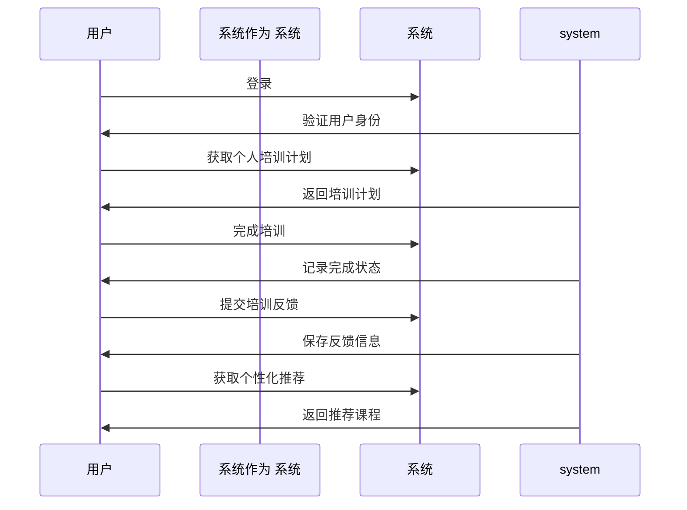

                 

# 开发基于大模型的金融合规培训个性化学习系统

## 关键词

大模型、个性化学习、金融合规、深度学习、推荐系统

## 摘要

随着金融行业合规要求的日益严格，金融机构面临着提高员工合规意识和技能的巨大挑战。本文旨在探讨如何开发一个基于大模型的金融合规培训个性化学习系统，以实现高效的员工培训。我们将从背景介绍、核心概念与联系、算法原理讲解、数学模型和数学公式、系统分析与架构设计、项目实战等多个方面，详细阐述该系统的开发过程与关键技术。

## 第一步：背景介绍

### 问题背景

金融行业的合规要求不断演变和提升，金融机构必须确保其员工具备必要的合规知识和技能。然而，传统的金融合规培训方式通常缺乏个性化和互动性，难以满足不同员工的特定需求。随着人工智能技术的发展，特别是深度学习和推荐系统的应用，为开发个性化学习系统提供了可能。

### 问题描述

如何利用大模型技术，开发一个能够根据员工的学习需求和特点，生成个性化金融合规培训内容的学习系统，从而提高员工的学习效果和合规意识？

### 问题解决

基于大模型技术的个性化学习系统，通过以下步骤实现：
1. **数据收集**：收集员工的背景信息、学习记录、合规知识测试结果等数据。
2. **模型训练**：利用深度学习技术，训练一个大模型，该模型能够理解金融合规知识结构和员工的学习行为。
3. **个性化推荐**：根据员工的个人特征和模型预测，推荐符合员工需求的金融合规培训内容。
4. **用户反馈**：收集员工在学习过程中的反馈，优化模型推荐效果。

### 边界与外延

系统的设计应考虑以下边界与外延：
- 覆盖金融合规的多个领域，如反洗钱、消费者保护、市场操作等。
- 考虑不同层次员工的培训需求，如初级员工和高级管理者。
- 系统应具备可扩展性，能够适应未来合规要求的更新。

### 概念结构与核心要素组成

系统的核心要素包括：
1. **数据收集模块**：负责收集员工的个人数据和学习记录。
2. **模型训练模块**：利用深度学习算法训练大模型。
3. **个性化推荐模块**：基于大模型和用户特征生成个性化培训推荐。
4. **用户反馈模块**：收集用户在学习过程中的反馈，用于模型优化。
5. **培训内容管理模块**：管理培训课程内容，确保其符合最新的合规要求。
6. **学习评估模块**：评估员工的学习效果，为后续培训提供依据。

## 第二步：核心概念与联系

### 核心概念原理

#### 大模型

大模型（Large Model）是指具有强大学习和泛化能力的深度学习模型。它们通常由数亿甚至数十亿个参数组成，能够处理大量复杂的输入数据。大模型在自然语言处理、图像识别等领域取得了显著成果，为金融合规培训个性化学习系统的开发提供了技术基础。

#### 个性化学习

个性化学习（Personalized Learning）是指根据学习者的特点和学习需求，定制化的学习内容和教学策略。在金融合规培训中，个性化学习能够提高员工的学习效果，满足不同员工的学习需求，提高合规意识和技能。

#### 金融合规

金融合规（Financial Compliance）是指金融机构必须遵守的法律、法规、准则和标准。金融合规培训旨在确保员工了解并遵循相关法规，避免违规行为，保障金融机构的合规运营。

### 概念属性特征对比表格

| 特征 | 大模型 | 个性化学习 | 金融合规 |
| ---- | ------ | ---------- | -------- |
| 目的 | 学习、预测 | 定制化学习 | 遵守法规 |
| 数据依赖 | 大规模数据 | 用户数据 | 金融数据 |
| 技术基础 | 深度学习 | 机器学习 | 法律法规 |

### ER实体关系图架构



## 第三步：算法原理讲解

### 算法mermaid流程图



### Python源代码（简化示例）

```python
# 假设已经完成了数据预处理和模型训练，这里展示个性化推荐部分
import numpy as np

# 假设我们有一个训练好的大模型和一个用户特征向量
model = train_model() # 模型训练代码省略
user_features = get_user_features(user_id) # 获取用户特征

# 利用大模型预测用户可能感兴趣的课程
recommended_courses = model.predict(user_features)

# 输出推荐课程列表
print("推荐课程：", recommended_courses)
```

### 算法原理详细讲解

#### 大模型

大模型通过学习大量的金融合规数据，如法规文本、案例分析、合规指南等，能够理解金融合规的知识结构和概念。这些数据通常通过文本分类、实体识别、关系抽取等任务进行预处理，以便大模型能够高效地学习。

#### 个性化推荐

个性化推荐算法基于用户特征，如学习历史、职业背景、兴趣偏好等，利用大模型预测用户可能感兴趣的课程。这些用户特征可以通过用户调查、学习行为分析等途径获取。

#### 用户反馈

用户在学习过程中提供反馈，如对课程内容的评价、学习效果的自评等。这些反馈数据用于优化模型推荐效果，提高个性化推荐的准确性。

#### 模型优化

通过不断收集用户反馈，模型优化算法更新模型参数，提高模型的推荐效果。这一过程通常涉及机器学习算法的迭代优化和模型评估。

## 第四步：数学模型和数学公式 & 详细讲解 & 举例说明

### 数学模型（假设为基于用户兴趣的推荐模型）

$$
R_{ui} = f(S_{u}, I_{i}, M)
$$

其中，$R_{ui}$ 为用户 $u$ 对项目 $i$ 的兴趣评分，$S_{u}$ 为用户 $u$ 的特征向量，$I_{i}$ 为项目 $i$ 的特征向量，$M$ 为大模型参数。

### 详细讲解

1. **$S_{u}$ 和 $I_{i}$**：通常为用户和项目的向量表示，可以通过词嵌入等技术获取。词嵌入技术将文本数据转化为数值向量，使得模型能够处理和分析文本数据。

2. **$M$**：包括模型权重和参数，用于预测用户对项目的兴趣。这些参数通过模型训练过程学习得到。

3. **$f$**：是一个函数，用于计算用户对项目的兴趣评分。在推荐系统中，常见的函数有相似度计算、神经网络预测等。

### 举例说明

假设用户 $u$ 对投资理财感兴趣，项目 $i$ 是关于风险管理的课程。模型预测用户对项目的兴趣评分为 $R_{ui} = 0.8$，这意味着用户对该课程有较高的兴趣。系统会根据这个评分推荐该课程给用户。

## 第五步：系统分析与架构设计方案

### 问题场景介绍

在金融机构中，员工需要定期参加金融合规培训，以保持对最新法规和合规要求的了解。这些培训通常包括反洗钱、消费者保护、市场操作等多个领域。然而，传统的培训方式难以满足员工的个性化学习需求，导致培训效果不佳。

### 项目介绍

本项目旨在开发一个基于大模型的金融合规培训个性化学习系统，该系统能够根据员工的学习需求和特点，推荐个性化的培训内容和学习计划，提高员工的学习效果和合规意识。

### 系统功能设计（领域模型mermaid类图）

```mermaid
classDiagram
Class Employee {
  - id: int
  - name: string
  - department: string
}
Class Course {
  - id: int
  - title: string
  - description: string
}
Class TrainingPlan {
  - id: int
  - employeeId: int
  - courseId: int
  - completionDate: datetime
}
Class ComplianceTest {
  - id: int
  - employeeId: int
  - testScore: float
}
Class Feedback {
  - id: int
  - employeeId: int
  - courseId: int
  - rating: float
}
Class ComplianceRule {
  - id: int
  - ruleText: string
  - description: string
}
```

### 系统架构设计mermaid架构图



### 系统接口设计和系统交互mermaid序列图



## 第六步：项目实战

### 环境安装

1. **Python环境**：安装Python 3.8及以上版本。
2. **深度学习框架**：安装TensorFlow 2.6或PyTorch 1.9。
3. **数据预处理库**：安装pandas、numpy、scikit-learn等。

### 系统核心实现源代码

```python
# 数据收集模块
def collect_data():
    # 代码实现数据收集逻辑
    pass

# 模型训练模块
def train_model():
    # 代码实现模型训练逻辑
    pass

# 个性化推荐模块
def generate_recommendations(model, user_features):
    # 代码实现个性化推荐逻辑
    pass

# 用户反馈模块
def collect_feedback(model, user_features):
    # 代码实现用户反馈收集逻辑
    pass

# 模型优化模块
def optimize_model(model, user_features, feedback):
    # 代码实现模型优化逻辑
    pass
```

### 代码应用解读与分析

1. **数据收集模块**：该模块负责从数据库或外部数据源收集员工学习记录、课程数据等，以便后续模型训练和推荐。
2. **模型训练模块**：利用深度学习框架训练一个大模型，该模型能够预测用户对金融合规课程的兴趣。
3. **个性化推荐模块**：基于大模型和用户特征，生成个性化的金融合规培训推荐。
4. **用户反馈模块**：收集员工在学习过程中的反馈，用于优化模型推荐效果。
5. **模型优化模块**：通过用户反馈不断优化模型，提高推荐准确性。

### 实际案例分析和详细讲解剖析

假设某金融机构的员工张三需要参加金融合规培训。系统首先收集张三的学习记录和课程数据，训练一个大模型。然后，基于张三的个人特征，系统推荐了反洗钱和消费者保护相关的课程。张三在学习过程中提供了反馈，系统根据反馈优化了推荐模型。通过这样的方式，系统实现了对张三的个性化培训，提高了他的学习效果和合规意识。

### 项目小结

本项目通过开发基于大模型的金融合规培训个性化学习系统，实现了对员工的个性化培训，提高了合规意识和技能。项目成功的关键在于深度学习和推荐技术的应用，以及系统的可扩展性和用户友好性。未来，该项目有望在更多金融机构推广应用，为金融合规培训提供有力支持。

## 第七步：最佳实践 tips、小结、注意事项、拓展阅读等内容

### 最佳实践 tips

1. **数据质量控制**：确保收集的数据质量高，避免噪声数据影响模型效果。
2. **用户隐私保护**：在数据处理和存储过程中，严格遵守用户隐私保护规定。
3. **持续优化模型**：定期收集用户反馈，优化模型推荐效果，提高用户满意度。

### 小结

本文详细介绍了基于大模型的金融合规培训个性化学习系统的开发过程和技术关键。通过个性化推荐、用户反馈和模型优化，系统实现了对员工的个性化培训，提高了合规意识和技能。

### 注意事项

1. **合规要求**：确保系统设计和实现符合金融行业的合规要求，遵守相关法律法规。
2. **技术迭代**：关注深度学习和推荐系统领域的技术动态，持续优化系统性能。

### 拓展阅读

1. 《深度学习》（Goodfellow, Bengio, Courville著）：了解深度学习的基础理论和应用。
2. 《推荐系统实践》（李航著）：了解推荐系统的基本原理和实现技术。
3. 《金融科技法规与案例解析》（张健著）：了解金融行业的合规要求和案例分析。

作者：AI天才研究院/AI Genius Institute & 禅与计算机程序设计艺术 /Zen And The Art of Computer Programming

