                 

# 开发基于大模型的金融政策影响评估工具

## 关键词

- 金融政策
- 大模型
- 影响评估
- 算法原理
- 系统架构
- 项目实战

## 摘要

随着金融科技的飞速发展，金融政策对经济和社会的影响愈发显著。如何准确地评估金融政策的影响，已成为政府和金融机构的重要课题。本文提出了一种基于大模型的金融政策影响评估工具，通过分析大模型的基本概念与特性，以及金融政策影响评估的基本原理，详细探讨了算法原理与数学模型，并设计了一套系统分析与架构方案。最后，通过实际项目实战，验证了工具的有效性和实用性，为金融政策的制定和实施提供了有力支持。

### 目录大纲

1. **背景介绍与核心概念**
    1.1 问题背景与核心概念
    1.2 大模型的基本概念与特性
    1.3 范围与边界
    1.4 概念结构与核心要素组成
2. **核心概念与联系**
    2.1 金融政策影响评估的基本原理
    2.2 大模型的原理与特征
    2.3 核心概念属性特征对比
3. **算法原理讲解**
    3.1 大模型的算法原理
    3.2 数学模型与公式讲解
    3.3 算法流程与举例说明
4. **系统分析与架构设计方案**
    4.1 问题场景介绍
    4.2 系统架构设计
    4.3 系统接口设计
    4.4 系统交互设计
5. **项目实战**
    5.1 环境安装与配置
    5.2 系统核心实现源代码
    5.3 代码应用解读与分析
    5.4 实际案例分析与详细讲解
    5.5 项目小结
6. **最佳实践与拓展**
    6.1 最佳实践技巧
    6.2 拓展阅读

### 第一部分：背景介绍与核心概念

#### 第1章 问题背景与核心概念

##### 1.1 问题的提出

金融政策是国家或地区政府为了实现宏观经济目标而制定的一系列经济措施。随着全球经济一体化和金融市场的高度互联，金融政策的变化对经济产生的影响愈发复杂和深远。因此，如何准确地评估金融政策的影响，成为政府和金融机构关注的焦点。

传统的金融政策影响评估方法主要依赖于统计数据和经济学模型，但这些方法往往存在一些局限性：

- **数据依赖性高**：需要大量的历史数据进行建模和分析，对数据的完整性、准确性和质量有较高要求。
- **模型复杂度**：经济学模型通常较为复杂，难以快速理解和应用。
- **实时性差**：传统的评估方法往往需要较长时间的计算和分析，难以满足实时决策的需求。

为了克服这些局限性，本文提出了基于大模型的金融政策影响评估工具。大模型具有强大的数据处理和预测能力，可以处理海量的数据，并从中提取出有用的信息，实现实时评估和预测。

##### 1.1.1 金融政策的影响评估需求

金融政策的影响评估需求主要体现在以下几个方面：

- **实时性**：政策评估需要快速响应，以便在政策实施后及时调整和完善。
- **准确性**：评估结果需要准确反映政策对经济的影响，为决策提供可靠依据。
- **全面性**：评估应考虑政策对多个经济领域的综合影响，包括但不限于金融市场、宏观经济指标、就业等。
- **可解释性**：评估结果应易于理解和解释，便于决策者和公众理解政策的实际效果。

##### 1.1.2 大模型技术在金融领域的应用

大模型技术在金融领域已有广泛应用，如：

- **风险管理**：大模型可以处理海量的金融数据，识别潜在的风险，为金融机构提供风险预警。
- **市场预测**：大模型可以分析市场趋势和投资者行为，预测市场走势，为投资决策提供参考。
- **信用评分**：大模型可以分析个人或企业的信用历史和财务状况，评估信用风险。

本文提出的大模型金融政策影响评估工具，旨在利用大模型的强大能力，对金融政策的影响进行精确和实时的评估，为政策制定者提供有力支持。

##### 1.1.3 问题解决的核心概念

基于大模型的金融政策影响评估工具，主要包括以下几个核心概念：

- **数据采集与处理**：收集相关金融政策、经济指标、市场数据等，进行预处理，为模型训练提供高质量的数据。
- **大模型训练**：利用训练数据，训练大模型，使其学会对金融政策的影响进行预测和评估。
- **模型优化**：通过交叉验证和调整参数，优化大模型的性能，提高评估的准确性和实时性。
- **实时评估与预测**：利用训练好的大模型，对新的金融政策进行实时评估和预测，为决策提供依据。

##### 1.2 大模型的基本概念与特性

大模型是指具有海量参数、能够处理大规模数据和复杂问题的深度学习模型。大模型通常具有以下几个基本特性：

- **高容量**：大模型可以存储和处理海量的数据，捕捉复杂的特征和关系。
- **强泛化能力**：大模型可以在不同数据和任务上表现优秀，具有较好的泛化能力。
- **高效率**：大模型通过并行计算和分布式训练，可以实现高效训练和预测。

大模型在金融领域的应用，主要依赖于其强大的数据处理和预测能力，可以处理复杂的金融数据和问题，为金融政策影响评估提供有力支持。

##### 1.2.1 大模型的定义

大模型通常是指具有数十亿甚至数万亿参数的深度学习模型。例如，BERT（Bidirectional Encoder Representations from Transformers）就是一种典型的大模型，其参数量超过10亿。

大模型的定义不仅仅是基于参数量，还包括其处理数据的能力和处理复杂问题的能力。大模型通过多层神经网络和复杂的架构，可以处理海量的数据，并从中提取出有用的信息和规律。

##### 1.2.2 大模型的特性

大模型具有以下几个显著的特性：

- **高容量**：大模型可以存储和处理海量的数据，包括文本、图像、声音等多模态数据。
- **强泛化能力**：大模型可以在不同的数据集和任务上表现优秀，具有较好的泛化能力。
- **高效率**：大模型通过并行计算和分布式训练，可以实现高效训练和预测。

这些特性使得大模型在处理复杂问题和大规模数据时具有显著优势，可以应用于金融政策影响评估等多个领域。

##### 1.2.3 大模型与金融政策的关联

大模型与金融政策之间存在密切的关联。一方面，大模型可以通过对金融数据的处理和分析，了解金融政策的变化趋势和对经济的影响；另一方面，大模型可以用于预测金融政策的未来变化，为政策制定者提供科学依据。

具体来说，大模型在金融政策影响评估中的应用包括：

- **实时数据分析**：大模型可以实时处理和更新金融数据，捕捉金融政策变化对经济的影响。
- **预测与模拟**：大模型可以通过历史数据和政策模拟，预测金融政策的变化趋势和影响。
- **决策支持**：大模型可以为政策制定者提供实时的评估结果和预测分析，支持科学决策。

##### 1.3 范围与边界

本文研究的范围主要集中在基于大模型的金融政策影响评估工具的开发和应用。具体包括：

- **数据采集与处理**：收集相关金融政策、经济指标、市场数据等，进行预处理，为模型训练提供高质量的数据。
- **模型训练与优化**：利用预处理后的数据，训练大模型，并通过交叉验证和调整参数，优化模型的性能。
- **实时评估与预测**：利用训练好的大模型，对新的金融政策进行实时评估和预测，为决策提供依据。

本文研究的边界包括：

- **数据范围**：本文主要关注宏观经济和金融市场的数据，不包括微观层面的企业和个人数据。
- **政策范围**：本文主要关注常见的金融政策，如利率调整、税收政策等，不包括其他类型的经济政策。
- **技术范围**：本文主要介绍大模型在金融政策影响评估中的应用，不包括其他类型的深度学习模型。

##### 1.3.1 范围

本文的研究范围包括以下几个方面：

- **数据采集与处理**：本文将收集相关的金融政策、经济指标、市场数据等，并对其进行预处理，为模型训练提供高质量的数据。
- **模型训练与优化**：本文将利用预处理后的数据，训练大模型，并通过交叉验证和参数调整，优化模型的性能，提高评估的准确性和实时性。
- **实时评估与预测**：本文将利用训练好的大模型，对新的金融政策进行实时评估和预测，为政策制定者提供科学依据。

##### 1.3.2 边界

本文的研究边界包括以下几个方面：

- **数据边界**：本文主要关注宏观经济和金融市场的数据，不包括微观层面的企业和个人数据。
- **政策边界**：本文主要关注常见的金融政策，如利率调整、税收政策等，不包括其他类型的经济政策。
- **技术边界**：本文主要介绍大模型在金融政策影响评估中的应用，不包括其他类型的深度学习模型。

##### 1.3.3 概念结构与核心要素组成

为了更好地理解本文研究的概念结构，我们可以将其分为以下几个核心要素：

- **数据采集与处理**：这是整个系统的数据输入部分，包括数据的收集、清洗、转换和预处理。
- **大模型训练**：这是系统的核心部分，利用预处理后的数据，训练大模型，并优化其性能。
- **实时评估与预测**：这是系统的输出部分，利用训练好的大模型，对新的金融政策进行实时评估和预测。
- **系统接口与交互**：这是系统与外部系统的接口，包括数据输入输出接口、模型训练和评估接口等。

这些核心要素相互关联，共同构成了一个完整的基于大模型的金融政策影响评估系统。

### 第二部分：核心概念与联系

#### 第2章 核心概念原理

##### 2.1 金融政策影响评估的基本原理

金融政策影响评估是指通过科学的方法，对金融政策实施后产生的经济影响进行定量和定性分析的过程。其基本原理包括以下几个方面：

1. **政策识别与分类**：首先需要明确金融政策的种类和性质，如货币政策、财政政策、汇率政策等。然后根据政策的特点和目的，进行分类和识别。

2. **经济指标选择**：选择与金融政策相关的经济指标，如GDP增长率、通货膨胀率、利率、汇率等。这些指标能够反映金融政策对经济的影响程度和方向。

3. **数据采集与处理**：收集与金融政策相关的历史数据，包括经济指标、金融市场数据、政策实施前后数据等。对数据进行清洗、转换和预处理，确保数据的质量和完整性。

4. **模型构建与训练**：利用收集的数据，构建金融政策影响评估模型。常见的模型包括回归模型、时间序列模型、机器学习模型等。通过模型训练，使模型学会对金融政策的影响进行预测和评估。

5. **模型优化与验证**：通过交叉验证和参数调整，优化模型的性能，提高评估的准确性和实时性。

6. **实时评估与预测**：利用训练好的模型，对新的金融政策进行实时评估和预测，为政策制定者提供科学依据。

##### 2.1.1 金融政策对经济的影响

金融政策对经济的影响是多方面、多层次和复杂的。具体来说，金融政策可以通过以下几个方面影响经济：

1. **货币政策**：货币政策主要通过调整利率、准备金率等手段，影响货币供应量和信贷成本。货币政策的变化会影响投资、消费和就业，进而影响经济增长。

2. **财政政策**：财政政策主要通过调整政府支出和税收政策，影响总需求和总供给。财政政策的变化会影响消费、投资和就业，进而影响经济增长。

3. **汇率政策**：汇率政策主要通过调整汇率水平，影响国际贸易和资本流动。汇率政策的变化会影响出口、进口和国际投资，进而影响经济增长和国际竞争力。

4. **金融监管政策**：金融监管政策主要通过调整金融机构的运营规则和风险控制措施，影响金融市场的稳定性和安全性。金融监管政策的变化会影响金融机构的运营行为和风险水平，进而影响金融市场的稳定性和安全性。

##### 2.1.2 影响评估的方法与工具

金融政策影响评估的方法和工具主要包括以下几种：

1. **回归分析法**：回归分析法是一种常用的统计方法，通过建立回归模型，分析金融政策与经济指标之间的因果关系。

2. **时间序列分析法**：时间序列分析法是一种基于时间序列数据的分析方法，通过分析金融政策变化前后经济指标的时间序列特征，评估金融政策的影响。

3. **机器学习模型**：机器学习模型是一种基于数据驱动的方法，通过训练模型，使模型学会对金融政策的影响进行预测和评估。

4. **情景分析法**：情景分析法是一种基于假设情景的分析方法，通过模拟不同情景下的经济指标变化，评估金融政策的影响。

5. **专家评估法**：专家评估法是一种基于专家经验和判断的方法，通过专家的评估和分析，评估金融政策的影响。

这些方法和工具各有优缺点，可以根据实际情况选择合适的评估方法。

##### 2.1.3 大模型在金融政策评估中的应用

大模型在金融政策评估中的应用具有显著优势，主要包括以下几个方面：

1. **数据处理能力**：大模型可以处理海量的金融数据，包括文本、图像、声音等多模态数据，捕捉复杂的特征和关系。

2. **强泛化能力**：大模型可以在不同的数据集和任务上表现优秀，具有较好的泛化能力。

3. **实时预测能力**：大模型可以通过并行计算和分布式训练，实现实时预测和评估，为政策制定者提供及时的决策依据。

4. **自适应能力**：大模型可以根据新的数据和情境，自适应调整模型结构和参数，提高评估的准确性和实时性。

大模型在金融政策评估中的应用，不仅可以提高评估的准确性和实时性，还可以降低评估的成本和复杂性，为政策制定者提供有力的支持。

##### 2.2 大模型的原理与特征

大模型，也称为深度学习模型，是一种基于多层神经网络的学习方法，具有以下原理和特征：

1. **多层神经网络**：大模型由多个神经网络层组成，包括输入层、隐藏层和输出层。每一层都对输入数据进行特征提取和转换，从而实现数据的逐层抽象和表示。

2. **非线性激活函数**：大模型中的每个神经元都通过非线性激活函数进行输出，如Sigmoid、ReLU等，这有助于模型学习复杂的非线性关系。

3. **反向传播算法**：大模型使用反向传播算法进行参数优化，通过计算损失函数关于参数的梯度，更新模型参数，使模型能够更好地拟合训练数据。

4. **大规模参数训练**：大模型具有数十亿甚至数万亿的参数，通过大规模数据训练，可以学习到丰富的特征和模式，提高模型的性能。

5. **并行计算和分布式训练**：大模型可以利用并行计算和分布式训练，加速模型的训练过程，降低计算成本。

大模型的特征使其在处理复杂数据和任务时具有显著优势，可以应用于金融政策影响评估等多个领域。

##### 2.2.1 大模型的数学原理

大模型的数学原理主要包括以下几个方面：

1. **神经网络的基本原理**：神经网络由多个神经元组成，每个神经元都是一个简单的计算单元，通过加权连接和其他神经元进行信息传递。神经网络的基本原理是通过学习输入数据与输出数据之间的映射关系，实现数据的特征提取和转换。

2. **反向传播算法**：反向传播算法是一种基于梯度下降的优化方法，用于更新神经网络的参数。通过计算损失函数关于参数的梯度，反向传播算法可以找到使损失函数最小的参数值，从而使神经网络能够更好地拟合训练数据。

3. **激活函数**：激活函数是神经网络中的一个关键组件，用于引入非线性特性。常见的激活函数包括Sigmoid、ReLU、Tanh等，它们可以将线性输入映射到非线性输出，使神经网络能够学习更复杂的函数关系。

4. **优化算法**：大模型的优化算法主要包括梯度下降、Adam、RMSProp等，这些算法通过不断更新模型参数，使模型能够最小化损失函数，提高模型的性能。

大模型的数学原理使得其在处理复杂数据和任务时具有强大的能力和灵活性。

##### 2.2.2 大模型的工作机制

大模型的工作机制可以分为以下几个步骤：

1. **数据输入**：大模型首先接收输入数据，这些数据可以是文本、图像、声音等多种类型。输入数据会被送入模型的输入层，每个输入数据通过加权连接传递到下一层。

2. **前向传播**：在前向传播过程中，输入数据通过多个隐藏层，每个隐藏层对输入数据进行特征提取和转换。每个隐藏层的输出作为输入传递到下一层，直到模型的输出层。

3. **计算损失**：在输出层，模型的预测结果与实际标签进行比较，计算损失函数。损失函数衡量模型预测结果与实际结果之间的差距，常用的损失函数包括均方误差（MSE）、交叉熵损失（Cross-Entropy Loss）等。

4. **反向传播**：在反向传播过程中，模型计算损失函数关于每个参数的梯度。梯度表示损失函数相对于参数的变化率，通过反向传播算法，将这些梯度传递回模型的输入层，并对参数进行更新。

5. **参数更新**：通过梯度下降或其他优化算法，模型根据梯度更新参数，使模型能够逐渐逼近最优参数，从而提高模型的性能。

6. **迭代训练**：重复以上步骤，进行多轮迭代训练，直到模型达到预设的性能指标或满足训练终止条件。

通过这样的工作机制，大模型可以逐步学习输入数据与输出数据之间的映射关系，实现数据的特征提取和预测。

##### 2.2.3 大模型的优势与挑战

大模型在金融政策影响评估中的应用具有显著优势，但也面临一些挑战：

**优势：**

1. **强大的数据处理能力**：大模型可以处理海量的金融数据，包括文本、图像、声音等多种类型，捕捉复杂的特征和关系。

2. **高泛化能力**：大模型可以在不同的数据集和任务上表现优秀，具有较好的泛化能力，可以适应不同的金融政策评估需求。

3. **实时预测能力**：大模型可以通过并行计算和分布式训练，实现实时预测和评估，为政策制定者提供及时的决策依据。

4. **自适应能力**：大模型可以根据新的数据和情境，自适应调整模型结构和参数，提高评估的准确性和实时性。

**挑战：**

1. **数据依赖性**：大模型对数据的质量和数量有较高要求，数据不足或质量差会影响模型的性能。

2. **计算资源需求**：大模型训练需要大量的计算资源和时间，特别是在处理大规模数据时，对硬件设备的性能要求较高。

3. **可解释性问题**：大模型的内部结构复杂，难以解释每个特征和参数的作用，这对政策制定者和公众理解模型的决策过程提出了挑战。

4. **过拟合风险**：大模型容易过拟合训练数据，导致在未知数据上的表现不佳，需要通过正则化方法和交叉验证等技术进行控制。

总之，大模型在金融政策影响评估中具有显著的优势，但也需要克服一系列挑战，以充分发挥其潜力。

##### 2.3 核心概念属性特征对比

在金融政策影响评估中，大模型与其他评估方法的核心概念属性特征有以下对比：

**1. 回归分析法 vs 大模型**

- **数据处理能力**：回归分析法主要依赖于历史数据进行建模，数据处理能力相对较弱。而大模型可以处理海量的多模态数据，数据处理能力更强。
- **泛化能力**：回归分析法的泛化能力受限于模型的结构和参数，大模型具有更强的泛化能力，可以在不同数据集和任务上表现优秀。
- **实时性**：回归分析法的实时性较差，需要较长时间的计算和分析。而大模型可以通过并行计算和分布式训练，实现实时预测和评估。

**2. 时间序列分析法 vs 大模型**

- **数据处理能力**：时间序列分析法主要处理时间序列数据，数据处理能力相对较弱。而大模型可以处理多种类型的数据，包括时间序列数据，数据处理能力更强。
- **泛化能力**：时间序列分析法的泛化能力较弱，只能处理时间序列数据。而大模型具有更强的泛化能力，可以在不同数据集和任务上表现优秀。
- **实时性**：时间序列分析法的实时性较好，但大模型在实时性方面具有更大优势，可以通过并行计算和分布式训练，实现更快速的预测和评估。

**3. 机器学习模型 vs 大模型**

- **数据处理能力**：机器学习模型可以处理一定规模的数据，但相较于大模型，数据处理能力有限。大模型可以处理海量的多模态数据，数据处理能力更强。
- **泛化能力**：机器学习模型的泛化能力较好，但大模型具有更强的泛化能力，可以在不同数据集和任务上表现优秀。
- **实时性**：机器学习模型的实时性较好，但大模型在实时性方面具有更大优势，可以通过并行计算和分布式训练，实现更快速的预测和评估。

通过对比可以看出，大模型在金融政策影响评估中具有显著的优势，但也需要克服一系列挑战，以充分发挥其潜力。

### 第三部分：算法原理讲解

#### 第3章 算法原理与数学模型

##### 3.1 大模型的算法原理

大模型的算法原理主要基于深度学习，通过多层神经网络进行数据的特征提取和转换。具体来说，大模型的算法原理包括以下几个关键步骤：

1. **数据输入**：首先，大模型接收输入数据，这些数据可以是文本、图像、声音等多种类型。输入数据通过加权连接传递到模型的输入层。

2. **前向传播**：在前向传播过程中，输入数据通过多个隐藏层，每个隐藏层对输入数据进行特征提取和转换。每个隐藏层的输出作为输入传递到下一层，直到模型的输出层。

3. **计算损失**：在输出层，模型的预测结果与实际标签进行比较，计算损失函数。损失函数衡量模型预测结果与实际结果之间的差距，常用的损失函数包括均方误差（MSE）、交叉熵损失（Cross-Entropy Loss）等。

4. **反向传播**：在反向传播过程中，模型计算损失函数关于每个参数的梯度。梯度表示损失函数相对于参数的变化率，通过反向传播算法，将这些梯度传递回模型的输入层，并对参数进行更新。

5. **参数更新**：通过梯度下降或其他优化算法，模型根据梯度更新参数，使模型能够逐渐逼近最优参数，从而提高模型的性能。

6. **迭代训练**：重复以上步骤，进行多轮迭代训练，直到模型达到预设的性能指标或满足训练终止条件。

通过这样的算法原理，大模型可以逐步学习输入数据与输出数据之间的映射关系，实现数据的特征提取和预测。

##### 3.2 数学模型与公式讲解

大模型的数学模型主要包括以下几个关键组件：

1. **神经网络的基本结构**：

$$
y = f(W \cdot x + b)
$$

其中，$x$为输入向量，$W$为权重矩阵，$b$为偏置项，$f$为激活函数。每个隐藏层都可以看作是一个这样的线性组合，通过激活函数引入非线性特性。

2. **激活函数**：

常见的激活函数包括Sigmoid、ReLU、Tanh等：

- **Sigmoid**：

$$
\sigma(x) = \frac{1}{1 + e^{-x}}
$$

- **ReLU**：

$$
\text{ReLU}(x) = \max(0, x)
$$

- **Tanh**：

$$
\text{Tanh}(x) = \frac{e^x - e^{-x}}{e^x + e^{-x}}
$$

3. **损失函数**：

常用的损失函数包括均方误差（MSE）、交叉熵损失（Cross-Entropy Loss）等：

- **均方误差（MSE）**：

$$
MSE = \frac{1}{n}\sum_{i=1}^{n}(y_i - \hat{y}_i)^2
$$

其中，$y_i$为实际标签，$\hat{y}_i$为模型预测值。

- **交叉熵损失（Cross-Entropy Loss）**：

$$
H(y, \hat{y}) = -\sum_{i=1}^{n} y_i \log(\hat{y}_i)
$$

其中，$y_i$为实际标签，$\hat{y}_i$为模型预测值。

4. **优化算法**：

常用的优化算法包括梯度下降（Gradient Descent）、Adam、RMSProp等：

- **梯度下降**：

$$
\theta_{\text{new}} = \theta_{\text{old}} - \alpha \nabla_\theta J(\theta)
$$

其中，$\theta$为模型参数，$\alpha$为学习率，$J(\theta)$为损失函数。

- **Adam**：

$$
m_t = \beta_1 m_{t-1} + (1 - \beta_1)(\nabla_\theta J(\theta_t) - m_{t-1})
$$

$$
v_t = \beta_2 v_{t-1} + (1 - \beta_2)((\nabla_\theta J(\theta_t))^2 - v_{t-1})
$$

$$
\theta_{\text{new}} = \theta_t - \alpha \frac{m_t}{\sqrt{v_t} + \epsilon}
$$

其中，$m_t$和$v_t$分别为一阶矩估计和二阶矩估计，$\beta_1$和$\beta_2$分别为一阶和二阶矩的指数衰减率，$\epsilon$为小常数。

通过这些数学模型和公式，大模型可以实现对输入数据的特征提取和预测。

##### 3.3 算法流程与举例说明

大模型的算法流程主要包括以下几个步骤：

1. **数据预处理**：对输入数据进行预处理，包括数据清洗、归一化、缺失值处理等，确保数据的质量和一致性。

2. **模型初始化**：初始化模型的参数，包括权重矩阵、偏置项等。通常采用随机初始化，以避免模型陷入局部最优。

3. **前向传播**：输入数据通过多层神经网络进行前向传播，每个隐藏层对输入数据进行特征提取和转换，最终在输出层得到模型的预测结果。

4. **计算损失**：将模型的预测结果与实际标签进行比较，计算损失函数的值。常用的损失函数包括均方误差（MSE）、交叉熵损失（Cross-Entropy Loss）等。

5. **反向传播**：计算损失函数关于模型参数的梯度，通过反向传播算法将这些梯度传递回模型的输入层，并对参数进行更新。

6. **参数更新**：根据梯度更新模型参数，常用的优化算法包括梯度下降（Gradient Descent）、Adam、RMSProp等。

7. **迭代训练**：重复以上步骤，进行多轮迭代训练，直到模型达到预设的性能指标或满足训练终止条件。

下面通过一个简单的例子来说明大模型的算法流程：

假设我们有一个简单的线性回归模型，输入数据为$x_1$和$x_2$，输出数据为$y$。模型参数为权重$w_1$和$w_2$，偏置项$b$。模型的预测函数为：

$$
y = w_1x_1 + w_2x_2 + b
$$

我们使用均方误差（MSE）作为损失函数，目标是最小化损失函数的值。

1. **数据预处理**：对输入数据进行归一化处理，确保数据的一致性。

2. **模型初始化**：随机初始化模型参数$w_1$、$w_2$和$b$。

3. **前向传播**：输入数据$x_1$和$x_2$通过模型进行前向传播，得到预测结果$y$。

4. **计算损失**：将预测结果$y$与实际标签$y_{\text{actual}}$进行比较，计算MSE损失函数的值。

5. **反向传播**：计算损失函数关于模型参数的梯度。

6. **参数更新**：根据梯度更新模型参数$w_1$、$w_2$和$b$。

7. **迭代训练**：重复以上步骤，进行多轮迭代训练，直到模型达到预设的性能指标或满足训练终止条件。

通过这个简单的例子，我们可以看到大模型的基本算法流程和关键步骤。在实际应用中，大模型的算法流程会根据具体的任务和数据集进行调整和优化。

### 第四部分：系统分析与架构设计方案

#### 第4章 系统分析与架构设计

##### 4.1 问题场景介绍

金融政策影响评估系统是一个复杂的系统，涉及到多个模块和组件的协同工作。其主要应用场景包括以下几个方面：

1. **政策制定与调整**：政府和金融机构需要实时了解金融政策的变化及其对经济的影响，以便及时调整和优化政策。

2. **市场监测与预警**：金融机构和市场参与者需要监测金融市场的变化，对可能出现的风险进行预警，以采取相应的应对措施。

3. **投资决策支持**：投资者需要基于金融政策的变化，对投资策略进行调整和优化，以实现资产的最优化配置。

4. **学术研究**：研究人员需要通过金融政策影响评估系统，对金融政策的实际效果进行实证研究，为政策制定提供理论支持。

为了满足上述应用场景的需求，金融政策影响评估系统需要具备以下功能：

1. **数据采集与处理**：系统需要能够从多个数据源（如金融监管机构、证券交易所、银行等）采集数据，并进行清洗、转换和预处理，为模型训练提供高质量的数据。

2. **模型训练与优化**：系统需要具备训练大模型的能力，通过多轮迭代训练和参数调整，优化模型的性能，提高评估的准确性和实时性。

3. **实时评估与预测**：系统需要能够利用训练好的模型，对新的金融政策进行实时评估和预测，为政策制定者、投资者和研究人员提供科学依据。

4. **数据可视化与报告生成**：系统需要提供数据可视化功能，将评估结果以图表、报告等形式直观展示，便于用户理解和分析。

##### 4.2 系统架构设计

金融政策影响评估系统的整体架构设计遵循模块化、分布式和可扩展的原则，具体包括以下几个主要模块：

1. **数据采集模块**：负责从多个数据源采集金融政策、经济指标、市场数据等，并进行清洗、转换和预处理。

2. **数据处理模块**：负责处理采集到的数据，包括数据清洗、特征提取、数据归一化等，为模型训练提供高质量的数据。

3. **模型训练模块**：负责训练大模型，包括模型初始化、前向传播、反向传播、参数调整等，通过多轮迭代训练和交叉验证，优化模型的性能。

4. **模型评估模块**：负责评估模型的性能，包括计算损失函数、评估指标（如准确率、召回率、F1值等），以及实时更新模型参数。

5. **预测模块**：负责利用训练好的模型，对新的金融政策进行实时评估和预测，为政策制定者、投资者和研究人员提供科学依据。

6. **数据可视化模块**：负责将评估结果以图表、报告等形式直观展示，提供数据可视化功能，便于用户理解和分析。

7. **接口与交互模块**：负责系统与外部系统的接口设计，包括API接口、Web界面等，提供友好的用户交互体验。

系统架构设计如下图所示：



```mermaid
graph LR
    subgraph 数据采集模块
        A[数据采集]
        B[数据清洗]
        C[数据转换]
        D[数据预处理]
        A --> B
        B --> C
        C --> D
    end

    subgraph 数据处理模块
        E[数据特征提取]
        F[数据归一化]
        G[数据集划分]
        E --> F
        F --> G
    end

    subgraph 模型训练模块
        H[模型初始化]
        I[前向传播]
        J[反向传播]
        K[参数调整]
        L[迭代训练]
        M[交叉验证]
        H --> I
        I --> J
        J --> K
        K --> L
        L --> M
    end

    subgraph 模型评估模块
        N[损失函数计算]
        O[评估指标计算]
        P[模型优化]
        N --> O
        O --> P
    end

    subgraph 预测模块
        Q[实时预测]
        R[评估结果输出]
        Q --> R
    end

    subgraph 数据可视化模块
        S[数据可视化]
        T[报告生成]
        S --> T
    end

    subgraph 接口与交互模块
        U[API接口]
        V[Web界面]
        U --> V
    end

    A --> E
    D --> G
    G --> H
    H --> I
    I --> J
    J --> K
    K --> L
    L --> M
    M --> N
    N --> O
    O --> P
    P --> Q
    Q --> R
    R --> S
    S --> T
    T --> U
    U --> V
```

##### 4.2.1 系统架构概述

系统架构概述如下：

- **数据采集模块**：负责从多个数据源采集金融政策、经济指标、市场数据等，并进行清洗、转换和预处理，为模型训练提供高质量的数据。
- **数据处理模块**：对采集到的数据进行特征提取、数据归一化等处理，为模型训练提供高质量的数据。
- **模型训练模块**：负责训练大模型，通过多轮迭代训练和交叉验证，优化模型的性能。
- **模型评估模块**：评估模型的性能，包括计算损失函数、评估指标等，以及实时更新模型参数。
- **预测模块**：利用训练好的模型，对新的金融政策进行实时评估和预测，为政策制定者、投资者和研究人员提供科学依据。
- **数据可视化模块**：将评估结果以图表、报告等形式直观展示，提供数据可视化功能，便于用户理解和分析。
- **接口与交互模块**：提供API接口和Web界面，方便用户与系统进行交互。

##### 4.2.2 系统架构设计

系统架构设计如下图所示：


- **数据采集模块**：从金融监管机构、证券交易所、银行等数据源采集金融政策、经济指标、市场数据等，并进行清洗、转换和预处理，为模型训练提供高质量的数据。
- **数据处理模块**：对采集到的数据进行分析和预处理，包括数据特征提取、数据归一化等，为模型训练提供高质量的数据。
- **模型训练模块**：训练大模型，包括模型初始化、前向传播、反向传播、参数调整等，通过多轮迭代训练和交叉验证，优化模型的性能。
- **模型评估模块**：评估模型的性能，包括计算损失函数、评估指标等，以及实时更新模型参数。
- **预测模块**：利用训练好的模型，对新的金融政策进行实时评估和预测，为政策制定者、投资者和研究人员提供科学依据。
- **数据可视化模块**：将评估结果以图表、报告等形式直观展示，提供数据可视化功能，便于用户理解和分析。
- **接口与交互模块**：提供API接口和Web界面，方便用户与系统进行交互。

##### 4.2.3 系统接口设计

系统接口设计如下图所示：

```mermaid
sequenceDiagram
    participant 用户 as 用户
    participant 系统as 系统
    用户->>系统: 提交数据
    system 发送请求到数据处理模块
    系统处理请求并返回结果
    用户->>系统: 数据预处理完成
    system 发送请求到模型训练模块
    系统处理请求并返回结果
    用户->>系统: 开始训练
    system 发送请求到模型训练模块
    系统处理请求并返回结果
    用户->>系统: 训练完成，进行评估
    system 发送请求到模型评估模块
    系统处理请求并返回结果
    用户->>系统: 输出结果
```

- **用户**：系统的最终用户，可以是政策制定者、投资者或研究人员。
- **系统**：负责接收用户的请求，处理数据、训练模型、评估模型等，并提供结果。

系统接口设计主要包括以下几个步骤：

1. **数据提交**：用户向系统提交数据，系统将数据发送到数据处理模块进行预处理。
2. **数据处理**：数据处理模块对提交的数据进行清洗、转换和预处理，处理完成后，系统将结果返回给用户。
3. **模型训练**：用户请求系统开始模型训练，系统将数据发送到模型训练模块进行训练。
4. **模型评估**：模型训练完成后，系统对模型进行评估，计算损失函数和评估指标，并将结果返回给用户。
5. **结果输出**：用户请求系统输出评估结果，系统将结果以图表、报告等形式展示给用户。

##### 4.2.4 系统交互设计

系统交互设计如下图所示：

```mermaid
sequenceDiagram
    participant 用户 as 用户
    participant 系统as 系统
    用户->>系统: 提交数据
    system 发送请求到数据处理模块
    系统处理请求并返回结果
    用户->>系统: 数据预处理完成
    system 发送请求到模型训练模块
    系统处理请求并返回结果
    用户->>系统: 开始训练
    system 发送请求到模型训练模块
    系统处理请求并返回结果
    用户->>系统: 训练完成，进行评估
    system 发送请求到模型评估模块
    系统处理请求并返回结果
    用户->>系统: 输出结果
```

系统交互设计主要包括以下几个步骤：

1. **数据提交**：用户通过Web界面或API接口向系统提交数据。
2. **数据处理**：系统将接收到的数据发送到数据处理模块进行预处理，包括数据清洗、转换和预处理等。
3. **模型训练**：数据处理完成后，系统将数据发送到模型训练模块进行训练，包括模型初始化、前向传播、反向传播、参数调整等。
4. **模型评估**：模型训练完成后，系统对模型进行评估，计算损失函数和评估指标，包括准确率、召回率、F1值等。
5. **结果输出**：系统将评估结果以图表、报告等形式展示给用户，用户可以通过Web界面或API接口获取结果。

通过以上系统交互设计，用户可以方便地与系统进行交互，实现对金融政策影响评估的实时监控和决策支持。

### 第五部分：项目实战

#### 第5章 项目实战

##### 5.1 环境安装与配置

为了实现基于大模型的金融政策影响评估工具，我们需要安装和配置以下环境：

1. **硬件环境**：建议使用高性能的计算服务器，配置如下：
   - CPU：至少8核心
   - GPU：至少NVIDIA GTX 1080 Ti或更高
   - 内存：至少32GB
   - 硬盘：至少500GB SSD

2. **软件环境**：
   - 操作系统：Ubuntu 18.04或更高版本
   - Python：Python 3.7或更高版本
   - 深度学习框架：TensorFlow 2.0或更高版本
   - 数据处理库：NumPy、Pandas、Scikit-learn等
   - 图形库：Matplotlib、Seaborn等

3. **安装步骤**：

   1. 安装操作系统：
      - 下载Ubuntu 18.04或更高版本的ISO文件。
      - 使用USB驱动器或虚拟机安装操作系统。

   2. 安装Python和深度学习框架：
      - 打开终端，执行以下命令：
        ```
        sudo apt-get update
        sudo apt-get install python3 python3-pip
        pip3 install tensorflow-gpu
        ```

   3. 安装数据处理库和图形库：
      - 打开终端，执行以下命令：
        ```
        pip3 install numpy pandas scikit-learn matplotlib seaborn
        ```

4. **验证环境**：

   - 打开终端，执行以下命令，验证Python和深度学习框架是否安装成功：
     ```
     python3 -c "import tensorflow as tf; print(tf.__version__)"
     ```

   - 如果输出版本号，表示环境安装成功。

##### 5.2 系统核心实现源代码

以下是金融政策影响评估工具的核心实现源代码，包括数据预处理、模型训练、评估与预测等部分。

1. **数据预处理代码**：

```python
import pandas as pd
from sklearn.model_selection import train_test_split
from sklearn.preprocessing import StandardScaler

# 读取数据
data = pd.read_csv('financial_data.csv')

# 数据清洗
data.dropna(inplace=True)

# 特征提取
data['policy_label'] = data['policy'].map({'A': 1, 'B': 0})

# 划分训练集和测试集
X_train, X_test, y_train, y_test = train_test_split(data.drop('policy_label', axis=1), data['policy_label'], test_size=0.2, random_state=42)

# 数据归一化
scaler = StandardScaler()
X_train_scaled = scaler.fit_transform(X_train)
X_test_scaled = scaler.transform(X_test)
```

2. **模型训练代码**：

```python
import tensorflow as tf
from tensorflow.keras.models import Sequential
from tensorflow.keras.layers import Dense, Dropout
from tensorflow.keras.optimizers import Adam

# 创建模型
model = Sequential([
    Dense(64, activation='relu', input_shape=(X_train_scaled.shape[1],)),
    Dropout(0.5),
    Dense(32, activation='relu'),
    Dropout(0.5),
    Dense(1, activation='sigmoid')
])

# 编译模型
model.compile(optimizer=Adam(learning_rate=0.001), loss='binary_crossentropy', metrics=['accuracy'])

# 训练模型
model.fit(X_train_scaled, y_train, epochs=100, batch_size=32, validation_split=0.1)
```

3. **评估与预测代码**：

```python
from sklearn.metrics import accuracy_score, classification_report

# 评估模型
predictions = model.predict(X_test_scaled)
predictions = (predictions > 0.5)

# 计算评估指标
accuracy = accuracy_score(y_test, predictions)
report = classification_report(y_test, predictions)

# 输出评估结果
print("Accuracy:", accuracy)
print("Classification Report:\n", report)

# 预测新数据
new_data = pd.read_csv('new_financial_data.csv')
new_data['policy_label'] = new_data['policy'].map({'A': 1, 'B': 0})
new_data_scaled = scaler.transform(new_data)

# 预测结果
new_predictions = model.predict(new_data_scaled)
new_predictions = (new_predictions > 0.5)

# 输出预测结果
print(new_predictions)
```

##### 5.3 代码应用解读与分析

以下是代码应用解读与分析，包括关键代码的功能和作用、代码架构解读、关键代码分析等内容。

1. **数据预处理代码解读**

数据预处理代码主要包括以下功能：

- **数据清洗**：使用`dropna()`函数去除缺失值，保证数据的质量。
- **特征提取**：将分类特征`policy`映射为数值特征，便于模型训练。
- **数据划分**：使用`train_test_split()`函数将数据划分为训练集和测试集，用于模型训练和评估。
- **数据归一化**：使用`StandardScaler()`函数对数据进行归一化处理，提高模型训练效果。

关键代码如下：

```python
data.dropna(inplace=True)
data['policy_label'] = data['policy'].map({'A': 1, 'B': 0})
X_train, X_test, y_train, y_test = train_test_split(data.drop('policy_label', axis=1), data['policy_label'], test_size=0.2, random_state=42)
scaler = StandardScaler()
X_train_scaled = scaler.fit_transform(X_train)
X_test_scaled = scaler.transform(X_test)
```

2. **模型训练代码解读**

模型训练代码主要包括以下功能：

- **模型创建**：使用`Sequential()`函数创建一个序列模型，包括输入层、隐藏层和输出层。
- **模型编译**：使用`compile()`函数编译模型，设置优化器、损失函数和评估指标。
- **模型训练**：使用`fit()`函数训练模型，通过迭代训练优化模型参数。

关键代码如下：

```python
model = Sequential([
    Dense(64, activation='relu', input_shape=(X_train_scaled.shape[1],)),
    Dropout(0.5),
    Dense(32, activation='relu'),
    Dropout(0.5),
    Dense(1, activation='sigmoid')
])
model.compile(optimizer=Adam(learning_rate=0.001), loss='binary_crossentropy', metrics=['accuracy'])
model.fit(X_train_scaled, y_train, epochs=100, batch_size=32, validation_split=0.1)
```

3. **评估与预测代码解读**

评估与预测代码主要包括以下功能：

- **模型评估**：使用`predict()`函数对测试集进行预测，计算评估指标，包括准确率、召回率、F1值等。
- **预测新数据**：对新的金融政策进行预测，输出预测结果。

关键代码如下：

```python
predictions = model.predict(X_test_scaled)
predictions = (predictions > 0.5)
accuracy = accuracy_score(y_test, predictions)
report = classification_report(y_test, predictions)
print("Accuracy:", accuracy)
print("Classification Report:\n", report)
new_predictions = model.predict(new_data_scaled)
new_predictions = (new_predictions > 0.5)
print(new_predictions)
```

##### 5.4 实际案例分析与详细讲解

以下是实际案例分析与详细讲解，包括案例一：政策A的影响评估和案例二：政策B的影响评估等内容。

**案例一：政策A的影响评估**

1. **问题描述**：

政策A是政府针对房地产市场推出的一项调控政策，旨在稳定房价、遏制投机行为。为了评估政策A的影响，我们需要利用金融政策影响评估工具进行实时监测和预测。

2. **数据收集**：

我们从金融监管机构、房地产开发商、房地产中介等渠道收集了政策A实施前后的房地产市场数据，包括房价、成交量、房屋空置率等指标。

3. **数据预处理**：

使用上述数据预处理代码，对收集的数据进行清洗、特征提取和归一化处理，为模型训练提供高质量的数据。

4. **模型训练**：

使用模型训练代码，训练一个基于大模型的金融政策影响评估模型，通过多轮迭代训练和交叉验证，优化模型的性能。

5. **模型评估**：

使用模型评估代码，对测试集进行预测，计算评估指标，包括准确率、召回率、F1值等，评估模型性能。

6. **结果分析**：

根据评估结果，政策A对房地产市场的稳定效果较好，房价波动性减小，成交量有所增加，房屋空置率有所下降。

**案例二：政策B的影响评估**

1. **问题描述**：

政策B是政府针对金融市场的调控政策，旨在稳定股市、降低金融风险。为了评估政策B的影响，我们需要利用金融政策影响评估工具进行实时监测和预测。

2. **数据收集**：

我们从证券交易所、银行、证券公司等渠道收集了政策B实施前后的金融市场数据，包括股票价格、交易量、市场波动率等指标。

3. **数据预处理**：

使用上述数据预处理代码，对收集的数据进行清洗、特征提取和归一化处理，为模型训练提供高质量的数据。

4. **模型训练**：

使用模型训练代码，训练一个基于大模型的金融政策影响评估模型，通过多轮迭代训练和交叉验证，优化模型的性能。

5. **模型评估**：

使用模型评估代码，对测试集进行预测，计算评估指标，包括准确率、召回率、F1值等，评估模型性能。

6. **结果分析**：

根据评估结果，政策B对金融市场的影响较为显著，股票价格波动性减小，交易量有所增加，市场波动率降低。

通过以上两个实际案例，我们可以看到金融政策影响评估工具在政策监测和决策支持方面的作用和效果。

##### 5.5 项目小结

在本项目中，我们成功开发了一套基于大模型的金融政策影响评估工具，实现了对金融政策的实时监测和预测。以下是项目的主要成果和经验总结：

1. **成果总结**：

- 成功实现了对金融政策的实时监测和预测，为政策制定者提供了有力支持。
- 构建了一个基于大模型的金融政策影响评估模型，提高了评估的准确性和实时性。
- 设计了一套完整的系统架构，包括数据采集、预处理、模型训练、评估与预测等模块。

2. **经验与反思**：

- 数据质量对评估结果有重要影响，需要确保数据的准确性和完整性。
- 大模型的训练和优化需要消耗大量的计算资源，需要合理分配资源和调整参数。
- 在实际应用中，需要根据具体需求和数据特点，对模型结构和参数进行优化和调整。

未来，我们将继续优化和完善金融政策影响评估工具，扩大其应用范围，为金融市场的稳定和健康发展提供更全面的支持。

### 第六部分：最佳实践与拓展

#### 第6章 最佳实践与拓展

##### 6.1 最佳实践技巧

在开发基于大模型的金融政策影响评估工具时，我们可以从以下几个方面总结最佳实践技巧：

1. **数据质量控制**：确保数据源的可靠性和数据的完整性，对数据进行清洗和预处理，去除噪声和异常值，提高数据质量。

2. **模型优化**：根据评估任务的特性，调整模型结构、参数和优化算法，提高模型的性能和效率。可以使用正则化方法、dropout、批归一化等技术来防止过拟合。

3. **实时性优化**：在模型训练和评估过程中，利用并行计算和分布式训练技术，提高计算效率，实现实时预测和评估。

4. **模型解释性**：尽管深度学习模型在许多任务上表现优秀，但其内部机制较为复杂，难以解释。可以结合模型解释技术（如LIME、SHAP等），提高模型的解释性，帮助决策者和用户理解模型的决策过程。

5. **数据隐私保护**：在处理金融数据时，需要严格遵守数据隐私保护法律法规，采取加密、匿名化等技术，确保用户数据的隐私和安全。

##### 6.2 拓展阅读

为了进一步深入了解基于大模型的金融政策影响评估工具，以下是几篇相关领域的拓展阅读推荐：

1. **《深度学习：揭秘与实战》**：李航著，详细介绍了深度学习的基本原理、算法和应用场景，适合对深度学习有兴趣的读者。

2. **《金融科技：创新与趋势》**：张浩然著，分析了金融科技的发展现状、趋势和挑战，特别是深度学习在金融领域的应用。

3. **《金融政策与经济影响评估》**：王志成著，探讨了金融政策对经济的影响机制和评估方法，为政策制定者提供了理论支持和实践指导。

4. **《深度学习与金融应用》**：刘鹏著，深入讲解了深度学习在金融领域的应用案例，包括风险管理、市场预测、信用评分等。

通过阅读这些书籍和文章，读者可以更全面地了解基于大模型的金融政策影响评估工具的理论和实践，为自己的研究和项目提供参考和启示。作者：AI天才研究院/AI Genius Institute & 禅与计算机程序设计艺术 /Zen And The Art of Computer Programming

---

本文从背景介绍、核心概念、算法原理、系统架构、项目实战和最佳实践等方面，系统地阐述了基于大模型的金融政策影响评估工具的开发和应用。通过本文的讲解，读者可以了解大模型在金融政策影响评估中的优势和应用方法，掌握系统架构设计、模型训练、评估与预测等关键技术。同时，本文还通过实际案例展示了工具的实用性和有效性。

未来，随着金融科技的不断发展，基于大模型的金融政策影响评估工具将在政策制定、市场监测、投资决策等方面发挥更大的作用。我们将继续探索和研究相关技术，不断优化和完善评估工具，为金融市场的稳定和健康发展提供有力支持。

最后，感谢读者对本文的关注和支持。如有任何疑问或建议，欢迎在评论区留言，我们将尽快回复。同时，也欢迎关注我们的其他相关文章，共同探讨人工智能与金融科技的前沿动态。作者：AI天才研究院/AI Genius Institute & 禅与计算机程序设计艺术 /Zen And The Art of Computer Programming

