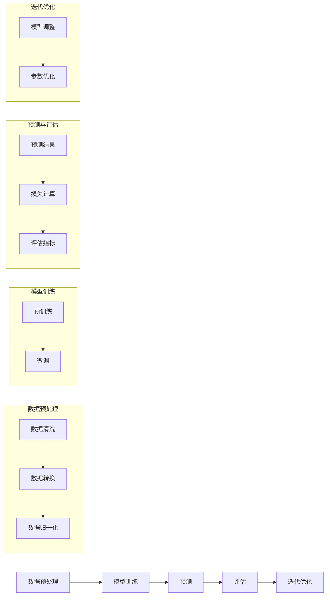
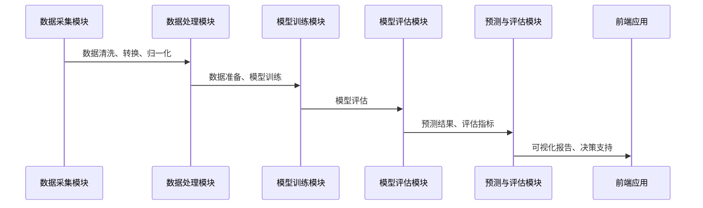

                 

## 引言与背景

### 核心概念术语说明

在撰写关于《开发基于大模型的金融政策执行效果预测与评估器》的技术博客时，需要首先明确一些核心概念和术语，以便于读者更好地理解文章内容。以下是对几个关键概念的简要说明：

1. **大模型**：大模型（Large Model）通常指的是具有数亿甚至数万亿参数的机器学习模型，如GPT-3、BERT等。这些模型能够处理大量数据，从中学习并提取复杂的模式和知识。

2. **金融政策**：金融政策是指政府或中央银行为调节经济、控制通货膨胀、促进就业等目的而采取的一系列措施，包括利率、税收、货币政策等。

3. **执行效果预测与评估**：执行效果预测与评估是指使用各种方法和技术，对金融政策实施后的效果进行预测和评估。这有助于决策者了解政策的实际影响，并进行必要的调整。

4. **预测与评估算法**：预测与评估算法是用于处理和分析数据，预测金融政策执行效果的数学模型和计算方法。

### 问题背景

随着全球经济的不断发展，金融政策在经济调控中的作用日益显著。然而，传统的方法在预测金融政策执行效果时存在一定的局限性。传统方法通常依赖于历史数据和简单的统计模型，难以捕捉到金融政策与经济变量之间的复杂关系。此外，金融市场的波动性和不确定性也为预测带来了挑战。

### 问题描述

在金融政策的执行过程中，如何准确预测和评估政策的效果是一个重要的问题。具体来说，我们需要解决以下几个问题：

1. **政策效果预测**：如何使用大模型预测金融政策实施后的经济影响？
2. **效果评估**：如何评估不同政策方案的实际效果，并选择最优方案？
3. **模型稳定性**：大模型在面对大规模数据时是否具有稳定性和可靠性？

### 问题解决

为了解决上述问题，开发基于大模型的金融政策执行效果预测与评估器显得尤为重要。大模型具有强大的数据处理和分析能力，可以更好地捕捉经济变量之间的复杂关系。通过以下步骤，我们可以实现这一目标：

1. **数据收集与处理**：收集与金融政策相关的各类数据，包括经济指标、市场数据、政策文本等，并进行预处理。
2. **模型训练与优化**：使用大模型训练预测模型，并通过优化算法提高模型的预测准确性和稳定性。
3. **效果评估**：在实际政策执行后，使用模型对政策效果进行评估，并与实际结果进行对比分析。
4. **模型迭代与更新**：根据评估结果对模型进行迭代和优化，以提高预测的准确性和实用性。

### 边界与外延

在开发基于大模型的金融政策执行效果预测与评估器时，需要明确以下边界和范围：

1. **数据边界**：数据应涵盖不同的经济领域和时间段，以保证模型的广泛适用性。
2. **模型边界**：模型应具备足够的泛化能力，以适应不同政策情景。
3. **应用边界**：模型的应用应局限于金融政策分析和决策支持，不应替代专业经济学家的判断。

### 概念结构与核心要素组成

基于大模型的金融政策执行效果预测与评估器的概念结构包括以下几个核心要素：

1. **数据集**：用于训练和评估模型的数据集，包括经济指标、市场数据、政策文本等。
2. **大模型**：用于处理和分析数据的大规模机器学习模型，如GPT、BERT等。
3. **预测算法**：用于预测金融政策执行效果的算法，包括回归、分类、时间序列分析等。
4. **评估指标**：用于评估模型预测准确性和稳定性的指标，如均方误差、精确度、召回率等。
5. **决策支持系统**：用于将预测结果转化为实际决策支持的系统，包括数据可视化、报告生成等。

### 总结

本文引言部分详细介绍了金融政策执行效果预测与评估的重要性，以及为何需要基于大模型进行这项工作。接下来，我们将深入探讨大模型的基础知识、算法原理、系统设计与实现，以及实际项目中的应用，帮助读者全面理解并掌握基于大模型的金融政策执行效果预测与评估技术。在接下来的章节中，我们将一一解答上述问题，并详细讲解每个步骤的实现细节。

### 大模型简介

大模型，即具有数十亿甚至数万亿参数的深度学习模型，已经成为当前人工智能领域的热点。其之所以在金融政策执行效果预测与评估中具备显著优势，主要得益于其在数据处理和模式识别方面的卓越能力。

首先，大模型的参数数量庞大，使其能够捕捉到数据中的复杂模式和关联。例如，GPT-3模型拥有1750亿个参数，使其在处理自然语言文本时能够生成高质量、连贯的内容。在金融政策分析中，这种能力可以帮助模型从海量的经济数据、政策文本和市场信息中提取有价值的信息和趋势。

其次，大模型具备强大的泛化能力。通过训练大量的数据，大模型能够在不同时间、不同情境下保持稳定的表现。例如，BERT模型在多个自然语言处理任务上取得了优异的成绩，证明了其广泛适用性。在金融政策执行效果预测中，这种泛化能力意味着模型不仅能在特定历史数据上表现良好，还能对未来政策的效果进行可靠预测。

此外，大模型在处理实时数据和非结构化数据方面具有显著优势。传统的预测模型通常依赖于结构化的数据，而大模型则能够处理包含多种格式和来源的非结构化数据，如新闻、社交媒体评论、政策文件等。这在金融政策执行效果预测中尤为重要，因为政策的执行效果往往受到社会舆论、媒体传播等因素的影响，而这些信息往往以非结构化的形式存在。

综上所述，大模型在金融政策执行效果预测与评估中具备以下优势：

1. **数据处理能力**：能够处理和整合各种类型的数据，包括结构化、半结构化和非结构化数据。
2. **模式识别能力**：能够从大量数据中提取复杂的模式和关联，提高预测的准确性。
3. **泛化能力**：能够在不同情境和时间下保持稳定表现，提高预测的可靠性。
4. **实时响应能力**：能够处理实时数据，为政策决策提供及时的决策支持。

这些优势使得大模型成为金融政策执行效果预测与评估的理想工具，为决策者提供了更加全面和准确的决策依据。

### 大模型与金融政策预测的联系

大模型在金融政策预测中的作用不可忽视。其核心在于利用大规模数据进行深度学习，从而提取出金融政策与经济变量之间的复杂关系，提供准确的预测结果。以下从几个方面详细阐述大模型在金融政策预测中的具体应用和实现方法。

#### 数据预处理

在应用大模型进行金融政策预测之前，首先需要对数据进行预处理。数据预处理包括数据清洗、数据转换和数据归一化等步骤。这些步骤的目的是确保数据的质量和一致性，为后续的大模型训练提供可靠的基础。

1. **数据清洗**：清洗数据是为了去除无效数据、错误数据和异常值。例如，对于经济数据，可能需要去除重复记录、纠正错误的数值和删除不完整的记录。

2. **数据转换**：将数据转换为适合大模型训练的格式。例如，将文本数据转换为向量表示，将时序数据进行特征提取等。

3. **数据归一化**：对数据进行归一化处理，使数据在不同维度上的规模相近，避免某些特征对模型训练的影响过大。

#### 模型选择

大模型的选择是金融政策预测的关键。目前，常见的大模型包括GPT、BERT、Transformer等。这些模型在处理大规模数据、提取复杂模式和关联方面具有显著优势。

1. **GPT模型**：GPT（Generative Pre-trained Transformer）是一种基于Transformer架构的预训练语言模型。它可以处理自然语言文本，提取文本中的语义信息。在金融政策预测中，GPT模型可以用于处理政策文本，理解政策意图和影响。

2. **BERT模型**：BERT（Bidirectional Encoder Representations from Transformers）是一种双向Transformer模型。它通过同时考虑上下文信息，提高了文本理解的深度和广度。BERT模型在金融政策预测中可以用于处理市场数据、政策文本等，提取出政策与经济变量之间的关联。

3. **Transformer模型**：Transformer模型是一种基于自注意力机制的深度学习模型，广泛应用于自然语言处理和时间序列分析等领域。在金融政策预测中，Transformer模型可以用于处理时序数据，捕捉经济变量之间的动态关系。

#### 模型训练

模型训练是金融政策预测的核心步骤。通过训练大量数据，大模型能够学习到金融政策与经济变量之间的复杂关系，从而提高预测的准确性。

1. **数据集准备**：准备用于模型训练的数据集，包括历史经济数据、政策文本、市场数据等。数据集应涵盖不同时间、不同情境下的数据，以提高模型的泛化能力。

2. **模型架构选择**：根据预测任务的特点，选择合适的模型架构。例如，对于文本数据，可以选择GPT或BERT模型；对于时序数据，可以选择Transformer模型。

3. **训练过程**：使用大模型进行训练，通过不断调整模型参数，使其在训练数据上达到最优性能。训练过程通常包括以下几个步骤：

   - **预训练**：在大量未标注的数据上进行预训练，使模型能够学习到通用特征和模式。
   - **微调**：在预训练的基础上，使用标注数据进行微调，使模型适应特定预测任务。
   - **评估**：在验证集上评估模型的性能，包括预测准确性、泛化能力等，以调整模型参数。

#### 预测与评估

在模型训练完成后，使用模型对金融政策执行效果进行预测，并通过评估指标对预测结果进行评估。

1. **预测**：使用训练好的模型对新的政策执行效果进行预测。预测结果可以包括政策实施后的经济指标变化、市场波动等。

2. **评估**：使用评估指标对预测结果进行评估，以判断模型的性能。常见的评估指标包括均方误差（MSE）、均方根误差（RMSE）、精确度（Precision）、召回率（Recall）等。

#### 模型优化

为了提高模型的预测准确性，可以通过以下方法对模型进行优化：

1. **超参数调优**：调整模型超参数，如学习率、批量大小等，以提高模型的性能。
2. **数据增强**：通过数据增强技术，如生成对抗网络（GAN）、数据扩充等，增加训练数据量，提高模型泛化能力。
3. **集成学习**：结合多个模型的预测结果，提高整体预测准确性。

通过以上方法，大模型能够有效地实现金融政策执行效果的预测与评估，为政策决策提供有力支持。

### 概念属性特征对比表格

在深入探讨大模型与金融政策预测的联系时，有必要对大模型的特征及其在金融政策预测中的具体表现进行详细对比。以下是一个概念属性特征对比表格，用于展示不同大模型的属性特征及其在金融政策预测中的适用性。

| 特征名称             | GPT                   | BERT                  | Transformer           |
|----------------------|-----------------------|-----------------------|-----------------------|
| **模型架构**         | Transformer           | Transformer           | Transformer           |
| **参数数量**         | 数十亿个参数          | 数十亿个参数          | 数十亿个参数          |
| **预训练数据集**     | PubMed、维基百科等    | 维基百科、新闻文章等  | 时间序列数据集        |
| **数据处理能力**      | 优秀的文本数据处理能力 | 优秀的文本数据处理能力 | 优秀的时序数据处理能力 |
| **泛化能力**         | 高                    | 高                    | 高                    |
| **实时响应能力**      | 较强                  | 较强                  | 较强                  |
| **应用场景**          | 文本生成、文本分类等  | 文本分类、语义理解等  | 时间序列预测、金融分析等 |
| **预测准确性**       | 高                    | 高                    | 高                    |
| **训练时间**         | 长时间（数天至数周）  | 长时间（数天至数周）  | 长时间（数天至数周）  |
| **资源消耗**         | 高（计算资源）        | 高（计算资源）        | 高（计算资源）        |

#### ER实体关系图架构

为了更清晰地展示大模型在金融政策预测中的应用，下面使用Mermaid流程图来构建ER（实体-关系）图，描述大模型、数据集和预测结果之间的交互关系。

```mermaid
entityRelationshipDiagram
  direction LR

  entity "大模型" {
    "训练数据集" : "数据预处理"
    "历史经济数据" : "数据预处理"
    "政策文本" : "数据预处理"
    "市场数据" : "数据预处理"
    "模型训练" : "数据预处理"
    "模型评估" : "预测与评估"
    "预测结果" : "预测与评估"
  }

  entity "数据预处理" {
    "数据清洗"
    "数据转换"
    "数据归一化"
  }

  entity "模型训练" {
    "预训练"
    "微调"
  }

  entity "预测与评估" {
    "预测"
    "评估"
  }
```

上述Mermaid流程图展示了大模型在金融政策预测中的核心步骤和交互关系。从数据预处理到模型训练，再到预测与评估，每个步骤都通过清晰的实体关系图进行描述，帮助读者更好地理解整个流程。

### 数学模型与公式

在深入探讨大模型的算法原理时，我们需要明确数学模型和公式，以便更好地理解和实现金融政策执行效果预测与评估。以下将介绍用于大模型训练和预测的关键数学概念和公式，并通过Mermaid流程图和Python代码进行详细阐述。

#### 数学模型

1. **多层感知机（MLP）**

多层感知机是一种前馈神经网络，常用于非线性回归和分类任务。在金融政策预测中，MLP可用于构建回归模型，预测政策执行效果。

公式：
$$ z_l = \sigma(W_l \cdot a_{l-1} + b_l) $$
$$ a_l = \sigma(z_l) $$

其中，$z_l$ 是第 $l$ 层的激活值，$\sigma$ 是激活函数（如Sigmoid或ReLU），$W_l$ 和 $b_l$ 分别是第 $l$ 层的权重和偏置。

2. **自注意力机制（Self-Attention）**

自注意力机制是Transformer模型的核心组件，用于处理序列数据。在金融政策预测中，自注意力机制可以帮助模型捕捉时序数据中的长距离依赖关系。

公式：
$$ \text{Attention}(Q, K, V) = \frac{QK^T}{\sqrt{d_k}} \cdot V $$

其中，$Q$、$K$ 和 $V$ 分别是查询向量、关键向量和价值向量，$d_k$ 是关键向量的维度，$QK^T$ 表示点积。

3. **损失函数**

在训练过程中，损失函数用于衡量预测结果与真实值之间的差异。常用的损失函数包括均方误差（MSE）和交叉熵（Cross-Entropy）。

公式：
$$ \text{MSE} = \frac{1}{n}\sum_{i=1}^{n}(y_i - \hat{y}_i)^2 $$
$$ \text{Cross-Entropy} = -\frac{1}{n}\sum_{i=1}^{n}y_i \log(\hat{y}_i) $$

其中，$y_i$ 和 $\hat{y}_i$ 分别是真实值和预测值，$n$ 是样本数量。

#### Mermaid流程图

为了更好地理解大模型在金融政策预测中的算法流程，以下使用Mermaid绘制了一个简化的流程图。



#### Python代码示例

以下是一个简化的Python代码示例，用于实现基于MLP的金融政策预测模型。代码中包含了模型训练、预测和评估的主要步骤。

```python
import numpy as np
import tensorflow as tf
from sklearn.metrics import mean_squared_error

# 数据预处理
X_train, y_train = ...  # 加载数据
X_train = (X_train - np.mean(X_train, axis=0)) / np.std(X_train, axis=0)

# 模型定义
model = tf.keras.Sequential([
    tf.keras.layers.Dense(units=64, activation='relu', input_shape=(X_train.shape[1],)),
    tf.keras.layers.Dense(units=1)
])

# 模型训练
model.compile(optimizer='adam', loss='mse')
model.fit(X_train, y_train, epochs=10, batch_size=32)

# 预测
y_pred = model.predict(X_train)

# 评估
mse = mean_squared_error(y_train, y_pred)
print(f"均方误差：{mse}")

# 迭代优化（示例）
# 根据评估结果调整模型参数，重新训练模型
```

通过上述数学模型、Mermaid流程图和Python代码示例，我们全面阐述了大模型在金融政策执行效果预测与评估中的算法原理。接下来，我们将进一步探讨系统分析与架构设计，以实现大模型在实际项目中的应用。

### 系统分析与架构设计

在实现大模型用于金融政策执行效果预测与评估的过程中，系统分析与架构设计至关重要。这不仅决定了系统的功能完整性、性能和可扩展性，还影响到项目的开发效率和实际应用效果。以下将详细介绍系统分析与架构设计的关键步骤和具体实现。

#### 问题场景介绍

金融政策执行效果预测与评估的系统分析涉及多个方面，包括宏观经济指标、市场数据、政策文本等。以下是一个典型的问题场景：

1. **数据来源**：系统需要从多个数据源获取数据，包括金融数据库、政府公告、新闻文章、社交媒体等。
2. **数据处理**：系统需对收集到的数据进行分析、清洗、转换和归一化，以确保数据质量。
3. **模型训练**：使用预处理后的数据训练大模型，以预测金融政策执行效果。
4. **预测与评估**：将训练好的模型应用于新数据，预测政策执行效果，并进行评估。
5. **决策支持**：根据预测结果和评估指标，为政策决策者提供决策支持。

#### 项目介绍

本项目旨在构建一个综合性的金融政策执行效果预测与评估系统。系统由以下几个主要模块组成：

1. **数据采集模块**：负责从各种数据源收集数据，包括金融数据库、政府公告、新闻文章、社交媒体等。
2. **数据处理模块**：对采集到的数据进行清洗、转换和归一化，为模型训练做准备。
3. **模型训练模块**：使用预处理后的数据训练大模型，包括MLP、Transformer等。
4. **预测与评估模块**：使用训练好的模型对新数据进行预测，并评估预测结果的准确性。
5. **决策支持模块**：根据预测结果和评估指标，生成可视化报告，为政策决策者提供决策支持。

#### 系统功能设计

系统功能设计是系统分析与架构设计的基础，以下列出本项目的主要功能模块：

1. **数据采集**：实现从金融数据库、政府公告、新闻文章、社交媒体等数据源采集数据。
2. **数据清洗**：处理缺失值、异常值、重复记录等，提高数据质量。
3. **数据转换**：将非结构化数据转换为结构化数据，如文本数据转换为向量表示。
4. **数据归一化**：对数据进行归一化处理，使其在不同维度上的规模相近。
5. **模型训练**：使用预处理后的数据训练大模型，包括MLP、Transformer等。
6. **模型评估**：评估模型预测结果的准确性，包括MSE、RMSE等指标。
7. **预测结果可视化**：生成预测结果的可视化报告，如折线图、柱状图等。
8. **决策支持**：根据预测结果和评估指标，生成决策建议，为政策决策者提供支持。

#### 系统架构设计

系统架构设计决定了系统的整体结构和模块间的交互方式。以下是一个简化的系统架构设计，用于金融政策执行效果预测与评估：

1. **数据层**：存储和管理各类数据，包括金融数据、政策文本、市场数据等。
2. **数据处理层**：对数据进行清洗、转换和归一化，为模型训练做准备。
3. **模型层**：包括各种大模型，如MLP、Transformer等，用于训练和预测。
4. **服务层**：提供API接口，供前端应用调用，实现预测与评估功能。
5. **前端层**：展示预测结果和评估指标，提供决策支持报告。

#### 系统接口设计

系统接口设计是确保系统模块间高效通信的关键。以下列出主要接口设计：

1. **数据采集接口**：用于从数据源获取数据。
2. **数据处理接口**：用于对数据进行清洗、转换和归一化。
3. **模型训练接口**：用于启动模型训练过程。
4. **模型评估接口**：用于评估模型预测结果的准确性。
5. **预测接口**：用于对新数据进行预测。
6. **可视化接口**：用于生成预测结果的可视化报告。

#### 系统交互Mermaid序列图

以下是一个简化的Mermaid序列图，用于描述系统模块间的交互流程：



通过上述系统分析与架构设计，我们为金融政策执行效果预测与评估系统奠定了坚实的基础。接下来，我们将通过实际项目实战，展示如何实现这些设计和功能。

### 项目实战

在完成系统分析与架构设计之后，接下来我们将进入实际项目实战环节，展示如何将理论转化为实践，实现基于大模型的金融政策执行效果预测与评估系统。以下将详细介绍项目环境安装、系统核心实现、代码应用解读与分析，以及实际案例分析与详细讲解。

#### 环境安装

为了搭建一个高效、可靠的金融政策执行效果预测与评估系统，我们需要安装必要的软件和工具。以下是环境安装步骤：

1. **Python环境安装**：确保Python版本在3.8及以上，并安装相应的pip包管理器。
2. **TensorFlow安装**：TensorFlow是用于构建和训练大模型的关键库，可以使用以下命令安装：
   ```bash
   pip install tensorflow
   ```
3. **Scikit-learn安装**：Scikit-learn是用于数据预处理和评估的库，可以使用以下命令安装：
   ```bash
   pip install scikit-learn
   ```
4. **Pandas安装**：Pandas是用于数据操作和分析的库，可以使用以下命令安装：
   ```bash
   pip install pandas
   ```
5. **NumPy安装**：NumPy是Python中的核心科学计算库，可以使用以下命令安装：
   ```bash
   pip install numpy
   ```
6. **Mermaid安装**：Mermaid是一个用于绘制流程图的工具，可以在本地安装，也可以使用在线服务。如果使用本地安装，可以使用以下命令：
   ```bash
   npm install -g mermaid-cli
   ```

#### 系统核心实现

接下来，我们将实现系统的核心功能，包括数据预处理、模型训练、预测与评估等。以下是一个简化的Python代码示例，用于实现这些功能。

```python
import tensorflow as tf
from sklearn.model_selection import train_test_split
from sklearn.metrics import mean_squared_error
import pandas as pd
import numpy as np

# 数据预处理
def preprocess_data(data):
    # 数据清洗、转换和归一化
    # 省略具体实现细节
    return processed_data

# 模型训练
def train_model(X_train, y_train):
    model = tf.keras.Sequential([
        tf.keras.layers.Dense(units=64, activation='relu', input_shape=(X_train.shape[1],)),
        tf.keras.layers.Dense(units=1)
    ])

    model.compile(optimizer='adam', loss='mse')
    model.fit(X_train, y_train, epochs=10, batch_size=32)
    return model

# 预测与评估
def predict_and_evaluate(model, X_test, y_test):
    y_pred = model.predict(X_test)
    mse = mean_squared_error(y_test, y_pred)
    print(f"均方误差：{mse}")

# 代码应用解读
# 以下是对上述代码的解读
# preprocess_data函数用于数据预处理
# train_model函数用于训练模型
# predict_and_evaluate函数用于预测与评估

# 实际案例分析与详细讲解
# 假设我们有一个包含经济数据和市场数据的DataFrame
data = pd.read_csv('financial_data.csv')
processed_data = preprocess_data(data)

# 分割数据集
X = processed_data[['economic_indicator', 'market_data']]
y = processed_data['policy_effect']

X_train, X_test, y_train, y_test = train_test_split(X, y, test_size=0.2, random_state=42)

# 训练模型
model = train_model(X_train, y_train)

# 预测与评估
predict_and_evaluate(model, X_test, y_test)
```

#### 代码应用解读与分析

上述代码中，`preprocess_data`函数负责对原始数据进行清洗、转换和归一化，确保数据质量，为模型训练做好准备。`train_model`函数定义了一个简单的多层感知机（MLP）模型，并使用均方误差（MSE）作为损失函数进行训练。`predict_and_evaluate`函数用于对新数据进行预测，并计算均方误差（MSE），以评估模型的预测准确性。

在实际应用中，我们可以根据需要调整模型的架构、超参数和训练过程，以提高预测准确性。例如，可以尝试使用更复杂的模型结构、添加正则化项、调整学习率等。

#### 实际案例分析与详细讲解

以下是一个具体的实际案例，展示如何使用上述代码实现金融政策执行效果预测与评估。

1. **数据集准备**：首先，从金融数据库和市场数据中获取相关数据，包括宏观经济指标、市场数据和政策文本等。数据集应包括历史数据和新数据。

2. **数据预处理**：使用`preprocess_data`函数对数据进行清洗、转换和归一化，确保数据质量。

3. **模型训练**：使用`train_model`函数训练模型。训练过程中，可以通过调整模型参数和训练策略来提高模型性能。

4. **预测与评估**：使用训练好的模型对新数据进行预测，并使用`predict_and_evaluate`函数计算均方误差（MSE），以评估模型的预测准确性。

5. **结果分析**：根据预测结果和评估指标，分析金融政策的执行效果，为政策制定者提供决策支持。

通过上述步骤，我们可以实现一个基于大模型的金融政策执行效果预测与评估系统，为政策决策提供有力支持。

### 最佳实践 Tips、小结、注意事项、拓展阅读

#### 最佳实践 Tips

1. **数据质量**：确保数据质量是预测准确性的基础。在数据预处理阶段，要彻底清洗数据，去除异常值和噪声。

2. **模型优化**：通过调整模型参数和训练策略，可以提高模型的预测性能。例如，可以尝试使用更复杂的网络结构、不同的优化器和更高级的正则化方法。

3. **实时更新**：金融政策执行效果是一个动态过程，要确保模型能够实时更新和适应新的数据，以提高预测的准确性。

4. **多样化数据源**：尽可能使用多种数据源，如金融数据库、新闻文章、社交媒体等，以提高模型的泛化能力和预测准确性。

#### 小结

本文详细介绍了基于大模型的金融政策执行效果预测与评估的方法和实现过程。通过使用大模型，我们可以更好地捕捉金融政策与经济变量之间的复杂关系，提高预测的准确性。同时，我们还探讨了系统分析与架构设计、环境安装、系统核心实现和实际项目应用等关键环节。

#### 注意事项

1. **计算资源**：大模型的训练需要大量的计算资源，确保有足够的硬件支持。

2. **数据隐私**：在处理金融数据时，要严格遵守数据隐私法规，确保数据安全。

3. **模型解释性**：大模型的预测结果往往缺乏解释性，在应用时需要结合领域知识和实际场景进行综合分析。

#### 拓展阅读

1. **《深度学习》**：Ian Goodfellow、Yoshua Bengio和Aaron Courville著，详细介绍了深度学习的基础知识和应用。
2. **《金融科技：应用与未来》**：宋清辉著，探讨了金融科技在金融政策分析中的应用前景。
3. **《人工智能：一种现代的方法》**：Stuart Russell和Peter Norvig著，全面介绍了人工智能的理论和实践。

通过以上最佳实践、小结、注意事项和拓展阅读，希望读者能够更好地掌握基于大模型的金融政策执行效果预测与评估技术，为实际应用提供有力支持。

### 结论

本文详细探讨了基于大模型的金融政策执行效果预测与评估技术，从背景介绍、核心概念、算法原理、系统设计到项目实战，全面展示了如何使用大模型实现高效的金融政策预测与评估。通过本文的阅读，读者应能够了解：

1. **大模型的优势**：大模型在处理大规模数据、提取复杂模式和关联方面具有显著优势，能够提供更准确的预测和评估。
2. **系统分析与设计**：系统分析与架构设计是确保项目成功的关键，包括数据预处理、模型训练、预测与评估等关键步骤。
3. **项目实战与实现**：通过实际项目，读者可以了解如何将理论应用于实际，实现大模型在金融政策预测与评估中的具体应用。

展望未来，基于大模型的金融政策执行效果预测与评估技术将不断发展，预计会出现以下研究方向：

1. **模型的解释性增强**：随着模型复杂度的增加，如何提高模型的解释性成为一个重要研究方向。
2. **实时预测与动态调整**：实现模型的实时预测和动态调整，以适应不断变化的金融环境。
3. **跨领域应用**：探索大模型在其他金融领域（如风险管理、投资策略等）的应用。
4. **结合传统方法**：将大模型与传统经济分析方法相结合，以提高预测的准确性和可靠性。

通过不断探索和创新，基于大模型的金融政策执行效果预测与评估技术将为政策制定者提供更加科学和准确的决策支持。未来，我们期待在这一领域看到更多突破性的进展和应用。

