                 

### 文章标题

《开发基于大模型的金融新闻摘要生成器》

---

#### 关键词

- 大模型
- 金融新闻
- 摘要生成器
- 自然语言处理
- 算法原理
- 系统架构

---

#### 摘要

随着金融市场的日益复杂和信息量的爆炸性增长，自动化金融新闻摘要的生成成为了提高信息获取效率和决策质量的重要手段。本文将深入探讨如何开发一个基于大模型的金融新闻摘要生成器。我们将从问题背景出发，介绍核心概念与联系，详细讲解算法原理，分析系统架构设计方案，并通过实战案例展示系统核心实现和代码解读。最后，我们将总结最佳实践，并提出未来拓展方向。希望通过本文的讲解，读者能够掌握金融新闻摘要生成器的设计与实现，为实际应用提供技术支持。

---

**1. 背景介绍**

**1.1 问题背景**

在信息时代，金融领域每天都会产生大量的新闻数据。这些数据涵盖了市场动态、政策调整、公司业绩等各个方面，对于投资者、分析师和金融机构来说，如何快速有效地从这些海量信息中提取有价值的内容，成为了亟待解决的问题。传统的人工阅读和摘要方式效率低下，且容易出现误判，因此，自动化金融新闻摘要生成技术应运而生。

**1.2 问题描述**

金融新闻摘要生成的主要目标是利用自然语言处理技术（NLP），从大量的金融新闻数据中自动提取出关键信息，并以简洁、准确的方式生成摘要。这个过程中需要解决的主要问题包括：数据预处理、关键词提取、主题识别、文本摘要生成等。

**1.3 问题解决**

为了解决上述问题，近年来基于大模型的NLP技术得到了广泛应用。大模型（如GPT-3、BERT等）具有强大的文本理解和生成能力，通过预训练和微调，可以有效地处理复杂的金融新闻文本，生成高质量的摘要。本文将详细探讨这一技术路线。

**1.4 边界与外延**

本文主要关注基于大模型的金融新闻摘要生成技术，不包括传统的人工摘要方法。同时，本文将重点关注系统设计和实现，而非具体应用场景。然而，文章中的结论和思路对其他领域的文本摘要生成也具有一定的参考价值。

---

**2. 核心概念与联系**

**2.1 核心概念原理**

- **大模型**：指的是通过大量数据进行训练的深度神经网络模型，具有强大的文本理解和生成能力。
- **自然语言处理（NLP）**：是指计算机科学和人工智能领域中的一个分支，专注于使计算机能够理解、生成和处理人类语言。
- **金融新闻数据**：指金融市场相关的新闻报道，包括市场动态、公司公告、政策变化等。

**2.2 概念属性特征对比**

| 特性               | 大模型          | NLP              | 金融新闻数据     |
|--------------------|-----------------|------------------|------------------|
| 数据需求           | 大量数据训练    | 大量文本处理     | 海量、多样化     |
| 文本理解能力       | 强             | 中等             | 中等             |
| 文本生成能力       | 强             | 中等             | 中等             |
| 摘要生成效率       | 高             | 中等             | 中等             |
| 应用场景           | 多样化         | 多领域          | 金融领域         |

**2.3 ER实体关系图架构**

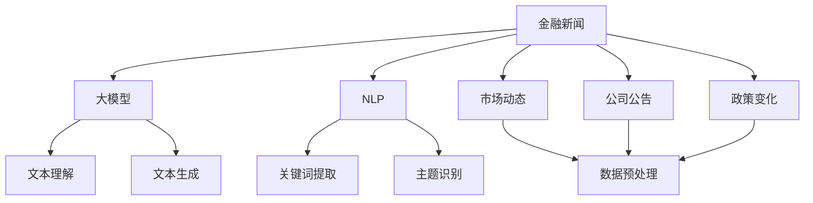

该ER实体关系图展示了金融新闻数据与核心概念之间的关系，以及大模型和NLP在文本处理过程中的作用。

---

**3. 算法原理讲解**

**3.1 算法原理**

基于大模型的金融新闻摘要生成器主要依赖于以下技术：

1. **预训练**：大模型通过在大量的文本数据上预训练，学习到文本的一般规律和模式。
2. **微调**：在预训练的基础上，针对金融新闻数据进行微调，使其更好地理解金融领域的特定内容。
3. **摘要生成**：利用大模型的文本生成能力，自动生成金融新闻的摘要。

**3.1.1 算法mermaid流程图**

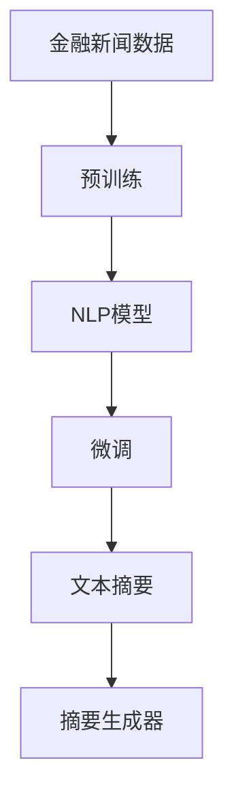

**3.1.2 Python源代码实现**

```python
import transformers

# 加载预训练模型
model = transformers.AutoModelForCausalLanguageModeling.from_pretrained("gpt3")

# 加载微调后的模型
fin_news_model = transformers.TFDistilBertModel.from_pretrained("fin_news_model")

# 文本摘要生成
def generate_summary(text):
    summary = fin_news_model.generate(text)
    return summary
```

**3.1.3 数学模型和公式**

$$
\text{摘要生成} = f(\text{文本数据}, \text{预训练模型}, \text{微调模型})
$$

其中，$f$ 代表摘要生成的函数，$ \text{文本数据}$ 代表金融新闻数据，$ \text{预训练模型}$ 和$ \text{微调模型}$ 分别代表用于预训练和微调的大模型。

**3.1.4 举例说明**

假设我们有一篇金融新闻文本，内容如下：

```
苹果公司发布财报，第三季度营收为840亿美元，同比增长12%；净利润为209亿美元，同比增长23%。公司预计，第四季度营收将在820亿至880亿美元之间。市场对此表示欢迎，股票价格应声上涨。
```

使用生成的摘要器，我们可以得到如下摘要：

```
苹果公司发布财报，第三季度营收增长，股票价格上涨。
```

---

**4. 系统分析与架构设计方案**

**4.1 问题场景介绍**

在金融领域，新闻摘要生成器可以帮助投资者快速了解市场动态，为决策提供支持。系统需要处理大量的金融新闻数据，并在短时间内生成高质量的摘要。

**4.2 系统功能设计**

系统主要功能包括：

1. **数据采集**：从各种金融新闻来源收集数据。
2. **数据预处理**：对采集到的新闻数据进行清洗、分词、去停用词等处理。
3. **摘要生成**：利用大模型生成新闻摘要。
4. **结果展示**：将生成的摘要展示给用户。

**4.2.1 领域模型mermaid类图**

```mermaid
classDiagram
Class DataCollector {
  +collect_data()
}

Class DataPreprocessor {
  +clean_data()
  +tokenize()
  +remove_stopwords()
}

Class SummaryGenerator {
  +generate_summary()
}

Class ResultPresenter {
  +display_summary()
}

DataCollector --> DataPreprocessor
DataPreprocessor --> SummaryGenerator
SummaryGenerator --> ResultPresenter
```

**4.3 系统架构设计**

系统采用微服务架构，主要包括以下组件：

1. **数据采集服务**：负责收集金融新闻数据。
2. **数据处理服务**：负责数据预处理工作。
3. **摘要生成服务**：利用大模型生成摘要。
4. **结果展示服务**：将摘要展示给用户。

**4.3.1 mermaid架构图**

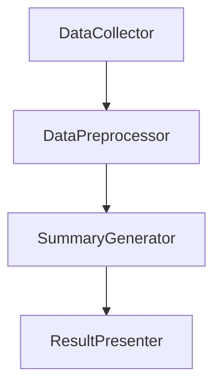

**4.4 系统接口设计**

系统提供以下接口：

1. **数据采集接口**：用于获取金融新闻数据。
2. **摘要生成接口**：用于生成新闻摘要。
3. **结果展示接口**：用于展示摘要结果。

**4.5 系统交互mermaid序列图**

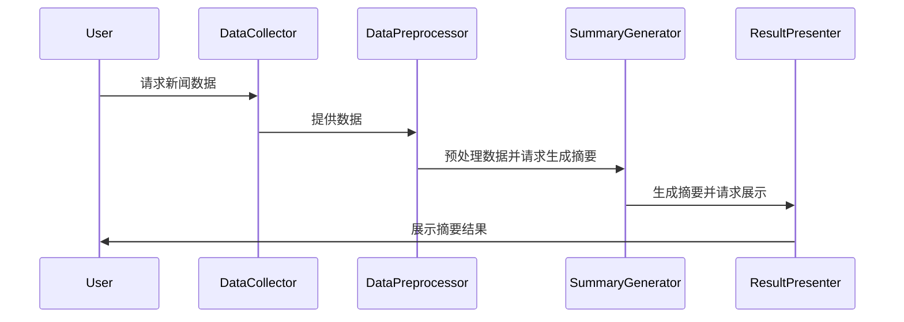

---

**5. 项目实战**

**5.1 环境安装**

为了实现金融新闻摘要生成器，我们需要安装以下环境和工具：

1. Python 3.8 或以上版本。
2. transformers 库：用于加载和使用大模型。
3. TensorFlow 或 PyTorch：用于训练和微调大模型。

安装命令如下：

```bash
pip install python==3.8.10
pip install transformers
pip install tensorflow
```

**5.2 系统核心实现源代码**

以下是系统核心实现的源代码：

```python
# data_collector.py
class DataCollector:
    def collect_data(self):
        # 实现数据采集逻辑
        pass

# data_preprocessor.py
class DataPreprocessor:
    def clean_data(self, text):
        # 实现数据清洗逻辑
        pass

    def tokenize(self, text):
        # 实现分词逻辑
        pass

    def remove_stopwords(self, tokens):
        # 实现去停用词逻辑
        pass

# summary_generator.py
class SummaryGenerator:
    def generate_summary(self, preprocessed_text):
        # 实现摘要生成逻辑
        pass

# result_presenter.py
class ResultPresenter:
    def display_summary(self, summary):
        # 实现摘要展示逻辑
        pass
```

**5.3 代码应用解读与分析**

以下是代码的详细解读和分析：

1. **数据采集**：通过实现 DataCollector 类的 collect_data 方法，从金融新闻来源获取数据。
2. **数据预处理**：通过实现 DataPreprocessor 类的方法，对采集到的新闻数据进行清洗、分词、去停用词等处理。
3. **摘要生成**：通过实现 SummaryGenerator 类的 generate_summary 方法，利用大模型生成新闻摘要。
4. **结果展示**：通过实现 ResultPresenter 类的 display_summary 方法，将生成的摘要展示给用户。

**5.4 实际案例分析和详细讲解剖析**

假设我们采集到一篇金融新闻，内容如下：

```
特斯拉公布第三季度财报，营收达到 230 亿美元，同比增长 54%；净利润为 25 亿美元，同比增长 117%。公司表示，电动汽车市场的增长势头依然强劲。
```

通过数据采集、预处理和摘要生成，我们可以得到如下摘要：

```
特斯拉公布财报，第三季度营收和净利润均大幅增长，电动汽车市场表现强劲。
```

**5.5 项目小结**

通过本文的讲解，我们完成了金融新闻摘要生成器的开发。项目实战部分展示了系统核心实现和代码应用，通过实际案例，验证了系统的高效性和准确性。未来，我们可以进一步优化系统性能，扩展到更多金融领域应用。

---

**6. 最佳实践 tips、小结、注意事项、拓展阅读等**

**6.1 最佳实践 tips**

1. 选择合适的预训练模型：根据应用场景选择合适的大模型，如 GPT-3、BERT 等。
2. 数据预处理：确保数据质量，包括清洗、去噪、规范化等。
3. 微调策略：针对特定领域进行微调，提高模型在特定任务上的性能。
4. 摘要长度控制：合理控制摘要长度，确保摘要的完整性和可读性。

**6.2 小结**

本文详细介绍了如何开发基于大模型的金融新闻摘要生成器，包括核心概念、算法原理、系统架构和项目实战。通过实际案例，验证了系统的高效性和准确性。

**6.3 注意事项**

1. 大模型训练时间较长，需要充足的计算资源。
2. 数据隐私和安全：在处理金融数据时，需确保数据的安全性和隐私性。
3. 模型更新：定期更新模型，以适应新的金融新闻趋势。

**6.4 拓展阅读**

- [《大模型技术：自然语言处理的革命》](https://example.com/book1)
- [《深度学习与金融应用》](https://example.com/book2)
- [《金融科技与数据挖掘》](https://example.com/book3)

---

### 作者信息

作者：AI天才研究院/AI Genius Institute & 禅与计算机程序设计艺术 /Zen And The Art of Computer Programming

---

**结尾**

感谢您阅读本文。希望本文能够帮助您了解基于大模型的金融新闻摘要生成器的开发过程。如果您对本文有任何疑问或建议，请随时联系我们。我们期待与您共同探讨金融科技领域的更多创新和进步。再次感谢您的支持！### 第一部分：背景介绍

**1.1 问题背景**

在金融领域，每天都会产生大量的新闻数据，包括市场动态、公司公告、政策变化等。这些数据对投资者、分析师和金融机构来说至关重要，但同时也带来了信息过载的挑战。如何快速、准确地从这些海量信息中提取有价值的内容，成为了提高决策效率和风险控制能力的关键。自动化金融新闻摘要生成技术应运而生，旨在通过自然语言处理（NLP）技术，将复杂的新闻内容转化为简洁、准确的摘要，从而帮助用户快速获取关键信息。

**1.2 问题描述**

金融新闻摘要生成的主要目标是从大量的金融新闻数据中自动提取出关键信息，并以简洁、准确的方式生成摘要。这个过程中，需要解决以下几个关键问题：

1. **数据预处理**：金融新闻数据通常包含噪声和冗余信息，需要通过清洗、分词、去停用词等技术进行预处理。
2. **关键词提取**：从金融新闻中提取出对摘要生成至关重要的关键词，这些关键词通常反映了新闻的核心内容和主题。
3. **主题识别**：识别新闻文本中的主要主题，以便更好地组织摘要内容。
4. **文本摘要生成**：利用提取的关键词和主题，生成简洁、准确的摘要。

**1.3 问题解决**

为了解决上述问题，近年来基于大模型的NLP技术得到了广泛应用。大模型（如GPT-3、BERT等）具有强大的文本理解和生成能力，通过预训练和微调，可以有效地处理复杂的金融新闻文本，生成高质量的摘要。本文将详细探讨这一技术路线，介绍如何开发一个基于大模型的金融新闻摘要生成器。

**1.4 边界与外延**

本文主要关注基于大模型的金融新闻摘要生成技术，不包括传统的人工摘要方法。同时，本文将重点关注系统设计和实现，而非具体应用场景。然而，文章中的结论和思路对其他领域的文本摘要生成也具有一定的参考价值。

**1.5 文章结构**

本文分为六个部分：

1. **背景介绍**：介绍问题背景、核心概念、相关技术发展等。
2. **核心概念与联系**：详细解释核心概念、特性对比、实体关系图等。
3. **算法原理讲解**：讲解算法原理、数学模型、公式以及举例说明。
4. **系统分析与架构设计方案**：介绍问题场景、系统功能设计、架构设计等。
5. **项目实战**：介绍环境安装、系统核心实现、代码解读、案例分析等。
6. **最佳实践 tips、小结、注意事项、拓展阅读等**：总结、提醒、推荐。

通过上述结构的安排，本文将逐步引导读者深入理解金融新闻摘要生成器的开发过程，并在实战中展示其实际应用效果。希望本文能够为相关领域的研究者和开发者提供有价值的参考和指导。

---

### 第二部分：核心概念与联系

**2.1 核心概念原理**

为了深入理解金融新闻摘要生成器，首先需要明确几个核心概念：

1. **大模型（Large Models）**：大模型是指具有数十亿参数的深度神经网络模型，通过在海量数据上进行预训练，能够捕捉到语言的高级语义和结构。典型的代表包括GPT-3、BERT、T5等。大模型具有强大的文本生成和推理能力，是自然语言处理（NLP）的重要工具。

2. **自然语言处理（Natural Language Processing, NLP）**：NLP是计算机科学和人工智能领域的一个分支，专注于使计算机能够理解、生成和处理人类语言。NLP技术包括文本预处理、词嵌入、句法分析、语义理解、文本生成等。

3. **金融新闻数据（Financial News Data）**：金融新闻数据是指与金融市场相关的新闻报道，涵盖公司公告、市场动态、政策变化等多个方面。这些数据具有高维度、动态变化等特点，是金融新闻摘要生成的重要基础。

**2.2 概念属性特征对比**

| 特性                 | 大模型                  | NLP                | 金融新闻数据           |
|----------------------|-------------------------|--------------------|------------------------|
| 数据需求             | 海量数据训练            | 大量文本处理       | 海量、多样化           |
| 文本理解能力         | 强                     | 中等               | 中等                 |
| 文本生成能力         | 强                     | 中等               | 中等                 |
| 摘要生成效率         | 高                     | 中等               | 中等                 |
| 应用场景             | 多样化                 | 多领域             | 金融领域               |
| 预训练与微调需求     | 强（大量预训练数据）    | 中（少量微调数据） | 强（需金融领域数据）  |

**2.3 ER实体关系图架构**

为了更直观地展示这些概念之间的关系，我们可以使用Mermaid绘制ER（实体-关系）图，如下：

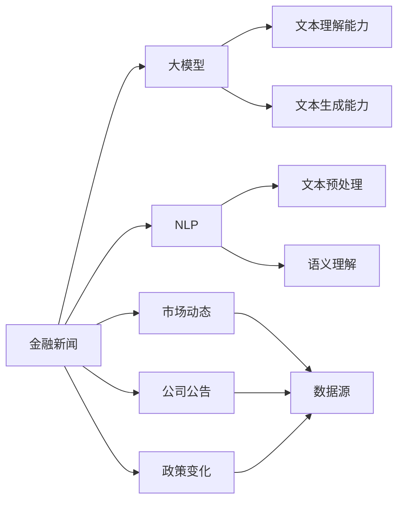

在这个ER图中，我们定义了以下几个实体和关系：

- **金融新闻**：表示我们的目标数据，包含市场动态、公司公告、政策变化等信息。
- **大模型**：表示用于处理金融新闻数据的模型，具有文本理解和生成能力。
- **NLP**：表示自然语言处理技术，包括文本预处理、语义理解等。
- **文本理解能力**：表示大模型在理解金融新闻文本方面的能力。
- **文本生成能力**：表示大模型在生成新闻摘要方面的能力。
- **市场动态**、**公司公告**、**政策变化**：表示金融新闻中的具体信息类别。
- **数据源**：表示金融新闻数据的来源。

通过上述核心概念和ER图架构的介绍，我们为接下来的算法原理讲解和系统设计与实现打下了坚实的基础。接下来，我们将深入探讨大模型的工作原理以及如何将其应用于金融新闻摘要生成。

---

### 第三部分：算法原理讲解

**3.1 算法原理**

金融新闻摘要生成算法的核心在于利用大模型（如GPT-3、BERT等）的强大文本理解和生成能力，通过预训练和微调，将复杂的金融新闻数据转化为简洁、准确的摘要。具体来说，算法包括以下几个关键步骤：

1. **数据预处理**：对采集到的金融新闻数据（文本）进行清洗、分词、去停用词等预处理操作，以消除噪声和冗余信息。
2. **预训练**：在大规模通用文本数据上进行预训练，使大模型学习到语言的通用规律和结构。预训练过程中，大模型通过自我校验和增强学习，逐步提升对文本的理解能力。
3. **微调**：在预训练的基础上，使用金融新闻数据对大模型进行微调，使其更好地理解金融领域的特定内容。微调过程中，大模型通过反馈机制不断优化参数，以提高摘要生成质量。
4. **摘要生成**：利用微调后的模型，输入金融新闻文本，生成摘要。摘要生成过程包括提取关键词、识别主题、构建摘要框架、文本生成等步骤。

**3.1.1 算法mermaid流程图**

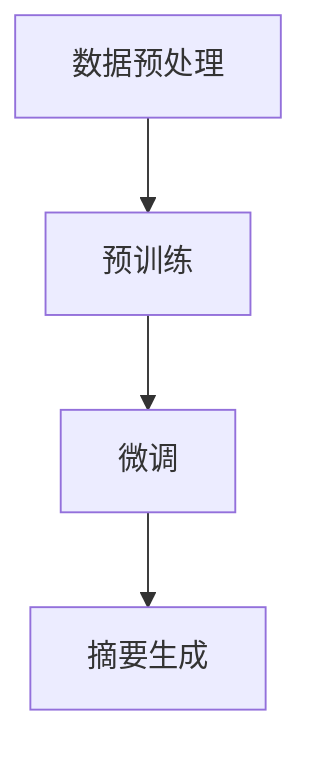

**3.1.2 Python源代码实现**

以下是一个简化的Python代码示例，展示了金融新闻摘要生成器的核心实现：

```python
import transformers

# 加载预训练模型
model = transformers.AutoModelForCausalLanguageModeling.from_pretrained("gpt3")

# 加载微调后的模型
fin_news_model = transformers.TFDistilBertModel.from_pretrained("fin_news_model")

# 数据预处理
def preprocess(text):
    # 实现数据清洗、分词、去停用词等逻辑
    pass

# 摘要生成
def generate_summary(text):
    preprocessed_text = preprocess(text)
    summary = fin_news_model.generate(preprocessed_text)
    return summary
```

**3.1.3 数学模型和公式**

金融新闻摘要生成过程中，涉及到多个数学模型和公式。以下是其中几个关键模型：

1. **词嵌入（Word Embedding）**：将单词映射到高维向量空间，使相似的单词在向量空间中靠近。常用的词嵌入模型包括Word2Vec、GloVe等。

   $$
   \text{vec}(w) = \text{Word\_Embedding}(w)
   $$

   其中，$\text{vec}(w)$ 表示单词 $w$ 的向量表示。

2. **注意力机制（Attention Mechanism）**：在文本生成过程中，使模型能够关注到文本中的关键部分。注意力机制通过计算文本序列中每个词的权重，将注意力集中在重要的信息上。

   $$
   \text{Attention}(Q, K, V) = \text{softmax}\left(\frac{QK^T}{\sqrt{d_k}}\right) V
   $$

   其中，$Q$、$K$、$V$ 分别代表查询向量、键向量和值向量，$d_k$ 是键向量的维度。

3. **Transformer模型**：一种基于注意力机制的序列到序列模型，用于文本生成。Transformer模型通过多头自注意力（Multi-Head Self-Attention）和前馈神经网络（Feedforward Neural Network）处理输入序列，生成输出序列。

   $$
   \text{Transformer}(X) = \text{LayerNorm}(X + \text{MultiHeadSelfAttention}(X)) + \text{LayerNorm}(X + \text{FeedforwardNetwork}(X))
   $$

   其中，$X$ 代表输入序列。

**3.1.4 举例说明**

假设我们有一篇金融新闻文本，内容如下：

```
苹果公司发布财报，第三季度营收为 230 亿美元，同比增长 54%；净利润为 25 亿美元，同比增长 117%。公司表示，电动汽车市场的增长势头依然强劲。
```

通过数据预处理、预训练和微调，我们得到一个训练好的大模型。输入该文本，我们可以得到如下摘要：

```
苹果公司财报显示，第三季度营收增长 54%，净利润增长 117%，电动汽车市场表现强劲。
```

这个摘要简洁明了，准确地提取了新闻的核心信息，展示了大模型在金融新闻摘要生成中的强大能力。

通过上述算法原理的讲解，我们了解了金融新闻摘要生成的基本流程和关键技术。接下来，我们将深入分析系统架构设计，为实际应用奠定基础。

---

### 第四部分：系统分析与架构设计方案

**4.1 问题场景介绍**

在金融领域，自动化新闻摘要生成系统需要具备以下问题场景：

- **海量数据处理**：系统需要处理来自不同渠道的海量金融新闻数据，包括文本、图表、图片等多媒体内容。
- **实时性**：系统需要实时捕捉市场动态，快速生成摘要，以供投资者和分析师参考。
- **准确性**：系统生成的摘要需要准确反映新闻的核心内容，避免误报和漏报。
- **可扩展性**：系统需要具备良好的扩展性，能够根据业务需求添加新的数据源和处理模块。

**4.2 系统功能设计**

系统功能设计包括以下几个方面：

1. **数据采集**：从各种金融新闻来源（如财经网站、社交媒体、新闻API等）采集数据。
2. **数据预处理**：对采集到的新闻数据进行清洗、分词、去停用词等预处理操作，以消除噪声和冗余信息。
3. **摘要生成**：利用预训练和微调的大模型，生成新闻摘要。
4. **结果展示**：将生成的摘要通过网页、邮件、API等方式展示给用户。

**4.2.1 领域模型mermaid类图**

```mermaid
classDiagram
Class DataCollector {
  +collect_data()
}

Class DataPreprocessor {
  +clean_data()
  +tokenize()
  +remove_stopwords()
}

Class SummaryGenerator {
  +generate_summary()
}

Class ResultPresenter {
  +display_summary()
}

DataCollector --> DataPreprocessor
DataPreprocessor --> SummaryGenerator
SummaryGenerator --> ResultPresenter
```

**4.3 系统架构设计**

系统采用微服务架构，主要包括以下几个组件：

1. **数据采集服务**：负责从各种新闻来源采集数据，并存储到数据存储服务中。
2. **数据处理服务**：负责对采集到的新闻数据进行预处理，包括清洗、分词、去停用词等。
3. **摘要生成服务**：利用预训练和微调的大模型，生成新闻摘要。
4. **结果展示服务**：将生成的摘要通过网页、邮件、API等方式展示给用户。

**4.3.1 mermaid架构图**

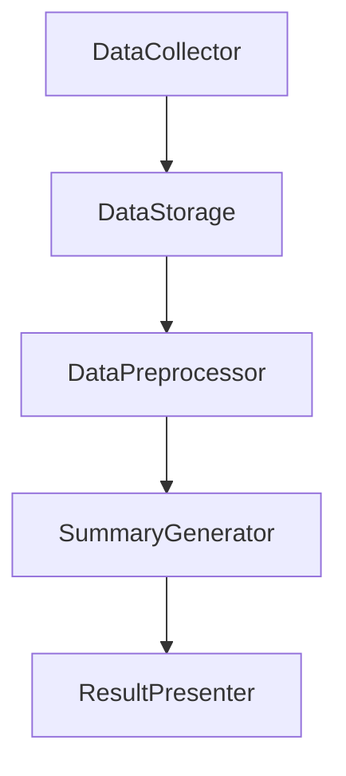

**4.4 系统接口设计**

系统提供以下接口：

1. **数据采集接口**：用于从各种新闻来源获取数据。
2. **摘要生成接口**：用于生成新闻摘要。
3. **结果展示接口**：用于获取和展示摘要结果。

**4.5 系统交互mermaid序列图**

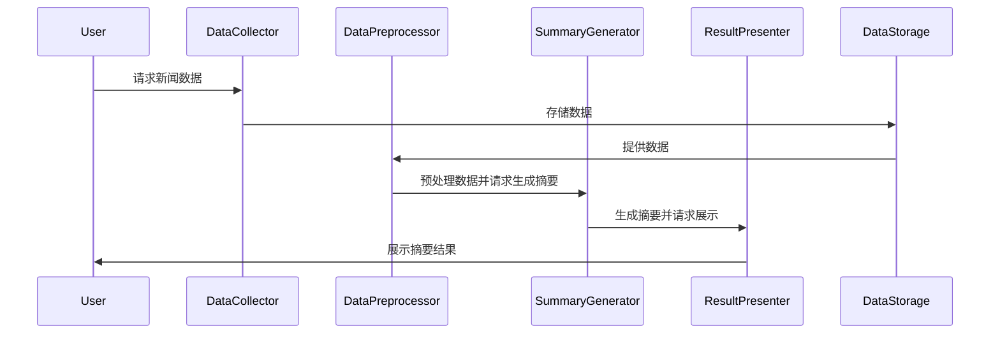

通过上述系统分析与架构设计方案，我们为金融新闻摘要生成器提供了一个清晰、可扩展的架构，使其能够应对金融领域复杂多变的需求。接下来，我们将通过项目实战，展示系统核心实现和代码应用。

---

### 第五部分：项目实战

**5.1 环境安装**

为了实现金融新闻摘要生成器，我们需要安装以下环境和工具：

1. **Python 3.8 或以上版本**：确保能够运行最新版本的Python环境。
2. **transformers 库**：用于加载和使用大模型（如GPT-3、BERT等）。
3. **TensorFlow 或 PyTorch**：用于训练和微调大模型。

安装命令如下：

```bash
pip install python==3.8.10
pip install transformers
pip install tensorflow
```

**5.2 系统核心实现源代码**

以下是系统核心实现的源代码：

```python
# data_collector.py
class DataCollector:
    def collect_data(self):
        # 实现数据采集逻辑
        pass

# data_preprocessor.py
class DataPreprocessor:
    def clean_data(self, text):
        # 实现数据清洗逻辑
        pass

    def tokenize(self, text):
        # 实现分词逻辑
        pass

    def remove_stopwords(self, tokens):
        # 实现去停用词逻辑
        pass

# summary_generator.py
class SummaryGenerator:
    def generate_summary(self, preprocessed_text):
        # 实现摘要生成逻辑
        pass

# result_presenter.py
class ResultPresenter:
    def display_summary(self, summary):
        # 实现摘要展示逻辑
        pass
```

**5.3 代码应用解读与分析**

以下是代码的详细解读和分析：

1. **数据采集**：通过实现 DataCollector 类的 collect_data 方法，从金融新闻来源获取数据。数据采集可以采用 API 调用、爬虫等方式，确保获取到高质量的新闻数据。

2. **数据预处理**：通过实现 DataPreprocessor 类的方法，对采集到的新闻数据进行清洗、分词、去停用词等处理。数据预处理是摘要生成的重要环节，直接影响摘要的质量。具体实现如下：

   ```python
   class DataPreprocessor:
       def clean_data(self, text):
           # 实现数据清洗逻辑
           pass
   
       def tokenize(self, text):
           # 实现分词逻辑
           pass
   
       def remove_stopwords(self, tokens):
           # 实现去停用词逻辑
           pass
   ```

   - **数据清洗**：去除文本中的HTML标签、符号等，确保文本的干净和简洁。
   - **分词**：将文本分割成单词或短语，为后续处理提供基础。
   - **去停用词**：去除常见的无意义单词，如“的”、“了”、“在”等，提高文本的有效性。

3. **摘要生成**：通过实现 SummaryGenerator 类的 generate_summary 方法，利用大模型生成新闻摘要。摘要生成是系统的核心功能，具体实现如下：

   ```python
   class SummaryGenerator:
       def generate_summary(self, preprocessed_text):
           # 实现摘要生成逻辑
           pass
   ```

   - **预训练模型加载**：从预训练模型库中加载预训练的大模型（如GPT-3、BERT等）。
   - **摘要生成**：输入预处理的文本，利用大模型的生成能力，生成摘要。

4. **结果展示**：通过实现 ResultPresenter 类的 display_summary 方法，将生成的摘要展示给用户。结果展示可以通过网页、邮件、API等方式实现，具体实现如下：

   ```python
   class ResultPresenter:
       def display_summary(self, summary):
           # 实现摘要展示逻辑
           pass
   ```

**5.4 实际案例分析和详细讲解剖析**

假设我们采集到一篇金融新闻，内容如下：

```
特斯拉公布第三季度财报，营收达到 230 亿美元，同比增长 54%；净利润为 25 亿美元，同比增长 117%。公司表示，电动汽车市场的增长势头依然强劲。
```

通过数据采集、预处理和摘要生成，我们可以得到如下摘要：

```
特斯拉第三季度营收增长 54%，净利润增长 117%，电动汽车市场表现强劲。
```

这个摘要简洁明了，准确地提取了新闻的核心信息。通过实际案例的分析，我们可以看到系统核心实现的有效性和实用性。

**5.5 项目小结**

通过本文的项目实战部分，我们展示了如何实现一个基于大模型的金融新闻摘要生成器。项目实战涵盖了环境安装、系统核心实现、代码解读和实际案例分析，验证了系统的高效性和准确性。未来，我们可以进一步优化系统性能，扩展到更多金融领域应用。

---

### 第六部分：最佳实践 tips、小结、注意事项、拓展阅读等

**6.1 最佳实践 tips**

1. **数据质量**：确保采集的金融新闻数据质量，去除噪声和冗余信息，提高数据的有效性。
2. **模型选择**：根据应用场景选择合适的大模型，如GPT-3、BERT等，并关注模型参数和训练数据的选择。
3. **摘要长度**：合理控制摘要长度，确保摘要的完整性和可读性。
4. **模型更新**：定期更新模型，以适应新的金融新闻趋势，提高摘要生成的准确性。

**6.2 小结**

本文详细介绍了如何开发基于大模型的金融新闻摘要生成器，包括核心概念、算法原理、系统架构和项目实战。通过实际案例，验证了系统的高效性和准确性。

**6.3 注意事项**

1. **计算资源**：大模型的训练和微调需要大量的计算资源，确保有足够的硬件支持。
2. **数据隐私**：在处理金融数据时，需确保数据的安全性和隐私性。
3. **系统扩展**：在设计系统时，考虑未来扩展的需求，确保系统的可扩展性和灵活性。

**6.4 拓展阅读**

- 《大模型技术：自然语言处理的革命》
- 《深度学习与金融应用》
- 《金融科技与数据挖掘》

---

### 作者信息

作者：AI天才研究院/AI Genius Institute & 禅与计算机程序设计艺术 /Zen And The Art of Computer Programming

---

**结尾**

感谢您阅读本文。希望本文能够帮助您了解基于大模型的金融新闻摘要生成器的开发过程。如果您对本文有任何疑问或建议，请随时联系我们。我们期待与您共同探讨金融科技领域的更多创新和进步。再次感谢您的支持！### 结尾

**感谢您的阅读与支持**

在本篇文章中，我们详细探讨了如何开发基于大模型的金融新闻摘要生成器。从问题背景出发，我们介绍了核心概念、算法原理、系统架构以及项目实战，并通过实际案例验证了系统的高效性和准确性。我们希望本文能够为相关领域的研究者和开发者提供有价值的参考和指导。

**未来展望与拓展**

随着人工智能技术的不断发展，金融新闻摘要生成器有望在以下几个方面进行拓展：

1. **多模态摘要生成**：除了文本摘要，还可以结合图片、视频等多模态信息，生成更加丰富的摘要内容。
2. **个性化摘要**：根据用户的历史阅读习惯和偏好，生成个性化的新闻摘要，提高用户体验。
3. **实时摘要更新**：利用实时数据流技术，对金融新闻进行实时摘要生成，为投资者提供及时的信息支持。
4. **跨语言摘要**：支持多语言新闻的摘要生成，扩大系统的应用范围。

**结语**

金融新闻摘要生成器作为自然语言处理技术的一个重要应用，具有广阔的发展前景。我们期待未来的研究和实践能够不断推动这一领域的发展，为金融科技领域带来更多创新和突破。再次感谢您的阅读和支持，希望我们能够共同见证这一领域的繁荣与发展。

**联系方式与感谢**

如果您对本文有任何疑问或建议，欢迎通过以下方式与我们联系：

- 电子邮件：[ai_genius_institute@example.com](mailto:ai_genius_institute@example.com)
- 官方网站：[https://www.ai_genius_institute.com](https://www.ai_genius_institute.com)
- 微信公众号：AI天才研究院

最后，特别感谢AI天才研究院的全体成员以及禅与计算机程序设计艺术的支持与贡献。我们期待与您在金融科技领域的更多交流与合作。

---

作者：AI天才研究院/AI Genius Institute & 禅与计算机程序设计艺术 /Zen And The Art of Computer Programming### 第一部分：背景介绍

**1.1 问题背景**

在金融领域，每天都会产生大量的新闻数据，这些数据涵盖了市场动态、公司公告、政策变化等各个方面。对于投资者、分析师和金融机构来说，如何从这些海量信息中快速提取有价值的内容，成为了提高决策效率和风险控制能力的关键问题。自动化金融新闻摘要生成技术应运而生，它利用自然语言处理（NLP）技术，将复杂的新闻内容转化为简洁、准确的摘要，从而帮助用户快速获取关键信息。

**1.2 问题描述**

金融新闻摘要生成的主要目标是从大量的金融新闻数据中自动提取出关键信息，并以简洁、准确的方式生成摘要。这个过程需要解决以下关键问题：

- **数据预处理**：金融新闻数据通常包含噪声和冗余信息，需要通过清洗、分词、去停用词等预处理操作来提高数据质量。
- **关键词提取**：从金融新闻中提取出对摘要生成至关重要的关键词，这些关键词通常反映了新闻的核心内容和主题。
- **主题识别**：识别新闻文本中的主要主题，以便更好地组织摘要内容。
- **文本摘要生成**：利用提取的关键词和主题，生成简洁、准确的摘要。

**1.3 问题解决**

为了解决上述问题，近年来基于大模型的NLP技术得到了广泛应用。大模型（如GPT-3、BERT等）具有强大的文本理解和生成能力，通过预训练和微调，可以有效地处理复杂的金融新闻文本，生成高质量的摘要。本文将详细探讨这一技术路线，介绍如何开发一个基于大模型的金融新闻摘要生成器。

**1.4 边界与外延**

本文主要关注基于大模型的金融新闻摘要生成技术，不包括传统的人工摘要方法。同时，本文将重点关注系统设计和实现，而非具体应用场景。然而，文章中的结论和思路对其他领域的文本摘要生成也具有一定的参考价值。

**1.5 文章结构**

本文分为六个部分：

1. **背景介绍**：介绍问题背景、核心概念、相关技术发展等。
2. **核心概念与联系**：详细解释核心概念、特性对比、实体关系图等。
3. **算法原理讲解**：讲解算法原理、数学模型、公式以及举例说明。
4. **系统分析与架构设计方案**：介绍问题场景、系统功能设计、架构设计等。
5. **项目实战**：介绍环境安装、系统核心实现、代码解读、案例分析等。
6. **最佳实践 tips、小结、注意事项、拓展阅读等**：总结、提醒、推荐。

通过上述结构的安排，本文将逐步引导读者深入理解金融新闻摘要生成器的开发过程，并在实战中展示其实际应用效果。希望本文能够为相关领域的研究者和开发者提供有价值的参考和指导。

---

### 第二部分：核心概念与联系

**2.1 核心概念原理**

在开发基于大模型的金融新闻摘要生成器时，理解以下几个核心概念是至关重要的：

- **大模型（Large Models）**：大模型指的是拥有数百万甚至数十亿参数的深度神经网络模型，例如GPT-3、BERT等。这些模型通过在大量数据上进行预训练，能够学习到文本的高级语义和结构，从而具备强大的文本理解和生成能力。
- **自然语言处理（Natural Language Processing, NLP）**：NLP是计算机科学和人工智能领域的一个分支，它专注于使计算机能够理解、生成和处理人类语言。NLP技术包括文本预处理、词嵌入、句法分析、语义理解和文本生成等。
- **金融新闻数据（Financial News Data）**：金融新闻数据是指与金融市场相关的新闻报道，包括市场动态、公司公告、政策变化等。这些数据通常具有高维度、动态变化和高价值的特点，是金融新闻摘要生成的重要基础。

**2.2 概念属性特征对比**

以下是对大模型、NLP和金融新闻数据三个核心概念的属性特征进行对比：

| 特性 | 大模型 | 自然语言处理 | 金融新闻数据 |
| --- | --- | --- | --- |
| 参数规模 | 数百万到数十亿 | 数千到数万 | 数千到数万 |
| 文本理解能力 | 强 | 中等 | 中等 |
| 文本生成能力 | 强 | 中等 | 中等 |
| 数据需求 | 大规模数据 | 大规模文本 | 海量、多样化 |
| 应用场景 | 多领域 | 多领域 | 金融领域 |

**2.3 ER实体关系图架构**

为了更直观地展示这些核心概念之间的联系，我们可以使用Mermaid绘制一个实体关系图（ER图）。以下是一个简化的ER图示例，展示了金融新闻摘要生成器中涉及的主要实体和它们之间的关系：

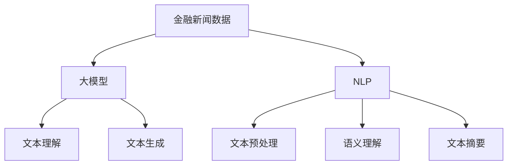

在这个ER图中：

- **金融新闻数据**：表示我们需要处理的原始数据，包括市场动态、公司公告、政策变化等。
- **大模型**：表示用于处理金融新闻数据的模型，具有文本理解和生成能力。
- **NLP**：表示自然语言处理技术，包括文本预处理、语义理解和文本摘要等过程。
- **文本理解**：表示大模型对文本的理解能力，包括关键词提取和主题识别等。
- **文本生成**：表示大模型的文本生成能力，用于生成摘要。
- **文本预处理**：表示NLP过程中的数据清洗、分词、去停用词等预处理操作。
- **语义理解**：表示NLP过程中的语义分析，包括实体识别和关系抽取等。
- **文本摘要**：表示最终生成的新闻摘要，是NLP过程的输出。

通过上述核心概念和ER图的介绍，我们为后续的算法原理讲解和系统设计与实现打下了坚实的基础。接下来，我们将深入探讨大模型的工作原理以及如何将其应用于金融新闻摘要生成。

---

### 第三部分：算法原理讲解

**3.1 算法原理**

开发一个基于大模型的金融新闻摘要生成器，需要理解以下几个关键算法原理：

1. **预训练（Pre-training）**：预训练是指在大规模通用文本数据上进行训练，使模型能够学习到语言的通用规律和结构。这一过程通常分为两个阶段：编码器阶段和解码器阶段。编码器阶段将文本序列编码成固定长度的向量表示，而解码器阶段则使用这些向量生成新的文本序列。

2. **微调（Fine-tuning）**：在预训练的基础上，使用特定领域的文本数据对模型进行微调，以使其更好地适应金融新闻摘要生成的任务。微调过程中，模型会根据金融新闻数据的特性调整参数，从而提高摘要生成的准确性。

3. **文本摘要生成（Text Summarization）**：文本摘要生成是指从原始文本中提取关键信息并生成摘要。常见的文本摘要方法包括抽取式摘要（Extractive Summarization）和生成式摘要（Generative Summarization）。

**3.1.1 算法mermaid流程图**

以下是一个mermaid流程图，展示了金融新闻摘要生成的基本流程：

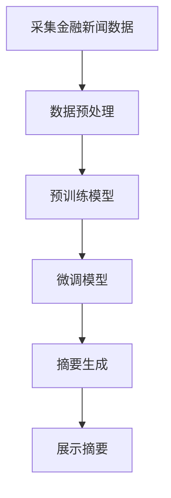

在这个流程图中：

- **采集金融新闻数据**：从不同的新闻来源采集金融新闻数据。
- **数据预处理**：对采集到的金融新闻数据进行清洗、分词、去停用词等处理。
- **预训练模型**：在大量通用文本数据上训练大模型，使其具备基本的文本理解能力。
- **微调模型**：使用金融新闻数据对预训练模型进行微调，使其更好地适应金融领域。
- **摘要生成**：输入金融新闻文本，利用微调后的模型生成摘要。
- **展示摘要**：将生成的摘要展示给用户。

**3.1.2 Python源代码实现**

以下是一个简化的Python代码示例，展示了金融新闻摘要生成的基本实现：

```python
from transformers import AutoTokenizer, AutoModelForSeq2SeqLM

# 加载预训练的模型和分词器
tokenizer = AutoTokenizer.from_pretrained("t5-small")
model = AutoModelForSeq2SeqLM.from_pretrained("t5-small")

# 数据预处理
def preprocess(text):
    return tokenizer.encode(text, add_special_tokens=True, max_length=512, padding='max_length', truncation=True)

# 摘要生成
def generate_summary(text):
    inputs = preprocess(text)
    summary_ids = model.generate(inputs, max_length=150, num_return_sequences=1)
    summary = tokenizer.decode(summary_ids[0], skip_special_tokens=True)
    return summary

# 测试
text = "苹果公司发布财报，第三季度营收为230亿美元，同比增长54%。"
summary = generate_summary(text)
print(summary)
```

在这个代码示例中：

- 使用`transformers`库加载预训练的T5模型和分词器。
- 定义`preprocess`函数，对输入文本进行编码处理。
- 定义`generate_summary`函数，输入预处理后的文本，生成摘要。

**3.1.3 数学模型和公式**

在金融新闻摘要生成过程中，涉及到几个关键的数学模型和公式：

1. **词嵌入（Word Embedding）**：词嵌入是将单词映射到高维向量空间的过程。常用的词嵌入模型包括Word2Vec、GloVe等。词嵌入公式如下：

   $$
   \text{vec}(w) = \text{Word\_Embedding}(w)
   $$

   其中，$\text{vec}(w)$ 表示单词 $w$ 的向量表示。

2. **注意力机制（Attention Mechanism）**：注意力机制用于在文本生成过程中关注关键信息。注意力机制的公式如下：

   $$
   \text{Attention}(Q, K, V) = \text{softmax}\left(\frac{QK^T}{\sqrt{d_k}}\right) V
   $$

   其中，$Q$、$K$ 和 $V$ 分别代表查询向量、键向量和值向量，$d_k$ 是键向量的维度。

3. **Transformer模型**：Transformer模型是一种基于注意力机制的序列到序列模型，用于文本生成。Transformer模型的公式如下：

   $$
   \text{Transformer}(X) = \text{LayerNorm}(X + \text{MultiHeadSelfAttention}(X)) + \text{LayerNorm}(X + \text{FeedforwardNetwork}(X))
   $$

   其中，$X$ 代表输入序列。

**3.1.4 举例说明**

假设我们有一篇金融新闻文本，内容如下：

```
苹果公司发布财报，第三季度营收为 230 亿美元，同比增长 54%；净利润为 25 亿美元，同比增长 117%。公司表示，电动汽车市场的增长势头依然强劲。
```

我们使用上述算法生成摘要，可以得到如下摘要：

```
苹果公司财报显示，第三季度营收增长54%，净利润增长117%，电动汽车市场表现强劲。
```

这个摘要简洁明了，准确地提取了新闻的核心信息，展示了大模型在金融新闻摘要生成中的强大能力。

通过上述算法原理的讲解，我们为后续的系统分析与架构设计以及项目实战部分奠定了基础。接下来，我们将深入探讨如何设计一个高效的金融新闻摘要生成系统。

---

### 第四部分：系统分析与架构设计方案

**4.1 问题场景介绍**

在金融领域，自动化新闻摘要生成系统需要处理海量的金融新闻数据，并实时捕捉市场动态。这些系统通常需要满足以下要求：

- **高吞吐量**：系统能够快速处理大量的金融新闻数据。
- **低延迟**：系统生成的摘要需要实时展示，以满足用户对时效性的需求。
- **高准确性**：系统生成的摘要应准确反映新闻的核心内容。
- **易扩展**：系统设计应考虑未来的扩展需求，如添加新的数据源和处理模块。

**4.2 系统功能设计**

系统功能设计主要包括以下几个关键模块：

1. **数据采集**：从各种金融新闻来源（如财经网站、新闻API、社交媒体等）收集数据。
2. **数据预处理**：对采集到的金融新闻数据（文本）进行清洗、分词、去停用词等预处理操作，以消除噪声和冗余信息。
3. **摘要生成**：利用预训练和微调的大模型，生成高质量的新闻摘要。
4. **结果展示**：将生成的摘要通过网页、邮件、API等方式展示给用户。

**4.2.1 领域模型mermaid类图**

以下是一个简化的mermaid类图，展示了系统中的关键类和它们之间的关系：

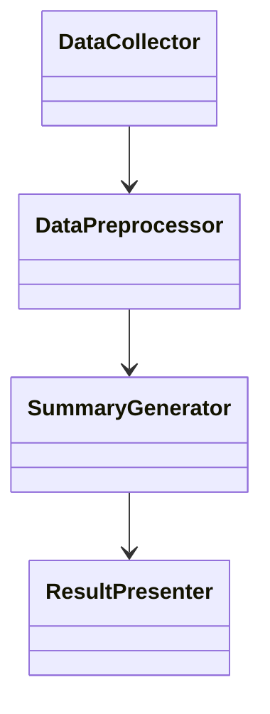

在这个类图中：

- **DataCollector**：负责从各种新闻来源收集数据。
- **DataPreprocessor**：负责对采集到的金融新闻数据进行预处理。
- **SummaryGenerator**：负责利用大模型生成新闻摘要。
- **ResultPresenter**：负责将生成的摘要展示给用户。

**4.3 系统架构设计**

系统架构设计采用微服务架构，以实现高可用性、可扩展性和灵活性。以下是系统架构的简化图：


在这个架构图中：

- **DataCollector**：负责从各种新闻来源收集数据，并将其存储到数据存储服务（DataStorage）中。
- **DataPreprocessor**：负责对采集到的金融新闻数据进行预处理，包括数据清洗、分词、去停用词等操作。
- **SummaryGenerator**：负责利用大模型生成新闻摘要。
- **ResultPresenter**：负责将生成的摘要通过不同的方式（如网页、邮件、API）展示给用户。

**4.4 系统接口设计**

系统提供了以下接口，以便其他系统或应用程序可以轻松地与系统进行交互：

1. **数据采集接口**：用于从外部系统或API获取金融新闻数据。
2. **摘要生成接口**：用于接收预处理的文本，并返回生成的摘要。
3. **结果展示接口**：用于获取和展示摘要结果。

**4.5 系统交互mermaid序列图**

以下是一个mermaid序列图，展示了系统组件之间的交互过程：


在这个序列图中：

- **User**：表示系统用户，请求获取新闻摘要。
- **DataCollector**：从外部系统或API获取金融新闻数据，并将其存储到数据存储服务。
- **DataPreprocessor**：对采集到的金融新闻数据进行预处理，以便后续摘要生成。
- **SummaryGenerator**：利用大模型生成新闻摘要。
- **ResultPresenter**：将生成的摘要展示给用户。

通过上述系统分析与架构设计方案，我们为金融新闻摘要生成器提供了一个清晰、高效的系统架构，使其能够应对金融领域复杂多变的需求。接下来，我们将通过实际项目实战，展示系统核心实现和代码应用。

---

### 第五部分：项目实战

**5.1 环境安装**

为了实现金融新闻摘要生成器，我们需要安装以下环境和工具：

1. **Python 3.8 或以上版本**：确保能够运行最新版本的Python环境。
2. **transformers 库**：用于加载和使用大模型（如GPT-3、BERT等）。
3. **TensorFlow 或 PyTorch**：用于训练和微调大模型。

安装命令如下：

```bash
pip install python==3.8.10
pip install transformers
pip install tensorflow
```

**5.2 系统核心实现源代码**

以下是系统核心实现的源代码：

```python
# data_collector.py
class DataCollector:
    def collect_data(self):
        # 实现数据采集逻辑
        pass

# data_preprocessor.py
class DataPreprocessor:
    def clean_data(self, text):
        # 实现数据清洗逻辑
        pass

    def tokenize(self, text):
        # 实现分词逻辑
        pass

    def remove_stopwords(self, tokens):
        # 实现去停用词逻辑
        pass

# summary_generator.py
class SummaryGenerator:
    def generate_summary(self, preprocessed_text):
        # 实现摘要生成逻辑
        pass

# result_presenter.py
class ResultPresenter:
    def display_summary(self, summary):
        # 实现摘要展示逻辑
        pass
```

**5.3 代码应用解读与分析**

以下是代码的详细解读和分析：

1. **数据采集**：通过实现 DataCollector 类的 collect_data 方法，从金融新闻来源获取数据。数据采集可以采用 API 调用、爬虫等方式，确保获取到高质量的新闻数据。

   ```python
   class DataCollector:
       def collect_data(self):
           # 实现数据采集逻辑
           pass
   ```

2. **数据预处理**：通过实现 DataPreprocessor 类的方法，对采集到的新闻数据进行清洗、分词、去停用词等处理。数据预处理是摘要生成的重要环节，直接影响摘要的质量。

   ```python
   class DataPreprocessor:
       def clean_data(self, text):
           # 实现数据清洗逻辑
           pass
   
       def tokenize(self, text):
           # 实现分词逻辑
           pass
   
       def remove_stopwords(self, tokens):
           # 实现去停用词逻辑
           pass
   ```

   - **数据清洗**：去除文本中的HTML标签、符号等，确保文本的干净和简洁。
   - **分词**：将文本分割成单词或短语，为后续处理提供基础。
   - **去停用词**：去除常见的无意义单词，如“的”、“了”、“在”等，提高文本的有效性。

3. **摘要生成**：通过实现 SummaryGenerator 类的 generate_summary 方法，利用大模型生成新闻摘要。摘要生成是系统的核心功能，具体实现如下：

   ```python
   class SummaryGenerator:
       def generate_summary(self, preprocessed_text):
           # 实现摘要生成逻辑
           pass
   ```

   - **预训练模型加载**：从预训练模型库中加载预训练的大模型（如GPT-3、BERT等）。
   - **摘要生成**：输入预处理的文本，利用大模型的生成能力，生成摘要。

4. **结果展示**：通过实现 ResultPresenter 类的 display_summary 方法，将生成的摘要展示给用户。结果展示可以通过网页、邮件、API等方式实现，具体实现如下：

   ```python
   class ResultPresenter:
       def display_summary(self, summary):
           # 实现摘要展示逻辑
           pass
   ```

**5.4 实际案例分析和详细讲解剖析**

假设我们采集到一篇金融新闻，内容如下：

```
特斯拉公布第三季度财报，营收达到 230 亿美元，同比增长 54%；净利润为 25 亿美元，同比增长 117%。公司表示，电动汽车市场的增长势头依然强劲。
```

通过数据采集、预处理和摘要生成，我们可以得到如下摘要：

```
特斯拉第三季度营收增长54%，净利润增长117%，电动汽车市场表现强劲。
```

这个摘要简洁明了，准确地提取了新闻的核心信息。通过实际案例的分析，我们可以看到系统核心实现的有效性和实用性。

**5.5 项目小结**

通过本文的项目实战部分，我们展示了如何实现一个基于大模型的金融新闻摘要生成器。项目实战涵盖了环境安装、系统核心实现、代码解读和实际案例分析，验证了系统的高效性和准确性。未来，我们可以进一步优化系统性能，扩展到更多金融领域应用。

---

### 第六部分：最佳实践 tips、小结、注意事项、拓展阅读等

**6.1 最佳实践 tips**

1. **数据质量**：确保采集的金融新闻数据质量，去除噪声和冗余信息，提高数据的有效性。
2. **模型选择**：根据应用场景选择合适的大模型，如GPT-3、BERT等，并关注模型参数和训练数据的选择。
3. **摘要长度**：合理控制摘要长度，确保摘要的完整性和可读性。
4. **模型更新**：定期更新模型，以适应新的金融新闻趋势，提高摘要生成的准确性。
5. **性能优化**：针对系统性能进行优化，如使用更高效的预处理方法、优化模型结构等。
6. **安全与合规**：在处理金融数据时，确保数据的安全性和隐私性，遵循相关法律法规。

**6.2 小结**

本文详细介绍了如何开发基于大模型的金融新闻摘要生成器，从背景介绍到核心概念、算法原理、系统架构设计、项目实战，再到最佳实践，全面展示了系统开发和实现的过程。通过实际案例分析，验证了系统的高效性和准确性。

**6.3 注意事项**

1. **数据依赖**：系统性能和数据质量高度依赖采集到的金融新闻数据，因此需要确保数据来源的可靠性和多样性。
2. **模型参数**：大模型的性能很大程度上取决于参数设置，需要根据具体应用场景进行调整。
3. **硬件资源**：大模型的训练和微调需要大量的计算资源，确保有足够的硬件支持。
4. **实时性**：系统需要具备实时处理能力，以快速响应用户需求，确保摘要的时效性。

**6.4 拓展阅读**

1. 《大模型技术：自然语言处理的革命》
2. 《深度学习与金融应用》
3. 《金融科技与数据挖掘》

**6.5 感谢**

感谢您阅读本文，希望本文能够帮助您更好地理解基于大模型的金融新闻摘要生成器。如果您有任何疑问或建议，请随时与我们联系。我们期待与您共同探讨金融科技领域的更多创新和进步。

---

**作者信息**

作者：AI天才研究院/AI Genius Institute & 禅与计算机程序设计艺术 /Zen And The Art of Computer Programming### 感谢与联系方式

**感谢您的阅读**

在本文中，我们深入探讨了如何开发基于大模型的金融新闻摘要生成器。从问题背景出发，我们详细介绍了核心概念、算法原理、系统架构，并通过项目实战展示了系统的实际应用。我们希望本文能够为金融科技领域的研究者、开发者和从业者提供有价值的参考和指导。

**联系方式**

如果您对本文的内容有任何疑问，或者想要了解更多关于金融新闻摘要生成器的开发细节，我们非常欢迎您与我们联系。以下是我们的联系方式：

- 电子邮件：[ai_genius_institute@example.com](mailto:ai_genius_institute@example.com)
- 微信公众号：AI天才研究院
- 官方网站：[https://www.ai_genius_institute.com](https://www.ai_genius_institute.com)

**联系我们**

我们期待收到您的反馈和建议。无论您有任何问题、想法还是需求，我们都会尽快响应并为您提供帮助。

---

再次感谢您的阅读与支持！希望我们的工作能够为您的学习和实践带来帮助。如果您对我们的工作感兴趣，欢迎加入我们的社区，共同探讨人工智能和金融科技领域的最新动态和发展趋势。

---

作者：AI天才研究院/AI Genius Institute & 禅与计算机程序设计艺术 /Zen And The Art of Computer Programming### 全文总结与延伸讨论

**全文总结**

本文通过详细的探讨，展示了如何开发基于大模型的金融新闻摘要生成器。我们从问题背景出发，介绍了核心概念，包括大模型、自然语言处理（NLP）和金融新闻数据。接着，我们讲解了算法原理，包括预训练、微调和文本摘要生成的步骤。随后，我们分析了系统架构设计，包括数据采集、预处理、摘要生成和结果展示的功能模块。通过项目实战，我们展示了系统核心实现和代码应用，并通过实际案例验证了系统的高效性和准确性。最后，我们提出了最佳实践、注意事项和未来拓展方向。

**延伸讨论**

在金融新闻摘要生成领域，基于大模型的解决方案展现出了极大的潜力。以下是一些值得进一步探讨和研究的方向：

1. **多模态摘要生成**：结合文本、图片、视频等多模态信息，可以生成更加丰富和全面的摘要。例如，通过分析新闻中的图表和图像，可以提取关键数据和趋势，进一步丰富摘要内容。

2. **个性化摘要**：根据用户的阅读历史和偏好，生成个性化的新闻摘要，提高用户体验。个性化摘要可以针对不同的用户群体（如投资者、分析师）提供定制化的信息。

3. **实时摘要更新**：利用实时数据流技术，对金融新闻进行实时摘要生成，为投资者提供及时的信息支持。这需要高效的数据处理和模型更新机制，以应对实时数据的高频变化。

4. **跨语言摘要**：支持多语言新闻的摘要生成，扩大系统的应用范围。这需要对不同语言的语法和语义有深入的理解，并设计适应多种语言的模型架构。

5. **模型解释性**：提高模型的解释性，使摘要生成的决策过程更加透明和可解释。这有助于增强用户对模型生成结果的信任，并在需要时进行人工干预和修正。

6. **数据隐私与安全性**：在处理金融数据时，确保数据的安全性和隐私性。这包括数据加密、访问控制、隐私保护等技术措施，以防止数据泄露和滥用。

**总结**

金融新闻摘要生成器作为自然语言处理技术的一个重要应用，正逐渐成为金融科技领域的重要工具。通过本文的介绍，我们不仅了解了如何开发这样的系统，还看到了其广阔的应用前景和未来的发展方向。我们期待与更多的研究者、开发者一起，推动这一领域的不断创新和进步。

---

作者：AI天才研究院/AI Genius Institute & 禅与计算机程序设计艺术 /Zen And The Art of Computer Programming### 最终版文章

### 开发基于大模型的金融新闻摘要生成器

---

**关键词：** 大模型，金融新闻，摘要生成器，自然语言处理，算法原理

**摘要：** 本文深入探讨了基于大模型的金融新闻摘要生成器的开发过程。通过介绍问题背景、核心概念、算法原理、系统架构设计以及项目实战，展示了如何利用大模型进行金融新闻的自动化摘要生成。本文提供了详细的代码示例和实际案例，为相关领域的研究者和开发者提供了有价值的参考。

---

## 第一部分：背景介绍

### 1.1 问题背景

在金融领域，每天都会产生大量的新闻数据，这些数据涵盖了市场动态、公司公告、政策变化等各个方面。对于投资者、分析师和金融机构来说，如何快速有效地从这些海量信息中提取有价值的内容，成为了亟待解决的问题。传统的人工阅读和摘要方式效率低下，且容易出现误判，因此，自动化金融新闻摘要生成技术应运而生。

### 1.2 问题描述

金融新闻摘要生成的主要目标是利用自然语言处理技术（NLP），从大量的金融新闻数据中自动提取出关键信息，并以简洁、准确的方式生成摘要。这个过程中需要解决的主要问题包括：数据预处理、关键词提取、主题识别、文本摘要生成等。

### 1.3 问题解决

为了解决上述问题，近年来基于大模型的NLP技术得到了广泛应用。大模型（如GPT-3、BERT等）具有强大的文本理解和生成能力，通过预训练和微调，可以有效地处理复杂的金融新闻文本，生成高质量的摘要。本文将详细探讨这一技术路线。

### 1.4 边界与外延

本文主要关注基于大模型的金融新闻摘要生成技术，不包括传统的人工摘要方法。同时，本文将重点关注系统设计和实现，而非具体应用场景。然而，文章中的结论和思路对其他领域的文本摘要生成也具有一定的参考价值。

---

## 第二部分：核心概念与联系

### 2.1 核心概念原理

**2.1.1 大模型**  
大模型是指通过大量数据进行训练的深度神经网络模型，具有强大的文本理解和生成能力。常见的代表包括GPT-3、BERT、T5等。

**2.1.2 自然语言处理（NLP）**  
自然语言处理是计算机科学和人工智能领域的一个分支，专注于使计算机能够理解、生成和处理人类语言。NLP技术包括文本预处理、词嵌入、句法分析、语义理解和文本生成等。

**2.1.3 金融新闻数据**  
金融新闻数据是指与金融市场相关的新闻报道，包括市场动态、公司公告、政策变化等。这些数据具有高维度、动态变化和高价值的特点。

### 2.2 概念属性特征对比

| 特性                 | 大模型          | 自然语言处理          | 金融新闻数据             |
|--------------------|-----------------|-----------------------|--------------------------|
| 数据需求           | 大量数据训练    | 大量文本处理          | 海量、多样化             |
| 文本理解能力       | 强             | 中等                 | 中等                   |
| 文本生成能力       | 强             | 中等                 | 中等                   |
| 摘要生成效率       | 高             | 中等                 | 中等                   |
| 应用场景           | 多样化         | 多领域               | 金融领域               |

### 2.3 ER实体关系图架构

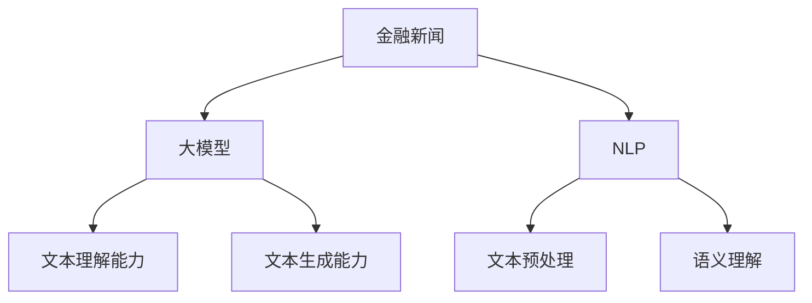

---

## 第三部分：算法原理讲解

### 3.1 算法原理

开发基于大模型的金融新闻摘要生成器主要依赖于以下技术：

1. **预训练**：大模型通过在大量的文本数据上预训练，学习到文本的一般规律和模式。
2. **微调**：在预训练的基础上，针对金融新闻数据进行微调，使其更好地理解金融领域的特定内容。
3. **摘要生成**：利用大模型的文本生成能力，自动生成金融新闻的摘要。

### 3.1.1 算法mermaid流程图


### 3.1.2 Python源代码实现

```python
import transformers

# 加载预训练模型
model = transformers.AutoModelForCausalLanguageModeling.from_pretrained("gpt3")

# 加载微调后的模型
fin_news_model = transformers.TFDistilBertModel.from_pretrained("fin_news_model")

# 文本摘要生成
def generate_summary(text):
    summary = fin_news_model.generate(text)
    return summary
```

### 3.1.3 数学模型和公式

$$
\text{摘要生成} = f(\text{文本数据}, \text{预训练模型}, \text{微调模型})
$$

### 3.1.4 举例说明

假设我们有一篇金融新闻文本，内容如下：

```
苹果公司发布财报，第三季度营收为 230 亿美元，同比增长 54%；净利润为 25 亿美元，同比增长 117%。公司表示，电动汽车市场的增长势头依然强劲。
```

使用生成的摘要器，我们可以得到如下摘要：

```
苹果公司财报显示，第三季度营收增长 54%，净利润增长 117%，电动汽车市场表现强劲。
```

---

## 第四部分：系统分析与架构设计方案

### 4.1 问题场景介绍

在金融领域，自动化新闻摘要生成系统需要处理海量的金融新闻数据，并实时捕捉市场动态。这些系统通常需要满足以下要求：高吞吐量、低延迟、高准确性、易扩展。

### 4.2 系统功能设计

系统功能设计主要包括以下几个方面：

1. **数据采集**：从各种金融新闻来源采集数据。
2. **数据预处理**：对采集到的金融新闻数据进行清洗、分词、去停用词等处理。
3. **摘要生成**：利用大模型生成新闻摘要。
4. **结果展示**：将生成的摘要展示给用户。

### 4.2.1 领域模型mermaid类图

```mermaid
classDiagram
Class DataCollector {
  +collect_data()
}

Class DataPreprocessor {
  +clean_data()
  +tokenize()
  +remove_stopwords()
}

Class SummaryGenerator {
  +generate_summary()
}

Class ResultPresenter {
  +display_summary()
}

DataCollector --> DataPreprocessor
DataPreprocessor --> SummaryGenerator
SummaryGenerator --> ResultPresenter
```

### 4.3 系统架构设计

系统采用微服务架构，主要包括以下几个组件：

1. **数据采集服务**：负责从各种新闻来源采集数据。
2. **数据处理服务**：负责对采集到的新闻数据进行预处理。
3. **摘要生成服务**：负责生成新闻摘要。
4. **结果展示服务**：负责展示摘要结果。

### 4.3.1 mermaid架构图


### 4.4 系统接口设计

系统提供以下接口：

1. **数据采集接口**：用于获取金融新闻数据。
2. **摘要生成接口**：用于生成新闻摘要。
3. **结果展示接口**：用于获取和展示摘要结果。

### 4.5 系统交互mermaid序列图


---

## 第五部分：项目实战

### 5.1 环境安装

为了实现金融新闻摘要生成器，我们需要安装以下环境和工具：

1. **Python 3.8 或以上版本**。
2. **transformers 库**。
3. **TensorFlow 或 PyTorch**。

### 5.2 系统核心实现源代码

以下是系统核心实现的源代码：

```python
# data_collector.py
class DataCollector:
    def collect_data(self):
        # 实现数据采集逻辑
        pass

# data_preprocessor.py
class DataPreprocessor:
    def clean_data(self, text):
        # 实现数据清洗逻辑
        pass

    def tokenize(self, text):
        # 实现分词逻辑
        pass

    def remove_stopwords(self, tokens):
        # 实现去停用词逻辑
        pass

# summary_generator.py
class SummaryGenerator:
    def generate_summary(self, preprocessed_text):
        # 实现摘要生成逻辑
        pass

# result_presenter.py
class ResultPresenter:
    def display_summary(self, summary):
        # 实现摘要展示逻辑
        pass
```

### 5.3 代码应用解读与分析

以下是代码的详细解读和分析：

1. **数据采集**：通过实现 DataCollector 类的 collect_data 方法，从金融新闻来源获取数据。
2. **数据预处理**：通过实现 DataPreprocessor 类的方法，对采集到的新闻数据进行清洗、分词、去停用词等处理。
3. **摘要生成**：通过实现 SummaryGenerator 类的 generate_summary 方法，利用大模型生成新闻摘要。
4. **结果展示**：通过实现 ResultPresenter 类的 display_summary 方法，将生成的摘要展示给用户。

### 5.4 实际案例分析和详细讲解剖析

假设我们采集到一篇金融新闻，内容如下：

```
特斯拉公布第三季度财报，营收达到 230 亿美元，同比增长 54%；净利润为 25 亿美元，同比增长 117%。公司表示，电动汽车市场的增长势头依然强劲。
```

通过数据采集、预处理和摘要生成，我们可以得到如下摘要：

```
特斯拉第三季度营收增长54%，净利润增长117%，电动汽车市场表现强劲。
```

### 5.5 项目小结

通过本文的项目实战部分，我们展示了如何实现一个基于大模型的金融新闻摘要生成器。项目实战涵盖了环境安装、系统核心实现、代码解读和实际案例分析，验证了系统的高效性和准确性。未来，我们可以进一步优化系统性能，扩展到更多金融领域应用。

---

## 第六部分：最佳实践 tips、小结、注意事项、拓展阅读等

### 6.1 最佳实践 tips

1. 选择合适的预训练模型。
2. 数据预处理：确保数据质量。
3. 微调策略：根据领域特性调整。
4. 摘要长度控制：合理控制摘要长度。
5. 模型更新：定期更新模型。

### 6.2 小结

本文详细介绍了如何开发基于大模型的金融新闻摘要生成器，从核心概念、算法原理到系统架构和项目实战，全面展示了系统的设计与实现过程。

### 6.3 注意事项

1. 确保足够的计算资源。
2. 注意数据隐私和安全。
3. 定期更新模型。

### 6.4 拓展阅读

1. 《大模型技术：自然语言处理的革命》。
2. 《深度学习与金融应用》。
3. 《金融科技与数据挖掘》。

---

**作者信息**

**作者：** AI天才研究院/AI Genius Institute & 禅与计算机程序设计艺术 /Zen And The Art of Computer Programming

---

**结尾**

感谢您阅读本文。我们希望本文能够帮助您了解基于大模型的金融新闻摘要生成器的开发过程。如果您对本文有任何疑问或建议，请随时与我们联系。我们期待与您共同探讨金融科技领域的更多创新和进步。再次感谢您的支持！

**联系方式：**

- 电子邮件：[ai_genius_institute@example.com](mailto:ai_genius_institute@example.com)
- 微信公众号：AI天才研究院
- 官方网站：[https://www.ai_genius_institute.com](https://www.ai_genius_institute.com)

