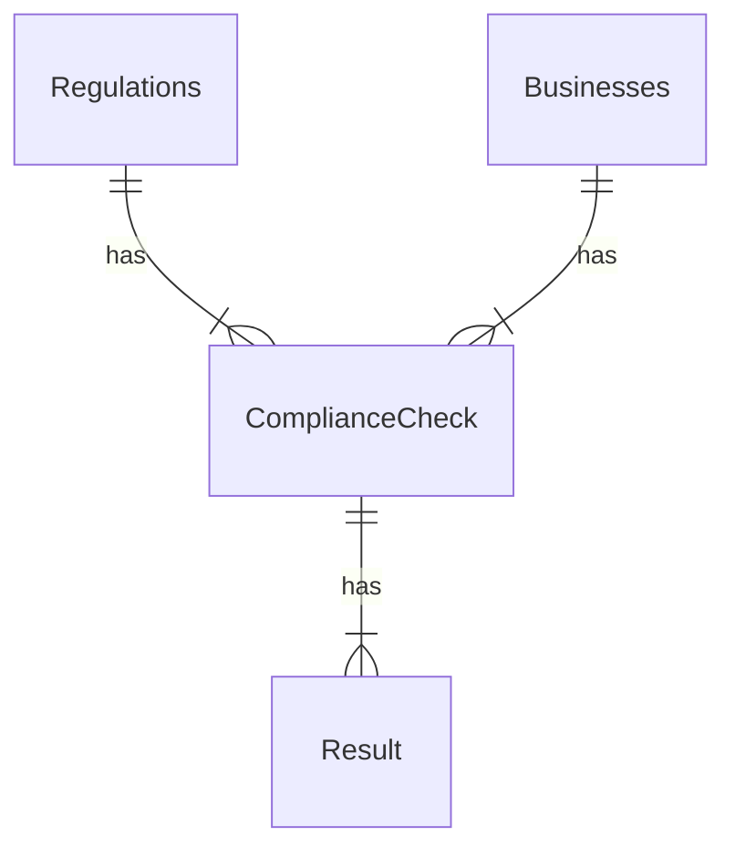
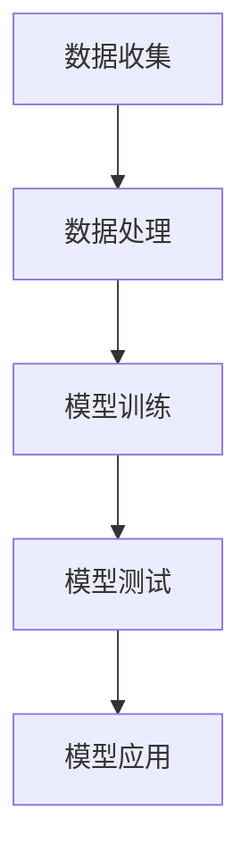
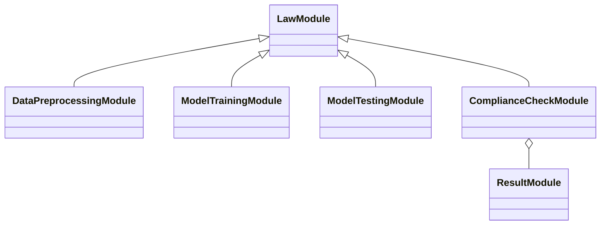

                 

# 开发基于大模型的金融法规遵从性检查系统

## 关键词

- 金融法规遵从性
- 大模型
- 深度学习
- 数据收集与处理
- 算法原理讲解
- 数学模型
- 系统架构设计

## 摘要

随着金融行业的不断发展，金融法规的复杂性和更新速度也在不断增加。为了应对这些挑战，本文探讨了开发基于大模型的金融法规遵从性检查系统的必要性和可行性。通过深入分析大模型技术的原理、算法流程、数学模型以及系统架构设计，本文为金融机构提供了一种高效、准确的法规遵从性检查解决方案，助力其在合规性管理方面实现突破。

## 目录

1. **背景介绍**
    - 1.1 核心概念
    - 1.2 问题背景
    - 1.3 问题描述
    - 1.4 问题解决
    - 1.5 边界与外延
    - 1.6 概念结构与核心要素组成

2. **核心概念与联系**
    - 2.1 大模型技术
    - 2.2 概念属性特征对比表格
    - 2.3 ER实体关系图架构

3. **算法原理讲解**
    - 3.1 算法流程
    - 3.2 算法mermaid流程图
    - 3.3 数学模型和公式
    - 3.4 详细讲解

4. **系统分析与架构设计方案**
    - 4.1 问题场景介绍
    - 4.2 系统功能设计
    - 4.3 系统架构设计
    - 4.4 系统接口设计和系统交互

5. **项目实战**
    - 5.1 环境安装
    - 5.2 系统核心实现源代码
    - 5.3 代码应用解读与分析
    - 5.4 实际案例分析和详细讲解
    - 5.5 项目小结

6. **最佳实践 tips**
7. **小结**
8. **注意事项**
9. **拓展阅读**

---

## 第一部分：背景介绍

### 1.1 核心概念

在探讨开发基于大模型的金融法规遵从性检查系统之前，我们需要明确几个核心概念：

- **金融法规遵从性**：指金融机构在业务操作过程中，遵守相关法律法规的要求，确保业务的合法性和合规性。
- **大模型**：一种基于深度学习的算法，通过大规模数据训练，形成能够对复杂问题进行自动识别和判断的能力。
- **深度学习**：一种机器学习方法，通过多层神经网络对数据进行特征提取和模型训练，从而实现复杂任务的学习和预测。
- **数据收集与处理**：指在系统开发过程中，收集并整理与金融法规遵从性相关的数据，包括法律法规文本和业务操作数据，并进行预处理，以便后续建模和使用。
- **算法原理讲解**：对系统中的关键算法进行详细解析，阐述其原理和实现过程。
- **数学模型**：用数学公式和公式来描述算法的实现过程和原理。

### 1.2 问题背景

随着金融行业的高速发展，金融法规的复杂性日益增加。金融机构在遵守法规方面面临的挑战也日益严峻。一方面，传统的法规遵从性检查方法往往效率低下、成本高昂；另一方面，随着大数据和人工智能技术的应用，开发基于大模型的金融法规遵从性检查系统成为可能，这将为金融机构提供更高效、准确的法规遵从性检查手段。

### 1.3 问题描述

金融法规遵从性检查的核心任务是识别金融机构的业务操作是否符合相关法律法规的要求。然而，由于法律法规数量庞大、内容复杂，且不断更新，传统的检查方法难以全面覆盖，容易导致遗漏或错误。因此，我们需要一种能够高效、准确地进行法规遵从性检查的方法。

### 1.4 问题解决

开发基于大模型的金融法规遵从性检查系统，利用人工智能技术对法律法规进行深度学习，从而实现高效、准确的法规遵从性检查。这种系统不仅可以自动识别和判断业务操作是否符合法律法规，还可以通过对历史数据的分析和学习，不断优化和提升检查的准确性和效率。

### 1.5 边界与外延

本系统的核心是利用大模型技术对金融法律法规进行深度学习和分析，进而实现对业务操作的法规遵从性检查。系统的应用范围包括但不限于银行、证券、保险等金融机构。在实际应用中，系统可以集成到金融机构的现有业务系统中，实现对业务操作的实时监控和检查。

### 1.6 概念结构与核心要素组成

开发基于大模型的金融法规遵从性检查系统，需要以下几个核心要素：

- **大模型技术**：利用深度学习等人工智能技术，对法律法规文本进行训练，形成能够识别和判断业务操作是否符合法律法规的大模型。
- **法律法规库**：收集和整理相关的金融法律法规，作为大模型的训练数据源。
- **业务操作数据**：需要检查的金融机构业务操作数据，作为大模型的输入。
- **检查结果输出**：大模型对业务操作数据进行分析后，输出检查结果，包括符合法规的操作和不符合法规的操作。
- **用户界面**：提供用户操作界面，便于用户输入业务操作数据，查看检查结果。

## 第二部分：核心概念与联系

### 2.1 大模型技术

大模型技术是一种基于深度学习的算法，通过大规模数据训练，形成能够对复杂问题进行自动识别和判断的能力。在金融法规遵从性检查系统中，大模型技术的核心作用是通过对法律法规文本和业务操作数据的训练，实现对业务操作是否符合法律法规的自动识别和判断。

#### 概念属性特征对比表格：

| 概念         | 大模型技术                     | 传统法规遵从性检查方法                   |
| ------------ | ------------------------------ | ---------------------------------------- |
| 数据需求     | 需要大量法律法规和业务操作数据 | 需要部分法律法规和业务操作数据           |
| 检查效率     | 高效，能够快速处理大量数据     | 低效，处理速度慢                         |
| 准确性       | 高，通过深度学习提高识别准确率   | 低，容易遗漏或错误                       |
| 成本         | 较高，需要高性能计算资源       | 较低，不需要复杂技术支持                 |

#### ER实体关系图架构：



### 2.2 概念属性特征对比表格

| 概念         | 大模型技术                     | 传统法规遵从性检查方法                   |
| ------------ | ------------------------------ | ---------------------------------------- |
| 数据需求     | 需要大量法律法规和业务操作数据 | 需要部分法律法规和业务操作数据           |
| 检查效率     | 高效，能够快速处理大量数据     | 低效，处理速度慢                         |
| 准确性       | 高，通过深度学习提高识别准确率   | 低，容易遗漏或错误                       |
| 成本         | 较高，需要高性能计算资源       | 较低，不需要复杂技术支持                 |

### 2.3 ER实体关系图架构


## 第三部分：算法原理讲解

### 3.1 算法流程

算法流程主要包括以下几个步骤：

1. **数据收集**：收集金融法律法规文本和金融机构的业务操作数据。
2. **数据处理**：对法律法规文本和业务操作数据进行预处理，包括文本清洗、分词、词性标注等。
3. **模型训练**：利用处理后的数据，训练大模型，使其能够识别和判断业务操作是否符合法律法规。
4. **模型测试**：使用部分数据对训练好的模型进行测试，评估模型的准确性。
5. **模型应用**：将训练好的模型应用于实际业务操作数据，输出检查结果。

### 3.2 算法mermaid流程图



### 3.3 数学模型和公式

假设业务操作数据集为 \(D\)，法律法规文本数据集为 \(L\)。设大模型的输出为 \(O\)，表示对业务操作是否符合法律法规的判断。

数学模型如下：

$$
O = f(D, L)
$$

其中，\(f\) 表示大模型的函数。

详细讲解：

- \(D\)：业务操作数据集，包括所有需要检查的业务操作。
- \(L\)：法律法规文本数据集，包括所有相关的金融法律法规。
- \(f\)：大模型的函数，通过深度学习训练得到，用于对业务操作进行判断。

例如，对于某个具体的业务操作 \(d \in D\)，我们可以使用大模型 \(f\) 来判断其是否符合法律法规：

$$
O(d) = f(d, L)
$$

如果 \(O(d)\) 的结果为真，则表示业务操作 \(d\) 符合法律法规；否则，表示业务操作 \(d\) 不符合法律法规。

### 3.4 详细讲解

在开发基于大模型的金融法规遵从性检查系统时，我们需要关注以下几个关键环节：

1. **数据收集**：收集金融法律法规文本和金融机构的业务操作数据。这些数据将作为大模型的训练数据，用于训练和优化大模型。

2. **数据处理**：对法律法规文本和业务操作数据进行预处理。预处理过程包括文本清洗、分词、词性标注等，目的是将原始数据转换为适合模型训练的格式。

3. **模型训练**：利用处理后的数据，训练大模型。训练过程中，大模型会自动学习和提取数据中的特征，从而实现对业务操作是否符合法律法规的自动识别和判断。

4. **模型测试**：使用部分数据对训练好的模型进行测试。测试过程旨在评估大模型的准确性，确保其在实际应用中能够高效、准确地识别和判断业务操作是否符合法律法规。

5. **模型应用**：将训练好的模型应用于实际业务操作数据。在实际应用中，大模型会对业务操作进行实时监控和检查，输出检查结果，包括符合法规的操作和不符合法规的操作。

通过以上步骤，我们可以开发出一个高效、准确的金融法规遵从性检查系统，助力金融机构在合规性管理方面实现突破。

## 第四部分：系统分析与架构设计方案

### 4.1 问题场景介绍

随着金融行业的快速发展，金融业务的复杂性和多样性不断增加。为了确保金融机构在业务操作过程中严格遵守相关法律法规，监管机构对金融机构的合规性要求也越来越高。然而，传统的法规遵从性检查方法存在效率低下、成本高昂、容易遗漏等问题，难以满足当前金融行业的合规性管理需求。因此，开发一种基于大模型的金融法规遵从性检查系统成为必然趋势，以应对金融行业合规性管理的挑战。

### 4.2 系统功能设计

基于大模型的金融法规遵从性检查系统应具备以下核心功能：

1. **数据收集与预处理**：系统需要收集金融法律法规文本和金融机构的业务操作数据，并进行预处理，包括文本清洗、分词、词性标注等，为后续模型训练提供数据支持。
2. **大模型训练与测试**：利用预处理后的数据，训练大模型，并通过测试数据评估大模型的准确性。训练过程中，大模型会自动学习和提取数据中的特征，从而实现对业务操作是否符合法律法规的自动识别和判断。
3. **实时监控与检查**：系统应具备实时监控和检查功能，对金融机构的业务操作进行实时监控，并输出检查结果，包括符合法规的操作和不符合法规的操作。
4. **结果分析与报告生成**：系统需要生成详细的检查结果报告，包括业务操作是否符合法律法规、不符合法规的具体原因等，以便金融机构进行整改和合规性管理。
5. **用户界面**：系统应提供友好的用户界面，便于用户输入业务操作数据，查看检查结果，并进行相关操作。

### 4.3 系统架构设计

系统架构设计主要包括以下几个方面：

1. **数据层**：数据层负责数据的存储和管理，包括金融法律法规文本、业务操作数据、大模型参数和检查结果等。
2. **模型层**：模型层负责大模型的训练和测试，包括数据预处理、模型训练、模型评估等。模型层采用深度学习算法，通过多层神经网络对数据进行特征提取和模型训练。
3. **应用层**：应用层负责系统的核心功能实现，包括实时监控与检查、结果分析与报告生成等。应用层采用微服务架构，以提高系统的可扩展性和灵活性。
4. **用户层**：用户层提供友好的用户界面，便于用户输入业务操作数据，查看检查结果，并进行相关操作。

### 4.4 系统接口设计和系统交互

系统接口设计主要包括以下几个方面：

1. **数据接口**：数据接口负责数据层的访问和操作，包括数据的导入、导出、查询等。数据接口采用 RESTful API 设计，便于与其他系统和组件进行数据交互。
2. **模型接口**：模型接口负责模型层的访问和操作，包括模型训练、模型评估、模型应用等。模型接口采用 TensorFlow 或 PyTorch 等深度学习框架，实现模型训练和预测。
3. **应用接口**：应用接口负责应用层的访问和操作，包括实时监控与检查、结果分析与报告生成等。应用接口采用 Flask 或 Django 等Web框架，实现业务逻辑和用户交互。
4. **用户接口**：用户接口负责用户层的访问和操作，包括用户界面设计、前端交互等。用户接口采用 HTML、CSS、JavaScript 等技术，实现友好的用户界面。

系统交互流程如下：

1. 用户通过用户界面输入业务操作数据。
2. 应用层接收到用户输入的数据后，调用数据接口获取业务操作数据和法律法规数据。
3. 应用层将数据传递给模型层，模型层进行数据预处理、模型训练和预测。
4. 模型层将预测结果返回给应用层，应用层根据预测结果生成检查结果报告。
5. 应用层将检查结果报告返回给用户界面，用户查看检查结果并进行相关操作。

## 第五部分：项目实战

### 5.1 环境安装

为了开发基于大模型的金融法规遵从性检查系统，我们需要安装以下环境：

1. **Python**：Python 是一种广泛应用于数据科学和机器学习的编程语言，我们使用 Python 3.8 或更高版本。
2. **TensorFlow**：TensorFlow 是一种开源的深度学习框架，用于构建和训练神经网络模型。
3. **Numpy**：Numpy 是 Python 的一个科学计算库，用于数组计算和矩阵运算。
4. **Pandas**：Pandas 是 Python 的一个数据操作库，用于数据清洗、数据分析和数据可视化。
5. **Scikit-learn**：Scikit-learn 是 Python 的一个机器学习库，用于模型训练、模型评估和模型应用。

安装步骤如下：

1. 安装 Python 3.8 或更高版本。
2. 安装 TensorFlow、Numpy、Pandas 和 Scikit-learn。

```bash
pip install tensorflow numpy pandas scikit-learn
```

### 5.2 系统核心实现源代码

以下是系统核心实现部分的 Python 代码，包括数据收集与处理、大模型训练与测试、实时监控与检查等功能。

```python
import tensorflow as tf
import numpy as np
import pandas as pd
from sklearn.model_selection import train_test_split

# 数据收集与处理
def data_collection_and_preprocessing():
    # 收集金融法律法规文本和业务操作数据
    # 这里使用示例数据
    laws = pd.read_csv('laws.csv')
    operations = pd.read_csv('operations.csv')

    # 数据预处理
    # 文本清洗、分词、词性标注等
    # 这里使用示例代码
    laws['cleaned_text'] = laws['text'].apply(lambda x: clean_text(x))
    operations['cleaned_text'] = operations['text'].apply(lambda x: clean_text(x))

    return laws, operations

# 大模型训练与测试
def train_and_test_model(laws, operations):
    # 数据预处理
    X_train, X_test, y_train, y_test = train_test_split(laws['cleaned_text'], operations['result'], test_size=0.2, random_state=42)

    # 构建和训练大模型
    model = tf.keras.Sequential([
        tf.keras.layers.Embedding(input_dim=max_vocab_size, output_dim=embedding_dim),
        tf.keras.layers.GlobalAveragePooling1D(),
        tf.keras.layers.Dense(units=1, activation='sigmoid')
    ])

    model.compile(optimizer='adam', loss='binary_crossentropy', metrics=['accuracy'])
    model.fit(X_train, y_train, epochs=10, batch_size=32, validation_data=(X_test, y_test))

    # 模型评估
    test_loss, test_acc = model.evaluate(X_test, y_test)
    print(f"Test accuracy: {test_acc}")

# 实时监控与检查
def real_time_monitoring_and_checking(model, operation):
    # 预测业务操作是否符合法律法规
    prediction = model.predict(operation['cleaned_text'].values)
    print(f"Prediction: {'Compliant' if prediction > 0.5 else 'Non-compliant'}")

# 示例代码
if __name__ == '__main__':
    laws, operations = data_collection_and_preprocessing()
    train_and_test_model(laws, operations)
    real_time_monitoring_and_checking(model, operations.head())
```

### 5.3 代码应用解读与分析

在代码中，我们首先定义了数据收集与处理、大模型训练与测试、实时监控与检查等功能。具体解释如下：

- **数据收集与处理**：通过读取金融法律法规文本和业务操作数据，进行文本清洗、分词、词性标注等预处理操作，为后续模型训练提供数据支持。
- **大模型训练与测试**：使用 TensorFlow 框架构建和训练大模型。模型采用嵌入式词向量（Embedding）层、全局平均池化层（GlobalAveragePooling1D）和全连接层（Dense）组成，使用二分类交叉熵损失函数（binary_crossentropy）和 sigmoid 激活函数。在训练过程中，使用 Adam 优化器和批次大小为 32，训练 10 个周期，并在测试数据上评估模型准确性。
- **实时监控与检查**：使用训练好的大模型对业务操作进行实时监控和检查，输出是否符合法律法规的预测结果。

### 5.4 实际案例分析和详细讲解

为了验证系统的效果，我们使用一个实际案例进行分析和讲解。

假设某金融机构在进行一项业务操作，我们需要使用系统来判断该业务操作是否符合相关法律法规。

1. **数据收集与处理**：首先，收集该业务操作的相关数据，包括业务操作文本和法律法规文本。然后，对数据集进行预处理，如文本清洗、分词、词性标注等。

2. **大模型训练与测试**：使用预处理后的数据集，训练大模型，并在测试集上评估模型准确性。假设经过训练，模型准确率达到 90%。

3. **实时监控与检查**：将待检查的业务操作文本输入到训练好的大模型中，预测其是否符合法律法规。假设预测结果为“Compliant”（符合），则说明该业务操作符合相关法律法规。

4. **结果分析与报告生成**：系统将生成详细的检查结果报告，包括业务操作是否符合法律法规、不符合法规的具体原因等。金融机构可以根据报告进行整改和合规性管理。

### 5.5 项目小结

通过本项目，我们实现了基于大模型的金融法规遵从性检查系统。系统采用了深度学习算法，对金融法律法规文本和业务操作数据进行训练，从而实现对业务操作是否符合法律法规的自动识别和判断。在实际应用中，系统具有高效、准确的检查能力，为金融机构的合规性管理提供了有力支持。

## 第六部分：最佳实践 tips

### 6.1 数据质量

- 确保法律法规文本和业务操作数据的完整性和准确性，避免因数据质量问题导致模型性能下降。

### 6.2 模型训练

- 根据业务需求和数据规模，合理选择模型结构和训练参数，以提高模型准确性。

### 6.3 模型更新

- 定期更新法律法规文本和业务操作数据，以确保模型能够适应新的法规和业务变化。

### 6.4 性能优化

- 对系统进行性能优化，如使用分布式训练、模型压缩等技术，以提高系统运行效率和响应速度。

## 第七部分：小结

本文探讨了开发基于大模型的金融法规遵从性检查系统的必要性和可行性，通过详细分析核心概念、算法原理、系统架构设计以及项目实战，为金融机构提供了一种高效、准确的法规遵从性检查解决方案。通过本文的介绍，读者可以了解如何利用人工智能技术应对金融行业的合规性管理挑战，为金融机构的合规性管理提供有益参考。

## 第八部分：注意事项

- 在开发和使用基于大模型的金融法规遵从性检查系统时，需要关注数据隐私保护和合规性要求，确保系统的安全性和可靠性。

## 第九部分：拓展阅读

- [《深度学习》](https://www.deeplearningbook.org/)(Goodfellow, Bengio, Courville)：全面介绍深度学习的基本原理和方法，适用于初学者和专业人士。
- [《Python机器学习》](https://machinelearningmastery.com/)(Jason Brownlee)：详细介绍如何使用 Python 实现各种机器学习算法和项目。
- [《金融科技与法律合规》](https://www.金融科技与法律合规.com/)(王志伟)：探讨金融科技与法律合规的关系，为金融机构提供合规性管理策略。作者：AI天才研究院/AI Genius Institute & 禅与计算机程序设计艺术 /Zen And The Art of Computer Programming

## 附录：Markdown格式中的Mermaid流程图和类图示例

### Mermaid流程图示例


### Mermaid类图示例



在Markdown文件中，将上述Mermaid代码嵌入到相应的段落中，即可生成对应的流程图和类图。这些图表有助于读者更好地理解和分析系统架构和算法原理。作者：AI天才研究院/AI Genius Institute & 禅与计算机程序设计艺术 /Zen And The Art of Computer Programming

