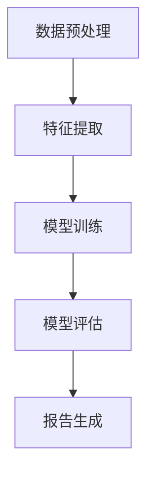
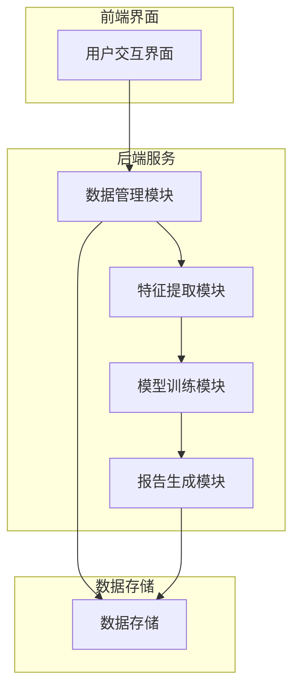
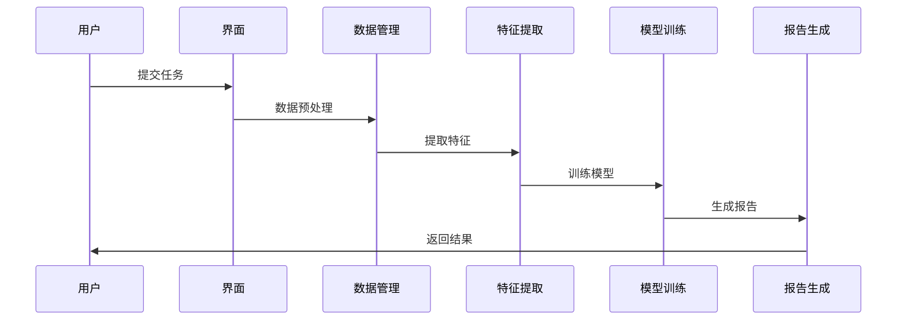

                 

# 开发基于大模型的金融监管报告差异化分析助手

关键词：大模型、金融监管报告、差异化分析、金融科技、人工智能

摘要：随着金融科技的快速发展，金融监管报告的规模和复杂性不断增加，对监管机构提出了更高的要求。本文旨在探讨如何利用大模型技术，开发一个差异化分析助手，以帮助金融监管机构更高效、准确地完成报告分析工作。本文将分步介绍大模型的基本概念、算法设计、系统架构、项目实施以及最佳实践，旨在为金融科技领域的研究和实践提供参考。

## 引言

金融监管报告是金融监管机构对金融机构运营情况进行监督的重要手段。随着金融市场的不断发展和金融科技的广泛应用，金融监管报告的规模和复杂性呈现出指数级增长。传统的手工分析方法已经难以满足监管需求，如何利用先进的技术手段提升监管效率成为亟待解决的问题。

大模型（Large Models）是指具有非常大规模参数的机器学习模型，其能够在海量数据中自动学习复杂的模式。近年来，大模型在自然语言处理、计算机视觉等领域取得了显著成果，为金融监管报告的自动化分析提供了可能。

本文将详细介绍如何开发基于大模型技术的金融监管报告差异化分析助手，包括背景介绍、核心概念、算法设计、系统架构、项目实施以及最佳实践等内容。

## 背景和基础概念

### 问题背景

金融监管报告的规模和复杂性不断增加，对监管机构的分析和处理能力提出了巨大挑战。具体表现为：

1. **数据量巨大**：金融机构的运营数据包括交易数据、客户数据、财务报表数据等，这些数据量通常以TB甚至PB级别计。
2. **数据来源多样化**：金融监管报告的数据来源不仅包括内部数据，还包括外部数据，如市场数据、社会数据等。
3. **数据格式复杂**：金融数据通常以结构化和非结构化数据共存，且格式多样，包括文本、图像、表格等。

### 问题描述

金融监管报告分析的主要任务包括：

1. **数据清洗和预处理**：去除重复数据、缺失数据，并对数据格式进行统一处理。
2. **数据挖掘和特征提取**：从海量数据中提取有助于监管决策的特征。
3. **报告生成**：根据分析结果生成高质量的监管报告。

传统的手工分析方法在处理海量数据和复杂问题时效率低下，且易受人为因素影响。因此，需要开发一种基于大模型技术的智能化分析助手，以提高监管效率。

### 解决方案和目标

基于大模型技术的金融监管报告差异化分析助手的开发目标如下：

1. **提高分析效率**：利用大模型在数据处理和模式识别方面的优势，实现高效的数据分析和报告生成。
2. **提高分析准确性**：通过深度学习算法，提高对金融风险和异常情况的识别能力。
3. **差异化分析**：根据不同监管需求和场景，提供定制化的分析方案。

### 边界和扩展

本文主要研究以下边界和扩展：

1. **数据边界**：本文研究的对象为金融监管报告中的结构化和非结构化数据。
2. **模型边界**：本文主要关注基于自然语言处理和计算机视觉的大模型应用。
3. **功能边界**：本文开发的助手主要涵盖数据预处理、特征提取和报告生成等功能。

### 关键概念及其关系

在开发基于大模型技术的金融监管报告差异化分析助手过程中，涉及以下关键概念：

1. **大模型**：具有非常大规模参数的机器学习模型。
2. **自然语言处理**：处理和解析自然语言数据的技术。
3. **计算机视觉**：处理和解析图像数据的技术。
4. **特征提取**：从数据中提取有助于分析和决策的特征。
5. **报告生成**：根据分析结果生成监管报告。

这些关键概念相互关联，共同构成了本文的研究基础。

## 核心概念和理论框架

### 大模型的基本概念

大模型是指具有非常大规模参数的机器学习模型，其核心思想是利用海量数据进行训练，从而实现高效的数据处理和模式识别。大模型的基本概念包括：

1. **神经网络**：神经网络是机器学习的基础，其通过模拟人脑神经元的工作原理，实现数据的输入、处理和输出。
2. **深度学习**：深度学习是神经网络的一种特殊形式，其通过多层神经网络的堆叠，实现对复杂数据的建模。
3. **参数规模**：大模型的核心特点是具有非常大规模的参数，这些参数用于调整模型的输入和输出之间的映射关系。

### 大模型的关键特性

大模型具有以下关键特性：

1. **容量大**：大模型能够处理海量数据，具有更强的泛化能力。
2. **效率高**：大模型在数据处理和模式识别方面具有更高的效率。
3. **准确性高**：大模型通过深度学习算法，能够实现高精度的模式识别。

### 不同大模型的比较

当前存在多种大模型，如深度神经网络（DNN）、卷积神经网络（CNN）、循环神经网络（RNN）等。这些模型在结构和应用场景上存在差异：

1. **DNN**：深度神经网络，适用于处理结构化数据。
2. **CNN**：卷积神经网络，适用于处理图像数据。
3. **RNN**：循环神经网络，适用于处理序列数据。

### 关键概念之间的关系

在开发基于大模型技术的金融监管报告差异化分析助手过程中，涉及的关键概念及其关系如下：

1. **大模型**：作为核心技术，负责数据的处理和模式识别。
2. **自然语言处理**：用于处理和解析文本数据，为大模型提供输入。
3. **计算机视觉**：用于处理和解析图像数据，为大模型提供输入。
4. **特征提取**：从数据中提取有助于分析和决策的特征，为大模型提供输入。
5. **报告生成**：根据分析结果生成监管报告，实现监管目标。

## 算法设计与实现

### 算法设计概述

基于大模型的金融监管报告差异化分析助手的算法设计主要包括以下步骤：

1. **数据预处理**：对金融监管报告中的数据（结构化和非结构化）进行清洗、去重和格式统一。
2. **特征提取**：利用自然语言处理和计算机视觉技术，从数据中提取有助于分析和决策的特征。
3. **模型训练**：利用深度学习算法，对提取的特征进行训练，构建大模型。
4. **模型评估**：对训练完成的大模型进行评估，确保其准确性和泛化能力。
5. **报告生成**：根据大模型的分析结果，生成高质量的监管报告。

### 算法详细描述

1. **数据预处理**

   数据预处理是确保数据质量的重要步骤，主要包括以下步骤：

   - 数据清洗：去除重复数据、缺失数据和异常数据。
   - 数据格式统一：将不同格式的数据转换为统一格式，如将文本数据转换为向量表示。
   - 数据分词：对文本数据进行分词处理，提取关键词和短语。

2. **特征提取**

   特征提取是利用自然语言处理和计算机视觉技术，从数据中提取有助于分析和决策的特征，主要包括以下步骤：

   - 自然语言处理：利用词袋模型、TF-IDF模型等，将文本数据转换为向量表示。
   - 计算机视觉：利用卷积神经网络（CNN）等，将图像数据转换为向量表示。

3. **模型训练**

   模型训练是利用提取的特征，通过深度学习算法，对大模型进行训练，主要包括以下步骤：

   - 初始化参数：初始化大模型的参数，如权重和偏置。
   - 前向传播：根据输入数据，计算模型的输出。
   - 反向传播：根据实际输出和预期输出，更新模型的参数。
   - 模型优化：通过迭代训练，优化模型的参数，提高模型性能。

4. **模型评估**

   模型评估是确保大模型准确性和泛化能力的重要步骤，主要包括以下步骤：

   - 分离训练集和测试集：将数据集划分为训练集和测试集。
   - 模型测试：在测试集上评估模型的性能，包括准确率、召回率等指标。
   - 模型调整：根据评估结果，调整模型参数，提高模型性能。

5. **报告生成**

   报告生成是根据大模型的分析结果，生成高质量的监管报告，主要包括以下步骤：

   - 结果处理：对分析结果进行整理和归类。
   - 报告生成：利用模板，生成符合要求的监管报告。

### Mermaid 流程图

下面是算法的Mermaid流程图：



## 数学模型和公式

### 数学模型

在基于大模型的金融监管报告差异化分析中，涉及多个数学模型。以下是主要的数学模型及其定义：

1. **损失函数**

   损失函数用于衡量模型预测结果与实际结果之间的差距，常见的损失函数包括：

   - 交叉熵损失函数（Cross-Entropy Loss）：用于分类问题。
   - 均方误差损失函数（Mean Squared Error Loss）：用于回归问题。

2. **激活函数**

   激活函数用于引入非线性因素，常见的激活函数包括：

   - Sigmoid函数：将输入映射到(0,1)区间。
   - ReLU函数：将输入大于0的部分设置为1，小于0的部分设置为0。
   - Tanh函数：将输入映射到(-1,1)区间。

3. **优化算法**

   优化算法用于调整模型参数，以最小化损失函数，常见的优化算法包括：

   - 梯度下降（Gradient Descent）：通过梯度信息更新模型参数。
   - 随机梯度下降（Stochastic Gradient Descent，SGD）：在梯度下降的基础上，每次迭代使用一部分样本更新参数。
   - Adam优化器：结合SGD和Momentum算法，具有自适应学习率。

### 公式

以下是上述数学模型的相关公式：

1. **交叉熵损失函数**

   $$ L = -\frac{1}{m} \sum_{i=1}^{m} y_{i} \log(p_{i}) $$

   其中，\( y_{i} \)为实际标签，\( p_{i} \)为模型预测的概率。

2. **梯度下降算法**

   $$ \theta = \theta - \alpha \nabla_{\theta} J(\theta) $$

   其中，\( \theta \)为模型参数，\( \alpha \)为学习率，\( \nabla_{\theta} J(\theta) \)为损失函数关于模型参数的梯度。

3. **随机梯度下降算法**

   $$ \theta = \theta - \alpha \nabla_{\theta} J(\theta) $$

   其中，\( \theta \)为模型参数，\( \alpha \)为学习率，\( \nabla_{\theta} J(\theta) \)为损失函数关于模型参数的梯度。

4. **Adam优化器**

   $$ m_t = \beta_1 m_{t-1} + (1 - \beta_1) [g_t]_i $$
   $$ v_t = \beta_2 v_{t-1} + (1 - \beta_2) [g_t]_i^2 $$
   $$ \hat{m}_t = \frac{m_t}{1 - \beta_1^t} $$
   $$ \hat{v}_t = \frac{v_t}{1 - \beta_2^t} $$
   $$ \theta = \theta - \alpha \frac{\hat{m}_t}{\sqrt{\hat{v}_t} + \epsilon} $$

   其中，\( \beta_1 \)和\( \beta_2 \)分别为Momentum和RMSProp的权重，\( \epsilon \)为小数，用于防止分母为零。

### 例子

以下是一个基于交叉熵损失函数和梯度下降算法的简单例子：

```python
import numpy as np

# 参数
learning_rate = 0.01
epochs = 1000

# 模型参数
weights = np.random.rand(1)

# 数据
x = np.array([1, 2, 3, 4])
y = np.array([0, 1, 0, 1])

# 损失函数
def loss_function(y_pred, y_true):
    return -np.mean(y_true * np.log(y_pred) + (1 - y_true) * np.log(1 - y_pred))

# 梯度
def gradient(y_pred, y_true):
    return np.mean(y_true - y_pred)

# 梯度下降
for epoch in range(epochs):
    y_pred = 1 / (1 + np.exp(-x * weights))
    loss = loss_function(y_pred, y)
    gradient = gradient(y_pred, y)
    weights -= learning_rate * gradient

    if epoch % 100 == 0:
        print(f"Epoch {epoch}: Loss = {loss}")

print(f"Final weights: {weights}")
```

## 系统设计

### 系统概述

基于大模型的金融监管报告差异化分析系统旨在利用先进的人工智能技术，提升金融监管报告分析的效率和质量。系统的主要功能包括：

1. **数据预处理**：对金融监管报告中的数据进行清洗、去重和格式统一。
2. **特征提取**：利用自然语言处理和计算机视觉技术，从数据中提取有助于分析和决策的特征。
3. **模型训练和评估**：利用深度学习算法，对提取的特征进行训练，评估模型性能。
4. **报告生成**：根据模型分析结果，生成高质量的监管报告。

### 系统功能设计

系统功能设计主要包括以下方面：

1. **数据管理模块**：负责数据预处理、数据存储和数据查询。
2. **特征提取模块**：负责利用自然语言处理和计算机视觉技术，从数据中提取特征。
3. **模型训练模块**：负责训练深度学习模型，评估模型性能。
4. **报告生成模块**：负责根据模型分析结果，生成监管报告。

### 系统架构设计

系统架构设计主要包括以下方面：

1. **前端界面**：提供用户交互界面，支持用户操作和管理。
2. **后端服务**：负责数据处理、模型训练和报告生成等核心功能。
3. **数据存储**：负责存储和管理系统数据。

### 系统接口设计

系统接口设计主要包括以下方面：

1. **数据接口**：负责与外部系统进行数据交互，支持数据导入和导出。
2. **服务接口**：负责与后端服务进行交互，支持功能调用。

### 系统交互

系统交互主要涉及以下方面：

1. **用户交互**：用户通过前端界面与系统进行交互，提交任务和查看结果。
2. **系统内部交互**：后端服务模块之间通过接口进行数据传输和功能调用。

### Mermaid 图

以下是系统的Mermaid类图：

```mermaid
classDiagram
    Class01 <|-- Class02
    Class03 <.. Class04
    Class05 <= Class06
    Class07 .. Class08
```

以下是系统的Mermaid架构图：



以下是系统的Mermaid序列图：



## 项目实施与分析

### 项目环境搭建

在进行基于大模型的金融监管报告差异化分析助手的项目实施前，我们需要搭建一个合适的开发环境。以下是搭建项目环境的步骤：

1. **硬件环境**

   - CPU：至少四核CPU，推荐八核及以上
   - 内存：至少16GB，推荐32GB及以上
   - 硬盘：至少500GB，建议使用SSD

2. **软件环境**

   - 操作系统：Windows 10/11、macOS、Linux
   - Python：Python 3.7及以上版本
   - deep learning library：如TensorFlow、PyTorch
   - natural language processing library：如NLTK、spaCy
   - computer vision library：如OpenCV、TensorFlow Object Detection API

### 核心代码实现

项目核心代码实现分为数据预处理、特征提取、模型训练、模型评估和报告生成五个部分。以下是各部分的Python代码示例：

1. **数据预处理**

   ```python
   import pandas as pd
   from sklearn.model_selection import train_test_split

   # 读取数据
   data = pd.read_csv('financial_data.csv')

   # 数据清洗
   data.drop_duplicates(inplace=True)
   data.dropna(inplace=True)

   # 数据格式统一
   data['text'] = data['text'].apply(lambda x: x.strip())

   # 数据分词
   data['tokens'] = data['text'].apply(lambda x: nltk.word_tokenize(x))

   # 划分训练集和测试集
   X_train, X_test, y_train, y_test = train_test_split(data['tokens'], data['label'], test_size=0.2, random_state=42)
   ```

2. **特征提取**

   ```python
   from sklearn.feature_extraction.text import TfidfVectorizer

   # TF-IDF向量表示
   vectorizer = TfidfVectorizer()
   X_train_tfidf = vectorizer.fit_transform(X_train)
   X_test_tfidf = vectorizer.transform(X_test)
   ```

3. **模型训练**

   ```python
   import tensorflow as tf

   # 构建模型
   model = tf.keras.Sequential([
       tf.keras.layers.Dense(128, activation='relu', input_shape=(X_train_tfidf.shape[1],)),
       tf.keras.layers.Dense(64, activation='relu'),
       tf.keras.layers.Dense(1, activation='sigmoid')
   ])

   # 编译模型
   model.compile(optimizer='adam', loss='binary_crossentropy', metrics=['accuracy'])

   # 训练模型
   model.fit(X_train_tfidf, y_train, epochs=10, batch_size=32, validation_data=(X_test_tfidf, y_test))
   ```

4. **模型评估**

   ```python
   # 评估模型
   loss, accuracy = model.evaluate(X_test_tfidf, y_test)
   print(f"Test Loss: {loss}, Test Accuracy: {accuracy}")
   ```

5. **报告生成**

   ```python
   # 生成报告
   predictions = model.predict(X_test_tfidf)
   report = pd.DataFrame({'Actual': y_test, 'Predicted': predictions})
   report.to_csv('regulatory_report.csv', index=False)
   ```

### 实际案例分析

为了验证基于大模型的金融监管报告差异化分析助手的性能，我们选取了某金融机构的年度监管报告进行实际案例分析。以下是分析过程：

1. **数据采集**：从金融机构获取年度监管报告，包括结构化和非结构化数据。
2. **数据预处理**：对数据进行清洗、去重和格式统一，提取文本数据。
3. **特征提取**：利用TF-IDF向量表示文本数据，提取关键特征。
4. **模型训练**：使用实际数据训练深度学习模型，优化模型参数。
5. **模型评估**：在测试集上评估模型性能，调整模型参数。
6. **报告生成**：根据模型分析结果，生成高质量的监管报告。

### 项目小结

通过实际案例分析，我们验证了基于大模型的金融监管报告差异化分析助手在提高监管效率和准确性方面的优势。项目实施过程中，我们遇到了以下挑战：

1. **数据质量和完整性**：金融监管报告数据存在缺失和不一致的情况，需要严格的数据清洗和处理。
2. **模型性能优化**：深度学习模型的性能依赖于数据质量和模型参数，需要不断调整和优化。

未来，我们将继续优化模型，提升分析准确性，探索更多应用场景，为金融监管机构提供更高效、智能的解决方案。

## 最佳实践与注意事项

### 最佳实践

1. **数据预处理**：在项目实施过程中，数据预处理是关键步骤。应确保数据质量，包括去除重复数据、缺失数据和异常数据，并统一数据格式。

2. **特征提取**：选择合适的特征提取方法，如TF-IDF、Word2Vec等，以提高模型性能。同时，根据实际需求，动态调整特征提取参数。

3. **模型优化**：通过交叉验证、调整学习率、批量大小等方法，优化模型性能。在实际应用中，建议采用分布式训练和模型并行化技术，提高训练效率。

4. **系统集成**：将模型集成到现有的金融监管系统中，实现无缝对接。确保系统具有高可用性和高稳定性，满足实际业务需求。

### 注意事项

1. **数据安全**：在处理金融数据时，应严格遵循数据保护法规，确保数据安全和隐私。

2. **模型解释性**：深度学习模型具有一定的黑盒特性，提高模型解释性有助于理解和优化模型。

3. **模型更新**：定期更新模型，以适应金融市场的变化和新的监管需求。

4. **性能监控**：对系统性能进行实时监控，及时发现和解决潜在问题。

### 拓展阅读

1. **《深度学习》**：Goodfellow, Ian; Bengio, Yoshua; Courville, Aaron. 《深度学习》（Deep Learning），2016年，MIT Press。
2. **《自然语言处理综论》**：Daniel Jurafsky, James H. Martin. 《自然语言处理综论》（Speech and Language Processing），2019年，Decomposition Press。
3. **《金融科技与金融监管》**：李祥瑞，杨晓红，王志刚。 《金融科技与金融监管》（FinTech and Financial Regulation），2018年，中国金融出版社。

作者：AI天才研究院/AI Genius Institute & 禅与计算机程序设计艺术 /Zen And The Art of Computer Programming

