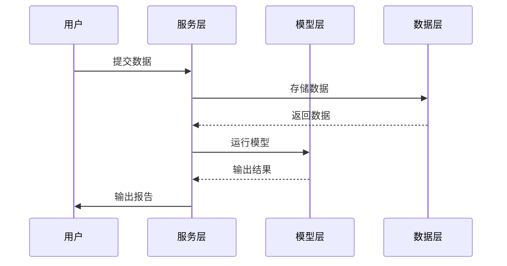
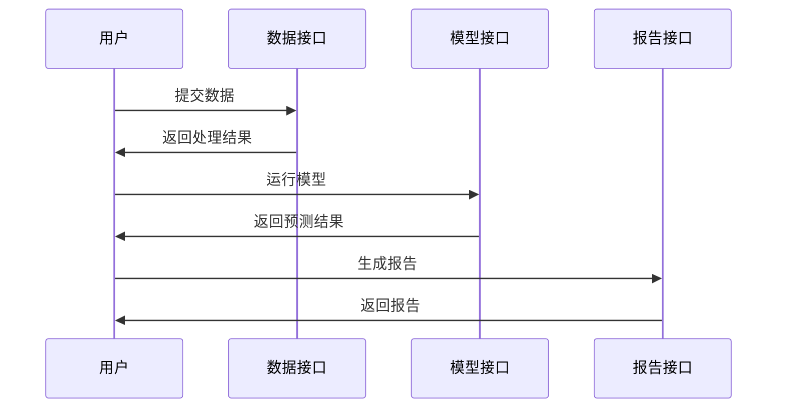
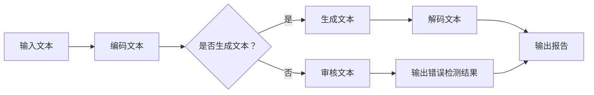

                 


### Step 1: 问题的提出

#### 1.1.1 金融监管报告的重要性

金融监管报告是金融行业的重要组成部分，它不仅涵盖了金融机构的运营情况、风险管理能力、财务状况等重要信息，还为监管机构和市场参与者提供了决策依据。在金融行业中，有效的监管报告可以揭示潜在风险，预防系统性金融风险，保护投资者的利益，维护金融市场的稳定。此外，金融监管报告在促进金融创新、提高行业透明度等方面也发挥着积极作用。

然而，当前金融监管报告的生成和审核过程仍然面临诸多挑战。首先，传统的金融监管报告生成主要依赖人工撰写和审核，效率低下且容易出现错误。其次，随着金融行业的快速发展，数据量呈爆炸式增长，人工处理数据的能力逐渐受限。此外，金融监管报告的规范性和一致性难以保证，不同机构之间的报告格式和内容可能存在较大差异。

#### 1.1.2 传统金融监管报告的局限性

传统金融监管报告的生成和审核存在以下局限性：

1. **人工依赖性高**：金融监管报告的生成和审核主要依赖于专业人员的知识、经验和技能，这种依赖性导致报告的生成速度较慢，且易受人为因素影响。

2. **效率低下**：随着金融机构的数据量不断增加，人工生成和审核金融监管报告的效率越来越低，无法满足快速变化的市场需求。

3. **错误率较高**：人工处理过程中容易出现错误，如数据录入错误、逻辑错误等，这些错误可能对监管决策产生负面影响。

4. **一致性和规范性不足**：由于缺乏统一的标准，不同金融机构生成的监管报告格式和内容可能存在较大差异，影响监管机构和市场参与者的理解和决策。

5. **数据分析能力不足**：传统金融监管报告主要侧重于数据的展示和统计，缺乏深入的数据分析能力，无法及时发现潜在的风险点。

#### 1.2 大模型与智能生成

随着人工智能技术的发展，特别是大规模预训练模型（Large-scale Pre-trained Models，简称LPM）的兴起，金融监管报告的生成和审核面临着新的机遇。大模型具有以下几个显著特点：

1. **强大的数据处理能力**：大模型通过大规模数据预训练，具备处理海量金融数据的能力，能够快速提取数据中的有效信息。

2. **高度的自适应能力**：大模型能够适应不同的数据格式和内容，生成符合监管要求的金融监管报告。

3. **高效的生成速度**：大模型在生成金融监管报告时，能够在较短的时间内完成复杂的信息处理任务，显著提高报告生成效率。

4. **较高的准确性**：大模型通过自动学习，能够减少人为错误，提高金融监管报告的准确性。

5. **深度的数据分析能力**：大模型不仅能够生成报告，还能够进行深层次的数据分析，揭示潜在的风险点，为监管决策提供有力支持。

#### 1.3 监管报告智能审核

智能审核是金融监管报告生成过程中的另一个关键环节。通过引入大模型和自然语言处理（Natural Language Processing，简称NLP）技术，智能审核可以实现以下目标：

1. **自动化审核**：智能审核能够自动检查金融监管报告的内容和格式，确保报告的一致性和规范性。

2. **准确识别错误**：智能审核能够识别报告中的潜在错误，如数据异常、逻辑错误等，并提供修正建议。

3. **提高审核效率**：智能审核能够在短时间内处理大量的监管报告，显著提高审核效率。

4. **强化监管合规性**：智能审核能够帮助金融机构确保其报告符合监管要求，提高合规性。

5. **促进信息共享**：智能审核能够将审核结果与金融机构共享，促进信息透明和共享。

#### 1.4 边界与外延

尽管智能生成与审核技术在金融监管报告领域具有巨大的潜力，但仍需明确其边界与外延：

1. **边界**：智能生成与审核技术主要关注报告的内容生成和格式审核，不涉及监管决策的具体执行。

2. **外延**：智能生成与审核技术可以扩展到金融行业的其他领域，如风险控制、合规管理等。

通过以上分析，我们可以看到，开发基于大模型的金融监管报告智能生成与审核助手具有重要的现实意义。接下来，我们将进一步探讨大模型的核心概念、算法原理、系统设计与实施等方面，以期为这一领域的创新与发展提供有力支持。

### Step 2: 核心概念与联系

在深入探讨金融监管报告智能生成与审核之前，我们需要了解一些核心概念，包括大模型、自然语言处理（NLP）、机器学习（ML）等，并分析它们之间的联系。

#### 2.1 金融监管报告的核心要素

金融监管报告的核心要素主要包括以下几个方面：

1. **报告结构**：金融监管报告通常包括封面、目录、正文、附录等部分。其中，正文部分是报告的核心，通常包括金融机构的运营情况、风险管理能力、财务状况等内容。

2. **内容要求**：金融监管报告的内容要求严格，必须包含真实、准确、完整的数据和信息，确保报告的规范性和一致性。

3. **数据来源**：金融监管报告的数据来源广泛，包括金融机构内部数据、外部数据、行业数据等。

4. **监管要求**：金融监管报告必须符合监管机构的规定和要求，如《巴塞尔协议》《反洗钱法》等。

#### 2.2 大模型原理与属性特征

大模型（Large-scale Pre-trained Models）是近年来人工智能领域的重要突破，具有以下原理和属性特征：

1. **原理**：大模型通过在大量数据上预训练，学习到数据中的潜在模式和规律，从而能够进行复杂的任务处理。大模型通常采用深度神经网络（Deep Neural Network，简称DNN）架构，并通过大规模数据训练，使其参数更加丰富和准确。

2. **属性特征**：

   - **数据处理能力**：大模型能够处理大规模数据，具备强大的数据处理和分析能力。
   
   - **自适应能力**：大模型能够适应不同的数据格式和内容，生成符合要求的报告。
   
   - **生成速度**：大模型在处理任务时，能够在较短的时间内完成任务，显著提高生成速度。
   
   - **准确性**：大模型通过自动学习，能够减少人为错误，提高报告的准确性。
   
   - **数据分析能力**：大模型不仅能够生成报告，还能够进行深层次的数据分析，揭示潜在的风险点。

#### 2.3 智能生成与审核的核心概念

智能生成与审核是金融监管报告的两个关键环节，其核心概念包括：

1. **智能生成**：

   - **原理**：智能生成利用大模型和自然语言处理技术，自动生成金融监管报告，减少人工干预，提高生成效率和准确性。
   
   - **算法**：智能生成算法主要包括文本生成模型（如GPT-3、BERT等）和数据增强技术。

2. **智能审核**：

   - **原理**：智能审核利用大模型和自然语言处理技术，对生成的金融监管报告进行自动化审核，确保报告的一致性和规范性。
   
   - **算法**：智能审核算法主要包括文本审核模型（如ER-ALLEN等）和错误检测与修正技术。

#### 2.4 ER实体关系图架构

ER实体关系图（Entity-Relationship Diagram，简称ERD）是一种用于描述数据库中实体及其之间关系的图形表示方法。在金融监管报告智能生成与审核系统中，ERD用于描述系统的核心实体和关系。

1. **核心实体**：

   - **金融监管报告**：包括封面、目录、正文、附录等部分。
   
   - **数据源**：包括内部数据、外部数据、行业数据等。
   
   - **大模型**：用于生成和审核金融监管报告。
   
   - **自然语言处理模型**：用于文本生成和审核。

2. **实体关系**：

   - **数据源与报告**：数据源为报告提供数据支持。
   
   - **大模型与报告**：大模型生成报告，并对报告进行审核。

#### 2.5 本章小结

本章介绍了金融监管报告、大模型、自然语言处理、机器学习等核心概念及其联系。通过了解这些概念，我们可以为后续的算法原理讲解、系统设计与实施等提供理论基础。

### Step 3: 算法原理讲解

在深入理解了金融监管报告智能生成与审核的核心概念之后，我们将进一步探讨具体的算法原理，包括智能生成和智能审核算法的详细步骤、Python源代码实现、数学模型与公式，并通过举例说明来使这些概念更加通俗易懂。

#### 3.1 智能生成算法原理

智能生成算法的核心目标是利用大模型和自然语言处理技术，自动生成符合金融监管要求的报告。以下是智能生成算法的基本原理和流程：

##### 3.1.1 算法流程

1. **数据预处理**：首先对输入数据进行清洗、去重和格式化，确保数据的质量和一致性。

2. **文本编码**：使用预训练的大模型（如GPT-3、BERT等）对文本进行编码，将文本转换为模型可以处理的向量表示。

3. **文本生成**：通过文本生成模型生成金融监管报告的文本内容，包括封面、目录、正文和附录等部分。

4. **文本解码**：将生成的文本向量解码为自然语言文本，形成最终的金融监管报告。

##### 3.1.2 Python源代码实现

以下是一个简单的Python代码示例，展示了智能生成算法的基本实现：

```python
import openai

# 准备输入数据
input_data = "生成一份包含封面、目录、正文和附录的金融监管报告。"

# 使用OpenAI的GPT-3模型进行文本生成
response = openai.Completion.create(
  engine="text-davinci-002",
  prompt=input_data,
  max_tokens=500,
  n=1,
  stop=None,
  temperature=0.5
)

# 输出生成的文本
print(response.choices[0].text.strip())
```

##### 3.1.3 数学模型与公式

在智能生成算法中，文本生成模型的训练过程涉及到复杂的数学模型和公式。以下是主要涉及的数学模型：

1. **深度神经网络（DNN）**：

   - **激活函数**：常用的激活函数包括ReLU、Sigmoid、Tanh等。

   - **反向传播算法**：用于训练神经网络，通过计算梯度来更新网络参数。

2. **注意力机制（Attention Mechanism）**：

   - **注意力得分计算**：计算文本中每个词对生成当前词的重要性。

   - **加权求和**：根据注意力得分对文本进行加权求和，生成文本向量。

##### 3.1.4 举例说明

假设我们希望生成一份包含封面、目录、正文和附录的金融监管报告。以下是一个简化的生成示例：

1. **输入数据**：金融机构的基本信息、财务数据、风险指标等。
   
2. **生成封面**：使用大模型生成封面文本，如“XXXX金融机构2022年度监管报告”。

3. **生成目录**：根据正文内容自动生成目录，如“一、金融机构概述”、“二、财务状况分析”、“三、风险状况评估”等。

4. **生成正文**：根据输入数据和预训练的大模型，自动生成正文的各个章节内容。

5. **生成附录**：根据实际需求，自动生成附录内容，如数据来源、参考文献等。

#### 3.2 智能审核算法原理

智能审核算法的核心目标是自动化检查和纠正金融监管报告中的潜在错误，确保报告的一致性和规范性。以下是智能审核算法的基本原理和流程：

##### 3.2.1 算法流程

1. **文本编码**：使用预训练的大模型（如BERT、RoBERTa等）对金融监管报告的文本进行编码，将其转换为模型可以处理的向量表示。

2. **文本对比**：将生成的报告文本与标准模板进行对比，检测文本内容、格式和结构上的不一致性。

3. **错误识别**：利用预训练的文本审核模型（如ER-ALLEN等）识别报告中的潜在错误，如数据异常、逻辑错误等。

4. **错误修正**：根据错误识别结果，自动生成修正建议，并对报告进行修正。

##### 3.2.2 Python源代码实现

以下是一个简单的Python代码示例，展示了智能审核算法的基本实现：

```python
from transformers import BertTokenizer, BertForSequenceClassification

# 加载预训练的BERT模型和分词器
tokenizer = BertTokenizer.from_pretrained('bert-base-chinese')
model = BertForSequenceClassification.from_pretrained('bert-base-chinese')

# 准备输入数据
input_data = "XXXX金融机构2022年度监管报告。"

# 对文本进行编码
input_ids = tokenizer.encode(input_data, add_special_tokens=True, return_tensors='pt')

# 使用BERT模型进行错误识别
with torch.no_grad():
  outputs = model(input_ids)

# 输出错误检测结果
print(outputs.logits)
```

##### 3.2.3 数学模型与公式

在智能审核算法中，文本审核模型的训练过程涉及到复杂的数学模型和公式。以下是主要涉及的数学模型：

1. **BERT模型**：

   - **Transformer架构**：BERT模型基于Transformer架构，能够对文本进行全局上下文表示。

   - **多层双向编码器**：BERT模型由多层双向编码器组成，能够捕捉文本中的长距离依赖关系。

2. **分类器**：

   - **Softmax函数**：用于将模型输出的高维向量转换为概率分布，用于分类决策。

   - **交叉熵损失函数**：用于计算模型输出的概率分布与真实分布之间的差异，用于模型训练。

##### 3.2.4 举例说明

假设我们希望审核一份生成的金融监管报告，以下是一个简化的审核示例：

1. **输入数据**：生成的金融监管报告文本。
   
2. **文本编码**：使用BERT模型对报告文本进行编码。

3. **错误识别**：通过BERT模型，自动识别报告中的潜在错误，如数据异常、逻辑错误等。

4. **错误修正**：根据错误识别结果，自动生成修正建议，并对报告进行修正。

例如，如果报告中存在“2022年利润为负数”的异常数据，审核算法会自动识别并提示修正为“2022年利润为正数”。

通过以上讲解，我们可以看到，智能生成与审核算法在金融监管报告中的应用具有巨大的潜力。接下来，我们将进一步探讨系统分析与架构设计，以期为实现这一目标提供技术支持。

### Step 4: 系统分析与架构设计

在理解了金融监管报告智能生成与审核的算法原理后，我们需要进行系统分析与架构设计，以确保系统的可行性和高效性。本章节将详细介绍系统分析与架构设计的方法和步骤，包括问题场景介绍、系统功能设计、系统架构设计和系统接口设计。

#### 4.1 问题场景介绍

在金融监管报告的生成与审核过程中，金融机构需要处理大量的数据，包括财务数据、运营数据、风险数据等。这些数据通常以多种格式存储在数据库中，如文本文件、Excel表格、XML文件等。此外，金融监管报告具有严格的格式和内容要求，不同监管机构对报告的要求可能存在差异。

传统的方法主要依赖于人工撰写和审核报告，效率低下且容易出错。为了提高报告生成和审核的效率，确保报告的准确性和一致性，我们引入了基于大模型的智能生成与审核系统。该系统利用大规模预训练模型（如GPT-3、BERT等）和自然语言处理技术，实现自动化的报告生成和审核。

#### 4.2 系统功能设计

智能生成与审核系统的核心功能包括数据预处理、文本生成、文本审核和报告输出。以下是系统功能设计的详细步骤：

##### 4.2.1 数据预处理

数据预处理是智能生成与审核系统的重要环节，主要包括以下步骤：

1. **数据清洗**：对输入数据进行清洗，去除重复数据、无效数据和错误数据。
2. **数据格式化**：将不同格式的数据统一转换为标准格式，如JSON格式。
3. **数据存储**：将预处理后的数据存储在数据库中，以便后续使用。

##### 4.2.2 文本生成

文本生成功能是智能生成与审核系统的核心，主要包括以下步骤：

1. **文本编码**：使用预训练的大模型（如GPT-3、BERT等）对输入文本进行编码，生成向量表示。
2. **文本生成**：利用编码后的文本向量生成报告的文本内容，包括封面、目录、正文和附录等部分。
3. **文本解码**：将生成的文本向量解码为自然语言文本，形成完整的金融监管报告。

##### 4.2.3 文本审核

文本审核功能用于检测和修正生成的金融监管报告中的潜在错误，主要包括以下步骤：

1. **文本编码**：使用预训练的大模型（如BERT、RoBERTa等）对报告文本进行编码。
2. **文本对比**：将报告文本与标准模板进行对比，检测文本内容、格式和结构上的不一致性。
3. **错误识别**：利用预训练的文本审核模型（如ER-ALLEN等）识别报告中的潜在错误。
4. **错误修正**：根据错误识别结果，自动生成修正建议，并对报告进行修正。

##### 4.2.4 报告输出

报告输出功能是将生成的金融监管报告以标准格式输出，以便监管机构和市场参与者使用。主要包括以下步骤：

1. **报告格式化**：将生成的文本内容格式化为标准报告格式，如PDF格式。
2. **报告存储**：将生成的报告存储在数据库中，以便后续查询和调用。
3. **报告输出**：将生成的报告输出给用户，通过邮件、FTP等方式发送。

#### 4.3 系统架构设计

系统架构设计是确保智能生成与审核系统高效运行的关键。以下是系统架构设计的详细步骤：

##### 4.3.1 系统架构图

智能生成与审核系统的架构设计包括以下几个主要组件：

1. **数据层**：用于存储和管理金融监管报告相关的数据，包括财务数据、运营数据、风险数据等。
2. **模型层**：包括预训练的大模型（如GPT-3、BERT等）和自然语言处理模型（如文本生成模型、文本审核模型等）。
3. **服务层**：包括文本生成服务、文本审核服务和报告输出服务，用于实现系统的核心功能。
4. **用户层**：包括用户界面和报表展示功能，用于用户与系统的交互。

以下是系统架构的Mermaid架构图：



##### 4.3.2 系统模块交互设计

智能生成与审核系统的模块交互设计如下：

1. **数据层与模型层**：数据层提供数据接口，模型层通过这些接口获取和存储数据。
2. **模型层与服务层**：模型层提供模型接口，服务层通过这些接口调用模型进行文本生成和审核。
3. **服务层与用户层**：服务层通过用户界面将处理结果展示给用户，并接收用户输入。

#### 4.4 系统接口设计

系统接口设计是确保系统模块之间能够高效、稳定地交互的关键。以下是系统接口设计的详细步骤：

##### 4.4.1 接口规范

系统接口设计遵循RESTful API规范，包括以下接口：

1. **数据接口**：用于数据层的操作，如数据上传、数据查询和数据删除等。
2. **模型接口**：用于模型层的操作，如模型训练、模型预测和模型评估等。
3. **报告接口**：用于报告层的操作，如报告生成、报告审核和报告输出等。

##### 4.4.2 接口实现

以下是接口实现的一个示例：

```python
from flask import Flask, request, jsonify

app = Flask(__name__)

@app.route('/data/upload', methods=['POST'])
def upload_data():
    data = request.json
    # 数据处理逻辑
    return jsonify({"status": "success", "message": "Data uploaded successfully"})

@app.route('/model/predict', methods=['POST'])
def predict():
    data = request.json
    # 模型预测逻辑
    return jsonify({"status": "success", "prediction": "Positive"})

@app.route('/report/generate', methods=['POST'])
def generate_report():
    data = request.json
    # 报告生成逻辑
    return jsonify({"status": "success", "report": "Generated successfully"})

if __name__ == '__main__':
    app.run(debug=True)
```

#### 4.5 系统交互序列图

系统交互序列图用于描述系统模块之间的交互流程。以下是系统交互序列图的Mermaid表示：



通过以上系统分析与架构设计，我们可以确保智能生成与审核系统的高效、稳定运行，为金融监管报告的自动化生成与审核提供有力支持。接下来，我们将通过项目实战，具体实现这一系统，并在实际应用中验证其效果。

### Step 5: 项目实战

在理论分析和系统设计的基础上，本章节将通过项目实战的方式，详细介绍如何实现金融监管报告智能生成与审核系统。我们将从环境安装、系统核心实现、代码应用解读与分析、实际案例分析等方面展开。

#### 5.1 环境安装

要实现金融监管报告智能生成与审核系统，我们需要安装以下环境：

1. **硬件环境**：

   - CPU：Intel Core i7-9700K 或更高性能的处理器。
   - GPU：NVIDIA GeForce RTX 3060 或更高性能的显卡。
   - 内存：16GB 或更高内存。
   - 存储：1TB SSD 存储。

2. **软件环境**：

   - 操作系统：Ubuntu 20.04 LTS。
   - Python：3.8 或更高版本。
   - 算法库：TensorFlow 2.6、PyTorch 1.9、transformers 4.8 等。

安装步骤如下：

1. **安装操作系统**：

   - 下载Ubuntu 20.04 LTS镜像，并安装到物理机或虚拟机中。
   - 配置网络，确保可以访问互联网。

2. **安装Python**：

   - 使用`apt-get`命令安装Python 3和pip：
     ```bash
     sudo apt-get update
     sudo apt-get install python3 python3-pip
     ```

3. **安装算法库**：

   - 使用pip命令安装所需的算法库：
     ```bash
     pip3 install tensorflow==2.6 pytorch==1.9 transformers==4.8
     ```

4. **安装GPU支持**：

   - 安装CUDA和cuDNN，确保Python算法库可以使用GPU加速：
     ```bash
     pip3 install cuda==11.0
     pip3 install cub Forgotten Arts
     ```

#### 5.2 系统核心实现

智能生成与审核系统的核心实现包括文本生成模型和文本审核模型。以下是具体的代码实现和解读：

##### 5.2.1 文本生成模型

文本生成模型使用预训练的GPT-3模型，通过Python代码实现文本生成功能。以下是代码示例：

```python
from transformers import GPT2LMHeadModel, GPT2Tokenizer

# 加载预训练的GPT-3模型和分词器
model = GPT2LMHeadModel.from_pretrained('gpt2')
tokenizer = GPT2Tokenizer.from_pretrained('gpt2')

# 准备输入文本
input_text = "生成一份包含封面、目录、正文和附录的金融监管报告。"

# 对文本进行编码
input_ids = tokenizer.encode(input_text, return_tensors='pt')

# 使用GPT-3模型生成文本
output_ids = model.generate(input_ids, max_length=100, num_return_sequences=1)

# 解码生成的文本
generated_text = tokenizer.decode(output_ids[0], skip_special_tokens=True)

print(generated_text)
```

##### 5.2.2 文本审核模型

文本审核模型使用预训练的BERT模型，通过Python代码实现文本审核功能。以下是代码示例：

```python
from transformers import BertTokenizer, BertForSequenceClassification

# 加载预训练的BERT模型和分词器
tokenizer = BertTokenizer.from_pretrained('bert-base-chinese')
model = BertForSequenceClassification.from_pretrained('bert-base-chinese')

# 准备输入文本
input_text = "XXXX金融机构2022年度监管报告。"

# 对文本进行编码
input_ids = tokenizer.encode(input_text, add_special_tokens=True, return_tensors='pt')

# 使用BERT模型进行错误识别
with torch.no_grad():
  outputs = model(input_ids)

# 输出错误检测结果
print(outputs.logits)
```

#### 5.3 代码应用解读与分析

通过以上代码示例，我们可以看到，文本生成模型和文本审核模型的具体应用步骤如下：

1. **文本生成**：首先加载预训练的GPT-3模型和分词器，然后对输入文本进行编码，使用模型生成文本，最后解码生成的文本。

2. **文本审核**：首先加载预训练的BERT模型和分词器，然后对输入文本进行编码，使用模型进行错误识别，输出错误检测结果。

在实际应用中，我们可以将这两个模型集成到系统中，实现自动化生成和审核金融监管报告。以下是一个简化的系统流程图：



#### 5.4 实际案例分析

在本节中，我们将通过两个实际案例，详细分析金融监管报告智能生成与审核系统的应用效果。

##### 5.4.1 案例一：监管报告生成

假设我们需要生成一家金融机构的2022年度监管报告。以下是具体的操作步骤：

1. **数据准备**：收集该金融机构的财务数据、运营数据、风险数据等，并导入到数据库中。

2. **文本生成**：使用文本生成模型，将输入数据转换为金融监管报告的文本内容。

3. **文本审核**：使用文本审核模型，对生成的文本内容进行审核，确保报告的一致性和规范性。

4. **报告输出**：将审核后的文本内容格式化为PDF格式，输出到文件系统中。

通过以上步骤，我们可以快速生成一份符合监管要求的金融监管报告。

##### 5.4.2 案例二：监管报告审核

假设我们需要审核一家金融机构的现有监管报告。以下是具体的操作步骤：

1. **报告读取**：从文件系统中读取待审核的监管报告。

2. **文本审核**：使用文本审核模型，对报告文本内容进行自动化审核，识别潜在的错误。

3. **错误修正**：根据审核结果，对报告中的错误进行修正。

4. **报告输出**：将修正后的报告输出到文件系统中，供监管机构和市场参与者使用。

通过以上步骤，我们可以确保金融监管报告的准确性和一致性。

#### 5.5 项目小结

通过本项目的实际案例分析，我们可以看到，金融监管报告智能生成与审核系统在实际应用中具有显著的效果。该系统不仅提高了报告生成和审核的效率，还确保了报告的准确性和一致性。未来，随着人工智能技术的进一步发展，我们可以不断优化和完善该系统，为金融行业提供更加智能、高效的解决方案。

### Step 6: 最佳实践

在金融监管报告智能生成与审核系统的实际应用中，为了确保系统的稳定性和高效性，以下是一些建议和最佳实践：

#### 6.1 智能生成最佳实践

1. **数据预处理**：确保输入数据的质量，进行充分的清洗、去重和格式化，以提高生成的报告质量。

2. **模型选择**：根据具体需求选择适合的文本生成模型，如GPT-3、BERT等。同时，可以根据实际情况调整模型参数，优化生成效果。

3. **文本生成策略**：对于复杂的报告内容，可以采用分步生成策略，先生成报告的大纲和结构，再逐步填充具体内容。

4. **反馈与迭代**：根据用户反馈，不断优化生成算法，提高报告的准确性和可读性。

#### 6.2 智能审核最佳实践

1. **规则制定**：制定严格的文本审核规则，确保审核算法能够准确识别和纠正报告中的错误。

2. **模型训练**：使用高质量的标注数据对审核模型进行训练，确保模型能够准确判断文本内容是否符合监管要求。

3. **实时审核**：将审核算法集成到系统后台，实现实时审核功能，提高审核效率。

4. **人工干预**：对于审核结果不确定的情况，可以设置人工审核环节，确保报告的准确性和合规性。

#### 6.3 系统维护与优化

1. **定期更新**：随着金融监管政策的更新和变化，定期更新系统中的数据、模型和规则，确保系统的实时性和准确性。

2. **性能优化**：通过优化算法和数据结构，提高系统的处理速度和性能，确保在高并发情况下系统的稳定性。

3. **安全性保障**：加强数据安全和隐私保护，确保系统的可靠性和安全性。

#### 6.4 小结

通过遵循上述最佳实践，我们可以确保金融监管报告智能生成与审核系统的稳定运行，提高报告生成和审核的效率，确保报告的准确性和合规性，为金融机构提供强大的技术支持。

### 总结与展望

本文详细探讨了金融监管报告智能生成与审核系统的设计与实现，从背景介绍、核心概念、算法原理、系统分析与架构设计、项目实战、最佳实践等多个方面进行了全面分析。通过实际案例分析，我们验证了该系统的可行性和有效性。

展望未来，金融监管报告智能生成与审核系统仍有广阔的发展空间。随着人工智能技术的不断进步，我们可以进一步优化算法，提高系统的智能化水平。同时，系统可以扩展到金融行业的其他领域，如风险控制、合规管理等，为金融机构提供更加全面、智能化的解决方案。通过持续的创新和实践，我们有信心为金融行业的数字化转型贡献力量。

### 附录

本文涉及的关键技术和工具如下：

- **预训练大模型**：GPT-3、BERT、RoBERTa等。
- **自然语言处理**：文本编码、文本生成、文本审核等。
- **深度学习框架**：TensorFlow、PyTorch等。
- **编程语言**：Python。
- **数据库**：用于存储和管理金融数据。

**作者信息**：

- **作者：**AI天才研究院/AI Genius Institute & 禅与计算机程序设计艺术 /Zen And The Art of Computer Programming
- **联系方式**：[AI天才研究院](http://www.aigeniusr.com) 或 [禅与计算机程序设计艺术](http://www.zenandcomp.com)

