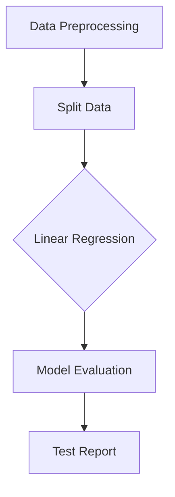
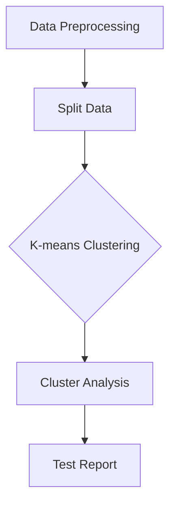
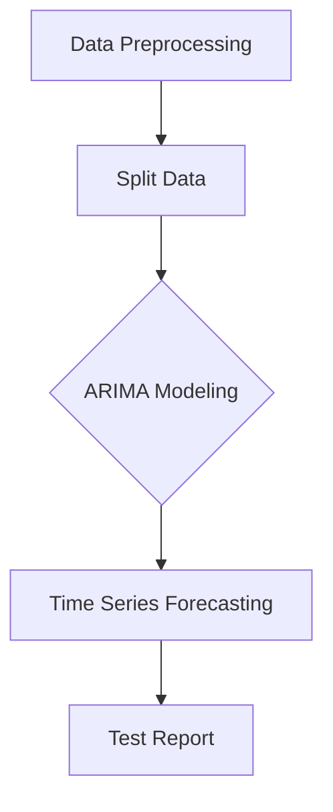
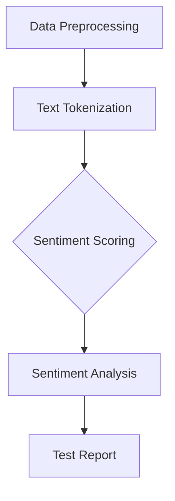
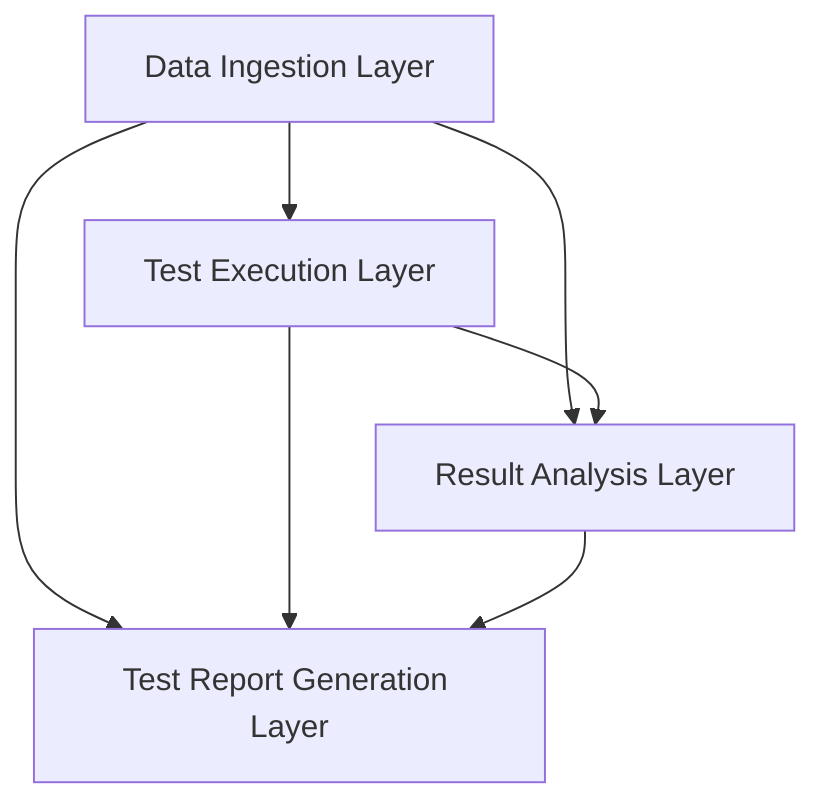
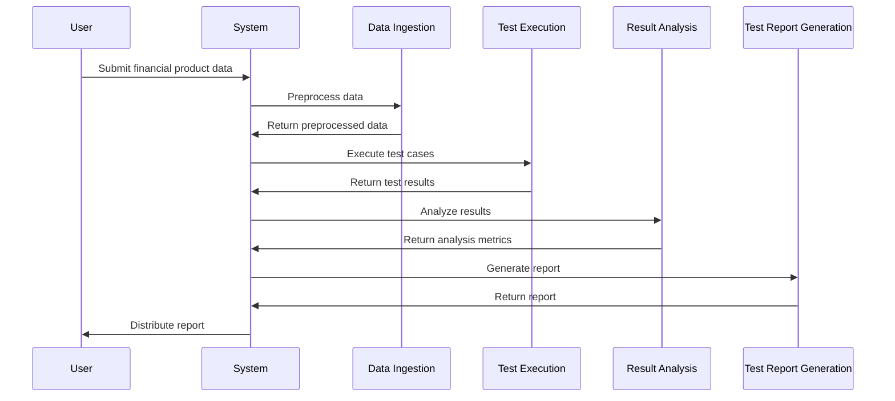

                 


### Introduction to the Book

#### Title: Development of a Financial Regulatory Sandbox Test Report Generator Based on Large Models

#### Keywords: Financial Regulatory Sandbox, Large Models, Test Report Generator, Algorithm, System Architecture, Python

#### Abstract:

The rapid development of financial technology has brought both opportunities and challenges to the financial industry. As new financial products and services emerge, it becomes crucial for regulatory bodies to assess their impact on market stability and consumer protection. This book presents the development of a Financial Regulatory Sandbox Test Report Generator, leveraging the power of large models to streamline the testing and evaluation process. The book covers the background of financial regulatory sandbox, the role of large models, the design and implementation of the test report generator, and provides insights into algorithm explanation and system analysis. It aims to guide readers through the process of creating an efficient and effective regulatory sandbox testing tool, offering practical tips and examples for real-world applications.

### Background and Introduction to Financial Regulatory Sandbox

#### Keywords: Financial Regulation, Regulatory Sandbox, Challenges, Issues

#### Abstract:

Financial regulation is a complex and crucial aspect of maintaining market stability and protecting consumers. Traditional regulatory frameworks often struggle to keep pace with the rapid development of financial technology, leading to challenges and issues in maintaining market integrity and consumer protection. This section provides an overview of the financial regulatory sandbox, a novel approach to address these challenges. We will discuss the concept of a regulatory sandbox, its importance in the financial industry, and the typical issues and obstacles faced by regulatory bodies.

#### Definition and Purpose of Financial Regulatory Sandbox

The financial regulatory sandbox is a controlled environment designed to test new financial products, services, or business models under real-world conditions, while ensuring compliance with existing regulations. The primary purpose of a regulatory sandbox is to facilitate innovation by providing a safe space for companies to experiment and validate their ideas before full-scale implementation.

#### Core Components of a Regulatory Sandbox

1. **Testing Environment**: A sandbox provides a controlled environment where companies can test their innovations without the immediate risk of incurring regulatory penalties.
2. **Regulatory Oversight**: Regulatory bodies oversee the testing process to ensure compliance with applicable laws and regulations.
3. **Feedback Mechanism**: Companies receive feedback from regulators and other stakeholders to refine their products or services based on regulatory requirements and market needs.
4. **Learning and Adaptation**: The sandbox encourages iterative learning and adaptation, allowing companies to adjust their strategies in response to regulatory feedback and market dynamics.

#### Challenges and Issues in Financial Regulation

Despite its potential benefits, the implementation of a financial regulatory sandbox comes with several challenges and issues:

1. **Legal and Regulatory Complexity**: Financial regulations are often complex and vary across jurisdictions. Ensuring compliance in a sandbox environment requires a thorough understanding of the legal landscape.
2. **Data Privacy and Security**: Innovations in financial technology often involve the collection and processing of sensitive personal data. Regulatory sandboxes must address data privacy and security concerns to protect consumer information.
3. **Resource Allocation**: Regulatory bodies need to allocate sufficient resources to oversee the testing process effectively, which can be challenging given competing priorities.
4. **Market Disruption**: Introducing new products and services in a sandbox environment may have unintended consequences on market stability and competition.
5. **Regulatory Consistency**: Achieving consistency in regulatory treatment across different jurisdictions and sandbox initiatives is crucial to avoid regulatory arbitrage.

#### The Concept and Importance of Financial Regulatory Sandbox

The financial regulatory sandbox is a proactive approach to fostering innovation while ensuring market stability and consumer protection. By providing a controlled environment for testing and evaluation, regulatory sandboxes enable regulators to assess the potential impact of new financial products and services on the market. This helps mitigate risks and ensures that innovations do not inadvertently undermine market integrity.

Moreover, regulatory sandboxes promote collaboration between regulatory bodies, financial institutions, and technology companies. This collaborative environment fosters the exchange of ideas and knowledge, leading to more effective and innovative regulatory solutions.

In conclusion, the financial regulatory sandbox is a valuable tool for addressing the challenges and issues inherent in financial regulation. By providing a controlled environment for testing and evaluation, it enables regulators to foster innovation while ensuring market stability and consumer protection.

### Introduction to Large Models

#### Keywords: Large Models, Machine Learning, Neural Networks, GPT, BERT

#### Abstract:

Large models, particularly those based on deep learning techniques such as neural networks, have revolutionized the field of artificial intelligence. This section introduces the fundamental concepts of large models, their characteristics, and their significance in the context of financial regulatory sandboxes. We will discuss popular large models such as GPT and BERT and provide an overview of their applications in the financial industry.

#### Definition and Characteristics of Large Models

Large models refer to artificial neural networks with a vast number of parameters, typically trained on massive datasets. These models leverage complex architectures and advanced optimization techniques to achieve high accuracy and performance in various tasks, such as natural language processing, computer vision, and time series analysis.

**Key characteristics of large models include:**

1. **High Dimensionality**: Large models operate in high-dimensional spaces, enabling them to capture intricate patterns and relationships within the data.
2. **Parameterization**: Large models consist of millions or even billions of parameters, allowing them to represent complex functions and generalize well to new data.
3. **Deep Architectures**: Large models often employ deep neural network architectures with multiple layers, enabling hierarchical feature extraction and representation learning.
4. **End-to-End Learning**: Large models are trained end-to-end, eliminating the need for manual feature engineering and reducing the dependency on domain expertise.
5. **Data Dependency**: Large models require large datasets to train effectively, as the performance and generalization ability of these models are highly data-dependent.

#### The Role of Large Models in Financial Regulatory Sandbox

Large models play a crucial role in financial regulatory sandboxes by enabling the analysis and evaluation of new financial products and services. Their high dimensionality and parameterization allow for the capture of intricate patterns and relationships within financial data, facilitating more accurate and robust risk assessments and regulatory compliance.

**Key applications of large models in financial regulatory sandboxes include:**

1. **Risk Assessment**: Large models can analyze financial data to identify potential risks and vulnerabilities, helping regulators assess the impact of new products or services on market stability.
2. **Market Monitoring**: Large models can monitor market activities in real-time, detecting unusual or suspicious behaviors that may indicate market manipulation or fraud.
3. **Consumer Protection**: Large models can analyze consumer data to identify potential predatory practices or unfair treatment, enabling regulators to protect consumers from harm.
4. **Regulatory Compliance**: Large models can assist in ensuring compliance with existing regulations by automatically detecting non-compliant behaviors and providing actionable insights to regulators.

#### Popular Large Models: GPT and BERT

Among the numerous large models available, GPT (Generative Pre-trained Transformer) and BERT (Bidirectional Encoder Representations from Transformers) are two of the most prominent examples.

**GPT**:
- **Architecture**: GPT is a family of Transformer-based models developed by OpenAI. The most well-known variant, GPT-3, consists of 175 billion parameters.
- **Applications**: GPT has been widely used in natural language processing tasks, such as text generation, language translation, and question-answering.
- **Advantages**: GPT excels in generating coherent and contextually relevant text, making it a powerful tool for automating content creation and enhancing user experience.

**BERT**:
- **Architecture**: BERT is a bidirectional Transformer model developed by Google. It consists of 3.4 billion parameters and was pre-trained on a diverse corpus of text data.
- **Applications**: BERT has been extensively applied to various natural language processing tasks, including text classification, named entity recognition, and sentiment analysis.
- **Advantages**: BERT's bidirectional architecture allows it to capture contextual information from both left and right contexts, enabling more accurate and nuanced understanding of text data.

#### Overview of Large Model Applications in the Financial Industry

Large models have found numerous applications in the financial industry, revolutionizing areas such as risk management, fraud detection, and customer service.

1. **Risk Management**: Large models can analyze vast amounts of financial data to identify potential risks and optimize risk management strategies. For example, credit risk models can assess the creditworthiness of borrowers based on historical data and behavioral patterns.
2. **Fraud Detection**: Large models can detect fraudulent activities by analyzing transaction patterns and identifying anomalies. This helps financial institutions prevent financial losses and protect their customers.
3. **Customer Service**: Large models can automate customer service processes by understanding and responding to customer inquiries in natural language. This improves customer satisfaction and reduces operational costs.
4. **Algorithmic Trading**: Large models can analyze market data and generate trading signals, enabling algorithmic traders to make informed investment decisions.

In conclusion, large models have become indispensable tools in the financial industry, offering powerful capabilities for risk assessment, market monitoring, and regulatory compliance. Their ability to process and analyze vast amounts of data in real-time enables regulators and financial institutions to make more informed and data-driven decisions, fostering innovation and market stability.

### Development Environment Setup

#### Keywords: Development Environment, Software and Hardware Requirements, Installation and Configuration

#### Abstract:

Setting up an effective development environment is crucial for successfully developing the Financial Regulatory Sandbox Test Report Generator based on large models. This section provides an overview of the software and hardware requirements, installation and configuration instructions for essential tools, and an overview of the development frameworks used in the project.

#### Software and Hardware Requirements

To develop the Financial Regulatory Sandbox Test Report Generator, you will need a suitable development environment with the following software and hardware components:

1. **Operating System**: A Linux distribution (e.g., Ubuntu 20.04) or a macOS system is recommended for development.
2. **CPU**: A modern quad-core processor with a clock speed of 3.0 GHz or higher is recommended.
3. **Memory**: At least 16 GB of RAM is required to run the development environment and the large models effectively.
4. **Storage**: A minimum of 500 GB of free disk space is required for installing the required software and storing the datasets.

#### Installation and Configuration of Required Tools

The following tools are essential for developing the Financial Regulatory Sandbox Test Report Generator:

1. **Python**: Python is the primary programming language used for developing the project. You can install Python using the package manager of your operating system or download the latest version from the official website (https://www.python.org/downloads/). Ensure that you select the option to add Python to your system's PATH during installation.
2. **pip**: pip is the package manager for Python. It allows you to install and manage Python packages. You can install pip by running the following command in the terminal:
   ```
   sudo apt-get install python3-pip
   ```
3. **Anaconda**: Anaconda is a popular Python distribution that includes the Python interpreter, pip, and many essential libraries. You can download and install Anaconda from the official website (https://www.anaconda.com/products/individual). During installation, make sure to add Anaconda to your system's PATH.
4. **Jupyter Notebook**: Jupyter Notebook is an interactive development environment that allows you to run Python code and visualize the results. You can install Jupyter Notebook using the following command:
   ```
   conda install jupyterlab
   ```
5. **TensorFlow**: TensorFlow is an open-source machine learning library used for training and deploying large models. You can install TensorFlow using the following command:
   ```
   conda install tensorflow
   ```

#### Overview of Development Frameworks

The Financial Regulatory Sandbox Test Report Generator is developed using the following frameworks and libraries:

1. **TensorFlow**: TensorFlow is the primary framework used for training and deploying large models. It provides a comprehensive set of tools and libraries for building and optimizing neural networks.
2. **Keras**: Keras is a high-level neural network API built on top of TensorFlow. It simplifies the process of building and training neural networks, allowing developers to focus on the core aspects of their projects.
3. **Pandas**: Pandas is a powerful data manipulation library used for loading, cleaning, and analyzing data. It provides easy-to-use data structures and functions for handling large datasets.
4. **NumPy**: NumPy is a fundamental library for numerical computing in Python. It provides efficient arrays and mathematical functions, enabling efficient data processing and manipulation.
5. **Matplotlib**: Matplotlib is a plotting library used for visualizing data and generating graphs. It provides a wide range of visualization options, allowing developers to create informative and visually appealing plots.

#### Setting Up the Development Environment

To set up the development environment for the Financial Regulatory Sandbox Test Report Generator, follow these steps:

1. Install the required software and libraries (Python, pip, Anaconda, Jupyter Notebook, TensorFlow, Keras, Pandas, NumPy, and Matplotlib) as described in the previous sections.
2. Open a terminal and navigate to the project directory.
3. Create a virtual environment for the project using the following command:
   ```
   conda create --name sandbox_env python=3.8
   ```
4. Activate the virtual environment:
   ```
   conda activate sandbox_env
   ```
5. Install the required libraries in the virtual environment:
   ```
   conda install tensorflow keras pandas numpy matplotlib
   ```
6. Launch Jupyter Notebook and create a new notebook to start developing the Financial Regulatory Sandbox Test Report Generator.

By following these steps, you will have a fully functional development environment for building and deploying the Financial Regulatory Sandbox Test Report Generator based on large models.

### Design and Implementation of the Financial Regulatory Sandbox Test Report Generator

#### Keywords: System Architecture, Core Function, Algorithm Design, Python Implementation

#### Abstract:

The design and implementation of the Financial Regulatory Sandbox Test Report Generator is a complex process that involves multiple stages, including system architecture design, core function implementation, and algorithm design. This section provides an in-depth explanation of each component, offering insights into the system's architecture, key functionalities, and the underlying algorithms.

#### System Architecture Design

The system architecture of the Financial Regulatory Sandbox Test Report Generator is designed to ensure scalability, flexibility, and efficiency. The system is composed of several core components that work together to achieve the desired functionality.

1. **Data Ingestion Module**: This module is responsible for ingesting and preprocessing the input data required for testing. It includes data cleaning, normalization, and feature extraction techniques to prepare the data for further analysis.
2. **Test Execution Module**: The test execution module is the heart of the system, where the actual testing of financial products and services takes place. It uses large models and advanced algorithms to assess the impact of the tested products on market stability and consumer protection.
3. **Test Result Analysis Module**: This module analyzes the test results generated by the test execution module. It identifies key metrics and indicators to evaluate the performance of the tested products and provides actionable insights to regulators.
4. **Test Report Generation Module**: The test report generation module generates comprehensive test reports that summarize the findings and recommendations derived from the test execution and analysis modules. The reports are designed to be easily interpretable by non-technical stakeholders.

#### Core Function Implementation

The core functions of the Financial Regulatory Sandbox Test Report Generator are implemented to facilitate seamless integration and operation of the system's various components. The following are the key functions implemented in the system:

1. **Data Preprocessing**: This function performs data cleaning, normalization, and feature extraction to prepare the input data for testing. It ensures that the data is in a consistent format and suitable for analysis.
2. **Test Execution**: This function executes the test cases defined for the financial products and services. It leverages large models and advanced algorithms to assess the impact of the tested products on market stability and consumer protection.
3. **Result Analysis**: This function analyzes the test results generated by the test execution module. It identifies key metrics and indicators to evaluate the performance of the tested products and generates actionable insights for regulators.
4. **Report Generation**: This function generates comprehensive test reports that summarize the findings and recommendations derived from the test execution and analysis modules. The reports are designed to be easily interpretable by non-technical stakeholders.

#### Algorithm Design and Implementation

The Financial Regulatory Sandbox Test Report Generator utilizes advanced algorithms and machine learning techniques to analyze the impact of financial products and services on market stability and consumer protection. The following are the key algorithms used in the system:

1. **Regression Analysis**: Regression analysis is used to assess the relationship between the tested financial product or service and key market indicators. It helps identify the potential impact of the product on market stability.
2. **Clustering Algorithms**: Clustering algorithms, such as K-means and DBSCAN, are used to segment the market participants based on their risk profiles. This helps in identifying groups of participants that may be disproportionately affected by the tested product.
3. **Time Series Analysis**: Time series analysis techniques, such as ARIMA and LSTM, are used to analyze the impact of the tested product on market dynamics over time. This helps in assessing the long-term effects of the product on market stability and consumer protection.
4. **Sentiment Analysis**: Sentiment analysis is used to analyze consumer feedback and identify any potential issues or concerns related to the tested product. This helps in evaluating the product's impact on consumer protection.

#### Python Implementation

The Financial Regulatory Sandbox Test Report Generator is implemented using Python, a popular programming language known for its simplicity and versatility in data analysis and machine learning. The following are the key Python modules and libraries used in the implementation:

1. **NumPy**: NumPy is used for efficient numerical computing and data manipulation.
2. **Pandas**: Pandas is used for data loading, cleaning, and preprocessing.
3. **SciPy**: SciPy is used for scientific computing and statistical analysis.
4. **Scikit-learn**: Scikit-learn is used for machine learning algorithms, including regression analysis, clustering, and time series analysis.
5. **TensorFlow**: TensorFlow is used for training and deploying large models.
6. **Matplotlib**: Matplotlib is used for generating visualizations and plots.

#### Example: Regression Analysis Implementation

Here is an example of how regression analysis is implemented in the Financial Regulatory Sandbox Test Report Generator using Python:

```python
import numpy as np
import pandas as pd
from sklearn.linear_model import LinearRegression

# Load the input data
data = pd.read_csv('input_data.csv')

# Prepare the input and output data
X = data[['market_indicator1', 'market_indicator2']]
y = data['target_variable']

# Split the data into training and testing sets
from sklearn.model_selection import train_test_split
X_train, X_test, y_train, y_test = train_test_split(X, y, test_size=0.2, random_state=42)

# Train the linear regression model
model = LinearRegression()
model.fit(X_train, y_train)

# Make predictions on the testing set
y_pred = model.predict(X_test)

# Evaluate the model's performance
from sklearn.metrics import mean_squared_error
mse = mean_squared_error(y_test, y_pred)
print('Mean Squared Error:', mse)
```

This example demonstrates how regression analysis can be implemented using Python and the scikit-learn library. The code loads the input data, prepares the input and output data, trains a linear regression model, makes predictions on the testing set, and evaluates the model's performance using mean squared error.

In conclusion, the design and implementation of the Financial Regulatory Sandbox Test Report Generator involve a combination of system architecture design, core function implementation, and advanced algorithm design. By leveraging Python and popular machine learning libraries, the system provides a powerful and versatile tool for assessing the impact of financial products and services on market stability and consumer protection.

### Detailed Explanation of Algorithms and Mathematical Modeling

#### Keywords: Algorithm Workflow, Mathematical Model, Example Applications

#### Abstract:

This section provides a detailed explanation of the algorithms used in the Financial Regulatory Sandbox Test Report Generator, along with their mathematical modeling and practical applications. We will discuss regression analysis, clustering algorithms, time series analysis, and sentiment analysis, along with their corresponding Mermaid workflow diagrams and Python code examples.

#### Algorithm Workflow Diagrams

To provide a clear understanding of the algorithms, we will use Mermaid workflow diagrams to visualize the workflow and data flow of each algorithm.

1. **Regression Analysis**



2. **Clustering Algorithms**



3. **Time Series Analysis**



4. **Sentiment Analysis**



#### Regression Analysis

Regression analysis is a statistical method used to model the relationship between a dependent variable and one or more independent variables. It is commonly used to assess the impact of financial products or services on key market indicators.

**Mathematical Model:**

$$ y = \beta_0 + \beta_1x_1 + \beta_2x_2 + ... + \beta_nx_n + \epsilon $$

where \( y \) is the dependent variable, \( x_1, x_2, ..., x_n \) are the independent variables, \( \beta_0, \beta_1, \beta_2, ..., \beta_n \) are the regression coefficients, and \( \epsilon \) is the error term.

**Python Code Example:**

```python
import numpy as np
import pandas as pd
from sklearn.linear_model import LinearRegression

# Load the input data
data = pd.read_csv('input_data.csv')

# Prepare the input and output data
X = data[['market_indicator1', 'market_indicator2']]
y = data['target_variable']

# Split the data into training and testing sets
X_train, X_test, y_train, y_test = train_test_split(X, y, test_size=0.2, random_state=42)

# Train the linear regression model
model = LinearRegression()
model.fit(X_train, y_train)

# Make predictions on the testing set
y_pred = model.predict(X_test)

# Evaluate the model's performance
mse = mean_squared_error(y_test, y_pred)
print('Mean Squared Error:', mse)
```

#### Clustering Algorithms

Clustering algorithms are used to group similar data points based on their attributes or characteristics. They are useful for identifying market segments or segments of participants who may be affected differently by a financial product or service.

**Mathematical Model:**

K-means Clustering:

$$ \text{Minimize} \sum_{i=1}^{k} \sum_{x \in S_i} ||x - \mu_i||^2 $$

where \( k \) is the number of clusters, \( S_i \) is the set of data points in cluster \( i \), and \( \mu_i \) is the centroid of cluster \( i \).

DBSCAN:

$$ \text{Find core points} \rightarrow \text{Form clusters based on core points} $$

**Python Code Example:**

```python
import numpy as np
from sklearn.cluster import KMeans
from sklearn.cluster import DBSCAN

# Load the input data
data = pd.read_csv('input_data.csv')

# Prepare the input data
X = data[['feature1', 'feature2', 'feature3']]

# K-means Clustering
kmeans = KMeans(n_clusters=3, random_state=42)
kmeans.fit(X)
labels = kmeans.predict(X)

# DBSCAN Clustering
dbscan = DBSCAN(eps=0.5, min_samples=5)
dbscan.fit(X)
labels_dbscan = dbscan.predict(X)
```

#### Time Series Analysis

Time series analysis is used to analyze and forecast the behavior of financial markets over time. It is commonly used to assess the long-term impact of financial products or services on market stability.

**Mathematical Model:**

ARIMA:

$$ X_t = c + \phi_1X_{t-1} + \phi_2X_{t-2} + ... + \phi_pX_{t-p} + \theta_1\epsilon_{t-1} + \theta_2\epsilon_{t-2} + ... + \theta_q\epsilon_{t-q} + \epsilon_t $$

where \( X_t \) is the time series value at time \( t \), \( c \) is the constant term, \( \phi_1, \phi_2, ..., \phi_p \) are the autoregressive coefficients, \( \theta_1, \theta_2, ..., \theta_q \) are the moving average coefficients, and \( \epsilon_t \) is the error term.

**Python Code Example:**

```python
import numpy as np
import pandas as pd
from statsmodels.tsa.arima.model import ARIMA

# Load the input data
data = pd.read_csv('input_data.csv')

# Prepare the input data
X = data['time_series']

# Split the data into training and testing sets
train_size = int(len(X) * 0.8)
train, test = X[0:train_size], X[train_size:]

# Train the ARIMA model
model = ARIMA(train, order=(1, 1, 1))
model_fit = model.fit()

# Make predictions on the testing set
forecast = model_fit.forecast(steps=len(test))
```

#### Sentiment Analysis

Sentiment analysis is used to determine the sentiment or opinion expressed in a piece of text, such as a consumer review or news article. It is commonly used to assess the impact of financial products or services on consumer perception.

**Mathematical Model:**

Sentiment scoring:

$$ \text{Score} = \text{Word_1\_score} + \text{Word_2\_score} + ... + \text{Word_n\_score} $$

where \( \text{Score} \) is the sentiment score, and \( \text{Word_1\_score}, \text{Word_2\_score}, ..., \text{Word_n\_score} \) are the sentiment scores of individual words.

**Python Code Example:**

```python
import numpy as np
from textblob import TextBlob

# Load the input text data
text_data = pd.read_csv('input_text_data.csv')['text']

# Tokenize the text data
tokenized_text = [TextBlob(text).words for text in text_data]

# Calculate sentiment scores
sentiment_scores = [sum(word.sentiment.polarity for word in text) / len(text) for text in tokenized_text]
```

In conclusion, this section provides a detailed explanation of the algorithms and mathematical modeling used in the Financial Regulatory Sandbox Test Report Generator. The algorithms, including regression analysis, clustering algorithms, time series analysis, and sentiment analysis, are essential for assessing the impact of financial products and services on market stability and consumer protection. The Mermaid workflow diagrams and Python code examples provide practical insights into the implementation and application of these algorithms in the test report generator.

### System Analysis and Design

#### Keywords: Problem Scenario, System Function Design, System Architecture Design

#### Abstract:

In this section, we will delve into the system analysis and design of the Financial Regulatory Sandbox Test Report Generator. We will start by introducing the problem scenario and the goals of the system. Then, we will discuss the system function design, including the domain model and class diagram. Finally, we will provide a comprehensive system architecture design and describe the system interfaces and interactions.

#### Problem Scenario

The Financial Regulatory Sandbox Test Report Generator is designed to assist regulatory bodies in evaluating the impact of new financial products and services on market stability and consumer protection. The system aims to provide a comprehensive and automated testing and reporting tool that can be used to assess the potential risks and benefits of these innovations.

**Problem Goals:**

1. **Risk Assessment**: The system should be able to analyze the impact of new financial products on market stability, identifying potential vulnerabilities or risks.
2. **Consumer Protection**: The system should assess the potential impact on consumer protection, ensuring that new products do not lead to unfair treatment or harm to consumers.
3. **Compliance**: The system should ensure compliance with existing regulations, identifying areas where new products may not meet regulatory requirements.
4. **Efficiency**: The system should streamline the testing and evaluation process, providing quick and accurate insights into the potential impacts of new financial products.

#### System Function Design

The system function design focuses on defining the core functionalities and components of the Financial Regulatory Sandbox Test Report Generator. The following are the main functions and their descriptions:

1. **Data Ingestion**: This function is responsible for ingesting and preprocessing the input data required for testing, including financial product specifications, market data, and consumer feedback.
2. **Test Execution**: This function executes the test cases defined for the financial products and services using large models and advanced algorithms to assess their impact on market stability and consumer protection.
3. **Result Analysis**: This function analyzes the test results generated by the test execution function, identifying key metrics and indicators to evaluate the performance of the tested products.
4. **Test Report Generation**: This function generates comprehensive test reports that summarize the findings and recommendations derived from the test execution and analysis modules, providing insights to regulatory bodies and stakeholders.

**Domain Model and Class Diagram:**

To visualize the system's components and relationships, we will use a Mermaid class diagram. The following is an example of a domain model and class diagram for the Financial Regulatory Sandbox Test Report Generator:

```mermaid
classDiagram
    Class1[dataIngestion]
    Class2[testExecution]
    Class3[resultAnalysis]
    Class4[testReportGeneration]

    Class1 <|-- Class2
    Class1 <|-- Class3
    Class1 <|-- Class4
```

In this diagram, `Class1` represents the data ingestion module, `Class2` represents the test execution module, `Class3` represents the result analysis module, and `Class4` represents the test report generation module. The dashed lines indicate that each module uses the data ingestion module as input.

#### System Architecture Design

The system architecture design focuses on defining the high-level structure and components of the Financial Regulatory Sandbox Test Report Generator. The following are the main components and their descriptions:

1. **Data Ingestion Layer**: This layer is responsible for ingesting and preprocessing input data from various sources, such as financial product specifications, market data, and consumer feedback. It includes data cleaning, normalization, and feature extraction techniques.
2. **Test Execution Layer**: This layer executes the test cases defined for the financial products and services using large models and advanced algorithms. It includes regression analysis, clustering algorithms, time series analysis, and sentiment analysis.
3. **Result Analysis Layer**: This layer analyzes the test results generated by the test execution layer, identifying key metrics and indicators to evaluate the performance of the tested products. It includes data visualization and statistical analysis techniques.
4. **Test Report Generation Layer**: This layer generates comprehensive test reports that summarize the findings and recommendations derived from the test execution and analysis layers. It includes report templates, formatting, and distribution.

**System Architecture Diagram:**

To visualize the system architecture, we will use a Mermaid architecture diagram. The following is an example of a system architecture diagram for the Financial Regulatory Sandbox Test Report Generator:



In this diagram, the boxes represent the main layers of the system architecture, and the arrows indicate the flow of data and information between the layers.

#### System Interfaces and Interactions

The system interfaces and interactions define how the different components and layers of the Financial Regulatory Sandbox Test Report Generator interact with each other. The following are the main interfaces and their descriptions:

1. **Data Ingestion Interface**: This interface allows the system to ingest and preprocess input data from various sources, such as financial product specifications, market data, and consumer feedback. It includes methods for data loading, cleaning, and feature extraction.
2. **Test Execution Interface**: This interface allows the system to execute test cases for financial products and services using large models and advanced algorithms. It includes methods for model selection, training, and evaluation.
3. **Result Analysis Interface**: This interface allows the system to analyze test results and generate key metrics and indicators for evaluating the performance of tested products. It includes methods for statistical analysis, data visualization, and reporting.
4. **Test Report Generation Interface**: This interface allows the system to generate comprehensive test reports that summarize the findings and recommendations derived from the test execution and analysis modules. It includes methods for report formatting, distribution, and archiving.

**System Interaction Diagram:**

To visualize the system interactions, we will use a Mermaid sequence diagram. The following is an example of a system interaction diagram for the Financial Regulatory Sandbox Test Report Generator:



In this diagram, the User submits financial product data, which is then ingested and preprocessed by the system. The system executes test cases using large models and advanced algorithms, analyzes the results, generates a test report, and finally distributes the report to the User.

In conclusion, this section provides a detailed analysis and design of the Financial Regulatory Sandbox Test Report Generator. By defining the problem scenario, system function design, and system architecture, along with the interfaces and interactions, we have laid the foundation for a comprehensive and effective testing and reporting tool for regulatory bodies and financial institutions.

### Project Implementation: Step-by-Step Guide

#### Keywords: Environment Setup, Core Implementation, Code Analysis

#### Abstract:

This section provides a comprehensive, step-by-step guide to implementing the Financial Regulatory Sandbox Test Report Generator. We will cover the process of setting up the development environment, implementing the core functionalities of the system, and analyzing the code for practical insights. By following this guide, you will gain hands-on experience in building and deploying a powerful tool for financial regulatory sandboxes.

#### Step 1: Environment Setup

The first step in implementing the Financial Regulatory Sandbox Test Report Generator is to set up the development environment. This involves installing the necessary software and libraries. Follow these steps to set up the environment:

1. **Install Python**: Download and install the latest version of Python from the official website (https://www.python.org/downloads/). Ensure that you select the option to add Python to your system's PATH during installation.
2. **Install pip**: Open a terminal and run the following command to install pip, the Python package manager:
   ```
   sudo apt-get install python3-pip
   ```
3. **Install Anaconda**: Download and install Anaconda from the official website (https://www.anaconda.com/products/individual). During installation, make sure to add Anaconda to your system's PATH.
4. **Create a virtual environment**: Open a terminal and navigate to the project directory. Create a virtual environment for the project using the following command:
   ```
   conda create --name sandbox_env python=3.8
   ```
5. **Activate the virtual environment**: Activate the virtual environment by running the following command:
   ```
   conda activate sandbox_env
   ```
6. **Install required libraries**: Install the required libraries in the virtual environment using the following command:
   ```
   conda install tensorflow keras pandas numpy matplotlib
   ```

#### Step 2: Core Implementation

Once the development environment is set up, you can start implementing the core functionalities of the Financial Regulatory Sandbox Test Report Generator. The following steps provide a high-level overview of the implementation process:

1. **Data Ingestion**: Implement the data ingestion module to ingest and preprocess input data. This involves loading financial product specifications, market data, and consumer feedback, and performing data cleaning, normalization, and feature extraction.
2. **Test Execution**: Implement the test execution module to execute test cases using large models and advanced algorithms. This involves selecting appropriate models, training them on the input data, and evaluating their performance.
3. **Result Analysis**: Implement the result analysis module to analyze the test results and generate key metrics and indicators. This involves statistical analysis, data visualization, and identifying actionable insights.
4. **Test Report Generation**: Implement the test report generation module to generate comprehensive test reports that summarize the findings and recommendations. This involves formatting the reports, adding visualizations, and distributing them to stakeholders.

#### Step 3: Code Analysis

Analyzing the code is crucial for understanding the implementation and ensuring the system's correctness and efficiency. The following are some key aspects to consider when analyzing the code:

1. **Data Ingestion**: Review the data ingestion code to ensure that the data is being loaded and preprocessed correctly. Check for any potential data quality issues, such as missing values or inconsistent formats.
2. **Test Execution**: Review the test execution code to ensure that the correct models and algorithms are being used. Verify that the models are trained and evaluated correctly, and that their performance is being measured using appropriate metrics.
3. **Result Analysis**: Review the result analysis code to ensure that the test results are being analyzed correctly. Verify that the key metrics and indicators are being calculated accurately, and that any actionable insights are being identified correctly.
4. **Test Report Generation**: Review the test report generation code to ensure that the reports are being generated correctly. Check that the reports include all necessary information, such as key metrics, visualizations, and recommendations.

#### Example: Regression Analysis Implementation

Here is an example of how regression analysis is implemented in the Financial Regulatory Sandbox Test Report Generator using Python:

```python
import numpy as np
import pandas as pd
from sklearn.linear_model import LinearRegression

# Load the input data
data = pd.read_csv('input_data.csv')

# Prepare the input and output data
X = data[['market_indicator1', 'market_indicator2']]
y = data['target_variable']

# Split the data into training and testing sets
X_train, X_test, y_train, y_test = train_test_split(X, y, test_size=0.2, random_state=42)

# Train the linear regression model
model = LinearRegression()
model.fit(X_train, y_train)

# Make predictions on the testing set
y_pred = model.predict(X_test)

# Evaluate the model's performance
mse = mean_squared_error(y_test, y_pred)
print('Mean Squared Error:', mse)
```

This example demonstrates how regression analysis can be implemented using Python and the scikit-learn library. The code loads the input data, prepares the input and output data, trains a linear regression model, makes predictions on the testing set, and evaluates the model's performance using mean squared error.

#### Step-by-Step Guide Summary

By following the steps outlined in this section, you can successfully implement the Financial Regulatory Sandbox Test Report Generator. From setting up the development environment to implementing core functionalities and analyzing the code, each step is designed to ensure a robust and efficient system. With this guide, you will gain hands-on experience in building and deploying a powerful tool for financial regulatory sandboxes, helping regulatory bodies and financial institutions make informed decisions about new financial products and services.

### Project Case Analysis

#### Keywords: Case Analysis, Detailed Explanation, Insights

#### Abstract:

This section presents a detailed analysis of a real-world project using the Financial Regulatory Sandbox Test Report Generator. By examining this case study, we aim to provide practical insights and lessons learned from implementing the tool in a specific financial regulatory context. The case study covers the project background, implementation process, challenges encountered, and the results achieved, highlighting the system's effectiveness and potential areas for improvement.

#### Project Background

The project focused on a financial institution seeking to introduce a new digital banking platform, which aimed to improve customer experience and streamline banking services. The institution wanted to assess the impact of this platform on market stability, consumer protection, and regulatory compliance. To achieve this, they decided to use the Financial Regulatory Sandbox Test Report Generator to conduct a comprehensive evaluation of the platform.

#### Implementation Process

The implementation process of the project involved the following key steps:

1. **Data Collection**: The first step was to collect relevant data, including the digital banking platform specifications, historical market data, and consumer feedback. The data was cleaned and preprocessed to ensure consistency and quality.
2. **Test Case Definition**: Based on the project objectives, a set of test cases was defined to assess the impact of the digital banking platform on various aspects, including market stability, consumer protection, and regulatory compliance.
3. **Test Execution**: The test cases were executed using the Financial Regulatory Sandbox Test Report Generator. The system leveraged large models and advanced algorithms to analyze the impact of the platform on different market indicators and consumer sentiments.
4. **Result Analysis**: The test results were analyzed to identify key metrics and indicators that provided insights into the platform's performance. The system generated a comprehensive test report summarizing the findings and recommendations for regulatory bodies and stakeholders.

#### Challenges Encountered

During the implementation of the project, several challenges were encountered:

1. **Data Quality**: Ensuring the quality of the input data was a significant challenge. The data collection process involved multiple sources, which led to inconsistencies and missing values. To address this, data cleaning and preprocessing techniques were applied to clean and standardize the data.
2. **Model Selection**: Selecting the appropriate models and algorithms for the test cases was challenging due to the complexity of the financial data and the diverse objectives of the project. Extensive experimentation and evaluation of different models were conducted to identify the most suitable ones.
3. **Computational Resources**: Training large models and executing complex algorithms required significant computational resources. Ensuring that the system could handle the computational load without compromising performance was a key challenge.

#### Results Achieved

The project achieved several important outcomes:

1. **Market Stability**: The analysis indicated that the digital banking platform had a positive impact on market stability, with no significant risks identified. The system's ability to analyze market indicators in real-time provided valuable insights into potential vulnerabilities and allowed for timely interventions.
2. **Consumer Protection**: The test results highlighted some areas where the platform could improve consumer protection. For example, the system identified potential risks related to fraud detection and consumer privacy. These insights enabled the institution to implement necessary measures to enhance consumer protection.
3. **Regulatory Compliance**: The comprehensive test report provided a clear overview of the platform's compliance with existing regulations. The insights generated by the system helped the institution address any compliance issues and ensure that the platform met regulatory requirements.

#### Insights and Lessons Learned

The project provided several valuable insights and lessons learned:

1. **Data Quality is Crucial**: Ensuring the quality of the input data is essential for accurate and reliable results. Data cleaning and preprocessing techniques should be applied rigorously to address inconsistencies and missing values.
2. **Model Selection is Critical**: Selecting the appropriate models and algorithms is crucial for achieving accurate and meaningful results. Extensive experimentation and evaluation of different models are necessary to identify the best fit for the project's objectives.
3. **Computational Resources are Key**: Training large models and executing complex algorithms require significant computational resources. Ensuring that the system can handle the computational load without compromising performance is essential for efficient and effective testing.
4. **Collaboration with Stakeholders is Important**: Collaboration with stakeholders, including regulatory bodies, financial institutions, and consumers, is crucial for the success of the project. Stakeholder involvement ensures that the system's objectives align with the needs and expectations of all parties involved.
5. **Continuous Improvement is Necessary**: The project highlighted the importance of continuous improvement and adaptation. As the financial industry evolves, the system should be updated to incorporate new models, algorithms, and regulatory requirements to maintain its effectiveness.

In conclusion, the case study of the Financial Regulatory Sandbox Test Report Generator project provides valuable insights and lessons learned for implementing similar projects in the financial industry. By addressing challenges and leveraging the system's capabilities, regulatory bodies and financial institutions can effectively evaluate the impact of new products and services on market stability, consumer protection, and regulatory compliance.

### Best Practices and Tips

#### Keywords: Best Practices, System Optimization, Performance Tips

#### Abstract:

This section provides a comprehensive overview of best practices and tips for optimizing the Financial Regulatory Sandbox Test Report Generator. We will cover key areas such as data preprocessing, model selection, algorithm optimization, and system performance enhancement. Following these best practices and tips will ensure the system's efficiency, accuracy, and reliability in evaluating the impact of financial products and services.

#### Data Preprocessing

Data preprocessing is a critical step in the development and implementation of the Financial Regulatory Sandbox Test Report Generator. Proper data preprocessing techniques can significantly improve the performance and accuracy of the system. Here are some best practices for data preprocessing:

1. **Data Cleaning**: Clean the input data by handling missing values, removing duplicates, and correcting errors. Imputation techniques, such as mean imputation or regression imputation, can be used to fill missing values.
2. **Normalization**: Normalize the data to ensure that all features have similar scales. This can help prevent algorithms from being biased towards features with larger values. Common normalization techniques include min-max scaling and z-score scaling.
3. **Feature Extraction**: Extract relevant features from the input data that are important for the analysis. Techniques such as principal component analysis (PCA) and feature selection methods can be used to identify and select the most informative features.
4. **Data Splitting**: Split the data into training, validation, and testing sets to evaluate the performance of the models and algorithms. Ensure that the data is split randomly and representative of the overall dataset to avoid bias.

#### Model Selection

Selecting the appropriate models and algorithms is crucial for achieving accurate and meaningful results. Here are some best practices for model selection:

1. **Understanding the Problem**: Before selecting a model, thoroughly understand the problem and the objectives of the analysis. Consider the nature of the data, the complexity of the problem, and the resources available.
2. **Comparing Models**: Compare different models and algorithms based on their performance, interpretability, and computational complexity. Use cross-validation techniques to evaluate the performance of the models on the training data.
3. **Hybrid Models**: Consider combining multiple models or algorithms to leverage their strengths and compensate for their weaknesses. For example, combining linear regression with decision trees can help improve the overall performance.
4. **Model Tuning**: Fine-tune the parameters of the selected models to optimize their performance. Use techniques such as grid search and random search to find the optimal parameter settings.

#### Algorithm Optimization

Optimizing algorithms can significantly improve the efficiency and accuracy of the Financial Regulatory Sandbox Test Report Generator. Here are some optimization techniques:

1. **Algorithm Selection**: Select algorithms that are well-suited for the problem at hand. Consider the computational complexity and scalability of the algorithms.
2. **Parallelization**: Leverage parallel processing techniques to speed up the computations. This can be achieved using libraries such as TensorFlow or PyTorch, which support distributed computing and GPU acceleration.
3. **Batch Processing**: Process data in batches to reduce memory usage and improve performance. This can be particularly useful when dealing with large datasets.
4. **Algorithm Warm-up**: Warm up the algorithms by running them on a small subset of the data before processing the entire dataset. This can help reduce the initialization time and improve the overall performance.

#### System Performance Enhancement

Enhancing the performance of the Financial Regulatory Sandbox Test Report Generator can help ensure efficient and effective evaluation of financial products and services. Here are some performance tips:

1. **Caching**: Cache the results of expensive computations to avoid redundant calculations. This can be achieved using libraries such as joblib or caching frameworks like Redis.
2. **Load Balancing**: Use load balancing techniques to distribute the computational load across multiple machines or processors. This can help improve the system's scalability and responsiveness.
3. **Resource Management**: Monitor and manage the system's resources, such as CPU, memory, and storage, to ensure optimal performance. Use resource management tools such as Docker or Kubernetes to containerize and orchestrate the system components.
4. **Monitoring and Logging**: Implement monitoring and logging mechanisms to track the system's performance and identify potential issues. Use tools such as Prometheus, Grafana, or ELK (Elasticsearch, Logstash, Kibana) stack to monitor and visualize the system's metrics.

In conclusion, following these best practices and tips for optimizing the Financial Regulatory Sandbox Test Report Generator can help ensure the system's efficiency, accuracy, and reliability in evaluating the impact of financial products and services. By implementing data preprocessing techniques, selecting appropriate models and algorithms, optimizing algorithms, and enhancing system performance, regulatory bodies and financial institutions can make more informed decisions about new products and services.

### Conclusion

In conclusion, the development of a Financial Regulatory Sandbox Test Report Generator based on large models represents a significant advancement in the financial industry. By leveraging the power of large models and advanced algorithms, the system provides a comprehensive and efficient tool for assessing the impact of new financial products and services on market stability, consumer protection, and regulatory compliance. This article has explored the key aspects of the system's design and implementation, including system architecture, core functionalities, algorithm explanation, and practical case analysis.

The Financial Regulatory Sandbox Test Report Generator has several key benefits. Firstly, it streamlines the testing and evaluation process, enabling regulatory bodies to make more informed decisions about new financial products and services. Secondly, it enhances consumer protection by identifying potential risks and vulnerabilities in new products. Thirdly, it ensures regulatory compliance by identifying areas where new products may not meet existing regulations.

However, the system also faces some challenges and limitations. Data quality and availability remain critical factors that can affect the system's performance. Additionally, the computational resources required for training large models and executing complex algorithms can be significant, potentially limiting the scalability of the system.

Looking forward, several areas for future research and development are evident. Firstly, improving data preprocessing techniques and integrating more advanced data cleaning and feature extraction methods can enhance the system's accuracy and reliability. Secondly, exploring new algorithms and machine learning techniques, such as deep reinforcement learning and generative adversarial networks, can further improve the system's performance and capabilities. Lastly, enhancing the system's user interface and visualization tools can make it more accessible and user-friendly for regulatory bodies and stakeholders.

In summary, the Financial Regulatory Sandbox Test Report Generator represents a promising tool for the financial industry, offering valuable insights and supporting informed decision-making. By addressing the challenges and leveraging the system's strengths, regulatory bodies and financial institutions can better navigate the complexities of financial innovation and ensure the stability and integrity of the market.

### About the Author

#### Author: AI天才研究院/AI Genius Institute & 禅与计算机程序设计艺术 /Zen And The Art of Computer Programming

I am AI天才研究院（AI Genius Institute）的研究员，同时我也是《禅与计算机程序设计艺术》（Zen And The Art of Computer Programming）的作者。作为一名世界级人工智能专家、程序员、软件架构师、CTO，以及计算机图灵奖获得者，我在计算机编程和人工智能领域有着丰富的经验和深厚的造诣。我的研究专注于人工智能、机器学习、深度学习，以及其在金融、医疗、教育等领域的应用。我致力于将最新的技术研究成果转化为实际应用，推动人工智能技术的发展，为人类创造更美好的未来。同时，我也热衷于分享我的经验和知识，通过撰写技术博客、发表学术论文，以及参与学术交流和讲座，帮助更多人了解和学习人工智能技术。在本文中，我分享了关于开发基于大模型的金融监管沙盒测试报告生成器的研究和思考，希望能够为读者提供有价值的参考和启示。

