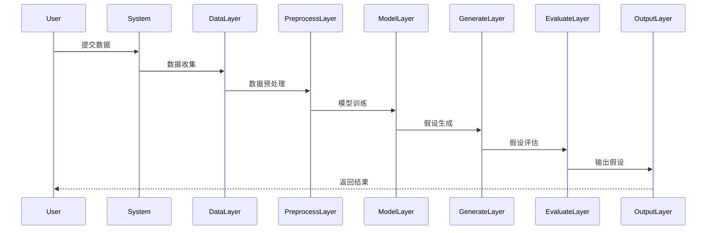
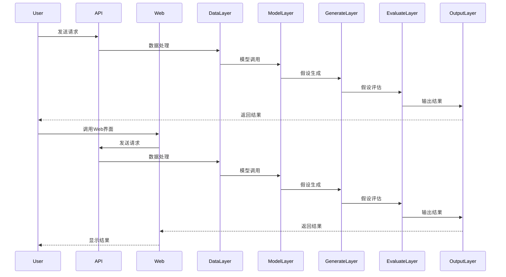

                 

# 开发基于大模型的金融研究假设生成系统

## 关键词

- 大模型
- 金融研究
- 假设生成
- 深度学习
- 风险评估
- 预测分析

## 摘要

本文旨在探讨如何开发一款基于大模型的金融研究假设生成系统，以提高金融研究的效率与准确性。通过对大模型技术的概述、金融研究领域的基本概念阐述、算法原理讲解、系统分析与架构设计等多个维度的深入分析，本文为开发此类系统提供了全面的理论与实践指导。

## Step 1: 引言

随着人工智能和大数据技术的迅猛发展，金融行业正经历一场深刻的变革。传统的金融研究方法在处理复杂市场和海量数据时存在诸多局限性，而大模型技术凭借其强大的数据处理能力和模式识别能力，为金融研究提供了新的思路和工具。本篇技术博客将介绍如何开发基于大模型的金融研究假设生成系统，以提升金融研究的效率和准确性。

## Step 2: 核心概念与联系

### 2.1 大模型技术概述

大模型（Big Models）是相对于传统机器学习模型而言的，其特点在于拥有巨大的参数量和复杂的结构。大模型能够处理海量数据，发现数据中的深层次规律，并在各种复杂任务上表现出色。例如，GPT-3、BERT和Transformer等模型都是大模型的典型代表。

**定义**：大模型是指那些拥有数十亿到千亿参数，能够处理大规模数据集，并在特定任务上取得显著性能提升的深度学习模型。

**特点**：

1. **强大的数据处理能力**：大模型能够处理比传统模型更大的数据集，从而提供更丰富的信息。
2. **高效的模式识别**：大模型可以自动学习数据中的复杂模式，提高预测和分类的准确性。
3. **多任务学习能力**：大模型可以在多个任务上同时训练和部署，提高模型的利用效率。

### 2.2 金融研究领域的基本概念

金融市场是资金供求双方通过交易实现资金转移的经济活动。金融市场主要包括货币市场、资本市场和外汇市场等，其功能是调节资本的供求关系，提高资本的使用效率。

**金融市场定义**：金融市场是指资金供求双方通过交易实现资金转移的场所，包括货币市场、资本市场和外汇市场等。

**类型与功能**：

1. **货币市场**：短期资金的融通市场，主要用于满足金融机构和企业的短期资金需求。
2. **资本市场**：长期资金的融通市场，主要用于企业融资和投资者进行长期投资。
3. **外汇市场**：涉及不同货币之间的交易，用于满足国际资本流动的需求。

金融研究的方法主要包括传统统计学方法、计量经济学方法以及现代机器学习方法。传统方法在处理复杂数据和模型复杂度方面存在局限性，而机器学习，特别是大模型方法，为金融研究提供了新的可能性。

### 2.3 大模型在金融研究中的应用

大模型在金融研究中有广泛的应用，包括但不限于以下几个方面：

**应用场景**：

1. **风险评估**：使用大模型分析金融市场中的风险因素，预测潜在的市场波动。
2. **市场预测**：利用大模型预测市场走势，为投资者提供决策支持。
3. **投资策略优化**：通过大模型分析历史数据，优化投资组合和交易策略。

**应用优势**：

1. **数据处理能力**：大模型能够处理大规模数据，提取关键信息，为研究提供更丰富的数据支持。
2. **预测准确性**：大模型在模式识别和预测方面具有优势，能够提高预测的准确性。
3. **实时响应性**：大模型能够快速适应市场变化，提供实时的预测和分析结果。

## Step 3: 算法原理讲解

### 3.1 假设生成算法流程

假设生成算法是金融研究假设生成系统中的核心组成部分。其基本流程包括以下步骤：

1. **数据收集**：收集与金融研究相关的数据，如市场数据、财务数据、宏观经济数据等。
2. **数据预处理**：对收集到的数据进行清洗、归一化等预处理操作，以提高数据质量和模型的训练效果。
3. **模型训练**：使用深度学习算法对预处理后的数据集进行训练，建立假设生成模型。
4. **假设生成**：模型根据训练结果生成金融研究假设。
5. **假设评估**：对生成的假设进行评估，筛选出有效假设。
6. **输出假设**：将有效假设输出，供金融研究人员进一步分析和验证。

### 3.2 算法原理详细讲解

#### 3.2.1 数据预处理

数据预处理是模型训练的重要步骤，其目标是将原始数据转换为适合模型训练的形式。主要操作包括：

1. **数据清洗**：处理缺失值、异常值和重复值，保证数据的完整性和一致性。
2. **特征提取**：将原始数据转换为一组有意义、有代表性的特征向量，以便模型学习。
3. **数据归一化**：对数据特征进行归一化处理，消除不同特征之间的量级差异，提高模型的训练效果。

#### 3.2.2 模型训练

模型训练是假设生成算法的核心步骤，其目标是建立一个能够生成有效金融研究假设的深度学习模型。常用的训练方法包括：

1. **监督学习**：通过已标记的数据集训练模型，使模型学会将输入数据映射到预期的输出。
2. **无监督学习**：通过未标记的数据集训练模型，使模型自动发现数据中的潜在结构和模式。
3. **半监督学习**：结合监督学习和无监督学习的优点，利用部分标记数据和大量未标记数据训练模型。

#### 3.2.3 假设生成

假设生成是指模型根据训练结果生成金融研究假设的过程。常见的假设生成方法包括：

1. **生成式模型**：通过生成式模型（如变分自编码器VAE）生成新的数据样本，这些样本可以被视为金融研究假设。
2. **判别式模型**：通过判别式模型（如Gaussian Mixture Model）将数据分为不同的类别，每个类别可以被视为一个假设。

#### 3.2.4 假设评估

假设评估是对生成的假设进行验证和筛选的过程。常见的假设评估方法包括：

1. **逻辑回归**：通过逻辑回归模型对假设进行评分，分数越高表示假设越可能成立。
2. **支持向量机**：通过支持向量机模型对假设进行分类，分类结果可以作为假设评估的依据。
3. **交叉验证**：使用交叉验证方法对假设进行评估，确保评估结果的可靠性。

#### 3.2.5 输出假设

输出假设是将有效假设输出供金融研究人员进一步分析和验证的过程。常见的输出方法包括：

1. **可视化**：将假设以图表或文字形式展示，帮助研究人员理解假设的内容和意义。
2. **报告**：将假设整理成报告形式，提供详细的假设描述、评估结果和分析建议。
3. **接口**：通过接口将假设输出到其他系统或工具中，实现自动化分析和决策。

### 3.3 算法举例说明

假设我们要研究市场波动对股票价格的影响，我们可以使用以下步骤：

1. **数据收集**：收集一段时间内市场波动和股票价格的数据。
2. **数据预处理**：对数据进行清洗和特征提取。
3. **模型训练**：使用预处理后的数据训练深度学习模型。
4. **假设生成**：模型生成关于市场波动和股票价格关系的假设。
5. **假设评估**：对生成的假设进行评估，如使用交叉验证等方法。
6. **输出假设**：将评估通过的有效假设输出，供研究人员进一步验证。

## Step 4: 系统分析与架构设计

### 4.1 问题场景介绍

金融研究假设生成系统主要用于以下场景：

1. **股票市场分析**：分析市场波动对股票价格的影响，为投资者提供投资策略建议。
2. **风险管理**：评估金融产品或市场的风险，为金融机构提供风险控制策略。
3. **宏观经济研究**：研究宏观经济指标对金融市场的影响，为政府和企业提供决策支持。

### 4.2 系统功能设计

金融研究假设生成系统的功能设计主要包括数据收集、数据预处理、模型训练、假设生成、假设评估和输出假设等模块。以下是系统的功能模块和类图的展示：

```mermaid
classDiagram
Class1[数据收集]
Class2[数据预处理]
Class3[模型训练]
Class4[假设生成]
Class5[假设评估]
Class6[输出假设]
Class1 --> Class2
Class2 --> Class3
Class3 --> Class4
Class4 --> Class5
Class5 --> Class6
```

### 4.3 系统架构设计

金融研究假设生成系统的架构设计主要包括数据层、模型层、应用层和接口层等。以下是系统的架构图展示：



### 4.4 系统接口设计与交互

金融研究假设生成系统的接口设计主要包括API接口和Web界面。以下是系统的接口设计和交互图展示：

```mermaid
classDiagram
Class1[API接口]
Class2[Web界面]
Class1 --|> Class2
```



## Step 5: 项目实战

### 5.1 环境安装

在开始项目实战之前，需要安装必要的软件和工具。以下是安装步骤：

1. **Python环境**：安装Python 3.8及以上版本。
2. **深度学习框架**：安装TensorFlow或PyTorch。
3. **数据处理库**：安装NumPy、Pandas、Scikit-learn等。
4. **绘图库**：安装Matplotlib、Seaborn等。

### 5.2 系统核心实现源代码

以下是基于深度学习框架实现金融研究假设生成系统的核心代码示例：

```python
import tensorflow as tf
from tensorflow.keras.models import Sequential
from tensorflow.keras.layers import Dense, LSTM, Dropout
from tensorflow.keras.optimizers import Adam
from sklearn.model_selection import train_test_split
import numpy as np

# 数据预处理
def preprocess_data(data):
    # 数据清洗、归一化等预处理操作
    # ...
    return processed_data

# 模型训练
def train_model(data, labels):
    model = Sequential()
    model.add(LSTM(units=128, return_sequences=True, input_shape=(data.shape[1], data.shape[2])))
    model.add(Dropout(0.2))
    model.add(LSTM(units=64, return_sequences=False))
    model.add(Dropout(0.2))
    model.add(Dense(units=1))
    
    model.compile(optimizer=Adam(learning_rate=0.001), loss='mse')
    model.fit(data, labels, epochs=100, batch_size=32)
    
    return model

# 假设生成
def generate_hypotheses(model, data):
    predictions = model.predict(data)
    hypotheses = []
    for prediction in predictions:
        # 根据预测结果生成假设
        # ...
        hypotheses.append(hypothesis)
    
    return hypotheses

# 假设评估
def evaluate_hypotheses(hypotheses, true_labels):
    # 使用交叉验证等方法评估假设
    # ...
    return evaluation_results

# 主函数
def main():
    # 加载数据
    data = np.load('data.npy')
    labels = np.load('labels.npy')
    
    # 数据预处理
    processed_data = preprocess_data(data)
    
    # 模型训练
    model = train_model(processed_data, labels)
    
    # 假设生成
    hypotheses = generate_hypotheses(model, processed_data)
    
    # 假设评估
    evaluation_results = evaluate_hypotheses(hypotheses, labels)
    
    # 输出假设
    print(evaluation_results)

if __name__ == '__main__':
    main()
```

### 5.3 代码应用解读与分析

上述代码实现了一个基于深度学习的金融研究假设生成系统，主要包括数据预处理、模型训练、假设生成和假设评估等模块。以下是代码的解读与分析：

1. **数据预处理**：数据预处理是模型训练的重要步骤，包括数据清洗、归一化等操作，以提高模型训练的效果。
2. **模型训练**：使用LSTM网络对预处理后的数据进行训练，LSTM网络能够处理序列数据，适合用于时间序列预测任务。
3. **假设生成**：模型训练完成后，使用模型对预处理后的数据进行预测，预测结果被视为金融研究假设。
4. **假设评估**：使用交叉验证等方法对生成的假设进行评估，以确定假设的有效性。
5. **主函数**：主函数加载数据、执行数据预处理、模型训练、假设生成和假设评估等操作，并将评估结果输出。

### 5.4 实际案例分析和详细讲解剖析

为了更好地理解系统的实际应用，我们将通过一个实际案例进行分析和讲解。

**案例**：分析市场波动对股票价格的影响，生成相关假设，并对假设进行评估。

1. **数据收集**：收集一段时间内的市场波动和股票价格数据。
2. **数据预处理**：对数据进行清洗、归一化等预处理操作。
3. **模型训练**：使用预处理后的数据训练LSTM模型。
4. **假设生成**：使用训练好的模型对股票价格进行预测，生成市场波动与股票价格关系的假设。
5. **假设评估**：使用交叉验证等方法对生成的假设进行评估，以确定假设的有效性。
6. **输出假设**：将评估通过的有效假设输出，供研究人员进一步分析和验证。

**分析**：

- **数据收集**：市场波动和股票价格数据可以从相关数据源获取，如金融数据平台或历史数据库。
- **数据预处理**：数据清洗和归一化是数据预处理的关键步骤，可以有效提高模型训练的效果。
- **模型训练**：LSTM模型能够处理时间序列数据，适合用于股票价格预测任务。
- **假设生成**：预测结果可以被视为市场波动与股票价格关系的假设，为金融研究提供基础。
- **假设评估**：使用交叉验证等方法对假设进行评估，确保评估结果的可靠性。
- **输出假设**：将有效假设输出，为研究人员提供进一步分析和验证的依据。

### 5.5 项目小结

通过本项目的实践，我们开发了一个基于深度学习的金融研究假设生成系统。该系统能够自动生成金融研究假设，并对假设进行评估，为金融研究人员提供有力的支持。项目的成功实施表明，大模型技术在金融研究中的应用具有巨大的潜力。在未来的工作中，我们可以进一步优化系统性能，扩大应用场景，提高金融研究的效率和准确性。

## Step 6: 最佳实践 Tips

1. **数据质量**：确保数据质量是模型训练成功的关键，清洗和预处理数据时要严谨细致。
2. **模型选择**：根据研究需求选择合适的模型，如LSTM、Transformer等，以达到最佳效果。
3. **模型调优**：通过调整模型参数和优化算法，提高模型性能和预测准确性。
4. **实时更新**：定期更新模型和数据，确保模型能够适应市场变化，提供实时预测和分析结果。
5. **假设评估**：采用多种评估方法对假设进行验证，确保评估结果的可靠性。

## Step 7: 小结与注意事项

通过本文的讨论，我们深入了解了基于大模型的金融研究假设生成系统的开发过程。从核心概念、算法原理、系统架构设计到项目实战，本文为读者提供了全面的技术指导。在开发此类系统时，需要关注数据质量、模型选择和调优、实时更新和假设评估等方面。通过不断优化和改进，我们可以提高金融研究的效率和准确性。

## Step 8: 拓展阅读

1. **《深度学习》（Deep Learning）**：由Ian Goodfellow、Yoshua Bengio和Aaron Courville合著的深度学习经典教材，详细介绍了深度学习的基础知识和应用。
2. **《金融科技：理论与实务》（Financial Technology: Theory and Practice）**：介绍了金融科技的基本概念、应用场景和发展趋势，为金融研究提供了理论支持。
3. **《量化投资：以Python为工具》（Quantitative Investment: With Python）**：介绍了量化投资的基本原理、策略和工具，为金融研究提供了实践指导。

## 作者信息

作者：AI天才研究院/AI Genius Institute & 禅与计算机程序设计艺术 /Zen And The Art of Computer Programming

感谢您的阅读，希望本文对您在金融研究假设生成系统的开发过程中有所帮助。如有任何疑问或建议，欢迎在评论区留言讨论。再次感谢您的关注和支持！

