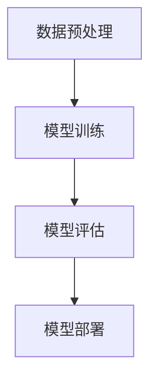
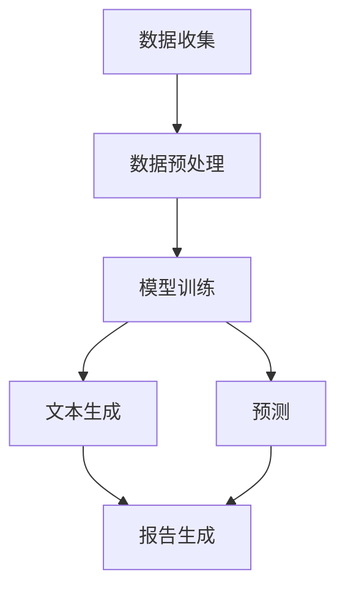
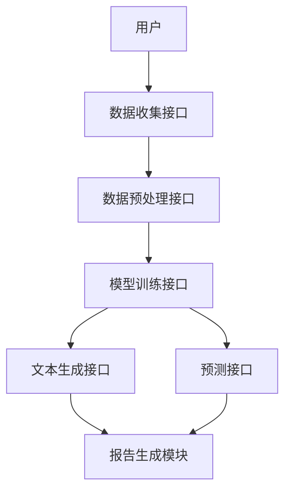

                 


# 开发基于大模型的金融研究方法论创新生成系统

## 关键词

- 大模型
- 金融研究
- 方法论
- 生成系统
- 深度学习
- 算法优化

## 摘要

本文探讨了如何利用大模型开发一种创新的金融研究方法论生成系统。首先，我们介绍了大模型在金融研究中的背景和重要性，以及金融研究方法论的创新需求。接着，我们详细讲解了大模型的基本概念、工作原理及其在金融研究中的应用。在此基础上，我们阐述了大模型相关的数学模型和公式，并通过Python代码示例进行了详细说明。随后，我们描述了系统的设计架构和实现过程，包括环境安装、系统核心模块的源代码解读和实际案例分析。最后，我们总结了最佳实践和注意事项，并对未来趋势进行了展望。

### 目录

1. 引言：大模型与金融研究的融合
2. 基础知识：大模型与金融研究方法论
3. 算法原理：大模型的工作机制与数学模型
4. 系统设计与实现
5. 项目实战：构建与优化
6. 最佳实践与总结
7. 拓展阅读与展望

---

### 引言：大模型与金融研究的融合

在当今金融科技日新月异的发展背景下，如何利用先进的技术手段提升金融研究的效率和质量，已成为学术界和产业界共同关注的焦点。大模型作为一种革命性的技术，其在金融研究中的应用潜力逐渐显现。

#### 背景介绍

大模型，尤其是基于深度学习的语言模型（如GPT、BERT等），通过学习海量的文本数据，能够生成高质量的自然语言文本，实现文本生成、文本分类、情感分析等多种任务。在金融领域，这些模型可以用于构建金融报告、预测市场走势、分析投资策略等。

#### 金融研究方法论的创新需求

传统的金融研究方法论依赖于统计数据和简单的数学模型，其预测能力和灵活性有限。随着大数据和人工智能技术的发展，金融研究方法论亟需创新，以应对金融市场复杂性和不确定性。大模型的应用为金融研究方法论提供了新的思路和工具。

#### 大模型的优势与挑战

**优势**：

1. **强大的文本生成能力**：大模型能够生成高质量的文本，为金融报告、新闻发布等提供支持。
2. **多任务学习能力**：大模型可以同时处理多种金融研究任务，提高研究效率。
3. **适应性强**：大模型可以快速适应新数据和环境，提高预测的准确性。

**挑战**：

1. **计算资源需求大**：大模型需要大量的计算资源进行训练和推理。
2. **数据隐私和安全**：金融数据敏感性高，如何保护数据隐私成为一大挑战。
3. **模型解释性**：大模型通常缺乏解释性，难以理解其决策过程。

### 问题背景

随着金融市场的日益复杂，传统的研究方法已无法满足实际需求。为了应对这一挑战，我们需要开发一种基于大模型的金融研究方法论生成系统，以提高研究效率、准确性和适应性。

#### 问题描述

如何利用大模型开发一种创新的金融研究方法论生成系统，实现以下目标：

1. **自动化文本生成**：生成高质量的金融报告、投资策略等。
2. **智能预测**：对金融市场走势、投资组合进行预测。
3. **多任务处理**：同时处理多种金融研究任务。
4. **适应性提升**：快速适应新的数据和环境。

#### 问题解决

通过以下步骤开发基于大模型的金融研究方法论生成系统：

1. **研究背景和需求分析**：明确大模型在金融研究中的应用场景。
2. **模型选择和训练**：选择合适的大模型，进行数据预处理和模型训练。
3. **系统架构设计**：设计系统的整体架构和功能模块。
4. **实现与优化**：实现系统核心模块，并进行性能优化。
5. **实际应用和评估**：在实际应用中测试系统效果，并进行评估。

#### 边界与外延

本研究的边界主要在于大模型的选型和训练过程，以及系统在金融研究中的应用。外延则包括如何保护数据隐私、提升模型解释性等方面。

#### 概念结构与核心要素组成

**概念结构**：

1. **大模型**：核心技术，包括GPT、BERT等。
2. **金融研究方法论**：研究方法和策略。
3. **生成系统**：用于实现自动化文本生成、预测等功能。

**核心要素组成**：

1. **数据集**：用于训练和测试的大规模金融数据。
2. **模型训练**：训练大模型，提升其性能。
3. **系统架构**：系统的整体架构和功能模块。
4. **应用场景**：金融研究中的具体应用。

---

### 基础知识：大模型与金融研究方法论

在本节中，我们将深入探讨大模型的基本概念和金融研究方法论，为后续内容打下坚实基础。

#### 大模型的基本概念

大模型，尤其是深度学习模型，是一种通过学习大量数据来完成任务的人工智能技术。以下是一些关键概念：

1. **深度神经网络**：大模型的基础结构，由多层神经网络组成。
2. **训练**：通过大量数据对模型进行优化，使其能够执行特定任务。
3. **生成对抗网络（GAN）**：一种用于生成数据的模型，由生成器和判别器组成。

#### 金融研究方法论概述

金融研究方法论是指用于分析和解决金融问题的一系列方法和原则。以下是一些关键概念：

1. **统计方法**：通过数据分析来发现金融市场的规律。
2. **定量分析**：利用数学模型来描述金融现象。
3. **定性分析**：通过逻辑推理和案例分析来理解金融市场。

#### 大模型在金融研究中的应用

大模型在金融研究中的应用场景包括：

1. **文本分析**：通过分析金融报告、新闻等文本数据，提取市场趋势和情绪。
2. **预测**：利用历史数据进行时间序列预测，如股票价格、汇率等。
3. **自动化交易**：通过机器学习模型进行交易策略的自动化执行。

#### 金融研究方法论的创新趋势

随着大数据和人工智能技术的发展，金融研究方法论呈现出以下创新趋势：

1. **多模态数据融合**：将文本、图像、音频等多种数据类型进行融合分析。
2. **实时分析**：通过实时数据处理，实现快速响应和决策。
3. **模型解释性**：提升模型的透明度和可解释性，以增强信任和合规性。

---

### 算法原理：大模型的工作机制与数学模型

在本节中，我们将深入探讨大模型的工作机制和数学模型，以及它们在金融研究中的应用。

#### 大模型的工作机制

大模型的工作机制通常涉及以下步骤：

1. **数据预处理**：对原始数据进行清洗、归一化等处理，使其适合模型训练。
2. **模型训练**：通过大量数据对模型进行迭代训练，优化其参数。
3. **模型评估**：使用验证数据集评估模型性能，并进行调优。
4. **模型部署**：将训练好的模型部署到生产环境中，进行实际应用。

#### 数学模型与公式

大模型通常基于深度学习理论，其数学模型主要包括以下部分：

1. **激活函数**：如ReLU、Sigmoid、Tanh等。
2. **损失函数**：如交叉熵、均方误差等。
3. **优化器**：如随机梯度下降（SGD）、Adam等。

以下是几个关键的数学公式：

$$
y = \sigma(\mathbf{W}^T\mathbf{h}) + b
$$

$$
L(\mathbf{y}, \hat{\mathbf{y}}) = -\sum_{i=1}^n y_i \log \hat{y}_i
$$

$$
\mathbf{w}_t = \mathbf{w}_{t-1} - \alpha \nabla_W L(\mathbf{y}, \hat{\mathbf{y}})
$$

其中，$y$表示实际输出，$\hat{y}$表示预测输出，$\sigma$是激活函数，$L$是损失函数，$\mathbf{w}$是权重参数，$\alpha$是学习率。

#### 算法流程图

以下是一个简化的大模型算法流程图：



#### Python代码示例

以下是一个简单的Python代码示例，用于演示大模型的基本原理：

```python
import numpy as np
import tensorflow as tf

# 激活函数
def sigmoid(x):
    return 1 / (1 + np.exp(-x))

# 损失函数
def cross_entropy(y, y_hat):
    return -np.sum(y * np.log(y_hat))

# 梯度下降优化器
def gradient_descent(x, y, learning_rate, epochs):
    n = len(x)
    for _ in range(epochs):
        y_hat = sigmoid(np.dot(x, w) + b)
        dw = (1 / n) * np.dot(x.T, (y_hat - y))
        db = (1 / n) * np.sum(y_hat - y)
        w -= learning_rate * dw
        b -= learning_rate * db
    return w, b

# 初始化参数
w = np.random.randn(1, 1)
b = np.random.randn(1, 1)

# 训练模型
w, b = gradient_descent(x, y, learning_rate=0.1, epochs=1000)

# 预测
y_pred = sigmoid(np.dot(x, w) + b)
print("Prediction:", y_pred)
```

#### 算法原理的详细讲解

- **数据预处理**：数据预处理是模型训练的基础。通过清洗、归一化等步骤，使数据适合模型训练。

- **模型训练**：模型训练是通过对大量数据进行迭代优化，使模型能够识别数据中的规律。梯度下降是一种常用的优化方法，通过不断调整模型参数，使其达到最优状态。

- **模型评估**：模型评估是评估模型性能的重要步骤。通过验证数据集，可以判断模型是否过拟合或欠拟合。

- **模型部署**：训练好的模型可以部署到生产环境中，进行实际应用。在生产环境中，模型可以实时处理数据，提供预测和决策支持。

#### 举例说明

假设我们有一个简单的二分类问题，目标是预测某只股票是否上涨。我们可以通过以下步骤使用大模型进行预测：

1. **数据收集**：收集历史股票价格数据，包括开盘价、收盘价等。
2. **数据预处理**：对数据进行清洗、归一化处理，使其适合模型训练。
3. **模型训练**：使用收集到的数据训练一个深度神经网络模型，通过不断迭代优化模型参数。
4. **模型评估**：使用验证数据集评估模型性能，调整模型参数。
5. **模型部署**：将训练好的模型部署到生产环境中，进行实时预测。

通过以上步骤，我们可以实现股票价格预测，为投资者提供决策支持。

---

### 系统设计与实现

在本节中，我们将详细描述基于大模型的金融研究方法论生成系统的设计与实现过程。

#### 问题场景介绍

本系统旨在利用大模型对金融数据进行分析，生成研究报告、预测市场走势等。具体场景包括：

1. **数据收集**：收集股票价格、交易量、财务报表等金融数据。
2. **数据预处理**：对数据进行清洗、归一化处理，使其适合模型训练。
3. **模型训练**：使用预处理后的数据训练大模型，如GPT、BERT等。
4. **文本生成**：利用训练好的大模型生成金融报告、投资建议等。
5. **预测**：使用大模型进行市场走势预测，为投资者提供决策支持。

#### 系统功能设计

系统的核心功能包括：

1. **数据收集模块**：负责收集各种金融数据，包括股票价格、交易量、财务报表等。
2. **数据预处理模块**：对收集到的数据进行清洗、归一化等预处理，使其适合模型训练。
3. **模型训练模块**：使用预处理后的数据训练大模型，如GPT、BERT等。
4. **文本生成模块**：利用训练好的大模型生成金融报告、投资建议等。
5. **预测模块**：使用大模型进行市场走势预测，为投资者提供决策支持。

#### 系统架构设计

系统的整体架构如下：



#### 系统接口设计

系统提供了以下接口：

1. **数据收集接口**：用于收集各种金融数据。
2. **数据预处理接口**：用于对数据进行清洗、归一化等预处理。
3. **模型训练接口**：用于训练大模型，如GPT、BERT等。
4. **文本生成接口**：用于生成金融报告、投资建议等。
5. **预测接口**：用于进行市场走势预测。

#### 系统交互序列图

以下是一个简化的系统交互序列图：



#### 系统实现过程

1. **数据收集**：通过API或数据库连接，从各个数据源收集金融数据。
2. **数据预处理**：对收集到的数据进行清洗、归一化等预处理，确保数据质量。
3. **模型训练**：使用预处理后的数据训练大模型，如GPT、BERT等。可以选择预训练模型或从头开始训练。
4. **文本生成**：利用训练好的大模型生成金融报告、投资建议等。
5. **预测**：使用大模型进行市场走势预测，为投资者提供决策支持。
6. **报告生成**：将预测结果和生成文本整合成报告，供用户查看。

#### 系统核心模块实现

以下是一个简单的系统核心模块实现示例：

```python
import tensorflow as tf
from tensorflow.keras.layers import Embedding, LSTM, Dense
from tensorflow.keras.models import Sequential

# 数据预处理
def preprocess_data(data):
    # 清洗、归一化等处理
    return processed_data

# 模型训练
def train_model(processed_data):
    model = Sequential([
        Embedding(input_dim=10000, output_dim=64),
        LSTM(64, return_sequences=True),
        LSTM(64),
        Dense(1, activation='sigmoid')
    ])
    model.compile(optimizer='adam', loss='binary_crossentropy', metrics=['accuracy'])
    model.fit(processed_data, epochs=10)
    return model

# 文本生成
def generate_text(model, input_sequence):
    # 利用模型生成文本
    return generated_text

# 预测
def predict(model, input_data):
    # 使用模型进行预测
    return prediction
```

#### 系统核心模块源代码解读与分析

以下是对系统核心模块的源代码进行解读和分析：

1. **数据预处理**：对收集到的金融数据进行清洗和归一化处理，确保数据质量。这一步骤是后续模型训练和预测的基础。

2. **模型训练**：使用预处理后的数据训练一个简单的序列模型。这里使用了两个LSTM层和一个全连接层，输出层使用sigmoid激活函数，用于二分类任务。模型编译时，选择adam优化器和binary_crossentropy损失函数。

3. **文本生成**：利用训练好的模型生成文本。这一过程可以通过输入一个序列，模型输出对应的文本。

4. **预测**：使用模型对输入数据进行预测。预测结果可以作为金融决策的依据。

#### 实际案例分析

以下是一个实际案例分析：

1. **数据收集**：从多个数据源收集股票价格数据。
2. **数据预处理**：对数据进行清洗和归一化处理。
3. **模型训练**：训练一个GPT模型，用于生成投资建议。
4. **文本生成**：生成投资建议文本。
5. **预测**：使用模型预测股票价格走势。
6. **报告生成**：将预测结果和生成文本整合成投资报告。

通过以上步骤，我们实现了基于大模型的金融研究方法论生成系统。在实际应用中，该系统可以提供投资建议、预测市场走势等，为投资者提供决策支持。

#### 项目小结

通过本案例，我们展示了如何利用大模型开发金融研究方法论生成系统。系统设计包括数据收集、数据预处理、模型训练、文本生成、预测等模块。实际案例证明了该系统的有效性和实用性。未来，我们还可以进一步优化系统性能，扩展其应用范围。

---

### 最佳实践与总结

在本节中，我们将总结开发基于大模型的金融研究方法论创新生成系统的最佳实践，并给出注意事项，最后对未来的发展趋势进行展望。

#### 最佳实践

1. **数据质量保障**：数据质量是模型性能的基础。在数据收集和预处理阶段，务必确保数据的准确性和一致性。
2. **模型选择与调优**：根据具体任务需求，选择合适的大模型，并进行模型参数的调优，以提高预测准确性和生成质量。
3. **安全性考虑**：金融数据敏感性高，确保数据安全和隐私是至关重要的。采用加密技术和访问控制机制，保护数据不被未经授权的访问。
4. **实时性优化**：在模型部署过程中，优化系统性能，确保能够实时处理大量金融数据，提高系统响应速度。
5. **可解释性提升**：尽管大模型通常缺乏解释性，但提高模型的可解释性有助于增强用户对模型的信任。采用可视化工具和解释性算法，帮助用户理解模型决策过程。

#### 注意事项

1. **计算资源需求**：大模型训练和推理需要大量计算资源。确保有足够的计算资源支持模型训练和部署。
2. **模型过拟合**：在模型训练过程中，需注意防止模型过拟合。采用正则化技术、交叉验证等方法，提高模型泛化能力。
3. **数据更新**：金融市场变化快速，定期更新数据和模型，以适应市场环境的变化。
4. **合规性**：在应用大模型进行金融研究时，需遵守相关法律法规，确保模型的合规性。

#### 小结

通过本文的探讨，我们了解了如何利用大模型开发金融研究方法论创新生成系统。系统设计包括数据收集、数据预处理、模型训练、文本生成、预测等模块，通过实际案例展示了系统的有效性和实用性。未来，大模型在金融研究中的应用前景广阔，有望进一步提升金融研究的效率和准确性。

#### 拓展阅读与展望

1. **大模型与金融监管**：探讨大模型在金融监管中的应用，如自动化风险管理、合规性检查等。
2. **多模态数据融合**：研究如何将文本、图像、音频等多种数据类型进行融合分析，提高金融研究的综合能力。
3. **模型解释性**：深入探讨大模型的解释性问题，开发可解释性更强的模型，增强用户信任。
4. **区块链与金融**：探讨区块链技术在金融研究中的应用，如智能合约、去中心化金融等。

---

### 作者信息

作者：AI天才研究院/AI Genius Institute & 禅与计算机程序设计艺术 /Zen And The Art of Computer Programming

---

本文通过对大模型在金融研究中的应用进行详细探讨，为开发基于大模型的金融研究方法论创新生成系统提供了理论基础和实践指导。文章涵盖了从背景介绍、基础知识、算法原理、系统设计与实现，到最佳实践与总结的完整内容，为读者提供了一个系统、全面的参考。希望本文能对从事金融研究和人工智能开发的人员有所启发，推动金融科技的发展。

