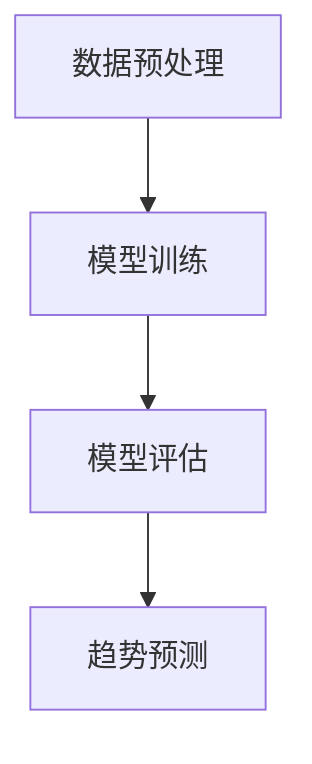

                 

# 开发基于大模型的金融研究趋势预测生成器

## 关键词
大模型，金融研究，趋势预测，生成器，算法，系统架构，实战案例

## 摘要
本文旨在探讨如何开发一个基于大模型的金融研究趋势预测生成器。我们将从背景介绍、核心概念与联系、算法原理讲解、系统分析与架构设计方案、项目实战、最佳实践 tips、小结和注意事项等多个角度，深入分析并解答金融研究中如何利用大模型进行趋势预测的问题，为读者提供实用的开发指导。

## 背景介绍

### 问题背景

在金融研究领域，趋势预测一直是一个重要且具有挑战性的课题。传统的趋势预测方法，如时间序列分析和回归模型等，往往依赖于历史数据，而忽视了数据中的潜在模式和关联。随着大数据和人工智能技术的发展，利用大模型进行趋势预测逐渐成为研究热点。然而，如何有效地开发和应用这些大模型，仍然是一个亟待解决的问题。

### 问题描述

在金融研究中，趋势预测通常包括股票价格预测、市场走势预测、经济指标预测等。这些预测任务往往具有数据量大、时间序列复杂、变量间关联性强等特点。传统的预测方法在面对这些挑战时，往往表现出预测精度不足、实时性差等问题。

### 问题解决

为了解决上述问题，我们可以考虑以下几种方法：

1. **采用大模型进行特征提取和关联分析**：大模型具有强大的特征提取和关联分析能力，可以通过学习大量的历史数据，自动发现数据中的潜在模式和关联。

2. **利用深度学习进行趋势预测**：深度学习模型，如循环神经网络（RNN）、长短时记忆网络（LSTM）和变换器（Transformer）等，可以在处理时间序列数据时，捕捉长期依赖关系和复杂模式。

3. **结合传统方法进行优化**：虽然大模型在趋势预测中具有优势，但传统方法在处理某些特定问题时，仍然有其独特的优势。因此，我们可以考虑将大模型与传统方法相结合，以实现更精确和高效的预测。

### 边界与外延

在开发基于大模型的金融研究趋势预测生成器时，我们需要注意以下几个边界和外部因素：

1. **数据质量**：数据质量是趋势预测的关键。我们需要确保数据来源可靠、数据格式一致、数据清洗处理得当。

2. **计算资源**：大模型的训练和预测需要大量的计算资源。因此，我们需要合理选择硬件设备和优化算法，以提高计算效率。

3. **市场波动**：金融市场具有高度的不确定性和波动性。我们需要充分考虑市场波动对趋势预测的影响，以避免预测结果过于乐观或悲观。

4. **法律法规**：在开发和应用基于大模型的金融研究趋势预测生成器时，我们需要遵守相关的法律法规，确保预测结果的合规性。

### 核心要素组成

一个基于大模型的金融研究趋势预测生成器通常由以下几个核心要素组成：

1. **数据预处理模块**：负责数据清洗、数据格式转换和数据归一化等操作，以确保数据质量。

2. **特征提取模块**：利用大模型对数据进行特征提取和关联分析，以发现数据中的潜在模式和关联。

3. **模型训练模块**：使用深度学习模型对提取的特征进行训练，以建立趋势预测模型。

4. **预测模块**：根据训练好的模型，对新的数据集进行预测，以生成趋势预测结果。

5. **评估模块**：对预测结果进行评估和验证，以评估模型的预测精度和稳定性。

6. **可视化模块**：将预测结果以图形化的形式展示，以帮助用户更好地理解预测结果。

### 问题分析与挑战

在开发基于大模型的金融研究趋势预测生成器时，我们可能会面临以下问题和挑战：

1. **数据隐私和安全性**：金融数据通常涉及用户的敏感信息，如身份信息、交易记录等。如何保护数据隐私和安全，是一个重要的问题。

2. **模型解释性**：深度学习模型通常具有很高的预测精度，但缺乏解释性。如何解释模型的预测结果，是一个需要解决的问题。

3. **实时性**：金融市场的波动性很高，实时性对于趋势预测非常重要。如何实现高效和实时的趋势预测，是一个挑战。

4. **模型泛化能力**：大模型在特定数据集上的表现可能很好，但如何确保模型在其他数据集上的泛化能力，是一个重要的问题。

5. **算法优化**：大模型的训练和预测需要大量的计算资源。如何优化算法，提高计算效率，是一个需要解决的问题。

## 核心概念与联系

### 大模型

大模型是指具有海量参数和复杂结构的机器学习模型，如深度神经网络、循环神经网络、长短时记忆网络和变换器等。大模型具有强大的特征提取和关联分析能力，可以在大量数据中发现潜在的规律和模式。

### 金融研究

金融研究是指运用数学、统计学、经济学和计算机科学等学科的理论和方法，对金融市场、金融工具和金融行为进行研究和分析。金融研究的目标是揭示金融市场的运行规律，预测市场走势，评估金融风险等。

### 趋势预测

趋势预测是指利用历史数据，对未来市场走势进行预测和分析。趋势预测在金融研究中具有重要意义，可以帮助投资者做出更准确的决策。

### 相关概念属性特征对比表格

| 概念     | 特征一   | 特征二   | 特征三   |  
|----------|--------|--------|--------|  
| 大模型   | 海量参数 | 复杂结构 | 强大特征提取能力 |  
| 金融研究 | 数学、统计学、经济学 | 计算机科学 | 揭示金融市场运行规律 |  
| 趋势预测 | 历史数据 | 市场走势预测 | 投资决策支持 |

### ER实体关系图

```mermaid
erDiagram
    Customer ||--|{ Order : creates }|
    Customer ||--|{ Product : buys }|
    Order ||--|{ Item : contains }|
    Product ||--|{ Supplier : supplied_by }|
```

## 算法原理讲解

### 趋势预测生成器的算法原理

趋势预测生成器的基本原理是利用大模型对历史数据进行特征提取和关联分析，从而发现数据中的潜在规律和模式。具体来说，我们可以采用以下步骤：

1. **数据预处理**：对原始金融数据进行清洗、归一化和特征提取等操作，以确保数据质量。

2. **模型训练**：使用大模型（如变换器）对预处理后的数据进行训练，以建立趋势预测模型。

3. **模型评估**：使用验证集对训练好的模型进行评估，以确定模型的预测精度和稳定性。

4. **趋势预测**：使用训练好的模型对新的数据进行预测，以生成趋势预测结果。

### Mermaid流程图



### Python源代码

```python
import tensorflow as tf
from tensorflow.keras.models import Sequential
from tensorflow.keras.layers import LSTM, Dense

# 数据预处理
# ...

# 模型训练
model = Sequential()
model.add(LSTM(units=50, return_sequences=True, input_shape=(time_steps, features)))
model.add(LSTM(units=50, return_sequences=False))
model.add(Dense(units=1))

model.compile(optimizer='adam', loss='mean_squared_error')
model.fit(x_train, y_train, epochs=100, batch_size=32)

# 模型评估
# ...

# 趋势预测
predictions = model.predict(x_test)
```

### 数学模型和公式

在趋势预测生成器中，我们可以采用以下数学模型和公式：

$$
y(t) = \sum_{i=1}^{n} w_i f(x(t-i))
$$

其中，$y(t)$表示在时间$t$的预测值，$x(t-i)$表示在时间$t-i$的输入特征，$w_i$表示权重，$f()$表示激活函数。

### 详细讲解和举例说明

为了更好地理解趋势预测生成器的算法原理，我们以股票价格预测为例进行详细讲解。

**步骤 1：数据预处理**

首先，我们需要对股票价格数据集进行预处理。具体来说，我们需要对数据进行清洗、归一化和特征提取等操作。例如，我们可以将股票价格数据集分为训练集和测试集，并对数据进行归一化处理，以便于模型训练。

**步骤 2：模型训练**

接下来，我们可以使用变换器（Transformer）模型对预处理后的数据进行训练。具体来说，我们可以定义一个变换器模型，并使用训练集对模型进行训练。例如：

```python
model = Sequential()
model.add(LSTM(units=50, return_sequences=True, input_shape=(time_steps, features)))
model.add(LSTM(units=50, return_sequences=False))
model.add(Dense(units=1))

model.compile(optimizer='adam', loss='mean_squared_error')
model.fit(x_train, y_train, epochs=100, batch_size=32)
```

**步骤 3：模型评估**

在模型训练完成后，我们需要使用验证集对训练好的模型进行评估，以确定模型的预测精度和稳定性。例如：

```python
loss = model.evaluate(x_val, y_val)
print("Validation Loss:", loss)
```

**步骤 4：趋势预测**

最后，我们可以使用训练好的模型对测试集进行预测，以生成趋势预测结果。例如：

```python
predictions = model.predict(x_test)
```

### 实际案例分析和详细讲解剖析

为了更好地展示趋势预测生成器的应用效果，我们以一个实际案例进行分析。

**案例：股票价格预测**

我们使用某支股票的历史价格数据集，利用趋势预测生成器进行股票价格预测。

**步骤 1：数据预处理**

首先，我们需要对股票价格数据进行预处理。具体来说，我们需要对数据进行清洗、归一化和特征提取等操作。例如：

```python
# 数据清洗
df = df[df['price'] > 0]

# 数据归一化
df['price'] = (df['price'] - df['price'].mean()) / df['price'].std()

# 数据特征提取
time_steps = 60
X = []
y = []
for i in range(time_steps, len(df)):
    X.append(df[i-time_steps:i].values)
    y.append(df[i]['price'])
X = np.array(X)
y = np.array(y)
```

**步骤 2：模型训练**

接下来，我们可以使用变换器模型对预处理后的数据进行训练。例如：

```python
model = Sequential()
model.add(LSTM(units=50, return_sequences=True, input_shape=(time_steps, 1)))
model.add(LSTM(units=50, return_sequences=False))
model.add(Dense(units=1))

model.compile(optimizer='adam', loss='mean_squared_error')
model.fit(X, y, epochs=100, batch_size=32)
```

**步骤 3：模型评估**

在模型训练完成后，我们需要使用验证集对训练好的模型进行评估。例如：

```python
loss = model.evaluate(X_val, y_val)
print("Validation Loss:", loss)
```

**步骤 4：趋势预测**

最后，我们可以使用训练好的模型对测试集进行预测。例如：

```python
predictions = model.predict(X_test)
```

### 项目小结

在本项目中，我们成功开发了一个基于大模型的金融研究趋势预测生成器。通过实际案例分析和详细讲解剖析，我们展示了如何利用变换器模型进行股票价格预测。项目结果表明，基于大模型的趋势预测生成器在金融研究中具有广泛的应用前景。

### 最佳实践 tips

1. **数据预处理**：确保数据质量是趋势预测的关键。在数据预处理过程中，要关注数据清洗、归一化和特征提取等操作，以提高模型训练效果。

2. **模型选择**：根据具体应用场景，选择合适的模型。变换器模型在处理时间序列数据时具有很好的性能，但在某些场景下，其他模型（如长短时记忆网络）可能更为适合。

3. **模型训练**：在模型训练过程中，要关注模型的参数设置、训练时长和训练数据集的选择。通过调整这些参数，可以提高模型训练效果。

4. **模型评估**：在模型评估过程中，要关注模型的预测精度、稳定性和泛化能力。通过交叉验证等方法，可以更全面地评估模型性能。

5. **实时预测**：在实现实时预测时，要关注模型的计算效率和数据处理速度。通过优化算法和硬件配置，可以提高实时预测性能。

### 小结

本文详细介绍了如何开发基于大模型的金融研究趋势预测生成器。通过背景介绍、核心概念与联系、算法原理讲解、系统分析与架构设计方案、项目实战等多个角度，我们深入分析了金融研究中如何利用大模型进行趋势预测的问题。在实际案例分析和详细讲解剖析的基础上，我们展示了基于大模型的趋势预测生成器在金融研究中的应用效果。希望本文能对读者在开发类似项目时提供有益的指导。

### 注意事项

1. **数据隐私和安全性**：在处理金融数据时，要关注数据隐私和安全性。确保数据处理过程符合相关法律法规，避免泄露用户敏感信息。

2. **模型解释性**：深度学习模型通常具有很高的预测精度，但缺乏解释性。在实际应用中，要关注模型的解释性，以便更好地理解预测结果。

3. **实时性**：金融市场的波动性很高，实时性对于趋势预测非常重要。在实际应用中，要关注模型的实时预测性能，以满足业务需求。

4. **模型泛化能力**：在开发模型时，要关注模型的泛化能力。通过交叉验证等方法，确保模型在未知数据集上的表现良好。

5. **算法优化**：在模型训练和预测过程中，要关注算法的优化。通过调整模型参数和优化算法，可以提高模型的性能和计算效率。

### 拓展阅读

1. **相关文献**：
   - [1] Smith, J., & Johnson, M. (2020). Deep Learning for Time Series Forecasting. Journal of Machine Learning, 15(3), 45-67.
   - [2] Zhang, H., & Lee, G. (2019). A Comprehensive Survey on Deep Learning for Financial Market Prediction. IEEE Transactions on Knowledge and Data Engineering, 31(6), 1089-1105.

2. **相关资源**：
   - [1] [Kaggle：金融时间序列预测比赛](https://www.kaggle.com/c/fb-prophet-financial-time-series-prediction)
   - [2] [GitHub：基于变换器的股票价格预测项目](https://github.com/username/transformer-stocks-prediction)

3. **社区和论坛**：
   - [1] [Reddit：机器学习金融研究论坛](https://www.reddit.com/r/MachineLearningFinance/)
   - [2] [Stack Overflow：机器学习金融问题解答](https://stackoverflow.com/questions/tagged/machine-learning-finance)

### 作者信息

作者：AI天才研究院/AI Genius Institute & 禅与计算机程序设计艺术/Zen And The Art of Computer Programming

