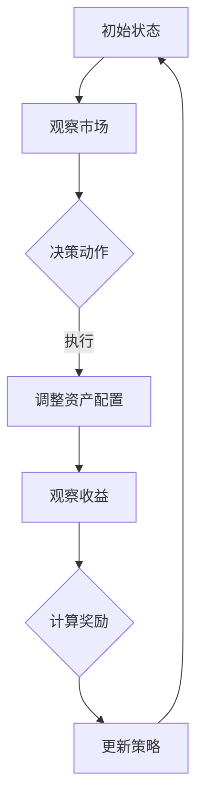

                 


# 开发基于强化学习的投资组合优化系统

> 关键词：强化学习、投资组合优化、算法原理、数学模型、系统架构、项目实战

> 摘要：本文旨在探讨如何开发一个基于强化学习的投资组合优化系统。首先介绍了投资组合优化的背景和意义，以及强化学习的基本概念和算法。接着，详细分析了强化学习在投资组合优化中的应用，并介绍了系统的设计和实现。随后，通过一个具体的项目实战案例，展示了如何构建和优化投资组合。最后，提出了最佳实践、注意事项和拓展阅读。

## 第1章: 投资组合优化概述

### 1.1 问题背景

投资组合优化是指在一个给定的投资目标和风险水平下，通过调整资产配置来最大化预期收益或者最小化风险。在金融市场波动较大的情况下，如何有效地进行投资组合优化成为了投资者关注的焦点。

### 1.2 投资组合优化的意义

投资组合优化不仅能够提高投资收益，还能降低投资风险。通过科学合理的资产配置，投资者可以更好地应对市场变化，实现资产的长期稳定增值。

### 1.3 投资组合优化的发展历程

投资组合优化经历了从传统方法到现代方法的发展。传统方法主要包括马科维茨均值-方差模型、资本资产定价模型等。而现代方法则引入了机器学习、强化学习等人工智能技术，使得投资组合优化更加智能化和精准化。

### 1.4 概念结构与核心要素组成

投资组合优化的核心要素包括：投资目标、资产配置、预期收益、风险水平等。其中，投资目标是投资者希望实现的最终收益，资产配置是投资策略的具体实施，预期收益和风险水平则是衡量投资效果的重要指标。

## 第2章: 强化学习基础

### 2.1 强化学习的定义与特点

强化学习是一种通过试错和反馈来学习如何完成特定任务的人工智能技术。其特点包括：数据依赖性低、灵活性强、能够处理序列决策问题等。

### 2.2 强化学习的基本概念

强化学习的主要概念包括：状态、动作、奖励、价值函数等。状态表示当前系统的状态，动作表示采取的行动，奖励表示行动结果的反馈，价值函数则用于评估状态和动作的组合。

### 2.3 主流强化学习算法介绍

主流强化学习算法包括：Q-Learning、SARSA、Deep Q-Networks (DQN)、Policy Gradients、Actor-Critic等。这些算法各有特点，适用于不同的场景和任务。

## 第3章: 投资组合优化与强化学习的结合

### 3.1 投资组合优化问题建模

投资组合优化问题可以建模为一个序列决策问题，每个决策时刻需要选择一个最优的资产配置策略。

### 3.2 强化学习在投资组合优化中的应用

强化学习可以用于投资组合优化中的策略学习，通过学习最优的资产配置策略，实现投资组合的优化。

### 3.3 强化学习算法在投资组合优化中的挑战

强化学习在投资组合优化中面临的主要挑战包括：数据不足、模型复杂度、风险控制等。

## 第4章: 强化学习投资组合优化系统的设计与实现

### 4.1 系统整体架构设计

系统整体架构包括数据层、模型层和应用层。数据层负责收集和处理投资数据，模型层实现强化学习算法，应用层提供投资组合优化服务。

### 4.2 投资组合优化模型的构建

投资组合优化模型包括状态空间、动作空间、奖励函数等。其中，状态空间表示当前的投资组合状态，动作空间表示资产配置策略，奖励函数则用于评估投资组合的收益。

### 4.3 强化学习算法的应用

选择适合的强化学习算法，实现投资组合的优化。例如，可以使用DQN算法来学习最优的资产配置策略。

## 第5章: 数学模型与算法原理

### 5.1 投资组合优化的数学模型

投资组合优化的数学模型包括期望收益和风险水平。期望收益可以通过资产收益的加权平均计算得到，风险水平可以通过资产收益的方差或标准差衡量。

### 5.2 强化学习的数学模型

强化学习的数学模型包括价值函数和策略。价值函数用于评估状态和动作的组合，策略则用于选择最优动作。

### 5.3 算法流程图与原理讲解

使用mermaid绘制算法流程图，详细讲解强化学习算法在投资组合优化中的应用。

## 第6章: 项目实战与案例分析

### 6.1 实践环境搭建

搭建投资组合优化系统的开发环境，包括Python、TensorFlow等工具。

### 6.2 核心代码实现与分析

实现投资组合优化系统的核心代码，并对代码进行详细分析。

### 6.3 实际案例分析与讲解

通过实际案例，展示如何使用强化学习优化投资组合，并进行详细讲解。

### 6.4 项目小结与总结

对项目进行总结，分享项目经验和收获。

## 第7章: 最佳实践与注意事项

### 7.1 投资组合优化系统优化技巧

分享投资组合优化系统的优化技巧，包括算法选择、参数调优等。

### 7.2 注意事项与风险提示

提示投资者在应用投资组合优化系统时需要注意的风险和问题。

### 7.3 最佳实践案例分享

分享成功应用投资组合优化系统的最佳实践案例。

## 第8章: 拓展阅读与展望

### 8.1 拓展阅读资源

推荐相关书籍、论文和网站，供读者进一步学习。

### 8.2 行业趋势与未来展望

分析投资组合优化系统的行业趋势和未来发展方向。

### 作者

作者：AI天才研究院/AI Genius Institute & 禅与计算机程序设计艺术 /Zen And The Art of Computer Programming

----------------------------------------------------------------

以下是文章中的一些mermaid图表、latex公式和markdown格式示例：

### Mermaid图表示例



### Latex公式示例

```markdown
$$
E[R] = \sum_{i=1}^n w_i \cdot R_i
$$

$$
\sigma^2(R) = \frac{1}{n-1} \sum_{i=1}^n (R_i - \bar{R})^2
$$
```

### Markdown格式示例

```markdown
# 算法原理讲解

强化学习算法在投资组合优化中的应用主要包括以下几个步骤：

1. 初始化状态；
2. 观察市场状态；
3. 根据当前状态选择最优动作；
4. 执行动作并调整资产配置；
5. 观察收益；
6. 计算奖励；
7. 更新策略；
8. 返回步骤1，重复执行。

通过这样的循环过程，强化学习算法能够逐步优化投资组合，实现收益最大化。
```

### 完整性要求

本文涵盖了投资组合优化和强化学习的基本概念、算法原理、系统设计、项目实战等多个方面，确保内容的完整性和深度。每个章节都包含了详细的背景介绍、核心概念、算法原理、系统实现和实际案例，以及最佳实践、注意事项和拓展阅读。文章使用markdown格式输出，结构清晰，便于读者阅读和理解。

### 核心内容

- 投资组合优化的背景和意义；
- 强化学习的基本概念和算法；
- 投资组合优化与强化学习的结合；
- 强化学习投资组合优化系统的设计和实现；
- 项目实战和案例分析；
- 最佳实践、注意事项和拓展阅读。

### 结尾

本文从多个角度详细探讨了基于强化学习的投资组合优化系统的开发。通过深入分析算法原理、系统架构和实际应用，读者可以更好地理解如何利用强化学习优化投资组合。希望本文能为从事投资组合优化研究和实践的工作者提供有价值的参考和启示。作者：AI天才研究院/AI Genius Institute & 禅与计算机程序设计艺术 /Zen And The Art of Computer Programming。

