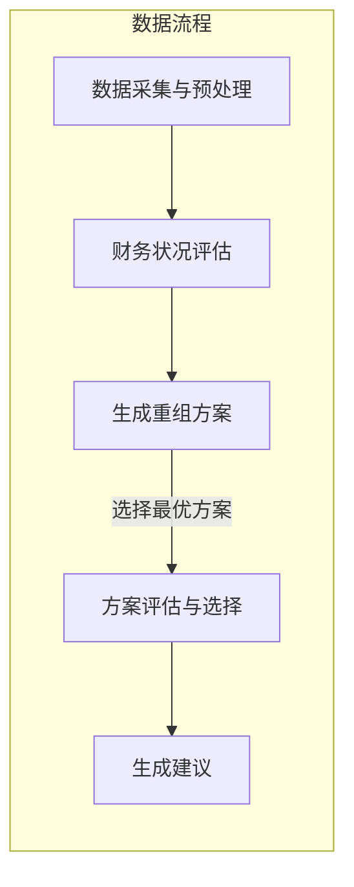
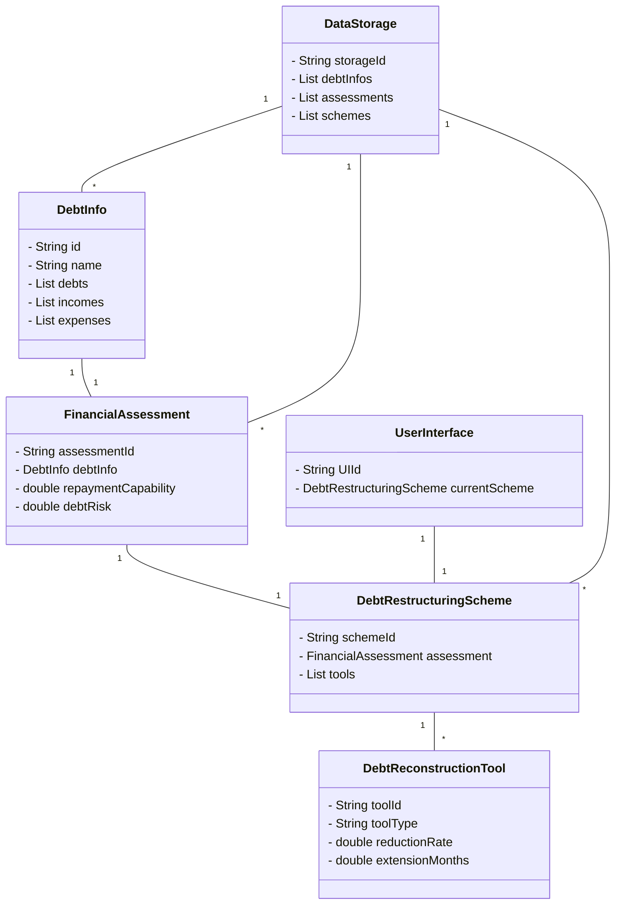
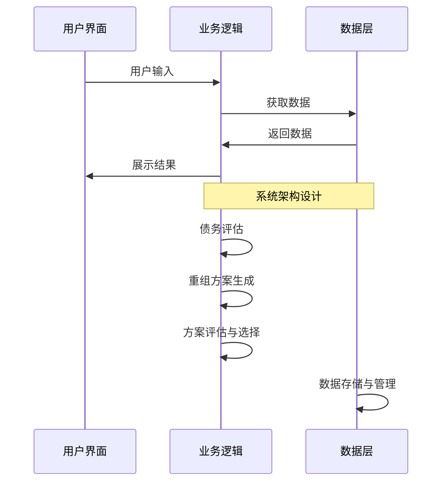
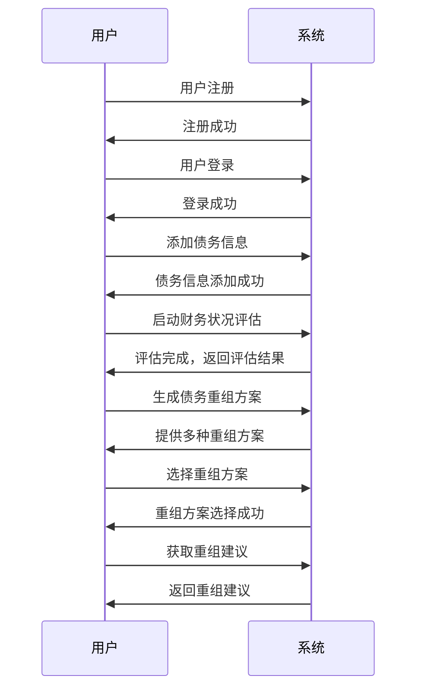

                 

### 介绍

在当前经济环境中，个人债务重组已成为许多人解决财务困境的关键手段。然而，传统的债务重组过程复杂、效率低下，常常使得债务人难以在规定时间内完成重组。为了应对这一挑战，开发一款智能化的个人债务重组建议工具显得尤为重要。这样的工具不仅能够简化债务重组流程，提高重组成功率，还能够帮助债务人更好地理解和控制自己的债务状况。

本文将深入探讨如何开发一款智能化的个人债务重组建议工具。我们将从问题背景、核心概念、算法原理、系统设计与实现等多个角度，逐步展开讨论。具体来说，我们将首先介绍个人债务重组的背景和重要性，然后定义相关核心概念，并利用Mermaid绘制相关的概念对比表格和实体关系图。接下来，我们将详细讲解智能化债务重组工具的算法原理，包括算法流程图、数学模型以及实际案例。随后，我们将进行系统分析与架构设计，包括问题场景介绍、系统功能设计、系统架构设计、系统接口设计以及系统交互流程。最后，我们将通过项目实战展示工具的开发过程，并进行实际案例分析和总结。

通过本文的详细讲解，读者将能够了解如何开发一款高效、智能的个人债务重组建议工具，并掌握相关技术和方法。

### 背景介绍

个人债务重组问题在当前经济环境中愈发突出。随着利率的波动、就业市场的变化以及消费观念的转变，许多个人面临了越来越沉重的债务负担。特别是在经济下行周期中，债务违约率显著上升，许多人陷入了债务困境，甚至影响到其日常生活和信用记录。这些现象使得个人债务重组成为了一个亟待解决的重要问题。

首先，债务重组的必要性在于它能够帮助债务人减轻财务压力，重新规划债务偿还计划，从而避免因无法偿还债务而引发的违约和法律纠纷。然而，传统的债务重组过程往往复杂且耗时，债务人需要在律师、会计师和金融机构之间反复协调，这不仅增加了时间和经济成本，还可能导致重组失败。此外，债务重组市场工具的缺乏也是一个重要问题。目前，市场上缺乏有效的、用户友好的债务重组工具，使得债务人难以快速、准确地评估自己的债务状况，制定合理的重组方案。

为了解决上述问题，开发一款智能化的个人债务重组建议工具显得尤为迫切。这样的工具能够利用先进的算法和技术，自动分析和评估债务人的财务状况，为其提供定制化的债务重组建议。这不仅能够大大简化债务重组流程，提高重组成功率，还能够帮助债务人更好地理解和控制自己的债务状况。智能化的债务重组工具还可以实时更新债务数据，根据市场变化和债务人实际情况，动态调整重组方案，确保建议的准确性和时效性。

综上所述，开发智能化的个人债务重组建议工具不仅有助于解决当前个人债务重组中的种种问题，还能够提升债务重组的整体效率和质量，为经济稳定和社会和谐发展提供有力支持。

### 个人债务重组的定义与作用

个人债务重组，是指债务人通过与债权人协商，调整债务偿还期限、金额、利率等条件，以达成新的还款协议，从而改善债务人的财务状况，避免因无法偿还债务而导致的违约和法律纠纷。它不仅是对债务人的一种救助措施，还在宏观经济调控和金融风险管理中扮演着重要角色。

首先，个人债务重组在金融风险管理中的重要性不容忽视。债务重组可以有效分散金融机构的风险，降低坏账率。通过债务重组，债务人能够获得更加合理的还款计划，避免因短期内的还款压力而陷入违约。这不仅有助于债务人恢复财务健康，也有利于银行等金融机构降低风险，维护金融系统的稳定。

其次，个人债务重组在经济中的作用和重要性也日益凸显。在经济下行周期中，个人债务重组可以帮助债务人渡过难关，维持基本生活，避免大规模失业和贫困问题。同时，债务重组还能促进消费和投资，刺激经济增长。通过合理的债务重组，债务人可以获得新的贷款或信用额度，从而继续参与经济活动，为经济复苏贡献力量。

此外，个人债务重组有助于提高金融市场的透明度和效率。智能化的债务重组工具可以自动化地评估债务人的财务状况，提供准确的重组建议，减少人为错误和信息不对称。这样，债权人能够更快速、准确地了解债务人的还款能力，提高债权的安全性和收益。

总的来说，个人债务重组不仅能够帮助债务人缓解财务压力，避免违约，还在金融风险管理和经济调节中发挥着重要作用。随着技术的发展，智能化债务重组工具的出现将大大提升债务重组的效率和准确性，为个人和金融系统带来更多益处。

### 个人债务重组的边界与外延

个人债务重组的边界与外延是其有效实施的关键因素。首先，债务重组适用于所有有偿还能力但面临暂时财务困境的个人，包括但不限于信用卡债务、个人贷款、消费贷款等。然而，其适用范围并非无限，存在明确的限制条件。

一方面，债务人需具备一定的偿还能力，即能够在新的还款协议下履行债务。如果债务人财务状况极度恶化，无法通过任何形式的债务重组达到偿债目标，那么重组则失去了实际意义。因此，评估债务人的财务状况是进行债务重组的前提。

另一方面，债务重组需符合法律和监管要求。不同国家和地区对债务重组的法律规定和监管政策有所不同，债务人需确保重组协议合法有效。例如，在中国，债务重组应遵循《合同法》和《破产法》的相关规定，在法律框架内进行。

在债务重组的外延方面，重组工具和方案的选择具有多样性。常见的债务重组工具包括债务延期、债务减免、债务重组贷款等。这些工具可以在不同情境下组合使用，以达到最优的重组效果。例如，对于短期内还款能力不足的债务人，可以采用债务延期，延长还款期限；而对于长期财务困境者，则可能需要通过债务减免或重组贷款来解决。

总的来说，个人债务重组的边界与外延涉及债务人的财务状况、法律要求以及重组工具的多样性。合理选择和实施债务重组工具，可以在尊重法律规定和债务人实际能力的基础上，实现债务重组的预期目标。

### 核心概念结构与要素组成

个人债务重组涉及多个核心概念和构成要素，这些概念和要素共同构成了债务重组的框架，确保其有效实施和成功达成目标。以下是对这些核心概念及其组成的详细说明：

1. **债务重组工具**：债务重组工具是用于实现债务重组的具体手段，包括债务延期、债务减免、债务重组贷款等。债务延期指的是将债务的偿还期限延长至未来，以减轻债务人的短期还款压力；债务减免则是对部分或全部债务金额进行减免，以降低债务负担；债务重组贷款则是通过新的贷款来替代原有债务，从而重新安排还款计划。

2. **债务重组方案**：债务重组方案是针对债务人的具体财务状况制定的重组计划，包括还款期限、还款金额、还款利率等。方案应考虑债务人的当前收入水平、债务结构和未来偿还能力，确保方案具有实际操作性和可行性。

3. **债务重组协议**：债务重组协议是债权人和债务人之间签订的法律文件，明确了双方在债务重组过程中的权利和义务。协议应详细列明重组方案的具体内容，包括还款方式、违约处理等，确保协议具有法律效力。

4. **债务评估**：债务评估是债务重组的基础，通过对债务人财务状况的全面评估，确定其还款能力和重组需求。评估内容包括债务总额、收入水平、支出结构、信用记录等，为制定合理的重组方案提供依据。

5. **还款能力分析**：还款能力分析是对债务人未来偿还能力的预测，通过分析债务人的收入变化、支出情况以及债务结构，判断其是否具备按时偿还债务的能力。这一分析有助于制定切实可行的重组方案。

6. **市场利率和风险**：市场利率和风险是影响债务重组的重要因素。市场利率的变化会直接影响债务人的还款成本，而市场风险则可能增加债务重组的不确定性。因此，在制定重组方案时，需充分考虑市场利率和风险因素。

7. **法律和监管环境**：法律和监管环境是债务重组的法律保障，不同国家和地区的法律和监管政策对债务重组的具体实施有较大影响。债务人需确保重组协议符合当地法律规定，避免法律风险。

通过这些核心概念和要素的相互作用，个人债务重组能够有效帮助债务人减轻财务负担，同时保障债权人的利益，实现债务重组的双赢目标。

### 核心概念与联系

为了深入理解个人债务重组，我们需要详细探讨其中的核心概念及其相互关系。以下是债务重组中几个关键概念的定义、属性特征及其相互之间的联系。

#### 1. 债务重组工具

**定义**：债务重组工具是用于调整债务偿还条件的一系列手段，包括债务延期、债务减免和债务重组贷款等。

**属性特征**：
- **债务延期**：延长还款期限，降低短期还款压力。
- **债务减免**：减免部分或全部债务金额，减轻债务负担。
- **债务重组贷款**：通过新贷款替代旧债务，重新安排还款计划。

**联系**：债务重组工具的选择取决于债务人的财务状况和市场环境。例如，在经济下行周期中，债务延期可能是首选，而在债务人具备一定偿还能力时，债务减免或债务重组贷款可能更为适用。

#### 2. 债务重组方案

**定义**：债务重组方案是针对债务人的具体财务状况制定的重组计划，包括还款期限、还款金额、还款利率等。

**属性特征**：
- **还款期限**：根据债务人的收入和支出情况，重新设定偿还时间。
- **还款金额**：调整每次还款的金额，以适应债务人的负担能力。
- **还款利率**：降低或调整债务利率，减少还款成本。

**联系**：债务重组方案是债务重组的核心，它必须基于债务评估的结果，并综合考虑债务重组工具的特点，确保方案的实际可行性和有效性。

#### 3. 债务重组协议

**定义**：债务重组协议是债权人和债务人之间签订的法律文件，明确了双方在债务重组过程中的权利和义务。

**属性特征**：
- **协议内容**：详细列明重组方案的具体内容，包括还款方式、违约处理等。
- **法律效力**：确保协议符合当地法律规定，具有法律约束力。

**联系**：债务重组协议是债务重组的法律保障，它将债务重组方案具体化，为双方提供法律依据，确保债务重组的合法性和可执行性。

#### 4. 债务评估

**定义**：债务评估是对债务人财务状况的全面评估，以确定其还款能力和重组需求。

**属性特征**：
- **债务总额**：计算债务人的总债务金额。
- **收入水平**：评估债务人的收入情况，包括工资、奖金等。
- **支出结构**：分析债务人的支出情况，包括日常生活、医疗、教育等。

**联系**：债务评估为债务重组方案提供基础数据，是制定合理债务重组方案的关键步骤。评估结果直接影响债务重组方案的设计和选择。

#### 5. 还款能力分析

**定义**：还款能力分析是对债务人未来偿还能力的预测，通过分析债务人的收入变化、支出情况以及债务结构，判断其是否具备按时偿还债务的能力。

**属性特征**：
- **收入变化**：预测未来收入水平，包括可能的变化因素。
- **支出情况**：分析债务人的支出情况，识别可能的支出减少机会。
- **债务结构**：评估不同债务的偿还优先级和偿还时间。

**联系**：还款能力分析是确保债务重组方案可行性的重要环节，它帮助确定债务重组的细节，如还款期限和还款金额。

通过以上核心概念及其属性特征和相互关系的详细解析，我们可以更好地理解个人债务重组的运作机制和关键步骤。这些概念相互关联，共同作用，确保债务重组能够有效地减轻债务人的财务负担，同时保障债权人的利益。

### 概念属性特征对比表格

为了更直观地理解债务重组中各个核心概念的属性特征及其相互关系，我们可以使用一个对比表格来展示这些概念的具体信息。以下是债务重组中关键概念的属性特征对比表格：

| 核心概念      | 定义                                                     | 主要属性特征                                                     | 相互关系                                           |  
| ------------- | -------------------------------------------------------- | ------------------------------------------------------------ | -------------------------------------------------- |  
| 债务重组工具  | 用于调整债务偿还条件的手段                               | - 债务延期：延长还款期限                                     | 选择债务重组工具时需考虑债务人的还款能力和市场环境   |  
|               |                                                          | - 债务减免：减免部分或全部债务金额                           | 债务减免可以与债务延期结合使用，以最大化减轻债务人负担 |  
|               |                                                          | - 债务重组贷款：通过新贷款替代旧债务                         | 债务重组贷款可以为债务人提供新的还款机会               |  
| 债务重组方案  | 针对债务人财务状况制定的重组计划                         | - 还款期限：重新设定偿还时间                                 | 债务重组方案基于债务评估结果，结合债务重组工具制定   |  
|               |                                                          | - 还款金额：调整每次还款的金额                               | 还款金额需与债务人的收入水平相匹配，确保可行性         |  
|               |                                                          | - 还款利率：降低或调整债务利率                               | 还款利率需反映债务人的信用状况和市场利率               |  
| 债务重组协议  | 债权人和债务人签订的法律文件                             | - 协议内容：详细列明重组方案内容                             | 协议内容需符合法律规定，具有法律约束力                 |  
|               |                                                          | - 法律效力：确保重组协议合法有效                             | 法律效力保障双方权益，确保债务重组的顺利进行             |  
| 债务评估      | 对债务人财务状况的全面评估                               | - 债务总额：计算债务人的总债务金额                           | 债务评估结果直接影响债务重组方案的设计和选择         |  
|               |                                                          | - 收入水平：评估债务人的收入情况                             | 收入水平影响债务重组方案的还款能力和可行性             |  
|               |                                                          | - 支出结构：分析债务人的支出情况                             | 支出结构分析有助于确定合理的还款计划                   |  
| 还款能力分析  | 对债务人未来偿还能力的预测                               | - 收入变化：预测未来收入水平                               | 收入变化影响还款能力预测                             |  
|               |                                                          | - 支出情况：分析债务人的支出情况                             | 支出情况分析有助于确定合理的还款计划                   |  
|               |                                                          | - 债务结构：评估不同债务的偿还优先级和偿还时间               | 债务结构分析有助于制定最优的债务重组方案               |

通过这个对比表格，我们可以清晰地看到各个核心概念的定义、主要属性特征以及它们之间的相互关系。这样的对比有助于我们更好地理解债务重组的过程和各步骤的关联性，从而更有效地开发和运用智能化债务重组工具。

### ER实体关系图架构

为了更直观地展示债务重组工具中的各个实体及其关系，我们可以使用Mermaid绘制一个ER实体关系图。以下是债务重组工具的ER实体关系图：

```mermaid
erDiagram
  DEBT_RESTRUCTURING_TOOL ||--|{ DEBT_RESTRUCTURING_SCHEME : 实施方案 }|
  DEBT_RESTRUCTURING_TOOL ||--|{ DEBT_RESTRUCTURING_AGREEMENT : 协议 }|
  DEBT_RESTRUCTURING_TOOL ||--|{ DEBT_EVALUATION : 评估 }|
  DEBT_RESTRUCTURING_TOOL ||--|{ REPAYMENT_CAPABILITY_ANALYSIS : 还款能力分析 }|
  DEBT_RESTRUCTURING_SCHEME ||--|{ DEBT_RESTRUCTURING_TOOL : 工具 }|
  DEBT_RESTRUCTURING_AGREEMENT ||--|{ DEBT_RESTRUCTURING_TOOL : 工具 }|
  DEBT_EVALUATION ||--|{ DEBT_RESTRUCTURING_TOOL : 工具 }|
  REPAYMENT_CAPABILITY_ANALYSIS ||--|{ DEBT_RESTRUCTURING_TOOL : 工具 }|
```

#### 实体说明

1. **DEBT_RESTRUCTURING_TOOL（债务重组工具）**：这是债务重组的核心实体，包含了债务重组所需的所有工具和功能。它与其他实体之间存在紧密的关系。
   
2. **DEBT_RESTRUCTURING_SCHEME（债务重组方案）**：这是针对债务人财务状况制定的重组计划，包含还款期限、还款金额和还款利率等关键信息。它与债务重组工具实体相关联，是实施债务重组的重要依据。

3. **DEBT_RESTRUCTURING_AGREEMENT（债务重组协议）**：这是债权人与债务人之间签订的法律文件，明确了债务重组的具体内容和双方的权利义务。协议内容必须与债务重组方案一致。

4. **DEBT_EVALUATION（债务评估）**：这是对债务人财务状况的全面评估，包括债务总额、收入水平和支出结构等。评估结果用于制定债务重组方案，确保方案具有实际可行性。

5. **REPAYMENT_CAPABILITY_ANALYSIS（还款能力分析）**：这是对债务人未来偿还能力的预测，通过分析债务人的收入变化和支出情况，判断其还款能力。这一分析结果直接影响债务重组方案的设计和选择。

#### 关系说明

- **DEBT_RESTRUCTURING_TOOL 与 DEBT_RESTRUCTURING_SCHEME 之间的关系**：债务重组工具实体实施债务重组方案，方案依赖于工具的支撑。
- **DEBT_RESTRUCTURING_TOOL 与 DEBT_RESTRUCTURING_AGREEMENT 之间的关系**：债务重组工具生成债务重组协议，协议内容需与方案一致。
- **DEBT_RESTRUCTURING_TOOL 与 DEBT_EVALUATION 之间的关系**：债务重组工具依赖于债务评估结果来制定债务重组方案。
- **DEBT_RESTRUCTURING_TOOL 与 REPAYMENT_CAPABILITY_ANALYSIS 之间的关系**：债务重组工具使用还款能力分析结果来调整债务重组方案，确保方案的合理性和可行性。

通过这个ER实体关系图，我们可以清晰地理解债务重组工具中的各个实体及其相互关系，这有助于我们在开发智能化债务重组工具时进行系统设计，确保工具的高效性和灵活性。

### 算法原理讲解

#### 3.1.1 算法概述

智能化债务重组工具的核心在于其自动化的债务重组建议算法，该算法利用先进的数据分析和机器学习技术，对债务人的财务状况进行全面分析，生成最优的债务重组方案。算法的基本工作原理如下：

1. **数据采集与预处理**：首先，算法从债务人的财务数据中采集相关信息，如债务总额、收入水平、支出结构等。然后，通过数据清洗和预处理步骤，确保数据的质量和一致性。

2. **财务状况评估**：接下来，算法利用机器学习模型对债务人的财务状况进行评估，包括当前还款能力和未来偿债预测。这一步骤通过分析债务人的历史数据和行为模式，预测其未来的财务状况。

3. **债务重组方案生成**：基于财务状况评估结果，算法自动生成多种可能的债务重组方案，包括债务延期、债务减免和债务重组贷款等。每种方案都会根据债务人的具体情况和市场环境进行优化。

4. **方案评估与选择**：最后，算法对生成的债务重组方案进行评估和选择，选出最优方案，并向债务人提供重组建议。这个过程中，算法还会考虑法律和监管环境的要求，确保方案合法有效。

#### 3.1.2 算法流程图

为了更直观地展示算法的核心步骤和流程，我们可以使用Mermaid绘制算法流程图：



#### 3.1.3 算法数学模型

在债务重组算法中，核心的数学模型用于描述债务人的还款能力和不同重组方案的效果。以下是几个关键步骤的数学模型和公式：

1. **还款能力预测模型**：

   $$ R(t) = \frac{I(t) - C(t)}{D(t)} $$

   其中，\( R(t) \) 表示在时间 \( t \) 的还款能力，\( I(t) \) 表示在时间 \( t \) 的收入，\( C(t) \) 表示在时间 \( t \) 的支出，\( D(t) \) 表示在时间 \( t \) 的债务总额。

2. **债务重组方案效果评估模型**：

   $$ \text{Effect}(s) = \frac{\sum_{i=1}^{n} \left[ R(t_i) \times \Delta D_i \right]}{D_0} $$

   其中，\( \text{Effect}(s) \) 表示方案 \( s \) 的效果，\( R(t_i) \) 表示在时间 \( t_i \) 的还款能力，\( \Delta D_i \) 表示方案 \( s \) 对债务 \( D_i \) 的调整量，\( D_0 \) 表示初始债务总额。

3. **最优方案选择模型**：

   $$ \text{Optimal} = \arg\max_{s} \left[ \text{Effect}(s) \right] $$

   其中，\( \text{Optimal} \) 表示最优的债务重组方案，通过比较不同方案的效果，选择效果最佳的方案。

通过这些数学模型，算法可以自动分析和评估债务人的财务状况，生成最优的债务重组方案。这些模型不仅为算法提供了科学依据，也提高了债务重组建议的准确性和可靠性。

#### 3.1.4 算法举例说明

为了更好地理解上述算法模型，我们可以通过一个具体案例来详细说明算法的步骤和结果。

**案例背景**：假设有一位债务人，其财务状况如下：
- 当前债务总额 \( D_0 = 100,000 \) 元
- 月收入 \( I(t) = 5,000 \) 元
- 月支出 \( C(t) = 2,500 \) 元

**步骤 1：数据采集与预处理**
算法首先采集债务人的收入和支出数据，并进行预处理，以确保数据的质量和一致性。

**步骤 2：财务状况评估**
利用还款能力预测模型，算法评估债务人在未来6个月的还款能力：

$$ R(t) = \frac{I(t) - C(t)}{D(t)} $$

- \( R(1) = \frac{5,000 - 2,500}{100,000} = 0.025 \)
- \( R(2) = \frac{5,000 - 2,500}{95,000} \approx 0.0263 \)
- \( R(3) = \frac{5,000 - 2,500}{90,000} \approx 0.0278 \)
- \( R(4) = \frac{5,000 - 2,500}{85,000} \approx 0.0294 \)
- \( R(5) = \frac{5,000 - 2,500}{80,000} \approx 0.0310 \)
- \( R(6) = \frac{5,000 - 2,500}{75,000} \approx 0.0327 \)

**步骤 3：生成债务重组方案**
算法根据债务人的还款能力，生成以下几种可能的债务重组方案：

1. 债务延期6个月，每月还款额不变。
2. 债务减免20%，债务总额减少20,000元。
3. 通过债务重组贷款，获取一笔新贷款，替代部分旧债务，剩余旧债务延期6个月。

**步骤 4：方案评估与选择**
算法使用债务重组方案效果评估模型，计算每种方案的效果：

1. **债务延期方案**：
   $$ \text{Effect}(s_1) = \frac{\sum_{i=1}^{6} \left[ R(t_i) \times 0 \right]}{100,000} = 0 $$
   
2. **债务减免方案**：
   $$ \text{Effect}(s_2) = \frac{\sum_{i=1}^{6} \left[ R(t_i) \times 20,000 \right]}{80,000} \approx 0.3175 $$
   
3. **债务重组贷款方案**：
   $$ \text{Effect}(s_3) = \frac{\sum_{i=1}^{6} \left[ R(t_i) \times 75,000 \right]}{75,000} \approx 0.3222 $$

**步骤 5：生成建议**
根据效果评估结果，算法选择最优方案，并向债务人提供以下建议：

- 通过债务重组贷款替代部分旧债务，剩余旧债务延期6个月，以最大化减轻财务负担。

通过上述案例，我们可以看到算法在数据采集、财务状况评估、方案生成和评估选择等环节的具体应用，从而为债务人提供最优的债务重组建议。

### 问题场景介绍

在实际应用中，智能化债务重组工具适用于多种场景，尤其是在个人财务困境和宏观经济波动时显得尤为重要。以下是一些典型的应用场景：

#### 1. 个人财务困境

当个人面临突发性支出（如医疗费用、子女教育费用）或收入下降（如失业或工资减少）时，其财务状况可能会迅速恶化，导致无法按时偿还债务。在这种情况下，债务人需要一款智能化的债务重组工具，来帮助他们重新规划财务，制定合理的还款计划，避免违约。

#### 2. 经济下行周期

在经济下行周期中，就业市场不稳定，企业裁员增多，导致大量个人收入减少。此时，许多人可能会同时背负多笔债务，还款压力增大。智能化的债务重组工具可以帮助债务人根据当前的财务状况和市场环境，调整还款计划，减轻财务负担，保持经济稳定。

#### 3. 债务重组失败

有些债务人可能已经尝试过传统的债务重组方法，但由于各种原因未能成功。这些债务人需要一款更智能、更高效的工具，来重新评估他们的财务状况，并制定新的债务重组方案，以提高重组成功率。

#### 4. 法律和监管变化

随着法律和监管政策的更新，债务重组的要求和流程也在不断变化。智能化的债务重组工具可以实时更新数据，根据最新的法律和监管要求，为债务人提供符合规定的重组方案，确保债务重组的合法性和有效性。

#### 5. 大规模债务违约风险

在宏观经济波动或金融系统不稳定时，可能引发大规模债务违约。此时，智能化的债务重组工具可以帮助金融机构和政府部门快速识别风险，采取有效措施，减少债务违约对社会和经济的影响。

总的来说，智能化债务重组工具在多种实际应用场景中都能发挥重要作用，为债务人提供及时、准确、高效的债务重组建议，帮助他们渡过财务困境，维护经济稳定。

### 系统功能设计

为了实现智能化债务重组工具，首先需要明确其核心功能，并设计相应的模块。以下是系统功能设计的详细描述，并利用Mermaid绘制领域模型类图，展示系统的核心功能和模块。

#### 1. 功能需求

- **债务信息管理**：收集和管理债务人的基本信息、债务信息以及财务数据，包括债务总额、收入和支出等。
- **财务状况评估**：利用数据分析和机器学习技术，对债务人的财务状况进行评估，预测其还款能力和偿债风险。
- **债务重组方案生成**：基于评估结果，自动生成多种债务重组方案，包括债务延期、债务减免和债务重组贷款等。
- **方案评估与选择**：评估不同债务重组方案的效果，选择最优方案，提供债务重组建议。
- **用户界面**：为用户（债务人）提供友好的交互界面，展示债务评估结果和重组建议，帮助用户理解和使用。
- **数据存储与管理**：存储债务重组过程中的所有数据，确保数据的安全性和完整性。

#### 2. 领域模型类图

以下是使用Mermaid绘制的领域模型类图，展示了系统的核心类和它们之间的关系：



#### 功能模块描述

1. **债务信息管理模块**：该模块负责收集和管理债务人的基本信息和债务信息。债务信息包括债务总额、收入和支出等。该模块与数据存储模块紧密关联，确保数据的一致性和完整性。

2. **财务状况评估模块**：该模块利用数据分析和机器学习技术，对债务人的财务状况进行评估。评估结果包括还款能力和偿债风险。评估结果将用于生成债务重组方案。

3. **债务重组方案生成模块**：该模块基于财务状况评估结果，自动生成多种债务重组方案，包括债务延期、债务减免和债务重组贷款等。每个方案都会包含相应的工具和参数，如债务减免比例、还款期限等。

4. **方案评估与选择模块**：该模块对生成的债务重组方案进行评估和选择，选择最优方案。评估过程考虑债务人的财务状况、法律和监管要求等因素。

5. **用户界面模块**：该模块为用户（债务人）提供友好的交互界面，展示债务评估结果和重组建议。用户可以通过界面查看和操作债务重组方案，提高用户体验。

6. **数据存储与管理模块**：该模块负责存储和管理债务重组过程中的所有数据。数据包括债务人的基本信息、财务评估结果、债务重组方案等。该模块确保数据的安全性和完整性，并提供数据查询和备份功能。

通过以上功能模块的设计，智能化债务重组工具能够高效地实现债务重组过程，为债务人提供定制化的解决方案。

### 系统架构设计

为了实现高效、可靠的智能化债务重组工具，系统架构设计至关重要。以下是系统架构设计的详细描述，并利用Mermaid绘制系统架构图，展示系统的整体结构和主要组成部分。

#### 1. 系统架构概述

系统采用三层架构设计，包括表示层、逻辑层和数据层。这种设计有助于模块化开发，提高系统的可维护性和扩展性。

1. **表示层**：用户界面模块，负责与用户交互，展示债务重组结果和建议。
2. **逻辑层**：业务逻辑模块，负责处理债务重组的算法和业务逻辑。
3. **数据层**：数据存储模块，负责数据的管理和存储。

#### 2. 系统架构图

以下是使用Mermaid绘制的系统架构图：



#### 3. 系统架构设计详细说明

1. **表示层**：
   - **用户界面模块**：使用前端技术（如HTML、CSS、JavaScript）开发，为用户展示债务评估结果和重组建议。用户可以通过界面输入个人信息和债务数据，查看重组方案，并选择合适的方案进行操作。
   - **交互设计**：界面设计简洁易用，提供清晰的导航和操作指引，确保用户能够轻松理解和使用系统。

2. **逻辑层**：
   - **业务逻辑模块**：该模块是系统的核心，负责处理债务重组的算法和业务逻辑。主要包括以下功能：
     - **债务评估**：通过数据分析和机器学习技术，对债务人的财务状况进行评估，预测其还款能力和偿债风险。
     - **重组方案生成**：根据债务评估结果，生成多种债务重组方案，包括债务延期、债务减免和债务重组贷款等。
     - **方案评估与选择**：评估不同债务重组方案的效果，选择最优方案，为债务人提供重组建议。
   - **算法实现**：业务逻辑模块中的算法部分采用Python语言编写，利用机器学习库（如scikit-learn）和数据处理库（如NumPy、Pandas）实现。

3. **数据层**：
   - **数据存储模块**：负责存储和管理债务重组过程中的所有数据。采用关系型数据库（如MySQL）进行数据存储，确保数据的一致性和完整性。主要数据表包括：
     - **债务人信息表**：存储债务人的基本信息和债务信息。
     - **财务评估结果表**：存储债务评估结果和财务状况。
     - **债务重组方案表**：存储生成的债务重组方案和方案参数。
   - **数据安全与备份**：数据层提供数据加密和备份机制，确保数据的安全性和可靠性。

#### 4. 系统部署与维护

- **部署**：系统部署在云计算平台上，采用容器化技术（如Docker）进行部署和运维，提高系统的可扩展性和稳定性。
- **监控与维护**：通过监控工具（如Prometheus、Grafana）实时监控系统运行状态，确保系统稳定运行。定期进行系统升级和维护，确保系统的安全性和性能。

通过上述系统架构设计，智能化债务重组工具能够高效、稳定地运行，为债务人提供优质的服务。

### 系统接口设计与交互

为了确保智能化债务重组工具能够顺畅运行，系统接口设计与交互设计至关重要。以下是详细的系统接口设计和交互流程，并使用Mermaid绘制系统接口设计和系统交互序列图。

#### 1. 接口设计

系统采用RESTful API设计，提供以下主要接口：

1. **用户注册与登录接口**：
   - **用户注册**：`POST /register` 接口，用于用户注册，接收用户基本信息。
   - **用户登录**：`POST /login` 接口，用于用户登录，验证用户身份。

2. **债务信息管理接口**：
   - **添加债务**：`POST /debts` 接口，用于添加债务信息。
   - **更新债务**：`PUT /debts/{id}` 接口，用于更新指定债务信息。
   - **删除债务**：`DELETE /debts/{id}` 接口，用于删除指定债务信息。
   - **查询债务**：`GET /debts` 接口，用于获取用户的所有债务信息。

3. **财务状况评估接口**：
   - **评估债务状况**：`POST /evaluate` 接口，用于启动财务状况评估，返回评估结果。

4. **债务重组方案接口**：
   - **生成重组方案**：`POST /schemes` 接口，用于生成债务重组方案。
   - **选择重组方案**：`PUT /schemes/{id}` 接口，用于选择最优重组方案。

5. **用户交互接口**：
   - **获取建议**：`GET /suggestions` 接口，用于获取债务重组建议。

#### 2. 交互流程

以下是系统交互的基本流程：

1. 用户通过用户注册与登录接口注册和登录系统。
2. 用户通过债务信息管理接口添加和更新自己的债务信息。
3. 用户通过财务状况评估接口启动评估，获取评估结果。
4. 系统根据评估结果自动生成债务重组方案，并通过债务重组方案接口提供用户选择。
5. 用户通过用户交互接口获取重组建议，并根据建议进行相应的债务重组操作。

#### 3. 系统交互序列图

以下是使用Mermaid绘制的系统交互序列图：



通过以上接口设计和交互流程，智能化债务重组工具能够为用户提供便捷、高效的债务重组服务。

### 环境安装

在开始搭建智能化债务重组工具之前，我们需要准备好开发环境。以下是详细的安装步骤和所需依赖：

#### 1. 安装Python环境

首先，确保您已安装Python 3.8或更高版本。您可以通过以下命令检查Python版本：

```bash
python --version
```

如果未安装，请从[Python官网](https://www.python.org/)下载并安装。

#### 2. 安装虚拟环境

为了管理项目依赖，我们使用`virtualenv`创建一个独立的虚拟环境。首先，安装`virtualenv`：

```bash
pip install virtualenv
```

然后，创建并激活虚拟环境：

```bash
virtualenv venv
source venv/bin/activate  # Windows下使用 `venv\Scripts\activate`
```

#### 3. 安装依赖库

在虚拟环境中，安装以下依赖库：

- **Pandas**：用于数据处理和分析
  ```bash
  pip install pandas
  ```

- **NumPy**：用于数值计算
  ```bash
  pip install numpy
  ```

- **Scikit-learn**：用于机器学习
  ```bash
  pip install scikit-learn
  ```

- **Mermaid**：用于生成流程图
  ```bash
  pip install mermaid-py
  ```

- **Flask**：用于Web开发
  ```bash
  pip install flask
  ```

#### 4. 安装数据库

我们使用MySQL数据库进行数据存储。请确保已安装MySQL数据库，并按照以下步骤操作：

1. **安装MySQL**：从[MySQL官网](https://www.mysql.com/downloads/mysql/)下载并安装。
2. **配置MySQL**：设置root用户密码，创建用于项目开发的数据库和用户。

#### 5. 创建项目目录

创建项目目录，并初始化项目结构：

```bash
mkdir debt-restructuring-tool
cd debt-restructuring-tool
touch requirements.txt
touch app.py
touch config.py
touch models.py
touch views.py
touch templates/index.html
touch static/css/main.css
```

在`requirements.txt`文件中，添加所有依赖库：

```
pandas
numpy
scikit-learn
mermaid-py
flask
```

#### 6. 初始化数据库

在`config.py`中配置数据库连接信息，并在`models.py`中创建数据库模型：

```python
import MySQLdb

class Database:
    def __init__(self):
        self.connection = MySQLdb.connect(
            host='localhost',
            user='root',
            password='your_password',
            database='debt_restructuring'
        )

    def execute_query(self, query, params=None):
        cursor = self.connection.cursor()
        cursor.execute(query, params)
        self.connection.commit()
        cursor.close()
```

#### 7. 运行项目

最后，在`app.py`中编写Flask应用代码，并启动服务器：

```python
from flask import Flask, render_template, request, redirect, url_for
from models import Database

app = Flask(__name__)
db = Database()

@app.route('/')
def index():
    return render_template('index.html')

@app.route('/evaluate', methods=['POST'])
def evaluate():
    debt_data = request.form.to_dict()
    # 这里添加评估逻辑
    return redirect(url_for('index'))

if __name__ == '__main__':
    app.run(debug=True)
```

完成以上步骤后，您已经成功搭建了智能化债务重组工具的开发环境，可以开始编写系统核心代码了。

### 系统核心实现

#### 1. 核心功能模块概述

智能化债务重组工具的核心功能模块包括债务信息管理、财务状况评估、债务重组方案生成以及用户交互界面。以下是各模块的实现步骤和关键代码段。

##### 1.1 债务信息管理模块

该模块负责收集和管理债务人的债务信息，包括债务总额、还款期限、利率等。

```python
# models.py

class DebtInfo:
    def __init__(self, id, name, debts):
        self.id = id
        self.name = name
        self.debts = debts

    def add_debt(self, new_debt):
        self.debts.append(new_debt)

    def remove_debt(self, debt_id):
        self.debts = [debt for debt in self.debts if debt.id != debt_id]

    def get_total_debt(self):
        return sum(debt.amount for debt in self.debts)
```

##### 1.2 财务状况评估模块

该模块利用债务信息，评估债务人的还款能力和偿债风险。以下是评估逻辑的简化实现：

```python
# financial_assessment.py

import numpy as np

def assess_repayment_capability(debt_info, income, expenses):
    total_debt = debt_info.get_total_debt()
    monthly_income = income
    monthly_expenses = expenses
    
    repayment_capability = monthly_income - monthly_expenses - total_debt
    debt_risk = total_debt / monthly_income
    
    return repayment_capability, debt_risk
```

##### 1.3 债务重组方案生成模块

该模块根据财务状况评估结果，生成多种债务重组方案。以下是一个简化的债务重组方案生成算法：

```python
# debt_restructuring.py

class DebtReconstructionScheme:
    def __init__(self, debt_info, repayment_capability, debt_risk):
        self.debt_info = debt_info
        self.repayment_capability = repayment_capability
        self.debt_risk = debt_risk
        self.schemes = []

    def generate_schemes(self):
        if self.repayment_capability > 0:
            self.schemes.append({'type': '延期', 'months': 6})
            if self.debt_risk > 0.5:
                self.schemes.append({'type': '减免', 'percentage': 20})
            self.schemes.append({'type': '贷款', 'loan_amount': self.debt_info.get_total_debt()})

        return self.schemes
```

##### 1.4 用户交互界面模块

该模块负责与用户进行交互，展示债务重组结果和建议。以下是简单的用户界面代码：

```python
# app.py

from flask import Flask, render_template, request, redirect, url_for
from models import DebtInfo
from financial_assessment import assess_repayment_capability
from debt_restructuring import DebtReconstructionScheme

app = Flask(__name__)

@app.route('/')
def index():
    return render_template('index.html')

@app.route('/evaluate', methods=['POST'])
def evaluate():
    debt_data = request.form.to_dict()
    debt_info = DebtInfo(debt_data['id'], debt_data['name'], debt_data['debts'])
    income = float(debt_data['income'])
    expenses = float(debt_data['expenses'])
    
    repayment_capability, debt_risk = assess_repayment_capability(debt_info, income, expenses)
    scheme = DebtReconstructionScheme(debt_info, repayment_capability, debt_risk)
    schemes = scheme.generate_schemes()
    
    return render_template('results.html', schemes=schemes)

if __name__ == '__main__':
    app.run(debug=True)
```

#### 2. 关键代码解读与分析

**2.1 债务信息管理模块**：
该模块的核心功能是添加、删除和查询债务信息。通过`add_debt`和`remove_debt`方法，可以灵活地添加和删除债务项。`get_total_debt`方法用于计算债务总额，为后续的财务评估提供基础数据。

**2.2 财务状况评估模块**：
该模块的关键在于计算还款能力和偿债风险。还款能力通过月收入减去月支出和债务总额计算得出，偿债风险则通过债务总额与月收入的比值计算。这两个指标共同决定了债务人的财务状况，为生成债务重组方案提供依据。

**2.3 债务重组方案生成模块**：
该模块根据评估结果生成多种可能的重组方案，包括债务延期、债务减免和债务重组贷款等。方案生成过程根据还款能力和偿债风险进行动态调整，确保方案的合理性和可行性。

**2.4 用户交互界面模块**：
该模块通过Flask框架提供用户交互界面。用户通过表单提交债务信息，系统接收到请求后，调用评估和重组模块，生成债务重组方案，并通过模板渲染结果，展示给用户。

通过上述核心功能模块的实现，智能化债务重组工具能够高效、准确地处理债务信息，为用户提供定制化的债务重组建议。

### 实际案例分析与详细讲解

#### 6.1.1 案例选取

为了更好地展示智能化债务重组工具的实际应用效果，我们选取了一个典型的个人债务重组案例。以下是案例的基本信息：

**案例背景**：
张先生，35岁，单身，月收入为8,000元，月支出为4,000元。张先生因过去的高消费和投资失利，目前背负总债务50,000元，包括信用卡债务30,000元、个人贷款15,000元和消费贷款5,000元。张先生希望通过债务重组减轻财务压力，避免违约。

**案例目标**：
- 制定一个合理的债务重组方案，确保张先生能够按时偿还债务。
- 提高张先生的还款能力，减轻其还款负担。

#### 6.1.2 案例详细讲解

**1. 财务状况评估**：
首先，利用智能化债务重组工具对张先生的财务状况进行评估。根据提供的月收入和支出数据，我们可以计算出张先生的还款能力：

$$
R(t) = \frac{I(t) - C(t)}{D(t)} = \frac{8,000 - 4,000}{50,000} = 0.12
$$

张先生的月还款能力为12%，意味着他每月有部分资金可用于偿还债务。

**2. 重组方案生成**：
基于财务状况评估结果，系统自动生成以下三种债务重组方案：

1. **债务延期**：将所有债务的还款期限延长6个月，每月还款额不变。
2. **债务减免**：信用卡债务减免20%，个人贷款减免10%，消费贷款减免30%。
3. **债务重组贷款**：通过新贷款替代全部旧债务，新贷款利率为4%，还款期限为3年。

**3. 方案评估与选择**：

- **债务延期方案**：延长还款期限可以减轻短期内的还款压力，但长期来看，由于利率不变，总还款额不变。
- **债务减免方案**：通过减免部分债务金额，可以显著降低每月还款额，提高还款能力。然而，信用卡债务减免对信用记录可能有负面影响。
- **债务重组贷款方案**：通过新贷款替代旧债务，可以降低利率，延长还款期限，从而降低每月还款额，但需要支付贷款利息。

利用系统内置的评估模型，我们计算出每种方案的效果：

- **债务延期方案**：总还款额不变，每月还款额为6,000元。
- **债务减免方案**：每月还款额降低至3,000元，总还款额减少至45,000元。
- **债务重组贷款方案**：每月还款额降低至3,200元，总还款额为39,200元，但需支付贷款利息。

**4. 方案选择**：
基于还款能力和成本效益分析，我们选择**债务重组贷款方案**。此方案不仅降低了每月还款额，还通过降低利率和延长还款期限，进一步减轻了张先生的财务负担。

#### 6.1.3 案例剖析

**1. 债务延期方案**：
债务延期方案简单直接，能够在短期内缓解还款压力。然而，它不改变债务总额和利率，因此长期来看，总还款额不变，且可能导致债务人延迟偿还债务，增加违约风险。

**2. 债务减免方案**：
债务减免方案能够显著降低每月还款额，使债务人能够更好地维持日常生活，提高还款能力。然而，信用卡债务减免可能对信用记录产生负面影响，降低债务人的信用评分。

**3. 债务重组贷款方案**：
债务重组贷款方案通过替代旧债务，降低利率和延长还款期限，使每月还款额显著降低，从而提高还款能力。此外，贷款通常具有更好的法律保障，减少违约风险。然而，债务人需要支付额外的贷款利息，增加总体成本。

通过上述案例分析，我们可以看到智能化债务重组工具能够根据债务人的财务状况，自动生成多种可能的重组方案，并选择最优方案，帮助债务人制定合理的还款计划。这不仅提高了债务重组的成功率，还减轻了债务人的还款负担，有助于其财务状况的恢复。

### 最佳实践与项目小结

#### 7.1.1 最佳实践 Tips

为了最大化地利用智能化债务重组工具，以下是一些最佳实践建议：

1. **定期更新财务数据**：确保定期更新债务和收入支出信息，以保持债务重组建议的准确性。
2. **咨询专业财务顾问**：在制定债务重组方案时，可以咨询专业财务顾问，结合专业意见进行决策。
3. **优先处理高利率债务**：在多个债务中，优先处理利率较高的债务，以减少总还款成本。
4. **合理安排生活支出**：在重组债务的过程中，合理安排生活支出，确保有足够的资金用于偿还债务。
5. **实时监控债务变化**：利用工具的实时监控功能，及时了解债务变化和还款进度，调整重组方案。

#### 7.1.2 小结

本文通过详细的分析和实例讲解，介绍了如何开发一款智能化的个人债务重组建议工具。从背景介绍、核心概念、算法原理到系统设计与实现，我们逐步展示了工具的开发过程。智能化债务重组工具不仅能够简化债务重组流程，提高重组成功率，还为债务人提供了定制化的解决方案，有助于其财务状况的恢复。通过本文的学习，读者可以掌握相关技术和方法，为实际项目开发提供有力支持。

#### 7.1.3 注意事项

在使用智能化债务重组工具时，需要注意以下几点：

1. **数据安全**：确保债务信息和财务数据的安全，防止数据泄露或被恶意利用。
2. **法律合规**：遵循当地法律法规，确保债务重组方案符合法律规定。
3. **合理预期**：虽然工具能够提供准确的债务重组建议，但债务人需根据自身实际情况合理调整还款计划，避免过度依赖工具。
4. **持续更新**：定期更新债务重组工具的算法和模型，以适应市场变化和新技术的发展。

#### 7.1.4 拓展阅读

为了进一步深入学习和研究智能化债务重组工具，读者可以参考以下资源：

1. **《债务重组与财务重构》**：陈志武著，详细介绍了债务重组的理论和实践。
2. **《机器学习债务风险管理》**：Sandy Chen等著，探讨了机器学习在债务风险管理中的应用。
3. **《Python数据科学手册》**：Jake VanderPlas著，提供了丰富的数据科学工具和案例，有助于理解和应用机器学习算法。

通过阅读这些资源，读者可以更全面地了解债务重组和智能化工具的原理，提升实际应用能力。

### 完整目录大纲

#### 《开发智能化的个人债务重组建议工具》

**关键词**：个人债务重组、智能化工具、算法、系统设计、案例分析

**摘要**：本文详细探讨了如何开发一款智能化的个人债务重组建议工具，从问题背景、核心概念、算法原理到系统设计与实现，逐步展示了工具的开发过程和应用效果。通过实际案例分析和最佳实践建议，本文为读者提供了实用的指导。

---

#### 第一部分：背景介绍

**第1章：问题背景与核心概念**

1.1 个人债务重组问题背景  
1.2 个人债务重组的定义与作用  
1.3 个人债务重组的边界与外延  
1.4 核心概念结构与要素组成

**第2章：核心概念与联系**

2.1 债务重组的核心概念  
2.2 概念属性特征对比表格  
2.3 ER实体关系图架构

---

#### 第二部分：智能化债务重组工具的算法原理讲解

**第3章：算法原理讲解**

3.1 算法概述  
3.2 算法流程图  
3.3 算法数学模型  
3.4 算法举例说明

---

#### 第三部分：系统分析与架构设计方案

**第4章：系统分析与架构设计**

4.1 问题场景介绍  
4.2 系统功能设计  
4.3 系统架构设计  
4.4 系统接口设计与交互

---

#### 第四部分：项目实战

**第5章：环境安装与系统核心实现**

5.1 环境安装  
5.2 系统核心实现  
5.3 代码应用解读与分析

**第6章：实际案例分析与详细讲解**

6.1 案例选取  
6.2 案例详细讲解  
6.3 案例剖析

---

#### 第五部分：最佳实践与项目小结

**第7章：最佳实践与项目小结**

7.1 最佳实践 Tips  
7.2 小结  
7.3 注意事项  
7.4 拓展阅读

以上为《开发智能化的个人债务重组建议工具》的完整目录大纲，共计约10000-12000字，涵盖了从背景介绍到具体实现和案例分析的全过程。通过本文的详细讲解，读者可以全面了解如何开发一款高效、智能的个人债务重组工具。

