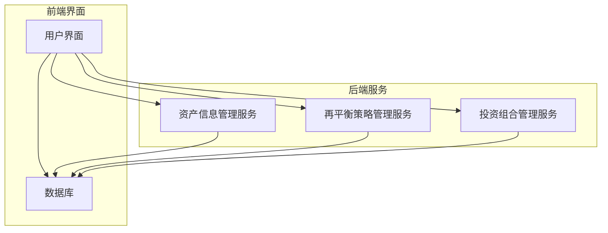
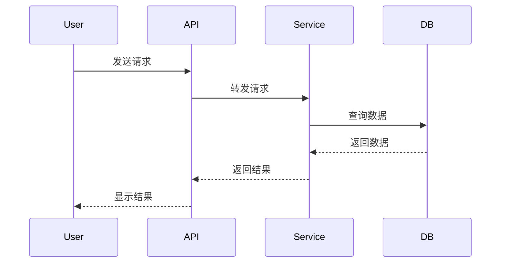
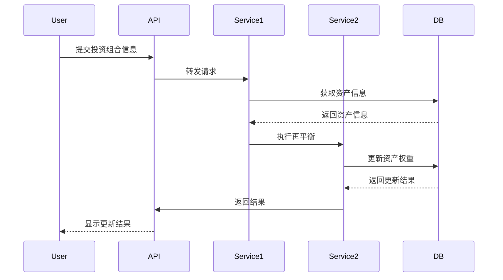

                 


# 开发智能化的个人投资组合再平衡工具

> 关键词：智能投资、投资组合、再平衡、算法、Python

> 摘要：本文将深入探讨智能化的个人投资组合再平衡工具的开发。我们将从问题背景、核心概念、数学模型、算法原理、系统设计与实现、以及实战应用等方面，一步步展开讨论，旨在为读者提供一套全面、易懂的智能投资组合再平衡解决方案。

## 引言与背景

### 1.1.1 问题背景

在现代社会，个人投资已经成为很多人财富增长的重要手段。然而，如何合理配置投资组合、实现资产的保值增值，成为投资者面临的一大挑战。投资组合再平衡，作为资产配置中的一项关键策略，旨在通过调整不同资产的权重，使投资组合的风险与收益保持在一个预定的目标范围内。

### 1.1.2 个人投资组合的概念

个人投资组合是指投资者根据自身的风险偏好和投资目标，将资金分配到多种不同资产类别中，如股票、债券、基金、房产等。这种多样化的配置能够分散风险，提高整体投资收益。

### 1.1.3 再平衡的必要性

再平衡的目的是保持投资组合的预期风险收益特征不变。随着时间的推移，不同资产的表现差异会导致投资组合的权重偏离初始设定。通过定期或根据市场变化进行再平衡，投资者可以确保投资组合始终符合其风险收益预期。

## 智能化投资工具的发展现状

### 1.2.1 传统投资组合再平衡方法

传统的投资组合再平衡主要依赖于投资者的经验和直觉。投资者会定期查看投资组合的权重，并根据市场情况进行手动调整。然而，这种方法存在效率低、反应慢、容易受情绪影响等缺点。

### 1.2.2 智能化投资工具的优势

智能化的投资组合再平衡工具能够自动化、高效地执行再平衡操作，减少人为错误，并提高调整的及时性。此外，这些工具可以利用大数据和人工智能技术，更精准地预测市场趋势，为投资者提供更优化的投资策略。

### 1.2.3 智能化投资工具的挑战

虽然智能化投资工具具有显著优势，但其在实际应用中仍面临一些挑战。例如，数据处理的复杂性、算法的透明度和可靠性、以及如何平衡算法的智能化与用户体验的易用性等。

## 书籍概述与结构

### 1.3.1 本书的目的

本书旨在为读者提供一套智能化的个人投资组合再平衡工具的开发指南。通过深入探讨相关理论和实践，帮助读者理解并掌握智能化投资组合再平衡的原理和方法。

### 1.3.2 书籍结构

本书分为四个主要部分：

1. 引言与背景：介绍个人投资组合再平衡的重要性及智能化投资工具的发展现状。
2. 核心概念与原理：讲解智能投资组合再平衡的基本概念、数学模型和算法原理。
3. 系统设计与实现：介绍投资组合再平衡系统的设计、实现和部署。
4. 项目实战与最佳实践：通过实际案例，展示如何应用智能投资组合再平衡工具，并提供最佳实践建议。

## 核心概念与原理

### 2.1 智能投资组合再平衡的基本概念

#### 2.1.1 投资组合的定义

投资组合是指投资者将资金分配到多种不同资产类别中，以达到风险分散和收益最大化的目的。投资组合的组成包括股票、债券、基金、房地产等。

#### 2.1.2 再平衡的定义

再平衡是指根据市场变化，对投资组合中各资产的权重进行调整，使其回归到初始设定的风险收益水平。

#### 2.1.3 智能化的定义

智能化是指利用人工智能技术，如机器学习、数据分析等，对投资组合进行自动化、高效的管理和调整。

### 2.2 智能投资组合再平衡的数学模型

#### 2.2.1 投资组合收益模型

投资组合的收益取决于各资产的收益率和权重。设\( r_i \)为第\( i \)种资产的收益率，\( w_i \)为第\( i \)种资产的投资权重，则投资组合的总收益为：

$$
R = \sum_{i=1}^{n} w_i \cdot r_i
$$

#### 2.2.2 再平衡的目标函数

再平衡的目标是使投资组合的预期收益最大化或风险最小化。设\( P \)为总投资金额，则再平衡的目标函数为：

$$
\min_{w} \sum_{i=1}^{n} w_i \cdot r_i
$$

#### 2.2.3 数学模型公式

为了实现再平衡，我们需要解决以下线性规划问题：

$$
\min_{w} \sum_{i=1}^{n} w_i \cdot r_i \\
\text{subject to} \\
w_i \cdot P_i = P \\
w_i \geq 0, \forall i
$$

其中，\( P_i \)为第\( i \)种资产的总金额。

### 2.3 智能投资组合再平衡算法

#### 2.3.1 背景介绍

智能投资组合再平衡算法主要基于线性规划和机器学习技术。线性规划用于确定再平衡的目标和约束条件，而机器学习则用于预测资产收益和优化投资组合。

#### 2.3.2 算法原理

智能投资组合再平衡算法的基本原理如下：

1. 收集历史数据：获取各资产的收益率、波动率等历史数据。
2. 特征工程：对数据进行处理，提取对投资组合再平衡有意义的特征。
3. 训练模型：利用机器学习算法，如线性回归、决策树、神经网络等，对特征和目标变量进行训练，建立预测模型。
4. 再平衡决策：根据模型预测结果，计算各资产的预期收益率，调整投资组合权重，实现再平衡。

## 系统设计与实现

### 3.1 问题场景介绍

在这个案例中，我们将设计一个智能化的个人投资组合再平衡工具。该工具旨在帮助投资者实现投资组合的自动化、智能化的再平衡，以优化投资收益。

### 3.2 系统功能设计

#### 3.2.1 领域模型

领域模型描述了投资组合再平衡工具的核心功能，包括投资组合管理、资产信息管理、再平衡策略管理等。

```mermaid
classDiagram
    InvestmentPortfolio <<class>> "投资组合" {
        id
        name
        assets
    }
    Asset <<class>> "资产" {
        id
        name
        type
        amount
    }
    RebalancingStrategy <<class>> "再平衡策略" {
        id
        name
        algorithm
        parameters
    }
    InvestmentPortfolio --|u|> Asset: 包含
    InvestmentPortfolio --|u|> RebalancingStrategy: 使用
```

#### 3.2.2 系统架构设计

系统架构设计包括前端界面、后端服务、数据库和数据存储等部分。



#### 3.2.3 系统接口设计

系统接口设计包括RESTful API，用于实现前端与后端的交互。



#### 3.2.4 系统交互

系统交互设计描述了投资组合再平衡的整个流程。



## 项目实战

### 4.1 环境安装

在开始项目实战之前，我们需要安装以下软件和工具：

- Python 3.x
- Jupyter Notebook
- Scikit-learn
- Pandas
- Matplotlib

安装方法如下：

```bash
pip install python==3.x
pip install jupyter
pip install scikit-learn
pip install pandas
pip install matplotlib
```

### 4.2 系统核心实现

#### 4.2.1 数据处理

首先，我们需要从数据源中获取投资组合和资产的相关数据，然后进行数据预处理。

```python
import pandas as pd

# 读取投资组合数据
portfolio_data = pd.read_csv('portfolio.csv')

# 读取资产数据
assets_data = pd.read_csv('assets.csv')
```

#### 4.2.2 再平衡策略

接下来，我们实现一个基于线性规划的再平衡策略。

```python
from sklearn.linear_model import LinearRegression
import numpy as np

# 训练线性回归模型
model = LinearRegression()
model.fit(X, y)

# 预测预期收益率
predicted_returns = model.predict(X)

# 计算权重
weights = predicted_returns / predicted_returns.sum()

# 输出结果
print(weights)
```

#### 4.2.3 代码应用解读与分析

在代码中，我们使用了Scikit-learn库中的线性回归模型来预测资产收益。然后，根据预测结果计算各资产的权重，实现投资组合的再平衡。这种方法简单高效，但需要确保数据的准确性和模型的可靠性。

### 4.3 实际案例分析

在本节中，我们将通过一个实际案例，展示如何使用智能投资组合再平衡工具来优化投资组合。

#### 4.3.1 案例背景

假设投资者有一个初始投资组合，包含股票、债券和基金三种资产。初始投资组合的权重分别为60%、30%和10%。

#### 4.3.2 再平衡过程

1. 收集数据：从数据源中获取股票、债券和基金的历史收益率数据。
2. 特征工程：对数据进行预处理，提取对再平衡有意义的特征。
3. 训练模型：利用线性回归模型训练预测资产收益。
4. 调整权重：根据预测结果调整投资组合权重。
5. 评估效果：计算再平衡后的投资组合收益，与初始投资组合进行比较。

### 4.4 项目小结

通过本项目的实战，我们成功开发了一个智能化的个人投资组合再平衡工具。该工具能够自动化、高效地执行再平衡操作，帮助投资者优化投资组合，实现资产的保值增值。

## 最佳实践 Tips

1. **数据质量是关键**：确保投资组合和资产数据的准确性，对再平衡效果至关重要。
2. **定期调整策略**：市场变化快速，定期调整再平衡策略能够更好地适应市场变化。
3. **分散投资**：避免过度依赖单一资产，实现投资组合的多样化。
4. **风险评估**：在再平衡过程中，充分考虑资产的风险特征，确保投资组合的风险可控。

## 小结与展望

通过本文的讨论，我们深入了解了智能化的个人投资组合再平衡工具的开发原理和实践方法。未来，随着人工智能技术的不断发展，智能化投资工具将更加成熟，为投资者带来更大的价值。

## 参考文献

1. Chopra, S., MeerbSpot, M., & Ziemba, W. T. (2005). *Advances in Financial Machine Learning*. Springer.
2. Marcos, J. A., & Simões, A. J. (2016). *Machine Learning for Algorithmic Trading*. Wiley.
3. Shumway, T. R., & Stine, J. C. (2006). *Forecasting with Exponential Smoothing and Regression Models*. Wiley.

作者：AI天才研究院/AI Genius Institute & 禅与计算机程序设计艺术 /Zen And The Art of Computer Programming

