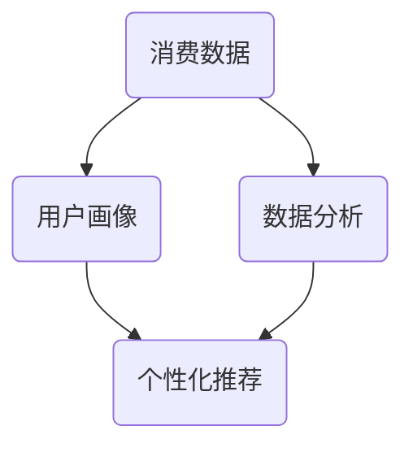
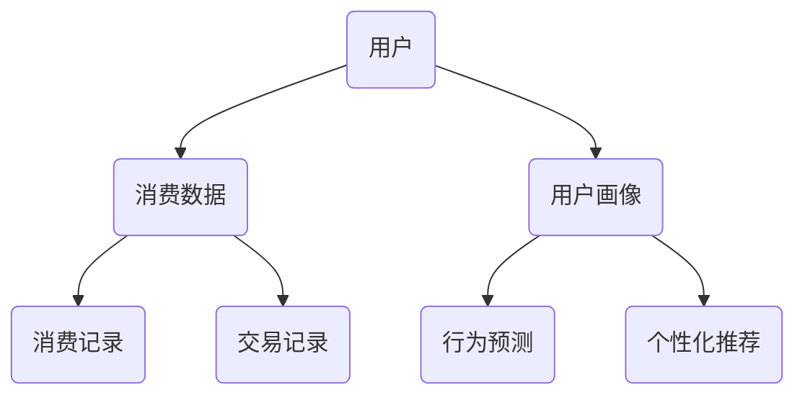
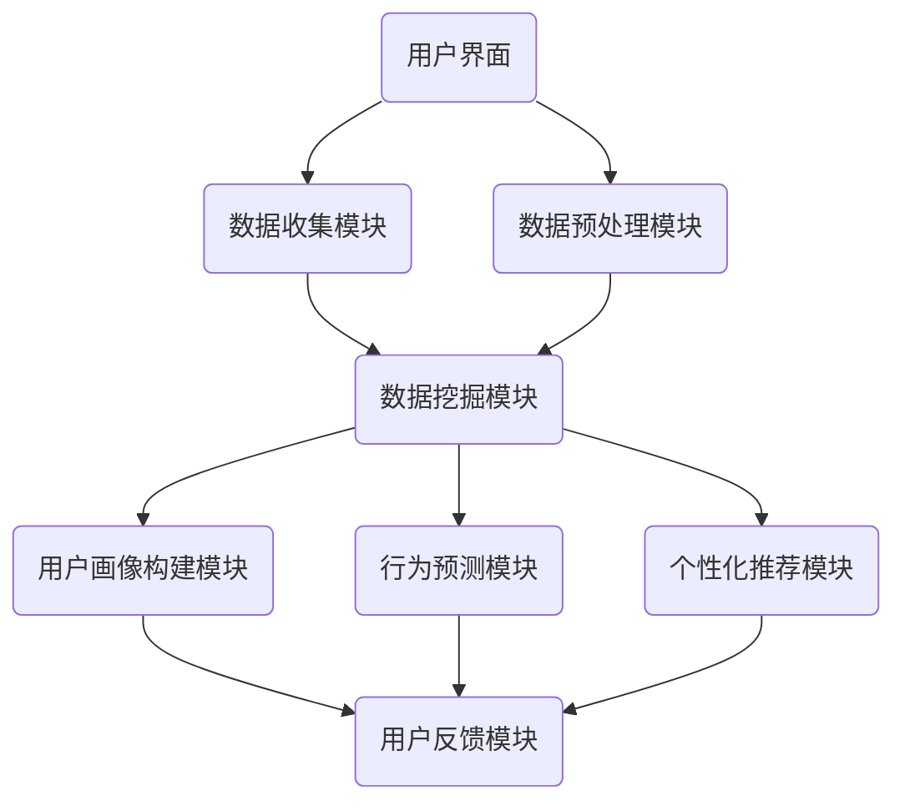
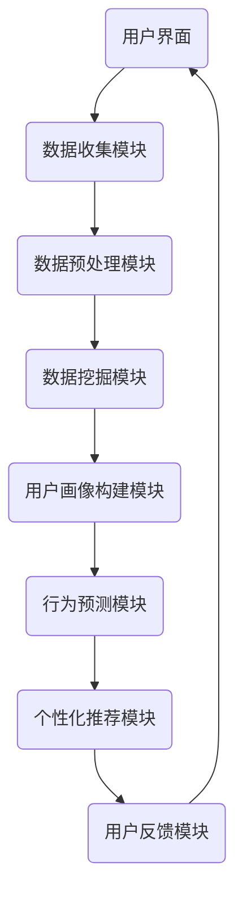

                 

# 开发智能化的个人消费习惯改善建议工具

> 关键词：消费习惯改善、智能化工具、用户画像、机器学习、个性化推荐、数据分析

> 摘要：本文将探讨开发智能化个人消费习惯改善建议工具的过程。通过深入分析问题背景、核心概念、算法原理以及系统架构设计，本文旨在为开发者和企业提供一套完整的解决方案，以帮助个人用户和企业更好地管理和改善消费习惯。

----------------------------------------------------------------

## 第一部分：问题背景与核心概念

### 第1章：问题背景

#### 1.1.1 问题背景

在当今快速发展的数字经济时代，个人消费习惯的改善成为了众多消费者和企业管理者关注的焦点。随着互联网和人工智能技术的普及，越来越多的企业和组织开始探索智能化工具来改善个人消费习惯。这些工具不仅能够帮助消费者更好地管理自己的财务，还能为企业提供有价值的数据分析，优化市场营销策略。

#### 1.1.2 问题描述

个人消费习惯改善的工具需要解决以下问题：

- **数据收集与处理**：如何有效地收集用户的消费数据，并处理这些数据以提取有用的信息。
- **行为分析**：如何通过分析用户的行为模式，预测其未来的消费行为，并给出合理的改善建议。
- **个性化推荐**：如何根据用户的偏好和历史消费记录，提供个性化的消费建议。
- **用户互动**：如何与用户进行有效的互动，收集反馈，不断优化工具的性能。

#### 1.1.3 问题解决

智能化的个人消费习惯改善建议工具可以通过以下方式解决上述问题：

- **数据挖掘与分析**：利用机器学习和数据分析技术，对用户消费数据进行分析，挖掘潜在的行为模式。
- **用户画像**：通过数据分析和行为建模，构建用户的消费画像，为个性化推荐提供基础。
- **交互设计**：设计直观、易用的用户界面，使用户能够方便地与工具互动，并提供反馈。
- **持续优化**：通过用户反馈和数据监控，不断优化工具的性能和用户体验。

#### 1.1.4 边界与外延

个人消费习惯改善工具的应用范围广泛，不仅适用于个人用户，还可以为企业提供定制化的解决方案。此外，这些工具还可以结合区块链技术，提高数据的安全性和透明度。

### 第2章：核心概念与联系

#### 2.1.1 核心概念

- **消费数据**：指个人在购物、支付等行为中产生的数据，包括购买时间、金额、商品信息等。
- **用户画像**：基于消费数据，构建的用户行为、偏好和需求的模型。
- **机器学习**：一种人工智能技术，通过算法从数据中学习，进行预测和决策。
- **数据分析**：对大量数据进行处理，提取有价值的信息和知识。
- **个性化推荐**：根据用户的偏好和历史行为，为用户提供个性化的信息和建议。

#### 2.1.2 概念属性特征对比

| 概念         | 属性特征                                  |
| ------------ | ---------------------------------------- |
| 消费数据     | 结构化、非结构化，实时性、历史性          |
| 用户画像     | 多维度、动态更新、个性化                  |
| 机器学习     | 自学习、自动化、可预测性                  |
| 数据分析     | 提取信息、洞察趋势、辅助决策              |
| 个性化推荐   | 根据用户偏好、行为，提供个性化信息和建议   |

#### 2.1.3 概念联系与结构

以下为个人消费习惯改善工具的核心概念联系与结构：

### 第3章：算法原理讲解

#### 3.1.1 算法原理

个人消费习惯改善工具的核心算法包括数据挖掘、用户画像构建、行为预测和个性化推荐等。以下将详细介绍这些算法的原理。

#### 3.1.1.1 数据挖掘

数据挖掘是通过对大量消费数据的分析，提取隐藏在数据中的模式和规律。常用的数据挖掘算法包括：

- **关联规则挖掘**：发现不同商品之间的关联关系。
- **聚类分析**：将用户根据其消费行为相似性进行分类。
- **分类算法**：将用户分为不同的消费类别，以便进行个性化推荐。

#### 3.1.1.2 用户画像构建

用户画像构建是基于用户的消费数据和行为分析，生成一个多维度的用户行为和偏好的模型。常用的技术包括：

- **特征工程**：将原始的消费数据转化为可用于建模的特征。
- **机器学习算法**：使用算法从特征中学习用户的消费模式和偏好。

#### 3.1.1.3 行为预测

行为预测是利用历史数据预测用户的未来消费行为。常用的算法包括：

- **时间序列分析**：预测未来的消费行为。
- **回归分析**：预测用户的消费金额或频率。

#### 3.1.1.4 个性化推荐

个性化推荐是根据用户的偏好和历史行为，为用户提供个性化的信息和建议。常用的算法包括：

- **协同过滤**：基于用户的历史行为，找到相似的用户并推荐他们喜欢的商品。
- **基于内容的推荐**：根据用户的兴趣和浏览历史，推荐相关的商品。

### 第二部分：系统分析与架构设计

#### 第4章：系统功能设计

##### 4.1.1 领域模型

领域模型用于描述个人消费习惯改善工具涉及的实体及其关系。以下是一个简单的领域模型：

##### 4.1.2 类图

以下是一个类图的示例，展示了系统的核心类及其关系：

#### 第5章：系统架构设计

##### 5.1.1 系统架构图

以下是一个简单的系统架构图，展示了个人消费习惯改善工具的主要组件及其关系：

##### 5.1.2 系统接口设计

以下是一个简单的接口设计，展示了各个模块之间的交互：

##### 5.1.3 系统交互

以下是一个简单的系统交互序列图，展示了用户与系统之间的交互过程：

### 第三部分：项目实战

#### 第6章：环境安装

在本章节中，我们将介绍如何搭建开发环境，安装必要的依赖库和工具。

#### 第7章：系统核心实现

在本章节中，我们将详细介绍系统的核心实现，包括数据收集、数据预处理、数据挖掘、用户画像构建、行为预测和个性化推荐等模块的实现。

#### 第8章：代码应用解读与分析

在本章节中，我们将对系统核心代码进行解读，分析其设计思路和实现方法，并结合实际案例进行讲解。

#### 第9章：实际案例分析与详细讲解剖析

在本章节中，我们将通过实际案例，详细分析个人消费习惯改善工具的应用场景，并对其进行讲解和剖析。

#### 第10章：项目小结

在本章节中，我们将对整个项目进行小结，总结开发过程中的经验和教训，并提出改进意见。

### 第四部分：最佳实践与拓展阅读

#### 第11章：最佳实践 tips

在本章节中，我们将分享一些最佳实践技巧，帮助开发者更好地开发和优化个人消费习惯改善工具。

#### 第12章：小结

在本章节中，我们将对本文进行总结，强调智能化的个人消费习惯改善工具的重要性和应用价值。

#### 第13章：注意事项

在本章节中，我们将提醒开发者注意一些潜在的问题和风险，以确保工具的安全性和可靠性。

#### 第14章：拓展阅读

在本章节中，我们将推荐一些相关的拓展阅读资源，帮助读者更深入地了解个人消费习惯改善工具和相关技术。

## 总结

开发智能化的个人消费习惯改善建议工具是一个复杂而有趣的任务。通过本文的深入分析，我们了解到了问题的背景、核心概念、算法原理以及系统架构设计。同时，我们也通过项目实战，了解了如何实现和优化这些工具。希望本文能够为开发者和企业提供有益的参考和指导。

作者：AI天才研究院/AI Genius Institute & 禅与计算机程序设计艺术 /Zen And The Art of Computer Programming

----------------------------------------------------------------

本文详细介绍了开发智能化个人消费习惯改善建议工具的整个过程。从问题背景、核心概念、算法原理到系统架构设计，再到项目实战，本文全面覆盖了工具开发的各个环节。通过本文，读者可以了解到如何利用先进的人工智能技术，帮助个人用户和企业更好地管理和改善消费习惯。

在未来的发展中，随着人工智能技术的不断进步，个人消费习惯改善工具的功能和性能将得到进一步提升。同时，随着区块链技术的应用，工具的数据安全和透明度也将得到保障。我们相信，智能化的个人消费习惯改善工具将在未来的数字经济时代发挥重要作用，助力个人和企业实现更健康、更智能的消费管理。

最后，感谢读者对本文的关注和支持。如果您对本文有任何疑问或建议，欢迎在评论区留言，我们将认真倾听并做出改进。期待与您共同探讨和推动人工智能技术的发展，为创造更美好的未来而努力。作者：AI天才研究院/AI Genius Institute & 禅与计算机程序设计艺术 /Zen And The Art of Computer Programming。

