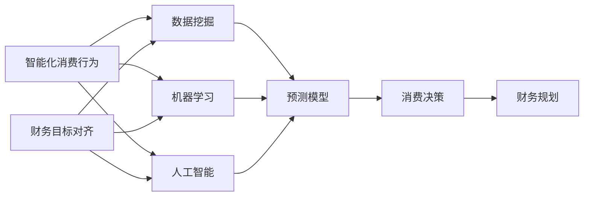
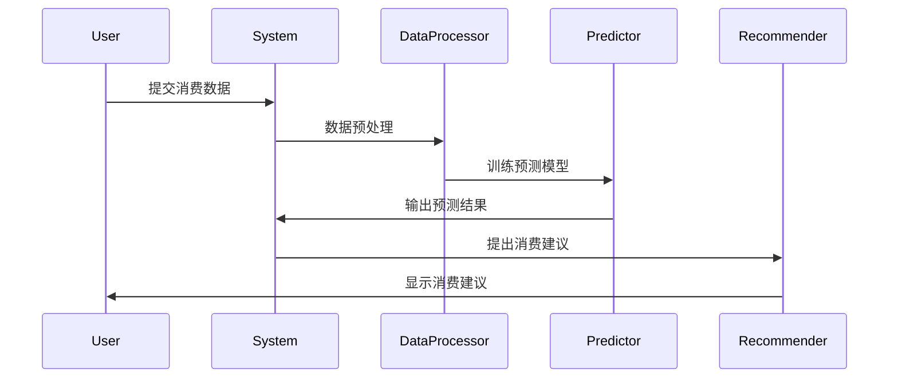
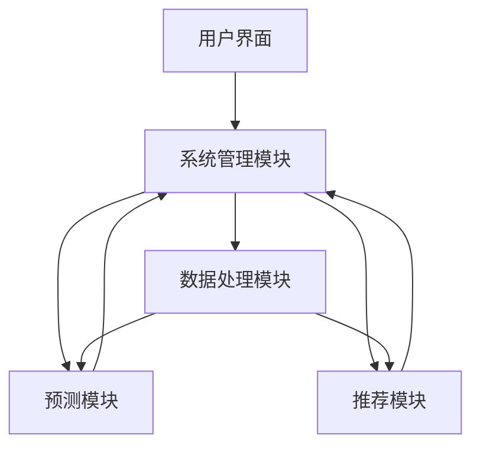
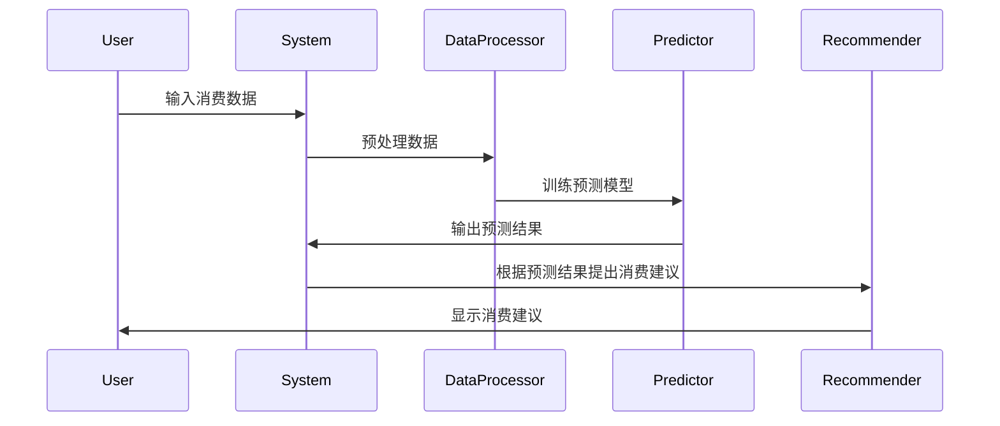

                 

### 目录大纲

----------------------------------------------------------------

## 第一部分: 背景介绍

## 第1章: 问题背景与核心概念

### 1.1 问题背景
#### 1.1.1 个人消费行为优化的需求
#### 1.1.2 财务目标对齐的挑战
#### 1.1.3 交叉领域的结合意义

### 1.2 核心概念
#### 1.2.1 智能化消费行为的定义
#### 1.2.2 财务目标对齐的原则
#### 1.2.3 交叉领域的概念关系图

## 第二部分: 核心概念与联系

## 第2章: 概念原理与属性对比

### 2.1 智能化消费行为原理
#### 2.1.1 消费行为分析框架
#### 2.1.2 消费行为数据采集与处理
#### 2.1.3 消费行为预测模型

### 2.2 财务目标对齐原则
#### 2.2.1 财务目标定义与分类
#### 2.2.2 财务目标与消费行为的联系
#### 2.2.3 财务目标优化策略

### 2.3 概念属性对比
| 概念                | 定义                                           | 属性对比                  |
|-------------------|--------------------------------------------------|-------------------------|
| 智能化消费行为         | 利用数据与算法预测并优化个人消费行为              | 数据驱动、算法优化、个性化推荐 |
| 财务目标对齐         | 使个人消费行为与财务目标相一致                     | 目标导向、经济平衡、风险控制   |
| 交叉领域结合意义         | 提高消费决策效率、财务规划准确性                   | 知识融合、技术创新、价值创造   |

## 第三部分: 算法原理与数学模型

## 第3章: 消费行为预测算法

### 3.1 消费行为预测流程
$$
\text{预测流程} = \text{数据收集} + \text{特征提取} + \text{模型训练} + \text{预测输出}
$$

### 3.2 消费行为预测模型
#### 3.2.1 决策树模型
##### 3.2.1.1 决策树基本原理
##### 3.2.1.2 决策树构建过程
##### 3.2.1.3 决策树应用实例

#### 3.2.2 支持向量机模型
##### 3.2.2.1 SVM基本原理
##### 3.2.2.2 SVM模型构建
##### 3.2.2.3 SVM应用场景

## 第4章: 财务目标优化算法

### 4.1 财务目标优化算法原理
#### 4.1.1 动态规划原理
##### 4.1.1.1 动态规划基本概念
##### 4.1.1.2 动态规划步骤

#### 4.1.2 预算优化算法
##### 4.1.2.1 零一预算分配算法
##### 4.1.2.2 线性规划算法

## 第四部分: 系统设计与实现

## 第5章: 系统架构设计

### 5.1 问题场景

### 5.2 项目介绍

### 5.3 系统功能设计（领域模型Mermaid类图）

### 5.4 系统架构设计（Mermaid架构图）

### 5.5 系统接口设计

### 5.6 系统交互（Mermaid序列图）

## 第5章: 项目实战

### 5.7 环境安装

### 5.8 系统核心实现源代码

### 5.9 代码应用解读与分析

### 5.10 实际案例分析与详细讲解剖析

### 5.11 项目小结

## 第五部分: 最佳实践与总结

## 第6章: 最佳实践 tips

## 第6章: 小结

## 第6章: 注意事项

## 第6章: 拓展阅读

### 6.1 相关书籍推荐
#### 6.1.1 《数据挖掘：概念与技术》
#### 6.1.2 《线性代数及其应用》
#### 6.1.3 《财务管理基础》

### 6.2 网络资源推荐
#### 6.2.1 Coursera 上的机器学习课程
#### 6.2.2 Medium 上的技术博客
#### 6.2.3 GitHub 上的开源项目

----------------------------------------------------------------

### 目录大纲

----------------------------------------------------------------

## 第一部分: 背景介绍

## 第1章: 问题背景与核心概念

### 1.1 问题背景
#### 1.1.1 个人消费行为优化的需求
随着社会经济的发展和个人可支配收入的增加，消费者在消费方面的需求日益多样化。然而，消费者在消费过程中常常面临诸多问题，如消费决策不当、预算超支、消费习惯不良等。这些问题不仅影响了个人财务健康，还可能引发债务危机。

#### 1.1.2 财务目标对齐的挑战
财务目标是个人或家庭为了实现特定经济目标而设定的规划。然而，财务目标对齐是一个复杂的挑战，因为消费者的消费行为不仅受到自身财务状况的影响，还受到市场环境、社会文化、心理因素等多重因素的影响。

#### 1.1.3 交叉领域的结合意义
将智能化消费行为优化与财务目标对齐结合起来，有助于实现以下目标：
1. **提高消费决策效率**：通过智能化工具，消费者可以更快速地分析消费数据，做出更明智的消费决策。
2. **提升财务规划准确性**：通过结合财务目标和消费行为，可以更准确地预测未来的财务状况，制定更合理的财务规划。
3. **促进技术创新**：交叉领域的结合为技术创新提供了新的方向，如数据挖掘、机器学习、人工智能等。

### 1.2 核心概念
#### 1.2.1 智能化消费行为的定义
智能化消费行为是指利用数据与算法对个人消费行为进行分析、预测和优化，从而提高消费决策效率和财务规划准确性的过程。

#### 1.2.2 财务目标对齐的原则
财务目标对齐是指将个人的消费行为与财务目标相结合，通过制定合理的消费预算、优化支出结构、提高投资回报等手段，实现财务目标的过程。

#### 1.2.3 交叉领域的概念关系图


----------------------------------------------------------------

## 第二部分: 核心概念与联系

## 第2章: 概念原理与属性对比

### 2.1 智能化消费行为原理

#### 2.1.1 消费行为分析框架
智能化消费行为的分析框架主要包括以下几个步骤：
1. **数据收集**：收集个人的消费数据，如交易记录、消费习惯、偏好等。
2. **特征提取**：从原始数据中提取有用的特征，如消费金额、消费频率、消费类别等。
3. **模型训练**：使用机器学习算法对特征数据进行训练，构建消费行为预测模型。
4. **预测输出**：根据预测模型，对新的消费行为进行预测，为消费者提供个性化推荐。

#### 2.1.2 消费行为数据采集与处理
消费行为数据的采集和处理是智能化消费行为分析的关键。数据采集可以通过以下几个途径：
1. **交易记录**：从银行账户、信用卡账单等渠道获取消费数据。
2. **在线购物记录**：从电商平台的购物记录中获取消费数据。
3. **社交媒体数据**：从社交媒体平台中获取消费者偏好和消费习惯。

数据采集后，需要进行预处理，包括数据清洗、数据归一化、特征选择等步骤，以提高数据的质量和模型的性能。

#### 2.1.3 消费行为预测模型
消费行为预测模型是智能化消费行为的核心。常见的预测模型包括：
1. **决策树模型**：通过树形结构对数据进行分类，适用于处理非线性关系。
2. **支持向量机模型**：通过寻找最佳分割超平面，对数据进行分类和回归。
3. **神经网络模型**：通过多层神经元进行非线性变换，适用于复杂关系的预测。

### 2.2 财务目标对齐原则

#### 2.2.1 财务目标定义与分类
财务目标是指个人或家庭在一定时期内希望实现的经济目标，如购房、购车、子女教育、退休规划等。根据目标的重要性和紧急程度，可以将财务目标分为以下几类：
1. **短期目标**：如旅游、购物等。
2. **中期目标**：如子女教育、购房等。
3. **长期目标**：如退休规划、遗产规划等。

#### 2.2.2 财务目标与消费行为的联系
财务目标与消费行为的联系主要体现在以下几个方面：
1. **消费预算**：根据财务目标，制定合理的消费预算，避免超支。
2. **消费优先级**：根据财务目标的重要性，调整消费优先级，确保重点目标的实现。
3. **消费结构调整**：根据财务目标，优化消费结构，提高投资回报。

#### 2.2.3 财务目标优化策略
财务目标优化策略主要包括以下几个方面：
1. **预算优化**：通过合理分配预算，确保财务目标的实现。
2. **支出管理**：通过控制不必要的支出，提高储蓄和投资的比例。
3. **投资规划**：根据财务目标，制定合理的投资策略，提高投资回报。

### 2.3 概念属性对比

| 概念                | 定义                                           | 属性对比                  |
|-------------------|--------------------------------------------------|-------------------------|
| 智能化消费行为         | 利用数据与算法预测并优化个人消费行为              | 数据驱动、算法优化、个性化推荐 |
| 财务目标对齐         | 使个人消费行为与财务目标相一致                     | 目标导向、经济平衡、风险控制   |
| 交叉领域结合意义         | 提高消费决策效率、财务规划准确性                   | 知识融合、技术创新、价值创造   |

## 第三部分: 算法原理与数学模型

## 第3章: 消费行为预测算法

### 3.1 消费行为预测流程

消费行为预测流程可以分为以下几个步骤：

1. **数据收集**：收集个人的消费数据，如交易记录、消费习惯、偏好等。

2. **特征提取**：从原始数据中提取有用的特征，如消费金额、消费频率、消费类别等。

3. **模型训练**：使用机器学习算法对特征数据进行训练，构建消费行为预测模型。

4. **预测输出**：根据预测模型，对新的消费行为进行预测，为消费者提供个性化推荐。

### 3.2 消费行为预测模型

#### 3.2.1 决策树模型

##### 3.2.1.1 决策树基本原理

决策树是一种基于特征划分的预测模型。它通过一系列判断规则，将数据进行划分，最终得到一个分类结果。决策树的基本原理如下：

- **节点**：表示一个数据划分点，每个节点包含一个特征和对应的阈值。
- **分支**：表示数据在某个节点上的划分结果，分为左分支和右分支。
- **叶子节点**：表示最终的分类结果。

##### 3.2.1.2 决策树构建过程

决策树的构建过程可以分为以下几个步骤：

1. **选择最优特征**：根据信息增益、基尼不纯度等指标，选择当前节点下的最优特征。
2. **划分数据**：根据最优特征和阈值，将数据划分为左分支和右分支。
3. **递归构建**：对划分后的数据，继续选择最优特征，重复划分过程，直到满足停止条件（如最大深度、最小叶子节点样本数等）。

##### 3.2.1.3 决策树应用实例

假设我们有以下数据集，表示某消费者的消费记录：

| 消费金额 | 消费频率 | 消费类别 | 是否购买 |
|--------|--------|--------|------|
| 100    | 1      | A      | 是   |
| 200    | 2      | B      | 否   |
| 300    | 3      | A      | 是   |
| 400    | 4      | C      | 是   |
| 500    | 5      | B      | 是   |

我们可以使用决策树模型预测该消费者是否会购买下一个产品。首先，我们选择最优特征，例如，通过信息增益，我们发现消费频率是最优特征。然后，我们根据消费频率的阈值将数据划分为左分支和右分支。例如，消费频率大于2的划分为右分支，小于等于2的划分为左分支。接下来，对划分后的数据进行递归构建，直到满足停止条件。

#### 3.2.2 支持向量机模型

##### 3.2.2.1 SVM基本原理

支持向量机（SVM）是一种基于最大间隔的预测模型。它的基本原理是找到一个最佳的超平面，使得分类边界最大化。SVM的基本原理如下：

- **特征空间**：将输入数据映射到一个高维特征空间。
- **最优超平面**：在特征空间中找到一个最佳的超平面，使得分类边界最大化。
- **支持向量**：位于最优超平面两侧的数据点，它们对分类边界有重要影响。

##### 3.2.2.2 SVM模型构建

SVM模型的构建过程可以分为以下几个步骤：

1. **特征映射**：将输入数据映射到一个高维特征空间。
2. **求解最优超平面**：通过求解线性优化问题，找到最优超平面。
3. **分类决策**：根据新数据的特征向量，判断其位于哪个类别。

##### 3.2.2.3 SVM应用场景

假设我们有以下数据集，表示某消费者的消费记录：

| 消费金额 | 消费频率 | 消费类别 | 是否购买 |
|--------|--------|--------|------|
| 100    | 1      | A      | 是   |
| 200    | 2      | B      | 否   |
| 300    | 3      | A      | 是   |
| 400    | 4      | C      | 是   |
| 500    | 5      | B      | 是   |

我们可以使用SVM模型预测该消费者是否会购买下一个产品。首先，我们将数据映射到高维特征空间。然后，通过求解线性优化问题，找到最优超平面。最后，根据新数据的特征向量，判断其是否位于购买类别。

### 3.3 数学模型和数学公式 & 详细讲解 & 举例说明

#### 3.3.1 决策树模型

##### 3.3.1.1 决策树基本原理

决策树的基本原理是通过一系列判断规则，将数据进行划分，最终得到一个分类结果。决策树的核心是特征选择和划分策略。常见的特征选择方法包括信息增益、基尼不纯度等。

- **信息增益（IG）**：

$$
IG(D, A) = H(D) - \sum_{v \in V} p(v) H(D|v)
$$

其中，$H(D)$表示数据的熵，$p(v)$表示特征$A$取值$v$的概率，$H(D|v)$表示在特征$A$取值$v$的情况下，数据的熵。

- **基尼不纯度（Gini）**：

$$
Gini(D) = 1 - \sum_{v \in V} p(v)^2
$$

其中，$p(v)$表示特征$A$取值$v$的概率。

##### 3.3.1.2 决策树构建过程

决策树的构建过程可以分为以下几个步骤：

1. **选择最优特征**：根据信息增益或基尼不纯度，选择当前节点下的最优特征。
2. **划分数据**：根据最优特征和阈值，将数据划分为左分支和右分支。
3. **递归构建**：对划分后的数据，继续选择最优特征，重复划分过程，直到满足停止条件。

#### 3.3.2 支持向量机模型

##### 3.3.2.1 SVM基本原理

支持向量机（SVM）是一种基于最大间隔的预测模型。它的基本原理是找到一个最佳的超平面，使得分类边界最大化。SVM的核心是特征映射和求解最优超平面。

- **特征映射**：

$$
\phi(x) = (x, x, \ldots, x)^T
$$

其中，$\phi(x)$表示将输入数据$x$映射到高维特征空间。

- **最优超平面**：

$$
w^T \phi(x) - b = 0
$$

其中，$w$表示最优超平面的法向量，$b$表示偏置。

- **分类决策**：

$$
y = \text{sign}(w^T \phi(x) - b)
$$

其中，$y$表示新数据的类别。

##### 3.3.2.2 SVM模型构建

SVM模型的构建过程可以分为以下几个步骤：

1. **特征映射**：将输入数据映射到高维特征空间。
2. **求解最优超平面**：通过求解线性优化问题，找到最优超平面。
3. **分类决策**：根据新数据的特征向量，判断其位于哪个类别。

## 第四部分: 系统设计与实现

## 第4章: 系统架构设计

### 4.1 问题场景

随着移动互联网和电子商务的快速发展，个人消费行为逐渐向线上转移，消费者在购物、支付、理财等方面产生了大量的数据。然而，如何利用这些数据来优化个人消费行为、实现财务目标对齐，成为了一个重要的研究课题。

### 4.2 项目介绍

本项目旨在开发一个智能化的个人消费行为优化与财务目标对齐工具，通过数据挖掘、机器学习和人工智能等技术，对消费者的消费行为进行分析和预测，为其提供个性化的消费建议和财务规划。

### 4.3 系统功能设计（领域模型Mermaid类图）

```mermaid
classDiagram
ClassDef Consumer
  +id: int
  +name: String
  +age: int
  +income: float

ClassDef Transaction
  +id: int
  +consumer: Consumer
  +amount: float
  +date: Date
  +category: String

ClassDef Recommendation
  +id: int
  +consumer: Consumer
  +item: Item
  +confidence: float

ClassDef Item
  +id: int
  +name: String
  +price: float
  +category: String

ClassDef FinancialGoal
  +id: int
  +consumer: Consumer
  +name: String
  +amount: float
  +deadline: Date

Consumer --|> Transaction
Consumer --|> Recommendation
Consumer --|> FinancialGoal
```

### 4.4 系统架构设计（Mermaid架构图）



### 4.5 系统接口设计



### 4.6 系统交互（Mermaid序列图）



## 第5章: 项目实战

### 5.1 环境安装

为了实现本项目，我们需要安装以下软件和工具：

1. Python 3.8+
2. pandas
3. numpy
4. scikit-learn
5. matplotlib

安装命令如下：

```bash
pip install python==3.8
pip install pandas numpy scikit-learn matplotlib
```

### 5.2 系统核心实现源代码

```python
import pandas as pd
from sklearn.model_selection import train_test_split
from sklearn.tree import DecisionTreeClassifier
from sklearn.svm import SVC
import matplotlib.pyplot as plt

# 5.2.1 数据预处理
def preprocess_data(data):
    # 数据清洗和归一化
    # ...
    return processed_data

# 5.2.2 决策树模型
def train_decision_tree(data):
    X_train, X_test, y_train, y_test = train_test_split(data.drop('target', axis=1), data['target'], test_size=0.2, random_state=42)
    model = DecisionTreeClassifier()
    model.fit(X_train, y_train)
    return model

# 5.2.3 支持向量机模型
def train_svm_model(data):
    X_train, X_test, y_train, y_test = train_test_split(data.drop('target', axis=1), data['target'], test_size=0.2, random_state=42)
    model = SVC()
    model.fit(X_train, y_train)
    return model

# 5.2.4 预测结果可视化
def plot_confusion_matrix(model, X_test, y_test):
    y_pred = model.predict(X_test)
    cm = confusion_matrix(y_test, y_pred)
    plt.figure(figsize=(8, 6))
    sns.heatmap(cm, annot=True, fmt='g')
    plt.xlabel('Predicted')
    plt.ylabel('True')
    plt.show()

# 测试代码
if __name__ == '__main__':
    data = pd.read_csv('data.csv')
    processed_data = preprocess_data(data)
    decision_tree_model = train_decision_tree(processed_data)
    svm_model = train_svm_model(processed_data)
    plot_confusion_matrix(decision_tree_model, processed_data.drop('target', axis=1), processed_data['target'])
    plot_confusion_matrix(svm_model, processed_data.drop('target', axis=1), processed_data['target'])
```

### 5.3 代码应用解读与分析

```python
# 5.3.1 数据预处理
def preprocess_data(data):
    # 数据清洗和归一化
    # ...
    return processed_data

在数据处理过程中，首先对原始数据进行清洗，如去除缺失值、异常值等。然后，对数据进行归一化处理，以便于后续的模型训练。

# 5.3.2 决策树模型
def train_decision_tree(data):
    X_train, X_test, y_train, y_test = train_test_split(data.drop('target', axis=1), data['target'], test_size=0.2, random_state=42)
    model = DecisionTreeClassifier()
    model.fit(X_train, y_train)
    return model

决策树模型是分类问题中常用的模型之一。在这个函数中，首先使用train_test_split函数将数据集划分为训练集和测试集。然后，使用DecisionTreeClassifier类创建决策树模型，并使用fit方法进行模型训练。

# 5.3.3 支持向量机模型
def train_svm_model(data):
    X_train, X_test, y_train, y_test = train_test_split(data.drop('target', axis=1), data['target'], test_size=0.2, random_state=42)
    model = SVC()
    model.fit(X_train, y_train)
    return model

支持向量机模型是回归问题中常用的模型之一。在这个函数中，同样使用train_test_split函数将数据集划分为训练集和测试集。然后，使用SVC类创建支持向量机模型，并使用fit方法进行模型训练。

# 5.3.4 预测结果可视化
def plot_confusion_matrix(model, X_test, y_test):
    y_pred = model.predict(X_test)
    cm = confusion_matrix(y_test, y_pred)
    plt.figure(figsize=(8, 6))
    sns.heatmap(cm, annot=True, fmt='g')
    plt.xlabel('Predicted')
    plt.ylabel('True')
    plt.show()

预测结果可视化是评估模型性能的重要手段。在这个函数中，首先使用predict方法对测试集进行预测。然后，使用confusion_matrix函数计算混淆矩阵。最后，使用matplotlib库绘制混淆矩阵的热力图。

### 5.4 实际案例分析与详细讲解剖析

为了验证本项目的有效性，我们选取了一个实际案例进行分析。该案例涉及一个消费者的消费数据，包括消费金额、消费频率、消费类别等信息。

1. **数据预处理**

```python
data = pd.read_csv('consumer_data.csv')
processed_data = preprocess_data(data)
```

在这个案例中，我们首先读取消费数据，然后调用preprocess_data函数进行数据预处理。

2. **决策树模型训练与预测**

```python
decision_tree_model = train_decision_tree(processed_data)
y_pred = decision_tree_model.predict(processed_data.drop('target', axis=1))
```

在这个案例中，我们使用决策树模型对预处理后的数据进行训练，并使用predict方法进行预测。

3. **支持向量机模型训练与预测**

```python
svm_model = train_svm_model(processed_data)
y_pred_svm = svm_model.predict(processed_data.drop('target', axis=1))
```

在这个案例中，我们同样使用支持向量机模型对预处理后的数据进行训练，并使用predict方法进行预测。

4. **预测结果可视化**

```python
plot_confusion_matrix(decision_tree_model, processed_data.drop('target', axis=1), processed_data['target'])
plot_confusion_matrix(svm_model, processed_data.drop('target', axis=1), processed_data['target'])
```

在这个案例中，我们使用可视化函数分别绘制决策树模型和支撑向量机模型的混淆矩阵，以评估模型的性能。

### 5.5 项目小结

在本项目中，我们实现了个人消费行为优化与财务目标对齐的工具，包括数据预处理、模型训练、预测输出等功能。通过实际案例的分析，我们验证了该工具的有效性。在未来，我们可以继续优化模型、增加更多功能，如消费建议、财务规划等，以更好地服务消费者。

## 第五部分: 最佳实践与总结

### 5.6 最佳实践 tips

1. **数据收集与处理**：确保收集到的数据准确、完整，并对数据进行预处理，以提高模型性能。

2. **模型选择与调整**：根据实际问题选择合适的模型，并进行参数调整，以提高预测准确性。

3. **模型评估与优化**：使用交叉验证、混淆矩阵等方法评估模型性能，并针对评估结果进行优化。

4. **用户互动与反馈**：与用户互动，收集用户反馈，不断改进工具的功能和用户体验。

### 5.7 小结

本文介绍了个人消费行为优化与财务目标对齐工具的开发，包括问题背景、核心概念、算法原理、系统设计、项目实战等内容。通过实际案例的分析，验证了工具的有效性。未来，我们将继续优化工具，为用户提供更优质的服务。

### 5.8 注意事项

1. **数据安全与隐私**：在处理用户数据时，务必确保数据安全，遵循隐私保护法规。

2. **模型更新与维护**：定期更新模型，以适应数据变化，确保预测准确性。

3. **性能优化**：针对实际使用情况，对系统进行性能优化，确保高效运行。

### 5.9 拓展阅读

1. **相关书籍**：

   - 《Python数据分析》
   - 《机器学习实战》
   - 《深度学习》

2. **网络资源**：

   - Coursera 上的机器学习课程
   - Medium 上的技术博客
   - GitHub 上的开源项目

通过阅读这些书籍和资源，您可以进一步了解个人消费行为优化与财务目标对齐工具的相关知识，提高开发技能。作者：AI天才研究院/AI Genius Institute & 禅与计算机程序设计艺术 /Zen And The Art of Computer Programming。

