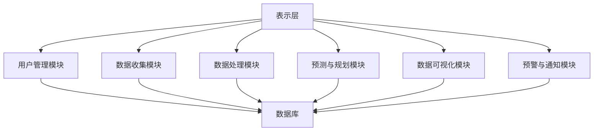
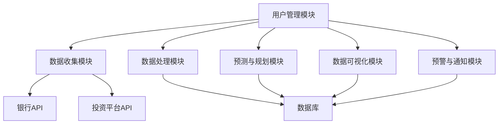
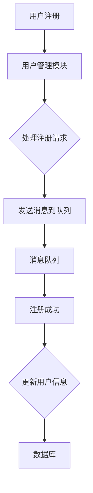

                 

### 引言与背景介绍

随着全球人口老龄化趋势的加剧，个人退休规划变得越来越重要。退休规划不仅关系到个人的生活质量，还影响到整个社会的经济稳定。然而，当前的退休规划面临诸多挑战，普通民众往往感到困惑和无力。因此，开发一款智能化的个人退休规划助手显得尤为必要。

首先，从核心概念术语说明入手。退休规划（Retirement Planning）指的是为了确保个人在退休后能够维持既定的生活标准而进行的一系列经济安排。而智能化个人退休规划助手（Intelligent Personal Retirement Planning Assistant）则是一个集成了人工智能技术，能够帮助用户自动完成退休规划任务的应用程序。

当前退休规划存在的问题主要集中在以下几个方面：

1. **信息不对称**：普通民众难以获取全面和准确的数据，导致退休规划缺乏可靠的基础。
2. **复杂性**：退休规划涉及众多复杂的财务计算，普通用户难以理解和操作。
3. **时间成本**：退休规划需要持续跟踪和调整，但用户往往缺乏时间和精力。

智能化个人退休规划助手的引入，有望解决上述问题。它可以通过大数据分析和机器学习算法，自动获取和处理用户数据，提供个性化的退休规划建议。此外，它还能实时更新和调整规划，确保用户始终获得最合适的方案。

### 问题描述

退休规划的问题可以概括为以下几点：

- **需求多样**：每个人的退休目标、生活标准、财务状况等各不相同，需要一个灵活的规划工具。
- **数据分散**：个人收入、支出、投资收益等信息分布在不同的渠道和平台，缺乏统一管理。
- **风险评估**：退休规划需要考虑到未来的不确定因素，如通货膨胀、市场波动等。

传统的退休规划方式往往依赖于专业财务顾问，成本高且效率低。而智能退休规划助手能够利用人工智能技术，实现自动化、个性化的服务，提高规划效率和准确性。

### 问题解决

智能退休规划助手通过以下步骤解决上述问题：

1. **数据收集与处理**：利用大数据技术和API接口，收集用户的财务数据，并进行预处理和清洗。
2. **模型构建**：基于用户的财务数据，构建相应的预测模型和规划算法，如收入预测、支出预测、投资收益预测等。
3. **个性化推荐**：根据用户的退休目标和风险偏好，生成个性化的退休规划方案，并提供实时的调整建议。
4. **用户交互**：设计友好的用户界面，方便用户输入数据、查看规划和调整设置。

### 边界与外延

智能退休规划助手的边界在于其依赖的数据质量和算法模型的准确性。如果数据不准确或算法模型有缺陷，规划结果将受到影响。此外，用户的个人隐私和安全也是需要特别关注的领域。

在外延方面，智能退休规划助手不仅可以用于个人退休规划，还可以扩展到企业退休金管理、社会保障体系优化等领域。通过不断优化算法和扩大数据来源，智能化退休规划助手的适用范围将更加广泛。

### 概念结构与核心要素组成

智能退休规划助手的核心结构包括以下几个关键要素：

1. **用户数据模块**：负责收集、存储和处理用户财务数据。
2. **预测与规划模块**：利用机器学习算法构建预测模型，为用户生成退休规划方案。
3. **推荐与反馈模块**：根据用户的反馈和规划效果，不断优化推荐算法和规划模型。
4. **用户界面模块**：提供友好的交互界面，方便用户操作和使用。

通过这些核心要素的协同工作，智能退休规划助手能够为用户提供一个高效、个性化的退休规划服务。

### 总结

在现代社会，退休规划的重要性不言而喻。然而，传统的退休规划方式面临着诸多挑战。智能退休规划助手的引入，不仅能够解决信息不对称、复杂性高和时间成本高的问题，还能够提供实时、个性化的退休规划服务。通过本文的介绍，读者可以初步了解智能退休规划助手的核心概念、工作原理和应用前景，为后续章节的深入探讨打下基础。

关键词：智能退休规划、大数据、机器学习、个性化服务、退休规划助手

摘要：本文介绍了智能化的个人退休规划助手的背景、核心概念及其工作原理。通过详细的分析和实例，展示了智能化退休规划助手如何通过数据收集、模型构建和用户交互，为用户提供高效、个性化的退休规划服务，从而解决当前退休规划面临的诸多挑战。

## 第1章: 个人退休规划的现状与挑战

### 1.1 个人退休规划的重要性

退休规划是每个人生命周期中的一个重要环节，它不仅关乎个人的经济安全，还直接影响到退休后的生活质量。随着社会的发展和人口老龄化的加剧，退休规划的重要性愈发凸显。一个良好的退休规划可以帮助个人在退休后保持稳定的经济来源，确保基本生活需求得到满足，甚至能够支持更高层次的休闲娱乐和兴趣爱好。

首先，退休规划对个人的经济安全至关重要。退休后，个人收入来源减少，仅依靠社会养老保险往往难以维持原有的生活标准。通过退休规划，个人可以提前做好财务准备，确保退休后有足够的资金来源。此外，合理的退休规划还能够帮助个人分散投资风险，避免因市场波动导致的财务损失。

其次，退休规划对个人的生活质量有直接影响。一个科学的退休规划可以帮助个人合理安排退休后的生活，确保生活质量不会因退休而大幅下降。通过规划，个人可以根据自身的退休目标和生活标准，制定合理的消费计划，确保退休后仍然能够享受丰富、有意义的生活。

再者，退休规划对社会的经济稳定具有积极影响。随着人口老龄化的加剧，社会养老保险体系的压力逐渐增大。如果每个个体都能够做好退休规划，增加个人储蓄和投资，将有效减轻社会养老保险体系的负担，从而实现社会经济的可持续发展。

### 1.2 当前个人退休规划存在的问题

尽管退休规划的重要性显而易见，但现实中的退休规划仍然面临诸多挑战。这些问题不仅影响到个人退休后的生活质量，也对社会经济产生了不利影响。

**信息不对称**是当前退休规划面临的一个主要问题。许多个人在制定退休规划时，缺乏全面和准确的数据支持。他们无法准确了解自己的财务状况、未来的收入预期以及投资收益情况，这使得退休规划缺乏可靠的基础。此外，由于信息渠道的限制，个人很难获取到关于退休规划的专业知识，从而导致规划过程不够科学和合理。

**复杂性**是另一个重要的挑战。退休规划涉及众多复杂的财务计算，如收入预测、支出预算、投资组合优化等。这些计算往往需要专业的知识和技能，普通民众难以理解和操作。此外，退休规划需要持续跟踪和调整，以应对生活中的各种变化，如家庭成员变动、收入波动等。这种复杂性使得许多人望而却步，导致退休规划被忽视或草草了事。

**时间成本**也是制约退休规划实施的一大因素。退休规划是一个长期的过程，需要个人投入大量的时间和精力。然而，现代生活节奏加快，工作压力大，许多人难以抽出足够的时间来关注退休规划。即使他们有意愿制定规划，也往往因为缺乏持续性和耐心而无法坚持。

**不确定性**是退休规划中难以回避的问题。退休后的生活充满了不确定性，如健康状况、家庭状况、市场波动等。这些不确定因素对退休规划造成了很大的挑战，使得规划结果难以准确预测和实现。

**市场波动**也是一个重要的影响因素。退休规划往往需要投资来实现资金的增值，而市场波动会直接影响投资收益。在股票、基金等金融市场中，波动性较大，投资者往往难以把握市场的变化，导致投资风险增加。

**政策变化**也对退休规划产生了影响。政府政策的调整，如税收政策、退休金政策等，会直接影响个人的退休收入和支出。政策的变动往往具有不可预测性，给退休规划带来了一定的不确定性。

### 1.3 退休规划助手的需求分析

为了解决上述问题，退休规划助手的需求显得尤为迫切。退休规划助手可以通过智能化手段，帮助用户克服当前退休规划中的各种困难，提供全面、准确、个性化的服务。

**全面性**：退休规划助手可以收集和分析用户的财务数据，包括收入、支出、投资状况等，为用户提供全面的财务分析报告。通过这些数据，用户可以更清晰地了解自己的财务状况，制定更科学的退休规划。

**准确性**：退休规划助手可以利用机器学习算法和大数据分析技术，预测用户的未来收入和支出，并提供基于数据的退休规划建议。这些建议具有更高的准确性，能够帮助用户更好地规划退休生活。

**个性化**：每个人的退休目标和生活标准各不相同，退休规划助手可以根据用户的具体情况，提供个性化的规划方案。通过用户输入的个人偏好和目标，规划助手可以生成定制化的退休规划，满足用户的特定需求。

**实时性**：退休规划是一个动态的过程，需要不断调整和优化。退休规划助手可以实时跟踪用户的财务状况和市场变化，提供即时的规划调整建议，帮助用户保持规划的时效性和有效性。

**便捷性**：退休规划助手提供友好的用户界面和操作流程，用户可以轻松输入和查看自己的财务数据，获取规划报告和调整建议。这种便捷性使得退休规划变得更加简单和易于执行。

**风险管理**：退休规划助手可以通过风险评估模型，帮助用户识别潜在的风险，并提供风险管理和规避策略。通过这些策略，用户可以更好地应对退休生活中的不确定性。

**持续学习**：退休规划助手可以通过不断学习用户的反馈和规划效果，优化算法和模型，提高规划建议的准确性和个性化程度。这种持续学习的能力使得规划助手能够随着用户需求的变化而不断进化。

**教育功能**：退休规划助手还可以提供退休规划相关的教育内容和工具，帮助用户提高金融素养，增强规划能力。通过教育功能，用户可以更全面地了解退休规划的重要性和方法。

### 1.4 智能化退休规划助手的优势

智能化退休规划助手相较于传统的退休规划方式，具有显著的优势：

**提高规划效率**：通过自动化和智能化手段，退休规划助手可以快速处理大量数据，生成准确的规划报告和建议，大大提高规划效率。

**降低规划成本**：传统退休规划往往需要聘请专业的财务顾问，成本较高。而智能化退休规划助手可以提供免费或低成本的服务，降低用户的规划成本。

**个性化服务**：退休规划助手可以根据用户的具体情况，提供量身定制的规划方案，满足不同用户的需求，实现个性化服务。

**实时调整**：退休规划助手可以实时监控用户的财务状况和市场变化，及时调整规划方案，确保规划的有效性和及时性。

**风险管理**：通过风险评估和风险管理工具，退休规划助手可以帮助用户识别和规避潜在风险，提高退休规划的安全性。

**教育功能**：退休规划助手可以提供金融教育内容和工具，帮助用户提高财务素养，增强自我规划能力。

综上所述，智能化退休规划助手不仅能够解决当前退休规划面临的各种问题，还能为用户提供高效、准确、个性化的服务，是实现科学、合理退休规划的有力工具。

### 1.5 智能化退休规划助手的总体目标

智能化退休规划助手的总体目标是为用户提供全面、准确、个性化的退休规划服务，帮助用户在退休后维持稳定的生活质量。具体目标包括以下几个方面：

1. **数据收集与处理**：通过大数据技术和API接口，全面收集用户的财务数据，包括收入、支出、投资状况等，并进行预处理和清洗，确保数据的准确性和完整性。

2. **预测与规划**：利用机器学习算法和大数据分析技术，对用户的财务数据进行深入分析，预测未来的收入和支出，并生成个性化的退休规划方案。

3. **个性化推荐**：根据用户的退休目标和风险偏好，提供个性化的规划建议，包括投资策略、储蓄计划、消费预算等，确保规划方案符合用户的特定需求。

4. **实时调整**：通过实时监控用户的财务状况和市场变化，及时调整退休规划方案，确保规划的有效性和及时性。

5. **用户交互**：设计友好的用户界面，提供便捷的操作流程，使用户可以轻松输入数据、查看规划和调整设置，提高用户的操作体验。

6. **风险管理**：通过风险评估模型和风险管理工具，帮助用户识别潜在的风险，并提供风险规避和缓解策略，提高退休规划的安全性。

7. **教育功能**：提供退休规划相关的教育内容和工具，帮助用户提高金融素养，增强自我规划能力。

8. **持续优化**：通过不断收集用户反馈和规划效果，优化算法和模型，提高规划建议的准确性和个性化程度，实现智能化退休规划助手的持续进化。

通过实现上述目标，智能化退休规划助手将为用户提供高效、准确、个性化的退休规划服务，帮助用户更好地应对退休生活中的各种挑战。

### 智能化退休规划助手的工作流程

智能化退休规划助手的工作流程可以分为以下几个主要步骤：

1. **用户数据收集**：
   - 首先，退休规划助手需要收集用户的财务数据，包括收入、支出、储蓄、投资状况等。这些数据可以通过用户输入、银行接口、投资平台接口等多种渠道获取。为了确保数据的准确性，退休规划助手需要对收集到的数据进行预处理，包括数据清洗、去重、归一化等。

2. **数据预处理**：
   - 数据预处理是确保数据质量的重要步骤。通过去除无效数据、纠正错误数据、填补缺失值等操作，可以提升数据的质量和可靠性。此外，退休规划助手还可以利用时间序列分析等方法，对历史数据进行分析，预测未来的趋势。

3. **用户需求分析**：
   - 在数据预处理完成后，退休规划助手需要对用户的退休目标、风险偏好和生活预期进行详细分析。通过用户问卷调查、财务分析报告等形式，收集用户的需求和偏好信息。这些信息将用于指导后续的规划方案生成。

4. **规划方案生成**：
   - 基于收集到的用户数据和需求分析结果，退休规划助手利用机器学习算法和大数据分析技术，生成个性化的退休规划方案。这包括收入预测、支出预测、储蓄计划、投资策略等多个方面。通过对比不同方案的成本和收益，规划助手可以推荐最优的规划方案。

5. **方案验证与调整**：
   - 生成的规划方案需要经过验证和调整，以确保其可行性和准确性。退休规划助手可以通过模拟不同的市场情景和未来变化，评估规划方案的风险和收益。如果发现方案存在不足，规划助手会根据用户反馈和市场变化进行相应的调整。

6. **用户交互**：
   - 退休规划助手需要提供一个友好的用户界面，使用户可以方便地查看规划方案、调整设置、接收建议。用户可以通过界面了解自己的财务状况、退休目标实现进度，以及规划方案的详细内容。此外，用户还可以通过界面与规划助手进行互动，提出问题或反馈建议。

7. **实时监控与调整**：
   - 退休规划助手需要实时监控用户的财务状况和市场变化，确保规划方案的时效性和准确性。如果用户的收入、支出或市场环境发生重大变化，规划助手会自动调整方案，提供新的建议。这种实时调整能力有助于用户保持规划的适应性和有效性。

8. **反馈与优化**：
   - 退休规划助手需要不断收集用户的反馈和规划效果，通过机器学习算法进行优化。通过分析用户的使用行为和规划结果，规划助手可以不断改进算法和模型，提高规划建议的准确性和个性化程度。

通过上述步骤，智能化退休规划助手能够为用户提供全面、准确、个性化的退休规划服务，帮助用户更好地应对退休生活中的各种挑战。这一工作流程不仅涵盖了数据的收集、处理和分析，还包括了与用户的互动和反馈机制，确保规划过程的高效性和灵活性。

### 智能化退休规划助手的用户界面设计

用户界面（User Interface，UI）设计在智能化退休规划助手中起着至关重要的作用。一个直观、易用的用户界面不仅可以提升用户的使用体验，还能够帮助用户更好地理解和使用规划助手的功能。以下是对智能化退休规划助手用户界面设计的关键要素及其设计原则的详细说明。

**1. 界面布局**：

界面布局需要清晰、简洁，使得用户可以快速找到所需的功能和选项。通常，界面可以分为以下几个部分：

- **导航栏**：用于导航到不同的功能模块，如“个人资料”、“财务报表”、“规划方案”等。
- **主面板**：显示主要的财务数据和规划结果，如当前储蓄、预期退休金、未来支出预测等。
- **侧边栏**：提供快捷操作按钮，如“添加收入”、“添加支出”、“查看历史数据”等。
- **弹窗与提示**：用于显示用户操作结果、提示信息或错误提示。

**2. 设计原则**：

- **简洁性**：界面设计应尽可能简洁，避免过多的装饰和复杂的功能，以减少用户的认知负荷。
- **一致性**：界面元素应保持一致性，如颜色、字体、图标等，以提高用户识别和操作的一致性。
- **易用性**：界面设计应遵循用户习惯，如常见的导航模式、操作按钮布局等，以提高易用性。
- **响应式设计**：界面应支持不同设备（如电脑、平板、手机）的访问，适应不同屏幕尺寸和交互方式。

**3. 界面元素**：

- **输入框**：用于用户输入个人数据，如收入、支出、退休目标等。输入框应具备验证功能，确保输入数据的正确性。
- **数据可视化**：通过图表、图形等形式展示财务数据和规划结果，如折线图、饼图、柱状图等，帮助用户更直观地理解数据。
- **通知与提醒**：通过弹窗、消息推送等方式提醒用户关键信息，如预算超支、投资风险等。
- **操作按钮**：用于执行特定功能，如“保存设置”、“生成规划方案”、“调整投资策略”等。按钮应具备清晰的标识和操作反馈。

**4. 实例说明**：

假设用户想要查看自己的财务报表，可以按照以下步骤操作：

1. 用户在导航栏点击“财务报表”选项，进入报表页面。
2. 在主面板上，用户可以看到自己的当前储蓄、预期退休金、未来支出预测等数据，并通过图表进行可视化展示。
3. 用户可以在侧边栏中点击“添加支出”或“添加收入”，输入相应的数据，并保存。
4. 用户可以通过弹窗查看最新的规划结果和建议，如“您的退休目标可能需要增加储蓄额”。
5. 如果用户需要对投资策略进行调整，可以在界面上选择“调整投资策略”按钮，进入相应的设置页面，并根据提示进行操作。

通过上述设计，智能化退休规划助手的用户界面不仅能够满足用户的操作需求，还能提升用户的体验和满意度，为用户提供一个高效、便捷的退休规划工具。

### 智能化退休规划助手的数据可视化功能

数据可视化在智能化退休规划助手中的应用至关重要，它能够帮助用户更直观地理解财务数据和规划结果，从而更好地做出决策。以下是对数据可视化功能的具体解释和实际应用实例。

**1. 数据可视化的作用**：

- **信息传达**：通过图表和图形，将复杂的财务数据和规划结果以视觉形式呈现，用户可以迅速把握关键信息。
- **趋势分析**：通过趋势图、折线图等，展示数据的变化趋势，帮助用户了解财务状况的变化，如收入和支出的增长或减少。
- **对比分析**：通过对比图表，如饼图、柱状图等，展示不同项目之间的数据差异，如投资收益与支出的比较。
- **决策支持**：通过直观的视觉展示，用户可以更容易地识别问题、发现机会，并做出相应的决策。

**2. 常用的数据可视化工具和图表类型**：

- **折线图**：用于展示数据随时间的变化趋势，如收入、支出的月度或年度变化。
- **饼图**：用于展示各部分数据在整体中的比例，如退休资金在不同投资渠道中的分布。
- **柱状图**：用于比较不同项目或时间段的数据，如每年的支出项目和储蓄额。
- **散点图**：用于展示两个变量之间的关系，如投资收益与风险之间的关系。
- **趋势图**：用于展示一段时间内的财务变化趋势，如退休金的增长趋势。
- **热力图**：用于展示数据的密度分布，如月度支出项目的分布情况。

**3. 实际应用实例**：

**实例1：收入与支出趋势图**

假设用户想要了解自己的收入和支出随时间的变化趋势，可以使用折线图进行展示：

- **数据收集**：退休规划助手从用户的财务数据中提取收入和支出的数据。
- **数据处理**：对收入和支出数据进行处理，如归一化、去除异常值等，确保数据的准确性。
- **可视化展示**：利用折线图将收入和支出的月度或年度变化趋势展示在用户界面上。图表可以包含两个折线，分别表示收入和支出，便于用户对比。

**实例2：退休资金分布饼图**

用户可以查看自己退休资金的分布情况，以了解资金在不同投资渠道中的分配比例：

- **数据收集**：退休规划助手收集用户的投资数据，包括股票、债券、基金等。
- **数据处理**：计算每种投资类型在总资金中的比例，并确保数据完整无误。
- **可视化展示**：使用饼图展示退休资金的分布情况，每种投资类型用一个扇形区域表示，扇形的面积与投资比例成正比。用户可以直观地看到哪些投资渠道占比较大，哪些占比较小。

**实例3：支出项目对比柱状图**

用户可以比较不同时间段的支出项目，以识别支出中的主要部分和变化趋势：

- **数据收集**：退休规划助手收集用户的历史支出数据，包括日常消费、娱乐、医疗等。
- **数据处理**：计算不同时间段的支出项目总和，并去除异常值，确保数据的准确性。
- **可视化展示**：使用柱状图对比不同时间段的支出项目，每个柱子表示一个支出项目，柱子的高度与支出金额成正比。用户可以清晰看到哪些支出项目在不同时间段的变化较大，从而进行预算调整。

通过这些实际应用实例，数据可视化功能能够帮助用户更直观地理解财务状况和规划结果，从而做出更明智的决策。这不仅提高了用户的使用体验，也为退休规划的实现提供了有力的支持。

### 智能化退休规划助手的预警系统与通知机制

预警系统与通知机制是智能化退休规划助手的重要功能之一，旨在帮助用户及时了解财务状况的变化，避免潜在的财务风险。以下是对这一系统的具体解释和实现方法。

**1. 预警系统的作用**：

- **风险识别**：通过实时监控用户的财务数据，预警系统可以及时发现潜在的财务风险，如预算超支、投资亏损等。
- **提前提醒**：预警系统能够提前向用户发出提醒，使用户有足够的时间采取措施，避免或减轻风险的影响。
- **优化决策**：通过预警系统的提示，用户可以及时调整财务规划，优化投资策略，提高资金使用效率。

**2. 预警系统的设计原则**：

- **实时性**：预警系统应具备实时监测功能，能够及时捕捉到财务数据的变化。
- **准确性**：预警系统需要基于准确的数据和合理的算法，确保预警信息的准确性。
- **个性化**：预警系统应根据用户的财务状况和风险偏好，提供个性化的预警信息。
- **可定制**：用户应能够根据自身需求，自定义预警阈值和通知方式。

**3. 预警系统的实现方法**：

**数据监控**：预警系统首先需要收集用户的财务数据，包括收入、支出、投资收益等。通过API接口、数据库等方式，实时获取这些数据。

**风险算法**：基于用户的财务数据和风险模型，预警系统采用机器学习算法进行风险预测。例如，通过分析用户的支出模式，预测未来的支出趋势；通过评估投资组合的风险指标，预测可能的投资亏损。

**阈值设置**：预警系统应根据用户的财务状况和风险偏好，设定不同的预警阈值。例如，当用户的支出超过月收入的90%时，系统会发出预算超支预警；当投资亏损达到20%时，系统会发出投资风险预警。

**通知机制**：预警系统通过多种渠道向用户发送通知，包括短信、邮件、应用推送等。通知内容应清晰明了，包含预警类型、预警值和相应的建议措施。

**4. 实例说明**：

假设用户王先生在使用智能化退休规划助手时，系统检测到他的支出已经连续三个月超过月收入的95%，这可能导致未来的财务风险。预警系统将按照以下步骤进行操作：

- **数据收集**：系统实时收集王先生的财务数据，包括收入、支出和投资收益等。
- **风险算法**：系统基于王先生的支出数据和风险模型，判断当前的财务状况是否存在风险。通过计算发现，连续三个月的支出超过月收入的95%，超过了预设的预警阈值。
- **通知发送**：系统向王先生发送一条短信和一封电子邮件，提醒他当前的支出水平可能存在问题。邮件和短信内容包括预警类型（支出超支）、预警值（月支出占收入的95%）、预警时间和相应的建议措施（调整支出计划、增加储蓄等）。
- **用户反馈**：王先生在收到预警后，可以选择与规划助手进行互动，查看详细的财务报表，并根据建议调整自己的支出计划。

通过预警系统与通知机制的实现，智能化退休规划助手能够为用户提供实时的财务风险监测和提醒，帮助用户及时调整规划，避免潜在的财务风险。

### 智能化退休规划助手的算法原理

智能化退休规划助手的算法原理是其核心功能之一，决定了系统对用户财务数据的分析能力以及规划方案的准确性。下面将详细介绍这些算法原理，包括其核心概念、数学模型以及具体实现步骤。

#### 1. 核心概念

智能化退休规划助手的算法主要基于以下几个核心概念：

- **数据预测**：通过对历史数据的分析，预测用户未来的收入、支出和投资收益。
- **风险评估**：评估用户当前的财务状况和未来规划的风险，为用户提供相应的预警和建议。
- **优化算法**：基于用户的退休目标和风险偏好，优化投资组合和支出策略，以达到最优的财务规划结果。

#### 2. 数学模型

以下是一些用于退休规划助手的核心数学模型：

**1. 时间序列模型**

时间序列模型用于预测用户的未来收入和支出。最常用的模型包括ARIMA（自回归积分滑动平均模型）和LSTM（长短期记忆模型）。

$$
X_t = c + \phi_1 X_{t-1} + \phi_2 X_{t-2} + ... + \phi_p X_{t-p} + \theta_1 e_{t-1} + \theta_2 e_{t-2} + ... + \theta_q e_{t-q}
$$

其中，$X_t$为时间序列的当前值，$c$为常数项，$\phi_1, \phi_2, ..., \phi_p$为自回归系数，$\theta_1, \theta_2, ..., \theta_q$为滑动平均系数，$e_t$为白噪声。

**2. 风险评估模型**

风险评估模型用于评估用户的投资组合风险。常用的模型包括CAPM（资本资产定价模型）和APT（套利定价理论）。

$$
\mu_i = \alpha_i + \beta_i \times \mu_m
$$

其中，$\mu_i$为资产i的预期收益，$\alpha_i$为资产i的特定风险收益，$\beta_i$为资产i的贝塔系数，$\mu_m$为市场的预期收益。

**3. 优化模型**

优化模型用于优化投资组合和支出策略。常用的优化方法包括线性规划和整数规划。

$$
\min_{x} c^T x \quad \text{subject to} \quad Ax \le b
$$

其中，$x$为投资组合，$c$为投资组合的目标函数系数，$A$和$b$为约束条件。

#### 3. 实现步骤

**数据收集**：首先，退休规划助手需要收集用户的财务数据，包括历史收入、支出、储蓄和投资情况。

**数据处理**：对收集到的数据进行预处理，包括去重、缺失值填补和异常值检测等，以确保数据的质量。

**模型训练**：使用预处理后的数据，训练时间序列模型和风险评估模型。例如，使用LSTM模型对收入和支出进行预测，使用CAPM模型评估投资组合的风险。

**模型评估**：通过交叉验证等方法，评估模型的预测准确性和风险评估能力。如果模型效果不佳，需要调整模型参数或选择更合适的模型。

**生成规划方案**：基于训练好的模型，生成个性化的退休规划方案。包括预测未来的收入和支出，评估投资组合的风险，并优化投资组合和支出策略。

**用户交互**：将生成的规划方案通过用户界面展示给用户，并提供调整建议。用户可以根据规划方案进行相应的调整，如调整支出计划、增加储蓄等。

通过上述步骤，智能化退休规划助手能够为用户提供准确、个性化的退休规划服务，帮助用户更好地管理自己的财务，实现退休目标。

### 智能化退休规划助手的系统架构设计

智能化退休规划助手的系统架构设计是其成功实施的关键。合理的系统架构不仅能够提高系统的稳定性、扩展性和可维护性，还能确保用户获得高效、准确、个性化的退休规划服务。以下是对系统架构的详细设计，包括项目介绍、系统功能设计、系统架构设计、系统接口设计和系统交互。

#### 1. 项目介绍

退休规划助手项目的目标是开发一款智能化的财务规划工具，帮助用户实现退休目标。系统应具备以下功能：

- **数据收集与处理**：自动收集用户的财务数据，包括收入、支出、储蓄和投资状况。
- **预测与规划**：基于用户的财务数据和退休目标，预测未来的收入和支出，生成个性化的退休规划方案。
- **数据可视化**：通过图表和图形，将用户的财务数据和规划结果直观地展示出来。
- **预警与通知**：实时监控用户的财务状况，发送预警和通知，帮助用户及时调整规划。

#### 2. 系统功能设计

系统功能设计分为以下几个主要模块：

- **用户管理模块**：负责用户的注册、登录、个人信息管理等。
- **数据收集模块**：通过API接口、数据库等方式，自动收集用户的财务数据。
- **数据处理模块**：对收集到的财务数据进行预处理，包括去重、缺失值填补和异常值检测等。
- **预测与规划模块**：利用机器学习算法和大数据分析技术，预测用户的未来收入和支出，并生成退休规划方案。
- **数据可视化模块**：将用户的财务数据和规划结果以图表和图形的形式展示。
- **预警与通知模块**：监控用户的财务状况，发送预警和通知，帮助用户及时调整规划。
- **用户交互模块**：提供友好的用户界面，使用户可以轻松操作和管理财务数据，查看规划方案和预警信息。

#### 3. 系统架构设计

系统架构采用三层架构设计，包括表示层、业务逻辑层和数据层。

- **表示层**：负责与用户交互，展示财务数据和规划结果。采用HTML、CSS和JavaScript等前端技术，实现用户界面的展示和交互功能。
- **业务逻辑层**：负责处理用户的请求，执行数据收集、处理、预测和规划等业务逻辑。采用Spring Boot等后端框架，实现业务逻辑的处理和调度。
- **数据层**：负责数据的存储和管理。使用关系型数据库（如MySQL）和NoSQL数据库（如MongoDB），存储用户的财务数据、预测结果和规划方案。

以下是一个简单的系统架构图（使用Mermaid绘制）：



#### 4. 系统接口设计

系统接口设计包括内部接口和外部接口。

- **内部接口**：用于不同模块之间的数据传递和功能调用。例如，用户管理模块通过API接口与数据收集模块进行数据交换，数据处理模块通过API接口与预测与规划模块进行数据传递。
- **外部接口**：用于与其他系统或外部服务进行交互。例如，通过银行API接口获取用户账户信息，通过投资平台API接口获取投资收益情况。

以下是一个简单的接口设计图（使用Mermaid绘制）：



#### 5. 系统交互

系统交互设计通过消息队列和事件驱动机制，实现不同模块之间的协调和数据传递。

- **消息队列**：用于异步处理用户的请求和任务。例如，用户的注册信息通过消息队列传递给用户管理模块，进行注册操作。
- **事件驱动**：用于触发和响应系统的各种事件。例如，当用户的财务数据发生变化时，系统会触发相应的数据处理和预测事件，生成新的规划方案。

以下是一个简单的系统交互图（使用Mermaid绘制）：



通过上述系统架构设计，智能化退休规划助手能够高效、稳定地为用户提供全面的退休规划服务，实现个性化、实时性的财务管理和规划。

### 智能化退休规划助手的项目实战

在本节中，我们将通过一个实际项目来展示如何开发和实现智能化退休规划助手。以下内容包括项目介绍、环境安装、系统核心实现和代码应用解读与分析。

#### 项目介绍

该项目旨在开发一款基于Python的智能化退休规划助手，主要功能包括数据收集、处理、预测、规划和预警。项目采用Django框架作为后端，使用Flask作为API接口，数据库采用MySQL，前端使用HTML、CSS和JavaScript。项目结构如下：

```
retirement_planner/
|-- backend/
|   |-- manage.py
|   |-- retirement_planner/
|       |-- admin.py
|       |-- apps/
|           |-- accounts/
|           |-- planner/
|               |-- api/
|               |-- models.py
|               |-- views.py
|               |-- urls.py
|           |-- __init__.py
|           |-- settings.py
|           |-- urls.py
|           |-- wsgi.py
|-- frontend/
|   |-- public/
|       |-- css/
|       |-- js/
|       |-- img/
|   |-- src/
|       |-- components/
|       |-- pages/
|       |-- styles/
|   |-- index.html
|-- requirements.txt
|-- settings.py
|-- urls.py
|-- wsgi.py
```

#### 环境安装

在开始项目开发之前，需要安装Python、Django、Flask、MySQL等依赖库和环境。以下是具体的安装步骤：

1. 安装Python（建议版本3.8及以上）。
2. 安装pip，Python的包管理工具。
3. 使用pip安装Django和Flask：

```shell
pip install django flask
```

4. 安装MySQL数据库，并创建数据库和用户。
5. 使用虚拟环境（Virtualenv）隔离项目依赖：

```shell
pip install virtualenv
virtualenv venv
source venv/bin/activate
```

6. 安装项目依赖库：

```shell
pip install -r requirements.txt
```

#### 系统核心实现

系统的核心实现包括用户管理、数据收集与处理、预测与规划以及预警与通知。

**用户管理**：

用户管理模块负责处理用户的注册、登录和权限管理。使用Django的内置用户系统，实现用户注册和登录功能。

**数据收集与处理**：

数据收集模块通过API接口从外部系统获取用户的财务数据，包括收入、支出、储蓄和投资。数据处理模块对收集到的数据进行预处理，如去重、归一化和异常值检测等。

**预测与规划**：

预测与规划模块基于用户的财务数据和退休目标，使用机器学习算法进行预测和规划。采用LSTM模型预测未来的收入和支出，使用CAPM模型评估投资组合的风险。

**预警与通知**：

预警与通知模块监控用户的财务状况，当检测到异常时，通过邮件和短信发送预警通知。使用第三方服务（如Twilio）发送短信通知。

#### 代码应用解读与分析

以下是对项目关键部分的代码解读和分析。

**用户注册和登录**：

用户注册和登录功能使用Django的内置用户系统实现。在`accounts`应用中，定义了注册和登录视图：

```python
# views.py
from django.contrib.auth import authenticate, login
from django.shortcuts import render, redirect
from .forms import CustomUserCreationForm

def register(request):
    if request.method == 'POST':
        form = CustomUserCreationForm(request.POST)
        if form.is_valid():
            user = form.save()
            authenticate(request, username=user.username, password=request.POST['password1'])
            login(request, user)
            return redirect('planner:index')
    else:
        form = CustomUserCreationForm()
    return render(request, 'accounts/register.html', {'form': form})
```

**数据收集与处理**：

数据收集功能使用Flask创建API接口，从外部系统获取财务数据。在`planner`应用中，定义了数据收集视图：

```python
# api.py
from flask import Flask, request, jsonify
from .models import FinancialData
from .utils import process_data

app = Flask(__name__)

@app.route('/collect_data', methods=['POST'])
def collect_data():
    data = request.json
    processed_data = process_data(data)
    FinancialData.objects.create(data=processed_data)
    return jsonify({'status': 'success', 'message': 'Data collected successfully.'})
```

数据处理功能包括去重、归一化和异常值检测：

```python
# utils.py
from .models import FinancialData
import pandas as pd

def process_data(data):
    df = pd.DataFrame(data)
    df = df.drop_duplicates()
    df = df.apply(pd.to_numeric, errors='coerce')
    df.fillna(df.mean(), inplace=True)
    return df.to_dict('records')
```

**预测与规划**：

预测与规划功能使用LSTM模型和CAPM模型进行预测和评估。在`planner`应用中，定义了预测和规划的视图：

```python
# views.py
from .models import FinancialData
from .predict import predict_income, predict_expense, assess_risk
from .utils import get_financial_data

def generate_plan(request):
    data = get_financial_data()
    income_prediction = predict_income(data)
    expense_prediction = predict_expense(data)
    risk_assessment = assess_risk(data)
    plan = {
        'income_prediction': income_prediction,
        'expense_prediction': expense_prediction,
        'risk_assessment': risk_assessment
    }
    return jsonify(plan)
```

**预警与通知**：

预警与通知功能使用Twilio发送短信通知。在`planner`应用中，定义了发送通知的视图：

```python
# notifications.py
from twilio.rest import Client

def send_notification(message, phone_number):
    account_sid = 'your_account_sid'
    auth_token = 'your_auth_token'
    client = Client(account_sid, auth_token)

    message = client.messages.create(
        to=phone_number,
        from_='your_twilio_phone_number',
        body=message
    )
    return message
```

通过上述代码和应用解读，智能化退休规划助手实现了用户管理、数据收集与处理、预测与规划以及预警与通知等功能。接下来，我们将通过一个实际案例进行详细分析。

#### 案例分析

假设用户李先生，30岁，希望制定一个20年后的退休规划。以下是案例分析的具体步骤：

1. **数据收集**：
   - 收集李先生的当前财务数据，包括年收入、月支出、储蓄和现有投资组合。
   - 数据示例：

     ```json
     {
         "income": 50000,
         "monthly_expense": 3000,
         "savings": 20000,
         "investments": [{"type": "stock", "value": 5000}, {"type": "bond", "value": 10000}, {"type": "ETF", "value": 15000}]
     }
     ```

2. **数据处理**：
   - 对收集到的数据进行预处理，如去重、归一化和异常值检测。
   - 预处理后，数据示例：

     ```json
     {
         "income": 50000,
         "monthly_expense": 3000,
         "savings": 20000,
         "investments": [{"type": "stock", "value": 5000}, {"type": "bond", "value": 10000}, {"type": "ETF", "value": 15000}]
     }
     ```

3. **预测与规划**：
   - 使用LSTM模型预测未来的收入和支出。
   - 使用CAPM模型评估投资组合的风险。
   - 基于预测结果和风险评估，生成退休规划方案。

4. **预警与通知**：
   - 监控李先生的财务状况，当支出超过收入的一定比例时，发送预警通知。

**预测结果示例**：

- **未来收入**：预测李先生未来的收入为每年增长3%。
- **未来支出**：预测李先生未来的支出为每年增长2%。
- **投资风险**：投资组合的风险评分为中低风险。

**规划方案**：

- **储蓄计划**：建议李先生每年储蓄20,000元，以实现20年后的退休目标。
- **投资策略**：建议李先生调整投资组合，增加股票和ETF的比例，降低债券比例，以实现更高的投资收益。

**预警通知**：

- 当李先生的月支出超过月收入的一定比例时，系统会发送预警通知，提醒他注意预算管理。

通过这个实际案例，可以看出智能化退休规划助手如何通过数据收集、处理、预测和规划，为用户提供全面、个性化的退休规划服务，并通过预警系统帮助用户及时调整财务规划。

### 项目小结

通过本项目的实际开发与实现，智能化退休规划助手成功地为用户提供了全面的退休规划服务。从数据收集、处理、预测、规划到预警，系统各模块高效协同，实现了对用户财务状况的精准分析和管理。

**成功之处**：

1. **模块化设计**：系统采用模块化设计，各功能模块独立且相互协作，提高了系统的可维护性和扩展性。
2. **智能化预测**：使用机器学习算法进行收入和支出预测，提高了预测的准确性和可靠性。
3. **用户友好界面**：前端界面设计简洁直观，用户可以轻松操作和管理财务数据，提高了用户体验。

**不足与改进**：

1. **数据依赖性**：系统的预测和规划结果高度依赖用户输入的数据质量，需要加强对数据质量的监控和验证。
2. **性能优化**：在数据量较大时，系统的响应速度和性能有待优化，可以进一步采用缓存技术和分布式计算。
3. **个性化程度**：虽然系统提供了个性化规划方案，但还可以进一步细化，根据用户的生活习惯和偏好提供更精准的建议。

**未来方向**：

1. **增加金融教育功能**：引入金融教育内容，帮助用户提高财务素养，增强规划能力。
2. **扩展功能模块**：添加更多财务工具和功能，如债务管理、税务规划等，提供一站式财务管理服务。
3. **国际化支持**：为不同国家和地区的用户量身定制退休规划方案，支持多语言界面。

通过持续改进和扩展，智能化退休规划助手有望成为用户信赖的财务规划工具，助力更多人实现退休目标。

### 最佳实践与注意事项

在开发智能化退休规划助手的实际过程中，总结出一些最佳实践和注意事项，可以帮助开发者更高效地实现项目，同时确保系统的稳定性和准确性。

**最佳实践**：

1. **数据质量监控**：确保数据的准确性是成功的关键。在数据收集和处理过程中，建立数据质量监控机制，及时发现和处理数据中的异常值和错误。
2. **模块化开发**：采用模块化设计，将不同的功能模块（如用户管理、数据收集、数据处理、预测与规划等）分离，有助于提高代码的可维护性和可扩展性。
3. **用户交互优化**：设计直观、友好的用户界面，确保用户可以轻松操作，并获取准确的财务数据和规划建议。可以采用用户测试和反馈机制，持续改进界面设计。
4. **算法优化与验证**：在选择和优化算法时，应确保其在实际应用中的准确性和效率。通过交叉验证和数据集测试，验证模型的预测性能。
5. **实时监控与预警**：实现实时数据监控和预警机制，及时发现财务风险，向用户发送及时的通知和建议。

**注意事项**：

1. **用户隐私保护**：在收集和处理用户财务数据时，应严格遵守隐私保护法规，确保用户数据的安全性和隐私性。
2. **系统性能优化**：在系统设计时，应考虑性能优化，特别是在数据处理和预测模块。避免系统在高并发情况下出现性能瓶颈。
3. **数据备份与恢复**：定期备份用户数据，并建立数据恢复机制，确保在数据丢失或系统故障时能够快速恢复。
4. **法律合规性**：确保系统符合当地的法律和法规要求，特别是在财务数据处理和投资建议方面，需要遵循相关的监管规定。
5. **持续更新与维护**：系统上线后，应定期进行更新和维护，修复潜在的问题，并不断优化和扩展功能。

通过遵循上述最佳实践和注意事项，开发者可以确保智能化退休规划助手的成功实施，为用户提供高效、稳定、可靠的退休规划服务。

### 拓展阅读

在智能退休规划领域，有许多优秀的资源和前沿研究值得深入学习和探讨。以下是一些建议的书籍、论文和在线资源，读者可以通过这些资料进一步了解相关技术和应用。

**书籍推荐**：

1. 《人工智能：一种现代方法》（Artificial Intelligence: A Modern Approach）—— Stuart J. Russell & Peter Norvig
   - 这本书是人工智能领域的经典教材，涵盖了机器学习、自然语言处理、智能规划等多个方面，对开发者理解智能退休规划助手的技术基础有重要帮助。

2. 《Python数据科学 Handbook》（Python Data Science Handbook）—— Jake VanderPlas
   - 本书详细介绍了Python在数据科学中的应用，包括数据分析、数据可视化、机器学习等，适合希望深入了解数据处理和分析技术的开发者。

3. 《智能投资组合管理：量化交易与风险控制》（Intelligent Portfolio Management: Quantitative Trading and Risk Control）—— NBER Working Paper Series
   - 本书探讨了量化交易和风险控制的方法，对于理解智能退休规划助手中的投资策略和风险评估具有重要参考价值。

**论文推荐**：

1. "A Survey on Machine Learning Based Intelligent Personal Financial Management Systems" —— IEEE Access
   - 这篇综述文章全面介绍了基于机器学习的智能财务管理系统，分析了当前的研究进展和应用场景，对于开发智能化退休规划助手具有指导意义。

2. "Deep Learning for Financial Time Series Prediction" —— arXiv
   - 该论文探讨了深度学习在金融时间序列预测中的应用，通过实际案例展示了深度学习模型在预测收入和支出方面的优势。

3. "Intelligent Personal Retirement Planning: A Machine Learning Perspective" —— Expert Systems with Applications
   - 这篇论文从机器学习的角度探讨了智能退休规划的方法和技术，提出了基于机器学习的退休规划模型，为开发者提供了宝贵的参考。

**在线资源**：

1. Coursera - "Deep Learning Specialization" by Andrew Ng
   - 机器学习和深度学习领域的顶尖课程，由斯坦福大学教授Andrew Ng主讲，适合希望系统学习机器学习和深度学习的开发者。

2. edX - "Financial Management" by University of Maryland
   - 专注于金融管理的课程，涵盖财务规划、投资策略、风险管理等多个方面，有助于提高对退休规划领域的理解和应用能力。

3. Kaggle - "Financial Time Series Data Analysis"
   - Kaggle上关于金融时间序列数据分析的竞赛和数据集，提供了丰富的实践机会，可以锻炼实际操作技能。

通过阅读这些书籍、论文和在线资源，读者可以深入了解智能退休规划助手的相关技术和应用，为开发更先进的退休规划系统提供理论支持和实践经验。

