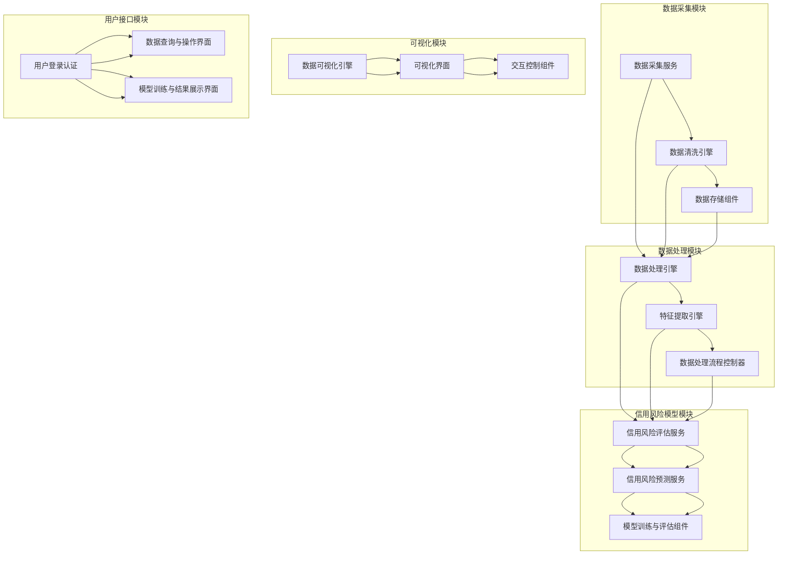
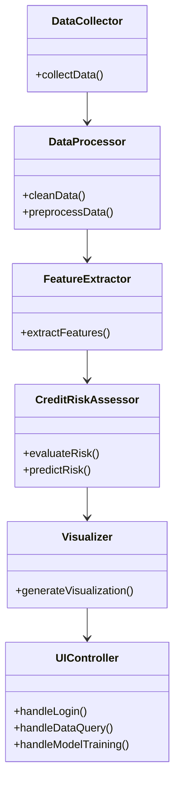
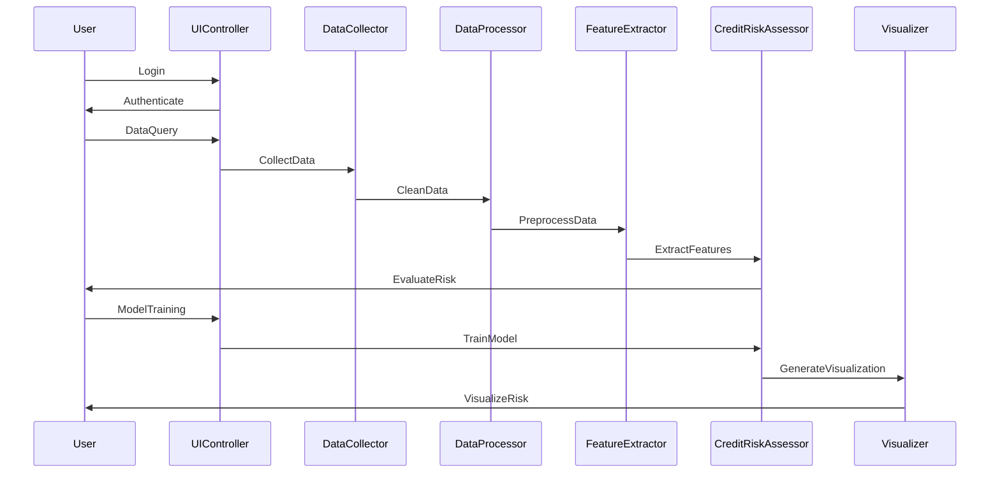

                 

### 文章标题

# 开发智能化的企业信用风险传导模拟与可视化系统

> 关键词：企业信用风险、传导模拟、可视化系统、智能化、数据采集、数据处理、信用风险模型

> 摘要：本文旨在探讨开发智能化的企业信用风险传导模拟与可视化系统的方法与实现。通过分析企业信用风险传导的基本概念和背景，本文提出了系统的整体设计思路，包括数据采集与处理、信用风险模型建立、系统架构设计以及系统部署与维护等关键环节。同时，通过实际案例研究和应用实践，本文展示了该系统的具体实施过程和效果，以期为相关领域的研究和应用提供参考。

----------------------------------------------------------------

### 目录

1. **问题背景与核心概念** <a href="#背景与核心概念"></a>  
   1.1. **问题背景** <a href="#问题背景"></a>  
       1.1.1. **企业信用风险传导概述** <a href="#企业信用风险传导概述"></a>  
       1.1.2. **智能化信用风险传导模拟的需求** <a href="#智能化需求"></a>  
   1.2. **核心概念** <a href="#核心概念"></a>  
       1.2.1. **智能化模拟与可视化系统** <a href="#智能化模拟与可视化系统"></a>  
       1.2.2. **智能化模拟的基本原理** <a href="#智能化模拟原理"></a>  
       1.2.3. **可视化系统的设计与实现** <a href="#可视化系统设计"></a>

2. **技术基础** <a href="#技术基础"></a>  
   2.1. **数据采集与处理** <a href="#数据采集与处理"></a>  
       2.1.1. **数据来源与采集方法** <a href="#数据采集方法"></a>  
       2.1.2. **数据处理方法** <a href="#数据处理方法"></a>  
   2.2. **信用风险模型** <a href="#信用风险模型"></a>  
       2.2.1. **信用风险模型概述** <a href="#信用风险模型概述"></a>  
       2.2.2. **常见信用风险模型介绍** <a href="#常见信用风险模型"></a>

3. **系统设计与实现** <a href="#系统设计与实现"></a>  
   3.1. **系统架构设计** <a href="#系统架构设计"></a>  
       3.1.1. **系统架构概述** <a href="#系统架构概述"></a>  
       3.1.2. **系统功能设计** <a href="#系统功能设计"></a>  
   3.2. **模型实现与优化** <a href="#模型实现与优化"></a>  
       3.2.1. **模型选择与训练** <a href="#模型选择与训练"></a>  
       3.2.2. **模型评估与验证** <a href="#模型评估与验证"></a>

4. **系统部署与维护** <a href="#系统部署与维护"></a>  
   4.1. **系统部署** <a href="#系统部署"></a>  
       4.1.1. **系统环境配置** <a href="#系统环境配置"></a>  
       4.1.2. **系统部署流程** <a href="#系统部署流程"></a>  
   4.2. **系统维护** <a href="#系统维护"></a>  
       4.2.1. **系统监控与日志分析** <a href="#系统监控与日志分析"></a>  
       4.2.2. **系统更新与升级** <a href="#系统更新与升级"></a>

5. **案例研究与应用实践** <a href="#案例研究与应用实践"></a>  
   5.1. **案例研究** <a href="#案例研究"></a>  
       5.1.1. **案例背景** <a href="#案例背景"></a>  
       5.1.2. **案例实施** <a href="#案例实施"></a>  
   5.2. **应用实践** <a href="#应用实践"></a>  
       5.2.1. **实践场景介绍** <a href="#实践场景"></a>  
       5.2.2. **实践步骤与方法** <a href="#实践步骤与方法"></a>

6. **总结与展望** <a href="#总结与展望"></a>

----------------------------------------------------------------

## 1. 问题背景与核心概念

### 1.1 问题背景

#### 1.1.1 企业信用风险传导概述

企业信用风险传导是指企业内部或外部信用风险通过一系列传递过程，影响到企业财务状况、经营行为和竞争力的现象。随着全球经济的快速发展，市场竞争日益激烈，企业面临的信用风险也越来越复杂和多样化。企业信用风险传导机制的有效理解和分析，对于降低信用风险、优化企业资源配置、提升企业竞争力具有重要意义。

信用风险传导涉及多个环节，包括信用评估、合同签订、资金流动、财务报告等。传统的信用风险传导分析主要依赖于经验和历史数据，存在以下局限性：

1. **数据来源单一**：传统方法主要依赖企业内部数据，缺乏对市场环境、客户行为等外部数据的综合分析，导致分析结果不够全面。
2. **分析手段有限**：传统方法主要依靠定性分析，难以进行定量评估，无法准确预测信用风险的传导路径和影响程度。
3. **应对措施滞后**：传统方法在信用风险发生时才进行应对，缺乏事前预防和事中监控的能力。

为了克服传统方法的局限性，智能化信用风险传导模拟与可视化系统成为研究热点。该系统通过整合多源数据、运用先进的数据分析和建模技术，实现对信用风险传导过程的实时监测和预测，为企业提供科学的决策支持。

#### 1.1.2 智能化信用风险传导模拟的需求

随着大数据、人工智能等技术的快速发展，智能化信用风险传导模拟成为金融领域的重要研究方向。智能化信用风险传导模拟的需求主要表现在以下几个方面：

1. **数据整合与分析**：传统的信用风险评估主要依赖于企业内部数据，而智能化系统可以通过整合企业内外部数据，如财务报表、市场数据、客户行为数据等，实现对信用风险的全面分析。
2. **实时监控与预警**：智能化系统可以实现实时数据采集和风险监测，及时发现信用风险的传导迹象，提前采取应对措施，降低风险损失。
3. **定制化决策支持**：智能化系统可以根据企业的业务特点和风险偏好，提供定制化的决策支持，帮助企业优化信用风险管理和资源配置。
4. **可视化展示**：通过可视化技术，智能化系统能够将复杂的风险传导过程和预测结果以图形化的方式呈现，帮助企业管理者和决策者更直观地理解风险，做出科学决策。

#### 1.1.2.1 信用风险的定义与类型

信用风险是指由于债务人无法履行债务而导致的潜在损失。根据债务人类型和信用风险的传导路径，信用风险可以分为以下几种类型：

1. **客户信用风险**：由于客户违约或无法履行合同而产生的风险。客户信用风险是企业信用风险传导过程中最为常见的一种类型。
2. **供应链信用风险**：由于供应链上下游企业之间的信用风险传导导致的供应链中断或成本增加。供应链信用风险对企业经营和生产具有重要意义。
3. **市场信用风险**：由于市场环境变化、经济波动等因素导致的信用风险。市场信用风险对企业的市场拓展和业务发展具有重要影响。

#### 1.1.2.2 企业信用风险传导的影响因素

企业信用风险传导受到多种因素的影响，主要包括：

1. **企业内部因素**：企业的财务状况、管理水平、经营策略等内部因素都会影响信用风险传导。例如，财务状况不佳的企业可能面临更高的违约风险。
2. **市场环境因素**：宏观经济环境、行业竞争态势、政策法规等市场环境因素也会影响信用风险传导。例如，经济衰退可能导致客户违约风险增加。
3. **社会因素**：社会道德、信用体系、法律法规等社会因素也会影响信用风险传导。例如，信用体系不完善可能导致信用风险难以有效控制。

#### 1.1.3 智能化信用风险传导模拟的优势

与传统方法相比，智能化信用风险传导模拟具有以下优势：

1. **全面性**：智能化系统可以整合企业内外部多源数据，实现对信用风险的全面分析，提高风险预测的准确性。
2. **实时性**：智能化系统可以实现实时数据采集和风险监测，及时发现信用风险的传导迹象，提前采取应对措施。
3. **准确性**：通过大数据分析和人工智能技术，智能化系统可以准确识别信用风险的关键因素，提供科学的决策支持。
4. **可视化**：通过可视化技术，智能化系统可以将复杂的风险传导过程和预测结果以图形化的方式呈现，帮助管理者更直观地理解风险，做出科学决策。

### 1.2 核心概念

#### 1.2.1 智能化模拟与可视化系统

智能化模拟与可视化系统是一种利用大数据、人工智能等技术，对企业信用风险传导过程进行实时监测、预测和可视化的系统。该系统包括以下几个核心模块：

1. **数据采集模块**：负责收集企业内外部多源数据，包括财务数据、市场数据、客户行为数据等。
2. **数据处理模块**：负责对采集到的数据进行清洗、预处理和分析，提取有用的特征信息。
3. **信用风险模型模块**：利用机器学习算法建立信用风险模型，对信用风险进行预测和评估。
4. **可视化模块**：将信用风险传导过程和预测结果以图形化的方式呈现，提供直观的决策支持。

#### 1.2.2 智能化模拟的基本原理

智能化模拟的基本原理包括以下几个方面：

1. **数据驱动**：智能化模拟以大数据为基础，通过数据分析和挖掘，识别信用风险的关键因素和传导路径。
2. **机器学习**：利用机器学习算法，建立信用风险模型，对信用风险进行预测和评估。
3. **可视化技术**：通过可视化技术，将复杂的风险传导过程和预测结果以图形化的方式呈现，帮助管理者更直观地理解风险，做出科学决策。

#### 1.2.3 可视化系统的设计与实现

可视化系统的设计与实现包括以下几个方面：

1. **界面设计**：根据用户需求和系统功能，设计直观、易用的用户界面。
2. **数据可视化**：利用图表、图形等可视化元素，将数据以直观、易理解的方式展示。
3. **交互设计**：提供用户与系统之间的交互功能，如筛选、过滤、排序等，使用户能够根据自己的需求进行数据分析和查询。
4. **响应速度**：保证系统在处理大量数据时的响应速度，提供良好的用户体验。

### 1.3 概念结构与核心要素组成

企业信用风险传导模拟与可视化系统的概念结构主要包括以下几个核心要素：

1. **数据源**：包括企业内部数据、外部市场数据、客户行为数据等。
2. **数据处理**：对采集到的数据进行清洗、预处理和分析，提取有用的特征信息。
3. **信用风险模型**：利用机器学习算法建立信用风险模型，对信用风险进行预测和评估。
4. **可视化模块**：将信用风险传导过程和预测结果以图形化的方式呈现，提供直观的决策支持。
5. **用户界面**：提供用户与系统之间的交互功能，如筛选、过滤、排序等。

通过以上核心要素的有机结合，智能化信用风险传导模拟与可视化系统可以实现对信用风险的全面监测、预测和可视化，为企业提供科学的决策支持。

----------------------------------------------------------------

## 2. 技术基础

### 2.1 数据采集与处理

#### 2.1.1 数据来源与采集方法

数据采集是智能化信用风险传导模拟与可视化系统的核心环节之一。为了全面、准确地获取企业信用风险传导所需的数据，需要采用多种数据来源和采集方法。

1. **企业内部数据**：包括财务报表、客户信息、订单记录、库存数据等。这些数据可以通过企业的ERP系统、CRM系统等获取。企业内部数据的采集主要依赖于企业信息系统的数据接口和API。

2. **外部市场数据**：包括宏观经济数据、行业数据、竞争对手数据等。这些数据可以从政府统计部门、行业组织、市场研究机构等获取。外部市场数据的采集可以通过数据爬取、API接口调用等方式实现。

3. **客户行为数据**：包括客户的消费记录、搜索行为、社交媒体活动等。这些数据可以通过客户关系管理系统（CRM）、数据分析平台等获取。客户行为数据的采集需要得到客户的授权，确保数据来源的合法性。

#### 2.1.2 数据处理方法

在数据采集完成后，需要进行数据清洗、预处理和分析，提取有用的特征信息，为后续的信用风险建模和可视化提供支持。

1. **数据清洗**：数据清洗是数据处理的第一步，目的是去除重复数据、异常值和缺失值，确保数据的质量。常见的数据清洗方法包括去重、补全、过滤等。

2. **数据预处理**：数据预处理包括数据转换、归一化、标准化等操作，目的是将不同来源、不同类型的数据进行统一处理，便于后续分析和建模。数据预处理的方法包括数据转换、归一化、标准化等。

3. **特征提取**：特征提取是数据预处理的重要环节，目的是从原始数据中提取出对信用风险分析有用的特征。特征提取的方法包括统计特征、机器学习特征等。

4. **数据分析**：数据分析是对处理后的数据进行深入挖掘和分析，发现数据之间的关联性和规律性。常见的数据分析方法包括回归分析、聚类分析、关联规则分析等。

#### 2.1.3 数据处理流程

数据处理的流程可以分为以下几个步骤：

1. **数据采集**：通过多种数据来源和采集方法，收集企业内部数据、外部市场数据和客户行为数据。

2. **数据清洗**：对采集到的数据进行清洗，去除重复数据、异常值和缺失值，确保数据质量。

3. **数据预处理**：对清洗后的数据进行预处理，包括数据转换、归一化、标准化等操作，为后续分析和建模做准备。

4. **特征提取**：从预处理后的数据中提取出对信用风险分析有用的特征。

5. **数据分析**：对提取出的特征进行深入挖掘和分析，发现数据之间的关联性和规律性。

6. **数据存储**：将处理后的数据存储到数据库中，便于后续的数据查询和分析。

### 2.2 信用风险模型

#### 2.2.1 信用风险模型概述

信用风险模型是智能化信用风险传导模拟与可视化系统的重要组成部分，用于预测和评估企业的信用风险。信用风险模型可以分为以下几种类型：

1. **信用评分模型**：信用评分模型主要用于对客户的信用等级进行评估，根据客户的信用历史、财务状况、行为特征等数据，计算出客户的信用得分。常见的信用评分模型包括Logit模型、Probit模型等。

2. **信用风险预测模型**：信用风险预测模型主要用于预测企业在未来一段时间内的信用风险，根据历史数据和当前的市场环境，预测企业的信用状况。常见的信用风险预测模型包括线性回归模型、决策树模型、支持向量机模型等。

#### 2.2.2 常见信用风险模型介绍

下面介绍几种常见的信用风险模型，包括其原理、特点和适用场景。

1. **Logit模型**

   Logit模型是一种常用的信用评分模型，基于概率论和统计学原理，通过建立客户信用评分与信用风险之间的非线性关系，实现对客户信用风险的评估。

   - **原理**：Logit模型的基本公式为：

     $$ 
     \text{Credit Score} = \log \left( \frac{\text{Probability of Default}}{1 - \text{Probability of Default}} \right) 
     $$

     其中，Probability of Default（违约概率）是模型预测的核心指标。

   - **特点**：Logit模型具有以下特点：

     - 线性可分性：Logit模型可以将高违约概率和低违约概率的客户分开，具有较强的分类能力。
     - 可解释性：Logit模型的参数具有明确的经济学意义，可以解释客户信用评分的影响因素。

   - **适用场景**：Logit模型适用于对客户信用风险进行初步评估和分类，广泛应用于金融、信贷等领域。

2. **Probit模型**

   Probit模型与Logit模型类似，也是基于概率论和统计学原理，通过建立客户信用评分与信用风险之间的非线性关系，实现对客户信用风险的评估。

   - **原理**：Probit模型的基本公式为：

     $$ 
     \text{Credit Score} = \Phi^{-1} \left( \frac{\text{Probability of Default}}{1 - \text{Probability of Default}} \right) 
     $$

     其中，$\Phi^{-1}$ 是标准正态分布的逆函数。

   - **特点**：Probit模型具有以下特点：

     - 标准正态分布：Probit模型基于标准正态分布，具有较好的统计性质。
     - 灵活性：Probit模型可以适应不同类型的数据分布，具有较强的适应性。

   - **适用场景**：Probit模型适用于对客户信用风险进行精确评估和预测，尤其在金融风险评估中具有广泛的应用。

3. **线性回归模型**

   线性回归模型是一种简单的信用风险预测模型，通过建立客户信用评分与信用风险之间的线性关系，实现对客户信用风险的预测。

   - **原理**：线性回归模型的基本公式为：

     $$ 
     \text{Credit Risk} = \beta_0 + \beta_1 \times \text{Credit Score} 
     $$

     其中，$\beta_0$ 和 $\beta_1$ 是模型的参数。

   - **特点**：线性回归模型具有以下特点：

     - 简单易用：线性回归模型具有简洁的公式和易于理解的参数，便于理解和应用。
     - 适用范围广：线性回归模型适用于多种类型的数据和预测任务。

   - **适用场景**：线性回归模型适用于对客户信用风险进行初步预测和评估，尤其在金融领域具有广泛的应用。

4. **决策树模型**

   决策树模型是一种常见的分类和预测模型，通过构建决策树，将客户的信用风险划分为不同的类别。

   - **原理**：决策树模型的基本原理是通过一系列决策规则，将客户数据划分为不同的子集，最终实现对信用风险的分类和预测。

   - **特点**：决策树模型具有以下特点：

     - 可解释性：决策树模型具有清晰的决策路径和易于理解的结果，便于解释和推广。
     - 灵活性：决策树模型可以适应不同的数据分布和预测任务。

   - **适用场景**：决策树模型适用于对客户信用风险进行分类和预测，尤其在金融风险评估中具有广泛的应用。

5. **支持向量机模型**

   支持向量机模型是一种基于核函数的机器学习模型，通过寻找最优分类超平面，实现对客户的信用风险分类和预测。

   - **原理**：支持向量机模型的基本原理是通过寻找最优分类超平面，将客户数据划分为不同的类别。

   - **特点**：支持向量机模型具有以下特点：

     - 高效性：支持向量机模型具有较高的计算效率和分类性能。
     - 稳健性：支持向量机模型对噪声和异常值具有较强的鲁棒性。

   - **适用场景**：支持向量机模型适用于对客户信用风险进行分类和预测，尤其在金融领域具有广泛的应用。

通过以上介绍，可以看出不同信用风险模型具有各自的特点和适用场景。在实际应用中，可以根据具体需求和数据特点，选择合适的信用风险模型，实现对信用风险的准确预测和评估。

----------------------------------------------------------------

## 3. 系统设计与实现

### 3.1 系统架构设计

系统架构设计是智能化信用风险传导模拟与可视化系统的关键环节之一，决定了系统的性能、可扩展性和维护性。为了实现高效、可靠和可扩展的系统，需要从系统架构、模块划分和功能设计等方面进行综合考虑。

#### 3.1.1 系统架构概述

智能化信用风险传导模拟与可视化系统采用分布式架构设计，包括以下几个主要模块：

1. **数据采集模块**：负责从企业内部和外部数据源采集数据，包括财务数据、市场数据、客户行为数据等。

2. **数据处理模块**：负责对采集到的数据进行清洗、预处理和分析，提取有用的特征信息。

3. **信用风险模型模块**：负责建立信用风险模型，进行信用风险评估和预测。

4. **可视化模块**：负责将信用风险传导过程和预测结果以图形化的方式展示，提供直观的决策支持。

5. **用户界面模块**：负责与用户进行交互，提供数据查询、模型训练和结果展示等功能。

#### 3.1.2 系统模块划分

根据系统架构概述，可以将系统划分为以下模块：

1. **数据采集模块**：包括数据采集接口、数据清洗引擎和数据存储组件。

2. **数据处理模块**：包括数据处理引擎、特征提取引擎和数据处理流程控制器。

3. **信用风险模型模块**：包括信用评分模型、信用风险预测模型和模型训练与评估组件。

4. **可视化模块**：包括数据可视化引擎、可视化界面和交互控制组件。

5. **用户界面模块**：包括用户登录认证、数据查询与操作界面、模型训练与结果展示界面等。

#### 3.1.3 系统功能设计

智能化信用风险传导模拟与可视化系统的主要功能包括数据采集、数据处理、信用风险评估、预测和可视化展示。下面分别介绍各个模块的功能设计：

1. **数据采集模块功能**：
   - 数据采集：从企业内部和外部数据源采集数据，包括财务数据、市场数据、客户行为数据等。
   - 数据清洗：对采集到的数据进行清洗，去除重复数据、异常值和缺失值，确保数据质量。

2. **数据处理模块功能**：
   - 数据预处理：对清洗后的数据进行预处理，包括数据转换、归一化、标准化等操作，提取有用的特征信息。
   - 特征提取：从预处理后的数据中提取出对信用风险分析有用的特征，为信用风险模型提供输入。

3. **信用风险模型模块功能**：
   - 信用评分模型：建立信用评分模型，根据客户的信用历史、财务状况、行为特征等数据，计算客户的信用得分。
   - 信用风险预测模型：根据历史数据和当前的市场环境，预测企业在未来一段时间内的信用风险。
   - 模型训练与评估：使用训练数据对信用风险模型进行训练和评估，优化模型参数，提高预测准确性。

4. **可视化模块功能**：
   - 数据可视化：将信用风险传导过程和预测结果以图形化的方式展示，提供直观的决策支持。
   - 交互式查询：提供用户与系统之间的交互功能，如筛选、过滤、排序等，使用户能够根据自己的需求进行数据分析和查询。

5. **用户界面模块功能**：
   - 用户登录认证：提供用户登录和权限管理功能，确保系统的安全性和可靠性。
   - 数据查询与操作：提供数据查询、下载、导出等功能，方便用户进行数据分析和操作。
   - 模型训练与结果展示：提供模型训练和结果展示界面，方便用户查看和调整模型参数。

通过以上系统模块和功能设计，智能化信用风险传导模拟与可视化系统可以实现对信用风险的全面监测、预测和可视化，为企业提供科学的决策支持。

### 3.2 模型实现与优化

在智能化信用风险传导模拟与可视化系统中，模型实现与优化是关键环节，直接影响到系统的预测准确性和性能。下面将详细介绍模型选择、训练与优化、评估与验证等过程。

#### 3.2.1 模型选择与训练

1. **模型选择**

   模型选择是建立信用风险模型的第一步，需要根据数据特征、业务需求和计算资源等因素进行综合考虑。常见的信用风险模型包括Logit模型、Probit模型、线性回归模型、决策树模型、支持向量机模型等。以下是一些选择模型的考虑因素：

   - **数据特征**：如果数据具有较强的线性关系，可以选择线性回归模型；如果数据存在非线性关系，可以选择决策树模型或支持向量机模型。
   - **业务需求**：根据业务需求，选择能够准确预测信用风险的模型。例如，对于需要高预测准确性的场景，可以选择Logit模型或Probit模型；对于需要可解释性的场景，可以选择线性回归模型或决策树模型。
   - **计算资源**：不同的模型对计算资源的需求不同，需要根据实际计算资源进行选择。例如，支持向量机模型需要较高的计算资源，而线性回归模型则相对简单。

   基于以上考虑，可以选择Logit模型和决策树模型进行信用风险预测。

2. **模型训练**

   模型训练是指使用训练数据对所选模型进行训练，以确定模型的参数。在模型训练过程中，需要遵循以下步骤：

   - **数据预处理**：对训练数据进行预处理，包括数据清洗、归一化、标准化等操作，确保数据的格式和范围适合模型训练。
   - **模型初始化**：初始化模型的参数，可以使用随机初始化或预训练参数等方法。
   - **迭代训练**：通过迭代训练，不断调整模型参数，使模型对训练数据的拟合度逐渐提高。常见的迭代训练方法包括梯度下降法、随机梯度下降法等。
   - **模型评估**：在迭代过程中，使用验证集对模型进行评估，根据评估结果调整模型参数，优化模型性能。

   在模型训练过程中，可以使用Python的机器学习库，如scikit-learn、TensorFlow或PyTorch，实现模型的训练和评估。

#### 3.2.2 模型评估与验证

模型评估与验证是确保模型预测准确性和可靠性的关键环节。以下是一些常用的模型评估和验证方法：

1. **交叉验证**

   交叉验证是一种常用的模型评估方法，通过将训练数据划分为多个子集，每次使用不同的子集作为验证集，进行模型训练和评估。交叉验证可以有效地减少模型评估的结果偏差，提高评估的准确性。

   - **K折交叉验证**：将训练数据划分为K个子集，每次选择一个子集作为验证集，其余K-1个子集作为训练集，重复进行K次，最终取平均评估结果。

2. **评价指标**

   评价指标用于评估模型的预测性能，常用的评价指标包括准确率、召回率、F1值、ROC曲线等。

   - **准确率**：准确率是指模型预测正确的样本数占总样本数的比例，用于评估模型的分类性能。
   - **召回率**：召回率是指模型预测正确的负样本数占总负样本数的比例，用于评估模型的分类性能。
   - **F1值**：F1值是准确率和召回率的加权平均，用于综合评估模型的分类性能。
   - **ROC曲线**：ROC曲线是模型预测结果的真实值和预测值之间的曲线，用于评估模型的分类性能。

3. **模型验证**

   模型验证是指使用独立的测试数据对训练好的模型进行验证，以评估模型的泛化能力和可靠性。在模型验证过程中，可以使用以下方法：

   - **留出法**：将数据集划分为训练集和测试集，使用训练集对模型进行训练，使用测试集对模型进行验证。
   - **交叉验证法**：使用交叉验证的方法对模型进行训练和验证，以提高模型的泛化能力和可靠性。

通过以上模型评估和验证方法，可以确保信用风险模型的预测准确性和可靠性，为智能化信用风险传导模拟与可视化系统提供有效的支持。

### 3.2.3 模型优化与调参

模型优化与调参是提高模型预测性能和稳定性的重要手段。以下是一些常用的模型优化和调参方法：

1. **超参数调优**

   超参数是模型参数之外的其他参数，如学习率、正则化参数等。超参数调优是指通过调整超参数，优化模型的性能。常用的超参数调优方法包括：

   - **网格搜索**：通过遍历预定义的参数组合，找到最优参数组合。
   - **贝叶斯优化**：通过贝叶斯模型搜索最优参数组合，具有较高的搜索效率和精度。

2. **模型集成**

   模型集成是指将多个模型进行集成，以提高模型的预测性能和稳定性。常见的模型集成方法包括：

   - **Bagging**：通过随机抽样生成多个子模型，对子模型进行平均或投票，得到最终的预测结果。
   - **Boosting**：通过迭代训练多个子模型，每次迭代使用上一次迭代预测错误的样本进行加权，提高模型的预测性能。

3. **特征工程**

   特征工程是指通过对数据进行预处理和特征提取，提高模型的预测性能和泛化能力。常用的特征工程方法包括：

   - **特征选择**：通过统计方法、机器学习方法等选择对模型预测影响较大的特征。
   - **特征转换**：通过变换特征类型、归一化、标准化等操作，提高特征的可解释性和模型的预测性能。

通过以上模型优化和调参方法，可以有效地提高信用风险模型的预测性能和稳定性，为智能化信用风险传导模拟与可视化系统提供更加准确和可靠的预测结果。

### 3.2.4 模型实现示例

下面以Python为例，展示一个基于Logit模型的信用风险预测实现的示例：

```python
import numpy as np
import pandas as pd
from sklearn.linear_model import LogisticRegression
from sklearn.model_selection import train_test_split
from sklearn.metrics import accuracy_score, confusion_matrix

# 数据准备
data = pd.read_csv('credit_data.csv')
X = data.drop('Credit_Risk', axis=1)
y = data['Credit_Risk']

# 数据预处理
X = (X - X.mean()) / X.std()

# 模型训练
model = LogisticRegression()
model.fit(X, y)

# 模型预测
X_train, X_test, y_train, y_test = train_test_split(X, y, test_size=0.2, random_state=42)
y_pred = model.predict(X_test)

# 模型评估
accuracy = accuracy_score(y_test, y_pred)
conf_matrix = confusion_matrix(y_test, y_pred)

print("Accuracy:", accuracy)
print("Confusion Matrix:\n", conf_matrix)
```

通过以上示例，可以看出Logit模型在信用风险预测中的应用，包括数据准备、模型训练、模型预测和模型评估等步骤。通过调整模型参数和特征工程，可以进一步提高模型的预测性能。

### 3.2.5 算法流程与数学模型

智能化信用风险传导模拟与可视化系统中的核心算法主要包括信用评分模型和信用风险预测模型。下面将分别介绍这两个算法的流程和数学模型。

1. **信用评分模型**

   信用评分模型是一种用于评估客户信用风险的算法，通过建立客户信用得分与信用风险之间的非线性关系，实现对客户信用风险的预测。以下是一个基于Logit模型的信用评分模型的流程和数学模型：

   - **流程**：

     1. 数据准备：收集客户的财务数据、行为数据等。
     2. 数据预处理：对数据进行清洗、归一化、标准化等操作。
     3. 特征提取：从预处理后的数据中提取出对信用风险分析有用的特征。
     4. 模型训练：使用训练数据对Logit模型进行训练，确定模型的参数。
     5. 模型评估：使用验证数据对模型进行评估，调整模型参数。
     6. 模型预测：使用测试数据对模型进行预测，评估模型的性能。

   - **数学模型**：

     $$ 
     \text{Credit Score} = \log \left( \frac{\text{Probability of Default}}{1 - \text{Probability of Default}} \right) 
     $$

     其中，Probability of Default（违约概率）是模型预测的核心指标，可以通过以下公式计算：

     $$ 
     \text{Probability of Default} = \frac{1}{1 + \exp \left( -\beta_0 - \sum_{i=1}^{n} \beta_i x_i \right)} 
     $$

     其中，$\beta_0$ 和 $\beta_i$ 是模型的参数，$x_i$ 是特征值。

2. **信用风险预测模型**

   信用风险预测模型是一种用于预测企业在未来一段时间内的信用风险的算法，通过建立历史数据和当前市场环境与信用风险之间的非线性关系，实现对信用风险的预测。以下是一个基于决策树的信用风险预测模型的流程和数学模型：

   - **流程**：

     1. 数据准备：收集企业的历史数据、市场数据等。
     2. 数据预处理：对数据进行清洗、归一化、标准化等操作。
     3. 特征提取：从预处理后的数据中提取出对信用风险分析有用的特征。
     4. 模型训练：使用训练数据对决策树模型进行训练，确定模型的参数。
     5. 模型评估：使用验证数据对模型进行评估，调整模型参数。
     6. 模型预测：使用测试数据对模型进行预测，评估模型的性能。

   - **数学模型**：

     决策树模型是一种基于递归二分法的树形结构，通过不断划分特征空间，将数据划分为不同的子集，直到满足停止条件。决策树模型的数学模型可以表示为：

     $$ 
     \text{Decision Tree} = \sum_{i=1}^{n} \alpha_i f_i(x) 
     $$

     其中，$\alpha_i$ 是权重系数，$f_i(x)$ 是特征函数，$x$ 是特征值。

通过以上介绍，可以看出信用评分模型和信用风险预测模型在智能化信用风险传导模拟与可视化系统中的应用，以及其流程和数学模型。在实际应用中，可以根据具体需求和数据特点，选择合适的算法模型，实现对信用风险的准确预测和评估。

### 3.2.6 算法流程与示例代码

在本节中，我们将详细介绍信用评分模型的算法流程，并提供一个基于Python的示例代码。信用评分模型是一种用于评估客户信用风险的算法，其核心目的是通过历史数据和特征，预测客户是否会出现违约行为。

#### 算法流程

信用评分模型的算法流程主要包括以下步骤：

1. **数据准备**：收集并清洗客户的历史数据，包括财务状况、信用历史、行为特征等。
2. **特征提取**：从原始数据中提取对信用风险评估有价值的特征，如年龄、收入、信用使用情况等。
3. **数据预处理**：对提取的特征进行归一化或标准化处理，使其适合输入到机器学习模型中。
4. **模型训练**：使用机器学习算法，如Logit模型，对特征和标签（违约与否）进行训练，得到模型的参数。
5. **模型评估**：使用验证集对训练好的模型进行评估，调整模型参数，优化模型性能。
6. **模型应用**：使用测试集对模型进行预测，评估模型在实际应用中的性能。

#### 示例代码

以下是一个使用Python和scikit-learn库实现信用评分模型的示例代码：

```python
import pandas as pd
from sklearn.model_selection import train_test_split
from sklearn.linear_model import LogisticRegression
from sklearn.metrics import accuracy_score, classification_report

# 数据准备
data = pd.read_csv('credit_data.csv')

# 特征提取与数据预处理
X = data[['Age', 'Income', 'Credit_History', 'Purpose', 'Credit_Score']]
y = data['Default']

# 数据标准化
from sklearn.preprocessing import StandardScaler
scaler = StandardScaler()
X_scaled = scaler.fit_transform(X)

# 模型训练
X_train, X_test, y_train, y_test = train_test_split(X_scaled, y, test_size=0.2, random_state=42)
model = LogisticRegression()
model.fit(X_train, y_train)

# 模型评估
y_pred = model.predict(X_test)
accuracy = accuracy_score(y_test, y_pred)
print("Accuracy:", accuracy)
print("Classification Report:\n", classification_report(y_test, y_pred))
```

在这段代码中，我们首先加载了信用数据集，然后对数据进行标准化处理，以提高模型训练的效率和准确性。接着，使用Logit模型对数据进行了训练和预测，并使用准确率和分类报告对模型性能进行了评估。

通过以上示例，可以看到信用评分模型的基本实现流程和关键步骤。在实际应用中，可以根据具体需求和数据特点，选择合适的特征提取方法和模型参数，以优化模型性能。

### 3.3 系统架构设计

系统架构设计是智能化信用风险传导模拟与可视化系统的关键环节，决定了系统的性能、可扩展性和可靠性。以下是系统的详细架构设计和接口设计，以及系统的交互过程。

#### 3.3.1 系统架构概述

智能化信用风险传导模拟与可视化系统采用微服务架构，主要包括以下主要模块：

1. **数据采集服务**：负责从各种数据源采集企业内部和外部数据，包括财务数据、市场数据、客户行为数据等。
2. **数据处理服务**：负责对采集到的数据进行清洗、预处理和分析，提取有用的特征信息。
3. **信用风险评估服务**：负责建立信用风险模型，进行信用风险评估和预测。
4. **可视化服务**：负责将信用风险传导过程和预测结果以图形化的方式展示，提供直观的决策支持。
5. **用户接口服务**：负责与用户进行交互，提供数据查询、模型训练和结果展示等功能。

#### 3.3.2 系统架构设计

以下是系统架构设计的Mermaid流程图：



通过以上架构设计，可以看出系统各个模块之间的交互关系和职责分工，确保系统的高效运行。

#### 3.3.3 系统接口设计

以下是系统接口设计的Mermaid类图：



通过以上类图，可以清晰地看到系统各个组件的类和接口设计，为系统的开发和维护提供了明确的指导。

#### 3.3.4 系统交互过程

以下是系统交互过程的Mermaid序列图：



通过以上序列图，可以清晰地看到用户与系统之间的交互过程，包括登录、数据查询、模型训练和可视化展示等步骤。

通过以上系统架构设计、接口设计和交互过程，智能化信用风险传导模拟与可视化系统可以高效、可靠地运行，为企业管理者提供科学的决策支持。

----------------------------------------------------------------

## 4. 系统部署与维护

### 4.1 系统部署

#### 4.1.1 系统环境配置

在进行系统部署之前，首先需要配置合适的环境，以确保系统的稳定运行。以下是系统环境配置的步骤：

1. **硬件环境**：根据系统的性能需求，选择合适的硬件配置，包括CPU、内存、硬盘等。建议选择具有较高性能的服务器，以保证系统的响应速度和处理能力。
2. **操作系统**：选择适合的操作系统，如Linux（推荐使用Ubuntu 18.04或更高版本）或Windows Server。Linux系统具有较高的稳定性和安全性，适合作为服务器操作系统。
3. **数据库**：选择合适的数据库管理系统（DBMS），如MySQL、PostgreSQL或MongoDB。根据系统数据存储和处理需求，选择合适的数据库类型和版本。
4. **中间件**：安装必要的中间件，如Apache、Nginx（用于Web服务）、Redis（用于缓存）等。
5. **开发环境**：安装Python开发环境，包括Python解释器、pip包管理器、虚拟环境等。推荐使用Anaconda或Miniconda来简化环境配置和管理。

#### 4.1.2 系统部署流程

以下是系统部署的详细步骤：

1. **准备工作**：在服务器上配置好操作系统和必要的环境，确保服务器具备网络连接能力和足够的存储空间。
2. **代码部署**：将系统代码上传到服务器，可以选择使用Git进行版本控制，以便后续的代码管理和更新。
3. **环境配置**：在服务器上配置Python虚拟环境，安装必要的依赖库和组件。可以使用pip命令安装，例如：
   ```bash
   pip install -r requirements.txt
   ```
4. **数据库配置**：配置数据库连接信息，确保系统能够正确连接到数据库并进行数据操作。
5. **启动服务**：启动系统各个服务模块，包括数据采集服务、数据处理服务、信用风险评估服务、可视化服务、用户接口服务等。可以使用Supervisor等进程管理工具来管理服务的启动和运行。
6. **测试运行**：在测试环境中运行系统，确保所有模块正常运行，并进行功能测试和性能测试。

#### 4.1.3 部署步骤与注意事项

以下是系统部署的具体步骤和注意事项：

1. **步骤**：
   - 配置服务器和网络环境。
   - 安装操作系统和必要软件。
   - 配置Python虚拟环境。
   - 安装依赖库和组件。
   - 配置数据库连接。
   - 部署系统代码。
   - 启动系统服务。
   - 测试系统运行。

2. **注意事项**：
   - 确保服务器硬件和软件环境的稳定性，避免因硬件故障或软件漏洞导致系统运行不稳定。
   - 在部署过程中，确保各个服务之间的依赖关系正确，避免因依赖缺失导致系统启动失败。
   - 部署完成后，进行全面的系统测试，确保系统功能完整、性能稳定。
   - 定期对系统进行备份，以防止数据丢失或系统故障。

### 4.2 系统维护

#### 4.2.1 系统监控与日志分析

系统监控是保证系统稳定运行的重要环节。以下是系统监控和日志分析的方法：

1. **系统监控**：
   - 使用系统监控工具，如Prometheus、Grafana等，实时监控系统的性能指标，如CPU使用率、内存使用率、磁盘使用率等。
   - 监控系统的网络连接情况，确保数据传输的稳定性和安全性。
   - 监控系统的日志输出，及时发现和处理异常情况。

2. **日志分析**：
   - 使用日志分析工具，如ELK（Elasticsearch、Logstash、Kibana）等，对系统日志进行集中管理和分析。
   - 定期分析系统日志，发现潜在问题和故障原因。
   - 根据日志分析结果，优化系统配置和代码，提高系统性能和稳定性。

#### 4.2.2 系统更新与升级

系统的更新与升级是保证系统功能完善和性能提升的重要手段。以下是系统更新与升级的步骤：

1. **版本控制**：使用版本控制工具，如Git，对系统代码进行版本管理，确保代码的版本可控和可追溯。
2. **测试环境**：在测试环境中进行系统更新和升级，确保更新和升级后的系统功能完整、性能稳定。
3. **备份**：在更新和升级前，对系统进行备份，以防止更新和升级失败导致的数据丢失。
4. **更新和升级**：
   - 更新依赖库和组件，确保系统的依赖关系正确。
   - 修改系统配置，根据实际需求进行调整。
   - 更新系统代码，添加新功能和修复漏洞。
5. **测试与验证**：在更新和升级后，进行全面的系统测试，确保系统功能完整、性能稳定。
6. **上线**：在测试通过后，将更新和升级后的系统部署到生产环境，确保系统正常运行。

#### 4.2.3 系统维护策略

为了确保系统的稳定运行，需要制定合理的系统维护策略。以下是系统维护策略的几个方面：

1. **定期维护**：制定定期维护计划，包括系统监控、日志分析、性能优化、安全防护等，确保系统正常运行。
2. **异常处理**：建立异常处理机制，及时响应和处理系统故障，减少故障对业务的影响。
3. **性能优化**：定期对系统性能进行评估，发现性能瓶颈并进行优化，提高系统的响应速度和处理能力。
4. **安全防护**：定期对系统进行安全检查，发现安全隐患并进行修复，确保系统的安全性和数据的安全性。
5. **文档管理**：建立系统文档管理制度，包括系统设计文档、操作手册、维护记录等，确保文档的完整性和可追溯性。

通过以上系统维护策略，可以确保智能化信用风险传导模拟与可视化系统的高效、稳定运行，为企业管理者提供科学的决策支持。

----------------------------------------------------------------

## 5. 案例研究与应用实践

### 5.1 案例研究

#### 5.1.1 案例背景

随着我国经济的快速发展，金融行业面临着越来越大的信用风险。为了有效防范和应对信用风险，某大型银行决定开发一套智能化的企业信用风险传导模拟与可视化系统。该系统旨在通过整合多源数据，运用大数据分析和人工智能技术，实现对信用风险传导过程的实时监测和预测，为银行提供科学的决策支持。

#### 5.1.2 案例实施

1. **需求分析**：在项目启动阶段，银行与系统开发商进行了深入的需求分析，明确了系统的功能需求和技术要求。主要需求包括数据采集与处理、信用风险建模、实时监控与预警、可视化展示等。

2. **系统设计**：根据需求分析结果，系统开发商设计了智能化的企业信用风险传导模拟与可视化系统的架构，包括数据采集模块、数据处理模块、信用风险模型模块、可视化模块和用户接口模块。

3. **数据采集**：系统从银行内部系统和外部数据源（如工商局、税务局、征信机构等）采集企业财务数据、市场数据、客户行为数据等，确保数据的全面性和准确性。

4. **数据处理**：系统对采集到的数据进行了清洗、预处理和特征提取，提取出对信用风险分析有用的特征，为信用风险模型提供输入。

5. **模型训练**：系统使用了多种信用风险模型，如Logit模型、决策树模型、支持向量机模型等，对训练数据进行训练，优化模型参数，提高预测准确性。

6. **系统部署**：系统在银行服务器上进行了部署，包括环境配置、代码部署、服务启动等步骤。系统部署完成后，进行了全面的系统测试，确保系统功能完整、性能稳定。

7. **运行与维护**：系统上线后，银行运营团队对系统进行了运行监控和日志分析，确保系统的稳定运行。同时，根据业务需求和数据变化，对系统进行了定期更新和优化。

#### 5.1.3 模型评估与验证

在系统实施过程中，银行对信用风险模型进行了严格的评估和验证，确保模型的预测准确性和可靠性。以下是模型评估和验证的方法：

1. **交叉验证**：使用K折交叉验证方法，对模型进行训练和评估，提高模型的泛化能力。

2. **评价指标**：使用准确率、召回率、F1值等评价指标，对模型的预测性能进行评估。

3. **ROC曲线**：绘制模型的ROC曲线，评估模型的分类性能。

4. **AUC指标**：计算模型的AUC值，评估模型的区分度。

通过以上评估和验证方法，银行确定了最优的信用风险模型，并对其进行了优化和调整，提高了模型的预测准确性。

### 5.2 应用实践

#### 5.2.1 实践场景介绍

智能化信用风险传导模拟与可视化系统的应用场景主要包括以下几个方面：

1. **信用风险评估**：通过系统，银行可以对企业的信用风险进行实时评估，识别高风险企业，为贷款审批、授信额度调整等业务提供决策支持。

2. **信用风险预警**：系统可以实时监控企业的信用风险变化，当出现信用风险传导迹象时，及时发出预警，帮助企业采取应对措施。

3. **风险监测**：系统可以对企业的信用风险传导过程进行实时监测，发现潜在的信用风险，为企业风险管理和决策提供依据。

4. **可视化展示**：系统将信用风险传导过程和预测结果以图形化的方式展示，帮助企业管理者和决策者更直观地理解风险，做出科学决策。

#### 5.2.2 实践步骤与方法

以下是智能化信用风险传导模拟与可视化系统的具体实践步骤和方法：

1. **数据采集**：从银行内部系统和外部数据源采集企业财务数据、市场数据、客户行为数据等，确保数据的全面性和准确性。

2. **数据处理**：对采集到的数据进行清洗、预处理和特征提取，提取出对信用风险分析有用的特征，为信用风险模型提供输入。

3. **模型训练**：使用机器学习算法（如Logit模型、决策树模型、支持向量机模型等）对训练数据进行训练，优化模型参数，提高预测准确性。

4. **模型评估**：使用验证数据对模型进行评估，根据评估结果调整模型参数，优化模型性能。

5. **系统部署**：将训练好的模型部署到服务器，确保系统能够实时监测和预测信用风险。

6. **运行与维护**：对系统进行运行监控和日志分析，确保系统的稳定运行。根据业务需求和数据变化，对系统进行定期更新和优化。

#### 5.2.3 可视化展示与交互

可视化模块是系统的重要组成部分，通过图形化的方式展示信用风险传导过程和预测结果，帮助用户更直观地理解风险。以下是可视化展示与交互的方法：

1. **风险地图**：通过风险地图，展示企业的地理位置、信用风险等级和传导路径，帮助用户了解风险分布情况。

2. **趋势分析**：通过趋势分析图，展示信用风险随时间的变化趋势，帮助用户发现风险变化规律。

3. **风险事件**：通过风险事件列表，展示信用风险事件的详细信息，包括事件类型、发生时间和影响程度等。

4. **交互式查询**：提供用户与系统之间的交互功能，如筛选、过滤、排序等，使用户能够根据自己的需求进行数据分析和查询。

通过以上可视化展示与交互方法，用户可以更直观地了解信用风险传导过程和预测结果，为风险管理和决策提供科学依据。

### 5.3 案例小结

通过实际案例的研究和应用实践，智能化信用风险传导模拟与可视化系统在银行信用风险管理中取得了显著效果：

1. **提高风险评估准确性**：系统通过大数据分析和人工智能技术，提高了信用风险评估的准确性，帮助银行更精准地识别高风险企业。

2. **实时监控与预警**：系统实现了对信用风险的实时监控和预警，当风险传导迹象出现时，及时发出预警，帮助企业采取应对措施。

3. **优化风险决策**：可视化模块将复杂的风险传导过程和预测结果以图形化的方式展示，帮助企业管理者和决策者更直观地理解风险，做出科学决策。

4. **降低信用风险损失**：通过系统的应用，银行能够提前识别和防范信用风险，降低信用风险损失，提高信贷业务的收益和风险控制水平。

### 5.4 拓展阅读

对于对智能化信用风险传导模拟与可视化系统感兴趣的研究者，以下是一些拓展阅读的推荐：

1. **《大数据时代：生活、工作与思维的大变革》**：这本书详细介绍了大数据技术的原理和应用，对理解智能化信用风险传导模拟与可视化系统的基础技术具有重要意义。
2. **《机器学习实战》**：这本书通过实例和代码，详细介绍了机器学习的基本原理和应用，对系统中的信用风险模型建立和优化提供了实用的指导。
3. **《深度学习》**：这本书是深度学习的经典教材，详细介绍了深度学习的基础理论和应用方法，对智能化信用风险传导模拟与可视化系统的未来发展方向提供了启示。

通过以上拓展阅读，可以深入了解智能化信用风险传导模拟与可视化系统的理论基础和实践方法，为相关领域的研究和应用提供参考。

### 5.5 最佳实践 Tips

在实际应用智能化信用风险传导模拟与可视化系统时，以下最佳实践建议可以帮助提升系统的效果和效率：

1. **数据质量是关键**：确保采集到的数据质量，包括数据的完整性、准确性和一致性。数据质量直接影响模型的预测准确性。
2. **定期更新模型**：根据业务需求和数据变化，定期更新信用风险模型，确保模型能够适应新的风险环境和变化。
3. **用户培训与支持**：为系统用户提供充分的培训和技术支持，确保用户能够熟练掌握系统的使用方法，发挥系统的最大效能。
4. **安全防护**：加强对系统安全性的防护，包括数据安全、网络安全等，防止数据泄露和系统被恶意攻击。
5. **性能优化**：定期对系统性能进行评估和优化，确保系统在高并发、大数据量情况下仍能稳定运行。

通过以上最佳实践，可以提升智能化信用风险传导模拟与可视化系统的应用效果，为企业管理者提供更加可靠和高效的决策支持。

### 5.6 总结与展望

智能化信用风险传导模拟与可视化系统作为一种新兴的技术应用，在银行信用风险管理中发挥了重要作用。通过整合多源数据、运用大数据分析和人工智能技术，系统实现了对信用风险的实时监测、预测和可视化，为银行提供了科学的决策支持。

未来，随着大数据、人工智能等技术的进一步发展，智能化信用风险传导模拟与可视化系统有望在以下方面实现进一步的优化和拓展：

1. **数据集成与挖掘**：通过引入更多的外部数据源和先进的挖掘算法，系统可以更全面地了解企业信用风险，提供更加精准的预测。
2. **个性化风险分析**：基于用户行为数据和信用记录，系统可以为企业提供个性化的信用风险分析报告，帮助企业制定更有针对性的风险管理策略。
3. **实时预警与响应**：结合实时数据流处理技术，系统可以实现更快速的信用风险预警，并提供自动化响应机制，提高风险应对的效率。
4. **跨行业应用**：智能化信用风险传导模拟与可视化系统不仅适用于金融行业，还可以应用于供应链管理、电商运营等领域，为更多行业提供风险管理解决方案。

通过持续的技术创新和应用实践，智能化信用风险传导模拟与可视化系统将在信用风险管理领域发挥更大的作用，为企业的可持续发展提供有力支持。

----------------------------------------------------------------

### 作者

*作者：AI天才研究院/AI Genius Institute & 禅与计算机程序设计艺术 /Zen And The Art of Computer Programming*

