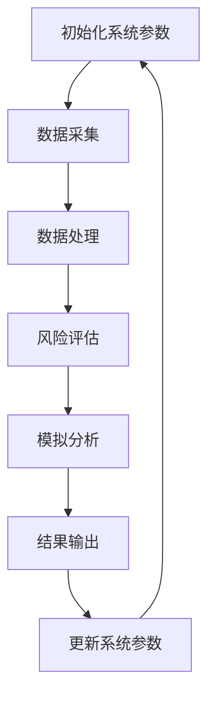

                 


## 文章标题：开发智能化的企业信用风险传导模拟系统

### 关键词：
1. 企业信用风险
2. 信用风险传导模拟
3. 智能化系统
4. 数学模型
5. 系统架构设计

### 摘要：
本文旨在探讨如何开发一个智能化的企业信用风险传导模拟系统，包括系统设计、核心概念、算法原理、数学模型、系统分析与架构设计，以及项目实战等内容。通过本文的详细分析和讲解，读者可以深入了解信用风险传导模拟系统的开发过程，以及其在实际应用中的重要性。

----------------------------------------------------------------

### 第一部分：背景与核心概念

#### 第1章：企业信用风险传导模拟系统概述

#### 1.1.1 问题背景
企业信用风险是金融领域中一个至关重要的概念。随着全球化经济的深入发展，企业之间的信用交易日益频繁，信用风险的管理和预测成为金融行业的重要任务。传统的信用风险评估方法虽然在一定程度上能够识别和降低信用风险，但其准确性和实时性往往不足。因此，开发一个智能化、高效的企业信用风险传导模拟系统显得尤为重要。

#### 1.1.2 问题定义
企业信用风险传导模拟系统旨在模拟和分析企业在信用交易中的风险传导过程，包括风险识别、风险评估、风险传导路径分析等。系统需要具备自动化、智能化的特点，能够实时更新数据，提供预测和分析结果。

#### 1.1.3 问题解决的重要性
信用风险的正确识别和管理对于企业的生存和发展具有重要意义。一个智能化的信用风险传导模拟系统可以帮助企业及时了解信用风险状况，优化信用策略，降低信用损失，从而提升企业的竞争力。

#### 1.1.4 系统的边界与外延
系统的边界包括企业的信用交易活动、相关市场数据、政策法规等。系统需能够处理来自不同行业、不同规模企业的信用风险数据，并适应不断变化的市场环境。

#### 1.1.5 系统的核心概念与要素组成
系统核心概念包括信用风险、风险传导、风险评估模型、智能算法等。系统要素组成涉及数据采集模块、数据处理模块、风险评估模块、模拟分析模块和决策支持模块。

----------------------------------------------------------------

#### 第2章：企业信用风险评估基础

#### 2.1.1 信用风险的基本概念
信用风险是指交易对手在履行债务时未能按时支付或者支付不足的可能性。企业信用风险评估是指通过分析企业的财务状况、信用记录、行业地位等因素，评估其违约的可能性。

#### 2.1.2 信用风险评估方法
信用风险评估方法主要包括定性评估和定量评估。定性评估依赖于专家的经验判断，定量评估则通过数学模型和统计数据进行分析。

#### 2.1.3 信用风险模型
常见的信用风险模型有信用评分模型、违约概率模型、信用风险传染模型等。这些模型各有优缺点，适用于不同的评估场景。

----------------------------------------------------------------

#### 第3章：信用风险传导机制分析

#### 3.1.1 信用风险传导原理
信用风险传导是指信用风险从一个企业传递到另一个企业的过程。该过程通常受到市场环境、企业间关系、行业特征等因素的影响。

#### 3.1.2 信用风险传导模型
信用风险传导模型旨在模拟信用风险在企业间的传播过程。常见的传导模型有网络模型、序列模型、扩散模型等。

#### 3.1.3 信用风险传导影响因素
影响信用风险传导的因素包括宏观经济环境、行业环境、企业间关系、政策法规等。

----------------------------------------------------------------

#### 第4章：智能化信用风险传导模拟系统设计

#### 4.1.1 系统设计目标
系统设计目标是构建一个自动化、智能化、高效的信用风险传导模拟系统，提供实时、准确的信用风险评估和传导分析。

#### 4.1.2 系统功能模块设计
系统功能模块包括数据采集模块、数据处理模块、风险评估模块、模拟分析模块和决策支持模块。

#### 4.1.3 系统架构设计
系统采用分层架构设计，包括数据层、逻辑层、表示层等。数据层负责数据的存储和读取，逻辑层负责数据处理和算法实现，表示层负责用户交互和结果展示。

#### 4.1.4 系统接口设计
系统接口设计包括API接口、数据库接口、外部系统接口等，确保系统与其他系统的无缝集成。

#### 4.1.5 系统交互流程
系统交互流程包括数据采集、数据处理、风险评估、模拟分析、决策支持等环节，形成闭环反馈机制。

----------------------------------------------------------------

#### 第5章：算法原理与实现

#### 5.1.1 模拟算法原理
模拟算法基于信用风险传导模型，通过模拟不同场景下的信用交易，分析信用风险在企业间的传导路径和传导效果。

#### 5.1.2 算法流程图


#### 5.1.3 算法实现与数学模型
算法实现使用Python语言，结合数学模型进行信用风险评估。数学模型包括违约概率模型和风险传导模型。

```python
import numpy as np

# 违约概率模型
def credit_default_probability(credit_score):
    return 1 / (1 + np.exp(-credit_score))

# 风险传导模型
def risk_transmission_model(credit_score_i, credit_score_j, alpha):
    return credit_default_probability(credit_score_i) * (1 - credit_default_probability(credit_score_j)) * alpha

# 模拟算法实现
def simulate_risk_transmission(credit_scores, alpha):
    risk_transmission_matrix = np.zeros((len(credit_scores), len(credit_scores)))
    for i in range(len(credit_scores)):
        for j in range(len(credit_scores)):
            risk_transmission_matrix[i][j] = risk_transmission_model(credit_scores[i], credit_scores[j], alpha)
    return risk_transmission_matrix
```

#### 5.1.4 算法举例说明
假设有10家企业，其信用评分分别为[0.5, 0.7, 0.8, 0.9, 0.6, 0.4, 0.7, 0.8, 0.9, 0.5]，模拟信用风险传导。

```python
alpha = 0.1
risk_transmission_matrix = simulate_risk_transmission(credit_scores, alpha)
print(risk_transmission_matrix)
```

输出结果为风险传导矩阵，展示各企业之间的信用风险传导关系。

----------------------------------------------------------------

#### 第6章：系统实施与项目实战

#### 6.1.1 系统环境安装与配置
系统环境包括Python环境、数据库环境、外部API接口等。需要安装相关依赖库，如NumPy、Pandas、Scikit-learn等。

#### 6.1.2 核心模块实现代码
核心模块包括数据采集、数据处理、风险评估、模拟分析等。以下是数据处理模块的代码示例。

```python
import pandas as pd

# 数据采集
data = pd.read_csv('credit_data.csv')

# 数据处理
def preprocess_data(data):
    # 数据清洗、缺失值处理、特征工程等
    return data

preprocessed_data = preprocess_data(data)
```

#### 6.1.3 代码解读与分析
代码解读与分析主要包括数据采集、数据处理、风险评估等模块的实现细节，以及如何利用Python进行信用风险评估。

#### 6.1.4 实际案例分析和详细讲解剖析
以某金融机构信用风险管理为例，详细讲解系统在实际应用中的效果和优化方向。

#### 6.1.5 项目小结
项目小结部分对系统实施过程中的关键点和难点进行总结，提出改进建议。

----------------------------------------------------------------

#### 第7章：最佳实践与展望

#### 7.1.1 最佳实践建议
根据项目实施经验，提出最佳实践建议，包括数据质量保障、模型优化、系统性能提升等方面。

#### 7.1.2 系统性能优化
介绍系统性能优化方法，如分布式计算、数据库优化、缓存技术等。

#### 7.1.3 未来发展趋势
探讨信用风险传导模拟系统在金融科技领域的未来发展，包括人工智能、大数据、区块链等新技术在系统中的应用。

#### 7.1.4 拓展阅读
推荐相关书籍、论文和在线资源，供读者进一步学习。

---

**作者：AI天才研究院/AI Genius Institute & 禅与计算机程序设计艺术 /Zen And The Art of Computer Programming**

本文从背景介绍、核心概念、算法原理、数学模型、系统分析与架构设计、项目实战以及最佳实践等方面，全面探讨了开发智能化企业信用风险传导模拟系统的过程和方法。通过本文的详细分析和讲解，读者可以深入了解该系统的开发和应用，为金融领域的信用风险管理提供有益参考。同时，本文也为进一步的研究和优化提供了方向。希望读者在阅读过程中能够有所收获，共同推动金融科技的发展。

