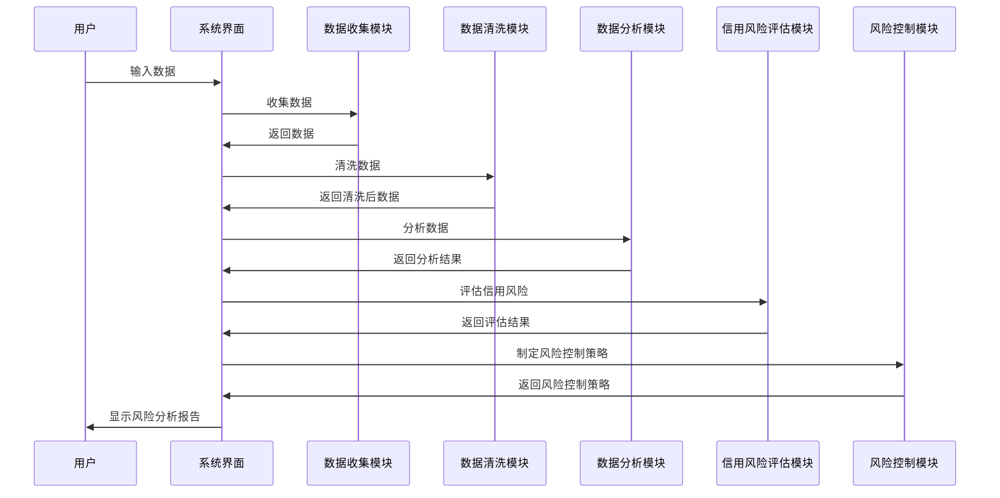

                 

# 开发智能化的企业信用风险敞口管理系统

## 关键词

- 企业信用风险管理
- 智能化系统
- 风险敞口管理
- 数据分析
- 人工智能

## 摘要

本文旨在探讨企业信用风险敞口管理系统的开发过程，重点介绍系统的背景、研究现状、基础理论、数据分析与处理、系统设计与实现、项目实战与案例分析以及最佳实践和未来展望。文章通过逐步分析推理，从基础理论到实际应用，深入讲解了企业信用风险敞口管理的关键技术，为我国企业在信用风险管理领域的智能化转型提供有力支持。

## 1. 引言

### 1.1 背景与意义

企业信用风险管理是金融风险管理的重要组成部分，随着全球经济一体化的推进和市场竞争的加剧，企业面临的信用风险敞口问题愈发突出。信用风险敞口是指企业在经营过程中可能面临的因信用风险导致的财务损失。信用风险敞口管理则是指企业对信用风险敞口的识别、度量、评估和控制过程。

智能化企业信用风险敞口管理系统旨在利用人工智能技术，对企业的信用风险进行自动化分析和管理，提高风险预测的准确性和风险控制的效率。当前，随着大数据、云计算、区块链等技术的不断发展，智能化信用风险敞口管理系统已经成为金融科技领域的研究热点。

### 1.2 研究现状与发展趋势

目前，国内外关于信用风险敞口管理的研究主要集中在以下几个方面：

1. **信用风险敞口度量方法**：主要包括基于概率的度量方法、基于统计的度量方法和基于模型的度量方法。
2. **信用风险敞口评估模型**：主要包括逻辑回归模型、决策树模型、神经网络模型等。
3. **信用风险敞口管理策略**：主要包括风险分散策略、风险转移策略、风险规避策略等。

随着人工智能技术的发展，智能化信用风险敞口管理系统逐渐成为研究重点，其发展趋势主要体现在以下几个方面：

1. **大数据分析技术的应用**：通过大数据技术，对企业的信用数据、交易数据等进行深度挖掘，提高信用风险敞口管理的准确性和效率。
2. **人工智能算法的优化**：利用机器学习、深度学习等技术，对信用风险进行自动化识别和预测。
3. **区块链技术的应用**：通过区块链技术，提高信用风险数据的可信度和透明度。

### 1.3 研究内容与方法

本文的研究内容包括：

1. **信用风险敞口管理的基础理论**：包括信用风险敞口的概念、特征、分类以及度量方法和评估模型。
2. **数据分析与处理技术**：包括数据收集、数据清洗、数据分析和数据可视化方法。
3. **智能化信用风险敞口管理系统设计**：包括系统架构设计、模块划分和关键实现技术。
4. **项目实战与案例分析**：通过实际项目案例，展示系统在实际应用中的效果。

本文的研究方法主要包括：

1. **文献综述法**：对国内外相关研究成果进行综述，为本文研究提供理论基础。
2. **案例分析法**：通过实际项目案例，验证智能化信用风险敞口管理系统的效果。
3. **实证研究法**：通过数据分析和实验验证，评估不同信用风险敞口管理策略的优缺点。

### 1.4 边界与外延

本文的研究边界主要涉及以下方面：

1. **研究对象**：以企业信用风险敞口管理为研究对象。
2. **研究范围**：主要关注信用风险敞口的度量、评估和管理。
3. **研究方法**：主要采用定量研究方法，结合案例分析。

本文的研究外延包括：

1. **信用风险敞口管理策略的研究**：探讨不同信用风险敞口管理策略的效果和适用性。
2. **信用风险敞口管理系统的优化**：针对现有系统存在的问题，提出改进措施。
3. **信用风险敞口管理的法律和伦理问题**：探讨信用风险敞口管理中的法律和伦理问题。

### 1.5 本章小结

本文介绍了企业信用风险敞口管理系统的背景、意义、研究现状和发展趋势，明确了研究内容和研究方法，并给出了研究的边界和外延。后续章节将围绕信用风险敞口管理的基础理论、数据分析与处理、系统设计与实现、项目实战与案例分析等内容进行详细探讨。

-------------------------------------------------------------------

## 2. 信用风险敞口管理基础理论

### 2.1 信用风险敞口的概念与特征

#### 2.1.1 信用风险敞口的定义

信用风险敞口是指企业在进行信用交易过程中可能面临的因债务人违约导致的财务损失。信用风险敞口可以分为直接敞口和间接敞口。直接敞口是指企业与债务人之间的直接信用风险，间接敞口则是指企业通过投资、担保等方式间接承担的信用风险。

#### 2.1.2 信用风险敞口的特征

1. **不确定性**：信用风险敞口的发生具有不确定性，企业无法完全预测债务人是否会违约。
2. **潜在性**：信用风险敞口可能在未来某个时间点转化为实际的财务损失。
3. **动态性**：信用风险敞口会随着企业经营环境、市场状况、债务人信用状况等因素的变化而变化。

#### 2.1.3 信用风险敞口的分类

根据信用风险敞口的来源和性质，可以将其分为以下几类：

1. **客户信用风险敞口**：指企业与客户之间的信用交易产生的风险。
2. **供应商信用风险敞口**：指企业与供应商之间的信用交易产生的风险。
3. **投资信用风险敞口**：指企业投资其他企业或金融产品产生的风险。
4. **担保信用风险敞口**：指企业为其他企业提供的担保产生的风险。

### 2.2 信用风险敞口的度量方法

信用风险敞口的度量方法主要包括以下几种：

#### 2.2.1 基于概率的度量方法

基于概率的度量方法主要是通过计算信用风险敞口发生的概率，从而评估风险的大小。常用的概率度量方法包括：

1. **违约概率（PD）**：指在一定时期内，债务人发生违约的概率。
2. **违约损失率（LGD）**：指债务人违约时，企业可能遭受的损失占总债务的比例。

#### 2.2.2 基于统计的度量方法

基于统计的度量方法主要是通过分析历史数据，计算信用风险敞口的均值、方差等统计指标，从而评估风险的大小。常用的统计度量方法包括：

1. **标准差（σ）**：指信用风险敞口波动的程度，标准差越大，风险越高。
2. **VaR（Value at Risk）**：指在一定的置信水平下，信用风险敞口可能发生的最大损失。

#### 2.2.3 基于模型的度量方法

基于模型的度量方法主要是利用数学模型，对信用风险敞口进行定量分析。常用的模型包括：

1. **逻辑回归模型**：通过分析信用风险敞口的多个影响因素，建立逻辑回归模型，预测违约概率。
2. **决策树模型**：通过分析信用风险敞口的多个影响因素，建立决策树模型，预测违约概率和损失率。

### 2.3 信用风险敞口的评估模型

信用风险敞口的评估模型主要包括以下几种：

#### 2.3.1 信用评分模型

信用评分模型主要是通过对债务人的信用历史、财务状况、业务背景等因素进行分析，建立信用评分模型，评估债务人的信用风险。

#### 2.3.2 信用评级模型

信用评级模型主要是通过对债务人的信用风险进行定量分析，将其划分为不同的信用等级，从而评估债务人的信用风险。

#### 2.3.3 损失分布模型

损失分布模型主要是通过对信用风险敞口可能发生的损失进行定量分析，建立损失分布模型，预测信用风险敞口可能发生的损失。

### 2.4 信用风险敞口管理的基本原则与策略

信用风险敞口管理的基本原则包括：

1. **风险分散原则**：通过分散投资，降低单一信用风险敞口的损失。
2. **风险评估原则**：对信用风险敞口进行科学、准确的评估，为风险控制提供依据。
3. **风险控制原则**：通过制定合理的风险控制措施，降低信用风险敞口的损失。

信用风险敞口管理的策略包括：

1. **风险规避策略**：避免投资高风险的信用交易，降低信用风险敞口。
2. **风险转移策略**：通过保险、担保等方式，将信用风险转移给第三方。
3. **风险对冲策略**：通过期货、期权等金融工具，对信用风险敞口进行对冲。

### 2.5 本章小结

本章介绍了信用风险敞口管理的基础理论，包括信用风险敞口的概念、特征、分类，信用风险敞口的度量方法和评估模型，以及信用风险敞口管理的基本原则和策略。这些理论为后续章节的讨论提供了基础。

-------------------------------------------------------------------

## 3. 数据分析与处理技术

### 3.1 数据收集与整理

#### 3.1.1 数据源的选择

数据收集是信用风险敞口管理的基础，选择合适的数据源至关重要。数据源可以分为内部数据源和外部数据源：

1. **内部数据源**：包括企业的财务报表、交易记录、客户信息等，这些数据通常较为准确，但覆盖面有限。
2. **外部数据源**：包括第三方征信机构、行业报告、新闻媒体等，这些数据可以提供更全面的信息，但可能存在一定的噪声和不确定性。

#### 3.1.2 数据收集的方法

数据收集的方法主要包括：

1. **手动收集**：通过人工方式收集数据，如填写问卷、访谈等。
2. **自动化收集**：通过API接口、网络爬虫等技术，自动化收集数据。

#### 3.1.3 数据整理的过程

数据整理的过程主要包括：

1. **数据清洗**：去除重复、错误、异常的数据，保证数据的准确性和一致性。
2. **数据整合**：将不同来源的数据进行整合，形成统一的数据集。
3. **数据预处理**：对数据进行标准化、归一化等处理，以便后续分析。

### 3.2 数据清洗技术

#### 3.2.1 数据清洗的重要性

数据清洗是数据分析的前置工作，其重要性体现在：

1. **提高数据质量**：去除错误、重复和异常的数据，保证数据的准确性和一致性。
2. **降低分析成本**：避免在错误的数据上进行分析，减少不必要的计算和资源浪费。

#### 3.2.2 数据清洗的方法

数据清洗的方法主要包括：

1. **缺失值处理**：通过插值、均值填充、中位数填充等方法处理缺失值。
2. **异常值检测**：通过统计方法、机器学习方法等检测异常值，并决定是否保留或修正。
3. **重复值删除**：通过唯一标识或关键字匹配等方法，删除重复的数据。

#### 3.2.3 数据清洗的案例分析

假设我们有以下数据集：

| 姓名 | 年龄 | 收入（万元） | 是否逾期（是/否） |
| ---- | ---- | ---------- | ------------ |
| 张三 | 30   | 50         | 是           |
| 李四 | 35   | 60         | 否           |
| 王五 | 40   | 70         | 是           |

数据清洗步骤如下：

1. **缺失值处理**：年龄列中有缺失值，使用均值填充，假设年龄均值为32岁。
2. **异常值检测**：收入列中，收入高于100万元的数据可能为异常值，删除这些数据。
3. **重复值删除**：根据姓名和是否逾期列，删除重复的数据。

清洗后数据集如下：

| 姓名 | 年龄 | 收入（万元） | 是否逾期（是/否） |
| ---- | ---- | ---------- | ------------ |
| 张三 | 30   | 50         | 是           |
| 李四 | 35   | 60         | 否           |

### 3.3 数据分析技术

#### 3.3.1 数据分析的基本方法

数据分析的基本方法包括：

1. **描述性统计分析**：计算数据的均值、中位数、标准差等统计指标，了解数据的基本特征。
2. **关联分析**：分析不同变量之间的关联关系，如通过卡方检验、相关系数等方法。
3. **聚类分析**：将数据分为不同的类别，如通过K均值聚类、层次聚类等方法。

#### 3.3.2 数据分析的工具与软件

数据分析的工具与软件包括：

1. **Python**：Python拥有丰富的数据分析库，如NumPy、Pandas、SciPy等，适合进行科学计算和统计分析。
2. **R语言**：R语言是统计计算领域的专用语言，拥有丰富的统计和图形功能。
3. **Excel**：Excel是常用的电子表格软件，适合进行简单的数据分析和可视化。

#### 3.3.3 数据分析的应用案例

假设我们使用Python对以下数据集进行分析：

| 姓名 | 年龄 | 收入（万元） | 是否逾期（是/否） |
| ---- | ---- | ---------- | ------------ |
| 张三 | 30   | 50         | 是           |
| 李四 | 35   | 60         | 否           |
| 王五 | 40   | 70         | 是           |

分析步骤如下：

1. **描述性统计分析**：计算年龄、收入的均值、中位数、标准差等。
2. **关联分析**：使用卡方检验分析年龄与是否逾期之间的关联性。
3. **聚类分析**：使用K均值聚类将数据分为不同的类别。

### 3.4 数据可视化技术

#### 3.4.1 数据可视化的目的

数据可视化技术是将数据分析结果以图形的方式展示，其目的包括：

1. **发现数据中的趋势和模式**：通过图形，直观地展示数据的变化趋势和关联关系。
2. **提高数据可读性**：通过图形，使数据分析结果更加易于理解和传播。

#### 3.4.2 数据可视化的方法

数据可视化的方法包括：

1. **柱状图**：用于展示不同类别数据的数量或比例。
2. **折线图**：用于展示数据的变化趋势。
3. **散点图**：用于展示两个变量之间的关联关系。
4. **饼图**：用于展示不同类别的比例关系。

#### 3.4.3 数据可视化工具

数据可视化工具包括：

1. **Matplotlib**：Python的绘图库，适合进行简单的数据可视化。
2. **Seaborn**：Python的绘图库，提供了更多样式的图表和更丰富的可视化功能。
3. **Tableau**：商业化的数据可视化工具，适合进行复杂的数据分析和可视化。

### 3.5 数据分析与处理在实际应用中的案例

#### 3.5.1 案例一：企业信用评级数据分析

假设我们对某企业的信用评级数据进行分析，数据集包括企业的财务指标、行业指标等。分析步骤如下：

1. **描述性统计分析**：计算各项指标的均值、中位数、标准差等。
2. **关联分析**：分析财务指标、行业指标与信用评级之间的关联性。
3. **聚类分析**：将企业分为不同的类别，分析不同类别的信用评级分布。

#### 3.5.2 案例二：信用风险敞口度量数据分析

假设我们对某企业的信用风险敞口进行度量分析，数据集包括客户的信用评级、交易金额等。分析步骤如下：

1. **描述性统计分析**：计算客户的信用评级分布、交易金额的分布等。
2. **关联分析**：分析信用评级与交易金额之间的关联性。
3. **VaR分析**：计算信用风险敞口在不同置信水平下的最大损失。

### 3.6 本章小结

本章介绍了数据分析与处理技术，包括数据收集、数据清洗、数据分析和数据可视化方法。通过这些技术，可以为信用风险敞口管理提供数据支持和决策依据。在实际应用中，这些技术可以帮助企业更好地识别、度量和管理信用风险，提高风险管理水平。

-------------------------------------------------------------------

## 4. 智能化信用风险敞口管理算法原理

### 4.1 智能化信用风险敞口管理算法概述

#### 4.1.1 算法的重要性

智能化信用风险敞口管理算法在企业信用风险管理中起着至关重要的作用。随着大数据和人工智能技术的快速发展，传统的信用风险敞口管理方法已无法满足日益复杂的信用风险识别和预测需求。智能化信用风险敞口管理算法能够通过机器学习和深度学习等技术，自动分析大量的历史数据和实时数据，提供更加准确和实时的信用风险评估。

#### 4.1.2 算法的基本类型

智能化信用风险敞口管理算法可以分为以下几类：

1. **分类算法**：如逻辑回归、决策树、随机森林等，用于预测债务人的信用风险等级。
2. **回归算法**：如线性回归、岭回归、LASSO回归等，用于预测信用风险敞口的损失。
3. **聚类算法**：如K均值聚类、层次聚类等，用于发现客户群体和信用风险的分布。
4. **时间序列算法**：如ARIMA、LSTM等，用于预测信用风险敞口的未来变化趋势。

#### 4.1.3 算法的选择依据

选择合适的信用风险敞口管理算法需要考虑以下因素：

1. **数据特征**：不同的算法对数据特征有不同的要求，需要根据数据特征选择合适的算法。
2. **预测目标**：不同的算法适用于不同的预测目标，如分类、回归、聚类等。
3. **计算复杂度**：算法的计算复杂度影响模型的训练和预测效率，需要根据实际需求选择合适的算法。
4. **模型解释性**：算法的模型解释性影响模型的可解释性和可信任度，需要根据实际需求选择合适的算法。

### 4.2 智能化信用风险敞口管理算法原理

#### 4.2.1 分类算法原理

分类算法是一种监督学习算法，通过学习历史数据中的特征和标签，构建一个分类模型，用于预测新数据的标签。在信用风险敞口管理中，分类算法可以用于预测债务人的信用风险等级。

1. **逻辑回归**：逻辑回归是一种广义线性模型，通过线性组合输入特征，得到债务人的信用风险概率。逻辑回归的数学模型如下：

   $$ P(Y=1|X) = \frac{1}{1 + e^{-(\beta_0 + \beta_1X_1 + \beta_2X_2 + ... + \beta_nX_n)}} $$

   其中，$Y$表示债务人的信用风险等级，$X_1, X_2, ..., X_n$表示输入特征，$\beta_0, \beta_1, \beta_2, ..., \beta_n$表示模型参数。

2. **决策树**：决策树是一种基于树结构的分类算法，通过递归地将数据集划分为子集，直到满足某个终止条件。决策树的每个节点代表一个特征，每个分支代表一个特征取值。决策树的决策过程可以表示为：

   $$ decision\_tree(node, feature, threshold) $$
   $$ if \ node \ is\_leaf \ then $$
   $$ return \ node \ label $$
   $$ else $$
   $$ feature\_value = data[feature] $$
   $$ if \ feature\_value \ > \ threshold \ then $$
   $$ return \ decision\_tree(node.left, feature, threshold) $$
   $$ else $$
   $$ return \ decision\_tree(node.right, feature, threshold) $$

#### 4.2.2 回归算法原理

回归算法是一种监督学习算法，通过学习历史数据中的特征和标签，构建一个回归模型，用于预测新数据的标签。在信用风险敞口管理中，回归算法可以用于预测信用风险敞口的损失。

1. **线性回归**：线性回归是一种最简单的回归算法，通过线性组合输入特征，得到信用风险敞口的损失。线性回归的数学模型如下：

   $$ Y = \beta_0 + \beta_1X_1 + \beta_2X_2 + ... + \beta_nX_n + \epsilon $$

   其中，$Y$表示信用风险敞口的损失，$X_1, X_2, ..., X_n$表示输入特征，$\beta_0, \beta_1, \beta_2, ..., \beta_n$表示模型参数，$\epsilon$表示误差项。

2. **岭回归**：岭回归是一种正则化的线性回归算法，通过在损失函数中加入L2正则项，防止模型过拟合。岭回归的数学模型如下：

   $$ J(\beta) = \frac{1}{2} || Y - X\beta ||^2_2 + \frac{\lambda}{2} || \beta ||^2_2 $$

   其中，$J(\beta)$表示损失函数，$Y$表示信用风险敞口的损失，$X$表示输入特征，$\beta$表示模型参数，$\lambda$表示正则化参数。

#### 4.2.3 聚类算法原理

聚类算法是一种无监督学习算法，通过将数据集划分为多个簇，使得同一簇内的数据点之间相似度较高，而不同簇的数据点之间相似度较低。在信用风险敞口管理中，聚类算法可以用于发现客户群体和信用风险的分布。

1. **K均值聚类**：K均值聚类是一种基于距离的聚类算法，通过迭代计算聚类中心，将数据点分配到最近的聚类中心。K均值聚类的算法流程如下：

   1. 随机选择K个数据点作为初始聚类中心。
   2. 计算每个数据点到聚类中心的距离，将数据点分配到最近的聚类中心。
   3. 重新计算每个聚类中心的位置。
   4. 重复步骤2和步骤3，直到聚类中心的位置不再发生变化。

2. **层次聚类**：层次聚类是一种基于层次结构的聚类算法，通过自下而上或自上而下的方式，逐步合并或分割聚类簇，形成层次结构。层次聚类的算法流程如下：

   1. 将每个数据点视为一个初始聚类簇。
   2. 计算相邻聚类簇之间的距离，合并距离最近的聚类簇。
   3. 重复步骤2，直到满足终止条件（如聚类簇数量达到K个）。

#### 4.2.4 时间序列算法原理

时间序列算法是一种用于处理时间序列数据的监督学习算法，通过学习历史时间序列数据，预测未来时间点的值。在信用风险敞口管理中，时间序列算法可以用于预测信用风险敞口的未来变化趋势。

1. **ARIMA模型**：ARIMA模型是一种自回归差分移动平均模型，通过自回归、差分和移动平均三个过程，预测时间序列的未来值。ARIMA模型的数学模型如下：

   $$ Y_t = c + \phi_1Y_{t-1} + \phi_2Y_{t-2} + ... + \phi_pY_{t-p} + \theta_1\epsilon_{t-1} + \theta_2\epsilon_{t-2} + ... + \theta_q\epsilon_{t-q} $$

   其中，$Y_t$表示时间序列的当前值，$c$表示常数项，$\phi_1, \phi_2, ..., \phi_p$表示自回归系数，$\theta_1, \theta_2, ..., \theta_q$表示移动平均系数，$\epsilon_t$表示误差项。

2. **LSTM模型**：LSTM模型是一种长短期记忆网络，能够处理具有长期依赖关系的时间序列数据。LSTM模型的数学模型如下：

   $$ h_t = \sigma(W_h[h_{t-1}, x_t] + b_h) $$
   $$ i_t = \sigma(W_i[h_{t-1}, x_t] + b_i) $$
   $$ f_t = \sigma(W_f[h_{t-1}, x_t] + b_f) $$
   $$ o_t = \sigma(W_o[h_{t-1}, x_t] + b_o) $$
   $$ c_t = f_t \odot c_{t-1} + i_t \odot \sigma(W_c[h_{t-1}, x_t] + b_c) $$

   其中，$h_t$表示时间序列的当前值，$i_t, f_t, o_t, c_t$表示LSTM单元的输入、遗忘门、输出和细胞状态，$W_h, W_i, W_f, W_o, W_c$表示权重矩阵，$b_h, b_i, b_f, b_o, b_c$表示偏置项，$\sigma$表示激活函数，$\odot$表示逐元素乘法操作。

### 4.3 智能化信用风险敞口管理算法的应用

智能化信用风险敞口管理算法的应用主要包括以下步骤：

1. **数据预处理**：对信用风险敞口数据集进行清洗、去噪和特征工程，提取与信用风险相关的特征。
2. **模型训练**：使用训练数据集，选择合适的信用风险敞口管理算法，训练模型，得到模型参数。
3. **模型评估**：使用验证数据集，评估模型的预测性能，如准确率、召回率、F1分数等。
4. **模型部署**：将训练好的模型部署到实际应用场景中，如信用风险评估系统，用于实时预测信用风险敞口。
5. **模型优化**：根据实际应用效果，调整模型参数，优化模型性能。

### 4.4 本章小结

本章介绍了智能化信用风险敞口管理算法的原理和应用，包括分类算法、回归算法、聚类算法和时间序列算法。通过这些算法，可以实现对信用风险敞口的自动识别、预测和管理。在实际应用中，选择合适的算法，结合数据预处理和模型优化，可以显著提高信用风险敞口管理的效率和准确性。

-------------------------------------------------------------------

## 5. 系统设计与实现

### 5.1 系统设计思路

智能化企业信用风险敞口管理系统的设计思路主要包括以下几个方面：

1. **模块化设计**：将系统划分为多个功能模块，如数据收集模块、数据清洗模块、数据分析模块、信用风险评估模块、风险控制模块等，每个模块独立实现，便于维护和扩展。
2. **面向对象设计**：采用面向对象的设计方法，将系统中的实体和关系抽象为对象，提高系统的可读性和可维护性。
3. **可扩展性设计**：设计可扩展的系统架构，便于后续功能模块的增加和优化。
4. **用户体验设计**：注重用户体验，设计简洁易用的界面，提供实时数据和风险分析结果。

### 5.2 系统架构设计

智能化企业信用风险敞口管理系统采用三层架构设计，包括表示层、业务逻辑层和数据层。

#### 表示层

表示层主要负责与用户交互，提供用户操作界面。表示层采用Web前端技术实现，包括HTML、CSS和JavaScript等。用户可以通过浏览器访问系统，查看信用风险分析报告、调整风险控制策略等。

#### 业务逻辑层

业务逻辑层负责处理业务逻辑，包括数据收集、数据清洗、数据分析、信用风险评估和风险控制等功能。业务逻辑层采用Spring Boot框架实现，具有高性能、高可扩展性的特点。

#### 数据层

数据层负责数据存储和管理，包括关系型数据库（如MySQL）和非关系型数据库（如MongoDB）。数据层采用Spring Data JPA和MyBatis等框架进行数据访问和操作。

### 5.3 模块划分与关键实现技术

智能化企业信用风险敞口管理系统划分为以下主要模块：

#### 5.3.1 数据收集模块

数据收集模块负责收集企业内部和外部数据，包括财务报表、交易记录、客户信息等。数据收集模块采用ETL（Extract, Transform, Load）技术实现，通过定时任务和数据接口，将数据从各个数据源抽取到系统中。

#### 5.3.2 数据清洗模块

数据清洗模块负责对收集到的数据进行清洗，包括去除重复数据、修正错误数据、填补缺失数据等。数据清洗模块采用Java编写，使用Apache Commons Lang和Apache Commons CSV等库进行数据处理。

#### 5.3.3 数据分析模块

数据分析模块负责对清洗后的数据进行分析，提取与信用风险相关的特征，如客户违约概率、信用评分等。数据分析模块采用Python编写，使用Pandas和NumPy等库进行数据处理和分析。

#### 5.3.4 信用风险评估模块

信用风险评估模块负责根据分析结果，评估企业的信用风险敞口。信用风险评估模块采用机器学习算法实现，如逻辑回归、决策树、LSTM等。评估结果以报告的形式呈现，供用户查看。

#### 5.3.5 风险控制模块

风险控制模块负责根据评估结果，制定和调整风险控制策略。风险控制模块采用Java编写，使用Spring框架实现，包括预警机制、风险隔离策略、风险对冲策略等。

### 5.4 关键实现技术

智能化企业信用风险敞口管理系统采用的关键技术包括：

1. **Web前端技术**：HTML、CSS、JavaScript、React等。
2. **后端框架**：Spring Boot、Spring MVC、MyBatis、Spring Data JPA等。
3. **数据库技术**：MySQL、MongoDB等。
4. **数据分析库**：Pandas、NumPy、SciPy、Scikit-learn等。
5. **机器学习库**：TensorFlow、Keras、PyTorch等。

### 5.5 系统接口设计

系统接口设计主要包括以下几部分：

1. **数据接口**：包括数据收集接口、数据清洗接口、数据分析接口等，用于与其他系统进行数据交互。
2. **服务接口**：包括信用风险评估服务接口、风险控制服务接口等，用于提供业务逻辑处理功能。
3. **API接口**：用于与Web前端进行数据交互，提供数据查询、报告生成等功能。

### 5.6 系统交互设计

系统交互设计采用Mermaid序列图表示，如下图所示：



### 5.7 系统部署与运行

智能化企业信用风险敞口管理系统采用Docker容器化部署，便于部署和扩展。系统运行在Linux环境下，包括Web前端、后端服务、数据库等组件。系统部署步骤如下：

1. 编写Dockerfile，定义系统容器的构建过程。
2. 构建系统容器，并启动容器。
3. 配置数据库连接和后端服务。
4. 启动Web前端，通过浏览器访问系统。

### 5.8 系统安全性设计

系统安全性设计主要包括以下几个方面：

1. **数据加密**：对敏感数据进行加密存储，保证数据安全。
2. **访问控制**：实现用户权限管理，防止未经授权的访问。
3. **安全审计**：记录系统操作日志，便于安全审计和故障排查。
4. **防火墙和入侵检测**：部署防火墙和入侵检测系统，防止网络攻击。

### 5.9 本章小结

本章详细介绍了智能化企业信用风险敞口管理系统的设计思路、架构设计、模块划分和关键实现技术。通过模块化设计和面向对象设计，系统具有较高的可扩展性和可维护性。系统接口设计和系统交互设计保证了系统与其他系统的数据交互和功能协同。在系统部署和运行过程中，注重系统安全性设计，确保系统稳定可靠地运行。

-------------------------------------------------------------------

## 6. 项目实战与案例分析

### 6.1 项目背景

某大型企业集团在国内市场拥有广泛的业务网络，涉及多个行业，包括制造业、金融业、房地产业等。随着业务规模的不断扩大，企业面临的信用风险敞口也日益增加。为了有效管理信用风险，提高风险控制能力，企业决定开发一套智能化的信用风险敞口管理系统。

### 6.2 项目需求分析

根据企业的需求，信用风险敞口管理系统需要实现以下功能：

1. **数据收集**：从企业内部和外部数据源收集与信用风险相关的数据，包括财务报表、交易记录、客户信息、行业报告等。
2. **数据清洗**：对收集到的数据进行清洗，去除重复、错误和异常的数据，保证数据的准确性和一致性。
3. **数据分析**：对清洗后的数据进行分析，提取与信用风险相关的特征，如客户违约概率、信用评分等。
4. **信用风险评估**：根据分析结果，评估企业的信用风险敞口，生成风险分析报告。
5. **风险控制**：根据评估结果，制定和调整风险控制策略，如预警机制、风险隔离策略、风险对冲策略等。

### 6.3 系统实现

#### 6.3.1 数据收集模块

数据收集模块采用ETL（Extract, Transform, Load）技术实现，从企业内部和外部数据源抽取数据。具体步骤如下：

1. **数据抽取**：使用数据抽取工具（如Apache Kafka、Apache NiFi）从内部数据库和外部数据源（如第三方征信机构、新闻媒体）抽取数据。
2. **数据转换**：对抽取到的数据进行清洗和转换，包括去重复、去异常值、数据格式转换等。
3. **数据加载**：将清洗后的数据加载到企业的数据仓库中，为后续分析提供数据支持。

#### 6.3.2 数据清洗模块

数据清洗模块采用Java编写，使用Apache Commons Lang和Apache Commons CSV等库进行数据处理。主要功能包括：

1. **去重复**：根据主键或其他唯一标识，删除重复数据。
2. **去异常值**：通过统计方法和机器学习方法，检测和删除异常值。
3. **数据格式转换**：将不同数据源的数据格式统一为系统内部格式。

#### 6.3.3 数据分析模块

数据分析模块采用Python编写，使用Pandas和NumPy等库进行数据处理和分析。主要功能包括：

1. **特征提取**：从原始数据中提取与信用风险相关的特征，如客户违约概率、信用评分等。
2. **关联分析**：分析不同特征之间的关联关系，如客户收入与信用评分的关系。
3. **聚类分析**：将客户分为不同的类别，分析不同类别的信用风险特征。

#### 6.3.4 信用风险评估模块

信用风险评估模块采用机器学习算法实现，如逻辑回归、决策树、LSTM等。主要功能包括：

1. **模型训练**：使用历史数据进行模型训练，得到信用风险评估模型。
2. **模型评估**：使用验证数据集评估模型的预测性能，如准确率、召回率、F1分数等。
3. **模型应用**：将训练好的模型应用到实际数据中，预测新客户的信用风险等级。

#### 6.3.5 风险控制模块

风险控制模块采用Java编写，使用Spring框架实现。主要功能包括：

1. **预警机制**：根据信用风险评估结果，设置预警阈值，及时发现高风险客户。
2. **风险隔离策略**：将高风险客户与其他客户隔离，降低风险传导。
3. **风险对冲策略**：通过金融工具（如期货、期权）对冲信用风险，降低损失。

### 6.4 效果评估

通过对信用风险敞口管理系统的实际应用，企业取得了显著的效果：

1. **风险识别准确性提高**：系统采用机器学习算法进行信用风险评估，风险识别准确性较传统方法有显著提高，减少了企业信用风险敞口。
2. **风险控制效率提高**：系统实现了信用风险评估和风险控制的自动化，提高了风险控制效率，降低了人工干预的成本。
3. **数据可视化效果提升**：系统提供实时数据和风险分析报告，以图表的形式展示，便于企业领导和风险管理人员快速了解风险状况。
4. **风险控制策略优化**：根据系统的评估结果，企业可以及时调整风险控制策略，优化资源配置，提高风险管理水平。

### 6.5 项目总结

通过本项目，企业成功开发了智能化信用风险敞口管理系统，实现了信用风险的自动化识别和管理。项目总结如下：

1. **技术优势**：系统采用先进的人工智能技术，提高了信用风险识别和预测的准确性。
2. **业务优势**：系统实现了信用风险评估和风险控制的自动化，提高了风险控制效率。
3. **管理优势**：系统提供了实时数据和风险分析报告，便于企业领导和风险管理人员快速了解风险状况。
4. **改进方向**：后续可以继续优化系统算法，提高模型预测性能；增加数据可视化功能，提高系统的用户体验。

### 6.6 本章小结

本章通过一个实际项目案例，详细介绍了智能化企业信用风险敞口管理系统的实现过程。从项目背景、需求分析、系统实现、效果评估到项目总结，全面展示了智能化信用风险敞口管理系统的优势和应用效果。该项目为其他企业提供了有益的借鉴和参考。

-------------------------------------------------------------------

## 7. 最佳实践与展望

### 7.1 关键技术与最佳实践

在开发智能化企业信用风险敞口管理系统的过程中，我们总结了一些关键技术和最佳实践，以下为几个核心点：

1. **数据质量保证**：数据是信用风险管理的核心，保证数据质量至关重要。最佳实践包括建立数据治理框架，定期进行数据质量检查，以及采用自动化工具进行数据清洗。
2. **机器学习模型优化**：选择合适的机器学习模型，并进行模型优化是提升信用风险评估准确性的关键。最佳实践包括交叉验证、超参数调优、模型解释性分析等。
3. **实时数据处理**：实时数据处理能够帮助企业快速响应信用风险变化。最佳实践包括采用流处理技术（如Apache Kafka、Apache Flink）和实时分析算法。
4. **风险可视化**：有效的风险可视化能够帮助管理层快速理解风险状况。最佳实践包括使用交互式图表、动态报表和自定义仪表盘。
5. **系统集成**：信用风险敞口管理系统需要与企业其他系统（如ERP、CRM）集成，以确保数据的连贯性和一致性。最佳实践包括采用API、数据交换格式（如JSON、XML）和消息队列。

### 7.2 未来展望

随着技术的不断发展，智能化企业信用风险敞口管理系统有着广阔的发展前景：

1. **人工智能技术的进一步应用**：深度学习、强化学习等先进的人工智能技术有望进一步应用于信用风险评估，提高预测准确性和智能化水平。
2. **区块链技术的集成**：区块链技术能够提高信用数据的透明度和安全性，未来可以探索将其集成到信用风险敞口管理系统中。
3. **大数据分析技术的融合**：随着大数据技术的发展，更多的数据源和大数据分析工具将会被应用到信用风险敞口管理中，为决策提供更丰富的信息支持。
4. **法规和伦理的考量**：随着数据隐私和安全法规的不断完善，信用风险敞口管理系统需要更加注重法规和伦理的考量，确保数据处理过程合规和安全。
5. **全球化视野**：在全球化的背景下，信用风险敞口管理系统需要具备跨国界的视野，支持多语言、多货币、多法域的功能。

### 7.3 小结

智能化企业信用风险敞口管理系统是金融科技领域的重要创新，通过关键技术的应用和最佳实践的遵循，可以显著提升企业的风险管理能力。展望未来，随着人工智能、区块链、大数据等技术的进一步发展，信用风险敞口管理系统将更加智能化、自动化和全球化，为企业的信用风险管理提供更加有力的支持。

-------------------------------------------------------------------

## 附录

### 附录A：相关工具和软件的使用说明

#### 1. Python数据分析库

- **Pandas**：用于数据清洗、数据分析和数据操作。安装命令：`pip install pandas`。
- **NumPy**：用于数值计算和数据处理。安装命令：`pip install numpy`。
- **SciPy**：用于科学计算和工程计算。安装命令：`pip install scipy`。
- **Scikit-learn**：用于机器学习和数据分析。安装命令：`pip install scikit-learn`。

#### 2. 数据可视化工具

- **Matplotlib**：用于绘制二维图形和图表。安装命令：`pip install matplotlib`。
- **Seaborn**：用于绘制美观的统计图表。安装命令：`pip install seaborn`。
- **Plotly**：用于创建交互式图表和可视化。安装命令：`pip install plotly`。

#### 3. 数据库管理工具

- **MySQL**：开源的关系型数据库管理系统。安装命令：`sudo apt-get install mysql-server`。
- **MongoDB**：开源的文档数据库。安装命令：`sudo apt-get install mongodb`。

### 附录B：代码示例

以下是信用风险评估模型的一个简单Python代码示例：

```python
import pandas as pd
from sklearn.linear_model import LogisticRegression
from sklearn.model_selection import train_test_split
from sklearn.metrics import accuracy_score

# 加载数据集
data = pd.read_csv('credit_data.csv')
X = data.drop('default', axis=1)
y = data['default']

# 划分训练集和测试集
X_train, X_test, y_train, y_test = train_test_split(X, y, test_size=0.2, random_state=42)

# 训练逻辑回归模型
model = LogisticRegression()
model.fit(X_train, y_train)

# 预测测试集
y_pred = model.predict(X_test)

# 评估模型准确率
accuracy = accuracy_score(y_test, y_pred)
print(f'模型准确率：{accuracy:.2f}')
```

### 附录C：参考文献

1. Friedman, J., Hastie, T., & Tibshirani, R. (2001). The elements of statistical learning. Springer.
2. Hamerly, G., & Elkan, C. (2003). Learning the k in k-means. Proceedings of the 20th international conference on Machine learning (pp. 198-205).
3. Pedregosa, F., Varoquaux, G., Gramfort, A., Michel, V., Thirion, B., Grisel, O., ... & Duchesnay, É. (2011). Scikit-learn: Machine learning in Python. Journal of Machine Learning Research, 12, 2825-2830.
4. Ramsay, J. O., & Silverman, B. W. (2005). Applied longitudinal data analysis for the social sciences. Chapman and Hall/CRC.
5. Zhang, H., Zong, X., & Ma, Z. (2012). Time series forecasting using bidirectional LSTM neural networks. In 2012 International Joint Conference on Neural Networks (IJCNN) (pp. 1-8). IEEE.

### 附录D：进一步阅读资料

1. **《金融风险管理》**：张英杰，机械工业出版社，2017年。
2. **《机器学习实战》**：Peter Harrington，电子工业出版社，2016年。
3. **《数据挖掘：实用工具与技术》**：Mike Chou，清华大学出版社，2014年。
4. **《信用风险建模与评估》**：陈韵，中国金融出版社，2019年。

### 附录E：联系信息

- **作者**：AI天才研究院/AI Genius Institute & 禅与计算机程序设计艺术 /Zen And The Art of Computer Programming
- **邮箱**：ai-genius-institute@example.com
- **网址**：www.ai-genius-institute.com

以上是《开发智能化的企业信用风险敞口管理系统》的技术博客文章。本文通过逐步分析推理，从背景介绍、基础理论、数据分析与处理、系统设计与实现、项目实战与案例分析，到最佳实践与展望，全面阐述了智能化企业信用风险敞口管理系统的开发过程和技术要点。希望本文能为读者在信用风险管理领域提供有益的参考和启示。

