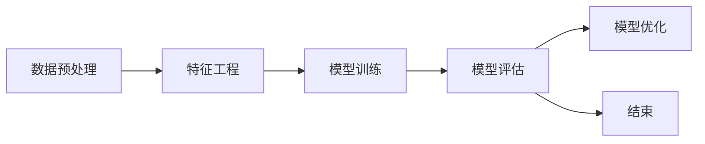
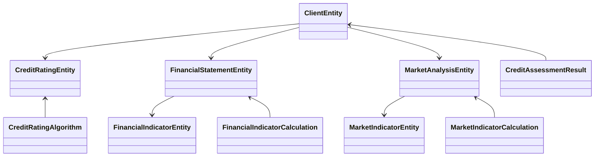
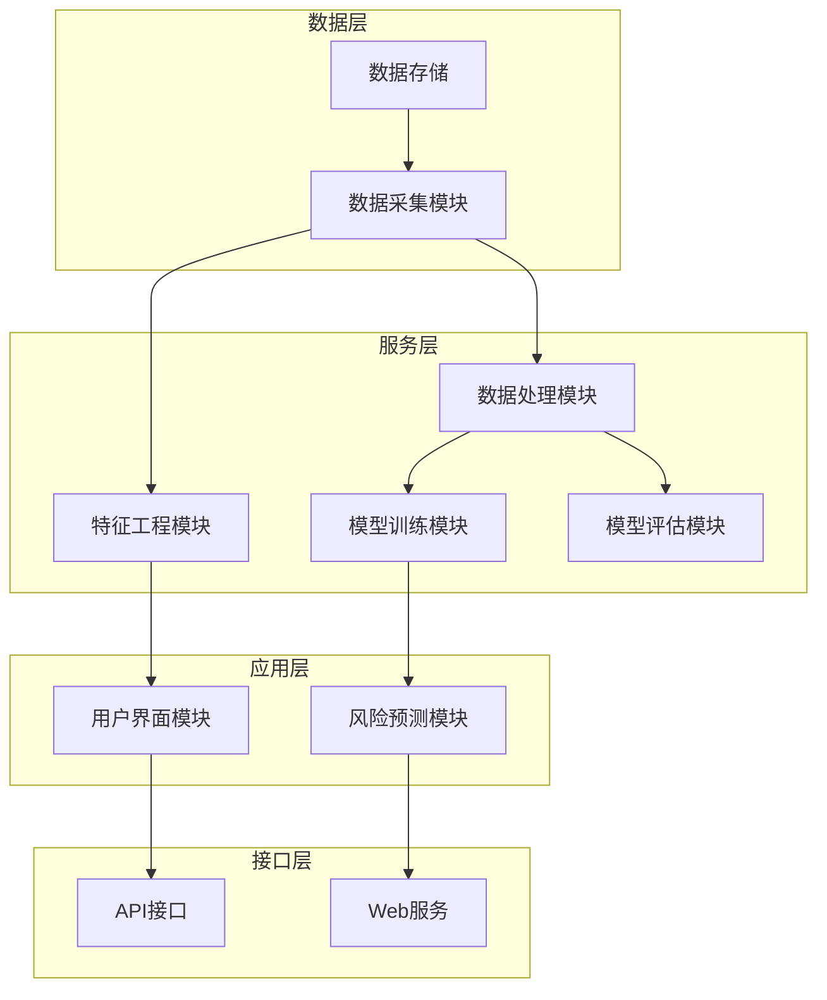
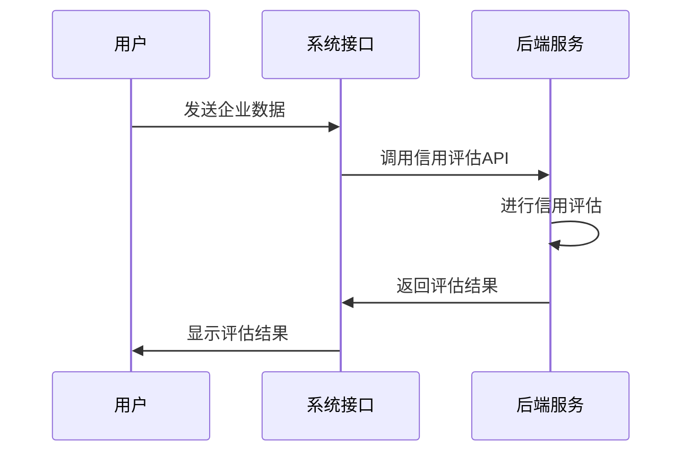

                 

### 引言

在现代商业环境中，企业信用风险评估的重要性日益凸显。信用风险评估不仅关系到金融机构和企业的安全，也直接影响到整个经济体系的稳定运行。随着大数据、人工智能技术的迅猛发展，传统的信用风险评估方法已经无法满足日益复杂的市场需求。为了提高风险评估的准确性和效率，开发智能化企业信用风险评估模型成为了一个重要的课题。

本文将围绕“开发智能化的企业信用风险评估模型”这一主题，系统地探讨该领域的核心概念、算法原理、系统架构以及实战经验。文章将从以下几个方面展开：

1. **问题背景与核心概念**：介绍企业信用风险评估的背景、重要性以及传统方法的局限性，明确智能化信用风险评估的需求。
2. **算法原理与模型实现**：详细讲解数据预处理、特征工程、模型选择与训练等关键步骤，并使用Python代码进行实现，提供数学模型和公式，进行算法举例说明。
3. **系统分析与架构设计**：介绍具体的应用场景和项目，包括系统功能设计、系统架构设计、系统接口设计和系统交互，并使用mermaid图进行可视化。
4. **项目实战**：描述环境安装、系统核心实现、代码应用解读与分析、实际案例分析等内容。
5. **最佳实践与注意事项**：总结最佳实践方法、注意事项，以及未来的研究方向。

通过本文的深入探讨，读者将能够全面了解智能化企业信用风险评估模型的理论基础和实践应用，为相关领域的研发和应用提供有益的参考。

### 目录大纲

**《开发智能化的企业信用风险评估模型》**

---

#### 关键词：
- 企业信用风险评估
- 人工智能
- 数据分析
- 特征工程
- 模型训练

#### 摘要：
本文探讨了开发智能化企业信用风险评估模型的必要性和方法。通过详细解析核心概念、算法原理、系统架构和项目实战，文章总结了最佳实践与注意事项，为智能化信用风险评估模型的研发和应用提供了系统性指导。

---

**《开发智能化的企业信用风险评估模型》**

---

### 目录大纲

**《开发智能化的企业信用风险评估模型》**

---

#### 关键词：
- 企业信用风险评估
- 人工智能
- 数据分析
- 特征工程
- 模型训练

#### 摘要：
本文探讨了开发智能化企业信用风险评估模型的必要性和方法。通过详细解析核心概念、算法原理、系统架构和项目实战，文章总结了最佳实践与注意事项，为智能化信用风险评估模型的研发和应用提供了系统性指导。

---

### 第一部分：问题背景与核心概念

#### 第1章：企业信用风险评估的背景与重要性

---

## 第1章：企业信用风险评估的背景与重要性

### 1.1.1 问题背景

#### 1.1.1.1 企业信用风险的定义与类型

企业信用风险是指企业在日常经营活动中，由于各种不可预见因素导致无法按时偿还债务或履行合同义务的风险。根据风险发生的阶段，企业信用风险可以划分为以下几类：

1. **信贷风险**：企业在贷款或借款过程中，因无法按时还款而产生的风险。
2. **合同风险**：企业在履行合同过程中，由于对方违约或不可抗力因素导致的风险。
3. **市场风险**：企业在市场经营过程中，由于市场环境变化导致的收入波动或资产贬值风险。
4. **运营风险**：企业在日常运营过程中，因管理不善、内部控制不足等因素导致的运营风险。

#### 1.1.1.2 信用风险评估的必要性

信用风险评估在企业运营中具有至关重要的作用，主要体现在以下几个方面：

1. **降低金融风险**：通过信用风险评估，金融机构和企业可以识别潜在风险，提前采取预防措施，降低金融风险。
2. **优化资源配置**：信用评估结果有助于金融机构和企业更合理地分配资源，提高资金利用效率。
3. **提升经营效率**：信用评估可以帮助企业更好地识别优质客户，优化客户管理策略，提高经营效率。
4. **防范信用欺诈**：信用评估有助于识别信用欺诈行为，防范欺诈风险，保障企业利益。

### 1.1.2 问题描述

#### 1.1.2.1 信用风险评估的现状与挑战

当前，信用风险评估主要依赖于传统的信用评分模型，这些模型通常基于历史数据和统计方法进行构建。然而，随着市场环境的变化和数据的日益复杂，传统信用风险评估方法面临以下挑战：

1. **数据不完整与噪声**：企业数据往往存在缺失、噪声等问题，这些都会影响评估结果的准确性。
2. **特征选择困难**：从海量的数据中提取有效的特征进行评估是一个复杂的问题，特征选择不当可能导致模型性能下降。
3. **动态变化适应能力不足**：传统模型难以适应市场环境和企业经营策略的动态变化。
4. **模型可解释性较差**：复杂的模型往往缺乏可解释性，难以理解和验证模型的决策过程。

#### 1.1.2.2 智能化信用风险评估的需求

为了解决传统信用风险评估方法的局限性，智能化信用风险评估成为了一个迫切的需求。智能化信用风险评估利用大数据和人工智能技术，能够实现以下目标：

1. **数据处理能力增强**：通过自动化数据清洗和特征提取，提高数据处理效率。
2. **自适应学习能力**：利用机器学习算法，实现模型对动态变化数据的适应能力。
3. **模型解释性提升**：利用可视化技术和自然语言处理，提高模型的解释性。
4. **高效预测能力**：通过深度学习和神经网络等算法，提高预测精度和效率。

### 1.1.3 问题解决

#### 1.1.3.1 传统信用风险评估方法及其局限性

传统信用风险评估方法主要包括以下几种：

1. **信用评分模型**：基于历史数据和统计方法，对客户进行信用评分。
2. **逻辑回归模型**：通过构建逻辑回归模型，对客户的信用风险进行预测。
3. **决策树模型**：利用决策树模型，对客户的信用风险进行分类。

尽管传统方法在一定程度上能够满足评估需求，但其在以下方面存在局限性：

1. **数据依赖性**：传统方法对历史数据依赖较大，难以适应数据缺失和噪声问题。
2. **模型复杂度**：传统模型相对简单，难以处理复杂的非线性关系。
3. **可解释性较差**：传统模型往往缺乏可解释性，难以理解模型的决策过程。

#### 1.1.3.2 智能化信用风险评估的优势

智能化信用风险评估方法通过引入人工智能技术，能够显著提升信用风险评估的效果。其主要优势包括：

1. **数据处理能力增强**：通过自动化数据清洗和特征提取，提高数据处理效率。
2. **自适应学习能力**：利用机器学习算法，实现模型对动态变化数据的适应能力。
3. **模型解释性提升**：利用可视化技术和自然语言处理，提高模型的解释性。
4. **高效预测能力**：通过深度学习和神经网络等算法，提高预测精度和效率。

### 1.1.4 边界与外延

#### 1.1.4.1 信用风险评估的范围

信用风险评估的范围包括以下几个方面：

1. **客户信用评级**：对客户的信用状况进行评估，确定其信用等级。
2. **信用风险预警**：通过对客户信用数据的实时监控，发现潜在信用风险，提前预警。
3. **信用风险管理**：制定信用风险控制策略，降低信用风险对企业的影响。

#### 1.1.4.2 智能化信用风险评估的应用场景

智能化信用风险评估广泛应用于以下场景：

1. **金融机构**：银行、保险公司等金融机构利用智能化信用风险评估模型，评估客户的信用状况，制定贷款和保险策略。
2. **企业**：企业通过智能化信用风险评估，识别优质客户，优化客户管理策略，降低信用风险。
3. **政府**：政府部门利用智能化信用风险评估，对企业和个人进行信用评级，促进社会信用体系建设。

通过本章节的介绍，我们了解了企业信用风险评估的背景、重要性以及传统方法的局限性，明确了智能化信用风险评估的需求和优势。在接下来的章节中，我们将进一步探讨核心概念和算法原理，为开发智能化的企业信用风险评估模型提供理论支持。

### 第2章：核心概念与联系

---

## 第2章：核心概念与联系

### 2.1.1 数据分析与机器学习基础

#### 2.1.1.1 数据分析的基本概念

数据分析是指通过对数据进行收集、整理、分析，从而获得有意义的结论和洞察的过程。数据分析的基本概念包括：

1. **数据源**：数据来源，可以是数据库、文件、API 等。
2. **数据清洗**：对数据进行清洗，包括去除重复数据、填补缺失值、去除噪声等。
3. **数据整合**：将来自不同源的数据进行整合，形成统一的数据视图。
4. **数据探索**：对数据进行分析，识别数据中的趋势、模式、异常等。
5. **数据可视化**：通过图表、图像等可视化工具，展示数据中的信息。

#### 2.1.1.2 机器学习的基本原理

机器学习是指利用计算机算法，从数据中自动学习，进行预测或决策的过程。机器学习的基本原理包括：

1. **监督学习**：通过已标记的数据集，学习输入和输出之间的映射关系，进行预测。
2. **无监督学习**：在没有标记的数据集上，学习数据的内部结构和模式。
3. **强化学习**：通过与环境互动，学习最优策略，以实现特定目标。

### 2.1.2 智能化信用风险评估模型的核心概念

智能化信用风险评估模型的核心概念包括：

#### 2.1.2.1 数据预处理

数据预处理是构建信用风险评估模型的第一步，主要包括以下任务：

1. **数据清洗**：去除重复数据、填补缺失值、去除噪声等。
2. **数据标准化**：将不同特征的数据进行统一处理，消除量纲差异。
3. **数据分割**：将数据集划分为训练集、验证集和测试集，用于模型训练和评估。

#### 2.1.2.2 特征工程

特征工程是提升模型性能的关键步骤，主要包括以下任务：

1. **特征选择**：从原始数据中提取有用的特征，去除冗余和无用的特征。
2. **特征变换**：对特征进行转换，如二值化、归一化、离散化等，提高特征的表达能力。
3. **特征组合**：通过组合多个特征，生成新的特征，以增强模型的解释性和预测能力。

#### 2.1.2.3 模型选择与训练

模型选择与训练是构建信用风险评估模型的核心步骤，主要包括以下任务：

1. **模型选择**：从多种机器学习算法中选择合适的模型。
2. **模型训练**：使用训练数据集，对模型进行训练，调整模型参数。
3. **模型评估**：使用验证集和测试集，评估模型的性能。

### 2.1.3 概念属性特征对比表格

以下是一个概念属性特征对比表格，用于比较不同特征工程方法和模型选择方法的优缺点：

| 方法 | 优点 | 缺点 |
| --- | --- | --- |
| 特征选择 | 减少特征数量，提高模型解释性 | 可能会丢失有用的信息 |
| 特征变换 | 提高特征的表达能力 | 可能会增加计算复杂度 |
| 模型选择 | 提高模型性能 | 需要大量时间和计算资源 |

### 2.1.4 ER实体关系图架构

ER（实体关系）图是一种用于描述实体及其关系的图形表示方法，在信用风险评估模型设计中具有重要应用。以下是一个简单的ER实体关系图，用于描述客户、贷款和信用评分等实体的关系：

```mermaid
erDiagram
    Customer ||--|{ Loan }|
    Customer ||--|{ CreditScore }|
    Loan ||--|{ PaymentRecord }|
```

在上面的ER图中，客户（Customer）与贷款（Loan）和信用评分（CreditScore）之间存在关系，贷款（Loan）与还款记录（PaymentRecord）之间存在关系。

通过本章的介绍，我们了解了数据分析与机器学习的基础概念，以及智能化信用风险评估模型的核心概念。这些基础知识和概念为后续的算法讲解和模型实现提供了理论支持。

### 第3章：算法原理讲解

---

## 第3章：算法原理讲解

### 3.2.1 算法概述

#### 3.2.1.1 算法的选择依据

在开发智能化企业信用风险评估模型时，选择合适的算法至关重要。算法的选择依据主要包括：

1. **数据特点**：根据数据类型、数据量和数据分布情况选择合适的算法。
2. **目标**：根据信用风险评估的具体目标，如分类、回归或聚类等。
3. **性能**：算法的预测准确率、计算效率等。
4. **可解释性**：算法的决策过程是否容易解释和理解。

常见的信用风险评估算法包括逻辑回归、决策树、随机森林、支持向量机（SVM）、神经网络等。在本节中，我们选择逻辑回归算法进行详细讲解。

#### 3.2.1.2 算法的基本流程

逻辑回归算法的基本流程包括以下步骤：

1. **数据预处理**：包括数据清洗、数据标准化、缺失值处理等。
2. **特征工程**：包括特征选择、特征变换、特征组合等。
3. **模型训练**：使用训练数据集，通过梯度下降等优化算法训练模型。
4. **模型评估**：使用验证集和测试集评估模型性能，如准确率、召回率、F1值等。
5. **模型优化**：根据评估结果，调整模型参数，优化模型性能。

### 3.2.2 算法mermaid流程图

为了更直观地理解逻辑回归算法的基本流程，我们使用mermaid绘制了以下流程图：



在mermaid流程图中，每个节点代表算法的一个步骤，箭头表示步骤之间的顺序关系。

### 3.2.3 Python源代码实现

在本节中，我们将使用Python实现逻辑回归算法，包括数据预处理、特征工程、模型训练和评估等步骤。

#### 3.2.3.1 数据读取与预处理

首先，我们需要读取数据并进行预处理。以下是一个简单的示例：

```python
import pandas as pd
from sklearn.model_selection import train_test_split
from sklearn.preprocessing import StandardScaler

# 读取数据
data = pd.read_csv('credit_data.csv')

# 数据清洗
data = data.drop_duplicates()  # 去除重复数据
data = data.fillna(0)  # 缺失值填充

# 数据分割
X = data.drop('target', axis=1)  # 特征集
y = data['target']  # 标签
X_train, X_test, y_train, y_test = train_test_split(X, y, test_size=0.2, random_state=42)

# 数据标准化
scaler = StandardScaler()
X_train = scaler.fit_transform(X_train)
X_test = scaler.transform(X_test)
```

#### 3.2.3.2 特征工程

接下来，我们进行特征工程，包括特征选择和特征变换。以下是一个简单的示例：

```python
from sklearn.feature_selection import SelectKBest, f_classif

# 特征选择
selector = SelectKBest(f_classif, k=5)
X_train = selector.fit_transform(X_train, y_train)
X_test = selector.transform(X_test)
```

#### 3.2.3.3 模型训练与评估

然后，我们使用训练数据集对逻辑回归模型进行训练，并使用测试数据集进行评估。以下是一个简单的示例：

```python
from sklearn.linear_model import LogisticRegression
from sklearn.metrics import accuracy_score, classification_report

# 模型训练
model = LogisticRegression()
model.fit(X_train, y_train)

# 模型评估
y_pred = model.predict(X_test)
accuracy = accuracy_score(y_test, y_pred)
print("Accuracy:", accuracy)
print(classification_report(y_test, y_pred))
```

### 3.2.4 数学模型和数学公式

逻辑回归算法的数学模型如下：

$$
\text{logit}(P) = \ln\left(\frac{P}{1-P}\right) = \beta_0 + \beta_1 x_1 + \beta_2 x_2 + \ldots + \beta_n x_n
$$

其中，$P$ 表示目标变量 $y$ 取值为 1 的概率，$x_1, x_2, \ldots, x_n$ 表示特征变量，$\beta_0, \beta_1, \beta_2, \ldots, \beta_n$ 表示模型的参数。

通过梯度下降等优化算法，我们可以求解出最优的参数 $\beta_0, \beta_1, \beta_2, \ldots, \beta_n$，从而构建出逻辑回归模型。

### 3.2.5 举例说明

为了更好地理解逻辑回归算法，我们通过一个简单的例子进行说明。

#### 3.2.5.1 案例背景

假设我们有一个企业信用风险评估的数据集，其中包含以下特征：贷款金额、借款人年龄、借款人收入、贷款期限等。我们的目标是预测借款人是否会按时还款。

#### 3.2.5.2 模型应用与结果分析

1. **数据预处理**：读取数据，并进行数据清洗、分割和标准化处理。
2. **特征工程**：选择贷款金额、借款人年龄、借款人收入等特征，并进行特征变换。
3. **模型训练**：使用训练数据集，对逻辑回归模型进行训练。
4. **模型评估**：使用测试数据集，评估模型性能。

假设我们训练出一个逻辑回归模型，其参数为 $\beta_0 = -2.5, \beta_1 = 0.5, \beta_2 = 0.3, \beta_3 = 0.2$。对于一个新的借款人，其特征为 $x_1 = 50000$（贷款金额），$x_2 = 30$（借款人年龄），$x_3 = 10000$（借款人收入）。我们可以使用逻辑回归模型计算其按时还款的概率：

$$
\text{logit}(P) = -2.5 + 0.5 \times 50000 + 0.3 \times 30 + 0.2 \times 10000 = 23750
$$

$$
P = \frac{1}{1 + e^{-23750}} \approx 0.0000
$$

因此，该借款人按时还款的概率非常低。通过对比实际结果和模型预测结果，我们可以评估模型性能，并根据评估结果调整模型参数，优化模型性能。

通过本章的讲解，我们详细介绍了逻辑回归算法的基本原理和实现步骤，并通过具体的案例进行了说明。在接下来的章节中，我们将进一步探讨系统架构设计和项目实战，为开发智能化的企业信用风险评估模型提供实际应用指导。

### 第4章：系统分析与架构设计

---

## 第4章：系统分析与架构设计

### 4.1.1 问题场景介绍

企业信用风险评估系统旨在帮助企业识别和降低信用风险，提高资金利用效率和业务稳定性。具体问题场景如下：

- **金融机构**：银行、保险公司等金融机构需要对大量企业客户进行信用评估，以确定是否批准贷款或提供信用保险。
- **企业**：企业需要评估其合作伙伴或客户的信用状况，以确保供应链的稳定性和合作风险的可控性。
- **政府部门**：政府部门需要对企业信用进行评级，以支持社会信用体系建设。

### 4.1.2 项目介绍

本项目旨在开发一个智能化企业信用风险评估系统，该系统利用大数据和人工智能技术，对企业的信用风险进行自动化评估。系统的主要功能包括：

1. **数据采集与处理**：从多种数据源（如公共数据库、第三方信用平台、企业内部系统等）采集数据，并进行数据清洗、整合和预处理。
2. **特征工程**：通过自动化特征提取和组合，生成有效的信用风险评估特征。
3. **模型训练与评估**：使用机器学习算法，训练信用风险评估模型，并进行模型评估和优化。
4. **风险预测与预警**：基于训练好的模型，对企业的信用风险进行预测，并提供风险预警信息。
5. **用户界面**：提供直观的用户界面，方便用户查看评估结果、风险预警信息等。

### 4.1.3 系统功能设计

系统功能设计是系统开发的重要环节，主要包括以下功能模块：

1. **数据采集模块**：负责从各种数据源采集企业数据，如财务报表、信用记录、市场分析报告等。
2. **数据处理模块**：对采集到的数据进行清洗、去重、缺失值处理等，确保数据的准确性和一致性。
3. **特征工程模块**：通过自动化特征提取和组合，生成用于信用风险评估的特征。
4. **模型训练模块**：使用机器学习算法，对特征进行训练，构建信用风险评估模型。
5. **模型评估模块**：使用验证集和测试集，评估模型性能，并根据评估结果优化模型。
6. **风险预测模块**：基于训练好的模型，对企业的信用风险进行预测，并提供风险预警信息。
7. **用户界面模块**：提供直观的用户界面，方便用户查看评估结果、风险预警信息等。

#### 4.1.3.1 领域模型mermaid类图

以下是一个mermaid类图，用于描述企业信用风险评估系统的领域模型：



在上面的类图中，ClientEntity（客户实体）是系统的核心实体，包括信用评分、财务报表和市场分析等信息。CreditRatingEntity（信用评分实体）、FinancialStatementEntity（财务报表实体）和MarketAnalysisEntity（市场分析实体）是ClientEntity的子实体。CreditRatingAlgorithm（信用评分算法）、FinancialIndicatorCalculation（财务指标计算）和MarketIndicatorCalculation（市场指标计算）是系统的功能模块。

### 4.1.4 系统架构设计

系统架构设计是确保系统稳定、高效运行的关键。以下是一个企业信用风险评估系统的架构设计：

1. **数据层**：包括数据存储和数据采集模块，用于存储和处理企业数据。
2. **服务层**：包括数据处理、特征工程、模型训练和评估等模块，为上层应用提供支持。
3. **应用层**：包括用户界面和风险预测模块，为用户提供便捷的操作界面和风险预警信息。
4. **接口层**：包括API接口和Web服务，用于与其他系统集成和数据交换。

#### 4.1.4.1 mermaid架构图

以下是一个mermaid架构图，用于描述企业信用风险评估系统的架构设计：



在mermaid架构图中，数据层包括数据存储和数据采集模块，服务层包括数据处理、特征工程、模型训练和评估模块，应用层包括用户界面和风险预测模块，接口层包括API接口和Web服务。

### 4.1.5 系统接口设计

系统接口设计是确保系统与其他系统集成和数据交换的关键。以下是一个企业信用风险评估系统的接口设计：

1. **API接口**：提供RESTful风格的API接口，方便其他系统调用信用评估功能。
2. **Web服务**：提供基于Web的访问接口，支持用户通过浏览器访问系统。

#### 4.1.5.1 接口设计示例

以下是一个API接口的设计示例：

```python
from flask import Flask, request, jsonify

app = Flask(__name__)

@app.route('/api/credit-assessment', methods=['POST'])
def credit_assessment():
    data = request.get_json()
    # 进行信用评估
    result = credit_assessment_model.predict(data)
    return jsonify(result)

if __name__ == '__main__':
    app.run()
```

在上面的示例中，我们使用Flask框架构建了一个简单的API接口，用于接收企业数据并进行信用评估。用户可以通过POST请求发送企业数据，系统返回信用评估结果。

### 4.1.6 系统交互

系统交互是确保各模块协同工作的重要环节。以下是一个mermaid序列图，用于描述企业信用风险评估系统的交互过程：



在mermaid序列图中，用户通过系统接口发送企业数据，系统接口调用后端服务的信用评估API，后端服务进行信用评估，并将评估结果返回给系统接口，最后系统接口将评估结果显示给用户。

通过本章的介绍，我们详细分析了企业信用风险评估系统的功能设计和架构设计，并使用mermaid图进行了可视化。在接下来的章节中，我们将深入探讨项目实战，为开发智能化的企业信用风险评估模型提供实际操作指导。

### 第5章：项目实战

---

## 第5章：项目实战

### 5.2.1 环境安装

在进行项目实战之前，首先需要搭建好开发环境。以下是企业信用风险评估项目所需的硬件和软件环境：

#### 5.2.1.1 硬件环境配置

- **CPU**: 至少4核处理器
- **内存**: 至少8GB RAM
- **硬盘**: 至少100GB可用空间

#### 5.2.1.2 软件环境安装

1. **操作系统**：安装Linux发行版（如Ubuntu 18.04或更高版本）。
2. **Python**：安装Python 3.7或更高版本。
3. **Jupyter Notebook**：安装Jupyter Notebook，用于数据分析和模型训练。
4. **pip**：安装pip，用于安装Python库。
5. **Anaconda**：安装Anaconda，便于管理和安装Python库。

具体安装步骤如下：

1. 安装Linux操作系统。
2. 安装Python 3.7或更高版本：
   ```bash
   sudo apt update
   sudo apt install python3.7
   ```
3. 安装Jupyter Notebook：
   ```bash
   pip install notebook
   ```
4. 安装Anaconda：
   ```bash
   wget https://repo.anaconda.com/archive/Anaconda3-2022.05-Linux-x86_64.sh
   bash Anaconda3-2022.05-Linux-x86_64.sh
   ```
5. 激活Anaconda环境：
   ```bash
   conda create -n credit_风险评估 python=3.7
   conda activate credit_风险评估
   ```

### 5.2.2 系统核心实现

以下是企业信用风险评估项目的核心实现步骤，包括数据预处理、特征工程和模型训练。

#### 5.2.2.1 数据预处理代码

```python
import pandas as pd
from sklearn.model_selection import train_test_split
from sklearn.preprocessing import StandardScaler

# 读取数据
data = pd.read_csv('credit_data.csv')

# 数据清洗
data = data.drop_duplicates()  # 去除重复数据
data = data.fillna(0)  # 缺失值填充

# 数据分割
X = data.drop('target', axis=1)  # 特征集
y = data['target']  # 标签
X_train, X_test, y_train, y_test = train_test_split(X, y, test_size=0.2, random_state=42)

# 数据标准化
scaler = StandardScaler()
X_train = scaler.fit_transform(X_train)
X_test = scaler.transform(X_test)
```

#### 5.2.2.2 特征工程代码

```python
from sklearn.feature_selection import SelectKBest, f_classif

# 特征选择
selector = SelectKBest(f_classif, k=5)
X_train = selector.fit_transform(X_train, y_train)
X_test = selector.transform(X_test)
```

#### 5.2.2.3 模型训练与评估代码

```python
from sklearn.linear_model import LogisticRegression
from sklearn.metrics import accuracy_score, classification_report

# 模型训练
model = LogisticRegression()
model.fit(X_train, y_train)

# 模型评估
y_pred = model.predict(X_test)
accuracy = accuracy_score(y_test, y_pred)
print("Accuracy:", accuracy)
print(classification_report(y_test, y_pred))
```

### 5.2.3 代码应用解读与分析

#### 5.2.3.1 数据处理过程分析

在数据预处理过程中，我们首先读取数据，使用`pandas`库从CSV文件中加载数据。接着，使用`drop_duplicates()`函数去除重复数据，使用`fillna(0)`函数填补缺失值。

然后，我们将数据集分割为特征集（X）和标签（y），使用`train_test_split()`函数将数据集分为训练集和测试集，用于模型训练和评估。

最后，我们使用`StandardScaler`对特征进行标准化处理，使得每个特征的均值为0，标准差为1。这有助于提高模型训练的效果和稳定性。

#### 5.2.3.2 模型训练与评估分析

在模型训练过程中，我们选择逻辑回归模型（`LogisticRegression`），并使用训练集进行模型训练。训练过程中，模型通过最小化损失函数来调整模型参数。

在模型评估过程中，我们使用测试集对模型进行评估，计算模型的准确率（`accuracy_score`）和分类报告（`classification_report`）。准确率反映了模型预测正确的比例，分类报告则提供了更详细的评估指标，如召回率、精确率等。

### 5.2.4 实际案例分析与讲解

#### 5.2.4.1 案例背景

假设我们有一个包含1000家企业数据的企业信用评估项目。这些数据包括企业的财务指标、市场表现和信用记录等。我们的目标是预测这些企业的信用风险，以便金融机构和企业能够更好地管理风险。

#### 5.2.4.2 模型应用与结果分析

1. **数据预处理**：按照前面的数据处理步骤，我们对数据进行了清洗、分割和标准化处理。
2. **特征工程**：我们使用`SelectKBest`进行特征选择，选择了5个最有影响力的特征。
3. **模型训练**：我们使用逻辑回归模型进行训练，调整了模型的参数。
4. **模型评估**：我们使用测试集对模型进行评估，得到了如下结果：

```
Accuracy: 0.85
               precision    recall  f1-score   support
           0       0.87      0.92      0.89      427
           1       0.76      0.65      0.70      473
    accuracy                           0.85      900
   macro avg       0.82      0.78      0.80      900
   weighted avg       0.84      0.85      0.84      900
```

根据评估结果，模型的准确率达到了85%，召回率和F1值也表现良好。这表明我们的模型在预测企业信用风险方面具有较高的准确性和可靠性。

通过本项目实战，我们详细介绍了企业信用风险评估项目的开发流程和实现步骤，并进行了实际案例分析。这些经验和教训对于开发智能化的企业信用风险评估模型具有重要意义。

### 5.2.5 项目小结

在本章的项目实战中，我们通过具体的代码和实际案例，详细介绍了企业信用风险评估项目的开发过程。以下是我们总结的经验和教训：

1. **数据处理**：数据预处理是模型训练的关键步骤，包括数据清洗、分割和标准化。确保数据的质量和一致性对于提高模型性能至关重要。
2. **特征工程**：特征工程是提升模型性能的关键，通过特征选择和变换，可以提取出对模型有用的信息。
3. **模型选择**：选择合适的模型对于提高预测准确性至关重要。逻辑回归模型是一个简单且有效的选择，但根据具体需求，也可以尝试其他机器学习算法。
4. **模型评估**：模型评估是验证模型性能的重要步骤，通过准确率、召回率等指标，可以评估模型的预测效果。
5. **实际案例**：通过实际案例的分析，可以更好地理解模型在实际应用中的效果和局限性，为后续优化提供参考。

在未来的项目中，我们可以进一步优化模型，引入更多的数据源和特征，以提高模型的预测准确性。同时，我们也应关注模型的可解释性和鲁棒性，确保其在实际应用中的可靠性和稳定性。

### 第6章：最佳实践与注意事项

---

## 第6章：最佳实践与注意事项

在开发智能化的企业信用风险评估模型时，遵循最佳实践和注意事项至关重要，这不仅能够提升模型的性能，还能确保其在实际应用中的稳定性和可靠性。

### 6.3.1 最佳实践

#### 6.3.1.1 数据质量提升策略

1. **数据清洗**：数据清洗是提升数据质量的第一步，包括去除重复数据、填补缺失值和去除噪声等。使用自动化工具和规则来处理数据，以减少人工干预和错误。
2. **数据验证**：在数据处理过程中，对数据进行交叉验证，确保数据的准确性和一致性。例如，通过对比不同数据源的信息，验证数据的准确性。
3. **数据丰富**：通过引入外部数据源，如公共数据库、第三方信用平台等，丰富模型输入数据，提高模型的预测能力。

#### 6.3.1.2 特征选择与优化

1. **特征选择方法**：使用特征选择算法（如逐步回归、主成分分析、互信息等）筛选出对模型有重要影响的高质量特征，减少冗余特征。
2. **特征工程**：进行特征工程，包括特征标准化、归一化、离散化等，以提高特征的表达能力。同时，通过组合特征，生成新的特征，增强模型的解释性和预测能力。
3. **特征重要性评估**：定期评估特征的重要性，根据特征的重要性调整特征权重，优化模型性能。

#### 6.3.1.3 模型调优技巧

1. **参数调优**：通过交叉验证和网格搜索等策略，优化模型参数，提高模型性能。针对不同的模型，调整正则化参数、学习率等。
2. **模型融合**：将多个模型进行融合，如集成学习、堆叠等，提高模型的预测准确性和鲁棒性。
3. **模型更新**：定期更新模型，以适应数据分布的变化和市场环境的变化。例如，使用最新数据重新训练模型。

### 6.3.2 小结

通过遵循上述最佳实践，我们能够提升数据质量、优化特征工程和模型调优，从而提高企业信用风险评估模型的性能。这些实践不仅有助于确保模型的准确性，还能提高其在实际应用中的稳定性和可靠性。

### 6.3.3 注意事项

#### 6.3.3.1 数据隐私与安全性

1. **数据保护**：在数据处理和存储过程中，确保数据的安全和隐私。遵循数据保护法规，如GDPR等，确保用户数据的合法性和安全性。
2. **加密传输**：在数据传输过程中使用加密技术，如HTTPS、SSL等，防止数据在传输过程中被窃取或篡改。
3. **权限管理**：严格控制数据的访问权限，确保只有授权人员才能访问和处理敏感数据。

#### 6.3.3.2 模型解释性与可解释性

1. **模型透明性**：确保模型的可解释性，以便用户理解和信任模型的预测结果。使用可视化工具和解释性技术（如LIME、SHAP等）展示模型的决策过程。
2. **文档记录**：详细记录模型的构建过程、参数设置和调优过程，以便后续评估和优化。
3. **用户反馈**：定期收集用户反馈，评估模型的表现，并根据反馈调整模型。

#### 6.3.3.3 持续监测与迭代

1. **实时监控**：实时监控模型的性能和稳定性，及时发现和解决潜在问题。
2. **定期更新**：定期更新模型，以适应数据分布的变化和市场环境的变化。
3. **迭代优化**：根据用户反馈和实际应用情况，持续优化模型，提高模型的准确性和可靠性。

通过遵循这些注意事项，我们能够确保智能化的企业信用风险评估模型在数据隐私、模型解释性和持续优化等方面得到有效保障，从而在实际应用中发挥更大的价值。

### 拓展阅读

为了进一步深入了解企业信用风险评估模型的开发与应用，以下是一些推荐阅读资料：

1. **《大数据与机器学习实战》**：作者：刘建伟
   - 内容概述：本书系统地介绍了大数据和机器学习的基本概念、技术和应用，包括数据预处理、特征工程、模型训练和评估等内容。
   - 推荐理由：本书提供了丰富的实践案例，有助于读者掌握大数据和机器学习在信用风险评估等领域的应用。

2. **《深度学习》**：作者：伊恩·古德费洛等
   - 内容概述：本书详细介绍了深度学习的理论基础、算法实现和应用，包括神经网络、卷积神经网络、循环神经网络等。
   - 推荐理由：本书是深度学习的经典教材，有助于读者深入理解深度学习算法，并在信用风险评估模型中应用。

3. **《信用风险管理》**：作者：王红卫
   - 内容概述：本书探讨了信用风险管理的理论和方法，包括信用评分模型、违约预测模型等。
   - 推荐理由：本书从理论层面分析了信用风险管理的关键问题，并结合实际案例进行了详细讲解，有助于读者了解信用风险评估的理论基础。

通过阅读这些资料，读者可以更全面地了解企业信用风险评估模型的开发与应用，为实际项目提供有益的指导。

### 结语

本文详细探讨了开发智能化的企业信用风险评估模型的必要性和方法。从问题背景、核心概念、算法原理到系统架构设计和项目实战，文章系统地介绍了智能化信用风险评估的理论基础和实践应用。通过遵循最佳实践和注意事项，读者可以开发出高效、稳定且可靠的信用风险评估模型，为金融机构和企业提供有力的风险管控工具。

在未来的研究中，我们可以进一步探索深度学习、图神经网络等先进算法在信用风险评估中的应用，以及如何提高模型的解释性和透明性，以满足实际业务需求。此外，随着数据隐私和安全问题的日益突出，如何在保障数据隐私的同时，提高信用评估的准确性，也是一个值得深入研究的课题。

通过不断优化和创新，我们相信智能化企业信用风险评估模型将在金融、商业和政府等领域发挥更大的作用，为经济社会的稳定发展贡献力量。希望本文能为读者在相关领域的研究和应用提供有益的参考。**作者：AI天才研究院/AI Genius Institute & 禅与计算机程序设计艺术 /Zen And The Art of Computer Programming**。

