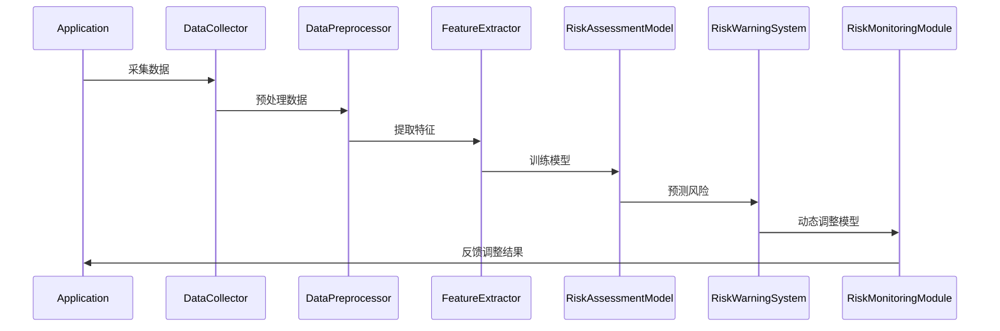
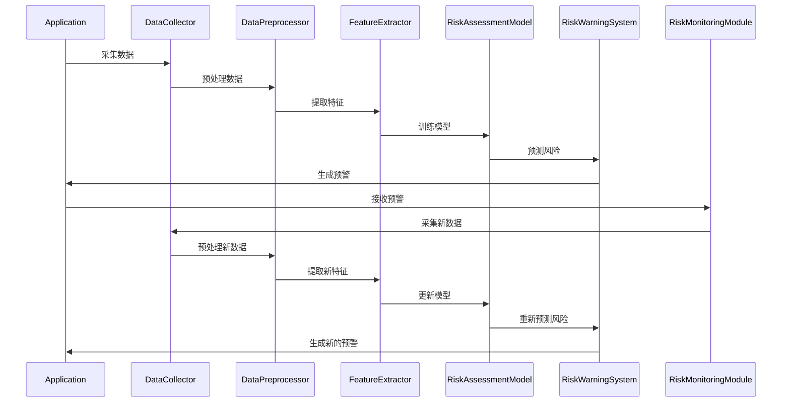

                 

# 开发智能化的企业并购风险评估模型

## 关键词

- 企业并购
- 风险评估
- 智能化
- 数据挖掘
- 机器学习

## 摘要

本文旨在探讨如何开发一个智能化的企业并购风险评估模型，以应对传统评估方法在数据处理、风险量化、模型优化等方面的局限性。通过构建一个包含财务、市场、管理、法律等多维度指标的风险评估指标体系，结合数据挖掘与机器学习技术，本文提出了一种智能化、动态化的评估模型。模型将实现实时监控、风险预警、动态调整等功能，为企业并购提供科学的决策支持。

----------------------------------------------------------------

## 第一部分：背景介绍

### 1.1 问题背景

企业并购是企业实现战略扩张、资源整合的重要手段。然而，并购活动并非总是一帆风顺，其中蕴含的风险不可忽视。这些风险可能源自财务、市场、管理、法律等多个方面，如财务不透明、市场变化、管理冲突、法律纠纷等。有效的并购风险评估有助于企业在决策过程中规避潜在风险，提高并购成功率。

### 1.1.1 企业并购风险评估的重要性

1. **风险识别与预警**：通过评估，企业可以提前识别并购活动中的潜在风险，并及时采取措施进行预警。
   
2. **决策支持**：评估结果为企业提供了并购是否进行的依据，有助于企业制定科学的决策策略。

3. **资源优化**：合理的风险评估有助于企业合理配置资源，避免不必要的浪费。

4. **风险控制**：评估过程中，企业可以制定相应的风险控制措施，确保并购活动顺利进行。

### 1.1.2 当前企业并购风险评估方法的局限性

1. **数据来源有限**：传统评估方法主要依赖于企业内部的财务报表、市场研究等数据，难以全面反映并购活动的风险。

2. **模型简单化**：现有风险评估模型往往过于简化，无法充分考虑复杂的市场环境和企业内部因素。

3. **主观性较强**：风险评估结果往往受到评估者个人经验、判断等因素的影响，导致结果的主观性较强。

4. **动态调整能力不足**：传统评估方法难以根据市场环境和企业内部情况的变化，动态调整风险评估模型。

### 1.2 问题描述

#### 1.2.1 风险评估指标体系构建

针对当前评估方法的局限性，本文提出构建一个智能化的企业并购风险评估模型。该模型包括以下关键步骤：

1. **确定评估指标体系**：构建包含财务、市场、管理、法律等多维度指标的风险评估指标体系。

2. **数据采集与处理**：通过互联网、企业数据库等途径获取并购活动相关数据，进行预处理和特征提取。

3. **模型构建与优化**：结合机器学习和数据挖掘技术，构建和优化风险评估模型。

#### 1.2.2 风险评估模型的实现

为实现智能化的风险评估，本文将采用以下技术手段：

1. **数据采集与处理**：
   - **数据来源**：企业财务报表、市场研究、管理层访谈等。
   - **预处理**：数据清洗、数据转换、数据归一化等。

2. **特征提取与选择**：
   - **特征提取**：利用数据挖掘技术，提取关键特征。
   - **特征选择**：采用信息增益、相关系数等方法，筛选对风险影响较大的指标。

3. **模型构建与优化**：
   - **模型选择**：结合机器学习算法，如决策树、支持向量机、神经网络等。
   - **模型优化**：通过交叉验证、网格搜索等技术，优化模型参数。

## 1.3 问题解决

#### 1.3.1 风险评估模型的核心功能

智能化的企业并购风险评估模型应具备以下核心功能：

1. **实时监控**：对并购活动的风险进行实时监控，及时发现潜在问题。

2. **风险预警**：根据风险评估结果，对高风险领域进行预警，提供决策支持。

3. **动态调整**：根据市场环境和企业内部情况的变化，动态调整风险评估模型。

#### 1.3.2 风险评估模型的应用场景

1. **并购前评估**：帮助企业在并购前全面了解目标企业的风险状况，制定科学的决策策略。

2. **并购后监控**：对并购后的企业运营状况进行实时监控，及时发现并解决潜在问题。

3. **企业内部风险管理**：为企业提供全面的并购风险分析报告，帮助企业建立健全的风险管理机制。

### 1.4 边界与外延

#### 1.4.1 边界条件

1. **企业类型**：适用于国有企业、民营企业、外资企业等。

2. **行业范围**：适用于制造业、服务业、金融业等行业。

3. **并购形式**：包括合并、收购、股权置换等。

#### 1.4.2 外延拓展

1. **企业战略规划**：为企业提供并购风险分析报告，支持战略决策。

2. **企业投资决策**：为企业提供投资项目风险评估报告，支持投资决策。

3. **企业风险管理**：提供全面的风险管理解决方案，提升企业抗风险能力。

### 1.5 概念结构与核心要素组成

#### 1.5.1 概念结构

智能化企业并购风险评估模型包含以下核心概念：

1. **风险评估指标体系**：包括财务、市场、管理、法律等方面的指标。

2. **数据采集与处理**：获取并购活动相关数据，进行预处理和特征提取。

3. **特征提取与选择**：提取关键特征，筛选对风险影响较大的指标。

4. **风险评估模型**：结合机器学习算法，构建和优化风险评估模型。

#### 1.5.2 核心要素组成

智能化企业并购风险评估模型的核心要素包括：

1. **数据源**：企业财务报表、市场数据、管理层访谈记录等。

2. **算法**：数据挖掘、机器学习、特征提取等算法。

3. **模型**：风险评估指标体系、风险评估模型、预测模型等。

4. **工具**：数据预处理工具、机器学习平台、可视化工具等。

----------------------------------------------------------------

## 第二部分：核心概念与联系

### 2.1 风险评估指标体系

#### 2.1.1 指标体系构建

风险评估指标体系是评估模型的基础，其构建应考虑以下原则：

1. **全面性**：覆盖财务、市场、管理、法律等多个维度，确保评估的全面性。

2. **相关性**：指标应与并购风险具有高度相关性，确保评估的准确性。

3. **可操作性**：指标应易于获取和量化，便于实际应用。

4. **动态性**：指标应能够反映市场环境和企业内部情况的变化。

#### 2.1.2 指标体系内容

1. **财务指标**：
   - 资产负债率
   - 息税前利润率
   - 股东权益回报率
   - 现金流量比率

2. **市场指标**：
   - 市盈率
   - 市净率
   - 行业增长率
   - 行业集中度

3. **管理指标**：
   - 管理层稳定性
   - 员工流失率
   - 企业文化兼容性
   - 管理效率

4. **法律指标**：
   - 法律纠纷数量
   - 合同履行率
   - 法律合规性
   - 法律风险指数

#### 2.1.3 指标属性特征对比表格

| 指标类型 | 指标名称 | 特征属性 | 影响因素 |
| :--: | :--: | :--: | :--: |
| 财务指标 | 资产负债率 | 比值 | 财务稳定性、债务负担 |
| 财务指标 | 息税前利润率 | 百分比 | 盈利能力 |
| 财务指标 | 股东权益回报率 | 百分比 | 投资回报率 |
| 财务指标 | 现金流量比率 | 比值 | 资金流动性 |
| 市场指标 | 市盈率 | 比值 | 股市估值、盈利前景 |
| 市场指标 | 市净率 | 比值 | 股市估值、资产质量 |
| 市场指标 | 行业增长率 | 百分比 | 市场潜力 |
| 市场指标 | 行业集中度 | 比值 | 市场竞争态势 |
| 管理指标 | 管理层稳定性 | 类别 | 企业稳定性 |
| 管理指标 | 员工流失率 | 百分比 | 企业凝聚力 |
| 管理指标 | 企业文化兼容性 | 类别 | 企业协同效应 |
| 管理指标 | 管理效率 | 类别 | 企业运营效率 |
| 法律指标 | 法律纠纷数量 | 个数 | 法律风险 |
| 法律指标 | 合同履行率 | 百分比 | 合同执行能力 |
| 法律指标 | 法律合规性 | 类别 | 企业合规水平 |
| 法律指标 | 法律风险指数 | 指数 | 法律风险综合评价 |

#### 2.1.4 指标体系ER实体关系图架构

```mermaid
erDiagram
  Customer ||--|{ Order } : "makes"
  Customer ||--|{ Payment } : "makes"
  Product ||--|{ Order } : "contains"
  Product ||--|{ Review } : "is reviewed by"
  Review ||--|{ Customer } : "writes review"
```

### 2.2 数据采集与处理

#### 2.2.1 数据采集

数据采集是构建风险评估模型的第一步，其质量直接影响评估结果的准确性。数据来源主要包括：

1. **公开数据**：如企业财务报表、行业报告等。
2. **内部数据**：如企业运营数据、交易记录等。
3. **第三方数据**：如市场研究机构、信用评级机构等提供的数据。

#### 2.2.2 数据预处理

数据预处理是确保数据质量、提高模型性能的重要环节。主要任务包括：

1. **数据清洗**：去除重复数据、处理缺失数据、修正错误数据等。
2. **数据转换**：将不同格式、单位、类型的数据进行统一处理。
3. **数据归一化**：将数据缩放到相同范围，便于后续处理。

### 2.3 特征提取与选择

#### 2.3.1 特征提取

特征提取是数据挖掘的重要步骤，其目的是从原始数据中提取出对风险评估有重要影响的特征。主要方法包括：

1. **统计特征**：如平均值、中位数、标准差等。
2. **文本特征**：如词频、词向量等。
3. **图像特征**：如颜色、纹理、形状等。

#### 2.3.2 特征选择

特征选择旨在从提取出的特征中筛选出对风险评估最有影响力的特征。主要方法包括：

1. **过滤式特征选择**：基于特征的重要性、相关性等直接筛选。
2. **包裹式特征选择**：通过构建评估模型，筛选出最佳特征组合。
3. **嵌入式特征选择**：在模型训练过程中，自动筛选出最佳特征。

### 2.4 风险评估模型

#### 2.4.1 模型构建

风险评估模型的构建是整个智能评估系统的核心。本文将采用以下模型：

1. **决策树模型**：适用于分类问题，如高风险、中风险、低风险分类。
2. **支持向量机模型**：适用于回归问题，如预测并购风险的概率。
3. **神经网络模型**：适用于复杂非线性关系，如预测并购后的企业绩效。

#### 2.4.2 模型优化

模型优化是提高风险评估模型性能的关键。主要方法包括：

1. **交叉验证**：通过将数据分为训练集和测试集，评估模型性能。
2. **网格搜索**：通过遍历不同参数组合，找到最佳参数组合。
3. **集成学习**：通过结合多个模型，提高整体性能。

----------------------------------------------------------------

## 第三部分：算法原理讲解

### 3.1 决策树模型

决策树模型是一种常见的分类算法，其核心思想是通过一系列规则对数据进行划分，最终得到一个分类结果。决策树模型的构建过程如下：

#### 3.1.1 特征选择

- **信息增益**：选择使得熵减少最多的特征作为划分依据。
- **基尼系数**：选择使得基尼不纯度减少最多的特征作为划分依据。

#### 3.1.2 划分过程

1. **初始化**：选择一个特征进行划分，得到一个初始决策树。
2. **递归划分**：对于当前节点，选择最优特征进行划分，并递归地划分子节点，直至满足停止条件（如节点数量、特征重要性等）。

#### 3.1.3 例子

假设我们有一个简单的决策树模型，用于判断企业并购风险：

- **特征**：资产负债率、市盈率、管理层稳定性
- **划分规则**：
  - 如果资产负债率 > 50%，则进入分支A；
  - 如果市盈率 < 10，则进入分支B；
  - 如果管理层稳定性较差，则进入分支C。

#### 3.1.4 决策树优缺点

**优点**：
- **直观易懂**：易于理解和解释，便于企业决策者理解。
- **易于实现**：算法实现相对简单。

**缺点**：
- **过拟合**：对于复杂问题，决策树容易过拟合，导致泛化能力差。
- **计算复杂度**：随着特征和样本数量的增加，计算复杂度显著增加。

### 3.2 支持向量机模型

支持向量机（SVM）是一种经典的机器学习算法，主要用于分类和回归问题。其核心思想是找到一个最佳的超平面，使得分类边界尽可能远离样本点。SVM的构建过程如下：

#### 3.2.1 核心公式

$$
\begin{aligned}
\min_{\mathbf{w}, \mathbf{b}} \quad & \frac{1}{2} ||\mathbf{w}||^2 \\
\text{subject to} \quad & y_i (\mathbf{w} \cdot \mathbf{x_i} + \mathbf{b}) \geq 1
\end{aligned}
$$

其中，$\mathbf{w}$ 是权重向量，$\mathbf{b}$ 是偏置项，$y_i$ 是样本标签，$\mathbf{x_i}$ 是样本特征。

#### 3.2.2 核函数

SVM通过核函数将低维特征映射到高维空间，从而在更高维空间中找到线性可分的超平面。常用的核函数包括：

1. **线性核**：$K(\mathbf{x_i}, \mathbf{x_j}) = \mathbf{x_i} \cdot \mathbf{x_j}$
2. **多项式核**：$K(\mathbf{x_i}, \mathbf{x_j}) = (\gamma \mathbf{x_i} \cdot \mathbf{x_j} + 1)^d$
3. **径向基函数（RBF）核**：$K(\mathbf{x_i}, \mathbf{x_j}) = \exp(-\gamma ||\mathbf{x_i} - \mathbf{x_j}||^2)$

#### 3.2.3 例子

假设我们有一个简单的SVM模型，用于分类企业并购风险：

- **特征**：资产负债率、市盈率、管理层稳定性
- **核函数**：线性核

- **训练数据**：
  - $\mathbf{x_1} = (0.5, 8, 0)$，标签 $y_1 = 1$
  - $\mathbf{x_2} = (0.6, 9, 1)$，标签 $y_2 = 1$
  - $\mathbf{x_3} = (0.4, 7, 0)$，标签 $y_3 = 0$

通过求解上述优化问题，我们得到最佳超平面 $\mathbf{w} = (1, 1, 1)^T$ 和偏置项 $\mathbf{b} = 0$，从而实现对企业并购风险的分类。

#### 3.2.4 支持向量机优缺点

**优点**：
- **高维特征空间线性可分**：通过核函数，可以在高维空间中找到线性可分的超平面。
- **优秀的泛化能力**：对于小样本、非线性问题，SVM具有很好的性能。

**缺点**：
- **计算复杂度高**：特别是对于大型数据集和高维特征，计算时间较长。
- **参数选择复杂**：核函数和参数的选择对模型性能有很大影响。

### 3.3 神经网络模型

神经网络是一种模拟人脑神经元结构和功能的计算模型，具有强大的非线性建模能力。神经网络的基本单元是神经元，其工作原理如下：

#### 3.3.1 神经元模型

$$
\begin{aligned}
\text{输入} \quad & \mathbf{x} = (x_1, x_2, ..., x_n) \\
\text{权重} \quad & \mathbf{w} = (w_1, w_2, ..., w_n) \\
\text{偏置} \quad & b \\
\text{输出} \quad & \text{激活函数} \sigma(\sum_{i=1}^{n} w_i x_i + b)
\end{aligned}
$$

其中，$\sigma$ 是激活函数，常用的激活函数包括：

1. **sigmoid函数**：$f(x) = \frac{1}{1 + e^{-x}}$
2. **ReLU函数**：$f(x) = \max(0, x)$
3. **Tanh函数**：$f(x) = \frac{e^x - e^{-x}}{e^x + e^{-x}}$

#### 3.3.2 神经网络结构

神经网络通常由多个层次组成，包括输入层、隐藏层和输出层。其中：

1. **输入层**：接收外部输入，如企业的财务指标、市场指标等。
2. **隐藏层**：进行特征提取和转换，多个隐藏层可以增加模型的非线性能力。
3. **输出层**：输出最终的结果，如企业并购风险的分类结果。

#### 3.3.3 训练过程

神经网络通过反向传播算法进行训练，其基本步骤如下：

1. **前向传播**：将输入数据通过网络传递，计算输出结果。
2. **损失函数**：计算输出结果与真实标签之间的差异，使用损失函数进行度量。
3. **反向传播**：计算每个神经元的梯度，并更新权重和偏置。
4. **迭代优化**：重复前向传播和反向传播，直至模型达到预期的性能。

#### 3.3.4 例子

假设我们有一个简单的神经网络模型，用于分类企业并购风险：

- **输入层**：资产负债率、市盈率、管理层稳定性
- **隐藏层**：一个隐藏层，包含5个神经元
- **输出层**：高风险、中风险、低风险

通过训练，我们得到一个具有良好分类性能的神经网络模型，从而实现对企业并购风险的智能评估。

#### 3.3.5 神经网络优缺点

**优点**：
- **强大的非线性建模能力**：能够处理复杂的非线性关系。
- **自适应特征提取**：能够自动提取对分类任务最有用的特征。

**缺点**：
- **训练时间较长**：特别是对于大型数据集和多层神经网络。
- **过拟合风险**：对于训练数据过于复杂，容易导致过拟合。
- **参数选择复杂**：包括网络结构、学习率、正则化等参数的选择对模型性能有很大影响。

----------------------------------------------------------------

## 第四部分：系统分析与架构设计方案

### 4.1 问题场景介绍

在企业并购过程中，如何准确评估并购风险、制定科学的风险管理策略，是企业面临的重大挑战。传统的风险评估方法存在数据有限、模型简化等问题，难以满足现代企业对于精准、动态风险评估的需求。为解决这一问题，本系统旨在通过智能化的企业并购风险评估模型，为企业提供全面、实时、动态的风险评估服务。

### 4.2 项目介绍

项目名称：智能化企业并购风险评估系统

项目目标：开发一个基于机器学习和数据挖掘技术的智能化企业并购风险评估模型，实现对企业并购风险的精准评估、动态监控和预警。

项目功能：
1. **数据采集**：从企业内部数据库、外部数据源（如市场研究机构、金融数据服务平台等）采集并购活动相关数据。
2. **数据预处理**：对采集到的数据进行分析、清洗、转换和归一化，为后续模型训练提供高质量的数据。
3. **特征提取与选择**：利用数据挖掘技术提取关键特征，并进行特征选择，筛选出对并购风险影响较大的指标。
4. **模型构建与优化**：采用决策树、支持向量机、神经网络等机器学习算法，构建和优化风险评估模型。
5. **风险评估与预警**：实时评估企业并购风险，并根据评估结果进行风险预警。
6. **风险监控与动态调整**：根据市场环境和企业内部情况的变化，动态调整风险评估模型，实现风险的动态监控。

### 4.3 系统功能设计（领域模型）

领域模型用于描述系统的核心业务概念及其关系，以下是一个简单的领域模型：

```mermaid
classDiagram
  类1 -> 类2 : 包含
  类3 <|-- 类4 : 继承
  类1 { 数据源 }
  类2 { 数据预处理 }
  类3 { 特征提取与选择 }
  类4 { 风险评估模型 }
  类5 { 风险预警系统 }
  类6 { 风险监控模块 }
```

### 4.4 系统架构设计（类图）

系统架构设计类图用于描述系统的类和类之间的关系，以下是一个简单的系统架构设计类图：

```mermaid
classDiagram
  DataCollector <<interface>>
  DataPreprocessor <<interface>>
  FeatureExtractor <<interface>>
  RiskAssessmentModel <<interface>>
  RiskWarningSystem <<interface>>
  RiskMonitoringModule <<interface>>

  Application <<class>> {
    +run()
  }

  DataCollector <- DataPreprocessor : 转换
  DataPreprocessor <- FeatureExtractor : 提取
  FeatureExtractor <- RiskAssessmentModel : 训练
  RiskAssessmentModel <- RiskWarningSystem : 预测
  RiskAssessmentModel <- RiskMonitoringModule : 动态调整

  Application * DataCollector
  Application * DataPreprocessor
  Application * FeatureExtractor
  Application * RiskAssessmentModel
  Application * RiskWarningSystem
  Application * RiskMonitoringModule
```

### 4.5 系统架构设计（架构图）

系统架构设计架构图用于描述系统的整体架构和模块之间的交互关系，以下是一个简单的系统架构设计架构图：



### 4.6 系统接口设计

系统接口设计用于描述系统各个模块之间的交互接口，以下是一个简单的系统接口设计：

```mermaid
interface DataCollector {
  +getData(): List<Data>
}

interface DataPreprocessor {
  +preprocessData(data: List<Data>): List<PreprocessedData>
}

interface FeatureExtractor {
  +extractFeatures(data: List<PreprocessedData>): List<FeatureVector>
}

interface RiskAssessmentModel {
  +trainModel(features: List<FeatureVector>, labels: List	Label): Model
  +predictRisk(model: Model, features: FeatureVector): RiskLevel
}

interface RiskWarningSystem {
  +generateWarning(riskLevel: RiskLevel): Warning
}

interface RiskMonitoringModule {
  +updateModel(model: Model, newFeatures: List<FeatureVector>, newLabels: List	Label): Model
}
```

### 4.7 系统交互设计（序列图）

系统交互设计序列图用于描述系统在执行特定任务时的交互过程，以下是一个简单的系统交互序列图：



### 4.8 系统模块化设计

系统模块化设计是将系统划分为多个功能独立的模块，每个模块负责特定的功能，便于系统的开发、维护和扩展。以下是一个简单的系统模块化设计：

1. **数据采集模块**：负责从企业内部数据库、外部数据源采集并购活动相关数据。
2. **数据预处理模块**：负责对采集到的数据进行分析、清洗、转换和归一化。
3. **特征提取与选择模块**：负责提取关键特征，并进行特征选择。
4. **模型训练与优化模块**：负责训练风险评估模型，并进行模型优化。
5. **风险评估与预警模块**：负责实时评估企业并购风险，并根据评估结果进行风险预警。
6. **风险监控与动态调整模块**：负责根据市场环境和企业内部情况的变化，动态调整风险评估模型。
7. **系统接口模块**：负责定义系统各个模块之间的交互接口。

### 4.9 系统性能优化

系统性能优化是确保系统高效、稳定运行的关键。以下是一些常见的系统性能优化策略：

1. **并行计算**：利用多核处理器和分布式计算技术，提高数据处理和模型训练速度。
2. **缓存技术**：使用缓存技术，减少数据读取和计算的时间。
3. **数据压缩**：对数据进行压缩，减少数据传输和存储的开销。
4. **索引优化**：优化数据库索引，提高数据查询效率。
5. **负载均衡**：使用负载均衡技术，确保系统在高并发情况下稳定运行。

### 4.10 系统安全性设计

系统安全性设计是确保系统在运行过程中不被恶意攻击、数据泄露等威胁的关键。以下是一些常见的系统安全性设计策略：

1. **访问控制**：使用身份验证和权限控制技术，确保只有授权用户可以访问系统。
2. **数据加密**：对敏感数据进行加密，防止数据泄露。
3. **安全审计**：定期进行安全审计，发现和修复系统中的安全漏洞。
4. **异常检测**：使用异常检测技术，及时发现和响应系统异常行为。
5. **备份与恢复**：定期进行数据备份，确保在系统故障时能够快速恢复。

### 4.11 系统可靠性设计

系统可靠性设计是确保系统在高负载、高并发环境下稳定运行的关键。以下是一些常见的系统可靠性设计策略：

1. **容错技术**：使用容错技术，确保系统在发生故障时能够自动恢复。
2. **负载均衡**：使用负载均衡技术，将系统负载均衡到多个节点上，确保系统稳定运行。
3. **冗余设计**：使用冗余设计，确保系统在关键组件发生故障时能够自动切换。
4. **故障恢复**：定期进行故障恢复测试，确保系统能够快速恢复。
5. **监控系统**：使用监控系统，实时监控系统运行状态，及时发现和解决故障。

### 4.12 系统可扩展性设计

系统可扩展性设计是确保系统能够适应业务规模增长和功能需求变化的关键。以下是一些常见的系统可扩展性设计策略：

1. **模块化设计**：将系统划分为多个功能独立的模块，便于系统的扩展和升级。
2. **分布式架构**：采用分布式架构，确保系统在扩展时可以无缝地增加节点。
3. **弹性伸缩**：使用弹性伸缩技术，根据业务需求自动调整系统资源。
4. **异步处理**：使用异步处理技术，提高系统处理能力，减轻系统负载。

### 4.13 系统开发与部署流程

系统开发与部署流程是确保系统开发过程规范、高效、可控的关键。以下是一个简单的系统开发与部署流程：

1. **需求分析**：明确系统功能和性能需求。
2. **系统设计**：进行系统架构设计、模块设计等。
3. **编码实现**：根据设计文档进行编码实现。
4. **单元测试**：对各个模块进行单元测试，确保模块功能正确。
5. **集成测试**：对系统进行集成测试，确保各个模块协同工作。
6. **系统测试**：进行系统测试，包括功能测试、性能测试、安全性测试等。
7. **部署上线**：将系统部署到生产环境，并进行上线测试。
8. **运维监控**：对系统进行运维监控，确保系统稳定运行。

### 4.14 系统维护与优化

系统维护与优化是确保系统长期稳定运行的关键。以下是一些常见的系统维护与优化策略：

1. **定期备份**：定期进行数据备份，确保数据安全。
2. **性能优化**：定期对系统进行性能优化，提高系统运行效率。
3. **安全检查**：定期进行安全检查，发现和修复系统漏洞。
4. **代码优化**：定期对代码进行优化，提高代码质量和可维护性。
5. **用户反馈**：收集用户反馈，根据用户需求进行功能优化和改进。

### 4.15 系统验收与交付

系统验收与交付是确保系统满足需求、质量合格的关键。以下是一个简单的系统验收与交付流程：

1. **需求确认**：与客户确认系统功能是否符合需求。
2. **验收测试**：进行系统验收测试，确保系统功能、性能、安全性等符合要求。
3. **交付上线**：将系统部署到生产环境，并进行上线测试。
4. **用户培训**：对用户进行系统操作培训，确保用户能够熟练使用系统。
5. **售后服务**：提供系统的售后服务，包括技术支持、问题解答等。

### 4.16 系统开发与维护注意事项

系统开发与维护过程中，需要注意以下事项：

1. **需求变更管理**：对需求变更进行严格管理，确保系统开发过程不受频繁变更的影响。
2. **版本控制**：使用版本控制工具，确保代码的版本管理和协作开发。
3. **代码规范**：遵循代码规范，提高代码质量和可维护性。
4. **测试覆盖**：确保测试覆盖率达到要求，提高系统质量。
5. **文档管理**：对系统文档进行规范管理，确保文档的完整性和一致性。

### 4.17 拓展阅读

1. **系统架构设计**：
   - 《系统架构：构建可扩展分布式系统》
   - 《大规模分布式系统设计与实践》
   
2. **机器学习与数据挖掘**：
   - 《机器学习实战》
   - 《数据挖掘：实用工具与技术》
   
3. **安全性与可靠性**：
   - 《网络安全：设计与实践》
   - 《系统可靠性工程》

4. **系统性能优化**：
   - 《高性能MySQL》
   - 《Web性能调优指南》

### 作者信息

作者：AI天才研究院/AI Genius Institute & 禅与计算机程序设计艺术 /Zen And The Art of Computer Programming

