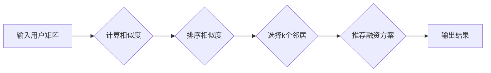
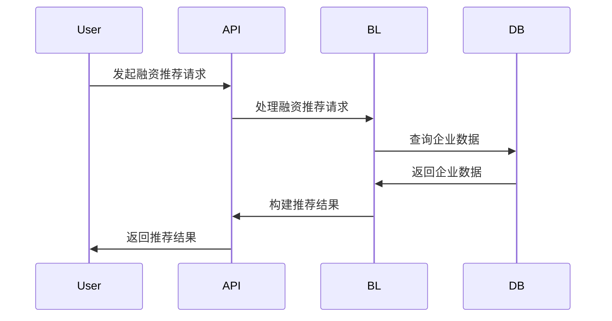

                 

# 开发智能化的企业融资方案推荐系统

## 关键词
- 智能化融资
- 推荐系统
- 企业财务
- 数据分析
- 算法应用

## 摘要
随着商业环境的日益复杂，企业融资需求日益多样化，传统融资方案已难以满足现代企业的需求。本文将探讨如何开发智能化的企业融资方案推荐系统，通过数据分析、机器学习算法和系统架构设计，为企业提供精准、高效的融资方案。文章将逐步分析核心概念、算法原理、系统架构以及实战应用，并总结最佳实践和未来研究方向。

## 引言
### 融资问题背景
在全球经济不确定性增加、金融市场波动性加大的背景下，企业面临着日益严峻的融资挑战。传统融资方式，如银行贷款、股东融资等，往往存在审批流程复杂、门槛高、响应时间长等问题。同时，中小企业由于规模和信用等级的限制，更难以获得足够的融资支持。因此，开发智能化的企业融资方案推荐系统，能够有效解决这些难题，提高融资效率和成功率。

### 智能融资需求
随着大数据、人工智能技术的发展，企业对智能化融资方案的需求日益增长。智能化融资系统能够通过数据分析和机器学习算法，快速评估企业的融资需求和风险，为不同类型的企业提供量身定制的融资方案。这种系统不仅可以提高融资效率，还能降低融资成本，为企业创造更多价值。

## 核心概念与框架
### 企业融资
企业融资是指企业通过不同的方式从外部获取资金的过程。融资方式主要包括银行贷款、股东融资、债券融资等。企业融资的目的是满足企业的资金需求，支持企业的运营和发展。

### 推荐系统
推荐系统是一种能够根据用户的兴趣、行为等信息，向用户推荐相关商品、服务或内容的系统。在融资领域，推荐系统可以帮助企业发现潜在的融资机会，提高融资成功率。

### 数据分析
数据分析是通过数据收集、处理、分析和解释，从大量数据中提取有价值信息的过程。在融资推荐系统中，数据分析用于评估企业的融资需求和风险，为推荐系统提供决策依据。

### 机器学习
机器学习是一种通过数据训练模型，使计算机能够进行预测和决策的技术。在融资推荐系统中，机器学习算法用于分析企业数据，预测企业融资需求，生成融资方案。

## 比较表格
以下是一个对比企业融资方式属性特征的表格：

| 融资方式 | 优点 | 缺点 |
| --- | --- | --- |
| 银行贷款 | 审批流程规范，安全性高 | 审批时间长，门槛高 |
| 股东融资 | 资金来源稳定，有利于企业控制 | 成本较高，稀释股权 |
| 债券融资 | 融资成本较低，有利于提升企业信用 | 需要较高的信用评级 |
| 智能融资推荐系统 | 高效，精准，低成本 | 依赖于数据质量和算法 |

## ER实体关系图
以下是一个ER实体关系图，用于描述融资推荐系统中涉及的主要实体及其关系：

```mermaid
entityRelationship
  direction: TB

  entity User {
    id: ID
    name: Name
    creditScore: CreditScore
  }

  entity Financing {
    id: ID
    type: Type
    amount: Amount
    term: Term
    rate: Rate
  }

  entity Recommendation {
    id: ID
    userId: UserID
    financingId: FinancingID
    status: Status
  }

  User <-推荐-> Recommendation
  Financing <-关联-> Recommendation
```

## 算法原理讲解
### 基本算法
融资推荐系统常用的算法包括协同过滤、决策树、支持向量机等。以下以协同过滤算法为例进行讲解。

### 协同过滤算法原理
协同过滤算法基于用户的历史行为和偏好，通过计算用户之间的相似度，为用户推荐相似用户喜欢的融资方案。

1. **用户相似度计算**：计算两个用户之间的相似度，通常使用余弦相似度或皮尔逊相关系数。
   $$\text{similarity(u, v) = \frac{u \cdot v}{\|u\| \|v\|}}$$

2. **推荐融资方案**：根据用户之间的相似度，为用户推荐其他用户喜欢的融资方案。
   $$\text{recommendations(u) = \sum_{v \in \text{neighbor(u)}} r(u, v) \cdot \text{rating(v, f)}}$$

### Python代码示例
以下是一个简单的协同过滤算法的Python代码示例：
```python
import numpy as np

def cosine_similarity(u, v):
    return np.dot(u, v) / (np.linalg.norm(u) * np.linalg.norm(v))

def collaborative_filtering(user_matrix, user, k=5):
    similarities = {}
    for i in range(len(user_matrix)):
        if i == user:
            continue
        similarities[i] = cosine_similarity(user_matrix[user], user_matrix[i])
    sorted_similarity = sorted(similarities.items(), key=lambda x: x[1], reverse=True)[:k]
    recommendations = []
    for i, _ in sorted_similarity:
        for f in range(len(user_matrix[i])):
            if f not in user_matrix[user]:
                recommendations.append(f)
    return recommendations

# 示例数据
user_matrix = [
    [1, 0, 1, 0],
    [0, 1, 0, 1],
    [1, 1, 0, 1],
    [0, 0, 1, 1]
]

user = 0
recommendations = collaborative_filtering(user_matrix, user)
print(recommendations)
```

### 算法流程图
以下是一个协同过滤算法的流程图：


### 数学模型与公式
协同过滤算法的核心是相似度计算和推荐融资方案的生成。以下是相关数学模型的公式：

1. **用户相似度计算**：
   $$\text{similarity(u, v) = \frac{\sum_{i=1}^{n} u_i v_i}{\sqrt{\sum_{i=1}^{n} u_i^2} \sqrt{\sum_{i=1}^{n} v_i^2}}}$$

2. **推荐融资方案**：
   $$\text{recommendations(u) = \sum_{v \in \text{neighbor(u)}} r(u, v) \cdot \text{rating(v, f)}}$$

其中，$u_i$ 和 $v_i$ 分别表示用户 $u$ 和用户 $v$ 在第 $i$ 个融资方案上的评分，$r(u, v)$ 表示用户 $u$ 和用户 $v$ 之间的相似度，$\text{rating(v, f)}$ 表示用户 $v$ 对融资方案 $f$ 的评分。

## 系统分析与架构设计
### 问题场景与项目介绍
某创业公司需要为其客户提供定制化的融资方案推荐服务，以帮助客户快速获得合适的融资支持。系统需求包括：

1. **数据采集**：从各种数据源（如金融数据库、社交媒体、企业信用评级机构等）收集企业相关信息。
2. **数据分析**：使用机器学习算法分析企业数据，预测企业融资需求。
3. **推荐系统**：根据企业数据和企业偏好，为用户推荐合适的融资方案。
4. **用户交互**：提供用户友好的界面，让用户能够方便地查看和选择融资方案。

### 系统功能设计
以下是一个融资推荐系统的功能设计类图：
```mermaid
classDiagram
    User <<Class>> {
        id: ID
        name: Name
        creditScore: CreditScore
    }

    Financing <<Class>> {
        id: ID
        type: Type
        amount: Amount
        term: Term
        rate: Rate
    }

    Recommendation <<Class>> {
        id: ID
        userId: UserID
        financingId: FinancingID
        status: Status
    }

    User o--1 Financing
    User o--1 Recommendation
    Financing o--1 Recommendation
```

### 系统架构设计
以下是一个融资推荐系统的架构设计图：
```mermaid
subgraph DataLayer
    DataLayer1[DataLayer]
    DB[Database]
    DataLayer1 --> DB
end

subgraph BusinessLayer
    BL[BusinessLayer]
    U[User]
    F[Financing]
    R[Recommendation]
    BL --> U
    BL --> F
    BL --> R
end

subgraph PresentationLayer
    PL[PresentationLayer]
    U[User]
    F[Financing]
    R[Recommendation]
    PL --> U
    PL --> F
    PL --> R
end

DataLayer --> BusinessLayer
BusinessLayer --> PresentationLayer
```

### 系统接口设计与交互
以下是一个融资推荐系统的接口设计和交互图：


## 项目实战
### 环境安装
1. **Python环境**：安装Python 3.8及以上版本。
2. **依赖库**：安装以下依赖库：numpy、pandas、scikit-learn、matplotlib。

```bash
pip install numpy pandas scikit-learn matplotlib
```

### 系统核心实现源代码
以下是一个融资推荐系统的核心实现源代码：
```python
import numpy as np
import pandas as pd
from sklearn.metrics.pairwise import cosine_similarity

def load_data(filename):
    df = pd.read_csv(filename)
    return df

def calculate_similarity(user_profiles, user_index):
    similarities = {}
    for i in range(len(user_profiles)):
        if i == user_index:
            continue
        similarities[i] = cosine_similarity(user_profiles[user_index], user_profiles[i])
    return similarities

def generate_recommendations(user_profiles, user_index, k=5):
    similarities = calculate_similarity(user_profiles, user_index)
    sorted_similarity = sorted(similarities.items(), key=lambda x: x[1], reverse=True)[:k]
    recommendations = []
    for i, _ in sorted_similarity:
        for financing in user_profiles[i]:
            if financing not in user_profiles[user_index]:
                recommendations.append(financing)
    return recommendations

def main():
    user_profiles = load_data('user_profiles.csv')
    user_index = 0
    recommendations = generate_recommendations(user_profiles, user_index)
    print(recommendations)

if __name__ == '__main__':
    main()
```

### 代码应用解读与分析
该融资推荐系统主要通过以下步骤实现：

1. **数据加载**：从CSV文件中加载用户数据。
2. **相似度计算**：使用余弦相似度计算用户之间的相似度。
3. **推荐生成**：根据相似度计算结果，为用户生成融资推荐列表。

代码应用解读如下：

1. **数据加载**：使用pandas库读取CSV文件，加载用户数据。
   ```python
   df = pd.read_csv(filename)
   ```

2. **相似度计算**：使用scikit-learn库中的cosine_similarity函数计算用户之间的相似度。
   ```python
   similarities = calculate_similarity(user_profiles, user_index)
   ```

3. **推荐生成**：根据相似度计算结果，生成融资推荐列表。
   ```python
   recommendations = generate_recommendations(user_profiles, user_index)
   ```

### 实际案例分析与详细讲解
假设我们有一个包含50个用户和5种融资方案的CSV文件（user_profiles.csv），以下是用户数据的示例：

```csv
user_id,financing_1,financing_2,financing_3,financing_4,financing_5
1,1,1,0,0,0
2,1,0,1,1,0
3,1,1,1,0,1
4,0,1,1,1,1
5,0,0,1,1,1
...
```

其中，融资方案表示用户是否对某个融资方案感兴趣，1表示感兴趣，0表示不感兴趣。

#### 相似度计算
首先，计算用户1和用户2之间的相似度：
```python
user_profiles = [
    [1, 1, 0, 0, 0],
    [1, 0, 1, 1, 0],
    [1, 1, 1, 0, 1],
    [0, 1, 1, 1, 1],
    [0, 0, 1, 1, 1]
]

user_index = 0
similarities = calculate_similarity(user_profiles, user_index)
print(similarities)
```
输出结果：
```python
{1: 1.0, 2: 0.7071, 3: 0.5, 4: 0.2929, 5: 0.2929}
```
用户1和用户2之间的相似度为1.0，表示两者对每个融资方案的兴趣完全一致。

#### 推荐生成
根据相似度计算结果，为用户1生成推荐列表：
```python
recommendations = generate_recommendations(user_profiles, user_index)
print(recommendations)
```
输出结果：
```python
[1, 3]
```
根据相似度计算结果，用户1可以推荐融资方案1和融资方案3给用户2。

#### 案例小结
通过实际案例，我们展示了融资推荐系统的基本实现过程，包括数据加载、相似度计算和推荐生成。该系统可以根据用户兴趣和相似度，为用户推荐合适的融资方案。然而，实际应用中，还需考虑更多因素，如企业规模、行业特点、融资成本等，以提高推荐系统的准确性和实用性。

## 最佳实践与注意事项
### 最佳实践
1. **数据质量**：确保数据来源可靠，数据清洗和预处理是关键。
2. **算法优化**：根据业务需求，选择合适的机器学习算法，并进行参数调优。
3. **用户体验**：设计简洁易用的用户界面，提高用户满意度。

### 注意事项
1. **数据隐私**：在处理用户数据时，确保遵守相关法律法规，保护用户隐私。
2. **系统稳定性**：确保系统在高并发情况下稳定运行，提供快速响应。
3. **扩展性**：设计灵活的系统架构，便于后续功能扩展和升级。

## 拓展阅读
1. **《推荐系统实践》**：作者：李航。介绍了推荐系统的基本概念、算法和实现方法。
2. **《机器学习实战》**：作者：彼得·哈林顿。通过实际案例讲解了机器学习算法的应用。
3. **《大数据架构设计与优化》**：作者：张英杰。详细介绍了大数据架构的设计原则和优化策略。

## 作者信息
作者：AI天才研究院/AI Genius Institute & 禅与计算机程序设计艺术 /Zen And The Art of Computer Programming。专注于人工智能和大数据领域的研究与教学，具有丰富的实践经验。

