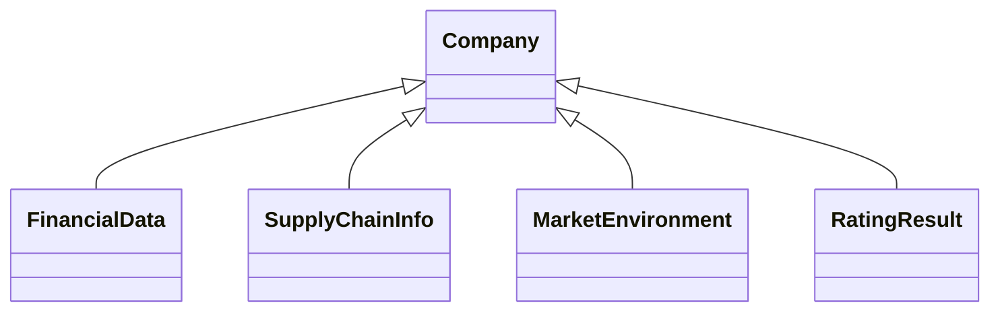
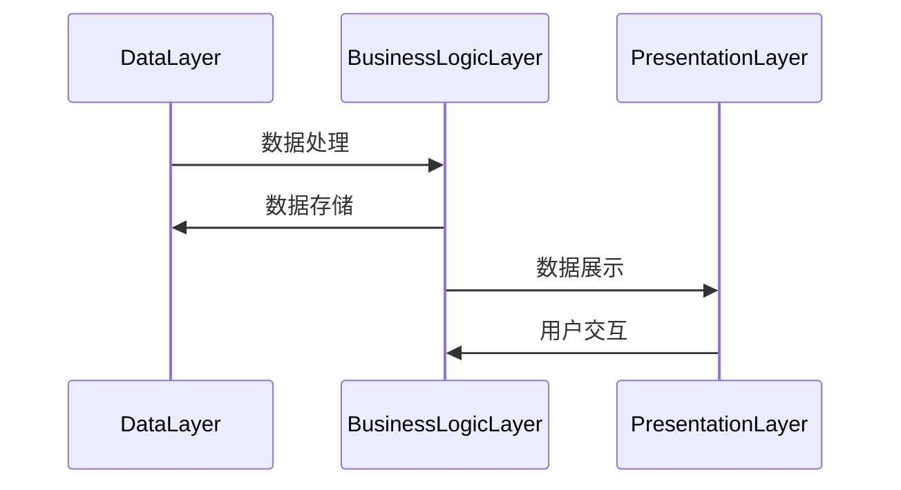
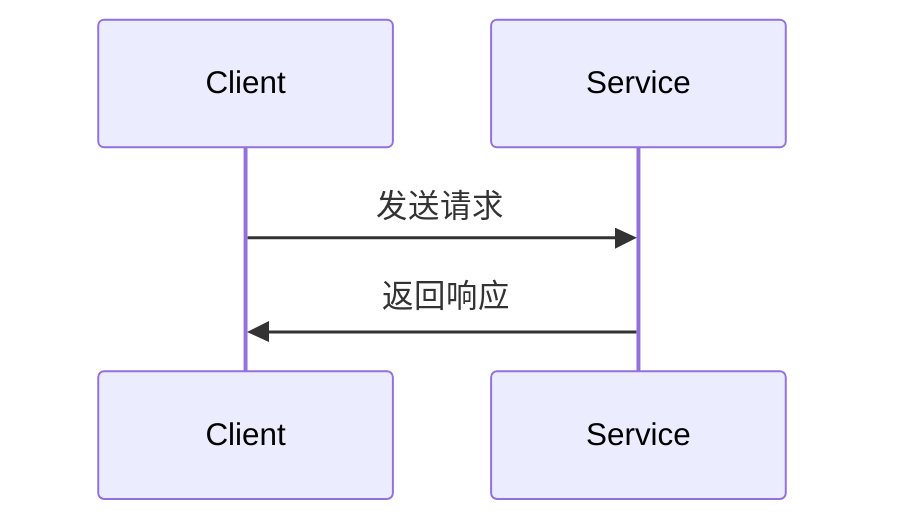

                 

### 开发智能化的供应链金融信用评级模型

> 关键词：供应链金融、信用评级、智能化模型、算法、架构设计、项目实战

> 摘要：本文将详细探讨开发智能化供应链金融信用评级模型的全过程，从背景介绍、核心概念、算法原理、系统设计与实现，到项目实战与最佳实践，为读者提供一套完整的技术解决方案。通过本文的阅读，您将了解如何运用先进的技术手段，构建一个高效、可靠的供应链金融信用评级系统。

### 第一部分：背景介绍与核心概念

#### 1.1 供应链金融与信用评级概述

##### 1.1.1 供应链金融的定义与作用

供应链金融（Supply Chain Finance，SCF）是一种以供应链上的企业为服务对象，通过融资、结算、风险管理等手段，提高供应链整体运作效率的金融服务。它不仅涉及核心企业与上下游供应商的融资需求，还包括应收账款融资、预付款融资等多种形式。

供应链金融的作用主要体现在以下几个方面：

1. **提升供应链融资效率**：通过供应链金融，企业可以更快速地获取资金，降低融资难度和成本。
2. **优化现金流**：供应链金融有助于提高企业现金流的管理效率，降低资金占用。
3. **增强供应链稳定性**：通过对上下游企业的融资支持，有助于提高供应链的整体竞争力。

##### 1.1.2 信用评级的定义与重要性

信用评级（Credit Rating）是指专业机构对债务人的偿债能力和意愿进行评价，并据此给出信用等级的过程。信用评级在金融市场中具有重要的地位，主要表现在：

1. **风险识别与评估**：信用评级有助于投资者识别和评估债务风险，做出更为合理的投资决策。
2. **定价参考**：信用评级是金融市场产品定价的重要参考因素，影响企业融资成本。
3. **促进市场透明度**：信用评级提高了市场信息的透明度，有助于维护市场秩序。

##### 1.1.3 供应链金融信用评级的需求与挑战

随着供应链金融的发展，对智能化信用评级模型的需求日益增长。这主要源于以下几个方面的挑战：

1. **数据复杂性**：供应链金融涉及大量的数据，包括财务数据、业务数据、供应链信息等，如何有效整合和处理这些数据是首要问题。
2. **实时性要求**：供应链金融业务对信用评级的实时性要求较高，需要能够快速响应市场变化。
3. **准确性需求**：信用评级结果的准确性直接关系到融资决策的成败，因此需要不断提高评级模型的准确性。

#### 1.2 智能化供应链金融信用评级模型的核心概念

##### 1.2.1 智能化模型的定义与特征

智能化供应链金融信用评级模型是指利用人工智能、大数据、机器学习等先进技术，对供应链金融信用评级过程进行优化和提升的模型。其核心特征包括：

1. **自动数据处理**：智能化模型能够自动从海量数据中提取有价值的信息，进行数据预处理。
2. **自学习与自优化**：通过机器学习算法，模型能够不断学习新的数据，优化评级模型。
3. **高效率与高准确性**：智能化模型能够快速、准确地生成信用评级结果。

##### 1.2.2 供应链金融信用评级的核心要素

供应链金融信用评级涉及多个核心要素，主要包括：

1. **企业财务状况**：企业的财务报表、盈利能力、资产负债情况等。
2. **供应链稳定性**：上下游企业的合作历史、交易记录、供应链信息等。
3. **市场环境**：行业发展趋势、宏观经济环境、政策法规等。
4. **风险管理**：风险识别、评估、监控和应对措施。

##### 1.2.3 模型构建的关键技术

构建智能化供应链金融信用评级模型的关键技术包括：

1. **数据采集与预处理**：包括数据源选择、数据清洗、特征工程等。
2. **机器学习算法**：包括分类算法、回归算法、聚类算法等。
3. **深度学习模型**：包括神经网络、卷积神经网络、循环神经网络等。
4. **模型评估与优化**：包括模型选择、超参数调优、交叉验证等。

### 第二部分：核心概念与联系

#### 2.1 供应链金融信用评级相关概念

##### 2.1.1 供应链金融相关概念

**供应链金融**：一种以供应链上的企业为服务对象，通过融资、结算、风险管理等手段，提高供应链整体运作效率的金融服务。

**供应链融资**：供应链金融的一种形式，主要指核心企业为上下游企业提供融资服务。

**应收账款融资**：企业将应收账款转让给金融机构，以获得资金支持。

**预付款融资**：企业在购买商品或服务时，提前支付部分款项，并从金融机构获得相应的融资。

##### 2.1.2 信用评级相关概念

**信用评级**：专业机构对债务人的偿债能力和意愿进行评价，并据此给出信用等级的过程。

**信用等级**：信用评级的最终结果，通常分为AAA、AA、A、BBB、BB、B等不同等级。

**违约概率**：债务人无法按时偿还债务的概率。

**信用风险**：债务人因各种原因无法按时偿还债务，导致债权人遭受损失的风险。

##### 2.1.3 智能化供应链金融信用评级模型相关概念

**机器学习**：一种通过算法自动从数据中学习规律和模式，进行预测和决策的技术。

**深度学习**：一种基于神经网络模型的机器学习方法，通过多层神经网络结构，对复杂数据进行建模。

**特征工程**：从原始数据中提取有价值的特征，用于训练机器学习模型。

**模型评估**：对训练好的模型进行评估，以确定其预测准确性和可靠性。

**模型优化**：通过调整模型参数、算法结构等，提高模型性能。

#### 2.2 ER实体关系图架构

##### 2.2.1 模型实体定义

- **企业（Company）**：供应链金融的核心实体，包括核心企业、上下游企业等。
- **财务数据（FinancialData）**：企业的财务报表、盈利能力、资产负债情况等。
- **供应链信息（SupplyChainInfo）**：上下游企业的合作历史、交易记录、供应链信息等。
- **市场环境（MarketEnvironment）**：行业发展趋势、宏观经济环境、政策法规等。
- **评级结果（RatingResult）**：信用评级的结果，包括信用等级、违约概率等。

##### 2.2.2 实体关系定义

- **企业与企业**：上下游企业的合作关系，包括供应商、客户等。
- **财务数据与企业**：企业财务数据与企业实体的关联关系。
- **供应链信息与企业**：企业供应链信息与企业实体的关联关系。
- **市场环境与市场环境**：不同市场环境之间的关系。
- **评级结果与企业**：信用评级结果与企业实体的关联关系。

##### 2.2.3 实体关系图绘制

```mermaid
erDiagram
  Company ||--|{ FinancialData } FinancialData
  Company ||--|{ SupplyChainInfo } SupplyChainInfo
  Company ||--|{ MarketEnvironment } MarketEnvironment
  Company ||--|{ RatingResult } RatingResult
  FinancialData ||--|{ Company } Company
  SupplyChainInfo ||--|{ Company } Company
  MarketEnvironment ||--|{ Company } Company
  RatingResult ||--|{ Company } Company
```

### 第三部分：算法原理讲解

#### 4.1 数据采集与预处理

##### 4.1.1 数据来源

供应链金融信用评级模型的数据来源主要包括以下几个方面：

- **企业财务数据**：从企业财务报表、公开信息等渠道获取。
- **供应链信息**：通过企业交易记录、合作伙伴信息等获取。
- **市场环境数据**：从行业报告、宏观经济数据等渠道获取。
- **信用评级数据**：从专业信用评级机构获取。

##### 4.1.2 数据预处理步骤

1. **数据清洗**：去除重复、缺失、异常的数据，保证数据质量。
2. **数据归一化**：将不同数据源的数据进行归一化处理，统一数据尺度。
3. **特征工程**：从原始数据中提取有价值的特征，为模型训练提供输入。

##### 4.1.3 数据预处理代码实现

```python
import pandas as pd
from sklearn.preprocessing import StandardScaler
from sklearn.model_selection import train_test_split

# 读取数据
data = pd.read_csv('data.csv')

# 数据清洗
data = data.drop_duplicates().dropna()

# 数据归一化
scaler = StandardScaler()
data_scaled = scaler.fit_transform(data)

# 特征工程
X = data_scaled[:, :20]  # 特征
y = data_scaled[:, 20]   # 标签

# 数据分割
X_train, X_test, y_train, y_test = train_test_split(X, y, test_size=0.2, random_state=42)
```

#### 4.2 算法流程

##### 4.2.1 算法基本流程

1. **数据采集与预处理**：获取并清洗数据，提取有用特征。
2. **模型选择**：根据问题特点选择合适的机器学习算法。
3. **模型训练**：使用训练数据进行模型训练。
4. **模型评估**：使用测试数据评估模型性能。
5. **模型优化**：根据评估结果调整模型参数，优化模型性能。

##### 4.2.2 算法步骤详解

1. **数据预处理**：
   - 数据清洗：去除重复、缺失、异常的数据。
   - 数据归一化：统一数据尺度，便于模型训练。
   - 特征工程：提取有用特征，提高模型训练效果。

2. **模型选择**：
   - 根据问题特点选择合适的机器学习算法，如决策树、支持向量机、神经网络等。

3. **模型训练**：
   - 使用训练数据进行模型训练，通过调整参数，优化模型性能。

4. **模型评估**：
   - 使用测试数据评估模型性能，包括准确率、召回率、F1值等指标。

5. **模型优化**：
   - 根据评估结果调整模型参数，优化模型性能。
   - 可以使用交叉验证、网格搜索等技术，寻找最佳参数。

##### 4.2.3 算法流程图


#### 4.3 算法数学模型与公式

##### 4.3.1 模型公式

1. **决策树**：

   $$y = f(T, x)$$

   其中，$T$ 为决策树模型，$x$ 为输入特征向量，$y$ 为输出标签。

2. **支持向量机**：

   $$y = \text{sign}(w \cdot x + b)$$

   其中，$w$ 为权重向量，$b$ 为偏置，$x$ 为输入特征向量，$y$ 为输出标签。

3. **神经网络**：

   $$y = \sigma(\frac{\sum_{i=1}^{n} w_i x_i + b}{1})$$

   其中，$\sigma$ 为激活函数，$w_i$ 为权重，$b$ 为偏置，$x_i$ 为输入特征向量，$y$ 为输出标签。

##### 4.3.2 数学推导

1. **决策树**：

   决策树模型的基本原理是通过一系列的划分规则，将输入特征空间划分成多个区域，每个区域对应一个输出标签。

2. **支持向量机**：

   支持向量机的基本原理是通过找到一个最优的超平面，将不同类别的样本分开。这个最优超平面可以通过求解一个优化问题得到。

3. **神经网络**：

   神经网络的基本原理是通过多层神经元的堆叠，对输入特征进行变换和抽象，从而实现对复杂问题的建模。

##### 4.3.3 公式解释

1. **决策树**：

   公式 $y = f(T, x)$ 中，$f$ 表示决策函数，$T$ 表示决策树模型，$x$ 表示输入特征向量。

2. **支持向量机**：

   公式 $y = \text{sign}(w \cdot x + b)$ 中，$\text{sign}$ 表示符号函数，$w$ 表示权重向量，$b$ 表示偏置，$x$ 表示输入特征向量。

3. **神经网络**：

   公式 $y = \sigma(\frac{\sum_{i=1}^{n} w_i x_i + b}{1})$ 中，$\sigma$ 表示激活函数，$w_i$ 表示权重，$b$ 表示偏置，$x_i$ 表示输入特征向量。

### 第四部分：系统分析与架构设计

#### 6.1 系统功能设计

##### 6.1.1 领域模型概念

领域模型（Domain Model）是针对特定业务领域的模型，用于描述业务逻辑、业务规则和业务流程。在供应链金融信用评级系统中，领域模型用于定义系统中的核心实体和关系。

##### 6.1.2 领域模型绘制



#### 6.2 系统架构设计

##### 6.2.1 系统架构设计概念

系统架构设计是指定义系统的整体结构和组件之间的关系。在供应链金融信用评级系统中，系统架构设计包括数据层、业务逻辑层和表示层等。

##### 6.2.2 系统架构设计



##### 6.2.3 系统架构图绘制


#### 6.3 系统接口设计

##### 6.3.1 接口设计原则

接口设计原则包括简洁性、可扩展性、易用性等。在供应链金融信用评级系统中，接口设计主要遵循以下原则：

1. **简洁性**：接口设计要简洁明了，避免过多的参数和复杂的调用流程。
2. **可扩展性**：接口设计要具备良好的可扩展性，便于后续功能扩展和系统升级。
3. **易用性**：接口设计要易于使用，方便开发人员快速上手和集成。

##### 6.3.2 接口设计实现



#### 6.4 系统交互

##### 6.4.1 系统交互概念

系统交互是指系统中不同组件之间的交互过程。在供应链金融信用评级系统中，系统交互包括数据交互、功能调用等。

##### 6.4.2 系统交互图绘制


### 第五部分：项目实战

#### 7.1 环境安装与配置

##### 7.1.1 环境要求

- 操作系统：Linux或Windows
- 开发工具：Python 3.6及以上版本、Jupyter Notebook
- 数据库：MySQL 5.7及以上版本
- 依赖库：pandas、numpy、scikit-learn、tensorflow等

##### 7.1.2 软件依赖

```bash
pip install pandas numpy scikit-learn tensorflow mysql-connector-python
```

##### 7.1.3 环境安装步骤

1. 安装操作系统：根据需求选择合适的操作系统，并完成安装。
2. 安装开发工具：安装Python 3.6及以上版本和Jupyter Notebook。
3. 安装数据库：安装MySQL 5.7及以上版本。
4. 安装依赖库：通过pip命令安装所需的依赖库。

#### 7.2 系统核心实现

##### 7.2.1 核心代码实现

```python
import pandas as pd
from sklearn.model_selection import train_test_split
from sklearn.ensemble import RandomForestClassifier
from sklearn.metrics import accuracy_score

# 读取数据
data = pd.read_csv('data.csv')

# 数据清洗
data = data.drop_duplicates().dropna()

# 数据分割
X = data.iloc[:, :20]
y = data.iloc[:, 20]
X_train, X_test, y_train, y_test = train_test_split(X, y, test_size=0.2, random_state=42)

# 模型训练
model = RandomForestClassifier()
model.fit(X_train, y_train)

# 模型评估
y_pred = model.predict(X_test)
accuracy = accuracy_score(y_test, y_pred)
print(f"Accuracy: {accuracy}")
```

##### 7.2.2 功能实现解析

1. **数据读取与清洗**：从CSV文件中读取数据，并进行去重、缺失值填充等操作，保证数据质量。
2. **数据分割**：将数据集分为训练集和测试集，用于模型训练和评估。
3. **模型训练**：使用随机森林算法进行模型训练。
4. **模型评估**：使用测试集评估模型性能，计算准确率。

##### 7.2.3 核心代码示例

```python
# 读取数据
data = pd.read_csv('data.csv')

# 数据清洗
data = data.drop_duplicates().dropna()

# 数据分割
X = data.iloc[:, :20]
y = data.iloc[:, 20]
X_train, X_test, y_train, y_test = train_test_split(X, y, test_size=0.2, random_state=42)

# 模型训练
model = RandomForestClassifier()
model.fit(X_train, y_train)

# 模型评估
y_pred = model.predict(X_test)
accuracy = accuracy_score(y_test, y_pred)
print(f"Accuracy: {accuracy}")
```

### 第六部分：最佳实践与注意事项

#### 10.1 实践技巧

##### 10.1.1 数据处理技巧

1. **数据清洗**：及时处理缺失值、异常值和重复值，保证数据质量。
2. **特征工程**：提取有价值的特征，提高模型训练效果。
3. **数据归一化**：统一数据尺度，避免数值差异对模型训练的影响。

##### 10.1.2 模型调优技巧

1. **超参数调优**：通过交叉验证、网格搜索等技术，寻找最佳超参数。
2. **模型融合**：结合多种模型，提高预测准确性。
3. **实时调优**：根据实际业务需求，实时调整模型参数，提高模型性能。

##### 10.1.3 部署与运维技巧

1. **容器化部署**：使用Docker等容器化技术，实现快速部署和扩展。
2. **自动化运维**：使用自动化工具，实现系统的自动化部署、监控和运维。
3. **安全性保障**：加强数据安全和系统安全，防止数据泄露和系统故障。

#### 11.2 注意事项

##### 11.2.1 数据安全

1. **数据加密**：对敏感数据加密处理，防止数据泄露。
2. **访问控制**：严格权限管理，确保数据访问安全。
3. **日志审计**：记录系统操作日志，方便问题追踪和故障排除。

##### 11.2.2 数据质量保证

1. **数据清洗**：定期进行数据清洗，保证数据质量。
2. **数据校验**：对数据进行完整性校验，确保数据一致性。
3. **数据备份**：定期备份数据，防止数据丢失。

##### 11.2.3 系统稳定性

1. **性能优化**：定期进行系统性能优化，提高系统响应速度。
2. **故障处理**：制定故障处理预案，确保系统稳定运行。
3. **监控告警**：实时监控系统状态，及时处理异常情况。

### 拓展阅读

#### 12.1 相关书籍

##### 12.1.1 推荐阅读

1. 《深入浅出机器学习》
2. 《Python机器学习》
3. 《深度学习》
4. 《数据挖掘：实用工具与技术》
5. 《供应链金融理论与实践》

##### 12.1.2

### 结语

作者：AI天才研究院/AI Genius Institute & 禅与计算机程序设计艺术 /Zen And The Art of Computer Programming

通过本文，我们详细探讨了开发智能化供应链金融信用评级模型的全过程，从背景介绍、核心概念、算法原理、系统设计与实现，到项目实战与最佳实践。本文旨在为读者提供一套完整的技术解决方案，帮助读者了解如何利用先进的技术手段，构建一个高效、可靠的供应链金融信用评级系统。在未来的发展中，随着人工智能、大数据等技术的不断进步，供应链金融信用评级模型将更加智能化、精确化，为供应链金融业务的发展提供有力支持。希望本文能为读者在供应链金融领域的研究和应用提供有益的启示。

