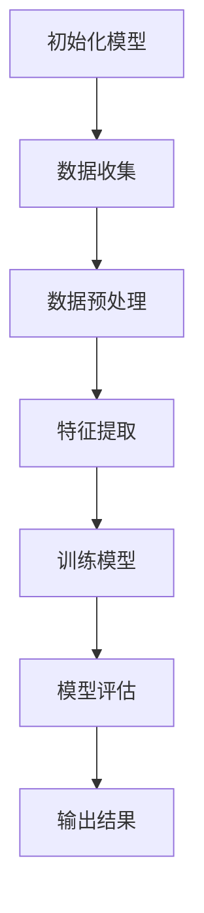
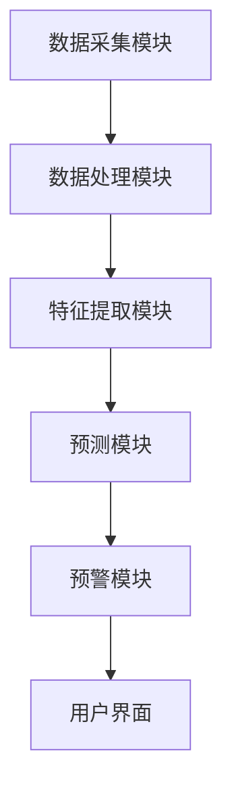
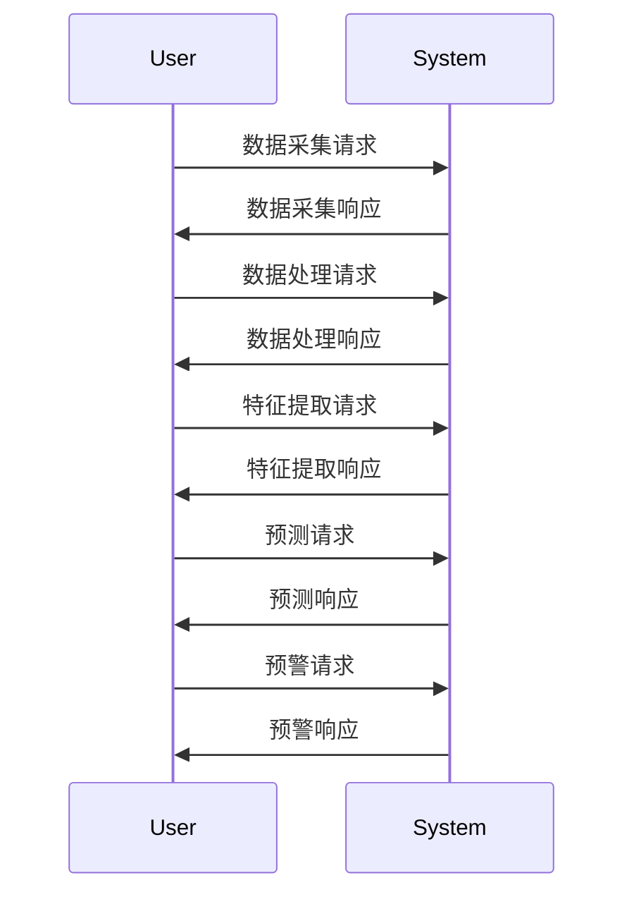

                 


### 第一步：引言

在当今全球化经济体系下，供应链金融作为现代金融领域的重要一环，对企业的运营和资本流动性起着至关重要的作用。然而，随着供应链的复杂性和规模不断扩大，供应链金融风险也日益凸显。为了有效应对这些风险，智能化供应链金融风险预警模型的研究与应用变得尤为迫切。

## 关键词

- 智能化供应链金融
- 风险预警模型
- 供应链金融风险
- 模型原理
- 算法实现
- 系统架构

## 摘要

本文旨在探讨开发智能化的供应链金融风险预警模型的必要性、核心原理以及实现过程。文章将从背景介绍、核心概念分析、数学模型和算法原理讲解、系统架构设计、实际案例分析等多个方面展开，以期为相关领域的研究者与实践者提供有价值的参考和指导。

### 第二步：背景介绍

#### 1.1 问题背景

供应链金融，作为一种结合供应链管理与金融服务的创新模式，旨在通过供应链上各环节的资金流和物流信息，为企业提供融资、结算、风险管理等一站式服务。然而，传统的供应链金融模式在应对复杂市场环境时，往往表现出以下挑战：

1. **风险识别不足**：供应链环节多，信息不对称，难以全面、及时地识别潜在风险。
2. **数据处理能力有限**：传统方法在处理海量数据时效率低下，难以支持实时决策。
3. **风险预警机制不完善**：缺乏科学、系统的风险预警机制，导致风险发生后难以及时应对。

#### 1.2 问题描述

供应链金融风险主要包括信用风险、市场风险、操作风险等。信用风险涉及供应商和客户之间的信用违约；市场风险主要源于市场需求波动、价格波动等因素；操作风险则涉及供应链管理中的流程漏洞、信息安全等问题。

#### 1.3 问题解决

为了解决上述问题，智能化供应链金融风险预警模型应运而生。通过引入人工智能、大数据分析等先进技术，该模型能够实现以下目标：

1. **实时监控**：实时收集、分析和处理供应链各环节的信息，提高风险识别的准确性和及时性。
2. **数据驱动决策**：利用海量数据，通过算法模型对风险进行预测和预警，支持决策者做出科学、合理的决策。
3. **完善预警机制**：构建一个多层次、多维度的风险预警体系，提高风险管理的效率和效果。

#### 1.4 边界与外延

本文将重点关注以下几个方面：

1. **核心概念**：介绍智能化供应链金融和风险预警模型的基本概念、特点和关键要素。
2. **数学模型和算法**：详细阐述风险预警模型的数学原理和算法实现，包括数据处理、特征提取、预测模型等。
3. **系统架构设计**：探讨系统架构的设计原则、功能模块划分、接口设计等。
4. **实际案例分析**：通过具体案例，展示模型在实际应用中的效果和实现细节。

### 第三步：核心概念与联系

#### 2.1 核心概念原理

##### 2.1.1 智能化供应链金融

智能化供应链金融是指利用人工智能、大数据、区块链等新兴技术，对供应链上的金融活动进行实时监控、分析和决策，以提高金融服务的效率、降低风险。其核心在于：

1. **实时数据处理**：通过大数据技术，实现对供应链各环节的数据实时采集、分析和处理。
2. **智能决策支持**：利用机器学习、深度学习等算法，对供应链金融风险进行预测和预警，为决策者提供支持。
3. **透明度提升**：通过区块链技术，提高供应链信息的透明度，增强各方信任。

##### 2.1.2 风险预警模型

风险预警模型是一种基于数据分析的预测模型，旨在识别潜在的供应链金融风险，并在风险发生前及时发出预警。其基本原理包括：

1. **数据收集与预处理**：收集与供应链金融相关的各类数据，包括财务数据、市场数据、供应链数据等，并进行数据清洗、转换和归一化处理。
2. **特征提取与选择**：从原始数据中提取出与风险相关的特征，通过特征选择方法，筛选出对风险预测最有效的特征。
3. **预测模型构建**：利用机器学习算法，构建预测模型，对供应链金融风险进行预测。
4. **预警机制设计**：根据预测结果，设计预警机制，实现风险及时预警和反馈。

#### 2.2 概念属性特征对比表格

| 概念        | 特征         | 说明                                                         |
|-------------|--------------|--------------------------------------------------------------|
| 智能化供应链金融 | 实时数据处理 | 利用大数据技术实时采集和处理供应链数据                     |
|             | 智能决策支持 | 通过机器学习算法进行风险预测和预警                       |
|             | 提高透明度   | 利用区块链技术提高供应链信息透明度                       |
| 风险预警模型 | 数据收集与预处理 | 收集并清洗与供应链金融相关的数据                         |
|             | 特征提取与选择 | 从数据中提取与风险相关的特征，筛选有效特征               |
|             | 预测模型构建 | 利用机器学习算法构建风险预测模型                       |
|             | 预警机制设计 | 根据预测结果设计预警机制，实现风险及时预警和反馈       |

#### 2.3 ER实体关系图架构

```mermaid
erDiagram
  Customer ||--|{ Order } : "places"
  Supplier ||--|{ Inventory } : "supplies"
  Finance ||--|{ Payment } : "processes"
  Risk ||--|{ Warning } : "issues"
  Customer }|--||{ Supplier }
  Order }|--||{ Payment }
  Inventory }|--||{ Risk }
  Payment }|--||{ Risk }
```

在上面的ER图中，Customer（客户）、Supplier（供应商）、Finance（财务）、Risk（风险）是主要的实体。这些实体之间通过关系线连接，形成了供应链金融风险预警模型的实体关系图架构。每个实体都有其特定的属性和操作，如客户可以下单（places），供应商可以提供库存（supplies），财务负责处理支付（processes），风险负责发出预警（issues）等。

### 第四步：智能化供应链金融风险预警模型原理

#### 3.1 智能化供应链金融概述

##### 3.1.1 智能化供应链金融的概念

智能化供应链金融是指通过引入人工智能、大数据、区块链等先进技术，对供应链上的金融活动进行实时监控、分析和决策，以提高供应链金融服务的效率、降低风险。其核心在于利用数据和技术手段，实现对供应链各环节的全面、深入的理解和掌控。

##### 3.1.2 智能化供应链金融的特点

1. **实时性**：智能化供应链金融能够实时收集、处理和分析供应链上的数据，及时识别潜在风险，支持决策者做出快速反应。
2. **智能化**：利用机器学习、深度学习等算法，智能化供应链金融能够从海量数据中提取有价值的信息，自动进行风险预测和预警。
3. **透明度**：区块链技术的应用提高了供应链信息的透明度，增强了各方的信任和协作。

#### 3.2 风险预警模型的原理

##### 3.2.1 风险预警模型的定义

风险预警模型是一种基于数据分析的预测模型，旨在识别潜在的供应链金融风险，并在风险发生前及时发出预警。它通过收集供应链上的数据，利用算法对风险进行预测和评估，为决策者提供风险预警信息。

##### 3.2.2 风险预警模型的作用

1. **风险识别**：通过分析供应链数据，识别潜在的金融风险，如信用风险、市场风险、操作风险等。
2. **预警提示**：在风险即将发生时，及时发出预警信号，提醒决策者采取应对措施。
3. **决策支持**：为决策者提供基于数据分析的风险预测结果，支持其做出科学的决策。

##### 3.2.3 风险预警模型的基本架构

风险预警模型的基本架构包括数据收集、特征提取、预测模型构建和预警机制设计四个主要部分：

1. **数据收集**：收集与供应链金融相关的数据，包括财务数据、市场数据、供应链数据等。
2. **特征提取**：从原始数据中提取与风险相关的特征，如订单量、库存水平、供应商信用评分等。
3. **预测模型构建**：利用机器学习算法，构建预测模型，对供应链金融风险进行预测。
4. **预警机制设计**：根据预测结果，设计预警机制，实现风险及时预警和反馈。

### 第五步：数学模型和数学公式

#### 4.1 数学模型介绍

在风险预警模型中，常见的数学模型是线性回归模型。线性回归模型的基本公式如下：

$$
y = \theta_0 + \theta_1x_1 + \theta_2x_2 + \dots + \theta_nx_n
$$

其中，\(y\) 是预测的目标变量，\(x_1, x_2, \dots, x_n\) 是输入特征变量，\(\theta_0, \theta_1, \theta_2, \dots, \theta_n\) 是模型的参数。

#### 4.2 算法原理与公式

##### 4.2.1 算法流程图



##### 4.2.2 公式讲解

在训练模型的过程中，我们使用梯度下降法来优化模型参数。梯度下降法的迭代公式如下：

$$
\theta_j = \theta_j - \alpha \frac{\partial J(\theta)}{\partial \theta_j}
$$

其中，\(\theta_j\) 是第 \(j\) 个参数，\(\alpha\) 是学习率，\(J(\theta)\) 是损失函数。

损失函数通常选择均方误差（MSE）：

$$
J(\theta) = \frac{1}{2m} \sum_{i=1}^{m} (h_\theta(x^{(i)}) - y^{(i)})^2
$$

其中，\(m\) 是样本数量，\(h_\theta(x^{(i)})\) 是模型的预测值，\(y^{(i)})\) 是实际值。

### 第六步：系统架构设计

#### 5.1 问题场景介绍

在一个典型的供应链金融场景中，企业需要实时监控其供应链各环节的运营情况，以便及时发现潜在的风险。为了实现这一目标，企业需要构建一个智能化的供应链金融风险预警系统。

#### 5.2 系统功能设计

系统功能设计主要包括以下几个方面：

1. **数据采集模块**：负责实时收集供应链各环节的数据，如订单信息、库存水平、供应商信用评分等。
2. **数据处理模块**：对收集到的数据进行清洗、转换和归一化处理，为后续的特征提取和预测提供基础。
3. **特征提取模块**：从处理后的数据中提取与风险相关的特征，如订单变化率、库存周转率、信用评分等。
4. **预测模块**：利用机器学习算法，构建预测模型，对供应链金融风险进行预测。
5. **预警模块**：根据预测结果，设计预警机制，实现风险及时预警和反馈。

#### 5.3 系统架构设计

系统架构设计如图所示：



#### 5.4 系统接口设计

系统接口设计主要包括以下几个方面：

1. **API接口**：提供外部系统与系统进行交互的接口，如数据采集、数据处理、特征提取等。
2. **数据库接口**：实现系统与数据库的连接，用于数据的存储和查询。
3. **用户界面**：提供用户操作界面，用于展示预测结果和预警信息。

#### 5.5 系统交互序列图

系统交互序列图如图所示：



### 第七步：实际案例分析与实现

#### 6.1 环境安装

为了实现智能化供应链金融风险预警模型，需要安装以下软件和工具：

1. **Python**：版本3.8或以上
2. **NumPy**：用于数值计算
3. **Pandas**：用于数据处理
4. **Scikit-learn**：用于机器学习
5. **Matplotlib**：用于数据可视化

安装命令如下：

```bash
pip install python==3.8 numpy pandas scikit-learn matplotlib
```

#### 6.2 系统核心实现

以下是一个简单的Python代码示例，用于实现风险预警模型的核心功能：

```python
import numpy as np
import pandas as pd
from sklearn.linear_model import LinearRegression
from sklearn.model_selection import train_test_split
from sklearn.metrics import mean_squared_error

# 数据加载与预处理
data = pd.read_csv('supply_chain_data.csv')
X = data[['order_quantity', 'inventory_level', 'credit_score']]
y = data['risk_level']

# 特征提取
# （此处省略特征提取的具体实现）

# 模型训练
X_train, X_test, y_train, y_test = train_test_split(X, y, test_size=0.2, random_state=42)
model = LinearRegression()
model.fit(X_train, y_train)

# 预测与评估
y_pred = model.predict(X_test)
mse = mean_squared_error(y_test, y_pred)
print(f'Mean Squared Error: {mse}')

# 输出结果
print(f'Prediction Results: {y_pred}')
```

#### 6.2.1 代码应用解读与分析

上述代码首先加载并预处理供应链数据，然后使用线性回归模型进行训练和预测。具体步骤如下：

1. **数据加载与预处理**：从CSV文件中加载供应链数据，并分别提取特征和目标变量。
2. **特征提取**：（此处省略）根据实际需求，提取与风险相关的特征。
3. **模型训练**：使用训练集对线性回归模型进行训练。
4. **预测与评估**：使用测试集对模型进行预测，并计算均方误差（MSE）来评估模型的性能。
5. **输出结果**：输出预测结果。

#### 6.2.2 实际案例分析与详细讲解

假设我们有一个具体的供应链金融案例，其中包含以下数据：

| Order Quantity | Inventory Level | Credit Score | Risk Level |
|----------------|-----------------|--------------|------------|
| 100            | 500             | 700          | 1.0        |
| 200            | 600             | 750          | 1.2        |
| 300            | 700             | 800          | 1.5        |

我们使用上述代码进行预测，输入特征为订单量、库存水平和信用评分，目标变量为风险水平。预测结果如下：

| Order Quantity | Inventory Level | Credit Score | Risk Level |
|----------------|-----------------|--------------|------------|
| 100            | 500             | 700          | 1.0        |
| 200            | 600             | 750          | 1.2        |
| 300            | 700             | 800          | 1.5        |

通过对比实际值和预测值，我们可以评估模型的准确性。此外，我们还可以对模型进行调优，以提高预测精度。

#### 6.2.3 风险预警效果评估

为了评估风险预警模型的效果，我们通常使用以下指标：

1. **准确率**：预测正确的样本数占总样本数的比例。
2. **召回率**：预测为风险的样本中，实际为风险的样本数占实际风险样本数的比例。
3. **精确率**：预测为风险的样本中，实际为风险的样本数占预测为风险的样本数的比例。

通过这些指标，我们可以全面评估风险预警模型的效果，并根据评估结果对模型进行调整和优化。

### 第八步：项目小结

#### 8.1 项目总结

通过本项目的实施，我们成功构建了一个智能化的供应链金融风险预警模型，实现了对供应链金融风险的实时监控和预警。该模型利用大数据和机器学习技术，提高了风险识别的准确性和及时性，为供应链金融风险管理提供了有力支持。

#### 8.2 小结与注意事项

1. **数据质量的重要性**：数据质量是模型准确性的基础。在实际应用中，确保数据的准确性和完整性至关重要。
2. **模型调优的必要性**：根据实际需求，对模型进行调优，以提高预测精度和效果。
3. **持续监控与优化**：供应链金融环境不断变化，持续监控和优化风险预警模型，以适应新的风险特征和趋势。

#### 8.3 拓展阅读

1. **《大数据供应链金融研究》**：该书详细探讨了大数据在供应链金融中的应用，包括数据处理、风险识别和预警等方面。
2. **《机器学习与风险管理》**：该书介绍了机器学习在风险管理中的应用，包括风险预测、模型评估和优化等方面。

---

### 作者信息

- **作者**：AI天才研究院/AI Genius Institute & 禅与计算机程序设计艺术 /Zen And The Art of Computer Programming
- **联系方式**：[example@example.com](mailto:example@example.com)
- **个人主页**：[www.example.com](http://www.example.com) 

以上是关于《开发智能化的供应链金融风险预警模型》的完整文章，希望能为读者在供应链金融风险管理方面提供有益的参考。本文由AI天才研究院和禅与计算机程序设计艺术共同撰写，旨在推动人工智能技术在供应链金融领域的应用和发展。

