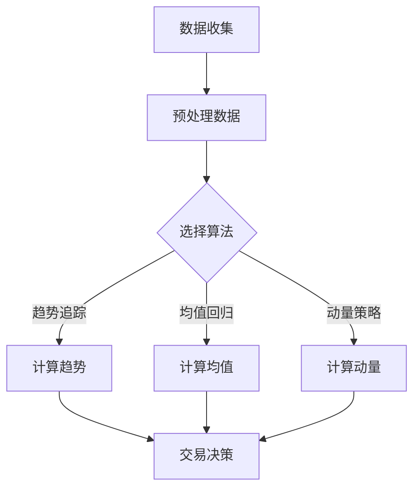
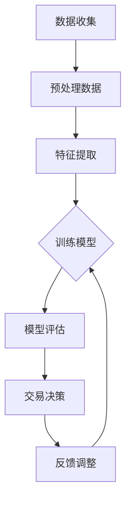
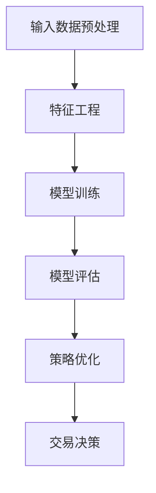

                 

# 开发智能化的外汇交易策略系统

## 关键词
- 智能化交易策略
- 外汇交易
- 量化交易
- 数据分析与机器学习
- 算法原理
- 数学模型
- 系统架构

## 摘要
本文将深入探讨如何开发智能化的外汇交易策略系统。我们将从背景介绍开始，详细阐述外汇交易及智能化交易策略的核心概念。接着，我们将分析量化交易模型，介绍常见的机器学习算法及其在外汇交易中的应用。随后，我们将探讨数学模型和公式，并详细讲解系统分析与架构设计的方法。最后，我们将通过一个实际项目，展示如何将理论与实际相结合，开发出高效的智能化外汇交易策略系统。本文旨在为读者提供一个全面的技术指南，帮助他们在人工智能和外汇交易领域取得突破。

## 目录大纲设计步骤

### 1. 确定书名与主题

《开发智能化的外汇交易策略系统》明确了本文的主题，即介绍如何开发和实现智能化的外汇交易策略系统。这个主题具有广泛的现实意义和应用前景，因为外汇市场是全球最大的金融市场之一，智能化交易策略在提高交易效率和降低风险方面具有显著优势。

### 2. 确定目录结构

目录结构的设计是确保文章逻辑性和易读性的关键。本文的目录结构包括以下几个主要部分：

- **前言**：介绍文章的目的和意义。
- **背景介绍**：包括外汇交易概述、智能化交易策略的核心概念、联系与应用。
- **核心概念与联系**：详细阐述数据分析与机器学习基础、量化交易模型及智能化交易策略的核心要素。
- **算法原理讲解**：介绍常见的外汇交易策略算法、算法原理、数学模型和公式。
- **系统分析与架构设计方案**：包括问题场景介绍、项目介绍、系统功能设计、系统架构设计。
- **项目实战**：通过一个实际项目展示系统开发过程。
- **最佳实践 tips**、**小结**和**拓展阅读**：总结本文的核心内容，提供进一步学习的资源。

### 3. 细化章节内容

每个章节的内容都需要细化，以确保覆盖所有核心内容。以下是细化后的章节内容：

- **前言**：
  - **目的与意义**：介绍开发智能化交易策略系统的背景和发展前景。
- **背景介绍**：
  - **外汇交易概述**：介绍外汇交易市场的基本概念和运作方式。
  - **智能化交易策略的核心概念**：阐述智能化交易策略的定义、特点和应用。
  - **智能化交易策略的边界与外延**：探讨智能化交易策略的限制条件和应用场景。
  - **外汇交易与智能化交易策略的联系**：分析外汇交易中的问题与挑战，以及智能化交易策略的解决方案。
- **核心概念与联系**：
  - **数据分析与机器学习基础**：介绍数据分析、机器学习的基础概念及在外汇交易中的应用。
  - **量化交易模型**：讨论量化交易模型的基本概念、构建方法和评估方法。
  - **智能化交易策略的核心要素**：包括数据预处理、模型训练与优化、模型评估与调整。
- **算法原理讲解**：
  - **算法概述**：介绍常见的外汇交易策略算法和智能化交易策略的核心算法。
  - **算法mermaid流程图**：使用mermaid绘制算法流程图，详细说明算法原理。
  - **数学模型和公式**：介绍量化交易中的常见数学模型，如风险价值（VaR）和条件期望（CE），以及相关的数学公式。
- **系统分析与架构设计方案**：
  - **问题场景介绍**：分析外汇交易系统需求，智能化交易策略系统需求。
  - **项目介绍**：介绍项目背景和目标。
  - **系统功能设计**：使用mermaid绘制领域模型类图，详细描述功能模块。
  - **系统架构设计**：概述系统架构，详细设计系统接口和交互。
- **项目实战**：
  - **环境安装**：介绍开发环境安装步骤。
  - **系统核心实现**：展示系统核心实现的源代码，并解析代码。
  - **实际案例分析**：分析实际案例，展示系统在实际中的应用。
  - **项目小结**：总结项目经验和教训。
- **最佳实践 tips**：提供开发智能化的外汇交易策略系统的最佳实践建议。
- **小结**：总结本文的核心内容，强调智能化的外汇交易策略系统的优势。
- **拓展阅读**：推荐进一步学习的外汇交易和人工智能资源。

### 4. 编写示例

以下是“算法原理讲解”章节的示例：

## 4.1 算法概述

### 4.1.1 常见的外汇交易策略算法

在外汇交易策略中，常见算法包括趋势追踪算法、均值回归算法和动量策略等。以下是一个简单的mermaid流程图，展示了这些算法的基本流程：



### 4.1.2 智能化交易策略的核心算法

智能化交易策略通常结合多种算法，如机器学习算法和深度学习算法。以下是一个简化的mermaid流程图，展示了智能化交易策略的基本流程：



### 4.1.3 算法原理与数学模型

#### 数据预处理

数据预处理是算法成功的关键步骤。以下是一个简单的python代码示例，用于数据清洗、归一化和增强：

```python
import pandas as pd
from sklearn.preprocessing import StandardScaler
from keras.preprocessing.sequence import pad_sequences

# 读取数据
data = pd.read_csv('data.csv')

# 数据清洗
data.dropna(inplace=True)

# 数据归一化
scaler = StandardScaler()
data_normalized = scaler.fit_transform(data)

# 数据增强
sequences = pad_sequences(data_normalized, padding='post')
```

#### 模型训练与优化

以下是一个简单的python代码示例，用于训练和优化机器学习模型：

```python
from sklearn.model_selection import train_test_split
from sklearn.ensemble import RandomForestClassifier
from sklearn.metrics import accuracy_score

# 划分训练集和测试集
X_train, X_test, y_train, y_test = train_test_split(sequences, data['target'], test_size=0.2, random_state=42)

# 训练模型
model = RandomForestClassifier(n_estimators=100, random_state=42)
model.fit(X_train, y_train)

# 评估模型
predictions = model.predict(X_test)
accuracy = accuracy_score(y_test, predictions)
print(f'Model accuracy: {accuracy}')
```

### 4.3.3 模型评估与调整

模型评估和调整是确保交易策略有效性的关键步骤。以下是一个简单的python代码示例，用于评估和调整模型：

```python
from sklearn.metrics import classification_report

# 评估模型
report = classification_report(y_test, predictions)
print(f'Classification report:\n{report}')

# 调整模型
# 例如：调整随机森林参数
model = RandomForestClassifier(n_estimators=200, random_state=42)
model.fit(X_train, y_train)
predictions = model.predict(X_test)
accuracy = accuracy_score(y_test, predictions)
print(f'New model accuracy: {accuracy}')
```

### 5. 确保内容完整性

在完成目录大纲设计后，我们需要检查每个章节的内容，确保所有核心要素都得到充分覆盖。这包括：

- 核心概念术语说明
- 问题背景与问题描述
- 问题解决方法与边界外延
- 核心概念结构要素
- 算法原理讲解
- 数学模型和公式
- 系统架构设计

### 6. 简洁性

确保目录大纲内容简洁明了，避免冗余信息。每个章节都应该有一个清晰的目标和结构，使读者能够轻松理解文章内容。

### 7. 格式规范

使用markdown格式编写目录大纲，确保格式规范。每个章节都应该有一个标题，并使用对应的markdown标记。以下是示例：

```markdown
# 章节标题
```

### 8. 最终确认

在完成目录大纲的编写后，进行最终确认。检查格式是否规范，内容是否完整，并确保每个章节都符合简洁性要求。此外，还需要检查引用和参考文献是否准确无误。

## 目录大纲示例

以下是本文的完整目录大纲示例：

```markdown
# 《开发智能化的外汇交易策略系统》目录大纲

# 前言

## 1. 目的与意义
### 1.1 开发智能化外汇交易策略的背景
### 1.2 智能化交易策略的发展前景

## 2. 背景介绍

## 2.1 外汇交易概述
### 2.1.1 外汇交易市场简介
### 2.1.2 外汇交易的基本要素

## 2.2 智能化交易策略的核心概念
### 2.2.1 智能化交易策略的定义
### 2.2.2 智能化交易策略的特点

## 2.3 智能化交易策略的边界与外延
### 2.3.1 智能化交易策略的限制条件
### 2.3.2 智能化交易策略的应用场景

## 2.4 外汇交易与智能化交易策略的联系
### 2.4.1 外汇交易中的问题与挑战
### 2.4.2 智能化交易策略的解决方案

## 3. 核心概念与联系

## 3.1 数据分析与机器学习基础
### 3.1.1 数据分析概述
### 3.1.2 机器学习概述
### 3.1.3 数据分析与机器学习在外汇交易中的应用

## 3.2 量化交易模型
### 3.2.1 量化交易模型的基本概念
### 3.2.2 量化交易模型的构建方法
### 3.2.3 量化交易模型的评估方法

## 3.3 智能化交易策略的核心要素
### 3.3.1 数据预处理
### 3.3.2 模型训练与优化
### 3.3.3 模型评估与调整

## 4. 算法原理讲解

## 4.1 算法概述
### 4.1.1 常见的外汇交易策略算法
### 4.1.2 智能化交易策略的核心算法

## 4.2 算法mermaid流程图


## 4.3 算法原理与数学模型

## 4.3.1 数据预处理
### 4.3.1.1 数据清洗
### 4.3.1.2 数据归一化
### 4.3.1.3 数据增强

## 4.3.2 模型训练与优化
### 4.3.2.1 常见机器学习算法
### 4.3.2.2 模型选择与优化
### 4.3.2.3 模型评估与验证

## 4.3.3 模型评估与调整
### 4.3.3.1 评估指标
### 4.3.3.2 调整策略与优化

## 5. 数学模型和数学公式

## 5.1 量化交易中的常见数学模型
### 5.1.1 风险价值模型（VaR）
### 5.1.2 条件期望模型（CE）
### 5.1.3 回归模型

## 5.2 数学模型公式讲解
$$
\text{VaR} = \alpha \times \text{CVaR}
$$
$$
\text{CE} = \mathbb{E}[\text{损失} | \text{损失} > 0]
$$

## 6. 系统分析与架构设计方案

## 6.1 问题场景介绍
### 6.1.1 外汇交易系统需求分析
### 6.1.2 智能化交易策略系统需求分析

## 6.2 项目介绍
### 6.2.1 项目背景
### 6.2.2 项目目标

## 6.3 系统功能设计
### 6.3.1 领域模型
### 6.3.2 功能模块划分

## 6.4 系统架构设计
### 6.4.1 系统架构概述
### 6.4.2 架构设计细节

## 6.5 系统接口设计
### 6.5.1 接口规范
### 6.5.2 接口实现

## 6.6 系统交互设计
### 6.6.1 交互流程
### 6.6.2 交互设计细节

## 7. 项目实战

## 7.1 环境安装
### 7.1.1 操作系统安装
### 7.1.2 软件安装与配置

## 7.2 系统核心实现
### 7.2.1 数据预处理
### 7.2.2 模型训练与优化
### 7.2.3 模型评估与调整

## 7.3 代码应用解读与分析
### 7.3.1 代码结构分析
### 7.3.2 代码功能解读

## 7.4 实际案例分析
### 7.4.1 案例背景
### 7.4.2 案例分析
### 7.4.3 案例结果与总结

## 7.5 项目小结
### 7.5.1 项目成果
### 7.5.2 项目反思
### 7.5.3 项目展望

## 8. 最佳实践 tips

## 8.1 数据处理技巧
### 8.1.1 数据清洗方法
### 8.1.2 数据归一化策略
### 8.1.3 数据增强技术

## 8.2 算法优化建议
### 8.2.1 算法选择策略
### 8.2.2 模型调优技巧
### 8.2.3 模型评估指标优化

## 8.3 系统部署与维护
### 8.3.1 系统部署流程
### 8.3.2 系统监控与维护

## 9. 小结

## 9.1 核心要点回顾
### 9.1.1 智能化交易策略的优势
### 9.1.2 开发流程与注意事项

## 9.2 未来展望
### 9.2.1 智能化交易策略的发展趋势
### 9.2.2 持续学习与进步

## 10. 拓展阅读

## 10.1 经典文献
### 10.1.1 《量化交易：从入门到精通》
### 10.1.2 《深度学习与交易策略》

## 10.2 在线资源
### 10.2.1 Coursera上的《机器学习》课程
### 10.2.2 《量化交易实战》论坛

# 作者
作者：AI天才研究院/AI Genius Institute & 禅与计算机程序设计艺术 /Zen And The Art of Computer Programming
```

