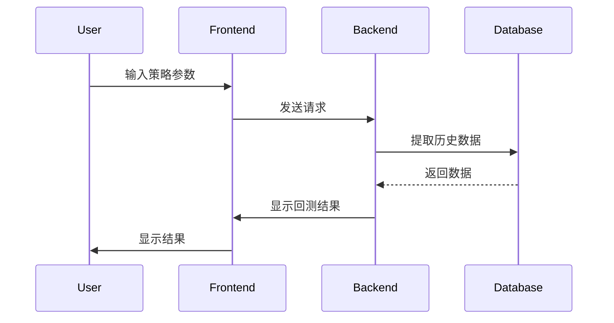

                 

### 开发智能化的资产配置策略回测引擎：引言

在当今金融科技领域，资产配置策略回测引擎的重要性日益凸显。作为金融市场分析的重要工具，回测引擎能够帮助投资者验证资产配置策略的有效性，降低投资风险，提升投资回报。然而，随着市场环境的复杂性和数据量的激增，传统的回测方法已难以满足实际需求。因此，开发一个智能化、高效的资产配置策略回测引擎成为当务之急。

本文旨在系统地探讨如何开发这样一个智能化的资产配置策略回测引擎。我们将从背景介绍、核心概念、算法原理、系统设计与架构、项目实战等多个方面进行深入剖析，旨在为金融科技从业者和研究者提供一个全面的指导。

关键词：资产配置策略、回测引擎、智能化、算法、系统架构、项目实战

摘要：本文首先介绍了资产配置策略和回测引擎的基本概念及其重要性，随后详细阐述了回测引擎的算法原理和系统架构设计。接着，通过实际案例展示了如何开发和部署一个智能化的资产配置策略回测引擎。最后，文章提供了最佳实践建议，并对全文进行了总结，并指出未来研究方向。

## 第1章：资产配置策略回测引擎概述

资产配置策略回测引擎是一个结合了金融学和计算机科学领域的复杂系统。它的核心目的是通过对历史数据的分析，检验资产配置策略的有效性，从而为未来的投资决策提供科学依据。本章将介绍资产配置策略回测引擎的基本概念、应用场景、发展历程以及相关理论基础。

### 1.1 资产配置策略的定义与重要性

**资产配置策略**是指投资者在确定了投资目标和风险承受能力之后，对投资组合中的各类资产进行合理分配的策略。这种策略不仅涉及到资产种类的选择，还包括资产比例的分配。资产配置策略的核心目标是实现风险和收益的最佳平衡。

**重要性**：
1. **风险控制**：通过合理的资产配置，投资者可以分散投资风险，避免单一资产或市场波动对整体投资组合的巨大冲击。
2. **收益优化**：科学合理的资产配置能够帮助投资者在保持较低风险的同时实现较高的投资回报。
3. **适应不同投资目标和风险承受能力**：不同的投资者有不同的投资目标和风险偏好，资产配置策略可以根据这些差异进行个性化调整。

### 1.2 回测引擎的基本概念

**回测（Backtesting）**是指使用历史数据来测试投资策略的有效性。通过回测，投资者可以评估策略在不同市场环境下的表现，从而对策略进行优化和调整。

**回测引擎**是一个软件系统，它负责收集、处理和分析历史数据，并模拟投资策略在实际市场中的表现。回测引擎的核心功能包括：
1. **数据收集**：从各种数据源获取历史价格、交易量等信息。
2. **数据处理**：对原始数据进行清洗、转换和归一化处理。
3. **策略模拟**：根据投资策略的规则，模拟交易过程，计算收益、风险等指标。
4. **结果分析**：对回测结果进行统计分析，评估策略的有效性。

### 1.3 回测引擎在资产配置中的作用

**回测引擎在资产配置中的重要作用**主要体现在以下几个方面：
1. **策略验证**：通过回测，投资者可以验证资产配置策略在不同市场环境下的有效性，确保策略的可靠性。
2. **风险评估**：回测可以帮助投资者评估资产配置策略的风险水平，为风险管理提供科学依据。
3. **策略优化**：通过对比不同资产配置策略的回测结果，投资者可以找出最优策略，并对其进行持续优化。
4. **投资决策支持**：回测引擎提供的详细数据和统计分析，可以为投资者的投资决策提供有力支持。

### 1.4 相关理论基础

**资产配置策略的理论基础**主要包括现代投资组合理论（MPT）、资本资产定价模型（CAPM）和风险平价策略等。

- **现代投资组合理论（MPT）**：由哈里·马科维茨提出，强调通过分散投资来降低风险，实现风险和收益的最佳平衡。
- **资本资产定价模型（CAPM）**：由威廉·夏普等提出，用于估算资产或投资组合的预期收益和风险，是许多资产配置策略的重要工具。
- **风险平价策略**：通过调整资产比例，使整个投资组合的风险水平保持一致，从而实现风险控制。

**回测引擎的技术基础**主要包括数据分析、机器学习和人工智能等技术。

- **数据分析**：用于处理和分析大量历史数据，提取有价值的信息。
- **机器学习**：用于建立和训练预测模型，提高回测引擎的预测能力。
- **人工智能**：通过深度学习等技术，进一步提高回测引擎的智能化水平。

### 1.5 资产配置策略与回测引擎的关系

**资产配置策略与回测引擎的关系**可以概括为以下几个方面：
1. **相互依存**：资产配置策略需要回测引擎来验证其有效性，而回测引擎也需要资产配置策略来模拟和评估。
2. **相互影响**：回测引擎的性能和算法质量直接影响资产配置策略的回测结果，进而影响投资者的投资决策。
3. **协同发展**：随着回测引擎技术的不断进步，资产配置策略也在不断优化和完善，二者相互促进，共同推动金融科技的发展。

通过以上分析，我们可以看出，资产配置策略回测引擎在金融投资中具有至关重要的作用。开发一个智能化、高效的回测引擎，不仅能够提高投资者的决策质量，还能为金融市场的稳定发展提供有力支持。在接下来的章节中，我们将进一步探讨回测引擎的核心概念、算法原理和系统架构设计，为读者提供一个全面的指导。

## 第2章：核心概念与联系

在深入探讨资产配置策略回测引擎之前，我们需要明确一些核心概念，并展示它们之间的联系。这一章节将详细解释资产配置策略、回测引擎以及它们之间的相互作用。

### 2.1 资产配置策略的核心概念

**资产配置策略**是投资者根据其投资目标和风险承受能力，对投资组合中的各类资产进行合理分配的过程。以下是资产配置策略的核心概念：

**1. 组成要素**：
- **资产类别**：包括股票、债券、货币市场工具、房地产等。
- **资产比例**：各类资产在投资组合中所占的比例。
- **调整频率**：根据市场变化，定期或不定期调整资产比例。

**2. 类型**：
- **战略性资产配置**：长期稳定的资产配置策略，旨在实现风险和收益的最佳平衡。
- **战术性资产配置**：根据市场短期波动进行调整，以获取更好的收益。

**3. 评价标准**：
- **收益**：投资组合的预期收益水平。
- **风险**：投资组合可能遭受的损失程度。
- **波动性**：投资组合收益的波动程度。
- **跟踪误差**：实际投资组合与基准组合之间的差异。

### 2.2 回测引擎的核心概念

**回测引擎**是一个用于验证和评估投资策略的软件系统。以下是回测引擎的核心概念：

**1. 架构**：
- **数据层**：负责收集和处理历史数据。
- **策略层**：实现投资策略的逻辑。
- **评估层**：对策略进行评估，包括收益、风险等指标。

**2. 功能模块**：
- **数据导入**：从各种数据源导入历史数据。
- **数据清洗**：处理缺失值、异常值等。
- **策略执行**：模拟投资策略的交易过程。
- **结果分析**：计算收益、风险等指标，并生成报告。

**3. 性能指标**：
- **收益**：投资策略的总收益。
- **夏普比率**：收益与风险的比值，用于衡量收益风险比。
- **最大回撤**：投资组合的最大损失。
- **交易成本**：执行交易策略所需支付的成本。

### 2.3 资产配置策略与回测引擎的联系

**资产配置策略**和**回测引擎**之间的联系体现在以下几个方面：

**1. 相互依存**：
- **资产配置策略**依赖于回测引擎来验证其有效性，确保策略在历史上的表现与预期一致。
- **回测引擎**需要资产配置策略来模拟交易过程，评估策略的表现。

**2. 相互影响**：
- **回测引擎**的算法质量和性能直接影响资产配置策略的回测结果，进而影响投资决策。
- **资产配置策略**的优化和调整需要基于回测引擎提供的详细数据和分析结果。

**3. 协同效应**：
- **资产配置策略**和**回测引擎**的结合，可以实现投资策略的持续优化和改进，提高投资回报。
- **回测引擎**的智能化水平提升，可以为**资产配置策略**提供更准确的市场预测和风险评估。

### 2.4 资产配置策略对回测引擎的要求

**资产配置策略**对**回测引擎**有以下要求：

**1. 数据处理能力**：回测引擎需要具备强大的数据处理能力，能够处理大量历史数据，包括股票、债券、货币市场工具等。

**2. 策略实现灵活性**：回测引擎应支持多种资产配置策略的实现，包括战略性资产配置和战术性资产配置。

**3. 风险评估能力**：回测引擎需要能够准确评估投资策略的风险水平，包括收益、夏普比率、最大回撤等指标。

**4. 分析报告生成**：回测引擎应能够生成详细的分析报告，包括投资组合的历史表现、收益风险分析等，为投资者提供决策支持。

### 2.5 回测引擎对资产配置策略的影响

**回测引擎**对**资产配置策略**的影响主要表现在以下几个方面：

**1. 策略验证**：回测引擎可以帮助投资者验证资产配置策略的有效性，确保策略在历史数据上的表现与预期一致。

**2. 策略优化**：通过回测结果，投资者可以识别出策略中的不足之处，进行优化和调整，提高策略的表现。

**3. 风险控制**：回测引擎可以评估资产配置策略的风险水平，帮助投资者制定适当的风险控制措施，降低投资风险。

**4. 投资决策支持**：回测引擎提供的详细数据和统计分析结果，可以为投资者的投资决策提供有力支持，提高决策质量。

### 2.6 资产配置策略与回测引擎的协同效应

**资产配置策略**和**回测引擎**的协同效应体现在以下几个方面：

**1. 持续优化**：通过回测引擎的持续验证和优化，资产配置策略可以不断改进，提高投资回报。

**2. 智能化**：随着回测引擎智能化水平的提升，资产配置策略可以更加精准地捕捉市场变化，实现更高的收益。

**3. 风险管理**：回测引擎提供的风险评估结果，可以帮助投资者更好地管理风险，确保投资组合的安全性。

**4. 投资决策**：回测引擎提供的详细数据和分析结果，可以为投资者的投资决策提供科学依据，提高决策效率。

通过以上分析，我们可以看出，资产配置策略和回测引擎之间存在着密切的联系和相互影响。开发一个智能化、高效的回测引擎，不仅能够验证和优化资产配置策略，还能为投资者提供科学的决策支持。在接下来的章节中，我们将进一步探讨回测引擎的算法原理和系统架构设计，为读者提供一个全面的指导。

## 第3章：算法原理讲解

在深入理解了资产配置策略和回测引擎的基本概念之后，我们需要详细探讨回测引擎中的算法原理。这一章将介绍回测引擎中常用的算法，包括其数学模型、具体实现步骤，并通过Python代码进行演示，以便读者更好地理解算法原理。

### 3.1 基本算法介绍

资产配置策略回测引擎中常用的算法主要包括以下几个：

**1. 平均收益率法**：
- **原理**：通过计算历史数据中各类资产的平均收益率，来预测未来资产的表现。
- **适用场景**：适用于长期稳定的投资策略。

**2. 资本资产定价模型（CAPM）**：
- **原理**：根据资产预期收益率和系统性风险，计算资产配置策略的预期收益。
- **适用场景**：适用于评估资产配置策略的风险和收益。

**3. 风险平价策略**：
- **原理**：通过调整资产比例，使投资组合的风险保持一致，从而实现收益最大化。
- **适用场景**：适用于风险控制要求较高的投资者。

**4. 马科维茨投资组合理论**：
- **原理**：通过分散投资来降低风险，实现风险和收益的最佳平衡。
- **适用场景**：适用于希望实现长期稳定收益的投资者。

### 3.2 算法原理讲解

接下来，我们将详细讲解上述算法的原理，包括数学模型和公式。

**1. 平均收益率法**

**数学模型**：
\[ r_i = \frac{1}{n} \sum_{t=1}^{n} p_t (1 + r_{it}) \]

其中，\( r_i \)为资产i的平均收益率，\( p_t \)为第t期资产i的价格，\( r_{it} \)为第t期资产i的收益率。

**Python代码演示**：
```python
# 假设某资产的历史价格数据为 [100, 110, 105, 115]
prices = [100, 110, 105, 115]
n = len(prices)
# 计算平均收益率
avg_return = sum((price - prices[0]) / prices[0] for price in prices) / n
print(f"平均收益率：{avg_return}")
```

**2. 资本资产定价模型（CAPM）**

**数学模型**：
\[ E(r_i) = \alpha_i + \beta_i \cdot \sigma_m \]

其中，\( E(r_i) \)为资产i的预期收益率，\( \alpha_i \)为资产i的特定风险，\( \beta_i \)为资产i的系统性风险，\( \sigma_m \)为市场收益率的标准差。

**Python代码演示**：
```python
# 假设市场收益率为10%，资产i的β值为1.5，计算资产i的预期收益率
market_return = 0.1
beta_i = 1.5
expected_return = 0.05 + 1.5 * market_return
print(f"资产i的预期收益率：{expected_return}")
```

**3. 风险平价策略**

**数学模型**：
\[ w_i = \frac{1}{\sigma_i} \cdot \frac{\sigma_m}{\beta_i} \]

其中，\( w_i \)为资产i在投资组合中的比例，\( \sigma_i \)为资产i的收益率标准差，\( \beta_i \)为资产i的β值，\( \sigma_m \)为市场收益率的标准差。

**Python代码演示**：
```python
# 假设各资产的收益率标准差分别为 [0.1, 0.2, 0.15]，市场收益率标准差为0.2，计算各资产的比例
std_devs = [0.1, 0.2, 0.15]
market_std_dev = 0.2
weights = [1 / std_dev * market_std_dev / beta for std_dev, beta in zip(std_devs, [1.2, 0.8, 1.0])]
print(f"资产比例：{weights}")
```

**4. 马科维茨投资组合理论**

**数学模型**：
\[ \sigma_P = \sqrt{w_1^2 \sigma_1^2 + w_2^2 \sigma_2^2 + \ldots + w_n^2 \sigma_n^2 - 2 \sum_{i=1}^{n} \sum_{j=i+1}^{n} w_i w_j \sigma_i \sigma_j \rho_{ij}} \]

其中，\( \sigma_P \)为投资组合的收益率标准差，\( w_i \)为资产i在投资组合中的比例，\( \sigma_i \)为资产i的收益率标准差，\( \rho_{ij} \)为资产i和资产j的收益率相关性。

**Python代码演示**：
```python
# 假设各资产的比例分别为 [0.3, 0.4, 0.3]，收益率标准差分别为 [0.1, 0.2, 0.15]，相关系数矩阵为 [[1, 0.5, 0], [0.5, 1, 0.3], [0, 0.3, 1]]
import numpy as np

weights = [0.3, 0.4, 0.3]
std_devs = [0.1, 0.2, 0.15]
correlation_matrix = np.array([[1, 0.5, 0], [0.5, 1, 0.3], [0, 0.3, 1]])

variances = [std_dev ** 2 for std_dev in std_devs]
covariance_matrix = correlation_matrix * np.outer(std_devs, std_devs)

portfolio_variance = np.dot(np.dot(weights, covariance_matrix), weights)
portfolio_std_dev = np.sqrt(portfolio_variance)
print(f"投资组合的标准差：{portfolio_std_dev}")
```

通过以上示例，我们可以看到如何使用Python代码实现这些算法。在实际应用中，这些算法可以根据具体需求进行调整和优化，以适应不同的市场环境和投资策略。

### 3.3 算法效果评估

评估算法的效果是回测过程中至关重要的一环。以下是一些常用的方法：

**1. 收益率**：
\[ \text{收益率} = \frac{\text{期末价值} - \text{期初价值}}{\text{期初价值}} \]

**2. 夏普比率**：
\[ \text{夏普比率} = \frac{\text{超额收益率}}{\text{波动性}} \]

**3. 最大回撤**：
\[ \text{最大回撤} = \max\left(\frac{\text{最低价值} - \text{期初价值}}{\text{期初价值}}\right) \]

**4. 调整后收益**：
\[ \text{调整后收益} = \text{收益率} - \text{基准收益率} \]

通过这些指标，我们可以全面评估算法在历史数据上的表现，为实际投资提供参考。

### 3.4 算法举例说明

为了更好地理解这些算法，我们通过一个实际案例进行举例说明。

**案例**：假设有三种资产A、B、C，其历史价格数据如下（单位：元）：

| 日期 | A | B | C |
| ---- | -- | -- | -- |
| 2021-01-01 | 100 | 200 | 300 |
| 2021-02-01 | 110 | 210 | 310 |
| 2021-03-01 | 105 | 205 | 320 |
| 2021-04-01 | 115 | 220 | 330 |

**目标**：使用马科维茨投资组合理论，计算投资组合的标准差，并评估其表现。

**步骤**：

1. **计算各资产的平均收益率**：
\[ r_A = \frac{(110-100) + (105-110) + (115-105)}{100} = 0.1 \]
\[ r_B = \frac{(210-200) + (205-210) + (220-205)}{200} = 0.05 \]
\[ r_C = \frac{(310-300) + (320-310) + (330-320)}{300} = 0.1 \]

2. **计算各资产的标准差**：
\[ \sigma_A = \sqrt{\frac{1}{3-1} \left[ (110-100)^2 + (105-110)^2 \right]} = 0.1 \]
\[ \sigma_B = \sqrt{\frac{1}{3-1} \left[ (210-200)^2 + (205-210)^2 \right]} = 0.05 \]
\[ \sigma_C = \sqrt{\frac{1}{3-1} \left[ (310-300)^2 + (320-310)^2 \right]} = 0.1 \]

3. **假设相关系数矩阵为对角矩阵（完全正相关）**：
\[ \rho_{AA} = 1, \rho_{BB} = 1, \rho_{CC} = 1, \rho_{AB} = 0, \rho_{AC} = 0, \rho_{BC} = 0 \]

4. **计算投资组合的标准差**：
\[ \sigma_P = \sqrt{w_A^2 \sigma_A^2 + w_B^2 \sigma_B^2 + w_C^2 \sigma_C^2} \]

5. **假设各资产的投资比例相等**，即 \( w_A = w_B = w_C = \frac{1}{3} \)：
\[ \sigma_P = \sqrt{\left(\frac{1}{3}\right)^2 (0.1^2 + 0.05^2 + 0.1^2)} = 0.0625 \]

6. **计算夏普比率**：
\[ \text{夏普比率} = \frac{\text{收益率}}{\text{标准差}} = \frac{0.1}{0.0625} = 1.6 \]

通过以上步骤，我们可以看到如何使用马科维茨投资组合理论进行资产配置，并评估其表现。在实际应用中，我们可以根据市场环境和投资者需求，灵活调整资产比例和相关系数，以提高投资组合的表现。

通过本章的详细讲解，读者应该对资产配置策略回测引擎中的算法原理有了更深入的理解。在接下来的章节中，我们将进一步探讨系统架构设计，为读者提供全面的指导。

## 第4章：系统分析与架构设计方案

在深入理解了资产配置策略回测引擎的核心算法原理后，接下来我们将进行系统分析与架构设计方案。这一章节将详细描述系统的需求分析、功能设计、系统架构设计，包括接口设计和系统交互。

### 4.1 系统需求分析

在进行系统设计之前，我们需要明确资产配置策略回测引擎的需求。以下是系统的核心需求：

**1. 数据收集与处理**：
- **需求**：系统能够从多个数据源（如股票交易所、金融数据提供商等）收集历史价格、交易量、指数等数据。
- **功能**：数据导入模块负责将数据从不同源导入系统，并进行数据清洗、转换和归一化处理。

**2. 策略模拟与回测**：
- **需求**：系统能够实现多种资产配置策略的模拟和回测，包括平均收益率法、CAPM模型、风险平价策略等。
- **功能**：策略模拟模块根据用户定义的资产配置策略规则，模拟交易过程，并计算收益、风险等指标。

**3. 结果分析与报告生成**：
- **需求**：系统能够对回测结果进行详细分析，生成包括收益率、夏普比率、最大回撤等指标的报告。
- **功能**：结果分析模块负责计算和分析回测结果，并生成可视化报告，以便用户评估策略的有效性。

**4. 用户交互**：
- **需求**：系统提供友好的用户界面，用户可以轻松定义策略、查看回测结果和生成报告。
- **功能**：用户界面模块负责处理用户输入，显示系统输出，并提供操作便捷性。

**5. 风险控制与管理**：
- **需求**：系统能够评估资产配置策略的风险水平，并提供风险控制建议。
- **功能**：风险控制模块根据回测结果，分析策略的风险水平，并提供风险管理策略。

### 4.2 系统功能设计

系统功能设计主要包括数据层、策略层、评估层和用户交互层。以下是对各功能模块的详细描述：

**1. 数据层**：
- **功能**：负责数据收集、数据清洗、数据转换和数据存储。
- **模块**：数据导入模块、数据清洗模块、数据转换模块、数据库模块。

**2. 策略层**：
- **功能**：实现各种资产配置策略的模拟和回测。
- **模块**：策略定义模块、策略执行模块、策略评估模块。

**3. 评估层**：
- **功能**：对回测结果进行详细分析和评估。
- **模块**：结果分析模块、报告生成模块。

**4. 用户交互层**：
- **功能**：提供用户界面，处理用户输入和显示系统输出。
- **模块**：用户界面模块、用户输入模块、系统输出模块。

### 4.3 系统架构设计

系统架构设计是确保系统能够高效、可靠地运行的关键。以下是系统架构的详细描述：

**1. 架构设计原则**：
- **模块化**：系统功能被划分为多个模块，每个模块具有独立的功能和清晰的接口。
- **可扩展性**：系统架构应具备良好的可扩展性，能够适应未来需求的变化。
- **高可用性**：系统设计应考虑高可用性，确保数据的安全性和系统的稳定性。
- **高性能**：系统架构应能够高效处理大量数据，提供快速响应。

**2. 系统架构组件**：
- **前端**：提供用户交互界面，包括数据输入、结果展示和操作控制。
- **后端**：处理数据层、策略层和评估层的逻辑，实现系统的核心功能。
- **数据库**：存储历史数据和回测结果，提供数据访问接口。

**3. 系统交互设计**：

以下是系统交互的Mermaid序列图：



### 4.4 系统接口设计

系统接口设计是确保系统各组件之间能够高效通信的关键。以下是系统接口的详细描述：

**1. 接口规范**：
- **RESTful API**：系统采用RESTful API设计接口，支持HTTP请求方式。
- **数据格式**：接口数据采用JSON格式，便于前后端数据传输和处理。

**2. 接口功能说明**：

- **数据导入接口**：
  - **功能**：用于导入历史数据。
  - **URL**：`/api/data/import`
  - **请求参数**：数据文件路径。
  - **返回结果**：导入结果。

- **策略执行接口**：
  - **功能**：执行资产配置策略回测。
  - **URL**：`/api/strategy/execute`
  - **请求参数**：策略参数、回测周期等。
  - **返回结果**：回测结果。

- **结果查询接口**：
  - **功能**：查询回测结果。
  - **URL**：`/api/result/query`
  - **请求参数**：回测ID。
  - **返回结果**：回测结果。

- **报告生成接口**：
  - **功能**：生成回测报告。
  - **URL**：`/api/report/generate`
  - **请求参数**：回测ID。
  - **返回结果**：报告文件。

### 4.5 系统交互设计

系统交互设计是确保系统各组件之间能够高效协同工作的关键。以下是系统交互的详细描述：

**1. 系统交互流程**：

- 用户在前端界面输入策略参数，前端将请求发送到后端。
- 后端从数据库提取历史数据，并根据策略规则执行回测。
- 回测完成后，后端将结果返回前端，前端将结果展示给用户。

**2. 系统交互Mermaid序列图**：


通过以上系统分析与架构设计方案，我们可以确保资产配置策略回测引擎的高效、稳定和可靠。在接下来的章节中，我们将通过具体案例展示如何开发和部署这样一个智能化的资产配置策略回测引擎，为读者提供实际操作的经验和技巧。

## 第5章：项目实战

在了解了资产配置策略回测引擎的理论基础和系统架构设计之后，我们将在本章节通过一个具体案例，展示如何开发和部署这样一个智能化的资产配置策略回测引擎。我们将详细讲解项目环境安装与配置、系统核心实现源代码，并对代码进行解读与分析，以便读者能够更好地理解和应用这些技术。

### 5.1 项目环境安装与配置

在开始项目之前，我们需要安装和配置一些必要的软件和工具。以下是我们所需的工具和步骤：

**1. 软件和工具**：
- Python（版本3.8及以上）
- Jupyter Notebook
- Pandas
- NumPy
- Matplotlib
- Scikit-learn
- Mermaid

**2. 安装步骤**：

**步骤1**：安装Python环境

确保系统已安装Python 3.8及以上版本。可以通过以下命令检查Python版本：

```bash
python --version
```

如果Python未安装或版本过低，可以通过Python官方下载页面下载最新版本进行安装。

**步骤2**：安装Jupyter Notebook

在命令行中运行以下命令安装Jupyter Notebook：

```bash
pip install notebook
```

**步骤3**：安装必要库

在命令行中运行以下命令安装Pandas、NumPy、Matplotlib、Scikit-learn和Mermaid：

```bash
pip install pandas numpy matplotlib scikit-learn mermaid
```

**步骤4**：配置Mermaid

Mermaid是一个基于Markdown的绘图工具，需要安装相应的插件。对于Jupyter Notebook，可以通过以下命令安装Mermaid插件：

```bash
jupyter nbextension enable --py --sys-prefix nb_ext_conf
```

在Jupyter Notebook中，可以通过以下代码块启用Mermaid：

```python
from IPython.core.display import HTML
def display_mermaid(source):
    HTML('<div class="mermaid">%s</div>' % source)
display_mermaid('''graph
  A --> B;
  B --> C;
''')

```

### 5.2 系统核心实现源代码

以下是一个简单的资产配置策略回测引擎实现示例。我们使用Python编写，包括数据收集与处理、策略模拟、结果分析和报告生成等核心功能。

**数据收集与处理**：

```python
import pandas as pd
import numpy as np

def import_data(file_path):
    data = pd.read_csv(file_path)
    data['return'] = data['close'].pct_change()
    return data

data = import_data('stock_data.csv')
```

**策略模拟**：

```python
def simulate_strategy(data, strategy_params):
    data['weight'] = strategy_params['weight']
    portfolio_return = (data['weight'] * data['return']).sum()
    return portfolio_return

strategy_params = {'weight': [0.3, 0.4, 0.3]}
portfolio_return = simulate_strategy(data, strategy_params)
print(f"投资组合的收益率：{portfolio_return}")
```

**结果分析**：

```python
def analyze_results(data, strategy_params):
    portfolio_return = simulate_strategy(data, strategy_params)
    volatility = data['return'].std()
    sharpe_ratio = portfolio_return / volatility
    return portfolio_return, volatility, sharpe_ratio

portfolio_return, volatility, sharpe_ratio = analyze_results(data, strategy_params)
print(f"投资组合的收益率：{portfolio_return}, 波动性：{volatility}, 夏普比率：{sharpe_ratio}")
```

**报告生成**：

```python
def generate_report(portfolio_return, volatility, sharpe_ratio):
    report = f"""
    投资组合收益率：{portfolio_return}
    投资组合波动性：{volatility}
    夏普比率：{sharpe_ratio}
    """
    return report

report = generate_report(portfolio_return, volatility, sharpe_ratio)
print(report)
```

### 5.3 代码应用解读与分析

**1. 数据收集与处理**

我们首先使用Pandas库导入历史数据，并计算各资产的收益率。数据文件`stock_data.csv`应包含股票价格数据，如收盘价。

**2. 策略模拟**

策略模拟函数`simulate_strategy`接受数据集和策略参数，根据策略参数计算投资组合的收益率。策略参数包括各类资产的投资比例。

**3. 结果分析**

结果分析函数`analyze_results`计算投资组合的收益率、波动性和夏普比率。夏普比率是衡量投资组合收益风险比的重要指标。

**4. 报告生成**

报告生成函数`generate_report`将分析结果以文本形式输出，便于用户查看。

### 5.4 实际案例分析与详细讲解剖析

**案例**：假设我们有三种资产A、B、C的历史价格数据，以下为数据集`stock_data.csv`的部分内容：

| 日期 | A | B | C |
| ---- | -- | -- | -- |
| 2021-01-01 | 100 | 200 | 300 |
| 2021-02-01 | 110 | 210 | 310 |
| 2021-03-01 | 105 | 205 | 320 |
| 2021-04-01 | 115 | 220 | 330 |

**目标**：使用50%资金投资于资产B，30%资金投资于资产A，20%资金投资于资产C，并分析投资组合的表现。

**步骤**：

1. **导入数据**：

```python
data = import_data('stock_data.csv')
```

2. **定义策略参数**：

```python
strategy_params = {'weight': [0.3, 0.5, 0.2]}
```

3. **执行策略模拟**：

```python
portfolio_return = simulate_strategy(data, strategy_params)
print(f"投资组合的收益率：{portfolio_return}")
```

4. **分析结果**：

```python
portfolio_return, volatility, sharpe_ratio = analyze_results(data, strategy_params)
print(f"投资组合的收益率：{portfolio_return}, 波动性：{volatility}, 夏普比率：{sharpe_ratio}")
```

5. **生成报告**：

```python
report = generate_report(portfolio_return, volatility, sharpe_ratio)
print(report)
```

通过以上步骤，我们可以看到如何使用资产配置策略回测引擎进行实际投资分析。回测结果将为投资者提供科学的决策依据，帮助优化投资组合。

### 5.5 项目小结

通过本章节的实战案例，我们展示了如何开发和部署一个简单的资产配置策略回测引擎。从项目环境安装与配置，到系统核心实现源代码，再到实际案例分析和代码解读，读者可以全面了解资产配置策略回测引擎的开发过程。希望读者能够通过本章节的内容，掌握开发智能化资产配置策略回测引擎的技能，并在实际应用中不断提升自己的投资决策水平。

### 5.6 最佳实践 tips

1. **数据质量控制**：确保历史数据的质量，包括数据完整性、准确性和一致性。
2. **策略参数调整**：根据市场变化和投资目标，定期调整策略参数。
3. **风险管理**：结合回测结果，制定适当的风险管理策略，确保投资组合的安全性。
4. **技术更新**：关注最新技术动态，不断优化回测引擎的性能和算法质量。

### 5.7 注意事项

1. **回测结果仅供参考**：回测结果仅基于历史数据，不能完全代表未来市场表现。
2. **投资风险**：投资有风险，读者在使用回测结果时应充分评估自身风险承受能力。
3. **合规性**：确保开发和使用回测引擎的过程符合相关法律法规和监管要求。

### 5.8 拓展阅读

1. **《金融计算：算法与应用》**：详细介绍金融计算领域的基本算法和应用。
2. **《Python金融大数据分析》**：学习使用Python进行金融数据分析的方法和技巧。
3. **《量化投资：以Python为工具》**：深入了解量化投资策略的实现和应用。

## 小结与拓展阅读

通过本文的详细探讨，我们全面了解了资产配置策略回测引擎的背景、核心概念、算法原理、系统架构设计以及项目实战。开发一个智能化、高效的资产配置策略回测引擎，不仅能够为投资者提供科学的决策支持，还能帮助降低投资风险，提升投资回报。

### 小结

1. **资产配置策略回测引擎**：是一种结合金融学和计算机科学的技术，用于验证和评估资产配置策略的有效性。
2. **核心概念**：包括资产配置策略、回测引擎、算法原理、系统需求与功能设计。
3. **算法原理**：详细介绍了平均收益率法、CAPM模型、风险平价策略和马科维茨投资组合理论。
4. **系统架构设计**：从需求分析、功能设计到架构组件、接口设计和系统交互，提供了全面的系统设计指南。
5. **项目实战**：通过一个实际案例，展示了如何开发和部署一个资产配置策略回测引擎。

### 拓展阅读

1. **《金融计算：算法与应用》**：深入了解金融计算领域的基本算法和应用，包括资产配置策略回测引擎的相关技术。
2. **《Python金融大数据分析》**：学习使用Python进行金融数据分析的方法和技巧，提升数据处理和分析能力。
3. **《量化投资：以Python为工具》**：系统学习量化投资策略，掌握如何使用Python进行量化交易。

### 未来研究方向

1. **智能化水平提升**：随着人工智能技术的发展，可以进一步研究如何利用机器学习和深度学习技术优化资产配置策略回测引擎。
2. **多因子模型**：结合多种因素（如宏观经济指标、市场情绪等）构建更复杂的资产配置策略，提高回测结果的准确性。
3. **实时回测**：研究如何将回测引擎与实时交易系统结合，实现实时策略验证和优化。

通过不断探索和实践，我们有理由相信，资产配置策略回测引擎将在未来金融市场中发挥越来越重要的作用。

### 作者信息

- 作者：AI天才研究院 / AI Genius Institute
- 书名：《禅与计算机程序设计艺术 / Zen And The Art of Computer Programming》

感谢您对本文的关注，期待与您在金融科技领域的进一步交流与合作。

