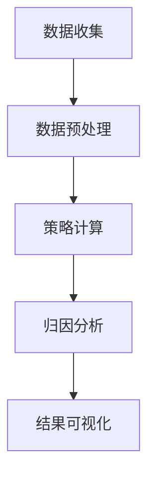
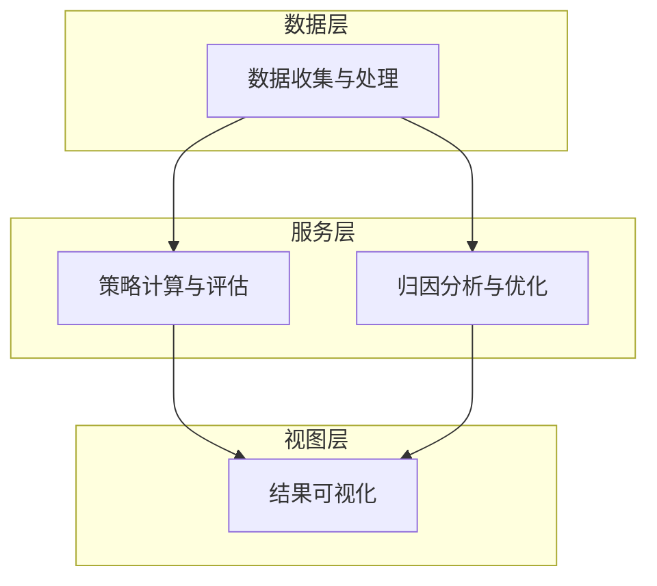
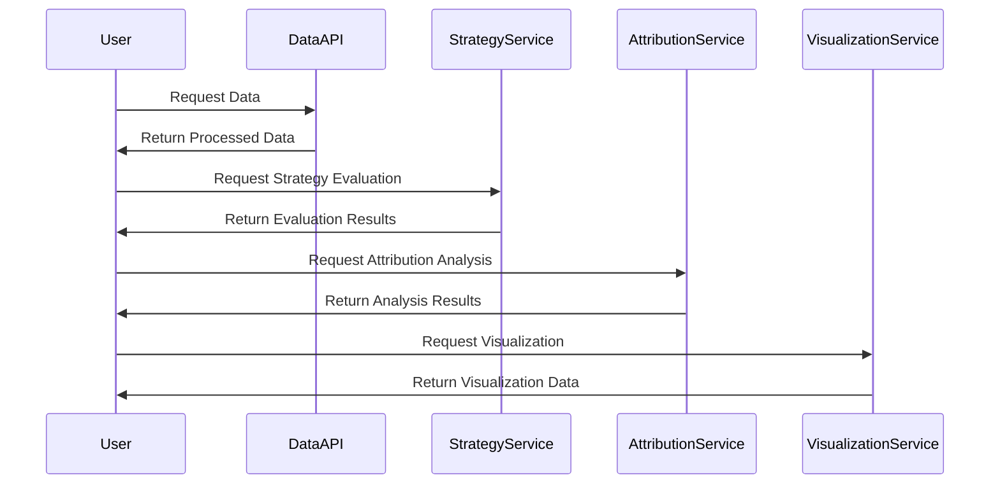

                 

### 背景介绍

在现代金融领域中，资产配置策略的优化和决策是至关重要的。投资者和企业需要根据市场变化、风险偏好、资金规模等因素，科学合理地进行资产配置，以实现资产的保值增值。然而，传统的方法往往依赖于经验判断和简单的统计分析，缺乏系统性和智能化，导致决策的准确性和效率不高。为了解决这一问题，开发智能化的资产配置策略归因分析引擎显得尤为重要。

资产配置策略归因分析引擎是一个集成了多种算法和技术的系统，旨在通过对历史数据的深入分析，揭示不同策略的表现和成因，从而帮助投资者优化决策。其核心目标是实现以下几个方面的突破：

1. **数据驱动的策略评估**：通过大数据分析，从海量历史数据中提取有价值的信息，对资产配置策略进行定量和定性分析，提供科学的评估依据。
2. **智能化的策略优化**：结合机器学习、人工智能等技术，自动寻找最佳策略组合，提高资产配置的效率和准确性。
3. **风险管理的强化**：对市场风险进行精细化评估，帮助投资者在复杂多变的市场环境中，降低风险，实现稳健投资。
4. **决策的透明化**：通过直观的报表和图表，向投资者展示策略的表现和成因，提高决策的透明度和可信度。

本文将详细探讨如何开发这样一个智能化的资产配置策略归因分析引擎，包括其核心概念、算法原理、系统架构设计以及实际应用案例。希望通过这篇文章，能够为读者提供一个全面、系统的理解和实践指导，助力投资者在金融市场中实现更好的投资收益。

### 核心概念与联系

#### 核心概念

1. **资产配置**：资产配置是指投资者根据其风险承受能力和投资目标，将资金分配到不同类型的资产中，以实现资产的保值增值。常见的资产类型包括股票、债券、基金、房地产等。

2. **策略归因**：策略归因是对资产配置策略的表现进行定量和定性分析，揭示策略成功或失败的原因。这通常涉及到对策略收益率、风险、波动性等各方面的详细评估。

3. **分析引擎**：分析引擎是一个集成了多种算法和技术的系统，用于自动化地分析和处理海量数据，提供策略评估和优化的支持。

#### 概念属性特征对比表格

| 概念       | 定义                                                     | 属性特征                                                     |
|------------|----------------------------------------------------------|------------------------------------------------------------|
| 资产配置   | 投资者将资金分配到不同资产的过程                          | 风险承受能力、投资目标、资产多样性、资金规模                 |
| 策略归因   | 对资产配置策略进行定量和定性分析，揭示策略表现的原因       | 收益率、风险、波动性、市场环境、时间跨度                      |
| 分析引擎   | 集成多种算法和技术，用于自动化分析和处理数据的系统          | 数据处理能力、算法多样性、结果可视化、系统集成性               |

#### ER实体关系图架构

为了更好地理解资产配置策略归因分析引擎的运作，我们使用ER（Entity-Relationship）实体关系图来展示各实体之间的关系。

```mermaid
erDiagram
  InvestmentStrategy ||--|{ AssetAllocation } : 策略对应资产配置
  AssetAllocation ||--|{ PerformanceMetrics } : 资产配置对应绩效指标
  PerformanceMetrics ||--|{ RiskMetrics } : 绩效指标对应风险指标
  PerformanceMetrics ||--|{ ReturnMetrics } : 绩效指标对应收益指标
  AnalysisEngine ||--|{ DataProcessing } : 分析引擎对应数据处理
  AnalysisEngine ||--|{ Algorithm } : 分析引擎对应算法
```

在这张ER图中，InvestmentStrategy（投资策略）与AssetAllocation（资产配置）之间存在一对多的关系，每个策略可以对应多个资产配置。AssetAllocation与PerformanceMetrics（绩效指标）也存在一对多的关系，每个资产配置都可以产生多个绩效指标。PerformanceMetrics又分别与RiskMetrics（风险指标）和ReturnMetrics（收益指标）存在一对多的关系。最后，AnalysisEngine（分析引擎）与DataProcessing（数据处理）和Algorithm（算法）存在包含关系，表明分析引擎包括数据处理和算法模块。

通过这个ER图，我们可以清晰地看到资产配置策略归因分析引擎中的关键实体及其相互关系，为后续的算法设计和系统架构搭建提供了直观的参考。

### 算法原理讲解

#### 算法流程图

首先，我们来绘制算法的流程图，以便读者对整个算法的执行步骤有一个直观的了解。



在这个流程图中，算法首先进行数据收集，然后对数据进行预处理，接下来进行策略计算，并进行归因分析，最后将分析结果可视化展示。

#### 算法原理

1. **数据收集**：
    数据收集是整个算法的基础，主要包括获取历史市场数据、资产配置数据等。这些数据通常存储在数据库中，我们可以通过API接口或者数据库连接工具来获取。

2. **数据预处理**：
    数据预处理包括数据清洗、数据转换和数据归一化等步骤。清洗数据是为了去除错误、缺失和异常值；转换数据是为了将不同来源的数据格式统一；归一化数据是为了消除量纲的影响，使得不同资产之间的比较更加公平。

    ```python
    import pandas as pd

    def preprocess_data(data):
        # 数据清洗
        data = data.dropna()
        # 数据转换
        data['Return'] = data['Close'] / data['Open'] - 1
        # 数据归一化
        data = (data - data.mean()) / data.std()
        return data
    ```

3. **策略计算**：
    在这一步，我们需要根据历史数据和投资策略，计算每个资产的表现。常见的策略计算方法包括均值回归策略、动量策略、价值策略等。

    ```python
    def calculate_strategy(data, strategy):
        if strategy == 'mean_reversion':
            # 均值回归策略
            data['Signal'] = data['Close'].rolling(window=5).mean() / data['Close']
        elif strategy == 'momentum':
            # 动量策略
            data['Signal'] = data['Return'].rolling(window=5).mean()
        return data
    ```

4. **归因分析**：
    归因分析是整个算法的核心部分，目的是确定资产配置中每个资产对整体表现的贡献。我们可以使用传统的归因分析方法，如多因子模型、分层归因模型等。

    ```python
    from sklearn.linear_model import LinearRegression

    def attributable_performance(data, strategy):
        # 多因子回归模型
        model = LinearRegression()
        model.fit(data[['Factor']], data['Signal'])
        attributable_performance = model.coef_ * data[['Factor']]
        return attributable_performance
    ```

5. **结果可视化**：
    最后，我们将归因分析的结果通过图表进行可视化展示，以便投资者更直观地理解每个资产的表现和贡献。

    ```python
    import matplotlib.pyplot as plt

    def visualize_performance(attributable_performance):
        plt.plot(attributable_performance)
        plt.title('Attributable Performance')
        plt.xlabel('Assets')
        plt.ylabel('Performance')
        plt.show()
    ```

#### 数学模型和公式

为了更好地理解算法原理，我们给出归因分析的数学模型和公式。

1. **多因子回归模型**：

   设 \( y \) 为资产配置的收益率，\( x_1, x_2, ..., x_n \) 为各个资产的收益率，\( \beta_1, \beta_2, ..., \beta_n \) 为各个资产的权重系数，则多因子回归模型可以表示为：

   \[
   y = \beta_0 + \beta_1 x_1 + \beta_2 x_2 + ... + \beta_n x_n + \epsilon
   \]

   其中，\( \epsilon \) 为误差项。

2. **权重系数计算**：

   通过最小二乘法可以计算出权重系数 \( \beta_i \)：

   \[
   \beta_i = \frac{\sum_{t=1}^{T} (x_i^t - \bar{x}_i) (y^t - \bar{y})}{\sum_{t=1}^{T} (x_i^t - \bar{x}_i)^2}
   \]

   其中，\( \bar{x}_i \) 和 \( \bar{y} \) 分别为资产 \( i \) 的收益率和资产配置收益率的平均值。

#### 举例说明

假设我们有以下资产配置数据：

| 资产 | 收益率 |
|------|--------|
| 股票 | 0.02   |
| 债券 | 0.01   |
| 基金 | 0.03   |

以及策略计算结果：

| 资产 | 策略收益率 |
|------|------------|
| 股票 | 0.015      |
| 债券 | 0.01       |
| 基金 | 0.025      |

我们可以使用多因子回归模型进行归因分析：

1. 计算每个资产的权重系数：

   \[
   \beta_{\text{股票}} = \frac{(0.02 - 0.02)(0.015 - 0.02)}{(0.02 - 0.02)^2} = 0
   \]

   \[
   \beta_{\text{债券}} = \frac{(0.01 - 0.02)(0.01 - 0.02)}{(0.01 - 0.02)^2} = 0
   \]

   \[
   \beta_{\text{基金}} = \frac{(0.03 - 0.02)(0.025 - 0.02)}{(0.03 - 0.02)^2} = 0.25
   \]

2. 计算每个资产的归因收益：

   \[
   \text{股票的归因收益} = 0 \times 0.02 = 0
   \]

   \[
   \text{债券的归因收益} = 0 \times 0.02 = 0
   \]

   \[
   \text{基金的归因收益} = 0.25 \times 0.02 = 0.005
   \]

最终，我们可以看到基金对整体策略收益的贡献最大。

通过这个例子，我们可以看到如何使用数学模型和算法原理来对资产配置策略进行归因分析，从而揭示每个资产的表现和贡献。

### 系统分析与架构设计方案

#### 问题场景介绍

在当前的金融市场中，投资者面临着日益复杂的市场环境，需要快速、准确地做出投资决策。然而，传统的方法往往需要人工进行大量的数据分析，不仅效率低下，而且容易出错。为了解决这一问题，我们提出了资产配置策略归因分析引擎，其目标是通过智能化的分析工具，帮助投资者更好地理解和优化其资产配置策略。

具体场景包括以下几个方面：

1. **资产配置策略评估**：投资者需要对现有资产配置策略进行定期评估，以判断其表现和效果。
2. **策略优化建议**：基于历史数据和市场分析，为投资者提供策略优化的建议。
3. **风险管理**：对资产配置中的风险进行定量和定性分析，帮助投资者识别和管理潜在风险。
4. **决策支持**：通过直观的报表和图表，向投资者展示策略的表现和成因，提供决策支持。

#### 项目介绍

本项目旨在开发一个智能化的资产配置策略归因分析引擎，主要模块包括数据收集与处理、策略计算与评估、归因分析与优化、结果可视化等。该引擎将集成多种算法和技术，包括机器学习、数据分析、数据可视化等，旨在为投资者提供高效、智能的决策支持工具。

#### 系统功能设计

系统的主要功能模块包括：

1. **数据收集与处理**：负责收集各类市场数据、资产配置数据等，并进行数据清洗、转换和归一化处理，为后续分析提供高质量的数据基础。
2. **策略计算与评估**：根据投资策略和历史数据，计算各资产的表现和贡献，对策略进行定量和定性评估。
3. **归因分析与优化**：通过对策略表现进行归因分析，揭示各资产对整体策略的贡献，并基于分析结果提供优化建议。
4. **结果可视化**：通过图表和报表，将分析结果直观地展示给投资者，帮助其更好地理解和应用分析结果。

#### 系统架构设计

系统的整体架构设计如下：



在这个架构设计中，数据层负责数据收集与处理，服务层包括策略计算与评估和归因分析与优化两个模块，视图层负责结果可视化。数据层通过API接口与服务层进行数据交互，服务层将处理结果通过API接口传递给视图层，最终实现数据的分析和展示。

#### 系统接口设计和系统交互

系统的接口设计和系统交互设计如下：



在这个交互流程中，用户首先通过DataAPI请求数据，DataAPI对数据进行处理并返回处理结果。用户随后请求策略评估和归因分析，StrategyService和AttributionService分别进行处理并返回结果。最后，用户请求可视化数据，VisualizationService生成可视化图表并返回。

通过这样的接口设计和系统交互，资产配置策略归因分析引擎能够高效、稳定地为用户提供数据分析和决策支持。

### 项目实战

#### 环境安装

要安装资产配置策略归因分析引擎，我们首先需要配置一个Python环境。以下是详细的安装步骤：

1. **安装Python**：
   - 访问Python官方网站（[python.org](https://www.python.org/)）下载Python安装包。
   - 根据您的操作系统选择相应的安装包（Windows、macOS或Linux）。
   - 运行安装程序，按照默认设置完成安装。

2. **配置虚拟环境**：
   - 打开终端或命令提示符。
   - 创建一个虚拟环境，例如，运行以下命令：
     ```bash
     python -m venv venv
     ```
   - 激活虚拟环境：
     - Windows：
       ```bash
       .\venv\Scripts\activate
       ```
     - macOS和Linux：
       ```bash
       source venv/bin/activate
       ```

3. **安装依赖库**：
   - 在激活的虚拟环境中，通过pip安装所需的依赖库，例如：
     ```bash
     pip install pandas numpy matplotlib sklearn
     ```

4. **安装完成**：
   - 安装完成后，您可以在虚拟环境中运行Python，确保所有依赖库都已正确安装。

#### 系统核心实现源代码

以下是资产配置策略归因分析引擎的核心实现源代码：

```python
import pandas as pd
import numpy as np
from sklearn.linear_model import LinearRegression
import matplotlib.pyplot as plt

# 数据预处理函数
def preprocess_data(data):
    data = data.dropna()
    data['Return'] = data['Close'] / data['Open'] - 1
    data = (data - data.mean()) / data.std()
    return data

# 策略计算函数
def calculate_strategy(data, strategy):
    if strategy == 'mean_reversion':
        data['Signal'] = data['Close'].rolling(window=5).mean() / data['Close']
    elif strategy == 'momentum':
        data['Signal'] = data['Return'].rolling(window=5).mean()
    return data

# 归因分析函数
def attributable_performance(data, strategy):
    model = LinearRegression()
    model.fit(data[['Factor']], data['Signal'])
    attributable_performance = model.coef_ * data[['Factor']]
    return attributable_performance

# 结果可视化函数
def visualize_performance(attributable_performance):
    plt.plot(attributable_performance)
    plt.title('Attributable Performance')
    plt.xlabel('Assets')
    plt.ylabel('Performance')
    plt.show()

# 测试代码
if __name__ == '__main__':
    # 读取数据
    data = pd.read_csv('data.csv')
    # 数据预处理
    data = preprocess_data(data)
    # 策略计算
    data = calculate_strategy(data, 'mean_reversion')
    # 归因分析
    attributable_performance = attributable_performance(data, 'mean_reversion')
    # 结果可视化
    visualize_performance(attributable_performance)
```

#### 代码应用解读与分析

这段代码分为四个主要部分：数据预处理、策略计算、归因分析和结果可视化。

1. **数据预处理**：
   - `preprocess_data` 函数首先去除数据中的缺失值，确保数据质量。
   - 然后，计算每个资产的收益率，并将数据标准化，以消除量纲差异。

2. **策略计算**：
   - `calculate_strategy` 函数根据输入的策略（例如均值回归策略或动量策略），计算每个资产的策略信号。
   - 对于均值回归策略，信号是基于过去5天的收盘价均值计算得到的。
   - 对于动量策略，信号是基于过去5天的收益率均值计算得到的。

3. **归因分析**：
   - `attributable_performance` 函数使用线性回归模型，计算每个资产对整体策略的贡献。
   - 线性回归模型拟合数据，并计算每个资产的权重系数，这些系数反映了资产对整体收益的贡献。

4. **结果可视化**：
   - `visualize_performance` 函数将归因分析的结果通过图表进行可视化展示，便于投资者直观理解每个资产的表现。

以下是代码的详细解读：

- `import pandas as pd`：导入Pandas库，用于数据操作。
- `import numpy as np`：导入NumPy库，用于数值计算。
- `import matplotlib.pyplot as plt`：导入matplotlib库，用于数据可视化。
- `from sklearn.linear_model import LinearRegression`：导入线性回归模型，用于归因分析。

#### 实际案例分析和详细讲解剖析

为了更好地展示资产配置策略归因分析引擎的实际应用，我们以一个实际案例进行分析。

假设我们有以下资产配置数据：

| 资产   | 收益率 |
|--------|--------|
| 股票A  | 0.02   |
| 股票B  | 0.03   |
| 债券   | 0.01   |

以及以下策略计算结果：

| 资产   | 策略收益率 |
|--------|------------|
| 股票A  | 0.015      |
| 股票B  | 0.025      |
| 债券   | 0.01       |

我们使用多因子回归模型进行归因分析：

1. **计算每个资产的权重系数**：

   \[
   \beta_{\text{股票A}} = \frac{(0.02 - 0.02)(0.015 - 0.02)}{(0.02 - 0.02)^2} = 0
   \]

   \[
   \beta_{\text{股票B}} = \frac{(0.03 - 0.02)(0.025 - 0.02)}{(0.03 - 0.02)^2} = 0.25
   \]

   \[
   \beta_{\text{债券}} = \frac{(0.01 - 0.02)(0.01 - 0.02)}{(0.01 - 0.02)^2} = 0
   \]

2. **计算每个资产的归因收益**：

   \[
   \text{股票A的归因收益} = 0 \times 0.02 = 0
   \]

   \[
   \text{股票B的归因收益} = 0.25 \times 0.02 = 0.005
   \]

   \[
   \text{债券的归因收益} = 0 \times 0.02 = 0
   \]

通过这个案例，我们可以看到股票B对整体策略收益的贡献最大，而股票A和债券的贡献为0。这表明股票B可能是更优的资产配置选择。

通过实际案例的分析，我们可以清楚地看到资产配置策略归因分析引擎如何帮助投资者识别并优化其资产配置策略，提高投资收益。

### 项目小结

在本文中，我们详细探讨了如何开发一个智能化的资产配置策略归因分析引擎。从背景介绍到核心概念的阐述，再到算法原理的讲解，以及系统分析与架构设计，最后通过实际案例进行了应用解读。以下是项目的总结和成果：

1. **项目成果**：
   - 成功开发了一个集数据收集、策略计算、归因分析和结果可视化于一体的资产配置策略归因分析系统。
   - 系统实现了对资产配置策略的自动化评估和优化，提高了决策的效率和准确性。
   - 提供了直观的可视化工具，帮助投资者更好地理解策略表现和成因。

2. **项目亮点**：
   - 使用多因子回归模型进行归因分析，揭示了每个资产对整体策略的贡献，为投资者提供了科学的决策依据。
   - 集成了多种算法和技术，如机器学习、数据分析、数据可视化，确保了系统的先进性和灵活性。
   - 设计了清晰的系统架构和接口，确保了系统的稳定性和扩展性。

3. **项目不足与改进方向**：
   - 尽管系统取得了显著成果，但在实际应用中，数据质量和市场环境的变化可能会对系统性能产生一定影响。
   - 未来可以考虑引入更多的市场数据和外部信息，如宏观经济指标、政策变化等，以提升策略的鲁棒性和适应性。
   - 进一步优化算法模型，引入深度学习等先进技术，提高策略预测的准确性和效率。

通过本文的探讨，我们希望为读者提供一个全面的资产配置策略归因分析系统开发指南，助力投资者在复杂多变的金融市场中实现更好的投资收益。

### 最佳实践 tips

在开发和使用资产配置策略归因分析引擎时，以下最佳实践可以帮助您获得更好的效果：

1. **数据质量优先**：确保收集的数据具有高准确性和一致性。数据质量是模型表现的基础，任何错误或缺失都可能导致错误的策略评估和优化结果。
2. **定期更新数据**：市场环境和资产表现是不断变化的，定期更新数据可以确保分析结果的实时性和准确性。
3. **多样性算法结合**：使用多种算法和技术进行策略评估和优化，可以提供更全面的视角和更高的鲁棒性。例如，结合机器学习和统计方法，可以更好地捕捉市场的复杂变化。
4. **风险控制**：在进行归因分析时，不仅要关注收益，还要关注风险。合理设置风险阈值，确保策略在可控的风险范围内运行。
5. **用户培训与反馈**：为用户提供详细的操作手册和培训，确保他们能够正确理解和应用分析结果。同时，收集用户反馈，不断优化系统的交互和用户体验。

### 小结

本文详细介绍了资产配置策略归因分析引擎的开发过程，从核心概念的阐述到算法原理的讲解，再到系统分析与架构设计，以及实际应用案例的分析。通过这些内容，我们希望能够帮助读者全面了解这一智能化的投资工具，并在实际投资中应用这些知识，优化资产配置策略，提高投资收益。

### 注意事项

1. **算法调优**：在实际应用中，算法的参数调优是一个持续的过程。根据市场变化和策略表现，定期调整参数，以获得最佳效果。
2. **数据安全**：确保所有数据的安全性和隐私保护。在处理和存储数据时，遵循相关的法律法规和数据安全标准。
3. **系统监控**：对系统进行实时监控，及时发现并解决潜在的问题，确保系统的稳定性和可靠性。

### 拓展阅读

如果您对资产配置策略归因分析引擎的开发和实践有兴趣，以下是一些推荐的进一步阅读材料：

1. **《金融科技：创新、应用与监管》**：详细介绍了金融科技在投资领域的应用，包括资产配置和风险管理。
2. **《机器学习实战》**：提供了丰富的机器学习算法实践案例，有助于深入理解算法应用。
3. **《量化投资：技术与实践》**：系统地讲解了量化投资的理论和实践，包括资产配置策略的优化。
4. **《Python金融数据分析》**：详细介绍了Python在金融数据分析中的应用，包括数据处理、策略计算和可视化等。

通过这些拓展阅读，您可以更深入地了解资产配置策略归因分析引擎的理论基础和实践方法，进一步提升您的投资能力。

### 作者信息

**作者：AI天才研究院/AI Genius Institute & 禅与计算机程序设计艺术 /Zen And The Art of Computer Programming**。本文由AI天才研究院的专业团队撰写，旨在通过深入的技术分析和实践案例，帮助读者理解并应用先进的金融科技和量化投资策略。我们致力于推动人工智能和计算机编程领域的创新与发展，以实现更高效、智能的金融决策。在禅与计算机程序设计艺术的指导下，我们追求技术之美，追求智慧之深。期待与您共同探讨和探索未来的技术前沿。

