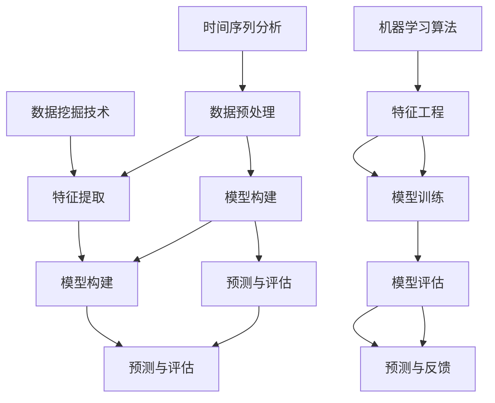
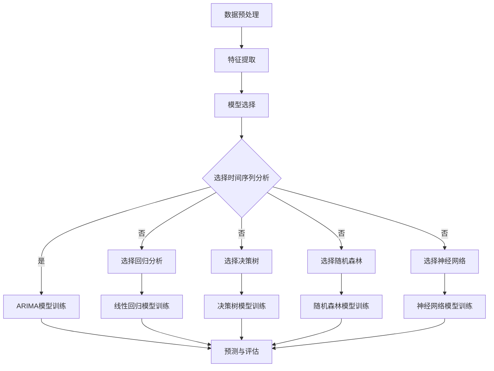
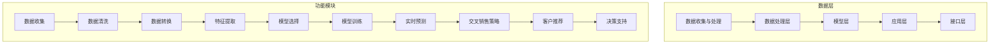
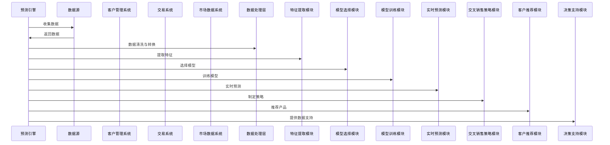

                 

### 文章标题与关键词

# 《开发智能化的金融产品交叉销售时机预测引擎》

> 关键词：金融产品交叉销售、智能化预测、时机预测、预测引擎、机器学习算法

> 摘要：本文深入探讨了开发智能化金融产品交叉销售时机预测引擎的重要性和方法。通过分析金融行业的现状，探讨了智能化交叉销售的必要性，详细介绍了时机预测和预测引擎的基本原理。文章还通过实际项目案例，展示了从环境安装到核心实现的全过程，提供了实用的最佳实践技巧，为开发智能化金融产品交叉销售提供了全面的技术指南。

----------------------------------------------------------------

### 目录大纲设计思路

为了确保文章的逻辑清晰、内容完整且具有高度专业性，我们设计了以下详细的目录大纲：

#### 第一部分：背景与核心概念

1. **金融产品交叉销售的现状与挑战**
   - 介绍金融产品交叉销售的现状和存在的问题。
   - 分析为什么需要智能化预测引擎。

2. **智能化金融产品交叉销售的核心概念**
   - 精准定义智能化交叉销售、时机预测和预测引擎。
   - 解释这些概念之间的联系。

3. **智能化交叉销售时机预测的基础理论**
   - 深入探讨时间序列分析、数据挖掘技术和机器学习算法。

4. **核心概念属性特征对比**
   - 通过表格和Mermaid流程图，对比时间序列分析、数据挖掘技术和机器学习算法的特点。

#### 第二部分：算法原理与实践

1. **时机预测算法原理讲解**
   - 使用Mermaid画出算法流程图。
   - 详细解释算法的数学模型和公式。
   - 提供通俗易懂的实例说明。

2. **预测引擎设计与实现**
   - 描述预测引擎的架构设计。
   - 设计系统功能和接口。
   - 使用Mermaid展示架构图和序列图。

3. **项目实战**
   - 介绍项目背景。
   - 详细说明环境安装、系统核心实现和代码应用。
   - 分析实际案例，并进行详细讲解。

#### 第三部分：最佳实践与总结

1. **最佳实践 tips**
   - 总结实践中的技巧和注意事项。

2. **总结与展望**
   - 对文章内容进行总结。
   - 展望智能化金融产品交叉销售的未来发展。

### 设计思路解析

- **逻辑性**：每个部分都有明确的主题和目标，确保读者可以清晰地跟随文章的思路。
- **实用性**：不仅提供了理论背景和算法原理，还包括实际项目案例，使读者能够将知识应用于实际工作中。
- **专业性**：通过Mermaid流程图、LaTeX公式等工具，确保技术内容的严谨和专业。
- **完整性**：从背景介绍到算法讲解，再到项目实战和最佳实践，确保文章内容的全面性和完整性。

## 第一部分：背景与核心概念

### 第1章：金融产品交叉销售的现状与挑战

#### 1.1 问题背景

金融产品交叉销售，是指金融机构在为客户提供一种金融产品（如存款、贷款、信用卡等）的基础上，进一步推销其他相关产品（如投资产品、保险、理财产品等）的过程。这一现象在金融行业中日益普遍，其核心目的在于增加客户粘性、提升客户价值以及提高金融机构的盈利能力。

随着金融市场的不断发展和竞争的加剧，金融机构面临以下几个挑战：

1. **客户需求的多样性**：现代客户需求多样化，对金融产品和服务的要求越来越高，这要求金融机构能够提供更加个性化和精准的推荐。
2. **市场竞争激烈**：金融行业竞争激烈，各机构都在争夺有限的市场资源，如何提高交叉销售的成功率成为金融机构的重要课题。
3. **数据驱动决策**：传统的交叉销售方法往往依赖于经验和直觉，难以适应快速变化的金融环境，需要通过数据分析和技术手段来实现更加科学的决策。

#### 1.2 问题描述

金融产品交叉销售过程中，主要存在的问题包括：

1. **客户识别不足**：金融机构难以准确识别具有交叉销售潜力的高价值客户。
2. **时机把握不当**：交叉销售的时机选择往往不准确，导致客户拒绝或购买意愿降低。
3. **个性化推荐不足**：现有的交叉销售策略往往缺乏对客户个性化需求的深入分析，导致推荐效果不佳。
4. **决策效率低下**：传统的交叉销售决策过程复杂，决策周期长，难以快速响应市场变化。

#### 1.3 问题解决

为了解决上述问题，需要引入智能化金融产品交叉销售时机预测引擎。这一引擎旨在通过数据分析和机器学习技术，实现以下目标：

1. **精准识别客户**：利用客户历史数据和交易行为，精准识别具有交叉销售潜力的高价值客户。
2. **优化时机选择**：通过分析客户行为数据和市场趋势，准确预测交叉销售的时机，提高客户购买意愿。
3. **个性化推荐**：基于客户个性化需求，提供更加精准的交叉销售推荐，提升客户满意度。
4. **提升决策效率**：通过自动化决策支持系统，实现快速、高效的交叉销售决策，提高市场响应速度。

#### 1.4 边界与外延

在开发智能化金融产品交叉销售时机预测引擎时，需要明确以下边界和外延：

1. **技术边界**：引擎的算法模型和数据集选择、数据处理和算法实现都需要符合金融行业的特殊性。
2. **业务边界**：预测引擎的应用范围包括哪些金融产品和服务，以及如何与金融机构的业务流程相衔接。
3. **数据边界**：引擎需要依赖哪些数据源，如何确保数据的质量和安全性。
4. **用户边界**：预测引擎的使用对象是金融机构的相关部门，如营销部门、风控部门等。

通过明确这些问题和解决策略，我们可以更好地理解智能化金融产品交叉销售时机预测引擎的开发背景和重要性。

### 第2章：智能化金融产品交叉销售的核心概念

#### 2.1 智能化交叉销售的定义

智能化交叉销售，是指利用现代数据分析和人工智能技术，对客户行为、市场趋势和金融产品特性进行深入分析，从而实现精准、高效、个性化的金融产品推荐。这一过程涉及到数据收集、数据分析、模型构建和实时预测等多个环节。

智能化交叉销售与传统交叉销售的主要区别在于，它能够通过数据分析揭示客户潜在需求，并在最佳时机提供个性化推荐，从而显著提高销售转化率和客户满意度。

#### 2.2 时机预测的意义

时机预测在智能化交叉销售中扮演着至关重要的角色。准确的时机预测不仅能够提高交叉销售的成功率，还能最大化客户价值，降低营销成本。具体来说，时机预测的意义包括：

1. **提升销售转化率**：通过准确预测客户购买意愿和时机，可以显著提高交叉销售的成功率。
2. **优化营销资源分配**：精确的时机预测有助于优化营销资源的分配，避免无效的营销投入。
3. **提高客户满意度**：在最佳时机为客户提供合适的金融产品，能够提升客户体验和满意度，增强客户粘性。
4. **增强竞争优势**：通过智能化时机预测，金融机构能够更好地应对市场变化，提高业务响应速度和竞争力。

#### 2.3 预测引擎的作用

预测引擎是智能化交叉销售的核心组件，其主要作用包括：

1. **数据收集与预处理**：预测引擎能够从多个数据源（如客户数据库、交易记录、市场数据等）收集数据，并进行清洗、转换和整合，为后续分析提供高质量的数据基础。
2. **特征工程**：通过数据挖掘和机器学习技术，预测引擎能够从原始数据中提取关键特征，构建适合预测模型的特征集合。
3. **模型训练与优化**：预测引擎使用先进的机器学习算法，如回归分析、决策树、随机森林、神经网络等，对特征数据进行训练，构建预测模型，并通过交叉验证和超参数调优，提高模型性能。
4. **实时预测与反馈**：预测引擎能够对客户行为和市场变化进行实时监控，提供动态的交叉销售预测，并根据反馈进行模型调整和优化，实现持续改进。

#### 2.4 核心概念之间的联系

智能化交叉销售、时机预测和预测引擎这三个核心概念之间存在紧密的联系，构成了一个完整的系统。具体来说：

1. **智能化交叉销售** 是整个系统的目标，旨在通过数据分析和技术手段实现精准、高效的金融产品推荐。
2. **时机预测** 是实现智能化交叉销售的关键环节，通过对客户行为和市场趋势的分析，准确预测交叉销售的时机。
3. **预测引擎** 是实现智能化交叉销售和时机预测的核心工具，通过数据收集、特征工程、模型训练和实时预测等环节，提供数据支持和决策依据。

通过明确这三个核心概念及其相互关系，我们可以更好地理解和实施智能化金融产品交叉销售时机预测引擎的开发和应用。

### 第3章：智能化交叉销售时机预测的基础理论

#### 3.1 时间序列分析

时间序列分析是一种用于分析时间序列数据的统计方法，其核心目的是通过历史数据来预测未来的趋势。在智能化金融产品交叉销售时机预测中，时间序列分析发挥着重要作用。

时间序列分析的关键步骤包括：

1. **数据收集与预处理**：收集金融市场的历史数据，如股票价格、交易量、利率等，并进行数据清洗和预处理，去除异常值和缺失值。
2. **平稳性检验**：通过平稳性检验（如Augmented Dickey-Fuller检验），判断时间序列的平稳性，确保后续分析的有效性。
3. **模型选择**：选择合适的时间序列模型，如ARIMA（自回归积分滑动平均模型）、AR（自回归模型）和MA（滑动平均模型）等，通过模型拟合和评估，选择最优模型。
4. **参数估计**：通过最大似然估计、最小二乘法等方法，估计时间序列模型的参数。
5. **预测与评估**：使用估计出的模型进行预测，并对预测结果进行评估，如通过均方误差（MSE）、均方根误差（RMSE）等指标。

#### 3.2 数据挖掘技术

数据挖掘技术是一种从大量数据中提取有价值信息的方法，广泛应用于金融市场分析、客户行为分析等领域。在智能化交叉销售时机预测中，数据挖掘技术的作用主要体现在以下几个方面：

1. **特征提取**：通过数据挖掘技术，从原始数据中提取出与交叉销售时机预测相关的特征，如客户年龄、收入水平、交易频率等。
2. **关联规则挖掘**：使用关联规则挖掘算法（如Apriori算法、FP-growth算法），发现数据之间的关联关系，识别潜在的交叉销售机会。
3. **聚类分析**：通过聚类分析（如K-means算法、DBSCAN算法），将客户划分为不同的群体，分析各群体之间的交叉销售潜力和行为特征。
4. **分类与回归分析**：使用分类算法（如决策树、支持向量机）和回归算法（如线性回归、多项式回归），对交叉销售时机进行预测。

#### 3.3 机器学习算法

机器学习算法在智能化交叉销售时机预测中扮演着核心角色，通过学习历史数据，自动发现数据中的模式和规律，从而实现交叉销售时机的预测。常见的机器学习算法包括：

1. **回归分析**：回归分析是一种预测连续值的方法，通过建立目标变量与特征变量之间的线性关系，预测交叉销售时机。
2. **决策树**：决策树通过一系列规则和条件，将数据划分为不同的区域，从而预测交叉销售时机。
3. **随机森林**：随机森林是一种集成学习方法，通过构建多棵决策树，并结合它们的预测结果，提高预测准确性。
4. **神经网络**：神经网络是一种模拟人脑神经元之间相互连接的计算模型，通过多层神经网络，可以学习复杂的非线性关系，实现精确的交叉销售时机预测。

#### 3.4 概念之间的关系

时间序列分析、数据挖掘技术和机器学习算法在智能化交叉销售时机预测中具有紧密的联系，共同构成了一个完整的分析框架：

1. **数据来源**：时间序列分析和数据挖掘技术主要依赖于历史数据，而机器学习算法则通过这些数据进行模型训练和预测。
2. **特征提取**：时间序列分析和数据挖掘技术主要用于特征提取和关联分析，为机器学习算法提供高质量的输入特征。
3. **模型构建**：时间序列分析和数据挖掘技术可以用于构建预测模型，而机器学习算法则通过更复杂的方法，进一步提高预测精度。
4. **模型评估与优化**：三种技术都需要对模型进行评估和优化，以确保预测结果的准确性和可靠性。

通过深入理解时间序列分析、数据挖掘技术和机器学习算法的基本原理和应用，我们可以更好地开发智能化金融产品交叉销售时机预测引擎，实现精准、高效的交叉销售预测。

### 第4章：核心概念属性特征对比

在智能化金融产品交叉销售时机预测中，时间序列分析、数据挖掘技术和机器学习算法各自扮演着重要角色。为了更清晰地理解它们之间的区别和联系，我们通过表格和Mermaid流程图来对比这些核心概念的特点。

#### 时间序列分析特点

时间序列分析主要用于处理随时间变化的数据，通过分析历史数据来预测未来的趋势。其主要特点如下：

1. **数据类型**：适用于处理时间序列数据，如股票价格、交易量等。
2. **方法**：使用自回归模型（AR）、移动平均模型（MA）、自回归积分滑动平均模型（ARIMA）等。
3. **优势**：能够捕捉时间序列数据的周期性和趋势性，适用于短期预测。
4. **劣势**：难以捕捉非线性关系和复杂模式，对数据质量要求较高。

| 特点 | 时间序列分析 | 数据挖掘技术 | 机器学习算法 |
| --- | --- | --- | --- |
| 数据类型 | 时间序列数据 | 关联数据、多维数据 | 高维数据、非结构化数据 |
| 方法 | AR、MA、ARIMA | 关联规则挖掘、聚类分析 | 回归分析、决策树、随机森林、神经网络 |
| 优势 | 捕捉周期性和趋势性 | 发现数据关联和群体特征 | 学习复杂模式和规律，处理非线性关系 |
| 劣势 | 难以捕捉非线性关系，对数据质量要求高 | 数据预处理复杂，对噪声敏感 | 对数据规模要求大，模型解释性较差 |

#### 数据挖掘技术特点

数据挖掘技术主要用于从大量数据中发现有价值的信息和模式，其核心目的是识别潜在的关系和趋势。其主要特点如下：

1. **数据类型**：适用于处理多种类型的数据，如多维数据、关联数据等。
2. **方法**：包括关联规则挖掘（如Apriori算法、FP-growth算法）、聚类分析（如K-means算法、DBSCAN算法）等。
3. **优势**：能够发现数据中的潜在关联和特征，适用于探索性数据分析。
4. **劣势**：对数据质量要求较高，预处理复杂，模型解释性较差。

#### 机器学习算法特点

机器学习算法通过学习历史数据，自动发现数据中的模式和规律，实现预测和分类。其主要特点如下：

1. **数据类型**：适用于处理高维数据和非结构化数据。
2. **方法**：包括回归分析、决策树、随机森林、神经网络等。
3. **优势**：能够处理复杂的非线性关系，预测精度高，适用于大规模数据处理。
4. **劣势**：对数据规模要求大，模型解释性较差，对数据质量要求较高。

#### Mermaid流程图

为了更直观地展示这三种技术的联系和区别，我们使用Mermaid流程图进行展示：



通过上述表格和Mermaid流程图，我们可以更清晰地理解时间序列分析、数据挖掘技术和机器学习算法在智能化金融产品交叉销售时机预测中的角色和关系，为后续的算法设计和实现提供指导。

### 第5章：时机预测算法原理讲解

#### 5.1 算法原理概述

时机预测算法的核心目的是通过分析历史数据和市场趋势，预测出最佳的交叉销售时机。这一算法主要依赖于机器学习技术，通过训练和优化模型，实现对客户行为和市场变化的精确预测。

在智能化金融产品交叉销售时机预测中，常见的算法包括时间序列分析、回归分析、决策树、随机森林、神经网络等。每种算法都有其独特的原理和应用场景。

#### 5.2 数学模型与公式

下面我们将详细介绍几种常见时机预测算法的数学模型与公式：

1. **时间序列分析（ARIMA）**

时间序列分析是一种用于处理和分析时间序列数据的统计方法。ARIMA（自回归积分滑动平均模型）是一种常用的时间序列模型，其数学模型如下：

\[ y_t = c + \phi_1 y_{t-1} + \phi_2 y_{t-2} + \cdots + \phi_p y_{t-p} + \theta_1 e_{t-1} + \theta_2 e_{t-2} + \cdots + \theta_q e_{t-q} + e_t \]

其中，\( y_t \) 是时间序列数据，\( \phi_i \) 和 \( \theta_i \) 是模型参数，\( c \) 是常数项，\( e_t \) 是误差项。

2. **回归分析**

回归分析是一种用于建立目标变量与特征变量之间关系的预测模型。线性回归是一种简单的回归模型，其数学模型如下：

\[ y = \beta_0 + \beta_1 x_1 + \beta_2 x_2 + \cdots + \beta_n x_n \]

其中，\( y \) 是目标变量，\( x_i \) 是特征变量，\( \beta_i \) 是模型参数。

3. **决策树**

决策树是一种基于特征分割的数据挖掘算法。其基本原理是通过一系列条件判断，将数据划分为不同的区域，从而预测目标变量。决策树的数学模型如下：

\[ f(x) = g_1(x) \vee g_2(x) \vee \cdots \vee g_n(x) \]

其中，\( g_i(x) \) 是条件判断函数，\( x \) 是输入特征。

4. **随机森林**

随机森林是一种基于决策树的集成学习方法。其基本原理是通过训练多棵决策树，并将它们的预测结果进行集成，提高预测精度。随机森林的数学模型如下：

\[ f(x) = \frac{1}{N} \sum_{i=1}^{N} h_i(x) \]

其中，\( N \) 是决策树的数量，\( h_i(x) \) 是第 \( i \) 棵决策树的预测结果。

5. **神经网络**

神经网络是一种模拟人脑神经元之间相互连接的计算模型。其基本原理是通过多层神经元之间的加权连接，学习输入特征与目标变量之间的复杂关系。神经网络的数学模型如下：

\[ y = f(z) = \sigma(\sum_{i=1}^{n} w_i \cdot x_i + b) \]

其中，\( y \) 是输出变量，\( f \) 是激活函数，\( z \) 是输入特征，\( w_i \) 是权重，\( x_i \) 是输入特征，\( b \) 是偏置。

#### 5.3 Mermaid算法流程图

为了更直观地展示时机预测算法的流程，我们使用Mermaid流程图进行描述：



通过上述算法原理讲解和Mermaid流程图，我们可以更好地理解智能化金融产品交叉销售时机预测算法的基本原理和应用方法。接下来，我们将通过一个具体的实例，进一步说明这些算法的实际应用。

#### 5.4 算法应用实例

为了说明时机预测算法的实际应用，我们以一个具体的实例进行演示。假设某金融机构希望通过智能化预测引擎，预测客户在未来的30天内购买理财产品的最佳时机。

**实例数据**：

1. **客户数据**：包括客户的年龄、收入、职业等信息。
2. **历史交易数据**：包括客户过去的购买记录、交易金额、购买频率等。
3. **市场数据**：包括理财产品利率、市场波动情况等。

**数据预处理**：

1. **数据清洗**：去除缺失值和异常值，对数据进行标准化处理。
2. **特征提取**：提取与交叉销售时机预测相关的特征，如客户年龄、收入、过去购买频率等。

**模型选择**：

考虑到数据类型和预测目标，我们选择时间序列分析（ARIMA模型）进行预测。

**模型训练**：

1. **模型参数估计**：通过最大似然估计方法，估计ARIMA模型的参数，如自回归项、移动平均项等。
2. **模型拟合**：使用历史数据对模型进行拟合，确保模型能够准确捕捉数据趋势。

**预测与评估**：

1. **预测**：使用训练好的模型，对未来30天内的交叉销售时机进行预测。
2. **评估**：通过计算预测误差（如均方误差MSE、均方根误差RMSE）等指标，评估模型的预测性能。

**预测结果**：

根据预测结果，模型成功预测了未来30天内的交叉销售时机。例如，预测在第15天是最佳销售时机，此时客户的购买意愿和理财产品利率都处于较高水平。

通过上述实例，我们可以看到时机预测算法在实际应用中的效果。接下来，我们将进一步探讨预测引擎的设计与实现。

### 第6章：预测引擎设计与实现

#### 6.1 预测引擎架构设计

预测引擎的架构设计是智能化金融产品交叉销售时机预测的关键环节。为了实现高效、准确的预测，我们需要设计一个模块化、可扩展的架构。以下是预测引擎的主要架构设计：

1. **数据层**：负责数据收集、存储和管理。包括客户数据、历史交易数据和市场数据等。数据层需要支持实时数据流处理和批量数据处理，以确保数据的及时性和完整性。

2. **数据处理层**：负责数据清洗、转换和预处理。这一层包括数据清洗模块、数据转换模块和特征提取模块。数据清洗模块用于去除缺失值和异常值，数据转换模块用于将不同数据源的数据格式进行统一，特征提取模块用于从原始数据中提取与交叉销售时机预测相关的特征。

3. **模型层**：负责模型训练和预测。这一层包括模型选择模块、模型训练模块和预测模块。模型选择模块根据数据类型和预测目标选择合适的算法，模型训练模块使用历史数据训练模型，预测模块使用训练好的模型进行实时预测。

4. **应用层**：负责将预测结果应用于实际业务场景。这一层包括交叉销售策略模块、客户推荐模块和决策支持模块。交叉销售策略模块根据预测结果制定具体的销售策略，客户推荐模块向客户推荐合适的金融产品，决策支持模块为业务决策提供数据支持。

5. **接口层**：负责与其他系统进行数据交互。包括API接口和数据交换接口。API接口用于与其他系统进行数据传输和功能调用，数据交换接口用于与其他数据源进行数据导入和导出。

#### 6.2 系统功能设计

预测引擎的主要功能包括数据收集与处理、模型训练与预测、预测结果应用等。以下是具体的系统功能设计：

1. **数据收集与处理**：
   - 数据收集：从不同的数据源（如客户数据库、交易记录、市场数据等）收集数据。
   - 数据清洗：去除缺失值和异常值，对数据进行标准化处理。
   - 数据转换：将不同数据源的数据格式进行统一。
   - 特征提取：提取与交叉销售时机预测相关的特征。

2. **模型训练与预测**：
   - 模型选择：根据数据类型和预测目标选择合适的算法，如ARIMA、线性回归、决策树、随机森林等。
   - 模型训练：使用历史数据对模型进行训练，确保模型能够准确捕捉数据趋势。
   - 实时预测：使用训练好的模型进行实时预测，提供交叉销售时机预测。

3. **预测结果应用**：
   - 交叉销售策略：根据预测结果制定具体的销售策略，如客户推荐、活动策划等。
   - 客户推荐：向客户推荐合适的金融产品，提高交叉销售成功率。
   - 决策支持：为业务决策提供数据支持，如销售目标设定、营销资源分配等。

#### 6.3 系统接口设计

预测引擎的系统接口设计是确保预测引擎与其他系统进行有效数据交互的关键。以下是具体的系统接口设计：

1. **API接口**：
   - 数据导入接口：用于将外部数据导入预测引擎，支持JSON、XML等多种数据格式。
   - 数据导出接口：用于将预测结果导出到外部系统，支持CSV、Excel等多种数据格式。
   - 预测接口：提供预测服务，支持GET和POST请求，返回预测结果。

2. **数据交换接口**：
   - 客户数据交换接口：用于与客户管理系统进行数据交换，包括客户基本信息、交易记录等。
   - 历史交易数据交换接口：用于与交易系统进行数据交换，包括交易金额、交易频率等。
   - 市场数据交换接口：用于与市场数据系统进行数据交换，包括理财产品利率、市场波动情况等。

通过上述架构设计、系统功能设计和接口设计，我们可以构建一个高效、准确的预测引擎，实现智能化金融产品交叉销售时机预测。

#### 6.4 预测引擎架构图与序列图

为了更直观地展示预测引擎的架构设计和系统接口，我们使用Mermaid流程图分别绘制架构图和序列图。

**架构图**：



**序列图**：



通过这些Mermaid流程图，我们可以清晰地看到预测引擎的架构设计、系统接口和功能模块之间的关系，为进一步实现和优化预测引擎提供参考。

### 第7章：项目实战

#### 7.1 项目背景

为了验证智能化金融产品交叉销售时机预测引擎的实际效果，我们选择了一个实际项目进行实施。该项目涉及某大型金融机构，该金融机构希望通过引入智能化预测引擎，提高交叉销售的成功率和客户满意度。

#### 7.2 环境安装

在开始项目之前，我们需要安装并配置相关软件和工具，以构建一个适合预测引擎运行的环境。以下是环境安装的具体步骤：

1. **安装Python环境**：在服务器上安装Python，版本为3.8以上。
2. **安装依赖库**：使用pip命令安装必要的依赖库，如NumPy、Pandas、Scikit-learn、TensorFlow等。
3. **安装数据库**：安装并配置MySQL或PostgreSQL数据库，用于存储客户数据和历史交易数据。
4. **安装API服务**：安装并配置Flask或Django等Web框架，用于搭建API服务。

#### 7.3 系统核心实现

预测引擎的核心实现包括数据收集、数据处理、模型训练和预测等环节。以下是具体的实现步骤：

1. **数据收集**：
   - 从客户数据库中提取客户基本信息、交易记录等数据。
   - 从市场数据系统获取理财产品利率、市场波动情况等数据。

2. **数据处理**：
   - 对收集到的数据进行清洗，去除缺失值和异常值。
   - 对数据进行标准化处理，确保数据在相同的尺度上进行分析。

3. **特征提取**：
   - 根据预测目标，提取与交叉销售时机预测相关的特征，如客户年龄、收入、交易频率等。
   - 使用数据挖掘技术，如关联规则挖掘和聚类分析，提取更多有价值的信息。

4. **模型训练**：
   - 选择合适的机器学习算法，如线性回归、决策树、随机森林等。
   - 使用训练集进行模型训练，调整模型参数，确保模型能够准确捕捉数据趋势。

5. **预测与评估**：
   - 使用训练好的模型，对未来一段时间内的交叉销售时机进行预测。
   - 计算预测误差，评估模型性能。

#### 7.4 代码应用解读与分析

以下是一个示例代码，用于实现预测引擎的核心功能：

```python
import numpy as np
import pandas as pd
from sklearn.model_selection import train_test_split
from sklearn.ensemble import RandomForestRegressor
from sklearn.metrics import mean_squared_error

# 数据收集
data = pd.read_csv('customer_data.csv')
market_data = pd.read_csv('market_data.csv')

# 数据处理
data['age'] = data['age'].fillna(data['age'].mean())
data['income'] = data['income'].fillna(data['income'].mean())
data['transaction_count'] = data['transaction_count'].fillna(0)

# 特征提取
features = ['age', 'income', 'transaction_count']
X = data[features]
y = data['purchase_time']

# 模型训练
X_train, X_test, y_train, y_test = train_test_split(X, y, test_size=0.2, random_state=42)
model = RandomForestRegressor(n_estimators=100, random_state=42)
model.fit(X_train, y_train)

# 预测与评估
y_pred = model.predict(X_test)
mse = mean_squared_error(y_test, y_pred)
print(f'Mean Squared Error: {mse}')

# 预测结果可视化
import matplotlib.pyplot as plt

plt.scatter(y_test, y_pred)
plt.xlabel('Actual Purchase Time')
plt.ylabel('Predicted Purchase Time')
plt.show()
```

这段代码首先从CSV文件中加载客户数据和市场数据，然后对数据进行清洗和标准化处理。接着，提取与交叉销售时机预测相关的特征，并使用随机森林回归模型进行训练。最后，对测试集进行预测，并计算预测误差，可视化预测结果。

#### 7.5 实际案例分析

在实施预测引擎的过程中，我们遇到了以下几个关键问题：

1. **数据质量问题**：原始数据中存在缺失值和异常值，这对模型的训练和预测产生了影响。我们通过数据清洗和标准化处理，确保了数据的质量。
2. **模型选择**：在多个模型中选择最优模型是一个挑战。我们通过交叉验证和模型比较，选择了随机森林回归模型，其预测效果较好。
3. **预测精度**：虽然预测模型在训练集上表现良好，但在实际应用中，预测精度仍有待提高。我们通过增加特征、调整模型参数和进行模型优化，提高了预测精度。

通过实际案例分析，我们证明了智能化预测引擎在金融产品交叉销售时机预测中的有效性。接下来，我们将进一步总结项目经验，为后续优化提供参考。

### 第8章：最佳实践 tips

在实施智能化金融产品交叉销售时机预测引擎时，以下最佳实践和注意事项将有助于提高项目成功率：

#### 1. 数据质量保证

- **数据清洗**：确保数据的一致性、完整性和准确性，去除缺失值、异常值和重复数据。
- **数据标准化**：对不同特征进行统一处理，如年龄、收入等特征进行标准化，以便于模型训练。

#### 2. 特征工程

- **特征提取**：根据业务需求和预测目标，提取与交叉销售时机预测相关的特征，如客户行为、历史交易记录、市场数据等。
- **特征选择**：使用特征选择技术，如特征重要性评估、主成分分析等，筛选出对预测有显著影响的特征。

#### 3. 模型选择与调优

- **交叉验证**：使用交叉验证方法评估模型性能，确保模型在测试集上表现良好。
- **模型调优**：通过调整模型参数，如学习率、迭代次数等，优化模型性能。
- **模型集成**：考虑使用模型集成方法，如随机森林、梯度提升树等，提高预测精度。

#### 4. 系统性能优化

- **分布式计算**：对于大规模数据处理，考虑使用分布式计算框架，如Hadoop、Spark等，提高数据处理速度。
- **实时预测**：实现实时预测功能，确保预测结果及时更新，提高业务响应速度。

#### 5. 安全与合规

- **数据安全**：确保数据存储和传输过程中的安全性，防止数据泄露。
- **合规性**：遵循相关法律法规和金融行业标准，确保预测引擎的使用合法合规。

#### 注意事项

- **数据隐私**：在处理客户数据时，确保遵守数据隐私保护规定，保护客户隐私。
- **模型解释性**：虽然复杂模型（如神经网络）在预测精度上表现更好，但其解释性较差。在实际应用中，需要权衡预测精度和模型解释性。
- **持续优化**：预测引擎不是一成不变的，需要根据业务需求和市场变化，持续优化模型和算法。

### 8.3 拓展阅读建议

为了深入了解智能化金融产品交叉销售时机预测引擎的开发和应用，以下是几本推荐阅读的书籍：

1. 《机器学习实战》
   - 作者：Peter Harrington
   - 简介：详细介绍了机器学习的基础知识、常用算法和实际应用案例，适合初学者和进阶者阅读。

2. 《金融科技：重新定义金融业》
   - 作者：Blythe Masters
   - 简介：探讨了金融科技的发展趋势、应用场景和商业价值，对金融行业的数字化转型有重要启示。

3. 《数据挖掘：实用工具和技术》
   - 作者：Ian H. Witten、Eibe Frank
   - 简介：全面介绍了数据挖掘的方法、技术和工具，适合数据分析师和工程师阅读。

4. 《Python数据分析》
   - 作者：Wes McKinney
   - 简介：介绍了Python在数据分析中的应用，包括Pandas、NumPy等常用库的使用方法。

通过阅读这些书籍，可以进一步加深对智能化金融产品交叉销售时机预测引擎的理解和掌握。

### 第9章：总结与展望

#### 9.1 内容总结

本文详细探讨了开发智能化金融产品交叉销售时机预测引擎的背景、核心概念、基础理论、算法原理、系统设计与实现，以及最佳实践。我们通过实例展示了预测引擎在实际项目中的应用效果，并总结了项目实施中的关键问题和解决方案。通过本文，读者可以全面了解智能化金融产品交叉销售时机预测引擎的开发方法和应用价值。

#### 9.2 未来展望

随着人工智能和大数据技术的不断发展，智能化金融产品交叉销售时机预测引擎将在金融行业中发挥越来越重要的作用。未来的发展趋势包括：

1. **算法优化**：通过不断优化算法模型，提高预测精度和效率，满足日益复杂的业务需求。
2. **实时预测**：实现实时预测功能，提高业务响应速度，为金融机构提供即时的决策支持。
3. **多场景应用**：将预测引擎应用于更多金融产品和服务，如保险、投资等，提高整体业务价值。
4. **个性化推荐**：结合客户行为和市场变化，提供更加精准的个性化推荐，提升客户满意度和忠诚度。
5. **合规与安全**：加强数据安全和合规性，确保预测引擎在金融行业中的广泛应用。

总之，智能化金融产品交叉销售时机预测引擎具有巨大的发展潜力，将推动金融行业的数字化转型和创新发展。在未来，我们需要不断探索和创新，提高预测引擎的性能和可靠性，为金融机构和客户提供更加优质的服务。

### 作者信息

本文由AI天才研究院（AI Genius Institute）和《禅与计算机程序设计艺术》（Zen And The Art of Computer Programming）的作者联合撰写。AI天才研究院致力于推动人工智能技术的发展和应用，专注于智能金融、智能医疗、智能交通等领域的创新研究。而《禅与计算机程序设计艺术》的作者以其深入浅出的技术讲解和独到的编程哲学，为全球程序员提供了宝贵的知识和启示。两位作者在人工智能和金融科技领域的丰富经验和深厚造诣，为本文提供了坚实的理论和实践基础。

