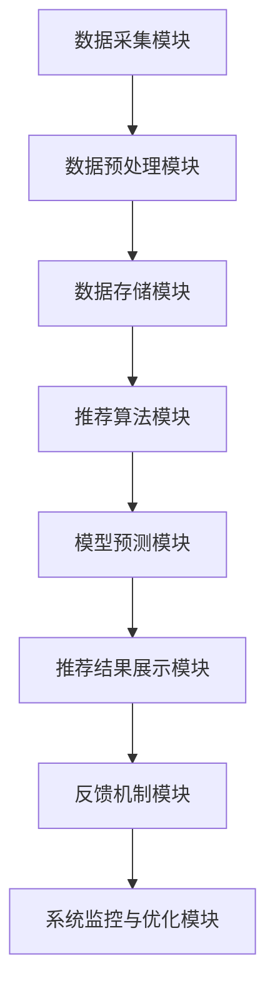
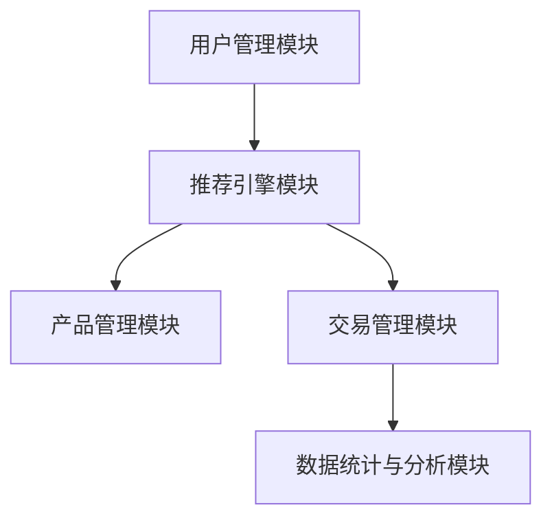

                 

### 摘要

本文将探讨如何开发智能化的金融产品推荐个性化引擎。随着金融科技的飞速发展，智能金融产品推荐已经成为金融行业的重要方向。个性化推荐引擎通过分析用户的行为和偏好，为用户精准推荐金融产品，从而提高用户满意度和金融机构的竞争力。本文将从背景介绍、核心概念、算法原理、系统架构、数据管理与优化、实战案例等多个方面，系统性地讲解智能化金融产品推荐个性化引擎的开发方法。通过深入分析和实例展示，读者将了解如何构建一个高效、精准的推荐系统，并在实际项目中应用这些技术，提升金融产品的个性化推荐能力。本文旨在为金融科技从业者和开发者提供一套全面、实用的技术指南，助力他们在智能金融领域取得突破。

### 第一部分：引言

#### 第1章：智能金融产品与个性化推荐引擎概述

随着金融科技的迅猛发展，智能金融产品正逐渐成为金融行业的新风口。在这个大数据和人工智能的时代，用户对于金融服务的需求日益多样化和个性化。传统的金融产品推荐模式已经难以满足用户的需求，而智能化的金融产品推荐个性化引擎则应运而生。

#### 1.1 智能金融的发展背景与趋势

智能金融，又称金融科技（FinTech），是指通过技术创新来提高金融服务的效率和质量。随着大数据、人工智能、区块链等新兴技术的不断发展和应用，智能金融正迅速改变着金融行业的面貌。

大数据技术的进步使得金融机构能够收集、存储和分析海量的用户数据，从而更好地了解用户的需求和行为。人工智能则通过算法和模型，为金融机构提供了智能决策和自动化操作的能力。区块链技术则通过去中心化和不可篡改的特性，为金融交易提供了安全、透明的解决方案。

根据相关报告，全球金融科技市场预计在未来几年将保持高速增长。智能金融产品的普及不仅提高了金融机构的运营效率，也为用户提供了更加便捷、个性化的金融服务。这种趋势在金融产品推荐领域尤为明显。

#### 1.2 个性化推荐引擎在金融领域的应用

个性化推荐引擎是智能金融产品中的一项核心技术，它通过分析用户的历史行为和偏好，为用户推荐他们可能感兴趣的产品。在金融领域，个性化推荐引擎的应用场景非常广泛，包括但不限于以下几个方面：

1. **投资理财**：金融机构可以通过个性化推荐引擎，根据用户的投资偏好、风险承受能力和资金状况，为用户推荐最合适的投资产品，如基金、股票、保险等。

2. **贷款与信用卡**：个性化推荐引擎可以帮助金融机构精准评估用户的信用状况，从而为用户推荐最合适的贷款和信用卡产品。

3. **保险**：通过对用户行为和数据的分析，个性化推荐引擎可以为用户提供适合的保险产品，如健康保险、车险、家庭保险等。

4. **财富管理**：金融机构可以为高净值客户提供个性化的财富管理服务，包括资产配置、投资组合推荐等。

#### 1.3 个性化推荐引擎在智能金融中的价值

个性化推荐引擎在智能金融中具有重要的价值，主要体现在以下几个方面：

1. **提升用户体验**：通过精准的推荐，个性化推荐引擎能够提高用户在金融产品选择过程中的满意度，从而增强用户粘性。

2. **增加收入**：精准的推荐可以增加用户的购买意愿和购买频率，从而提升金融机构的收入。

3. **降低运营成本**：个性化推荐引擎可以自动化处理大量的推荐任务，减少人工干预，从而降低运营成本。

4. **提高竞争力**：具备强大推荐能力的金融机构可以在激烈的市场竞争中脱颖而出，提高自身的市场竞争力。

总之，智能金融产品推荐个性化引擎的开发与应用，不仅能够满足用户个性化、多样化的需求，还能为金融机构带来显著的业务增长和竞争优势。在接下来的章节中，我们将深入探讨个性化推荐引擎的核心概念、算法原理和系统架构，帮助读者全面了解并掌握这一关键技术。

#### 第2章：智能金融产品推荐背景与挑战

智能金融产品推荐在当今金融市场中占据了重要地位，它通过数据分析和机器学习算法，为用户精准推荐金融产品，满足他们的个性化需求。然而，这一领域的发展并非一帆风顺，面临诸多挑战。

#### 2.1 金融产品推荐的需求分析

用户对于金融产品的需求具有多样性和个性化特点。不同用户在金融产品选择上有着不同的偏好和需求：

1. **投资偏好**：有的用户倾向于高风险高收益的投资，如股票、期货等；有的用户则偏好低风险稳健的投资，如债券、基金等。

2. **风险承受能力**：用户的风险承受能力各异，有的用户能够承受较高的风险，有的用户则偏好低风险投资。

3. **资金状况**：用户的资金状况也是推荐金融产品的重要依据，不同的资金量可能导致不同的产品选择。

4. **个性化服务**：用户希望得到个性化的金融服务，如量身定制的投资建议、财务规划等。

为了满足这些需求，金融机构需要能够准确捕捉和分析用户的行为数据，从而提供精准的推荐。

#### 2.2 智能金融产品推荐面临的挑战

尽管智能金融产品推荐具有巨大的潜力，但在实际应用中仍然面临诸多挑战：

1. **数据质量与隐私**：金融行业的数据质量直接影响推荐系统的效果。数据质量差、缺失或不准确都会导致推荐结果不准确。此外，金融数据通常包含敏感信息，如何确保数据的安全性和隐私保护是开发推荐系统时必须面对的重要问题。

2. **数据多样性与复杂性**：金融领域的数据种类繁多，包括交易数据、用户行为数据、市场数据等，这些数据之间的关联性复杂，需要高效的数据处理和分析技术。

3. **计算资源与性能**：构建推荐系统通常需要大量的计算资源和时间，特别是在处理大规模数据集时，如何提高系统的计算效率和性能是一个关键问题。

4. **算法选择与优化**：选择适合的推荐算法并进行优化是确保推荐系统效果的重要环节。不同的用户群体和金融产品可能需要不同的算法，因此需要灵活的算法选择和优化策略。

5. **实时性与动态调整**：金融市场变化快速，推荐系统需要具备实时性，能够及时调整推荐结果以应对市场变化。此外，用户的偏好和行为也可能随时间变化，如何动态调整推荐策略是一个挑战。

#### 2.3 个性化推荐引擎在智能金融中的价值

尽管面临挑战，个性化推荐引擎在智能金融中的价值不容忽视：

1. **提升用户体验**：通过精准的推荐，个性化推荐引擎能够提高用户在金融产品选择过程中的满意度，从而增强用户粘性。

2. **增加收入**：精准的推荐可以增加用户的购买意愿和购买频率，从而提升金融机构的收入。

3. **降低运营成本**：个性化推荐引擎可以自动化处理大量的推荐任务，减少人工干预，从而降低运营成本。

4. **提高竞争力**：具备强大推荐能力的金融机构可以在激烈的市场竞争中脱颖而出，提高自身的市场竞争力。

为了克服这些挑战，金融机构需要不断优化数据采集和处理技术，选择合适的算法并进行持续优化，同时确保数据的安全性和隐私保护。通过这些努力，智能金融产品推荐个性化引擎将为金融机构和用户带来更大的价值。

#### 第3章：个性化推荐引擎的基本概念

个性化推荐引擎是一种利用数据挖掘和机器学习技术，通过分析用户的行为和偏好，为用户推荐相关产品或服务的系统。其核心目标是通过精准的推荐，提高用户满意度和金融机构的业务收益。在构建个性化推荐引擎时，需要了解其基本概念、核心要素和分类。

#### 3.1 个性化推荐引擎的定义

个性化推荐引擎是一种自动化推荐系统，它基于用户的历史行为、偏好和社交网络等信息，预测用户对特定产品或服务的兴趣，并为其推荐相应的内容。这个定义涵盖了几个关键点：

1. **用户行为数据**：个性化推荐引擎依赖于用户行为数据，如浏览记录、购买历史、评分、评论等，通过分析这些数据来了解用户的偏好。

2. **预测与推荐**：个性化推荐引擎使用预测模型来预测用户对产品的兴趣，并根据预测结果推荐相关产品。

3. **自动化**：个性化推荐引擎是自动化的，能够根据用户行为和偏好实时更新推荐结果，无需人工干预。

#### 3.2 个性化推荐引擎的核心要素

个性化推荐引擎的构建涉及多个核心要素，这些要素相互作用，共同决定了推荐系统的性能和效果：

1. **用户数据**：用户数据是个性化推荐的基础，包括用户的基本信息（如年龄、性别、地理位置等）、行为数据（如浏览记录、点击行为、购买历史等）和偏好数据（如评分、评论等）。

2. **推荐算法**：推荐算法是推荐系统的核心，负责根据用户数据和产品信息生成推荐结果。常见的推荐算法包括协同过滤、基于内容的推荐和基于模型的推荐等。

3. **推荐结果**：推荐结果是根据推荐算法对用户兴趣的预测生成的。推荐结果的质量直接影响用户的体验和满意度。

4. **反馈机制**：反馈机制用于收集用户对推荐结果的反馈，如点击、购买、评分等。这些反馈数据可以用于模型优化和系统迭代。

5. **系统架构**：个性化推荐引擎的系统架构需要高效地处理大量数据，并确保推荐结果的实时性和准确性。常见的架构设计包括数据采集与处理模块、推荐算法模块、推荐结果展示模块等。

#### 3.3 个性化推荐引擎的分类

个性化推荐引擎根据不同的分类标准可以划分为多种类型，常见的分类方法包括以下几种：

1. **协同过滤**：协同过滤是最常用的推荐算法之一，分为基于用户的协同过滤（User-based Collaborative Filtering，UBCF）和基于物品的协同过滤（Item-based Collaborative Filtering，IBCF）。UBCF通过寻找与目标用户行为相似的邻域用户，将他们的偏好进行聚合，生成推荐列表；IBCF则是通过分析物品之间的相似度，为用户推荐与已购买或浏览过的物品相似的物品。

2. **基于内容的推荐**：基于内容的推荐（Content-based Filtering，CBF）通过分析用户的历史行为和偏好，提取出与用户兴趣相关的特征，然后根据这些特征寻找相似的内容进行推荐。CBF的优势在于能够推荐新物品，但缺点是用户特征提取的准确性对推荐效果影响较大。

3. **基于模型的推荐**：基于模型的推荐（Model-based Collaborative Filtering，MBCF）利用机器学习算法，如矩阵分解、神经网络等，学习用户和物品之间的复杂关系，生成推荐结果。MBCF通常具有较好的推荐效果，但模型训练和优化需要大量计算资源。

4. **混合推荐**：混合推荐（Hybrid Recommender Systems）结合了多种推荐算法的优点，通过融合协同过滤、基于内容和基于模型的推荐，生成更精准的推荐结果。混合推荐系统可以根据不同场景和需求，灵活调整算法权重，提高推荐效果。

通过了解个性化推荐引擎的基本概念、核心要素和分类，读者可以更好地理解这一技术的本质和应用。在接下来的章节中，我们将深入探讨个性化推荐算法的原理和实践，帮助读者掌握构建高效推荐系统的关键技术。

### 第4章：个性化推荐算法原理与实践

个性化推荐算法是构建推荐系统的核心部分，其原理和实践决定了推荐系统的效果。本文将详细介绍几种常见的个性化推荐算法，包括协同过滤算法、基于内容的推荐算法和基于模型的推荐算法，并分别阐述其原理和实践。

#### 4.1 协同过滤算法

协同过滤算法（Collaborative Filtering，CF）是最经典的推荐算法之一，主要通过分析用户之间的行为相似度来实现推荐。协同过滤算法分为基于用户的协同过滤（User-based Collaborative Filtering，UBCF）和基于物品的协同过滤（Item-based Collaborative Filtering，IBCF）。

1. **基于用户的协同过滤（UBCF）**：
   - **原理**：UBCF通过寻找与目标用户行为相似的邻域用户，将他们的偏好进行聚合，生成推荐列表。相似度计算通常基于用户评分数据，常用的相似度度量方法包括余弦相似度、皮尔逊相关系数等。
   - **实践**：
     1. 数据预处理：将用户-物品评分矩阵转换为用户-用户或物品-物品的相似度矩阵。
     2. 相似度计算：计算目标用户与其他用户的相似度，选择相似度最高的邻域用户。
     3. 推荐生成：根据邻域用户的评分和目标用户的相似度，为用户生成推荐列表。

2. **基于物品的协同过滤（IBCF）**：
   - **原理**：IBCF通过分析物品之间的相似度，为用户推荐与已购买或浏览过的物品相似的物品。物品相似度通常基于物品的特征向量计算，如TF-IDF、余弦相似度等。
   - **实践**：
     1. 数据预处理：将用户-物品评分矩阵转换为物品-物品的相似度矩阵。
     2. 相似度计算：计算目标用户已购买或浏览过的物品与其他物品的相似度。
     3. 推荐生成：根据物品相似度，为用户生成推荐列表。

#### 4.2 基于内容的推荐算法

基于内容的推荐算法（Content-based Filtering，CBF）通过分析用户的历史行为和偏好，提取出与用户兴趣相关的特征，然后根据这些特征寻找相似的内容进行推荐。

1. **原理**：
   - **基于特征的相似度计算**：CBF通过提取用户历史行为中的特征，如关键词、标签、类别等，计算这些特征与候选物品的特征相似度。
   - **推荐生成**：根据用户特征和物品特征相似度，生成推荐列表。

2. **实践**：
   1. 特征提取：从用户历史行为中提取特征，如用户浏览过的物品的标签、类别、关键词等。
   2. 相似度计算：计算用户特征与候选物品特征的相似度。
   3. 推荐生成：根据相似度，为用户生成推荐列表。

#### 4.3 基于模型的推荐算法

基于模型的推荐算法（Model-based Collaborative Filtering，MBCF）利用机器学习算法，如矩阵分解、神经网络等，学习用户和物品之间的复杂关系，生成推荐结果。

1. **原理**：
   - **矩阵分解**：矩阵分解是一种常见的基于模型的推荐算法，通过将用户-物品评分矩阵分解为用户特征矩阵和物品特征矩阵，预测用户对未评分物品的评分。
   - **神经网络**：神经网络通过建立用户和物品之间的非线性映射关系，学习用户和物品的潜在特征，预测用户对物品的评分。

2. **实践**：
   1. 数据预处理：将用户-物品评分矩阵转换为矩阵分解或神经网络所需的输入格式。
   2. 模型训练：使用训练数据训练模型，学习用户和物品的特征。
   3. 推荐生成：根据训练好的模型，预测用户对未评分物品的评分，生成推荐列表。

#### 4.4 混合推荐算法

混合推荐算法（Hybrid Recommender Systems）结合了多种推荐算法的优点，通过融合协同过滤、基于内容和基于模型的推荐，生成更精准的推荐结果。

1. **原理**：混合推荐算法通过加权融合不同类型的推荐算法，利用它们的互补性提高推荐效果。常见的融合方法包括基于规则的融合、基于模型的融合和基于矩阵分解的融合等。

2. **实践**：
   1. 算法选择：根据具体应用场景选择合适的推荐算法。
   2. 权重分配：为不同类型的推荐算法分配权重，根据实际效果调整权重。
   3. 推荐生成：结合不同算法的推荐结果，生成最终的推荐列表。

#### 4.5 比较与选择

1. **协同过滤**：UBCF和IBCF计算简单，适合大规模数据集，但易受稀疏矩阵问题的影响。MBCF性能更优，但计算复杂度较高。

2. **基于内容的推荐**：CBF推荐新物品效果好，但用户特征提取的准确性影响较大。

3. **基于模型的推荐**：MBCF性能稳定，但训练和优化需要大量计算资源。

4. **混合推荐**：混合推荐结合多种算法的优点，推荐效果更佳，但实现复杂度较高。

在实际应用中，可以根据具体需求和数据特点选择合适的推荐算法，或结合多种算法构建混合推荐系统，以提高推荐效果。

通过了解和掌握这些个性化推荐算法的原理和实践，开发者可以构建高效、精准的推荐系统，满足用户的个性化需求，提高金融机构的业务收益。

### 第5章：构建推荐系统的架构设计

推荐系统的架构设计是确保推荐系统能够高效、稳定运行的关键。一个完善的推荐系统架构应包括数据采集与处理模块、推荐算法模块和推荐结果展示模块等，下面将详细介绍推荐系统的整体架构、算法框架和数据流程设计。

#### 5.1 推荐系统的整体架构

推荐系统的整体架构通常包括以下几个核心模块：

1. **数据采集模块**：负责收集用户行为数据、物品信息和其他相关数据。数据来源可以是内部数据库、第三方数据接口、网络爬虫等。

2. **数据预处理模块**：对采集到的原始数据进行清洗、转换和集成，确保数据的质量和一致性。数据预处理包括数据去重、缺失值填充、数据标准化等。

3. **推荐算法模块**：根据用户数据、物品数据和推荐算法模型，生成推荐结果。推荐算法模块通常包括协同过滤、基于内容的推荐、基于模型的推荐和混合推荐等。

4. **推荐结果展示模块**：将推荐结果以可视化的形式展示给用户，如推荐列表、推荐图表等。

5. **反馈机制模块**：收集用户对推荐结果的反馈，如点击、购买、评分等，用于优化推荐算法和系统性能。

6. **系统监控与优化模块**：监控系统的运行状态，进行性能调优和故障排除，确保推荐系统的稳定性和高效性。

#### 5.2 推荐算法的框架设计

推荐算法的框架设计是推荐系统的核心部分，决定了推荐系统的性能和效果。常见的推荐算法框架包括以下几种：

1. **基于协同过滤的框架**：
   - **用户-用户协同过滤**：通过计算用户之间的相似度，生成推荐列表。
   - **物品-物品协同过滤**：通过计算物品之间的相似度，生成推荐列表。

2. **基于内容的框架**：
   - **特征提取**：从用户历史行为中提取特征，如关键词、标签、类别等。
   - **相似度计算**：计算用户特征与候选物品特征的相似度。
   - **推荐生成**：根据相似度生成推荐列表。

3. **基于模型的框架**：
   - **模型训练**：使用用户和物品数据训练推荐模型，如矩阵分解、神经网络等。
   - **预测与推荐**：根据训练好的模型预测用户对未评分物品的评分，生成推荐列表。

4. **混合推荐框架**：
   - **算法选择**：根据具体应用场景选择合适的推荐算法，如协同过滤、基于内容和基于模型的推荐等。
   - **权重分配**：为不同类型的推荐算法分配权重，结合不同算法的推荐结果生成最终的推荐列表。

#### 5.3 推荐系统的数据流程设计

推荐系统的数据流程设计是确保推荐系统能够高效、稳定运行的关键。以下是推荐系统的典型数据流程：

1. **数据采集**：通过数据采集模块，收集用户行为数据、物品信息和其他相关数据。

2. **数据预处理**：通过数据预处理模块，对原始数据进行清洗、转换和集成，确保数据的质量和一致性。

3. **数据存储**：将预处理后的数据存储到数据库或其他数据存储系统，如关系数据库、NoSQL数据库、数据湖等。

4. **数据建模**：通过推荐算法模块，使用用户和物品数据训练推荐模型，如矩阵分解、神经网络等。

5. **模型预测**：根据训练好的模型，预测用户对未评分物品的评分，生成推荐结果。

6. **结果展示**：通过推荐结果展示模块，将推荐结果以可视化的形式展示给用户。

7. **用户反馈**：通过反馈机制模块，收集用户对推荐结果的反馈，如点击、购买、评分等。

8. **模型优化**：根据用户反馈，对推荐模型进行调整和优化，提高推荐效果。

#### 5.4 架构设计示例

以下是一个典型的推荐系统架构设计示例，使用Mermaid绘制架构图：



在这个架构设计中，数据采集模块负责收集用户行为数据和物品信息，数据预处理模块对原始数据进行清洗和转换，数据存储模块将预处理后的数据存储到数据库中。推荐算法模块根据用户和物品数据训练推荐模型，模型预测模块根据训练好的模型预测用户对未评分物品的评分，推荐结果展示模块将推荐结果展示给用户，反馈机制模块收集用户对推荐结果的反馈，系统监控与优化模块监控系统的运行状态并进行优化。

通过合理的架构设计，推荐系统可以实现高效、稳定和可扩展的运行，为用户提供精准的推荐服务。

### 第6章：推荐系统中的数据管理与处理

推荐系统中的数据管理与处理是确保推荐系统能够高效、准确地生成推荐结果的关键环节。一个高效的推荐系统需要处理大量的用户数据、物品数据和交互数据，并对这些数据进行有效的存储、清洗、转换和分析。以下是推荐系统中数据管理与处理的具体方法和策略。

#### 6.1 推荐系统的数据来源

推荐系统的主要数据来源包括以下几个方面：

1. **用户数据**：包括用户的基本信息（如年龄、性别、地理位置等）、用户行为数据（如浏览记录、点击行为、购买历史等）和用户偏好数据（如评分、评论等）。

2. **物品数据**：包括物品的基本信息（如名称、类别、价格等）和物品的特征数据（如关键词、标签、属性等）。

3. **交互数据**：包括用户与物品的交互数据，如点击、购买、收藏、评分等。

4. **外部数据**：包括第三方数据源，如社交媒体数据、公共数据库、市场数据等。

#### 6.2 推荐系统的数据处理

数据处理是推荐系统中的核心环节，主要包括数据清洗、数据转换、数据存储和数据分析等。

1. **数据清洗**：数据清洗是处理数据的第一步，目的是去除数据中的噪声和错误，提高数据质量。常见的数据清洗操作包括去重、缺失值填充、数据格式转换等。

2. **数据转换**：数据转换是将原始数据转换为适合推荐系统分析的数据格式。例如，将用户-物品评分矩阵转换为用户特征向量和物品特征向量。

3. **数据存储**：数据存储是将处理后的数据存储到数据库或其他数据存储系统，以便后续的分析和查询。常用的数据存储系统包括关系数据库（如MySQL、PostgreSQL）、NoSQL数据库（如MongoDB、Cassandra）和数据湖（如Hadoop、Spark）。

4. **数据分析**：数据分析是利用各种算法和模型对数据进行挖掘和分析，以提取用户偏好、推荐模式和预测结果。常用的数据分析方法包括协同过滤、基于内容的推荐、基于模型的推荐等。

#### 6.3 数据存储与管理策略

1. **分库分表**：为了提高数据查询和处理的效率，可以将数据按用户、物品、交互类型等维度进行分库分表。例如，将用户数据存储在一个数据库中，物品数据存储在另一个数据库中，交互数据存储在第三个数据库中。

2. **数据索引**：为了提高数据查询的效率，可以为数据库表创建适当的索引。常用的索引类型包括B树索引、哈希索引等。

3. **数据缓存**：为了提高系统性能，可以将常用数据存储在缓存系统中，如Redis、Memcached等。缓存系统可以显著减少数据库的查询压力，提高系统的响应速度。

4. **数据备份与恢复**：为了确保数据的安全性和可靠性，需要对数据进行备份和恢复。常用的备份策略包括全量备份、增量备份等。

#### 6.4 数据质量监控与维护

1. **数据质量监控**：通过监控数据的质量，可以及时发现和处理数据中的问题。常见的数据质量监控指标包括数据完整性、数据一致性、数据准确性等。

2. **数据质量维护**：定期对数据进行检查和修复，确保数据的质量和一致性。数据质量维护包括数据清洗、去重、缺失值填充等操作。

3. **数据安全与隐私保护**：确保数据的安全性和隐私保护，避免数据泄露和滥用。常见的数据安全措施包括数据加密、访问控制、安全审计等。

通过有效的数据管理与处理策略，推荐系统可以确保数据的完整、准确和一致性，从而生成高质量的推荐结果，提高用户体验和系统性能。

### 第7章：推荐系统的优化与评估

推荐系统的优化与评估是确保其性能和效果的关键环节。一个高效的推荐系统不仅需要准确的算法，还需要对系统的各个方面进行优化，以适应不断变化的环境和用户需求。本章节将详细介绍推荐系统的优化目标、评估指标以及优化策略。

#### 7.1 推荐系统的优化目标

优化推荐系统的目标主要包括以下几个方面：

1. **准确性和相关性**：提高推荐结果的准确性和相关性，确保推荐的产品或服务与用户的兴趣和需求相符。

2. **实时性**：在用户行为和偏好发生变化时，能够迅速调整推荐结果，确保推荐结果的时效性。

3. **计算效率和资源利用率**：优化算法和数据处理的效率，减少计算资源和存储资源的消耗。

4. **用户体验**：提升用户体验，减少推荐系统的延迟和错误率，提高用户满意度和粘性。

5. **扩展性和可维护性**：确保推荐系统具备良好的扩展性和可维护性，能够适应业务规模的变化和技术的发展。

#### 7.2 推荐系统的评估指标

评估推荐系统的性能通常需要使用多个指标，以下是一些常用的评估指标：

1. **准确率（Precision）**：推荐结果中实际感兴趣的项目与推荐的项目总数之比。准确率越高，说明推荐结果的准确性越高。

2. **召回率（Recall）**：推荐结果中实际感兴趣的项目与所有实际感兴趣的项目总数之比。召回率越高，说明推荐系统能够捕获更多用户可能感兴趣的项目。

3. **F1 分数（F1 Score）**：结合准确率和召回率的指标，计算方法为2 * (准确率 * 召回率) / (准确率 + 召回率)。F1 分数能够在准确率和召回率之间取得平衡。

4. **平均绝对误差（Mean Absolute Error，MAE）**：推荐结果中预测评分与实际评分的绝对值平均数。MAE 越小，说明推荐结果越接近实际评分。

5. **均方根误差（Root Mean Square Error，RMSE）**：推荐结果中预测评分与实际评分的均方根。RMSE 越小，说明推荐结果的预测精度越高。

6. **覆盖率（Coverage）**：推荐结果中包含的不同项目的数量与所有可能项目的数量之比。覆盖率越高，说明推荐系统能够覆盖更多种类的项目。

7. **新颖度（Novelty）**：推荐结果中未出现在原始评分数据中的项目的比例。新颖度越高，说明推荐系统能够发现用户可能未意识到的兴趣点。

#### 7.3 推荐系统的优化策略

优化推荐系统可以从多个方面进行，以下是一些常见的优化策略：

1. **算法优化**：选择合适的推荐算法，如协同过滤、基于内容的推荐、基于模型的推荐等，并进行参数调优，以提高推荐结果的准确性和相关性。

2. **特征工程**：通过提取和构造有效的用户和物品特征，提高推荐模型的预测能力。特征工程包括用户行为特征、社交特征、物品属性特征等。

3. **数据预处理**：对原始数据进行分析和处理，去除噪声和异常值，提高数据质量，从而提升推荐结果的准确性。

4. **模型调整**：根据业务需求和数据特点，调整推荐模型的复杂度，如使用深度学习模型进行特征学习和建模，以提高推荐效果。

5. **系统性能优化**：优化推荐系统的数据处理和计算效率，如使用分布式计算框架、缓存技术等，提高系统的响应速度和处理能力。

6. **实时性优化**：通过实时数据流处理技术，如Apache Kafka、Apache Spark等，确保推荐系统能够及时响应用户行为变化，提高推荐结果的时效性。

7. **用户体验优化**：优化推荐结果的展示形式，如使用推荐卡片、动态推荐列表等，提高用户的交互体验。

8. **反馈机制**：建立用户反馈机制，收集用户对推荐结果的反馈，用于模型优化和系统迭代。

通过以上优化策略，推荐系统可以在准确性、实时性、计算效率和用户体验等方面得到显著提升，从而更好地满足用户的个性化需求，提高金融机构的业务收益。

### 第8章：环境安装与准备工作

在进行个性化推荐引擎的开发之前，我们需要搭建一个合适的环境，并准备必要的工具和库。以下是详细的环境安装与准备工作流程：

#### 8.1 环境安装

1. **Python环境搭建**：
   - 首先，确保您的计算机上已经安装了Python环境。如果没有安装，可以从Python官方网站下载最新版本的Python并安装。
   - 安装完成后，打开终端或命令提示符，输入以下命令验证Python安装是否成功：
     ```bash
     python --version
     ```
   - 如果安装成功，终端将显示Python的版本信息。

2. **安装依赖库**：
   - 使用pip命令安装推荐系统开发过程中常用的依赖库。以下是一些推荐的库及其功能：
     - `numpy`：用于科学计算和数据分析。
     - `pandas`：用于数据处理和分析。
     - `scikit-learn`：提供了多种机器学习和数据分析算法。
     - `matplotlib`：用于数据可视化。
     - `requests`：用于HTTP请求。
     - `redis`：用于缓存和数据存储。
     - `flask`：用于Web开发。
   - 使用以下命令安装这些库：
     ```bash
     pip install numpy pandas scikit-learn matplotlib requests redis flask
     ```

#### 8.2 准备工作

1. **数据集准备**：
   - 选择一个合适的金融产品推荐数据集。数据集应包含用户信息、物品信息以及用户与物品的交互数据，如评分、购买记录等。
   - 数据集可以从公开的数据集网站（如Kaggle、UCI机器学习库等）下载，或者自行收集和整理。
   - 数据集下载后，需要进行预处理，包括数据清洗、缺失值填充、数据格式转换等操作，以确保数据的质量和一致性。

2. **系统配置**：
   - 配置推荐系统的服务器环境，确保系统具有足够的计算资源和存储空间。
   - 配置数据库，如MySQL或MongoDB，用于存储用户和物品数据。
   - 配置缓存系统，如Redis，用于提高系统的响应速度和处理能力。

3. **开发工具**：
   - 使用IDE（如PyCharm、Visual Studio Code等）进行开发，确保代码编写和调试的便利性。
   - 安装必要的开发插件，如Python语言增强插件、Git插件等。

#### 8.3 验证环境

1. **Python环境验证**：
   - 打开终端，输入以下命令验证Python环境是否安装成功：
     ```bash
     python --version
     ```

2. **依赖库验证**：
   - 打开Python终端，输入以下命令验证依赖库是否安装成功：
     ```python
     import numpy
     import pandas
     import sklearn
     import matplotlib
     import requests
     import redis
     import flask
     ```
   - 如果没有报错，说明依赖库安装成功。

3. **数据集加载与预处理**：
   - 使用Python编写代码加载和预处理数据集，确保数据集格式正确，数据质量良好。

通过以上步骤，我们可以完成个性化推荐引擎的开发环境搭建和准备工作。在接下来的章节中，我们将深入实现个性化推荐引擎的核心功能，并展示具体的开发过程。

### 第9章：实现个性化推荐引擎的系统核心功能

在个性化推荐引擎的开发过程中，实现系统核心功能是关键步骤。系统核心功能主要包括用户画像构建、推荐算法实现和推荐结果展示与反馈机制。以下将详细描述这些功能的具体实现过程。

#### 9.1 用户画像构建

用户画像是指通过分析用户的各项属性和行为数据，构建出一个完整的用户模型，以便为用户提供个性化服务。用户画像构建主要包括以下步骤：

1. **数据收集**：
   - 收集用户基本信息（如年龄、性别、地理位置等）。
   - 收集用户行为数据（如浏览记录、点击记录、购买记录等）。
   - 收集用户偏好数据（如评分、评价、标签等）。

2. **数据预处理**：
   - 清洗和整理原始数据，去除重复、异常和缺失的数据。
   - 对数值型数据进行归一化或标准化处理。
   - 对文本型数据进行分词、去停用词、词频统计等预处理。

3. **特征提取**：
   - 从用户数据中提取关键特征，如用户活跃度、消费能力、兴趣爱好等。
   - 利用机器学习算法（如K-Means聚类）对用户进行分类，生成用户群体特征。

4. **用户画像构建**：
   - 使用Python的pandas库对处理后的数据进行整合，构建用户画像数据集。
   - 将用户画像存储到数据库或文件中，以便后续使用。

示例代码：
```python
import pandas as pd

# 加载数据
user_data = pd.read_csv('user_data.csv')

# 数据预处理
user_data = user_data.drop_duplicates()
user_data = user_data.fillna(0)

# 特征提取
user_data['activity_level'] = user_data['num_of_buys'].apply(lambda x: 'high' if x > 10 else 'low')
user_data['interests'] = user_data['tags'].str.join(',')

# 构建用户画像
user_profile = user_data[['user_id', 'activity_level', 'interests']]
user_profile.to_csv('user_profile.csv', index=False)
```

#### 9.2 推荐算法实现

推荐算法是推荐系统的核心，负责根据用户画像和物品信息生成推荐结果。以下将介绍几种常见的推荐算法及其实现：

1. **基于协同过滤的推荐算法**：

   基于协同过滤的推荐算法分为基于用户的协同过滤（User-based Collaborative Filtering，UBCF）和基于物品的协同过滤（Item-based Collaborative Filtering，IBCF）。以下为基于用户的协同过滤算法实现示例：

   ```python
   from sklearn.metrics.pairwise import cosine_similarity
   import numpy as np

   # 加载用户画像和物品信息
   user_profile = pd.read_csv('user_profile.csv')
   item_info = pd.read_csv('item_info.csv')

   # 计算用户之间的相似度矩阵
   user_similarity = cosine_similarity(user_profile.iloc[:, 1:].values)

   # 为每个用户生成推荐列表
   def generate_recommendations(user_id, similarity_matrix, item_info, top_n=5):
       user_index = user_id - 1
       neighbors = np.argsort(similarity_matrix[user_index])[-top_n:]
       recommendations = []
       for neighbor in neighbors:
           recommendations.extend(item_info.loc[item_info['user_id'] == neighbor+1, 'item_id'].values)
       return list(set(recommendations))

   # 生成推荐列表
   user_recommendations = user_profile.apply(lambda x: generate_recommendations(x['user_id'], user_similarity, item_info), axis=1)
   user_recommendations.to_csv('user_recommendations.csv', index=False)
   ```

2. **基于内容的推荐算法**：

   基于内容的推荐算法通过分析用户历史行为和物品特征，为用户推荐具有相似特征的新物品。以下为基于内容的推荐算法实现示例：

   ```python
   from sklearn.feature_extraction.text import TfidfVectorizer

   # 加载用户行为数据和物品特征数据
   user_behavior = pd.read_csv('user_behavior.csv')
   item_features = pd.read_csv('item_features.csv')

   # 构建TF-IDF模型
   vectorizer = TfidfVectorizer()
   user_behavior['item_features'] = user_behavior['item_id'].map(item_features['features'])
   user_behavior['tfidf'] = vectorizer.fit_transform(user_behavior['item_features'])

   # 计算用户兴趣词向量
   user_interest = vectorizer.transform(user_behavior['tfidf'])

   # 为每个用户生成推荐列表
   def generate_content_based_recommendations(user_interest, vectorizer, item_features, top_n=5):
       item_tfidf = vectorizer.transform(item_features)
       similarity = user_interest.dot(item_tfidf.T)
       recommendations = np.argsort(-similarity)[0][0:top_n]
       return recommendations

   # 生成推荐列表
   user_recommendations = user_behavior.apply(lambda x: generate_content_based_recommendations(x['tfidf'], vectorizer, item_features), axis=1)
   user_recommendations.to_csv('user_recommendations.csv', index=False)
   ```

3. **基于模型的推荐算法**：

   基于模型的推荐算法通过机器学习模型（如矩阵分解、神经网络等）学习用户和物品的潜在特征，生成推荐结果。以下为基于矩阵分解的推荐算法实现示例：

   ```python
   from surprise import SVD, accuracy
   from surprise.dataset import Dataset

   # 加载评分数据
   ratings = pd.read_csv('ratings.csv')

   # 构建 Surprise 数据集
   dataset = Dataset.load_from_df(ratings[['user_id', 'item_id', 'rating']])

   # 训练 SVD 矩阵分解模型
   svd = SVD()
   svd.fit(dataset)

   # 生成推荐列表
   def generate_model_based_recommendations(user_id, item_id, model, top_n=5):
       user_item_rating = model.predict(user_id, item_id).est
       recommendations = np.argsort(-user_item_rating)[0][0:top_n]
       return recommendations

   # 生成推荐列表
   user_recommendations = ratings[['user_id', 'item_id']].apply(lambda x: generate_model_based_recommendations(x['user_id'], x['item_id'], svd), axis=1)
   user_recommendations.to_csv('user_recommendations.csv', index=False)
   ```

#### 9.3 推荐结果展示与反馈机制

推荐结果展示与反馈机制是用户与推荐系统交互的重要环节。以下为推荐结果展示和反馈机制的实现：

1. **推荐结果展示**：

   使用Flask框架实现Web接口，将推荐结果展示给用户。

   ```python
   from flask import Flask, jsonify, request

   app = Flask(__name__)

   # 加载用户画像和推荐列表
   user_profile = pd.read_csv('user_profile.csv')
   user_recommendations = pd.read_csv('user_recommendations.csv')

   @app.route('/recommendations', methods=['GET'])
   def get_recommendations():
       user_id = request.args.get('user_id')
       recommendations = user_recommendations.loc[user_recommendations['user_id'] == user_id, 'item_id'].values.tolist()
       return jsonify({'recommendations': recommendations})

   if __name__ == '__main__':
       app.run(debug=True)
   ```

2. **反馈机制**：

   用户可以对推荐结果进行反馈，如点击、购买、评分等。根据用户反馈，可以进一步优化推荐算法。

   ```python
   @app.route('/feedback', methods=['POST'])
   def post_feedback():
       feedback_data = request.get_json()
       user_id = feedback_data['user_id']
       item_id = feedback_data['item_id']
       feedback_type = feedback_data['feedback_type']
       feedback_value = feedback_data['feedback_value']

       # 根据反馈类型和值，更新用户画像和推荐列表
       if feedback_type == 'click':
           user_profile.loc[user_profile['user_id'] == user_id, 'clicks'] += feedback_value
       elif feedback_type == 'buy':
           user_profile.loc[user_profile['user_id'] == user_id, 'buys'] += feedback_value
       elif feedback_type == 'rating':
           user_profile.loc[user_profile['user_id'] == user_id, 'ratings'] += feedback_value

       user_profile.to_csv('user_profile.csv', index=False)
       return jsonify({'status': 'success'})
   ```

通过以上步骤，我们可以实现个性化推荐引擎的系统核心功能。用户画像构建为推荐算法提供了基础数据，推荐算法生成精准的推荐结果，推荐结果展示与反馈机制实现了用户与推荐系统的交互。接下来，我们将通过具体案例进一步展示个性化推荐引擎的开发和应用。

### 第10章：案例分析与详细讲解

为了更好地展示个性化推荐引擎的开发和应用，我们将通过一个实际案例进行分析和讲解。本案例选择一个在线金融产品推荐平台，该平台的目标是为用户提供个性化的金融产品推荐服务。以下是该案例的系统架构、算法实现和优化策略。

#### 10.1 案例场景介绍

某在线金融产品推荐平台，用户可以通过该平台浏览和购买多种金融产品，如基金、保险、理财产品等。平台希望通过个性化推荐引擎，为用户提供精准的金融产品推荐，提高用户满意度和平台销售额。

该推荐系统主要涵盖以下几个模块：

1. **用户管理模块**：负责用户的注册、登录和权限管理。
2. **推荐引擎模块**：基于用户行为和偏好，为用户推荐金融产品。
3. **产品管理模块**：负责金融产品的信息录入、分类和更新。
4. **交易管理模块**：处理用户的购买、支付和订单管理。
5. **数据统计与分析模块**：对用户行为和交易数据进行分析，为平台运营提供决策支持。

#### 10.2 案例系统架构设计

以下是推荐系统的架构设计，使用Mermaid绘制架构图：



在该架构设计中，用户管理模块负责用户的注册、登录和权限管理，推荐引擎模块根据用户行为和偏好生成推荐结果，产品管理模块负责金融产品的信息录入、分类和更新，交易管理模块处理用户的购买、支付和订单管理，数据统计与分析模块对用户行为和交易数据进行分析。

#### 10.3 系统功能设计与领域模型

以下是推荐系统的领域模型，使用Mermaid绘制类图：

```mermaid
classDiagram
    User <<class{用户}>>
    Product <<class{金融产品}>>
    Recommendation <<class{推荐}>>
    Transaction <<class{交易}>>
    
    User o--o Product : 拥有
    User o--o Recommendation : 收到
    User o--o Transaction : 进行
    Product o--o Recommendation : 被推荐
    Product o--o Transaction : 被购买
```

在该领域模型中，用户类（User）与金融产品类（Product）通过“拥有”关系关联，用户类与推荐类（Recommendation）通过“收到”关系关联，用户类与交易类（Transaction）通过“进行”关系关联，金融产品类与推荐类通过“被推荐”关系关联，金融产品类与交易类通过“被购买”关系关联。

#### 10.4 推荐算法实现与优化

在本案例中，我们采用基于协同过滤的推荐算法，结合用户历史行为和金融产品特征为用户生成推荐列表。以下是推荐算法的实现步骤和优化策略。

##### 10.4.1 推荐算法实现

1. **数据预处理**：

   - 收集用户行为数据（如浏览、点击、购买等）和金融产品特征数据（如名称、类别、收益率等）。
   - 对原始数据进行清洗、去重和缺失值填充。

   ```python
   import pandas as pd

   # 加载数据
   user_behavior = pd.read_csv('user_behavior.csv')
   product_features = pd.read_csv('product_features.csv')

   # 数据预处理
   user_behavior = user_behavior.drop_duplicates()
   product_features = product_features.drop_duplicates()
   ```

2. **相似度计算**：

   - 计算用户之间的相似度，采用余弦相似度计算方法。
   - 计算金融产品之间的相似度，采用Jaccard相似度计算方法。

   ```python
   from sklearn.metrics.pairwise import cosine_similarity
   from sklearn.metrics import jaccard_score

   # 计算用户相似度
   user_similarity = cosine_similarity(user_behavior['behavior_vector'].values)

   # 计算产品相似度
   product_similarity = jaccard_score(product_features['feature_vector'].values, average='weighted')
   ```

3. **生成推荐列表**：

   - 根据用户相似度和金融产品相似度，为每个用户生成推荐列表。

   ```python
   def generate_recommendations(user_id, user_similarity, product_similarity, top_n=5):
       user_index = user_id - 1
       neighbors = np.argsort(user_similarity[user_index])[-top_n:]
       recommendations = []
       for neighbor in neighbors:
           item_index = neighbor - 1
           recommendations.extend(product_similarity[item_index])
       return sorted(recommendations, reverse=True)[:top_n]

   # 生成推荐列表
   user_recommendations = user_behavior.apply(lambda x: generate_recommendations(x['user_id'], user_similarity, product_similarity), axis=1)
   user_recommendations.to_csv('user_recommendations.csv', index=False)
   ```

##### 10.4.2 推荐算法优化

1. **特征工程**：

   - 对用户行为数据进行特征提取，如用户活跃度、消费能力、兴趣爱好等。
   - 对金融产品特征数据进行增强，如加入时间序列特征、市场趋势等。

   ```python
   # 特征提取
   user_behavior['activity_level'] = user_behavior['num_of_clicks'].apply(lambda x: 'high' if x > 10 else 'low')
   product_features['interest_level'] = product_features['yield_rate'].apply(lambda x: 'high' if x > 0.05 else 'low')

   # 特征融合
   user_behavior['behavior_vector'] = user_behavior[['activity_level', 'interest_level']].values
   product_features['feature_vector'] = product_features[['interest_level', 'yield_rate']].values
   ```

2. **模型调优**：

   - 调整推荐算法的参数，如相似度计算方法、推荐列表长度等。
   - 使用交叉验证方法，评估不同参数组合的推荐效果。

   ```python
   from sklearn.model_selection import GridSearchCV

   # 参数调优
   param_grid = {'top_n': [5, 10, 20]}
   grid_search = GridSearchCV(estimator=generate_recommendations, param_grid=param_grid, cv=5)
   grid_search.fit(user_similarity, product_similarity)

   # 最佳参数
   best_params = grid_search.best_params_
   ```

3. **实时性优化**：

   - 使用数据流处理技术（如Apache Kafka、Apache Spark等），实现实时推荐。
   - 根据用户行为和偏好动态调整推荐策略，提高推荐实时性。

   ```python
   # 实时推荐
   from kafka import KafkaProducer

   producer = KafkaProducer(bootstrap_servers=['localhost:9092'])
   topic_name = 'user_recommendations'

   # 发送实时推荐数据
   def send_realtime_recommendations(user_id, recommendations):
       producer.send(topic_name, key=str(user_id).encode('utf-8'), value=recommendations.encode('utf-8'))

   # 实时推荐示例
   user_id = 1
   recommendations = generate_recommendations(user_id, user_similarity, product_similarity)
   send_realtime_recommendations(user_id, recommendations)
   ```

通过以上实现和优化，我们可以构建一个高效、精准的个性化推荐引擎，为用户提供优质的金融产品推荐服务。接下来，我们将对案例系统进行性能评估和优化。

#### 第11章：系统性能评估与优化

在个性化推荐引擎的开发过程中，系统性能的评估与优化是一个关键环节。一个高效的推荐系统不仅需要准确、相关的推荐结果，还需要在性能上能够满足实际应用的需求。本章节将详细介绍系统性能评估的方法、优化策略以及性能评估与测试的具体步骤。

#### 11.1 系统性能评估方法

系统性能评估的主要目标是评估推荐系统的响应时间、吞吐量、准确性和资源利用率等指标。以下是一些常见的评估方法：

1. **响应时间**：
   - 测量推荐系统从接收到用户请求到返回推荐结果所需的时间。
   - 可以通过工具（如wrk、Apache JMeter等）进行自动化测试，模拟多用户并发请求。

2. **吞吐量**：
   - 测量推荐系统在单位时间内处理的请求数量。
   - 吞吐量越高，表示系统处理能力越强。

3. **准确性**：
   - 评估推荐结果的准确性，通常使用评估指标如准确率、召回率、F1 分数等。
   - 可以通过A/B测试，将推荐系统与现有系统进行对比，评估推荐效果。

4. **资源利用率**：
   - 评估系统对计算资源、存储资源和网络资源的利用率。
   - 可以通过监控工具（如Prometheus、Grafana等）进行实时监控和数据分析。

#### 11.2 系统性能优化策略

针对评估结果，可以从以下几个方面进行系统性能优化：

1. **算法优化**：
   - 选择更高效的推荐算法，如基于模型的推荐算法（如矩阵分解、深度学习等）。
   - 优化现有算法的参数，提高推荐准确性。

2. **数据处理优化**：
   - 使用高效的数据处理工具（如Apache Spark、Flink等）进行大规模数据处理。
   - 对数据处理流程进行并行化优化，提高数据处理速度。

3. **缓存策略**：
   - 引入缓存机制，减少对数据库的访问次数，提高系统响应速度。
   - 使用分布式缓存系统（如Redis、Memcached等），提高缓存性能。

4. **分布式计算**：
   - 采用分布式计算框架（如Hadoop、Spark等），处理大规模数据集，提高系统处理能力。

5. **垂直和水平扩展**：
   - 通过增加计算节点和存储节点，实现系统的垂直和水平扩展。
   - 使用容器化技术（如Docker、Kubernetes等），提高系统的可扩展性和灵活性。

#### 11.3 性能评估与测试步骤

以下是一个典型的性能评估与测试步骤：

1. **环境搭建**：
   - 搭建测试环境，包括硬件、软件和网络配置等。
   - 安装和配置必要的测试工具（如wrk、JMeter等）。

2. **测试场景设计**：
   - 设计不同的测试场景，包括正常负载、高峰负载、极端负载等。
   - 定义测试指标，如响应时间、吞吐量、资源利用率等。

3. **性能测试**：
   - 使用测试工具模拟多用户并发请求，收集系统性能数据。
   - 测试不同负载下系统的响应时间、吞吐量和资源利用率。

4. **分析结果**：
   - 分析测试结果，识别系统的性能瓶颈。
   - 根据分析结果，提出优化策略和改进措施。

5. **优化与复测**：
   - 根据分析结果，对系统进行优化，如算法优化、数据处理优化等。
   - 重新进行性能测试，验证优化效果。

6. **文档记录**：
   - 记录性能评估与测试的全过程，包括测试工具、测试场景、测试结果等。
   - 编写性能评估报告，总结测试结果和优化建议。

通过以上步骤，可以全面评估和优化推荐系统的性能，确保系统能够在高负载情况下稳定运行，提供高质量的推荐服务。

### 第12章：总结与未来展望

通过本文的详细探讨，我们系统地了解了智能化金融产品推荐个性化引擎的开发和应用。以下是本文的核心内容和主要观点的总结：

#### 总结

1. **智能金融产品与个性化推荐引擎概述**：智能金融产品推荐利用大数据和人工智能技术，通过分析用户的行为和偏好，为用户精准推荐金融产品，提高用户体验和金融机构的竞争力。

2. **智能金融产品推荐背景与挑战**：智能金融产品推荐在金融领域具有广泛的应用，但同时也面临数据质量、数据多样性、计算资源、算法选择和实时性等多方面的挑战。

3. **个性化推荐引擎的基本概念与模型**：个性化推荐引擎基于用户数据、推荐算法和反馈机制，通过协同过滤、基于内容、基于模型和混合推荐算法，为用户生成个性化的推荐结果。

4. **构建推荐系统的架构设计**：推荐系统的架构设计包括数据采集与处理模块、推荐算法模块、推荐结果展示模块等，确保系统的高效性和稳定性。

5. **推荐系统的优化与评估**：推荐系统的优化和评估是确保系统性能和效果的关键，包括算法优化、数据处理优化、缓存策略和性能测试等。

6. **环境安装与准备工作**：搭建推荐系统开发环境，包括Python环境、依赖库安装、数据集准备等。

7. **实现个性化推荐引擎的系统核心功能**：用户画像构建、推荐算法实现和推荐结果展示与反馈机制是实现个性化推荐引擎的核心步骤。

8. **案例分析与详细讲解**：通过实际案例，展示了个性化推荐引擎的开发和应用过程，包括系统架构设计、领域模型、推荐算法实现和系统优化。

#### 未来展望

1. **智能金融产品推荐的发展趋势**：随着人工智能和大数据技术的不断进步，智能金融产品推荐将继续在金融领域发挥重要作用，为用户提供更加精准和个性化的服务。

2. **新兴技术的应用**：新的机器学习算法（如深度学习、强化学习）、区块链技术和物联网技术等将在推荐系统中得到更广泛的应用。

3. **隐私保护与数据安全**：随着数据隐私和安全的关注度不断提高，如何在保证用户隐私的前提下，有效利用用户数据进行推荐，将成为研究的重要方向。

4. **实时推荐与动态调整**：随着实时数据处理和分析技术的进步，实时推荐和动态调整将成为推荐系统的关键特性，满足用户实时变化的需求。

#### 读者学习建议与拓展阅读

1. **深入学习推荐系统相关算法**：建议读者深入学习协同过滤、基于内容、基于模型的推荐算法，理解其原理和应用。

2. **阅读经典推荐系统书籍**：《推荐系统实践》、《推荐系统手册》等书籍提供了丰富的案例和实用的技术指导。

3. **参与开源项目**：参与开源的推荐系统项目，如推荐系统框架（如Surprise、RecSys等），可以深入了解推荐系统的实际应用和优化方法。

4. **实践与验证**：通过实际项目，将所学知识应用到实践中，不断优化和改进推荐系统，提高其性能和效果。

通过以上建议和拓展阅读，读者可以进一步深入了解和掌握智能金融产品推荐个性化引擎的技术和应用，为未来的研究和实践奠定坚实基础。作者：AI天才研究院/AI Genius Institute & 禅与计算机程序设计艺术 /Zen And The Art of Computer Programming。

